cola Report for GDS4182
==================

**Date**: 2019-12-25 21:16:07 CET, **cola version**: 1.3.2

----------------------------------------------------------------

<style type='text/css'>

body, td, th {
   font-family: Arial,Helvetica,sans-serif;
   background-color: white;
   font-size: 13px;
  max-width: 800px;
  margin: auto;
  margin-left:210px;
  padding: 0px 10px 0px 10px;
  border-left: 1px solid #EEEEEE;
  line-height: 150%;
}

tt, code, pre {
   font-family: 'DejaVu Sans Mono', 'Droid Sans Mono', 'Lucida Console', Consolas, Monaco, 

monospace;
}

h1 {
   font-size:2.2em;
}

h2 {
   font-size:1.8em;
}

h3 {
   font-size:1.4em;
}

h4 {
   font-size:1.0em;
}

h5 {
   font-size:0.9em;
}

h6 {
   font-size:0.8em;
}

a {
  text-decoration: none;
  color: #0366d6;
}

a:hover {
  text-decoration: underline;
}

a:visited {
   color: #0366d6;
}

pre, img {
  max-width: 100%;
}
pre {
  overflow-x: auto;
}
pre code {
   display: block; padding: 0.5em;
}

code {
  font-size: 92%;
  border: 1px solid #ccc;
}

code[class] {
  background-color: #F8F8F8;
}

table, td, th {
  border: 1px solid #ccc;
}

blockquote {
   color:#666666;
   margin:0;
   padding-left: 1em;
   border-left: 0.5em #EEE solid;
}

hr {
   height: 0px;
   border-bottom: none;
   border-top-width: thin;
   border-top-style: dotted;
   border-top-color: #999999;
}

@media print {
   * {
      background: transparent !important;
      color: black !important;
      filter:none !important;
      -ms-filter: none !important;
   }

   body {
      font-size:12pt;
      max-width:100%;
   }

   a, a:visited {
      text-decoration: underline;
   }

   hr {
      visibility: hidden;
      page-break-before: always;
   }

   pre, blockquote {
      padding-right: 1em;
      page-break-inside: avoid;
   }

   tr, img {
      page-break-inside: avoid;
   }

   img {
      max-width: 100% !important;
   }

   @page :left {
      margin: 15mm 20mm 15mm 10mm;
   }

   @page :right {
      margin: 15mm 10mm 15mm 20mm;
   }

   p, h2, h3 {
      orphans: 3; widows: 3;
   }

   h2, h3 {
      page-break-after: avoid;
   }
}
</style>


## Summary


All available functions which can be applied to this `res_list` object:


```r
res_list
```

```
#> A 'ConsensusPartitionList' object with 24 methods.
#>   On a matrix with 51941 rows and 96 columns.
#>   Top rows are extracted by 'SD, CV, MAD, ATC' methods.
#>   Subgroups are detected by 'hclust, kmeans, skmeans, pam, mclust, NMF' method.
#>   Number of partitions are tried for k = 2, 3, 4, 5, 6.
#>   Performed in total 30000 partitions by row resampling.
#> 
#> Following methods can be applied to this 'ConsensusPartitionList' object:
#>  [1] "cola_report"           "collect_classes"       "collect_plots"         "collect_stats"        
#>  [5] "colnames"              "functional_enrichment" "get_anno_col"          "get_anno"             
#>  [9] "get_classes"           "get_matrix"            "get_membership"        "get_stats"            
#> [13] "is_best_k"             "is_stable_k"           "ncol"                  "nrow"                 
#> [17] "rownames"              "show"                  "suggest_best_k"        "test_to_known_factors"
#> [21] "top_rows_heatmap"      "top_rows_overlap"     
#> 
#> You can get result for a single method by, e.g. object["SD", "hclust"] or object["SD:hclust"]
#> or a subset of methods by object[c("SD", "CV")], c("hclust", "kmeans")]
```

The call of `run_all_consensus_partition_methods()` was:


```
#> run_all_consensus_partition_methods(data = mat, mc.cores = 4, anno = anno)
```

Dimension of the input matrix:


```r
mat = get_matrix(res_list)
dim(mat)
```

```
#> [1] 51941    96
```

### Density distribution

The density distribution for each sample is visualized as in one column in the
following heatmap. The clustering is based on the distance which is the
Kolmogorov-Smirnov statistic between two distributions.


```r
library(ComplexHeatmap)
densityHeatmap(mat, top_annotation = HeatmapAnnotation(df = get_anno(res_list), 
    col = get_anno_col(res_list)), ylab = "value", cluster_columns = TRUE, show_column_names = FALSE,
    mc.cores = 4)
```


### Suggest the best k


Folowing table shows the best `k` (number of partitions) for each combination
of top-value methods and partition methods. Clicking on the method name in
the table goes to the section for a single combination of methods.

[The cola vignette](http://bioconductor.org/packages/devel/bioc/vignettes/cola/inst/doc/cola.html#toc_13)
explains the definition of the metrics used for determining the best
number of partitions.


```r
suggest_best_k(res_list)
```


|                            | The best k| 1-PAC| Mean silhouette| Concordance|   |Optional k |
|:---------------------------|----------:|-----:|---------------:|-----------:|:--|:----------|
|[ATC:mclust](#ATC-mclust)   |          4| 1.000|           0.974|       0.990|** |           |
|[CV:skmeans](#CV-skmeans)   |          4| 0.978|           0.951|       0.978|** |           |
|[ATC:kmeans](#ATC-kmeans)   |          3| 0.969|           0.931|       0.963|** |2          |
|[ATC:pam](#ATC-pam)         |          5| 0.946|           0.920|       0.968|*  |2,4        |
|[MAD:skmeans](#MAD-skmeans) |          3| 0.943|           0.947|       0.977|*  |           |
|[ATC:skmeans](#ATC-skmeans) |          3| 0.931|           0.893|       0.961|*  |2          |
|[SD:skmeans](#SD-skmeans)   |          4| 0.909|           0.886|       0.953|*  |3          |
|[CV:kmeans](#CV-kmeans)     |          4| 0.893|           0.895|       0.944|   |           |
|[MAD:kmeans](#MAD-kmeans)   |          4| 0.867|           0.849|       0.931|   |           |
|[MAD:mclust](#MAD-mclust)   |          4| 0.859|           0.820|       0.928|   |           |
|[CV:mclust](#CV-mclust)     |          4| 0.855|           0.852|       0.924|   |           |
|[CV:NMF](#CV-NMF)           |          2| 0.855|           0.923|       0.967|   |           |
|[ATC:NMF](#ATC-NMF)         |          2| 0.854|           0.920|       0.966|   |           |
|[SD:kmeans](#SD-kmeans)     |          4| 0.853|           0.879|       0.931|   |           |
|[MAD:NMF](#MAD-NMF)         |          2| 0.851|           0.922|       0.967|   |           |
|[SD:NMF](#SD-NMF)           |          3| 0.847|           0.912|       0.960|   |           |
|[ATC:hclust](#ATC-hclust)   |          4| 0.786|           0.879|       0.932|   |           |
|[SD:mclust](#SD-mclust)     |          4| 0.783|           0.836|       0.923|   |           |
|[CV:pam](#CV-pam)           |          3| 0.678|           0.866|       0.906|   |           |
|[MAD:pam](#MAD-pam)         |          2| 0.531|           0.830|       0.890|   |           |
|[SD:pam](#SD-pam)           |          2| 0.505|           0.882|       0.905|   |           |
|[SD:hclust](#SD-hclust)     |          2| 0.362|           0.757|       0.878|   |           |
|[MAD:hclust](#MAD-hclust)   |          2| 0.341|           0.742|       0.864|   |           |
|[CV:hclust](#CV-hclust)     |          2| 0.265|           0.703|       0.834|   |           |

\*\*: 1-PAC > 0.95, \*: 1-PAC > 0.9


### CDF of consensus matrices

Cumulative distribution function curves of consensus matrix for all methods.


```r
collect_plots(res_list, fun = plot_ecdf)
```


### Consensus heatmap

Consensus heatmaps for all methods. ([What is a consensus heatmap?](http://bioconductor.org/packages/devel/bioc/vignettes/cola/inst/doc/cola.html#toc_9))


<style type='text/css'>


.ui-helper-hidden {
	display: none;
}
.ui-helper-hidden-accessible {
	border: 0;
	clip: rect(0 0 0 0);
	height: 1px;
	margin: -1px;
	overflow: hidden;
	padding: 0;
	position: absolute;
	width: 1px;
}
.ui-helper-reset {
	margin: 0;
	padding: 0;
	border: 0;
	outline: 0;
	line-height: 1.3;
	text-decoration: none;
	font-size: 100%;
	list-style: none;
}
.ui-helper-clearfix:before,
.ui-helper-clearfix:after {
	content: "";
	display: table;
	border-collapse: collapse;
}
.ui-helper-clearfix:after {
	clear: both;
}
.ui-helper-zfix {
	width: 100%;
	height: 100%;
	top: 0;
	left: 0;
	position: absolute;
	opacity: 0;
	filter:Alpha(Opacity=0); 
}

.ui-front {
	z-index: 100;
}


.ui-state-disabled {
	cursor: default !important;
	pointer-events: none;
}


.ui-icon {
	display: inline-block;
	vertical-align: middle;
	margin-top: -.25em;
	position: relative;
	text-indent: -99999px;
	overflow: hidden;
	background-repeat: no-repeat;
}

.ui-widget-icon-block {
	left: 50%;
	margin-left: -8px;
	display: block;
}


.ui-widget-overlay {
	position: fixed;
	top: 0;
	left: 0;
	width: 100%;
	height: 100%;
}
.ui-accordion .ui-accordion-header {
	display: block;
	cursor: pointer;
	position: relative;
	margin: 2px 0 0 0;
	padding: .5em .5em .5em .7em;
	font-size: 100%;
}
.ui-accordion .ui-accordion-content {
	padding: 1em 2.2em;
	border-top: 0;
	overflow: auto;
}
.ui-autocomplete {
	position: absolute;
	top: 0;
	left: 0;
	cursor: default;
}
.ui-menu {
	list-style: none;
	padding: 0;
	margin: 0;
	display: block;
	outline: 0;
}
.ui-menu .ui-menu {
	position: absolute;
}
.ui-menu .ui-menu-item {
	margin: 0;
	cursor: pointer;
	
	list-style-image: url("data:image/gif;base64,R0lGODlhAQABAIAAAAAAAP///yH5BAEAAAAALAAAAAABAAEAAAIBRAA7");
}
.ui-menu .ui-menu-item-wrapper {
	position: relative;
	padding: 3px 1em 3px .4em;
}
.ui-menu .ui-menu-divider {
	margin: 5px 0;
	height: 0;
	font-size: 0;
	line-height: 0;
	border-width: 1px 0 0 0;
}
.ui-menu .ui-state-focus,
.ui-menu .ui-state-active {
	margin: -1px;
}


.ui-menu-icons {
	position: relative;
}
.ui-menu-icons .ui-menu-item-wrapper {
	padding-left: 2em;
}


.ui-menu .ui-icon {
	position: absolute;
	top: 0;
	bottom: 0;
	left: .2em;
	margin: auto 0;
}


.ui-menu .ui-menu-icon {
	left: auto;
	right: 0;
}
.ui-button {
	padding: .4em 1em;
	display: inline-block;
	position: relative;
	line-height: normal;
	margin-right: .1em;
	cursor: pointer;
	vertical-align: middle;
	text-align: center;
	-webkit-user-select: none;
	-moz-user-select: none;
	-ms-user-select: none;
	user-select: none;

	
	overflow: visible;
}

.ui-button,
.ui-button:link,
.ui-button:visited,
.ui-button:hover,
.ui-button:active {
	text-decoration: none;
}


.ui-button-icon-only {
	width: 2em;
	box-sizing: border-box;
	text-indent: -9999px;
	white-space: nowrap;
}


input.ui-button.ui-button-icon-only {
	text-indent: 0;
}


.ui-button-icon-only .ui-icon {
	position: absolute;
	top: 50%;
	left: 50%;
	margin-top: -8px;
	margin-left: -8px;
}

.ui-button.ui-icon-notext .ui-icon {
	padding: 0;
	width: 2.1em;
	height: 2.1em;
	text-indent: -9999px;
	white-space: nowrap;

}

input.ui-button.ui-icon-notext .ui-icon {
	width: auto;
	height: auto;
	text-indent: 0;
	white-space: normal;
	padding: .4em 1em;
}


input.ui-button::-moz-focus-inner,
button.ui-button::-moz-focus-inner {
	border: 0;
	padding: 0;
}
.ui-controlgroup {
	vertical-align: middle;
	display: inline-block;
}
.ui-controlgroup > .ui-controlgroup-item {
	float: left;
	margin-left: 0;
	margin-right: 0;
}
.ui-controlgroup > .ui-controlgroup-item:focus,
.ui-controlgroup > .ui-controlgroup-item.ui-visual-focus {
	z-index: 9999;
}
.ui-controlgroup-vertical > .ui-controlgroup-item {
	display: block;
	float: none;
	width: 100%;
	margin-top: 0;
	margin-bottom: 0;
	text-align: left;
}
.ui-controlgroup-vertical .ui-controlgroup-item {
	box-sizing: border-box;
}
.ui-controlgroup .ui-controlgroup-label {
	padding: .4em 1em;
}
.ui-controlgroup .ui-controlgroup-label span {
	font-size: 80%;
}
.ui-controlgroup-horizontal .ui-controlgroup-label + .ui-controlgroup-item {
	border-left: none;
}
.ui-controlgroup-vertical .ui-controlgroup-label + .ui-controlgroup-item {
	border-top: none;
}
.ui-controlgroup-horizontal .ui-controlgroup-label.ui-widget-content {
	border-right: none;
}
.ui-controlgroup-vertical .ui-controlgroup-label.ui-widget-content {
	border-bottom: none;
}


.ui-controlgroup-vertical .ui-spinner-input {

	
	width: 75%;
	width: calc( 100% - 2.4em );
}
.ui-controlgroup-vertical .ui-spinner .ui-spinner-up {
	border-top-style: solid;
}

.ui-checkboxradio-label .ui-icon-background {
	box-shadow: inset 1px 1px 1px #ccc;
	border-radius: .12em;
	border: none;
}
.ui-checkboxradio-radio-label .ui-icon-background {
	width: 16px;
	height: 16px;
	border-radius: 1em;
	overflow: visible;
	border: none;
}
.ui-checkboxradio-radio-label.ui-checkboxradio-checked .ui-icon,
.ui-checkboxradio-radio-label.ui-checkboxradio-checked:hover .ui-icon {
	background-image: none;
	width: 8px;
	height: 8px;
	border-width: 4px;
	border-style: solid;
}
.ui-checkboxradio-disabled {
	pointer-events: none;
}
.ui-datepicker {
	width: 17em;
	padding: .2em .2em 0;
	display: none;
}
.ui-datepicker .ui-datepicker-header {
	position: relative;
	padding: .2em 0;
}
.ui-datepicker .ui-datepicker-prev,
.ui-datepicker .ui-datepicker-next {
	position: absolute;
	top: 2px;
	width: 1.8em;
	height: 1.8em;
}
.ui-datepicker .ui-datepicker-prev-hover,
.ui-datepicker .ui-datepicker-next-hover {
	top: 1px;
}
.ui-datepicker .ui-datepicker-prev {
	left: 2px;
}
.ui-datepicker .ui-datepicker-next {
	right: 2px;
}
.ui-datepicker .ui-datepicker-prev-hover {
	left: 1px;
}
.ui-datepicker .ui-datepicker-next-hover {
	right: 1px;
}
.ui-datepicker .ui-datepicker-prev span,
.ui-datepicker .ui-datepicker-next span {
	display: block;
	position: absolute;
	left: 50%;
	margin-left: -8px;
	top: 50%;
	margin-top: -8px;
}
.ui-datepicker .ui-datepicker-title {
	margin: 0 2.3em;
	line-height: 1.8em;
	text-align: center;
}
.ui-datepicker .ui-datepicker-title select {
	font-size: 1em;
	margin: 1px 0;
}
.ui-datepicker select.ui-datepicker-month,
.ui-datepicker select.ui-datepicker-year {
	width: 45%;
}
.ui-datepicker table {
	width: 100%;
	font-size: .9em;
	border-collapse: collapse;
	margin: 0 0 .4em;
}
.ui-datepicker th {
	padding: .7em .3em;
	text-align: center;
	font-weight: bold;
	border: 0;
}
.ui-datepicker td {
	border: 0;
	padding: 1px;
}
.ui-datepicker td span,
.ui-datepicker td a {
	display: block;
	padding: .2em;
	text-align: right;
	text-decoration: none;
}
.ui-datepicker .ui-datepicker-buttonpane {
	background-image: none;
	margin: .7em 0 0 0;
	padding: 0 .2em;
	border-left: 0;
	border-right: 0;
	border-bottom: 0;
}
.ui-datepicker .ui-datepicker-buttonpane button {
	float: right;
	margin: .5em .2em .4em;
	cursor: pointer;
	padding: .2em .6em .3em .6em;
	width: auto;
	overflow: visible;
}
.ui-datepicker .ui-datepicker-buttonpane button.ui-datepicker-current {
	float: left;
}


.ui-datepicker.ui-datepicker-multi {
	width: auto;
}
.ui-datepicker-multi .ui-datepicker-group {
	float: left;
}
.ui-datepicker-multi .ui-datepicker-group table {
	width: 95%;
	margin: 0 auto .4em;
}
.ui-datepicker-multi-2 .ui-datepicker-group {
	width: 50%;
}
.ui-datepicker-multi-3 .ui-datepicker-group {
	width: 33.3%;
}
.ui-datepicker-multi-4 .ui-datepicker-group {
	width: 25%;
}
.ui-datepicker-multi .ui-datepicker-group-last .ui-datepicker-header,
.ui-datepicker-multi .ui-datepicker-group-middle .ui-datepicker-header {
	border-left-width: 0;
}
.ui-datepicker-multi .ui-datepicker-buttonpane {
	clear: left;
}
.ui-datepicker-row-break {
	clear: both;
	width: 100%;
	font-size: 0;
}


.ui-datepicker-rtl {
	direction: rtl;
}
.ui-datepicker-rtl .ui-datepicker-prev {
	right: 2px;
	left: auto;
}
.ui-datepicker-rtl .ui-datepicker-next {
	left: 2px;
	right: auto;
}
.ui-datepicker-rtl .ui-datepicker-prev:hover {
	right: 1px;
	left: auto;
}
.ui-datepicker-rtl .ui-datepicker-next:hover {
	left: 1px;
	right: auto;
}
.ui-datepicker-rtl .ui-datepicker-buttonpane {
	clear: right;
}
.ui-datepicker-rtl .ui-datepicker-buttonpane button {
	float: left;
}
.ui-datepicker-rtl .ui-datepicker-buttonpane button.ui-datepicker-current,
.ui-datepicker-rtl .ui-datepicker-group {
	float: right;
}
.ui-datepicker-rtl .ui-datepicker-group-last .ui-datepicker-header,
.ui-datepicker-rtl .ui-datepicker-group-middle .ui-datepicker-header {
	border-right-width: 0;
	border-left-width: 1px;
}


.ui-datepicker .ui-icon {
	display: block;
	text-indent: -99999px;
	overflow: hidden;
	background-repeat: no-repeat;
	left: .5em;
	top: .3em;
}
.ui-dialog {
	position: absolute;
	top: 0;
	left: 0;
	padding: .2em;
	outline: 0;
}
.ui-dialog .ui-dialog-titlebar {
	padding: .4em 1em;
	position: relative;
}
.ui-dialog .ui-dialog-title {
	float: left;
	margin: .1em 0;
	white-space: nowrap;
	width: 90%;
	overflow: hidden;
	text-overflow: ellipsis;
}
.ui-dialog .ui-dialog-titlebar-close {
	position: absolute;
	right: .3em;
	top: 50%;
	width: 20px;
	margin: -10px 0 0 0;
	padding: 1px;
	height: 20px;
}
.ui-dialog .ui-dialog-content {
	position: relative;
	border: 0;
	padding: .5em 1em;
	background: none;
	overflow: auto;
}
.ui-dialog .ui-dialog-buttonpane {
	text-align: left;
	border-width: 1px 0 0 0;
	background-image: none;
	margin-top: .5em;
	padding: .3em 1em .5em .4em;
}
.ui-dialog .ui-dialog-buttonpane .ui-dialog-buttonset {
	float: right;
}
.ui-dialog .ui-dialog-buttonpane button {
	margin: .5em .4em .5em 0;
	cursor: pointer;
}
.ui-dialog .ui-resizable-n {
	height: 2px;
	top: 0;
}
.ui-dialog .ui-resizable-e {
	width: 2px;
	right: 0;
}
.ui-dialog .ui-resizable-s {
	height: 2px;
	bottom: 0;
}
.ui-dialog .ui-resizable-w {
	width: 2px;
	left: 0;
}
.ui-dialog .ui-resizable-se,
.ui-dialog .ui-resizable-sw,
.ui-dialog .ui-resizable-ne,
.ui-dialog .ui-resizable-nw {
	width: 7px;
	height: 7px;
}
.ui-dialog .ui-resizable-se {
	right: 0;
	bottom: 0;
}
.ui-dialog .ui-resizable-sw {
	left: 0;
	bottom: 0;
}
.ui-dialog .ui-resizable-ne {
	right: 0;
	top: 0;
}
.ui-dialog .ui-resizable-nw {
	left: 0;
	top: 0;
}
.ui-draggable .ui-dialog-titlebar {
	cursor: move;
}
.ui-draggable-handle {
	-ms-touch-action: none;
	touch-action: none;
}
.ui-resizable {
	position: relative;
}
.ui-resizable-handle {
	position: absolute;
	font-size: 0.1px;
	display: block;
	-ms-touch-action: none;
	touch-action: none;
}
.ui-resizable-disabled .ui-resizable-handle,
.ui-resizable-autohide .ui-resizable-handle {
	display: none;
}
.ui-resizable-n {
	cursor: n-resize;
	height: 7px;
	width: 100%;
	top: -5px;
	left: 0;
}
.ui-resizable-s {
	cursor: s-resize;
	height: 7px;
	width: 100%;
	bottom: -5px;
	left: 0;
}
.ui-resizable-e {
	cursor: e-resize;
	width: 7px;
	right: -5px;
	top: 0;
	height: 100%;
}
.ui-resizable-w {
	cursor: w-resize;
	width: 7px;
	left: -5px;
	top: 0;
	height: 100%;
}
.ui-resizable-se {
	cursor: se-resize;
	width: 12px;
	height: 12px;
	right: 1px;
	bottom: 1px;
}
.ui-resizable-sw {
	cursor: sw-resize;
	width: 9px;
	height: 9px;
	left: -5px;
	bottom: -5px;
}
.ui-resizable-nw {
	cursor: nw-resize;
	width: 9px;
	height: 9px;
	left: -5px;
	top: -5px;
}
.ui-resizable-ne {
	cursor: ne-resize;
	width: 9px;
	height: 9px;
	right: -5px;
	top: -5px;
}
.ui-progressbar {
	height: 2em;
	text-align: left;
	overflow: hidden;
}
.ui-progressbar .ui-progressbar-value {
	margin: -1px;
	height: 100%;
}
.ui-progressbar .ui-progressbar-overlay {
	background: url("data:image/gif;base64,R0lGODlhKAAoAIABAAAAAP///yH/C05FVFNDQVBFMi4wAwEAAAAh+QQJAQABACwAAAAAKAAoAAACkYwNqXrdC52DS06a7MFZI+4FHBCKoDeWKXqymPqGqxvJrXZbMx7Ttc+w9XgU2FB3lOyQRWET2IFGiU9m1frDVpxZZc6bfHwv4c1YXP6k1Vdy292Fb6UkuvFtXpvWSzA+HycXJHUXiGYIiMg2R6W459gnWGfHNdjIqDWVqemH2ekpObkpOlppWUqZiqr6edqqWQAAIfkECQEAAQAsAAAAACgAKAAAApSMgZnGfaqcg1E2uuzDmmHUBR8Qil95hiPKqWn3aqtLsS18y7G1SzNeowWBENtQd+T1JktP05nzPTdJZlR6vUxNWWjV+vUWhWNkWFwxl9VpZRedYcflIOLafaa28XdsH/ynlcc1uPVDZxQIR0K25+cICCmoqCe5mGhZOfeYSUh5yJcJyrkZWWpaR8doJ2o4NYq62lAAACH5BAkBAAEALAAAAAAoACgAAAKVDI4Yy22ZnINRNqosw0Bv7i1gyHUkFj7oSaWlu3ovC8GxNso5fluz3qLVhBVeT/Lz7ZTHyxL5dDalQWPVOsQWtRnuwXaFTj9jVVh8pma9JjZ4zYSj5ZOyma7uuolffh+IR5aW97cHuBUXKGKXlKjn+DiHWMcYJah4N0lYCMlJOXipGRr5qdgoSTrqWSq6WFl2ypoaUAAAIfkECQEAAQAsAAAAACgAKAAAApaEb6HLgd/iO7FNWtcFWe+ufODGjRfoiJ2akShbueb0wtI50zm02pbvwfWEMWBQ1zKGlLIhskiEPm9R6vRXxV4ZzWT2yHOGpWMyorblKlNp8HmHEb/lCXjcW7bmtXP8Xt229OVWR1fod2eWqNfHuMjXCPkIGNileOiImVmCOEmoSfn3yXlJWmoHGhqp6ilYuWYpmTqKUgAAIfkECQEAAQAsAAAAACgAKAAAApiEH6kb58biQ3FNWtMFWW3eNVcojuFGfqnZqSebuS06w5V80/X02pKe8zFwP6EFWOT1lDFk8rGERh1TTNOocQ61Hm4Xm2VexUHpzjymViHrFbiELsefVrn6XKfnt2Q9G/+Xdie499XHd2g4h7ioOGhXGJboGAnXSBnoBwKYyfioubZJ2Hn0RuRZaflZOil56Zp6iioKSXpUAAAh+QQJAQABACwAAAAAKAAoAAACkoQRqRvnxuI7kU1a1UU5bd5tnSeOZXhmn5lWK3qNTWvRdQxP8qvaC+/yaYQzXO7BMvaUEmJRd3TsiMAgswmNYrSgZdYrTX6tSHGZO73ezuAw2uxuQ+BbeZfMxsexY35+/Qe4J1inV0g4x3WHuMhIl2jXOKT2Q+VU5fgoSUI52VfZyfkJGkha6jmY+aaYdirq+lQAACH5BAkBAAEALAAAAAAoACgAAAKWBIKpYe0L3YNKToqswUlvznigd4wiR4KhZrKt9Upqip61i9E3vMvxRdHlbEFiEXfk9YARYxOZZD6VQ2pUunBmtRXo1Lf8hMVVcNl8JafV38aM2/Fu5V16Bn63r6xt97j09+MXSFi4BniGFae3hzbH9+hYBzkpuUh5aZmHuanZOZgIuvbGiNeomCnaxxap2upaCZsq+1kAACH5BAkBAAEALAAAAAAoACgAAAKXjI8By5zf4kOxTVrXNVlv1X0d8IGZGKLnNpYtm8Lr9cqVeuOSvfOW79D9aDHizNhDJidFZhNydEahOaDH6nomtJjp1tutKoNWkvA6JqfRVLHU/QUfau9l2x7G54d1fl995xcIGAdXqMfBNadoYrhH+Mg2KBlpVpbluCiXmMnZ2Sh4GBqJ+ckIOqqJ6LmKSllZmsoq6wpQAAAh+QQJAQABACwAAAAAKAAoAAAClYx/oLvoxuJDkU1a1YUZbJ59nSd2ZXhWqbRa2/gF8Gu2DY3iqs7yrq+xBYEkYvFSM8aSSObE+ZgRl1BHFZNr7pRCavZ5BW2142hY3AN/zWtsmf12p9XxxFl2lpLn1rseztfXZjdIWIf2s5dItwjYKBgo9yg5pHgzJXTEeGlZuenpyPmpGQoKOWkYmSpaSnqKileI2FAAACH5BAkBAAEALAAAAAAoACgAAAKVjB+gu+jG4kORTVrVhRlsnn2dJ3ZleFaptFrb+CXmO9OozeL5VfP99HvAWhpiUdcwkpBH3825AwYdU8xTqlLGhtCosArKMpvfa1mMRae9VvWZfeB2XfPkeLmm18lUcBj+p5dnN8jXZ3YIGEhYuOUn45aoCDkp16hl5IjYJvjWKcnoGQpqyPlpOhr3aElaqrq56Bq7VAAAOw==");
	height: 100%;
	filter: alpha(opacity=25); 
	opacity: 0.25;
}
.ui-progressbar-indeterminate .ui-progressbar-value {
	background-image: none;
}
.ui-selectable {
	-ms-touch-action: none;
	touch-action: none;
}
.ui-selectable-helper {
	position: absolute;
	z-index: 100;
	border: 1px dotted black;
}
.ui-selectmenu-menu {
	padding: 0;
	margin: 0;
	position: absolute;
	top: 0;
	left: 0;
	display: none;
}
.ui-selectmenu-menu .ui-menu {
	overflow: auto;
	overflow-x: hidden;
	padding-bottom: 1px;
}
.ui-selectmenu-menu .ui-menu .ui-selectmenu-optgroup {
	font-size: 1em;
	font-weight: bold;
	line-height: 1.5;
	padding: 2px 0.4em;
	margin: 0.5em 0 0 0;
	height: auto;
	border: 0;
}
.ui-selectmenu-open {
	display: block;
}
.ui-selectmenu-text {
	display: block;
	margin-right: 20px;
	overflow: hidden;
	text-overflow: ellipsis;
}
.ui-selectmenu-button.ui-button {
	text-align: left;
	white-space: nowrap;
	width: 14em;
}
.ui-selectmenu-icon.ui-icon {
	float: right;
	margin-top: 0;
}
.ui-slider {
	position: relative;
	text-align: left;
}
.ui-slider .ui-slider-handle {
	position: absolute;
	z-index: 2;
	width: 1.2em;
	height: 1.2em;
	cursor: default;
	-ms-touch-action: none;
	touch-action: none;
}
.ui-slider .ui-slider-range {
	position: absolute;
	z-index: 1;
	font-size: .7em;
	display: block;
	border: 0;
	background-position: 0 0;
}


.ui-slider.ui-state-disabled .ui-slider-handle,
.ui-slider.ui-state-disabled .ui-slider-range {
	filter: inherit;
}

.ui-slider-horizontal {
	height: .8em;
}
.ui-slider-horizontal .ui-slider-handle {
	top: -.3em;
	margin-left: -.6em;
}
.ui-slider-horizontal .ui-slider-range {
	top: 0;
	height: 100%;
}
.ui-slider-horizontal .ui-slider-range-min {
	left: 0;
}
.ui-slider-horizontal .ui-slider-range-max {
	right: 0;
}

.ui-slider-vertical {
	width: .8em;
	height: 100px;
}
.ui-slider-vertical .ui-slider-handle {
	left: -.3em;
	margin-left: 0;
	margin-bottom: -.6em;
}
.ui-slider-vertical .ui-slider-range {
	left: 0;
	width: 100%;
}
.ui-slider-vertical .ui-slider-range-min {
	bottom: 0;
}
.ui-slider-vertical .ui-slider-range-max {
	top: 0;
}
.ui-sortable-handle {
	-ms-touch-action: none;
	touch-action: none;
}
.ui-spinner {
	position: relative;
	display: inline-block;
	overflow: hidden;
	padding: 0;
	vertical-align: middle;
}
.ui-spinner-input {
	border: none;
	background: none;
	color: inherit;
	padding: .222em 0;
	margin: .2em 0;
	vertical-align: middle;
	margin-left: .4em;
	margin-right: 2em;
}
.ui-spinner-button {
	width: 1.6em;
	height: 50%;
	font-size: .5em;
	padding: 0;
	margin: 0;
	text-align: center;
	position: absolute;
	cursor: default;
	display: block;
	overflow: hidden;
	right: 0;
}

.ui-spinner a.ui-spinner-button {
	border-top-style: none;
	border-bottom-style: none;
	border-right-style: none;
}
.ui-spinner-up {
	top: 0;
}
.ui-spinner-down {
	bottom: 0;
}
.ui-tabs {
	position: relative;
	padding: .2em;
}
.ui-tabs .ui-tabs-nav {
	margin: 0;
	padding: .2em .2em 0;
}
.ui-tabs .ui-tabs-nav li {
	list-style: none;
	float: left;
	position: relative;
	top: 0;
	margin: 1px .2em 0 0;
	border-bottom-width: 0;
	padding: 0;
	white-space: nowrap;
}
.ui-tabs .ui-tabs-nav .ui-tabs-anchor {
	float: left;
	padding: .5em 1em;
	text-decoration: none;
}
.ui-tabs .ui-tabs-nav li.ui-tabs-active {
	margin-bottom: -1px;
	padding-bottom: 1px;
}
.ui-tabs .ui-tabs-nav li.ui-tabs-active .ui-tabs-anchor,
.ui-tabs .ui-tabs-nav li.ui-state-disabled .ui-tabs-anchor,
.ui-tabs .ui-tabs-nav li.ui-tabs-loading .ui-tabs-anchor {
	cursor: text;
}
.ui-tabs-collapsible .ui-tabs-nav li.ui-tabs-active .ui-tabs-anchor {
	cursor: pointer;
}
.ui-tabs .ui-tabs-panel {
	display: block;
	border-width: 0;
	padding: 1em 1.4em;
	background: none;
}
.ui-tooltip {
	padding: 8px;
	position: absolute;
	z-index: 9999;
	max-width: 300px;
}
body .ui-tooltip {
	border-width: 2px;
}

.ui-widget {
	font-family: Arial,Helvetica,sans-serif;
	font-size: 1em;
}
.ui-widget .ui-widget {
	font-size: 1em;
}
.ui-widget input,
.ui-widget select,
.ui-widget textarea,
.ui-widget button {
	font-family: Arial,Helvetica,sans-serif;
	font-size: 1em;
}
.ui-widget.ui-widget-content {
	border: 1px solid #c5c5c5;
}
.ui-widget-content {
	border: 1px solid #dddddd;
	background: #ffffff;
	color: #333333;
}
.ui-widget-content a {
	color: #333333;
}
.ui-widget-header {
	border: 1px solid #dddddd;
	background: #e9e9e9;
	color: #333333;
	font-weight: bold;
}
.ui-widget-header a {
	color: #333333;
}


.ui-state-default,
.ui-widget-content .ui-state-default,
.ui-widget-header .ui-state-default,
.ui-button,


html .ui-button.ui-state-disabled:hover,
html .ui-button.ui-state-disabled:active {
	border: 1px solid #c5c5c5;
	background: #f6f6f6;
	font-weight: normal;
	color: #454545;
}
.ui-state-default a,
.ui-state-default a:link,
.ui-state-default a:visited,
a.ui-button,
a:link.ui-button,
a:visited.ui-button,
.ui-button {
	color: #454545;
	text-decoration: none;
}
.ui-state-hover,
.ui-widget-content .ui-state-hover,
.ui-widget-header .ui-state-hover,
.ui-state-focus,
.ui-widget-content .ui-state-focus,
.ui-widget-header .ui-state-focus,
.ui-button:hover,
.ui-button:focus {
	border: 1px solid #cccccc;
	background: #ededed;
	font-weight: normal;
	color: #2b2b2b;
}
.ui-state-hover a,
.ui-state-hover a:hover,
.ui-state-hover a:link,
.ui-state-hover a:visited,
.ui-state-focus a,
.ui-state-focus a:hover,
.ui-state-focus a:link,
.ui-state-focus a:visited,
a.ui-button:hover,
a.ui-button:focus {
	color: #2b2b2b;
	text-decoration: none;
}

.ui-visual-focus {
	box-shadow: 0 0 3px 1px rgb(94, 158, 214);
}
.ui-state-active,
.ui-widget-content .ui-state-active,
.ui-widget-header .ui-state-active,
a.ui-button:active,
.ui-button:active,
.ui-button.ui-state-active:hover {
	border: 1px solid #003eff;
	background: #007fff;
	font-weight: normal;
	color: #ffffff;
}
.ui-icon-background,
.ui-state-active .ui-icon-background {
	border: #003eff;
	background-color: #ffffff;
}
.ui-state-active a,
.ui-state-active a:link,
.ui-state-active a:visited {
	color: #ffffff;
	text-decoration: none;
}


.ui-state-highlight,
.ui-widget-content .ui-state-highlight,
.ui-widget-header .ui-state-highlight {
	border: 1px solid #dad55e;
	background: #fffa90;
	color: #777620;
}
.ui-state-checked {
	border: 1px solid #dad55e;
	background: #fffa90;
}
.ui-state-highlight a,
.ui-widget-content .ui-state-highlight a,
.ui-widget-header .ui-state-highlight a {
	color: #777620;
}
.ui-state-error,
.ui-widget-content .ui-state-error,
.ui-widget-header .ui-state-error {
	border: 1px solid #f1a899;
	background: #fddfdf;
	color: #5f3f3f;
}
.ui-state-error a,
.ui-widget-content .ui-state-error a,
.ui-widget-header .ui-state-error a {
	color: #5f3f3f;
}
.ui-state-error-text,
.ui-widget-content .ui-state-error-text,
.ui-widget-header .ui-state-error-text {
	color: #5f3f3f;
}
.ui-priority-primary,
.ui-widget-content .ui-priority-primary,
.ui-widget-header .ui-priority-primary {
	font-weight: bold;
}
.ui-priority-secondary,
.ui-widget-content .ui-priority-secondary,
.ui-widget-header .ui-priority-secondary {
	opacity: .7;
	filter:Alpha(Opacity=70); 
	font-weight: normal;
}
.ui-state-disabled,
.ui-widget-content .ui-state-disabled,
.ui-widget-header .ui-state-disabled {
	opacity: .35;
	filter:Alpha(Opacity=35); 
	background-image: none;
}
.ui-state-disabled .ui-icon {
	filter:Alpha(Opacity=35); 
}


.ui-icon {
	width: 16px;
	height: 16px;
}
.ui-icon,
.ui-widget-content .ui-icon {
	background-image: url("images/ui-icons_444444_256x240.png");
}
.ui-widget-header .ui-icon {
	background-image: url("images/ui-icons_444444_256x240.png");
}
.ui-state-hover .ui-icon,
.ui-state-focus .ui-icon,
.ui-button:hover .ui-icon,
.ui-button:focus .ui-icon {
	background-image: url("images/ui-icons_555555_256x240.png");
}
.ui-state-active .ui-icon,
.ui-button:active .ui-icon {
	background-image: url("images/ui-icons_ffffff_256x240.png");
}
.ui-state-highlight .ui-icon,
.ui-button .ui-state-highlight.ui-icon {
	background-image: url("images/ui-icons_777620_256x240.png");
}
.ui-state-error .ui-icon,
.ui-state-error-text .ui-icon {
	background-image: url("images/ui-icons_cc0000_256x240.png");
}
.ui-button .ui-icon {
	background-image: url("images/ui-icons_777777_256x240.png");
}


.ui-icon-blank { background-position: 16px 16px; }
.ui-icon-caret-1-n { background-position: 0 0; }
.ui-icon-caret-1-ne { background-position: -16px 0; }
.ui-icon-caret-1-e { background-position: -32px 0; }
.ui-icon-caret-1-se { background-position: -48px 0; }
.ui-icon-caret-1-s { background-position: -65px 0; }
.ui-icon-caret-1-sw { background-position: -80px 0; }
.ui-icon-caret-1-w { background-position: -96px 0; }
.ui-icon-caret-1-nw { background-position: -112px 0; }
.ui-icon-caret-2-n-s { background-position: -128px 0; }
.ui-icon-caret-2-e-w { background-position: -144px 0; }
.ui-icon-triangle-1-n { background-position: 0 -16px; }
.ui-icon-triangle-1-ne { background-position: -16px -16px; }
.ui-icon-triangle-1-e { background-position: -32px -16px; }
.ui-icon-triangle-1-se { background-position: -48px -16px; }
.ui-icon-triangle-1-s { background-position: -65px -16px; }
.ui-icon-triangle-1-sw { background-position: -80px -16px; }
.ui-icon-triangle-1-w { background-position: -96px -16px; }
.ui-icon-triangle-1-nw { background-position: -112px -16px; }
.ui-icon-triangle-2-n-s { background-position: -128px -16px; }
.ui-icon-triangle-2-e-w { background-position: -144px -16px; }
.ui-icon-arrow-1-n { background-position: 0 -32px; }
.ui-icon-arrow-1-ne { background-position: -16px -32px; }
.ui-icon-arrow-1-e { background-position: -32px -32px; }
.ui-icon-arrow-1-se { background-position: -48px -32px; }
.ui-icon-arrow-1-s { background-position: -65px -32px; }
.ui-icon-arrow-1-sw { background-position: -80px -32px; }
.ui-icon-arrow-1-w { background-position: -96px -32px; }
.ui-icon-arrow-1-nw { background-position: -112px -32px; }
.ui-icon-arrow-2-n-s { background-position: -128px -32px; }
.ui-icon-arrow-2-ne-sw { background-position: -144px -32px; }
.ui-icon-arrow-2-e-w { background-position: -160px -32px; }
.ui-icon-arrow-2-se-nw { background-position: -176px -32px; }
.ui-icon-arrowstop-1-n { background-position: -192px -32px; }
.ui-icon-arrowstop-1-e { background-position: -208px -32px; }
.ui-icon-arrowstop-1-s { background-position: -224px -32px; }
.ui-icon-arrowstop-1-w { background-position: -240px -32px; }
.ui-icon-arrowthick-1-n { background-position: 1px -48px; }
.ui-icon-arrowthick-1-ne { background-position: -16px -48px; }
.ui-icon-arrowthick-1-e { background-position: -32px -48px; }
.ui-icon-arrowthick-1-se { background-position: -48px -48px; }
.ui-icon-arrowthick-1-s { background-position: -64px -48px; }
.ui-icon-arrowthick-1-sw { background-position: -80px -48px; }
.ui-icon-arrowthick-1-w { background-position: -96px -48px; }
.ui-icon-arrowthick-1-nw { background-position: -112px -48px; }
.ui-icon-arrowthick-2-n-s { background-position: -128px -48px; }
.ui-icon-arrowthick-2-ne-sw { background-position: -144px -48px; }
.ui-icon-arrowthick-2-e-w { background-position: -160px -48px; }
.ui-icon-arrowthick-2-se-nw { background-position: -176px -48px; }
.ui-icon-arrowthickstop-1-n { background-position: -192px -48px; }
.ui-icon-arrowthickstop-1-e { background-position: -208px -48px; }
.ui-icon-arrowthickstop-1-s { background-position: -224px -48px; }
.ui-icon-arrowthickstop-1-w { background-position: -240px -48px; }
.ui-icon-arrowreturnthick-1-w { background-position: 0 -64px; }
.ui-icon-arrowreturnthick-1-n { background-position: -16px -64px; }
.ui-icon-arrowreturnthick-1-e { background-position: -32px -64px; }
.ui-icon-arrowreturnthick-1-s { background-position: -48px -64px; }
.ui-icon-arrowreturn-1-w { background-position: -64px -64px; }
.ui-icon-arrowreturn-1-n { background-position: -80px -64px; }
.ui-icon-arrowreturn-1-e { background-position: -96px -64px; }
.ui-icon-arrowreturn-1-s { background-position: -112px -64px; }
.ui-icon-arrowrefresh-1-w { background-position: -128px -64px; }
.ui-icon-arrowrefresh-1-n { background-position: -144px -64px; }
.ui-icon-arrowrefresh-1-e { background-position: -160px -64px; }
.ui-icon-arrowrefresh-1-s { background-position: -176px -64px; }
.ui-icon-arrow-4 { background-position: 0 -80px; }
.ui-icon-arrow-4-diag { background-position: -16px -80px; }
.ui-icon-extlink { background-position: -32px -80px; }
.ui-icon-newwin { background-position: -48px -80px; }
.ui-icon-refresh { background-position: -64px -80px; }
.ui-icon-shuffle { background-position: -80px -80px; }
.ui-icon-transfer-e-w { background-position: -96px -80px; }
.ui-icon-transferthick-e-w { background-position: -112px -80px; }
.ui-icon-folder-collapsed { background-position: 0 -96px; }
.ui-icon-folder-open { background-position: -16px -96px; }
.ui-icon-document { background-position: -32px -96px; }
.ui-icon-document-b { background-position: -48px -96px; }
.ui-icon-note { background-position: -64px -96px; }
.ui-icon-mail-closed { background-position: -80px -96px; }
.ui-icon-mail-open { background-position: -96px -96px; }
.ui-icon-suitcase { background-position: -112px -96px; }
.ui-icon-comment { background-position: -128px -96px; }
.ui-icon-person { background-position: -144px -96px; }
.ui-icon-print { background-position: -160px -96px; }
.ui-icon-trash { background-position: -176px -96px; }
.ui-icon-locked { background-position: -192px -96px; }
.ui-icon-unlocked { background-position: -208px -96px; }
.ui-icon-bookmark { background-position: -224px -96px; }
.ui-icon-tag { background-position: -240px -96px; }
.ui-icon-home { background-position: 0 -112px; }
.ui-icon-flag { background-position: -16px -112px; }
.ui-icon-calendar { background-position: -32px -112px; }
.ui-icon-cart { background-position: -48px -112px; }
.ui-icon-pencil { background-position: -64px -112px; }
.ui-icon-clock { background-position: -80px -112px; }
.ui-icon-disk { background-position: -96px -112px; }
.ui-icon-calculator { background-position: -112px -112px; }
.ui-icon-zoomin { background-position: -128px -112px; }
.ui-icon-zoomout { background-position: -144px -112px; }
.ui-icon-search { background-position: -160px -112px; }
.ui-icon-wrench { background-position: -176px -112px; }
.ui-icon-gear { background-position: -192px -112px; }
.ui-icon-heart { background-position: -208px -112px; }
.ui-icon-star { background-position: -224px -112px; }
.ui-icon-link { background-position: -240px -112px; }
.ui-icon-cancel { background-position: 0 -128px; }
.ui-icon-plus { background-position: -16px -128px; }
.ui-icon-plusthick { background-position: -32px -128px; }
.ui-icon-minus { background-position: -48px -128px; }
.ui-icon-minusthick { background-position: -64px -128px; }
.ui-icon-close { background-position: -80px -128px; }
.ui-icon-closethick { background-position: -96px -128px; }
.ui-icon-key { background-position: -112px -128px; }
.ui-icon-lightbulb { background-position: -128px -128px; }
.ui-icon-scissors { background-position: -144px -128px; }
.ui-icon-clipboard { background-position: -160px -128px; }
.ui-icon-copy { background-position: -176px -128px; }
.ui-icon-contact { background-position: -192px -128px; }
.ui-icon-image { background-position: -208px -128px; }
.ui-icon-video { background-position: -224px -128px; }
.ui-icon-script { background-position: -240px -128px; }
.ui-icon-alert { background-position: 0 -144px; }
.ui-icon-info { background-position: -16px -144px; }
.ui-icon-notice { background-position: -32px -144px; }
.ui-icon-help { background-position: -48px -144px; }
.ui-icon-check { background-position: -64px -144px; }
.ui-icon-bullet { background-position: -80px -144px; }
.ui-icon-radio-on { background-position: -96px -144px; }
.ui-icon-radio-off { background-position: -112px -144px; }
.ui-icon-pin-w { background-position: -128px -144px; }
.ui-icon-pin-s { background-position: -144px -144px; }
.ui-icon-play { background-position: 0 -160px; }
.ui-icon-pause { background-position: -16px -160px; }
.ui-icon-seek-next { background-position: -32px -160px; }
.ui-icon-seek-prev { background-position: -48px -160px; }
.ui-icon-seek-end { background-position: -64px -160px; }
.ui-icon-seek-start { background-position: -80px -160px; }

.ui-icon-seek-first { background-position: -80px -160px; }
.ui-icon-stop { background-position: -96px -160px; }
.ui-icon-eject { background-position: -112px -160px; }
.ui-icon-volume-off { background-position: -128px -160px; }
.ui-icon-volume-on { background-position: -144px -160px; }
.ui-icon-power { background-position: 0 -176px; }
.ui-icon-signal-diag { background-position: -16px -176px; }
.ui-icon-signal { background-position: -32px -176px; }
.ui-icon-battery-0 { background-position: -48px -176px; }
.ui-icon-battery-1 { background-position: -64px -176px; }
.ui-icon-battery-2 { background-position: -80px -176px; }
.ui-icon-battery-3 { background-position: -96px -176px; }
.ui-icon-circle-plus { background-position: 0 -192px; }
.ui-icon-circle-minus { background-position: -16px -192px; }
.ui-icon-circle-close { background-position: -32px -192px; }
.ui-icon-circle-triangle-e { background-position: -48px -192px; }
.ui-icon-circle-triangle-s { background-position: -64px -192px; }
.ui-icon-circle-triangle-w { background-position: -80px -192px; }
.ui-icon-circle-triangle-n { background-position: -96px -192px; }
.ui-icon-circle-arrow-e { background-position: -112px -192px; }
.ui-icon-circle-arrow-s { background-position: -128px -192px; }
.ui-icon-circle-arrow-w { background-position: -144px -192px; }
.ui-icon-circle-arrow-n { background-position: -160px -192px; }
.ui-icon-circle-zoomin { background-position: -176px -192px; }
.ui-icon-circle-zoomout { background-position: -192px -192px; }
.ui-icon-circle-check { background-position: -208px -192px; }
.ui-icon-circlesmall-plus { background-position: 0 -208px; }
.ui-icon-circlesmall-minus { background-position: -16px -208px; }
.ui-icon-circlesmall-close { background-position: -32px -208px; }
.ui-icon-squaresmall-plus { background-position: -48px -208px; }
.ui-icon-squaresmall-minus { background-position: -64px -208px; }
.ui-icon-squaresmall-close { background-position: -80px -208px; }
.ui-icon-grip-dotted-vertical { background-position: 0 -224px; }
.ui-icon-grip-dotted-horizontal { background-position: -16px -224px; }
.ui-icon-grip-solid-vertical { background-position: -32px -224px; }
.ui-icon-grip-solid-horizontal { background-position: -48px -224px; }
.ui-icon-gripsmall-diagonal-se { background-position: -64px -224px; }
.ui-icon-grip-diagonal-se { background-position: -80px -224px; }


.ui-corner-all,
.ui-corner-top,
.ui-corner-left,
.ui-corner-tl {
	border-top-left-radius: 3px;
}
.ui-corner-all,
.ui-corner-top,
.ui-corner-right,
.ui-corner-tr {
	border-top-right-radius: 3px;
}
.ui-corner-all,
.ui-corner-bottom,
.ui-corner-left,
.ui-corner-bl {
	border-bottom-left-radius: 3px;
}
.ui-corner-all,
.ui-corner-bottom,
.ui-corner-right,
.ui-corner-br {
	border-bottom-right-radius: 3px;
}


.ui-widget-overlay {
	background: #aaaaaa;
	opacity: .3;
	filter: Alpha(Opacity=30); 
}
.ui-widget-shadow {
	-webkit-box-shadow: 0px 0px 5px #666666;
	box-shadow: 0px 0px 5px #666666;
} 
</style>
<script src='js/jquery-1.12.4.js'></script>
<script src='js/jquery-ui.js'></script>

<script>
$( function() {
	$( '#tabs-collect-consensus-heatmap' ).tabs();
} );
</script>
<div id='tabs-collect-consensus-heatmap'>
<ul>
<li><a href='#tab-collect-consensus-heatmap-1'>k = 2</a></li>
<li><a href='#tab-collect-consensus-heatmap-2'>k = 3</a></li>
<li><a href='#tab-collect-consensus-heatmap-3'>k = 4</a></li>
<li><a href='#tab-collect-consensus-heatmap-4'>k = 5</a></li>
<li><a href='#tab-collect-consensus-heatmap-5'>k = 6</a></li>
</ul>
<div id='tab-collect-consensus-heatmap-1'>
<pre><code class="r">collect_plots(res_list, k = 2, fun = consensus_heatmap, mc.cores = 4)
</code></pre>

<p></p>

</div>
<div id='tab-collect-consensus-heatmap-2'>
<pre><code class="r">collect_plots(res_list, k = 3, fun = consensus_heatmap, mc.cores = 4)
</code></pre>

<p></p>

</div>
<div id='tab-collect-consensus-heatmap-3'>
<pre><code class="r">collect_plots(res_list, k = 4, fun = consensus_heatmap, mc.cores = 4)
</code></pre>

<p></p>

</div>
<div id='tab-collect-consensus-heatmap-4'>
<pre><code class="r">collect_plots(res_list, k = 5, fun = consensus_heatmap, mc.cores = 4)
</code></pre>

<p>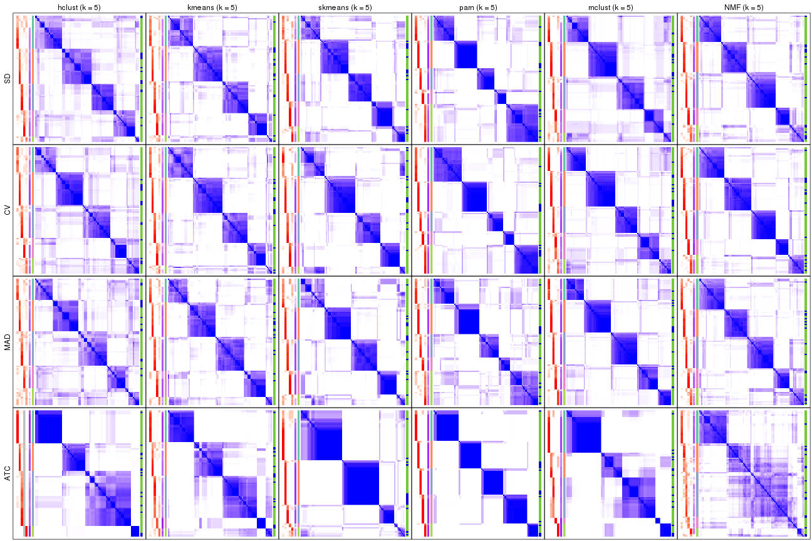</p>

</div>
<div id='tab-collect-consensus-heatmap-5'>
<pre><code class="r">collect_plots(res_list, k = 6, fun = consensus_heatmap, mc.cores = 4)
</code></pre>

<p></p>

</div>
</div>


### Membership heatmap

Membership heatmaps for all methods. ([What is a membership heatmap?](http://bioconductor.org/packages/devel/bioc/vignettes/cola/inst/doc/cola.html#toc_12))


<script>
$( function() {
	$( '#tabs-collect-membership-heatmap' ).tabs();
} );
</script>
<div id='tabs-collect-membership-heatmap'>
<ul>
<li><a href='#tab-collect-membership-heatmap-1'>k = 2</a></li>
<li><a href='#tab-collect-membership-heatmap-2'>k = 3</a></li>
<li><a href='#tab-collect-membership-heatmap-3'>k = 4</a></li>
<li><a href='#tab-collect-membership-heatmap-4'>k = 5</a></li>
<li><a href='#tab-collect-membership-heatmap-5'>k = 6</a></li>
</ul>
<div id='tab-collect-membership-heatmap-1'>
<pre><code class="r">collect_plots(res_list, k = 2, fun = membership_heatmap, mc.cores = 4)
</code></pre>

<p></p>

</div>
<div id='tab-collect-membership-heatmap-2'>
<pre><code class="r">collect_plots(res_list, k = 3, fun = membership_heatmap, mc.cores = 4)
</code></pre>

<p></p>

</div>
<div id='tab-collect-membership-heatmap-3'>
<pre><code class="r">collect_plots(res_list, k = 4, fun = membership_heatmap, mc.cores = 4)
</code></pre>

<p></p>

</div>
<div id='tab-collect-membership-heatmap-4'>
<pre><code class="r">collect_plots(res_list, k = 5, fun = membership_heatmap, mc.cores = 4)
</code></pre>

<p></p>

</div>
<div id='tab-collect-membership-heatmap-5'>
<pre><code class="r">collect_plots(res_list, k = 6, fun = membership_heatmap, mc.cores = 4)
</code></pre>

<p></p>

</div>
</div>


### Signature heatmap

Signature heatmaps for all methods. ([What is a signature heatmap?](http://bioconductor.org/packages/devel/bioc/vignettes/cola/inst/doc/cola.html#toc_22))


Note in following heatmaps, rows are scaled.


<script>
$( function() {
	$( '#tabs-collect-get-signatures' ).tabs();
} );
</script>
<div id='tabs-collect-get-signatures'>
<ul>
<li><a href='#tab-collect-get-signatures-1'>k = 2</a></li>
<li><a href='#tab-collect-get-signatures-2'>k = 3</a></li>
<li><a href='#tab-collect-get-signatures-3'>k = 4</a></li>
<li><a href='#tab-collect-get-signatures-4'>k = 5</a></li>
<li><a href='#tab-collect-get-signatures-5'>k = 6</a></li>
</ul>
<div id='tab-collect-get-signatures-1'>
<pre><code class="r">collect_plots(res_list, k = 2, fun = get_signatures, mc.cores = 4)
</code></pre>

<p></p>

</div>
<div id='tab-collect-get-signatures-2'>
<pre><code class="r">collect_plots(res_list, k = 3, fun = get_signatures, mc.cores = 4)
</code></pre>

<p></p>

</div>
<div id='tab-collect-get-signatures-3'>
<pre><code class="r">collect_plots(res_list, k = 4, fun = get_signatures, mc.cores = 4)
</code></pre>

<p></p>

</div>
<div id='tab-collect-get-signatures-4'>
<pre><code class="r">collect_plots(res_list, k = 5, fun = get_signatures, mc.cores = 4)
</code></pre>

<p></p>

</div>
<div id='tab-collect-get-signatures-5'>
<pre><code class="r">collect_plots(res_list, k = 6, fun = get_signatures, mc.cores = 4)
</code></pre>

<p></p>

</div>
</div>


### Statistics table

The statistics used for measuring the stability of consensus partitioning.
([How are they
defined?](http://bioconductor.org/packages/devel/bioc/vignettes/cola/inst/doc/cola.html#toc_13))


<script>
$( function() {
	$( '#tabs-get-stats-from-consensus-partition-list' ).tabs();
} );
</script>
<div id='tabs-get-stats-from-consensus-partition-list'>
<ul>
<li><a href='#tab-get-stats-from-consensus-partition-list-1'>k = 2</a></li>
<li><a href='#tab-get-stats-from-consensus-partition-list-2'>k = 3</a></li>
<li><a href='#tab-get-stats-from-consensus-partition-list-3'>k = 4</a></li>
<li><a href='#tab-get-stats-from-consensus-partition-list-4'>k = 5</a></li>
<li><a href='#tab-get-stats-from-consensus-partition-list-5'>k = 6</a></li>
</ul>
<div id='tab-get-stats-from-consensus-partition-list-1'>
<pre><code class="r">get_stats(res_list, k = 2)
</code></pre>

<pre><code>#&gt;             k 1-PAC mean_silhouette concordance area_increased  Rand Jaccard
#&gt; SD:NMF      2 0.594           0.864       0.920          0.498 0.498   0.498
#&gt; CV:NMF      2 0.855           0.923       0.967          0.502 0.498   0.498
#&gt; MAD:NMF     2 0.851           0.922       0.967          0.499 0.498   0.498
#&gt; ATC:NMF     2 0.854           0.920       0.966          0.474 0.526   0.526
#&gt; SD:skmeans  2 0.533           0.802       0.912          0.503 0.498   0.498
#&gt; CV:skmeans  2 0.556           0.891       0.935          0.505 0.496   0.496
#&gt; MAD:skmeans 2 0.580           0.851       0.929          0.505 0.496   0.496
#&gt; ATC:skmeans 2 0.956           0.939       0.975          0.494 0.509   0.509
#&gt; SD:mclust   2 0.231           0.673       0.776          0.372 0.667   0.667
#&gt; CV:mclust   2 0.893           0.915       0.955          0.335 0.692   0.692
#&gt; MAD:mclust  2 0.695           0.905       0.943          0.305 0.705   0.705
#&gt; ATC:mclust  2 0.679           0.855       0.900          0.299 0.643   0.643
#&gt; SD:kmeans   2 0.384           0.805       0.876          0.494 0.509   0.509
#&gt; CV:kmeans   2 0.544           0.875       0.920          0.500 0.496   0.496
#&gt; MAD:kmeans  2 0.455           0.809       0.891          0.496 0.500   0.500
#&gt; ATC:kmeans  2 1.000           1.000       1.000          0.469 0.532   0.532
#&gt; SD:pam      2 0.505           0.882       0.905          0.449 0.558   0.558
#&gt; CV:pam      2 0.351           0.601       0.812          0.456 0.532   0.532
#&gt; MAD:pam     2 0.531           0.830       0.890          0.456 0.558   0.558
#&gt; ATC:pam     2 1.000           0.998       0.999          0.450 0.551   0.551
#&gt; SD:hclust   2 0.362           0.757       0.878          0.490 0.505   0.505
#&gt; CV:hclust   2 0.265           0.703       0.834          0.462 0.497   0.497
#&gt; MAD:hclust  2 0.341           0.742       0.864          0.483 0.526   0.526
#&gt; ATC:hclust  2 0.891           0.929       0.968          0.416 0.582   0.582
</code></pre>

</div>
<div id='tab-get-stats-from-consensus-partition-list-2'>
<pre><code class="r">get_stats(res_list, k = 3)
</code></pre>

<pre><code>#&gt;             k 1-PAC mean_silhouette concordance area_increased  Rand Jaccard
#&gt; SD:NMF      3 0.847           0.912       0.960          0.343 0.728   0.506
#&gt; CV:NMF      3 0.870           0.859       0.940          0.329 0.741   0.525
#&gt; MAD:NMF     3 0.839           0.877       0.949          0.339 0.740   0.524
#&gt; ATC:NMF     3 0.819           0.891       0.946          0.376 0.745   0.547
#&gt; SD:skmeans  3 0.901           0.917       0.965          0.337 0.734   0.512
#&gt; CV:skmeans  3 0.889           0.895       0.958          0.329 0.708   0.477
#&gt; MAD:skmeans 3 0.943           0.947       0.977          0.331 0.718   0.490
#&gt; ATC:skmeans 3 0.931           0.893       0.961          0.281 0.827   0.672
#&gt; SD:mclust   3 0.568           0.829       0.859          0.588 0.699   0.562
#&gt; CV:mclust   3 0.606           0.846       0.890          0.726 0.668   0.537
#&gt; MAD:mclust  3 0.680           0.858       0.925          0.958 0.679   0.557
#&gt; ATC:mclust  3 0.637           0.847       0.926          0.743 0.668   0.541
#&gt; SD:kmeans   3 0.640           0.837       0.885          0.343 0.734   0.518
#&gt; CV:kmeans   3 0.597           0.825       0.871          0.326 0.714   0.487
#&gt; MAD:kmeans  3 0.677           0.841       0.900          0.348 0.741   0.524
#&gt; ATC:kmeans  3 0.969           0.931       0.963          0.393 0.670   0.454
#&gt; SD:pam      3 0.632           0.870       0.907          0.429 0.792   0.630
#&gt; CV:pam      3 0.678           0.866       0.906          0.447 0.696   0.480
#&gt; MAD:pam     3 0.638           0.716       0.835          0.435 0.772   0.596
#&gt; ATC:pam     3 0.868           0.880       0.955          0.455 0.697   0.494
#&gt; SD:hclust   3 0.411           0.730       0.830          0.313 0.819   0.647
#&gt; CV:hclust   3 0.296           0.430       0.653          0.358 0.730   0.507
#&gt; MAD:hclust  3 0.375           0.661       0.807          0.334 0.790   0.606
#&gt; ATC:hclust  3 0.617           0.885       0.897          0.510 0.764   0.595
</code></pre>

</div>
<div id='tab-get-stats-from-consensus-partition-list-3'>
<pre><code class="r">get_stats(res_list, k = 4)
</code></pre>

<pre><code>#&gt;             k 1-PAC mean_silhouette concordance area_increased  Rand Jaccard
#&gt; SD:NMF      4 0.837           0.855       0.939         0.1241 0.840   0.566
#&gt; CV:NMF      4 0.830           0.851       0.937         0.1297 0.824   0.532
#&gt; MAD:NMF     4 0.883           0.862       0.942         0.1274 0.832   0.549
#&gt; ATC:NMF     4 0.612           0.655       0.837         0.0747 0.875   0.679
#&gt; SD:skmeans  4 0.909           0.886       0.953         0.1195 0.845   0.574
#&gt; CV:skmeans  4 0.978           0.951       0.978         0.1244 0.843   0.570
#&gt; MAD:skmeans 4 0.893           0.898       0.953         0.1216 0.862   0.612
#&gt; ATC:skmeans 4 0.860           0.829       0.925         0.0988 0.917   0.781
#&gt; SD:mclust   4 0.783           0.836       0.923         0.2569 0.735   0.422
#&gt; CV:mclust   4 0.855           0.852       0.924         0.2885 0.772   0.487
#&gt; MAD:mclust  4 0.859           0.820       0.928         0.2601 0.713   0.399
#&gt; ATC:mclust  4 1.000           0.974       0.990         0.2963 0.680   0.424
#&gt; SD:kmeans   4 0.853           0.879       0.931         0.1297 0.845   0.576
#&gt; CV:kmeans   4 0.893           0.895       0.944         0.1352 0.857   0.602
#&gt; MAD:kmeans  4 0.867           0.849       0.931         0.1264 0.861   0.610
#&gt; ATC:kmeans  4 0.713           0.652       0.799         0.1136 0.835   0.577
#&gt; SD:pam      4 0.677           0.820       0.878         0.1267 0.915   0.764
#&gt; CV:pam      4 0.558           0.587       0.767         0.1136 0.900   0.715
#&gt; MAD:pam     4 0.567           0.477       0.728         0.1252 0.766   0.438
#&gt; ATC:pam     4 0.910           0.881       0.958         0.0826 0.907   0.741
#&gt; SD:hclust   4 0.529           0.665       0.790         0.1494 0.874   0.644
#&gt; CV:hclust   4 0.510           0.576       0.780         0.1692 0.792   0.470
#&gt; MAD:hclust  4 0.500           0.551       0.752         0.1469 0.835   0.554
#&gt; ATC:hclust  4 0.786           0.879       0.932         0.1068 0.951   0.861
</code></pre>

</div>
<div id='tab-get-stats-from-consensus-partition-list-4'>
<pre><code class="r">get_stats(res_list, k = 5)
</code></pre>

<pre><code>#&gt;             k 1-PAC mean_silhouette concordance area_increased  Rand Jaccard
#&gt; SD:NMF      5 0.741           0.719       0.852         0.0557 0.919   0.698
#&gt; CV:NMF      5 0.810           0.806       0.900         0.0558 0.932   0.740
#&gt; MAD:NMF     5 0.729           0.693       0.847         0.0576 0.900   0.635
#&gt; ATC:NMF     5 0.531           0.510       0.739         0.0713 0.783   0.445
#&gt; SD:skmeans  5 0.770           0.741       0.851         0.0585 0.893   0.615
#&gt; CV:skmeans  5 0.785           0.607       0.809         0.0546 0.961   0.848
#&gt; MAD:skmeans 5 0.812           0.647       0.820         0.0578 0.913   0.680
#&gt; ATC:skmeans 5 0.845           0.750       0.898         0.0365 0.941   0.822
#&gt; SD:mclust   5 0.642           0.677       0.826         0.0363 0.947   0.796
#&gt; CV:mclust   5 0.702           0.768       0.864         0.0490 0.923   0.713
#&gt; MAD:mclust  5 0.830           0.826       0.895         0.0490 0.918   0.692
#&gt; ATC:mclust  5 0.820           0.799       0.872         0.1112 0.897   0.700
#&gt; SD:kmeans   5 0.709           0.636       0.795         0.0628 0.955   0.825
#&gt; CV:kmeans   5 0.738           0.678       0.813         0.0572 0.971   0.884
#&gt; MAD:kmeans  5 0.718           0.650       0.798         0.0590 0.966   0.866
#&gt; ATC:kmeans  5 0.735           0.738       0.844         0.0546 0.896   0.667
#&gt; SD:pam      5 0.777           0.808       0.902         0.0880 0.871   0.584
#&gt; CV:pam      5 0.835           0.847       0.918         0.0709 0.915   0.699
#&gt; MAD:pam     5 0.715           0.723       0.846         0.0727 0.778   0.354
#&gt; ATC:pam     5 0.946           0.920       0.968         0.1216 0.882   0.610
#&gt; SD:hclust   5 0.627           0.607       0.764         0.0557 0.963   0.853
#&gt; CV:hclust   5 0.605           0.645       0.778         0.0686 0.941   0.770
#&gt; MAD:hclust  5 0.588           0.528       0.687         0.0613 0.907   0.656
#&gt; ATC:hclust  5 0.748           0.804       0.872         0.0771 1.000   1.000
</code></pre>

</div>
<div id='tab-get-stats-from-consensus-partition-list-5'>
<pre><code class="r">get_stats(res_list, k = 6)
</code></pre>

<pre><code>#&gt;             k 1-PAC mean_silhouette concordance area_increased  Rand Jaccard
#&gt; SD:NMF      6 0.678           0.591       0.767         0.0409 0.936   0.713
#&gt; CV:NMF      6 0.726           0.661       0.801         0.0436 0.935   0.707
#&gt; MAD:NMF     6 0.689           0.562       0.764         0.0408 0.908   0.599
#&gt; ATC:NMF     6 0.533           0.444       0.703         0.0486 0.899   0.653
#&gt; SD:skmeans  6 0.741           0.567       0.772         0.0410 0.965   0.834
#&gt; CV:skmeans  6 0.757           0.655       0.797         0.0389 0.923   0.683
#&gt; MAD:skmeans 6 0.749           0.515       0.747         0.0397 0.886   0.554
#&gt; ATC:skmeans 6 0.848           0.788       0.902         0.0328 0.938   0.800
#&gt; SD:mclust   6 0.759           0.715       0.804         0.0583 0.903   0.609
#&gt; CV:mclust   6 0.780           0.613       0.764         0.0414 0.930   0.692
#&gt; MAD:mclust  6 0.741           0.590       0.755         0.0423 0.941   0.745
#&gt; ATC:mclust  6 0.736           0.673       0.791         0.0538 0.879   0.583
#&gt; SD:kmeans   6 0.701           0.488       0.724         0.0402 0.938   0.737
#&gt; CV:kmeans   6 0.713           0.544       0.728         0.0410 0.931   0.705
#&gt; MAD:kmeans  6 0.692           0.573       0.734         0.0410 0.949   0.786
#&gt; ATC:kmeans  6 0.781           0.664       0.819         0.0376 0.975   0.904
#&gt; SD:pam      6 0.838           0.813       0.888         0.0434 0.937   0.723
#&gt; CV:pam      6 0.873           0.805       0.904         0.0439 0.961   0.815
#&gt; MAD:pam     6 0.776           0.739       0.867         0.0441 0.950   0.772
#&gt; ATC:pam     6 0.864           0.815       0.864         0.0378 0.954   0.784
#&gt; SD:hclust   6 0.654           0.510       0.666         0.0396 0.900   0.630
#&gt; CV:hclust   6 0.690           0.659       0.794         0.0381 0.938   0.725
#&gt; MAD:hclust  6 0.664           0.545       0.722         0.0457 0.944   0.744
#&gt; ATC:hclust  6 0.759           0.749       0.862         0.0309 0.907   0.700
</code></pre>

</div>
</div>

Following heatmap plots the partition for each combination of methods and the
lightness correspond to the silhouette scores for samples in each method. On
top the consensus subgroup is inferred from all methods by taking the mean
silhouette scores as weight.


<script>
$( function() {
	$( '#tabs-collect-stats-from-consensus-partition-list' ).tabs();
} );
</script>
<div id='tabs-collect-stats-from-consensus-partition-list'>
<ul>
<li><a href='#tab-collect-stats-from-consensus-partition-list-1'>k = 2</a></li>
<li><a href='#tab-collect-stats-from-consensus-partition-list-2'>k = 3</a></li>
<li><a href='#tab-collect-stats-from-consensus-partition-list-3'>k = 4</a></li>
<li><a href='#tab-collect-stats-from-consensus-partition-list-4'>k = 5</a></li>
<li><a href='#tab-collect-stats-from-consensus-partition-list-5'>k = 6</a></li>
</ul>
<div id='tab-collect-stats-from-consensus-partition-list-1'>
<pre><code class="r">collect_stats(res_list, k = 2)
</code></pre>

<p></p>

</div>
<div id='tab-collect-stats-from-consensus-partition-list-2'>
<pre><code class="r">collect_stats(res_list, k = 3)
</code></pre>

<p></p>

</div>
<div id='tab-collect-stats-from-consensus-partition-list-3'>
<pre><code class="r">collect_stats(res_list, k = 4)
</code></pre>

<p></p>

</div>
<div id='tab-collect-stats-from-consensus-partition-list-4'>
<pre><code class="r">collect_stats(res_list, k = 5)
</code></pre>

<p></p>

</div>
<div id='tab-collect-stats-from-consensus-partition-list-5'>
<pre><code class="r">collect_stats(res_list, k = 6)
</code></pre>

<p></p>

</div>
</div>

### Partition from all methods


Collect partitions from all methods:


<script>
$( function() {
	$( '#tabs-collect-classes-from-consensus-partition-list' ).tabs();
} );
</script>
<div id='tabs-collect-classes-from-consensus-partition-list'>
<ul>
<li><a href='#tab-collect-classes-from-consensus-partition-list-1'>k = 2</a></li>
<li><a href='#tab-collect-classes-from-consensus-partition-list-2'>k = 3</a></li>
<li><a href='#tab-collect-classes-from-consensus-partition-list-3'>k = 4</a></li>
<li><a href='#tab-collect-classes-from-consensus-partition-list-4'>k = 5</a></li>
<li><a href='#tab-collect-classes-from-consensus-partition-list-5'>k = 6</a></li>
</ul>
<div id='tab-collect-classes-from-consensus-partition-list-1'>
<pre><code class="r">collect_classes(res_list, k = 2)
</code></pre>

<p></p>

</div>
<div id='tab-collect-classes-from-consensus-partition-list-2'>
<pre><code class="r">collect_classes(res_list, k = 3)
</code></pre>

<p></p>

</div>
<div id='tab-collect-classes-from-consensus-partition-list-3'>
<pre><code class="r">collect_classes(res_list, k = 4)
</code></pre>

<p></p>

</div>
<div id='tab-collect-classes-from-consensus-partition-list-4'>
<pre><code class="r">collect_classes(res_list, k = 5)
</code></pre>

<p></p>

</div>
<div id='tab-collect-classes-from-consensus-partition-list-5'>
<pre><code class="r">collect_classes(res_list, k = 6)
</code></pre>

<p></p>

</div>
</div>


### Top rows overlap


Overlap of top rows from different top-row methods:


<script>
$( function() {
	$( '#tabs-top-rows-overlap-by-euler' ).tabs();
} );
</script>
<div id='tabs-top-rows-overlap-by-euler'>
<ul>
<li><a href='#tab-top-rows-overlap-by-euler-1'>top_n = 1000</a></li>
<li><a href='#tab-top-rows-overlap-by-euler-2'>top_n = 2000</a></li>
<li><a href='#tab-top-rows-overlap-by-euler-3'>top_n = 3000</a></li>
<li><a href='#tab-top-rows-overlap-by-euler-4'>top_n = 4000</a></li>
<li><a href='#tab-top-rows-overlap-by-euler-5'>top_n = 5000</a></li>
</ul>
<div id='tab-top-rows-overlap-by-euler-1'>
<pre><code class="r">top_rows_overlap(res_list, top_n = 1000, method = &quot;euler&quot;)
</code></pre>

<p></p>

</div>
<div id='tab-top-rows-overlap-by-euler-2'>
<pre><code class="r">top_rows_overlap(res_list, top_n = 2000, method = &quot;euler&quot;)
</code></pre>

<p></p>

</div>
<div id='tab-top-rows-overlap-by-euler-3'>
<pre><code class="r">top_rows_overlap(res_list, top_n = 3000, method = &quot;euler&quot;)
</code></pre>

<p></p>

</div>
<div id='tab-top-rows-overlap-by-euler-4'>
<pre><code class="r">top_rows_overlap(res_list, top_n = 4000, method = &quot;euler&quot;)
</code></pre>

<p></p>

</div>
<div id='tab-top-rows-overlap-by-euler-5'>
<pre><code class="r">top_rows_overlap(res_list, top_n = 5000, method = &quot;euler&quot;)
</code></pre>

<p></p>

</div>
</div>

Also visualize the correspondance of rankings between different top-row methods:


<script>
$( function() {
	$( '#tabs-top-rows-overlap-by-correspondance' ).tabs();
} );
</script>
<div id='tabs-top-rows-overlap-by-correspondance'>
<ul>
<li><a href='#tab-top-rows-overlap-by-correspondance-1'>top_n = 1000</a></li>
<li><a href='#tab-top-rows-overlap-by-correspondance-2'>top_n = 2000</a></li>
<li><a href='#tab-top-rows-overlap-by-correspondance-3'>top_n = 3000</a></li>
<li><a href='#tab-top-rows-overlap-by-correspondance-4'>top_n = 4000</a></li>
<li><a href='#tab-top-rows-overlap-by-correspondance-5'>top_n = 5000</a></li>
</ul>
<div id='tab-top-rows-overlap-by-correspondance-1'>
<pre><code class="r">top_rows_overlap(res_list, top_n = 1000, method = &quot;correspondance&quot;)
</code></pre>

<p></p>

</div>
<div id='tab-top-rows-overlap-by-correspondance-2'>
<pre><code class="r">top_rows_overlap(res_list, top_n = 2000, method = &quot;correspondance&quot;)
</code></pre>

<p></p>

</div>
<div id='tab-top-rows-overlap-by-correspondance-3'>
<pre><code class="r">top_rows_overlap(res_list, top_n = 3000, method = &quot;correspondance&quot;)
</code></pre>

<p></p>

</div>
<div id='tab-top-rows-overlap-by-correspondance-4'>
<pre><code class="r">top_rows_overlap(res_list, top_n = 4000, method = &quot;correspondance&quot;)
</code></pre>

<p></p>

</div>
<div id='tab-top-rows-overlap-by-correspondance-5'>
<pre><code class="r">top_rows_overlap(res_list, top_n = 5000, method = &quot;correspondance&quot;)
</code></pre>

<p></p>

</div>
</div>


Heatmaps of the top rows:


<script>
$( function() {
	$( '#tabs-top-rows-heatmap' ).tabs();
} );
</script>
<div id='tabs-top-rows-heatmap'>
<ul>
<li><a href='#tab-top-rows-heatmap-1'>top_n = 1000</a></li>
<li><a href='#tab-top-rows-heatmap-2'>top_n = 2000</a></li>
<li><a href='#tab-top-rows-heatmap-3'>top_n = 3000</a></li>
<li><a href='#tab-top-rows-heatmap-4'>top_n = 4000</a></li>
<li><a href='#tab-top-rows-heatmap-5'>top_n = 5000</a></li>
</ul>
<div id='tab-top-rows-heatmap-1'>
<pre><code class="r">top_rows_heatmap(res_list, top_n = 1000)
</code></pre>

<p></p>

</div>
<div id='tab-top-rows-heatmap-2'>
<pre><code class="r">top_rows_heatmap(res_list, top_n = 2000)
</code></pre>

<p></p>

</div>
<div id='tab-top-rows-heatmap-3'>
<pre><code class="r">top_rows_heatmap(res_list, top_n = 3000)
</code></pre>

<p></p>

</div>
<div id='tab-top-rows-heatmap-4'>
<pre><code class="r">top_rows_heatmap(res_list, top_n = 4000)
</code></pre>

<p></p>

</div>
<div id='tab-top-rows-heatmap-5'>
<pre><code class="r">top_rows_heatmap(res_list, top_n = 5000)
</code></pre>

<p>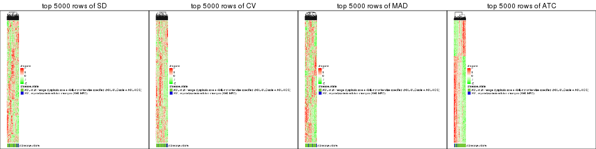</p>

</div>
</div>


### Test to known annotations


Test correlation between subgroups and known annotations. If the known
annotation is numeric, one-way ANOVA test is applied, and if the known
annotation is discrete, chi-squared contingency table test is applied.


<script>
$( function() {
	$( '#tabs-test-to-known-factors-from-consensus-partition-list' ).tabs();
} );
</script>
<div id='tabs-test-to-known-factors-from-consensus-partition-list'>
<ul>
<li><a href='#tab-test-to-known-factors-from-consensus-partition-list-1'>k = 2</a></li>
<li><a href='#tab-test-to-known-factors-from-consensus-partition-list-2'>k = 3</a></li>
<li><a href='#tab-test-to-known-factors-from-consensus-partition-list-3'>k = 4</a></li>
<li><a href='#tab-test-to-known-factors-from-consensus-partition-list-4'>k = 5</a></li>
<li><a href='#tab-test-to-known-factors-from-consensus-partition-list-5'>k = 6</a></li>
</ul>
<div id='tab-test-to-known-factors-from-consensus-partition-list-1'>
<pre><code class="r">test_to_known_factors(res_list, k = 2)
</code></pre>

<pre><code>#&gt;              n disease.state(p) k
#&gt; SD:NMF      93          0.15759 2
#&gt; CV:NMF      93          0.16845 2
#&gt; MAD:NMF     93          0.16845 2
#&gt; ATC:NMF     93          0.05564 2
#&gt; SD:skmeans  88          0.09371 2
#&gt; CV:skmeans  96          0.08257 2
#&gt; MAD:skmeans 91          0.32171 2
#&gt; ATC:skmeans 94          0.00489 2
#&gt; SD:mclust   86          0.03974 2
#&gt; CV:mclust   92          0.01120 2
#&gt; MAD:mclust  95          0.03988 2
#&gt; ATC:mclust  91          0.15114 2
#&gt; SD:kmeans   93          0.11088 2
#&gt; CV:kmeans   92          0.06722 2
#&gt; MAD:kmeans  91          0.12030 2
#&gt; ATC:kmeans  96          0.00792 2
#&gt; SD:pam      96          0.03175 2
#&gt; CV:pam      79          0.00627 2
#&gt; MAD:pam     96          0.03175 2
#&gt; ATC:pam     96          0.01549 2
#&gt; SD:hclust   88          0.17887 2
#&gt; CV:hclust   78          0.02883 2
#&gt; MAD:hclust  84          0.31190 2
#&gt; ATC:hclust  94          0.01788 2
</code></pre>

</div>
<div id='tab-test-to-known-factors-from-consensus-partition-list-2'>
<pre><code class="r">test_to_known_factors(res_list, k = 3)
</code></pre>

<pre><code>#&gt;              n disease.state(p) k
#&gt; SD:NMF      94          0.00109 3
#&gt; CV:NMF      87          0.00286 3
#&gt; MAD:NMF     89          0.00355 3
#&gt; ATC:NMF     93          0.08296 3
#&gt; SD:skmeans  92          0.00380 3
#&gt; CV:skmeans  90          0.00487 3
#&gt; MAD:skmeans 95          0.01400 3
#&gt; ATC:skmeans 88          0.00746 3
#&gt; SD:mclust   92          0.07742 3
#&gt; CV:mclust   92          0.07802 3
#&gt; MAD:mclust  92          0.05539 3
#&gt; ATC:mclust  93          0.00722 3
#&gt; SD:kmeans   94          0.00294 3
#&gt; CV:kmeans   95          0.00163 3
#&gt; MAD:kmeans  92          0.00583 3
#&gt; ATC:kmeans  93          0.02020 3
#&gt; SD:pam      96          0.01760 3
#&gt; CV:pam      93          0.01307 3
#&gt; MAD:pam     86          0.03394 3
#&gt; ATC:pam     87          0.03242 3
#&gt; SD:hclust   88          0.00937 3
#&gt; CV:hclust   45          0.00364 3
#&gt; MAD:hclust  77          0.01760 3
#&gt; ATC:hclust  93          0.01201 3
</code></pre>

</div>
<div id='tab-test-to-known-factors-from-consensus-partition-list-3'>
<pre><code class="r">test_to_known_factors(res_list, k = 4)
</code></pre>

<pre><code>#&gt;              n disease.state(p) k
#&gt; SD:NMF      91          0.00175 4
#&gt; CV:NMF      90          0.00647 4
#&gt; MAD:NMF     87          0.02678 4
#&gt; ATC:NMF     77          0.10852 4
#&gt; SD:skmeans  90          0.00526 4
#&gt; CV:skmeans  94          0.00837 4
#&gt; MAD:skmeans 91          0.00951 4
#&gt; ATC:skmeans 85          0.01221 4
#&gt; SD:mclust   90          0.01051 4
#&gt; CV:mclust   90          0.00700 4
#&gt; MAD:mclust  85          0.02228 4
#&gt; ATC:mclust  95          0.08616 4
#&gt; SD:kmeans   93          0.00365 4
#&gt; CV:kmeans   92          0.00399 4
#&gt; MAD:kmeans  90          0.02170 4
#&gt; ATC:kmeans  78          0.02206 4
#&gt; SD:pam      94          0.01651 4
#&gt; CV:pam      58          0.00437 4
#&gt; MAD:pam     42          0.23835 4
#&gt; ATC:pam     88          0.05583 4
#&gt; SD:hclust   80          0.00379 4
#&gt; CV:hclust   71          0.00905 4
#&gt; MAD:hclust  59          0.04033 4
#&gt; ATC:hclust  95          0.04500 4
</code></pre>

</div>
<div id='tab-test-to-known-factors-from-consensus-partition-list-4'>
<pre><code class="r">test_to_known_factors(res_list, k = 5)
</code></pre>

<pre><code>#&gt;              n disease.state(p) k
#&gt; SD:NMF      82          0.00174 5
#&gt; CV:NMF      88          0.00720 5
#&gt; MAD:NMF     79          0.00390 5
#&gt; ATC:NMF     58          0.07456 5
#&gt; SD:skmeans  80          0.01023 5
#&gt; CV:skmeans  70          0.02696 5
#&gt; MAD:skmeans 60          0.04834 5
#&gt; ATC:skmeans 80          0.00487 5
#&gt; SD:mclust   82          0.01921 5
#&gt; CV:mclust   85          0.01969 5
#&gt; MAD:mclust  91          0.04353 5
#&gt; ATC:mclust  92          0.02746 5
#&gt; SD:kmeans   80          0.02737 5
#&gt; CV:kmeans   83          0.01015 5
#&gt; MAD:kmeans  73          0.09287 5
#&gt; ATC:kmeans  89          0.07282 5
#&gt; SD:pam      91          0.05662 5
#&gt; CV:pam      91          0.00315 5
#&gt; MAD:pam     85          0.09371 5
#&gt; ATC:pam     94          0.07630 5
#&gt; SD:hclust   79          0.00935 5
#&gt; CV:hclust   76          0.00651 5
#&gt; MAD:hclust  65          0.02196 5
#&gt; ATC:hclust  90          0.02573 5
</code></pre>

</div>
<div id='tab-test-to-known-factors-from-consensus-partition-list-5'>
<pre><code class="r">test_to_known_factors(res_list, k = 6)
</code></pre>

<pre><code>#&gt;              n disease.state(p) k
#&gt; SD:NMF      63         0.012479 6
#&gt; CV:NMF      78         0.000966 6
#&gt; MAD:NMF     60         0.052354 6
#&gt; ATC:NMF     55         0.008631 6
#&gt; SD:skmeans  68         0.025212 6
#&gt; CV:skmeans  79         0.060624 6
#&gt; MAD:skmeans 48         0.169808 6
#&gt; ATC:skmeans 84         0.007724 6
#&gt; SD:mclust   86         0.017557 6
#&gt; CV:mclust   77         0.019197 6
#&gt; MAD:mclust  68         0.129013 6
#&gt; ATC:mclust  83         0.054006 6
#&gt; SD:kmeans   55         0.055655 6
#&gt; CV:kmeans   65         0.110184 6
#&gt; MAD:kmeans  72         0.046912 6
#&gt; ATC:kmeans  82         0.026727 6
#&gt; SD:pam      90         0.066235 6
#&gt; CV:pam      88         0.009861 6
#&gt; MAD:pam     85         0.097573 6
#&gt; ATC:pam     91         0.074429 6
#&gt; SD:hclust   57         0.033984 6
#&gt; CV:hclust   73         0.022096 6
#&gt; MAD:hclust  62         0.039231 6
#&gt; ATC:hclust  78         0.026070 6
</code></pre>

</div>
</div>


 
## Results for each method


---------------------------------------------------


### SD:hclust


The object with results only for a single top-value method and a single partition method 
can be extracted as:

```r
res = res_list["SD", "hclust"]
# you can also extract it by
# res = res_list["SD:hclust"]
```

A summary of `res` and all the functions that can be applied to it:

```r
res
```

```
#> A 'ConsensusPartition' object with k = 2, 3, 4, 5, 6.
#>   On a matrix with 51941 rows and 96 columns.
#>   Top rows (1000, 2000, 3000, 4000, 5000) are extracted by 'SD' method.
#>   Subgroups are detected by 'hclust' method.
#>   Performed in total 1250 partitions by row resampling.
#>   Best k for subgroups seems to be 2.
#> 
#> Following methods can be applied to this 'ConsensusPartition' object:
#>  [1] "cola_report"             "collect_classes"         "collect_plots"          
#>  [4] "collect_stats"           "colnames"                "compare_signatures"     
#>  [7] "consensus_heatmap"       "dimension_reduction"     "functional_enrichment"  
#> [10] "get_anno_col"            "get_anno"                "get_classes"            
#> [13] "get_consensus"           "get_matrix"              "get_membership"         
#> [16] "get_param"               "get_signatures"          "get_stats"              
#> [19] "is_best_k"               "is_stable_k"             "membership_heatmap"     
#> [22] "ncol"                    "nrow"                    "plot_ecdf"              
#> [25] "rownames"                "select_partition_number" "show"                   
#> [28] "suggest_best_k"          "test_to_known_factors"
```

`collect_plots()` function collects all the plots made from `res` for all `k` (number of partitions)
into one single page to provide an easy and fast comparison between different `k`.

```r
collect_plots(res)
```


The plots are:

- The first row: a plot of the ECDF (empirical cumulative distribution
  function) curves of the consensus matrix for each `k` and the heatmap of
  predicted classes for each `k`.
- The second row: heatmaps of the consensus matrix for each `k`.
- The third row: heatmaps of the membership matrix for each `k`.
- The fouth row: heatmaps of the signatures for each `k`.

All the plots in panels can be made by individual functions and they are
plotted later in this section.

`select_partition_number()` produces several plots showing different
statistics for choosing "optimized" `k`. There are following statistics:

- ECDF curves of the consensus matrix for each `k`;
- 1-PAC. [The PAC
  score](https://en.wikipedia.org/wiki/Consensus_clustering#Over-interpretation_potential_of_consensus_clustering)
  measures the proportion of the ambiguous subgrouping.
- Mean silhouette score.
- Concordance. The mean probability of fiting the consensus class ids in all
  partitions.
- Area increased. Denote $A_k$ as the area under the ECDF curve for current
  `k`, the area increased is defined as $A_k - A_{k-1}$.
- Rand index. The percent of pairs of samples that are both in a same cluster
  or both are not in a same cluster in the partition of k and k-1.
- Jaccard index. The ratio of pairs of samples are both in a same cluster in
  the partition of k and k-1 and the pairs of samples are both in a same
  cluster in the partition k or k-1.

The detailed explanations of these statistics can be found in [the _cola_
vignette](http://bioconductor.org/packages/devel/bioc/vignettes/cola/inst/doc/cola.html#toc_13).

Generally speaking, lower PAC score, higher mean silhouette score or higher
concordance corresponds to better partition. Rand index and Jaccard index
measure how similar the current partition is compared to partition with `k-1`.
If they are too similar, we won't accept `k` is better than `k-1`.

```r
select_partition_number(res)
```


The numeric values for all these statistics can be obtained by `get_stats()`.

```r
get_stats(res)
```

```
#>   k 1-PAC mean_silhouette concordance area_increased  Rand Jaccard
#> 2 2 0.362           0.757       0.878         0.4900 0.505   0.505
#> 3 3 0.411           0.730       0.830         0.3134 0.819   0.647
#> 4 4 0.529           0.665       0.790         0.1494 0.874   0.644
#> 5 5 0.627           0.607       0.764         0.0557 0.963   0.853
#> 6 6 0.654           0.510       0.666         0.0396 0.900   0.630
```

`suggest_best_k()` suggests the best $k$ based on these statistics. The rules are as follows:

- All $k$ with Jaccard index larger than 0.95 are removed because increasing
  $k$ does not provide enough extra information. If all $k$ are removed, it is
  marked as no subgroup is detected.
- For all $k$ with 1-PAC score larger than 0.9, the maximal $k$ is taken as
  the best $k$, and other $k$ are marked as optional $k$.
- If it does not fit the second rule. The $k$ with the maximal vote of the
  highest 1-PAC score, highest mean silhouette, and highest concordance is
  taken as the best $k$.

```r
suggest_best_k(res)
```

```
#> [1] 2
```


Following shows the table of the partitions (You need to click the **show/hide
code output** link to see it). The membership matrix (columns with name `p*`)
is inferred by
[`clue::cl_consensus()`](https://www.rdocumentation.org/link/cl_consensus?package=clue)
function with the `SE` method. Basically the value in the membership matrix
represents the probability to belong to a certain group. The finall class
label for an item is determined with the group with highest probability it
belongs to.

In `get_classes()` function, the entropy is calculated from the membership
matrix and the silhouette score is calculated from the consensus matrix.


<script>
$( function() {
	$( '#tabs-SD-hclust-get-classes' ).tabs();
} );
</script>
<div id='tabs-SD-hclust-get-classes'>
<ul>
<li><a href='#tab-SD-hclust-get-classes-1'>k = 2</a></li>
<li><a href='#tab-SD-hclust-get-classes-2'>k = 3</a></li>
<li><a href='#tab-SD-hclust-get-classes-3'>k = 4</a></li>
<li><a href='#tab-SD-hclust-get-classes-4'>k = 5</a></li>
<li><a href='#tab-SD-hclust-get-classes-5'>k = 6</a></li>
</ul>

<div id='tab-SD-hclust-get-classes-1'>
<p><a id='tab-SD-hclust-get-classes-1-a' style='color:#0366d6' href='#'>show/hide code output</a></p>
<pre><code class="r">cbind(get_classes(res, k = 2), get_membership(res, k = 2))
</code></pre>

<pre><code>#&gt;           class entropy silhouette    p1    p2
#&gt; GSM531600     2  0.1414     0.8341 0.020 0.980
#&gt; GSM531601     2  0.7674     0.7479 0.224 0.776
#&gt; GSM531605     1  0.3879     0.8724 0.924 0.076
#&gt; GSM531615     2  0.9491     0.5371 0.368 0.632
#&gt; GSM531617     2  0.9522     0.5290 0.372 0.628
#&gt; GSM531624     2  0.5842     0.8030 0.140 0.860
#&gt; GSM531627     2  0.0376     0.8315 0.004 0.996
#&gt; GSM531629     2  0.9552     0.5199 0.376 0.624
#&gt; GSM531631     2  0.5842     0.8030 0.140 0.860
#&gt; GSM531634     2  0.9522     0.5290 0.372 0.628
#&gt; GSM531636     2  0.1414     0.8341 0.020 0.980
#&gt; GSM531637     2  0.5842     0.8030 0.140 0.860
#&gt; GSM531654     2  0.9000     0.6398 0.316 0.684
#&gt; GSM531655     1  0.4562     0.8582 0.904 0.096
#&gt; GSM531658     1  0.0938     0.8969 0.988 0.012
#&gt; GSM531660     1  0.2778     0.8850 0.952 0.048
#&gt; GSM531602     1  0.0000     0.8938 1.000 0.000
#&gt; GSM531603     1  0.0000     0.8938 1.000 0.000
#&gt; GSM531604     1  0.6343     0.7762 0.840 0.160
#&gt; GSM531606     1  0.0672     0.8953 0.992 0.008
#&gt; GSM531607     1  0.0000     0.8938 1.000 0.000
#&gt; GSM531608     2  0.8267     0.7076 0.260 0.740
#&gt; GSM531609     1  0.0938     0.8969 0.988 0.012
#&gt; GSM531610     1  0.0938     0.8969 0.988 0.012
#&gt; GSM531611     1  0.0938     0.8969 0.988 0.012
#&gt; GSM531612     1  0.0938     0.8969 0.988 0.012
#&gt; GSM531613     1  0.0938     0.8969 0.988 0.012
#&gt; GSM531614     1  0.0938     0.8969 0.988 0.012
#&gt; GSM531616     2  0.0376     0.8318 0.004 0.996
#&gt; GSM531618     1  0.5178     0.8322 0.884 0.116
#&gt; GSM531619     2  0.5842     0.8030 0.140 0.860
#&gt; GSM531620     2  0.2778     0.8324 0.048 0.952
#&gt; GSM531621     2  0.0938     0.8332 0.012 0.988
#&gt; GSM531622     2  0.5842     0.8030 0.140 0.860
#&gt; GSM531623     2  0.5842     0.8030 0.140 0.860
#&gt; GSM531625     2  0.0000     0.8303 0.000 1.000
#&gt; GSM531626     2  0.0376     0.8318 0.004 0.996
#&gt; GSM531628     2  0.2423     0.8309 0.040 0.960
#&gt; GSM531630     2  0.5842     0.8030 0.140 0.860
#&gt; GSM531632     2  0.0376     0.8318 0.004 0.996
#&gt; GSM531633     2  0.0938     0.8332 0.012 0.988
#&gt; GSM531635     2  0.0376     0.8318 0.004 0.996
#&gt; GSM531638     2  0.0376     0.8318 0.004 0.996
#&gt; GSM531639     2  0.2948     0.8299 0.052 0.948
#&gt; GSM531640     2  0.5519     0.8089 0.128 0.872
#&gt; GSM531641     1  0.0938     0.8969 0.988 0.012
#&gt; GSM531642     1  0.9000     0.5593 0.684 0.316
#&gt; GSM531643     2  0.6712     0.7867 0.176 0.824
#&gt; GSM531644     1  0.9000     0.5593 0.684 0.316
#&gt; GSM531645     1  0.0938     0.8969 0.988 0.012
#&gt; GSM531646     2  0.0376     0.8318 0.004 0.996
#&gt; GSM531647     2  0.0376     0.8318 0.004 0.996
#&gt; GSM531648     1  0.3879     0.8672 0.924 0.076
#&gt; GSM531649     2  0.0376     0.8318 0.004 0.996
#&gt; GSM531650     2  0.2423     0.8309 0.040 0.960
#&gt; GSM531651     2  0.4562     0.8194 0.096 0.904
#&gt; GSM531652     1  0.6801     0.7824 0.820 0.180
#&gt; GSM531653     2  0.0376     0.8318 0.004 0.996
#&gt; GSM531656     2  0.3431     0.8269 0.064 0.936
#&gt; GSM531657     1  0.5059     0.8305 0.888 0.112
#&gt; GSM531659     1  0.8861     0.5463 0.696 0.304
#&gt; GSM531661     2  0.8207     0.7145 0.256 0.744
#&gt; GSM531662     2  0.7376     0.7331 0.208 0.792
#&gt; GSM531663     1  0.4690     0.8393 0.900 0.100
#&gt; GSM531664     2  0.2423     0.8309 0.040 0.960
#&gt; GSM531665     1  0.9815     0.2285 0.580 0.420
#&gt; GSM531666     1  0.9491     0.4353 0.632 0.368
#&gt; GSM531667     2  0.8144     0.7166 0.252 0.748
#&gt; GSM531668     1  0.4431     0.8500 0.908 0.092
#&gt; GSM531669     2  0.0672     0.8324 0.008 0.992
#&gt; GSM531670     2  0.3431     0.8269 0.064 0.936
#&gt; GSM531671     2  0.7376     0.7326 0.208 0.792
#&gt; GSM531672     1  0.0938     0.8969 0.988 0.012
#&gt; GSM531673     2  0.7376     0.7326 0.208 0.792
#&gt; GSM531674     2  0.0672     0.8324 0.008 0.992
#&gt; GSM531675     1  0.0376     0.8949 0.996 0.004
#&gt; GSM531676     2  0.9996     0.0813 0.488 0.512
#&gt; GSM531677     1  0.2778     0.8821 0.952 0.048
#&gt; GSM531678     1  0.1184     0.8949 0.984 0.016
#&gt; GSM531679     1  0.2948     0.8807 0.948 0.052
#&gt; GSM531680     2  0.9815     0.2898 0.420 0.580
#&gt; GSM531681     1  0.0000     0.8938 1.000 0.000
#&gt; GSM531682     1  0.2948     0.8807 0.948 0.052
#&gt; GSM531683     1  0.0000     0.8938 1.000 0.000
#&gt; GSM531684     1  0.1843     0.8922 0.972 0.028
#&gt; GSM531685     2  0.5519     0.7946 0.128 0.872
#&gt; GSM531686     1  0.0000     0.8938 1.000 0.000
#&gt; GSM531687     2  0.9996     0.0813 0.488 0.512
#&gt; GSM531688     2  0.2423     0.8315 0.040 0.960
#&gt; GSM531689     2  0.9996     0.0813 0.488 0.512
#&gt; GSM531690     1  0.0000     0.8938 1.000 0.000
#&gt; GSM531691     1  1.0000    -0.0911 0.500 0.500
#&gt; GSM531692     2  0.6048     0.7884 0.148 0.852
#&gt; GSM531693     2  0.4939     0.8079 0.108 0.892
#&gt; GSM531694     1  0.0000     0.8938 1.000 0.000
#&gt; GSM531695     2  0.9993     0.1302 0.484 0.516
</code></pre>

<script>
$('#tab-SD-hclust-get-classes-1-a').parent().next().next().hide();
$('#tab-SD-hclust-get-classes-1-a').click(function(){
  $('#tab-SD-hclust-get-classes-1-a').parent().next().next().toggle();
  return(false);
});
</script>
</div>

<div id='tab-SD-hclust-get-classes-2'>
<p><a id='tab-SD-hclust-get-classes-2-a' style='color:#0366d6' href='#'>show/hide code output</a></p>
<pre><code class="r">cbind(get_classes(res, k = 3), get_membership(res, k = 3))
</code></pre>

<pre><code>#&gt;           class entropy silhouette    p1    p2    p3
#&gt; GSM531600     3  0.3459      0.794 0.012 0.096 0.892
#&gt; GSM531601     2  0.3293      0.784 0.088 0.900 0.012
#&gt; GSM531605     1  0.5974      0.814 0.784 0.148 0.068
#&gt; GSM531615     2  0.4931      0.675 0.232 0.768 0.000
#&gt; GSM531617     2  0.4974      0.670 0.236 0.764 0.000
#&gt; GSM531624     2  0.0983      0.804 0.004 0.980 0.016
#&gt; GSM531627     2  0.4605      0.712 0.000 0.796 0.204
#&gt; GSM531629     2  0.5016      0.664 0.240 0.760 0.000
#&gt; GSM531631     2  0.0983      0.804 0.004 0.980 0.016
#&gt; GSM531634     2  0.4974      0.670 0.236 0.764 0.000
#&gt; GSM531636     3  0.3459      0.794 0.012 0.096 0.892
#&gt; GSM531637     2  0.0983      0.804 0.004 0.980 0.016
#&gt; GSM531654     2  0.6662      0.723 0.192 0.736 0.072
#&gt; GSM531655     1  0.6144      0.809 0.780 0.132 0.088
#&gt; GSM531658     1  0.1015      0.845 0.980 0.008 0.012
#&gt; GSM531660     1  0.4915      0.800 0.804 0.184 0.012
#&gt; GSM531602     1  0.5722      0.818 0.800 0.132 0.068
#&gt; GSM531603     1  0.5631      0.819 0.804 0.132 0.064
#&gt; GSM531604     1  0.8241      0.687 0.636 0.160 0.204
#&gt; GSM531606     1  0.6001      0.811 0.784 0.144 0.072
#&gt; GSM531607     1  0.5631      0.819 0.804 0.132 0.064
#&gt; GSM531608     2  0.6025      0.763 0.140 0.784 0.076
#&gt; GSM531609     1  0.1015      0.845 0.980 0.008 0.012
#&gt; GSM531610     1  0.1015      0.845 0.980 0.008 0.012
#&gt; GSM531611     1  0.1015      0.845 0.980 0.008 0.012
#&gt; GSM531612     1  0.1015      0.845 0.980 0.008 0.012
#&gt; GSM531613     1  0.1015      0.845 0.980 0.008 0.012
#&gt; GSM531614     1  0.1015      0.845 0.980 0.008 0.012
#&gt; GSM531616     3  0.3941      0.748 0.000 0.156 0.844
#&gt; GSM531618     1  0.4602      0.808 0.852 0.108 0.040
#&gt; GSM531619     2  0.0983      0.804 0.004 0.980 0.016
#&gt; GSM531620     2  0.6057      0.726 0.044 0.760 0.196
#&gt; GSM531621     2  0.4555      0.717 0.000 0.800 0.200
#&gt; GSM531622     2  0.0983      0.804 0.004 0.980 0.016
#&gt; GSM531623     2  0.0983      0.804 0.004 0.980 0.016
#&gt; GSM531625     2  0.4702      0.704 0.000 0.788 0.212
#&gt; GSM531626     2  0.4654      0.709 0.000 0.792 0.208
#&gt; GSM531628     3  0.3356      0.801 0.036 0.056 0.908
#&gt; GSM531630     2  0.0983      0.804 0.004 0.980 0.016
#&gt; GSM531632     3  0.2356      0.799 0.000 0.072 0.928
#&gt; GSM531633     2  0.4555      0.717 0.000 0.800 0.200
#&gt; GSM531635     3  0.3686      0.759 0.000 0.140 0.860
#&gt; GSM531638     3  0.3941      0.748 0.000 0.156 0.844
#&gt; GSM531639     3  0.6905      0.554 0.044 0.280 0.676
#&gt; GSM531640     2  0.2050      0.803 0.020 0.952 0.028
#&gt; GSM531641     1  0.1015      0.845 0.980 0.008 0.012
#&gt; GSM531642     1  0.6653      0.544 0.680 0.032 0.288
#&gt; GSM531643     3  0.6229      0.706 0.172 0.064 0.764
#&gt; GSM531644     1  0.6653      0.544 0.680 0.032 0.288
#&gt; GSM531645     1  0.1015      0.845 0.980 0.008 0.012
#&gt; GSM531646     3  0.2537      0.797 0.000 0.080 0.920
#&gt; GSM531647     3  0.2356      0.799 0.000 0.072 0.928
#&gt; GSM531648     1  0.3589      0.834 0.900 0.052 0.048
#&gt; GSM531649     3  0.2356      0.799 0.000 0.072 0.928
#&gt; GSM531650     3  0.3356      0.801 0.036 0.056 0.908
#&gt; GSM531651     2  0.2066      0.795 0.000 0.940 0.060
#&gt; GSM531652     1  0.5173      0.763 0.816 0.036 0.148
#&gt; GSM531653     3  0.2356      0.799 0.000 0.072 0.928
#&gt; GSM531656     3  0.4807      0.787 0.060 0.092 0.848
#&gt; GSM531657     1  0.4418      0.790 0.848 0.132 0.020
#&gt; GSM531659     1  0.8043      0.569 0.644 0.228 0.128
#&gt; GSM531661     2  0.5677      0.772 0.124 0.804 0.072
#&gt; GSM531662     2  0.8896      0.557 0.172 0.564 0.264
#&gt; GSM531663     1  0.3973      0.809 0.880 0.088 0.032
#&gt; GSM531664     3  0.3356      0.801 0.036 0.056 0.908
#&gt; GSM531665     1  0.9217      0.258 0.492 0.344 0.164
#&gt; GSM531666     1  0.7084      0.419 0.628 0.036 0.336
#&gt; GSM531667     2  0.5810      0.770 0.132 0.796 0.072
#&gt; GSM531668     1  0.4139      0.815 0.860 0.124 0.016
#&gt; GSM531669     3  0.2590      0.800 0.004 0.072 0.924
#&gt; GSM531670     3  0.4807      0.787 0.060 0.092 0.848
#&gt; GSM531671     2  0.8950      0.545 0.172 0.556 0.272
#&gt; GSM531672     1  0.1015      0.845 0.980 0.008 0.012
#&gt; GSM531673     2  0.8924      0.550 0.172 0.560 0.268
#&gt; GSM531674     3  0.2590      0.800 0.004 0.072 0.924
#&gt; GSM531675     1  0.2280      0.848 0.940 0.008 0.052
#&gt; GSM531676     3  0.7490      0.231 0.380 0.044 0.576
#&gt; GSM531677     1  0.4636      0.836 0.852 0.044 0.104
#&gt; GSM531678     1  0.6122      0.807 0.776 0.152 0.072
#&gt; GSM531679     1  0.4994      0.832 0.836 0.052 0.112
#&gt; GSM531680     3  0.6333      0.388 0.332 0.012 0.656
#&gt; GSM531681     1  0.2301      0.846 0.936 0.004 0.060
#&gt; GSM531682     1  0.4994      0.832 0.836 0.052 0.112
#&gt; GSM531683     1  0.5377      0.827 0.820 0.112 0.068
#&gt; GSM531684     1  0.6295      0.802 0.764 0.164 0.072
#&gt; GSM531685     3  0.2599      0.759 0.052 0.016 0.932
#&gt; GSM531686     1  0.2301      0.846 0.936 0.004 0.060
#&gt; GSM531687     3  0.7490      0.231 0.380 0.044 0.576
#&gt; GSM531688     3  0.1765      0.797 0.004 0.040 0.956
#&gt; GSM531689     3  0.7490      0.231 0.380 0.044 0.576
#&gt; GSM531690     1  0.2486      0.846 0.932 0.008 0.060
#&gt; GSM531691     3  0.8131      0.198 0.376 0.076 0.548
#&gt; GSM531692     3  0.3797      0.738 0.056 0.052 0.892
#&gt; GSM531693     3  0.2793      0.769 0.044 0.028 0.928
#&gt; GSM531694     1  0.5722      0.818 0.800 0.132 0.068
#&gt; GSM531695     3  0.6769      0.237 0.392 0.016 0.592
</code></pre>

<script>
$('#tab-SD-hclust-get-classes-2-a').parent().next().next().hide();
$('#tab-SD-hclust-get-classes-2-a').click(function(){
  $('#tab-SD-hclust-get-classes-2-a').parent().next().next().toggle();
  return(false);
});
</script>
</div>

<div id='tab-SD-hclust-get-classes-3'>
<p><a id='tab-SD-hclust-get-classes-3-a' style='color:#0366d6' href='#'>show/hide code output</a></p>
<pre><code class="r">cbind(get_classes(res, k = 4), get_membership(res, k = 4))
</code></pre>

<pre><code>#&gt;           class entropy silhouette    p1    p2    p3    p4
#&gt; GSM531600     3  0.2718     0.8520 0.020 0.056 0.912 0.012
#&gt; GSM531601     2  0.3272     0.7868 0.052 0.884 0.004 0.060
#&gt; GSM531605     1  0.7219    -0.1080 0.456 0.068 0.028 0.448
#&gt; GSM531615     2  0.5484     0.7065 0.104 0.732 0.000 0.164
#&gt; GSM531617     2  0.5527     0.7035 0.104 0.728 0.000 0.168
#&gt; GSM531624     2  0.0921     0.8135 0.028 0.972 0.000 0.000
#&gt; GSM531627     2  0.3946     0.7532 0.020 0.812 0.168 0.000
#&gt; GSM531629     2  0.5569     0.6986 0.104 0.724 0.000 0.172
#&gt; GSM531631     2  0.0921     0.8135 0.028 0.972 0.000 0.000
#&gt; GSM531634     2  0.5527     0.7035 0.104 0.728 0.000 0.168
#&gt; GSM531636     3  0.2718     0.8520 0.020 0.056 0.912 0.012
#&gt; GSM531637     2  0.0921     0.8135 0.028 0.972 0.000 0.000
#&gt; GSM531654     2  0.6760     0.7108 0.184 0.680 0.056 0.080
#&gt; GSM531655     4  0.7496     0.0405 0.440 0.072 0.040 0.448
#&gt; GSM531658     4  0.1557     0.7736 0.056 0.000 0.000 0.944
#&gt; GSM531660     4  0.6889     0.4832 0.252 0.144 0.004 0.600
#&gt; GSM531602     1  0.2483     0.6965 0.916 0.052 0.000 0.032
#&gt; GSM531603     1  0.3088     0.6899 0.888 0.052 0.000 0.060
#&gt; GSM531604     1  0.5048     0.6531 0.788 0.068 0.128 0.016
#&gt; GSM531606     1  0.2443     0.6963 0.916 0.060 0.000 0.024
#&gt; GSM531607     1  0.3088     0.6899 0.888 0.052 0.000 0.060
#&gt; GSM531608     2  0.5557     0.7701 0.088 0.776 0.048 0.088
#&gt; GSM531609     4  0.0469     0.7852 0.012 0.000 0.000 0.988
#&gt; GSM531610     4  0.0469     0.7852 0.012 0.000 0.000 0.988
#&gt; GSM531611     4  0.0921     0.7817 0.028 0.000 0.000 0.972
#&gt; GSM531612     4  0.0469     0.7852 0.012 0.000 0.000 0.988
#&gt; GSM531613     4  0.0469     0.7852 0.012 0.000 0.000 0.988
#&gt; GSM531614     4  0.0469     0.7852 0.012 0.000 0.000 0.988
#&gt; GSM531616     3  0.3501     0.8043 0.020 0.132 0.848 0.000
#&gt; GSM531618     4  0.6652     0.6424 0.172 0.076 0.060 0.692
#&gt; GSM531619     2  0.0921     0.8135 0.028 0.972 0.000 0.000
#&gt; GSM531620     2  0.5120     0.7619 0.036 0.776 0.160 0.028
#&gt; GSM531621     2  0.3900     0.7562 0.020 0.816 0.164 0.000
#&gt; GSM531622     2  0.0921     0.8135 0.028 0.972 0.000 0.000
#&gt; GSM531623     2  0.0921     0.8135 0.028 0.972 0.000 0.000
#&gt; GSM531625     2  0.4035     0.7452 0.020 0.804 0.176 0.000
#&gt; GSM531626     2  0.3991     0.7495 0.020 0.808 0.172 0.000
#&gt; GSM531628     3  0.1118     0.8571 0.000 0.000 0.964 0.036
#&gt; GSM531630     2  0.0921     0.8135 0.028 0.972 0.000 0.000
#&gt; GSM531632     3  0.0000     0.8634 0.000 0.000 1.000 0.000
#&gt; GSM531633     2  0.3900     0.7562 0.020 0.816 0.164 0.000
#&gt; GSM531635     3  0.2988     0.8226 0.012 0.112 0.876 0.000
#&gt; GSM531638     3  0.3501     0.8043 0.020 0.132 0.848 0.000
#&gt; GSM531639     3  0.5992     0.6068 0.020 0.260 0.676 0.044
#&gt; GSM531640     2  0.1297     0.8136 0.016 0.964 0.000 0.020
#&gt; GSM531641     4  0.0469     0.7852 0.012 0.000 0.000 0.988
#&gt; GSM531642     4  0.6002     0.5623 0.044 0.012 0.296 0.648
#&gt; GSM531643     3  0.4360     0.7408 0.032 0.012 0.816 0.140
#&gt; GSM531644     4  0.6002     0.5623 0.044 0.012 0.296 0.648
#&gt; GSM531645     4  0.0469     0.7852 0.012 0.000 0.000 0.988
#&gt; GSM531646     3  0.0336     0.8634 0.000 0.008 0.992 0.000
#&gt; GSM531647     3  0.0000     0.8634 0.000 0.000 1.000 0.000
#&gt; GSM531648     4  0.4291     0.7522 0.068 0.028 0.060 0.844
#&gt; GSM531649     3  0.0000     0.8634 0.000 0.000 1.000 0.000
#&gt; GSM531650     3  0.1118     0.8571 0.000 0.000 0.964 0.036
#&gt; GSM531651     2  0.1256     0.8142 0.008 0.964 0.028 0.000
#&gt; GSM531652     4  0.5460     0.6923 0.072 0.016 0.156 0.756
#&gt; GSM531653     3  0.0000     0.8634 0.000 0.000 1.000 0.000
#&gt; GSM531656     3  0.4085     0.8321 0.020 0.068 0.852 0.060
#&gt; GSM531657     4  0.7138     0.3496 0.316 0.124 0.008 0.552
#&gt; GSM531659     1  0.9147     0.1887 0.420 0.212 0.092 0.276
#&gt; GSM531661     2  0.5303     0.7793 0.088 0.792 0.052 0.068
#&gt; GSM531662     2  0.8192     0.5968 0.168 0.560 0.200 0.072
#&gt; GSM531663     4  0.6479     0.4466 0.256 0.080 0.016 0.648
#&gt; GSM531664     3  0.1118     0.8571 0.000 0.000 0.964 0.036
#&gt; GSM531665     1  0.9231     0.0990 0.384 0.332 0.108 0.176
#&gt; GSM531666     4  0.6161     0.4474 0.044 0.008 0.356 0.592
#&gt; GSM531667     2  0.5490     0.7771 0.092 0.780 0.048 0.080
#&gt; GSM531668     4  0.5079     0.6818 0.116 0.104 0.004 0.776
#&gt; GSM531669     3  0.0188     0.8633 0.000 0.000 0.996 0.004
#&gt; GSM531670     3  0.4085     0.8321 0.020 0.068 0.852 0.060
#&gt; GSM531671     2  0.8250     0.5882 0.168 0.552 0.208 0.072
#&gt; GSM531672     4  0.1637     0.7731 0.060 0.000 0.000 0.940
#&gt; GSM531673     2  0.8222     0.5921 0.168 0.556 0.204 0.072
#&gt; GSM531674     3  0.0188     0.8633 0.000 0.000 0.996 0.004
#&gt; GSM531675     1  0.4072     0.5839 0.748 0.000 0.000 0.252
#&gt; GSM531676     1  0.5447     0.0689 0.528 0.008 0.460 0.004
#&gt; GSM531677     1  0.3463     0.6739 0.864 0.000 0.040 0.096
#&gt; GSM531678     1  0.2222     0.6958 0.924 0.060 0.000 0.016
#&gt; GSM531679     1  0.3128     0.6806 0.884 0.000 0.040 0.076
#&gt; GSM531680     3  0.6166     0.1916 0.412 0.008 0.544 0.036
#&gt; GSM531681     1  0.4522     0.4988 0.680 0.000 0.000 0.320
#&gt; GSM531682     1  0.3128     0.6806 0.884 0.000 0.040 0.076
#&gt; GSM531683     1  0.3081     0.6934 0.888 0.048 0.000 0.064
#&gt; GSM531684     1  0.2450     0.6947 0.912 0.072 0.000 0.016
#&gt; GSM531685     3  0.3770     0.7749 0.136 0.016 0.840 0.008
#&gt; GSM531686     1  0.4522     0.4988 0.680 0.000 0.000 0.320
#&gt; GSM531687     1  0.5447     0.0689 0.528 0.008 0.460 0.004
#&gt; GSM531688     3  0.1489     0.8513 0.044 0.000 0.952 0.004
#&gt; GSM531689     1  0.5447     0.0689 0.528 0.008 0.460 0.004
#&gt; GSM531690     1  0.3837     0.6087 0.776 0.000 0.000 0.224
#&gt; GSM531691     1  0.5908     0.1093 0.536 0.028 0.432 0.004
#&gt; GSM531692     3  0.4781     0.7315 0.188 0.032 0.772 0.008
#&gt; GSM531693     3  0.3494     0.7945 0.116 0.016 0.860 0.008
#&gt; GSM531694     1  0.2483     0.6965 0.916 0.052 0.000 0.032
#&gt; GSM531695     3  0.6265     0.0559 0.444 0.000 0.500 0.056
</code></pre>

<script>
$('#tab-SD-hclust-get-classes-3-a').parent().next().next().hide();
$('#tab-SD-hclust-get-classes-3-a').click(function(){
  $('#tab-SD-hclust-get-classes-3-a').parent().next().next().toggle();
  return(false);
});
</script>
</div>

<div id='tab-SD-hclust-get-classes-4'>
<p><a id='tab-SD-hclust-get-classes-4-a' style='color:#0366d6' href='#'>show/hide code output</a></p>
<pre><code class="r">cbind(get_classes(res, k = 5), get_membership(res, k = 5))
</code></pre>

<pre><code>#&gt;           class entropy silhouette    p1    p2    p3    p4    p5
#&gt; GSM531600     3  0.2685    0.78946 0.000 0.028 0.880 0.000 0.092
#&gt; GSM531601     2  0.3005    0.76841 0.040 0.884 0.000 0.028 0.048
#&gt; GSM531605     1  0.6845    0.02520 0.460 0.016 0.000 0.340 0.184
#&gt; GSM531615     2  0.5864    0.68956 0.064 0.692 0.000 0.116 0.128
#&gt; GSM531617     2  0.5908    0.68651 0.064 0.688 0.000 0.120 0.128
#&gt; GSM531624     2  0.0290    0.79640 0.008 0.992 0.000 0.000 0.000
#&gt; GSM531627     2  0.4169    0.72565 0.000 0.784 0.100 0.000 0.116
#&gt; GSM531629     2  0.5950    0.68154 0.064 0.684 0.000 0.124 0.128
#&gt; GSM531631     2  0.0290    0.79640 0.008 0.992 0.000 0.000 0.000
#&gt; GSM531634     2  0.5908    0.68651 0.064 0.688 0.000 0.120 0.128
#&gt; GSM531636     3  0.2685    0.78946 0.000 0.028 0.880 0.000 0.092
#&gt; GSM531637     2  0.0290    0.79640 0.008 0.992 0.000 0.000 0.000
#&gt; GSM531654     2  0.6912    0.66226 0.176 0.592 0.012 0.044 0.176
#&gt; GSM531655     1  0.7218    0.01044 0.440 0.020 0.008 0.340 0.192
#&gt; GSM531658     4  0.3578    0.73635 0.048 0.000 0.000 0.820 0.132
#&gt; GSM531660     4  0.7752    0.45797 0.232 0.128 0.000 0.480 0.160
#&gt; GSM531602     1  0.0324    0.64194 0.992 0.004 0.000 0.004 0.000
#&gt; GSM531603     1  0.1116    0.64248 0.964 0.004 0.000 0.028 0.004
#&gt; GSM531604     1  0.3816    0.56319 0.828 0.016 0.056 0.000 0.100
#&gt; GSM531606     1  0.0566    0.63989 0.984 0.012 0.000 0.000 0.004
#&gt; GSM531607     1  0.1116    0.64248 0.964 0.004 0.000 0.028 0.004
#&gt; GSM531608     2  0.4956    0.74393 0.008 0.736 0.012 0.060 0.184
#&gt; GSM531609     4  0.0000    0.76167 0.000 0.000 0.000 1.000 0.000
#&gt; GSM531610     4  0.0000    0.76167 0.000 0.000 0.000 1.000 0.000
#&gt; GSM531611     4  0.0510    0.75647 0.016 0.000 0.000 0.984 0.000
#&gt; GSM531612     4  0.0000    0.76167 0.000 0.000 0.000 1.000 0.000
#&gt; GSM531613     4  0.0000    0.76167 0.000 0.000 0.000 1.000 0.000
#&gt; GSM531614     4  0.0000    0.76167 0.000 0.000 0.000 1.000 0.000
#&gt; GSM531616     3  0.3970    0.69169 0.000 0.104 0.800 0.000 0.096
#&gt; GSM531618     4  0.7763    0.58839 0.168 0.060 0.056 0.556 0.160
#&gt; GSM531619     2  0.0290    0.79640 0.008 0.992 0.000 0.000 0.000
#&gt; GSM531620     2  0.4970    0.73000 0.000 0.744 0.100 0.020 0.136
#&gt; GSM531621     2  0.4111    0.72981 0.000 0.788 0.092 0.000 0.120
#&gt; GSM531622     2  0.0290    0.79640 0.008 0.992 0.000 0.000 0.000
#&gt; GSM531623     2  0.0290    0.79640 0.008 0.992 0.000 0.000 0.000
#&gt; GSM531625     2  0.4266    0.71906 0.000 0.776 0.104 0.000 0.120
#&gt; GSM531626     2  0.4216    0.72362 0.000 0.780 0.100 0.000 0.120
#&gt; GSM531628     3  0.0992    0.81531 0.000 0.000 0.968 0.008 0.024
#&gt; GSM531630     2  0.0290    0.79640 0.008 0.992 0.000 0.000 0.000
#&gt; GSM531632     3  0.0162    0.82398 0.000 0.000 0.996 0.000 0.004
#&gt; GSM531633     2  0.4111    0.72981 0.000 0.788 0.092 0.000 0.120
#&gt; GSM531635     3  0.3354    0.74161 0.000 0.088 0.844 0.000 0.068
#&gt; GSM531638     3  0.3970    0.69169 0.000 0.104 0.800 0.000 0.096
#&gt; GSM531639     3  0.5988    0.40863 0.000 0.232 0.628 0.020 0.120
#&gt; GSM531640     2  0.1211    0.79612 0.000 0.960 0.000 0.016 0.024
#&gt; GSM531641     4  0.0000    0.76167 0.000 0.000 0.000 1.000 0.000
#&gt; GSM531642     4  0.6396    0.48744 0.004 0.004 0.284 0.544 0.164
#&gt; GSM531643     3  0.4063    0.62997 0.004 0.004 0.808 0.080 0.104
#&gt; GSM531644     4  0.6396    0.48744 0.004 0.004 0.284 0.544 0.164
#&gt; GSM531645     4  0.0000    0.76167 0.000 0.000 0.000 1.000 0.000
#&gt; GSM531646     3  0.0579    0.82498 0.000 0.008 0.984 0.000 0.008
#&gt; GSM531647     3  0.0162    0.82398 0.000 0.000 0.996 0.000 0.004
#&gt; GSM531648     4  0.5640    0.71424 0.052 0.016 0.056 0.720 0.156
#&gt; GSM531649     3  0.0290    0.82471 0.000 0.000 0.992 0.000 0.008
#&gt; GSM531650     3  0.0992    0.81531 0.000 0.000 0.968 0.008 0.024
#&gt; GSM531651     2  0.1281    0.79321 0.000 0.956 0.012 0.000 0.032
#&gt; GSM531652     4  0.6071    0.64390 0.016 0.004 0.144 0.636 0.200
#&gt; GSM531653     3  0.0290    0.82471 0.000 0.000 0.992 0.000 0.008
#&gt; GSM531656     3  0.4136    0.74873 0.000 0.040 0.808 0.032 0.120
#&gt; GSM531657     4  0.7735    0.30454 0.304 0.104 0.004 0.456 0.132
#&gt; GSM531659     1  0.9099    0.17137 0.364 0.180 0.044 0.216 0.196
#&gt; GSM531661     2  0.4507    0.75545 0.012 0.772 0.008 0.044 0.164
#&gt; GSM531662     2  0.7685    0.55176 0.068 0.500 0.084 0.044 0.304
#&gt; GSM531663     4  0.6394    0.41247 0.196 0.072 0.000 0.632 0.100
#&gt; GSM531664     3  0.0992    0.81531 0.000 0.000 0.968 0.008 0.024
#&gt; GSM531665     1  0.9096    0.00541 0.304 0.296 0.048 0.124 0.228
#&gt; GSM531666     4  0.6471    0.36650 0.004 0.000 0.348 0.480 0.168
#&gt; GSM531667     2  0.4711    0.75266 0.008 0.760 0.012 0.056 0.164
#&gt; GSM531668     4  0.6144    0.64763 0.104 0.048 0.000 0.644 0.204
#&gt; GSM531669     3  0.0510    0.81552 0.000 0.000 0.984 0.000 0.016
#&gt; GSM531670     3  0.4136    0.74873 0.000 0.040 0.808 0.032 0.120
#&gt; GSM531671     2  0.7741    0.54256 0.068 0.492 0.088 0.044 0.308
#&gt; GSM531672     4  0.3692    0.73483 0.052 0.000 0.000 0.812 0.136
#&gt; GSM531673     2  0.7697    0.54813 0.068 0.496 0.084 0.044 0.308
#&gt; GSM531674     3  0.0510    0.81552 0.000 0.000 0.984 0.000 0.016
#&gt; GSM531675     1  0.3491    0.59133 0.768 0.000 0.000 0.228 0.004
#&gt; GSM531676     1  0.6618   -0.25509 0.400 0.000 0.216 0.000 0.384
#&gt; GSM531677     1  0.3725    0.62712 0.840 0.000 0.024 0.056 0.080
#&gt; GSM531678     1  0.0807    0.63909 0.976 0.012 0.000 0.000 0.012
#&gt; GSM531679     1  0.3477    0.62749 0.852 0.000 0.024 0.036 0.088
#&gt; GSM531680     5  0.7298    0.31443 0.328 0.000 0.320 0.020 0.332
#&gt; GSM531681     1  0.3816    0.51540 0.696 0.000 0.000 0.304 0.000
#&gt; GSM531682     1  0.3477    0.62749 0.852 0.000 0.024 0.036 0.088
#&gt; GSM531683     1  0.1329    0.64653 0.956 0.008 0.000 0.032 0.004
#&gt; GSM531684     1  0.1117    0.63720 0.964 0.016 0.000 0.000 0.020
#&gt; GSM531685     5  0.4949    0.67793 0.032 0.000 0.396 0.000 0.572
#&gt; GSM531686     1  0.3816    0.51540 0.696 0.000 0.000 0.304 0.000
#&gt; GSM531687     1  0.6618   -0.25509 0.400 0.000 0.216 0.000 0.384
#&gt; GSM531688     3  0.2416    0.68554 0.012 0.000 0.888 0.000 0.100
#&gt; GSM531689     1  0.6618   -0.25509 0.400 0.000 0.216 0.000 0.384
#&gt; GSM531690     1  0.3266    0.60255 0.796 0.000 0.000 0.200 0.004
#&gt; GSM531691     1  0.6900   -0.22976 0.412 0.012 0.204 0.000 0.372
#&gt; GSM531692     5  0.4844    0.65289 0.044 0.008 0.256 0.000 0.692
#&gt; GSM531693     5  0.4824    0.58631 0.020 0.000 0.468 0.000 0.512
#&gt; GSM531694     1  0.0324    0.64194 0.992 0.004 0.000 0.004 0.000
#&gt; GSM531695     1  0.7288   -0.37148 0.344 0.000 0.300 0.020 0.336
</code></pre>

<script>
$('#tab-SD-hclust-get-classes-4-a').parent().next().next().hide();
$('#tab-SD-hclust-get-classes-4-a').click(function(){
  $('#tab-SD-hclust-get-classes-4-a').parent().next().next().toggle();
  return(false);
});
</script>
</div>

<div id='tab-SD-hclust-get-classes-5'>
<p><a id='tab-SD-hclust-get-classes-5-a' style='color:#0366d6' href='#'>show/hide code output</a></p>
<pre><code class="r">cbind(get_classes(res, k = 6), get_membership(res, k = 6))
</code></pre>

<pre><code>#&gt;           class entropy silhouette    p1    p2    p3    p4    p5 p6
#&gt; GSM531600     3  0.3442     0.8314 0.000 0.020 0.848 0.036 0.072 NA
#&gt; GSM531601     2  0.2218     0.7109 0.000 0.884 0.000 0.104 0.000 NA
#&gt; GSM531605     4  0.6964     0.2353 0.076 0.012 0.000 0.452 0.320 NA
#&gt; GSM531615     2  0.5279     0.5928 0.016 0.576 0.000 0.332 0.000 NA
#&gt; GSM531617     2  0.5291     0.5899 0.016 0.572 0.000 0.336 0.000 NA
#&gt; GSM531624     2  0.0000     0.7453 0.000 1.000 0.000 0.000 0.000 NA
#&gt; GSM531627     2  0.4892     0.6859 0.000 0.760 0.060 0.044 0.084 NA
#&gt; GSM531629     2  0.5303     0.5850 0.016 0.568 0.000 0.340 0.000 NA
#&gt; GSM531631     2  0.0146     0.7444 0.000 0.996 0.000 0.004 0.000 NA
#&gt; GSM531634     2  0.5291     0.5899 0.016 0.572 0.000 0.336 0.000 NA
#&gt; GSM531636     3  0.3442     0.8314 0.000 0.020 0.848 0.036 0.072 NA
#&gt; GSM531637     2  0.0000     0.7453 0.000 1.000 0.000 0.000 0.000 NA
#&gt; GSM531654     2  0.7151     0.5461 0.024 0.480 0.000 0.240 0.068 NA
#&gt; GSM531655     4  0.7008     0.2356 0.072 0.016 0.000 0.448 0.324 NA
#&gt; GSM531658     4  0.5133     0.5797 0.332 0.000 0.000 0.576 0.004 NA
#&gt; GSM531660     4  0.6677     0.4449 0.108 0.124 0.000 0.612 0.088 NA
#&gt; GSM531602     1  0.5890     0.2982 0.468 0.000 0.000 0.012 0.376 NA
#&gt; GSM531603     1  0.6140     0.2998 0.476 0.000 0.000 0.028 0.352 NA
#&gt; GSM531604     5  0.5816    -0.1645 0.324 0.004 0.000 0.016 0.536 NA
#&gt; GSM531606     1  0.5928     0.2881 0.452 0.000 0.000 0.012 0.388 NA
#&gt; GSM531607     1  0.6140     0.2998 0.476 0.000 0.000 0.028 0.352 NA
#&gt; GSM531608     2  0.5849     0.6554 0.020 0.620 0.000 0.240 0.040 NA
#&gt; GSM531609     1  0.4735    -0.0138 0.520 0.000 0.000 0.048 0.000 NA
#&gt; GSM531610     1  0.4735    -0.0138 0.520 0.000 0.000 0.048 0.000 NA
#&gt; GSM531611     1  0.4671    -0.0163 0.532 0.000 0.000 0.044 0.000 NA
#&gt; GSM531612     1  0.4735    -0.0138 0.520 0.000 0.000 0.048 0.000 NA
#&gt; GSM531613     1  0.4735    -0.0138 0.520 0.000 0.000 0.048 0.000 NA
#&gt; GSM531614     1  0.4735    -0.0138 0.520 0.000 0.000 0.048 0.000 NA
#&gt; GSM531616     3  0.4632     0.7600 0.000 0.092 0.768 0.032 0.084 NA
#&gt; GSM531618     4  0.7437     0.5819 0.224 0.052 0.052 0.540 0.076 NA
#&gt; GSM531619     2  0.0000     0.7453 0.000 1.000 0.000 0.000 0.000 NA
#&gt; GSM531620     2  0.5826     0.6851 0.000 0.684 0.064 0.120 0.084 NA
#&gt; GSM531621     2  0.4835     0.6886 0.000 0.764 0.056 0.044 0.084 NA
#&gt; GSM531622     2  0.0260     0.7456 0.000 0.992 0.000 0.008 0.000 NA
#&gt; GSM531623     2  0.0000     0.7453 0.000 1.000 0.000 0.000 0.000 NA
#&gt; GSM531625     2  0.4997     0.6798 0.000 0.752 0.064 0.044 0.088 NA
#&gt; GSM531626     2  0.4948     0.6833 0.000 0.756 0.064 0.044 0.084 NA
#&gt; GSM531628     3  0.0972     0.8559 0.000 0.000 0.964 0.028 0.008 NA
#&gt; GSM531630     2  0.0146     0.7444 0.000 0.996 0.000 0.004 0.000 NA
#&gt; GSM531632     3  0.0000     0.8622 0.000 0.000 1.000 0.000 0.000 NA
#&gt; GSM531633     2  0.4835     0.6886 0.000 0.764 0.056 0.044 0.084 NA
#&gt; GSM531635     3  0.3936     0.7974 0.000 0.076 0.812 0.020 0.076 NA
#&gt; GSM531638     3  0.4632     0.7600 0.000 0.092 0.768 0.032 0.084 NA
#&gt; GSM531639     3  0.6512     0.5464 0.000 0.216 0.588 0.076 0.084 NA
#&gt; GSM531640     2  0.1508     0.7430 0.016 0.948 0.000 0.020 0.004 NA
#&gt; GSM531641     1  0.4735    -0.0138 0.520 0.000 0.000 0.048 0.000 NA
#&gt; GSM531642     4  0.6771     0.5532 0.180 0.000 0.272 0.480 0.004 NA
#&gt; GSM531643     3  0.3752     0.7274 0.024 0.000 0.792 0.160 0.008 NA
#&gt; GSM531644     4  0.6771     0.5532 0.180 0.000 0.272 0.480 0.004 NA
#&gt; GSM531645     1  0.4735    -0.0138 0.520 0.000 0.000 0.048 0.000 NA
#&gt; GSM531646     3  0.0405     0.8628 0.000 0.008 0.988 0.000 0.000 NA
#&gt; GSM531647     3  0.0000     0.8622 0.000 0.000 1.000 0.000 0.000 NA
#&gt; GSM531648     4  0.5640     0.6339 0.252 0.008 0.056 0.624 0.000 NA
#&gt; GSM531649     3  0.0146     0.8629 0.000 0.000 0.996 0.000 0.004 NA
#&gt; GSM531650     3  0.0972     0.8559 0.000 0.000 0.964 0.028 0.008 NA
#&gt; GSM531651     2  0.1508     0.7426 0.000 0.948 0.004 0.016 0.020 NA
#&gt; GSM531652     4  0.6077     0.6202 0.188 0.000 0.132 0.608 0.004 NA
#&gt; GSM531653     3  0.0146     0.8629 0.000 0.000 0.996 0.000 0.004 NA
#&gt; GSM531656     3  0.4696     0.7979 0.000 0.032 0.768 0.072 0.092 NA
#&gt; GSM531657     4  0.7676     0.3531 0.280 0.096 0.000 0.440 0.116 NA
#&gt; GSM531659     5  0.8657     0.0683 0.212 0.156 0.008 0.264 0.292 NA
#&gt; GSM531661     2  0.5210     0.6680 0.004 0.664 0.000 0.228 0.036 NA
#&gt; GSM531662     2  0.8225     0.4641 0.028 0.388 0.032 0.264 0.188 NA
#&gt; GSM531663     1  0.7835    -0.0449 0.432 0.056 0.000 0.140 0.124 NA
#&gt; GSM531664     3  0.0972     0.8559 0.000 0.000 0.964 0.028 0.008 NA
#&gt; GSM531665     5  0.8541     0.0885 0.136 0.256 0.008 0.236 0.304 NA
#&gt; GSM531666     4  0.6841     0.4428 0.168 0.000 0.332 0.440 0.012 NA
#&gt; GSM531667     2  0.5495     0.6653 0.016 0.652 0.000 0.228 0.036 NA
#&gt; GSM531668     4  0.4389     0.5391 0.156 0.008 0.000 0.748 0.008 NA
#&gt; GSM531669     3  0.0692     0.8561 0.000 0.000 0.976 0.000 0.020 NA
#&gt; GSM531670     3  0.4696     0.7979 0.000 0.032 0.768 0.072 0.092 NA
#&gt; GSM531671     2  0.8330     0.4544 0.028 0.380 0.040 0.264 0.188 NA
#&gt; GSM531672     4  0.5108     0.5839 0.324 0.000 0.000 0.584 0.004 NA
#&gt; GSM531673     2  0.8279     0.4596 0.028 0.384 0.036 0.264 0.188 NA
#&gt; GSM531674     3  0.0692     0.8561 0.000 0.000 0.976 0.000 0.020 NA
#&gt; GSM531675     1  0.4257     0.3143 0.652 0.000 0.000 0.012 0.320 NA
#&gt; GSM531676     5  0.1267     0.5725 0.000 0.000 0.060 0.000 0.940 NA
#&gt; GSM531677     1  0.5459     0.2657 0.520 0.000 0.004 0.068 0.392 NA
#&gt; GSM531678     1  0.5747     0.2874 0.460 0.000 0.000 0.008 0.400 NA
#&gt; GSM531679     1  0.5621     0.2563 0.500 0.000 0.004 0.068 0.404 NA
#&gt; GSM531680     5  0.4684     0.5211 0.020 0.000 0.188 0.020 0.728 NA
#&gt; GSM531681     1  0.4670     0.3040 0.636 0.000 0.000 0.000 0.292 NA
#&gt; GSM531682     1  0.5621     0.2563 0.500 0.000 0.004 0.068 0.404 NA
#&gt; GSM531683     1  0.5735     0.3087 0.504 0.000 0.000 0.024 0.376 NA
#&gt; GSM531684     1  0.6010     0.2739 0.452 0.004 0.000 0.016 0.400 NA
#&gt; GSM531685     5  0.5946     0.3938 0.000 0.000 0.204 0.004 0.472 NA
#&gt; GSM531686     1  0.4670     0.3040 0.636 0.000 0.000 0.000 0.292 NA
#&gt; GSM531687     5  0.1267     0.5725 0.000 0.000 0.060 0.000 0.940 NA
#&gt; GSM531688     3  0.2302     0.7720 0.000 0.000 0.872 0.000 0.120 NA
#&gt; GSM531689     5  0.1267     0.5725 0.000 0.000 0.060 0.000 0.940 NA
#&gt; GSM531690     1  0.3805     0.3199 0.664 0.000 0.000 0.004 0.328 NA
#&gt; GSM531691     5  0.2302     0.5613 0.004 0.004 0.056 0.012 0.908 NA
#&gt; GSM531692     5  0.5131     0.4043 0.000 0.004 0.048 0.016 0.576 NA
#&gt; GSM531693     5  0.6227     0.3331 0.000 0.000 0.300 0.004 0.376 NA
#&gt; GSM531694     1  0.5890     0.2982 0.468 0.000 0.000 0.012 0.376 NA
#&gt; GSM531695     5  0.5922     0.4534 0.028 0.000 0.196 0.072 0.644 NA
</code></pre>

<script>
$('#tab-SD-hclust-get-classes-5-a').parent().next().next().hide();
$('#tab-SD-hclust-get-classes-5-a').click(function(){
  $('#tab-SD-hclust-get-classes-5-a').parent().next().next().toggle();
  return(false);
});
</script>
</div>
</div>

Heatmaps for the consensus matrix. It visualizes the probability of two
samples to be in a same group.


<script>
$( function() {
	$( '#tabs-SD-hclust-consensus-heatmap' ).tabs();
} );
</script>
<div id='tabs-SD-hclust-consensus-heatmap'>
<ul>
<li><a href='#tab-SD-hclust-consensus-heatmap-1'>k = 2</a></li>
<li><a href='#tab-SD-hclust-consensus-heatmap-2'>k = 3</a></li>
<li><a href='#tab-SD-hclust-consensus-heatmap-3'>k = 4</a></li>
<li><a href='#tab-SD-hclust-consensus-heatmap-4'>k = 5</a></li>
<li><a href='#tab-SD-hclust-consensus-heatmap-5'>k = 6</a></li>
</ul>
<div id='tab-SD-hclust-consensus-heatmap-1'>
<pre><code class="r">consensus_heatmap(res, k = 2)
</code></pre>

<p></p>

</div>
<div id='tab-SD-hclust-consensus-heatmap-2'>
<pre><code class="r">consensus_heatmap(res, k = 3)
</code></pre>

<p></p>

</div>
<div id='tab-SD-hclust-consensus-heatmap-3'>
<pre><code class="r">consensus_heatmap(res, k = 4)
</code></pre>

<p></p>

</div>
<div id='tab-SD-hclust-consensus-heatmap-4'>
<pre><code class="r">consensus_heatmap(res, k = 5)
</code></pre>

<p></p>

</div>
<div id='tab-SD-hclust-consensus-heatmap-5'>
<pre><code class="r">consensus_heatmap(res, k = 6)
</code></pre>

<p></p>

</div>
</div>

Heatmaps for the membership of samples in all partitions to see how consistent they are:


<script>
$( function() {
	$( '#tabs-SD-hclust-membership-heatmap' ).tabs();
} );
</script>
<div id='tabs-SD-hclust-membership-heatmap'>
<ul>
<li><a href='#tab-SD-hclust-membership-heatmap-1'>k = 2</a></li>
<li><a href='#tab-SD-hclust-membership-heatmap-2'>k = 3</a></li>
<li><a href='#tab-SD-hclust-membership-heatmap-3'>k = 4</a></li>
<li><a href='#tab-SD-hclust-membership-heatmap-4'>k = 5</a></li>
<li><a href='#tab-SD-hclust-membership-heatmap-5'>k = 6</a></li>
</ul>
<div id='tab-SD-hclust-membership-heatmap-1'>
<pre><code class="r">membership_heatmap(res, k = 2)
</code></pre>

<p></p>

</div>
<div id='tab-SD-hclust-membership-heatmap-2'>
<pre><code class="r">membership_heatmap(res, k = 3)
</code></pre>

<p></p>

</div>
<div id='tab-SD-hclust-membership-heatmap-3'>
<pre><code class="r">membership_heatmap(res, k = 4)
</code></pre>

<p></p>

</div>
<div id='tab-SD-hclust-membership-heatmap-4'>
<pre><code class="r">membership_heatmap(res, k = 5)
</code></pre>

<p></p>

</div>
<div id='tab-SD-hclust-membership-heatmap-5'>
<pre><code class="r">membership_heatmap(res, k = 6)
</code></pre>

<p></p>

</div>
</div>

As soon as we have had the classes for columns, we can look for signatures
which are significantly different between classes which can be candidate marks
for certain classes. Following are the heatmaps for signatures.


Signature heatmaps where rows are scaled:


<script>
$( function() {
	$( '#tabs-SD-hclust-get-signatures' ).tabs();
} );
</script>
<div id='tabs-SD-hclust-get-signatures'>
<ul>
<li><a href='#tab-SD-hclust-get-signatures-1'>k = 2</a></li>
<li><a href='#tab-SD-hclust-get-signatures-2'>k = 3</a></li>
<li><a href='#tab-SD-hclust-get-signatures-3'>k = 4</a></li>
<li><a href='#tab-SD-hclust-get-signatures-4'>k = 5</a></li>
<li><a href='#tab-SD-hclust-get-signatures-5'>k = 6</a></li>
</ul>
<div id='tab-SD-hclust-get-signatures-1'>
<pre><code class="r">get_signatures(res, k = 2)
</code></pre>

<pre><code>#&gt; Error: The width or height of the raster image is zero, maybe you forget to turn off the
#&gt; previous graphic device or it was corrupted. Run `dev.off()` to close it.
</code></pre>

<p></p>

</div>
<div id='tab-SD-hclust-get-signatures-2'>
<pre><code class="r">get_signatures(res, k = 3)
</code></pre>

<pre><code>#&gt; Error: The width or height of the raster image is zero, maybe you forget to turn off the
#&gt; previous graphic device or it was corrupted. Run `dev.off()` to close it.
</code></pre>

<p></p>

</div>
<div id='tab-SD-hclust-get-signatures-3'>
<pre><code class="r">get_signatures(res, k = 4)
</code></pre>

<pre><code>#&gt; Error: The width or height of the raster image is zero, maybe you forget to turn off the
#&gt; previous graphic device or it was corrupted. Run `dev.off()` to close it.
</code></pre>

<p></p>

</div>
<div id='tab-SD-hclust-get-signatures-4'>
<pre><code class="r">get_signatures(res, k = 5)
</code></pre>

<pre><code>#&gt; Error: The width or height of the raster image is zero, maybe you forget to turn off the
#&gt; previous graphic device or it was corrupted. Run `dev.off()` to close it.
</code></pre>

<p></p>

</div>
<div id='tab-SD-hclust-get-signatures-5'>
<pre><code class="r">get_signatures(res, k = 6)
</code></pre>

<pre><code>#&gt; Error: The width or height of the raster image is zero, maybe you forget to turn off the
#&gt; previous graphic device or it was corrupted. Run `dev.off()` to close it.
</code></pre>

<p></p>

</div>
</div>


Signature heatmaps where rows are not scaled:


<script>
$( function() {
	$( '#tabs-SD-hclust-get-signatures-no-scale' ).tabs();
} );
</script>
<div id='tabs-SD-hclust-get-signatures-no-scale'>
<ul>
<li><a href='#tab-SD-hclust-get-signatures-no-scale-1'>k = 2</a></li>
<li><a href='#tab-SD-hclust-get-signatures-no-scale-2'>k = 3</a></li>
<li><a href='#tab-SD-hclust-get-signatures-no-scale-3'>k = 4</a></li>
<li><a href='#tab-SD-hclust-get-signatures-no-scale-4'>k = 5</a></li>
<li><a href='#tab-SD-hclust-get-signatures-no-scale-5'>k = 6</a></li>
</ul>
<div id='tab-SD-hclust-get-signatures-no-scale-1'>
<pre><code class="r">get_signatures(res, k = 2, scale_rows = FALSE)
</code></pre>

<pre><code>#&gt; Error: The width or height of the raster image is zero, maybe you forget to turn off the
#&gt; previous graphic device or it was corrupted. Run `dev.off()` to close it.
</code></pre>

<p></p>

</div>
<div id='tab-SD-hclust-get-signatures-no-scale-2'>
<pre><code class="r">get_signatures(res, k = 3, scale_rows = FALSE)
</code></pre>

<pre><code>#&gt; Error: The width or height of the raster image is zero, maybe you forget to turn off the
#&gt; previous graphic device or it was corrupted. Run `dev.off()` to close it.
</code></pre>

<p></p>

</div>
<div id='tab-SD-hclust-get-signatures-no-scale-3'>
<pre><code class="r">get_signatures(res, k = 4, scale_rows = FALSE)
</code></pre>

<pre><code>#&gt; Error: The width or height of the raster image is zero, maybe you forget to turn off the
#&gt; previous graphic device or it was corrupted. Run `dev.off()` to close it.
</code></pre>

<p></p>

</div>
<div id='tab-SD-hclust-get-signatures-no-scale-4'>
<pre><code class="r">get_signatures(res, k = 5, scale_rows = FALSE)
</code></pre>

<pre><code>#&gt; Error: The width or height of the raster image is zero, maybe you forget to turn off the
#&gt; previous graphic device or it was corrupted. Run `dev.off()` to close it.
</code></pre>

<p></p>

</div>
<div id='tab-SD-hclust-get-signatures-no-scale-5'>
<pre><code class="r">get_signatures(res, k = 6, scale_rows = FALSE)
</code></pre>

<pre><code>#&gt; Error: The width or height of the raster image is zero, maybe you forget to turn off the
#&gt; previous graphic device or it was corrupted. Run `dev.off()` to close it.
</code></pre>

<p></p>

</div>
</div>


Compare the overlap of signatures from different k:

```r
compare_signatures(res)
```


`get_signature()` returns a data frame invisibly. TO get the list of signatures, the function
call should be assigned to a variable explicitly. In following code, if `plot` argument is set
to `FALSE`, no heatmap is plotted while only the differential analysis is performed.

```r
# code only for demonstration
tb = get_signature(res, k = ..., plot = FALSE)
```

An example of the output of `tb` is:

```
#>   which_row         fdr    mean_1    mean_2 scaled_mean_1 scaled_mean_2 km
#> 1        38 0.042760348  8.373488  9.131774    -0.5533452     0.5164555  1
#> 2        40 0.018707592  7.106213  8.469186    -0.6173731     0.5762149  1
#> 3        55 0.019134737 10.221463 11.207825    -0.6159697     0.5749050  1
#> 4        59 0.006059896  5.921854  7.869574    -0.6899429     0.6439467  1
#> 5        60 0.018055526  8.928898 10.211722    -0.6204761     0.5791110  1
#> 6        98 0.009384629 15.714769 14.887706     0.6635654    -0.6193277  2
...
```

The columns in `tb` are:

1. `which_row`: row indices corresponding to the input matrix.
2. `fdr`: FDR for the differential test. 
3. `mean_x`: The mean value in group x.
4. `scaled_mean_x`: The mean value in group x after rows are scaled.
5. `km`: Row groups if k-means clustering is applied to rows.


UMAP plot which shows how samples are separated.


<script>
$( function() {
	$( '#tabs-SD-hclust-dimension-reduction' ).tabs();
} );
</script>
<div id='tabs-SD-hclust-dimension-reduction'>
<ul>
<li><a href='#tab-SD-hclust-dimension-reduction-1'>k = 2</a></li>
<li><a href='#tab-SD-hclust-dimension-reduction-2'>k = 3</a></li>
<li><a href='#tab-SD-hclust-dimension-reduction-3'>k = 4</a></li>
<li><a href='#tab-SD-hclust-dimension-reduction-4'>k = 5</a></li>
<li><a href='#tab-SD-hclust-dimension-reduction-5'>k = 6</a></li>
</ul>
<div id='tab-SD-hclust-dimension-reduction-1'>
<pre><code class="r">dimension_reduction(res, k = 2, method = &quot;UMAP&quot;)
</code></pre>

<p></p>

</div>
<div id='tab-SD-hclust-dimension-reduction-2'>
<pre><code class="r">dimension_reduction(res, k = 3, method = &quot;UMAP&quot;)
</code></pre>

<p></p>

</div>
<div id='tab-SD-hclust-dimension-reduction-3'>
<pre><code class="r">dimension_reduction(res, k = 4, method = &quot;UMAP&quot;)
</code></pre>

<p></p>

</div>
<div id='tab-SD-hclust-dimension-reduction-4'>
<pre><code class="r">dimension_reduction(res, k = 5, method = &quot;UMAP&quot;)
</code></pre>

<p></p>

</div>
<div id='tab-SD-hclust-dimension-reduction-5'>
<pre><code class="r">dimension_reduction(res, k = 6, method = &quot;UMAP&quot;)
</code></pre>

<p></p>

</div>
</div>


Following heatmap shows how subgroups are split when increasing `k`:

```r
collect_classes(res)
```


Test correlation between subgroups and known annotations. If the known
annotation is numeric, one-way ANOVA test is applied, and if the known
annotation is discrete, chi-squared contingency table test is applied.

```r
test_to_known_factors(res)
```

```
#>            n disease.state(p) k
#> SD:hclust 88          0.17887 2
#> SD:hclust 88          0.00937 3
#> SD:hclust 80          0.00379 4
#> SD:hclust 79          0.00935 5
#> SD:hclust 57          0.03398 6
```


If matrix rows can be associated to genes, consider to use `functional_enrichment(res,
...)` to perform function enrichment for the signature genes. See [this vignette](http://bioconductor.org/packages/devel/bioc/vignettes/cola/inst/doc/functional_enrichment.html) for more detailed explanations.


 

---------------------------------------------------


### SD:kmeans


The object with results only for a single top-value method and a single partition method 
can be extracted as:

```r
res = res_list["SD", "kmeans"]
# you can also extract it by
# res = res_list["SD:kmeans"]
```

A summary of `res` and all the functions that can be applied to it:

```r
res
```

```
#> A 'ConsensusPartition' object with k = 2, 3, 4, 5, 6.
#>   On a matrix with 51941 rows and 96 columns.
#>   Top rows (1000, 2000, 3000, 4000, 5000) are extracted by 'SD' method.
#>   Subgroups are detected by 'kmeans' method.
#>   Performed in total 1250 partitions by row resampling.
#>   Best k for subgroups seems to be 4.
#> 
#> Following methods can be applied to this 'ConsensusPartition' object:
#>  [1] "cola_report"             "collect_classes"         "collect_plots"          
#>  [4] "collect_stats"           "colnames"                "compare_signatures"     
#>  [7] "consensus_heatmap"       "dimension_reduction"     "functional_enrichment"  
#> [10] "get_anno_col"            "get_anno"                "get_classes"            
#> [13] "get_consensus"           "get_matrix"              "get_membership"         
#> [16] "get_param"               "get_signatures"          "get_stats"              
#> [19] "is_best_k"               "is_stable_k"             "membership_heatmap"     
#> [22] "ncol"                    "nrow"                    "plot_ecdf"              
#> [25] "rownames"                "select_partition_number" "show"                   
#> [28] "suggest_best_k"          "test_to_known_factors"
```

`collect_plots()` function collects all the plots made from `res` for all `k` (number of partitions)
into one single page to provide an easy and fast comparison between different `k`.

```r
collect_plots(res)
```

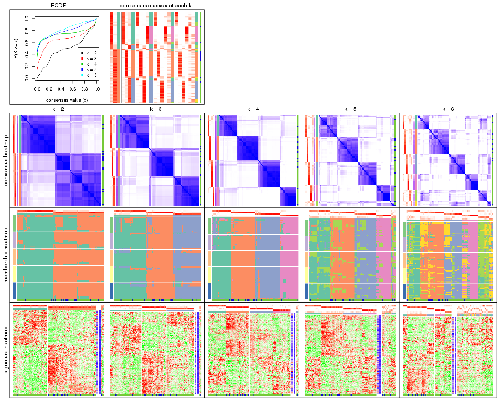

The plots are:

- The first row: a plot of the ECDF (empirical cumulative distribution
  function) curves of the consensus matrix for each `k` and the heatmap of
  predicted classes for each `k`.
- The second row: heatmaps of the consensus matrix for each `k`.
- The third row: heatmaps of the membership matrix for each `k`.
- The fouth row: heatmaps of the signatures for each `k`.

All the plots in panels can be made by individual functions and they are
plotted later in this section.

`select_partition_number()` produces several plots showing different
statistics for choosing "optimized" `k`. There are following statistics:

- ECDF curves of the consensus matrix for each `k`;
- 1-PAC. [The PAC
  score](https://en.wikipedia.org/wiki/Consensus_clustering#Over-interpretation_potential_of_consensus_clustering)
  measures the proportion of the ambiguous subgrouping.
- Mean silhouette score.
- Concordance. The mean probability of fiting the consensus class ids in all
  partitions.
- Area increased. Denote $A_k$ as the area under the ECDF curve for current
  `k`, the area increased is defined as $A_k - A_{k-1}$.
- Rand index. The percent of pairs of samples that are both in a same cluster
  or both are not in a same cluster in the partition of k and k-1.
- Jaccard index. The ratio of pairs of samples are both in a same cluster in
  the partition of k and k-1 and the pairs of samples are both in a same
  cluster in the partition k or k-1.

The detailed explanations of these statistics can be found in [the _cola_
vignette](http://bioconductor.org/packages/devel/bioc/vignettes/cola/inst/doc/cola.html#toc_13).

Generally speaking, lower PAC score, higher mean silhouette score or higher
concordance corresponds to better partition. Rand index and Jaccard index
measure how similar the current partition is compared to partition with `k-1`.
If they are too similar, we won't accept `k` is better than `k-1`.

```r
select_partition_number(res)
```


The numeric values for all these statistics can be obtained by `get_stats()`.

```r
get_stats(res)
```

```
#>   k 1-PAC mean_silhouette concordance area_increased  Rand Jaccard
#> 2 2 0.384           0.805       0.876         0.4945 0.509   0.509
#> 3 3 0.640           0.837       0.885         0.3431 0.734   0.518
#> 4 4 0.853           0.879       0.931         0.1297 0.845   0.576
#> 5 5 0.709           0.636       0.795         0.0628 0.955   0.825
#> 6 6 0.701           0.488       0.724         0.0402 0.938   0.737
```

`suggest_best_k()` suggests the best $k$ based on these statistics. The rules are as follows:

- All $k$ with Jaccard index larger than 0.95 are removed because increasing
  $k$ does not provide enough extra information. If all $k$ are removed, it is
  marked as no subgroup is detected.
- For all $k$ with 1-PAC score larger than 0.9, the maximal $k$ is taken as
  the best $k$, and other $k$ are marked as optional $k$.
- If it does not fit the second rule. The $k$ with the maximal vote of the
  highest 1-PAC score, highest mean silhouette, and highest concordance is
  taken as the best $k$.

```r
suggest_best_k(res)
```

```
#> [1] 4
```


Following shows the table of the partitions (You need to click the **show/hide
code output** link to see it). The membership matrix (columns with name `p*`)
is inferred by
[`clue::cl_consensus()`](https://www.rdocumentation.org/link/cl_consensus?package=clue)
function with the `SE` method. Basically the value in the membership matrix
represents the probability to belong to a certain group. The finall class
label for an item is determined with the group with highest probability it
belongs to.

In `get_classes()` function, the entropy is calculated from the membership
matrix and the silhouette score is calculated from the consensus matrix.


<script>
$( function() {
	$( '#tabs-SD-kmeans-get-classes' ).tabs();
} );
</script>
<div id='tabs-SD-kmeans-get-classes'>
<ul>
<li><a href='#tab-SD-kmeans-get-classes-1'>k = 2</a></li>
<li><a href='#tab-SD-kmeans-get-classes-2'>k = 3</a></li>
<li><a href='#tab-SD-kmeans-get-classes-3'>k = 4</a></li>
<li><a href='#tab-SD-kmeans-get-classes-4'>k = 5</a></li>
<li><a href='#tab-SD-kmeans-get-classes-5'>k = 6</a></li>
</ul>

<div id='tab-SD-kmeans-get-classes-1'>
<p><a id='tab-SD-kmeans-get-classes-1-a' style='color:#0366d6' href='#'>show/hide code output</a></p>
<pre><code class="r">cbind(get_classes(res, k = 2), get_membership(res, k = 2))
</code></pre>

<pre><code>#&gt;           class entropy silhouette    p1    p2
#&gt; GSM531600     2  0.3431      0.825 0.064 0.936
#&gt; GSM531601     2  0.7602      0.754 0.220 0.780
#&gt; GSM531605     1  0.3733      0.887 0.928 0.072
#&gt; GSM531615     2  0.7602      0.754 0.220 0.780
#&gt; GSM531617     2  0.7674      0.752 0.224 0.776
#&gt; GSM531624     2  0.7299      0.768 0.204 0.796
#&gt; GSM531627     2  0.2778      0.829 0.048 0.952
#&gt; GSM531629     2  0.9833      0.383 0.424 0.576
#&gt; GSM531631     2  0.7299      0.768 0.204 0.796
#&gt; GSM531634     2  0.7602      0.754 0.220 0.780
#&gt; GSM531636     2  0.1414      0.823 0.020 0.980
#&gt; GSM531637     2  0.7299      0.768 0.204 0.796
#&gt; GSM531654     2  0.7602      0.754 0.220 0.780
#&gt; GSM531655     2  0.7883      0.766 0.236 0.764
#&gt; GSM531658     1  0.1184      0.914 0.984 0.016
#&gt; GSM531660     1  0.2948      0.895 0.948 0.052
#&gt; GSM531602     1  0.2778      0.898 0.952 0.048
#&gt; GSM531603     1  0.2778      0.898 0.952 0.048
#&gt; GSM531604     1  0.5946      0.830 0.856 0.144
#&gt; GSM531606     1  0.2778      0.898 0.952 0.048
#&gt; GSM531607     1  0.0672      0.912 0.992 0.008
#&gt; GSM531608     2  0.7602      0.754 0.220 0.780
#&gt; GSM531609     1  0.1184      0.914 0.984 0.016
#&gt; GSM531610     1  0.1184      0.914 0.984 0.016
#&gt; GSM531611     1  0.0000      0.911 1.000 0.000
#&gt; GSM531612     1  0.1184      0.914 0.984 0.016
#&gt; GSM531613     1  0.1184      0.914 0.984 0.016
#&gt; GSM531614     1  0.1184      0.914 0.984 0.016
#&gt; GSM531616     2  0.0672      0.826 0.008 0.992
#&gt; GSM531618     2  0.9460      0.628 0.364 0.636
#&gt; GSM531619     2  0.7299      0.768 0.204 0.796
#&gt; GSM531620     2  0.2778      0.829 0.048 0.952
#&gt; GSM531621     2  0.2778      0.829 0.048 0.952
#&gt; GSM531622     2  0.7299      0.768 0.204 0.796
#&gt; GSM531623     2  0.4022      0.824 0.080 0.920
#&gt; GSM531625     2  0.0000      0.826 0.000 1.000
#&gt; GSM531626     2  0.0376      0.826 0.004 0.996
#&gt; GSM531628     2  0.7376      0.750 0.208 0.792
#&gt; GSM531630     2  0.6973      0.778 0.188 0.812
#&gt; GSM531632     2  0.4690      0.816 0.100 0.900
#&gt; GSM531633     2  0.2778      0.829 0.048 0.952
#&gt; GSM531635     2  0.2948      0.823 0.052 0.948
#&gt; GSM531638     2  0.0000      0.826 0.000 1.000
#&gt; GSM531639     2  0.0000      0.826 0.000 1.000
#&gt; GSM531640     2  0.7299      0.768 0.204 0.796
#&gt; GSM531641     1  0.1633      0.912 0.976 0.024
#&gt; GSM531642     2  0.5519      0.805 0.128 0.872
#&gt; GSM531643     2  0.6148      0.792 0.152 0.848
#&gt; GSM531644     2  0.7376      0.750 0.208 0.792
#&gt; GSM531645     1  0.1184      0.914 0.984 0.016
#&gt; GSM531646     2  0.3584      0.823 0.068 0.932
#&gt; GSM531647     2  0.4690      0.816 0.100 0.900
#&gt; GSM531648     1  0.6048      0.762 0.852 0.148
#&gt; GSM531649     2  0.2043      0.823 0.032 0.968
#&gt; GSM531650     2  0.7139      0.760 0.196 0.804
#&gt; GSM531651     2  0.2778      0.829 0.048 0.952
#&gt; GSM531652     2  0.7056      0.766 0.192 0.808
#&gt; GSM531653     2  0.4161      0.820 0.084 0.916
#&gt; GSM531656     2  0.3431      0.825 0.064 0.936
#&gt; GSM531657     1  0.1414      0.913 0.980 0.020
#&gt; GSM531659     1  0.1184      0.914 0.984 0.016
#&gt; GSM531661     2  0.7299      0.768 0.204 0.796
#&gt; GSM531662     2  0.4161      0.823 0.084 0.916
#&gt; GSM531663     1  0.1414      0.913 0.980 0.020
#&gt; GSM531664     2  0.7376      0.750 0.208 0.792
#&gt; GSM531665     2  0.7528      0.741 0.216 0.784
#&gt; GSM531666     2  0.9427      0.508 0.360 0.640
#&gt; GSM531667     2  0.7299      0.768 0.204 0.796
#&gt; GSM531668     1  0.2778      0.898 0.952 0.048
#&gt; GSM531669     2  0.7376      0.750 0.208 0.792
#&gt; GSM531670     2  0.3431      0.825 0.064 0.936
#&gt; GSM531671     2  0.3584      0.825 0.068 0.932
#&gt; GSM531672     1  0.1633      0.912 0.976 0.024
#&gt; GSM531673     2  0.3431      0.835 0.064 0.936
#&gt; GSM531674     2  0.7376      0.750 0.208 0.792
#&gt; GSM531675     1  0.0000      0.911 1.000 0.000
#&gt; GSM531676     1  0.7674      0.701 0.776 0.224
#&gt; GSM531677     1  0.1633      0.898 0.976 0.024
#&gt; GSM531678     1  0.0938      0.912 0.988 0.012
#&gt; GSM531679     1  0.2423      0.887 0.960 0.040
#&gt; GSM531680     1  0.7602      0.706 0.780 0.220
#&gt; GSM531681     1  0.0000      0.911 1.000 0.000
#&gt; GSM531682     1  0.1414      0.901 0.980 0.020
#&gt; GSM531683     1  0.1633      0.912 0.976 0.024
#&gt; GSM531684     1  0.6343      0.777 0.840 0.160
#&gt; GSM531685     2  0.9491      0.470 0.368 0.632
#&gt; GSM531686     1  0.0000      0.911 1.000 0.000
#&gt; GSM531687     1  0.7602      0.706 0.780 0.220
#&gt; GSM531688     1  0.9866      0.217 0.568 0.432
#&gt; GSM531689     1  0.6247      0.782 0.844 0.156
#&gt; GSM531690     1  0.0000      0.911 1.000 0.000
#&gt; GSM531691     1  0.7299      0.752 0.796 0.204
#&gt; GSM531692     2  0.6438      0.769 0.164 0.836
#&gt; GSM531693     2  0.7376      0.750 0.208 0.792
#&gt; GSM531694     1  0.2778      0.898 0.952 0.048
#&gt; GSM531695     1  0.7602      0.706 0.780 0.220
</code></pre>

<script>
$('#tab-SD-kmeans-get-classes-1-a').parent().next().next().hide();
$('#tab-SD-kmeans-get-classes-1-a').click(function(){
  $('#tab-SD-kmeans-get-classes-1-a').parent().next().next().toggle();
  return(false);
});
</script>
</div>

<div id='tab-SD-kmeans-get-classes-2'>
<p><a id='tab-SD-kmeans-get-classes-2-a' style='color:#0366d6' href='#'>show/hide code output</a></p>
<pre><code class="r">cbind(get_classes(res, k = 3), get_membership(res, k = 3))
</code></pre>

<pre><code>#&gt;           class entropy silhouette    p1    p2    p3
#&gt; GSM531600     3  0.3816     0.8940 0.000 0.148 0.852
#&gt; GSM531601     2  0.2200     0.8680 0.056 0.940 0.004
#&gt; GSM531605     1  0.7766     0.7569 0.676 0.176 0.148
#&gt; GSM531615     2  0.0424     0.9081 0.008 0.992 0.000
#&gt; GSM531617     2  0.1411     0.8906 0.036 0.964 0.000
#&gt; GSM531624     2  0.0000     0.9122 0.000 1.000 0.000
#&gt; GSM531627     2  0.0747     0.9070 0.000 0.984 0.016
#&gt; GSM531629     2  0.4291     0.7456 0.180 0.820 0.000
#&gt; GSM531631     2  0.0000     0.9122 0.000 1.000 0.000
#&gt; GSM531634     2  0.0424     0.9081 0.008 0.992 0.000
#&gt; GSM531636     3  0.4121     0.8800 0.000 0.168 0.832
#&gt; GSM531637     2  0.0000     0.9122 0.000 1.000 0.000
#&gt; GSM531654     2  0.0237     0.9114 0.004 0.996 0.000
#&gt; GSM531655     2  0.7839    -0.1523 0.052 0.484 0.464
#&gt; GSM531658     1  0.2152     0.8773 0.948 0.036 0.016
#&gt; GSM531660     1  0.3349     0.8577 0.888 0.108 0.004
#&gt; GSM531602     1  0.5913     0.8527 0.788 0.068 0.144
#&gt; GSM531603     1  0.5913     0.8527 0.788 0.068 0.144
#&gt; GSM531604     1  0.7821     0.7540 0.672 0.176 0.152
#&gt; GSM531606     1  0.5913     0.8527 0.788 0.068 0.144
#&gt; GSM531607     1  0.5823     0.8543 0.792 0.064 0.144
#&gt; GSM531608     2  0.0237     0.9103 0.004 0.996 0.000
#&gt; GSM531609     1  0.2152     0.8773 0.948 0.036 0.016
#&gt; GSM531610     1  0.1832     0.8788 0.956 0.036 0.008
#&gt; GSM531611     1  0.1636     0.8801 0.964 0.020 0.016
#&gt; GSM531612     1  0.2152     0.8773 0.948 0.036 0.016
#&gt; GSM531613     1  0.1315     0.8810 0.972 0.020 0.008
#&gt; GSM531614     1  0.2152     0.8773 0.948 0.036 0.016
#&gt; GSM531616     2  0.6274    -0.0441 0.000 0.544 0.456
#&gt; GSM531618     1  0.5595     0.7432 0.756 0.228 0.016
#&gt; GSM531619     2  0.0000     0.9122 0.000 1.000 0.000
#&gt; GSM531620     2  0.0747     0.9070 0.000 0.984 0.016
#&gt; GSM531621     2  0.0747     0.9070 0.000 0.984 0.016
#&gt; GSM531622     2  0.0000     0.9122 0.000 1.000 0.000
#&gt; GSM531623     2  0.0000     0.9122 0.000 1.000 0.000
#&gt; GSM531625     2  0.3412     0.8040 0.000 0.876 0.124
#&gt; GSM531626     2  0.3686     0.7843 0.000 0.860 0.140
#&gt; GSM531628     3  0.4489     0.8968 0.036 0.108 0.856
#&gt; GSM531630     2  0.0000     0.9122 0.000 1.000 0.000
#&gt; GSM531632     3  0.3816     0.8940 0.000 0.148 0.852
#&gt; GSM531633     2  0.0747     0.9070 0.000 0.984 0.016
#&gt; GSM531635     3  0.3816     0.8940 0.000 0.148 0.852
#&gt; GSM531638     2  0.3412     0.8040 0.000 0.876 0.124
#&gt; GSM531639     3  0.5178     0.7736 0.000 0.256 0.744
#&gt; GSM531640     2  0.0000     0.9122 0.000 1.000 0.000
#&gt; GSM531641     1  0.2152     0.8773 0.948 0.036 0.016
#&gt; GSM531642     3  0.4586     0.8927 0.048 0.096 0.856
#&gt; GSM531643     3  0.4489     0.8968 0.036 0.108 0.856
#&gt; GSM531644     3  0.4652     0.8852 0.064 0.080 0.856
#&gt; GSM531645     1  0.2152     0.8773 0.948 0.036 0.016
#&gt; GSM531646     3  0.3816     0.8940 0.000 0.148 0.852
#&gt; GSM531647     3  0.3918     0.8961 0.004 0.140 0.856
#&gt; GSM531648     1  0.2152     0.8773 0.948 0.036 0.016
#&gt; GSM531649     3  0.3879     0.8915 0.000 0.152 0.848
#&gt; GSM531650     3  0.4489     0.8968 0.036 0.108 0.856
#&gt; GSM531651     2  0.0592     0.9088 0.000 0.988 0.012
#&gt; GSM531652     3  0.4749     0.8810 0.072 0.076 0.852
#&gt; GSM531653     3  0.3752     0.8952 0.000 0.144 0.856
#&gt; GSM531656     3  0.3816     0.8940 0.000 0.148 0.852
#&gt; GSM531657     1  0.1832     0.8788 0.956 0.036 0.008
#&gt; GSM531659     1  0.1711     0.8798 0.960 0.032 0.008
#&gt; GSM531661     2  0.0237     0.9114 0.004 0.996 0.000
#&gt; GSM531662     2  0.0829     0.9076 0.004 0.984 0.012
#&gt; GSM531663     1  0.1832     0.8788 0.956 0.036 0.008
#&gt; GSM531664     3  0.4423     0.8927 0.048 0.088 0.864
#&gt; GSM531665     3  0.4121     0.8949 0.024 0.108 0.868
#&gt; GSM531666     3  0.4658     0.8832 0.068 0.076 0.856
#&gt; GSM531667     2  0.0000     0.9122 0.000 1.000 0.000
#&gt; GSM531668     1  0.3129     0.8665 0.904 0.088 0.008
#&gt; GSM531669     3  0.3995     0.9001 0.016 0.116 0.868
#&gt; GSM531670     3  0.3816     0.8940 0.000 0.148 0.852
#&gt; GSM531671     3  0.6282     0.5260 0.004 0.384 0.612
#&gt; GSM531672     1  0.1315     0.8810 0.972 0.020 0.008
#&gt; GSM531673     2  0.3445     0.8445 0.016 0.896 0.088
#&gt; GSM531674     3  0.3995     0.9001 0.016 0.116 0.868
#&gt; GSM531675     1  0.3412     0.8702 0.876 0.000 0.124
#&gt; GSM531676     3  0.1643     0.8113 0.044 0.000 0.956
#&gt; GSM531677     1  0.3752     0.8642 0.856 0.000 0.144
#&gt; GSM531678     1  0.5730     0.8557 0.796 0.060 0.144
#&gt; GSM531679     1  0.4605     0.8373 0.796 0.000 0.204
#&gt; GSM531680     3  0.1411     0.8167 0.036 0.000 0.964
#&gt; GSM531681     1  0.2261     0.8793 0.932 0.000 0.068
#&gt; GSM531682     1  0.4605     0.8373 0.796 0.000 0.204
#&gt; GSM531683     1  0.4995     0.8631 0.824 0.032 0.144
#&gt; GSM531684     2  0.7505     0.5632 0.160 0.696 0.144
#&gt; GSM531685     3  0.1411     0.8173 0.036 0.000 0.964
#&gt; GSM531686     1  0.2356     0.8789 0.928 0.000 0.072
#&gt; GSM531687     3  0.1643     0.8113 0.044 0.000 0.956
#&gt; GSM531688     3  0.0424     0.8332 0.008 0.000 0.992
#&gt; GSM531689     1  0.5760     0.7000 0.672 0.000 0.328
#&gt; GSM531690     1  0.2261     0.8793 0.932 0.000 0.068
#&gt; GSM531691     1  0.6396     0.7006 0.664 0.016 0.320
#&gt; GSM531692     3  0.6481     0.5645 0.048 0.224 0.728
#&gt; GSM531693     3  0.1170     0.8439 0.008 0.016 0.976
#&gt; GSM531694     1  0.5913     0.8527 0.788 0.068 0.144
#&gt; GSM531695     3  0.1289     0.8190 0.032 0.000 0.968
</code></pre>

<script>
$('#tab-SD-kmeans-get-classes-2-a').parent().next().next().hide();
$('#tab-SD-kmeans-get-classes-2-a').click(function(){
  $('#tab-SD-kmeans-get-classes-2-a').parent().next().next().toggle();
  return(false);
});
</script>
</div>

<div id='tab-SD-kmeans-get-classes-3'>
<p><a id='tab-SD-kmeans-get-classes-3-a' style='color:#0366d6' href='#'>show/hide code output</a></p>
<pre><code class="r">cbind(get_classes(res, k = 4), get_membership(res, k = 4))
</code></pre>

<pre><code>#&gt;           class entropy silhouette    p1    p2    p3    p4
#&gt; GSM531600     3  0.1510      0.911 0.028 0.016 0.956 0.000
#&gt; GSM531601     2  0.0592      0.969 0.016 0.984 0.000 0.000
#&gt; GSM531605     1  0.1082      0.880 0.972 0.004 0.004 0.020
#&gt; GSM531615     2  0.0592      0.969 0.016 0.984 0.000 0.000
#&gt; GSM531617     2  0.1406      0.955 0.016 0.960 0.000 0.024
#&gt; GSM531624     2  0.0336      0.972 0.008 0.992 0.000 0.000
#&gt; GSM531627     2  0.0817      0.967 0.024 0.976 0.000 0.000
#&gt; GSM531629     2  0.2623      0.909 0.028 0.908 0.000 0.064
#&gt; GSM531631     2  0.0000      0.973 0.000 1.000 0.000 0.000
#&gt; GSM531634     2  0.0592      0.969 0.016 0.984 0.000 0.000
#&gt; GSM531636     3  0.2319      0.896 0.036 0.040 0.924 0.000
#&gt; GSM531637     2  0.0336      0.972 0.008 0.992 0.000 0.000
#&gt; GSM531654     2  0.2647      0.885 0.120 0.880 0.000 0.000
#&gt; GSM531655     3  0.6833      0.490 0.144 0.272 0.584 0.000
#&gt; GSM531658     4  0.0000      0.934 0.000 0.000 0.000 1.000
#&gt; GSM531660     4  0.4471      0.746 0.212 0.016 0.004 0.768
#&gt; GSM531602     1  0.1953      0.874 0.940 0.012 0.004 0.044
#&gt; GSM531603     1  0.1863      0.873 0.944 0.012 0.004 0.040
#&gt; GSM531604     1  0.0967      0.878 0.976 0.004 0.004 0.016
#&gt; GSM531606     1  0.1863      0.876 0.944 0.012 0.004 0.040
#&gt; GSM531607     1  0.1953      0.874 0.940 0.012 0.004 0.044
#&gt; GSM531608     2  0.0336      0.973 0.008 0.992 0.000 0.000
#&gt; GSM531609     4  0.0000      0.934 0.000 0.000 0.000 1.000
#&gt; GSM531610     4  0.0000      0.934 0.000 0.000 0.000 1.000
#&gt; GSM531611     4  0.0000      0.934 0.000 0.000 0.000 1.000
#&gt; GSM531612     4  0.0000      0.934 0.000 0.000 0.000 1.000
#&gt; GSM531613     4  0.0000      0.934 0.000 0.000 0.000 1.000
#&gt; GSM531614     4  0.0000      0.934 0.000 0.000 0.000 1.000
#&gt; GSM531616     3  0.5915      0.336 0.040 0.400 0.560 0.000
#&gt; GSM531618     4  0.5234      0.633 0.032 0.256 0.004 0.708
#&gt; GSM531619     2  0.0336      0.972 0.008 0.992 0.000 0.000
#&gt; GSM531620     2  0.0707      0.969 0.020 0.980 0.000 0.000
#&gt; GSM531621     2  0.0707      0.969 0.020 0.980 0.000 0.000
#&gt; GSM531622     2  0.0000      0.973 0.000 1.000 0.000 0.000
#&gt; GSM531623     2  0.0336      0.972 0.008 0.992 0.000 0.000
#&gt; GSM531625     2  0.1929      0.943 0.036 0.940 0.024 0.000
#&gt; GSM531626     2  0.2411      0.926 0.040 0.920 0.040 0.000
#&gt; GSM531628     3  0.0336      0.922 0.000 0.008 0.992 0.000
#&gt; GSM531630     2  0.0188      0.973 0.004 0.996 0.000 0.000
#&gt; GSM531632     3  0.0376      0.921 0.004 0.004 0.992 0.000
#&gt; GSM531633     2  0.0707      0.969 0.020 0.980 0.000 0.000
#&gt; GSM531635     3  0.0804      0.922 0.012 0.008 0.980 0.000
#&gt; GSM531638     2  0.2021      0.942 0.040 0.936 0.024 0.000
#&gt; GSM531639     3  0.4332      0.776 0.040 0.160 0.800 0.000
#&gt; GSM531640     2  0.0000      0.973 0.000 1.000 0.000 0.000
#&gt; GSM531641     4  0.0000      0.934 0.000 0.000 0.000 1.000
#&gt; GSM531642     3  0.1724      0.909 0.032 0.020 0.948 0.000
#&gt; GSM531643     3  0.0524      0.921 0.004 0.008 0.988 0.000
#&gt; GSM531644     3  0.0524      0.921 0.004 0.008 0.988 0.000
#&gt; GSM531645     4  0.0000      0.934 0.000 0.000 0.000 1.000
#&gt; GSM531646     3  0.0524      0.922 0.004 0.008 0.988 0.000
#&gt; GSM531647     3  0.0524      0.922 0.004 0.008 0.988 0.000
#&gt; GSM531648     4  0.0895      0.927 0.020 0.000 0.004 0.976
#&gt; GSM531649     3  0.0804      0.922 0.012 0.008 0.980 0.000
#&gt; GSM531650     3  0.0336      0.922 0.000 0.008 0.992 0.000
#&gt; GSM531651     2  0.0336      0.972 0.008 0.992 0.000 0.000
#&gt; GSM531652     3  0.0672      0.921 0.008 0.008 0.984 0.000
#&gt; GSM531653     3  0.0524      0.922 0.004 0.008 0.988 0.000
#&gt; GSM531656     3  0.1724      0.909 0.032 0.020 0.948 0.000
#&gt; GSM531657     4  0.0592      0.929 0.016 0.000 0.000 0.984
#&gt; GSM531659     4  0.0469      0.931 0.012 0.000 0.000 0.988
#&gt; GSM531661     2  0.0469      0.972 0.012 0.988 0.000 0.000
#&gt; GSM531662     2  0.2125      0.931 0.076 0.920 0.004 0.000
#&gt; GSM531663     4  0.0000      0.934 0.000 0.000 0.000 1.000
#&gt; GSM531664     3  0.0188      0.919 0.004 0.000 0.996 0.000
#&gt; GSM531665     3  0.3208      0.804 0.148 0.004 0.848 0.000
#&gt; GSM531666     3  0.0336      0.919 0.008 0.000 0.992 0.000
#&gt; GSM531667     2  0.0336      0.973 0.008 0.992 0.000 0.000
#&gt; GSM531668     4  0.4077      0.784 0.184 0.012 0.004 0.800
#&gt; GSM531669     3  0.0376      0.921 0.004 0.004 0.992 0.000
#&gt; GSM531670     3  0.1724      0.909 0.032 0.020 0.948 0.000
#&gt; GSM531671     3  0.5056      0.689 0.044 0.224 0.732 0.000
#&gt; GSM531672     4  0.0779      0.928 0.016 0.000 0.004 0.980
#&gt; GSM531673     1  0.4706      0.643 0.732 0.248 0.020 0.000
#&gt; GSM531674     3  0.0376      0.921 0.004 0.004 0.992 0.000
#&gt; GSM531675     1  0.4950      0.435 0.620 0.000 0.004 0.376
#&gt; GSM531676     1  0.3801      0.727 0.780 0.000 0.220 0.000
#&gt; GSM531677     1  0.2589      0.835 0.884 0.000 0.000 0.116
#&gt; GSM531678     1  0.1396      0.880 0.960 0.004 0.004 0.032
#&gt; GSM531679     1  0.1584      0.880 0.952 0.000 0.012 0.036
#&gt; GSM531680     1  0.4454      0.618 0.692 0.000 0.308 0.000
#&gt; GSM531681     4  0.2647      0.843 0.120 0.000 0.000 0.880
#&gt; GSM531682     1  0.1584      0.880 0.952 0.000 0.012 0.036
#&gt; GSM531683     1  0.1743      0.871 0.940 0.000 0.004 0.056
#&gt; GSM531684     1  0.2010      0.861 0.932 0.060 0.004 0.004
#&gt; GSM531685     1  0.4331      0.629 0.712 0.000 0.288 0.000
#&gt; GSM531686     4  0.2760      0.836 0.128 0.000 0.000 0.872
#&gt; GSM531687     1  0.3907      0.716 0.768 0.000 0.232 0.000
#&gt; GSM531688     3  0.0336      0.919 0.008 0.000 0.992 0.000
#&gt; GSM531689     1  0.1911      0.875 0.944 0.004 0.032 0.020
#&gt; GSM531690     4  0.3157      0.827 0.144 0.000 0.004 0.852
#&gt; GSM531691     1  0.1871      0.874 0.948 0.012 0.024 0.016
#&gt; GSM531692     1  0.1661      0.862 0.944 0.004 0.052 0.000
#&gt; GSM531693     3  0.0336      0.919 0.008 0.000 0.992 0.000
#&gt; GSM531694     1  0.1953      0.874 0.940 0.012 0.004 0.044
#&gt; GSM531695     3  0.3569      0.701 0.196 0.000 0.804 0.000
</code></pre>

<script>
$('#tab-SD-kmeans-get-classes-3-a').parent().next().next().hide();
$('#tab-SD-kmeans-get-classes-3-a').click(function(){
  $('#tab-SD-kmeans-get-classes-3-a').parent().next().next().toggle();
  return(false);
});
</script>
</div>

<div id='tab-SD-kmeans-get-classes-4'>
<p><a id='tab-SD-kmeans-get-classes-4-a' style='color:#0366d6' href='#'>show/hide code output</a></p>
<pre><code class="r">cbind(get_classes(res, k = 5), get_membership(res, k = 5))
</code></pre>

<pre><code>#&gt;           class entropy silhouette    p1    p2    p3    p4    p5
#&gt; GSM531600     3  0.3948      0.715 0.012 0.016 0.776 0.000 0.196
#&gt; GSM531601     2  0.3242      0.636 0.000 0.784 0.000 0.000 0.216
#&gt; GSM531605     1  0.3906      0.643 0.704 0.000 0.000 0.004 0.292
#&gt; GSM531615     2  0.2561      0.757 0.000 0.856 0.000 0.000 0.144
#&gt; GSM531617     2  0.3452      0.668 0.000 0.756 0.000 0.000 0.244
#&gt; GSM531624     2  0.0703      0.798 0.000 0.976 0.000 0.000 0.024
#&gt; GSM531627     2  0.3196      0.739 0.004 0.804 0.000 0.000 0.192
#&gt; GSM531629     2  0.5215      0.347 0.000 0.576 0.000 0.052 0.372
#&gt; GSM531631     2  0.0510      0.802 0.000 0.984 0.000 0.000 0.016
#&gt; GSM531634     2  0.2329      0.777 0.000 0.876 0.000 0.000 0.124
#&gt; GSM531636     3  0.4665      0.682 0.012 0.040 0.724 0.000 0.224
#&gt; GSM531637     2  0.0703      0.798 0.000 0.976 0.000 0.000 0.024
#&gt; GSM531654     2  0.5408      0.313 0.060 0.532 0.000 0.000 0.408
#&gt; GSM531655     5  0.6086      0.109 0.020 0.112 0.264 0.000 0.604
#&gt; GSM531658     4  0.2929      0.717 0.000 0.000 0.000 0.820 0.180
#&gt; GSM531660     5  0.6585      0.226 0.080 0.052 0.000 0.340 0.528
#&gt; GSM531602     1  0.4491      0.603 0.624 0.008 0.000 0.004 0.364
#&gt; GSM531603     1  0.4505      0.600 0.620 0.008 0.000 0.004 0.368
#&gt; GSM531604     1  0.1831      0.679 0.920 0.000 0.000 0.004 0.076
#&gt; GSM531606     1  0.4449      0.611 0.636 0.008 0.000 0.004 0.352
#&gt; GSM531607     1  0.4211      0.612 0.636 0.000 0.000 0.004 0.360
#&gt; GSM531608     2  0.2424      0.779 0.000 0.868 0.000 0.000 0.132
#&gt; GSM531609     4  0.0000      0.832 0.000 0.000 0.000 1.000 0.000
#&gt; GSM531610     4  0.0000      0.832 0.000 0.000 0.000 1.000 0.000
#&gt; GSM531611     4  0.0000      0.832 0.000 0.000 0.000 1.000 0.000
#&gt; GSM531612     4  0.0000      0.832 0.000 0.000 0.000 1.000 0.000
#&gt; GSM531613     4  0.0000      0.832 0.000 0.000 0.000 1.000 0.000
#&gt; GSM531614     4  0.0000      0.832 0.000 0.000 0.000 1.000 0.000
#&gt; GSM531616     2  0.6884      0.153 0.008 0.444 0.288 0.000 0.260
#&gt; GSM531618     5  0.6836      0.136 0.008 0.212 0.000 0.364 0.416
#&gt; GSM531619     2  0.0703      0.798 0.000 0.976 0.000 0.000 0.024
#&gt; GSM531620     2  0.3333      0.764 0.004 0.788 0.000 0.000 0.208
#&gt; GSM531621     2  0.2583      0.773 0.004 0.864 0.000 0.000 0.132
#&gt; GSM531622     2  0.0510      0.803 0.000 0.984 0.000 0.000 0.016
#&gt; GSM531623     2  0.0963      0.802 0.000 0.964 0.000 0.000 0.036
#&gt; GSM531625     2  0.3888      0.693 0.008 0.756 0.008 0.000 0.228
#&gt; GSM531626     2  0.4850      0.636 0.016 0.660 0.020 0.000 0.304
#&gt; GSM531628     3  0.0290      0.783 0.000 0.000 0.992 0.000 0.008
#&gt; GSM531630     2  0.0963      0.802 0.000 0.964 0.000 0.000 0.036
#&gt; GSM531632     3  0.1197      0.776 0.000 0.000 0.952 0.000 0.048
#&gt; GSM531633     2  0.2629      0.771 0.004 0.860 0.000 0.000 0.136
#&gt; GSM531635     3  0.3421      0.725 0.008 0.000 0.788 0.000 0.204
#&gt; GSM531638     2  0.4216      0.662 0.008 0.720 0.012 0.000 0.260
#&gt; GSM531639     3  0.6006      0.513 0.012 0.124 0.604 0.000 0.260
#&gt; GSM531640     2  0.0510      0.802 0.000 0.984 0.000 0.000 0.016
#&gt; GSM531641     4  0.0000      0.832 0.000 0.000 0.000 1.000 0.000
#&gt; GSM531642     3  0.5339      0.467 0.020 0.024 0.560 0.000 0.396
#&gt; GSM531643     3  0.1270      0.779 0.000 0.000 0.948 0.000 0.052
#&gt; GSM531644     3  0.2605      0.724 0.000 0.000 0.852 0.000 0.148
#&gt; GSM531645     4  0.0000      0.832 0.000 0.000 0.000 1.000 0.000
#&gt; GSM531646     3  0.1121      0.779 0.000 0.000 0.956 0.000 0.044
#&gt; GSM531647     3  0.0510      0.783 0.000 0.000 0.984 0.000 0.016
#&gt; GSM531648     4  0.3809      0.635 0.008 0.000 0.000 0.736 0.256
#&gt; GSM531649     3  0.3160      0.730 0.004 0.000 0.808 0.000 0.188
#&gt; GSM531650     3  0.0290      0.783 0.000 0.000 0.992 0.000 0.008
#&gt; GSM531651     2  0.1121      0.801 0.000 0.956 0.000 0.000 0.044
#&gt; GSM531652     3  0.3957      0.570 0.008 0.000 0.712 0.000 0.280
#&gt; GSM531653     3  0.0510      0.783 0.000 0.000 0.984 0.000 0.016
#&gt; GSM531656     3  0.4164      0.707 0.012 0.024 0.764 0.000 0.200
#&gt; GSM531657     4  0.4106      0.629 0.020 0.000 0.000 0.724 0.256
#&gt; GSM531659     4  0.4161      0.603 0.016 0.000 0.000 0.704 0.280
#&gt; GSM531661     2  0.2280      0.785 0.000 0.880 0.000 0.000 0.120
#&gt; GSM531662     2  0.5099      0.600 0.052 0.612 0.000 0.000 0.336
#&gt; GSM531663     4  0.0000      0.832 0.000 0.000 0.000 1.000 0.000
#&gt; GSM531664     3  0.0290      0.783 0.000 0.000 0.992 0.000 0.008
#&gt; GSM531665     1  0.6912     -0.084 0.392 0.004 0.300 0.000 0.304
#&gt; GSM531666     3  0.3861      0.599 0.008 0.000 0.728 0.000 0.264
#&gt; GSM531667     2  0.2074      0.788 0.000 0.896 0.000 0.000 0.104
#&gt; GSM531668     5  0.6358      0.295 0.080 0.048 0.000 0.292 0.580
#&gt; GSM531669     3  0.0162      0.783 0.000 0.000 0.996 0.000 0.004
#&gt; GSM531670     3  0.4164      0.707 0.012 0.024 0.764 0.000 0.200
#&gt; GSM531671     5  0.7852     -0.169 0.236 0.072 0.328 0.000 0.364
#&gt; GSM531672     4  0.3519      0.686 0.008 0.000 0.000 0.776 0.216
#&gt; GSM531673     1  0.6113      0.168 0.528 0.108 0.008 0.000 0.356
#&gt; GSM531674     3  0.0162      0.783 0.000 0.000 0.996 0.000 0.004
#&gt; GSM531675     1  0.6186      0.300 0.512 0.000 0.000 0.336 0.152
#&gt; GSM531676     1  0.3506      0.612 0.832 0.000 0.104 0.000 0.064
#&gt; GSM531677     1  0.3527      0.667 0.828 0.000 0.000 0.056 0.116
#&gt; GSM531678     1  0.1768      0.690 0.924 0.000 0.000 0.004 0.072
#&gt; GSM531679     1  0.2233      0.687 0.892 0.000 0.000 0.004 0.104
#&gt; GSM531680     1  0.4905      0.489 0.696 0.000 0.224 0.000 0.080
#&gt; GSM531681     4  0.3532      0.680 0.092 0.000 0.000 0.832 0.076
#&gt; GSM531682     1  0.2124      0.689 0.900 0.000 0.000 0.004 0.096
#&gt; GSM531683     1  0.4196      0.615 0.640 0.000 0.000 0.004 0.356
#&gt; GSM531684     1  0.4708      0.620 0.668 0.040 0.000 0.000 0.292
#&gt; GSM531685     1  0.5222      0.459 0.680 0.000 0.196 0.000 0.124
#&gt; GSM531686     4  0.3586      0.678 0.096 0.000 0.000 0.828 0.076
#&gt; GSM531687     1  0.3641      0.601 0.820 0.000 0.120 0.000 0.060
#&gt; GSM531688     3  0.3970      0.555 0.224 0.000 0.752 0.000 0.024
#&gt; GSM531689     1  0.1443      0.668 0.948 0.000 0.004 0.004 0.044
#&gt; GSM531690     4  0.5680      0.434 0.240 0.000 0.000 0.620 0.140
#&gt; GSM531691     1  0.1798      0.663 0.928 0.000 0.004 0.004 0.064
#&gt; GSM531692     1  0.2669      0.638 0.876 0.000 0.020 0.000 0.104
#&gt; GSM531693     3  0.4100      0.593 0.192 0.000 0.764 0.000 0.044
#&gt; GSM531694     1  0.4491      0.603 0.624 0.008 0.000 0.004 0.364
#&gt; GSM531695     3  0.5267      0.125 0.428 0.000 0.524 0.000 0.048
</code></pre>

<script>
$('#tab-SD-kmeans-get-classes-4-a').parent().next().next().hide();
$('#tab-SD-kmeans-get-classes-4-a').click(function(){
  $('#tab-SD-kmeans-get-classes-4-a').parent().next().next().toggle();
  return(false);
});
</script>
</div>

<div id='tab-SD-kmeans-get-classes-5'>
<p><a id='tab-SD-kmeans-get-classes-5-a' style='color:#0366d6' href='#'>show/hide code output</a></p>
<pre><code class="r">cbind(get_classes(res, k = 6), get_membership(res, k = 6))
</code></pre>

<pre><code>#&gt;           class entropy silhouette    p1    p2    p3    p4    p5    p6
#&gt; GSM531600     3  0.4408     0.4213 0.000 0.000 0.664 0.000 0.056 0.280
#&gt; GSM531601     2  0.4019     0.4340 0.004 0.652 0.000 0.000 0.012 0.332
#&gt; GSM531605     1  0.2553     0.4451 0.848 0.000 0.000 0.000 0.144 0.008
#&gt; GSM531615     2  0.3998     0.6894 0.036 0.788 0.000 0.000 0.048 0.128
#&gt; GSM531617     2  0.5005     0.6109 0.052 0.688 0.000 0.000 0.056 0.204
#&gt; GSM531624     2  0.0909     0.7493 0.000 0.968 0.000 0.000 0.012 0.020
#&gt; GSM531627     2  0.4513     0.6496 0.004 0.700 0.000 0.000 0.084 0.212
#&gt; GSM531629     2  0.6730     0.2612 0.072 0.476 0.000 0.036 0.064 0.352
#&gt; GSM531631     2  0.1074     0.7482 0.000 0.960 0.000 0.000 0.012 0.028
#&gt; GSM531634     2  0.3424     0.7107 0.008 0.816 0.000 0.000 0.048 0.128
#&gt; GSM531636     3  0.5412     0.2704 0.000 0.024 0.548 0.000 0.068 0.360
#&gt; GSM531637     2  0.0909     0.7493 0.000 0.968 0.000 0.000 0.012 0.020
#&gt; GSM531654     1  0.7354    -0.1030 0.368 0.312 0.000 0.000 0.160 0.160
#&gt; GSM531655     6  0.6119     0.4919 0.092 0.056 0.148 0.000 0.052 0.652
#&gt; GSM531658     4  0.4373     0.5452 0.016 0.000 0.000 0.640 0.016 0.328
#&gt; GSM531660     1  0.6324     0.0807 0.480 0.000 0.000 0.164 0.036 0.320
#&gt; GSM531602     1  0.0603     0.5500 0.980 0.000 0.000 0.004 0.016 0.000
#&gt; GSM531603     1  0.0508     0.5497 0.984 0.000 0.000 0.004 0.012 0.000
#&gt; GSM531604     5  0.4634     0.3183 0.400 0.000 0.000 0.000 0.556 0.044
#&gt; GSM531606     1  0.2212     0.4942 0.880 0.000 0.000 0.000 0.112 0.008
#&gt; GSM531607     1  0.0508     0.5497 0.984 0.000 0.000 0.004 0.012 0.000
#&gt; GSM531608     2  0.4086     0.6896 0.000 0.752 0.000 0.000 0.124 0.124
#&gt; GSM531609     4  0.0146     0.7670 0.000 0.000 0.000 0.996 0.000 0.004
#&gt; GSM531610     4  0.0000     0.7665 0.000 0.000 0.000 1.000 0.000 0.000
#&gt; GSM531611     4  0.0146     0.7670 0.000 0.000 0.000 0.996 0.000 0.004
#&gt; GSM531612     4  0.0146     0.7670 0.000 0.000 0.000 0.996 0.000 0.004
#&gt; GSM531613     4  0.0000     0.7665 0.000 0.000 0.000 1.000 0.000 0.000
#&gt; GSM531614     4  0.0146     0.7670 0.000 0.000 0.000 0.996 0.000 0.004
#&gt; GSM531616     2  0.7296     0.1778 0.004 0.396 0.176 0.000 0.116 0.308
#&gt; GSM531618     6  0.6282     0.2806 0.072 0.112 0.012 0.132 0.024 0.648
#&gt; GSM531619     2  0.0909     0.7493 0.000 0.968 0.000 0.000 0.012 0.020
#&gt; GSM531620     2  0.5145     0.6436 0.004 0.612 0.000 0.000 0.112 0.272
#&gt; GSM531621     2  0.3786     0.6946 0.004 0.772 0.000 0.000 0.052 0.172
#&gt; GSM531622     2  0.1218     0.7510 0.004 0.956 0.000 0.000 0.012 0.028
#&gt; GSM531623     2  0.1138     0.7529 0.004 0.960 0.000 0.000 0.012 0.024
#&gt; GSM531625     2  0.5234     0.6046 0.004 0.644 0.012 0.000 0.108 0.232
#&gt; GSM531626     2  0.5990     0.5190 0.004 0.532 0.020 0.000 0.140 0.304
#&gt; GSM531628     3  0.0692     0.6234 0.000 0.000 0.976 0.000 0.004 0.020
#&gt; GSM531630     2  0.1390     0.7486 0.004 0.948 0.000 0.000 0.016 0.032
#&gt; GSM531632     3  0.1461     0.6192 0.000 0.000 0.940 0.000 0.044 0.016
#&gt; GSM531633     2  0.3915     0.6852 0.004 0.756 0.000 0.000 0.052 0.188
#&gt; GSM531635     3  0.4801     0.4041 0.000 0.000 0.632 0.000 0.088 0.280
#&gt; GSM531638     2  0.5525     0.5163 0.004 0.568 0.008 0.000 0.112 0.308
#&gt; GSM531639     3  0.6238     0.1376 0.000 0.064 0.472 0.000 0.092 0.372
#&gt; GSM531640     2  0.1074     0.7482 0.000 0.960 0.000 0.000 0.012 0.028
#&gt; GSM531641     4  0.0146     0.7670 0.000 0.000 0.000 0.996 0.000 0.004
#&gt; GSM531642     6  0.4550     0.4524 0.000 0.008 0.296 0.000 0.044 0.652
#&gt; GSM531643     3  0.2848     0.4975 0.000 0.000 0.816 0.000 0.008 0.176
#&gt; GSM531644     3  0.3992    -0.0345 0.000 0.000 0.624 0.000 0.012 0.364
#&gt; GSM531645     4  0.0146     0.7670 0.000 0.000 0.000 0.996 0.000 0.004
#&gt; GSM531646     3  0.1341     0.6244 0.000 0.000 0.948 0.000 0.024 0.028
#&gt; GSM531647     3  0.0405     0.6300 0.000 0.000 0.988 0.000 0.008 0.004
#&gt; GSM531648     4  0.5288     0.3503 0.048 0.000 0.000 0.476 0.024 0.452
#&gt; GSM531649     3  0.4024     0.4954 0.000 0.000 0.744 0.000 0.072 0.184
#&gt; GSM531650     3  0.0692     0.6234 0.000 0.000 0.976 0.000 0.004 0.020
#&gt; GSM531651     2  0.1138     0.7529 0.004 0.960 0.000 0.000 0.012 0.024
#&gt; GSM531652     6  0.4195     0.4616 0.000 0.000 0.440 0.004 0.008 0.548
#&gt; GSM531653     3  0.0405     0.6300 0.000 0.000 0.988 0.000 0.008 0.004
#&gt; GSM531656     3  0.5272     0.2869 0.000 0.020 0.564 0.000 0.064 0.352
#&gt; GSM531657     4  0.5519     0.4371 0.072 0.000 0.000 0.512 0.024 0.392
#&gt; GSM531659     4  0.5710     0.4026 0.048 0.000 0.000 0.488 0.056 0.408
#&gt; GSM531661     2  0.3873     0.7020 0.000 0.772 0.000 0.000 0.124 0.104
#&gt; GSM531662     2  0.6282     0.3933 0.008 0.400 0.000 0.000 0.304 0.288
#&gt; GSM531663     4  0.0000     0.7665 0.000 0.000 0.000 1.000 0.000 0.000
#&gt; GSM531664     3  0.0692     0.6234 0.000 0.000 0.976 0.000 0.004 0.020
#&gt; GSM531665     5  0.4491     0.4371 0.008 0.004 0.076 0.000 0.724 0.188
#&gt; GSM531666     6  0.4456     0.4287 0.004 0.000 0.456 0.000 0.020 0.520
#&gt; GSM531667     2  0.2733     0.7356 0.000 0.864 0.000 0.000 0.056 0.080
#&gt; GSM531668     1  0.6322     0.0598 0.464 0.000 0.000 0.136 0.044 0.356
#&gt; GSM531669     3  0.0713     0.6268 0.000 0.000 0.972 0.000 0.028 0.000
#&gt; GSM531670     3  0.5243     0.2871 0.000 0.016 0.564 0.000 0.068 0.352
#&gt; GSM531671     5  0.6913    -0.0330 0.000 0.080 0.180 0.000 0.424 0.316
#&gt; GSM531672     4  0.5386     0.4743 0.072 0.000 0.000 0.548 0.020 0.360
#&gt; GSM531673     5  0.5623     0.3026 0.052 0.064 0.000 0.000 0.580 0.304
#&gt; GSM531674     3  0.0632     0.6279 0.000 0.000 0.976 0.000 0.024 0.000
#&gt; GSM531675     1  0.6743     0.2184 0.524 0.000 0.000 0.196 0.132 0.148
#&gt; GSM531676     5  0.3494     0.5817 0.252 0.000 0.012 0.000 0.736 0.000
#&gt; GSM531677     1  0.5303    -0.0840 0.532 0.000 0.000 0.008 0.376 0.084
#&gt; GSM531678     1  0.4648    -0.2659 0.496 0.000 0.000 0.000 0.464 0.040
#&gt; GSM531679     1  0.4837    -0.1926 0.512 0.000 0.000 0.000 0.432 0.056
#&gt; GSM531680     5  0.4923     0.5275 0.248 0.000 0.076 0.000 0.660 0.016
#&gt; GSM531681     4  0.4060     0.5871 0.188 0.000 0.000 0.752 0.012 0.048
#&gt; GSM531682     5  0.4945     0.1880 0.452 0.000 0.000 0.000 0.484 0.064
#&gt; GSM531683     1  0.1577     0.5350 0.940 0.000 0.000 0.008 0.016 0.036
#&gt; GSM531684     1  0.5259     0.3005 0.656 0.068 0.000 0.000 0.228 0.048
#&gt; GSM531685     5  0.3840     0.5613 0.104 0.000 0.076 0.000 0.800 0.020
#&gt; GSM531686     4  0.4475     0.5642 0.192 0.000 0.000 0.728 0.028 0.052
#&gt; GSM531687     5  0.4002     0.5580 0.284 0.000 0.016 0.000 0.692 0.008
#&gt; GSM531688     3  0.3584     0.3776 0.000 0.000 0.688 0.000 0.308 0.004
#&gt; GSM531689     5  0.3741     0.5328 0.320 0.000 0.000 0.000 0.672 0.008
#&gt; GSM531690     4  0.6402     0.1493 0.392 0.000 0.000 0.416 0.040 0.152
#&gt; GSM531691     5  0.3778     0.5641 0.288 0.000 0.000 0.000 0.696 0.016
#&gt; GSM531692     5  0.3807     0.5687 0.192 0.000 0.000 0.000 0.756 0.052
#&gt; GSM531693     3  0.3534     0.4141 0.000 0.000 0.716 0.000 0.276 0.008
#&gt; GSM531694     1  0.0603     0.5500 0.980 0.000 0.000 0.004 0.016 0.000
#&gt; GSM531695     3  0.6061    -0.0823 0.148 0.000 0.460 0.000 0.372 0.020
</code></pre>

<script>
$('#tab-SD-kmeans-get-classes-5-a').parent().next().next().hide();
$('#tab-SD-kmeans-get-classes-5-a').click(function(){
  $('#tab-SD-kmeans-get-classes-5-a').parent().next().next().toggle();
  return(false);
});
</script>
</div>
</div>

Heatmaps for the consensus matrix. It visualizes the probability of two
samples to be in a same group.


<script>
$( function() {
	$( '#tabs-SD-kmeans-consensus-heatmap' ).tabs();
} );
</script>
<div id='tabs-SD-kmeans-consensus-heatmap'>
<ul>
<li><a href='#tab-SD-kmeans-consensus-heatmap-1'>k = 2</a></li>
<li><a href='#tab-SD-kmeans-consensus-heatmap-2'>k = 3</a></li>
<li><a href='#tab-SD-kmeans-consensus-heatmap-3'>k = 4</a></li>
<li><a href='#tab-SD-kmeans-consensus-heatmap-4'>k = 5</a></li>
<li><a href='#tab-SD-kmeans-consensus-heatmap-5'>k = 6</a></li>
</ul>
<div id='tab-SD-kmeans-consensus-heatmap-1'>
<pre><code class="r">consensus_heatmap(res, k = 2)
</code></pre>

<p>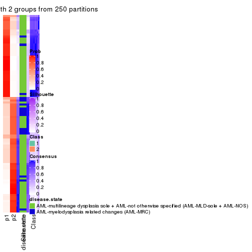</p>

</div>
<div id='tab-SD-kmeans-consensus-heatmap-2'>
<pre><code class="r">consensus_heatmap(res, k = 3)
</code></pre>

<p></p>

</div>
<div id='tab-SD-kmeans-consensus-heatmap-3'>
<pre><code class="r">consensus_heatmap(res, k = 4)
</code></pre>

<p></p>

</div>
<div id='tab-SD-kmeans-consensus-heatmap-4'>
<pre><code class="r">consensus_heatmap(res, k = 5)
</code></pre>

<p></p>

</div>
<div id='tab-SD-kmeans-consensus-heatmap-5'>
<pre><code class="r">consensus_heatmap(res, k = 6)
</code></pre>

<p></p>

</div>
</div>

Heatmaps for the membership of samples in all partitions to see how consistent they are:


<script>
$( function() {
	$( '#tabs-SD-kmeans-membership-heatmap' ).tabs();
} );
</script>
<div id='tabs-SD-kmeans-membership-heatmap'>
<ul>
<li><a href='#tab-SD-kmeans-membership-heatmap-1'>k = 2</a></li>
<li><a href='#tab-SD-kmeans-membership-heatmap-2'>k = 3</a></li>
<li><a href='#tab-SD-kmeans-membership-heatmap-3'>k = 4</a></li>
<li><a href='#tab-SD-kmeans-membership-heatmap-4'>k = 5</a></li>
<li><a href='#tab-SD-kmeans-membership-heatmap-5'>k = 6</a></li>
</ul>
<div id='tab-SD-kmeans-membership-heatmap-1'>
<pre><code class="r">membership_heatmap(res, k = 2)
</code></pre>

<p></p>

</div>
<div id='tab-SD-kmeans-membership-heatmap-2'>
<pre><code class="r">membership_heatmap(res, k = 3)
</code></pre>

<p></p>

</div>
<div id='tab-SD-kmeans-membership-heatmap-3'>
<pre><code class="r">membership_heatmap(res, k = 4)
</code></pre>

<p></p>

</div>
<div id='tab-SD-kmeans-membership-heatmap-4'>
<pre><code class="r">membership_heatmap(res, k = 5)
</code></pre>

<p></p>

</div>
<div id='tab-SD-kmeans-membership-heatmap-5'>
<pre><code class="r">membership_heatmap(res, k = 6)
</code></pre>

<p></p>

</div>
</div>

As soon as we have had the classes for columns, we can look for signatures
which are significantly different between classes which can be candidate marks
for certain classes. Following are the heatmaps for signatures.


Signature heatmaps where rows are scaled:


<script>
$( function() {
	$( '#tabs-SD-kmeans-get-signatures' ).tabs();
} );
</script>
<div id='tabs-SD-kmeans-get-signatures'>
<ul>
<li><a href='#tab-SD-kmeans-get-signatures-1'>k = 2</a></li>
<li><a href='#tab-SD-kmeans-get-signatures-2'>k = 3</a></li>
<li><a href='#tab-SD-kmeans-get-signatures-3'>k = 4</a></li>
<li><a href='#tab-SD-kmeans-get-signatures-4'>k = 5</a></li>
<li><a href='#tab-SD-kmeans-get-signatures-5'>k = 6</a></li>
</ul>
<div id='tab-SD-kmeans-get-signatures-1'>
<pre><code class="r">get_signatures(res, k = 2)
</code></pre>

<pre><code>#&gt; Error: The width or height of the raster image is zero, maybe you forget to turn off the
#&gt; previous graphic device or it was corrupted. Run `dev.off()` to close it.
</code></pre>

<p></p>

</div>
<div id='tab-SD-kmeans-get-signatures-2'>
<pre><code class="r">get_signatures(res, k = 3)
</code></pre>

<pre><code>#&gt; Error: The width or height of the raster image is zero, maybe you forget to turn off the
#&gt; previous graphic device or it was corrupted. Run `dev.off()` to close it.
</code></pre>

<p></p>

</div>
<div id='tab-SD-kmeans-get-signatures-3'>
<pre><code class="r">get_signatures(res, k = 4)
</code></pre>

<pre><code>#&gt; Error: The width or height of the raster image is zero, maybe you forget to turn off the
#&gt; previous graphic device or it was corrupted. Run `dev.off()` to close it.
</code></pre>

<p></p>

</div>
<div id='tab-SD-kmeans-get-signatures-4'>
<pre><code class="r">get_signatures(res, k = 5)
</code></pre>

<pre><code>#&gt; Error: The width or height of the raster image is zero, maybe you forget to turn off the
#&gt; previous graphic device or it was corrupted. Run `dev.off()` to close it.
</code></pre>

<p></p>

</div>
<div id='tab-SD-kmeans-get-signatures-5'>
<pre><code class="r">get_signatures(res, k = 6)
</code></pre>

<pre><code>#&gt; Error: The width or height of the raster image is zero, maybe you forget to turn off the
#&gt; previous graphic device or it was corrupted. Run `dev.off()` to close it.
</code></pre>

<p></p>

</div>
</div>


Signature heatmaps where rows are not scaled:


<script>
$( function() {
	$( '#tabs-SD-kmeans-get-signatures-no-scale' ).tabs();
} );
</script>
<div id='tabs-SD-kmeans-get-signatures-no-scale'>
<ul>
<li><a href='#tab-SD-kmeans-get-signatures-no-scale-1'>k = 2</a></li>
<li><a href='#tab-SD-kmeans-get-signatures-no-scale-2'>k = 3</a></li>
<li><a href='#tab-SD-kmeans-get-signatures-no-scale-3'>k = 4</a></li>
<li><a href='#tab-SD-kmeans-get-signatures-no-scale-4'>k = 5</a></li>
<li><a href='#tab-SD-kmeans-get-signatures-no-scale-5'>k = 6</a></li>
</ul>
<div id='tab-SD-kmeans-get-signatures-no-scale-1'>
<pre><code class="r">get_signatures(res, k = 2, scale_rows = FALSE)
</code></pre>

<pre><code>#&gt; Error: The width or height of the raster image is zero, maybe you forget to turn off the
#&gt; previous graphic device or it was corrupted. Run `dev.off()` to close it.
</code></pre>

<p></p>

</div>
<div id='tab-SD-kmeans-get-signatures-no-scale-2'>
<pre><code class="r">get_signatures(res, k = 3, scale_rows = FALSE)
</code></pre>

<pre><code>#&gt; Error: The width or height of the raster image is zero, maybe you forget to turn off the
#&gt; previous graphic device or it was corrupted. Run `dev.off()` to close it.
</code></pre>

<p></p>

</div>
<div id='tab-SD-kmeans-get-signatures-no-scale-3'>
<pre><code class="r">get_signatures(res, k = 4, scale_rows = FALSE)
</code></pre>

<pre><code>#&gt; Error: The width or height of the raster image is zero, maybe you forget to turn off the
#&gt; previous graphic device or it was corrupted. Run `dev.off()` to close it.
</code></pre>

<p></p>

</div>
<div id='tab-SD-kmeans-get-signatures-no-scale-4'>
<pre><code class="r">get_signatures(res, k = 5, scale_rows = FALSE)
</code></pre>

<pre><code>#&gt; Error: The width or height of the raster image is zero, maybe you forget to turn off the
#&gt; previous graphic device or it was corrupted. Run `dev.off()` to close it.
</code></pre>

<p></p>

</div>
<div id='tab-SD-kmeans-get-signatures-no-scale-5'>
<pre><code class="r">get_signatures(res, k = 6, scale_rows = FALSE)
</code></pre>

<pre><code>#&gt; Error: The width or height of the raster image is zero, maybe you forget to turn off the
#&gt; previous graphic device or it was corrupted. Run `dev.off()` to close it.
</code></pre>

<p></p>

</div>
</div>


Compare the overlap of signatures from different k:

```r
compare_signatures(res)
```


`get_signature()` returns a data frame invisibly. TO get the list of signatures, the function
call should be assigned to a variable explicitly. In following code, if `plot` argument is set
to `FALSE`, no heatmap is plotted while only the differential analysis is performed.

```r
# code only for demonstration
tb = get_signature(res, k = ..., plot = FALSE)
```

An example of the output of `tb` is:

```
#>   which_row         fdr    mean_1    mean_2 scaled_mean_1 scaled_mean_2 km
#> 1        38 0.042760348  8.373488  9.131774    -0.5533452     0.5164555  1
#> 2        40 0.018707592  7.106213  8.469186    -0.6173731     0.5762149  1
#> 3        55 0.019134737 10.221463 11.207825    -0.6159697     0.5749050  1
#> 4        59 0.006059896  5.921854  7.869574    -0.6899429     0.6439467  1
#> 5        60 0.018055526  8.928898 10.211722    -0.6204761     0.5791110  1
#> 6        98 0.009384629 15.714769 14.887706     0.6635654    -0.6193277  2
...
```

The columns in `tb` are:

1. `which_row`: row indices corresponding to the input matrix.
2. `fdr`: FDR for the differential test. 
3. `mean_x`: The mean value in group x.
4. `scaled_mean_x`: The mean value in group x after rows are scaled.
5. `km`: Row groups if k-means clustering is applied to rows.


UMAP plot which shows how samples are separated.


<script>
$( function() {
	$( '#tabs-SD-kmeans-dimension-reduction' ).tabs();
} );
</script>
<div id='tabs-SD-kmeans-dimension-reduction'>
<ul>
<li><a href='#tab-SD-kmeans-dimension-reduction-1'>k = 2</a></li>
<li><a href='#tab-SD-kmeans-dimension-reduction-2'>k = 3</a></li>
<li><a href='#tab-SD-kmeans-dimension-reduction-3'>k = 4</a></li>
<li><a href='#tab-SD-kmeans-dimension-reduction-4'>k = 5</a></li>
<li><a href='#tab-SD-kmeans-dimension-reduction-5'>k = 6</a></li>
</ul>
<div id='tab-SD-kmeans-dimension-reduction-1'>
<pre><code class="r">dimension_reduction(res, k = 2, method = &quot;UMAP&quot;)
</code></pre>

<p></p>

</div>
<div id='tab-SD-kmeans-dimension-reduction-2'>
<pre><code class="r">dimension_reduction(res, k = 3, method = &quot;UMAP&quot;)
</code></pre>

<p></p>

</div>
<div id='tab-SD-kmeans-dimension-reduction-3'>
<pre><code class="r">dimension_reduction(res, k = 4, method = &quot;UMAP&quot;)
</code></pre>

<p></p>

</div>
<div id='tab-SD-kmeans-dimension-reduction-4'>
<pre><code class="r">dimension_reduction(res, k = 5, method = &quot;UMAP&quot;)
</code></pre>

<p></p>

</div>
<div id='tab-SD-kmeans-dimension-reduction-5'>
<pre><code class="r">dimension_reduction(res, k = 6, method = &quot;UMAP&quot;)
</code></pre>

<p></p>

</div>
</div>


Following heatmap shows how subgroups are split when increasing `k`:

```r
collect_classes(res)
```


Test correlation between subgroups and known annotations. If the known
annotation is numeric, one-way ANOVA test is applied, and if the known
annotation is discrete, chi-squared contingency table test is applied.

```r
test_to_known_factors(res)
```

```
#>            n disease.state(p) k
#> SD:kmeans 93          0.11088 2
#> SD:kmeans 94          0.00294 3
#> SD:kmeans 93          0.00365 4
#> SD:kmeans 80          0.02737 5
#> SD:kmeans 55          0.05566 6
```


If matrix rows can be associated to genes, consider to use `functional_enrichment(res,
...)` to perform function enrichment for the signature genes. See [this vignette](http://bioconductor.org/packages/devel/bioc/vignettes/cola/inst/doc/functional_enrichment.html) for more detailed explanations.


 

---------------------------------------------------


### SD:skmeans*


The object with results only for a single top-value method and a single partition method 
can be extracted as:

```r
res = res_list["SD", "skmeans"]
# you can also extract it by
# res = res_list["SD:skmeans"]
```

A summary of `res` and all the functions that can be applied to it:

```r
res
```

```
#> A 'ConsensusPartition' object with k = 2, 3, 4, 5, 6.
#>   On a matrix with 51941 rows and 96 columns.
#>   Top rows (1000, 2000, 3000, 4000, 5000) are extracted by 'SD' method.
#>   Subgroups are detected by 'skmeans' method.
#>   Performed in total 1250 partitions by row resampling.
#>   Best k for subgroups seems to be 4.
#> 
#> Following methods can be applied to this 'ConsensusPartition' object:
#>  [1] "cola_report"             "collect_classes"         "collect_plots"          
#>  [4] "collect_stats"           "colnames"                "compare_signatures"     
#>  [7] "consensus_heatmap"       "dimension_reduction"     "functional_enrichment"  
#> [10] "get_anno_col"            "get_anno"                "get_classes"            
#> [13] "get_consensus"           "get_matrix"              "get_membership"         
#> [16] "get_param"               "get_signatures"          "get_stats"              
#> [19] "is_best_k"               "is_stable_k"             "membership_heatmap"     
#> [22] "ncol"                    "nrow"                    "plot_ecdf"              
#> [25] "rownames"                "select_partition_number" "show"                   
#> [28] "suggest_best_k"          "test_to_known_factors"
```

`collect_plots()` function collects all the plots made from `res` for all `k` (number of partitions)
into one single page to provide an easy and fast comparison between different `k`.

```r
collect_plots(res)
```


The plots are:

- The first row: a plot of the ECDF (empirical cumulative distribution
  function) curves of the consensus matrix for each `k` and the heatmap of
  predicted classes for each `k`.
- The second row: heatmaps of the consensus matrix for each `k`.
- The third row: heatmaps of the membership matrix for each `k`.
- The fouth row: heatmaps of the signatures for each `k`.

All the plots in panels can be made by individual functions and they are
plotted later in this section.

`select_partition_number()` produces several plots showing different
statistics for choosing "optimized" `k`. There are following statistics:

- ECDF curves of the consensus matrix for each `k`;
- 1-PAC. [The PAC
  score](https://en.wikipedia.org/wiki/Consensus_clustering#Over-interpretation_potential_of_consensus_clustering)
  measures the proportion of the ambiguous subgrouping.
- Mean silhouette score.
- Concordance. The mean probability of fiting the consensus class ids in all
  partitions.
- Area increased. Denote $A_k$ as the area under the ECDF curve for current
  `k`, the area increased is defined as $A_k - A_{k-1}$.
- Rand index. The percent of pairs of samples that are both in a same cluster
  or both are not in a same cluster in the partition of k and k-1.
- Jaccard index. The ratio of pairs of samples are both in a same cluster in
  the partition of k and k-1 and the pairs of samples are both in a same
  cluster in the partition k or k-1.

The detailed explanations of these statistics can be found in [the _cola_
vignette](http://bioconductor.org/packages/devel/bioc/vignettes/cola/inst/doc/cola.html#toc_13).

Generally speaking, lower PAC score, higher mean silhouette score or higher
concordance corresponds to better partition. Rand index and Jaccard index
measure how similar the current partition is compared to partition with `k-1`.
If they are too similar, we won't accept `k` is better than `k-1`.

```r
select_partition_number(res)
```


The numeric values for all these statistics can be obtained by `get_stats()`.

```r
get_stats(res)
```

```
#>   k 1-PAC mean_silhouette concordance area_increased  Rand Jaccard
#> 2 2 0.533           0.802       0.912         0.5031 0.498   0.498
#> 3 3 0.901           0.917       0.965         0.3372 0.734   0.512
#> 4 4 0.909           0.886       0.953         0.1195 0.845   0.574
#> 5 5 0.770           0.741       0.851         0.0585 0.893   0.615
#> 6 6 0.741           0.567       0.772         0.0410 0.965   0.834
```

`suggest_best_k()` suggests the best $k$ based on these statistics. The rules are as follows:

- All $k$ with Jaccard index larger than 0.95 are removed because increasing
  $k$ does not provide enough extra information. If all $k$ are removed, it is
  marked as no subgroup is detected.
- For all $k$ with 1-PAC score larger than 0.9, the maximal $k$ is taken as
  the best $k$, and other $k$ are marked as optional $k$.
- If it does not fit the second rule. The $k$ with the maximal vote of the
  highest 1-PAC score, highest mean silhouette, and highest concordance is
  taken as the best $k$.

```r
suggest_best_k(res)
```

```
#> [1] 4
#> attr(,"optional")
#> [1] 3
```

There is also optional best $k$ = 3 that is worth to check.

Following shows the table of the partitions (You need to click the **show/hide
code output** link to see it). The membership matrix (columns with name `p*`)
is inferred by
[`clue::cl_consensus()`](https://www.rdocumentation.org/link/cl_consensus?package=clue)
function with the `SE` method. Basically the value in the membership matrix
represents the probability to belong to a certain group. The finall class
label for an item is determined with the group with highest probability it
belongs to.

In `get_classes()` function, the entropy is calculated from the membership
matrix and the silhouette score is calculated from the consensus matrix.


<script>
$( function() {
	$( '#tabs-SD-skmeans-get-classes' ).tabs();
} );
</script>
<div id='tabs-SD-skmeans-get-classes'>
<ul>
<li><a href='#tab-SD-skmeans-get-classes-1'>k = 2</a></li>
<li><a href='#tab-SD-skmeans-get-classes-2'>k = 3</a></li>
<li><a href='#tab-SD-skmeans-get-classes-3'>k = 4</a></li>
<li><a href='#tab-SD-skmeans-get-classes-4'>k = 5</a></li>
<li><a href='#tab-SD-skmeans-get-classes-5'>k = 6</a></li>
</ul>

<div id='tab-SD-skmeans-get-classes-1'>
<p><a id='tab-SD-skmeans-get-classes-1-a' style='color:#0366d6' href='#'>show/hide code output</a></p>
<pre><code class="r">cbind(get_classes(res, k = 2), get_membership(res, k = 2))
</code></pre>

<pre><code>#&gt;           class entropy silhouette    p1    p2
#&gt; GSM531600     2  0.0000    0.88751 0.000 1.000
#&gt; GSM531601     2  0.7219    0.77476 0.200 0.800
#&gt; GSM531605     1  0.5842    0.80348 0.860 0.140
#&gt; GSM531615     2  0.7950    0.73051 0.240 0.760
#&gt; GSM531617     2  0.7219    0.77476 0.200 0.800
#&gt; GSM531624     2  0.7219    0.77476 0.200 0.800
#&gt; GSM531627     2  0.0000    0.88751 0.000 1.000
#&gt; GSM531629     1  0.9754    0.17241 0.592 0.408
#&gt; GSM531631     2  0.7219    0.77476 0.200 0.800
#&gt; GSM531634     2  0.7219    0.77476 0.200 0.800
#&gt; GSM531636     2  0.0000    0.88751 0.000 1.000
#&gt; GSM531637     2  0.7219    0.77476 0.200 0.800
#&gt; GSM531654     2  0.8909    0.64331 0.308 0.692
#&gt; GSM531655     2  0.9286    0.38337 0.344 0.656
#&gt; GSM531658     1  0.0000    0.89938 1.000 0.000
#&gt; GSM531660     1  0.0000    0.89938 1.000 0.000
#&gt; GSM531602     1  0.0000    0.89938 1.000 0.000
#&gt; GSM531603     1  0.0000    0.89938 1.000 0.000
#&gt; GSM531604     1  0.7219    0.75224 0.800 0.200
#&gt; GSM531606     1  0.0000    0.89938 1.000 0.000
#&gt; GSM531607     1  0.0000    0.89938 1.000 0.000
#&gt; GSM531608     2  0.8016    0.72645 0.244 0.756
#&gt; GSM531609     1  0.0000    0.89938 1.000 0.000
#&gt; GSM531610     1  0.0000    0.89938 1.000 0.000
#&gt; GSM531611     1  0.0000    0.89938 1.000 0.000
#&gt; GSM531612     1  0.0000    0.89938 1.000 0.000
#&gt; GSM531613     1  0.0000    0.89938 1.000 0.000
#&gt; GSM531614     1  0.0000    0.89938 1.000 0.000
#&gt; GSM531616     2  0.0000    0.88751 0.000 1.000
#&gt; GSM531618     1  0.9954   -0.02335 0.540 0.460
#&gt; GSM531619     2  0.7219    0.77476 0.200 0.800
#&gt; GSM531620     2  0.0000    0.88751 0.000 1.000
#&gt; GSM531621     2  0.0000    0.88751 0.000 1.000
#&gt; GSM531622     2  0.7219    0.77476 0.200 0.800
#&gt; GSM531623     2  0.0000    0.88751 0.000 1.000
#&gt; GSM531625     2  0.0000    0.88751 0.000 1.000
#&gt; GSM531626     2  0.0000    0.88751 0.000 1.000
#&gt; GSM531628     2  0.0000    0.88751 0.000 1.000
#&gt; GSM531630     2  0.5842    0.81492 0.140 0.860
#&gt; GSM531632     2  0.0000    0.88751 0.000 1.000
#&gt; GSM531633     2  0.0000    0.88751 0.000 1.000
#&gt; GSM531635     2  0.0000    0.88751 0.000 1.000
#&gt; GSM531638     2  0.0000    0.88751 0.000 1.000
#&gt; GSM531639     2  0.0000    0.88751 0.000 1.000
#&gt; GSM531640     2  0.7219    0.77476 0.200 0.800
#&gt; GSM531641     1  0.0000    0.89938 1.000 0.000
#&gt; GSM531642     2  0.0000    0.88751 0.000 1.000
#&gt; GSM531643     2  0.0000    0.88751 0.000 1.000
#&gt; GSM531644     2  0.0000    0.88751 0.000 1.000
#&gt; GSM531645     1  0.0000    0.89938 1.000 0.000
#&gt; GSM531646     2  0.0000    0.88751 0.000 1.000
#&gt; GSM531647     2  0.0000    0.88751 0.000 1.000
#&gt; GSM531648     1  0.4939    0.79997 0.892 0.108
#&gt; GSM531649     2  0.0000    0.88751 0.000 1.000
#&gt; GSM531650     2  0.0000    0.88751 0.000 1.000
#&gt; GSM531651     2  0.0000    0.88751 0.000 1.000
#&gt; GSM531652     2  0.0672    0.88441 0.008 0.992
#&gt; GSM531653     2  0.0000    0.88751 0.000 1.000
#&gt; GSM531656     2  0.0000    0.88751 0.000 1.000
#&gt; GSM531657     1  0.0000    0.89938 1.000 0.000
#&gt; GSM531659     1  0.0000    0.89938 1.000 0.000
#&gt; GSM531661     2  0.7219    0.77476 0.200 0.800
#&gt; GSM531662     2  0.0000    0.88751 0.000 1.000
#&gt; GSM531663     1  0.0000    0.89938 1.000 0.000
#&gt; GSM531664     2  0.2778    0.85505 0.048 0.952
#&gt; GSM531665     1  0.9732    0.41892 0.596 0.404
#&gt; GSM531666     1  0.9850    0.38216 0.572 0.428
#&gt; GSM531667     2  0.7219    0.77476 0.200 0.800
#&gt; GSM531668     1  0.0000    0.89938 1.000 0.000
#&gt; GSM531669     2  0.0000    0.88751 0.000 1.000
#&gt; GSM531670     2  0.0000    0.88751 0.000 1.000
#&gt; GSM531671     2  0.0000    0.88751 0.000 1.000
#&gt; GSM531672     1  0.0000    0.89938 1.000 0.000
#&gt; GSM531673     2  0.8909    0.47148 0.308 0.692
#&gt; GSM531674     2  0.0000    0.88751 0.000 1.000
#&gt; GSM531675     1  0.0000    0.89938 1.000 0.000
#&gt; GSM531676     1  0.7219    0.75224 0.800 0.200
#&gt; GSM531677     1  0.0000    0.89938 1.000 0.000
#&gt; GSM531678     1  0.0000    0.89938 1.000 0.000
#&gt; GSM531679     1  0.0000    0.89938 1.000 0.000
#&gt; GSM531680     1  0.7219    0.75224 0.800 0.200
#&gt; GSM531681     1  0.0000    0.89938 1.000 0.000
#&gt; GSM531682     1  0.0000    0.89938 1.000 0.000
#&gt; GSM531683     1  0.0000    0.89938 1.000 0.000
#&gt; GSM531684     1  0.0000    0.89938 1.000 0.000
#&gt; GSM531685     2  0.9954   -0.00187 0.460 0.540
#&gt; GSM531686     1  0.0000    0.89938 1.000 0.000
#&gt; GSM531687     1  0.7219    0.75224 0.800 0.200
#&gt; GSM531688     1  0.9286    0.54909 0.656 0.344
#&gt; GSM531689     1  0.7219    0.75224 0.800 0.200
#&gt; GSM531690     1  0.0000    0.89938 1.000 0.000
#&gt; GSM531691     1  0.7219    0.75224 0.800 0.200
#&gt; GSM531692     2  0.9881    0.09095 0.436 0.564
#&gt; GSM531693     2  0.2603    0.85803 0.044 0.956
#&gt; GSM531694     1  0.0000    0.89938 1.000 0.000
#&gt; GSM531695     1  0.7219    0.75224 0.800 0.200
</code></pre>

<script>
$('#tab-SD-skmeans-get-classes-1-a').parent().next().next().hide();
$('#tab-SD-skmeans-get-classes-1-a').click(function(){
  $('#tab-SD-skmeans-get-classes-1-a').parent().next().next().toggle();
  return(false);
});
</script>
</div>

<div id='tab-SD-skmeans-get-classes-2'>
<p><a id='tab-SD-skmeans-get-classes-2-a' style='color:#0366d6' href='#'>show/hide code output</a></p>
<pre><code class="r">cbind(get_classes(res, k = 3), get_membership(res, k = 3))
</code></pre>

<pre><code>#&gt;           class entropy silhouette    p1    p2    p3
#&gt; GSM531600     3  0.0000      0.976 0.000 0.000 1.000
#&gt; GSM531601     2  0.0000      0.942 0.000 1.000 0.000
#&gt; GSM531605     1  0.4346      0.783 0.816 0.184 0.000
#&gt; GSM531615     2  0.0000      0.942 0.000 1.000 0.000
#&gt; GSM531617     2  0.3482      0.825 0.128 0.872 0.000
#&gt; GSM531624     2  0.0000      0.942 0.000 1.000 0.000
#&gt; GSM531627     2  0.0000      0.942 0.000 1.000 0.000
#&gt; GSM531629     2  0.4291      0.761 0.180 0.820 0.000
#&gt; GSM531631     2  0.0000      0.942 0.000 1.000 0.000
#&gt; GSM531634     2  0.0000      0.942 0.000 1.000 0.000
#&gt; GSM531636     3  0.0237      0.972 0.000 0.004 0.996
#&gt; GSM531637     2  0.0000      0.942 0.000 1.000 0.000
#&gt; GSM531654     2  0.0000      0.942 0.000 1.000 0.000
#&gt; GSM531655     3  0.6140      0.309 0.000 0.404 0.596
#&gt; GSM531658     1  0.0000      0.969 1.000 0.000 0.000
#&gt; GSM531660     1  0.0000      0.969 1.000 0.000 0.000
#&gt; GSM531602     1  0.0000      0.969 1.000 0.000 0.000
#&gt; GSM531603     1  0.0000      0.969 1.000 0.000 0.000
#&gt; GSM531604     1  0.4555      0.761 0.800 0.200 0.000
#&gt; GSM531606     1  0.0000      0.969 1.000 0.000 0.000
#&gt; GSM531607     1  0.0000      0.969 1.000 0.000 0.000
#&gt; GSM531608     2  0.0000      0.942 0.000 1.000 0.000
#&gt; GSM531609     1  0.0000      0.969 1.000 0.000 0.000
#&gt; GSM531610     1  0.0000      0.969 1.000 0.000 0.000
#&gt; GSM531611     1  0.0000      0.969 1.000 0.000 0.000
#&gt; GSM531612     1  0.0000      0.969 1.000 0.000 0.000
#&gt; GSM531613     1  0.0000      0.969 1.000 0.000 0.000
#&gt; GSM531614     1  0.0000      0.969 1.000 0.000 0.000
#&gt; GSM531616     2  0.6140      0.366 0.000 0.596 0.404
#&gt; GSM531618     1  0.4931      0.692 0.768 0.232 0.000
#&gt; GSM531619     2  0.0000      0.942 0.000 1.000 0.000
#&gt; GSM531620     2  0.0000      0.942 0.000 1.000 0.000
#&gt; GSM531621     2  0.0000      0.942 0.000 1.000 0.000
#&gt; GSM531622     2  0.0000      0.942 0.000 1.000 0.000
#&gt; GSM531623     2  0.0000      0.942 0.000 1.000 0.000
#&gt; GSM531625     2  0.0747      0.931 0.000 0.984 0.016
#&gt; GSM531626     2  0.1643      0.909 0.000 0.956 0.044
#&gt; GSM531628     3  0.0000      0.976 0.000 0.000 1.000
#&gt; GSM531630     2  0.0000      0.942 0.000 1.000 0.000
#&gt; GSM531632     3  0.0000      0.976 0.000 0.000 1.000
#&gt; GSM531633     2  0.0000      0.942 0.000 1.000 0.000
#&gt; GSM531635     3  0.0000      0.976 0.000 0.000 1.000
#&gt; GSM531638     2  0.0892      0.928 0.000 0.980 0.020
#&gt; GSM531639     3  0.5058      0.656 0.000 0.244 0.756
#&gt; GSM531640     2  0.0000      0.942 0.000 1.000 0.000
#&gt; GSM531641     1  0.0000      0.969 1.000 0.000 0.000
#&gt; GSM531642     3  0.0000      0.976 0.000 0.000 1.000
#&gt; GSM531643     3  0.0000      0.976 0.000 0.000 1.000
#&gt; GSM531644     3  0.0000      0.976 0.000 0.000 1.000
#&gt; GSM531645     1  0.0000      0.969 1.000 0.000 0.000
#&gt; GSM531646     3  0.0000      0.976 0.000 0.000 1.000
#&gt; GSM531647     3  0.0000      0.976 0.000 0.000 1.000
#&gt; GSM531648     1  0.0000      0.969 1.000 0.000 0.000
#&gt; GSM531649     3  0.0000      0.976 0.000 0.000 1.000
#&gt; GSM531650     3  0.0000      0.976 0.000 0.000 1.000
#&gt; GSM531651     2  0.0000      0.942 0.000 1.000 0.000
#&gt; GSM531652     3  0.0000      0.976 0.000 0.000 1.000
#&gt; GSM531653     3  0.0000      0.976 0.000 0.000 1.000
#&gt; GSM531656     3  0.0000      0.976 0.000 0.000 1.000
#&gt; GSM531657     1  0.0000      0.969 1.000 0.000 0.000
#&gt; GSM531659     1  0.0000      0.969 1.000 0.000 0.000
#&gt; GSM531661     2  0.0000      0.942 0.000 1.000 0.000
#&gt; GSM531662     2  0.0000      0.942 0.000 1.000 0.000
#&gt; GSM531663     1  0.0000      0.969 1.000 0.000 0.000
#&gt; GSM531664     3  0.0000      0.976 0.000 0.000 1.000
#&gt; GSM531665     3  0.0000      0.976 0.000 0.000 1.000
#&gt; GSM531666     3  0.0000      0.976 0.000 0.000 1.000
#&gt; GSM531667     2  0.0000      0.942 0.000 1.000 0.000
#&gt; GSM531668     1  0.0000      0.969 1.000 0.000 0.000
#&gt; GSM531669     3  0.0000      0.976 0.000 0.000 1.000
#&gt; GSM531670     3  0.0000      0.976 0.000 0.000 1.000
#&gt; GSM531671     2  0.6244      0.270 0.000 0.560 0.440
#&gt; GSM531672     1  0.0000      0.969 1.000 0.000 0.000
#&gt; GSM531673     2  0.0000      0.942 0.000 1.000 0.000
#&gt; GSM531674     3  0.0000      0.976 0.000 0.000 1.000
#&gt; GSM531675     1  0.0000      0.969 1.000 0.000 0.000
#&gt; GSM531676     3  0.0000      0.976 0.000 0.000 1.000
#&gt; GSM531677     1  0.0000      0.969 1.000 0.000 0.000
#&gt; GSM531678     1  0.0000      0.969 1.000 0.000 0.000
#&gt; GSM531679     1  0.0000      0.969 1.000 0.000 0.000
#&gt; GSM531680     3  0.0000      0.976 0.000 0.000 1.000
#&gt; GSM531681     1  0.0000      0.969 1.000 0.000 0.000
#&gt; GSM531682     1  0.0000      0.969 1.000 0.000 0.000
#&gt; GSM531683     1  0.0000      0.969 1.000 0.000 0.000
#&gt; GSM531684     2  0.0237      0.939 0.004 0.996 0.000
#&gt; GSM531685     3  0.0000      0.976 0.000 0.000 1.000
#&gt; GSM531686     1  0.0000      0.969 1.000 0.000 0.000
#&gt; GSM531687     3  0.0000      0.976 0.000 0.000 1.000
#&gt; GSM531688     3  0.0000      0.976 0.000 0.000 1.000
#&gt; GSM531689     1  0.4555      0.753 0.800 0.000 0.200
#&gt; GSM531690     1  0.0000      0.969 1.000 0.000 0.000
#&gt; GSM531691     1  0.4733      0.756 0.800 0.004 0.196
#&gt; GSM531692     2  0.6180      0.336 0.000 0.584 0.416
#&gt; GSM531693     3  0.0000      0.976 0.000 0.000 1.000
#&gt; GSM531694     1  0.0000      0.969 1.000 0.000 0.000
#&gt; GSM531695     3  0.0000      0.976 0.000 0.000 1.000
</code></pre>

<script>
$('#tab-SD-skmeans-get-classes-2-a').parent().next().next().hide();
$('#tab-SD-skmeans-get-classes-2-a').click(function(){
  $('#tab-SD-skmeans-get-classes-2-a').parent().next().next().toggle();
  return(false);
});
</script>
</div>

<div id='tab-SD-skmeans-get-classes-3'>
<p><a id='tab-SD-skmeans-get-classes-3-a' style='color:#0366d6' href='#'>show/hide code output</a></p>
<pre><code class="r">cbind(get_classes(res, k = 4), get_membership(res, k = 4))
</code></pre>

<pre><code>#&gt;           class entropy silhouette    p1    p2    p3    p4
#&gt; GSM531600     3  0.0000     0.8994 0.000 0.000 1.000 0.000
#&gt; GSM531601     2  0.0000     0.9786 0.000 1.000 0.000 0.000
#&gt; GSM531605     1  0.0000     0.9279 1.000 0.000 0.000 0.000
#&gt; GSM531615     2  0.0000     0.9786 0.000 1.000 0.000 0.000
#&gt; GSM531617     2  0.3219     0.8043 0.000 0.836 0.000 0.164
#&gt; GSM531624     2  0.0000     0.9786 0.000 1.000 0.000 0.000
#&gt; GSM531627     2  0.0000     0.9786 0.000 1.000 0.000 0.000
#&gt; GSM531629     2  0.3873     0.7168 0.000 0.772 0.000 0.228
#&gt; GSM531631     2  0.0000     0.9786 0.000 1.000 0.000 0.000
#&gt; GSM531634     2  0.0000     0.9786 0.000 1.000 0.000 0.000
#&gt; GSM531636     3  0.0469     0.8910 0.000 0.012 0.988 0.000
#&gt; GSM531637     2  0.0000     0.9786 0.000 1.000 0.000 0.000
#&gt; GSM531654     2  0.1637     0.9275 0.060 0.940 0.000 0.000
#&gt; GSM531655     3  0.6347     0.3147 0.068 0.384 0.548 0.000
#&gt; GSM531658     4  0.0000     0.9896 0.000 0.000 0.000 1.000
#&gt; GSM531660     4  0.0188     0.9867 0.004 0.000 0.000 0.996
#&gt; GSM531602     1  0.0188     0.9270 0.996 0.000 0.000 0.004
#&gt; GSM531603     1  0.0188     0.9270 0.996 0.000 0.000 0.004
#&gt; GSM531604     1  0.0000     0.9279 1.000 0.000 0.000 0.000
#&gt; GSM531606     1  0.0000     0.9279 1.000 0.000 0.000 0.000
#&gt; GSM531607     1  0.0000     0.9279 1.000 0.000 0.000 0.000
#&gt; GSM531608     2  0.0000     0.9786 0.000 1.000 0.000 0.000
#&gt; GSM531609     4  0.0000     0.9896 0.000 0.000 0.000 1.000
#&gt; GSM531610     4  0.0000     0.9896 0.000 0.000 0.000 1.000
#&gt; GSM531611     4  0.0000     0.9896 0.000 0.000 0.000 1.000
#&gt; GSM531612     4  0.0000     0.9896 0.000 0.000 0.000 1.000
#&gt; GSM531613     4  0.0000     0.9896 0.000 0.000 0.000 1.000
#&gt; GSM531614     4  0.0000     0.9896 0.000 0.000 0.000 1.000
#&gt; GSM531616     3  0.4977     0.1790 0.000 0.460 0.540 0.000
#&gt; GSM531618     4  0.0000     0.9896 0.000 0.000 0.000 1.000
#&gt; GSM531619     2  0.0000     0.9786 0.000 1.000 0.000 0.000
#&gt; GSM531620     2  0.0000     0.9786 0.000 1.000 0.000 0.000
#&gt; GSM531621     2  0.0000     0.9786 0.000 1.000 0.000 0.000
#&gt; GSM531622     2  0.0000     0.9786 0.000 1.000 0.000 0.000
#&gt; GSM531623     2  0.0000     0.9786 0.000 1.000 0.000 0.000
#&gt; GSM531625     2  0.0000     0.9786 0.000 1.000 0.000 0.000
#&gt; GSM531626     2  0.1118     0.9462 0.000 0.964 0.036 0.000
#&gt; GSM531628     3  0.0000     0.8994 0.000 0.000 1.000 0.000
#&gt; GSM531630     2  0.0000     0.9786 0.000 1.000 0.000 0.000
#&gt; GSM531632     3  0.0000     0.8994 0.000 0.000 1.000 0.000
#&gt; GSM531633     2  0.0000     0.9786 0.000 1.000 0.000 0.000
#&gt; GSM531635     3  0.0000     0.8994 0.000 0.000 1.000 0.000
#&gt; GSM531638     2  0.0707     0.9618 0.000 0.980 0.020 0.000
#&gt; GSM531639     3  0.3444     0.7284 0.000 0.184 0.816 0.000
#&gt; GSM531640     2  0.0000     0.9786 0.000 1.000 0.000 0.000
#&gt; GSM531641     4  0.0000     0.9896 0.000 0.000 0.000 1.000
#&gt; GSM531642     3  0.0000     0.8994 0.000 0.000 1.000 0.000
#&gt; GSM531643     3  0.0000     0.8994 0.000 0.000 1.000 0.000
#&gt; GSM531644     3  0.0000     0.8994 0.000 0.000 1.000 0.000
#&gt; GSM531645     4  0.0000     0.9896 0.000 0.000 0.000 1.000
#&gt; GSM531646     3  0.0000     0.8994 0.000 0.000 1.000 0.000
#&gt; GSM531647     3  0.0000     0.8994 0.000 0.000 1.000 0.000
#&gt; GSM531648     4  0.0000     0.9896 0.000 0.000 0.000 1.000
#&gt; GSM531649     3  0.0000     0.8994 0.000 0.000 1.000 0.000
#&gt; GSM531650     3  0.0000     0.8994 0.000 0.000 1.000 0.000
#&gt; GSM531651     2  0.0000     0.9786 0.000 1.000 0.000 0.000
#&gt; GSM531652     3  0.1211     0.8672 0.000 0.000 0.960 0.040
#&gt; GSM531653     3  0.0000     0.8994 0.000 0.000 1.000 0.000
#&gt; GSM531656     3  0.0000     0.8994 0.000 0.000 1.000 0.000
#&gt; GSM531657     4  0.0000     0.9896 0.000 0.000 0.000 1.000
#&gt; GSM531659     4  0.0000     0.9896 0.000 0.000 0.000 1.000
#&gt; GSM531661     2  0.0000     0.9786 0.000 1.000 0.000 0.000
#&gt; GSM531662     2  0.0000     0.9786 0.000 1.000 0.000 0.000
#&gt; GSM531663     4  0.0000     0.9896 0.000 0.000 0.000 1.000
#&gt; GSM531664     3  0.0000     0.8994 0.000 0.000 1.000 0.000
#&gt; GSM531665     3  0.4977     0.0659 0.460 0.000 0.540 0.000
#&gt; GSM531666     3  0.0000     0.8994 0.000 0.000 1.000 0.000
#&gt; GSM531667     2  0.0000     0.9786 0.000 1.000 0.000 0.000
#&gt; GSM531668     4  0.0000     0.9896 0.000 0.000 0.000 1.000
#&gt; GSM531669     3  0.0000     0.8994 0.000 0.000 1.000 0.000
#&gt; GSM531670     3  0.0000     0.8994 0.000 0.000 1.000 0.000
#&gt; GSM531671     3  0.4916     0.2843 0.000 0.424 0.576 0.000
#&gt; GSM531672     4  0.0000     0.9896 0.000 0.000 0.000 1.000
#&gt; GSM531673     1  0.4040     0.6801 0.752 0.248 0.000 0.000
#&gt; GSM531674     3  0.0000     0.8994 0.000 0.000 1.000 0.000
#&gt; GSM531675     1  0.4898     0.3162 0.584 0.000 0.000 0.416
#&gt; GSM531676     1  0.3266     0.7958 0.832 0.000 0.168 0.000
#&gt; GSM531677     1  0.0592     0.9200 0.984 0.000 0.000 0.016
#&gt; GSM531678     1  0.0000     0.9279 1.000 0.000 0.000 0.000
#&gt; GSM531679     1  0.0000     0.9279 1.000 0.000 0.000 0.000
#&gt; GSM531680     1  0.3569     0.7630 0.804 0.000 0.196 0.000
#&gt; GSM531681     4  0.1474     0.9456 0.052 0.000 0.000 0.948
#&gt; GSM531682     1  0.0000     0.9279 1.000 0.000 0.000 0.000
#&gt; GSM531683     1  0.0188     0.9270 0.996 0.000 0.000 0.004
#&gt; GSM531684     1  0.0188     0.9263 0.996 0.004 0.000 0.000
#&gt; GSM531685     1  0.3569     0.7630 0.804 0.000 0.196 0.000
#&gt; GSM531686     4  0.2011     0.9189 0.080 0.000 0.000 0.920
#&gt; GSM531687     1  0.3311     0.7916 0.828 0.000 0.172 0.000
#&gt; GSM531688     3  0.0000     0.8994 0.000 0.000 1.000 0.000
#&gt; GSM531689     1  0.0000     0.9279 1.000 0.000 0.000 0.000
#&gt; GSM531690     4  0.1474     0.9456 0.052 0.000 0.000 0.948
#&gt; GSM531691     1  0.0000     0.9279 1.000 0.000 0.000 0.000
#&gt; GSM531692     1  0.0000     0.9279 1.000 0.000 0.000 0.000
#&gt; GSM531693     3  0.0000     0.8994 0.000 0.000 1.000 0.000
#&gt; GSM531694     1  0.0188     0.9270 0.996 0.000 0.000 0.004
#&gt; GSM531695     3  0.4843     0.2764 0.396 0.000 0.604 0.000
</code></pre>

<script>
$('#tab-SD-skmeans-get-classes-3-a').parent().next().next().hide();
$('#tab-SD-skmeans-get-classes-3-a').click(function(){
  $('#tab-SD-skmeans-get-classes-3-a').parent().next().next().toggle();
  return(false);
});
</script>
</div>

<div id='tab-SD-skmeans-get-classes-4'>
<p><a id='tab-SD-skmeans-get-classes-4-a' style='color:#0366d6' href='#'>show/hide code output</a></p>
<pre><code class="r">cbind(get_classes(res, k = 5), get_membership(res, k = 5))
</code></pre>

<pre><code>#&gt;           class entropy silhouette    p1    p2    p3    p4    p5
#&gt; GSM531600     3  0.2020      0.901 0.100 0.000 0.900 0.000 0.000
#&gt; GSM531601     2  0.3195      0.816 0.040 0.856 0.004 0.000 0.100
#&gt; GSM531605     5  0.2516      0.471 0.140 0.000 0.000 0.000 0.860
#&gt; GSM531615     2  0.2471      0.808 0.000 0.864 0.000 0.000 0.136
#&gt; GSM531617     2  0.2798      0.799 0.008 0.852 0.000 0.000 0.140
#&gt; GSM531624     2  0.0000      0.892 0.000 1.000 0.000 0.000 0.000
#&gt; GSM531627     2  0.1671      0.881 0.076 0.924 0.000 0.000 0.000
#&gt; GSM531629     2  0.5426      0.605 0.012 0.692 0.000 0.144 0.152
#&gt; GSM531631     2  0.0000      0.892 0.000 1.000 0.000 0.000 0.000
#&gt; GSM531634     2  0.2304      0.836 0.008 0.892 0.000 0.000 0.100
#&gt; GSM531636     3  0.2677      0.878 0.112 0.016 0.872 0.000 0.000
#&gt; GSM531637     2  0.0000      0.892 0.000 1.000 0.000 0.000 0.000
#&gt; GSM531654     5  0.5670      0.159 0.084 0.388 0.000 0.000 0.528
#&gt; GSM531655     5  0.7977      0.181 0.116 0.176 0.304 0.000 0.404
#&gt; GSM531658     4  0.0290      0.893 0.008 0.000 0.000 0.992 0.000
#&gt; GSM531660     5  0.5638      0.256 0.016 0.048 0.000 0.384 0.552
#&gt; GSM531602     5  0.0510      0.650 0.016 0.000 0.000 0.000 0.984
#&gt; GSM531603     5  0.0000      0.649 0.000 0.000 0.000 0.000 1.000
#&gt; GSM531604     1  0.4227      0.457 0.580 0.000 0.000 0.000 0.420
#&gt; GSM531606     5  0.0880      0.647 0.032 0.000 0.000 0.000 0.968
#&gt; GSM531607     5  0.0510      0.650 0.016 0.000 0.000 0.000 0.984
#&gt; GSM531608     2  0.1831      0.861 0.076 0.920 0.000 0.000 0.004
#&gt; GSM531609     4  0.0000      0.897 0.000 0.000 0.000 1.000 0.000
#&gt; GSM531610     4  0.0000      0.897 0.000 0.000 0.000 1.000 0.000
#&gt; GSM531611     4  0.0000      0.897 0.000 0.000 0.000 1.000 0.000
#&gt; GSM531612     4  0.0000      0.897 0.000 0.000 0.000 1.000 0.000
#&gt; GSM531613     4  0.0000      0.897 0.000 0.000 0.000 1.000 0.000
#&gt; GSM531614     4  0.0000      0.897 0.000 0.000 0.000 1.000 0.000
#&gt; GSM531616     2  0.5884      0.139 0.100 0.480 0.420 0.000 0.000
#&gt; GSM531618     4  0.4748      0.658 0.040 0.056 0.000 0.768 0.136
#&gt; GSM531619     2  0.0000      0.892 0.000 1.000 0.000 0.000 0.000
#&gt; GSM531620     2  0.1478      0.885 0.064 0.936 0.000 0.000 0.000
#&gt; GSM531621     2  0.1608      0.882 0.072 0.928 0.000 0.000 0.000
#&gt; GSM531622     2  0.0000      0.892 0.000 1.000 0.000 0.000 0.000
#&gt; GSM531623     2  0.0963      0.891 0.036 0.964 0.000 0.000 0.000
#&gt; GSM531625     2  0.2361      0.865 0.096 0.892 0.012 0.000 0.000
#&gt; GSM531626     2  0.3130      0.843 0.096 0.856 0.048 0.000 0.000
#&gt; GSM531628     3  0.0290      0.929 0.008 0.000 0.992 0.000 0.000
#&gt; GSM531630     2  0.0703      0.892 0.024 0.976 0.000 0.000 0.000
#&gt; GSM531632     3  0.2280      0.849 0.120 0.000 0.880 0.000 0.000
#&gt; GSM531633     2  0.1608      0.882 0.072 0.928 0.000 0.000 0.000
#&gt; GSM531635     3  0.1121      0.926 0.044 0.000 0.956 0.000 0.000
#&gt; GSM531638     2  0.2983      0.847 0.096 0.864 0.040 0.000 0.000
#&gt; GSM531639     3  0.4593      0.727 0.124 0.128 0.748 0.000 0.000
#&gt; GSM531640     2  0.0000      0.892 0.000 1.000 0.000 0.000 0.000
#&gt; GSM531641     4  0.0000      0.897 0.000 0.000 0.000 1.000 0.000
#&gt; GSM531642     3  0.1121      0.926 0.044 0.000 0.956 0.000 0.000
#&gt; GSM531643     3  0.0162      0.930 0.004 0.000 0.996 0.000 0.000
#&gt; GSM531644     3  0.0963      0.926 0.036 0.000 0.964 0.000 0.000
#&gt; GSM531645     4  0.0000      0.897 0.000 0.000 0.000 1.000 0.000
#&gt; GSM531646     3  0.0510      0.928 0.016 0.000 0.984 0.000 0.000
#&gt; GSM531647     3  0.0404      0.928 0.012 0.000 0.988 0.000 0.000
#&gt; GSM531648     4  0.1041      0.876 0.032 0.000 0.000 0.964 0.004
#&gt; GSM531649     3  0.1908      0.904 0.092 0.000 0.908 0.000 0.000
#&gt; GSM531650     3  0.0162      0.929 0.004 0.000 0.996 0.000 0.000
#&gt; GSM531651     2  0.1043      0.891 0.040 0.960 0.000 0.000 0.000
#&gt; GSM531652     3  0.1282      0.921 0.044 0.000 0.952 0.000 0.004
#&gt; GSM531653     3  0.0794      0.929 0.028 0.000 0.972 0.000 0.000
#&gt; GSM531656     3  0.1965      0.900 0.096 0.000 0.904 0.000 0.000
#&gt; GSM531657     4  0.0000      0.897 0.000 0.000 0.000 1.000 0.000
#&gt; GSM531659     4  0.0000      0.897 0.000 0.000 0.000 1.000 0.000
#&gt; GSM531661     2  0.1671      0.862 0.076 0.924 0.000 0.000 0.000
#&gt; GSM531662     2  0.4161      0.755 0.208 0.752 0.000 0.000 0.040
#&gt; GSM531663     4  0.0000      0.897 0.000 0.000 0.000 1.000 0.000
#&gt; GSM531664     3  0.0510      0.926 0.016 0.000 0.984 0.000 0.000
#&gt; GSM531665     1  0.3728      0.547 0.748 0.000 0.244 0.000 0.008
#&gt; GSM531666     3  0.0963      0.926 0.036 0.000 0.964 0.000 0.000
#&gt; GSM531667     2  0.0000      0.892 0.000 1.000 0.000 0.000 0.000
#&gt; GSM531668     5  0.5262      0.235 0.016 0.024 0.000 0.400 0.560
#&gt; GSM531669     3  0.2127      0.862 0.108 0.000 0.892 0.000 0.000
#&gt; GSM531670     3  0.1965      0.900 0.096 0.000 0.904 0.000 0.000
#&gt; GSM531671     1  0.5814      0.367 0.584 0.128 0.288 0.000 0.000
#&gt; GSM531672     4  0.0290      0.893 0.008 0.000 0.000 0.992 0.000
#&gt; GSM531673     1  0.4486      0.439 0.748 0.080 0.000 0.000 0.172
#&gt; GSM531674     3  0.1270      0.907 0.052 0.000 0.948 0.000 0.000
#&gt; GSM531675     4  0.5026      0.366 0.040 0.000 0.000 0.588 0.372
#&gt; GSM531676     1  0.4372      0.661 0.756 0.000 0.072 0.000 0.172
#&gt; GSM531677     1  0.6000      0.445 0.460 0.000 0.000 0.112 0.428
#&gt; GSM531678     1  0.4305      0.490 0.512 0.000 0.000 0.000 0.488
#&gt; GSM531679     1  0.4304      0.497 0.516 0.000 0.000 0.000 0.484
#&gt; GSM531680     1  0.4933      0.659 0.688 0.000 0.076 0.000 0.236
#&gt; GSM531681     4  0.3636      0.623 0.000 0.000 0.000 0.728 0.272
#&gt; GSM531682     1  0.4304      0.497 0.516 0.000 0.000 0.000 0.484
#&gt; GSM531683     5  0.0510      0.650 0.016 0.000 0.000 0.000 0.984
#&gt; GSM531684     5  0.4254      0.510 0.148 0.080 0.000 0.000 0.772
#&gt; GSM531685     1  0.3575      0.650 0.824 0.000 0.056 0.000 0.120
#&gt; GSM531686     4  0.3636      0.623 0.000 0.000 0.000 0.728 0.272
#&gt; GSM531687     1  0.4877      0.660 0.692 0.000 0.072 0.000 0.236
#&gt; GSM531688     1  0.4126      0.398 0.620 0.000 0.380 0.000 0.000
#&gt; GSM531689     1  0.4015      0.615 0.652 0.000 0.000 0.000 0.348
#&gt; GSM531690     4  0.3661      0.618 0.000 0.000 0.000 0.724 0.276
#&gt; GSM531691     1  0.3999      0.617 0.656 0.000 0.000 0.000 0.344
#&gt; GSM531692     1  0.2690      0.623 0.844 0.000 0.000 0.000 0.156
#&gt; GSM531693     1  0.4227      0.303 0.580 0.000 0.420 0.000 0.000
#&gt; GSM531694     5  0.0510      0.650 0.016 0.000 0.000 0.000 0.984
#&gt; GSM531695     1  0.5904      0.616 0.600 0.000 0.200 0.000 0.200
</code></pre>

<script>
$('#tab-SD-skmeans-get-classes-4-a').parent().next().next().hide();
$('#tab-SD-skmeans-get-classes-4-a').click(function(){
  $('#tab-SD-skmeans-get-classes-4-a').parent().next().next().toggle();
  return(false);
});
</script>
</div>

<div id='tab-SD-skmeans-get-classes-5'>
<p><a id='tab-SD-skmeans-get-classes-5-a' style='color:#0366d6' href='#'>show/hide code output</a></p>
<pre><code class="r">cbind(get_classes(res, k = 6), get_membership(res, k = 6))
</code></pre>

<pre><code>#&gt;           class entropy silhouette    p1    p2    p3    p4    p5    p6
#&gt; GSM531600     3  0.3565     0.6088 0.000 0.000 0.692 0.000 0.004 0.304
#&gt; GSM531601     2  0.3558     0.4877 0.000 0.736 0.000 0.000 0.016 0.248
#&gt; GSM531605     1  0.2053     0.5924 0.888 0.000 0.000 0.000 0.108 0.004
#&gt; GSM531615     2  0.3599     0.6399 0.076 0.820 0.000 0.000 0.020 0.084
#&gt; GSM531617     2  0.4589     0.5787 0.104 0.752 0.000 0.004 0.032 0.108
#&gt; GSM531624     2  0.0000     0.7330 0.000 1.000 0.000 0.000 0.000 0.000
#&gt; GSM531627     2  0.3351     0.5455 0.000 0.712 0.000 0.000 0.000 0.288
#&gt; GSM531629     2  0.6373     0.3952 0.128 0.628 0.000 0.084 0.036 0.124
#&gt; GSM531631     2  0.0000     0.7330 0.000 1.000 0.000 0.000 0.000 0.000
#&gt; GSM531634     2  0.2203     0.6865 0.004 0.896 0.000 0.000 0.016 0.084
#&gt; GSM531636     3  0.3841     0.5510 0.000 0.004 0.616 0.000 0.000 0.380
#&gt; GSM531637     2  0.0000     0.7330 0.000 1.000 0.000 0.000 0.000 0.000
#&gt; GSM531654     1  0.6882     0.1373 0.492 0.152 0.000 0.000 0.124 0.232
#&gt; GSM531655     6  0.7706     0.0641 0.304 0.120 0.216 0.000 0.016 0.344
#&gt; GSM531658     4  0.1838     0.8206 0.000 0.000 0.000 0.916 0.016 0.068
#&gt; GSM531660     1  0.5577     0.4130 0.612 0.008 0.000 0.272 0.032 0.076
#&gt; GSM531602     1  0.0000     0.7023 1.000 0.000 0.000 0.000 0.000 0.000
#&gt; GSM531603     1  0.0260     0.7018 0.992 0.000 0.000 0.000 0.000 0.008
#&gt; GSM531604     5  0.5428     0.3074 0.320 0.000 0.000 0.000 0.540 0.140
#&gt; GSM531606     1  0.0993     0.6938 0.964 0.000 0.000 0.000 0.012 0.024
#&gt; GSM531607     1  0.0000     0.7023 1.000 0.000 0.000 0.000 0.000 0.000
#&gt; GSM531608     2  0.4441     0.4251 0.000 0.700 0.000 0.000 0.092 0.208
#&gt; GSM531609     4  0.0146     0.8470 0.000 0.000 0.000 0.996 0.000 0.004
#&gt; GSM531610     4  0.0000     0.8470 0.000 0.000 0.000 1.000 0.000 0.000
#&gt; GSM531611     4  0.0000     0.8470 0.000 0.000 0.000 1.000 0.000 0.000
#&gt; GSM531612     4  0.0146     0.8470 0.000 0.000 0.000 0.996 0.000 0.004
#&gt; GSM531613     4  0.0000     0.8470 0.000 0.000 0.000 1.000 0.000 0.000
#&gt; GSM531614     4  0.0000     0.8470 0.000 0.000 0.000 1.000 0.000 0.000
#&gt; GSM531616     6  0.5833    -0.1109 0.000 0.416 0.144 0.000 0.008 0.432
#&gt; GSM531618     4  0.7129     0.4006 0.084 0.084 0.012 0.512 0.032 0.276
#&gt; GSM531619     2  0.0000     0.7330 0.000 1.000 0.000 0.000 0.000 0.000
#&gt; GSM531620     2  0.3634     0.5651 0.000 0.696 0.000 0.000 0.008 0.296
#&gt; GSM531621     2  0.3175     0.5816 0.000 0.744 0.000 0.000 0.000 0.256
#&gt; GSM531622     2  0.0146     0.7329 0.000 0.996 0.000 0.000 0.000 0.004
#&gt; GSM531623     2  0.1556     0.7113 0.000 0.920 0.000 0.000 0.000 0.080
#&gt; GSM531625     2  0.4161     0.2549 0.000 0.540 0.012 0.000 0.000 0.448
#&gt; GSM531626     2  0.4456     0.2149 0.000 0.524 0.028 0.000 0.000 0.448
#&gt; GSM531628     3  0.0820     0.7392 0.000 0.000 0.972 0.000 0.016 0.012
#&gt; GSM531630     2  0.0260     0.7329 0.000 0.992 0.000 0.000 0.000 0.008
#&gt; GSM531632     3  0.2568     0.6963 0.000 0.000 0.876 0.000 0.068 0.056
#&gt; GSM531633     2  0.3175     0.5816 0.000 0.744 0.000 0.000 0.000 0.256
#&gt; GSM531635     3  0.3398     0.6563 0.000 0.000 0.740 0.000 0.008 0.252
#&gt; GSM531638     2  0.4736     0.2197 0.000 0.528 0.032 0.000 0.008 0.432
#&gt; GSM531639     3  0.4338     0.3850 0.000 0.020 0.492 0.000 0.000 0.488
#&gt; GSM531640     2  0.0146     0.7328 0.000 0.996 0.000 0.000 0.000 0.004
#&gt; GSM531641     4  0.0146     0.8470 0.000 0.000 0.000 0.996 0.000 0.004
#&gt; GSM531642     3  0.3874     0.5867 0.000 0.000 0.636 0.000 0.008 0.356
#&gt; GSM531643     3  0.0458     0.7400 0.000 0.000 0.984 0.000 0.000 0.016
#&gt; GSM531644     3  0.3052     0.6400 0.000 0.000 0.780 0.000 0.004 0.216
#&gt; GSM531645     4  0.0146     0.8470 0.000 0.000 0.000 0.996 0.000 0.004
#&gt; GSM531646     3  0.1967     0.7298 0.000 0.000 0.904 0.000 0.012 0.084
#&gt; GSM531647     3  0.0603     0.7396 0.000 0.000 0.980 0.000 0.016 0.004
#&gt; GSM531648     4  0.4062     0.6759 0.000 0.000 0.012 0.724 0.028 0.236
#&gt; GSM531649     3  0.3707     0.6018 0.000 0.000 0.680 0.000 0.008 0.312
#&gt; GSM531650     3  0.0363     0.7404 0.000 0.000 0.988 0.000 0.000 0.012
#&gt; GSM531651     2  0.1556     0.7113 0.000 0.920 0.000 0.000 0.000 0.080
#&gt; GSM531652     3  0.3819     0.5688 0.000 0.000 0.700 0.000 0.020 0.280
#&gt; GSM531653     3  0.1398     0.7397 0.000 0.000 0.940 0.000 0.008 0.052
#&gt; GSM531656     3  0.3867     0.6054 0.000 0.000 0.660 0.000 0.012 0.328
#&gt; GSM531657     4  0.1391     0.8358 0.000 0.000 0.000 0.944 0.016 0.040
#&gt; GSM531659     4  0.1151     0.8388 0.000 0.000 0.000 0.956 0.012 0.032
#&gt; GSM531661     2  0.4406     0.4441 0.000 0.696 0.000 0.000 0.080 0.224
#&gt; GSM531662     6  0.5803    -0.0575 0.008 0.404 0.000 0.000 0.140 0.448
#&gt; GSM531663     4  0.0000     0.8470 0.000 0.000 0.000 1.000 0.000 0.000
#&gt; GSM531664     3  0.0909     0.7382 0.000 0.000 0.968 0.000 0.020 0.012
#&gt; GSM531665     5  0.3384     0.5057 0.000 0.000 0.120 0.000 0.812 0.068
#&gt; GSM531666     3  0.3558     0.6083 0.000 0.000 0.736 0.000 0.016 0.248
#&gt; GSM531667     2  0.0260     0.7316 0.000 0.992 0.000 0.000 0.000 0.008
#&gt; GSM531668     1  0.5812     0.4374 0.620 0.004 0.000 0.208 0.044 0.124
#&gt; GSM531669     3  0.1745     0.7142 0.000 0.000 0.920 0.000 0.068 0.012
#&gt; GSM531670     3  0.3867     0.6054 0.000 0.000 0.660 0.000 0.012 0.328
#&gt; GSM531671     6  0.6743     0.2318 0.000 0.044 0.300 0.000 0.244 0.412
#&gt; GSM531672     4  0.2375     0.8122 0.016 0.000 0.000 0.896 0.020 0.068
#&gt; GSM531673     6  0.5619     0.1529 0.084 0.024 0.000 0.000 0.376 0.516
#&gt; GSM531674     3  0.1204     0.7265 0.000 0.000 0.944 0.000 0.056 0.000
#&gt; GSM531675     4  0.5741     0.1437 0.428 0.000 0.000 0.460 0.084 0.028
#&gt; GSM531676     5  0.2911     0.6768 0.144 0.000 0.024 0.000 0.832 0.000
#&gt; GSM531677     1  0.5434    -0.3867 0.460 0.000 0.000 0.060 0.456 0.024
#&gt; GSM531678     5  0.4399     0.3793 0.460 0.000 0.000 0.000 0.516 0.024
#&gt; GSM531679     5  0.4338     0.3427 0.488 0.000 0.000 0.000 0.492 0.020
#&gt; GSM531680     5  0.3317     0.6756 0.156 0.000 0.032 0.000 0.808 0.004
#&gt; GSM531681     4  0.4260     0.5657 0.268 0.000 0.000 0.692 0.024 0.016
#&gt; GSM531682     5  0.4408     0.3393 0.488 0.000 0.000 0.000 0.488 0.024
#&gt; GSM531683     1  0.0748     0.6896 0.976 0.000 0.000 0.004 0.004 0.016
#&gt; GSM531684     1  0.5879     0.4275 0.636 0.108 0.000 0.000 0.116 0.140
#&gt; GSM531685     5  0.3083     0.6315 0.052 0.000 0.060 0.000 0.860 0.028
#&gt; GSM531686     4  0.4491     0.5459 0.272 0.000 0.000 0.676 0.036 0.016
#&gt; GSM531687     5  0.3203     0.6754 0.160 0.000 0.024 0.000 0.812 0.004
#&gt; GSM531688     5  0.4381     0.1205 0.004 0.000 0.456 0.000 0.524 0.016
#&gt; GSM531689     5  0.3217     0.6528 0.224 0.000 0.000 0.000 0.768 0.008
#&gt; GSM531690     4  0.4919     0.4788 0.320 0.000 0.000 0.616 0.040 0.024
#&gt; GSM531691     5  0.3348     0.6563 0.216 0.000 0.000 0.000 0.768 0.016
#&gt; GSM531692     5  0.3548     0.5500 0.068 0.000 0.000 0.000 0.796 0.136
#&gt; GSM531693     3  0.4333    -0.0368 0.000 0.000 0.512 0.000 0.468 0.020
#&gt; GSM531694     1  0.0000     0.7023 1.000 0.000 0.000 0.000 0.000 0.000
#&gt; GSM531695     5  0.5541     0.4567 0.144 0.000 0.304 0.000 0.548 0.004
</code></pre>

<script>
$('#tab-SD-skmeans-get-classes-5-a').parent().next().next().hide();
$('#tab-SD-skmeans-get-classes-5-a').click(function(){
  $('#tab-SD-skmeans-get-classes-5-a').parent().next().next().toggle();
  return(false);
});
</script>
</div>
</div>

Heatmaps for the consensus matrix. It visualizes the probability of two
samples to be in a same group.


<script>
$( function() {
	$( '#tabs-SD-skmeans-consensus-heatmap' ).tabs();
} );
</script>
<div id='tabs-SD-skmeans-consensus-heatmap'>
<ul>
<li><a href='#tab-SD-skmeans-consensus-heatmap-1'>k = 2</a></li>
<li><a href='#tab-SD-skmeans-consensus-heatmap-2'>k = 3</a></li>
<li><a href='#tab-SD-skmeans-consensus-heatmap-3'>k = 4</a></li>
<li><a href='#tab-SD-skmeans-consensus-heatmap-4'>k = 5</a></li>
<li><a href='#tab-SD-skmeans-consensus-heatmap-5'>k = 6</a></li>
</ul>
<div id='tab-SD-skmeans-consensus-heatmap-1'>
<pre><code class="r">consensus_heatmap(res, k = 2)
</code></pre>

<p></p>

</div>
<div id='tab-SD-skmeans-consensus-heatmap-2'>
<pre><code class="r">consensus_heatmap(res, k = 3)
</code></pre>

<p></p>

</div>
<div id='tab-SD-skmeans-consensus-heatmap-3'>
<pre><code class="r">consensus_heatmap(res, k = 4)
</code></pre>

<p></p>

</div>
<div id='tab-SD-skmeans-consensus-heatmap-4'>
<pre><code class="r">consensus_heatmap(res, k = 5)
</code></pre>

<p></p>

</div>
<div id='tab-SD-skmeans-consensus-heatmap-5'>
<pre><code class="r">consensus_heatmap(res, k = 6)
</code></pre>

<p></p>

</div>
</div>

Heatmaps for the membership of samples in all partitions to see how consistent they are:


<script>
$( function() {
	$( '#tabs-SD-skmeans-membership-heatmap' ).tabs();
} );
</script>
<div id='tabs-SD-skmeans-membership-heatmap'>
<ul>
<li><a href='#tab-SD-skmeans-membership-heatmap-1'>k = 2</a></li>
<li><a href='#tab-SD-skmeans-membership-heatmap-2'>k = 3</a></li>
<li><a href='#tab-SD-skmeans-membership-heatmap-3'>k = 4</a></li>
<li><a href='#tab-SD-skmeans-membership-heatmap-4'>k = 5</a></li>
<li><a href='#tab-SD-skmeans-membership-heatmap-5'>k = 6</a></li>
</ul>
<div id='tab-SD-skmeans-membership-heatmap-1'>
<pre><code class="r">membership_heatmap(res, k = 2)
</code></pre>

<p></p>

</div>
<div id='tab-SD-skmeans-membership-heatmap-2'>
<pre><code class="r">membership_heatmap(res, k = 3)
</code></pre>

<p></p>

</div>
<div id='tab-SD-skmeans-membership-heatmap-3'>
<pre><code class="r">membership_heatmap(res, k = 4)
</code></pre>

<p></p>

</div>
<div id='tab-SD-skmeans-membership-heatmap-4'>
<pre><code class="r">membership_heatmap(res, k = 5)
</code></pre>

<p></p>

</div>
<div id='tab-SD-skmeans-membership-heatmap-5'>
<pre><code class="r">membership_heatmap(res, k = 6)
</code></pre>

<p></p>

</div>
</div>

As soon as we have had the classes for columns, we can look for signatures
which are significantly different between classes which can be candidate marks
for certain classes. Following are the heatmaps for signatures.


Signature heatmaps where rows are scaled:


<script>
$( function() {
	$( '#tabs-SD-skmeans-get-signatures' ).tabs();
} );
</script>
<div id='tabs-SD-skmeans-get-signatures'>
<ul>
<li><a href='#tab-SD-skmeans-get-signatures-1'>k = 2</a></li>
<li><a href='#tab-SD-skmeans-get-signatures-2'>k = 3</a></li>
<li><a href='#tab-SD-skmeans-get-signatures-3'>k = 4</a></li>
<li><a href='#tab-SD-skmeans-get-signatures-4'>k = 5</a></li>
<li><a href='#tab-SD-skmeans-get-signatures-5'>k = 6</a></li>
</ul>
<div id='tab-SD-skmeans-get-signatures-1'>
<pre><code class="r">get_signatures(res, k = 2)
</code></pre>

<pre><code>#&gt; Error: The width or height of the raster image is zero, maybe you forget to turn off the
#&gt; previous graphic device or it was corrupted. Run `dev.off()` to close it.
</code></pre>

<p></p>

</div>
<div id='tab-SD-skmeans-get-signatures-2'>
<pre><code class="r">get_signatures(res, k = 3)
</code></pre>

<pre><code>#&gt; Error: The width or height of the raster image is zero, maybe you forget to turn off the
#&gt; previous graphic device or it was corrupted. Run `dev.off()` to close it.
</code></pre>

<p></p>

</div>
<div id='tab-SD-skmeans-get-signatures-3'>
<pre><code class="r">get_signatures(res, k = 4)
</code></pre>

<pre><code>#&gt; Error: The width or height of the raster image is zero, maybe you forget to turn off the
#&gt; previous graphic device or it was corrupted. Run `dev.off()` to close it.
</code></pre>

<p></p>

</div>
<div id='tab-SD-skmeans-get-signatures-4'>
<pre><code class="r">get_signatures(res, k = 5)
</code></pre>

<pre><code>#&gt; Error: The width or height of the raster image is zero, maybe you forget to turn off the
#&gt; previous graphic device or it was corrupted. Run `dev.off()` to close it.
</code></pre>

<p></p>

</div>
<div id='tab-SD-skmeans-get-signatures-5'>
<pre><code class="r">get_signatures(res, k = 6)
</code></pre>

<pre><code>#&gt; Error: The width or height of the raster image is zero, maybe you forget to turn off the
#&gt; previous graphic device or it was corrupted. Run `dev.off()` to close it.
</code></pre>

<p></p>

</div>
</div>


Signature heatmaps where rows are not scaled:


<script>
$( function() {
	$( '#tabs-SD-skmeans-get-signatures-no-scale' ).tabs();
} );
</script>
<div id='tabs-SD-skmeans-get-signatures-no-scale'>
<ul>
<li><a href='#tab-SD-skmeans-get-signatures-no-scale-1'>k = 2</a></li>
<li><a href='#tab-SD-skmeans-get-signatures-no-scale-2'>k = 3</a></li>
<li><a href='#tab-SD-skmeans-get-signatures-no-scale-3'>k = 4</a></li>
<li><a href='#tab-SD-skmeans-get-signatures-no-scale-4'>k = 5</a></li>
<li><a href='#tab-SD-skmeans-get-signatures-no-scale-5'>k = 6</a></li>
</ul>
<div id='tab-SD-skmeans-get-signatures-no-scale-1'>
<pre><code class="r">get_signatures(res, k = 2, scale_rows = FALSE)
</code></pre>

<pre><code>#&gt; Error: The width or height of the raster image is zero, maybe you forget to turn off the
#&gt; previous graphic device or it was corrupted. Run `dev.off()` to close it.
</code></pre>

<p></p>

</div>
<div id='tab-SD-skmeans-get-signatures-no-scale-2'>
<pre><code class="r">get_signatures(res, k = 3, scale_rows = FALSE)
</code></pre>

<pre><code>#&gt; Error: The width or height of the raster image is zero, maybe you forget to turn off the
#&gt; previous graphic device or it was corrupted. Run `dev.off()` to close it.
</code></pre>

<p></p>

</div>
<div id='tab-SD-skmeans-get-signatures-no-scale-3'>
<pre><code class="r">get_signatures(res, k = 4, scale_rows = FALSE)
</code></pre>

<pre><code>#&gt; Error: The width or height of the raster image is zero, maybe you forget to turn off the
#&gt; previous graphic device or it was corrupted. Run `dev.off()` to close it.
</code></pre>

<p></p>

</div>
<div id='tab-SD-skmeans-get-signatures-no-scale-4'>
<pre><code class="r">get_signatures(res, k = 5, scale_rows = FALSE)
</code></pre>

<pre><code>#&gt; Error: The width or height of the raster image is zero, maybe you forget to turn off the
#&gt; previous graphic device or it was corrupted. Run `dev.off()` to close it.
</code></pre>

<p></p>

</div>
<div id='tab-SD-skmeans-get-signatures-no-scale-5'>
<pre><code class="r">get_signatures(res, k = 6, scale_rows = FALSE)
</code></pre>

<pre><code>#&gt; Error: The width or height of the raster image is zero, maybe you forget to turn off the
#&gt; previous graphic device or it was corrupted. Run `dev.off()` to close it.
</code></pre>

<p></p>

</div>
</div>


Compare the overlap of signatures from different k:

```r
compare_signatures(res)
```


`get_signature()` returns a data frame invisibly. TO get the list of signatures, the function
call should be assigned to a variable explicitly. In following code, if `plot` argument is set
to `FALSE`, no heatmap is plotted while only the differential analysis is performed.

```r
# code only for demonstration
tb = get_signature(res, k = ..., plot = FALSE)
```

An example of the output of `tb` is:

```
#>   which_row         fdr    mean_1    mean_2 scaled_mean_1 scaled_mean_2 km
#> 1        38 0.042760348  8.373488  9.131774    -0.5533452     0.5164555  1
#> 2        40 0.018707592  7.106213  8.469186    -0.6173731     0.5762149  1
#> 3        55 0.019134737 10.221463 11.207825    -0.6159697     0.5749050  1
#> 4        59 0.006059896  5.921854  7.869574    -0.6899429     0.6439467  1
#> 5        60 0.018055526  8.928898 10.211722    -0.6204761     0.5791110  1
#> 6        98 0.009384629 15.714769 14.887706     0.6635654    -0.6193277  2
...
```

The columns in `tb` are:

1. `which_row`: row indices corresponding to the input matrix.
2. `fdr`: FDR for the differential test. 
3. `mean_x`: The mean value in group x.
4. `scaled_mean_x`: The mean value in group x after rows are scaled.
5. `km`: Row groups if k-means clustering is applied to rows.


UMAP plot which shows how samples are separated.


<script>
$( function() {
	$( '#tabs-SD-skmeans-dimension-reduction' ).tabs();
} );
</script>
<div id='tabs-SD-skmeans-dimension-reduction'>
<ul>
<li><a href='#tab-SD-skmeans-dimension-reduction-1'>k = 2</a></li>
<li><a href='#tab-SD-skmeans-dimension-reduction-2'>k = 3</a></li>
<li><a href='#tab-SD-skmeans-dimension-reduction-3'>k = 4</a></li>
<li><a href='#tab-SD-skmeans-dimension-reduction-4'>k = 5</a></li>
<li><a href='#tab-SD-skmeans-dimension-reduction-5'>k = 6</a></li>
</ul>
<div id='tab-SD-skmeans-dimension-reduction-1'>
<pre><code class="r">dimension_reduction(res, k = 2, method = &quot;UMAP&quot;)
</code></pre>

<p></p>

</div>
<div id='tab-SD-skmeans-dimension-reduction-2'>
<pre><code class="r">dimension_reduction(res, k = 3, method = &quot;UMAP&quot;)
</code></pre>

<p></p>

</div>
<div id='tab-SD-skmeans-dimension-reduction-3'>
<pre><code class="r">dimension_reduction(res, k = 4, method = &quot;UMAP&quot;)
</code></pre>

<p></p>

</div>
<div id='tab-SD-skmeans-dimension-reduction-4'>
<pre><code class="r">dimension_reduction(res, k = 5, method = &quot;UMAP&quot;)
</code></pre>

<p></p>

</div>
<div id='tab-SD-skmeans-dimension-reduction-5'>
<pre><code class="r">dimension_reduction(res, k = 6, method = &quot;UMAP&quot;)
</code></pre>

<p></p>

</div>
</div>


Following heatmap shows how subgroups are split when increasing `k`:

```r
collect_classes(res)
```


Test correlation between subgroups and known annotations. If the known
annotation is numeric, one-way ANOVA test is applied, and if the known
annotation is discrete, chi-squared contingency table test is applied.

```r
test_to_known_factors(res)
```

```
#>             n disease.state(p) k
#> SD:skmeans 88          0.09371 2
#> SD:skmeans 92          0.00380 3
#> SD:skmeans 90          0.00526 4
#> SD:skmeans 80          0.01023 5
#> SD:skmeans 68          0.02521 6
```


If matrix rows can be associated to genes, consider to use `functional_enrichment(res,
...)` to perform function enrichment for the signature genes. See [this vignette](http://bioconductor.org/packages/devel/bioc/vignettes/cola/inst/doc/functional_enrichment.html) for more detailed explanations.


 

---------------------------------------------------


### SD:pam


The object with results only for a single top-value method and a single partition method 
can be extracted as:

```r
res = res_list["SD", "pam"]
# you can also extract it by
# res = res_list["SD:pam"]
```

A summary of `res` and all the functions that can be applied to it:

```r
res
```

```
#> A 'ConsensusPartition' object with k = 2, 3, 4, 5, 6.
#>   On a matrix with 51941 rows and 96 columns.
#>   Top rows (1000, 2000, 3000, 4000, 5000) are extracted by 'SD' method.
#>   Subgroups are detected by 'pam' method.
#>   Performed in total 1250 partitions by row resampling.
#>   Best k for subgroups seems to be 2.
#> 
#> Following methods can be applied to this 'ConsensusPartition' object:
#>  [1] "cola_report"             "collect_classes"         "collect_plots"          
#>  [4] "collect_stats"           "colnames"                "compare_signatures"     
#>  [7] "consensus_heatmap"       "dimension_reduction"     "functional_enrichment"  
#> [10] "get_anno_col"            "get_anno"                "get_classes"            
#> [13] "get_consensus"           "get_matrix"              "get_membership"         
#> [16] "get_param"               "get_signatures"          "get_stats"              
#> [19] "is_best_k"               "is_stable_k"             "membership_heatmap"     
#> [22] "ncol"                    "nrow"                    "plot_ecdf"              
#> [25] "rownames"                "select_partition_number" "show"                   
#> [28] "suggest_best_k"          "test_to_known_factors"
```

`collect_plots()` function collects all the plots made from `res` for all `k` (number of partitions)
into one single page to provide an easy and fast comparison between different `k`.

```r
collect_plots(res)
```


The plots are:

- The first row: a plot of the ECDF (empirical cumulative distribution
  function) curves of the consensus matrix for each `k` and the heatmap of
  predicted classes for each `k`.
- The second row: heatmaps of the consensus matrix for each `k`.
- The third row: heatmaps of the membership matrix for each `k`.
- The fouth row: heatmaps of the signatures for each `k`.

All the plots in panels can be made by individual functions and they are
plotted later in this section.

`select_partition_number()` produces several plots showing different
statistics for choosing "optimized" `k`. There are following statistics:

- ECDF curves of the consensus matrix for each `k`;
- 1-PAC. [The PAC
  score](https://en.wikipedia.org/wiki/Consensus_clustering#Over-interpretation_potential_of_consensus_clustering)
  measures the proportion of the ambiguous subgrouping.
- Mean silhouette score.
- Concordance. The mean probability of fiting the consensus class ids in all
  partitions.
- Area increased. Denote $A_k$ as the area under the ECDF curve for current
  `k`, the area increased is defined as $A_k - A_{k-1}$.
- Rand index. The percent of pairs of samples that are both in a same cluster
  or both are not in a same cluster in the partition of k and k-1.
- Jaccard index. The ratio of pairs of samples are both in a same cluster in
  the partition of k and k-1 and the pairs of samples are both in a same
  cluster in the partition k or k-1.

The detailed explanations of these statistics can be found in [the _cola_
vignette](http://bioconductor.org/packages/devel/bioc/vignettes/cola/inst/doc/cola.html#toc_13).

Generally speaking, lower PAC score, higher mean silhouette score or higher
concordance corresponds to better partition. Rand index and Jaccard index
measure how similar the current partition is compared to partition with `k-1`.
If they are too similar, we won't accept `k` is better than `k-1`.

```r
select_partition_number(res)
```


The numeric values for all these statistics can be obtained by `get_stats()`.

```r
get_stats(res)
```

```
#>   k 1-PAC mean_silhouette concordance area_increased  Rand Jaccard
#> 2 2 0.505           0.882       0.905         0.4491 0.558   0.558
#> 3 3 0.632           0.870       0.907         0.4293 0.792   0.630
#> 4 4 0.677           0.820       0.878         0.1267 0.915   0.764
#> 5 5 0.777           0.808       0.902         0.0880 0.871   0.584
#> 6 6 0.838           0.813       0.888         0.0434 0.937   0.723
```

`suggest_best_k()` suggests the best $k$ based on these statistics. The rules are as follows:

- All $k$ with Jaccard index larger than 0.95 are removed because increasing
  $k$ does not provide enough extra information. If all $k$ are removed, it is
  marked as no subgroup is detected.
- For all $k$ with 1-PAC score larger than 0.9, the maximal $k$ is taken as
  the best $k$, and other $k$ are marked as optional $k$.
- If it does not fit the second rule. The $k$ with the maximal vote of the
  highest 1-PAC score, highest mean silhouette, and highest concordance is
  taken as the best $k$.

```r
suggest_best_k(res)
```

```
#> [1] 2
```


Following shows the table of the partitions (You need to click the **show/hide
code output** link to see it). The membership matrix (columns with name `p*`)
is inferred by
[`clue::cl_consensus()`](https://www.rdocumentation.org/link/cl_consensus?package=clue)
function with the `SE` method. Basically the value in the membership matrix
represents the probability to belong to a certain group. The finall class
label for an item is determined with the group with highest probability it
belongs to.

In `get_classes()` function, the entropy is calculated from the membership
matrix and the silhouette score is calculated from the consensus matrix.


<script>
$( function() {
	$( '#tabs-SD-pam-get-classes' ).tabs();
} );
</script>
<div id='tabs-SD-pam-get-classes'>
<ul>
<li><a href='#tab-SD-pam-get-classes-1'>k = 2</a></li>
<li><a href='#tab-SD-pam-get-classes-2'>k = 3</a></li>
<li><a href='#tab-SD-pam-get-classes-3'>k = 4</a></li>
<li><a href='#tab-SD-pam-get-classes-4'>k = 5</a></li>
<li><a href='#tab-SD-pam-get-classes-5'>k = 6</a></li>
</ul>

<div id='tab-SD-pam-get-classes-1'>
<p><a id='tab-SD-pam-get-classes-1-a' style='color:#0366d6' href='#'>show/hide code output</a></p>
<pre><code class="r">cbind(get_classes(res, k = 2), get_membership(res, k = 2))
</code></pre>

<pre><code>#&gt;           class entropy silhouette    p1    p2
#&gt; GSM531600     2  0.6148      0.907 0.152 0.848
#&gt; GSM531601     2  0.3114      0.867 0.056 0.944
#&gt; GSM531605     1  0.1184      0.870 0.984 0.016
#&gt; GSM531615     2  0.2778      0.862 0.048 0.952
#&gt; GSM531617     2  0.1184      0.871 0.016 0.984
#&gt; GSM531624     2  0.6887      0.901 0.184 0.816
#&gt; GSM531627     2  0.6887      0.902 0.184 0.816
#&gt; GSM531629     2  0.2778      0.862 0.048 0.952
#&gt; GSM531631     2  0.6887      0.902 0.184 0.816
#&gt; GSM531634     2  0.6712      0.902 0.176 0.824
#&gt; GSM531636     2  0.6148      0.907 0.152 0.848
#&gt; GSM531637     2  0.6887      0.902 0.184 0.816
#&gt; GSM531654     2  0.2778      0.862 0.048 0.952
#&gt; GSM531655     2  0.6148      0.907 0.152 0.848
#&gt; GSM531658     2  0.1184      0.871 0.016 0.984
#&gt; GSM531660     2  0.2778      0.862 0.048 0.952
#&gt; GSM531602     1  0.6148      0.874 0.848 0.152
#&gt; GSM531603     1  0.6148      0.874 0.848 0.152
#&gt; GSM531604     1  0.0000      0.875 1.000 0.000
#&gt; GSM531606     1  0.6148      0.874 0.848 0.152
#&gt; GSM531607     1  0.6148      0.874 0.848 0.152
#&gt; GSM531608     2  0.2778      0.862 0.048 0.952
#&gt; GSM531609     2  0.1184      0.871 0.016 0.984
#&gt; GSM531610     2  0.1184      0.871 0.016 0.984
#&gt; GSM531611     2  0.0000      0.877 0.000 1.000
#&gt; GSM531612     2  0.1184      0.871 0.016 0.984
#&gt; GSM531613     2  0.1414      0.868 0.020 0.980
#&gt; GSM531614     2  0.1184      0.871 0.016 0.984
#&gt; GSM531616     2  0.6148      0.907 0.152 0.848
#&gt; GSM531618     2  0.1184      0.871 0.016 0.984
#&gt; GSM531619     2  0.6801      0.903 0.180 0.820
#&gt; GSM531620     2  0.6801      0.903 0.180 0.820
#&gt; GSM531621     2  0.6887      0.902 0.184 0.816
#&gt; GSM531622     2  0.5737      0.907 0.136 0.864
#&gt; GSM531623     2  0.6887      0.902 0.184 0.816
#&gt; GSM531625     2  0.6887      0.902 0.184 0.816
#&gt; GSM531626     2  0.6148      0.907 0.152 0.848
#&gt; GSM531628     2  0.6148      0.907 0.152 0.848
#&gt; GSM531630     2  0.6887      0.902 0.184 0.816
#&gt; GSM531632     2  0.6148      0.907 0.152 0.848
#&gt; GSM531633     2  0.6148      0.907 0.152 0.848
#&gt; GSM531635     2  0.6148      0.907 0.152 0.848
#&gt; GSM531638     2  0.6148      0.907 0.152 0.848
#&gt; GSM531639     2  0.6148      0.907 0.152 0.848
#&gt; GSM531640     2  0.1184      0.881 0.016 0.984
#&gt; GSM531641     2  0.1184      0.871 0.016 0.984
#&gt; GSM531642     2  0.6148      0.907 0.152 0.848
#&gt; GSM531643     2  0.6148      0.907 0.152 0.848
#&gt; GSM531644     2  0.3274      0.896 0.060 0.940
#&gt; GSM531645     2  0.1184      0.871 0.016 0.984
#&gt; GSM531646     2  0.6148      0.907 0.152 0.848
#&gt; GSM531647     2  0.6148      0.907 0.152 0.848
#&gt; GSM531648     2  0.1184      0.871 0.016 0.984
#&gt; GSM531649     2  0.6148      0.907 0.152 0.848
#&gt; GSM531650     2  0.6148      0.907 0.152 0.848
#&gt; GSM531651     2  0.6887      0.902 0.184 0.816
#&gt; GSM531652     2  0.0000      0.877 0.000 1.000
#&gt; GSM531653     2  0.6148      0.907 0.152 0.848
#&gt; GSM531656     2  0.6148      0.907 0.152 0.848
#&gt; GSM531657     2  0.1184      0.871 0.016 0.984
#&gt; GSM531659     2  0.0938      0.872 0.012 0.988
#&gt; GSM531661     2  0.6887      0.902 0.184 0.816
#&gt; GSM531662     2  0.6887      0.902 0.184 0.816
#&gt; GSM531663     2  0.1184      0.871 0.016 0.984
#&gt; GSM531664     1  0.6438      0.759 0.836 0.164
#&gt; GSM531665     1  0.6973      0.883 0.812 0.188
#&gt; GSM531666     2  0.6048      0.907 0.148 0.852
#&gt; GSM531667     2  0.1184      0.881 0.016 0.984
#&gt; GSM531668     2  0.2778      0.862 0.048 0.952
#&gt; GSM531669     1  0.8386      0.566 0.732 0.268
#&gt; GSM531670     2  0.6148      0.907 0.152 0.848
#&gt; GSM531671     2  0.6531      0.903 0.168 0.832
#&gt; GSM531672     2  0.1184      0.871 0.016 0.984
#&gt; GSM531673     2  0.6887      0.902 0.184 0.816
#&gt; GSM531674     1  0.2948      0.877 0.948 0.052
#&gt; GSM531675     1  0.6887      0.878 0.816 0.184
#&gt; GSM531676     1  0.2778      0.878 0.952 0.048
#&gt; GSM531677     1  0.6887      0.878 0.816 0.184
#&gt; GSM531678     1  0.6623      0.886 0.828 0.172
#&gt; GSM531679     1  0.6887      0.878 0.816 0.184
#&gt; GSM531680     1  0.2948      0.877 0.948 0.052
#&gt; GSM531681     1  0.6887      0.878 0.816 0.184
#&gt; GSM531682     1  0.6887      0.878 0.816 0.184
#&gt; GSM531683     1  0.6148      0.874 0.848 0.152
#&gt; GSM531684     1  0.1414      0.879 0.980 0.020
#&gt; GSM531685     1  0.2778      0.878 0.952 0.048
#&gt; GSM531686     1  0.6887      0.878 0.816 0.184
#&gt; GSM531687     1  0.2948      0.877 0.948 0.052
#&gt; GSM531688     1  0.2778      0.878 0.952 0.048
#&gt; GSM531689     1  0.2778      0.878 0.952 0.048
#&gt; GSM531690     1  0.6887      0.878 0.816 0.184
#&gt; GSM531691     1  0.2778      0.878 0.952 0.048
#&gt; GSM531692     1  0.1184      0.870 0.984 0.016
#&gt; GSM531693     1  0.2948      0.877 0.948 0.052
#&gt; GSM531694     1  0.6148      0.874 0.848 0.152
#&gt; GSM531695     1  0.3274      0.881 0.940 0.060
</code></pre>

<script>
$('#tab-SD-pam-get-classes-1-a').parent().next().next().hide();
$('#tab-SD-pam-get-classes-1-a').click(function(){
  $('#tab-SD-pam-get-classes-1-a').parent().next().next().toggle();
  return(false);
});
</script>
</div>

<div id='tab-SD-pam-get-classes-2'>
<p><a id='tab-SD-pam-get-classes-2-a' style='color:#0366d6' href='#'>show/hide code output</a></p>
<pre><code class="r">cbind(get_classes(res, k = 3), get_membership(res, k = 3))
</code></pre>

<pre><code>#&gt;           class entropy silhouette    p1    p2    p3
#&gt; GSM531600     3  0.4235      0.850 0.176 0.000 0.824
#&gt; GSM531601     3  0.4654      0.785 0.000 0.208 0.792
#&gt; GSM531605     1  0.5223      0.866 0.800 0.024 0.176
#&gt; GSM531615     2  0.2711      0.872 0.000 0.912 0.088
#&gt; GSM531617     3  0.0237      0.890 0.000 0.004 0.996
#&gt; GSM531624     2  0.0000      0.962 0.000 1.000 0.000
#&gt; GSM531627     2  0.0000      0.962 0.000 1.000 0.000
#&gt; GSM531629     3  0.1031      0.883 0.000 0.024 0.976
#&gt; GSM531631     2  0.0000      0.962 0.000 1.000 0.000
#&gt; GSM531634     2  0.0747      0.951 0.000 0.984 0.016
#&gt; GSM531636     3  0.4802      0.823 0.020 0.156 0.824
#&gt; GSM531637     2  0.0000      0.962 0.000 1.000 0.000
#&gt; GSM531654     2  0.4235      0.752 0.000 0.824 0.176
#&gt; GSM531655     3  0.0592      0.891 0.000 0.012 0.988
#&gt; GSM531658     3  0.1031      0.886 0.024 0.000 0.976
#&gt; GSM531660     3  0.1031      0.883 0.000 0.024 0.976
#&gt; GSM531602     1  0.5223      0.866 0.800 0.024 0.176
#&gt; GSM531603     1  0.5223      0.866 0.800 0.024 0.176
#&gt; GSM531604     1  0.4968      0.755 0.800 0.188 0.012
#&gt; GSM531606     1  0.5223      0.866 0.800 0.024 0.176
#&gt; GSM531607     1  0.5223      0.866 0.800 0.024 0.176
#&gt; GSM531608     2  0.0000      0.962 0.000 1.000 0.000
#&gt; GSM531609     3  0.1031      0.886 0.024 0.000 0.976
#&gt; GSM531610     3  0.1031      0.886 0.024 0.000 0.976
#&gt; GSM531611     3  0.0592      0.889 0.012 0.000 0.988
#&gt; GSM531612     3  0.1031      0.886 0.024 0.000 0.976
#&gt; GSM531613     3  0.1163      0.884 0.028 0.000 0.972
#&gt; GSM531614     3  0.1031      0.886 0.024 0.000 0.976
#&gt; GSM531616     3  0.4409      0.814 0.004 0.172 0.824
#&gt; GSM531618     3  0.0000      0.890 0.000 0.000 1.000
#&gt; GSM531619     2  0.0000      0.962 0.000 1.000 0.000
#&gt; GSM531620     2  0.0237      0.960 0.000 0.996 0.004
#&gt; GSM531621     2  0.0000      0.962 0.000 1.000 0.000
#&gt; GSM531622     2  0.1031      0.941 0.000 0.976 0.024
#&gt; GSM531623     2  0.0000      0.962 0.000 1.000 0.000
#&gt; GSM531625     2  0.0000      0.962 0.000 1.000 0.000
#&gt; GSM531626     3  0.4235      0.811 0.000 0.176 0.824
#&gt; GSM531628     3  0.4235      0.850 0.176 0.000 0.824
#&gt; GSM531630     2  0.0000      0.962 0.000 1.000 0.000
#&gt; GSM531632     3  0.4235      0.850 0.176 0.000 0.824
#&gt; GSM531633     2  0.1031      0.941 0.000 0.976 0.024
#&gt; GSM531635     3  0.4235      0.850 0.176 0.000 0.824
#&gt; GSM531638     3  0.4409      0.814 0.004 0.172 0.824
#&gt; GSM531639     3  0.4235      0.811 0.000 0.176 0.824
#&gt; GSM531640     3  0.3267      0.856 0.000 0.116 0.884
#&gt; GSM531641     3  0.1031      0.886 0.024 0.000 0.976
#&gt; GSM531642     3  0.0000      0.890 0.000 0.000 1.000
#&gt; GSM531643     3  0.4235      0.850 0.176 0.000 0.824
#&gt; GSM531644     3  0.4235      0.850 0.176 0.000 0.824
#&gt; GSM531645     3  0.1031      0.886 0.024 0.000 0.976
#&gt; GSM531646     3  0.4235      0.850 0.176 0.000 0.824
#&gt; GSM531647     3  0.4235      0.850 0.176 0.000 0.824
#&gt; GSM531648     3  0.0000      0.890 0.000 0.000 1.000
#&gt; GSM531649     3  0.4235      0.850 0.176 0.000 0.824
#&gt; GSM531650     3  0.4235      0.850 0.176 0.000 0.824
#&gt; GSM531651     2  0.0000      0.962 0.000 1.000 0.000
#&gt; GSM531652     3  0.0000      0.890 0.000 0.000 1.000
#&gt; GSM531653     3  0.4235      0.850 0.176 0.000 0.824
#&gt; GSM531656     3  0.4235      0.850 0.176 0.000 0.824
#&gt; GSM531657     3  0.0000      0.890 0.000 0.000 1.000
#&gt; GSM531659     3  0.0000      0.890 0.000 0.000 1.000
#&gt; GSM531661     2  0.0000      0.962 0.000 1.000 0.000
#&gt; GSM531662     2  0.0000      0.962 0.000 1.000 0.000
#&gt; GSM531663     3  0.0237      0.890 0.004 0.000 0.996
#&gt; GSM531664     1  0.3686      0.764 0.860 0.000 0.140
#&gt; GSM531665     1  0.1289      0.852 0.968 0.000 0.032
#&gt; GSM531666     3  0.0000      0.890 0.000 0.000 1.000
#&gt; GSM531667     3  0.4235      0.734 0.000 0.176 0.824
#&gt; GSM531668     3  0.1031      0.883 0.000 0.024 0.976
#&gt; GSM531669     1  0.5058      0.593 0.756 0.000 0.244
#&gt; GSM531670     3  0.4235      0.850 0.176 0.000 0.824
#&gt; GSM531671     3  0.4994      0.855 0.160 0.024 0.816
#&gt; GSM531672     3  0.0000      0.890 0.000 0.000 1.000
#&gt; GSM531673     2  0.5216      0.599 0.000 0.740 0.260
#&gt; GSM531674     1  0.1163      0.850 0.972 0.000 0.028
#&gt; GSM531675     1  0.4555      0.870 0.800 0.000 0.200
#&gt; GSM531676     1  0.1031      0.850 0.976 0.000 0.024
#&gt; GSM531677     1  0.4555      0.870 0.800 0.000 0.200
#&gt; GSM531678     1  0.4733      0.870 0.800 0.004 0.196
#&gt; GSM531679     1  0.4555      0.870 0.800 0.000 0.200
#&gt; GSM531680     1  0.1163      0.850 0.972 0.000 0.028
#&gt; GSM531681     1  0.4235      0.863 0.824 0.000 0.176
#&gt; GSM531682     1  0.4555      0.870 0.800 0.000 0.200
#&gt; GSM531683     1  0.5223      0.866 0.800 0.024 0.176
#&gt; GSM531684     2  0.0000      0.962 0.000 1.000 0.000
#&gt; GSM531685     1  0.1031      0.850 0.976 0.000 0.024
#&gt; GSM531686     1  0.4235      0.863 0.824 0.000 0.176
#&gt; GSM531687     1  0.1163      0.850 0.972 0.000 0.028
#&gt; GSM531688     1  0.1031      0.850 0.976 0.000 0.024
#&gt; GSM531689     1  0.1163      0.852 0.972 0.000 0.028
#&gt; GSM531690     1  0.4452      0.869 0.808 0.000 0.192
#&gt; GSM531691     1  0.1163      0.852 0.972 0.000 0.028
#&gt; GSM531692     1  0.4504      0.745 0.804 0.196 0.000
#&gt; GSM531693     1  0.1163      0.850 0.972 0.000 0.028
#&gt; GSM531694     1  0.5223      0.866 0.800 0.024 0.176
#&gt; GSM531695     1  0.1031      0.850 0.976 0.000 0.024
</code></pre>

<script>
$('#tab-SD-pam-get-classes-2-a').parent().next().next().hide();
$('#tab-SD-pam-get-classes-2-a').click(function(){
  $('#tab-SD-pam-get-classes-2-a').parent().next().next().toggle();
  return(false);
});
</script>
</div>

<div id='tab-SD-pam-get-classes-3'>
<p><a id='tab-SD-pam-get-classes-3-a' style='color:#0366d6' href='#'>show/hide code output</a></p>
<pre><code class="r">cbind(get_classes(res, k = 4), get_membership(res, k = 4))
</code></pre>

<pre><code>#&gt;           class entropy silhouette    p1    p2    p3    p4
#&gt; GSM531600     3  0.1661    0.83657 0.004 0.000 0.944 0.052
#&gt; GSM531601     3  0.3688    0.74859 0.000 0.208 0.792 0.000
#&gt; GSM531605     1  0.4008    0.80513 0.820 0.032 0.148 0.000
#&gt; GSM531615     2  0.2149    0.86256 0.088 0.912 0.000 0.000
#&gt; GSM531617     3  0.3829    0.79956 0.152 0.004 0.828 0.016
#&gt; GSM531624     2  0.0000    0.95889 0.000 1.000 0.000 0.000
#&gt; GSM531627     2  0.0000    0.95889 0.000 1.000 0.000 0.000
#&gt; GSM531629     3  0.4625    0.78721 0.152 0.032 0.800 0.016
#&gt; GSM531631     2  0.0000    0.95889 0.000 1.000 0.000 0.000
#&gt; GSM531634     2  0.0592    0.94669 0.000 0.984 0.016 0.000
#&gt; GSM531636     3  0.0895    0.84717 0.000 0.020 0.976 0.004
#&gt; GSM531637     2  0.0000    0.95889 0.000 1.000 0.000 0.000
#&gt; GSM531654     2  0.3647    0.74025 0.152 0.832 0.000 0.016
#&gt; GSM531655     3  0.0707    0.84828 0.020 0.000 0.980 0.000
#&gt; GSM531658     4  0.7292    0.32573 0.152 0.000 0.388 0.460
#&gt; GSM531660     3  0.4625    0.78721 0.152 0.032 0.800 0.016
#&gt; GSM531602     1  0.1610    0.79706 0.952 0.032 0.000 0.016
#&gt; GSM531603     1  0.2807    0.77724 0.912 0.032 0.040 0.016
#&gt; GSM531604     1  0.4552    0.79597 0.800 0.072 0.128 0.000
#&gt; GSM531606     1  0.1610    0.79706 0.952 0.032 0.000 0.016
#&gt; GSM531607     1  0.1610    0.79706 0.952 0.032 0.000 0.016
#&gt; GSM531608     2  0.0000    0.95889 0.000 1.000 0.000 0.000
#&gt; GSM531609     4  0.4153    0.90583 0.132 0.000 0.048 0.820
#&gt; GSM531610     4  0.4153    0.90583 0.132 0.000 0.048 0.820
#&gt; GSM531611     4  0.4817    0.88002 0.128 0.000 0.088 0.784
#&gt; GSM531612     4  0.4153    0.90583 0.132 0.000 0.048 0.820
#&gt; GSM531613     4  0.3539    0.86437 0.176 0.000 0.004 0.820
#&gt; GSM531614     4  0.4153    0.90583 0.132 0.000 0.048 0.820
#&gt; GSM531616     3  0.0707    0.84694 0.000 0.020 0.980 0.000
#&gt; GSM531618     3  0.3647    0.80092 0.152 0.000 0.832 0.016
#&gt; GSM531619     2  0.0000    0.95889 0.000 1.000 0.000 0.000
#&gt; GSM531620     2  0.0188    0.95591 0.000 0.996 0.004 0.000
#&gt; GSM531621     2  0.0000    0.95889 0.000 1.000 0.000 0.000
#&gt; GSM531622     2  0.1022    0.92913 0.000 0.968 0.032 0.000
#&gt; GSM531623     2  0.0000    0.95889 0.000 1.000 0.000 0.000
#&gt; GSM531625     2  0.0000    0.95889 0.000 1.000 0.000 0.000
#&gt; GSM531626     3  0.1302    0.84499 0.000 0.044 0.956 0.000
#&gt; GSM531628     3  0.4719    0.78920 0.048 0.000 0.772 0.180
#&gt; GSM531630     2  0.0000    0.95889 0.000 1.000 0.000 0.000
#&gt; GSM531632     3  0.4719    0.78920 0.048 0.000 0.772 0.180
#&gt; GSM531633     2  0.1022    0.92913 0.000 0.968 0.032 0.000
#&gt; GSM531635     3  0.0188    0.84807 0.000 0.000 0.996 0.004
#&gt; GSM531638     3  0.0707    0.84694 0.000 0.020 0.980 0.000
#&gt; GSM531639     3  0.0707    0.84694 0.000 0.020 0.980 0.000
#&gt; GSM531640     3  0.0804    0.84832 0.008 0.012 0.980 0.000
#&gt; GSM531641     4  0.4153    0.90583 0.132 0.000 0.048 0.820
#&gt; GSM531642     3  0.0707    0.84828 0.020 0.000 0.980 0.000
#&gt; GSM531643     3  0.2814    0.83376 0.000 0.000 0.868 0.132
#&gt; GSM531644     3  0.2760    0.83452 0.000 0.000 0.872 0.128
#&gt; GSM531645     4  0.4153    0.90583 0.132 0.000 0.048 0.820
#&gt; GSM531646     3  0.4719    0.78920 0.048 0.000 0.772 0.180
#&gt; GSM531647     3  0.4719    0.78920 0.048 0.000 0.772 0.180
#&gt; GSM531648     3  0.3647    0.80092 0.152 0.000 0.832 0.016
#&gt; GSM531649     3  0.3144    0.82300 0.044 0.000 0.884 0.072
#&gt; GSM531650     3  0.4719    0.78920 0.048 0.000 0.772 0.180
#&gt; GSM531651     2  0.0000    0.95889 0.000 1.000 0.000 0.000
#&gt; GSM531652     3  0.3024    0.81173 0.148 0.000 0.852 0.000
#&gt; GSM531653     3  0.4719    0.78920 0.048 0.000 0.772 0.180
#&gt; GSM531656     3  0.0000    0.84792 0.000 0.000 1.000 0.000
#&gt; GSM531657     3  0.3647    0.80092 0.152 0.000 0.832 0.016
#&gt; GSM531659     3  0.3647    0.80092 0.152 0.000 0.832 0.016
#&gt; GSM531661     2  0.0000    0.95889 0.000 1.000 0.000 0.000
#&gt; GSM531662     2  0.0000    0.95889 0.000 1.000 0.000 0.000
#&gt; GSM531663     4  0.6821    0.66447 0.152 0.000 0.256 0.592
#&gt; GSM531664     1  0.6011    0.68386 0.688 0.000 0.132 0.180
#&gt; GSM531665     1  0.4353    0.78497 0.756 0.000 0.232 0.012
#&gt; GSM531666     3  0.0707    0.84828 0.020 0.000 0.980 0.000
#&gt; GSM531667     3  0.4798    0.68807 0.052 0.180 0.768 0.000
#&gt; GSM531668     3  0.4625    0.78721 0.152 0.032 0.800 0.016
#&gt; GSM531669     1  0.6869    0.54742 0.596 0.000 0.224 0.180
#&gt; GSM531670     3  0.0000    0.84792 0.000 0.000 1.000 0.000
#&gt; GSM531671     3  0.4958    0.79553 0.040 0.012 0.772 0.176
#&gt; GSM531672     3  0.3647    0.80092 0.152 0.000 0.832 0.016
#&gt; GSM531673     2  0.4250    0.57697 0.000 0.724 0.276 0.000
#&gt; GSM531674     1  0.4079    0.77587 0.800 0.000 0.020 0.180
#&gt; GSM531675     1  0.1610    0.79689 0.952 0.000 0.032 0.016
#&gt; GSM531676     1  0.3208    0.81005 0.848 0.000 0.148 0.004
#&gt; GSM531677     1  0.0927    0.80264 0.976 0.000 0.008 0.016
#&gt; GSM531678     1  0.3539    0.80023 0.820 0.004 0.176 0.000
#&gt; GSM531679     1  0.0188    0.80816 0.996 0.000 0.004 0.000
#&gt; GSM531680     1  0.3903    0.80937 0.844 0.000 0.080 0.076
#&gt; GSM531681     4  0.3400    0.85954 0.180 0.000 0.000 0.820
#&gt; GSM531682     1  0.1610    0.79689 0.952 0.000 0.032 0.016
#&gt; GSM531683     1  0.1610    0.79706 0.952 0.032 0.000 0.016
#&gt; GSM531684     2  0.0000    0.95889 0.000 1.000 0.000 0.000
#&gt; GSM531685     1  0.4035    0.77818 0.804 0.000 0.020 0.176
#&gt; GSM531686     1  0.4907    0.00463 0.580 0.000 0.000 0.420
#&gt; GSM531687     1  0.4008    0.77854 0.756 0.000 0.244 0.000
#&gt; GSM531688     1  0.4035    0.77818 0.804 0.000 0.020 0.176
#&gt; GSM531689     1  0.3172    0.80975 0.840 0.000 0.160 0.000
#&gt; GSM531690     1  0.1610    0.79509 0.952 0.000 0.016 0.032
#&gt; GSM531691     1  0.3610    0.79844 0.800 0.000 0.200 0.000
#&gt; GSM531692     1  0.4440    0.80790 0.820 0.028 0.128 0.024
#&gt; GSM531693     1  0.4035    0.77818 0.804 0.000 0.020 0.176
#&gt; GSM531694     1  0.1610    0.79706 0.952 0.032 0.000 0.016
#&gt; GSM531695     1  0.4035    0.77818 0.804 0.000 0.020 0.176
</code></pre>

<script>
$('#tab-SD-pam-get-classes-3-a').parent().next().next().hide();
$('#tab-SD-pam-get-classes-3-a').click(function(){
  $('#tab-SD-pam-get-classes-3-a').parent().next().next().toggle();
  return(false);
});
</script>
</div>

<div id='tab-SD-pam-get-classes-4'>
<p><a id='tab-SD-pam-get-classes-4-a' style='color:#0366d6' href='#'>show/hide code output</a></p>
<pre><code class="r">cbind(get_classes(res, k = 5), get_membership(res, k = 5))
</code></pre>

<pre><code>#&gt;           class entropy silhouette    p1    p2    p3    p4    p5
#&gt; GSM531600     3  0.3424     0.7003 0.000 0.000 0.760 0.000 0.240
#&gt; GSM531601     5  0.3305     0.6994 0.000 0.224 0.000 0.000 0.776
#&gt; GSM531605     1  0.2471     0.7893 0.864 0.000 0.000 0.000 0.136
#&gt; GSM531615     2  0.1732     0.8830 0.080 0.920 0.000 0.000 0.000
#&gt; GSM531617     5  0.2629     0.8296 0.136 0.004 0.000 0.000 0.860
#&gt; GSM531624     2  0.0000     0.9660 0.000 1.000 0.000 0.000 0.000
#&gt; GSM531627     2  0.0000     0.9660 0.000 1.000 0.000 0.000 0.000
#&gt; GSM531629     5  0.3003     0.8044 0.188 0.000 0.000 0.000 0.812
#&gt; GSM531631     2  0.0000     0.9660 0.000 1.000 0.000 0.000 0.000
#&gt; GSM531634     2  0.0510     0.9510 0.000 0.984 0.000 0.000 0.016
#&gt; GSM531636     5  0.0703     0.8451 0.000 0.000 0.024 0.000 0.976
#&gt; GSM531637     2  0.0000     0.9660 0.000 1.000 0.000 0.000 0.000
#&gt; GSM531654     2  0.3074     0.7495 0.196 0.804 0.000 0.000 0.000
#&gt; GSM531655     5  0.0000     0.8476 0.000 0.000 0.000 0.000 1.000
#&gt; GSM531658     4  0.6150     0.0399 0.132 0.000 0.000 0.464 0.404
#&gt; GSM531660     5  0.3109     0.7966 0.200 0.000 0.000 0.000 0.800
#&gt; GSM531602     1  0.0609     0.8174 0.980 0.000 0.000 0.000 0.020
#&gt; GSM531603     5  0.4304     0.3425 0.484 0.000 0.000 0.000 0.516
#&gt; GSM531604     1  0.2583     0.7900 0.864 0.004 0.000 0.000 0.132
#&gt; GSM531606     1  0.0609     0.8174 0.980 0.000 0.000 0.000 0.020
#&gt; GSM531607     1  0.0000     0.8206 1.000 0.000 0.000 0.000 0.000
#&gt; GSM531608     2  0.0000     0.9660 0.000 1.000 0.000 0.000 0.000
#&gt; GSM531609     4  0.0000     0.8307 0.000 0.000 0.000 1.000 0.000
#&gt; GSM531610     4  0.0000     0.8307 0.000 0.000 0.000 1.000 0.000
#&gt; GSM531611     4  0.0794     0.8118 0.000 0.000 0.000 0.972 0.028
#&gt; GSM531612     4  0.0000     0.8307 0.000 0.000 0.000 1.000 0.000
#&gt; GSM531613     4  0.0000     0.8307 0.000 0.000 0.000 1.000 0.000
#&gt; GSM531614     4  0.0000     0.8307 0.000 0.000 0.000 1.000 0.000
#&gt; GSM531616     5  0.1608     0.8268 0.000 0.000 0.072 0.000 0.928
#&gt; GSM531618     5  0.2471     0.8306 0.136 0.000 0.000 0.000 0.864
#&gt; GSM531619     2  0.0000     0.9660 0.000 1.000 0.000 0.000 0.000
#&gt; GSM531620     2  0.0000     0.9660 0.000 1.000 0.000 0.000 0.000
#&gt; GSM531621     2  0.0000     0.9660 0.000 1.000 0.000 0.000 0.000
#&gt; GSM531622     2  0.0000     0.9660 0.000 1.000 0.000 0.000 0.000
#&gt; GSM531623     2  0.0000     0.9660 0.000 1.000 0.000 0.000 0.000
#&gt; GSM531625     2  0.0000     0.9660 0.000 1.000 0.000 0.000 0.000
#&gt; GSM531626     5  0.1568     0.8433 0.000 0.036 0.020 0.000 0.944
#&gt; GSM531628     3  0.0000     0.9240 0.000 0.000 1.000 0.000 0.000
#&gt; GSM531630     2  0.0000     0.9660 0.000 1.000 0.000 0.000 0.000
#&gt; GSM531632     3  0.0000     0.9240 0.000 0.000 1.000 0.000 0.000
#&gt; GSM531633     2  0.0000     0.9660 0.000 1.000 0.000 0.000 0.000
#&gt; GSM531635     5  0.1792     0.8203 0.000 0.000 0.084 0.000 0.916
#&gt; GSM531638     5  0.0703     0.8451 0.000 0.000 0.024 0.000 0.976
#&gt; GSM531639     5  0.0609     0.8454 0.000 0.000 0.020 0.000 0.980
#&gt; GSM531640     5  0.0609     0.8446 0.000 0.020 0.000 0.000 0.980
#&gt; GSM531641     4  0.0000     0.8307 0.000 0.000 0.000 1.000 0.000
#&gt; GSM531642     5  0.0290     0.8468 0.008 0.000 0.000 0.000 0.992
#&gt; GSM531643     5  0.3177     0.7552 0.000 0.000 0.208 0.000 0.792
#&gt; GSM531644     5  0.2648     0.7949 0.000 0.000 0.152 0.000 0.848
#&gt; GSM531645     4  0.0000     0.8307 0.000 0.000 0.000 1.000 0.000
#&gt; GSM531646     3  0.0000     0.9240 0.000 0.000 1.000 0.000 0.000
#&gt; GSM531647     3  0.0000     0.9240 0.000 0.000 1.000 0.000 0.000
#&gt; GSM531648     5  0.2471     0.8306 0.136 0.000 0.000 0.000 0.864
#&gt; GSM531649     3  0.2230     0.8310 0.000 0.000 0.884 0.000 0.116
#&gt; GSM531650     3  0.0000     0.9240 0.000 0.000 1.000 0.000 0.000
#&gt; GSM531651     2  0.0000     0.9660 0.000 1.000 0.000 0.000 0.000
#&gt; GSM531652     5  0.2424     0.8319 0.132 0.000 0.000 0.000 0.868
#&gt; GSM531653     3  0.0000     0.9240 0.000 0.000 1.000 0.000 0.000
#&gt; GSM531656     5  0.0609     0.8454 0.000 0.000 0.020 0.000 0.980
#&gt; GSM531657     5  0.2471     0.8306 0.136 0.000 0.000 0.000 0.864
#&gt; GSM531659     5  0.2471     0.8306 0.136 0.000 0.000 0.000 0.864
#&gt; GSM531661     2  0.0000     0.9660 0.000 1.000 0.000 0.000 0.000
#&gt; GSM531662     2  0.0000     0.9660 0.000 1.000 0.000 0.000 0.000
#&gt; GSM531663     4  0.5921     0.3669 0.136 0.000 0.000 0.568 0.296
#&gt; GSM531664     3  0.0290     0.9214 0.008 0.000 0.992 0.000 0.000
#&gt; GSM531665     5  0.4581     0.6030 0.196 0.000 0.072 0.000 0.732
#&gt; GSM531666     5  0.0609     0.8432 0.020 0.000 0.000 0.000 0.980
#&gt; GSM531667     5  0.3650     0.7027 0.028 0.176 0.000 0.000 0.796
#&gt; GSM531668     5  0.3231     0.7967 0.196 0.000 0.000 0.004 0.800
#&gt; GSM531669     3  0.0000     0.9240 0.000 0.000 1.000 0.000 0.000
#&gt; GSM531670     5  0.0609     0.8432 0.020 0.000 0.000 0.000 0.980
#&gt; GSM531671     3  0.0162     0.9221 0.000 0.000 0.996 0.000 0.004
#&gt; GSM531672     5  0.2471     0.8306 0.136 0.000 0.000 0.000 0.864
#&gt; GSM531673     2  0.3612     0.6109 0.000 0.732 0.000 0.000 0.268
#&gt; GSM531674     3  0.0000     0.9240 0.000 0.000 1.000 0.000 0.000
#&gt; GSM531675     1  0.1671     0.8101 0.924 0.000 0.000 0.000 0.076
#&gt; GSM531676     1  0.4848     0.7284 0.724 0.000 0.144 0.000 0.132
#&gt; GSM531677     1  0.1943     0.8162 0.924 0.000 0.056 0.000 0.020
#&gt; GSM531678     1  0.3074     0.7676 0.804 0.000 0.000 0.000 0.196
#&gt; GSM531679     1  0.1341     0.8182 0.944 0.000 0.056 0.000 0.000
#&gt; GSM531680     1  0.5252     0.5087 0.616 0.000 0.316 0.000 0.068
#&gt; GSM531681     4  0.4294    -0.0267 0.468 0.000 0.000 0.532 0.000
#&gt; GSM531682     1  0.1732     0.8083 0.920 0.000 0.000 0.000 0.080
#&gt; GSM531683     1  0.0609     0.8174 0.980 0.000 0.000 0.000 0.020
#&gt; GSM531684     2  0.0000     0.9660 0.000 1.000 0.000 0.000 0.000
#&gt; GSM531685     3  0.3074     0.7412 0.196 0.000 0.804 0.000 0.000
#&gt; GSM531686     1  0.3837     0.5278 0.692 0.000 0.000 0.308 0.000
#&gt; GSM531687     5  0.3074     0.6850 0.196 0.000 0.000 0.000 0.804
#&gt; GSM531688     3  0.1671     0.8788 0.076 0.000 0.924 0.000 0.000
#&gt; GSM531689     1  0.3803     0.7788 0.804 0.000 0.056 0.000 0.140
#&gt; GSM531690     1  0.1997     0.8118 0.924 0.000 0.000 0.040 0.036
#&gt; GSM531691     1  0.3109     0.7652 0.800 0.000 0.000 0.000 0.200
#&gt; GSM531692     1  0.6220     0.3168 0.508 0.004 0.356 0.000 0.132
#&gt; GSM531693     3  0.1341     0.8928 0.056 0.000 0.944 0.000 0.000
#&gt; GSM531694     1  0.0609     0.8174 0.980 0.000 0.000 0.000 0.020
#&gt; GSM531695     3  0.3534     0.6456 0.256 0.000 0.744 0.000 0.000
</code></pre>

<script>
$('#tab-SD-pam-get-classes-4-a').parent().next().next().hide();
$('#tab-SD-pam-get-classes-4-a').click(function(){
  $('#tab-SD-pam-get-classes-4-a').parent().next().next().toggle();
  return(false);
});
</script>
</div>

<div id='tab-SD-pam-get-classes-5'>
<p><a id='tab-SD-pam-get-classes-5-a' style='color:#0366d6' href='#'>show/hide code output</a></p>
<pre><code class="r">cbind(get_classes(res, k = 6), get_membership(res, k = 6))
</code></pre>

<pre><code>#&gt;           class entropy silhouette    p1    p2    p3    p4    p5    p6
#&gt; GSM531600     6  0.3458      0.748 0.000 0.000 0.112 0.000 0.080 0.808
#&gt; GSM531601     3  0.2854      0.731 0.000 0.208 0.792 0.000 0.000 0.000
#&gt; GSM531605     5  0.2178      0.755 0.132 0.000 0.000 0.000 0.868 0.000
#&gt; GSM531615     2  0.2002      0.892 0.028 0.920 0.040 0.000 0.012 0.000
#&gt; GSM531617     3  0.2138      0.824 0.052 0.004 0.908 0.000 0.036 0.000
#&gt; GSM531624     2  0.0000      0.963 0.000 1.000 0.000 0.000 0.000 0.000
#&gt; GSM531627     2  0.0000      0.963 0.000 1.000 0.000 0.000 0.000 0.000
#&gt; GSM531629     3  0.2404      0.811 0.080 0.000 0.884 0.000 0.036 0.000
#&gt; GSM531631     2  0.0000      0.963 0.000 1.000 0.000 0.000 0.000 0.000
#&gt; GSM531634     2  0.0458      0.950 0.000 0.984 0.016 0.000 0.000 0.000
#&gt; GSM531636     3  0.1700      0.858 0.000 0.000 0.916 0.000 0.080 0.004
#&gt; GSM531637     2  0.0000      0.963 0.000 1.000 0.000 0.000 0.000 0.000
#&gt; GSM531654     2  0.2946      0.781 0.176 0.812 0.000 0.000 0.012 0.000
#&gt; GSM531655     3  0.1556      0.859 0.000 0.000 0.920 0.000 0.080 0.000
#&gt; GSM531658     3  0.5473     -0.061 0.048 0.000 0.464 0.452 0.036 0.000
#&gt; GSM531660     3  0.4285      0.557 0.320 0.000 0.644 0.000 0.036 0.000
#&gt; GSM531602     1  0.0865      0.704 0.964 0.000 0.000 0.000 0.036 0.000
#&gt; GSM531603     5  0.3756      0.412 0.400 0.000 0.000 0.000 0.600 0.000
#&gt; GSM531604     1  0.3578      0.580 0.660 0.000 0.000 0.000 0.340 0.000
#&gt; GSM531606     1  0.0865      0.704 0.964 0.000 0.000 0.000 0.036 0.000
#&gt; GSM531607     1  0.0865      0.704 0.964 0.000 0.000 0.000 0.036 0.000
#&gt; GSM531608     2  0.0000      0.963 0.000 1.000 0.000 0.000 0.000 0.000
#&gt; GSM531609     4  0.0000      0.922 0.000 0.000 0.000 1.000 0.000 0.000
#&gt; GSM531610     4  0.0000      0.922 0.000 0.000 0.000 1.000 0.000 0.000
#&gt; GSM531611     4  0.1204      0.867 0.000 0.000 0.056 0.944 0.000 0.000
#&gt; GSM531612     4  0.0000      0.922 0.000 0.000 0.000 1.000 0.000 0.000
#&gt; GSM531613     4  0.0000      0.922 0.000 0.000 0.000 1.000 0.000 0.000
#&gt; GSM531614     4  0.0000      0.922 0.000 0.000 0.000 1.000 0.000 0.000
#&gt; GSM531616     3  0.2965      0.831 0.000 0.000 0.848 0.000 0.080 0.072
#&gt; GSM531618     3  0.1995      0.825 0.052 0.000 0.912 0.000 0.036 0.000
#&gt; GSM531619     2  0.0000      0.963 0.000 1.000 0.000 0.000 0.000 0.000
#&gt; GSM531620     2  0.0000      0.963 0.000 1.000 0.000 0.000 0.000 0.000
#&gt; GSM531621     2  0.0000      0.963 0.000 1.000 0.000 0.000 0.000 0.000
#&gt; GSM531622     2  0.0000      0.963 0.000 1.000 0.000 0.000 0.000 0.000
#&gt; GSM531623     2  0.0000      0.963 0.000 1.000 0.000 0.000 0.000 0.000
#&gt; GSM531625     2  0.0000      0.963 0.000 1.000 0.000 0.000 0.000 0.000
#&gt; GSM531626     3  0.1779      0.857 0.000 0.016 0.920 0.000 0.064 0.000
#&gt; GSM531628     6  0.0000      0.942 0.000 0.000 0.000 0.000 0.000 1.000
#&gt; GSM531630     2  0.0000      0.963 0.000 1.000 0.000 0.000 0.000 0.000
#&gt; GSM531632     6  0.0000      0.942 0.000 0.000 0.000 0.000 0.000 1.000
#&gt; GSM531633     2  0.0000      0.963 0.000 1.000 0.000 0.000 0.000 0.000
#&gt; GSM531635     3  0.2965      0.831 0.000 0.000 0.848 0.000 0.080 0.072
#&gt; GSM531638     3  0.1812      0.858 0.000 0.000 0.912 0.000 0.080 0.008
#&gt; GSM531639     3  0.1556      0.859 0.000 0.000 0.920 0.000 0.080 0.000
#&gt; GSM531640     3  0.1556      0.859 0.000 0.000 0.920 0.000 0.080 0.000
#&gt; GSM531641     4  0.0000      0.922 0.000 0.000 0.000 1.000 0.000 0.000
#&gt; GSM531642     3  0.1556      0.859 0.000 0.000 0.920 0.000 0.080 0.000
#&gt; GSM531643     3  0.2416      0.792 0.000 0.000 0.844 0.000 0.000 0.156
#&gt; GSM531644     3  0.1556      0.838 0.000 0.000 0.920 0.000 0.000 0.080
#&gt; GSM531645     4  0.0000      0.922 0.000 0.000 0.000 1.000 0.000 0.000
#&gt; GSM531646     6  0.0000      0.942 0.000 0.000 0.000 0.000 0.000 1.000
#&gt; GSM531647     6  0.0000      0.942 0.000 0.000 0.000 0.000 0.000 1.000
#&gt; GSM531648     3  0.1995      0.825 0.052 0.000 0.912 0.000 0.036 0.000
#&gt; GSM531649     6  0.1471      0.881 0.000 0.000 0.004 0.000 0.064 0.932
#&gt; GSM531650     6  0.0000      0.942 0.000 0.000 0.000 0.000 0.000 1.000
#&gt; GSM531651     2  0.0000      0.963 0.000 1.000 0.000 0.000 0.000 0.000
#&gt; GSM531652     3  0.0000      0.850 0.000 0.000 1.000 0.000 0.000 0.000
#&gt; GSM531653     6  0.0000      0.942 0.000 0.000 0.000 0.000 0.000 1.000
#&gt; GSM531656     3  0.1556      0.859 0.000 0.000 0.920 0.000 0.080 0.000
#&gt; GSM531657     3  0.1995      0.825 0.052 0.000 0.912 0.000 0.036 0.000
#&gt; GSM531659     3  0.1713      0.832 0.044 0.000 0.928 0.000 0.028 0.000
#&gt; GSM531661     2  0.0000      0.963 0.000 1.000 0.000 0.000 0.000 0.000
#&gt; GSM531662     2  0.0865      0.937 0.000 0.964 0.000 0.000 0.036 0.000
#&gt; GSM531663     4  0.5332      0.385 0.052 0.000 0.332 0.580 0.036 0.000
#&gt; GSM531664     6  0.0260      0.937 0.000 0.000 0.000 0.000 0.008 0.992
#&gt; GSM531665     5  0.2048      0.789 0.000 0.000 0.120 0.000 0.880 0.000
#&gt; GSM531666     3  0.1556      0.859 0.000 0.000 0.920 0.000 0.080 0.000
#&gt; GSM531667     3  0.3907      0.703 0.000 0.176 0.756 0.000 0.068 0.000
#&gt; GSM531668     3  0.3823      0.484 0.436 0.000 0.564 0.000 0.000 0.000
#&gt; GSM531669     6  0.0000      0.942 0.000 0.000 0.000 0.000 0.000 1.000
#&gt; GSM531670     3  0.1556      0.859 0.000 0.000 0.920 0.000 0.080 0.000
#&gt; GSM531671     6  0.0146      0.939 0.000 0.000 0.004 0.000 0.000 0.996
#&gt; GSM531672     3  0.1995      0.825 0.052 0.000 0.912 0.000 0.036 0.000
#&gt; GSM531673     2  0.4165      0.544 0.000 0.672 0.292 0.000 0.036 0.000
#&gt; GSM531674     6  0.0000      0.942 0.000 0.000 0.000 0.000 0.000 1.000
#&gt; GSM531675     1  0.4843      0.658 0.616 0.000 0.084 0.000 0.300 0.000
#&gt; GSM531676     5  0.1387      0.848 0.000 0.000 0.000 0.000 0.932 0.068
#&gt; GSM531677     1  0.4814      0.657 0.616 0.000 0.080 0.000 0.304 0.000
#&gt; GSM531678     5  0.1075      0.840 0.000 0.000 0.048 0.000 0.952 0.000
#&gt; GSM531679     1  0.5571      0.614 0.568 0.000 0.080 0.000 0.320 0.032
#&gt; GSM531680     5  0.2092      0.821 0.000 0.000 0.000 0.000 0.876 0.124
#&gt; GSM531681     1  0.3823      0.332 0.564 0.000 0.000 0.436 0.000 0.000
#&gt; GSM531682     1  0.4843      0.658 0.616 0.000 0.084 0.000 0.300 0.000
#&gt; GSM531683     1  0.1010      0.705 0.960 0.000 0.004 0.000 0.036 0.000
#&gt; GSM531684     2  0.0865      0.937 0.000 0.964 0.000 0.000 0.036 0.000
#&gt; GSM531685     5  0.2260      0.796 0.000 0.000 0.000 0.000 0.860 0.140
#&gt; GSM531686     1  0.4680      0.389 0.564 0.000 0.008 0.396 0.032 0.000
#&gt; GSM531687     5  0.1765      0.811 0.000 0.000 0.096 0.000 0.904 0.000
#&gt; GSM531688     6  0.1501      0.873 0.000 0.000 0.000 0.000 0.076 0.924
#&gt; GSM531689     5  0.0935      0.850 0.000 0.000 0.004 0.000 0.964 0.032
#&gt; GSM531690     1  0.4933      0.659 0.616 0.000 0.080 0.004 0.300 0.000
#&gt; GSM531691     5  0.1075      0.840 0.000 0.000 0.048 0.000 0.952 0.000
#&gt; GSM531692     5  0.1196      0.850 0.000 0.008 0.000 0.000 0.952 0.040
#&gt; GSM531693     6  0.3309      0.559 0.000 0.000 0.000 0.000 0.280 0.720
#&gt; GSM531694     1  0.0458      0.702 0.984 0.000 0.000 0.000 0.016 0.000
#&gt; GSM531695     5  0.2730      0.758 0.000 0.000 0.000 0.000 0.808 0.192
</code></pre>

<script>
$('#tab-SD-pam-get-classes-5-a').parent().next().next().hide();
$('#tab-SD-pam-get-classes-5-a').click(function(){
  $('#tab-SD-pam-get-classes-5-a').parent().next().next().toggle();
  return(false);
});
</script>
</div>
</div>

Heatmaps for the consensus matrix. It visualizes the probability of two
samples to be in a same group.


<script>
$( function() {
	$( '#tabs-SD-pam-consensus-heatmap' ).tabs();
} );
</script>
<div id='tabs-SD-pam-consensus-heatmap'>
<ul>
<li><a href='#tab-SD-pam-consensus-heatmap-1'>k = 2</a></li>
<li><a href='#tab-SD-pam-consensus-heatmap-2'>k = 3</a></li>
<li><a href='#tab-SD-pam-consensus-heatmap-3'>k = 4</a></li>
<li><a href='#tab-SD-pam-consensus-heatmap-4'>k = 5</a></li>
<li><a href='#tab-SD-pam-consensus-heatmap-5'>k = 6</a></li>
</ul>
<div id='tab-SD-pam-consensus-heatmap-1'>
<pre><code class="r">consensus_heatmap(res, k = 2)
</code></pre>

<p></p>

</div>
<div id='tab-SD-pam-consensus-heatmap-2'>
<pre><code class="r">consensus_heatmap(res, k = 3)
</code></pre>

<p></p>

</div>
<div id='tab-SD-pam-consensus-heatmap-3'>
<pre><code class="r">consensus_heatmap(res, k = 4)
</code></pre>

<p></p>

</div>
<div id='tab-SD-pam-consensus-heatmap-4'>
<pre><code class="r">consensus_heatmap(res, k = 5)
</code></pre>

<p></p>

</div>
<div id='tab-SD-pam-consensus-heatmap-5'>
<pre><code class="r">consensus_heatmap(res, k = 6)
</code></pre>

<p></p>

</div>
</div>

Heatmaps for the membership of samples in all partitions to see how consistent they are:


<script>
$( function() {
	$( '#tabs-SD-pam-membership-heatmap' ).tabs();
} );
</script>
<div id='tabs-SD-pam-membership-heatmap'>
<ul>
<li><a href='#tab-SD-pam-membership-heatmap-1'>k = 2</a></li>
<li><a href='#tab-SD-pam-membership-heatmap-2'>k = 3</a></li>
<li><a href='#tab-SD-pam-membership-heatmap-3'>k = 4</a></li>
<li><a href='#tab-SD-pam-membership-heatmap-4'>k = 5</a></li>
<li><a href='#tab-SD-pam-membership-heatmap-5'>k = 6</a></li>
</ul>
<div id='tab-SD-pam-membership-heatmap-1'>
<pre><code class="r">membership_heatmap(res, k = 2)
</code></pre>

<p></p>

</div>
<div id='tab-SD-pam-membership-heatmap-2'>
<pre><code class="r">membership_heatmap(res, k = 3)
</code></pre>

<p></p>

</div>
<div id='tab-SD-pam-membership-heatmap-3'>
<pre><code class="r">membership_heatmap(res, k = 4)
</code></pre>

<p></p>

</div>
<div id='tab-SD-pam-membership-heatmap-4'>
<pre><code class="r">membership_heatmap(res, k = 5)
</code></pre>

<p></p>

</div>
<div id='tab-SD-pam-membership-heatmap-5'>
<pre><code class="r">membership_heatmap(res, k = 6)
</code></pre>

<p></p>

</div>
</div>

As soon as we have had the classes for columns, we can look for signatures
which are significantly different between classes which can be candidate marks
for certain classes. Following are the heatmaps for signatures.


Signature heatmaps where rows are scaled:


<script>
$( function() {
	$( '#tabs-SD-pam-get-signatures' ).tabs();
} );
</script>
<div id='tabs-SD-pam-get-signatures'>
<ul>
<li><a href='#tab-SD-pam-get-signatures-1'>k = 2</a></li>
<li><a href='#tab-SD-pam-get-signatures-2'>k = 3</a></li>
<li><a href='#tab-SD-pam-get-signatures-3'>k = 4</a></li>
<li><a href='#tab-SD-pam-get-signatures-4'>k = 5</a></li>
<li><a href='#tab-SD-pam-get-signatures-5'>k = 6</a></li>
</ul>
<div id='tab-SD-pam-get-signatures-1'>
<pre><code class="r">get_signatures(res, k = 2)
</code></pre>

<pre><code>#&gt; Error: The width or height of the raster image is zero, maybe you forget to turn off the
#&gt; previous graphic device or it was corrupted. Run `dev.off()` to close it.
</code></pre>

<p></p>

</div>
<div id='tab-SD-pam-get-signatures-2'>
<pre><code class="r">get_signatures(res, k = 3)
</code></pre>

<pre><code>#&gt; Error: The width or height of the raster image is zero, maybe you forget to turn off the
#&gt; previous graphic device or it was corrupted. Run `dev.off()` to close it.
</code></pre>

<p></p>

</div>
<div id='tab-SD-pam-get-signatures-3'>
<pre><code class="r">get_signatures(res, k = 4)
</code></pre>

<pre><code>#&gt; Error: The width or height of the raster image is zero, maybe you forget to turn off the
#&gt; previous graphic device or it was corrupted. Run `dev.off()` to close it.
</code></pre>

<p></p>

</div>
<div id='tab-SD-pam-get-signatures-4'>
<pre><code class="r">get_signatures(res, k = 5)
</code></pre>

<pre><code>#&gt; Error: The width or height of the raster image is zero, maybe you forget to turn off the
#&gt; previous graphic device or it was corrupted. Run `dev.off()` to close it.
</code></pre>

<p></p>

</div>
<div id='tab-SD-pam-get-signatures-5'>
<pre><code class="r">get_signatures(res, k = 6)
</code></pre>

<pre><code>#&gt; Error: The width or height of the raster image is zero, maybe you forget to turn off the
#&gt; previous graphic device or it was corrupted. Run `dev.off()` to close it.
</code></pre>

<p></p>

</div>
</div>


Signature heatmaps where rows are not scaled:


<script>
$( function() {
	$( '#tabs-SD-pam-get-signatures-no-scale' ).tabs();
} );
</script>
<div id='tabs-SD-pam-get-signatures-no-scale'>
<ul>
<li><a href='#tab-SD-pam-get-signatures-no-scale-1'>k = 2</a></li>
<li><a href='#tab-SD-pam-get-signatures-no-scale-2'>k = 3</a></li>
<li><a href='#tab-SD-pam-get-signatures-no-scale-3'>k = 4</a></li>
<li><a href='#tab-SD-pam-get-signatures-no-scale-4'>k = 5</a></li>
<li><a href='#tab-SD-pam-get-signatures-no-scale-5'>k = 6</a></li>
</ul>
<div id='tab-SD-pam-get-signatures-no-scale-1'>
<pre><code class="r">get_signatures(res, k = 2, scale_rows = FALSE)
</code></pre>

<pre><code>#&gt; Error: The width or height of the raster image is zero, maybe you forget to turn off the
#&gt; previous graphic device or it was corrupted. Run `dev.off()` to close it.
</code></pre>

<p></p>

</div>
<div id='tab-SD-pam-get-signatures-no-scale-2'>
<pre><code class="r">get_signatures(res, k = 3, scale_rows = FALSE)
</code></pre>

<pre><code>#&gt; Error: The width or height of the raster image is zero, maybe you forget to turn off the
#&gt; previous graphic device or it was corrupted. Run `dev.off()` to close it.
</code></pre>

<p></p>

</div>
<div id='tab-SD-pam-get-signatures-no-scale-3'>
<pre><code class="r">get_signatures(res, k = 4, scale_rows = FALSE)
</code></pre>

<pre><code>#&gt; Error: The width or height of the raster image is zero, maybe you forget to turn off the
#&gt; previous graphic device or it was corrupted. Run `dev.off()` to close it.
</code></pre>

<p></p>

</div>
<div id='tab-SD-pam-get-signatures-no-scale-4'>
<pre><code class="r">get_signatures(res, k = 5, scale_rows = FALSE)
</code></pre>

<pre><code>#&gt; Error: The width or height of the raster image is zero, maybe you forget to turn off the
#&gt; previous graphic device or it was corrupted. Run `dev.off()` to close it.
</code></pre>

<p></p>

</div>
<div id='tab-SD-pam-get-signatures-no-scale-5'>
<pre><code class="r">get_signatures(res, k = 6, scale_rows = FALSE)
</code></pre>

<pre><code>#&gt; Error: The width or height of the raster image is zero, maybe you forget to turn off the
#&gt; previous graphic device or it was corrupted. Run `dev.off()` to close it.
</code></pre>

<p></p>

</div>
</div>


Compare the overlap of signatures from different k:

```r
compare_signatures(res)
```


`get_signature()` returns a data frame invisibly. TO get the list of signatures, the function
call should be assigned to a variable explicitly. In following code, if `plot` argument is set
to `FALSE`, no heatmap is plotted while only the differential analysis is performed.

```r
# code only for demonstration
tb = get_signature(res, k = ..., plot = FALSE)
```

An example of the output of `tb` is:

```
#>   which_row         fdr    mean_1    mean_2 scaled_mean_1 scaled_mean_2 km
#> 1        38 0.042760348  8.373488  9.131774    -0.5533452     0.5164555  1
#> 2        40 0.018707592  7.106213  8.469186    -0.6173731     0.5762149  1
#> 3        55 0.019134737 10.221463 11.207825    -0.6159697     0.5749050  1
#> 4        59 0.006059896  5.921854  7.869574    -0.6899429     0.6439467  1
#> 5        60 0.018055526  8.928898 10.211722    -0.6204761     0.5791110  1
#> 6        98 0.009384629 15.714769 14.887706     0.6635654    -0.6193277  2
...
```

The columns in `tb` are:

1. `which_row`: row indices corresponding to the input matrix.
2. `fdr`: FDR for the differential test. 
3. `mean_x`: The mean value in group x.
4. `scaled_mean_x`: The mean value in group x after rows are scaled.
5. `km`: Row groups if k-means clustering is applied to rows.


UMAP plot which shows how samples are separated.


<script>
$( function() {
	$( '#tabs-SD-pam-dimension-reduction' ).tabs();
} );
</script>
<div id='tabs-SD-pam-dimension-reduction'>
<ul>
<li><a href='#tab-SD-pam-dimension-reduction-1'>k = 2</a></li>
<li><a href='#tab-SD-pam-dimension-reduction-2'>k = 3</a></li>
<li><a href='#tab-SD-pam-dimension-reduction-3'>k = 4</a></li>
<li><a href='#tab-SD-pam-dimension-reduction-4'>k = 5</a></li>
<li><a href='#tab-SD-pam-dimension-reduction-5'>k = 6</a></li>
</ul>
<div id='tab-SD-pam-dimension-reduction-1'>
<pre><code class="r">dimension_reduction(res, k = 2, method = &quot;UMAP&quot;)
</code></pre>

<p></p>

</div>
<div id='tab-SD-pam-dimension-reduction-2'>
<pre><code class="r">dimension_reduction(res, k = 3, method = &quot;UMAP&quot;)
</code></pre>

<p></p>

</div>
<div id='tab-SD-pam-dimension-reduction-3'>
<pre><code class="r">dimension_reduction(res, k = 4, method = &quot;UMAP&quot;)
</code></pre>

<p></p>

</div>
<div id='tab-SD-pam-dimension-reduction-4'>
<pre><code class="r">dimension_reduction(res, k = 5, method = &quot;UMAP&quot;)
</code></pre>

<p></p>

</div>
<div id='tab-SD-pam-dimension-reduction-5'>
<pre><code class="r">dimension_reduction(res, k = 6, method = &quot;UMAP&quot;)
</code></pre>

<p></p>

</div>
</div>


Following heatmap shows how subgroups are split when increasing `k`:

```r
collect_classes(res)
```


Test correlation between subgroups and known annotations. If the known
annotation is numeric, one-way ANOVA test is applied, and if the known
annotation is discrete, chi-squared contingency table test is applied.

```r
test_to_known_factors(res)
```

```
#>         n disease.state(p) k
#> SD:pam 96           0.0318 2
#> SD:pam 96           0.0176 3
#> SD:pam 94           0.0165 4
#> SD:pam 91           0.0566 5
#> SD:pam 90           0.0662 6
```


If matrix rows can be associated to genes, consider to use `functional_enrichment(res,
...)` to perform function enrichment for the signature genes. See [this vignette](http://bioconductor.org/packages/devel/bioc/vignettes/cola/inst/doc/functional_enrichment.html) for more detailed explanations.


 

---------------------------------------------------


### SD:mclust


The object with results only for a single top-value method and a single partition method 
can be extracted as:

```r
res = res_list["SD", "mclust"]
# you can also extract it by
# res = res_list["SD:mclust"]
```

A summary of `res` and all the functions that can be applied to it:

```r
res
```

```
#> A 'ConsensusPartition' object with k = 2, 3, 4, 5, 6.
#>   On a matrix with 51941 rows and 96 columns.
#>   Top rows (1000, 2000, 3000, 4000, 5000) are extracted by 'SD' method.
#>   Subgroups are detected by 'mclust' method.
#>   Performed in total 1250 partitions by row resampling.
#>   Best k for subgroups seems to be 4.
#> 
#> Following methods can be applied to this 'ConsensusPartition' object:
#>  [1] "cola_report"             "collect_classes"         "collect_plots"          
#>  [4] "collect_stats"           "colnames"                "compare_signatures"     
#>  [7] "consensus_heatmap"       "dimension_reduction"     "functional_enrichment"  
#> [10] "get_anno_col"            "get_anno"                "get_classes"            
#> [13] "get_consensus"           "get_matrix"              "get_membership"         
#> [16] "get_param"               "get_signatures"          "get_stats"              
#> [19] "is_best_k"               "is_stable_k"             "membership_heatmap"     
#> [22] "ncol"                    "nrow"                    "plot_ecdf"              
#> [25] "rownames"                "select_partition_number" "show"                   
#> [28] "suggest_best_k"          "test_to_known_factors"
```

`collect_plots()` function collects all the plots made from `res` for all `k` (number of partitions)
into one single page to provide an easy and fast comparison between different `k`.

```r
collect_plots(res)
```


The plots are:

- The first row: a plot of the ECDF (empirical cumulative distribution
  function) curves of the consensus matrix for each `k` and the heatmap of
  predicted classes for each `k`.
- The second row: heatmaps of the consensus matrix for each `k`.
- The third row: heatmaps of the membership matrix for each `k`.
- The fouth row: heatmaps of the signatures for each `k`.

All the plots in panels can be made by individual functions and they are
plotted later in this section.

`select_partition_number()` produces several plots showing different
statistics for choosing "optimized" `k`. There are following statistics:

- ECDF curves of the consensus matrix for each `k`;
- 1-PAC. [The PAC
  score](https://en.wikipedia.org/wiki/Consensus_clustering#Over-interpretation_potential_of_consensus_clustering)
  measures the proportion of the ambiguous subgrouping.
- Mean silhouette score.
- Concordance. The mean probability of fiting the consensus class ids in all
  partitions.
- Area increased. Denote $A_k$ as the area under the ECDF curve for current
  `k`, the area increased is defined as $A_k - A_{k-1}$.
- Rand index. The percent of pairs of samples that are both in a same cluster
  or both are not in a same cluster in the partition of k and k-1.
- Jaccard index. The ratio of pairs of samples are both in a same cluster in
  the partition of k and k-1 and the pairs of samples are both in a same
  cluster in the partition k or k-1.

The detailed explanations of these statistics can be found in [the _cola_
vignette](http://bioconductor.org/packages/devel/bioc/vignettes/cola/inst/doc/cola.html#toc_13).

Generally speaking, lower PAC score, higher mean silhouette score or higher
concordance corresponds to better partition. Rand index and Jaccard index
measure how similar the current partition is compared to partition with `k-1`.
If they are too similar, we won't accept `k` is better than `k-1`.

```r
select_partition_number(res)
```


The numeric values for all these statistics can be obtained by `get_stats()`.

```r
get_stats(res)
```

```
#>   k 1-PAC mean_silhouette concordance area_increased  Rand Jaccard
#> 2 2 0.231           0.673       0.776         0.3718 0.667   0.667
#> 3 3 0.568           0.829       0.859         0.5885 0.699   0.562
#> 4 4 0.783           0.836       0.923         0.2569 0.735   0.422
#> 5 5 0.642           0.677       0.826         0.0363 0.947   0.796
#> 6 6 0.759           0.715       0.804         0.0583 0.903   0.609
```

`suggest_best_k()` suggests the best $k$ based on these statistics. The rules are as follows:

- All $k$ with Jaccard index larger than 0.95 are removed because increasing
  $k$ does not provide enough extra information. If all $k$ are removed, it is
  marked as no subgroup is detected.
- For all $k$ with 1-PAC score larger than 0.9, the maximal $k$ is taken as
  the best $k$, and other $k$ are marked as optional $k$.
- If it does not fit the second rule. The $k$ with the maximal vote of the
  highest 1-PAC score, highest mean silhouette, and highest concordance is
  taken as the best $k$.

```r
suggest_best_k(res)
```

```
#> [1] 4
```


Following shows the table of the partitions (You need to click the **show/hide
code output** link to see it). The membership matrix (columns with name `p*`)
is inferred by
[`clue::cl_consensus()`](https://www.rdocumentation.org/link/cl_consensus?package=clue)
function with the `SE` method. Basically the value in the membership matrix
represents the probability to belong to a certain group. The finall class
label for an item is determined with the group with highest probability it
belongs to.

In `get_classes()` function, the entropy is calculated from the membership
matrix and the silhouette score is calculated from the consensus matrix.


<script>
$( function() {
	$( '#tabs-SD-mclust-get-classes' ).tabs();
} );
</script>
<div id='tabs-SD-mclust-get-classes'>
<ul>
<li><a href='#tab-SD-mclust-get-classes-1'>k = 2</a></li>
<li><a href='#tab-SD-mclust-get-classes-2'>k = 3</a></li>
<li><a href='#tab-SD-mclust-get-classes-3'>k = 4</a></li>
<li><a href='#tab-SD-mclust-get-classes-4'>k = 5</a></li>
<li><a href='#tab-SD-mclust-get-classes-5'>k = 6</a></li>
</ul>

<div id='tab-SD-mclust-get-classes-1'>
<p><a id='tab-SD-mclust-get-classes-1-a' style='color:#0366d6' href='#'>show/hide code output</a></p>
<pre><code class="r">cbind(get_classes(res, k = 2), get_membership(res, k = 2))
</code></pre>

<pre><code>#&gt;           class entropy silhouette    p1    p2
#&gt; GSM531600     1   0.991      0.574 0.556 0.444
#&gt; GSM531601     1   0.992      0.429 0.552 0.448
#&gt; GSM531605     1   0.000      0.722 1.000 0.000
#&gt; GSM531615     2   0.494      0.898 0.108 0.892
#&gt; GSM531617     1   0.929      0.615 0.656 0.344
#&gt; GSM531624     2   0.494      0.898 0.108 0.892
#&gt; GSM531627     2   0.494      0.898 0.108 0.892
#&gt; GSM531629     1   0.987      0.459 0.568 0.432
#&gt; GSM531631     2   0.494      0.898 0.108 0.892
#&gt; GSM531634     2   0.494      0.898 0.108 0.892
#&gt; GSM531636     1   0.993      0.436 0.548 0.452
#&gt; GSM531637     2   0.494      0.898 0.108 0.892
#&gt; GSM531654     1   0.909      0.631 0.676 0.324
#&gt; GSM531655     1   0.921      0.622 0.664 0.336
#&gt; GSM531658     1   0.430      0.740 0.912 0.088
#&gt; GSM531660     1   0.416      0.740 0.916 0.084
#&gt; GSM531602     1   0.000      0.722 1.000 0.000
#&gt; GSM531603     1   0.000      0.722 1.000 0.000
#&gt; GSM531604     1   0.000      0.722 1.000 0.000
#&gt; GSM531606     1   0.000      0.722 1.000 0.000
#&gt; GSM531607     1   0.000      0.722 1.000 0.000
#&gt; GSM531608     1   0.990      0.447 0.560 0.440
#&gt; GSM531609     1   0.430      0.740 0.912 0.088
#&gt; GSM531610     1   0.430      0.740 0.912 0.088
#&gt; GSM531611     1   0.430      0.740 0.912 0.088
#&gt; GSM531612     1   0.430      0.740 0.912 0.088
#&gt; GSM531613     1   0.430      0.740 0.912 0.088
#&gt; GSM531614     1   0.430      0.740 0.912 0.088
#&gt; GSM531616     1   0.991      0.439 0.556 0.444
#&gt; GSM531618     1   0.745      0.703 0.788 0.212
#&gt; GSM531619     2   0.494      0.898 0.108 0.892
#&gt; GSM531620     2   0.494      0.898 0.108 0.892
#&gt; GSM531621     2   0.494      0.898 0.108 0.892
#&gt; GSM531622     2   0.494      0.898 0.108 0.892
#&gt; GSM531623     2   0.494      0.898 0.108 0.892
#&gt; GSM531625     2   0.788      0.699 0.236 0.764
#&gt; GSM531626     2   1.000     -0.272 0.492 0.508
#&gt; GSM531628     1   0.993      0.568 0.548 0.452
#&gt; GSM531630     2   0.494      0.898 0.108 0.892
#&gt; GSM531632     1   0.993      0.568 0.548 0.452
#&gt; GSM531633     2   0.494      0.898 0.108 0.892
#&gt; GSM531635     1   0.987      0.582 0.568 0.432
#&gt; GSM531638     1   0.994      0.407 0.544 0.456
#&gt; GSM531639     1   0.991      0.439 0.556 0.444
#&gt; GSM531640     2   0.563      0.872 0.132 0.868
#&gt; GSM531641     1   0.430      0.740 0.912 0.088
#&gt; GSM531642     1   0.929      0.615 0.656 0.344
#&gt; GSM531643     1   0.952      0.611 0.628 0.372
#&gt; GSM531644     1   0.936      0.619 0.648 0.352
#&gt; GSM531645     1   0.430      0.740 0.912 0.088
#&gt; GSM531646     1   0.993      0.568 0.548 0.452
#&gt; GSM531647     1   0.993      0.568 0.548 0.452
#&gt; GSM531648     1   0.430      0.740 0.912 0.088
#&gt; GSM531649     2   0.998     -0.446 0.476 0.524
#&gt; GSM531650     1   0.993      0.568 0.548 0.452
#&gt; GSM531651     2   0.494      0.898 0.108 0.892
#&gt; GSM531652     1   0.482      0.739 0.896 0.104
#&gt; GSM531653     1   0.993      0.568 0.548 0.452
#&gt; GSM531656     1   0.995      0.441 0.540 0.460
#&gt; GSM531657     1   0.416      0.740 0.916 0.084
#&gt; GSM531659     1   0.430      0.740 0.912 0.088
#&gt; GSM531661     2   0.802      0.699 0.244 0.756
#&gt; GSM531662     1   0.904      0.634 0.680 0.320
#&gt; GSM531663     1   0.430      0.740 0.912 0.088
#&gt; GSM531664     1   0.993      0.568 0.548 0.452
#&gt; GSM531665     1   0.891      0.650 0.692 0.308
#&gt; GSM531666     1   0.850      0.675 0.724 0.276
#&gt; GSM531667     2   0.541      0.882 0.124 0.876
#&gt; GSM531668     1   0.416      0.740 0.916 0.084
#&gt; GSM531669     1   0.991      0.575 0.556 0.444
#&gt; GSM531670     1   0.943      0.613 0.640 0.360
#&gt; GSM531671     1   0.900      0.636 0.684 0.316
#&gt; GSM531672     1   0.416      0.740 0.916 0.084
#&gt; GSM531673     1   0.871      0.661 0.708 0.292
#&gt; GSM531674     1   0.993      0.568 0.548 0.452
#&gt; GSM531675     1   0.000      0.722 1.000 0.000
#&gt; GSM531676     1   0.662      0.703 0.828 0.172
#&gt; GSM531677     1   0.000      0.722 1.000 0.000
#&gt; GSM531678     1   0.000      0.722 1.000 0.000
#&gt; GSM531679     1   0.000      0.722 1.000 0.000
#&gt; GSM531680     1   0.795      0.662 0.760 0.240
#&gt; GSM531681     1   0.000      0.722 1.000 0.000
#&gt; GSM531682     1   0.000      0.722 1.000 0.000
#&gt; GSM531683     1   0.000      0.722 1.000 0.000
#&gt; GSM531684     1   0.000      0.722 1.000 0.000
#&gt; GSM531685     1   0.871      0.638 0.708 0.292
#&gt; GSM531686     1   0.000      0.722 1.000 0.000
#&gt; GSM531687     1   0.541      0.719 0.876 0.124
#&gt; GSM531688     1   0.936      0.589 0.648 0.352
#&gt; GSM531689     1   0.000      0.722 1.000 0.000
#&gt; GSM531690     1   0.000      0.722 1.000 0.000
#&gt; GSM531691     1   0.000      0.722 1.000 0.000
#&gt; GSM531692     1   0.000      0.722 1.000 0.000
#&gt; GSM531693     1   0.943      0.580 0.640 0.360
#&gt; GSM531694     1   0.000      0.722 1.000 0.000
#&gt; GSM531695     1   0.871      0.635 0.708 0.292
</code></pre>

<script>
$('#tab-SD-mclust-get-classes-1-a').parent().next().next().hide();
$('#tab-SD-mclust-get-classes-1-a').click(function(){
  $('#tab-SD-mclust-get-classes-1-a').parent().next().next().toggle();
  return(false);
});
</script>
</div>

<div id='tab-SD-mclust-get-classes-2'>
<p><a id='tab-SD-mclust-get-classes-2-a' style='color:#0366d6' href='#'>show/hide code output</a></p>
<pre><code class="r">cbind(get_classes(res, k = 3), get_membership(res, k = 3))
</code></pre>

<pre><code>#&gt;           class entropy silhouette    p1    p2    p3
#&gt; GSM531600     3  0.1453     0.8871 0.024 0.008 0.968
#&gt; GSM531601     2  0.9075     0.2224 0.388 0.472 0.140
#&gt; GSM531605     1  0.0000     0.8757 1.000 0.000 0.000
#&gt; GSM531615     2  0.3816     0.8952 0.000 0.852 0.148
#&gt; GSM531617     2  0.7878     0.6740 0.160 0.668 0.172
#&gt; GSM531624     2  0.3551     0.8991 0.000 0.868 0.132
#&gt; GSM531627     2  0.3816     0.8891 0.000 0.852 0.148
#&gt; GSM531629     1  0.6324     0.7876 0.764 0.076 0.160
#&gt; GSM531631     2  0.3551     0.8991 0.000 0.868 0.132
#&gt; GSM531634     2  0.3686     0.8969 0.000 0.860 0.140
#&gt; GSM531636     3  0.1774     0.8889 0.024 0.016 0.960
#&gt; GSM531637     2  0.3551     0.8991 0.000 0.868 0.132
#&gt; GSM531654     1  0.6231     0.8553 0.772 0.148 0.080
#&gt; GSM531655     1  0.6037     0.8577 0.788 0.112 0.100
#&gt; GSM531658     1  0.6083     0.8516 0.772 0.168 0.060
#&gt; GSM531660     1  0.5571     0.8639 0.804 0.140 0.056
#&gt; GSM531602     1  0.0000     0.8757 1.000 0.000 0.000
#&gt; GSM531603     1  0.0237     0.8765 0.996 0.004 0.000
#&gt; GSM531604     1  0.0237     0.8752 0.996 0.000 0.004
#&gt; GSM531606     1  0.0000     0.8757 1.000 0.000 0.000
#&gt; GSM531607     1  0.0000     0.8757 1.000 0.000 0.000
#&gt; GSM531608     2  0.7829     0.6578 0.164 0.672 0.164
#&gt; GSM531609     1  0.6044     0.8519 0.772 0.172 0.056
#&gt; GSM531610     1  0.5526     0.8610 0.792 0.172 0.036
#&gt; GSM531611     1  0.5883     0.8582 0.796 0.112 0.092
#&gt; GSM531612     1  0.6044     0.8519 0.772 0.172 0.056
#&gt; GSM531613     1  0.5659     0.8622 0.796 0.152 0.052
#&gt; GSM531614     1  0.6044     0.8519 0.772 0.172 0.056
#&gt; GSM531616     3  0.6859     0.2210 0.024 0.356 0.620
#&gt; GSM531618     1  0.5852     0.8135 0.788 0.060 0.152
#&gt; GSM531619     2  0.3686     0.8969 0.000 0.860 0.140
#&gt; GSM531620     2  0.4682     0.8596 0.004 0.804 0.192
#&gt; GSM531621     2  0.3551     0.8991 0.000 0.868 0.132
#&gt; GSM531622     2  0.3551     0.8991 0.000 0.868 0.132
#&gt; GSM531623     2  0.3551     0.8991 0.000 0.868 0.132
#&gt; GSM531625     2  0.5062     0.8523 0.016 0.800 0.184
#&gt; GSM531626     2  0.6625     0.6710 0.024 0.660 0.316
#&gt; GSM531628     3  0.1453     0.8872 0.024 0.008 0.968
#&gt; GSM531630     2  0.3551     0.8991 0.000 0.868 0.132
#&gt; GSM531632     3  0.1453     0.8871 0.024 0.008 0.968
#&gt; GSM531633     2  0.3551     0.8991 0.000 0.868 0.132
#&gt; GSM531635     3  0.1774     0.8889 0.024 0.016 0.960
#&gt; GSM531638     2  0.5633     0.8227 0.024 0.768 0.208
#&gt; GSM531639     3  0.7069    -0.0957 0.472 0.020 0.508
#&gt; GSM531640     2  0.3686     0.8969 0.000 0.860 0.140
#&gt; GSM531641     1  0.6044     0.8519 0.772 0.172 0.056
#&gt; GSM531642     1  0.5292     0.7682 0.764 0.008 0.228
#&gt; GSM531643     3  0.1453     0.8872 0.024 0.008 0.968
#&gt; GSM531644     1  0.5896     0.6815 0.700 0.008 0.292
#&gt; GSM531645     1  0.6044     0.8519 0.772 0.172 0.056
#&gt; GSM531646     3  0.1774     0.8889 0.024 0.016 0.960
#&gt; GSM531647     3  0.1774     0.8889 0.024 0.016 0.960
#&gt; GSM531648     1  0.5412     0.8623 0.796 0.172 0.032
#&gt; GSM531649     3  0.1774     0.8889 0.024 0.016 0.960
#&gt; GSM531650     3  0.1453     0.8872 0.024 0.008 0.968
#&gt; GSM531651     2  0.3551     0.8991 0.000 0.868 0.132
#&gt; GSM531652     1  0.5597     0.7805 0.764 0.020 0.216
#&gt; GSM531653     3  0.1774     0.8889 0.024 0.016 0.960
#&gt; GSM531656     3  0.1774     0.8889 0.024 0.016 0.960
#&gt; GSM531657     1  0.5730     0.8616 0.796 0.144 0.060
#&gt; GSM531659     1  0.5874     0.8592 0.796 0.116 0.088
#&gt; GSM531661     2  0.2845     0.7557 0.012 0.920 0.068
#&gt; GSM531662     1  0.6299     0.8529 0.772 0.132 0.096
#&gt; GSM531663     1  0.5730     0.8616 0.796 0.144 0.060
#&gt; GSM531664     3  0.1031     0.8847 0.024 0.000 0.976
#&gt; GSM531665     1  0.6181     0.8531 0.780 0.104 0.116
#&gt; GSM531666     1  0.5951     0.8089 0.764 0.040 0.196
#&gt; GSM531667     2  0.4178     0.8783 0.000 0.828 0.172
#&gt; GSM531668     1  0.5730     0.8616 0.796 0.144 0.060
#&gt; GSM531669     3  0.1753     0.8618 0.048 0.000 0.952
#&gt; GSM531670     3  0.1453     0.8871 0.024 0.008 0.968
#&gt; GSM531671     1  0.6936     0.8194 0.732 0.108 0.160
#&gt; GSM531672     1  0.5730     0.8616 0.796 0.144 0.060
#&gt; GSM531673     1  0.6107     0.8568 0.784 0.116 0.100
#&gt; GSM531674     3  0.1163     0.8825 0.028 0.000 0.972
#&gt; GSM531675     1  0.0237     0.8759 0.996 0.004 0.000
#&gt; GSM531676     1  0.1289     0.8670 0.968 0.000 0.032
#&gt; GSM531677     1  0.0000     0.8757 1.000 0.000 0.000
#&gt; GSM531678     1  0.0000     0.8757 1.000 0.000 0.000
#&gt; GSM531679     1  0.0000     0.8757 1.000 0.000 0.000
#&gt; GSM531680     1  0.0892     0.8715 0.980 0.000 0.020
#&gt; GSM531681     1  0.0237     0.8759 0.996 0.004 0.000
#&gt; GSM531682     1  0.0000     0.8757 1.000 0.000 0.000
#&gt; GSM531683     1  0.0000     0.8757 1.000 0.000 0.000
#&gt; GSM531684     1  0.3213     0.8778 0.900 0.092 0.008
#&gt; GSM531685     1  0.1964     0.8530 0.944 0.000 0.056
#&gt; GSM531686     1  0.0237     0.8759 0.996 0.004 0.000
#&gt; GSM531687     1  0.0892     0.8715 0.980 0.000 0.020
#&gt; GSM531688     1  0.4504     0.6867 0.804 0.000 0.196
#&gt; GSM531689     1  0.0000     0.8757 1.000 0.000 0.000
#&gt; GSM531690     1  0.0237     0.8759 0.996 0.004 0.000
#&gt; GSM531691     1  0.0424     0.8744 0.992 0.000 0.008
#&gt; GSM531692     1  0.1289     0.8670 0.968 0.000 0.032
#&gt; GSM531693     3  0.6274     0.3025 0.456 0.000 0.544
#&gt; GSM531694     1  0.0000     0.8757 1.000 0.000 0.000
#&gt; GSM531695     1  0.1289     0.8670 0.968 0.000 0.032
</code></pre>

<script>
$('#tab-SD-mclust-get-classes-2-a').parent().next().next().hide();
$('#tab-SD-mclust-get-classes-2-a').click(function(){
  $('#tab-SD-mclust-get-classes-2-a').parent().next().next().toggle();
  return(false);
});
</script>
</div>

<div id='tab-SD-mclust-get-classes-3'>
<p><a id='tab-SD-mclust-get-classes-3-a' style='color:#0366d6' href='#'>show/hide code output</a></p>
<pre><code class="r">cbind(get_classes(res, k = 4), get_membership(res, k = 4))
</code></pre>

<pre><code>#&gt;           class entropy silhouette    p1    p2    p3    p4
#&gt; GSM531600     3  0.1474     0.8826 0.000 0.052 0.948 0.000
#&gt; GSM531601     2  0.0188     0.9396 0.000 0.996 0.000 0.004
#&gt; GSM531605     1  0.0000     0.9334 1.000 0.000 0.000 0.000
#&gt; GSM531615     2  0.0000     0.9415 0.000 1.000 0.000 0.000
#&gt; GSM531617     2  0.0336     0.9392 0.000 0.992 0.008 0.000
#&gt; GSM531624     2  0.0000     0.9415 0.000 1.000 0.000 0.000
#&gt; GSM531627     2  0.0000     0.9415 0.000 1.000 0.000 0.000
#&gt; GSM531629     2  0.1022     0.9249 0.000 0.968 0.032 0.000
#&gt; GSM531631     2  0.0000     0.9415 0.000 1.000 0.000 0.000
#&gt; GSM531634     2  0.0000     0.9415 0.000 1.000 0.000 0.000
#&gt; GSM531636     3  0.2345     0.8510 0.000 0.100 0.900 0.000
#&gt; GSM531637     2  0.0000     0.9415 0.000 1.000 0.000 0.000
#&gt; GSM531654     2  0.4436     0.7941 0.052 0.800 0.148 0.000
#&gt; GSM531655     3  0.5130     0.5067 0.020 0.312 0.668 0.000
#&gt; GSM531658     4  0.0469     0.8462 0.000 0.000 0.012 0.988
#&gt; GSM531660     4  0.4597     0.8208 0.008 0.044 0.148 0.800
#&gt; GSM531602     1  0.0000     0.9334 1.000 0.000 0.000 0.000
#&gt; GSM531603     1  0.0000     0.9334 1.000 0.000 0.000 0.000
#&gt; GSM531604     1  0.0000     0.9334 1.000 0.000 0.000 0.000
#&gt; GSM531606     1  0.0000     0.9334 1.000 0.000 0.000 0.000
#&gt; GSM531607     1  0.0000     0.9334 1.000 0.000 0.000 0.000
#&gt; GSM531608     2  0.2704     0.8421 0.000 0.876 0.124 0.000
#&gt; GSM531609     4  0.0000     0.8447 0.000 0.000 0.000 1.000
#&gt; GSM531610     4  0.0000     0.8447 0.000 0.000 0.000 1.000
#&gt; GSM531611     4  0.4436     0.8223 0.000 0.052 0.148 0.800
#&gt; GSM531612     4  0.0000     0.8447 0.000 0.000 0.000 1.000
#&gt; GSM531613     4  0.1022     0.8453 0.000 0.000 0.032 0.968
#&gt; GSM531614     4  0.0000     0.8447 0.000 0.000 0.000 1.000
#&gt; GSM531616     2  0.4967     0.0859 0.000 0.548 0.452 0.000
#&gt; GSM531618     4  0.4872     0.8046 0.000 0.076 0.148 0.776
#&gt; GSM531619     2  0.0000     0.9415 0.000 1.000 0.000 0.000
#&gt; GSM531620     2  0.0707     0.9329 0.000 0.980 0.020 0.000
#&gt; GSM531621     2  0.0000     0.9415 0.000 1.000 0.000 0.000
#&gt; GSM531622     2  0.0000     0.9415 0.000 1.000 0.000 0.000
#&gt; GSM531623     2  0.0000     0.9415 0.000 1.000 0.000 0.000
#&gt; GSM531625     2  0.0188     0.9406 0.000 0.996 0.004 0.000
#&gt; GSM531626     2  0.2011     0.8872 0.000 0.920 0.080 0.000
#&gt; GSM531628     3  0.0000     0.8982 0.000 0.000 1.000 0.000
#&gt; GSM531630     2  0.0000     0.9415 0.000 1.000 0.000 0.000
#&gt; GSM531632     3  0.0000     0.8982 0.000 0.000 1.000 0.000
#&gt; GSM531633     2  0.0000     0.9415 0.000 1.000 0.000 0.000
#&gt; GSM531635     3  0.0000     0.8982 0.000 0.000 1.000 0.000
#&gt; GSM531638     2  0.0336     0.9392 0.000 0.992 0.008 0.000
#&gt; GSM531639     3  0.1557     0.8805 0.000 0.056 0.944 0.000
#&gt; GSM531640     2  0.0000     0.9415 0.000 1.000 0.000 0.000
#&gt; GSM531641     4  0.0000     0.8447 0.000 0.000 0.000 1.000
#&gt; GSM531642     3  0.1474     0.8826 0.000 0.052 0.948 0.000
#&gt; GSM531643     3  0.0336     0.8968 0.000 0.008 0.992 0.000
#&gt; GSM531644     3  0.1042     0.8898 0.000 0.008 0.972 0.020
#&gt; GSM531645     4  0.0000     0.8447 0.000 0.000 0.000 1.000
#&gt; GSM531646     3  0.0000     0.8982 0.000 0.000 1.000 0.000
#&gt; GSM531647     3  0.0000     0.8982 0.000 0.000 1.000 0.000
#&gt; GSM531648     4  0.0000     0.8447 0.000 0.000 0.000 1.000
#&gt; GSM531649     3  0.0000     0.8982 0.000 0.000 1.000 0.000
#&gt; GSM531650     3  0.0000     0.8982 0.000 0.000 1.000 0.000
#&gt; GSM531651     2  0.0000     0.9415 0.000 1.000 0.000 0.000
#&gt; GSM531652     4  0.6315     0.1009 0.000 0.060 0.432 0.508
#&gt; GSM531653     3  0.0000     0.8982 0.000 0.000 1.000 0.000
#&gt; GSM531656     3  0.1474     0.8826 0.000 0.052 0.948 0.000
#&gt; GSM531657     4  0.4436     0.8223 0.000 0.052 0.148 0.800
#&gt; GSM531659     4  0.4436     0.8223 0.000 0.052 0.148 0.800
#&gt; GSM531661     2  0.4436     0.7941 0.052 0.800 0.148 0.000
#&gt; GSM531662     2  0.4436     0.7941 0.052 0.800 0.148 0.000
#&gt; GSM531663     4  0.4436     0.8223 0.000 0.052 0.148 0.800
#&gt; GSM531664     3  0.0000     0.8982 0.000 0.000 1.000 0.000
#&gt; GSM531665     3  0.6061     0.2629 0.400 0.048 0.552 0.000
#&gt; GSM531666     3  0.1474     0.8826 0.000 0.052 0.948 0.000
#&gt; GSM531667     2  0.0921     0.9278 0.000 0.972 0.028 0.000
#&gt; GSM531668     4  0.4436     0.8223 0.000 0.052 0.148 0.800
#&gt; GSM531669     3  0.0000     0.8982 0.000 0.000 1.000 0.000
#&gt; GSM531670     3  0.1474     0.8826 0.000 0.052 0.948 0.000
#&gt; GSM531671     3  0.4998     0.6861 0.052 0.200 0.748 0.000
#&gt; GSM531672     4  0.4436     0.8223 0.000 0.052 0.148 0.800
#&gt; GSM531673     1  0.3024     0.7602 0.852 0.000 0.148 0.000
#&gt; GSM531674     3  0.0000     0.8982 0.000 0.000 1.000 0.000
#&gt; GSM531675     1  0.1118     0.9082 0.964 0.000 0.000 0.036
#&gt; GSM531676     1  0.0000     0.9334 1.000 0.000 0.000 0.000
#&gt; GSM531677     1  0.0000     0.9334 1.000 0.000 0.000 0.000
#&gt; GSM531678     1  0.0000     0.9334 1.000 0.000 0.000 0.000
#&gt; GSM531679     1  0.0000     0.9334 1.000 0.000 0.000 0.000
#&gt; GSM531680     1  0.3873     0.6793 0.772 0.000 0.228 0.000
#&gt; GSM531681     1  0.4643     0.4602 0.656 0.000 0.000 0.344
#&gt; GSM531682     1  0.0000     0.9334 1.000 0.000 0.000 0.000
#&gt; GSM531683     1  0.0000     0.9334 1.000 0.000 0.000 0.000
#&gt; GSM531684     1  0.0000     0.9334 1.000 0.000 0.000 0.000
#&gt; GSM531685     1  0.4866     0.2830 0.596 0.000 0.404 0.000
#&gt; GSM531686     1  0.2589     0.8333 0.884 0.000 0.000 0.116
#&gt; GSM531687     1  0.1211     0.9039 0.960 0.000 0.040 0.000
#&gt; GSM531688     3  0.3610     0.7301 0.200 0.000 0.800 0.000
#&gt; GSM531689     1  0.0000     0.9334 1.000 0.000 0.000 0.000
#&gt; GSM531690     4  0.5000    -0.0426 0.496 0.000 0.000 0.504
#&gt; GSM531691     1  0.0000     0.9334 1.000 0.000 0.000 0.000
#&gt; GSM531692     1  0.0000     0.9334 1.000 0.000 0.000 0.000
#&gt; GSM531693     3  0.3610     0.7301 0.200 0.000 0.800 0.000
#&gt; GSM531694     1  0.0000     0.9334 1.000 0.000 0.000 0.000
#&gt; GSM531695     3  0.3610     0.7301 0.200 0.000 0.800 0.000
</code></pre>

<script>
$('#tab-SD-mclust-get-classes-3-a').parent().next().next().hide();
$('#tab-SD-mclust-get-classes-3-a').click(function(){
  $('#tab-SD-mclust-get-classes-3-a').parent().next().next().toggle();
  return(false);
});
</script>
</div>

<div id='tab-SD-mclust-get-classes-4'>
<p><a id='tab-SD-mclust-get-classes-4-a' style='color:#0366d6' href='#'>show/hide code output</a></p>
<pre><code class="r">cbind(get_classes(res, k = 5), get_membership(res, k = 5))
</code></pre>

<pre><code>#&gt;           class entropy silhouette    p1    p2    p3    p4    p5
#&gt; GSM531600     3  0.2812     0.7640 0.004 0.096 0.876 0.000 0.024
#&gt; GSM531601     2  0.1579     0.9061 0.000 0.944 0.000 0.032 0.024
#&gt; GSM531605     1  0.0963     0.6770 0.964 0.000 0.000 0.000 0.036
#&gt; GSM531615     2  0.0324     0.9253 0.004 0.992 0.000 0.000 0.004
#&gt; GSM531617     2  0.1794     0.9168 0.012 0.944 0.012 0.008 0.024
#&gt; GSM531624     2  0.0000     0.9258 0.000 1.000 0.000 0.000 0.000
#&gt; GSM531627     2  0.0609     0.9216 0.000 0.980 0.020 0.000 0.000
#&gt; GSM531629     2  0.4695     0.7505 0.112 0.784 0.040 0.060 0.004
#&gt; GSM531631     2  0.0000     0.9258 0.000 1.000 0.000 0.000 0.000
#&gt; GSM531634     2  0.0703     0.9213 0.000 0.976 0.000 0.000 0.024
#&gt; GSM531636     3  0.3862     0.7346 0.000 0.104 0.808 0.000 0.088
#&gt; GSM531637     2  0.0000     0.9258 0.000 1.000 0.000 0.000 0.000
#&gt; GSM531654     2  0.5543     0.6663 0.124 0.716 0.052 0.000 0.108
#&gt; GSM531655     3  0.8413     0.1482 0.144 0.296 0.428 0.044 0.088
#&gt; GSM531658     4  0.0162     0.7763 0.000 0.000 0.004 0.996 0.000
#&gt; GSM531660     4  0.6747     0.6928 0.136 0.040 0.044 0.648 0.132
#&gt; GSM531602     1  0.0000     0.6964 1.000 0.000 0.000 0.000 0.000
#&gt; GSM531603     1  0.0880     0.6860 0.968 0.000 0.000 0.000 0.032
#&gt; GSM531604     1  0.4030    -0.0297 0.648 0.000 0.000 0.000 0.352
#&gt; GSM531606     1  0.0794     0.6838 0.972 0.000 0.000 0.000 0.028
#&gt; GSM531607     1  0.0000     0.6964 1.000 0.000 0.000 0.000 0.000
#&gt; GSM531608     2  0.3265     0.8607 0.036 0.868 0.068 0.000 0.028
#&gt; GSM531609     4  0.0000     0.7749 0.000 0.000 0.000 1.000 0.000
#&gt; GSM531610     4  0.0865     0.7776 0.024 0.000 0.000 0.972 0.004
#&gt; GSM531611     4  0.6060     0.6936 0.136 0.000 0.152 0.664 0.048
#&gt; GSM531612     4  0.0000     0.7749 0.000 0.000 0.000 1.000 0.000
#&gt; GSM531613     4  0.4006     0.7529 0.116 0.000 0.028 0.816 0.040
#&gt; GSM531614     4  0.0000     0.7749 0.000 0.000 0.000 1.000 0.000
#&gt; GSM531616     3  0.5847     0.1527 0.000 0.424 0.480 0.000 0.096
#&gt; GSM531618     4  0.6484     0.7023 0.140 0.112 0.076 0.660 0.012
#&gt; GSM531619     2  0.0000     0.9258 0.000 1.000 0.000 0.000 0.000
#&gt; GSM531620     2  0.1597     0.9063 0.012 0.940 0.048 0.000 0.000
#&gt; GSM531621     2  0.0000     0.9258 0.000 1.000 0.000 0.000 0.000
#&gt; GSM531622     2  0.0000     0.9258 0.000 1.000 0.000 0.000 0.000
#&gt; GSM531623     2  0.0000     0.9258 0.000 1.000 0.000 0.000 0.000
#&gt; GSM531625     2  0.1153     0.9173 0.008 0.964 0.024 0.000 0.004
#&gt; GSM531626     2  0.4169     0.7983 0.000 0.784 0.116 0.000 0.100
#&gt; GSM531628     3  0.0963     0.7872 0.000 0.000 0.964 0.000 0.036
#&gt; GSM531630     2  0.0000     0.9258 0.000 1.000 0.000 0.000 0.000
#&gt; GSM531632     3  0.1544     0.7822 0.000 0.000 0.932 0.000 0.068
#&gt; GSM531633     2  0.0000     0.9258 0.000 1.000 0.000 0.000 0.000
#&gt; GSM531635     3  0.1124     0.7918 0.004 0.000 0.960 0.000 0.036
#&gt; GSM531638     2  0.2653     0.8771 0.000 0.880 0.024 0.000 0.096
#&gt; GSM531639     3  0.3919     0.7401 0.008 0.100 0.816 0.000 0.076
#&gt; GSM531640     2  0.0703     0.9213 0.000 0.976 0.000 0.000 0.024
#&gt; GSM531641     4  0.0162     0.7765 0.004 0.000 0.000 0.996 0.000
#&gt; GSM531642     3  0.3757     0.7115 0.088 0.076 0.828 0.000 0.008
#&gt; GSM531643     3  0.0960     0.7923 0.016 0.000 0.972 0.004 0.008
#&gt; GSM531644     3  0.2580     0.7649 0.044 0.000 0.892 0.064 0.000
#&gt; GSM531645     4  0.0000     0.7749 0.000 0.000 0.000 1.000 0.000
#&gt; GSM531646     3  0.0000     0.7937 0.000 0.000 1.000 0.000 0.000
#&gt; GSM531647     3  0.0963     0.7872 0.000 0.000 0.964 0.000 0.036
#&gt; GSM531648     4  0.0404     0.7777 0.012 0.000 0.000 0.988 0.000
#&gt; GSM531649     3  0.0566     0.7939 0.004 0.000 0.984 0.000 0.012
#&gt; GSM531650     3  0.0880     0.7890 0.000 0.000 0.968 0.000 0.032
#&gt; GSM531651     2  0.0000     0.9258 0.000 1.000 0.000 0.000 0.000
#&gt; GSM531652     4  0.6182     0.3907 0.088 0.016 0.336 0.556 0.004
#&gt; GSM531653     3  0.0880     0.7890 0.000 0.000 0.968 0.000 0.032
#&gt; GSM531656     3  0.3058     0.7575 0.000 0.096 0.860 0.000 0.044
#&gt; GSM531657     4  0.6784     0.7304 0.116 0.092 0.040 0.660 0.092
#&gt; GSM531659     4  0.6749     0.7155 0.140 0.088 0.056 0.660 0.056
#&gt; GSM531661     2  0.3640     0.8301 0.008 0.832 0.052 0.000 0.108
#&gt; GSM531662     2  0.6525     0.4872 0.144 0.612 0.052 0.000 0.192
#&gt; GSM531663     4  0.6784     0.7304 0.116 0.092 0.040 0.660 0.092
#&gt; GSM531664     3  0.1732     0.7807 0.000 0.000 0.920 0.000 0.080
#&gt; GSM531665     5  0.6150     0.6140 0.148 0.028 0.192 0.000 0.632
#&gt; GSM531666     3  0.4126     0.7103 0.092 0.052 0.824 0.012 0.020
#&gt; GSM531667     2  0.1571     0.9056 0.000 0.936 0.060 0.000 0.004
#&gt; GSM531668     4  0.6783     0.7308 0.116 0.088 0.040 0.660 0.096
#&gt; GSM531669     3  0.1732     0.7807 0.000 0.000 0.920 0.000 0.080
#&gt; GSM531670     3  0.3622     0.7542 0.004 0.096 0.832 0.000 0.068
#&gt; GSM531671     5  0.6120     0.5998 0.144 0.024 0.204 0.000 0.628
#&gt; GSM531672     4  0.6553     0.7313 0.124 0.092 0.040 0.676 0.068
#&gt; GSM531673     5  0.6009     0.5703 0.300 0.048 0.052 0.000 0.600
#&gt; GSM531674     3  0.1732     0.7807 0.000 0.000 0.920 0.000 0.080
#&gt; GSM531675     1  0.3366     0.6047 0.768 0.000 0.000 0.000 0.232
#&gt; GSM531676     5  0.4743     0.4893 0.472 0.000 0.016 0.000 0.512
#&gt; GSM531677     1  0.3366     0.6047 0.768 0.000 0.000 0.000 0.232
#&gt; GSM531678     1  0.0404     0.6919 0.988 0.000 0.000 0.000 0.012
#&gt; GSM531679     1  0.0000     0.6964 1.000 0.000 0.000 0.000 0.000
#&gt; GSM531680     1  0.6818    -0.3651 0.356 0.000 0.328 0.000 0.316
#&gt; GSM531681     1  0.3366     0.6047 0.768 0.000 0.000 0.000 0.232
#&gt; GSM531682     1  0.2377     0.6504 0.872 0.000 0.000 0.000 0.128
#&gt; GSM531683     1  0.1270     0.6862 0.948 0.000 0.000 0.000 0.052
#&gt; GSM531684     1  0.3837     0.1457 0.692 0.000 0.000 0.000 0.308
#&gt; GSM531685     5  0.6122     0.6180 0.348 0.000 0.140 0.000 0.512
#&gt; GSM531686     1  0.3366     0.6047 0.768 0.000 0.000 0.000 0.232
#&gt; GSM531687     5  0.5988     0.5124 0.364 0.000 0.120 0.000 0.516
#&gt; GSM531688     3  0.6348     0.0698 0.196 0.000 0.512 0.000 0.292
#&gt; GSM531689     1  0.3707     0.1911 0.716 0.000 0.000 0.000 0.284
#&gt; GSM531690     1  0.3521     0.6006 0.764 0.000 0.000 0.004 0.232
#&gt; GSM531691     1  0.4307    -0.5247 0.500 0.000 0.000 0.000 0.500
#&gt; GSM531692     5  0.4305     0.4487 0.488 0.000 0.000 0.000 0.512
#&gt; GSM531693     3  0.5287     0.4546 0.092 0.000 0.648 0.000 0.260
#&gt; GSM531694     1  0.0000     0.6964 1.000 0.000 0.000 0.000 0.000
#&gt; GSM531695     3  0.6637    -0.1734 0.252 0.000 0.448 0.000 0.300
</code></pre>

<script>
$('#tab-SD-mclust-get-classes-4-a').parent().next().next().hide();
$('#tab-SD-mclust-get-classes-4-a').click(function(){
  $('#tab-SD-mclust-get-classes-4-a').parent().next().next().toggle();
  return(false);
});
</script>
</div>

<div id='tab-SD-mclust-get-classes-5'>
<p><a id='tab-SD-mclust-get-classes-5-a' style='color:#0366d6' href='#'>show/hide code output</a></p>
<pre><code class="r">cbind(get_classes(res, k = 6), get_membership(res, k = 6))
</code></pre>

<pre><code>#&gt;           class entropy silhouette    p1    p2    p3    p4    p5    p6
#&gt; GSM531600     3  0.3006     0.7777 0.000 0.028 0.856 0.100 0.004 0.012
#&gt; GSM531601     2  0.0291     0.9274 0.000 0.992 0.000 0.004 0.004 0.000
#&gt; GSM531605     1  0.0725     0.7711 0.976 0.000 0.000 0.000 0.012 0.012
#&gt; GSM531615     2  0.0000     0.9292 0.000 1.000 0.000 0.000 0.000 0.000
#&gt; GSM531617     2  0.1585     0.8963 0.004 0.940 0.004 0.044 0.004 0.004
#&gt; GSM531624     2  0.0000     0.9292 0.000 1.000 0.000 0.000 0.000 0.000
#&gt; GSM531627     2  0.1078     0.9166 0.000 0.964 0.008 0.012 0.000 0.016
#&gt; GSM531629     2  0.3440     0.7763 0.036 0.828 0.000 0.108 0.000 0.028
#&gt; GSM531631     2  0.0000     0.9292 0.000 1.000 0.000 0.000 0.000 0.000
#&gt; GSM531634     2  0.0146     0.9288 0.000 0.996 0.000 0.000 0.004 0.000
#&gt; GSM531636     3  0.4089     0.7378 0.000 0.076 0.800 0.088 0.016 0.020
#&gt; GSM531637     2  0.0146     0.9292 0.000 0.996 0.000 0.000 0.000 0.004
#&gt; GSM531654     4  0.5577     0.5343 0.044 0.292 0.008 0.612 0.012 0.032
#&gt; GSM531655     4  0.5834     0.5498 0.056 0.044 0.212 0.652 0.008 0.028
#&gt; GSM531658     6  0.3531     0.9410 0.000 0.000 0.000 0.328 0.000 0.672
#&gt; GSM531660     4  0.1970     0.5746 0.060 0.000 0.000 0.912 0.000 0.028
#&gt; GSM531602     1  0.0603     0.7751 0.980 0.000 0.000 0.004 0.000 0.016
#&gt; GSM531603     1  0.4437    -0.0959 0.540 0.000 0.000 0.436 0.004 0.020
#&gt; GSM531604     1  0.3175     0.6968 0.832 0.000 0.000 0.000 0.080 0.088
#&gt; GSM531606     1  0.1701     0.7523 0.920 0.000 0.000 0.000 0.008 0.072
#&gt; GSM531607     1  0.0547     0.7754 0.980 0.000 0.000 0.000 0.000 0.020
#&gt; GSM531608     4  0.5042     0.2771 0.008 0.440 0.028 0.512 0.004 0.008
#&gt; GSM531609     6  0.3499     0.9499 0.000 0.000 0.000 0.320 0.000 0.680
#&gt; GSM531610     4  0.3742    -0.1876 0.004 0.000 0.000 0.648 0.000 0.348
#&gt; GSM531611     4  0.3483     0.5208 0.040 0.000 0.120 0.820 0.000 0.020
#&gt; GSM531612     6  0.3499     0.9499 0.000 0.000 0.000 0.320 0.000 0.680
#&gt; GSM531613     4  0.3136     0.3372 0.016 0.000 0.000 0.796 0.000 0.188
#&gt; GSM531614     6  0.3499     0.9499 0.000 0.000 0.000 0.320 0.000 0.680
#&gt; GSM531616     3  0.6106     0.4039 0.000 0.292 0.564 0.084 0.016 0.044
#&gt; GSM531618     6  0.6687     0.6010 0.048 0.020 0.112 0.380 0.000 0.440
#&gt; GSM531619     2  0.0000     0.9292 0.000 1.000 0.000 0.000 0.000 0.000
#&gt; GSM531620     2  0.2267     0.8833 0.004 0.912 0.036 0.036 0.008 0.004
#&gt; GSM531621     2  0.0458     0.9256 0.000 0.984 0.000 0.000 0.000 0.016
#&gt; GSM531622     2  0.0000     0.9292 0.000 1.000 0.000 0.000 0.000 0.000
#&gt; GSM531623     2  0.0146     0.9292 0.000 0.996 0.000 0.000 0.000 0.004
#&gt; GSM531625     2  0.3150     0.8056 0.000 0.840 0.112 0.012 0.000 0.036
#&gt; GSM531626     2  0.6310     0.3068 0.000 0.516 0.332 0.092 0.016 0.044
#&gt; GSM531628     3  0.2917     0.7707 0.000 0.000 0.840 0.008 0.136 0.016
#&gt; GSM531630     2  0.0146     0.9292 0.000 0.996 0.000 0.000 0.000 0.004
#&gt; GSM531632     3  0.3348     0.7234 0.000 0.000 0.768 0.000 0.216 0.016
#&gt; GSM531633     2  0.0363     0.9271 0.000 0.988 0.000 0.000 0.000 0.012
#&gt; GSM531635     3  0.1408     0.7975 0.000 0.000 0.944 0.036 0.000 0.020
#&gt; GSM531638     2  0.4816     0.7082 0.000 0.740 0.148 0.052 0.016 0.044
#&gt; GSM531639     3  0.3582     0.7550 0.000 0.076 0.828 0.072 0.004 0.020
#&gt; GSM531640     2  0.0146     0.9288 0.000 0.996 0.000 0.000 0.004 0.000
#&gt; GSM531641     6  0.3499     0.9499 0.000 0.000 0.000 0.320 0.000 0.680
#&gt; GSM531642     3  0.2589     0.7831 0.024 0.000 0.888 0.060 0.000 0.028
#&gt; GSM531643     3  0.1495     0.8013 0.008 0.000 0.948 0.020 0.020 0.004
#&gt; GSM531644     3  0.3342     0.7866 0.012 0.000 0.848 0.020 0.036 0.084
#&gt; GSM531645     6  0.3499     0.9499 0.000 0.000 0.000 0.320 0.000 0.680
#&gt; GSM531646     3  0.2367     0.7870 0.000 0.000 0.888 0.008 0.088 0.016
#&gt; GSM531647     3  0.2917     0.7707 0.000 0.000 0.840 0.008 0.136 0.016
#&gt; GSM531648     6  0.3636     0.9454 0.004 0.000 0.000 0.320 0.000 0.676
#&gt; GSM531649     3  0.2342     0.7979 0.000 0.032 0.904 0.040 0.000 0.024
#&gt; GSM531650     3  0.2791     0.7744 0.000 0.000 0.852 0.008 0.124 0.016
#&gt; GSM531651     2  0.0146     0.9292 0.000 0.996 0.000 0.000 0.000 0.004
#&gt; GSM531652     3  0.5766     0.4638 0.020 0.016 0.604 0.104 0.000 0.256
#&gt; GSM531653     3  0.2876     0.7720 0.000 0.000 0.844 0.008 0.132 0.016
#&gt; GSM531656     3  0.3358     0.7666 0.000 0.060 0.844 0.072 0.004 0.020
#&gt; GSM531657     4  0.2825     0.5652 0.040 0.000 0.056 0.876 0.000 0.028
#&gt; GSM531659     4  0.2925     0.5809 0.052 0.000 0.080 0.860 0.000 0.008
#&gt; GSM531661     4  0.4673     0.3976 0.004 0.392 0.008 0.576 0.012 0.008
#&gt; GSM531662     4  0.6740     0.5536 0.084 0.160 0.008 0.608 0.048 0.092
#&gt; GSM531663     4  0.2886     0.5632 0.040 0.000 0.060 0.872 0.000 0.028
#&gt; GSM531664     3  0.3516     0.7203 0.000 0.000 0.760 0.004 0.220 0.016
#&gt; GSM531665     4  0.6317     0.4608 0.076 0.000 0.064 0.584 0.248 0.028
#&gt; GSM531666     3  0.2420     0.7828 0.032 0.000 0.892 0.068 0.000 0.008
#&gt; GSM531667     2  0.1500     0.8897 0.000 0.936 0.012 0.052 0.000 0.000
#&gt; GSM531668     4  0.2137     0.5732 0.048 0.000 0.012 0.912 0.000 0.028
#&gt; GSM531669     3  0.3895     0.6510 0.000 0.000 0.696 0.004 0.284 0.016
#&gt; GSM531670     3  0.3475     0.7562 0.004 0.008 0.816 0.144 0.008 0.020
#&gt; GSM531671     4  0.6943     0.5034 0.056 0.000 0.184 0.568 0.096 0.096
#&gt; GSM531672     4  0.2763     0.5667 0.040 0.000 0.052 0.880 0.000 0.028
#&gt; GSM531673     4  0.6253     0.4870 0.200 0.008 0.008 0.612 0.076 0.096
#&gt; GSM531674     3  0.3790     0.6763 0.000 0.000 0.716 0.004 0.264 0.016
#&gt; GSM531675     1  0.4873     0.5918 0.676 0.000 0.000 0.004 0.164 0.156
#&gt; GSM531676     5  0.4219     0.5401 0.388 0.000 0.000 0.000 0.592 0.020
#&gt; GSM531677     1  0.4533     0.6191 0.704 0.000 0.000 0.000 0.140 0.156
#&gt; GSM531678     1  0.0000     0.7746 1.000 0.000 0.000 0.000 0.000 0.000
#&gt; GSM531679     1  0.1461     0.7712 0.940 0.000 0.000 0.000 0.044 0.016
#&gt; GSM531680     5  0.3136     0.7954 0.188 0.000 0.016 0.000 0.796 0.000
#&gt; GSM531681     1  0.4873     0.5918 0.676 0.000 0.000 0.004 0.164 0.156
#&gt; GSM531682     1  0.2790     0.7174 0.840 0.000 0.000 0.000 0.140 0.020
#&gt; GSM531683     1  0.0632     0.7752 0.976 0.000 0.000 0.000 0.000 0.024
#&gt; GSM531684     1  0.2647     0.7219 0.868 0.000 0.000 0.000 0.044 0.088
#&gt; GSM531685     5  0.3916     0.6922 0.300 0.000 0.000 0.000 0.680 0.020
#&gt; GSM531686     1  0.4873     0.5918 0.676 0.000 0.000 0.004 0.164 0.156
#&gt; GSM531687     5  0.3345     0.7664 0.204 0.000 0.000 0.000 0.776 0.020
#&gt; GSM531688     5  0.3936     0.7770 0.124 0.000 0.088 0.000 0.780 0.008
#&gt; GSM531689     1  0.2412     0.7327 0.880 0.000 0.000 0.000 0.092 0.028
#&gt; GSM531690     1  0.4873     0.5918 0.676 0.000 0.000 0.004 0.164 0.156
#&gt; GSM531691     1  0.3328     0.6836 0.816 0.000 0.000 0.000 0.120 0.064
#&gt; GSM531692     1  0.3469     0.6818 0.808 0.000 0.000 0.000 0.104 0.088
#&gt; GSM531693     5  0.3139     0.6780 0.036 0.000 0.120 0.000 0.836 0.008
#&gt; GSM531694     1  0.0603     0.7751 0.980 0.000 0.000 0.004 0.000 0.016
#&gt; GSM531695     5  0.3506     0.8021 0.156 0.000 0.052 0.000 0.792 0.000
</code></pre>

<script>
$('#tab-SD-mclust-get-classes-5-a').parent().next().next().hide();
$('#tab-SD-mclust-get-classes-5-a').click(function(){
  $('#tab-SD-mclust-get-classes-5-a').parent().next().next().toggle();
  return(false);
});
</script>
</div>
</div>

Heatmaps for the consensus matrix. It visualizes the probability of two
samples to be in a same group.


<script>
$( function() {
	$( '#tabs-SD-mclust-consensus-heatmap' ).tabs();
} );
</script>
<div id='tabs-SD-mclust-consensus-heatmap'>
<ul>
<li><a href='#tab-SD-mclust-consensus-heatmap-1'>k = 2</a></li>
<li><a href='#tab-SD-mclust-consensus-heatmap-2'>k = 3</a></li>
<li><a href='#tab-SD-mclust-consensus-heatmap-3'>k = 4</a></li>
<li><a href='#tab-SD-mclust-consensus-heatmap-4'>k = 5</a></li>
<li><a href='#tab-SD-mclust-consensus-heatmap-5'>k = 6</a></li>
</ul>
<div id='tab-SD-mclust-consensus-heatmap-1'>
<pre><code class="r">consensus_heatmap(res, k = 2)
</code></pre>

<p></p>

</div>
<div id='tab-SD-mclust-consensus-heatmap-2'>
<pre><code class="r">consensus_heatmap(res, k = 3)
</code></pre>

<p></p>

</div>
<div id='tab-SD-mclust-consensus-heatmap-3'>
<pre><code class="r">consensus_heatmap(res, k = 4)
</code></pre>

<p></p>

</div>
<div id='tab-SD-mclust-consensus-heatmap-4'>
<pre><code class="r">consensus_heatmap(res, k = 5)
</code></pre>

<p></p>

</div>
<div id='tab-SD-mclust-consensus-heatmap-5'>
<pre><code class="r">consensus_heatmap(res, k = 6)
</code></pre>

<p></p>

</div>
</div>

Heatmaps for the membership of samples in all partitions to see how consistent they are:


<script>
$( function() {
	$( '#tabs-SD-mclust-membership-heatmap' ).tabs();
} );
</script>
<div id='tabs-SD-mclust-membership-heatmap'>
<ul>
<li><a href='#tab-SD-mclust-membership-heatmap-1'>k = 2</a></li>
<li><a href='#tab-SD-mclust-membership-heatmap-2'>k = 3</a></li>
<li><a href='#tab-SD-mclust-membership-heatmap-3'>k = 4</a></li>
<li><a href='#tab-SD-mclust-membership-heatmap-4'>k = 5</a></li>
<li><a href='#tab-SD-mclust-membership-heatmap-5'>k = 6</a></li>
</ul>
<div id='tab-SD-mclust-membership-heatmap-1'>
<pre><code class="r">membership_heatmap(res, k = 2)
</code></pre>

<p></p>

</div>
<div id='tab-SD-mclust-membership-heatmap-2'>
<pre><code class="r">membership_heatmap(res, k = 3)
</code></pre>

<p></p>

</div>
<div id='tab-SD-mclust-membership-heatmap-3'>
<pre><code class="r">membership_heatmap(res, k = 4)
</code></pre>

<p></p>

</div>
<div id='tab-SD-mclust-membership-heatmap-4'>
<pre><code class="r">membership_heatmap(res, k = 5)
</code></pre>

<p></p>

</div>
<div id='tab-SD-mclust-membership-heatmap-5'>
<pre><code class="r">membership_heatmap(res, k = 6)
</code></pre>

<p></p>

</div>
</div>

As soon as we have had the classes for columns, we can look for signatures
which are significantly different between classes which can be candidate marks
for certain classes. Following are the heatmaps for signatures.


Signature heatmaps where rows are scaled:


<script>
$( function() {
	$( '#tabs-SD-mclust-get-signatures' ).tabs();
} );
</script>
<div id='tabs-SD-mclust-get-signatures'>
<ul>
<li><a href='#tab-SD-mclust-get-signatures-1'>k = 2</a></li>
<li><a href='#tab-SD-mclust-get-signatures-2'>k = 3</a></li>
<li><a href='#tab-SD-mclust-get-signatures-3'>k = 4</a></li>
<li><a href='#tab-SD-mclust-get-signatures-4'>k = 5</a></li>
<li><a href='#tab-SD-mclust-get-signatures-5'>k = 6</a></li>
</ul>
<div id='tab-SD-mclust-get-signatures-1'>
<pre><code class="r">get_signatures(res, k = 2)
</code></pre>

<pre><code>#&gt; Error: The width or height of the raster image is zero, maybe you forget to turn off the
#&gt; previous graphic device or it was corrupted. Run `dev.off()` to close it.
</code></pre>

<p></p>

</div>
<div id='tab-SD-mclust-get-signatures-2'>
<pre><code class="r">get_signatures(res, k = 3)
</code></pre>

<pre><code>#&gt; Error: The width or height of the raster image is zero, maybe you forget to turn off the
#&gt; previous graphic device or it was corrupted. Run `dev.off()` to close it.
</code></pre>

<p></p>

</div>
<div id='tab-SD-mclust-get-signatures-3'>
<pre><code class="r">get_signatures(res, k = 4)
</code></pre>

<pre><code>#&gt; Error: The width or height of the raster image is zero, maybe you forget to turn off the
#&gt; previous graphic device or it was corrupted. Run `dev.off()` to close it.
</code></pre>

<p></p>

</div>
<div id='tab-SD-mclust-get-signatures-4'>
<pre><code class="r">get_signatures(res, k = 5)
</code></pre>

<pre><code>#&gt; Error: The width or height of the raster image is zero, maybe you forget to turn off the
#&gt; previous graphic device or it was corrupted. Run `dev.off()` to close it.
</code></pre>

<p></p>

</div>
<div id='tab-SD-mclust-get-signatures-5'>
<pre><code class="r">get_signatures(res, k = 6)
</code></pre>

<pre><code>#&gt; Error: The width or height of the raster image is zero, maybe you forget to turn off the
#&gt; previous graphic device or it was corrupted. Run `dev.off()` to close it.
</code></pre>

<p></p>

</div>
</div>


Signature heatmaps where rows are not scaled:


<script>
$( function() {
	$( '#tabs-SD-mclust-get-signatures-no-scale' ).tabs();
} );
</script>
<div id='tabs-SD-mclust-get-signatures-no-scale'>
<ul>
<li><a href='#tab-SD-mclust-get-signatures-no-scale-1'>k = 2</a></li>
<li><a href='#tab-SD-mclust-get-signatures-no-scale-2'>k = 3</a></li>
<li><a href='#tab-SD-mclust-get-signatures-no-scale-3'>k = 4</a></li>
<li><a href='#tab-SD-mclust-get-signatures-no-scale-4'>k = 5</a></li>
<li><a href='#tab-SD-mclust-get-signatures-no-scale-5'>k = 6</a></li>
</ul>
<div id='tab-SD-mclust-get-signatures-no-scale-1'>
<pre><code class="r">get_signatures(res, k = 2, scale_rows = FALSE)
</code></pre>

<pre><code>#&gt; Error: The width or height of the raster image is zero, maybe you forget to turn off the
#&gt; previous graphic device or it was corrupted. Run `dev.off()` to close it.
</code></pre>

<p></p>

</div>
<div id='tab-SD-mclust-get-signatures-no-scale-2'>
<pre><code class="r">get_signatures(res, k = 3, scale_rows = FALSE)
</code></pre>

<pre><code>#&gt; Error: The width or height of the raster image is zero, maybe you forget to turn off the
#&gt; previous graphic device or it was corrupted. Run `dev.off()` to close it.
</code></pre>

<p></p>

</div>
<div id='tab-SD-mclust-get-signatures-no-scale-3'>
<pre><code class="r">get_signatures(res, k = 4, scale_rows = FALSE)
</code></pre>

<pre><code>#&gt; Error: The width or height of the raster image is zero, maybe you forget to turn off the
#&gt; previous graphic device or it was corrupted. Run `dev.off()` to close it.
</code></pre>

<p></p>

</div>
<div id='tab-SD-mclust-get-signatures-no-scale-4'>
<pre><code class="r">get_signatures(res, k = 5, scale_rows = FALSE)
</code></pre>

<pre><code>#&gt; Error: The width or height of the raster image is zero, maybe you forget to turn off the
#&gt; previous graphic device or it was corrupted. Run `dev.off()` to close it.
</code></pre>

<p></p>

</div>
<div id='tab-SD-mclust-get-signatures-no-scale-5'>
<pre><code class="r">get_signatures(res, k = 6, scale_rows = FALSE)
</code></pre>

<pre><code>#&gt; Error: The width or height of the raster image is zero, maybe you forget to turn off the
#&gt; previous graphic device or it was corrupted. Run `dev.off()` to close it.
</code></pre>

<p></p>

</div>
</div>


Compare the overlap of signatures from different k:

```r
compare_signatures(res)
```


`get_signature()` returns a data frame invisibly. TO get the list of signatures, the function
call should be assigned to a variable explicitly. In following code, if `plot` argument is set
to `FALSE`, no heatmap is plotted while only the differential analysis is performed.

```r
# code only for demonstration
tb = get_signature(res, k = ..., plot = FALSE)
```

An example of the output of `tb` is:

```
#>   which_row         fdr    mean_1    mean_2 scaled_mean_1 scaled_mean_2 km
#> 1        38 0.042760348  8.373488  9.131774    -0.5533452     0.5164555  1
#> 2        40 0.018707592  7.106213  8.469186    -0.6173731     0.5762149  1
#> 3        55 0.019134737 10.221463 11.207825    -0.6159697     0.5749050  1
#> 4        59 0.006059896  5.921854  7.869574    -0.6899429     0.6439467  1
#> 5        60 0.018055526  8.928898 10.211722    -0.6204761     0.5791110  1
#> 6        98 0.009384629 15.714769 14.887706     0.6635654    -0.6193277  2
...
```

The columns in `tb` are:

1. `which_row`: row indices corresponding to the input matrix.
2. `fdr`: FDR for the differential test. 
3. `mean_x`: The mean value in group x.
4. `scaled_mean_x`: The mean value in group x after rows are scaled.
5. `km`: Row groups if k-means clustering is applied to rows.


UMAP plot which shows how samples are separated.


<script>
$( function() {
	$( '#tabs-SD-mclust-dimension-reduction' ).tabs();
} );
</script>
<div id='tabs-SD-mclust-dimension-reduction'>
<ul>
<li><a href='#tab-SD-mclust-dimension-reduction-1'>k = 2</a></li>
<li><a href='#tab-SD-mclust-dimension-reduction-2'>k = 3</a></li>
<li><a href='#tab-SD-mclust-dimension-reduction-3'>k = 4</a></li>
<li><a href='#tab-SD-mclust-dimension-reduction-4'>k = 5</a></li>
<li><a href='#tab-SD-mclust-dimension-reduction-5'>k = 6</a></li>
</ul>
<div id='tab-SD-mclust-dimension-reduction-1'>
<pre><code class="r">dimension_reduction(res, k = 2, method = &quot;UMAP&quot;)
</code></pre>

<p></p>

</div>
<div id='tab-SD-mclust-dimension-reduction-2'>
<pre><code class="r">dimension_reduction(res, k = 3, method = &quot;UMAP&quot;)
</code></pre>

<p></p>

</div>
<div id='tab-SD-mclust-dimension-reduction-3'>
<pre><code class="r">dimension_reduction(res, k = 4, method = &quot;UMAP&quot;)
</code></pre>

<p></p>

</div>
<div id='tab-SD-mclust-dimension-reduction-4'>
<pre><code class="r">dimension_reduction(res, k = 5, method = &quot;UMAP&quot;)
</code></pre>

<p></p>

</div>
<div id='tab-SD-mclust-dimension-reduction-5'>
<pre><code class="r">dimension_reduction(res, k = 6, method = &quot;UMAP&quot;)
</code></pre>

<p></p>

</div>
</div>


Following heatmap shows how subgroups are split when increasing `k`:

```r
collect_classes(res)
```


Test correlation between subgroups and known annotations. If the known
annotation is numeric, one-way ANOVA test is applied, and if the known
annotation is discrete, chi-squared contingency table test is applied.

```r
test_to_known_factors(res)
```

```
#>            n disease.state(p) k
#> SD:mclust 86           0.0397 2
#> SD:mclust 92           0.0774 3
#> SD:mclust 90           0.0105 4
#> SD:mclust 82           0.0192 5
#> SD:mclust 86           0.0176 6
```


If matrix rows can be associated to genes, consider to use `functional_enrichment(res,
...)` to perform function enrichment for the signature genes. See [this vignette](http://bioconductor.org/packages/devel/bioc/vignettes/cola/inst/doc/functional_enrichment.html) for more detailed explanations.


 

---------------------------------------------------


### SD:NMF


The object with results only for a single top-value method and a single partition method 
can be extracted as:

```r
res = res_list["SD", "NMF"]
# you can also extract it by
# res = res_list["SD:NMF"]
```

A summary of `res` and all the functions that can be applied to it:

```r
res
```

```
#> A 'ConsensusPartition' object with k = 2, 3, 4, 5, 6.
#>   On a matrix with 51941 rows and 96 columns.
#>   Top rows (1000, 2000, 3000, 4000, 5000) are extracted by 'SD' method.
#>   Subgroups are detected by 'NMF' method.
#>   Performed in total 1250 partitions by row resampling.
#>   Best k for subgroups seems to be 3.
#> 
#> Following methods can be applied to this 'ConsensusPartition' object:
#>  [1] "cola_report"             "collect_classes"         "collect_plots"          
#>  [4] "collect_stats"           "colnames"                "compare_signatures"     
#>  [7] "consensus_heatmap"       "dimension_reduction"     "functional_enrichment"  
#> [10] "get_anno_col"            "get_anno"                "get_classes"            
#> [13] "get_consensus"           "get_matrix"              "get_membership"         
#> [16] "get_param"               "get_signatures"          "get_stats"              
#> [19] "is_best_k"               "is_stable_k"             "membership_heatmap"     
#> [22] "ncol"                    "nrow"                    "plot_ecdf"              
#> [25] "rownames"                "select_partition_number" "show"                   
#> [28] "suggest_best_k"          "test_to_known_factors"
```

`collect_plots()` function collects all the plots made from `res` for all `k` (number of partitions)
into one single page to provide an easy and fast comparison between different `k`.

```r
collect_plots(res)
```


The plots are:

- The first row: a plot of the ECDF (empirical cumulative distribution
  function) curves of the consensus matrix for each `k` and the heatmap of
  predicted classes for each `k`.
- The second row: heatmaps of the consensus matrix for each `k`.
- The third row: heatmaps of the membership matrix for each `k`.
- The fouth row: heatmaps of the signatures for each `k`.

All the plots in panels can be made by individual functions and they are
plotted later in this section.

`select_partition_number()` produces several plots showing different
statistics for choosing "optimized" `k`. There are following statistics:

- ECDF curves of the consensus matrix for each `k`;
- 1-PAC. [The PAC
  score](https://en.wikipedia.org/wiki/Consensus_clustering#Over-interpretation_potential_of_consensus_clustering)
  measures the proportion of the ambiguous subgrouping.
- Mean silhouette score.
- Concordance. The mean probability of fiting the consensus class ids in all
  partitions.
- Area increased. Denote $A_k$ as the area under the ECDF curve for current
  `k`, the area increased is defined as $A_k - A_{k-1}$.
- Rand index. The percent of pairs of samples that are both in a same cluster
  or both are not in a same cluster in the partition of k and k-1.
- Jaccard index. The ratio of pairs of samples are both in a same cluster in
  the partition of k and k-1 and the pairs of samples are both in a same
  cluster in the partition k or k-1.

The detailed explanations of these statistics can be found in [the _cola_
vignette](http://bioconductor.org/packages/devel/bioc/vignettes/cola/inst/doc/cola.html#toc_13).

Generally speaking, lower PAC score, higher mean silhouette score or higher
concordance corresponds to better partition. Rand index and Jaccard index
measure how similar the current partition is compared to partition with `k-1`.
If they are too similar, we won't accept `k` is better than `k-1`.

```r
select_partition_number(res)
```


The numeric values for all these statistics can be obtained by `get_stats()`.

```r
get_stats(res)
```

```
#>   k 1-PAC mean_silhouette concordance area_increased  Rand Jaccard
#> 2 2 0.594           0.864       0.920         0.4985 0.498   0.498
#> 3 3 0.847           0.912       0.960         0.3432 0.728   0.506
#> 4 4 0.837           0.855       0.939         0.1241 0.840   0.566
#> 5 5 0.741           0.719       0.852         0.0557 0.919   0.698
#> 6 6 0.678           0.591       0.767         0.0409 0.936   0.713
```

`suggest_best_k()` suggests the best $k$ based on these statistics. The rules are as follows:

- All $k$ with Jaccard index larger than 0.95 are removed because increasing
  $k$ does not provide enough extra information. If all $k$ are removed, it is
  marked as no subgroup is detected.
- For all $k$ with 1-PAC score larger than 0.9, the maximal $k$ is taken as
  the best $k$, and other $k$ are marked as optional $k$.
- If it does not fit the second rule. The $k$ with the maximal vote of the
  highest 1-PAC score, highest mean silhouette, and highest concordance is
  taken as the best $k$.

```r
suggest_best_k(res)
```

```
#> [1] 3
```


Following shows the table of the partitions (You need to click the **show/hide
code output** link to see it). The membership matrix (columns with name `p*`)
is inferred by
[`clue::cl_consensus()`](https://www.rdocumentation.org/link/cl_consensus?package=clue)
function with the `SE` method. Basically the value in the membership matrix
represents the probability to belong to a certain group. The finall class
label for an item is determined with the group with highest probability it
belongs to.

In `get_classes()` function, the entropy is calculated from the membership
matrix and the silhouette score is calculated from the consensus matrix.


<script>
$( function() {
	$( '#tabs-SD-NMF-get-classes' ).tabs();
} );
</script>
<div id='tabs-SD-NMF-get-classes'>
<ul>
<li><a href='#tab-SD-NMF-get-classes-1'>k = 2</a></li>
<li><a href='#tab-SD-NMF-get-classes-2'>k = 3</a></li>
<li><a href='#tab-SD-NMF-get-classes-3'>k = 4</a></li>
<li><a href='#tab-SD-NMF-get-classes-4'>k = 5</a></li>
<li><a href='#tab-SD-NMF-get-classes-5'>k = 6</a></li>
</ul>

<div id='tab-SD-NMF-get-classes-1'>
<p><a id='tab-SD-NMF-get-classes-1-a' style='color:#0366d6' href='#'>show/hide code output</a></p>
<pre><code class="r">cbind(get_classes(res, k = 2), get_membership(res, k = 2))
</code></pre>

<pre><code>#&gt;           class entropy silhouette    p1    p2
#&gt; GSM531600     2  0.1414     0.9130 0.020 0.980
#&gt; GSM531601     2  0.6801     0.8389 0.180 0.820
#&gt; GSM531605     1  0.1184     0.9143 0.984 0.016
#&gt; GSM531615     2  0.6801     0.8389 0.180 0.820
#&gt; GSM531617     2  0.6801     0.8389 0.180 0.820
#&gt; GSM531624     2  0.6801     0.8389 0.180 0.820
#&gt; GSM531627     2  0.2948     0.9000 0.052 0.948
#&gt; GSM531629     1  0.1414     0.9118 0.980 0.020
#&gt; GSM531631     2  0.6801     0.8389 0.180 0.820
#&gt; GSM531634     2  0.6801     0.8389 0.180 0.820
#&gt; GSM531636     2  0.0000     0.9110 0.000 1.000
#&gt; GSM531637     2  0.6801     0.8389 0.180 0.820
#&gt; GSM531654     2  0.6887     0.8351 0.184 0.816
#&gt; GSM531655     2  0.8499     0.7153 0.276 0.724
#&gt; GSM531658     1  0.0000     0.9211 1.000 0.000
#&gt; GSM531660     1  0.1414     0.9118 0.980 0.020
#&gt; GSM531602     1  0.1414     0.9118 0.980 0.020
#&gt; GSM531603     1  0.1414     0.9118 0.980 0.020
#&gt; GSM531604     1  0.1184     0.9143 0.984 0.016
#&gt; GSM531606     1  0.1414     0.9118 0.980 0.020
#&gt; GSM531607     1  0.0000     0.9211 1.000 0.000
#&gt; GSM531608     2  0.6801     0.8389 0.180 0.820
#&gt; GSM531609     1  0.0000     0.9211 1.000 0.000
#&gt; GSM531610     1  0.0000     0.9211 1.000 0.000
#&gt; GSM531611     1  0.0000     0.9211 1.000 0.000
#&gt; GSM531612     1  0.0000     0.9211 1.000 0.000
#&gt; GSM531613     1  0.0000     0.9211 1.000 0.000
#&gt; GSM531614     1  0.0000     0.9211 1.000 0.000
#&gt; GSM531616     2  0.0000     0.9110 0.000 1.000
#&gt; GSM531618     1  0.9977    -0.0398 0.528 0.472
#&gt; GSM531619     2  0.6801     0.8389 0.180 0.820
#&gt; GSM531620     2  0.0376     0.9114 0.004 0.996
#&gt; GSM531621     2  0.0000     0.9110 0.000 1.000
#&gt; GSM531622     2  0.6801     0.8389 0.180 0.820
#&gt; GSM531623     2  0.6343     0.8507 0.160 0.840
#&gt; GSM531625     2  0.0000     0.9110 0.000 1.000
#&gt; GSM531626     2  0.0000     0.9110 0.000 1.000
#&gt; GSM531628     2  0.1414     0.9130 0.020 0.980
#&gt; GSM531630     2  0.6712     0.8414 0.176 0.824
#&gt; GSM531632     2  0.1414     0.9130 0.020 0.980
#&gt; GSM531633     2  0.0376     0.9114 0.004 0.996
#&gt; GSM531635     2  0.1414     0.9130 0.020 0.980
#&gt; GSM531638     2  0.0000     0.9110 0.000 1.000
#&gt; GSM531639     2  0.0000     0.9110 0.000 1.000
#&gt; GSM531640     2  0.6801     0.8389 0.180 0.820
#&gt; GSM531641     1  0.0000     0.9211 1.000 0.000
#&gt; GSM531642     2  0.1414     0.9130 0.020 0.980
#&gt; GSM531643     2  0.1414     0.9130 0.020 0.980
#&gt; GSM531644     2  0.1633     0.9113 0.024 0.976
#&gt; GSM531645     1  0.0000     0.9211 1.000 0.000
#&gt; GSM531646     2  0.1414     0.9130 0.020 0.980
#&gt; GSM531647     2  0.1414     0.9130 0.020 0.980
#&gt; GSM531648     1  0.0000     0.9211 1.000 0.000
#&gt; GSM531649     2  0.1414     0.9130 0.020 0.980
#&gt; GSM531650     2  0.1414     0.9130 0.020 0.980
#&gt; GSM531651     2  0.4022     0.8897 0.080 0.920
#&gt; GSM531652     2  0.1414     0.9130 0.020 0.980
#&gt; GSM531653     2  0.1414     0.9130 0.020 0.980
#&gt; GSM531656     2  0.1414     0.9130 0.020 0.980
#&gt; GSM531657     1  0.0000     0.9211 1.000 0.000
#&gt; GSM531659     1  0.0000     0.9211 1.000 0.000
#&gt; GSM531661     2  0.6801     0.8389 0.180 0.820
#&gt; GSM531662     2  0.4815     0.8793 0.104 0.896
#&gt; GSM531663     1  0.0000     0.9211 1.000 0.000
#&gt; GSM531664     2  0.5178     0.8347 0.116 0.884
#&gt; GSM531665     1  0.9977     0.2532 0.528 0.472
#&gt; GSM531666     1  0.9427     0.5309 0.640 0.360
#&gt; GSM531667     2  0.6801     0.8389 0.180 0.820
#&gt; GSM531668     1  0.1184     0.9143 0.984 0.016
#&gt; GSM531669     2  0.1414     0.9130 0.020 0.980
#&gt; GSM531670     2  0.1184     0.9129 0.016 0.984
#&gt; GSM531671     2  0.1414     0.9130 0.020 0.980
#&gt; GSM531672     1  0.0376     0.9197 0.996 0.004
#&gt; GSM531673     2  0.0672     0.9112 0.008 0.992
#&gt; GSM531674     2  0.1414     0.9130 0.020 0.980
#&gt; GSM531675     1  0.0000     0.9211 1.000 0.000
#&gt; GSM531676     1  0.7950     0.7249 0.760 0.240
#&gt; GSM531677     1  0.0672     0.9176 0.992 0.008
#&gt; GSM531678     1  0.0000     0.9211 1.000 0.000
#&gt; GSM531679     1  0.2778     0.8922 0.952 0.048
#&gt; GSM531680     1  0.6801     0.7812 0.820 0.180
#&gt; GSM531681     1  0.0000     0.9211 1.000 0.000
#&gt; GSM531682     1  0.0376     0.9195 0.996 0.004
#&gt; GSM531683     1  0.0000     0.9211 1.000 0.000
#&gt; GSM531684     1  0.4939     0.8396 0.892 0.108
#&gt; GSM531685     2  0.1633     0.9114 0.024 0.976
#&gt; GSM531686     1  0.0000     0.9211 1.000 0.000
#&gt; GSM531687     1  0.6801     0.7812 0.820 0.180
#&gt; GSM531688     1  0.9710     0.4532 0.600 0.400
#&gt; GSM531689     1  0.5629     0.8254 0.868 0.132
#&gt; GSM531690     1  0.0000     0.9211 1.000 0.000
#&gt; GSM531691     1  0.6712     0.7852 0.824 0.176
#&gt; GSM531692     2  0.1414     0.9130 0.020 0.980
#&gt; GSM531693     2  0.1414     0.9130 0.020 0.980
#&gt; GSM531694     1  0.1184     0.9143 0.984 0.016
#&gt; GSM531695     1  0.6801     0.7812 0.820 0.180
</code></pre>

<script>
$('#tab-SD-NMF-get-classes-1-a').parent().next().next().hide();
$('#tab-SD-NMF-get-classes-1-a').click(function(){
  $('#tab-SD-NMF-get-classes-1-a').parent().next().next().toggle();
  return(false);
});
</script>
</div>

<div id='tab-SD-NMF-get-classes-2'>
<p><a id='tab-SD-NMF-get-classes-2-a' style='color:#0366d6' href='#'>show/hide code output</a></p>
<pre><code class="r">cbind(get_classes(res, k = 3), get_membership(res, k = 3))
</code></pre>

<pre><code>#&gt;           class entropy silhouette    p1    p2    p3
#&gt; GSM531600     3  0.0000      0.937 0.000 0.000 1.000
#&gt; GSM531601     2  0.0237      0.956 0.000 0.996 0.004
#&gt; GSM531605     1  0.3686      0.842 0.860 0.140 0.000
#&gt; GSM531615     2  0.0000      0.959 0.000 1.000 0.000
#&gt; GSM531617     2  0.0000      0.959 0.000 1.000 0.000
#&gt; GSM531624     2  0.0000      0.959 0.000 1.000 0.000
#&gt; GSM531627     2  0.0000      0.959 0.000 1.000 0.000
#&gt; GSM531629     2  0.0592      0.950 0.012 0.988 0.000
#&gt; GSM531631     2  0.0000      0.959 0.000 1.000 0.000
#&gt; GSM531634     2  0.0000      0.959 0.000 1.000 0.000
#&gt; GSM531636     3  0.1031      0.922 0.000 0.024 0.976
#&gt; GSM531637     2  0.0000      0.959 0.000 1.000 0.000
#&gt; GSM531654     2  0.0000      0.959 0.000 1.000 0.000
#&gt; GSM531655     2  0.7996      0.245 0.380 0.552 0.068
#&gt; GSM531658     1  0.0424      0.970 0.992 0.000 0.008
#&gt; GSM531660     1  0.0237      0.971 0.996 0.004 0.000
#&gt; GSM531602     1  0.0000      0.973 1.000 0.000 0.000
#&gt; GSM531603     1  0.0000      0.973 1.000 0.000 0.000
#&gt; GSM531604     1  0.4555      0.762 0.800 0.200 0.000
#&gt; GSM531606     1  0.1411      0.948 0.964 0.036 0.000
#&gt; GSM531607     1  0.0000      0.973 1.000 0.000 0.000
#&gt; GSM531608     2  0.0000      0.959 0.000 1.000 0.000
#&gt; GSM531609     1  0.0237      0.972 0.996 0.000 0.004
#&gt; GSM531610     1  0.0000      0.973 1.000 0.000 0.000
#&gt; GSM531611     1  0.0424      0.970 0.992 0.000 0.008
#&gt; GSM531612     1  0.0424      0.970 0.992 0.000 0.008
#&gt; GSM531613     1  0.0000      0.973 1.000 0.000 0.000
#&gt; GSM531614     1  0.0237      0.972 0.996 0.000 0.004
#&gt; GSM531616     3  0.0592      0.930 0.000 0.012 0.988
#&gt; GSM531618     1  0.4862      0.797 0.820 0.160 0.020
#&gt; GSM531619     2  0.0000      0.959 0.000 1.000 0.000
#&gt; GSM531620     2  0.0000      0.959 0.000 1.000 0.000
#&gt; GSM531621     2  0.0000      0.959 0.000 1.000 0.000
#&gt; GSM531622     2  0.0000      0.959 0.000 1.000 0.000
#&gt; GSM531623     2  0.0000      0.959 0.000 1.000 0.000
#&gt; GSM531625     2  0.3551      0.822 0.000 0.868 0.132
#&gt; GSM531626     2  0.5760      0.473 0.000 0.672 0.328
#&gt; GSM531628     3  0.0000      0.937 0.000 0.000 1.000
#&gt; GSM531630     2  0.0000      0.959 0.000 1.000 0.000
#&gt; GSM531632     3  0.0000      0.937 0.000 0.000 1.000
#&gt; GSM531633     2  0.0000      0.959 0.000 1.000 0.000
#&gt; GSM531635     3  0.0237      0.935 0.000 0.004 0.996
#&gt; GSM531638     3  0.5529      0.601 0.000 0.296 0.704
#&gt; GSM531639     3  0.4842      0.702 0.000 0.224 0.776
#&gt; GSM531640     2  0.0000      0.959 0.000 1.000 0.000
#&gt; GSM531641     1  0.0237      0.972 0.996 0.000 0.004
#&gt; GSM531642     3  0.0000      0.937 0.000 0.000 1.000
#&gt; GSM531643     3  0.0000      0.937 0.000 0.000 1.000
#&gt; GSM531644     3  0.0000      0.937 0.000 0.000 1.000
#&gt; GSM531645     1  0.0592      0.968 0.988 0.000 0.012
#&gt; GSM531646     3  0.0000      0.937 0.000 0.000 1.000
#&gt; GSM531647     3  0.0000      0.937 0.000 0.000 1.000
#&gt; GSM531648     1  0.1163      0.956 0.972 0.000 0.028
#&gt; GSM531649     3  0.0237      0.935 0.000 0.004 0.996
#&gt; GSM531650     3  0.0000      0.937 0.000 0.000 1.000
#&gt; GSM531651     2  0.0000      0.959 0.000 1.000 0.000
#&gt; GSM531652     3  0.0000      0.937 0.000 0.000 1.000
#&gt; GSM531653     3  0.0000      0.937 0.000 0.000 1.000
#&gt; GSM531656     3  0.0000      0.937 0.000 0.000 1.000
#&gt; GSM531657     1  0.0000      0.973 1.000 0.000 0.000
#&gt; GSM531659     1  0.0237      0.972 0.996 0.000 0.004
#&gt; GSM531661     2  0.0000      0.959 0.000 1.000 0.000
#&gt; GSM531662     2  0.0000      0.959 0.000 1.000 0.000
#&gt; GSM531663     1  0.0000      0.973 1.000 0.000 0.000
#&gt; GSM531664     3  0.0000      0.937 0.000 0.000 1.000
#&gt; GSM531665     3  0.3879      0.813 0.152 0.000 0.848
#&gt; GSM531666     3  0.0000      0.937 0.000 0.000 1.000
#&gt; GSM531667     2  0.0000      0.959 0.000 1.000 0.000
#&gt; GSM531668     1  0.0000      0.973 1.000 0.000 0.000
#&gt; GSM531669     3  0.0000      0.937 0.000 0.000 1.000
#&gt; GSM531670     3  0.0000      0.937 0.000 0.000 1.000
#&gt; GSM531671     3  0.4555      0.749 0.000 0.200 0.800
#&gt; GSM531672     1  0.0000      0.973 1.000 0.000 0.000
#&gt; GSM531673     2  0.3375      0.857 0.008 0.892 0.100
#&gt; GSM531674     3  0.0000      0.937 0.000 0.000 1.000
#&gt; GSM531675     1  0.0000      0.973 1.000 0.000 0.000
#&gt; GSM531676     3  0.3340      0.849 0.120 0.000 0.880
#&gt; GSM531677     1  0.0000      0.973 1.000 0.000 0.000
#&gt; GSM531678     1  0.0000      0.973 1.000 0.000 0.000
#&gt; GSM531679     1  0.0000      0.973 1.000 0.000 0.000
#&gt; GSM531680     3  0.4346      0.772 0.184 0.000 0.816
#&gt; GSM531681     1  0.0000      0.973 1.000 0.000 0.000
#&gt; GSM531682     1  0.0000      0.973 1.000 0.000 0.000
#&gt; GSM531683     1  0.0000      0.973 1.000 0.000 0.000
#&gt; GSM531684     2  0.0592      0.949 0.012 0.988 0.000
#&gt; GSM531685     3  0.0475      0.934 0.004 0.004 0.992
#&gt; GSM531686     1  0.0000      0.973 1.000 0.000 0.000
#&gt; GSM531687     3  0.5706      0.548 0.320 0.000 0.680
#&gt; GSM531688     3  0.0000      0.937 0.000 0.000 1.000
#&gt; GSM531689     1  0.1643      0.939 0.956 0.000 0.044
#&gt; GSM531690     1  0.0000      0.973 1.000 0.000 0.000
#&gt; GSM531691     1  0.4555      0.742 0.800 0.000 0.200
#&gt; GSM531692     3  0.7616      0.535 0.072 0.292 0.636
#&gt; GSM531693     3  0.0000      0.937 0.000 0.000 1.000
#&gt; GSM531694     1  0.0000      0.973 1.000 0.000 0.000
#&gt; GSM531695     3  0.0000      0.937 0.000 0.000 1.000
</code></pre>

<script>
$('#tab-SD-NMF-get-classes-2-a').parent().next().next().hide();
$('#tab-SD-NMF-get-classes-2-a').click(function(){
  $('#tab-SD-NMF-get-classes-2-a').parent().next().next().toggle();
  return(false);
});
</script>
</div>

<div id='tab-SD-NMF-get-classes-3'>
<p><a id='tab-SD-NMF-get-classes-3-a' style='color:#0366d6' href='#'>show/hide code output</a></p>
<pre><code class="r">cbind(get_classes(res, k = 4), get_membership(res, k = 4))
</code></pre>

<pre><code>#&gt;           class entropy silhouette    p1    p2    p3    p4
#&gt; GSM531600     3  0.0000     0.9214 0.000 0.000 1.000 0.000
#&gt; GSM531601     2  0.4713     0.4721 0.000 0.640 0.000 0.360
#&gt; GSM531605     1  0.0000     0.9310 1.000 0.000 0.000 0.000
#&gt; GSM531615     2  0.0000     0.9404 0.000 1.000 0.000 0.000
#&gt; GSM531617     2  0.0592     0.9302 0.000 0.984 0.000 0.016
#&gt; GSM531624     2  0.0000     0.9404 0.000 1.000 0.000 0.000
#&gt; GSM531627     2  0.0000     0.9404 0.000 1.000 0.000 0.000
#&gt; GSM531629     2  0.4222     0.6375 0.000 0.728 0.000 0.272
#&gt; GSM531631     2  0.0000     0.9404 0.000 1.000 0.000 0.000
#&gt; GSM531634     2  0.0000     0.9404 0.000 1.000 0.000 0.000
#&gt; GSM531636     3  0.2704     0.8032 0.000 0.124 0.876 0.000
#&gt; GSM531637     2  0.0000     0.9404 0.000 1.000 0.000 0.000
#&gt; GSM531654     2  0.2647     0.8323 0.120 0.880 0.000 0.000
#&gt; GSM531655     2  0.4643     0.5029 0.000 0.656 0.000 0.344
#&gt; GSM531658     4  0.0000     0.9246 0.000 0.000 0.000 1.000
#&gt; GSM531660     4  0.4713     0.4645 0.360 0.000 0.000 0.640
#&gt; GSM531602     1  0.0000     0.9310 1.000 0.000 0.000 0.000
#&gt; GSM531603     1  0.0000     0.9310 1.000 0.000 0.000 0.000
#&gt; GSM531604     1  0.0000     0.9310 1.000 0.000 0.000 0.000
#&gt; GSM531606     1  0.0000     0.9310 1.000 0.000 0.000 0.000
#&gt; GSM531607     1  0.0000     0.9310 1.000 0.000 0.000 0.000
#&gt; GSM531608     2  0.0000     0.9404 0.000 1.000 0.000 0.000
#&gt; GSM531609     4  0.0000     0.9246 0.000 0.000 0.000 1.000
#&gt; GSM531610     4  0.0000     0.9246 0.000 0.000 0.000 1.000
#&gt; GSM531611     4  0.0000     0.9246 0.000 0.000 0.000 1.000
#&gt; GSM531612     4  0.0000     0.9246 0.000 0.000 0.000 1.000
#&gt; GSM531613     4  0.0000     0.9246 0.000 0.000 0.000 1.000
#&gt; GSM531614     4  0.0000     0.9246 0.000 0.000 0.000 1.000
#&gt; GSM531616     3  0.0000     0.9214 0.000 0.000 1.000 0.000
#&gt; GSM531618     4  0.0000     0.9246 0.000 0.000 0.000 1.000
#&gt; GSM531619     2  0.0000     0.9404 0.000 1.000 0.000 0.000
#&gt; GSM531620     2  0.0000     0.9404 0.000 1.000 0.000 0.000
#&gt; GSM531621     2  0.0000     0.9404 0.000 1.000 0.000 0.000
#&gt; GSM531622     2  0.0000     0.9404 0.000 1.000 0.000 0.000
#&gt; GSM531623     2  0.0000     0.9404 0.000 1.000 0.000 0.000
#&gt; GSM531625     2  0.0188     0.9376 0.000 0.996 0.004 0.000
#&gt; GSM531626     2  0.2530     0.8405 0.000 0.888 0.112 0.000
#&gt; GSM531628     3  0.0000     0.9214 0.000 0.000 1.000 0.000
#&gt; GSM531630     2  0.0000     0.9404 0.000 1.000 0.000 0.000
#&gt; GSM531632     3  0.0000     0.9214 0.000 0.000 1.000 0.000
#&gt; GSM531633     2  0.0000     0.9404 0.000 1.000 0.000 0.000
#&gt; GSM531635     3  0.0000     0.9214 0.000 0.000 1.000 0.000
#&gt; GSM531638     2  0.3801     0.6984 0.000 0.780 0.220 0.000
#&gt; GSM531639     3  0.5000    -0.0439 0.000 0.496 0.504 0.000
#&gt; GSM531640     2  0.0000     0.9404 0.000 1.000 0.000 0.000
#&gt; GSM531641     4  0.0000     0.9246 0.000 0.000 0.000 1.000
#&gt; GSM531642     4  0.3831     0.7203 0.000 0.004 0.204 0.792
#&gt; GSM531643     3  0.0000     0.9214 0.000 0.000 1.000 0.000
#&gt; GSM531644     3  0.2216     0.8399 0.000 0.000 0.908 0.092
#&gt; GSM531645     4  0.0000     0.9246 0.000 0.000 0.000 1.000
#&gt; GSM531646     3  0.0000     0.9214 0.000 0.000 1.000 0.000
#&gt; GSM531647     3  0.0000     0.9214 0.000 0.000 1.000 0.000
#&gt; GSM531648     4  0.0000     0.9246 0.000 0.000 0.000 1.000
#&gt; GSM531649     3  0.0000     0.9214 0.000 0.000 1.000 0.000
#&gt; GSM531650     3  0.0000     0.9214 0.000 0.000 1.000 0.000
#&gt; GSM531651     2  0.0000     0.9404 0.000 1.000 0.000 0.000
#&gt; GSM531652     4  0.0188     0.9220 0.000 0.000 0.004 0.996
#&gt; GSM531653     3  0.0000     0.9214 0.000 0.000 1.000 0.000
#&gt; GSM531656     3  0.0000     0.9214 0.000 0.000 1.000 0.000
#&gt; GSM531657     4  0.0000     0.9246 0.000 0.000 0.000 1.000
#&gt; GSM531659     4  0.4304     0.5611 0.284 0.000 0.000 0.716
#&gt; GSM531661     2  0.0000     0.9404 0.000 1.000 0.000 0.000
#&gt; GSM531662     2  0.0000     0.9404 0.000 1.000 0.000 0.000
#&gt; GSM531663     4  0.2081     0.8517 0.084 0.000 0.000 0.916
#&gt; GSM531664     3  0.0000     0.9214 0.000 0.000 1.000 0.000
#&gt; GSM531665     3  0.4830     0.3364 0.392 0.000 0.608 0.000
#&gt; GSM531666     4  0.4431     0.5597 0.000 0.000 0.304 0.696
#&gt; GSM531667     2  0.0000     0.9404 0.000 1.000 0.000 0.000
#&gt; GSM531668     1  0.4431     0.5171 0.696 0.000 0.000 0.304
#&gt; GSM531669     3  0.0000     0.9214 0.000 0.000 1.000 0.000
#&gt; GSM531670     3  0.0000     0.9214 0.000 0.000 1.000 0.000
#&gt; GSM531671     3  0.2002     0.8831 0.044 0.020 0.936 0.000
#&gt; GSM531672     4  0.0000     0.9246 0.000 0.000 0.000 1.000
#&gt; GSM531673     1  0.4163     0.7500 0.792 0.188 0.020 0.000
#&gt; GSM531674     3  0.0000     0.9214 0.000 0.000 1.000 0.000
#&gt; GSM531675     1  0.0000     0.9310 1.000 0.000 0.000 0.000
#&gt; GSM531676     1  0.3444     0.7686 0.816 0.000 0.184 0.000
#&gt; GSM531677     1  0.0000     0.9310 1.000 0.000 0.000 0.000
#&gt; GSM531678     1  0.0000     0.9310 1.000 0.000 0.000 0.000
#&gt; GSM531679     1  0.0000     0.9310 1.000 0.000 0.000 0.000
#&gt; GSM531680     3  0.4985     0.0867 0.468 0.000 0.532 0.000
#&gt; GSM531681     1  0.3528     0.7675 0.808 0.000 0.000 0.192
#&gt; GSM531682     1  0.0000     0.9310 1.000 0.000 0.000 0.000
#&gt; GSM531683     1  0.0000     0.9310 1.000 0.000 0.000 0.000
#&gt; GSM531684     1  0.1716     0.8867 0.936 0.064 0.000 0.000
#&gt; GSM531685     3  0.2081     0.8584 0.084 0.000 0.916 0.000
#&gt; GSM531686     1  0.3172     0.8058 0.840 0.000 0.000 0.160
#&gt; GSM531687     1  0.2973     0.8197 0.856 0.000 0.144 0.000
#&gt; GSM531688     3  0.0000     0.9214 0.000 0.000 1.000 0.000
#&gt; GSM531689     1  0.0000     0.9310 1.000 0.000 0.000 0.000
#&gt; GSM531690     1  0.1389     0.8999 0.952 0.000 0.000 0.048
#&gt; GSM531691     1  0.0000     0.9310 1.000 0.000 0.000 0.000
#&gt; GSM531692     1  0.2589     0.8485 0.884 0.000 0.116 0.000
#&gt; GSM531693     3  0.0000     0.9214 0.000 0.000 1.000 0.000
#&gt; GSM531694     1  0.0000     0.9310 1.000 0.000 0.000 0.000
#&gt; GSM531695     3  0.0592     0.9114 0.016 0.000 0.984 0.000
</code></pre>

<script>
$('#tab-SD-NMF-get-classes-3-a').parent().next().next().hide();
$('#tab-SD-NMF-get-classes-3-a').click(function(){
  $('#tab-SD-NMF-get-classes-3-a').parent().next().next().toggle();
  return(false);
});
</script>
</div>

<div id='tab-SD-NMF-get-classes-4'>
<p><a id='tab-SD-NMF-get-classes-4-a' style='color:#0366d6' href='#'>show/hide code output</a></p>
<pre><code class="r">cbind(get_classes(res, k = 5), get_membership(res, k = 5))
</code></pre>

<pre><code>#&gt;           class entropy silhouette    p1    p2    p3    p4    p5
#&gt; GSM531600     3  0.0324     0.8429 0.000 0.004 0.992 0.000 0.004
#&gt; GSM531601     5  0.4203     0.5685 0.000 0.188 0.000 0.052 0.760
#&gt; GSM531605     1  0.4268     0.2922 0.556 0.000 0.000 0.000 0.444
#&gt; GSM531615     2  0.3010     0.7852 0.000 0.824 0.000 0.004 0.172
#&gt; GSM531617     5  0.6747     0.1178 0.000 0.364 0.000 0.260 0.376
#&gt; GSM531624     2  0.1341     0.8643 0.000 0.944 0.000 0.000 0.056
#&gt; GSM531627     2  0.1270     0.8590 0.000 0.948 0.000 0.000 0.052
#&gt; GSM531629     5  0.5960    -0.0462 0.004 0.444 0.000 0.092 0.460
#&gt; GSM531631     2  0.2280     0.8502 0.000 0.880 0.000 0.000 0.120
#&gt; GSM531634     2  0.3534     0.6892 0.000 0.744 0.000 0.000 0.256
#&gt; GSM531636     3  0.2189     0.8109 0.000 0.012 0.904 0.000 0.084
#&gt; GSM531637     2  0.2377     0.8486 0.000 0.872 0.000 0.000 0.128
#&gt; GSM531654     2  0.4960     0.5564 0.064 0.668 0.000 0.000 0.268
#&gt; GSM531655     5  0.3475     0.5856 0.004 0.180 0.000 0.012 0.804
#&gt; GSM531658     5  0.4306     0.1560 0.000 0.000 0.000 0.492 0.508
#&gt; GSM531660     5  0.4590     0.6015 0.136 0.020 0.000 0.072 0.772
#&gt; GSM531602     1  0.2690     0.7951 0.844 0.000 0.000 0.000 0.156
#&gt; GSM531603     5  0.3707     0.3953 0.284 0.000 0.000 0.000 0.716
#&gt; GSM531604     1  0.0000     0.8459 1.000 0.000 0.000 0.000 0.000
#&gt; GSM531606     1  0.0703     0.8452 0.976 0.000 0.000 0.000 0.024
#&gt; GSM531607     1  0.2732     0.7910 0.840 0.000 0.000 0.000 0.160
#&gt; GSM531608     2  0.1179     0.8639 0.004 0.964 0.000 0.016 0.016
#&gt; GSM531609     4  0.0000     0.9114 0.000 0.000 0.000 1.000 0.000
#&gt; GSM531610     4  0.0000     0.9114 0.000 0.000 0.000 1.000 0.000
#&gt; GSM531611     4  0.0000     0.9114 0.000 0.000 0.000 1.000 0.000
#&gt; GSM531612     4  0.0162     0.9101 0.000 0.000 0.000 0.996 0.004
#&gt; GSM531613     4  0.0000     0.9114 0.000 0.000 0.000 1.000 0.000
#&gt; GSM531614     4  0.0000     0.9114 0.000 0.000 0.000 1.000 0.000
#&gt; GSM531616     3  0.1502     0.8155 0.000 0.056 0.940 0.000 0.004
#&gt; GSM531618     5  0.4329     0.4985 0.000 0.016 0.000 0.312 0.672
#&gt; GSM531619     2  0.2179     0.8527 0.000 0.888 0.000 0.000 0.112
#&gt; GSM531620     2  0.3282     0.7714 0.000 0.804 0.008 0.000 0.188
#&gt; GSM531621     2  0.0703     0.8624 0.000 0.976 0.000 0.000 0.024
#&gt; GSM531622     2  0.1341     0.8670 0.000 0.944 0.000 0.000 0.056
#&gt; GSM531623     2  0.0404     0.8678 0.000 0.988 0.000 0.000 0.012
#&gt; GSM531625     2  0.1997     0.8452 0.000 0.924 0.036 0.000 0.040
#&gt; GSM531626     2  0.4714     0.4609 0.000 0.644 0.324 0.000 0.032
#&gt; GSM531628     3  0.0794     0.8376 0.000 0.000 0.972 0.000 0.028
#&gt; GSM531630     2  0.1608     0.8511 0.000 0.928 0.000 0.000 0.072
#&gt; GSM531632     3  0.0162     0.8425 0.000 0.004 0.996 0.000 0.000
#&gt; GSM531633     2  0.0880     0.8686 0.000 0.968 0.000 0.000 0.032
#&gt; GSM531635     3  0.0290     0.8421 0.000 0.000 0.992 0.000 0.008
#&gt; GSM531638     2  0.4213     0.5021 0.000 0.680 0.308 0.000 0.012
#&gt; GSM531639     3  0.4977     0.0381 0.000 0.472 0.500 0.000 0.028
#&gt; GSM531640     2  0.2110     0.8439 0.000 0.912 0.000 0.016 0.072
#&gt; GSM531641     4  0.0162     0.9101 0.000 0.000 0.000 0.996 0.004
#&gt; GSM531642     3  0.6380     0.2069 0.000 0.000 0.508 0.288 0.204
#&gt; GSM531643     3  0.0794     0.8379 0.000 0.000 0.972 0.000 0.028
#&gt; GSM531644     3  0.4275     0.5741 0.000 0.000 0.696 0.020 0.284
#&gt; GSM531645     4  0.0162     0.9101 0.000 0.000 0.000 0.996 0.004
#&gt; GSM531646     3  0.0000     0.8428 0.000 0.000 1.000 0.000 0.000
#&gt; GSM531647     3  0.0000     0.8428 0.000 0.000 1.000 0.000 0.000
#&gt; GSM531648     5  0.4262     0.3275 0.000 0.000 0.000 0.440 0.560
#&gt; GSM531649     3  0.0000     0.8428 0.000 0.000 1.000 0.000 0.000
#&gt; GSM531650     3  0.1043     0.8338 0.000 0.000 0.960 0.000 0.040
#&gt; GSM531651     2  0.0000     0.8677 0.000 1.000 0.000 0.000 0.000
#&gt; GSM531652     5  0.5268     0.5529 0.000 0.000 0.148 0.172 0.680
#&gt; GSM531653     3  0.0000     0.8428 0.000 0.000 1.000 0.000 0.000
#&gt; GSM531656     3  0.3814     0.7410 0.000 0.124 0.808 0.000 0.068
#&gt; GSM531657     4  0.0865     0.8892 0.004 0.000 0.000 0.972 0.024
#&gt; GSM531659     4  0.1571     0.8634 0.060 0.000 0.000 0.936 0.004
#&gt; GSM531661     2  0.1197     0.8650 0.000 0.952 0.000 0.000 0.048
#&gt; GSM531662     2  0.1216     0.8570 0.020 0.960 0.000 0.000 0.020
#&gt; GSM531663     4  0.1281     0.8826 0.032 0.012 0.000 0.956 0.000
#&gt; GSM531664     3  0.1732     0.8152 0.000 0.000 0.920 0.000 0.080
#&gt; GSM531665     3  0.4347     0.4487 0.356 0.004 0.636 0.000 0.004
#&gt; GSM531666     5  0.4355     0.5760 0.000 0.000 0.164 0.076 0.760
#&gt; GSM531667     2  0.1478     0.8619 0.000 0.936 0.000 0.000 0.064
#&gt; GSM531668     5  0.4211     0.5802 0.148 0.032 0.000 0.028 0.792
#&gt; GSM531669     3  0.0000     0.8428 0.000 0.000 1.000 0.000 0.000
#&gt; GSM531670     3  0.2260     0.8115 0.000 0.064 0.908 0.000 0.028
#&gt; GSM531671     3  0.4191     0.7195 0.096 0.084 0.804 0.000 0.016
#&gt; GSM531672     5  0.4435     0.4587 0.016 0.000 0.000 0.336 0.648
#&gt; GSM531673     1  0.4883     0.6351 0.712 0.228 0.040 0.000 0.020
#&gt; GSM531674     3  0.0000     0.8428 0.000 0.000 1.000 0.000 0.000
#&gt; GSM531675     1  0.1965     0.8251 0.904 0.000 0.000 0.000 0.096
#&gt; GSM531676     1  0.2280     0.7809 0.880 0.000 0.120 0.000 0.000
#&gt; GSM531677     1  0.0451     0.8458 0.988 0.000 0.000 0.008 0.004
#&gt; GSM531678     1  0.2740     0.8074 0.888 0.044 0.000 0.064 0.004
#&gt; GSM531679     1  0.0000     0.8459 1.000 0.000 0.000 0.000 0.000
#&gt; GSM531680     3  0.6622     0.1053 0.328 0.000 0.440 0.000 0.232
#&gt; GSM531681     4  0.3636     0.6072 0.272 0.000 0.000 0.728 0.000
#&gt; GSM531682     1  0.0000     0.8459 1.000 0.000 0.000 0.000 0.000
#&gt; GSM531683     1  0.1478     0.8387 0.936 0.000 0.000 0.000 0.064
#&gt; GSM531684     1  0.3521     0.6900 0.764 0.232 0.000 0.000 0.004
#&gt; GSM531685     3  0.4512     0.6707 0.192 0.040 0.752 0.000 0.016
#&gt; GSM531686     4  0.3752     0.5811 0.292 0.000 0.000 0.708 0.000
#&gt; GSM531687     1  0.4364     0.6680 0.736 0.000 0.216 0.000 0.048
#&gt; GSM531688     3  0.0290     0.8421 0.008 0.000 0.992 0.000 0.000
#&gt; GSM531689     1  0.1565     0.8407 0.952 0.008 0.016 0.020 0.004
#&gt; GSM531690     1  0.4038     0.7576 0.792 0.000 0.000 0.080 0.128
#&gt; GSM531691     1  0.2331     0.8151 0.900 0.080 0.000 0.000 0.020
#&gt; GSM531692     1  0.3653     0.7752 0.840 0.056 0.088 0.000 0.016
#&gt; GSM531693     3  0.0290     0.8421 0.008 0.000 0.992 0.000 0.000
#&gt; GSM531694     1  0.2329     0.8129 0.876 0.000 0.000 0.000 0.124
#&gt; GSM531695     3  0.5151     0.3340 0.044 0.000 0.560 0.000 0.396
</code></pre>

<script>
$('#tab-SD-NMF-get-classes-4-a').parent().next().next().hide();
$('#tab-SD-NMF-get-classes-4-a').click(function(){
  $('#tab-SD-NMF-get-classes-4-a').parent().next().next().toggle();
  return(false);
});
</script>
</div>

<div id='tab-SD-NMF-get-classes-5'>
<p><a id='tab-SD-NMF-get-classes-5-a' style='color:#0366d6' href='#'>show/hide code output</a></p>
<pre><code class="r">cbind(get_classes(res, k = 6), get_membership(res, k = 6))
</code></pre>

<pre><code>#&gt;           class entropy silhouette    p1    p2    p3    p4    p5    p6
#&gt; GSM531600     3  0.3279     0.7409 0.000 0.004 0.828 0.000 0.060 0.108
#&gt; GSM531601     5  0.5894     0.3895 0.000 0.260 0.000 0.028 0.564 0.148
#&gt; GSM531605     5  0.4651    -0.1326 0.480 0.000 0.000 0.000 0.480 0.040
#&gt; GSM531615     6  0.4486     0.4225 0.000 0.208 0.000 0.000 0.096 0.696
#&gt; GSM531617     6  0.3947     0.5098 0.000 0.016 0.000 0.032 0.196 0.756
#&gt; GSM531624     2  0.3950     0.3002 0.000 0.564 0.000 0.000 0.004 0.432
#&gt; GSM531627     2  0.2378     0.5831 0.000 0.848 0.000 0.000 0.000 0.152
#&gt; GSM531629     6  0.4077     0.3569 0.000 0.012 0.000 0.008 0.320 0.660
#&gt; GSM531631     2  0.0858     0.6329 0.000 0.968 0.000 0.000 0.004 0.028
#&gt; GSM531634     6  0.4643     0.4871 0.000 0.128 0.000 0.000 0.184 0.688
#&gt; GSM531636     3  0.4693     0.6622 0.000 0.004 0.692 0.000 0.188 0.116
#&gt; GSM531637     2  0.1588     0.6311 0.000 0.924 0.000 0.000 0.004 0.072
#&gt; GSM531654     6  0.4063     0.4871 0.072 0.012 0.000 0.000 0.148 0.768
#&gt; GSM531655     5  0.4262     0.4984 0.004 0.088 0.016 0.000 0.768 0.124
#&gt; GSM531658     5  0.3887     0.3246 0.000 0.000 0.000 0.360 0.632 0.008
#&gt; GSM531660     5  0.4868     0.3881 0.076 0.000 0.000 0.000 0.592 0.332
#&gt; GSM531602     1  0.4120     0.6992 0.744 0.000 0.000 0.000 0.160 0.096
#&gt; GSM531603     5  0.5047     0.4771 0.208 0.000 0.000 0.000 0.636 0.156
#&gt; GSM531604     1  0.0146     0.8106 0.996 0.000 0.000 0.000 0.000 0.004
#&gt; GSM531606     1  0.1500     0.8067 0.936 0.000 0.000 0.000 0.012 0.052
#&gt; GSM531607     1  0.3445     0.7446 0.796 0.000 0.000 0.000 0.156 0.048
#&gt; GSM531608     6  0.5347     0.1620 0.004 0.304 0.000 0.120 0.000 0.572
#&gt; GSM531609     4  0.0000     0.9440 0.000 0.000 0.000 1.000 0.000 0.000
#&gt; GSM531610     4  0.0000     0.9440 0.000 0.000 0.000 1.000 0.000 0.000
#&gt; GSM531611     4  0.0000     0.9440 0.000 0.000 0.000 1.000 0.000 0.000
#&gt; GSM531612     4  0.0000     0.9440 0.000 0.000 0.000 1.000 0.000 0.000
#&gt; GSM531613     4  0.0000     0.9440 0.000 0.000 0.000 1.000 0.000 0.000
#&gt; GSM531614     4  0.0000     0.9440 0.000 0.000 0.000 1.000 0.000 0.000
#&gt; GSM531616     3  0.2455     0.7494 0.000 0.012 0.872 0.000 0.004 0.112
#&gt; GSM531618     5  0.5730     0.4384 0.000 0.032 0.000 0.124 0.592 0.252
#&gt; GSM531619     2  0.0713     0.6349 0.000 0.972 0.000 0.000 0.000 0.028
#&gt; GSM531620     6  0.3821     0.5283 0.000 0.032 0.068 0.000 0.092 0.808
#&gt; GSM531621     2  0.3789     0.3974 0.000 0.584 0.000 0.000 0.000 0.416
#&gt; GSM531622     2  0.2300     0.6265 0.000 0.856 0.000 0.000 0.000 0.144
#&gt; GSM531623     2  0.3833     0.3071 0.000 0.556 0.000 0.000 0.000 0.444
#&gt; GSM531625     2  0.5272     0.3200 0.000 0.584 0.140 0.000 0.000 0.276
#&gt; GSM531626     6  0.4593     0.2602 0.000 0.044 0.380 0.000 0.000 0.576
#&gt; GSM531628     3  0.1910     0.7522 0.000 0.000 0.892 0.000 0.108 0.000
#&gt; GSM531630     2  0.0363     0.6310 0.000 0.988 0.000 0.000 0.000 0.012
#&gt; GSM531632     3  0.1957     0.7556 0.000 0.000 0.888 0.000 0.000 0.112
#&gt; GSM531633     6  0.3634     0.0570 0.000 0.356 0.000 0.000 0.000 0.644
#&gt; GSM531635     3  0.1007     0.7775 0.000 0.000 0.956 0.000 0.000 0.044
#&gt; GSM531638     2  0.4147     0.1007 0.000 0.552 0.436 0.000 0.000 0.012
#&gt; GSM531639     3  0.5761     0.6049 0.000 0.156 0.644 0.000 0.088 0.112
#&gt; GSM531640     2  0.1858     0.5909 0.000 0.904 0.000 0.092 0.000 0.004
#&gt; GSM531641     4  0.0000     0.9440 0.000 0.000 0.000 1.000 0.000 0.000
#&gt; GSM531642     5  0.6071     0.0476 0.000 0.000 0.360 0.220 0.416 0.004
#&gt; GSM531643     3  0.1983     0.7707 0.000 0.000 0.908 0.000 0.072 0.020
#&gt; GSM531644     3  0.3854     0.2926 0.000 0.000 0.536 0.000 0.464 0.000
#&gt; GSM531645     4  0.0000     0.9440 0.000 0.000 0.000 1.000 0.000 0.000
#&gt; GSM531646     3  0.1610     0.7680 0.000 0.000 0.916 0.000 0.000 0.084
#&gt; GSM531647     3  0.1387     0.7727 0.000 0.000 0.932 0.000 0.000 0.068
#&gt; GSM531648     5  0.4264     0.5423 0.000 0.000 0.000 0.196 0.720 0.084
#&gt; GSM531649     3  0.2454     0.7309 0.000 0.000 0.840 0.000 0.000 0.160
#&gt; GSM531650     3  0.1700     0.7641 0.000 0.000 0.916 0.000 0.080 0.004
#&gt; GSM531651     2  0.3428     0.5187 0.000 0.696 0.000 0.000 0.000 0.304
#&gt; GSM531652     5  0.4395     0.5404 0.000 0.000 0.132 0.068 0.760 0.040
#&gt; GSM531653     3  0.1141     0.7797 0.000 0.000 0.948 0.000 0.000 0.052
#&gt; GSM531656     3  0.4770     0.6487 0.000 0.132 0.696 0.000 0.164 0.008
#&gt; GSM531657     4  0.2402     0.8287 0.000 0.000 0.000 0.868 0.120 0.012
#&gt; GSM531659     4  0.3362     0.8046 0.076 0.000 0.000 0.824 0.096 0.004
#&gt; GSM531661     2  0.3864     0.2005 0.000 0.520 0.000 0.000 0.000 0.480
#&gt; GSM531662     6  0.4486     0.3308 0.112 0.184 0.000 0.000 0.000 0.704
#&gt; GSM531663     4  0.0458     0.9349 0.016 0.000 0.000 0.984 0.000 0.000
#&gt; GSM531664     3  0.2378     0.7308 0.000 0.000 0.848 0.000 0.152 0.000
#&gt; GSM531665     3  0.4906     0.1066 0.460 0.004 0.492 0.000 0.040 0.004
#&gt; GSM531666     5  0.3314     0.4051 0.000 0.000 0.256 0.000 0.740 0.004
#&gt; GSM531667     2  0.4282     0.4845 0.000 0.656 0.000 0.000 0.040 0.304
#&gt; GSM531668     5  0.4806     0.1814 0.052 0.000 0.000 0.000 0.488 0.460
#&gt; GSM531669     3  0.1556     0.7694 0.000 0.000 0.920 0.000 0.000 0.080
#&gt; GSM531670     3  0.4874     0.6295 0.000 0.168 0.684 0.000 0.140 0.008
#&gt; GSM531671     6  0.4301     0.3023 0.024 0.000 0.392 0.000 0.000 0.584
#&gt; GSM531672     5  0.4323     0.5615 0.028 0.000 0.000 0.188 0.740 0.044
#&gt; GSM531673     6  0.5830     0.2907 0.292 0.068 0.068 0.000 0.000 0.572
#&gt; GSM531674     3  0.0363     0.7774 0.000 0.000 0.988 0.000 0.012 0.000
#&gt; GSM531675     1  0.2595     0.7760 0.836 0.000 0.000 0.000 0.160 0.004
#&gt; GSM531676     1  0.3073     0.6595 0.788 0.000 0.204 0.000 0.000 0.008
#&gt; GSM531677     1  0.0713     0.8093 0.972 0.000 0.000 0.000 0.028 0.000
#&gt; GSM531678     1  0.2959     0.7433 0.844 0.024 0.000 0.124 0.000 0.008
#&gt; GSM531679     1  0.0363     0.8111 0.988 0.000 0.000 0.000 0.000 0.012
#&gt; GSM531680     3  0.6650     0.2559 0.296 0.000 0.456 0.000 0.196 0.052
#&gt; GSM531681     4  0.1957     0.8529 0.112 0.000 0.000 0.888 0.000 0.000
#&gt; GSM531682     1  0.1320     0.8107 0.948 0.000 0.016 0.000 0.000 0.036
#&gt; GSM531683     1  0.2436     0.7906 0.880 0.000 0.000 0.000 0.088 0.032
#&gt; GSM531684     1  0.3653     0.6058 0.692 0.300 0.000 0.000 0.000 0.008
#&gt; GSM531685     3  0.5459     0.4302 0.312 0.012 0.568 0.000 0.000 0.108
#&gt; GSM531686     4  0.2178     0.8299 0.132 0.000 0.000 0.868 0.000 0.000
#&gt; GSM531687     1  0.5348     0.1879 0.508 0.000 0.392 0.000 0.096 0.004
#&gt; GSM531688     3  0.0551     0.7788 0.008 0.000 0.984 0.000 0.004 0.004
#&gt; GSM531689     1  0.0924     0.8108 0.972 0.000 0.004 0.008 0.008 0.008
#&gt; GSM531690     1  0.4141     0.7075 0.740 0.000 0.000 0.040 0.204 0.016
#&gt; GSM531691     1  0.3456     0.7424 0.828 0.068 0.004 0.000 0.008 0.092
#&gt; GSM531692     1  0.3509     0.7251 0.816 0.024 0.128 0.000 0.000 0.032
#&gt; GSM531693     3  0.1549     0.7779 0.020 0.000 0.936 0.000 0.000 0.044
#&gt; GSM531694     1  0.3014     0.7667 0.832 0.000 0.000 0.000 0.132 0.036
#&gt; GSM531695     3  0.5014     0.3290 0.056 0.000 0.544 0.000 0.392 0.008
</code></pre>

<script>
$('#tab-SD-NMF-get-classes-5-a').parent().next().next().hide();
$('#tab-SD-NMF-get-classes-5-a').click(function(){
  $('#tab-SD-NMF-get-classes-5-a').parent().next().next().toggle();
  return(false);
});
</script>
</div>
</div>

Heatmaps for the consensus matrix. It visualizes the probability of two
samples to be in a same group.


<script>
$( function() {
	$( '#tabs-SD-NMF-consensus-heatmap' ).tabs();
} );
</script>
<div id='tabs-SD-NMF-consensus-heatmap'>
<ul>
<li><a href='#tab-SD-NMF-consensus-heatmap-1'>k = 2</a></li>
<li><a href='#tab-SD-NMF-consensus-heatmap-2'>k = 3</a></li>
<li><a href='#tab-SD-NMF-consensus-heatmap-3'>k = 4</a></li>
<li><a href='#tab-SD-NMF-consensus-heatmap-4'>k = 5</a></li>
<li><a href='#tab-SD-NMF-consensus-heatmap-5'>k = 6</a></li>
</ul>
<div id='tab-SD-NMF-consensus-heatmap-1'>
<pre><code class="r">consensus_heatmap(res, k = 2)
</code></pre>

<p></p>

</div>
<div id='tab-SD-NMF-consensus-heatmap-2'>
<pre><code class="r">consensus_heatmap(res, k = 3)
</code></pre>

<p></p>

</div>
<div id='tab-SD-NMF-consensus-heatmap-3'>
<pre><code class="r">consensus_heatmap(res, k = 4)
</code></pre>

<p></p>

</div>
<div id='tab-SD-NMF-consensus-heatmap-4'>
<pre><code class="r">consensus_heatmap(res, k = 5)
</code></pre>

<p></p>

</div>
<div id='tab-SD-NMF-consensus-heatmap-5'>
<pre><code class="r">consensus_heatmap(res, k = 6)
</code></pre>

<p></p>

</div>
</div>

Heatmaps for the membership of samples in all partitions to see how consistent they are:


<script>
$( function() {
	$( '#tabs-SD-NMF-membership-heatmap' ).tabs();
} );
</script>
<div id='tabs-SD-NMF-membership-heatmap'>
<ul>
<li><a href='#tab-SD-NMF-membership-heatmap-1'>k = 2</a></li>
<li><a href='#tab-SD-NMF-membership-heatmap-2'>k = 3</a></li>
<li><a href='#tab-SD-NMF-membership-heatmap-3'>k = 4</a></li>
<li><a href='#tab-SD-NMF-membership-heatmap-4'>k = 5</a></li>
<li><a href='#tab-SD-NMF-membership-heatmap-5'>k = 6</a></li>
</ul>
<div id='tab-SD-NMF-membership-heatmap-1'>
<pre><code class="r">membership_heatmap(res, k = 2)
</code></pre>

<p></p>

</div>
<div id='tab-SD-NMF-membership-heatmap-2'>
<pre><code class="r">membership_heatmap(res, k = 3)
</code></pre>

<p></p>

</div>
<div id='tab-SD-NMF-membership-heatmap-3'>
<pre><code class="r">membership_heatmap(res, k = 4)
</code></pre>

<p></p>

</div>
<div id='tab-SD-NMF-membership-heatmap-4'>
<pre><code class="r">membership_heatmap(res, k = 5)
</code></pre>

<p></p>

</div>
<div id='tab-SD-NMF-membership-heatmap-5'>
<pre><code class="r">membership_heatmap(res, k = 6)
</code></pre>

<p></p>

</div>
</div>

As soon as we have had the classes for columns, we can look for signatures
which are significantly different between classes which can be candidate marks
for certain classes. Following are the heatmaps for signatures.


Signature heatmaps where rows are scaled:


<script>
$( function() {
	$( '#tabs-SD-NMF-get-signatures' ).tabs();
} );
</script>
<div id='tabs-SD-NMF-get-signatures'>
<ul>
<li><a href='#tab-SD-NMF-get-signatures-1'>k = 2</a></li>
<li><a href='#tab-SD-NMF-get-signatures-2'>k = 3</a></li>
<li><a href='#tab-SD-NMF-get-signatures-3'>k = 4</a></li>
<li><a href='#tab-SD-NMF-get-signatures-4'>k = 5</a></li>
<li><a href='#tab-SD-NMF-get-signatures-5'>k = 6</a></li>
</ul>
<div id='tab-SD-NMF-get-signatures-1'>
<pre><code class="r">get_signatures(res, k = 2)
</code></pre>

<pre><code>#&gt; Error: The width or height of the raster image is zero, maybe you forget to turn off the
#&gt; previous graphic device or it was corrupted. Run `dev.off()` to close it.
</code></pre>

<p></p>

</div>
<div id='tab-SD-NMF-get-signatures-2'>
<pre><code class="r">get_signatures(res, k = 3)
</code></pre>

<pre><code>#&gt; Error: The width or height of the raster image is zero, maybe you forget to turn off the
#&gt; previous graphic device or it was corrupted. Run `dev.off()` to close it.
</code></pre>

<p></p>

</div>
<div id='tab-SD-NMF-get-signatures-3'>
<pre><code class="r">get_signatures(res, k = 4)
</code></pre>

<pre><code>#&gt; Error: The width or height of the raster image is zero, maybe you forget to turn off the
#&gt; previous graphic device or it was corrupted. Run `dev.off()` to close it.
</code></pre>

<p></p>

</div>
<div id='tab-SD-NMF-get-signatures-4'>
<pre><code class="r">get_signatures(res, k = 5)
</code></pre>

<pre><code>#&gt; Error: The width or height of the raster image is zero, maybe you forget to turn off the
#&gt; previous graphic device or it was corrupted. Run `dev.off()` to close it.
</code></pre>

<p></p>

</div>
<div id='tab-SD-NMF-get-signatures-5'>
<pre><code class="r">get_signatures(res, k = 6)
</code></pre>

<pre><code>#&gt; Error: The width or height of the raster image is zero, maybe you forget to turn off the
#&gt; previous graphic device or it was corrupted. Run `dev.off()` to close it.
</code></pre>

<p></p>

</div>
</div>


Signature heatmaps where rows are not scaled:


<script>
$( function() {
	$( '#tabs-SD-NMF-get-signatures-no-scale' ).tabs();
} );
</script>
<div id='tabs-SD-NMF-get-signatures-no-scale'>
<ul>
<li><a href='#tab-SD-NMF-get-signatures-no-scale-1'>k = 2</a></li>
<li><a href='#tab-SD-NMF-get-signatures-no-scale-2'>k = 3</a></li>
<li><a href='#tab-SD-NMF-get-signatures-no-scale-3'>k = 4</a></li>
<li><a href='#tab-SD-NMF-get-signatures-no-scale-4'>k = 5</a></li>
<li><a href='#tab-SD-NMF-get-signatures-no-scale-5'>k = 6</a></li>
</ul>
<div id='tab-SD-NMF-get-signatures-no-scale-1'>
<pre><code class="r">get_signatures(res, k = 2, scale_rows = FALSE)
</code></pre>

<pre><code>#&gt; Error: The width or height of the raster image is zero, maybe you forget to turn off the
#&gt; previous graphic device or it was corrupted. Run `dev.off()` to close it.
</code></pre>

<p></p>

</div>
<div id='tab-SD-NMF-get-signatures-no-scale-2'>
<pre><code class="r">get_signatures(res, k = 3, scale_rows = FALSE)
</code></pre>

<pre><code>#&gt; Error: The width or height of the raster image is zero, maybe you forget to turn off the
#&gt; previous graphic device or it was corrupted. Run `dev.off()` to close it.
</code></pre>

<p></p>

</div>
<div id='tab-SD-NMF-get-signatures-no-scale-3'>
<pre><code class="r">get_signatures(res, k = 4, scale_rows = FALSE)
</code></pre>

<pre><code>#&gt; Error: The width or height of the raster image is zero, maybe you forget to turn off the
#&gt; previous graphic device or it was corrupted. Run `dev.off()` to close it.
</code></pre>

<p></p>

</div>
<div id='tab-SD-NMF-get-signatures-no-scale-4'>
<pre><code class="r">get_signatures(res, k = 5, scale_rows = FALSE)
</code></pre>

<pre><code>#&gt; Error: The width or height of the raster image is zero, maybe you forget to turn off the
#&gt; previous graphic device or it was corrupted. Run `dev.off()` to close it.
</code></pre>

<p></p>

</div>
<div id='tab-SD-NMF-get-signatures-no-scale-5'>
<pre><code class="r">get_signatures(res, k = 6, scale_rows = FALSE)
</code></pre>

<pre><code>#&gt; Error: The width or height of the raster image is zero, maybe you forget to turn off the
#&gt; previous graphic device or it was corrupted. Run `dev.off()` to close it.
</code></pre>

<p></p>

</div>
</div>


Compare the overlap of signatures from different k:

```r
compare_signatures(res)
```


`get_signature()` returns a data frame invisibly. TO get the list of signatures, the function
call should be assigned to a variable explicitly. In following code, if `plot` argument is set
to `FALSE`, no heatmap is plotted while only the differential analysis is performed.

```r
# code only for demonstration
tb = get_signature(res, k = ..., plot = FALSE)
```

An example of the output of `tb` is:

```
#>   which_row         fdr    mean_1    mean_2 scaled_mean_1 scaled_mean_2 km
#> 1        38 0.042760348  8.373488  9.131774    -0.5533452     0.5164555  1
#> 2        40 0.018707592  7.106213  8.469186    -0.6173731     0.5762149  1
#> 3        55 0.019134737 10.221463 11.207825    -0.6159697     0.5749050  1
#> 4        59 0.006059896  5.921854  7.869574    -0.6899429     0.6439467  1
#> 5        60 0.018055526  8.928898 10.211722    -0.6204761     0.5791110  1
#> 6        98 0.009384629 15.714769 14.887706     0.6635654    -0.6193277  2
...
```

The columns in `tb` are:

1. `which_row`: row indices corresponding to the input matrix.
2. `fdr`: FDR for the differential test. 
3. `mean_x`: The mean value in group x.
4. `scaled_mean_x`: The mean value in group x after rows are scaled.
5. `km`: Row groups if k-means clustering is applied to rows.


UMAP plot which shows how samples are separated.


<script>
$( function() {
	$( '#tabs-SD-NMF-dimension-reduction' ).tabs();
} );
</script>
<div id='tabs-SD-NMF-dimension-reduction'>
<ul>
<li><a href='#tab-SD-NMF-dimension-reduction-1'>k = 2</a></li>
<li><a href='#tab-SD-NMF-dimension-reduction-2'>k = 3</a></li>
<li><a href='#tab-SD-NMF-dimension-reduction-3'>k = 4</a></li>
<li><a href='#tab-SD-NMF-dimension-reduction-4'>k = 5</a></li>
<li><a href='#tab-SD-NMF-dimension-reduction-5'>k = 6</a></li>
</ul>
<div id='tab-SD-NMF-dimension-reduction-1'>
<pre><code class="r">dimension_reduction(res, k = 2, method = &quot;UMAP&quot;)
</code></pre>

<p></p>

</div>
<div id='tab-SD-NMF-dimension-reduction-2'>
<pre><code class="r">dimension_reduction(res, k = 3, method = &quot;UMAP&quot;)
</code></pre>

<p></p>

</div>
<div id='tab-SD-NMF-dimension-reduction-3'>
<pre><code class="r">dimension_reduction(res, k = 4, method = &quot;UMAP&quot;)
</code></pre>

<p></p>

</div>
<div id='tab-SD-NMF-dimension-reduction-4'>
<pre><code class="r">dimension_reduction(res, k = 5, method = &quot;UMAP&quot;)
</code></pre>

<p></p>

</div>
<div id='tab-SD-NMF-dimension-reduction-5'>
<pre><code class="r">dimension_reduction(res, k = 6, method = &quot;UMAP&quot;)
</code></pre>

<p></p>

</div>
</div>


Following heatmap shows how subgroups are split when increasing `k`:

```r
collect_classes(res)
```


Test correlation between subgroups and known annotations. If the known
annotation is numeric, one-way ANOVA test is applied, and if the known
annotation is discrete, chi-squared contingency table test is applied.

```r
test_to_known_factors(res)
```

```
#>         n disease.state(p) k
#> SD:NMF 93          0.15759 2
#> SD:NMF 94          0.00109 3
#> SD:NMF 91          0.00175 4
#> SD:NMF 82          0.00174 5
#> SD:NMF 63          0.01248 6
```


If matrix rows can be associated to genes, consider to use `functional_enrichment(res,
...)` to perform function enrichment for the signature genes. See [this vignette](http://bioconductor.org/packages/devel/bioc/vignettes/cola/inst/doc/functional_enrichment.html) for more detailed explanations.


 

---------------------------------------------------


### CV:hclust


The object with results only for a single top-value method and a single partition method 
can be extracted as:

```r
res = res_list["CV", "hclust"]
# you can also extract it by
# res = res_list["CV:hclust"]
```

A summary of `res` and all the functions that can be applied to it:

```r
res
```

```
#> A 'ConsensusPartition' object with k = 2, 3, 4, 5, 6.
#>   On a matrix with 51941 rows and 96 columns.
#>   Top rows (1000, 2000, 3000, 4000, 5000) are extracted by 'CV' method.
#>   Subgroups are detected by 'hclust' method.
#>   Performed in total 1250 partitions by row resampling.
#>   Best k for subgroups seems to be 2.
#> 
#> Following methods can be applied to this 'ConsensusPartition' object:
#>  [1] "cola_report"             "collect_classes"         "collect_plots"          
#>  [4] "collect_stats"           "colnames"                "compare_signatures"     
#>  [7] "consensus_heatmap"       "dimension_reduction"     "functional_enrichment"  
#> [10] "get_anno_col"            "get_anno"                "get_classes"            
#> [13] "get_consensus"           "get_matrix"              "get_membership"         
#> [16] "get_param"               "get_signatures"          "get_stats"              
#> [19] "is_best_k"               "is_stable_k"             "membership_heatmap"     
#> [22] "ncol"                    "nrow"                    "plot_ecdf"              
#> [25] "rownames"                "select_partition_number" "show"                   
#> [28] "suggest_best_k"          "test_to_known_factors"
```

`collect_plots()` function collects all the plots made from `res` for all `k` (number of partitions)
into one single page to provide an easy and fast comparison between different `k`.

```r
collect_plots(res)
```


The plots are:

- The first row: a plot of the ECDF (empirical cumulative distribution
  function) curves of the consensus matrix for each `k` and the heatmap of
  predicted classes for each `k`.
- The second row: heatmaps of the consensus matrix for each `k`.
- The third row: heatmaps of the membership matrix for each `k`.
- The fouth row: heatmaps of the signatures for each `k`.

All the plots in panels can be made by individual functions and they are
plotted later in this section.

`select_partition_number()` produces several plots showing different
statistics for choosing "optimized" `k`. There are following statistics:

- ECDF curves of the consensus matrix for each `k`;
- 1-PAC. [The PAC
  score](https://en.wikipedia.org/wiki/Consensus_clustering#Over-interpretation_potential_of_consensus_clustering)
  measures the proportion of the ambiguous subgrouping.
- Mean silhouette score.
- Concordance. The mean probability of fiting the consensus class ids in all
  partitions.
- Area increased. Denote $A_k$ as the area under the ECDF curve for current
  `k`, the area increased is defined as $A_k - A_{k-1}$.
- Rand index. The percent of pairs of samples that are both in a same cluster
  or both are not in a same cluster in the partition of k and k-1.
- Jaccard index. The ratio of pairs of samples are both in a same cluster in
  the partition of k and k-1 and the pairs of samples are both in a same
  cluster in the partition k or k-1.

The detailed explanations of these statistics can be found in [the _cola_
vignette](http://bioconductor.org/packages/devel/bioc/vignettes/cola/inst/doc/cola.html#toc_13).

Generally speaking, lower PAC score, higher mean silhouette score or higher
concordance corresponds to better partition. Rand index and Jaccard index
measure how similar the current partition is compared to partition with `k-1`.
If they are too similar, we won't accept `k` is better than `k-1`.

```r
select_partition_number(res)
```


The numeric values for all these statistics can be obtained by `get_stats()`.

```r
get_stats(res)
```

```
#>   k 1-PAC mean_silhouette concordance area_increased  Rand Jaccard
#> 2 2 0.265           0.703       0.834         0.4615 0.497   0.497
#> 3 3 0.296           0.430       0.653         0.3580 0.730   0.507
#> 4 4 0.510           0.576       0.780         0.1692 0.792   0.470
#> 5 5 0.605           0.645       0.778         0.0686 0.941   0.770
#> 6 6 0.690           0.659       0.794         0.0381 0.938   0.725
```

`suggest_best_k()` suggests the best $k$ based on these statistics. The rules are as follows:

- All $k$ with Jaccard index larger than 0.95 are removed because increasing
  $k$ does not provide enough extra information. If all $k$ are removed, it is
  marked as no subgroup is detected.
- For all $k$ with 1-PAC score larger than 0.9, the maximal $k$ is taken as
  the best $k$, and other $k$ are marked as optional $k$.
- If it does not fit the second rule. The $k$ with the maximal vote of the
  highest 1-PAC score, highest mean silhouette, and highest concordance is
  taken as the best $k$.

```r
suggest_best_k(res)
```

```
#> [1] 2
```


Following shows the table of the partitions (You need to click the **show/hide
code output** link to see it). The membership matrix (columns with name `p*`)
is inferred by
[`clue::cl_consensus()`](https://www.rdocumentation.org/link/cl_consensus?package=clue)
function with the `SE` method. Basically the value in the membership matrix
represents the probability to belong to a certain group. The finall class
label for an item is determined with the group with highest probability it
belongs to.

In `get_classes()` function, the entropy is calculated from the membership
matrix and the silhouette score is calculated from the consensus matrix.


<script>
$( function() {
	$( '#tabs-CV-hclust-get-classes' ).tabs();
} );
</script>
<div id='tabs-CV-hclust-get-classes'>
<ul>
<li><a href='#tab-CV-hclust-get-classes-1'>k = 2</a></li>
<li><a href='#tab-CV-hclust-get-classes-2'>k = 3</a></li>
<li><a href='#tab-CV-hclust-get-classes-3'>k = 4</a></li>
<li><a href='#tab-CV-hclust-get-classes-4'>k = 5</a></li>
<li><a href='#tab-CV-hclust-get-classes-5'>k = 6</a></li>
</ul>

<div id='tab-CV-hclust-get-classes-1'>
<p><a id='tab-CV-hclust-get-classes-1-a' style='color:#0366d6' href='#'>show/hide code output</a></p>
<pre><code class="r">cbind(get_classes(res, k = 2), get_membership(res, k = 2))
</code></pre>

<pre><code>#&gt;           class entropy silhouette    p1    p2
#&gt; GSM531600     2   0.529     0.8495 0.120 0.880
#&gt; GSM531601     2   0.833     0.6749 0.264 0.736
#&gt; GSM531605     1   0.958     0.4658 0.620 0.380
#&gt; GSM531615     2   0.311     0.8571 0.056 0.944
#&gt; GSM531617     2   0.311     0.8571 0.056 0.944
#&gt; GSM531624     2   0.224     0.8613 0.036 0.964
#&gt; GSM531627     2   0.224     0.8613 0.036 0.964
#&gt; GSM531629     2   0.311     0.8571 0.056 0.944
#&gt; GSM531631     2   0.224     0.8613 0.036 0.964
#&gt; GSM531634     2   0.311     0.8571 0.056 0.944
#&gt; GSM531636     2   0.529     0.8495 0.120 0.880
#&gt; GSM531637     2   0.224     0.8613 0.036 0.964
#&gt; GSM531654     2   0.584     0.7902 0.140 0.860
#&gt; GSM531655     1   0.958     0.4658 0.620 0.380
#&gt; GSM531658     1   0.563     0.7440 0.868 0.132
#&gt; GSM531660     1   0.983     0.3559 0.576 0.424
#&gt; GSM531602     1   0.242     0.7459 0.960 0.040
#&gt; GSM531603     1   0.714     0.7225 0.804 0.196
#&gt; GSM531604     1   0.939     0.5750 0.644 0.356
#&gt; GSM531606     1   0.653     0.7375 0.832 0.168
#&gt; GSM531607     1   0.714     0.7225 0.804 0.196
#&gt; GSM531608     2   0.416     0.8423 0.084 0.916
#&gt; GSM531609     1   0.163     0.7577 0.976 0.024
#&gt; GSM531610     1   0.163     0.7577 0.976 0.024
#&gt; GSM531611     1   0.163     0.7577 0.976 0.024
#&gt; GSM531612     1   0.163     0.7577 0.976 0.024
#&gt; GSM531613     1   0.163     0.7577 0.976 0.024
#&gt; GSM531614     1   0.163     0.7577 0.976 0.024
#&gt; GSM531616     2   0.278     0.8565 0.048 0.952
#&gt; GSM531618     2   0.994     0.0393 0.456 0.544
#&gt; GSM531619     2   0.224     0.8613 0.036 0.964
#&gt; GSM531620     2   0.469     0.8384 0.100 0.900
#&gt; GSM531621     2   0.204     0.8606 0.032 0.968
#&gt; GSM531622     2   0.224     0.8613 0.036 0.964
#&gt; GSM531623     2   0.224     0.8613 0.036 0.964
#&gt; GSM531625     2   0.000     0.8470 0.000 1.000
#&gt; GSM531626     2   0.000     0.8470 0.000 1.000
#&gt; GSM531628     2   0.482     0.8443 0.104 0.896
#&gt; GSM531630     2   0.224     0.8613 0.036 0.964
#&gt; GSM531632     2   0.456     0.8454 0.096 0.904
#&gt; GSM531633     2   0.204     0.8606 0.032 0.968
#&gt; GSM531635     2   0.278     0.8565 0.048 0.952
#&gt; GSM531638     2   0.278     0.8565 0.048 0.952
#&gt; GSM531639     2   0.697     0.8030 0.188 0.812
#&gt; GSM531640     2   0.224     0.8613 0.036 0.964
#&gt; GSM531641     1   0.163     0.7577 0.976 0.024
#&gt; GSM531642     1   0.997     0.2449 0.532 0.468
#&gt; GSM531643     2   0.706     0.7743 0.192 0.808
#&gt; GSM531644     1   0.997     0.2449 0.532 0.468
#&gt; GSM531645     1   0.163     0.7577 0.976 0.024
#&gt; GSM531646     2   0.373     0.8526 0.072 0.928
#&gt; GSM531647     2   0.456     0.8454 0.096 0.904
#&gt; GSM531648     1   0.992     0.2978 0.552 0.448
#&gt; GSM531649     2   0.456     0.8454 0.096 0.904
#&gt; GSM531650     2   0.469     0.8447 0.100 0.900
#&gt; GSM531651     2   0.224     0.8613 0.036 0.964
#&gt; GSM531652     1   0.993     0.2878 0.548 0.452
#&gt; GSM531653     2   0.456     0.8454 0.096 0.904
#&gt; GSM531656     2   0.563     0.8344 0.132 0.868
#&gt; GSM531657     1   0.925     0.5701 0.660 0.340
#&gt; GSM531659     1   0.814     0.6983 0.748 0.252
#&gt; GSM531661     2   0.416     0.8424 0.084 0.916
#&gt; GSM531662     2   0.802     0.6622 0.244 0.756
#&gt; GSM531663     1   0.595     0.7486 0.856 0.144
#&gt; GSM531664     2   0.958     0.3298 0.380 0.620
#&gt; GSM531665     1   0.833     0.6885 0.736 0.264
#&gt; GSM531666     1   0.963     0.4647 0.612 0.388
#&gt; GSM531667     2   0.430     0.8402 0.088 0.912
#&gt; GSM531668     1   0.998     0.1987 0.528 0.472
#&gt; GSM531669     2   0.552     0.8340 0.128 0.872
#&gt; GSM531670     2   0.563     0.8344 0.132 0.868
#&gt; GSM531671     2   0.833     0.6973 0.264 0.736
#&gt; GSM531672     1   0.563     0.7440 0.868 0.132
#&gt; GSM531673     2   0.850     0.5938 0.276 0.724
#&gt; GSM531674     2   0.541     0.8363 0.124 0.876
#&gt; GSM531675     1   0.278     0.7497 0.952 0.048
#&gt; GSM531676     1   0.985     0.4338 0.572 0.428
#&gt; GSM531677     1   0.311     0.7495 0.944 0.056
#&gt; GSM531678     1   0.653     0.7375 0.832 0.168
#&gt; GSM531679     1   0.311     0.7495 0.944 0.056
#&gt; GSM531680     1   0.946     0.4834 0.636 0.364
#&gt; GSM531681     1   0.163     0.7577 0.976 0.024
#&gt; GSM531682     1   0.311     0.7495 0.944 0.056
#&gt; GSM531683     1   0.242     0.7459 0.960 0.040
#&gt; GSM531684     1   0.706     0.7261 0.808 0.192
#&gt; GSM531685     2   0.909     0.5377 0.324 0.676
#&gt; GSM531686     1   0.163     0.7577 0.976 0.024
#&gt; GSM531687     1   0.985     0.4338 0.572 0.428
#&gt; GSM531688     2   0.552     0.8340 0.128 0.872
#&gt; GSM531689     1   0.985     0.4338 0.572 0.428
#&gt; GSM531690     1   0.163     0.7577 0.976 0.024
#&gt; GSM531691     1   0.988     0.4134 0.564 0.436
#&gt; GSM531692     2   0.995    -0.1250 0.460 0.540
#&gt; GSM531693     2   0.595     0.8232 0.144 0.856
#&gt; GSM531694     1   0.242     0.7459 0.960 0.040
#&gt; GSM531695     1   0.946     0.4831 0.636 0.364
</code></pre>

<script>
$('#tab-CV-hclust-get-classes-1-a').parent().next().next().hide();
$('#tab-CV-hclust-get-classes-1-a').click(function(){
  $('#tab-CV-hclust-get-classes-1-a').parent().next().next().toggle();
  return(false);
});
</script>
</div>

<div id='tab-CV-hclust-get-classes-2'>
<p><a id='tab-CV-hclust-get-classes-2-a' style='color:#0366d6' href='#'>show/hide code output</a></p>
<pre><code class="r">cbind(get_classes(res, k = 3), get_membership(res, k = 3))
</code></pre>

<pre><code>#&gt;           class entropy silhouette    p1    p2    p3
#&gt; GSM531600     3  0.6308   0.263951 0.000 0.492 0.508
#&gt; GSM531601     2  0.7190   0.161431 0.044 0.636 0.320
#&gt; GSM531605     1  0.9908  -0.104942 0.372 0.268 0.360
#&gt; GSM531615     2  0.0892   0.765996 0.020 0.980 0.000
#&gt; GSM531617     2  0.0892   0.765996 0.020 0.980 0.000
#&gt; GSM531624     2  0.0000   0.768657 0.000 1.000 0.000
#&gt; GSM531627     2  0.1964   0.738556 0.000 0.944 0.056
#&gt; GSM531629     2  0.0892   0.765996 0.020 0.980 0.000
#&gt; GSM531631     2  0.0000   0.768657 0.000 1.000 0.000
#&gt; GSM531634     2  0.0892   0.765996 0.020 0.980 0.000
#&gt; GSM531636     3  0.6308   0.263951 0.000 0.492 0.508
#&gt; GSM531637     2  0.0000   0.768657 0.000 1.000 0.000
#&gt; GSM531654     2  0.4479   0.680137 0.096 0.860 0.044
#&gt; GSM531655     1  0.9908  -0.104942 0.372 0.268 0.360
#&gt; GSM531658     3  0.7484  -0.420287 0.460 0.036 0.504
#&gt; GSM531660     3  0.9968   0.135989 0.332 0.300 0.368
#&gt; GSM531602     1  0.1482   0.594817 0.968 0.020 0.012
#&gt; GSM531603     1  0.7245   0.481818 0.712 0.120 0.168
#&gt; GSM531604     1  0.8765   0.353994 0.588 0.212 0.200
#&gt; GSM531606     1  0.5408   0.539831 0.812 0.136 0.052
#&gt; GSM531607     1  0.7245   0.481818 0.712 0.120 0.168
#&gt; GSM531608     2  0.1989   0.747729 0.048 0.948 0.004
#&gt; GSM531609     1  0.6359   0.538961 0.592 0.004 0.404
#&gt; GSM531610     1  0.6359   0.538961 0.592 0.004 0.404
#&gt; GSM531611     1  0.6359   0.538961 0.592 0.004 0.404
#&gt; GSM531612     1  0.6359   0.538961 0.592 0.004 0.404
#&gt; GSM531613     1  0.6359   0.538961 0.592 0.004 0.404
#&gt; GSM531614     1  0.6359   0.538961 0.592 0.004 0.404
#&gt; GSM531616     2  0.6235   0.000492 0.000 0.564 0.436
#&gt; GSM531618     2  0.9625  -0.220939 0.212 0.440 0.348
#&gt; GSM531619     2  0.0000   0.768657 0.000 1.000 0.000
#&gt; GSM531620     2  0.4339   0.698579 0.048 0.868 0.084
#&gt; GSM531621     2  0.0892   0.763308 0.000 0.980 0.020
#&gt; GSM531622     2  0.0000   0.768657 0.000 1.000 0.000
#&gt; GSM531623     2  0.0000   0.768657 0.000 1.000 0.000
#&gt; GSM531625     2  0.4346   0.600319 0.000 0.816 0.184
#&gt; GSM531626     2  0.4346   0.600319 0.000 0.816 0.184
#&gt; GSM531628     3  0.6264   0.443390 0.004 0.380 0.616
#&gt; GSM531630     2  0.0000   0.768657 0.000 1.000 0.000
#&gt; GSM531632     3  0.6079   0.435239 0.000 0.388 0.612
#&gt; GSM531633     2  0.0892   0.763308 0.000 0.980 0.020
#&gt; GSM531635     2  0.6244  -0.010525 0.000 0.560 0.440
#&gt; GSM531638     2  0.6235   0.000492 0.000 0.564 0.436
#&gt; GSM531639     2  0.7392  -0.230400 0.032 0.500 0.468
#&gt; GSM531640     2  0.0000   0.768657 0.000 1.000 0.000
#&gt; GSM531641     1  0.6359   0.538961 0.592 0.004 0.404
#&gt; GSM531642     3  0.9820   0.238686 0.276 0.296 0.428
#&gt; GSM531643     3  0.7980   0.436013 0.072 0.356 0.572
#&gt; GSM531644     3  0.9820   0.238686 0.276 0.296 0.428
#&gt; GSM531645     1  0.6359   0.538961 0.592 0.004 0.404
#&gt; GSM531646     3  0.6286   0.267206 0.000 0.464 0.536
#&gt; GSM531647     3  0.6079   0.435239 0.000 0.388 0.612
#&gt; GSM531648     3  0.9910   0.201315 0.292 0.308 0.400
#&gt; GSM531649     3  0.6079   0.435239 0.000 0.388 0.612
#&gt; GSM531650     3  0.6282   0.439534 0.004 0.384 0.612
#&gt; GSM531651     2  0.0000   0.768657 0.000 1.000 0.000
#&gt; GSM531652     3  0.9898   0.208024 0.288 0.308 0.404
#&gt; GSM531653     3  0.6079   0.435239 0.000 0.388 0.612
#&gt; GSM531656     3  0.6924   0.419437 0.020 0.400 0.580
#&gt; GSM531657     1  0.9582   0.215459 0.480 0.256 0.264
#&gt; GSM531659     1  0.7179   0.497909 0.712 0.184 0.104
#&gt; GSM531661     2  0.1989   0.748305 0.048 0.948 0.004
#&gt; GSM531662     2  0.7524   0.491044 0.196 0.688 0.116
#&gt; GSM531663     1  0.6229   0.578549 0.764 0.064 0.172
#&gt; GSM531664     3  0.6599   0.451419 0.084 0.168 0.748
#&gt; GSM531665     1  0.7323   0.483870 0.700 0.196 0.104
#&gt; GSM531666     3  0.8835   0.085147 0.268 0.164 0.568
#&gt; GSM531667     2  0.2096   0.745803 0.052 0.944 0.004
#&gt; GSM531668     3  0.9967   0.213782 0.296 0.340 0.364
#&gt; GSM531669     3  0.6318   0.446460 0.008 0.356 0.636
#&gt; GSM531670     3  0.6924   0.419437 0.020 0.400 0.580
#&gt; GSM531671     2  0.8700   0.147838 0.148 0.576 0.276
#&gt; GSM531672     3  0.7484  -0.420287 0.460 0.036 0.504
#&gt; GSM531673     2  0.7898   0.433875 0.232 0.652 0.116
#&gt; GSM531674     3  0.6169   0.445069 0.004 0.360 0.636
#&gt; GSM531675     1  0.5291   0.576192 0.732 0.000 0.268
#&gt; GSM531676     1  0.9153   0.268882 0.520 0.172 0.308
#&gt; GSM531677     1  0.2636   0.599877 0.932 0.020 0.048
#&gt; GSM531678     1  0.5408   0.539831 0.812 0.136 0.052
#&gt; GSM531679     1  0.2636   0.599877 0.932 0.020 0.048
#&gt; GSM531680     3  0.6805  -0.004842 0.268 0.044 0.688
#&gt; GSM531681     1  0.6126   0.541291 0.600 0.000 0.400
#&gt; GSM531682     1  0.2636   0.599877 0.932 0.020 0.048
#&gt; GSM531683     1  0.1170   0.599763 0.976 0.008 0.016
#&gt; GSM531684     1  0.5947   0.515019 0.776 0.172 0.052
#&gt; GSM531685     3  0.8853   0.328597 0.176 0.252 0.572
#&gt; GSM531686     1  0.6126   0.541291 0.600 0.000 0.400
#&gt; GSM531687     1  0.9153   0.268882 0.520 0.172 0.308
#&gt; GSM531688     3  0.6339   0.442716 0.008 0.360 0.632
#&gt; GSM531689     1  0.9153   0.268882 0.520 0.172 0.308
#&gt; GSM531690     1  0.6330   0.540946 0.600 0.004 0.396
#&gt; GSM531691     1  0.9228   0.251650 0.508 0.176 0.316
#&gt; GSM531692     1  0.9574   0.094481 0.412 0.196 0.392
#&gt; GSM531693     3  0.6696   0.434217 0.020 0.348 0.632
#&gt; GSM531694     1  0.1482   0.594817 0.968 0.020 0.012
#&gt; GSM531695     3  0.6597   0.000235 0.268 0.036 0.696
</code></pre>

<script>
$('#tab-CV-hclust-get-classes-2-a').parent().next().next().hide();
$('#tab-CV-hclust-get-classes-2-a').click(function(){
  $('#tab-CV-hclust-get-classes-2-a').parent().next().next().toggle();
  return(false);
});
</script>
</div>

<div id='tab-CV-hclust-get-classes-3'>
<p><a id='tab-CV-hclust-get-classes-3-a' style='color:#0366d6' href='#'>show/hide code output</a></p>
<pre><code class="r">cbind(get_classes(res, k = 4), get_membership(res, k = 4))
</code></pre>

<pre><code>#&gt;           class entropy silhouette    p1    p2    p3    p4
#&gt; GSM531600     3  0.3166     0.6920 0.016 0.116 0.868 0.000
#&gt; GSM531601     2  0.7971    -0.0453 0.044 0.488 0.352 0.116
#&gt; GSM531605     3  0.9436    -0.1142 0.280 0.100 0.348 0.272
#&gt; GSM531615     2  0.0804     0.8973 0.012 0.980 0.000 0.008
#&gt; GSM531617     2  0.0804     0.8973 0.012 0.980 0.000 0.008
#&gt; GSM531624     2  0.0000     0.8997 0.000 1.000 0.000 0.000
#&gt; GSM531627     2  0.2021     0.8640 0.012 0.932 0.056 0.000
#&gt; GSM531629     2  0.0804     0.8973 0.012 0.980 0.000 0.008
#&gt; GSM531631     2  0.0000     0.8997 0.000 1.000 0.000 0.000
#&gt; GSM531634     2  0.0804     0.8973 0.012 0.980 0.000 0.008
#&gt; GSM531636     3  0.3166     0.6920 0.016 0.116 0.868 0.000
#&gt; GSM531637     2  0.0000     0.8997 0.000 1.000 0.000 0.000
#&gt; GSM531654     2  0.4100     0.8257 0.036 0.852 0.032 0.080
#&gt; GSM531655     3  0.9465    -0.1136 0.276 0.104 0.348 0.272
#&gt; GSM531658     4  0.5787     0.5655 0.124 0.020 0.112 0.744
#&gt; GSM531660     3  0.9534    -0.2105 0.176 0.148 0.344 0.332
#&gt; GSM531602     1  0.4222     0.6234 0.728 0.000 0.000 0.272
#&gt; GSM531603     1  0.7566     0.4314 0.584 0.028 0.176 0.212
#&gt; GSM531604     1  0.3822     0.6307 0.844 0.032 0.120 0.004
#&gt; GSM531606     1  0.2589     0.6650 0.884 0.000 0.000 0.116
#&gt; GSM531607     1  0.7566     0.4314 0.584 0.028 0.176 0.212
#&gt; GSM531608     2  0.1675     0.8821 0.004 0.948 0.004 0.044
#&gt; GSM531609     4  0.0469     0.6398 0.012 0.000 0.000 0.988
#&gt; GSM531610     4  0.0469     0.6398 0.012 0.000 0.000 0.988
#&gt; GSM531611     4  0.0817     0.6350 0.024 0.000 0.000 0.976
#&gt; GSM531612     4  0.0469     0.6398 0.012 0.000 0.000 0.988
#&gt; GSM531613     4  0.0469     0.6398 0.012 0.000 0.000 0.988
#&gt; GSM531614     4  0.0469     0.6398 0.012 0.000 0.000 0.988
#&gt; GSM531616     3  0.4164     0.5582 0.000 0.264 0.736 0.000
#&gt; GSM531618     3  0.8930    -0.1381 0.048 0.304 0.328 0.320
#&gt; GSM531619     2  0.0000     0.8997 0.000 1.000 0.000 0.000
#&gt; GSM531620     2  0.3927     0.8232 0.012 0.856 0.072 0.060
#&gt; GSM531621     2  0.0895     0.8929 0.004 0.976 0.020 0.000
#&gt; GSM531622     2  0.0000     0.8997 0.000 1.000 0.000 0.000
#&gt; GSM531623     2  0.0000     0.8997 0.000 1.000 0.000 0.000
#&gt; GSM531625     2  0.3751     0.7198 0.004 0.800 0.196 0.000
#&gt; GSM531626     2  0.3751     0.7198 0.004 0.800 0.196 0.000
#&gt; GSM531628     3  0.0336     0.7166 0.000 0.000 0.992 0.008
#&gt; GSM531630     2  0.0000     0.8997 0.000 1.000 0.000 0.000
#&gt; GSM531632     3  0.0188     0.7167 0.004 0.000 0.996 0.000
#&gt; GSM531633     2  0.0895     0.8929 0.004 0.976 0.020 0.000
#&gt; GSM531635     3  0.4103     0.5661 0.000 0.256 0.744 0.000
#&gt; GSM531638     3  0.4164     0.5582 0.000 0.264 0.736 0.000
#&gt; GSM531639     3  0.5806     0.5953 0.016 0.196 0.720 0.068
#&gt; GSM531640     2  0.0000     0.8997 0.000 1.000 0.000 0.000
#&gt; GSM531641     4  0.0469     0.6398 0.012 0.000 0.000 0.988
#&gt; GSM531642     4  0.8482     0.1671 0.064 0.132 0.400 0.404
#&gt; GSM531643     3  0.3190     0.6739 0.008 0.016 0.880 0.096
#&gt; GSM531644     4  0.8482     0.1671 0.064 0.132 0.400 0.404
#&gt; GSM531645     4  0.0469     0.6398 0.012 0.000 0.000 0.988
#&gt; GSM531646     3  0.2345     0.6843 0.000 0.100 0.900 0.000
#&gt; GSM531647     3  0.0188     0.7167 0.004 0.000 0.996 0.000
#&gt; GSM531648     4  0.8695     0.2115 0.072 0.148 0.368 0.412
#&gt; GSM531649     3  0.0188     0.7167 0.004 0.000 0.996 0.000
#&gt; GSM531650     3  0.0188     0.7162 0.000 0.000 0.996 0.004
#&gt; GSM531651     2  0.0000     0.8997 0.000 1.000 0.000 0.000
#&gt; GSM531652     4  0.8698     0.2042 0.072 0.148 0.372 0.408
#&gt; GSM531653     3  0.0188     0.7167 0.004 0.000 0.996 0.000
#&gt; GSM531656     3  0.2975     0.7082 0.008 0.060 0.900 0.032
#&gt; GSM531657     4  0.9195     0.3278 0.192 0.172 0.168 0.468
#&gt; GSM531659     1  0.8550     0.3495 0.496 0.152 0.076 0.276
#&gt; GSM531661     2  0.1732     0.8835 0.008 0.948 0.004 0.040
#&gt; GSM531662     2  0.7477     0.5687 0.188 0.632 0.100 0.080
#&gt; GSM531663     4  0.7396    -0.2164 0.424 0.048 0.056 0.472
#&gt; GSM531664     3  0.4776     0.4646 0.016 0.000 0.712 0.272
#&gt; GSM531665     1  0.8632     0.3375 0.488 0.164 0.076 0.272
#&gt; GSM531666     4  0.7441     0.1790 0.064 0.044 0.416 0.476
#&gt; GSM531667     2  0.1822     0.8816 0.008 0.944 0.004 0.044
#&gt; GSM531668     4  0.9112     0.1718 0.088 0.188 0.348 0.376
#&gt; GSM531669     3  0.1398     0.7074 0.040 0.000 0.956 0.004
#&gt; GSM531670     3  0.2975     0.7082 0.008 0.060 0.900 0.032
#&gt; GSM531671     3  0.8260     0.2460 0.084 0.360 0.468 0.088
#&gt; GSM531672     4  0.5787     0.5655 0.124 0.020 0.112 0.744
#&gt; GSM531673     2  0.7904     0.4890 0.228 0.584 0.096 0.092
#&gt; GSM531674     3  0.1209     0.7098 0.032 0.000 0.964 0.004
#&gt; GSM531675     4  0.4431     0.2780 0.304 0.000 0.000 0.696
#&gt; GSM531676     1  0.4158     0.5801 0.768 0.000 0.224 0.008
#&gt; GSM531677     1  0.4936     0.5790 0.652 0.000 0.008 0.340
#&gt; GSM531678     1  0.2589     0.6650 0.884 0.000 0.000 0.116
#&gt; GSM531679     1  0.4936     0.5790 0.652 0.000 0.008 0.340
#&gt; GSM531680     3  0.7763     0.0580 0.332 0.000 0.420 0.248
#&gt; GSM531681     4  0.0921     0.6314 0.028 0.000 0.000 0.972
#&gt; GSM531682     1  0.4936     0.5790 0.652 0.000 0.008 0.340
#&gt; GSM531683     1  0.4713     0.5484 0.640 0.000 0.000 0.360
#&gt; GSM531684     1  0.3037     0.6627 0.880 0.020 0.000 0.100
#&gt; GSM531685     3  0.4500     0.4381 0.316 0.000 0.684 0.000
#&gt; GSM531686     4  0.0921     0.6314 0.028 0.000 0.000 0.972
#&gt; GSM531687     1  0.4158     0.5801 0.768 0.000 0.224 0.008
#&gt; GSM531688     3  0.1489     0.7060 0.044 0.000 0.952 0.004
#&gt; GSM531689     1  0.4158     0.5801 0.768 0.000 0.224 0.008
#&gt; GSM531690     4  0.3074     0.5337 0.152 0.000 0.000 0.848
#&gt; GSM531691     1  0.4408     0.5678 0.756 0.004 0.232 0.008
#&gt; GSM531692     1  0.5026     0.4213 0.672 0.016 0.312 0.000
#&gt; GSM531693     3  0.1792     0.6952 0.068 0.000 0.932 0.000
#&gt; GSM531694     1  0.4222     0.6234 0.728 0.000 0.000 0.272
#&gt; GSM531695     3  0.7756     0.0737 0.320 0.000 0.428 0.252
</code></pre>

<script>
$('#tab-CV-hclust-get-classes-3-a').parent().next().next().hide();
$('#tab-CV-hclust-get-classes-3-a').click(function(){
  $('#tab-CV-hclust-get-classes-3-a').parent().next().next().toggle();
  return(false);
});
</script>
</div>

<div id='tab-CV-hclust-get-classes-4'>
<p><a id='tab-CV-hclust-get-classes-4-a' style='color:#0366d6' href='#'>show/hide code output</a></p>
<pre><code class="r">cbind(get_classes(res, k = 5), get_membership(res, k = 5))
</code></pre>

<pre><code>#&gt;           class entropy silhouette    p1    p2    p3    p4    p5
#&gt; GSM531600     3  0.3166    0.72474 0.012 0.112 0.856 0.000 0.020
#&gt; GSM531601     5  0.5322    0.41076 0.000 0.392 0.056 0.000 0.552
#&gt; GSM531605     5  0.5193    0.59430 0.128 0.032 0.052 0.028 0.760
#&gt; GSM531615     2  0.1357    0.89276 0.000 0.948 0.000 0.004 0.048
#&gt; GSM531617     2  0.1357    0.89276 0.000 0.948 0.000 0.004 0.048
#&gt; GSM531624     2  0.0000    0.90171 0.000 1.000 0.000 0.000 0.000
#&gt; GSM531627     2  0.2067    0.86908 0.012 0.928 0.032 0.000 0.028
#&gt; GSM531629     2  0.1357    0.89276 0.000 0.948 0.000 0.004 0.048
#&gt; GSM531631     2  0.0000    0.90171 0.000 1.000 0.000 0.000 0.000
#&gt; GSM531634     2  0.1357    0.89276 0.000 0.948 0.000 0.004 0.048
#&gt; GSM531636     3  0.3166    0.72474 0.012 0.112 0.856 0.000 0.020
#&gt; GSM531637     2  0.0000    0.90171 0.000 1.000 0.000 0.000 0.000
#&gt; GSM531654     2  0.4132    0.79931 0.020 0.804 0.016 0.016 0.144
#&gt; GSM531655     5  0.5270    0.59830 0.128 0.036 0.052 0.028 0.756
#&gt; GSM531658     4  0.6449   -0.00805 0.064 0.020 0.016 0.472 0.428
#&gt; GSM531660     5  0.5452    0.68129 0.056 0.048 0.052 0.084 0.760
#&gt; GSM531602     1  0.5083    0.64864 0.696 0.000 0.000 0.120 0.184
#&gt; GSM531603     1  0.6024    0.41288 0.516 0.000 0.028 0.056 0.400
#&gt; GSM531604     1  0.4932    0.62681 0.752 0.028 0.084 0.000 0.136
#&gt; GSM531606     1  0.2723    0.67976 0.864 0.000 0.000 0.012 0.124
#&gt; GSM531607     1  0.6024    0.41288 0.516 0.000 0.028 0.056 0.400
#&gt; GSM531608     2  0.2052    0.87390 0.000 0.912 0.004 0.004 0.080
#&gt; GSM531609     4  0.0000    0.76273 0.000 0.000 0.000 1.000 0.000
#&gt; GSM531610     4  0.0000    0.76273 0.000 0.000 0.000 1.000 0.000
#&gt; GSM531611     4  0.0451    0.75849 0.008 0.000 0.000 0.988 0.004
#&gt; GSM531612     4  0.0000    0.76273 0.000 0.000 0.000 1.000 0.000
#&gt; GSM531613     4  0.0000    0.76273 0.000 0.000 0.000 1.000 0.000
#&gt; GSM531614     4  0.0000    0.76273 0.000 0.000 0.000 1.000 0.000
#&gt; GSM531616     3  0.4347    0.60269 0.012 0.264 0.712 0.000 0.012
#&gt; GSM531618     5  0.7296    0.62735 0.000 0.208 0.136 0.112 0.544
#&gt; GSM531619     2  0.0000    0.90171 0.000 1.000 0.000 0.000 0.000
#&gt; GSM531620     2  0.4210    0.80519 0.012 0.804 0.040 0.012 0.132
#&gt; GSM531621     2  0.0771    0.89467 0.000 0.976 0.020 0.000 0.004
#&gt; GSM531622     2  0.0000    0.90171 0.000 1.000 0.000 0.000 0.000
#&gt; GSM531623     2  0.0000    0.90171 0.000 1.000 0.000 0.000 0.000
#&gt; GSM531625     2  0.3787    0.74113 0.012 0.800 0.168 0.000 0.020
#&gt; GSM531626     2  0.3787    0.74113 0.012 0.800 0.168 0.000 0.020
#&gt; GSM531628     3  0.1282    0.75248 0.000 0.000 0.952 0.004 0.044
#&gt; GSM531630     2  0.0000    0.90171 0.000 1.000 0.000 0.000 0.000
#&gt; GSM531632     3  0.0510    0.75624 0.000 0.000 0.984 0.000 0.016
#&gt; GSM531633     2  0.0771    0.89467 0.000 0.976 0.020 0.000 0.004
#&gt; GSM531635     3  0.4296    0.60841 0.012 0.256 0.720 0.000 0.012
#&gt; GSM531638     3  0.4347    0.60269 0.012 0.264 0.712 0.000 0.012
#&gt; GSM531639     3  0.6454    0.52365 0.012 0.180 0.624 0.024 0.160
#&gt; GSM531640     2  0.0000    0.90171 0.000 1.000 0.000 0.000 0.000
#&gt; GSM531641     4  0.0000    0.76273 0.000 0.000 0.000 1.000 0.000
#&gt; GSM531642     5  0.6263    0.71144 0.000 0.064 0.112 0.176 0.648
#&gt; GSM531643     3  0.3783    0.68437 0.000 0.016 0.824 0.040 0.120
#&gt; GSM531644     5  0.6263    0.71144 0.000 0.064 0.112 0.176 0.648
#&gt; GSM531645     4  0.0000    0.76273 0.000 0.000 0.000 1.000 0.000
#&gt; GSM531646     3  0.2179    0.73268 0.000 0.100 0.896 0.000 0.004
#&gt; GSM531647     3  0.0510    0.75624 0.000 0.000 0.984 0.000 0.016
#&gt; GSM531648     5  0.6112    0.71371 0.000 0.076 0.080 0.184 0.660
#&gt; GSM531649     3  0.0162    0.75777 0.004 0.000 0.996 0.000 0.000
#&gt; GSM531650     3  0.1121    0.75252 0.000 0.000 0.956 0.000 0.044
#&gt; GSM531651     2  0.0000    0.90171 0.000 1.000 0.000 0.000 0.000
#&gt; GSM531652     5  0.6131    0.71588 0.000 0.076 0.084 0.180 0.660
#&gt; GSM531653     3  0.0162    0.75777 0.004 0.000 0.996 0.000 0.000
#&gt; GSM531656     3  0.4165    0.71976 0.012 0.060 0.820 0.016 0.092
#&gt; GSM531657     5  0.8253    0.40182 0.148 0.100 0.032 0.256 0.464
#&gt; GSM531659     1  0.8172    0.32517 0.448 0.152 0.008 0.156 0.236
#&gt; GSM531661     2  0.2052    0.87491 0.000 0.912 0.004 0.004 0.080
#&gt; GSM531662     2  0.7004    0.49139 0.172 0.584 0.048 0.012 0.184
#&gt; GSM531663     4  0.7468   -0.17618 0.384 0.048 0.004 0.396 0.168
#&gt; GSM531664     3  0.5568    0.41848 0.004 0.000 0.644 0.116 0.236
#&gt; GSM531665     1  0.8207    0.31017 0.444 0.164 0.008 0.152 0.232
#&gt; GSM531666     5  0.7421    0.39271 0.004 0.024 0.316 0.264 0.392
#&gt; GSM531667     2  0.2177    0.87310 0.000 0.908 0.004 0.008 0.080
#&gt; GSM531668     5  0.5481    0.71706 0.008 0.080 0.056 0.120 0.736
#&gt; GSM531669     3  0.1743    0.75310 0.028 0.000 0.940 0.004 0.028
#&gt; GSM531670     3  0.4165    0.71976 0.012 0.060 0.820 0.016 0.092
#&gt; GSM531671     3  0.7892    0.19422 0.068 0.312 0.440 0.016 0.164
#&gt; GSM531672     4  0.6449   -0.00805 0.064 0.020 0.016 0.472 0.428
#&gt; GSM531673     2  0.7416    0.40522 0.196 0.536 0.044 0.020 0.204
#&gt; GSM531674     3  0.1560    0.75450 0.020 0.000 0.948 0.004 0.028
#&gt; GSM531675     4  0.6752    0.06051 0.316 0.000 0.000 0.404 0.280
#&gt; GSM531676     1  0.4002    0.60949 0.796 0.000 0.120 0.000 0.084
#&gt; GSM531677     1  0.5301    0.61076 0.676 0.000 0.000 0.176 0.148
#&gt; GSM531678     1  0.2723    0.67976 0.864 0.000 0.000 0.012 0.124
#&gt; GSM531679     1  0.5301    0.61076 0.676 0.000 0.000 0.176 0.148
#&gt; GSM531680     3  0.8175   -0.02786 0.336 0.000 0.340 0.128 0.196
#&gt; GSM531681     4  0.0510    0.75772 0.016 0.000 0.000 0.984 0.000
#&gt; GSM531682     1  0.5301    0.61076 0.676 0.000 0.000 0.176 0.148
#&gt; GSM531683     1  0.5602    0.59429 0.640 0.000 0.000 0.196 0.164
#&gt; GSM531684     1  0.3218    0.67637 0.848 0.016 0.000 0.012 0.124
#&gt; GSM531685     3  0.5658    0.38797 0.332 0.000 0.572 0.000 0.096
#&gt; GSM531686     4  0.0510    0.75772 0.016 0.000 0.000 0.984 0.000
#&gt; GSM531687     1  0.4002    0.60949 0.796 0.000 0.120 0.000 0.084
#&gt; GSM531688     3  0.1828    0.75240 0.028 0.000 0.936 0.004 0.032
#&gt; GSM531689     1  0.4002    0.60949 0.796 0.000 0.120 0.000 0.084
#&gt; GSM531690     4  0.6144    0.31814 0.172 0.000 0.000 0.548 0.280
#&gt; GSM531691     1  0.4094    0.60291 0.788 0.000 0.128 0.000 0.084
#&gt; GSM531692     1  0.5456    0.48629 0.684 0.016 0.200 0.000 0.100
#&gt; GSM531693     3  0.2300    0.74130 0.052 0.000 0.908 0.000 0.040
#&gt; GSM531694     1  0.5083    0.64864 0.696 0.000 0.000 0.120 0.184
#&gt; GSM531695     3  0.8224   -0.00744 0.324 0.000 0.340 0.132 0.204
</code></pre>

<script>
$('#tab-CV-hclust-get-classes-4-a').parent().next().next().hide();
$('#tab-CV-hclust-get-classes-4-a').click(function(){
  $('#tab-CV-hclust-get-classes-4-a').parent().next().next().toggle();
  return(false);
});
</script>
</div>

<div id='tab-CV-hclust-get-classes-5'>
<p><a id='tab-CV-hclust-get-classes-5-a' style='color:#0366d6' href='#'>show/hide code output</a></p>
<pre><code class="r">cbind(get_classes(res, k = 6), get_membership(res, k = 6))
</code></pre>

<pre><code>#&gt;           class entropy silhouette    p1    p2    p3    p4    p5    p6
#&gt; GSM531600     3  0.3396     0.7454 0.000 0.108 0.828 0.000 0.048 0.016
#&gt; GSM531601     6  0.3659     0.3778 0.000 0.364 0.000 0.000 0.000 0.636
#&gt; GSM531605     6  0.4198     0.5166 0.212 0.016 0.000 0.000 0.040 0.732
#&gt; GSM531615     2  0.1806     0.8768 0.000 0.908 0.000 0.000 0.004 0.088
#&gt; GSM531617     2  0.1806     0.8768 0.000 0.908 0.000 0.000 0.004 0.088
#&gt; GSM531624     2  0.0000     0.8922 0.000 1.000 0.000 0.000 0.000 0.000
#&gt; GSM531627     2  0.1850     0.8651 0.000 0.924 0.008 0.000 0.052 0.016
#&gt; GSM531629     2  0.1806     0.8768 0.000 0.908 0.000 0.000 0.004 0.088
#&gt; GSM531631     2  0.0000     0.8922 0.000 1.000 0.000 0.000 0.000 0.000
#&gt; GSM531634     2  0.1806     0.8768 0.000 0.908 0.000 0.000 0.004 0.088
#&gt; GSM531636     3  0.3459     0.7439 0.000 0.108 0.824 0.000 0.052 0.016
#&gt; GSM531637     2  0.0000     0.8922 0.000 1.000 0.000 0.000 0.000 0.000
#&gt; GSM531654     2  0.3997     0.7754 0.012 0.756 0.004 0.000 0.032 0.196
#&gt; GSM531655     6  0.4253     0.5204 0.208 0.020 0.000 0.000 0.040 0.732
#&gt; GSM531658     6  0.7399     0.2740 0.168 0.000 0.000 0.268 0.176 0.388
#&gt; GSM531660     6  0.3248     0.6040 0.136 0.016 0.000 0.016 0.004 0.828
#&gt; GSM531602     1  0.0632     0.5358 0.976 0.000 0.000 0.000 0.024 0.000
#&gt; GSM531603     1  0.3512     0.4542 0.720 0.000 0.000 0.000 0.008 0.272
#&gt; GSM531604     5  0.4375     0.3049 0.432 0.012 0.000 0.000 0.548 0.008
#&gt; GSM531606     1  0.3101     0.3146 0.756 0.000 0.000 0.000 0.244 0.000
#&gt; GSM531607     1  0.3512     0.4542 0.720 0.000 0.000 0.000 0.008 0.272
#&gt; GSM531608     2  0.2243     0.8597 0.004 0.880 0.000 0.000 0.004 0.112
#&gt; GSM531609     4  0.0000     0.9921 0.000 0.000 0.000 1.000 0.000 0.000
#&gt; GSM531610     4  0.0000     0.9921 0.000 0.000 0.000 1.000 0.000 0.000
#&gt; GSM531611     4  0.0363     0.9846 0.012 0.000 0.000 0.988 0.000 0.000
#&gt; GSM531612     4  0.0000     0.9921 0.000 0.000 0.000 1.000 0.000 0.000
#&gt; GSM531613     4  0.0000     0.9921 0.000 0.000 0.000 1.000 0.000 0.000
#&gt; GSM531614     4  0.0000     0.9921 0.000 0.000 0.000 1.000 0.000 0.000
#&gt; GSM531616     3  0.4607     0.6113 0.000 0.264 0.672 0.000 0.052 0.012
#&gt; GSM531618     6  0.5666     0.5559 0.012 0.172 0.100 0.044 0.004 0.668
#&gt; GSM531619     2  0.0000     0.8922 0.000 1.000 0.000 0.000 0.000 0.000
#&gt; GSM531620     2  0.3976     0.7900 0.000 0.768 0.020 0.000 0.040 0.172
#&gt; GSM531621     2  0.0767     0.8865 0.000 0.976 0.004 0.000 0.008 0.012
#&gt; GSM531622     2  0.0000     0.8922 0.000 1.000 0.000 0.000 0.000 0.000
#&gt; GSM531623     2  0.0000     0.8922 0.000 1.000 0.000 0.000 0.000 0.000
#&gt; GSM531625     2  0.3767     0.7538 0.000 0.800 0.120 0.000 0.064 0.016
#&gt; GSM531626     2  0.3767     0.7538 0.000 0.800 0.120 0.000 0.064 0.016
#&gt; GSM531628     3  0.1003     0.7802 0.004 0.000 0.964 0.000 0.004 0.028
#&gt; GSM531630     2  0.0000     0.8922 0.000 1.000 0.000 0.000 0.000 0.000
#&gt; GSM531632     3  0.0146     0.7794 0.000 0.000 0.996 0.000 0.004 0.000
#&gt; GSM531633     2  0.0767     0.8865 0.000 0.976 0.004 0.000 0.008 0.012
#&gt; GSM531635     3  0.4565     0.6175 0.000 0.256 0.680 0.000 0.052 0.012
#&gt; GSM531638     3  0.4607     0.6113 0.000 0.264 0.672 0.000 0.052 0.012
#&gt; GSM531639     3  0.6211     0.5709 0.012 0.172 0.596 0.000 0.048 0.172
#&gt; GSM531640     2  0.0000     0.8922 0.000 1.000 0.000 0.000 0.000 0.000
#&gt; GSM531641     4  0.0000     0.9921 0.000 0.000 0.000 1.000 0.000 0.000
#&gt; GSM531642     6  0.3597     0.6715 0.000 0.028 0.048 0.076 0.012 0.836
#&gt; GSM531643     3  0.3473     0.7173 0.012 0.008 0.812 0.004 0.012 0.152
#&gt; GSM531644     6  0.3597     0.6715 0.000 0.028 0.048 0.076 0.012 0.836
#&gt; GSM531645     4  0.0000     0.9921 0.000 0.000 0.000 1.000 0.000 0.000
#&gt; GSM531646     3  0.2686     0.7582 0.000 0.100 0.868 0.000 0.024 0.008
#&gt; GSM531647     3  0.0146     0.7794 0.000 0.000 0.996 0.000 0.004 0.000
#&gt; GSM531648     6  0.3046     0.6730 0.000 0.036 0.016 0.084 0.004 0.860
#&gt; GSM531649     3  0.1074     0.7811 0.000 0.000 0.960 0.000 0.028 0.012
#&gt; GSM531650     3  0.0858     0.7806 0.000 0.000 0.968 0.000 0.004 0.028
#&gt; GSM531651     2  0.0000     0.8922 0.000 1.000 0.000 0.000 0.000 0.000
#&gt; GSM531652     6  0.3079     0.6738 0.000 0.036 0.020 0.080 0.004 0.860
#&gt; GSM531653     3  0.1074     0.7811 0.000 0.000 0.960 0.000 0.028 0.012
#&gt; GSM531656     3  0.4467     0.7466 0.012 0.052 0.776 0.000 0.056 0.104
#&gt; GSM531657     6  0.6865     0.3861 0.208 0.080 0.004 0.120 0.028 0.560
#&gt; GSM531659     1  0.6878     0.3735 0.540 0.136 0.004 0.036 0.048 0.236
#&gt; GSM531661     2  0.2243     0.8606 0.004 0.880 0.000 0.000 0.004 0.112
#&gt; GSM531662     2  0.6646     0.4835 0.076 0.544 0.008 0.000 0.176 0.196
#&gt; GSM531663     1  0.6384     0.3270 0.500 0.044 0.000 0.336 0.012 0.108
#&gt; GSM531664     3  0.5359     0.4871 0.024 0.000 0.648 0.000 0.188 0.140
#&gt; GSM531665     1  0.6967     0.3592 0.528 0.148 0.004 0.036 0.048 0.236
#&gt; GSM531666     6  0.7488     0.3021 0.020 0.008 0.296 0.068 0.192 0.416
#&gt; GSM531667     2  0.2288     0.8590 0.004 0.876 0.000 0.000 0.004 0.116
#&gt; GSM531668     6  0.1946     0.6514 0.024 0.020 0.000 0.024 0.004 0.928
#&gt; GSM531669     3  0.1285     0.7660 0.004 0.000 0.944 0.000 0.052 0.000
#&gt; GSM531670     3  0.4467     0.7466 0.012 0.052 0.776 0.000 0.056 0.104
#&gt; GSM531671     3  0.7557     0.2389 0.044 0.280 0.416 0.000 0.064 0.196
#&gt; GSM531672     6  0.7399     0.2740 0.168 0.000 0.000 0.268 0.176 0.388
#&gt; GSM531673     2  0.6942     0.3949 0.100 0.496 0.004 0.000 0.196 0.204
#&gt; GSM531674     3  0.1152     0.7696 0.004 0.000 0.952 0.000 0.044 0.000
#&gt; GSM531675     1  0.6668     0.2960 0.528 0.000 0.000 0.104 0.196 0.172
#&gt; GSM531676     5  0.3756     0.5666 0.316 0.000 0.004 0.000 0.676 0.004
#&gt; GSM531677     1  0.3308     0.5466 0.836 0.000 0.000 0.012 0.088 0.064
#&gt; GSM531678     1  0.3151     0.3032 0.748 0.000 0.000 0.000 0.252 0.000
#&gt; GSM531679     1  0.3308     0.5466 0.836 0.000 0.000 0.012 0.088 0.064
#&gt; GSM531680     5  0.6215     0.3249 0.184 0.000 0.224 0.000 0.548 0.044
#&gt; GSM531681     4  0.0632     0.9756 0.024 0.000 0.000 0.976 0.000 0.000
#&gt; GSM531682     1  0.3308     0.5466 0.836 0.000 0.000 0.012 0.088 0.064
#&gt; GSM531683     1  0.3181     0.5653 0.840 0.000 0.000 0.020 0.028 0.112
#&gt; GSM531684     1  0.3787     0.2758 0.720 0.012 0.000 0.000 0.260 0.008
#&gt; GSM531685     5  0.4814     0.0942 0.056 0.000 0.412 0.000 0.532 0.000
#&gt; GSM531686     4  0.0632     0.9756 0.024 0.000 0.000 0.976 0.000 0.000
#&gt; GSM531687     5  0.3756     0.5666 0.316 0.000 0.004 0.000 0.676 0.004
#&gt; GSM531688     3  0.1349     0.7647 0.004 0.000 0.940 0.000 0.056 0.000
#&gt; GSM531689     5  0.3756     0.5666 0.316 0.000 0.004 0.000 0.676 0.004
#&gt; GSM531690     1  0.7482     0.0385 0.376 0.000 0.000 0.252 0.180 0.192
#&gt; GSM531691     5  0.3584     0.5676 0.308 0.000 0.004 0.000 0.688 0.000
#&gt; GSM531692     5  0.3377     0.5347 0.188 0.000 0.028 0.000 0.784 0.000
#&gt; GSM531693     3  0.2562     0.6851 0.000 0.000 0.828 0.000 0.172 0.000
#&gt; GSM531694     1  0.0632     0.5358 0.976 0.000 0.000 0.000 0.024 0.000
#&gt; GSM531695     5  0.6419     0.3000 0.180 0.000 0.264 0.000 0.508 0.048
</code></pre>

<script>
$('#tab-CV-hclust-get-classes-5-a').parent().next().next().hide();
$('#tab-CV-hclust-get-classes-5-a').click(function(){
  $('#tab-CV-hclust-get-classes-5-a').parent().next().next().toggle();
  return(false);
});
</script>
</div>
</div>

Heatmaps for the consensus matrix. It visualizes the probability of two
samples to be in a same group.


<script>
$( function() {
	$( '#tabs-CV-hclust-consensus-heatmap' ).tabs();
} );
</script>
<div id='tabs-CV-hclust-consensus-heatmap'>
<ul>
<li><a href='#tab-CV-hclust-consensus-heatmap-1'>k = 2</a></li>
<li><a href='#tab-CV-hclust-consensus-heatmap-2'>k = 3</a></li>
<li><a href='#tab-CV-hclust-consensus-heatmap-3'>k = 4</a></li>
<li><a href='#tab-CV-hclust-consensus-heatmap-4'>k = 5</a></li>
<li><a href='#tab-CV-hclust-consensus-heatmap-5'>k = 6</a></li>
</ul>
<div id='tab-CV-hclust-consensus-heatmap-1'>
<pre><code class="r">consensus_heatmap(res, k = 2)
</code></pre>

<p></p>

</div>
<div id='tab-CV-hclust-consensus-heatmap-2'>
<pre><code class="r">consensus_heatmap(res, k = 3)
</code></pre>

<p></p>

</div>
<div id='tab-CV-hclust-consensus-heatmap-3'>
<pre><code class="r">consensus_heatmap(res, k = 4)
</code></pre>

<p></p>

</div>
<div id='tab-CV-hclust-consensus-heatmap-4'>
<pre><code class="r">consensus_heatmap(res, k = 5)
</code></pre>

<p></p>

</div>
<div id='tab-CV-hclust-consensus-heatmap-5'>
<pre><code class="r">consensus_heatmap(res, k = 6)
</code></pre>

<p>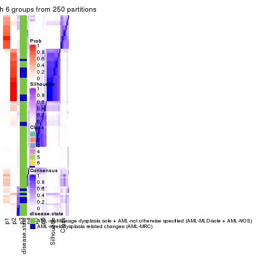</p>

</div>
</div>

Heatmaps for the membership of samples in all partitions to see how consistent they are:


<script>
$( function() {
	$( '#tabs-CV-hclust-membership-heatmap' ).tabs();
} );
</script>
<div id='tabs-CV-hclust-membership-heatmap'>
<ul>
<li><a href='#tab-CV-hclust-membership-heatmap-1'>k = 2</a></li>
<li><a href='#tab-CV-hclust-membership-heatmap-2'>k = 3</a></li>
<li><a href='#tab-CV-hclust-membership-heatmap-3'>k = 4</a></li>
<li><a href='#tab-CV-hclust-membership-heatmap-4'>k = 5</a></li>
<li><a href='#tab-CV-hclust-membership-heatmap-5'>k = 6</a></li>
</ul>
<div id='tab-CV-hclust-membership-heatmap-1'>
<pre><code class="r">membership_heatmap(res, k = 2)
</code></pre>

<p></p>

</div>
<div id='tab-CV-hclust-membership-heatmap-2'>
<pre><code class="r">membership_heatmap(res, k = 3)
</code></pre>

<p></p>

</div>
<div id='tab-CV-hclust-membership-heatmap-3'>
<pre><code class="r">membership_heatmap(res, k = 4)
</code></pre>

<p></p>

</div>
<div id='tab-CV-hclust-membership-heatmap-4'>
<pre><code class="r">membership_heatmap(res, k = 5)
</code></pre>

<p></p>

</div>
<div id='tab-CV-hclust-membership-heatmap-5'>
<pre><code class="r">membership_heatmap(res, k = 6)
</code></pre>

<p></p>

</div>
</div>

As soon as we have had the classes for columns, we can look for signatures
which are significantly different between classes which can be candidate marks
for certain classes. Following are the heatmaps for signatures.


Signature heatmaps where rows are scaled:


<script>
$( function() {
	$( '#tabs-CV-hclust-get-signatures' ).tabs();
} );
</script>
<div id='tabs-CV-hclust-get-signatures'>
<ul>
<li><a href='#tab-CV-hclust-get-signatures-1'>k = 2</a></li>
<li><a href='#tab-CV-hclust-get-signatures-2'>k = 3</a></li>
<li><a href='#tab-CV-hclust-get-signatures-3'>k = 4</a></li>
<li><a href='#tab-CV-hclust-get-signatures-4'>k = 5</a></li>
<li><a href='#tab-CV-hclust-get-signatures-5'>k = 6</a></li>
</ul>
<div id='tab-CV-hclust-get-signatures-1'>
<pre><code class="r">get_signatures(res, k = 2)
</code></pre>

<pre><code>#&gt; Error: The width or height of the raster image is zero, maybe you forget to turn off the
#&gt; previous graphic device or it was corrupted. Run `dev.off()` to close it.
</code></pre>

<p></p>

</div>
<div id='tab-CV-hclust-get-signatures-2'>
<pre><code class="r">get_signatures(res, k = 3)
</code></pre>

<pre><code>#&gt; Error: The width or height of the raster image is zero, maybe you forget to turn off the
#&gt; previous graphic device or it was corrupted. Run `dev.off()` to close it.
</code></pre>

<p></p>

</div>
<div id='tab-CV-hclust-get-signatures-3'>
<pre><code class="r">get_signatures(res, k = 4)
</code></pre>

<pre><code>#&gt; Error: The width or height of the raster image is zero, maybe you forget to turn off the
#&gt; previous graphic device or it was corrupted. Run `dev.off()` to close it.
</code></pre>

<p></p>

</div>
<div id='tab-CV-hclust-get-signatures-4'>
<pre><code class="r">get_signatures(res, k = 5)
</code></pre>

<pre><code>#&gt; Error: The width or height of the raster image is zero, maybe you forget to turn off the
#&gt; previous graphic device or it was corrupted. Run `dev.off()` to close it.
</code></pre>

<p></p>

</div>
<div id='tab-CV-hclust-get-signatures-5'>
<pre><code class="r">get_signatures(res, k = 6)
</code></pre>

<pre><code>#&gt; Error: The width or height of the raster image is zero, maybe you forget to turn off the
#&gt; previous graphic device or it was corrupted. Run `dev.off()` to close it.
</code></pre>

<p></p>

</div>
</div>


Signature heatmaps where rows are not scaled:


<script>
$( function() {
	$( '#tabs-CV-hclust-get-signatures-no-scale' ).tabs();
} );
</script>
<div id='tabs-CV-hclust-get-signatures-no-scale'>
<ul>
<li><a href='#tab-CV-hclust-get-signatures-no-scale-1'>k = 2</a></li>
<li><a href='#tab-CV-hclust-get-signatures-no-scale-2'>k = 3</a></li>
<li><a href='#tab-CV-hclust-get-signatures-no-scale-3'>k = 4</a></li>
<li><a href='#tab-CV-hclust-get-signatures-no-scale-4'>k = 5</a></li>
<li><a href='#tab-CV-hclust-get-signatures-no-scale-5'>k = 6</a></li>
</ul>
<div id='tab-CV-hclust-get-signatures-no-scale-1'>
<pre><code class="r">get_signatures(res, k = 2, scale_rows = FALSE)
</code></pre>

<pre><code>#&gt; Error: The width or height of the raster image is zero, maybe you forget to turn off the
#&gt; previous graphic device or it was corrupted. Run `dev.off()` to close it.
</code></pre>

<p></p>

</div>
<div id='tab-CV-hclust-get-signatures-no-scale-2'>
<pre><code class="r">get_signatures(res, k = 3, scale_rows = FALSE)
</code></pre>

<pre><code>#&gt; Error: The width or height of the raster image is zero, maybe you forget to turn off the
#&gt; previous graphic device or it was corrupted. Run `dev.off()` to close it.
</code></pre>

<p></p>

</div>
<div id='tab-CV-hclust-get-signatures-no-scale-3'>
<pre><code class="r">get_signatures(res, k = 4, scale_rows = FALSE)
</code></pre>

<pre><code>#&gt; Error: The width or height of the raster image is zero, maybe you forget to turn off the
#&gt; previous graphic device or it was corrupted. Run `dev.off()` to close it.
</code></pre>

<p></p>

</div>
<div id='tab-CV-hclust-get-signatures-no-scale-4'>
<pre><code class="r">get_signatures(res, k = 5, scale_rows = FALSE)
</code></pre>

<pre><code>#&gt; Error: The width or height of the raster image is zero, maybe you forget to turn off the
#&gt; previous graphic device or it was corrupted. Run `dev.off()` to close it.
</code></pre>

<p></p>

</div>
<div id='tab-CV-hclust-get-signatures-no-scale-5'>
<pre><code class="r">get_signatures(res, k = 6, scale_rows = FALSE)
</code></pre>

<pre><code>#&gt; Error: The width or height of the raster image is zero, maybe you forget to turn off the
#&gt; previous graphic device or it was corrupted. Run `dev.off()` to close it.
</code></pre>

<p></p>

</div>
</div>


Compare the overlap of signatures from different k:

```r
compare_signatures(res)
```


`get_signature()` returns a data frame invisibly. TO get the list of signatures, the function
call should be assigned to a variable explicitly. In following code, if `plot` argument is set
to `FALSE`, no heatmap is plotted while only the differential analysis is performed.

```r
# code only for demonstration
tb = get_signature(res, k = ..., plot = FALSE)
```

An example of the output of `tb` is:

```
#>   which_row         fdr    mean_1    mean_2 scaled_mean_1 scaled_mean_2 km
#> 1        38 0.042760348  8.373488  9.131774    -0.5533452     0.5164555  1
#> 2        40 0.018707592  7.106213  8.469186    -0.6173731     0.5762149  1
#> 3        55 0.019134737 10.221463 11.207825    -0.6159697     0.5749050  1
#> 4        59 0.006059896  5.921854  7.869574    -0.6899429     0.6439467  1
#> 5        60 0.018055526  8.928898 10.211722    -0.6204761     0.5791110  1
#> 6        98 0.009384629 15.714769 14.887706     0.6635654    -0.6193277  2
...
```

The columns in `tb` are:

1. `which_row`: row indices corresponding to the input matrix.
2. `fdr`: FDR for the differential test. 
3. `mean_x`: The mean value in group x.
4. `scaled_mean_x`: The mean value in group x after rows are scaled.
5. `km`: Row groups if k-means clustering is applied to rows.


UMAP plot which shows how samples are separated.


<script>
$( function() {
	$( '#tabs-CV-hclust-dimension-reduction' ).tabs();
} );
</script>
<div id='tabs-CV-hclust-dimension-reduction'>
<ul>
<li><a href='#tab-CV-hclust-dimension-reduction-1'>k = 2</a></li>
<li><a href='#tab-CV-hclust-dimension-reduction-2'>k = 3</a></li>
<li><a href='#tab-CV-hclust-dimension-reduction-3'>k = 4</a></li>
<li><a href='#tab-CV-hclust-dimension-reduction-4'>k = 5</a></li>
<li><a href='#tab-CV-hclust-dimension-reduction-5'>k = 6</a></li>
</ul>
<div id='tab-CV-hclust-dimension-reduction-1'>
<pre><code class="r">dimension_reduction(res, k = 2, method = &quot;UMAP&quot;)
</code></pre>

<p></p>

</div>
<div id='tab-CV-hclust-dimension-reduction-2'>
<pre><code class="r">dimension_reduction(res, k = 3, method = &quot;UMAP&quot;)
</code></pre>

<p></p>

</div>
<div id='tab-CV-hclust-dimension-reduction-3'>
<pre><code class="r">dimension_reduction(res, k = 4, method = &quot;UMAP&quot;)
</code></pre>

<p>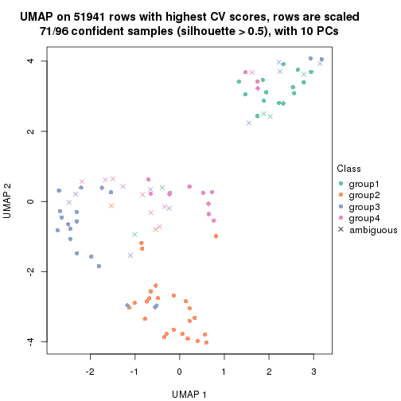</p>

</div>
<div id='tab-CV-hclust-dimension-reduction-4'>
<pre><code class="r">dimension_reduction(res, k = 5, method = &quot;UMAP&quot;)
</code></pre>

<p></p>

</div>
<div id='tab-CV-hclust-dimension-reduction-5'>
<pre><code class="r">dimension_reduction(res, k = 6, method = &quot;UMAP&quot;)
</code></pre>

<p></p>

</div>
</div>


Following heatmap shows how subgroups are split when increasing `k`:

```r
collect_classes(res)
```

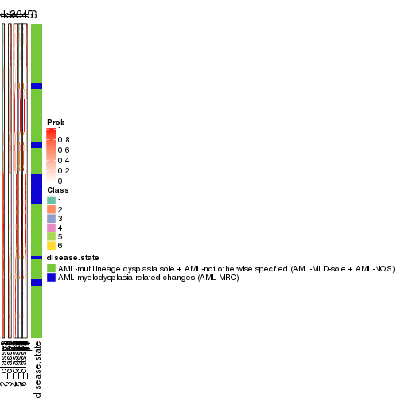


Test correlation between subgroups and known annotations. If the known
annotation is numeric, one-way ANOVA test is applied, and if the known
annotation is discrete, chi-squared contingency table test is applied.

```r
test_to_known_factors(res)
```

```
#>            n disease.state(p) k
#> CV:hclust 78          0.02883 2
#> CV:hclust 45          0.00364 3
#> CV:hclust 71          0.00905 4
#> CV:hclust 76          0.00651 5
#> CV:hclust 73          0.02210 6
```


If matrix rows can be associated to genes, consider to use `functional_enrichment(res,
...)` to perform function enrichment for the signature genes. See [this vignette](http://bioconductor.org/packages/devel/bioc/vignettes/cola/inst/doc/functional_enrichment.html) for more detailed explanations.


 

---------------------------------------------------


### CV:kmeans


The object with results only for a single top-value method and a single partition method 
can be extracted as:

```r
res = res_list["CV", "kmeans"]
# you can also extract it by
# res = res_list["CV:kmeans"]
```

A summary of `res` and all the functions that can be applied to it:

```r
res
```

```
#> A 'ConsensusPartition' object with k = 2, 3, 4, 5, 6.
#>   On a matrix with 51941 rows and 96 columns.
#>   Top rows (1000, 2000, 3000, 4000, 5000) are extracted by 'CV' method.
#>   Subgroups are detected by 'kmeans' method.
#>   Performed in total 1250 partitions by row resampling.
#>   Best k for subgroups seems to be 4.
#> 
#> Following methods can be applied to this 'ConsensusPartition' object:
#>  [1] "cola_report"             "collect_classes"         "collect_plots"          
#>  [4] "collect_stats"           "colnames"                "compare_signatures"     
#>  [7] "consensus_heatmap"       "dimension_reduction"     "functional_enrichment"  
#> [10] "get_anno_col"            "get_anno"                "get_classes"            
#> [13] "get_consensus"           "get_matrix"              "get_membership"         
#> [16] "get_param"               "get_signatures"          "get_stats"              
#> [19] "is_best_k"               "is_stable_k"             "membership_heatmap"     
#> [22] "ncol"                    "nrow"                    "plot_ecdf"              
#> [25] "rownames"                "select_partition_number" "show"                   
#> [28] "suggest_best_k"          "test_to_known_factors"
```

`collect_plots()` function collects all the plots made from `res` for all `k` (number of partitions)
into one single page to provide an easy and fast comparison between different `k`.

```r
collect_plots(res)
```


The plots are:

- The first row: a plot of the ECDF (empirical cumulative distribution
  function) curves of the consensus matrix for each `k` and the heatmap of
  predicted classes for each `k`.
- The second row: heatmaps of the consensus matrix for each `k`.
- The third row: heatmaps of the membership matrix for each `k`.
- The fouth row: heatmaps of the signatures for each `k`.

All the plots in panels can be made by individual functions and they are
plotted later in this section.

`select_partition_number()` produces several plots showing different
statistics for choosing "optimized" `k`. There are following statistics:

- ECDF curves of the consensus matrix for each `k`;
- 1-PAC. [The PAC
  score](https://en.wikipedia.org/wiki/Consensus_clustering#Over-interpretation_potential_of_consensus_clustering)
  measures the proportion of the ambiguous subgrouping.
- Mean silhouette score.
- Concordance. The mean probability of fiting the consensus class ids in all
  partitions.
- Area increased. Denote $A_k$ as the area under the ECDF curve for current
  `k`, the area increased is defined as $A_k - A_{k-1}$.
- Rand index. The percent of pairs of samples that are both in a same cluster
  or both are not in a same cluster in the partition of k and k-1.
- Jaccard index. The ratio of pairs of samples are both in a same cluster in
  the partition of k and k-1 and the pairs of samples are both in a same
  cluster in the partition k or k-1.

The detailed explanations of these statistics can be found in [the _cola_
vignette](http://bioconductor.org/packages/devel/bioc/vignettes/cola/inst/doc/cola.html#toc_13).

Generally speaking, lower PAC score, higher mean silhouette score or higher
concordance corresponds to better partition. Rand index and Jaccard index
measure how similar the current partition is compared to partition with `k-1`.
If they are too similar, we won't accept `k` is better than `k-1`.

```r
select_partition_number(res)
```


The numeric values for all these statistics can be obtained by `get_stats()`.

```r
get_stats(res)
```

```
#>   k 1-PAC mean_silhouette concordance area_increased  Rand Jaccard
#> 2 2 0.544           0.875       0.920         0.4998 0.496   0.496
#> 3 3 0.597           0.825       0.871         0.3259 0.714   0.487
#> 4 4 0.893           0.895       0.944         0.1352 0.857   0.602
#> 5 5 0.738           0.678       0.813         0.0572 0.971   0.884
#> 6 6 0.713           0.544       0.728         0.0410 0.931   0.705
```

`suggest_best_k()` suggests the best $k$ based on these statistics. The rules are as follows:

- All $k$ with Jaccard index larger than 0.95 are removed because increasing
  $k$ does not provide enough extra information. If all $k$ are removed, it is
  marked as no subgroup is detected.
- For all $k$ with 1-PAC score larger than 0.9, the maximal $k$ is taken as
  the best $k$, and other $k$ are marked as optional $k$.
- If it does not fit the second rule. The $k$ with the maximal vote of the
  highest 1-PAC score, highest mean silhouette, and highest concordance is
  taken as the best $k$.

```r
suggest_best_k(res)
```

```
#> [1] 4
```


Following shows the table of the partitions (You need to click the **show/hide
code output** link to see it). The membership matrix (columns with name `p*`)
is inferred by
[`clue::cl_consensus()`](https://www.rdocumentation.org/link/cl_consensus?package=clue)
function with the `SE` method. Basically the value in the membership matrix
represents the probability to belong to a certain group. The finall class
label for an item is determined with the group with highest probability it
belongs to.

In `get_classes()` function, the entropy is calculated from the membership
matrix and the silhouette score is calculated from the consensus matrix.


<script>
$( function() {
	$( '#tabs-CV-kmeans-get-classes' ).tabs();
} );
</script>
<div id='tabs-CV-kmeans-get-classes'>
<ul>
<li><a href='#tab-CV-kmeans-get-classes-1'>k = 2</a></li>
<li><a href='#tab-CV-kmeans-get-classes-2'>k = 3</a></li>
<li><a href='#tab-CV-kmeans-get-classes-3'>k = 4</a></li>
<li><a href='#tab-CV-kmeans-get-classes-4'>k = 5</a></li>
<li><a href='#tab-CV-kmeans-get-classes-5'>k = 6</a></li>
</ul>

<div id='tab-CV-kmeans-get-classes-1'>
<p><a id='tab-CV-kmeans-get-classes-1-a' style='color:#0366d6' href='#'>show/hide code output</a></p>
<pre><code class="r">cbind(get_classes(res, k = 2), get_membership(res, k = 2))
</code></pre>

<pre><code>#&gt;           class entropy silhouette    p1    p2
#&gt; GSM531600     2  0.1414      0.898 0.020 0.980
#&gt; GSM531601     2  0.5059      0.890 0.112 0.888
#&gt; GSM531605     1  0.0938      0.935 0.988 0.012
#&gt; GSM531615     2  0.5294      0.886 0.120 0.880
#&gt; GSM531617     2  0.5294      0.886 0.120 0.880
#&gt; GSM531624     2  0.4815      0.896 0.104 0.896
#&gt; GSM531627     2  0.2948      0.907 0.052 0.948
#&gt; GSM531629     2  0.6247      0.856 0.156 0.844
#&gt; GSM531631     2  0.4815      0.896 0.104 0.896
#&gt; GSM531634     2  0.5178      0.889 0.116 0.884
#&gt; GSM531636     2  0.0000      0.899 0.000 1.000
#&gt; GSM531637     2  0.4815      0.896 0.104 0.896
#&gt; GSM531654     2  0.5178      0.889 0.116 0.884
#&gt; GSM531655     1  0.6801      0.794 0.820 0.180
#&gt; GSM531658     1  0.0672      0.936 0.992 0.008
#&gt; GSM531660     1  0.0938      0.933 0.988 0.012
#&gt; GSM531602     1  0.0938      0.933 0.988 0.012
#&gt; GSM531603     1  0.0938      0.933 0.988 0.012
#&gt; GSM531604     1  0.0938      0.935 0.988 0.012
#&gt; GSM531606     1  0.0938      0.933 0.988 0.012
#&gt; GSM531607     1  0.0000      0.936 1.000 0.000
#&gt; GSM531608     2  0.5178      0.889 0.116 0.884
#&gt; GSM531609     1  0.0672      0.936 0.992 0.008
#&gt; GSM531610     1  0.0376      0.936 0.996 0.004
#&gt; GSM531611     1  0.0376      0.935 0.996 0.004
#&gt; GSM531612     1  0.0672      0.936 0.992 0.008
#&gt; GSM531613     1  0.0376      0.936 0.996 0.004
#&gt; GSM531614     1  0.0376      0.936 0.996 0.004
#&gt; GSM531616     2  0.0938      0.898 0.012 0.988
#&gt; GSM531618     2  0.7602      0.811 0.220 0.780
#&gt; GSM531619     2  0.4815      0.896 0.104 0.896
#&gt; GSM531620     2  0.2948      0.907 0.052 0.948
#&gt; GSM531621     2  0.2948      0.907 0.052 0.948
#&gt; GSM531622     2  0.4815      0.896 0.104 0.896
#&gt; GSM531623     2  0.3114      0.906 0.056 0.944
#&gt; GSM531625     2  0.0376      0.900 0.004 0.996
#&gt; GSM531626     2  0.0376      0.900 0.004 0.996
#&gt; GSM531628     2  0.4562      0.865 0.096 0.904
#&gt; GSM531630     2  0.4690      0.897 0.100 0.900
#&gt; GSM531632     2  0.3114      0.888 0.056 0.944
#&gt; GSM531633     2  0.2948      0.907 0.052 0.948
#&gt; GSM531635     2  0.0938      0.898 0.012 0.988
#&gt; GSM531638     2  0.0000      0.899 0.000 1.000
#&gt; GSM531639     2  0.0000      0.899 0.000 1.000
#&gt; GSM531640     2  0.4815      0.896 0.104 0.896
#&gt; GSM531641     1  0.1184      0.934 0.984 0.016
#&gt; GSM531642     2  0.3114      0.890 0.056 0.944
#&gt; GSM531643     2  0.3431      0.885 0.064 0.936
#&gt; GSM531644     2  0.4562      0.865 0.096 0.904
#&gt; GSM531645     1  0.0672      0.936 0.992 0.008
#&gt; GSM531646     2  0.0938      0.898 0.012 0.988
#&gt; GSM531647     2  0.2948      0.890 0.052 0.948
#&gt; GSM531648     2  0.9552      0.552 0.376 0.624
#&gt; GSM531649     2  0.0938      0.898 0.012 0.988
#&gt; GSM531650     2  0.4562      0.865 0.096 0.904
#&gt; GSM531651     2  0.2948      0.907 0.052 0.948
#&gt; GSM531652     2  0.4815      0.870 0.104 0.896
#&gt; GSM531653     2  0.1414      0.898 0.020 0.980
#&gt; GSM531656     2  0.1843      0.897 0.028 0.972
#&gt; GSM531657     1  0.0376      0.936 0.996 0.004
#&gt; GSM531659     1  0.0376      0.936 0.996 0.004
#&gt; GSM531661     2  0.4815      0.896 0.104 0.896
#&gt; GSM531662     2  0.3431      0.905 0.064 0.936
#&gt; GSM531663     1  0.0376      0.936 0.996 0.004
#&gt; GSM531664     1  0.8207      0.731 0.744 0.256
#&gt; GSM531665     1  0.8016      0.743 0.756 0.244
#&gt; GSM531666     1  0.6973      0.815 0.812 0.188
#&gt; GSM531667     2  0.4939      0.894 0.108 0.892
#&gt; GSM531668     1  0.0938      0.933 0.988 0.012
#&gt; GSM531669     2  0.9286      0.461 0.344 0.656
#&gt; GSM531670     2  0.1414      0.898 0.020 0.980
#&gt; GSM531671     2  0.3114      0.894 0.056 0.944
#&gt; GSM531672     1  0.0938      0.933 0.988 0.012
#&gt; GSM531673     1  0.8081      0.730 0.752 0.248
#&gt; GSM531674     2  0.9286      0.461 0.344 0.656
#&gt; GSM531675     1  0.0000      0.936 1.000 0.000
#&gt; GSM531676     1  0.5842      0.853 0.860 0.140
#&gt; GSM531677     1  0.0376      0.935 0.996 0.004
#&gt; GSM531678     1  0.0000      0.936 1.000 0.000
#&gt; GSM531679     1  0.0376      0.935 0.996 0.004
#&gt; GSM531680     1  0.5294      0.866 0.880 0.120
#&gt; GSM531681     1  0.0000      0.936 1.000 0.000
#&gt; GSM531682     1  0.0376      0.935 0.996 0.004
#&gt; GSM531683     1  0.0376      0.936 0.996 0.004
#&gt; GSM531684     1  0.2948      0.906 0.948 0.052
#&gt; GSM531685     1  0.8081      0.739 0.752 0.248
#&gt; GSM531686     1  0.0000      0.936 1.000 0.000
#&gt; GSM531687     1  0.5294      0.866 0.880 0.120
#&gt; GSM531688     1  0.6343      0.839 0.840 0.160
#&gt; GSM531689     1  0.2603      0.916 0.956 0.044
#&gt; GSM531690     1  0.0000      0.936 1.000 0.000
#&gt; GSM531691     1  0.4022      0.895 0.920 0.080
#&gt; GSM531692     1  0.9608      0.473 0.616 0.384
#&gt; GSM531693     2  0.9286      0.461 0.344 0.656
#&gt; GSM531694     1  0.0938      0.933 0.988 0.012
#&gt; GSM531695     1  0.5294      0.866 0.880 0.120
</code></pre>

<script>
$('#tab-CV-kmeans-get-classes-1-a').parent().next().next().hide();
$('#tab-CV-kmeans-get-classes-1-a').click(function(){
  $('#tab-CV-kmeans-get-classes-1-a').parent().next().next().toggle();
  return(false);
});
</script>
</div>

<div id='tab-CV-kmeans-get-classes-2'>
<p><a id='tab-CV-kmeans-get-classes-2-a' style='color:#0366d6' href='#'>show/hide code output</a></p>
<pre><code class="r">cbind(get_classes(res, k = 3), get_membership(res, k = 3))
</code></pre>

<pre><code>#&gt;           class entropy silhouette    p1    p2    p3
#&gt; GSM531600     3  0.4654      0.791 0.000 0.208 0.792
#&gt; GSM531601     2  0.2711      0.881 0.000 0.912 0.088
#&gt; GSM531605     1  0.3340      0.832 0.880 0.000 0.120
#&gt; GSM531615     2  0.0424      0.972 0.000 0.992 0.008
#&gt; GSM531617     2  0.0424      0.972 0.000 0.992 0.008
#&gt; GSM531624     2  0.0237      0.981 0.000 0.996 0.004
#&gt; GSM531627     2  0.0237      0.981 0.000 0.996 0.004
#&gt; GSM531629     2  0.1031      0.955 0.000 0.976 0.024
#&gt; GSM531631     2  0.0237      0.981 0.000 0.996 0.004
#&gt; GSM531634     2  0.0424      0.972 0.000 0.992 0.008
#&gt; GSM531636     3  0.6079      0.556 0.000 0.388 0.612
#&gt; GSM531637     2  0.0237      0.981 0.000 0.996 0.004
#&gt; GSM531654     2  0.0237      0.981 0.000 0.996 0.004
#&gt; GSM531655     1  0.9752      0.363 0.424 0.236 0.340
#&gt; GSM531658     1  0.4261      0.829 0.848 0.012 0.140
#&gt; GSM531660     1  0.4261      0.829 0.848 0.012 0.140
#&gt; GSM531602     1  0.3340      0.832 0.880 0.000 0.120
#&gt; GSM531603     1  0.3340      0.832 0.880 0.000 0.120
#&gt; GSM531604     1  0.3340      0.832 0.880 0.000 0.120
#&gt; GSM531606     1  0.3340      0.832 0.880 0.000 0.120
#&gt; GSM531607     1  0.3340      0.832 0.880 0.000 0.120
#&gt; GSM531608     2  0.0000      0.979 0.000 1.000 0.000
#&gt; GSM531609     1  0.4261      0.829 0.848 0.012 0.140
#&gt; GSM531610     1  0.4261      0.829 0.848 0.012 0.140
#&gt; GSM531611     1  0.3918      0.830 0.856 0.004 0.140
#&gt; GSM531612     1  0.4261      0.829 0.848 0.012 0.140
#&gt; GSM531613     1  0.3272      0.837 0.892 0.004 0.104
#&gt; GSM531614     1  0.4261      0.829 0.848 0.012 0.140
#&gt; GSM531616     2  0.4291      0.714 0.000 0.820 0.180
#&gt; GSM531618     1  0.8763      0.582 0.588 0.196 0.216
#&gt; GSM531619     2  0.0237      0.981 0.000 0.996 0.004
#&gt; GSM531620     2  0.0237      0.981 0.000 0.996 0.004
#&gt; GSM531621     2  0.0237      0.981 0.000 0.996 0.004
#&gt; GSM531622     2  0.0237      0.981 0.000 0.996 0.004
#&gt; GSM531623     2  0.0237      0.981 0.000 0.996 0.004
#&gt; GSM531625     2  0.0747      0.971 0.000 0.984 0.016
#&gt; GSM531626     2  0.0747      0.971 0.000 0.984 0.016
#&gt; GSM531628     3  0.3551      0.809 0.000 0.132 0.868
#&gt; GSM531630     2  0.0237      0.981 0.000 0.996 0.004
#&gt; GSM531632     3  0.5016      0.771 0.000 0.240 0.760
#&gt; GSM531633     2  0.0237      0.981 0.000 0.996 0.004
#&gt; GSM531635     3  0.5216      0.754 0.000 0.260 0.740
#&gt; GSM531638     2  0.0747      0.971 0.000 0.984 0.016
#&gt; GSM531639     3  0.6079      0.556 0.000 0.388 0.612
#&gt; GSM531640     2  0.0000      0.979 0.000 1.000 0.000
#&gt; GSM531641     1  0.4261      0.829 0.848 0.012 0.140
#&gt; GSM531642     3  0.3995      0.800 0.016 0.116 0.868
#&gt; GSM531643     3  0.3551      0.809 0.000 0.132 0.868
#&gt; GSM531644     3  0.3846      0.802 0.016 0.108 0.876
#&gt; GSM531645     1  0.4261      0.829 0.848 0.012 0.140
#&gt; GSM531646     3  0.5216      0.754 0.000 0.260 0.740
#&gt; GSM531647     3  0.4452      0.798 0.000 0.192 0.808
#&gt; GSM531648     1  0.5167      0.783 0.792 0.016 0.192
#&gt; GSM531649     3  0.5216      0.754 0.000 0.260 0.740
#&gt; GSM531650     3  0.3551      0.809 0.000 0.132 0.868
#&gt; GSM531651     2  0.0237      0.981 0.000 0.996 0.004
#&gt; GSM531652     3  0.3987      0.795 0.020 0.108 0.872
#&gt; GSM531653     3  0.4654      0.791 0.000 0.208 0.792
#&gt; GSM531656     3  0.4178      0.804 0.000 0.172 0.828
#&gt; GSM531657     1  0.4261      0.829 0.848 0.012 0.140
#&gt; GSM531659     1  0.4453      0.830 0.836 0.012 0.152
#&gt; GSM531661     2  0.0237      0.981 0.000 0.996 0.004
#&gt; GSM531662     2  0.0237      0.981 0.000 0.996 0.004
#&gt; GSM531663     1  0.3618      0.836 0.884 0.012 0.104
#&gt; GSM531664     3  0.1643      0.799 0.000 0.044 0.956
#&gt; GSM531665     3  0.5817      0.651 0.236 0.020 0.744
#&gt; GSM531666     3  0.2926      0.784 0.040 0.036 0.924
#&gt; GSM531667     2  0.0000      0.979 0.000 1.000 0.000
#&gt; GSM531668     1  0.4453      0.830 0.836 0.012 0.152
#&gt; GSM531669     3  0.2804      0.809 0.016 0.060 0.924
#&gt; GSM531670     3  0.4654      0.791 0.000 0.208 0.792
#&gt; GSM531671     3  0.6062      0.579 0.000 0.384 0.616
#&gt; GSM531672     1  0.4261      0.829 0.848 0.012 0.140
#&gt; GSM531673     1  0.7620      0.662 0.684 0.188 0.128
#&gt; GSM531674     3  0.2804      0.809 0.016 0.060 0.924
#&gt; GSM531675     1  0.2959      0.835 0.900 0.000 0.100
#&gt; GSM531676     3  0.5363      0.598 0.276 0.000 0.724
#&gt; GSM531677     1  0.3340      0.832 0.880 0.000 0.120
#&gt; GSM531678     1  0.3340      0.832 0.880 0.000 0.120
#&gt; GSM531679     1  0.3340      0.832 0.880 0.000 0.120
#&gt; GSM531680     3  0.5465      0.577 0.288 0.000 0.712
#&gt; GSM531681     1  0.0000      0.840 1.000 0.000 0.000
#&gt; GSM531682     1  0.3340      0.832 0.880 0.000 0.120
#&gt; GSM531683     1  0.3192      0.833 0.888 0.000 0.112
#&gt; GSM531684     1  0.7297      0.681 0.708 0.172 0.120
#&gt; GSM531685     3  0.3752      0.734 0.144 0.000 0.856
#&gt; GSM531686     1  0.0000      0.840 1.000 0.000 0.000
#&gt; GSM531687     3  0.5363      0.598 0.276 0.000 0.724
#&gt; GSM531688     3  0.3752      0.734 0.144 0.000 0.856
#&gt; GSM531689     1  0.3340      0.832 0.880 0.000 0.120
#&gt; GSM531690     1  0.0237      0.840 0.996 0.000 0.004
#&gt; GSM531691     1  0.3879      0.807 0.848 0.000 0.152
#&gt; GSM531692     3  0.5363      0.598 0.276 0.000 0.724
#&gt; GSM531693     3  0.4397      0.758 0.116 0.028 0.856
#&gt; GSM531694     1  0.3340      0.832 0.880 0.000 0.120
#&gt; GSM531695     3  0.3879      0.729 0.152 0.000 0.848
</code></pre>

<script>
$('#tab-CV-kmeans-get-classes-2-a').parent().next().next().hide();
$('#tab-CV-kmeans-get-classes-2-a').click(function(){
  $('#tab-CV-kmeans-get-classes-2-a').parent().next().next().toggle();
  return(false);
});
</script>
</div>

<div id='tab-CV-kmeans-get-classes-3'>
<p><a id='tab-CV-kmeans-get-classes-3-a' style='color:#0366d6' href='#'>show/hide code output</a></p>
<pre><code class="r">cbind(get_classes(res, k = 4), get_membership(res, k = 4))
</code></pre>

<pre><code>#&gt;           class entropy silhouette    p1    p2    p3    p4
#&gt; GSM531600     3  0.0376      0.941 0.004 0.004 0.992 0.000
#&gt; GSM531601     2  0.1118      0.945 0.000 0.964 0.000 0.036
#&gt; GSM531605     1  0.0469      0.903 0.988 0.000 0.000 0.012
#&gt; GSM531615     2  0.0188      0.975 0.004 0.996 0.000 0.000
#&gt; GSM531617     2  0.0000      0.975 0.000 1.000 0.000 0.000
#&gt; GSM531624     2  0.0188      0.975 0.004 0.996 0.000 0.000
#&gt; GSM531627     2  0.0188      0.975 0.004 0.996 0.000 0.000
#&gt; GSM531629     2  0.0000      0.975 0.000 1.000 0.000 0.000
#&gt; GSM531631     2  0.0000      0.975 0.000 1.000 0.000 0.000
#&gt; GSM531634     2  0.0000      0.975 0.000 1.000 0.000 0.000
#&gt; GSM531636     3  0.4049      0.763 0.008 0.180 0.804 0.008
#&gt; GSM531637     2  0.0188      0.975 0.004 0.996 0.000 0.000
#&gt; GSM531654     2  0.0592      0.968 0.016 0.984 0.000 0.000
#&gt; GSM531655     1  0.8893      0.225 0.444 0.164 0.304 0.088
#&gt; GSM531658     4  0.0524      0.949 0.008 0.000 0.004 0.988
#&gt; GSM531660     4  0.3479      0.862 0.148 0.012 0.000 0.840
#&gt; GSM531602     1  0.0592      0.903 0.984 0.000 0.000 0.016
#&gt; GSM531603     1  0.0592      0.903 0.984 0.000 0.000 0.016
#&gt; GSM531604     1  0.0336      0.902 0.992 0.000 0.000 0.008
#&gt; GSM531606     1  0.0592      0.903 0.984 0.000 0.000 0.016
#&gt; GSM531607     1  0.0592      0.903 0.984 0.000 0.000 0.016
#&gt; GSM531608     2  0.0188      0.975 0.004 0.996 0.000 0.000
#&gt; GSM531609     4  0.0524      0.949 0.008 0.000 0.004 0.988
#&gt; GSM531610     4  0.0336      0.949 0.008 0.000 0.000 0.992
#&gt; GSM531611     4  0.0336      0.949 0.008 0.000 0.000 0.992
#&gt; GSM531612     4  0.0524      0.949 0.008 0.000 0.004 0.988
#&gt; GSM531613     4  0.0336      0.949 0.008 0.000 0.000 0.992
#&gt; GSM531614     4  0.0524      0.949 0.008 0.000 0.004 0.988
#&gt; GSM531616     2  0.5497      0.338 0.012 0.608 0.372 0.008
#&gt; GSM531618     4  0.4011      0.738 0.000 0.208 0.008 0.784
#&gt; GSM531619     2  0.0188      0.975 0.004 0.996 0.000 0.000
#&gt; GSM531620     2  0.0188      0.975 0.004 0.996 0.000 0.000
#&gt; GSM531621     2  0.0336      0.975 0.008 0.992 0.000 0.000
#&gt; GSM531622     2  0.0000      0.975 0.000 1.000 0.000 0.000
#&gt; GSM531623     2  0.0188      0.975 0.004 0.996 0.000 0.000
#&gt; GSM531625     2  0.1406      0.953 0.016 0.960 0.024 0.000
#&gt; GSM531626     2  0.1284      0.953 0.012 0.964 0.024 0.000
#&gt; GSM531628     3  0.0188      0.941 0.000 0.000 0.996 0.004
#&gt; GSM531630     2  0.0000      0.975 0.000 1.000 0.000 0.000
#&gt; GSM531632     3  0.0376      0.941 0.004 0.004 0.992 0.000
#&gt; GSM531633     2  0.0188      0.975 0.004 0.996 0.000 0.000
#&gt; GSM531635     3  0.1139      0.936 0.012 0.008 0.972 0.008
#&gt; GSM531638     2  0.1617      0.947 0.012 0.956 0.024 0.008
#&gt; GSM531639     3  0.4049      0.763 0.008 0.180 0.804 0.008
#&gt; GSM531640     2  0.0000      0.975 0.000 1.000 0.000 0.000
#&gt; GSM531641     4  0.0524      0.949 0.008 0.000 0.004 0.988
#&gt; GSM531642     3  0.2520      0.889 0.004 0.004 0.904 0.088
#&gt; GSM531643     3  0.0469      0.940 0.000 0.000 0.988 0.012
#&gt; GSM531644     3  0.0469      0.940 0.000 0.000 0.988 0.012
#&gt; GSM531645     4  0.0524      0.949 0.008 0.000 0.004 0.988
#&gt; GSM531646     3  0.0376      0.941 0.004 0.004 0.992 0.000
#&gt; GSM531647     3  0.0188      0.942 0.000 0.004 0.996 0.000
#&gt; GSM531648     4  0.0804      0.937 0.000 0.012 0.008 0.980
#&gt; GSM531649     3  0.0657      0.939 0.012 0.004 0.984 0.000
#&gt; GSM531650     3  0.0188      0.941 0.000 0.000 0.996 0.004
#&gt; GSM531651     2  0.0188      0.975 0.004 0.996 0.000 0.000
#&gt; GSM531652     3  0.2334      0.889 0.000 0.004 0.908 0.088
#&gt; GSM531653     3  0.0188      0.942 0.000 0.004 0.996 0.000
#&gt; GSM531656     3  0.0657      0.940 0.004 0.000 0.984 0.012
#&gt; GSM531657     4  0.1389      0.938 0.048 0.000 0.000 0.952
#&gt; GSM531659     4  0.1867      0.925 0.072 0.000 0.000 0.928
#&gt; GSM531661     2  0.0188      0.975 0.004 0.996 0.000 0.000
#&gt; GSM531662     2  0.0592      0.971 0.016 0.984 0.000 0.000
#&gt; GSM531663     4  0.0336      0.949 0.008 0.000 0.000 0.992
#&gt; GSM531664     3  0.0188      0.941 0.000 0.000 0.996 0.004
#&gt; GSM531665     1  0.4991      0.455 0.608 0.000 0.388 0.004
#&gt; GSM531666     3  0.2149      0.890 0.000 0.000 0.912 0.088
#&gt; GSM531667     2  0.0188      0.975 0.004 0.996 0.000 0.000
#&gt; GSM531668     4  0.3428      0.866 0.144 0.012 0.000 0.844
#&gt; GSM531669     3  0.0000      0.941 0.000 0.000 1.000 0.000
#&gt; GSM531670     3  0.0712      0.940 0.004 0.004 0.984 0.008
#&gt; GSM531671     3  0.5435      0.242 0.016 0.420 0.564 0.000
#&gt; GSM531672     4  0.1389      0.939 0.048 0.000 0.000 0.952
#&gt; GSM531673     1  0.1824      0.861 0.936 0.060 0.000 0.004
#&gt; GSM531674     3  0.0000      0.941 0.000 0.000 1.000 0.000
#&gt; GSM531675     1  0.1109      0.900 0.968 0.000 0.004 0.028
#&gt; GSM531676     1  0.3052      0.836 0.860 0.000 0.136 0.004
#&gt; GSM531677     1  0.1004      0.901 0.972 0.000 0.004 0.024
#&gt; GSM531678     1  0.0895      0.903 0.976 0.000 0.004 0.020
#&gt; GSM531679     1  0.0895      0.903 0.976 0.000 0.004 0.020
#&gt; GSM531680     1  0.3052      0.836 0.860 0.000 0.136 0.004
#&gt; GSM531681     4  0.2266      0.901 0.084 0.000 0.004 0.912
#&gt; GSM531682     1  0.0895      0.903 0.976 0.000 0.004 0.020
#&gt; GSM531683     1  0.0592      0.903 0.984 0.000 0.000 0.016
#&gt; GSM531684     1  0.0524      0.901 0.988 0.004 0.000 0.008
#&gt; GSM531685     1  0.3831      0.766 0.792 0.000 0.204 0.004
#&gt; GSM531686     4  0.2266      0.901 0.084 0.000 0.004 0.912
#&gt; GSM531687     1  0.3052      0.836 0.860 0.000 0.136 0.004
#&gt; GSM531688     3  0.0188      0.939 0.000 0.000 0.996 0.004
#&gt; GSM531689     1  0.0779      0.903 0.980 0.000 0.004 0.016
#&gt; GSM531690     4  0.2530      0.905 0.100 0.000 0.004 0.896
#&gt; GSM531691     1  0.0779      0.903 0.980 0.000 0.004 0.016
#&gt; GSM531692     1  0.2197      0.867 0.916 0.000 0.080 0.004
#&gt; GSM531693     3  0.0376      0.939 0.004 0.000 0.992 0.004
#&gt; GSM531694     1  0.0592      0.903 0.984 0.000 0.000 0.016
#&gt; GSM531695     1  0.4950      0.504 0.620 0.000 0.376 0.004
</code></pre>

<script>
$('#tab-CV-kmeans-get-classes-3-a').parent().next().next().hide();
$('#tab-CV-kmeans-get-classes-3-a').click(function(){
  $('#tab-CV-kmeans-get-classes-3-a').parent().next().next().toggle();
  return(false);
});
</script>
</div>

<div id='tab-CV-kmeans-get-classes-4'>
<p><a id='tab-CV-kmeans-get-classes-4-a' style='color:#0366d6' href='#'>show/hide code output</a></p>
<pre><code class="r">cbind(get_classes(res, k = 5), get_membership(res, k = 5))
</code></pre>

<pre><code>#&gt;           class entropy silhouette    p1    p2    p3    p4    p5
#&gt; GSM531600     3  0.2179     0.8193 0.000 0.000 0.888 0.000 0.112
#&gt; GSM531601     2  0.3639     0.6771 0.000 0.792 0.000 0.024 0.184
#&gt; GSM531605     1  0.4138     0.5492 0.616 0.000 0.000 0.000 0.384
#&gt; GSM531615     2  0.1043     0.8699 0.000 0.960 0.000 0.000 0.040
#&gt; GSM531617     2  0.1121     0.8690 0.000 0.956 0.000 0.000 0.044
#&gt; GSM531624     2  0.0000     0.8791 0.000 1.000 0.000 0.000 0.000
#&gt; GSM531627     2  0.2179     0.8445 0.000 0.888 0.000 0.000 0.112
#&gt; GSM531629     2  0.3109     0.7230 0.000 0.800 0.000 0.000 0.200
#&gt; GSM531631     2  0.0000     0.8791 0.000 1.000 0.000 0.000 0.000
#&gt; GSM531634     2  0.0794     0.8741 0.000 0.972 0.000 0.000 0.028
#&gt; GSM531636     3  0.4803     0.7007 0.000 0.096 0.720 0.000 0.184
#&gt; GSM531637     2  0.0000     0.8791 0.000 1.000 0.000 0.000 0.000
#&gt; GSM531654     2  0.4225     0.4505 0.004 0.632 0.000 0.000 0.364
#&gt; GSM531655     5  0.6107     0.4146 0.048 0.064 0.148 0.040 0.700
#&gt; GSM531658     4  0.3424     0.6340 0.000 0.000 0.000 0.760 0.240
#&gt; GSM531660     5  0.5799     0.2705 0.048 0.040 0.000 0.296 0.616
#&gt; GSM531602     1  0.4182     0.5363 0.600 0.000 0.000 0.000 0.400
#&gt; GSM531603     5  0.4256    -0.3142 0.436 0.000 0.000 0.000 0.564
#&gt; GSM531604     1  0.2561     0.6936 0.856 0.000 0.000 0.000 0.144
#&gt; GSM531606     1  0.4114     0.5739 0.624 0.000 0.000 0.000 0.376
#&gt; GSM531607     1  0.4182     0.5363 0.600 0.000 0.000 0.000 0.400
#&gt; GSM531608     2  0.1121     0.8708 0.000 0.956 0.000 0.000 0.044
#&gt; GSM531609     4  0.0162     0.7933 0.000 0.000 0.000 0.996 0.004
#&gt; GSM531610     4  0.0000     0.7930 0.000 0.000 0.000 1.000 0.000
#&gt; GSM531611     4  0.0000     0.7930 0.000 0.000 0.000 1.000 0.000
#&gt; GSM531612     4  0.0162     0.7933 0.000 0.000 0.000 0.996 0.004
#&gt; GSM531613     4  0.0000     0.7930 0.000 0.000 0.000 1.000 0.000
#&gt; GSM531614     4  0.0162     0.7933 0.000 0.000 0.000 0.996 0.004
#&gt; GSM531616     2  0.5941     0.4455 0.000 0.592 0.228 0.000 0.180
#&gt; GSM531618     5  0.7706     0.0508 0.000 0.212 0.064 0.352 0.372
#&gt; GSM531619     2  0.0000     0.8791 0.000 1.000 0.000 0.000 0.000
#&gt; GSM531620     2  0.2127     0.8582 0.000 0.892 0.000 0.000 0.108
#&gt; GSM531621     2  0.1908     0.8564 0.000 0.908 0.000 0.000 0.092
#&gt; GSM531622     2  0.0290     0.8796 0.000 0.992 0.000 0.000 0.008
#&gt; GSM531623     2  0.0510     0.8794 0.000 0.984 0.000 0.000 0.016
#&gt; GSM531625     2  0.3304     0.7931 0.000 0.816 0.016 0.000 0.168
#&gt; GSM531626     2  0.3476     0.7822 0.000 0.804 0.020 0.000 0.176
#&gt; GSM531628     3  0.0000     0.8361 0.000 0.000 1.000 0.000 0.000
#&gt; GSM531630     2  0.0404     0.8795 0.000 0.988 0.000 0.000 0.012
#&gt; GSM531632     3  0.1478     0.8245 0.000 0.000 0.936 0.000 0.064
#&gt; GSM531633     2  0.1908     0.8564 0.000 0.908 0.000 0.000 0.092
#&gt; GSM531635     3  0.2852     0.7891 0.000 0.000 0.828 0.000 0.172
#&gt; GSM531638     2  0.3513     0.7783 0.000 0.800 0.020 0.000 0.180
#&gt; GSM531639     3  0.5264     0.6441 0.000 0.128 0.676 0.000 0.196
#&gt; GSM531640     2  0.0000     0.8791 0.000 1.000 0.000 0.000 0.000
#&gt; GSM531641     4  0.0162     0.7933 0.000 0.000 0.000 0.996 0.004
#&gt; GSM531642     3  0.5030     0.5254 0.000 0.000 0.604 0.044 0.352
#&gt; GSM531643     3  0.1544     0.8277 0.000 0.000 0.932 0.000 0.068
#&gt; GSM531644     3  0.2280     0.8052 0.000 0.000 0.880 0.000 0.120
#&gt; GSM531645     4  0.0162     0.7933 0.000 0.000 0.000 0.996 0.004
#&gt; GSM531646     3  0.1341     0.8270 0.000 0.000 0.944 0.000 0.056
#&gt; GSM531647     3  0.0290     0.8366 0.000 0.000 0.992 0.000 0.008
#&gt; GSM531648     4  0.4470     0.5071 0.000 0.008 0.008 0.656 0.328
#&gt; GSM531649     3  0.2690     0.7937 0.000 0.000 0.844 0.000 0.156
#&gt; GSM531650     3  0.0290     0.8368 0.000 0.000 0.992 0.000 0.008
#&gt; GSM531651     2  0.0510     0.8794 0.000 0.984 0.000 0.000 0.016
#&gt; GSM531652     3  0.4953     0.5519 0.000 0.004 0.664 0.048 0.284
#&gt; GSM531653     3  0.0609     0.8373 0.000 0.000 0.980 0.000 0.020
#&gt; GSM531656     3  0.2929     0.8054 0.000 0.008 0.840 0.000 0.152
#&gt; GSM531657     4  0.4449     0.5603 0.020 0.004 0.000 0.688 0.288
#&gt; GSM531659     4  0.6331     0.2573 0.152 0.004 0.000 0.508 0.336
#&gt; GSM531661     2  0.1544     0.8615 0.000 0.932 0.000 0.000 0.068
#&gt; GSM531662     2  0.4946     0.6386 0.060 0.664 0.000 0.000 0.276
#&gt; GSM531663     4  0.0000     0.7930 0.000 0.000 0.000 1.000 0.000
#&gt; GSM531664     3  0.0290     0.8368 0.000 0.000 0.992 0.000 0.008
#&gt; GSM531665     1  0.5770     0.4032 0.604 0.000 0.140 0.000 0.256
#&gt; GSM531666     3  0.4687     0.5625 0.000 0.000 0.672 0.040 0.288
#&gt; GSM531667     2  0.1792     0.8508 0.000 0.916 0.000 0.000 0.084
#&gt; GSM531668     5  0.5477     0.3348 0.044 0.040 0.000 0.248 0.668
#&gt; GSM531669     3  0.0404     0.8348 0.000 0.000 0.988 0.000 0.012
#&gt; GSM531670     3  0.2971     0.8046 0.000 0.008 0.836 0.000 0.156
#&gt; GSM531671     5  0.8228    -0.0830 0.124 0.224 0.312 0.000 0.340
#&gt; GSM531672     4  0.4249     0.5722 0.016 0.000 0.000 0.688 0.296
#&gt; GSM531673     1  0.4946     0.4624 0.596 0.036 0.000 0.000 0.368
#&gt; GSM531674     3  0.0404     0.8348 0.000 0.000 0.988 0.000 0.012
#&gt; GSM531675     1  0.3921     0.6589 0.784 0.000 0.000 0.044 0.172
#&gt; GSM531676     1  0.2388     0.6826 0.900 0.000 0.072 0.000 0.028
#&gt; GSM531677     1  0.2763     0.6944 0.848 0.000 0.000 0.004 0.148
#&gt; GSM531678     1  0.1341     0.7157 0.944 0.000 0.000 0.000 0.056
#&gt; GSM531679     1  0.2020     0.7090 0.900 0.000 0.000 0.000 0.100
#&gt; GSM531680     1  0.3169     0.6808 0.856 0.000 0.084 0.000 0.060
#&gt; GSM531681     4  0.3844     0.6219 0.132 0.000 0.000 0.804 0.064
#&gt; GSM531682     1  0.1732     0.7149 0.920 0.000 0.000 0.000 0.080
#&gt; GSM531683     1  0.4288     0.5481 0.612 0.000 0.000 0.004 0.384
#&gt; GSM531684     1  0.4150     0.5628 0.612 0.000 0.000 0.000 0.388
#&gt; GSM531685     1  0.4609     0.5768 0.744 0.000 0.104 0.000 0.152
#&gt; GSM531686     4  0.3844     0.6219 0.132 0.000 0.000 0.804 0.064
#&gt; GSM531687     1  0.2130     0.6826 0.908 0.000 0.080 0.000 0.012
#&gt; GSM531688     3  0.4090     0.5273 0.268 0.000 0.716 0.000 0.016
#&gt; GSM531689     1  0.0000     0.7121 1.000 0.000 0.000 0.000 0.000
#&gt; GSM531690     4  0.6407     0.2826 0.244 0.000 0.000 0.512 0.244
#&gt; GSM531691     1  0.1043     0.7082 0.960 0.000 0.000 0.000 0.040
#&gt; GSM531692     1  0.3692     0.6375 0.812 0.000 0.052 0.000 0.136
#&gt; GSM531693     3  0.3359     0.7451 0.108 0.000 0.840 0.000 0.052
#&gt; GSM531694     1  0.4182     0.5363 0.600 0.000 0.000 0.000 0.400
#&gt; GSM531695     1  0.5199     0.4342 0.636 0.000 0.292 0.000 0.072
</code></pre>

<script>
$('#tab-CV-kmeans-get-classes-4-a').parent().next().next().hide();
$('#tab-CV-kmeans-get-classes-4-a').click(function(){
  $('#tab-CV-kmeans-get-classes-4-a').parent().next().next().toggle();
  return(false);
});
</script>
</div>

<div id='tab-CV-kmeans-get-classes-5'>
<p><a id='tab-CV-kmeans-get-classes-5-a' style='color:#0366d6' href='#'>show/hide code output</a></p>
<pre><code class="r">cbind(get_classes(res, k = 6), get_membership(res, k = 6))
</code></pre>

<pre><code>#&gt;           class entropy silhouette    p1    p2    p3    p4    p5    p6
#&gt; GSM531600     3  0.3652    0.69146 0.000 0.000 0.768 0.000 0.044 0.188
#&gt; GSM531601     2  0.4622    0.34931 0.036 0.608 0.000 0.008 0.000 0.348
#&gt; GSM531605     1  0.3364    0.51566 0.780 0.000 0.000 0.000 0.196 0.024
#&gt; GSM531615     2  0.2333    0.79298 0.024 0.884 0.000 0.000 0.000 0.092
#&gt; GSM531617     2  0.2412    0.79034 0.028 0.880 0.000 0.000 0.000 0.092
#&gt; GSM531624     2  0.0508    0.81840 0.004 0.984 0.000 0.000 0.000 0.012
#&gt; GSM531627     2  0.3605    0.72964 0.016 0.776 0.000 0.000 0.016 0.192
#&gt; GSM531629     2  0.4356    0.44586 0.032 0.608 0.000 0.000 0.000 0.360
#&gt; GSM531631     2  0.0717    0.81848 0.016 0.976 0.000 0.000 0.000 0.008
#&gt; GSM531634     2  0.2331    0.79505 0.032 0.888 0.000 0.000 0.000 0.080
#&gt; GSM531636     3  0.5152    0.58131 0.000 0.036 0.608 0.000 0.044 0.312
#&gt; GSM531637     2  0.0508    0.81840 0.004 0.984 0.000 0.000 0.000 0.012
#&gt; GSM531654     2  0.7125    0.14179 0.276 0.412 0.000 0.000 0.096 0.216
#&gt; GSM531655     6  0.5953    0.23728 0.284 0.008 0.056 0.012 0.048 0.592
#&gt; GSM531658     4  0.5892   -0.08582 0.180 0.000 0.000 0.460 0.004 0.356
#&gt; GSM531660     1  0.5145    0.02166 0.572 0.004 0.000 0.088 0.000 0.336
#&gt; GSM531602     1  0.2300    0.56929 0.856 0.000 0.000 0.000 0.144 0.000
#&gt; GSM531603     1  0.2897    0.56168 0.852 0.000 0.000 0.000 0.088 0.060
#&gt; GSM531604     5  0.4716    0.41071 0.224 0.000 0.000 0.000 0.668 0.108
#&gt; GSM531606     1  0.4420    0.37235 0.620 0.000 0.000 0.000 0.340 0.040
#&gt; GSM531607     1  0.2553    0.56915 0.848 0.000 0.000 0.000 0.144 0.008
#&gt; GSM531608     2  0.2501    0.79063 0.016 0.872 0.000 0.000 0.004 0.108
#&gt; GSM531609     4  0.0146    0.81491 0.000 0.000 0.000 0.996 0.000 0.004
#&gt; GSM531610     4  0.0146    0.81439 0.004 0.000 0.000 0.996 0.000 0.000
#&gt; GSM531611     4  0.0260    0.81404 0.008 0.000 0.000 0.992 0.000 0.000
#&gt; GSM531612     4  0.0146    0.81491 0.000 0.000 0.000 0.996 0.000 0.004
#&gt; GSM531613     4  0.0405    0.81260 0.008 0.000 0.000 0.988 0.000 0.004
#&gt; GSM531614     4  0.0146    0.81491 0.000 0.000 0.000 0.996 0.000 0.004
#&gt; GSM531616     2  0.5857    0.53902 0.012 0.612 0.104 0.000 0.036 0.236
#&gt; GSM531618     6  0.7013    0.40177 0.136 0.084 0.048 0.156 0.004 0.572
#&gt; GSM531619     2  0.0508    0.81840 0.004 0.984 0.000 0.000 0.000 0.012
#&gt; GSM531620     2  0.3349    0.78357 0.024 0.804 0.000 0.000 0.008 0.164
#&gt; GSM531621     2  0.2466    0.78969 0.008 0.872 0.000 0.000 0.008 0.112
#&gt; GSM531622     2  0.0603    0.81857 0.016 0.980 0.000 0.000 0.000 0.004
#&gt; GSM531623     2  0.0790    0.81885 0.000 0.968 0.000 0.000 0.000 0.032
#&gt; GSM531625     2  0.4300    0.67478 0.008 0.720 0.008 0.000 0.036 0.228
#&gt; GSM531626     2  0.4470    0.66945 0.012 0.704 0.008 0.000 0.036 0.240
#&gt; GSM531628     3  0.0146    0.76014 0.000 0.000 0.996 0.000 0.000 0.004
#&gt; GSM531630     2  0.0914    0.81892 0.016 0.968 0.000 0.000 0.000 0.016
#&gt; GSM531632     3  0.1296    0.75219 0.004 0.000 0.952 0.000 0.012 0.032
#&gt; GSM531633     2  0.2466    0.78969 0.008 0.872 0.000 0.000 0.008 0.112
#&gt; GSM531635     3  0.4396    0.66063 0.012 0.008 0.716 0.000 0.036 0.228
#&gt; GSM531638     2  0.4494    0.65952 0.012 0.700 0.008 0.000 0.036 0.244
#&gt; GSM531639     3  0.5740    0.53692 0.008 0.060 0.572 0.000 0.044 0.316
#&gt; GSM531640     2  0.0717    0.81848 0.016 0.976 0.000 0.000 0.000 0.008
#&gt; GSM531641     4  0.0146    0.81491 0.000 0.000 0.000 0.996 0.000 0.004
#&gt; GSM531642     6  0.5099   -0.02195 0.036 0.000 0.372 0.016 0.008 0.568
#&gt; GSM531643     3  0.2092    0.72527 0.000 0.000 0.876 0.000 0.000 0.124
#&gt; GSM531644     3  0.4438    0.43153 0.036 0.000 0.664 0.004 0.004 0.292
#&gt; GSM531645     4  0.0146    0.81491 0.000 0.000 0.000 0.996 0.000 0.004
#&gt; GSM531646     3  0.1296    0.75934 0.004 0.000 0.948 0.000 0.004 0.044
#&gt; GSM531647     3  0.0363    0.76039 0.000 0.000 0.988 0.000 0.000 0.012
#&gt; GSM531648     6  0.6137    0.21736 0.152 0.008 0.008 0.332 0.004 0.496
#&gt; GSM531649     3  0.3839    0.67766 0.004 0.000 0.748 0.000 0.036 0.212
#&gt; GSM531650     3  0.0260    0.76009 0.000 0.000 0.992 0.000 0.000 0.008
#&gt; GSM531651     2  0.0790    0.81885 0.000 0.968 0.000 0.000 0.000 0.032
#&gt; GSM531652     6  0.5623   -0.01830 0.072 0.000 0.448 0.020 0.004 0.456
#&gt; GSM531653     3  0.0622    0.76127 0.000 0.000 0.980 0.000 0.008 0.012
#&gt; GSM531656     3  0.4087    0.65252 0.000 0.000 0.688 0.000 0.036 0.276
#&gt; GSM531657     6  0.6079    0.10543 0.200 0.000 0.000 0.352 0.008 0.440
#&gt; GSM531659     6  0.7029    0.26975 0.200 0.000 0.000 0.204 0.124 0.472
#&gt; GSM531661     2  0.3680    0.73779 0.016 0.796 0.000 0.000 0.040 0.148
#&gt; GSM531662     6  0.6454   -0.23030 0.020 0.364 0.000 0.000 0.240 0.376
#&gt; GSM531663     4  0.0405    0.81260 0.008 0.000 0.000 0.988 0.000 0.004
#&gt; GSM531664     3  0.0458    0.75972 0.000 0.000 0.984 0.000 0.000 0.016
#&gt; GSM531665     5  0.4362    0.43251 0.012 0.000 0.036 0.000 0.688 0.264
#&gt; GSM531666     3  0.5837   -0.12547 0.084 0.000 0.448 0.020 0.008 0.440
#&gt; GSM531667     2  0.2581    0.78535 0.016 0.856 0.000 0.000 0.000 0.128
#&gt; GSM531668     1  0.4729   -0.04100 0.544 0.004 0.000 0.040 0.000 0.412
#&gt; GSM531669     3  0.0820    0.75427 0.000 0.000 0.972 0.000 0.016 0.012
#&gt; GSM531670     3  0.4087    0.65252 0.000 0.000 0.688 0.000 0.036 0.276
#&gt; GSM531671     6  0.7286   -0.00437 0.016 0.100 0.144 0.000 0.324 0.416
#&gt; GSM531672     4  0.6189   -0.18448 0.264 0.000 0.000 0.380 0.004 0.352
#&gt; GSM531673     5  0.4923    0.34025 0.052 0.012 0.000 0.000 0.596 0.340
#&gt; GSM531674     3  0.0717    0.75549 0.000 0.000 0.976 0.000 0.016 0.008
#&gt; GSM531675     1  0.5762   -0.03303 0.528 0.000 0.000 0.036 0.352 0.084
#&gt; GSM531676     5  0.2913    0.62865 0.116 0.000 0.032 0.000 0.848 0.004
#&gt; GSM531677     5  0.5077    0.15890 0.464 0.000 0.000 0.004 0.468 0.064
#&gt; GSM531678     5  0.4252    0.47157 0.312 0.000 0.000 0.000 0.652 0.036
#&gt; GSM531679     5  0.4610    0.36576 0.388 0.000 0.000 0.000 0.568 0.044
#&gt; GSM531680     5  0.4253    0.57378 0.196 0.000 0.036 0.000 0.740 0.028
#&gt; GSM531681     4  0.4927    0.57355 0.160 0.000 0.000 0.712 0.080 0.048
#&gt; GSM531682     5  0.4587    0.41261 0.356 0.000 0.000 0.000 0.596 0.048
#&gt; GSM531683     1  0.3621    0.51133 0.788 0.000 0.000 0.004 0.160 0.048
#&gt; GSM531684     1  0.5350    0.13913 0.476 0.000 0.000 0.000 0.416 0.108
#&gt; GSM531685     5  0.2350    0.56717 0.000 0.000 0.036 0.000 0.888 0.076
#&gt; GSM531686     4  0.5023    0.56309 0.160 0.000 0.000 0.704 0.088 0.048
#&gt; GSM531687     5  0.3323    0.62437 0.128 0.000 0.036 0.000 0.824 0.012
#&gt; GSM531688     3  0.4018    0.41419 0.000 0.000 0.656 0.000 0.324 0.020
#&gt; GSM531689     5  0.2706    0.61931 0.160 0.000 0.000 0.000 0.832 0.008
#&gt; GSM531690     1  0.6624    0.23139 0.524 0.000 0.000 0.232 0.100 0.144
#&gt; GSM531691     5  0.3163    0.62420 0.140 0.000 0.000 0.000 0.820 0.040
#&gt; GSM531692     5  0.2356    0.56143 0.016 0.000 0.004 0.000 0.884 0.096
#&gt; GSM531693     3  0.3794    0.56725 0.000 0.000 0.744 0.000 0.216 0.040
#&gt; GSM531694     1  0.2300    0.56929 0.856 0.000 0.000 0.000 0.144 0.000
#&gt; GSM531695     5  0.6164    0.34957 0.184 0.000 0.268 0.000 0.520 0.028
</code></pre>

<script>
$('#tab-CV-kmeans-get-classes-5-a').parent().next().next().hide();
$('#tab-CV-kmeans-get-classes-5-a').click(function(){
  $('#tab-CV-kmeans-get-classes-5-a').parent().next().next().toggle();
  return(false);
});
</script>
</div>
</div>

Heatmaps for the consensus matrix. It visualizes the probability of two
samples to be in a same group.


<script>
$( function() {
	$( '#tabs-CV-kmeans-consensus-heatmap' ).tabs();
} );
</script>
<div id='tabs-CV-kmeans-consensus-heatmap'>
<ul>
<li><a href='#tab-CV-kmeans-consensus-heatmap-1'>k = 2</a></li>
<li><a href='#tab-CV-kmeans-consensus-heatmap-2'>k = 3</a></li>
<li><a href='#tab-CV-kmeans-consensus-heatmap-3'>k = 4</a></li>
<li><a href='#tab-CV-kmeans-consensus-heatmap-4'>k = 5</a></li>
<li><a href='#tab-CV-kmeans-consensus-heatmap-5'>k = 6</a></li>
</ul>
<div id='tab-CV-kmeans-consensus-heatmap-1'>
<pre><code class="r">consensus_heatmap(res, k = 2)
</code></pre>

<p></p>

</div>
<div id='tab-CV-kmeans-consensus-heatmap-2'>
<pre><code class="r">consensus_heatmap(res, k = 3)
</code></pre>

<p></p>

</div>
<div id='tab-CV-kmeans-consensus-heatmap-3'>
<pre><code class="r">consensus_heatmap(res, k = 4)
</code></pre>

<p></p>

</div>
<div id='tab-CV-kmeans-consensus-heatmap-4'>
<pre><code class="r">consensus_heatmap(res, k = 5)
</code></pre>

<p></p>

</div>
<div id='tab-CV-kmeans-consensus-heatmap-5'>
<pre><code class="r">consensus_heatmap(res, k = 6)
</code></pre>

<p>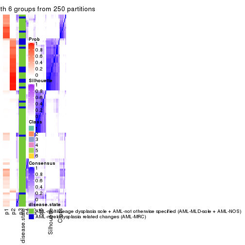</p>

</div>
</div>

Heatmaps for the membership of samples in all partitions to see how consistent they are:


<script>
$( function() {
	$( '#tabs-CV-kmeans-membership-heatmap' ).tabs();
} );
</script>
<div id='tabs-CV-kmeans-membership-heatmap'>
<ul>
<li><a href='#tab-CV-kmeans-membership-heatmap-1'>k = 2</a></li>
<li><a href='#tab-CV-kmeans-membership-heatmap-2'>k = 3</a></li>
<li><a href='#tab-CV-kmeans-membership-heatmap-3'>k = 4</a></li>
<li><a href='#tab-CV-kmeans-membership-heatmap-4'>k = 5</a></li>
<li><a href='#tab-CV-kmeans-membership-heatmap-5'>k = 6</a></li>
</ul>
<div id='tab-CV-kmeans-membership-heatmap-1'>
<pre><code class="r">membership_heatmap(res, k = 2)
</code></pre>

<p></p>

</div>
<div id='tab-CV-kmeans-membership-heatmap-2'>
<pre><code class="r">membership_heatmap(res, k = 3)
</code></pre>

<p></p>

</div>
<div id='tab-CV-kmeans-membership-heatmap-3'>
<pre><code class="r">membership_heatmap(res, k = 4)
</code></pre>

<p></p>

</div>
<div id='tab-CV-kmeans-membership-heatmap-4'>
<pre><code class="r">membership_heatmap(res, k = 5)
</code></pre>

<p></p>

</div>
<div id='tab-CV-kmeans-membership-heatmap-5'>
<pre><code class="r">membership_heatmap(res, k = 6)
</code></pre>

<p></p>

</div>
</div>

As soon as we have had the classes for columns, we can look for signatures
which are significantly different between classes which can be candidate marks
for certain classes. Following are the heatmaps for signatures.


Signature heatmaps where rows are scaled:


<script>
$( function() {
	$( '#tabs-CV-kmeans-get-signatures' ).tabs();
} );
</script>
<div id='tabs-CV-kmeans-get-signatures'>
<ul>
<li><a href='#tab-CV-kmeans-get-signatures-1'>k = 2</a></li>
<li><a href='#tab-CV-kmeans-get-signatures-2'>k = 3</a></li>
<li><a href='#tab-CV-kmeans-get-signatures-3'>k = 4</a></li>
<li><a href='#tab-CV-kmeans-get-signatures-4'>k = 5</a></li>
<li><a href='#tab-CV-kmeans-get-signatures-5'>k = 6</a></li>
</ul>
<div id='tab-CV-kmeans-get-signatures-1'>
<pre><code class="r">get_signatures(res, k = 2)
</code></pre>

<pre><code>#&gt; Error: The width or height of the raster image is zero, maybe you forget to turn off the
#&gt; previous graphic device or it was corrupted. Run `dev.off()` to close it.
</code></pre>

<p></p>

</div>
<div id='tab-CV-kmeans-get-signatures-2'>
<pre><code class="r">get_signatures(res, k = 3)
</code></pre>

<pre><code>#&gt; Error: The width or height of the raster image is zero, maybe you forget to turn off the
#&gt; previous graphic device or it was corrupted. Run `dev.off()` to close it.
</code></pre>

<p></p>

</div>
<div id='tab-CV-kmeans-get-signatures-3'>
<pre><code class="r">get_signatures(res, k = 4)
</code></pre>

<pre><code>#&gt; Error: The width or height of the raster image is zero, maybe you forget to turn off the
#&gt; previous graphic device or it was corrupted. Run `dev.off()` to close it.
</code></pre>

<p></p>

</div>
<div id='tab-CV-kmeans-get-signatures-4'>
<pre><code class="r">get_signatures(res, k = 5)
</code></pre>

<pre><code>#&gt; Error: The width or height of the raster image is zero, maybe you forget to turn off the
#&gt; previous graphic device or it was corrupted. Run `dev.off()` to close it.
</code></pre>

<p></p>

</div>
<div id='tab-CV-kmeans-get-signatures-5'>
<pre><code class="r">get_signatures(res, k = 6)
</code></pre>

<pre><code>#&gt; Error: The width or height of the raster image is zero, maybe you forget to turn off the
#&gt; previous graphic device or it was corrupted. Run `dev.off()` to close it.
</code></pre>

<p></p>

</div>
</div>


Signature heatmaps where rows are not scaled:


<script>
$( function() {
	$( '#tabs-CV-kmeans-get-signatures-no-scale' ).tabs();
} );
</script>
<div id='tabs-CV-kmeans-get-signatures-no-scale'>
<ul>
<li><a href='#tab-CV-kmeans-get-signatures-no-scale-1'>k = 2</a></li>
<li><a href='#tab-CV-kmeans-get-signatures-no-scale-2'>k = 3</a></li>
<li><a href='#tab-CV-kmeans-get-signatures-no-scale-3'>k = 4</a></li>
<li><a href='#tab-CV-kmeans-get-signatures-no-scale-4'>k = 5</a></li>
<li><a href='#tab-CV-kmeans-get-signatures-no-scale-5'>k = 6</a></li>
</ul>
<div id='tab-CV-kmeans-get-signatures-no-scale-1'>
<pre><code class="r">get_signatures(res, k = 2, scale_rows = FALSE)
</code></pre>

<pre><code>#&gt; Error: The width or height of the raster image is zero, maybe you forget to turn off the
#&gt; previous graphic device or it was corrupted. Run `dev.off()` to close it.
</code></pre>

<p></p>

</div>
<div id='tab-CV-kmeans-get-signatures-no-scale-2'>
<pre><code class="r">get_signatures(res, k = 3, scale_rows = FALSE)
</code></pre>

<pre><code>#&gt; Error: The width or height of the raster image is zero, maybe you forget to turn off the
#&gt; previous graphic device or it was corrupted. Run `dev.off()` to close it.
</code></pre>

<p></p>

</div>
<div id='tab-CV-kmeans-get-signatures-no-scale-3'>
<pre><code class="r">get_signatures(res, k = 4, scale_rows = FALSE)
</code></pre>

<pre><code>#&gt; Error: The width or height of the raster image is zero, maybe you forget to turn off the
#&gt; previous graphic device or it was corrupted. Run `dev.off()` to close it.
</code></pre>

<p></p>

</div>
<div id='tab-CV-kmeans-get-signatures-no-scale-4'>
<pre><code class="r">get_signatures(res, k = 5, scale_rows = FALSE)
</code></pre>

<pre><code>#&gt; Error: The width or height of the raster image is zero, maybe you forget to turn off the
#&gt; previous graphic device or it was corrupted. Run `dev.off()` to close it.
</code></pre>

<p></p>

</div>
<div id='tab-CV-kmeans-get-signatures-no-scale-5'>
<pre><code class="r">get_signatures(res, k = 6, scale_rows = FALSE)
</code></pre>

<pre><code>#&gt; Error: The width or height of the raster image is zero, maybe you forget to turn off the
#&gt; previous graphic device or it was corrupted. Run `dev.off()` to close it.
</code></pre>

<p></p>

</div>
</div>


Compare the overlap of signatures from different k:

```r
compare_signatures(res)
```


`get_signature()` returns a data frame invisibly. TO get the list of signatures, the function
call should be assigned to a variable explicitly. In following code, if `plot` argument is set
to `FALSE`, no heatmap is plotted while only the differential analysis is performed.

```r
# code only for demonstration
tb = get_signature(res, k = ..., plot = FALSE)
```

An example of the output of `tb` is:

```
#>   which_row         fdr    mean_1    mean_2 scaled_mean_1 scaled_mean_2 km
#> 1        38 0.042760348  8.373488  9.131774    -0.5533452     0.5164555  1
#> 2        40 0.018707592  7.106213  8.469186    -0.6173731     0.5762149  1
#> 3        55 0.019134737 10.221463 11.207825    -0.6159697     0.5749050  1
#> 4        59 0.006059896  5.921854  7.869574    -0.6899429     0.6439467  1
#> 5        60 0.018055526  8.928898 10.211722    -0.6204761     0.5791110  1
#> 6        98 0.009384629 15.714769 14.887706     0.6635654    -0.6193277  2
...
```

The columns in `tb` are:

1. `which_row`: row indices corresponding to the input matrix.
2. `fdr`: FDR for the differential test. 
3. `mean_x`: The mean value in group x.
4. `scaled_mean_x`: The mean value in group x after rows are scaled.
5. `km`: Row groups if k-means clustering is applied to rows.


UMAP plot which shows how samples are separated.


<script>
$( function() {
	$( '#tabs-CV-kmeans-dimension-reduction' ).tabs();
} );
</script>
<div id='tabs-CV-kmeans-dimension-reduction'>
<ul>
<li><a href='#tab-CV-kmeans-dimension-reduction-1'>k = 2</a></li>
<li><a href='#tab-CV-kmeans-dimension-reduction-2'>k = 3</a></li>
<li><a href='#tab-CV-kmeans-dimension-reduction-3'>k = 4</a></li>
<li><a href='#tab-CV-kmeans-dimension-reduction-4'>k = 5</a></li>
<li><a href='#tab-CV-kmeans-dimension-reduction-5'>k = 6</a></li>
</ul>
<div id='tab-CV-kmeans-dimension-reduction-1'>
<pre><code class="r">dimension_reduction(res, k = 2, method = &quot;UMAP&quot;)
</code></pre>

<p></p>

</div>
<div id='tab-CV-kmeans-dimension-reduction-2'>
<pre><code class="r">dimension_reduction(res, k = 3, method = &quot;UMAP&quot;)
</code></pre>

<p></p>

</div>
<div id='tab-CV-kmeans-dimension-reduction-3'>
<pre><code class="r">dimension_reduction(res, k = 4, method = &quot;UMAP&quot;)
</code></pre>

<p></p>

</div>
<div id='tab-CV-kmeans-dimension-reduction-4'>
<pre><code class="r">dimension_reduction(res, k = 5, method = &quot;UMAP&quot;)
</code></pre>

<p></p>

</div>
<div id='tab-CV-kmeans-dimension-reduction-5'>
<pre><code class="r">dimension_reduction(res, k = 6, method = &quot;UMAP&quot;)
</code></pre>

<p></p>

</div>
</div>


Following heatmap shows how subgroups are split when increasing `k`:

```r
collect_classes(res)
```


Test correlation between subgroups and known annotations. If the known
annotation is numeric, one-way ANOVA test is applied, and if the known
annotation is discrete, chi-squared contingency table test is applied.

```r
test_to_known_factors(res)
```

```
#>            n disease.state(p) k
#> CV:kmeans 92          0.06722 2
#> CV:kmeans 95          0.00163 3
#> CV:kmeans 92          0.00399 4
#> CV:kmeans 83          0.01015 5
#> CV:kmeans 65          0.11018 6
```


If matrix rows can be associated to genes, consider to use `functional_enrichment(res,
...)` to perform function enrichment for the signature genes. See [this vignette](http://bioconductor.org/packages/devel/bioc/vignettes/cola/inst/doc/functional_enrichment.html) for more detailed explanations.


 

---------------------------------------------------


### CV:skmeans**


The object with results only for a single top-value method and a single partition method 
can be extracted as:

```r
res = res_list["CV", "skmeans"]
# you can also extract it by
# res = res_list["CV:skmeans"]
```

A summary of `res` and all the functions that can be applied to it:

```r
res
```

```
#> A 'ConsensusPartition' object with k = 2, 3, 4, 5, 6.
#>   On a matrix with 51941 rows and 96 columns.
#>   Top rows (1000, 2000, 3000, 4000, 5000) are extracted by 'CV' method.
#>   Subgroups are detected by 'skmeans' method.
#>   Performed in total 1250 partitions by row resampling.
#>   Best k for subgroups seems to be 4.
#> 
#> Following methods can be applied to this 'ConsensusPartition' object:
#>  [1] "cola_report"             "collect_classes"         "collect_plots"          
#>  [4] "collect_stats"           "colnames"                "compare_signatures"     
#>  [7] "consensus_heatmap"       "dimension_reduction"     "functional_enrichment"  
#> [10] "get_anno_col"            "get_anno"                "get_classes"            
#> [13] "get_consensus"           "get_matrix"              "get_membership"         
#> [16] "get_param"               "get_signatures"          "get_stats"              
#> [19] "is_best_k"               "is_stable_k"             "membership_heatmap"     
#> [22] "ncol"                    "nrow"                    "plot_ecdf"              
#> [25] "rownames"                "select_partition_number" "show"                   
#> [28] "suggest_best_k"          "test_to_known_factors"
```

`collect_plots()` function collects all the plots made from `res` for all `k` (number of partitions)
into one single page to provide an easy and fast comparison between different `k`.

```r
collect_plots(res)
```


The plots are:

- The first row: a plot of the ECDF (empirical cumulative distribution
  function) curves of the consensus matrix for each `k` and the heatmap of
  predicted classes for each `k`.
- The second row: heatmaps of the consensus matrix for each `k`.
- The third row: heatmaps of the membership matrix for each `k`.
- The fouth row: heatmaps of the signatures for each `k`.

All the plots in panels can be made by individual functions and they are
plotted later in this section.

`select_partition_number()` produces several plots showing different
statistics for choosing "optimized" `k`. There are following statistics:

- ECDF curves of the consensus matrix for each `k`;
- 1-PAC. [The PAC
  score](https://en.wikipedia.org/wiki/Consensus_clustering#Over-interpretation_potential_of_consensus_clustering)
  measures the proportion of the ambiguous subgrouping.
- Mean silhouette score.
- Concordance. The mean probability of fiting the consensus class ids in all
  partitions.
- Area increased. Denote $A_k$ as the area under the ECDF curve for current
  `k`, the area increased is defined as $A_k - A_{k-1}$.
- Rand index. The percent of pairs of samples that are both in a same cluster
  or both are not in a same cluster in the partition of k and k-1.
- Jaccard index. The ratio of pairs of samples are both in a same cluster in
  the partition of k and k-1 and the pairs of samples are both in a same
  cluster in the partition k or k-1.

The detailed explanations of these statistics can be found in [the _cola_
vignette](http://bioconductor.org/packages/devel/bioc/vignettes/cola/inst/doc/cola.html#toc_13).

Generally speaking, lower PAC score, higher mean silhouette score or higher
concordance corresponds to better partition. Rand index and Jaccard index
measure how similar the current partition is compared to partition with `k-1`.
If they are too similar, we won't accept `k` is better than `k-1`.

```r
select_partition_number(res)
```


The numeric values for all these statistics can be obtained by `get_stats()`.

```r
get_stats(res)
```

```
#>   k 1-PAC mean_silhouette concordance area_increased  Rand Jaccard
#> 2 2 0.556           0.891       0.935         0.5048 0.496   0.496
#> 3 3 0.889           0.895       0.958         0.3289 0.708   0.477
#> 4 4 0.978           0.951       0.978         0.1244 0.843   0.570
#> 5 5 0.785           0.607       0.809         0.0546 0.961   0.848
#> 6 6 0.757           0.655       0.797         0.0389 0.923   0.683
```

`suggest_best_k()` suggests the best $k$ based on these statistics. The rules are as follows:

- All $k$ with Jaccard index larger than 0.95 are removed because increasing
  $k$ does not provide enough extra information. If all $k$ are removed, it is
  marked as no subgroup is detected.
- For all $k$ with 1-PAC score larger than 0.9, the maximal $k$ is taken as
  the best $k$, and other $k$ are marked as optional $k$.
- If it does not fit the second rule. The $k$ with the maximal vote of the
  highest 1-PAC score, highest mean silhouette, and highest concordance is
  taken as the best $k$.

```r
suggest_best_k(res)
```

```
#> [1] 4
```


Following shows the table of the partitions (You need to click the **show/hide
code output** link to see it). The membership matrix (columns with name `p*`)
is inferred by
[`clue::cl_consensus()`](https://www.rdocumentation.org/link/cl_consensus?package=clue)
function with the `SE` method. Basically the value in the membership matrix
represents the probability to belong to a certain group. The finall class
label for an item is determined with the group with highest probability it
belongs to.

In `get_classes()` function, the entropy is calculated from the membership
matrix and the silhouette score is calculated from the consensus matrix.


<script>
$( function() {
	$( '#tabs-CV-skmeans-get-classes' ).tabs();
} );
</script>
<div id='tabs-CV-skmeans-get-classes'>
<ul>
<li><a href='#tab-CV-skmeans-get-classes-1'>k = 2</a></li>
<li><a href='#tab-CV-skmeans-get-classes-2'>k = 3</a></li>
<li><a href='#tab-CV-skmeans-get-classes-3'>k = 4</a></li>
<li><a href='#tab-CV-skmeans-get-classes-4'>k = 5</a></li>
<li><a href='#tab-CV-skmeans-get-classes-5'>k = 6</a></li>
</ul>

<div id='tab-CV-skmeans-get-classes-1'>
<p><a id='tab-CV-skmeans-get-classes-1-a' style='color:#0366d6' href='#'>show/hide code output</a></p>
<pre><code class="r">cbind(get_classes(res, k = 2), get_membership(res, k = 2))
</code></pre>

<pre><code>#&gt;           class entropy silhouette    p1    p2
#&gt; GSM531600     2  0.0000      0.915 0.000 1.000
#&gt; GSM531601     2  0.6712      0.848 0.176 0.824
#&gt; GSM531605     1  0.0000      0.937 1.000 0.000
#&gt; GSM531615     2  0.6712      0.848 0.176 0.824
#&gt; GSM531617     2  0.6712      0.848 0.176 0.824
#&gt; GSM531624     2  0.6712      0.848 0.176 0.824
#&gt; GSM531627     2  0.0000      0.915 0.000 1.000
#&gt; GSM531629     2  0.7219      0.826 0.200 0.800
#&gt; GSM531631     2  0.6712      0.848 0.176 0.824
#&gt; GSM531634     2  0.6712      0.848 0.176 0.824
#&gt; GSM531636     2  0.0000      0.915 0.000 1.000
#&gt; GSM531637     2  0.6712      0.848 0.176 0.824
#&gt; GSM531654     2  0.6712      0.848 0.176 0.824
#&gt; GSM531655     1  0.2778      0.913 0.952 0.048
#&gt; GSM531658     1  0.0000      0.937 1.000 0.000
#&gt; GSM531660     1  0.0000      0.937 1.000 0.000
#&gt; GSM531602     1  0.0000      0.937 1.000 0.000
#&gt; GSM531603     1  0.0000      0.937 1.000 0.000
#&gt; GSM531604     1  0.0376      0.936 0.996 0.004
#&gt; GSM531606     1  0.0000      0.937 1.000 0.000
#&gt; GSM531607     1  0.0000      0.937 1.000 0.000
#&gt; GSM531608     2  0.6712      0.848 0.176 0.824
#&gt; GSM531609     1  0.0000      0.937 1.000 0.000
#&gt; GSM531610     1  0.0000      0.937 1.000 0.000
#&gt; GSM531611     1  0.0000      0.937 1.000 0.000
#&gt; GSM531612     1  0.0000      0.937 1.000 0.000
#&gt; GSM531613     1  0.0000      0.937 1.000 0.000
#&gt; GSM531614     1  0.0000      0.937 1.000 0.000
#&gt; GSM531616     2  0.0000      0.915 0.000 1.000
#&gt; GSM531618     2  0.7219      0.826 0.200 0.800
#&gt; GSM531619     2  0.6712      0.848 0.176 0.824
#&gt; GSM531620     2  0.0000      0.915 0.000 1.000
#&gt; GSM531621     2  0.0000      0.915 0.000 1.000
#&gt; GSM531622     2  0.6623      0.850 0.172 0.828
#&gt; GSM531623     2  0.0376      0.913 0.004 0.996
#&gt; GSM531625     2  0.0000      0.915 0.000 1.000
#&gt; GSM531626     2  0.0000      0.915 0.000 1.000
#&gt; GSM531628     2  0.0000      0.915 0.000 1.000
#&gt; GSM531630     2  0.4815      0.880 0.104 0.896
#&gt; GSM531632     2  0.0000      0.915 0.000 1.000
#&gt; GSM531633     2  0.0000      0.915 0.000 1.000
#&gt; GSM531635     2  0.0000      0.915 0.000 1.000
#&gt; GSM531638     2  0.0000      0.915 0.000 1.000
#&gt; GSM531639     2  0.0000      0.915 0.000 1.000
#&gt; GSM531640     2  0.6712      0.848 0.176 0.824
#&gt; GSM531641     1  0.0000      0.937 1.000 0.000
#&gt; GSM531642     2  0.0000      0.915 0.000 1.000
#&gt; GSM531643     2  0.0000      0.915 0.000 1.000
#&gt; GSM531644     2  0.0000      0.915 0.000 1.000
#&gt; GSM531645     1  0.0000      0.937 1.000 0.000
#&gt; GSM531646     2  0.0000      0.915 0.000 1.000
#&gt; GSM531647     2  0.0000      0.915 0.000 1.000
#&gt; GSM531648     2  0.9661      0.523 0.392 0.608
#&gt; GSM531649     2  0.0000      0.915 0.000 1.000
#&gt; GSM531650     2  0.0000      0.915 0.000 1.000
#&gt; GSM531651     2  0.0000      0.915 0.000 1.000
#&gt; GSM531652     2  0.0000      0.915 0.000 1.000
#&gt; GSM531653     2  0.0000      0.915 0.000 1.000
#&gt; GSM531656     2  0.0000      0.915 0.000 1.000
#&gt; GSM531657     1  0.0000      0.937 1.000 0.000
#&gt; GSM531659     1  0.0000      0.937 1.000 0.000
#&gt; GSM531661     2  0.6712      0.848 0.176 0.824
#&gt; GSM531662     2  0.0000      0.915 0.000 1.000
#&gt; GSM531663     1  0.0000      0.937 1.000 0.000
#&gt; GSM531664     1  0.7219      0.815 0.800 0.200
#&gt; GSM531665     1  0.7219      0.815 0.800 0.200
#&gt; GSM531666     1  0.6712      0.834 0.824 0.176
#&gt; GSM531667     2  0.6712      0.848 0.176 0.824
#&gt; GSM531668     1  0.0000      0.937 1.000 0.000
#&gt; GSM531669     2  0.5408      0.813 0.124 0.876
#&gt; GSM531670     2  0.0000      0.915 0.000 1.000
#&gt; GSM531671     2  0.0000      0.915 0.000 1.000
#&gt; GSM531672     1  0.0000      0.937 1.000 0.000
#&gt; GSM531673     1  0.7219      0.815 0.800 0.200
#&gt; GSM531674     2  0.5408      0.813 0.124 0.876
#&gt; GSM531675     1  0.0000      0.937 1.000 0.000
#&gt; GSM531676     1  0.6712      0.834 0.824 0.176
#&gt; GSM531677     1  0.0000      0.937 1.000 0.000
#&gt; GSM531678     1  0.0000      0.937 1.000 0.000
#&gt; GSM531679     1  0.0376      0.936 0.996 0.004
#&gt; GSM531680     1  0.6712      0.834 0.824 0.176
#&gt; GSM531681     1  0.0000      0.937 1.000 0.000
#&gt; GSM531682     1  0.0376      0.936 0.996 0.004
#&gt; GSM531683     1  0.0000      0.937 1.000 0.000
#&gt; GSM531684     1  0.0000      0.937 1.000 0.000
#&gt; GSM531685     1  0.7219      0.815 0.800 0.200
#&gt; GSM531686     1  0.0000      0.937 1.000 0.000
#&gt; GSM531687     1  0.6712      0.834 0.824 0.176
#&gt; GSM531688     1  0.7139      0.819 0.804 0.196
#&gt; GSM531689     1  0.6531      0.839 0.832 0.168
#&gt; GSM531690     1  0.0000      0.937 1.000 0.000
#&gt; GSM531691     1  0.6712      0.834 0.824 0.176
#&gt; GSM531692     1  0.7219      0.815 0.800 0.200
#&gt; GSM531693     2  0.5408      0.813 0.124 0.876
#&gt; GSM531694     1  0.0000      0.937 1.000 0.000
#&gt; GSM531695     1  0.6712      0.834 0.824 0.176
</code></pre>

<script>
$('#tab-CV-skmeans-get-classes-1-a').parent().next().next().hide();
$('#tab-CV-skmeans-get-classes-1-a').click(function(){
  $('#tab-CV-skmeans-get-classes-1-a').parent().next().next().toggle();
  return(false);
});
</script>
</div>

<div id='tab-CV-skmeans-get-classes-2'>
<p><a id='tab-CV-skmeans-get-classes-2-a' style='color:#0366d6' href='#'>show/hide code output</a></p>
<pre><code class="r">cbind(get_classes(res, k = 3), get_membership(res, k = 3))
</code></pre>

<pre><code>#&gt;           class entropy silhouette    p1    p2    p3
#&gt; GSM531600     3  0.0000     0.9236 0.000 0.000 1.000
#&gt; GSM531601     2  0.0000     0.9527 0.000 1.000 0.000
#&gt; GSM531605     1  0.0000     0.9815 1.000 0.000 0.000
#&gt; GSM531615     2  0.0000     0.9527 0.000 1.000 0.000
#&gt; GSM531617     2  0.0000     0.9527 0.000 1.000 0.000
#&gt; GSM531624     2  0.0000     0.9527 0.000 1.000 0.000
#&gt; GSM531627     2  0.0000     0.9527 0.000 1.000 0.000
#&gt; GSM531629     2  0.0000     0.9527 0.000 1.000 0.000
#&gt; GSM531631     2  0.0000     0.9527 0.000 1.000 0.000
#&gt; GSM531634     2  0.0000     0.9527 0.000 1.000 0.000
#&gt; GSM531636     3  0.4504     0.7198 0.000 0.196 0.804
#&gt; GSM531637     2  0.0000     0.9527 0.000 1.000 0.000
#&gt; GSM531654     2  0.0000     0.9527 0.000 1.000 0.000
#&gt; GSM531655     3  0.9599     0.0836 0.388 0.200 0.412
#&gt; GSM531658     1  0.0000     0.9815 1.000 0.000 0.000
#&gt; GSM531660     1  0.0000     0.9815 1.000 0.000 0.000
#&gt; GSM531602     1  0.0000     0.9815 1.000 0.000 0.000
#&gt; GSM531603     1  0.0000     0.9815 1.000 0.000 0.000
#&gt; GSM531604     1  0.0000     0.9815 1.000 0.000 0.000
#&gt; GSM531606     1  0.0000     0.9815 1.000 0.000 0.000
#&gt; GSM531607     1  0.0000     0.9815 1.000 0.000 0.000
#&gt; GSM531608     2  0.0000     0.9527 0.000 1.000 0.000
#&gt; GSM531609     1  0.0000     0.9815 1.000 0.000 0.000
#&gt; GSM531610     1  0.0000     0.9815 1.000 0.000 0.000
#&gt; GSM531611     1  0.0000     0.9815 1.000 0.000 0.000
#&gt; GSM531612     1  0.0000     0.9815 1.000 0.000 0.000
#&gt; GSM531613     1  0.0000     0.9815 1.000 0.000 0.000
#&gt; GSM531614     1  0.0000     0.9815 1.000 0.000 0.000
#&gt; GSM531616     2  0.4555     0.7130 0.000 0.800 0.200
#&gt; GSM531618     2  0.5254     0.6317 0.264 0.736 0.000
#&gt; GSM531619     2  0.0000     0.9527 0.000 1.000 0.000
#&gt; GSM531620     2  0.0000     0.9527 0.000 1.000 0.000
#&gt; GSM531621     2  0.0000     0.9527 0.000 1.000 0.000
#&gt; GSM531622     2  0.0000     0.9527 0.000 1.000 0.000
#&gt; GSM531623     2  0.0000     0.9527 0.000 1.000 0.000
#&gt; GSM531625     2  0.0000     0.9527 0.000 1.000 0.000
#&gt; GSM531626     2  0.0000     0.9527 0.000 1.000 0.000
#&gt; GSM531628     3  0.0000     0.9236 0.000 0.000 1.000
#&gt; GSM531630     2  0.0000     0.9527 0.000 1.000 0.000
#&gt; GSM531632     3  0.0000     0.9236 0.000 0.000 1.000
#&gt; GSM531633     2  0.0000     0.9527 0.000 1.000 0.000
#&gt; GSM531635     3  0.0237     0.9209 0.000 0.004 0.996
#&gt; GSM531638     2  0.0000     0.9527 0.000 1.000 0.000
#&gt; GSM531639     3  0.6192     0.2847 0.000 0.420 0.580
#&gt; GSM531640     2  0.0000     0.9527 0.000 1.000 0.000
#&gt; GSM531641     1  0.0000     0.9815 1.000 0.000 0.000
#&gt; GSM531642     3  0.0000     0.9236 0.000 0.000 1.000
#&gt; GSM531643     3  0.0000     0.9236 0.000 0.000 1.000
#&gt; GSM531644     3  0.0000     0.9236 0.000 0.000 1.000
#&gt; GSM531645     1  0.0000     0.9815 1.000 0.000 0.000
#&gt; GSM531646     3  0.0000     0.9236 0.000 0.000 1.000
#&gt; GSM531647     3  0.0000     0.9236 0.000 0.000 1.000
#&gt; GSM531648     1  0.2446     0.9202 0.936 0.012 0.052
#&gt; GSM531649     3  0.0000     0.9236 0.000 0.000 1.000
#&gt; GSM531650     3  0.0000     0.9236 0.000 0.000 1.000
#&gt; GSM531651     2  0.0000     0.9527 0.000 1.000 0.000
#&gt; GSM531652     3  0.0000     0.9236 0.000 0.000 1.000
#&gt; GSM531653     3  0.0000     0.9236 0.000 0.000 1.000
#&gt; GSM531656     3  0.0000     0.9236 0.000 0.000 1.000
#&gt; GSM531657     1  0.0000     0.9815 1.000 0.000 0.000
#&gt; GSM531659     1  0.0000     0.9815 1.000 0.000 0.000
#&gt; GSM531661     2  0.0000     0.9527 0.000 1.000 0.000
#&gt; GSM531662     2  0.0000     0.9527 0.000 1.000 0.000
#&gt; GSM531663     1  0.0000     0.9815 1.000 0.000 0.000
#&gt; GSM531664     3  0.0000     0.9236 0.000 0.000 1.000
#&gt; GSM531665     3  0.3267     0.8399 0.116 0.000 0.884
#&gt; GSM531666     3  0.0000     0.9236 0.000 0.000 1.000
#&gt; GSM531667     2  0.0000     0.9527 0.000 1.000 0.000
#&gt; GSM531668     1  0.0000     0.9815 1.000 0.000 0.000
#&gt; GSM531669     3  0.0000     0.9236 0.000 0.000 1.000
#&gt; GSM531670     3  0.0000     0.9236 0.000 0.000 1.000
#&gt; GSM531671     2  0.6111     0.3105 0.000 0.604 0.396
#&gt; GSM531672     1  0.0000     0.9815 1.000 0.000 0.000
#&gt; GSM531673     2  0.5968     0.4121 0.364 0.636 0.000
#&gt; GSM531674     3  0.0000     0.9236 0.000 0.000 1.000
#&gt; GSM531675     1  0.0000     0.9815 1.000 0.000 0.000
#&gt; GSM531676     3  0.3482     0.8300 0.128 0.000 0.872
#&gt; GSM531677     1  0.0000     0.9815 1.000 0.000 0.000
#&gt; GSM531678     1  0.0000     0.9815 1.000 0.000 0.000
#&gt; GSM531679     1  0.0000     0.9815 1.000 0.000 0.000
#&gt; GSM531680     3  0.3619     0.8219 0.136 0.000 0.864
#&gt; GSM531681     1  0.0000     0.9815 1.000 0.000 0.000
#&gt; GSM531682     1  0.0000     0.9815 1.000 0.000 0.000
#&gt; GSM531683     1  0.0000     0.9815 1.000 0.000 0.000
#&gt; GSM531684     1  0.6280     0.1224 0.540 0.460 0.000
#&gt; GSM531685     3  0.0000     0.9236 0.000 0.000 1.000
#&gt; GSM531686     1  0.0000     0.9815 1.000 0.000 0.000
#&gt; GSM531687     3  0.3551     0.8261 0.132 0.000 0.868
#&gt; GSM531688     3  0.0000     0.9236 0.000 0.000 1.000
#&gt; GSM531689     1  0.0000     0.9815 1.000 0.000 0.000
#&gt; GSM531690     1  0.0000     0.9815 1.000 0.000 0.000
#&gt; GSM531691     1  0.2356     0.9054 0.928 0.000 0.072
#&gt; GSM531692     3  0.6654     0.1293 0.008 0.456 0.536
#&gt; GSM531693     3  0.0000     0.9236 0.000 0.000 1.000
#&gt; GSM531694     1  0.0000     0.9815 1.000 0.000 0.000
#&gt; GSM531695     3  0.0000     0.9236 0.000 0.000 1.000
</code></pre>

<script>
$('#tab-CV-skmeans-get-classes-2-a').parent().next().next().hide();
$('#tab-CV-skmeans-get-classes-2-a').click(function(){
  $('#tab-CV-skmeans-get-classes-2-a').parent().next().next().toggle();
  return(false);
});
</script>
</div>

<div id='tab-CV-skmeans-get-classes-3'>
<p><a id='tab-CV-skmeans-get-classes-3-a' style='color:#0366d6' href='#'>show/hide code output</a></p>
<pre><code class="r">cbind(get_classes(res, k = 4), get_membership(res, k = 4))
</code></pre>

<pre><code>#&gt;           class entropy silhouette    p1    p2    p3    p4
#&gt; GSM531600     3  0.0000      0.982 0.000 0.000 1.000 0.000
#&gt; GSM531601     2  0.0000      0.969 0.000 1.000 0.000 0.000
#&gt; GSM531605     1  0.0000      0.963 1.000 0.000 0.000 0.000
#&gt; GSM531615     2  0.0000      0.969 0.000 1.000 0.000 0.000
#&gt; GSM531617     2  0.0000      0.969 0.000 1.000 0.000 0.000
#&gt; GSM531624     2  0.0000      0.969 0.000 1.000 0.000 0.000
#&gt; GSM531627     2  0.0000      0.969 0.000 1.000 0.000 0.000
#&gt; GSM531629     2  0.0000      0.969 0.000 1.000 0.000 0.000
#&gt; GSM531631     2  0.0000      0.969 0.000 1.000 0.000 0.000
#&gt; GSM531634     2  0.0000      0.969 0.000 1.000 0.000 0.000
#&gt; GSM531636     3  0.3024      0.820 0.000 0.148 0.852 0.000
#&gt; GSM531637     2  0.0000      0.969 0.000 1.000 0.000 0.000
#&gt; GSM531654     2  0.0000      0.969 0.000 1.000 0.000 0.000
#&gt; GSM531655     1  0.6724      0.546 0.616 0.192 0.192 0.000
#&gt; GSM531658     4  0.0000      0.998 0.000 0.000 0.000 1.000
#&gt; GSM531660     4  0.0469      0.989 0.012 0.000 0.000 0.988
#&gt; GSM531602     1  0.0000      0.963 1.000 0.000 0.000 0.000
#&gt; GSM531603     1  0.0000      0.963 1.000 0.000 0.000 0.000
#&gt; GSM531604     1  0.0000      0.963 1.000 0.000 0.000 0.000
#&gt; GSM531606     1  0.0000      0.963 1.000 0.000 0.000 0.000
#&gt; GSM531607     1  0.0000      0.963 1.000 0.000 0.000 0.000
#&gt; GSM531608     2  0.0000      0.969 0.000 1.000 0.000 0.000
#&gt; GSM531609     4  0.0000      0.998 0.000 0.000 0.000 1.000
#&gt; GSM531610     4  0.0000      0.998 0.000 0.000 0.000 1.000
#&gt; GSM531611     4  0.0000      0.998 0.000 0.000 0.000 1.000
#&gt; GSM531612     4  0.0000      0.998 0.000 0.000 0.000 1.000
#&gt; GSM531613     4  0.0000      0.998 0.000 0.000 0.000 1.000
#&gt; GSM531614     4  0.0000      0.998 0.000 0.000 0.000 1.000
#&gt; GSM531616     2  0.4713      0.460 0.000 0.640 0.360 0.000
#&gt; GSM531618     4  0.0000      0.998 0.000 0.000 0.000 1.000
#&gt; GSM531619     2  0.0000      0.969 0.000 1.000 0.000 0.000
#&gt; GSM531620     2  0.0000      0.969 0.000 1.000 0.000 0.000
#&gt; GSM531621     2  0.0000      0.969 0.000 1.000 0.000 0.000
#&gt; GSM531622     2  0.0000      0.969 0.000 1.000 0.000 0.000
#&gt; GSM531623     2  0.0000      0.969 0.000 1.000 0.000 0.000
#&gt; GSM531625     2  0.0592      0.957 0.000 0.984 0.016 0.000
#&gt; GSM531626     2  0.0921      0.947 0.000 0.972 0.028 0.000
#&gt; GSM531628     3  0.0000      0.982 0.000 0.000 1.000 0.000
#&gt; GSM531630     2  0.0000      0.969 0.000 1.000 0.000 0.000
#&gt; GSM531632     3  0.0000      0.982 0.000 0.000 1.000 0.000
#&gt; GSM531633     2  0.0000      0.969 0.000 1.000 0.000 0.000
#&gt; GSM531635     3  0.0000      0.982 0.000 0.000 1.000 0.000
#&gt; GSM531638     2  0.0817      0.950 0.000 0.976 0.024 0.000
#&gt; GSM531639     3  0.3444      0.769 0.000 0.184 0.816 0.000
#&gt; GSM531640     2  0.0000      0.969 0.000 1.000 0.000 0.000
#&gt; GSM531641     4  0.0000      0.998 0.000 0.000 0.000 1.000
#&gt; GSM531642     3  0.0000      0.982 0.000 0.000 1.000 0.000
#&gt; GSM531643     3  0.0000      0.982 0.000 0.000 1.000 0.000
#&gt; GSM531644     3  0.0000      0.982 0.000 0.000 1.000 0.000
#&gt; GSM531645     4  0.0000      0.998 0.000 0.000 0.000 1.000
#&gt; GSM531646     3  0.0000      0.982 0.000 0.000 1.000 0.000
#&gt; GSM531647     3  0.0000      0.982 0.000 0.000 1.000 0.000
#&gt; GSM531648     4  0.0000      0.998 0.000 0.000 0.000 1.000
#&gt; GSM531649     3  0.0000      0.982 0.000 0.000 1.000 0.000
#&gt; GSM531650     3  0.0000      0.982 0.000 0.000 1.000 0.000
#&gt; GSM531651     2  0.0000      0.969 0.000 1.000 0.000 0.000
#&gt; GSM531652     3  0.0469      0.972 0.000 0.000 0.988 0.012
#&gt; GSM531653     3  0.0000      0.982 0.000 0.000 1.000 0.000
#&gt; GSM531656     3  0.0000      0.982 0.000 0.000 1.000 0.000
#&gt; GSM531657     4  0.0000      0.998 0.000 0.000 0.000 1.000
#&gt; GSM531659     4  0.0000      0.998 0.000 0.000 0.000 1.000
#&gt; GSM531661     2  0.0000      0.969 0.000 1.000 0.000 0.000
#&gt; GSM531662     2  0.0000      0.969 0.000 1.000 0.000 0.000
#&gt; GSM531663     4  0.0000      0.998 0.000 0.000 0.000 1.000
#&gt; GSM531664     3  0.0000      0.982 0.000 0.000 1.000 0.000
#&gt; GSM531665     1  0.3801      0.739 0.780 0.000 0.220 0.000
#&gt; GSM531666     3  0.0000      0.982 0.000 0.000 1.000 0.000
#&gt; GSM531667     2  0.0000      0.969 0.000 1.000 0.000 0.000
#&gt; GSM531668     4  0.0188      0.995 0.004 0.000 0.000 0.996
#&gt; GSM531669     3  0.0000      0.982 0.000 0.000 1.000 0.000
#&gt; GSM531670     3  0.0000      0.982 0.000 0.000 1.000 0.000
#&gt; GSM531671     2  0.4817      0.394 0.000 0.612 0.388 0.000
#&gt; GSM531672     4  0.0000      0.998 0.000 0.000 0.000 1.000
#&gt; GSM531673     1  0.0469      0.956 0.988 0.012 0.000 0.000
#&gt; GSM531674     3  0.0000      0.982 0.000 0.000 1.000 0.000
#&gt; GSM531675     1  0.1792      0.910 0.932 0.000 0.000 0.068
#&gt; GSM531676     1  0.0817      0.952 0.976 0.000 0.024 0.000
#&gt; GSM531677     1  0.0000      0.963 1.000 0.000 0.000 0.000
#&gt; GSM531678     1  0.0000      0.963 1.000 0.000 0.000 0.000
#&gt; GSM531679     1  0.0000      0.963 1.000 0.000 0.000 0.000
#&gt; GSM531680     1  0.0817      0.952 0.976 0.000 0.024 0.000
#&gt; GSM531681     4  0.0469      0.989 0.012 0.000 0.000 0.988
#&gt; GSM531682     1  0.0000      0.963 1.000 0.000 0.000 0.000
#&gt; GSM531683     1  0.0000      0.963 1.000 0.000 0.000 0.000
#&gt; GSM531684     1  0.0000      0.963 1.000 0.000 0.000 0.000
#&gt; GSM531685     1  0.1118      0.944 0.964 0.000 0.036 0.000
#&gt; GSM531686     4  0.0592      0.985 0.016 0.000 0.000 0.984
#&gt; GSM531687     1  0.0817      0.952 0.976 0.000 0.024 0.000
#&gt; GSM531688     3  0.0469      0.971 0.012 0.000 0.988 0.000
#&gt; GSM531689     1  0.0000      0.963 1.000 0.000 0.000 0.000
#&gt; GSM531690     4  0.0188      0.995 0.004 0.000 0.000 0.996
#&gt; GSM531691     1  0.0000      0.963 1.000 0.000 0.000 0.000
#&gt; GSM531692     1  0.0188      0.961 0.996 0.000 0.004 0.000
#&gt; GSM531693     3  0.0000      0.982 0.000 0.000 1.000 0.000
#&gt; GSM531694     1  0.0000      0.963 1.000 0.000 0.000 0.000
#&gt; GSM531695     1  0.2704      0.862 0.876 0.000 0.124 0.000
</code></pre>

<script>
$('#tab-CV-skmeans-get-classes-3-a').parent().next().next().hide();
$('#tab-CV-skmeans-get-classes-3-a').click(function(){
  $('#tab-CV-skmeans-get-classes-3-a').parent().next().next().toggle();
  return(false);
});
</script>
</div>

<div id='tab-CV-skmeans-get-classes-4'>
<p><a id='tab-CV-skmeans-get-classes-4-a' style='color:#0366d6' href='#'>show/hide code output</a></p>
<pre><code class="r">cbind(get_classes(res, k = 5), get_membership(res, k = 5))
</code></pre>

<pre><code>#&gt;           class entropy silhouette    p1    p2    p3    p4    p5
#&gt; GSM531600     3  0.2280     0.8358 0.000 0.000 0.880 0.000 0.120
#&gt; GSM531601     2  0.3814     0.6683 0.000 0.720 0.004 0.000 0.276
#&gt; GSM531605     1  0.0162     0.3957 0.996 0.000 0.000 0.000 0.004
#&gt; GSM531615     2  0.0290     0.9071 0.000 0.992 0.000 0.000 0.008
#&gt; GSM531617     2  0.0290     0.9071 0.000 0.992 0.000 0.000 0.008
#&gt; GSM531624     2  0.0000     0.9081 0.000 1.000 0.000 0.000 0.000
#&gt; GSM531627     2  0.1270     0.8952 0.000 0.948 0.000 0.000 0.052
#&gt; GSM531629     2  0.0404     0.9061 0.000 0.988 0.000 0.000 0.012
#&gt; GSM531631     2  0.0000     0.9081 0.000 1.000 0.000 0.000 0.000
#&gt; GSM531634     2  0.0290     0.9071 0.000 0.992 0.000 0.000 0.008
#&gt; GSM531636     3  0.3236     0.8180 0.000 0.020 0.828 0.000 0.152
#&gt; GSM531637     2  0.0000     0.9081 0.000 1.000 0.000 0.000 0.000
#&gt; GSM531654     2  0.5535     0.3385 0.392 0.536 0.000 0.000 0.072
#&gt; GSM531655     1  0.6299     0.1791 0.556 0.080 0.036 0.000 0.328
#&gt; GSM531658     4  0.1341     0.9058 0.000 0.000 0.000 0.944 0.056
#&gt; GSM531660     1  0.5804    -0.1912 0.476 0.012 0.000 0.452 0.060
#&gt; GSM531602     1  0.0000     0.3967 1.000 0.000 0.000 0.000 0.000
#&gt; GSM531603     1  0.0404     0.3941 0.988 0.000 0.000 0.000 0.012
#&gt; GSM531604     1  0.4150    -0.3012 0.612 0.000 0.000 0.000 0.388
#&gt; GSM531606     1  0.1341     0.3722 0.944 0.000 0.000 0.000 0.056
#&gt; GSM531607     1  0.0162     0.3957 0.996 0.000 0.000 0.000 0.004
#&gt; GSM531608     2  0.0162     0.9077 0.000 0.996 0.000 0.000 0.004
#&gt; GSM531609     4  0.0000     0.9312 0.000 0.000 0.000 1.000 0.000
#&gt; GSM531610     4  0.0000     0.9312 0.000 0.000 0.000 1.000 0.000
#&gt; GSM531611     4  0.0000     0.9312 0.000 0.000 0.000 1.000 0.000
#&gt; GSM531612     4  0.0000     0.9312 0.000 0.000 0.000 1.000 0.000
#&gt; GSM531613     4  0.0000     0.9312 0.000 0.000 0.000 1.000 0.000
#&gt; GSM531614     4  0.0000     0.9312 0.000 0.000 0.000 1.000 0.000
#&gt; GSM531616     2  0.5076     0.6325 0.000 0.692 0.200 0.000 0.108
#&gt; GSM531618     4  0.4703     0.6851 0.000 0.036 0.004 0.684 0.276
#&gt; GSM531619     2  0.0000     0.9081 0.000 1.000 0.000 0.000 0.000
#&gt; GSM531620     2  0.0880     0.9039 0.000 0.968 0.000 0.000 0.032
#&gt; GSM531621     2  0.1121     0.8981 0.000 0.956 0.000 0.000 0.044
#&gt; GSM531622     2  0.0000     0.9081 0.000 1.000 0.000 0.000 0.000
#&gt; GSM531623     2  0.0404     0.9071 0.000 0.988 0.000 0.000 0.012
#&gt; GSM531625     2  0.3214     0.8312 0.000 0.844 0.036 0.000 0.120
#&gt; GSM531626     2  0.3507     0.8176 0.000 0.828 0.052 0.000 0.120
#&gt; GSM531628     3  0.0000     0.8516 0.000 0.000 1.000 0.000 0.000
#&gt; GSM531630     2  0.0404     0.9071 0.000 0.988 0.000 0.000 0.012
#&gt; GSM531632     3  0.1270     0.8369 0.000 0.000 0.948 0.000 0.052
#&gt; GSM531633     2  0.1043     0.8995 0.000 0.960 0.000 0.000 0.040
#&gt; GSM531635     3  0.2179     0.8378 0.000 0.000 0.888 0.000 0.112
#&gt; GSM531638     2  0.3543     0.8156 0.000 0.828 0.060 0.000 0.112
#&gt; GSM531639     3  0.5145     0.6925 0.000 0.056 0.612 0.000 0.332
#&gt; GSM531640     2  0.0000     0.9081 0.000 1.000 0.000 0.000 0.000
#&gt; GSM531641     4  0.0000     0.9312 0.000 0.000 0.000 1.000 0.000
#&gt; GSM531642     3  0.4318     0.7130 0.000 0.000 0.688 0.020 0.292
#&gt; GSM531643     3  0.0162     0.8519 0.000 0.000 0.996 0.000 0.004
#&gt; GSM531644     3  0.3534     0.7370 0.000 0.000 0.744 0.000 0.256
#&gt; GSM531645     4  0.0000     0.9312 0.000 0.000 0.000 1.000 0.000
#&gt; GSM531646     3  0.0510     0.8523 0.000 0.000 0.984 0.000 0.016
#&gt; GSM531647     3  0.0162     0.8512 0.000 0.000 0.996 0.000 0.004
#&gt; GSM531648     4  0.3766     0.7264 0.000 0.000 0.004 0.728 0.268
#&gt; GSM531649     3  0.2280     0.8358 0.000 0.000 0.880 0.000 0.120
#&gt; GSM531650     3  0.0000     0.8516 0.000 0.000 1.000 0.000 0.000
#&gt; GSM531651     2  0.0404     0.9071 0.000 0.988 0.000 0.000 0.012
#&gt; GSM531652     3  0.4229     0.7087 0.000 0.000 0.704 0.020 0.276
#&gt; GSM531653     3  0.1544     0.8479 0.000 0.000 0.932 0.000 0.068
#&gt; GSM531656     3  0.2280     0.8377 0.000 0.000 0.880 0.000 0.120
#&gt; GSM531657     4  0.0290     0.9290 0.000 0.000 0.000 0.992 0.008
#&gt; GSM531659     4  0.0566     0.9278 0.004 0.000 0.000 0.984 0.012
#&gt; GSM531661     2  0.0880     0.8976 0.000 0.968 0.000 0.000 0.032
#&gt; GSM531662     2  0.4049     0.7764 0.056 0.780 0.000 0.000 0.164
#&gt; GSM531663     4  0.0000     0.9312 0.000 0.000 0.000 1.000 0.000
#&gt; GSM531664     3  0.0290     0.8506 0.000 0.000 0.992 0.000 0.008
#&gt; GSM531665     5  0.5795     0.6393 0.268 0.000 0.136 0.000 0.596
#&gt; GSM531666     3  0.4170     0.7148 0.004 0.000 0.712 0.012 0.272
#&gt; GSM531667     2  0.0000     0.9081 0.000 1.000 0.000 0.000 0.000
#&gt; GSM531668     1  0.5904    -0.1990 0.468 0.012 0.000 0.452 0.068
#&gt; GSM531669     3  0.1270     0.8369 0.000 0.000 0.948 0.000 0.052
#&gt; GSM531670     3  0.2280     0.8377 0.000 0.000 0.880 0.000 0.120
#&gt; GSM531671     2  0.7343     0.1022 0.036 0.380 0.208 0.000 0.376
#&gt; GSM531672     4  0.2036     0.8980 0.024 0.000 0.000 0.920 0.056
#&gt; GSM531673     1  0.3774     0.1979 0.704 0.000 0.000 0.000 0.296
#&gt; GSM531674     3  0.0703     0.8465 0.000 0.000 0.976 0.000 0.024
#&gt; GSM531675     1  0.6038    -0.1776 0.576 0.000 0.000 0.184 0.240
#&gt; GSM531676     5  0.4905     0.6044 0.476 0.000 0.024 0.000 0.500
#&gt; GSM531677     1  0.4350    -0.4322 0.588 0.000 0.000 0.004 0.408
#&gt; GSM531678     1  0.4235    -0.4488 0.576 0.000 0.000 0.000 0.424
#&gt; GSM531679     1  0.4227    -0.4429 0.580 0.000 0.000 0.000 0.420
#&gt; GSM531680     1  0.4974    -0.6416 0.508 0.000 0.028 0.000 0.464
#&gt; GSM531681     4  0.2563     0.8362 0.120 0.000 0.000 0.872 0.008
#&gt; GSM531682     1  0.4235    -0.4488 0.576 0.000 0.000 0.000 0.424
#&gt; GSM531683     1  0.0290     0.3941 0.992 0.000 0.000 0.000 0.008
#&gt; GSM531684     1  0.2020     0.3465 0.900 0.000 0.000 0.000 0.100
#&gt; GSM531685     5  0.4371     0.6991 0.344 0.000 0.012 0.000 0.644
#&gt; GSM531686     4  0.3182     0.8090 0.124 0.000 0.000 0.844 0.032
#&gt; GSM531687     1  0.4980    -0.6707 0.488 0.000 0.028 0.000 0.484
#&gt; GSM531688     3  0.4440     0.0586 0.004 0.000 0.528 0.000 0.468
#&gt; GSM531689     1  0.4294    -0.5584 0.532 0.000 0.000 0.000 0.468
#&gt; GSM531690     4  0.2583     0.8342 0.132 0.000 0.000 0.864 0.004
#&gt; GSM531691     1  0.4304    -0.5873 0.516 0.000 0.000 0.000 0.484
#&gt; GSM531692     5  0.4192     0.6795 0.404 0.000 0.000 0.000 0.596
#&gt; GSM531693     3  0.3895     0.4887 0.000 0.000 0.680 0.000 0.320
#&gt; GSM531694     1  0.0000     0.3967 1.000 0.000 0.000 0.000 0.000
#&gt; GSM531695     5  0.6127     0.6406 0.416 0.000 0.128 0.000 0.456
</code></pre>

<script>
$('#tab-CV-skmeans-get-classes-4-a').parent().next().next().hide();
$('#tab-CV-skmeans-get-classes-4-a').click(function(){
  $('#tab-CV-skmeans-get-classes-4-a').parent().next().next().toggle();
  return(false);
});
</script>
</div>

<div id='tab-CV-skmeans-get-classes-5'>
<p><a id='tab-CV-skmeans-get-classes-5-a' style='color:#0366d6' href='#'>show/hide code output</a></p>
<pre><code class="r">cbind(get_classes(res, k = 6), get_membership(res, k = 6))
</code></pre>

<pre><code>#&gt;           class entropy silhouette    p1    p2    p3    p4    p5    p6
#&gt; GSM531600     3  0.2632     0.6681 0.004 0.000 0.832 0.000 0.000 0.164
#&gt; GSM531601     2  0.4072     0.2162 0.008 0.544 0.000 0.000 0.000 0.448
#&gt; GSM531605     1  0.3136     0.6842 0.768 0.000 0.000 0.000 0.228 0.004
#&gt; GSM531615     2  0.1644     0.8499 0.028 0.932 0.000 0.000 0.000 0.040
#&gt; GSM531617     2  0.1700     0.8474 0.024 0.928 0.000 0.000 0.000 0.048
#&gt; GSM531624     2  0.0000     0.8656 0.000 1.000 0.000 0.000 0.000 0.000
#&gt; GSM531627     2  0.2442     0.8248 0.004 0.852 0.000 0.000 0.000 0.144
#&gt; GSM531629     2  0.1921     0.8425 0.032 0.916 0.000 0.000 0.000 0.052
#&gt; GSM531631     2  0.0405     0.8664 0.004 0.988 0.000 0.000 0.000 0.008
#&gt; GSM531634     2  0.1297     0.8540 0.012 0.948 0.000 0.000 0.000 0.040
#&gt; GSM531636     3  0.3803     0.6061 0.004 0.020 0.724 0.000 0.000 0.252
#&gt; GSM531637     2  0.0000     0.8656 0.000 1.000 0.000 0.000 0.000 0.000
#&gt; GSM531654     1  0.4990     0.3722 0.616 0.276 0.000 0.000 0.000 0.108
#&gt; GSM531655     1  0.5180     0.3956 0.580 0.016 0.028 0.000 0.020 0.356
#&gt; GSM531658     4  0.3248     0.7512 0.032 0.000 0.000 0.804 0.000 0.164
#&gt; GSM531660     1  0.4213     0.5868 0.744 0.004 0.000 0.160 0.000 0.092
#&gt; GSM531602     1  0.2883     0.6891 0.788 0.000 0.000 0.000 0.212 0.000
#&gt; GSM531603     1  0.2933     0.6910 0.796 0.000 0.000 0.000 0.200 0.004
#&gt; GSM531604     5  0.4855     0.4915 0.328 0.000 0.000 0.000 0.596 0.076
#&gt; GSM531606     1  0.3558     0.6360 0.736 0.000 0.000 0.000 0.248 0.016
#&gt; GSM531607     1  0.2883     0.6891 0.788 0.000 0.000 0.000 0.212 0.000
#&gt; GSM531608     2  0.2003     0.8461 0.044 0.912 0.000 0.000 0.000 0.044
#&gt; GSM531609     4  0.0547     0.8631 0.000 0.000 0.000 0.980 0.000 0.020
#&gt; GSM531610     4  0.0000     0.8649 0.000 0.000 0.000 1.000 0.000 0.000
#&gt; GSM531611     4  0.0000     0.8649 0.000 0.000 0.000 1.000 0.000 0.000
#&gt; GSM531612     4  0.0547     0.8631 0.000 0.000 0.000 0.980 0.000 0.020
#&gt; GSM531613     4  0.0000     0.8649 0.000 0.000 0.000 1.000 0.000 0.000
#&gt; GSM531614     4  0.0458     0.8639 0.000 0.000 0.000 0.984 0.000 0.016
#&gt; GSM531616     2  0.5624     0.5439 0.012 0.584 0.168 0.000 0.000 0.236
#&gt; GSM531618     6  0.5161     0.2924 0.012 0.068 0.000 0.352 0.000 0.568
#&gt; GSM531619     2  0.0000     0.8656 0.000 1.000 0.000 0.000 0.000 0.000
#&gt; GSM531620     2  0.2100     0.8455 0.004 0.884 0.000 0.000 0.000 0.112
#&gt; GSM531621     2  0.2234     0.8354 0.004 0.872 0.000 0.000 0.000 0.124
#&gt; GSM531622     2  0.0405     0.8664 0.004 0.988 0.000 0.000 0.000 0.008
#&gt; GSM531623     2  0.0632     0.8661 0.000 0.976 0.000 0.000 0.000 0.024
#&gt; GSM531625     2  0.4599     0.6847 0.012 0.680 0.056 0.000 0.000 0.252
#&gt; GSM531626     2  0.4654     0.6807 0.012 0.676 0.060 0.000 0.000 0.252
#&gt; GSM531628     3  0.1334     0.6884 0.000 0.000 0.948 0.000 0.020 0.032
#&gt; GSM531630     2  0.0508     0.8664 0.004 0.984 0.000 0.000 0.000 0.012
#&gt; GSM531632     3  0.2358     0.6869 0.012 0.000 0.900 0.000 0.040 0.048
#&gt; GSM531633     2  0.2234     0.8354 0.004 0.872 0.000 0.000 0.000 0.124
#&gt; GSM531635     3  0.3693     0.6331 0.012 0.016 0.756 0.000 0.000 0.216
#&gt; GSM531638     2  0.4715     0.6777 0.012 0.676 0.068 0.000 0.000 0.244
#&gt; GSM531639     3  0.5167     0.2281 0.012 0.056 0.480 0.000 0.000 0.452
#&gt; GSM531640     2  0.0291     0.8662 0.004 0.992 0.000 0.000 0.000 0.004
#&gt; GSM531641     4  0.0547     0.8631 0.000 0.000 0.000 0.980 0.000 0.020
#&gt; GSM531642     6  0.4245     0.4657 0.004 0.000 0.376 0.016 0.000 0.604
#&gt; GSM531643     3  0.1838     0.6708 0.000 0.000 0.916 0.000 0.016 0.068
#&gt; GSM531644     3  0.4227    -0.4186 0.004 0.000 0.500 0.000 0.008 0.488
#&gt; GSM531645     4  0.0547     0.8631 0.000 0.000 0.000 0.980 0.000 0.020
#&gt; GSM531646     3  0.1668     0.7010 0.008 0.000 0.928 0.000 0.004 0.060
#&gt; GSM531647     3  0.0547     0.6992 0.000 0.000 0.980 0.000 0.020 0.000
#&gt; GSM531648     6  0.4300     0.1260 0.020 0.000 0.000 0.432 0.000 0.548
#&gt; GSM531649     3  0.3245     0.6382 0.008 0.000 0.764 0.000 0.000 0.228
#&gt; GSM531650     3  0.1461     0.6840 0.000 0.000 0.940 0.000 0.016 0.044
#&gt; GSM531651     2  0.0632     0.8661 0.000 0.976 0.000 0.000 0.000 0.024
#&gt; GSM531652     6  0.4325     0.4962 0.004 0.000 0.412 0.016 0.000 0.568
#&gt; GSM531653     3  0.1219     0.7027 0.000 0.000 0.948 0.000 0.004 0.048
#&gt; GSM531656     3  0.2994     0.6493 0.004 0.000 0.788 0.000 0.000 0.208
#&gt; GSM531657     4  0.2858     0.7976 0.032 0.000 0.000 0.844 0.000 0.124
#&gt; GSM531659     4  0.4104     0.7646 0.040 0.000 0.000 0.784 0.056 0.120
#&gt; GSM531661     2  0.3123     0.7920 0.076 0.836 0.000 0.000 0.000 0.088
#&gt; GSM531662     2  0.6069     0.4981 0.212 0.548 0.000 0.000 0.028 0.212
#&gt; GSM531663     4  0.0260     0.8634 0.000 0.000 0.000 0.992 0.000 0.008
#&gt; GSM531664     3  0.1713     0.6833 0.000 0.000 0.928 0.000 0.028 0.044
#&gt; GSM531665     5  0.5089     0.5834 0.164 0.000 0.068 0.000 0.700 0.068
#&gt; GSM531666     6  0.4093     0.4471 0.004 0.000 0.440 0.004 0.000 0.552
#&gt; GSM531667     2  0.0820     0.8625 0.016 0.972 0.000 0.000 0.000 0.012
#&gt; GSM531668     1  0.4379     0.5724 0.732 0.004 0.000 0.140 0.000 0.124
#&gt; GSM531669     3  0.1624     0.6905 0.008 0.000 0.936 0.000 0.044 0.012
#&gt; GSM531670     3  0.2964     0.6518 0.004 0.000 0.792 0.000 0.000 0.204
#&gt; GSM531671     3  0.8807     0.0213 0.192 0.180 0.268 0.000 0.124 0.236
#&gt; GSM531672     4  0.3943     0.7172 0.084 0.000 0.000 0.760 0.000 0.156
#&gt; GSM531673     1  0.5716     0.0407 0.500 0.000 0.000 0.000 0.312 0.188
#&gt; GSM531674     3  0.1265     0.6940 0.000 0.000 0.948 0.000 0.044 0.008
#&gt; GSM531675     5  0.6550     0.2709 0.260 0.000 0.000 0.188 0.496 0.056
#&gt; GSM531676     5  0.0146     0.7416 0.000 0.000 0.000 0.000 0.996 0.004
#&gt; GSM531677     5  0.4331     0.6028 0.228 0.000 0.000 0.024 0.716 0.032
#&gt; GSM531678     5  0.3178     0.6701 0.176 0.000 0.000 0.004 0.804 0.016
#&gt; GSM531679     5  0.3480     0.6578 0.200 0.000 0.000 0.008 0.776 0.016
#&gt; GSM531680     5  0.1219     0.7332 0.048 0.000 0.000 0.000 0.948 0.004
#&gt; GSM531681     4  0.3721     0.7324 0.064 0.000 0.000 0.808 0.108 0.020
#&gt; GSM531682     5  0.3799     0.6549 0.196 0.000 0.000 0.016 0.764 0.024
#&gt; GSM531683     1  0.4222     0.5973 0.700 0.000 0.000 0.020 0.260 0.020
#&gt; GSM531684     1  0.3803     0.5528 0.760 0.000 0.000 0.000 0.184 0.056
#&gt; GSM531685     5  0.3150     0.6728 0.104 0.000 0.016 0.000 0.844 0.036
#&gt; GSM531686     4  0.3935     0.7097 0.064 0.000 0.000 0.788 0.128 0.020
#&gt; GSM531687     5  0.0862     0.7410 0.016 0.000 0.004 0.000 0.972 0.008
#&gt; GSM531688     3  0.4481     0.1614 0.008 0.000 0.520 0.000 0.456 0.016
#&gt; GSM531689     5  0.1075     0.7404 0.048 0.000 0.000 0.000 0.952 0.000
#&gt; GSM531690     4  0.5832     0.5643 0.172 0.000 0.000 0.628 0.132 0.068
#&gt; GSM531691     5  0.1967     0.7364 0.084 0.000 0.000 0.000 0.904 0.012
#&gt; GSM531692     5  0.3663     0.6357 0.148 0.000 0.000 0.000 0.784 0.068
#&gt; GSM531693     3  0.4178     0.4832 0.008 0.000 0.700 0.000 0.260 0.032
#&gt; GSM531694     1  0.2883     0.6891 0.788 0.000 0.000 0.000 0.212 0.000
#&gt; GSM531695     5  0.4034     0.5827 0.064 0.000 0.168 0.000 0.760 0.008
</code></pre>

<script>
$('#tab-CV-skmeans-get-classes-5-a').parent().next().next().hide();
$('#tab-CV-skmeans-get-classes-5-a').click(function(){
  $('#tab-CV-skmeans-get-classes-5-a').parent().next().next().toggle();
  return(false);
});
</script>
</div>
</div>

Heatmaps for the consensus matrix. It visualizes the probability of two
samples to be in a same group.


<script>
$( function() {
	$( '#tabs-CV-skmeans-consensus-heatmap' ).tabs();
} );
</script>
<div id='tabs-CV-skmeans-consensus-heatmap'>
<ul>
<li><a href='#tab-CV-skmeans-consensus-heatmap-1'>k = 2</a></li>
<li><a href='#tab-CV-skmeans-consensus-heatmap-2'>k = 3</a></li>
<li><a href='#tab-CV-skmeans-consensus-heatmap-3'>k = 4</a></li>
<li><a href='#tab-CV-skmeans-consensus-heatmap-4'>k = 5</a></li>
<li><a href='#tab-CV-skmeans-consensus-heatmap-5'>k = 6</a></li>
</ul>
<div id='tab-CV-skmeans-consensus-heatmap-1'>
<pre><code class="r">consensus_heatmap(res, k = 2)
</code></pre>

<p></p>

</div>
<div id='tab-CV-skmeans-consensus-heatmap-2'>
<pre><code class="r">consensus_heatmap(res, k = 3)
</code></pre>

<p></p>

</div>
<div id='tab-CV-skmeans-consensus-heatmap-3'>
<pre><code class="r">consensus_heatmap(res, k = 4)
</code></pre>

<p></p>

</div>
<div id='tab-CV-skmeans-consensus-heatmap-4'>
<pre><code class="r">consensus_heatmap(res, k = 5)
</code></pre>

<p></p>

</div>
<div id='tab-CV-skmeans-consensus-heatmap-5'>
<pre><code class="r">consensus_heatmap(res, k = 6)
</code></pre>

<p></p>

</div>
</div>

Heatmaps for the membership of samples in all partitions to see how consistent they are:


<script>
$( function() {
	$( '#tabs-CV-skmeans-membership-heatmap' ).tabs();
} );
</script>
<div id='tabs-CV-skmeans-membership-heatmap'>
<ul>
<li><a href='#tab-CV-skmeans-membership-heatmap-1'>k = 2</a></li>
<li><a href='#tab-CV-skmeans-membership-heatmap-2'>k = 3</a></li>
<li><a href='#tab-CV-skmeans-membership-heatmap-3'>k = 4</a></li>
<li><a href='#tab-CV-skmeans-membership-heatmap-4'>k = 5</a></li>
<li><a href='#tab-CV-skmeans-membership-heatmap-5'>k = 6</a></li>
</ul>
<div id='tab-CV-skmeans-membership-heatmap-1'>
<pre><code class="r">membership_heatmap(res, k = 2)
</code></pre>

<p></p>

</div>
<div id='tab-CV-skmeans-membership-heatmap-2'>
<pre><code class="r">membership_heatmap(res, k = 3)
</code></pre>

<p></p>

</div>
<div id='tab-CV-skmeans-membership-heatmap-3'>
<pre><code class="r">membership_heatmap(res, k = 4)
</code></pre>

<p></p>

</div>
<div id='tab-CV-skmeans-membership-heatmap-4'>
<pre><code class="r">membership_heatmap(res, k = 5)
</code></pre>

<p></p>

</div>
<div id='tab-CV-skmeans-membership-heatmap-5'>
<pre><code class="r">membership_heatmap(res, k = 6)
</code></pre>

<p></p>

</div>
</div>

As soon as we have had the classes for columns, we can look for signatures
which are significantly different between classes which can be candidate marks
for certain classes. Following are the heatmaps for signatures.


Signature heatmaps where rows are scaled:


<script>
$( function() {
	$( '#tabs-CV-skmeans-get-signatures' ).tabs();
} );
</script>
<div id='tabs-CV-skmeans-get-signatures'>
<ul>
<li><a href='#tab-CV-skmeans-get-signatures-1'>k = 2</a></li>
<li><a href='#tab-CV-skmeans-get-signatures-2'>k = 3</a></li>
<li><a href='#tab-CV-skmeans-get-signatures-3'>k = 4</a></li>
<li><a href='#tab-CV-skmeans-get-signatures-4'>k = 5</a></li>
<li><a href='#tab-CV-skmeans-get-signatures-5'>k = 6</a></li>
</ul>
<div id='tab-CV-skmeans-get-signatures-1'>
<pre><code class="r">get_signatures(res, k = 2)
</code></pre>

<pre><code>#&gt; Error: The width or height of the raster image is zero, maybe you forget to turn off the
#&gt; previous graphic device or it was corrupted. Run `dev.off()` to close it.
</code></pre>

<p></p>

</div>
<div id='tab-CV-skmeans-get-signatures-2'>
<pre><code class="r">get_signatures(res, k = 3)
</code></pre>

<pre><code>#&gt; Error: The width or height of the raster image is zero, maybe you forget to turn off the
#&gt; previous graphic device or it was corrupted. Run `dev.off()` to close it.
</code></pre>

<p></p>

</div>
<div id='tab-CV-skmeans-get-signatures-3'>
<pre><code class="r">get_signatures(res, k = 4)
</code></pre>

<pre><code>#&gt; Error: The width or height of the raster image is zero, maybe you forget to turn off the
#&gt; previous graphic device or it was corrupted. Run `dev.off()` to close it.
</code></pre>

<p></p>

</div>
<div id='tab-CV-skmeans-get-signatures-4'>
<pre><code class="r">get_signatures(res, k = 5)
</code></pre>

<pre><code>#&gt; Error: The width or height of the raster image is zero, maybe you forget to turn off the
#&gt; previous graphic device or it was corrupted. Run `dev.off()` to close it.
</code></pre>

<p></p>

</div>
<div id='tab-CV-skmeans-get-signatures-5'>
<pre><code class="r">get_signatures(res, k = 6)
</code></pre>

<pre><code>#&gt; Error: The width or height of the raster image is zero, maybe you forget to turn off the
#&gt; previous graphic device or it was corrupted. Run `dev.off()` to close it.
</code></pre>

<p></p>

</div>
</div>


Signature heatmaps where rows are not scaled:


<script>
$( function() {
	$( '#tabs-CV-skmeans-get-signatures-no-scale' ).tabs();
} );
</script>
<div id='tabs-CV-skmeans-get-signatures-no-scale'>
<ul>
<li><a href='#tab-CV-skmeans-get-signatures-no-scale-1'>k = 2</a></li>
<li><a href='#tab-CV-skmeans-get-signatures-no-scale-2'>k = 3</a></li>
<li><a href='#tab-CV-skmeans-get-signatures-no-scale-3'>k = 4</a></li>
<li><a href='#tab-CV-skmeans-get-signatures-no-scale-4'>k = 5</a></li>
<li><a href='#tab-CV-skmeans-get-signatures-no-scale-5'>k = 6</a></li>
</ul>
<div id='tab-CV-skmeans-get-signatures-no-scale-1'>
<pre><code class="r">get_signatures(res, k = 2, scale_rows = FALSE)
</code></pre>

<pre><code>#&gt; Error: The width or height of the raster image is zero, maybe you forget to turn off the
#&gt; previous graphic device or it was corrupted. Run `dev.off()` to close it.
</code></pre>

<p></p>

</div>
<div id='tab-CV-skmeans-get-signatures-no-scale-2'>
<pre><code class="r">get_signatures(res, k = 3, scale_rows = FALSE)
</code></pre>

<pre><code>#&gt; Error: The width or height of the raster image is zero, maybe you forget to turn off the
#&gt; previous graphic device or it was corrupted. Run `dev.off()` to close it.
</code></pre>

<p></p>

</div>
<div id='tab-CV-skmeans-get-signatures-no-scale-3'>
<pre><code class="r">get_signatures(res, k = 4, scale_rows = FALSE)
</code></pre>

<pre><code>#&gt; Error: The width or height of the raster image is zero, maybe you forget to turn off the
#&gt; previous graphic device or it was corrupted. Run `dev.off()` to close it.
</code></pre>

<p></p>

</div>
<div id='tab-CV-skmeans-get-signatures-no-scale-4'>
<pre><code class="r">get_signatures(res, k = 5, scale_rows = FALSE)
</code></pre>

<pre><code>#&gt; Error: The width or height of the raster image is zero, maybe you forget to turn off the
#&gt; previous graphic device or it was corrupted. Run `dev.off()` to close it.
</code></pre>

<p></p>

</div>
<div id='tab-CV-skmeans-get-signatures-no-scale-5'>
<pre><code class="r">get_signatures(res, k = 6, scale_rows = FALSE)
</code></pre>

<pre><code>#&gt; Error: The width or height of the raster image is zero, maybe you forget to turn off the
#&gt; previous graphic device or it was corrupted. Run `dev.off()` to close it.
</code></pre>

<p></p>

</div>
</div>


Compare the overlap of signatures from different k:

```r
compare_signatures(res)
```


`get_signature()` returns a data frame invisibly. TO get the list of signatures, the function
call should be assigned to a variable explicitly. In following code, if `plot` argument is set
to `FALSE`, no heatmap is plotted while only the differential analysis is performed.

```r
# code only for demonstration
tb = get_signature(res, k = ..., plot = FALSE)
```

An example of the output of `tb` is:

```
#>   which_row         fdr    mean_1    mean_2 scaled_mean_1 scaled_mean_2 km
#> 1        38 0.042760348  8.373488  9.131774    -0.5533452     0.5164555  1
#> 2        40 0.018707592  7.106213  8.469186    -0.6173731     0.5762149  1
#> 3        55 0.019134737 10.221463 11.207825    -0.6159697     0.5749050  1
#> 4        59 0.006059896  5.921854  7.869574    -0.6899429     0.6439467  1
#> 5        60 0.018055526  8.928898 10.211722    -0.6204761     0.5791110  1
#> 6        98 0.009384629 15.714769 14.887706     0.6635654    -0.6193277  2
...
```

The columns in `tb` are:

1. `which_row`: row indices corresponding to the input matrix.
2. `fdr`: FDR for the differential test. 
3. `mean_x`: The mean value in group x.
4. `scaled_mean_x`: The mean value in group x after rows are scaled.
5. `km`: Row groups if k-means clustering is applied to rows.


UMAP plot which shows how samples are separated.


<script>
$( function() {
	$( '#tabs-CV-skmeans-dimension-reduction' ).tabs();
} );
</script>
<div id='tabs-CV-skmeans-dimension-reduction'>
<ul>
<li><a href='#tab-CV-skmeans-dimension-reduction-1'>k = 2</a></li>
<li><a href='#tab-CV-skmeans-dimension-reduction-2'>k = 3</a></li>
<li><a href='#tab-CV-skmeans-dimension-reduction-3'>k = 4</a></li>
<li><a href='#tab-CV-skmeans-dimension-reduction-4'>k = 5</a></li>
<li><a href='#tab-CV-skmeans-dimension-reduction-5'>k = 6</a></li>
</ul>
<div id='tab-CV-skmeans-dimension-reduction-1'>
<pre><code class="r">dimension_reduction(res, k = 2, method = &quot;UMAP&quot;)
</code></pre>

<p></p>

</div>
<div id='tab-CV-skmeans-dimension-reduction-2'>
<pre><code class="r">dimension_reduction(res, k = 3, method = &quot;UMAP&quot;)
</code></pre>

<p></p>

</div>
<div id='tab-CV-skmeans-dimension-reduction-3'>
<pre><code class="r">dimension_reduction(res, k = 4, method = &quot;UMAP&quot;)
</code></pre>

<p></p>

</div>
<div id='tab-CV-skmeans-dimension-reduction-4'>
<pre><code class="r">dimension_reduction(res, k = 5, method = &quot;UMAP&quot;)
</code></pre>

<p></p>

</div>
<div id='tab-CV-skmeans-dimension-reduction-5'>
<pre><code class="r">dimension_reduction(res, k = 6, method = &quot;UMAP&quot;)
</code></pre>

<p></p>

</div>
</div>


Following heatmap shows how subgroups are split when increasing `k`:

```r
collect_classes(res)
```


Test correlation between subgroups and known annotations. If the known
annotation is numeric, one-way ANOVA test is applied, and if the known
annotation is discrete, chi-squared contingency table test is applied.

```r
test_to_known_factors(res)
```

```
#>             n disease.state(p) k
#> CV:skmeans 96          0.08257 2
#> CV:skmeans 90          0.00487 3
#> CV:skmeans 94          0.00837 4
#> CV:skmeans 70          0.02696 5
#> CV:skmeans 79          0.06062 6
```


If matrix rows can be associated to genes, consider to use `functional_enrichment(res,
...)` to perform function enrichment for the signature genes. See [this vignette](http://bioconductor.org/packages/devel/bioc/vignettes/cola/inst/doc/functional_enrichment.html) for more detailed explanations.


 

---------------------------------------------------


### CV:pam


The object with results only for a single top-value method and a single partition method 
can be extracted as:

```r
res = res_list["CV", "pam"]
# you can also extract it by
# res = res_list["CV:pam"]
```

A summary of `res` and all the functions that can be applied to it:

```r
res
```

```
#> A 'ConsensusPartition' object with k = 2, 3, 4, 5, 6.
#>   On a matrix with 51941 rows and 96 columns.
#>   Top rows (1000, 2000, 3000, 4000, 5000) are extracted by 'CV' method.
#>   Subgroups are detected by 'pam' method.
#>   Performed in total 1250 partitions by row resampling.
#>   Best k for subgroups seems to be 3.
#> 
#> Following methods can be applied to this 'ConsensusPartition' object:
#>  [1] "cola_report"             "collect_classes"         "collect_plots"          
#>  [4] "collect_stats"           "colnames"                "compare_signatures"     
#>  [7] "consensus_heatmap"       "dimension_reduction"     "functional_enrichment"  
#> [10] "get_anno_col"            "get_anno"                "get_classes"            
#> [13] "get_consensus"           "get_matrix"              "get_membership"         
#> [16] "get_param"               "get_signatures"          "get_stats"              
#> [19] "is_best_k"               "is_stable_k"             "membership_heatmap"     
#> [22] "ncol"                    "nrow"                    "plot_ecdf"              
#> [25] "rownames"                "select_partition_number" "show"                   
#> [28] "suggest_best_k"          "test_to_known_factors"
```

`collect_plots()` function collects all the plots made from `res` for all `k` (number of partitions)
into one single page to provide an easy and fast comparison between different `k`.

```r
collect_plots(res)
```


The plots are:

- The first row: a plot of the ECDF (empirical cumulative distribution
  function) curves of the consensus matrix for each `k` and the heatmap of
  predicted classes for each `k`.
- The second row: heatmaps of the consensus matrix for each `k`.
- The third row: heatmaps of the membership matrix for each `k`.
- The fouth row: heatmaps of the signatures for each `k`.

All the plots in panels can be made by individual functions and they are
plotted later in this section.

`select_partition_number()` produces several plots showing different
statistics for choosing "optimized" `k`. There are following statistics:

- ECDF curves of the consensus matrix for each `k`;
- 1-PAC. [The PAC
  score](https://en.wikipedia.org/wiki/Consensus_clustering#Over-interpretation_potential_of_consensus_clustering)
  measures the proportion of the ambiguous subgrouping.
- Mean silhouette score.
- Concordance. The mean probability of fiting the consensus class ids in all
  partitions.
- Area increased. Denote $A_k$ as the area under the ECDF curve for current
  `k`, the area increased is defined as $A_k - A_{k-1}$.
- Rand index. The percent of pairs of samples that are both in a same cluster
  or both are not in a same cluster in the partition of k and k-1.
- Jaccard index. The ratio of pairs of samples are both in a same cluster in
  the partition of k and k-1 and the pairs of samples are both in a same
  cluster in the partition k or k-1.

The detailed explanations of these statistics can be found in [the _cola_
vignette](http://bioconductor.org/packages/devel/bioc/vignettes/cola/inst/doc/cola.html#toc_13).

Generally speaking, lower PAC score, higher mean silhouette score or higher
concordance corresponds to better partition. Rand index and Jaccard index
measure how similar the current partition is compared to partition with `k-1`.
If they are too similar, we won't accept `k` is better than `k-1`.

```r
select_partition_number(res)
```


The numeric values for all these statistics can be obtained by `get_stats()`.

```r
get_stats(res)
```

```
#>   k 1-PAC mean_silhouette concordance area_increased  Rand Jaccard
#> 2 2 0.351           0.601       0.812         0.4563 0.532   0.532
#> 3 3 0.678           0.866       0.906         0.4473 0.696   0.480
#> 4 4 0.558           0.587       0.767         0.1136 0.900   0.715
#> 5 5 0.835           0.847       0.918         0.0709 0.915   0.699
#> 6 6 0.873           0.805       0.904         0.0439 0.961   0.815
```

`suggest_best_k()` suggests the best $k$ based on these statistics. The rules are as follows:

- All $k$ with Jaccard index larger than 0.95 are removed because increasing
  $k$ does not provide enough extra information. If all $k$ are removed, it is
  marked as no subgroup is detected.
- For all $k$ with 1-PAC score larger than 0.9, the maximal $k$ is taken as
  the best $k$, and other $k$ are marked as optional $k$.
- If it does not fit the second rule. The $k$ with the maximal vote of the
  highest 1-PAC score, highest mean silhouette, and highest concordance is
  taken as the best $k$.

```r
suggest_best_k(res)
```

```
#> [1] 3
```


Following shows the table of the partitions (You need to click the **show/hide
code output** link to see it). The membership matrix (columns with name `p*`)
is inferred by
[`clue::cl_consensus()`](https://www.rdocumentation.org/link/cl_consensus?package=clue)
function with the `SE` method. Basically the value in the membership matrix
represents the probability to belong to a certain group. The finall class
label for an item is determined with the group with highest probability it
belongs to.

In `get_classes()` function, the entropy is calculated from the membership
matrix and the silhouette score is calculated from the consensus matrix.


<script>
$( function() {
	$( '#tabs-CV-pam-get-classes' ).tabs();
} );
</script>
<div id='tabs-CV-pam-get-classes'>
<ul>
<li><a href='#tab-CV-pam-get-classes-1'>k = 2</a></li>
<li><a href='#tab-CV-pam-get-classes-2'>k = 3</a></li>
<li><a href='#tab-CV-pam-get-classes-3'>k = 4</a></li>
<li><a href='#tab-CV-pam-get-classes-4'>k = 5</a></li>
<li><a href='#tab-CV-pam-get-classes-5'>k = 6</a></li>
</ul>

<div id='tab-CV-pam-get-classes-1'>
<p><a id='tab-CV-pam-get-classes-1-a' style='color:#0366d6' href='#'>show/hide code output</a></p>
<pre><code class="r">cbind(get_classes(res, k = 2), get_membership(res, k = 2))
</code></pre>

<pre><code>#&gt;           class entropy silhouette    p1    p2
#&gt; GSM531600     1   0.973      0.514 0.596 0.404
#&gt; GSM531601     2   0.482      0.772 0.104 0.896
#&gt; GSM531605     1   0.722      0.511 0.800 0.200
#&gt; GSM531615     2   0.000      0.836 0.000 1.000
#&gt; GSM531617     2   0.311      0.811 0.056 0.944
#&gt; GSM531624     2   0.000      0.836 0.000 1.000
#&gt; GSM531627     2   0.000      0.836 0.000 1.000
#&gt; GSM531629     2   0.000      0.836 0.000 1.000
#&gt; GSM531631     2   0.000      0.836 0.000 1.000
#&gt; GSM531634     2   0.000      0.836 0.000 1.000
#&gt; GSM531636     1   0.988      0.465 0.564 0.436
#&gt; GSM531637     2   0.000      0.836 0.000 1.000
#&gt; GSM531654     2   0.000      0.836 0.000 1.000
#&gt; GSM531655     2   0.980     -0.167 0.416 0.584
#&gt; GSM531658     1   0.969      0.524 0.604 0.396
#&gt; GSM531660     2   0.973     -0.138 0.404 0.596
#&gt; GSM531602     1   0.722      0.511 0.800 0.200
#&gt; GSM531603     1   0.722      0.511 0.800 0.200
#&gt; GSM531604     1   0.722      0.511 0.800 0.200
#&gt; GSM531606     1   0.722      0.511 0.800 0.200
#&gt; GSM531607     1   0.722      0.511 0.800 0.200
#&gt; GSM531608     2   0.000      0.836 0.000 1.000
#&gt; GSM531609     1   0.969      0.524 0.604 0.396
#&gt; GSM531610     1   0.969      0.524 0.604 0.396
#&gt; GSM531611     1   0.966      0.526 0.608 0.392
#&gt; GSM531612     1   0.969      0.524 0.604 0.396
#&gt; GSM531613     1   0.482      0.624 0.896 0.104
#&gt; GSM531614     1   0.969      0.524 0.604 0.396
#&gt; GSM531616     2   0.722      0.663 0.200 0.800
#&gt; GSM531618     1   0.988      0.465 0.564 0.436
#&gt; GSM531619     2   0.000      0.836 0.000 1.000
#&gt; GSM531620     2   0.358      0.804 0.068 0.932
#&gt; GSM531621     2   0.000      0.836 0.000 1.000
#&gt; GSM531622     2   0.373      0.801 0.072 0.928
#&gt; GSM531623     2   0.000      0.836 0.000 1.000
#&gt; GSM531625     2   0.000      0.836 0.000 1.000
#&gt; GSM531626     2   0.722      0.663 0.200 0.800
#&gt; GSM531628     1   0.973      0.514 0.596 0.404
#&gt; GSM531630     2   0.000      0.836 0.000 1.000
#&gt; GSM531632     1   0.988      0.465 0.564 0.436
#&gt; GSM531633     2   0.722      0.663 0.200 0.800
#&gt; GSM531635     2   0.775      0.617 0.228 0.772
#&gt; GSM531638     2   0.722      0.663 0.200 0.800
#&gt; GSM531639     1   0.988      0.465 0.564 0.436
#&gt; GSM531640     2   0.722      0.663 0.200 0.800
#&gt; GSM531641     1   0.969      0.524 0.604 0.396
#&gt; GSM531642     1   0.983      0.485 0.576 0.424
#&gt; GSM531643     1   0.988      0.465 0.564 0.436
#&gt; GSM531644     1   0.969      0.524 0.604 0.396
#&gt; GSM531645     1   0.969      0.524 0.604 0.396
#&gt; GSM531646     1   0.988      0.465 0.564 0.436
#&gt; GSM531647     1   0.988      0.465 0.564 0.436
#&gt; GSM531648     1   0.980      0.497 0.584 0.416
#&gt; GSM531649     2   0.722      0.663 0.200 0.800
#&gt; GSM531650     1   0.969      0.524 0.604 0.396
#&gt; GSM531651     2   0.000      0.836 0.000 1.000
#&gt; GSM531652     1   0.988      0.465 0.564 0.436
#&gt; GSM531653     1   0.988      0.465 0.564 0.436
#&gt; GSM531656     1   0.985      0.478 0.572 0.428
#&gt; GSM531657     1   0.969      0.524 0.604 0.396
#&gt; GSM531659     1   0.969      0.524 0.604 0.396
#&gt; GSM531661     2   0.000      0.836 0.000 1.000
#&gt; GSM531662     2   0.000      0.836 0.000 1.000
#&gt; GSM531663     1   0.969      0.524 0.604 0.396
#&gt; GSM531664     1   0.000      0.643 1.000 0.000
#&gt; GSM531665     1   0.000      0.643 1.000 0.000
#&gt; GSM531666     1   0.969      0.524 0.604 0.396
#&gt; GSM531667     2   0.327      0.808 0.060 0.940
#&gt; GSM531668     2   0.973     -0.138 0.404 0.596
#&gt; GSM531669     1   0.000      0.643 1.000 0.000
#&gt; GSM531670     1   0.983      0.484 0.576 0.424
#&gt; GSM531671     2   0.000      0.836 0.000 1.000
#&gt; GSM531672     1   0.969      0.524 0.604 0.396
#&gt; GSM531673     2   0.242      0.801 0.040 0.960
#&gt; GSM531674     1   0.000      0.643 1.000 0.000
#&gt; GSM531675     1   0.000      0.643 1.000 0.000
#&gt; GSM531676     1   0.000      0.643 1.000 0.000
#&gt; GSM531677     1   0.000      0.643 1.000 0.000
#&gt; GSM531678     1   0.563      0.564 0.868 0.132
#&gt; GSM531679     1   0.000      0.643 1.000 0.000
#&gt; GSM531680     1   0.000      0.643 1.000 0.000
#&gt; GSM531681     1   0.000      0.643 1.000 0.000
#&gt; GSM531682     1   0.000      0.643 1.000 0.000
#&gt; GSM531683     1   0.722      0.511 0.800 0.200
#&gt; GSM531684     2   0.988      0.155 0.436 0.564
#&gt; GSM531685     1   0.000      0.643 1.000 0.000
#&gt; GSM531686     1   0.000      0.643 1.000 0.000
#&gt; GSM531687     1   0.000      0.643 1.000 0.000
#&gt; GSM531688     1   0.000      0.643 1.000 0.000
#&gt; GSM531689     1   0.000      0.643 1.000 0.000
#&gt; GSM531690     1   0.000      0.643 1.000 0.000
#&gt; GSM531691     1   0.722      0.511 0.800 0.200
#&gt; GSM531692     1   0.722      0.511 0.800 0.200
#&gt; GSM531693     1   0.000      0.643 1.000 0.000
#&gt; GSM531694     1   0.722      0.511 0.800 0.200
#&gt; GSM531695     1   0.000      0.643 1.000 0.000
</code></pre>

<script>
$('#tab-CV-pam-get-classes-1-a').parent().next().next().hide();
$('#tab-CV-pam-get-classes-1-a').click(function(){
  $('#tab-CV-pam-get-classes-1-a').parent().next().next().toggle();
  return(false);
});
</script>
</div>

<div id='tab-CV-pam-get-classes-2'>
<p><a id='tab-CV-pam-get-classes-2-a' style='color:#0366d6' href='#'>show/hide code output</a></p>
<pre><code class="r">cbind(get_classes(res, k = 3), get_membership(res, k = 3))
</code></pre>

<pre><code>#&gt;           class entropy silhouette    p1    p2    p3
#&gt; GSM531600     3  0.0000      0.865 0.000 0.000 1.000
#&gt; GSM531601     3  0.4235      0.797 0.000 0.176 0.824
#&gt; GSM531605     1  0.1643      0.885 0.956 0.044 0.000
#&gt; GSM531615     2  0.0000      0.926 0.000 1.000 0.000
#&gt; GSM531617     2  0.5058      0.771 0.148 0.820 0.032
#&gt; GSM531624     2  0.0000      0.926 0.000 1.000 0.000
#&gt; GSM531627     2  0.0000      0.926 0.000 1.000 0.000
#&gt; GSM531629     3  0.5514      0.883 0.156 0.044 0.800
#&gt; GSM531631     2  0.0000      0.926 0.000 1.000 0.000
#&gt; GSM531634     2  0.0000      0.926 0.000 1.000 0.000
#&gt; GSM531636     3  0.4002      0.807 0.000 0.160 0.840
#&gt; GSM531637     2  0.0000      0.926 0.000 1.000 0.000
#&gt; GSM531654     2  0.0237      0.923 0.004 0.996 0.000
#&gt; GSM531655     3  0.5407      0.885 0.156 0.040 0.804
#&gt; GSM531658     3  0.4121      0.899 0.168 0.000 0.832
#&gt; GSM531660     3  0.5514      0.883 0.156 0.044 0.800
#&gt; GSM531602     1  0.1643      0.885 0.956 0.044 0.000
#&gt; GSM531603     1  0.1643      0.885 0.956 0.044 0.000
#&gt; GSM531604     1  0.2066      0.880 0.940 0.060 0.000
#&gt; GSM531606     1  0.1643      0.885 0.956 0.044 0.000
#&gt; GSM531607     1  0.1529      0.885 0.960 0.040 0.000
#&gt; GSM531608     2  0.0000      0.926 0.000 1.000 0.000
#&gt; GSM531609     3  0.4291      0.896 0.180 0.000 0.820
#&gt; GSM531610     3  0.4291      0.896 0.180 0.000 0.820
#&gt; GSM531611     3  0.4399      0.893 0.188 0.000 0.812
#&gt; GSM531612     3  0.4291      0.896 0.180 0.000 0.820
#&gt; GSM531613     1  0.5098      0.541 0.752 0.000 0.248
#&gt; GSM531614     3  0.4291      0.896 0.180 0.000 0.820
#&gt; GSM531616     2  0.5327      0.645 0.000 0.728 0.272
#&gt; GSM531618     3  0.4002      0.900 0.160 0.000 0.840
#&gt; GSM531619     2  0.0000      0.926 0.000 1.000 0.000
#&gt; GSM531620     2  0.1031      0.913 0.000 0.976 0.024
#&gt; GSM531621     2  0.0000      0.926 0.000 1.000 0.000
#&gt; GSM531622     2  0.0747      0.918 0.000 0.984 0.016
#&gt; GSM531623     2  0.0000      0.926 0.000 1.000 0.000
#&gt; GSM531625     2  0.0000      0.926 0.000 1.000 0.000
#&gt; GSM531626     2  0.1753      0.899 0.000 0.952 0.048
#&gt; GSM531628     3  0.0892      0.855 0.020 0.000 0.980
#&gt; GSM531630     2  0.0000      0.926 0.000 1.000 0.000
#&gt; GSM531632     3  0.0892      0.855 0.020 0.000 0.980
#&gt; GSM531633     2  0.1529      0.902 0.000 0.960 0.040
#&gt; GSM531635     3  0.0000      0.865 0.000 0.000 1.000
#&gt; GSM531638     2  0.5926      0.473 0.000 0.644 0.356
#&gt; GSM531639     3  0.4002      0.807 0.000 0.160 0.840
#&gt; GSM531640     3  0.4002      0.807 0.000 0.160 0.840
#&gt; GSM531641     3  0.4291      0.896 0.180 0.000 0.820
#&gt; GSM531642     3  0.4002      0.900 0.160 0.000 0.840
#&gt; GSM531643     3  0.0000      0.865 0.000 0.000 1.000
#&gt; GSM531644     3  0.0000      0.865 0.000 0.000 1.000
#&gt; GSM531645     3  0.4291      0.896 0.180 0.000 0.820
#&gt; GSM531646     3  0.0892      0.855 0.020 0.000 0.980
#&gt; GSM531647     3  0.0892      0.855 0.020 0.000 0.980
#&gt; GSM531648     3  0.4002      0.900 0.160 0.000 0.840
#&gt; GSM531649     3  0.0000      0.865 0.000 0.000 1.000
#&gt; GSM531650     3  0.0000      0.865 0.000 0.000 1.000
#&gt; GSM531651     2  0.0000      0.926 0.000 1.000 0.000
#&gt; GSM531652     3  0.4002      0.900 0.160 0.000 0.840
#&gt; GSM531653     3  0.0892      0.855 0.020 0.000 0.980
#&gt; GSM531656     3  0.0000      0.865 0.000 0.000 1.000
#&gt; GSM531657     3  0.4002      0.900 0.160 0.000 0.840
#&gt; GSM531659     3  0.4002      0.900 0.160 0.000 0.840
#&gt; GSM531661     2  0.0000      0.926 0.000 1.000 0.000
#&gt; GSM531662     2  0.0000      0.926 0.000 1.000 0.000
#&gt; GSM531663     3  0.4235      0.897 0.176 0.000 0.824
#&gt; GSM531664     1  0.4291      0.869 0.820 0.000 0.180
#&gt; GSM531665     1  0.4555      0.867 0.800 0.000 0.200
#&gt; GSM531666     3  0.4002      0.900 0.160 0.000 0.840
#&gt; GSM531667     2  0.8444      0.477 0.152 0.612 0.236
#&gt; GSM531668     3  0.5514      0.883 0.156 0.044 0.800
#&gt; GSM531669     1  0.4291      0.869 0.820 0.000 0.180
#&gt; GSM531670     3  0.0237      0.863 0.004 0.000 0.996
#&gt; GSM531671     2  0.8087      0.371 0.076 0.560 0.364
#&gt; GSM531672     3  0.4002      0.900 0.160 0.000 0.840
#&gt; GSM531673     2  0.1753      0.897 0.000 0.952 0.048
#&gt; GSM531674     1  0.4291      0.869 0.820 0.000 0.180
#&gt; GSM531675     1  0.1529      0.882 0.960 0.000 0.040
#&gt; GSM531676     1  0.4291      0.869 0.820 0.000 0.180
#&gt; GSM531677     1  0.0892      0.889 0.980 0.000 0.020
#&gt; GSM531678     1  0.1529      0.885 0.960 0.040 0.000
#&gt; GSM531679     1  0.0892      0.889 0.980 0.000 0.020
#&gt; GSM531680     1  0.4291      0.869 0.820 0.000 0.180
#&gt; GSM531681     1  0.0892      0.880 0.980 0.000 0.020
#&gt; GSM531682     1  0.1529      0.882 0.960 0.000 0.040
#&gt; GSM531683     1  0.1529      0.885 0.960 0.040 0.000
#&gt; GSM531684     2  0.0000      0.926 0.000 1.000 0.000
#&gt; GSM531685     1  0.4291      0.869 0.820 0.000 0.180
#&gt; GSM531686     1  0.0000      0.886 1.000 0.000 0.000
#&gt; GSM531687     1  0.4452      0.868 0.808 0.000 0.192
#&gt; GSM531688     1  0.4291      0.869 0.820 0.000 0.180
#&gt; GSM531689     1  0.2537      0.891 0.920 0.000 0.080
#&gt; GSM531690     1  0.1031      0.881 0.976 0.000 0.024
#&gt; GSM531691     1  0.4786      0.878 0.844 0.044 0.112
#&gt; GSM531692     1  0.4934      0.865 0.820 0.024 0.156
#&gt; GSM531693     1  0.4291      0.869 0.820 0.000 0.180
#&gt; GSM531694     1  0.1529      0.885 0.960 0.040 0.000
#&gt; GSM531695     1  0.4291      0.869 0.820 0.000 0.180
</code></pre>

<script>
$('#tab-CV-pam-get-classes-2-a').parent().next().next().hide();
$('#tab-CV-pam-get-classes-2-a').click(function(){
  $('#tab-CV-pam-get-classes-2-a').parent().next().next().toggle();
  return(false);
});
</script>
</div>

<div id='tab-CV-pam-get-classes-3'>
<p><a id='tab-CV-pam-get-classes-3-a' style='color:#0366d6' href='#'>show/hide code output</a></p>
<pre><code class="r">cbind(get_classes(res, k = 4), get_membership(res, k = 4))
</code></pre>

<pre><code>#&gt;           class entropy silhouette    p1    p2    p3    p4
#&gt; GSM531600     3  0.5184     0.4480 0.060 0.000 0.736 0.204
#&gt; GSM531601     3  0.5511     0.2651 0.000 0.332 0.636 0.032
#&gt; GSM531605     1  0.3486     0.7318 0.812 0.188 0.000 0.000
#&gt; GSM531615     2  0.0000     0.9338 0.000 1.000 0.000 0.000
#&gt; GSM531617     2  0.2101     0.8850 0.012 0.928 0.060 0.000
#&gt; GSM531624     2  0.0000     0.9338 0.000 1.000 0.000 0.000
#&gt; GSM531627     2  0.0000     0.9338 0.000 1.000 0.000 0.000
#&gt; GSM531629     3  0.7555     0.1030 0.012 0.256 0.544 0.188
#&gt; GSM531631     2  0.0000     0.9338 0.000 1.000 0.000 0.000
#&gt; GSM531634     2  0.0000     0.9338 0.000 1.000 0.000 0.000
#&gt; GSM531636     3  0.0469     0.4939 0.000 0.012 0.988 0.000
#&gt; GSM531637     2  0.0000     0.9338 0.000 1.000 0.000 0.000
#&gt; GSM531654     2  0.0000     0.9338 0.000 1.000 0.000 0.000
#&gt; GSM531655     3  0.7216     0.2439 0.180 0.176 0.620 0.024
#&gt; GSM531658     3  0.4868     0.1249 0.012 0.000 0.684 0.304
#&gt; GSM531660     3  0.8064     0.0629 0.044 0.188 0.544 0.224
#&gt; GSM531602     1  0.4636     0.7194 0.772 0.188 0.000 0.040
#&gt; GSM531603     1  0.4546     0.7236 0.780 0.188 0.004 0.028
#&gt; GSM531604     1  0.3486     0.7318 0.812 0.188 0.000 0.000
#&gt; GSM531606     1  0.4880     0.7135 0.760 0.188 0.000 0.052
#&gt; GSM531607     1  0.3486     0.7318 0.812 0.188 0.000 0.000
#&gt; GSM531608     2  0.0000     0.9338 0.000 1.000 0.000 0.000
#&gt; GSM531609     4  0.4643     0.7329 0.000 0.000 0.344 0.656
#&gt; GSM531610     4  0.4643     0.7329 0.000 0.000 0.344 0.656
#&gt; GSM531611     4  0.6156     0.6685 0.064 0.000 0.344 0.592
#&gt; GSM531612     4  0.4643     0.7329 0.000 0.000 0.344 0.656
#&gt; GSM531613     4  0.6265     0.5201 0.220 0.000 0.124 0.656
#&gt; GSM531614     4  0.4643     0.7329 0.000 0.000 0.344 0.656
#&gt; GSM531616     3  0.7904     0.2529 0.000 0.300 0.360 0.340
#&gt; GSM531618     3  0.4319     0.2786 0.012 0.000 0.760 0.228
#&gt; GSM531619     2  0.0000     0.9338 0.000 1.000 0.000 0.000
#&gt; GSM531620     2  0.1792     0.8781 0.000 0.932 0.068 0.000
#&gt; GSM531621     2  0.0000     0.9338 0.000 1.000 0.000 0.000
#&gt; GSM531622     2  0.1867     0.8740 0.000 0.928 0.072 0.000
#&gt; GSM531623     2  0.0000     0.9338 0.000 1.000 0.000 0.000
#&gt; GSM531625     2  0.0000     0.9338 0.000 1.000 0.000 0.000
#&gt; GSM531626     2  0.7520     0.1672 0.000 0.464 0.196 0.340
#&gt; GSM531628     3  0.7478     0.3502 0.188 0.000 0.468 0.344
#&gt; GSM531630     2  0.0000     0.9338 0.000 1.000 0.000 0.000
#&gt; GSM531632     3  0.7478     0.3502 0.188 0.000 0.468 0.344
#&gt; GSM531633     2  0.3486     0.7104 0.000 0.812 0.188 0.000
#&gt; GSM531635     3  0.4624     0.4181 0.000 0.000 0.660 0.340
#&gt; GSM531638     3  0.7892     0.2722 0.000 0.292 0.368 0.340
#&gt; GSM531639     3  0.1890     0.4854 0.008 0.056 0.936 0.000
#&gt; GSM531640     3  0.4193     0.3393 0.000 0.268 0.732 0.000
#&gt; GSM531641     4  0.4643     0.7329 0.000 0.000 0.344 0.656
#&gt; GSM531642     3  0.1284     0.4831 0.012 0.000 0.964 0.024
#&gt; GSM531643     3  0.0188     0.4953 0.000 0.000 0.996 0.004
#&gt; GSM531644     3  0.0000     0.4943 0.000 0.000 1.000 0.000
#&gt; GSM531645     4  0.4661     0.7286 0.000 0.000 0.348 0.652
#&gt; GSM531646     3  0.7478     0.3502 0.188 0.000 0.468 0.344
#&gt; GSM531647     3  0.7478     0.3502 0.188 0.000 0.468 0.344
#&gt; GSM531648     3  0.4319     0.2786 0.012 0.000 0.760 0.228
#&gt; GSM531649     3  0.6340     0.3972 0.076 0.000 0.580 0.344
#&gt; GSM531650     3  0.2402     0.4678 0.076 0.000 0.912 0.012
#&gt; GSM531651     2  0.0000     0.9338 0.000 1.000 0.000 0.000
#&gt; GSM531652     3  0.0469     0.4931 0.012 0.000 0.988 0.000
#&gt; GSM531653     3  0.7478     0.3502 0.188 0.000 0.468 0.344
#&gt; GSM531656     3  0.0188     0.4945 0.004 0.000 0.996 0.000
#&gt; GSM531657     3  0.5522     0.3055 0.120 0.000 0.732 0.148
#&gt; GSM531659     3  0.5515     0.3135 0.152 0.000 0.732 0.116
#&gt; GSM531661     2  0.0000     0.9338 0.000 1.000 0.000 0.000
#&gt; GSM531662     2  0.0000     0.9338 0.000 1.000 0.000 0.000
#&gt; GSM531663     4  0.5016     0.6538 0.004 0.000 0.396 0.600
#&gt; GSM531664     1  0.4372     0.5270 0.728 0.000 0.268 0.004
#&gt; GSM531665     1  0.3791     0.6859 0.796 0.000 0.200 0.004
#&gt; GSM531666     3  0.3907     0.3638 0.232 0.000 0.768 0.000
#&gt; GSM531667     2  0.4248     0.6548 0.012 0.768 0.220 0.000
#&gt; GSM531668     3  0.7784     0.0407 0.024 0.188 0.544 0.244
#&gt; GSM531669     1  0.7843    -0.0105 0.388 0.000 0.268 0.344
#&gt; GSM531670     3  0.4103     0.3309 0.256 0.000 0.744 0.000
#&gt; GSM531671     4  0.8590    -0.2342 0.056 0.308 0.180 0.456
#&gt; GSM531672     3  0.5184     0.2689 0.056 0.000 0.732 0.212
#&gt; GSM531673     2  0.3647     0.7813 0.000 0.852 0.040 0.108
#&gt; GSM531674     1  0.7843    -0.0105 0.388 0.000 0.268 0.344
#&gt; GSM531675     1  0.5889     0.6089 0.696 0.000 0.188 0.116
#&gt; GSM531676     1  0.0469     0.7483 0.988 0.000 0.012 0.000
#&gt; GSM531677     1  0.2589     0.6969 0.884 0.000 0.000 0.116
#&gt; GSM531678     1  0.4356     0.7396 0.812 0.124 0.064 0.000
#&gt; GSM531679     1  0.0000     0.7494 1.000 0.000 0.000 0.000
#&gt; GSM531680     1  0.0469     0.7483 0.988 0.000 0.012 0.000
#&gt; GSM531681     4  0.4679     0.1933 0.352 0.000 0.000 0.648
#&gt; GSM531682     1  0.5889     0.6089 0.696 0.000 0.188 0.116
#&gt; GSM531683     1  0.3668     0.7314 0.808 0.188 0.000 0.004
#&gt; GSM531684     2  0.0000     0.9338 0.000 1.000 0.000 0.000
#&gt; GSM531685     1  0.0657     0.7475 0.984 0.000 0.012 0.004
#&gt; GSM531686     1  0.4522     0.5218 0.680 0.000 0.000 0.320
#&gt; GSM531687     1  0.3400     0.7015 0.820 0.000 0.180 0.000
#&gt; GSM531688     1  0.0657     0.7475 0.984 0.000 0.012 0.004
#&gt; GSM531689     1  0.1792     0.7442 0.932 0.000 0.068 0.000
#&gt; GSM531690     1  0.5169     0.5915 0.696 0.000 0.032 0.272
#&gt; GSM531691     1  0.3668     0.7323 0.808 0.188 0.004 0.000
#&gt; GSM531692     1  0.0844     0.7491 0.980 0.004 0.012 0.004
#&gt; GSM531693     1  0.5075     0.4080 0.644 0.000 0.012 0.344
#&gt; GSM531694     1  0.5102     0.7050 0.748 0.188 0.000 0.064
#&gt; GSM531695     1  0.0657     0.7475 0.984 0.000 0.012 0.004
</code></pre>

<script>
$('#tab-CV-pam-get-classes-3-a').parent().next().next().hide();
$('#tab-CV-pam-get-classes-3-a').click(function(){
  $('#tab-CV-pam-get-classes-3-a').parent().next().next().toggle();
  return(false);
});
</script>
</div>

<div id='tab-CV-pam-get-classes-4'>
<p><a id='tab-CV-pam-get-classes-4-a' style='color:#0366d6' href='#'>show/hide code output</a></p>
<pre><code class="r">cbind(get_classes(res, k = 5), get_membership(res, k = 5))
</code></pre>

<pre><code>#&gt;           class entropy silhouette    p1    p2    p3    p4    p5
#&gt; GSM531600     5  0.4278      0.169 0.000 0.000 0.452 0.000 0.548
#&gt; GSM531601     5  0.3143      0.728 0.000 0.204 0.000 0.000 0.796
#&gt; GSM531605     1  0.0880      0.873 0.968 0.032 0.000 0.000 0.000
#&gt; GSM531615     2  0.0000      0.967 0.000 1.000 0.000 0.000 0.000
#&gt; GSM531617     2  0.1341      0.922 0.000 0.944 0.000 0.000 0.056
#&gt; GSM531624     2  0.0000      0.967 0.000 1.000 0.000 0.000 0.000
#&gt; GSM531627     2  0.0000      0.967 0.000 1.000 0.000 0.000 0.000
#&gt; GSM531629     5  0.0963      0.896 0.000 0.036 0.000 0.000 0.964
#&gt; GSM531631     2  0.0000      0.967 0.000 1.000 0.000 0.000 0.000
#&gt; GSM531634     2  0.0000      0.967 0.000 1.000 0.000 0.000 0.000
#&gt; GSM531636     5  0.0898      0.907 0.000 0.020 0.008 0.000 0.972
#&gt; GSM531637     2  0.0000      0.967 0.000 1.000 0.000 0.000 0.000
#&gt; GSM531654     2  0.1965      0.876 0.096 0.904 0.000 0.000 0.000
#&gt; GSM531655     5  0.0880      0.898 0.000 0.032 0.000 0.000 0.968
#&gt; GSM531658     5  0.1952      0.861 0.004 0.000 0.000 0.084 0.912
#&gt; GSM531660     5  0.3134      0.801 0.120 0.032 0.000 0.000 0.848
#&gt; GSM531602     1  0.1668      0.869 0.940 0.032 0.000 0.000 0.028
#&gt; GSM531603     1  0.2209      0.864 0.912 0.032 0.000 0.000 0.056
#&gt; GSM531604     1  0.0880      0.873 0.968 0.032 0.000 0.000 0.000
#&gt; GSM531606     1  0.1668      0.869 0.940 0.032 0.000 0.000 0.028
#&gt; GSM531607     1  0.0609      0.875 0.980 0.000 0.000 0.000 0.020
#&gt; GSM531608     2  0.0000      0.967 0.000 1.000 0.000 0.000 0.000
#&gt; GSM531609     4  0.0000      0.918 0.000 0.000 0.000 1.000 0.000
#&gt; GSM531610     4  0.0000      0.918 0.000 0.000 0.000 1.000 0.000
#&gt; GSM531611     4  0.0290      0.913 0.000 0.000 0.000 0.992 0.008
#&gt; GSM531612     4  0.0000      0.918 0.000 0.000 0.000 1.000 0.000
#&gt; GSM531613     4  0.0000      0.918 0.000 0.000 0.000 1.000 0.000
#&gt; GSM531614     4  0.0000      0.918 0.000 0.000 0.000 1.000 0.000
#&gt; GSM531616     3  0.3977      0.708 0.000 0.032 0.764 0.000 0.204
#&gt; GSM531618     5  0.0000      0.910 0.000 0.000 0.000 0.000 1.000
#&gt; GSM531619     2  0.0000      0.967 0.000 1.000 0.000 0.000 0.000
#&gt; GSM531620     2  0.0162      0.964 0.000 0.996 0.000 0.000 0.004
#&gt; GSM531621     2  0.0000      0.967 0.000 1.000 0.000 0.000 0.000
#&gt; GSM531622     2  0.0162      0.964 0.000 0.996 0.000 0.000 0.004
#&gt; GSM531623     2  0.0000      0.967 0.000 1.000 0.000 0.000 0.000
#&gt; GSM531625     2  0.0162      0.964 0.000 0.996 0.004 0.000 0.000
#&gt; GSM531626     3  0.6133      0.453 0.000 0.300 0.540 0.000 0.160
#&gt; GSM531628     3  0.0000      0.856 0.000 0.000 1.000 0.000 0.000
#&gt; GSM531630     2  0.0000      0.967 0.000 1.000 0.000 0.000 0.000
#&gt; GSM531632     3  0.0000      0.856 0.000 0.000 1.000 0.000 0.000
#&gt; GSM531633     2  0.0880      0.937 0.000 0.968 0.000 0.000 0.032
#&gt; GSM531635     3  0.3242      0.704 0.000 0.000 0.784 0.000 0.216
#&gt; GSM531638     3  0.4054      0.705 0.000 0.036 0.760 0.000 0.204
#&gt; GSM531639     5  0.0794      0.905 0.000 0.028 0.000 0.000 0.972
#&gt; GSM531640     5  0.0794      0.905 0.000 0.028 0.000 0.000 0.972
#&gt; GSM531641     4  0.0000      0.918 0.000 0.000 0.000 1.000 0.000
#&gt; GSM531642     5  0.0898      0.907 0.020 0.000 0.008 0.000 0.972
#&gt; GSM531643     5  0.3561      0.604 0.000 0.000 0.260 0.000 0.740
#&gt; GSM531644     5  0.0794      0.904 0.000 0.000 0.028 0.000 0.972
#&gt; GSM531645     4  0.0162      0.916 0.000 0.000 0.000 0.996 0.004
#&gt; GSM531646     3  0.0000      0.856 0.000 0.000 1.000 0.000 0.000
#&gt; GSM531647     3  0.0000      0.856 0.000 0.000 1.000 0.000 0.000
#&gt; GSM531648     5  0.0000      0.910 0.000 0.000 0.000 0.000 1.000
#&gt; GSM531649     3  0.0404      0.852 0.000 0.000 0.988 0.000 0.012
#&gt; GSM531650     3  0.4227      0.191 0.000 0.000 0.580 0.000 0.420
#&gt; GSM531651     2  0.0000      0.967 0.000 1.000 0.000 0.000 0.000
#&gt; GSM531652     5  0.0404      0.910 0.000 0.000 0.012 0.000 0.988
#&gt; GSM531653     3  0.0000      0.856 0.000 0.000 1.000 0.000 0.000
#&gt; GSM531656     5  0.0865      0.905 0.004 0.000 0.024 0.000 0.972
#&gt; GSM531657     5  0.0162      0.910 0.004 0.000 0.000 0.000 0.996
#&gt; GSM531659     5  0.0000      0.910 0.000 0.000 0.000 0.000 1.000
#&gt; GSM531661     2  0.0000      0.967 0.000 1.000 0.000 0.000 0.000
#&gt; GSM531662     2  0.0000      0.967 0.000 1.000 0.000 0.000 0.000
#&gt; GSM531663     4  0.3612      0.613 0.000 0.000 0.000 0.732 0.268
#&gt; GSM531664     1  0.3508      0.779 0.748 0.000 0.252 0.000 0.000
#&gt; GSM531665     1  0.3427      0.789 0.796 0.000 0.012 0.000 0.192
#&gt; GSM531666     5  0.0794      0.905 0.028 0.000 0.000 0.000 0.972
#&gt; GSM531667     2  0.4150      0.384 0.000 0.612 0.000 0.000 0.388
#&gt; GSM531668     5  0.3292      0.798 0.120 0.032 0.000 0.004 0.844
#&gt; GSM531669     3  0.0000      0.856 0.000 0.000 1.000 0.000 0.000
#&gt; GSM531670     5  0.0880      0.903 0.032 0.000 0.000 0.000 0.968
#&gt; GSM531671     3  0.1106      0.837 0.000 0.024 0.964 0.000 0.012
#&gt; GSM531672     5  0.0000      0.910 0.000 0.000 0.000 0.000 1.000
#&gt; GSM531673     2  0.1430      0.920 0.004 0.944 0.000 0.000 0.052
#&gt; GSM531674     3  0.0000      0.856 0.000 0.000 1.000 0.000 0.000
#&gt; GSM531675     1  0.1341      0.875 0.944 0.000 0.000 0.000 0.056
#&gt; GSM531676     1  0.2966      0.830 0.816 0.000 0.184 0.000 0.000
#&gt; GSM531677     1  0.1399      0.877 0.952 0.000 0.020 0.000 0.028
#&gt; GSM531678     1  0.2488      0.838 0.872 0.004 0.000 0.000 0.124
#&gt; GSM531679     1  0.0609      0.877 0.980 0.000 0.020 0.000 0.000
#&gt; GSM531680     1  0.3039      0.826 0.808 0.000 0.192 0.000 0.000
#&gt; GSM531681     4  0.4047      0.455 0.320 0.000 0.000 0.676 0.004
#&gt; GSM531682     1  0.2648      0.834 0.848 0.000 0.000 0.000 0.152
#&gt; GSM531683     1  0.0404      0.876 0.988 0.000 0.000 0.000 0.012
#&gt; GSM531684     2  0.0162      0.964 0.004 0.996 0.000 0.000 0.000
#&gt; GSM531685     1  0.3109      0.820 0.800 0.000 0.200 0.000 0.000
#&gt; GSM531686     1  0.3796      0.608 0.700 0.000 0.000 0.300 0.000
#&gt; GSM531687     1  0.3266      0.784 0.796 0.000 0.004 0.000 0.200
#&gt; GSM531688     1  0.3336      0.796 0.772 0.000 0.228 0.000 0.000
#&gt; GSM531689     1  0.0693      0.878 0.980 0.000 0.012 0.000 0.008
#&gt; GSM531690     1  0.1997      0.871 0.924 0.000 0.000 0.036 0.040
#&gt; GSM531691     1  0.3134      0.837 0.848 0.032 0.000 0.000 0.120
#&gt; GSM531692     1  0.3013      0.843 0.832 0.008 0.160 0.000 0.000
#&gt; GSM531693     3  0.0404      0.850 0.012 0.000 0.988 0.000 0.000
#&gt; GSM531694     1  0.0794      0.873 0.972 0.000 0.000 0.000 0.028
#&gt; GSM531695     1  0.3074      0.823 0.804 0.000 0.196 0.000 0.000
</code></pre>

<script>
$('#tab-CV-pam-get-classes-4-a').parent().next().next().hide();
$('#tab-CV-pam-get-classes-4-a').click(function(){
  $('#tab-CV-pam-get-classes-4-a').parent().next().next().toggle();
  return(false);
});
</script>
</div>

<div id='tab-CV-pam-get-classes-5'>
<p><a id='tab-CV-pam-get-classes-5-a' style='color:#0366d6' href='#'>show/hide code output</a></p>
<pre><code class="r">cbind(get_classes(res, k = 6), get_membership(res, k = 6))
</code></pre>

<pre><code>#&gt;           class entropy silhouette    p1    p2    p3    p4    p5    p6
#&gt; GSM531600     3  0.3838      0.183 0.000 0.000 0.552 0.000 0.000 0.448
#&gt; GSM531601     3  0.2793      0.709 0.000 0.200 0.800 0.000 0.000 0.000
#&gt; GSM531605     5  0.0790      0.826 0.032 0.000 0.000 0.000 0.968 0.000
#&gt; GSM531615     2  0.0000      0.972 0.000 1.000 0.000 0.000 0.000 0.000
#&gt; GSM531617     2  0.1327      0.911 0.000 0.936 0.064 0.000 0.000 0.000
#&gt; GSM531624     2  0.0000      0.972 0.000 1.000 0.000 0.000 0.000 0.000
#&gt; GSM531627     2  0.0000      0.972 0.000 1.000 0.000 0.000 0.000 0.000
#&gt; GSM531629     3  0.0146      0.896 0.000 0.004 0.996 0.000 0.000 0.000
#&gt; GSM531631     2  0.0000      0.972 0.000 1.000 0.000 0.000 0.000 0.000
#&gt; GSM531634     2  0.0000      0.972 0.000 1.000 0.000 0.000 0.000 0.000
#&gt; GSM531636     3  0.0713      0.889 0.000 0.028 0.972 0.000 0.000 0.000
#&gt; GSM531637     2  0.0000      0.972 0.000 1.000 0.000 0.000 0.000 0.000
#&gt; GSM531654     2  0.0146      0.969 0.004 0.996 0.000 0.000 0.000 0.000
#&gt; GSM531655     3  0.0000      0.896 0.000 0.000 1.000 0.000 0.000 0.000
#&gt; GSM531658     3  0.1918      0.835 0.000 0.000 0.904 0.088 0.008 0.000
#&gt; GSM531660     3  0.3620      0.544 0.352 0.000 0.648 0.000 0.000 0.000
#&gt; GSM531602     1  0.0000      0.659 1.000 0.000 0.000 0.000 0.000 0.000
#&gt; GSM531603     5  0.3706      0.477 0.380 0.000 0.000 0.000 0.620 0.000
#&gt; GSM531604     5  0.1556      0.802 0.080 0.000 0.000 0.000 0.920 0.000
#&gt; GSM531606     5  0.3862      0.310 0.476 0.000 0.000 0.000 0.524 0.000
#&gt; GSM531607     1  0.3151      0.366 0.748 0.000 0.000 0.000 0.252 0.000
#&gt; GSM531608     2  0.0000      0.972 0.000 1.000 0.000 0.000 0.000 0.000
#&gt; GSM531609     4  0.0000      0.950 0.000 0.000 0.000 1.000 0.000 0.000
#&gt; GSM531610     4  0.0000      0.950 0.000 0.000 0.000 1.000 0.000 0.000
#&gt; GSM531611     4  0.0260      0.943 0.000 0.000 0.008 0.992 0.000 0.000
#&gt; GSM531612     4  0.0000      0.950 0.000 0.000 0.000 1.000 0.000 0.000
#&gt; GSM531613     4  0.0000      0.950 0.000 0.000 0.000 1.000 0.000 0.000
#&gt; GSM531614     4  0.0000      0.950 0.000 0.000 0.000 1.000 0.000 0.000
#&gt; GSM531616     6  0.3394      0.718 0.000 0.024 0.200 0.000 0.000 0.776
#&gt; GSM531618     3  0.0000      0.896 0.000 0.000 1.000 0.000 0.000 0.000
#&gt; GSM531619     2  0.0000      0.972 0.000 1.000 0.000 0.000 0.000 0.000
#&gt; GSM531620     2  0.0000      0.972 0.000 1.000 0.000 0.000 0.000 0.000
#&gt; GSM531621     2  0.0000      0.972 0.000 1.000 0.000 0.000 0.000 0.000
#&gt; GSM531622     2  0.0000      0.972 0.000 1.000 0.000 0.000 0.000 0.000
#&gt; GSM531623     2  0.0000      0.972 0.000 1.000 0.000 0.000 0.000 0.000
#&gt; GSM531625     2  0.0000      0.972 0.000 1.000 0.000 0.000 0.000 0.000
#&gt; GSM531626     6  0.5463      0.442 0.000 0.312 0.148 0.000 0.000 0.540
#&gt; GSM531628     6  0.0000      0.861 0.000 0.000 0.000 0.000 0.000 1.000
#&gt; GSM531630     2  0.0000      0.972 0.000 1.000 0.000 0.000 0.000 0.000
#&gt; GSM531632     6  0.0000      0.861 0.000 0.000 0.000 0.000 0.000 1.000
#&gt; GSM531633     2  0.0000      0.972 0.000 1.000 0.000 0.000 0.000 0.000
#&gt; GSM531635     6  0.2941      0.706 0.000 0.000 0.220 0.000 0.000 0.780
#&gt; GSM531638     6  0.3512      0.717 0.000 0.032 0.196 0.000 0.000 0.772
#&gt; GSM531639     3  0.0713      0.889 0.000 0.028 0.972 0.000 0.000 0.000
#&gt; GSM531640     3  0.0713      0.889 0.000 0.028 0.972 0.000 0.000 0.000
#&gt; GSM531641     4  0.0000      0.950 0.000 0.000 0.000 1.000 0.000 0.000
#&gt; GSM531642     3  0.0713      0.890 0.000 0.000 0.972 0.000 0.028 0.000
#&gt; GSM531643     3  0.3221      0.595 0.000 0.000 0.736 0.000 0.000 0.264
#&gt; GSM531644     3  0.0713      0.888 0.000 0.000 0.972 0.000 0.000 0.028
#&gt; GSM531645     4  0.0146      0.947 0.000 0.000 0.004 0.996 0.000 0.000
#&gt; GSM531646     6  0.0000      0.861 0.000 0.000 0.000 0.000 0.000 1.000
#&gt; GSM531647     6  0.0000      0.861 0.000 0.000 0.000 0.000 0.000 1.000
#&gt; GSM531648     3  0.0000      0.896 0.000 0.000 1.000 0.000 0.000 0.000
#&gt; GSM531649     6  0.0000      0.861 0.000 0.000 0.000 0.000 0.000 1.000
#&gt; GSM531650     6  0.3774      0.202 0.000 0.000 0.408 0.000 0.000 0.592
#&gt; GSM531651     2  0.0000      0.972 0.000 1.000 0.000 0.000 0.000 0.000
#&gt; GSM531652     3  0.0146      0.896 0.000 0.000 0.996 0.000 0.000 0.004
#&gt; GSM531653     6  0.0000      0.861 0.000 0.000 0.000 0.000 0.000 1.000
#&gt; GSM531656     3  0.0777      0.889 0.000 0.000 0.972 0.000 0.004 0.024
#&gt; GSM531657     3  0.0260      0.894 0.000 0.000 0.992 0.000 0.008 0.000
#&gt; GSM531659     3  0.0000      0.896 0.000 0.000 1.000 0.000 0.000 0.000
#&gt; GSM531661     2  0.0000      0.972 0.000 1.000 0.000 0.000 0.000 0.000
#&gt; GSM531662     2  0.0000      0.972 0.000 1.000 0.000 0.000 0.000 0.000
#&gt; GSM531663     4  0.3244      0.595 0.000 0.000 0.268 0.732 0.000 0.000
#&gt; GSM531664     5  0.3050      0.697 0.000 0.000 0.000 0.000 0.764 0.236
#&gt; GSM531665     5  0.2562      0.686 0.000 0.000 0.172 0.000 0.828 0.000
#&gt; GSM531666     3  0.0790      0.889 0.000 0.000 0.968 0.000 0.032 0.000
#&gt; GSM531667     2  0.3789      0.320 0.000 0.584 0.416 0.000 0.000 0.000
#&gt; GSM531668     3  0.3706      0.521 0.380 0.000 0.620 0.000 0.000 0.000
#&gt; GSM531669     6  0.0000      0.861 0.000 0.000 0.000 0.000 0.000 1.000
#&gt; GSM531670     3  0.0865      0.887 0.000 0.000 0.964 0.000 0.036 0.000
#&gt; GSM531671     6  0.0146      0.859 0.000 0.000 0.004 0.000 0.000 0.996
#&gt; GSM531672     3  0.0000      0.896 0.000 0.000 1.000 0.000 0.000 0.000
#&gt; GSM531673     2  0.1075      0.925 0.000 0.952 0.048 0.000 0.000 0.000
#&gt; GSM531674     6  0.0000      0.861 0.000 0.000 0.000 0.000 0.000 1.000
#&gt; GSM531675     1  0.4264      0.675 0.620 0.000 0.028 0.000 0.352 0.000
#&gt; GSM531676     5  0.0713      0.834 0.000 0.000 0.000 0.000 0.972 0.028
#&gt; GSM531677     1  0.4264      0.675 0.620 0.000 0.028 0.000 0.352 0.000
#&gt; GSM531678     5  0.0146      0.825 0.000 0.000 0.004 0.000 0.996 0.000
#&gt; GSM531679     1  0.3706      0.644 0.620 0.000 0.000 0.000 0.380 0.000
#&gt; GSM531680     5  0.0713      0.834 0.000 0.000 0.000 0.000 0.972 0.028
#&gt; GSM531681     1  0.3830      0.392 0.620 0.000 0.000 0.376 0.004 0.000
#&gt; GSM531682     1  0.4264      0.675 0.620 0.000 0.028 0.000 0.352 0.000
#&gt; GSM531683     1  0.0000      0.659 1.000 0.000 0.000 0.000 0.000 0.000
#&gt; GSM531684     2  0.0000      0.972 0.000 1.000 0.000 0.000 0.000 0.000
#&gt; GSM531685     5  0.1267      0.826 0.000 0.000 0.000 0.000 0.940 0.060
#&gt; GSM531686     1  0.4798      0.516 0.620 0.000 0.000 0.300 0.080 0.000
#&gt; GSM531687     5  0.0713      0.825 0.000 0.000 0.028 0.000 0.972 0.000
#&gt; GSM531688     5  0.2941      0.713 0.000 0.000 0.000 0.000 0.780 0.220
#&gt; GSM531689     5  0.0000      0.823 0.000 0.000 0.000 0.000 1.000 0.000
#&gt; GSM531690     1  0.4264      0.675 0.620 0.000 0.028 0.000 0.352 0.000
#&gt; GSM531691     5  0.0713      0.825 0.000 0.000 0.028 0.000 0.972 0.000
#&gt; GSM531692     5  0.0713      0.834 0.000 0.000 0.000 0.000 0.972 0.028
#&gt; GSM531693     6  0.0146      0.859 0.000 0.000 0.000 0.000 0.004 0.996
#&gt; GSM531694     1  0.0000      0.659 1.000 0.000 0.000 0.000 0.000 0.000
#&gt; GSM531695     5  0.2597      0.752 0.000 0.000 0.000 0.000 0.824 0.176
</code></pre>

<script>
$('#tab-CV-pam-get-classes-5-a').parent().next().next().hide();
$('#tab-CV-pam-get-classes-5-a').click(function(){
  $('#tab-CV-pam-get-classes-5-a').parent().next().next().toggle();
  return(false);
});
</script>
</div>
</div>

Heatmaps for the consensus matrix. It visualizes the probability of two
samples to be in a same group.


<script>
$( function() {
	$( '#tabs-CV-pam-consensus-heatmap' ).tabs();
} );
</script>
<div id='tabs-CV-pam-consensus-heatmap'>
<ul>
<li><a href='#tab-CV-pam-consensus-heatmap-1'>k = 2</a></li>
<li><a href='#tab-CV-pam-consensus-heatmap-2'>k = 3</a></li>
<li><a href='#tab-CV-pam-consensus-heatmap-3'>k = 4</a></li>
<li><a href='#tab-CV-pam-consensus-heatmap-4'>k = 5</a></li>
<li><a href='#tab-CV-pam-consensus-heatmap-5'>k = 6</a></li>
</ul>
<div id='tab-CV-pam-consensus-heatmap-1'>
<pre><code class="r">consensus_heatmap(res, k = 2)
</code></pre>

<p></p>

</div>
<div id='tab-CV-pam-consensus-heatmap-2'>
<pre><code class="r">consensus_heatmap(res, k = 3)
</code></pre>

<p></p>

</div>
<div id='tab-CV-pam-consensus-heatmap-3'>
<pre><code class="r">consensus_heatmap(res, k = 4)
</code></pre>

<p></p>

</div>
<div id='tab-CV-pam-consensus-heatmap-4'>
<pre><code class="r">consensus_heatmap(res, k = 5)
</code></pre>

<p></p>

</div>
<div id='tab-CV-pam-consensus-heatmap-5'>
<pre><code class="r">consensus_heatmap(res, k = 6)
</code></pre>

<p>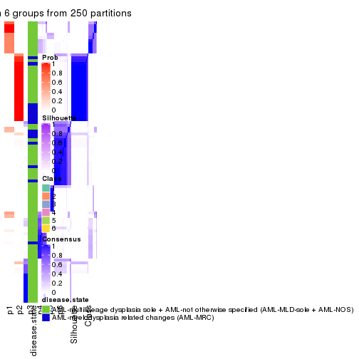</p>

</div>
</div>

Heatmaps for the membership of samples in all partitions to see how consistent they are:


<script>
$( function() {
	$( '#tabs-CV-pam-membership-heatmap' ).tabs();
} );
</script>
<div id='tabs-CV-pam-membership-heatmap'>
<ul>
<li><a href='#tab-CV-pam-membership-heatmap-1'>k = 2</a></li>
<li><a href='#tab-CV-pam-membership-heatmap-2'>k = 3</a></li>
<li><a href='#tab-CV-pam-membership-heatmap-3'>k = 4</a></li>
<li><a href='#tab-CV-pam-membership-heatmap-4'>k = 5</a></li>
<li><a href='#tab-CV-pam-membership-heatmap-5'>k = 6</a></li>
</ul>
<div id='tab-CV-pam-membership-heatmap-1'>
<pre><code class="r">membership_heatmap(res, k = 2)
</code></pre>

<p></p>

</div>
<div id='tab-CV-pam-membership-heatmap-2'>
<pre><code class="r">membership_heatmap(res, k = 3)
</code></pre>

<p></p>

</div>
<div id='tab-CV-pam-membership-heatmap-3'>
<pre><code class="r">membership_heatmap(res, k = 4)
</code></pre>

<p></p>

</div>
<div id='tab-CV-pam-membership-heatmap-4'>
<pre><code class="r">membership_heatmap(res, k = 5)
</code></pre>

<p></p>

</div>
<div id='tab-CV-pam-membership-heatmap-5'>
<pre><code class="r">membership_heatmap(res, k = 6)
</code></pre>

<p></p>

</div>
</div>

As soon as we have had the classes for columns, we can look for signatures
which are significantly different between classes which can be candidate marks
for certain classes. Following are the heatmaps for signatures.


Signature heatmaps where rows are scaled:


<script>
$( function() {
	$( '#tabs-CV-pam-get-signatures' ).tabs();
} );
</script>
<div id='tabs-CV-pam-get-signatures'>
<ul>
<li><a href='#tab-CV-pam-get-signatures-1'>k = 2</a></li>
<li><a href='#tab-CV-pam-get-signatures-2'>k = 3</a></li>
<li><a href='#tab-CV-pam-get-signatures-3'>k = 4</a></li>
<li><a href='#tab-CV-pam-get-signatures-4'>k = 5</a></li>
<li><a href='#tab-CV-pam-get-signatures-5'>k = 6</a></li>
</ul>
<div id='tab-CV-pam-get-signatures-1'>
<pre><code class="r">get_signatures(res, k = 2)
</code></pre>

<pre><code>#&gt; Error: The width or height of the raster image is zero, maybe you forget to turn off the
#&gt; previous graphic device or it was corrupted. Run `dev.off()` to close it.
</code></pre>

<p></p>

</div>
<div id='tab-CV-pam-get-signatures-2'>
<pre><code class="r">get_signatures(res, k = 3)
</code></pre>

<pre><code>#&gt; Error: The width or height of the raster image is zero, maybe you forget to turn off the
#&gt; previous graphic device or it was corrupted. Run `dev.off()` to close it.
</code></pre>

<p></p>

</div>
<div id='tab-CV-pam-get-signatures-3'>
<pre><code class="r">get_signatures(res, k = 4)
</code></pre>

<pre><code>#&gt; Error: The width or height of the raster image is zero, maybe you forget to turn off the
#&gt; previous graphic device or it was corrupted. Run `dev.off()` to close it.
</code></pre>

<p></p>

</div>
<div id='tab-CV-pam-get-signatures-4'>
<pre><code class="r">get_signatures(res, k = 5)
</code></pre>

<pre><code>#&gt; Error: The width or height of the raster image is zero, maybe you forget to turn off the
#&gt; previous graphic device or it was corrupted. Run `dev.off()` to close it.
</code></pre>

<p></p>

</div>
<div id='tab-CV-pam-get-signatures-5'>
<pre><code class="r">get_signatures(res, k = 6)
</code></pre>

<pre><code>#&gt; Error: The width or height of the raster image is zero, maybe you forget to turn off the
#&gt; previous graphic device or it was corrupted. Run `dev.off()` to close it.
</code></pre>

<p></p>

</div>
</div>


Signature heatmaps where rows are not scaled:


<script>
$( function() {
	$( '#tabs-CV-pam-get-signatures-no-scale' ).tabs();
} );
</script>
<div id='tabs-CV-pam-get-signatures-no-scale'>
<ul>
<li><a href='#tab-CV-pam-get-signatures-no-scale-1'>k = 2</a></li>
<li><a href='#tab-CV-pam-get-signatures-no-scale-2'>k = 3</a></li>
<li><a href='#tab-CV-pam-get-signatures-no-scale-3'>k = 4</a></li>
<li><a href='#tab-CV-pam-get-signatures-no-scale-4'>k = 5</a></li>
<li><a href='#tab-CV-pam-get-signatures-no-scale-5'>k = 6</a></li>
</ul>
<div id='tab-CV-pam-get-signatures-no-scale-1'>
<pre><code class="r">get_signatures(res, k = 2, scale_rows = FALSE)
</code></pre>

<pre><code>#&gt; Error: The width or height of the raster image is zero, maybe you forget to turn off the
#&gt; previous graphic device or it was corrupted. Run `dev.off()` to close it.
</code></pre>

<p></p>

</div>
<div id='tab-CV-pam-get-signatures-no-scale-2'>
<pre><code class="r">get_signatures(res, k = 3, scale_rows = FALSE)
</code></pre>

<pre><code>#&gt; Error: The width or height of the raster image is zero, maybe you forget to turn off the
#&gt; previous graphic device or it was corrupted. Run `dev.off()` to close it.
</code></pre>

<p></p>

</div>
<div id='tab-CV-pam-get-signatures-no-scale-3'>
<pre><code class="r">get_signatures(res, k = 4, scale_rows = FALSE)
</code></pre>

<pre><code>#&gt; Error: The width or height of the raster image is zero, maybe you forget to turn off the
#&gt; previous graphic device or it was corrupted. Run `dev.off()` to close it.
</code></pre>

<p></p>

</div>
<div id='tab-CV-pam-get-signatures-no-scale-4'>
<pre><code class="r">get_signatures(res, k = 5, scale_rows = FALSE)
</code></pre>

<pre><code>#&gt; Error: The width or height of the raster image is zero, maybe you forget to turn off the
#&gt; previous graphic device or it was corrupted. Run `dev.off()` to close it.
</code></pre>

<p></p>

</div>
<div id='tab-CV-pam-get-signatures-no-scale-5'>
<pre><code class="r">get_signatures(res, k = 6, scale_rows = FALSE)
</code></pre>

<pre><code>#&gt; Error: The width or height of the raster image is zero, maybe you forget to turn off the
#&gt; previous graphic device or it was corrupted. Run `dev.off()` to close it.
</code></pre>

<p></p>

</div>
</div>


Compare the overlap of signatures from different k:

```r
compare_signatures(res)
```


`get_signature()` returns a data frame invisibly. TO get the list of signatures, the function
call should be assigned to a variable explicitly. In following code, if `plot` argument is set
to `FALSE`, no heatmap is plotted while only the differential analysis is performed.

```r
# code only for demonstration
tb = get_signature(res, k = ..., plot = FALSE)
```

An example of the output of `tb` is:

```
#>   which_row         fdr    mean_1    mean_2 scaled_mean_1 scaled_mean_2 km
#> 1        38 0.042760348  8.373488  9.131774    -0.5533452     0.5164555  1
#> 2        40 0.018707592  7.106213  8.469186    -0.6173731     0.5762149  1
#> 3        55 0.019134737 10.221463 11.207825    -0.6159697     0.5749050  1
#> 4        59 0.006059896  5.921854  7.869574    -0.6899429     0.6439467  1
#> 5        60 0.018055526  8.928898 10.211722    -0.6204761     0.5791110  1
#> 6        98 0.009384629 15.714769 14.887706     0.6635654    -0.6193277  2
...
```

The columns in `tb` are:

1. `which_row`: row indices corresponding to the input matrix.
2. `fdr`: FDR for the differential test. 
3. `mean_x`: The mean value in group x.
4. `scaled_mean_x`: The mean value in group x after rows are scaled.
5. `km`: Row groups if k-means clustering is applied to rows.


UMAP plot which shows how samples are separated.


<script>
$( function() {
	$( '#tabs-CV-pam-dimension-reduction' ).tabs();
} );
</script>
<div id='tabs-CV-pam-dimension-reduction'>
<ul>
<li><a href='#tab-CV-pam-dimension-reduction-1'>k = 2</a></li>
<li><a href='#tab-CV-pam-dimension-reduction-2'>k = 3</a></li>
<li><a href='#tab-CV-pam-dimension-reduction-3'>k = 4</a></li>
<li><a href='#tab-CV-pam-dimension-reduction-4'>k = 5</a></li>
<li><a href='#tab-CV-pam-dimension-reduction-5'>k = 6</a></li>
</ul>
<div id='tab-CV-pam-dimension-reduction-1'>
<pre><code class="r">dimension_reduction(res, k = 2, method = &quot;UMAP&quot;)
</code></pre>

<p></p>

</div>
<div id='tab-CV-pam-dimension-reduction-2'>
<pre><code class="r">dimension_reduction(res, k = 3, method = &quot;UMAP&quot;)
</code></pre>

<p></p>

</div>
<div id='tab-CV-pam-dimension-reduction-3'>
<pre><code class="r">dimension_reduction(res, k = 4, method = &quot;UMAP&quot;)
</code></pre>

<p></p>

</div>
<div id='tab-CV-pam-dimension-reduction-4'>
<pre><code class="r">dimension_reduction(res, k = 5, method = &quot;UMAP&quot;)
</code></pre>

<p></p>

</div>
<div id='tab-CV-pam-dimension-reduction-5'>
<pre><code class="r">dimension_reduction(res, k = 6, method = &quot;UMAP&quot;)
</code></pre>

<p></p>

</div>
</div>


Following heatmap shows how subgroups are split when increasing `k`:

```r
collect_classes(res)
```


Test correlation between subgroups and known annotations. If the known
annotation is numeric, one-way ANOVA test is applied, and if the known
annotation is discrete, chi-squared contingency table test is applied.

```r
test_to_known_factors(res)
```

```
#>         n disease.state(p) k
#> CV:pam 79          0.00627 2
#> CV:pam 93          0.01307 3
#> CV:pam 58          0.00437 4
#> CV:pam 91          0.00315 5
#> CV:pam 88          0.00986 6
```


If matrix rows can be associated to genes, consider to use `functional_enrichment(res,
...)` to perform function enrichment for the signature genes. See [this vignette](http://bioconductor.org/packages/devel/bioc/vignettes/cola/inst/doc/functional_enrichment.html) for more detailed explanations.


 

---------------------------------------------------


### CV:mclust


The object with results only for a single top-value method and a single partition method 
can be extracted as:

```r
res = res_list["CV", "mclust"]
# you can also extract it by
# res = res_list["CV:mclust"]
```

A summary of `res` and all the functions that can be applied to it:

```r
res
```

```
#> A 'ConsensusPartition' object with k = 2, 3, 4, 5, 6.
#>   On a matrix with 51941 rows and 96 columns.
#>   Top rows (1000, 2000, 3000, 4000, 5000) are extracted by 'CV' method.
#>   Subgroups are detected by 'mclust' method.
#>   Performed in total 1250 partitions by row resampling.
#>   Best k for subgroups seems to be 4.
#> 
#> Following methods can be applied to this 'ConsensusPartition' object:
#>  [1] "cola_report"             "collect_classes"         "collect_plots"          
#>  [4] "collect_stats"           "colnames"                "compare_signatures"     
#>  [7] "consensus_heatmap"       "dimension_reduction"     "functional_enrichment"  
#> [10] "get_anno_col"            "get_anno"                "get_classes"            
#> [13] "get_consensus"           "get_matrix"              "get_membership"         
#> [16] "get_param"               "get_signatures"          "get_stats"              
#> [19] "is_best_k"               "is_stable_k"             "membership_heatmap"     
#> [22] "ncol"                    "nrow"                    "plot_ecdf"              
#> [25] "rownames"                "select_partition_number" "show"                   
#> [28] "suggest_best_k"          "test_to_known_factors"
```

`collect_plots()` function collects all the plots made from `res` for all `k` (number of partitions)
into one single page to provide an easy and fast comparison between different `k`.

```r
collect_plots(res)
```


The plots are:

- The first row: a plot of the ECDF (empirical cumulative distribution
  function) curves of the consensus matrix for each `k` and the heatmap of
  predicted classes for each `k`.
- The second row: heatmaps of the consensus matrix for each `k`.
- The third row: heatmaps of the membership matrix for each `k`.
- The fouth row: heatmaps of the signatures for each `k`.

All the plots in panels can be made by individual functions and they are
plotted later in this section.

`select_partition_number()` produces several plots showing different
statistics for choosing "optimized" `k`. There are following statistics:

- ECDF curves of the consensus matrix for each `k`;
- 1-PAC. [The PAC
  score](https://en.wikipedia.org/wiki/Consensus_clustering#Over-interpretation_potential_of_consensus_clustering)
  measures the proportion of the ambiguous subgrouping.
- Mean silhouette score.
- Concordance. The mean probability of fiting the consensus class ids in all
  partitions.
- Area increased. Denote $A_k$ as the area under the ECDF curve for current
  `k`, the area increased is defined as $A_k - A_{k-1}$.
- Rand index. The percent of pairs of samples that are both in a same cluster
  or both are not in a same cluster in the partition of k and k-1.
- Jaccard index. The ratio of pairs of samples are both in a same cluster in
  the partition of k and k-1 and the pairs of samples are both in a same
  cluster in the partition k or k-1.

The detailed explanations of these statistics can be found in [the _cola_
vignette](http://bioconductor.org/packages/devel/bioc/vignettes/cola/inst/doc/cola.html#toc_13).

Generally speaking, lower PAC score, higher mean silhouette score or higher
concordance corresponds to better partition. Rand index and Jaccard index
measure how similar the current partition is compared to partition with `k-1`.
If they are too similar, we won't accept `k` is better than `k-1`.

```r
select_partition_number(res)
```


The numeric values for all these statistics can be obtained by `get_stats()`.

```r
get_stats(res)
```

```
#>   k 1-PAC mean_silhouette concordance area_increased  Rand Jaccard
#> 2 2 0.893           0.915       0.955         0.3350 0.692   0.692
#> 3 3 0.606           0.846       0.890         0.7263 0.668   0.537
#> 4 4 0.855           0.852       0.924         0.2885 0.772   0.487
#> 5 5 0.702           0.768       0.864         0.0490 0.923   0.713
#> 6 6 0.780           0.613       0.764         0.0414 0.930   0.692
```

`suggest_best_k()` suggests the best $k$ based on these statistics. The rules are as follows:

- All $k$ with Jaccard index larger than 0.95 are removed because increasing
  $k$ does not provide enough extra information. If all $k$ are removed, it is
  marked as no subgroup is detected.
- For all $k$ with 1-PAC score larger than 0.9, the maximal $k$ is taken as
  the best $k$, and other $k$ are marked as optional $k$.
- If it does not fit the second rule. The $k$ with the maximal vote of the
  highest 1-PAC score, highest mean silhouette, and highest concordance is
  taken as the best $k$.

```r
suggest_best_k(res)
```

```
#> [1] 4
```


Following shows the table of the partitions (You need to click the **show/hide
code output** link to see it). The membership matrix (columns with name `p*`)
is inferred by
[`clue::cl_consensus()`](https://www.rdocumentation.org/link/cl_consensus?package=clue)
function with the `SE` method. Basically the value in the membership matrix
represents the probability to belong to a certain group. The finall class
label for an item is determined with the group with highest probability it
belongs to.

In `get_classes()` function, the entropy is calculated from the membership
matrix and the silhouette score is calculated from the consensus matrix.


<script>
$( function() {
	$( '#tabs-CV-mclust-get-classes' ).tabs();
} );
</script>
<div id='tabs-CV-mclust-get-classes'>
<ul>
<li><a href='#tab-CV-mclust-get-classes-1'>k = 2</a></li>
<li><a href='#tab-CV-mclust-get-classes-2'>k = 3</a></li>
<li><a href='#tab-CV-mclust-get-classes-3'>k = 4</a></li>
<li><a href='#tab-CV-mclust-get-classes-4'>k = 5</a></li>
<li><a href='#tab-CV-mclust-get-classes-5'>k = 6</a></li>
</ul>

<div id='tab-CV-mclust-get-classes-1'>
<p><a id='tab-CV-mclust-get-classes-1-a' style='color:#0366d6' href='#'>show/hide code output</a></p>
<pre><code class="r">cbind(get_classes(res, k = 2), get_membership(res, k = 2))
</code></pre>

<pre><code>#&gt;           class entropy silhouette    p1    p2
#&gt; GSM531600     1  0.2043      0.948 0.968 0.032
#&gt; GSM531601     1  0.9661      0.356 0.608 0.392
#&gt; GSM531605     1  0.0000      0.956 1.000 0.000
#&gt; GSM531615     2  0.1633      0.969 0.024 0.976
#&gt; GSM531617     2  0.6887      0.810 0.184 0.816
#&gt; GSM531624     2  0.1633      0.969 0.024 0.976
#&gt; GSM531627     2  0.1633      0.969 0.024 0.976
#&gt; GSM531629     1  0.6973      0.766 0.812 0.188
#&gt; GSM531631     2  0.1633      0.969 0.024 0.976
#&gt; GSM531634     2  0.1633      0.969 0.024 0.976
#&gt; GSM531636     1  0.2603      0.945 0.956 0.044
#&gt; GSM531637     2  0.1633      0.969 0.024 0.976
#&gt; GSM531654     1  0.0672      0.955 0.992 0.008
#&gt; GSM531655     1  0.0672      0.955 0.992 0.008
#&gt; GSM531658     1  0.0672      0.955 0.992 0.008
#&gt; GSM531660     1  0.0000      0.956 1.000 0.000
#&gt; GSM531602     1  0.0000      0.956 1.000 0.000
#&gt; GSM531603     1  0.0000      0.956 1.000 0.000
#&gt; GSM531604     1  0.0000      0.956 1.000 0.000
#&gt; GSM531606     1  0.0000      0.956 1.000 0.000
#&gt; GSM531607     1  0.0000      0.956 1.000 0.000
#&gt; GSM531608     2  0.2603      0.956 0.044 0.956
#&gt; GSM531609     1  0.0672      0.955 0.992 0.008
#&gt; GSM531610     1  0.0672      0.955 0.992 0.008
#&gt; GSM531611     1  0.0000      0.956 1.000 0.000
#&gt; GSM531612     1  0.0672      0.955 0.992 0.008
#&gt; GSM531613     1  0.0000      0.956 1.000 0.000
#&gt; GSM531614     1  0.0672      0.955 0.992 0.008
#&gt; GSM531616     1  0.7139      0.752 0.804 0.196
#&gt; GSM531618     1  0.0938      0.954 0.988 0.012
#&gt; GSM531619     2  0.1633      0.969 0.024 0.976
#&gt; GSM531620     2  0.6148      0.850 0.152 0.848
#&gt; GSM531621     2  0.1633      0.969 0.024 0.976
#&gt; GSM531622     2  0.1633      0.969 0.024 0.976
#&gt; GSM531623     2  0.1633      0.969 0.024 0.976
#&gt; GSM531625     1  0.9833      0.256 0.576 0.424
#&gt; GSM531626     1  0.9896      0.202 0.560 0.440
#&gt; GSM531628     1  0.2778      0.943 0.952 0.048
#&gt; GSM531630     2  0.1633      0.969 0.024 0.976
#&gt; GSM531632     1  0.2778      0.943 0.952 0.048
#&gt; GSM531633     2  0.1633      0.969 0.024 0.976
#&gt; GSM531635     1  0.2778      0.943 0.952 0.048
#&gt; GSM531638     1  0.9815      0.268 0.580 0.420
#&gt; GSM531639     1  0.1184      0.953 0.984 0.016
#&gt; GSM531640     2  0.1633      0.969 0.024 0.976
#&gt; GSM531641     1  0.0672      0.955 0.992 0.008
#&gt; GSM531642     1  0.1633      0.948 0.976 0.024
#&gt; GSM531643     1  0.2423      0.946 0.960 0.040
#&gt; GSM531644     1  0.2236      0.949 0.964 0.036
#&gt; GSM531645     1  0.0672      0.955 0.992 0.008
#&gt; GSM531646     1  0.2778      0.943 0.952 0.048
#&gt; GSM531647     1  0.2778      0.943 0.952 0.048
#&gt; GSM531648     1  0.0672      0.955 0.992 0.008
#&gt; GSM531649     1  0.2948      0.941 0.948 0.052
#&gt; GSM531650     1  0.2778      0.943 0.952 0.048
#&gt; GSM531651     2  0.1633      0.969 0.024 0.976
#&gt; GSM531652     1  0.0938      0.954 0.988 0.012
#&gt; GSM531653     1  0.2778      0.943 0.952 0.048
#&gt; GSM531656     1  0.2603      0.946 0.956 0.044
#&gt; GSM531657     1  0.0000      0.956 1.000 0.000
#&gt; GSM531659     1  0.0000      0.956 1.000 0.000
#&gt; GSM531661     1  0.8386      0.621 0.732 0.268
#&gt; GSM531662     1  0.0672      0.955 0.992 0.008
#&gt; GSM531663     1  0.0000      0.956 1.000 0.000
#&gt; GSM531664     1  0.2043      0.948 0.968 0.032
#&gt; GSM531665     1  0.0376      0.956 0.996 0.004
#&gt; GSM531666     1  0.1414      0.952 0.980 0.020
#&gt; GSM531667     2  0.7139      0.793 0.196 0.804
#&gt; GSM531668     1  0.0000      0.956 1.000 0.000
#&gt; GSM531669     1  0.1843      0.948 0.972 0.028
#&gt; GSM531670     1  0.1843      0.950 0.972 0.028
#&gt; GSM531671     1  0.0376      0.956 0.996 0.004
#&gt; GSM531672     1  0.0000      0.956 1.000 0.000
#&gt; GSM531673     1  0.0376      0.956 0.996 0.004
#&gt; GSM531674     1  0.1843      0.948 0.972 0.028
#&gt; GSM531675     1  0.0000      0.956 1.000 0.000
#&gt; GSM531676     1  0.1414      0.952 0.980 0.020
#&gt; GSM531677     1  0.0000      0.956 1.000 0.000
#&gt; GSM531678     1  0.0000      0.956 1.000 0.000
#&gt; GSM531679     1  0.0000      0.956 1.000 0.000
#&gt; GSM531680     1  0.1843      0.948 0.972 0.028
#&gt; GSM531681     1  0.0000      0.956 1.000 0.000
#&gt; GSM531682     1  0.0000      0.956 1.000 0.000
#&gt; GSM531683     1  0.0000      0.956 1.000 0.000
#&gt; GSM531684     1  0.0000      0.956 1.000 0.000
#&gt; GSM531685     1  0.1633      0.950 0.976 0.024
#&gt; GSM531686     1  0.0000      0.956 1.000 0.000
#&gt; GSM531687     1  0.1184      0.953 0.984 0.016
#&gt; GSM531688     1  0.1843      0.948 0.972 0.028
#&gt; GSM531689     1  0.0000      0.956 1.000 0.000
#&gt; GSM531690     1  0.0000      0.956 1.000 0.000
#&gt; GSM531691     1  0.0000      0.956 1.000 0.000
#&gt; GSM531692     1  0.0376      0.956 0.996 0.004
#&gt; GSM531693     1  0.1843      0.948 0.972 0.028
#&gt; GSM531694     1  0.0000      0.956 1.000 0.000
#&gt; GSM531695     1  0.1843      0.948 0.972 0.028
</code></pre>

<script>
$('#tab-CV-mclust-get-classes-1-a').parent().next().next().hide();
$('#tab-CV-mclust-get-classes-1-a').click(function(){
  $('#tab-CV-mclust-get-classes-1-a').parent().next().next().toggle();
  return(false);
});
</script>
</div>

<div id='tab-CV-mclust-get-classes-2'>
<p><a id='tab-CV-mclust-get-classes-2-a' style='color:#0366d6' href='#'>show/hide code output</a></p>
<pre><code class="r">cbind(get_classes(res, k = 3), get_membership(res, k = 3))
</code></pre>

<pre><code>#&gt;           class entropy silhouette    p1    p2    p3
#&gt; GSM531600     3  0.4045     0.8826 0.104 0.024 0.872
#&gt; GSM531601     2  0.6235     0.1113 0.436 0.564 0.000
#&gt; GSM531605     1  0.2356     0.9034 0.928 0.000 0.072
#&gt; GSM531615     2  0.0000     0.8836 0.000 1.000 0.000
#&gt; GSM531617     2  0.1163     0.8668 0.028 0.972 0.000
#&gt; GSM531624     2  0.0237     0.8859 0.000 0.996 0.004
#&gt; GSM531627     2  0.0237     0.8859 0.000 0.996 0.004
#&gt; GSM531629     1  0.4369     0.8701 0.864 0.096 0.040
#&gt; GSM531631     2  0.0237     0.8859 0.000 0.996 0.004
#&gt; GSM531634     2  0.0000     0.8836 0.000 1.000 0.000
#&gt; GSM531636     3  0.5339     0.9004 0.096 0.080 0.824
#&gt; GSM531637     2  0.0237     0.8859 0.000 0.996 0.004
#&gt; GSM531654     1  0.3618     0.9041 0.884 0.012 0.104
#&gt; GSM531655     1  0.3349     0.9038 0.888 0.004 0.108
#&gt; GSM531658     1  0.4033     0.8507 0.856 0.008 0.136
#&gt; GSM531660     1  0.1950     0.9095 0.952 0.008 0.040
#&gt; GSM531602     1  0.0424     0.9132 0.992 0.000 0.008
#&gt; GSM531603     1  0.1399     0.9147 0.968 0.004 0.028
#&gt; GSM531604     1  0.2356     0.9034 0.928 0.000 0.072
#&gt; GSM531606     1  0.1289     0.9127 0.968 0.000 0.032
#&gt; GSM531607     1  0.0424     0.9132 0.992 0.000 0.008
#&gt; GSM531608     2  0.1950     0.8559 0.008 0.952 0.040
#&gt; GSM531609     1  0.4345     0.8500 0.848 0.016 0.136
#&gt; GSM531610     1  0.3918     0.8644 0.868 0.012 0.120
#&gt; GSM531611     1  0.1950     0.9095 0.952 0.008 0.040
#&gt; GSM531612     1  0.4345     0.8500 0.848 0.016 0.136
#&gt; GSM531613     1  0.1950     0.9095 0.952 0.008 0.040
#&gt; GSM531614     1  0.4345     0.8500 0.848 0.016 0.136
#&gt; GSM531616     2  0.8363    -0.0224 0.084 0.504 0.412
#&gt; GSM531618     1  0.3856     0.8822 0.888 0.072 0.040
#&gt; GSM531619     2  0.0237     0.8859 0.000 0.996 0.004
#&gt; GSM531620     2  0.1031     0.8761 0.000 0.976 0.024
#&gt; GSM531621     2  0.0237     0.8859 0.000 0.996 0.004
#&gt; GSM531622     2  0.0237     0.8859 0.000 0.996 0.004
#&gt; GSM531623     2  0.0237     0.8859 0.000 0.996 0.004
#&gt; GSM531625     2  0.6463     0.6392 0.080 0.756 0.164
#&gt; GSM531626     2  0.6239     0.6591 0.072 0.768 0.160
#&gt; GSM531628     3  0.5165     0.9014 0.096 0.072 0.832
#&gt; GSM531630     2  0.0237     0.8859 0.000 0.996 0.004
#&gt; GSM531632     3  0.4982     0.9002 0.096 0.064 0.840
#&gt; GSM531633     2  0.0237     0.8859 0.000 0.996 0.004
#&gt; GSM531635     3  0.5339     0.9004 0.096 0.080 0.824
#&gt; GSM531638     2  0.6380     0.6468 0.076 0.760 0.164
#&gt; GSM531639     3  0.8018     0.3734 0.416 0.064 0.520
#&gt; GSM531640     2  0.0237     0.8859 0.000 0.996 0.004
#&gt; GSM531641     1  0.4345     0.8500 0.848 0.016 0.136
#&gt; GSM531642     1  0.5481     0.8118 0.816 0.076 0.108
#&gt; GSM531643     3  0.5331     0.9012 0.100 0.076 0.824
#&gt; GSM531644     1  0.7742     0.4293 0.632 0.080 0.288
#&gt; GSM531645     1  0.4345     0.8500 0.848 0.016 0.136
#&gt; GSM531646     3  0.5339     0.9004 0.096 0.080 0.824
#&gt; GSM531647     3  0.5339     0.9004 0.096 0.080 0.824
#&gt; GSM531648     1  0.2998     0.9006 0.916 0.016 0.068
#&gt; GSM531649     3  0.5339     0.9004 0.096 0.080 0.824
#&gt; GSM531650     3  0.5165     0.9014 0.096 0.072 0.832
#&gt; GSM531651     2  0.0237     0.8859 0.000 0.996 0.004
#&gt; GSM531652     1  0.4269     0.8681 0.872 0.076 0.052
#&gt; GSM531653     3  0.5253     0.9012 0.096 0.076 0.828
#&gt; GSM531656     3  0.5137     0.9004 0.104 0.064 0.832
#&gt; GSM531657     1  0.1950     0.9095 0.952 0.008 0.040
#&gt; GSM531659     1  0.1950     0.9095 0.952 0.008 0.040
#&gt; GSM531661     2  0.6693     0.6361 0.148 0.748 0.104
#&gt; GSM531662     1  0.3532     0.9032 0.884 0.008 0.108
#&gt; GSM531663     1  0.1950     0.9095 0.952 0.008 0.040
#&gt; GSM531664     3  0.6927     0.6688 0.296 0.040 0.664
#&gt; GSM531665     1  0.4047     0.8795 0.848 0.004 0.148
#&gt; GSM531666     1  0.3993     0.8772 0.884 0.064 0.052
#&gt; GSM531667     2  0.1950     0.8559 0.008 0.952 0.040
#&gt; GSM531668     1  0.1950     0.9095 0.952 0.008 0.040
#&gt; GSM531669     3  0.3112     0.8666 0.096 0.004 0.900
#&gt; GSM531670     3  0.3910     0.8799 0.104 0.020 0.876
#&gt; GSM531671     1  0.4733     0.8288 0.800 0.004 0.196
#&gt; GSM531672     1  0.1950     0.9095 0.952 0.008 0.040
#&gt; GSM531673     1  0.2959     0.9064 0.900 0.000 0.100
#&gt; GSM531674     3  0.3459     0.8740 0.096 0.012 0.892
#&gt; GSM531675     1  0.0424     0.9132 0.992 0.000 0.008
#&gt; GSM531676     1  0.3482     0.8699 0.872 0.000 0.128
#&gt; GSM531677     1  0.0424     0.9132 0.992 0.000 0.008
#&gt; GSM531678     1  0.0592     0.9133 0.988 0.000 0.012
#&gt; GSM531679     1  0.0747     0.9133 0.984 0.000 0.016
#&gt; GSM531680     1  0.2711     0.8977 0.912 0.000 0.088
#&gt; GSM531681     1  0.0237     0.9133 0.996 0.004 0.000
#&gt; GSM531682     1  0.1163     0.9131 0.972 0.000 0.028
#&gt; GSM531683     1  0.0424     0.9132 0.992 0.000 0.008
#&gt; GSM531684     1  0.2165     0.9057 0.936 0.000 0.064
#&gt; GSM531685     1  0.4002     0.8363 0.840 0.000 0.160
#&gt; GSM531686     1  0.0661     0.9134 0.988 0.004 0.008
#&gt; GSM531687     1  0.2448     0.9023 0.924 0.000 0.076
#&gt; GSM531688     1  0.4062     0.8327 0.836 0.000 0.164
#&gt; GSM531689     1  0.2356     0.9034 0.928 0.000 0.072
#&gt; GSM531690     1  0.0237     0.9133 0.996 0.004 0.000
#&gt; GSM531691     1  0.2356     0.9034 0.928 0.000 0.072
#&gt; GSM531692     1  0.3340     0.8769 0.880 0.000 0.120
#&gt; GSM531693     3  0.5529     0.6458 0.296 0.000 0.704
#&gt; GSM531694     1  0.0424     0.9132 0.992 0.000 0.008
#&gt; GSM531695     1  0.2711     0.8977 0.912 0.000 0.088
</code></pre>

<script>
$('#tab-CV-mclust-get-classes-2-a').parent().next().next().hide();
$('#tab-CV-mclust-get-classes-2-a').click(function(){
  $('#tab-CV-mclust-get-classes-2-a').parent().next().next().toggle();
  return(false);
});
</script>
</div>

<div id='tab-CV-mclust-get-classes-3'>
<p><a id='tab-CV-mclust-get-classes-3-a' style='color:#0366d6' href='#'>show/hide code output</a></p>
<pre><code class="r">cbind(get_classes(res, k = 4), get_membership(res, k = 4))
</code></pre>

<pre><code>#&gt;           class entropy silhouette    p1    p2    p3    p4
#&gt; GSM531600     3  0.1022    0.87810 0.000 0.000 0.968 0.032
#&gt; GSM531601     2  0.0707    0.94336 0.000 0.980 0.000 0.020
#&gt; GSM531605     1  0.0000    0.90473 1.000 0.000 0.000 0.000
#&gt; GSM531615     2  0.0000    0.95360 0.000 1.000 0.000 0.000
#&gt; GSM531617     2  0.0000    0.95360 0.000 1.000 0.000 0.000
#&gt; GSM531624     2  0.0000    0.95360 0.000 1.000 0.000 0.000
#&gt; GSM531627     2  0.0000    0.95360 0.000 1.000 0.000 0.000
#&gt; GSM531629     2  0.1118    0.93317 0.000 0.964 0.000 0.036
#&gt; GSM531631     2  0.0000    0.95360 0.000 1.000 0.000 0.000
#&gt; GSM531634     2  0.0000    0.95360 0.000 1.000 0.000 0.000
#&gt; GSM531636     3  0.2814    0.85589 0.000 0.132 0.868 0.000
#&gt; GSM531637     2  0.0000    0.95360 0.000 1.000 0.000 0.000
#&gt; GSM531654     2  0.3991    0.85994 0.044 0.860 0.064 0.032
#&gt; GSM531655     1  0.7004    0.47551 0.620 0.048 0.064 0.268
#&gt; GSM531658     4  0.0336    0.90843 0.000 0.000 0.008 0.992
#&gt; GSM531660     4  0.2921    0.86795 0.140 0.000 0.000 0.860
#&gt; GSM531602     1  0.0000    0.90473 1.000 0.000 0.000 0.000
#&gt; GSM531603     1  0.0592    0.89781 0.984 0.000 0.000 0.016
#&gt; GSM531604     1  0.0000    0.90473 1.000 0.000 0.000 0.000
#&gt; GSM531606     1  0.0000    0.90473 1.000 0.000 0.000 0.000
#&gt; GSM531607     1  0.0000    0.90473 1.000 0.000 0.000 0.000
#&gt; GSM531608     2  0.2376    0.90022 0.000 0.916 0.016 0.068
#&gt; GSM531609     4  0.0469    0.90882 0.000 0.000 0.012 0.988
#&gt; GSM531610     4  0.0469    0.90882 0.000 0.000 0.012 0.988
#&gt; GSM531611     4  0.2281    0.90080 0.096 0.000 0.000 0.904
#&gt; GSM531612     4  0.0469    0.90882 0.000 0.000 0.012 0.988
#&gt; GSM531613     4  0.2081    0.90415 0.084 0.000 0.000 0.916
#&gt; GSM531614     4  0.0469    0.90882 0.000 0.000 0.012 0.988
#&gt; GSM531616     2  0.3688    0.72061 0.000 0.792 0.208 0.000
#&gt; GSM531618     4  0.3919    0.88165 0.096 0.040 0.012 0.852
#&gt; GSM531619     2  0.0000    0.95360 0.000 1.000 0.000 0.000
#&gt; GSM531620     2  0.0000    0.95360 0.000 1.000 0.000 0.000
#&gt; GSM531621     2  0.0000    0.95360 0.000 1.000 0.000 0.000
#&gt; GSM531622     2  0.0000    0.95360 0.000 1.000 0.000 0.000
#&gt; GSM531623     2  0.0000    0.95360 0.000 1.000 0.000 0.000
#&gt; GSM531625     2  0.2149    0.88722 0.000 0.912 0.088 0.000
#&gt; GSM531626     2  0.2081    0.89095 0.000 0.916 0.084 0.000
#&gt; GSM531628     3  0.1716    0.89296 0.000 0.064 0.936 0.000
#&gt; GSM531630     2  0.0000    0.95360 0.000 1.000 0.000 0.000
#&gt; GSM531632     3  0.0000    0.88358 0.000 0.000 1.000 0.000
#&gt; GSM531633     2  0.0000    0.95360 0.000 1.000 0.000 0.000
#&gt; GSM531635     3  0.2081    0.89181 0.000 0.084 0.916 0.000
#&gt; GSM531638     2  0.2216    0.88329 0.000 0.908 0.092 0.000
#&gt; GSM531639     3  0.4361    0.69121 0.000 0.208 0.772 0.020
#&gt; GSM531640     2  0.0000    0.95360 0.000 1.000 0.000 0.000
#&gt; GSM531641     4  0.0469    0.90882 0.000 0.000 0.012 0.988
#&gt; GSM531642     3  0.2699    0.88715 0.000 0.068 0.904 0.028
#&gt; GSM531643     3  0.2081    0.89181 0.000 0.084 0.916 0.000
#&gt; GSM531644     3  0.2081    0.89181 0.000 0.084 0.916 0.000
#&gt; GSM531645     4  0.0469    0.90882 0.000 0.000 0.012 0.988
#&gt; GSM531646     3  0.2081    0.89181 0.000 0.084 0.916 0.000
#&gt; GSM531647     3  0.2081    0.89181 0.000 0.084 0.916 0.000
#&gt; GSM531648     4  0.0804    0.90988 0.008 0.000 0.012 0.980
#&gt; GSM531649     3  0.2216    0.88827 0.000 0.092 0.908 0.000
#&gt; GSM531650     3  0.1716    0.89296 0.000 0.064 0.936 0.000
#&gt; GSM531651     2  0.0000    0.95360 0.000 1.000 0.000 0.000
#&gt; GSM531652     4  0.6592    0.13286 0.000 0.084 0.392 0.524
#&gt; GSM531653     3  0.2081    0.89181 0.000 0.084 0.916 0.000
#&gt; GSM531656     3  0.0707    0.88041 0.000 0.000 0.980 0.020
#&gt; GSM531657     4  0.2281    0.90080 0.096 0.000 0.000 0.904
#&gt; GSM531659     1  0.4585    0.51627 0.668 0.000 0.000 0.332
#&gt; GSM531661     2  0.2722    0.88949 0.000 0.904 0.064 0.032
#&gt; GSM531662     2  0.4803    0.81370 0.088 0.816 0.064 0.032
#&gt; GSM531663     4  0.2281    0.90080 0.096 0.000 0.000 0.904
#&gt; GSM531664     3  0.0469    0.88274 0.000 0.000 0.988 0.012
#&gt; GSM531665     1  0.4289    0.78208 0.796 0.000 0.172 0.032
#&gt; GSM531666     3  0.5861   -0.00699 0.032 0.000 0.492 0.476
#&gt; GSM531667     2  0.2101    0.91016 0.000 0.928 0.012 0.060
#&gt; GSM531668     4  0.2345    0.89877 0.100 0.000 0.000 0.900
#&gt; GSM531669     3  0.0469    0.88274 0.000 0.000 0.988 0.012
#&gt; GSM531670     3  0.1022    0.87810 0.000 0.000 0.968 0.032
#&gt; GSM531671     3  0.6724    0.18965 0.036 0.400 0.532 0.032
#&gt; GSM531672     4  0.2281    0.90080 0.096 0.000 0.000 0.904
#&gt; GSM531673     1  0.3182    0.84353 0.892 0.012 0.064 0.032
#&gt; GSM531674     3  0.0469    0.88274 0.000 0.000 0.988 0.012
#&gt; GSM531675     1  0.0000    0.90473 1.000 0.000 0.000 0.000
#&gt; GSM531676     1  0.2281    0.85154 0.904 0.000 0.096 0.000
#&gt; GSM531677     1  0.0000    0.90473 1.000 0.000 0.000 0.000
#&gt; GSM531678     1  0.0000    0.90473 1.000 0.000 0.000 0.000
#&gt; GSM531679     1  0.0000    0.90473 1.000 0.000 0.000 0.000
#&gt; GSM531680     1  0.2081    0.86185 0.916 0.000 0.084 0.000
#&gt; GSM531681     1  0.2469    0.83603 0.892 0.000 0.000 0.108
#&gt; GSM531682     1  0.0000    0.90473 1.000 0.000 0.000 0.000
#&gt; GSM531683     1  0.0000    0.90473 1.000 0.000 0.000 0.000
#&gt; GSM531684     1  0.0000    0.90473 1.000 0.000 0.000 0.000
#&gt; GSM531685     1  0.4250    0.63979 0.724 0.000 0.276 0.000
#&gt; GSM531686     1  0.0469    0.90025 0.988 0.000 0.000 0.012
#&gt; GSM531687     1  0.1557    0.88140 0.944 0.000 0.056 0.000
#&gt; GSM531688     3  0.0592    0.87975 0.016 0.000 0.984 0.000
#&gt; GSM531689     1  0.0000    0.90473 1.000 0.000 0.000 0.000
#&gt; GSM531690     1  0.4776    0.38636 0.624 0.000 0.000 0.376
#&gt; GSM531691     1  0.0000    0.90473 1.000 0.000 0.000 0.000
#&gt; GSM531692     1  0.1792    0.86947 0.932 0.000 0.068 0.000
#&gt; GSM531693     3  0.0469    0.88274 0.000 0.000 0.988 0.012
#&gt; GSM531694     1  0.0000    0.90473 1.000 0.000 0.000 0.000
#&gt; GSM531695     1  0.4697    0.48315 0.644 0.000 0.356 0.000
</code></pre>

<script>
$('#tab-CV-mclust-get-classes-3-a').parent().next().next().hide();
$('#tab-CV-mclust-get-classes-3-a').click(function(){
  $('#tab-CV-mclust-get-classes-3-a').parent().next().next().toggle();
  return(false);
});
</script>
</div>

<div id='tab-CV-mclust-get-classes-4'>
<p><a id='tab-CV-mclust-get-classes-4-a' style='color:#0366d6' href='#'>show/hide code output</a></p>
<pre><code class="r">cbind(get_classes(res, k = 5), get_membership(res, k = 5))
</code></pre>

<pre><code>#&gt;           class entropy silhouette    p1    p2    p3    p4    p5
#&gt; GSM531600     3  0.2719      0.867 0.000 0.004 0.852 0.000 0.144
#&gt; GSM531601     2  0.2280      0.829 0.000 0.880 0.000 0.120 0.000
#&gt; GSM531605     1  0.0404      0.845 0.988 0.000 0.000 0.000 0.012
#&gt; GSM531615     2  0.0000      0.932 0.000 1.000 0.000 0.000 0.000
#&gt; GSM531617     2  0.0162      0.931 0.004 0.996 0.000 0.000 0.000
#&gt; GSM531624     2  0.0000      0.932 0.000 1.000 0.000 0.000 0.000
#&gt; GSM531627     2  0.0404      0.930 0.000 0.988 0.000 0.000 0.012
#&gt; GSM531629     2  0.1116      0.914 0.028 0.964 0.004 0.000 0.004
#&gt; GSM531631     2  0.0000      0.932 0.000 1.000 0.000 0.000 0.000
#&gt; GSM531634     2  0.0000      0.932 0.000 1.000 0.000 0.000 0.000
#&gt; GSM531636     3  0.2694      0.868 0.000 0.040 0.884 0.000 0.076
#&gt; GSM531637     2  0.0000      0.932 0.000 1.000 0.000 0.000 0.000
#&gt; GSM531654     2  0.4398      0.719 0.100 0.780 0.008 0.000 0.112
#&gt; GSM531655     4  0.7979      0.243 0.272 0.048 0.016 0.400 0.264
#&gt; GSM531658     4  0.0290      0.774 0.000 0.000 0.000 0.992 0.008
#&gt; GSM531660     4  0.5861      0.667 0.228 0.012 0.000 0.632 0.128
#&gt; GSM531602     1  0.0162      0.849 0.996 0.000 0.000 0.000 0.004
#&gt; GSM531603     1  0.2074      0.713 0.896 0.000 0.000 0.000 0.104
#&gt; GSM531604     1  0.4291     -0.129 0.536 0.000 0.000 0.000 0.464
#&gt; GSM531606     1  0.3424      0.559 0.760 0.000 0.000 0.000 0.240
#&gt; GSM531607     1  0.0000      0.850 1.000 0.000 0.000 0.000 0.000
#&gt; GSM531608     2  0.1282      0.914 0.000 0.952 0.044 0.000 0.004
#&gt; GSM531609     4  0.0000      0.772 0.000 0.000 0.000 1.000 0.000
#&gt; GSM531610     4  0.0000      0.772 0.000 0.000 0.000 1.000 0.000
#&gt; GSM531611     4  0.4410      0.775 0.112 0.000 0.000 0.764 0.124
#&gt; GSM531612     4  0.0000      0.772 0.000 0.000 0.000 1.000 0.000
#&gt; GSM531613     4  0.4317      0.775 0.112 0.000 0.000 0.772 0.116
#&gt; GSM531614     4  0.0000      0.772 0.000 0.000 0.000 1.000 0.000
#&gt; GSM531616     2  0.5110      0.631 0.000 0.680 0.224 0.000 0.096
#&gt; GSM531618     4  0.5221      0.728 0.112 0.036 0.116 0.736 0.000
#&gt; GSM531619     2  0.0000      0.932 0.000 1.000 0.000 0.000 0.000
#&gt; GSM531620     2  0.0671      0.929 0.000 0.980 0.004 0.000 0.016
#&gt; GSM531621     2  0.0404      0.930 0.000 0.988 0.000 0.000 0.012
#&gt; GSM531622     2  0.0000      0.932 0.000 1.000 0.000 0.000 0.000
#&gt; GSM531623     2  0.0000      0.932 0.000 1.000 0.000 0.000 0.000
#&gt; GSM531625     2  0.2429      0.894 0.008 0.904 0.020 0.000 0.068
#&gt; GSM531626     2  0.3090      0.864 0.000 0.856 0.040 0.000 0.104
#&gt; GSM531628     3  0.0162      0.908 0.000 0.004 0.996 0.000 0.000
#&gt; GSM531630     2  0.0000      0.932 0.000 1.000 0.000 0.000 0.000
#&gt; GSM531632     3  0.0000      0.907 0.000 0.000 1.000 0.000 0.000
#&gt; GSM531633     2  0.0404      0.930 0.000 0.988 0.000 0.000 0.012
#&gt; GSM531635     3  0.1205      0.903 0.000 0.004 0.956 0.000 0.040
#&gt; GSM531638     2  0.2470      0.882 0.000 0.884 0.012 0.000 0.104
#&gt; GSM531639     3  0.3780      0.760 0.000 0.132 0.808 0.000 0.060
#&gt; GSM531640     2  0.0000      0.932 0.000 1.000 0.000 0.000 0.000
#&gt; GSM531641     4  0.0162      0.774 0.004 0.000 0.000 0.996 0.000
#&gt; GSM531642     3  0.3412      0.799 0.048 0.008 0.848 0.096 0.000
#&gt; GSM531643     3  0.1205      0.892 0.040 0.004 0.956 0.000 0.000
#&gt; GSM531644     3  0.1282      0.888 0.044 0.004 0.952 0.000 0.000
#&gt; GSM531645     4  0.0000      0.772 0.000 0.000 0.000 1.000 0.000
#&gt; GSM531646     3  0.0162      0.908 0.000 0.004 0.996 0.000 0.000
#&gt; GSM531647     3  0.0162      0.908 0.000 0.004 0.996 0.000 0.000
#&gt; GSM531648     4  0.1121      0.778 0.044 0.000 0.000 0.956 0.000
#&gt; GSM531649     3  0.1124      0.904 0.000 0.004 0.960 0.000 0.036
#&gt; GSM531650     3  0.0162      0.908 0.000 0.004 0.996 0.000 0.000
#&gt; GSM531651     2  0.0162      0.932 0.000 0.996 0.000 0.000 0.004
#&gt; GSM531652     4  0.6011      0.440 0.052 0.036 0.356 0.556 0.000
#&gt; GSM531653     3  0.0162      0.908 0.000 0.004 0.996 0.000 0.000
#&gt; GSM531656     3  0.1282      0.901 0.000 0.004 0.952 0.000 0.044
#&gt; GSM531657     4  0.4454      0.773 0.112 0.000 0.000 0.760 0.128
#&gt; GSM531659     4  0.5102      0.726 0.176 0.000 0.000 0.696 0.128
#&gt; GSM531661     2  0.3115      0.829 0.020 0.860 0.012 0.000 0.108
#&gt; GSM531662     2  0.5923      0.457 0.120 0.616 0.012 0.000 0.252
#&gt; GSM531663     4  0.4444      0.775 0.104 0.000 0.000 0.760 0.136
#&gt; GSM531664     3  0.2127      0.863 0.000 0.000 0.892 0.000 0.108
#&gt; GSM531665     5  0.2813      0.637 0.108 0.000 0.024 0.000 0.868
#&gt; GSM531666     4  0.7452      0.351 0.100 0.000 0.352 0.440 0.108
#&gt; GSM531667     2  0.1443      0.913 0.004 0.948 0.044 0.000 0.004
#&gt; GSM531668     4  0.4733      0.770 0.116 0.008 0.000 0.752 0.124
#&gt; GSM531669     3  0.2127      0.863 0.000 0.000 0.892 0.000 0.108
#&gt; GSM531670     3  0.2953      0.864 0.000 0.012 0.844 0.000 0.144
#&gt; GSM531671     5  0.6553      0.500 0.116 0.156 0.096 0.000 0.632
#&gt; GSM531672     4  0.4454      0.773 0.112 0.000 0.000 0.760 0.128
#&gt; GSM531673     5  0.4512      0.498 0.300 0.020 0.004 0.000 0.676
#&gt; GSM531674     3  0.2127      0.863 0.000 0.000 0.892 0.000 0.108
#&gt; GSM531675     1  0.0404      0.847 0.988 0.000 0.000 0.000 0.012
#&gt; GSM531676     5  0.3579      0.676 0.240 0.000 0.004 0.000 0.756
#&gt; GSM531677     1  0.0404      0.847 0.988 0.000 0.000 0.000 0.012
#&gt; GSM531678     1  0.0000      0.850 1.000 0.000 0.000 0.000 0.000
#&gt; GSM531679     1  0.0000      0.850 1.000 0.000 0.000 0.000 0.000
#&gt; GSM531680     5  0.4549      0.384 0.464 0.000 0.008 0.000 0.528
#&gt; GSM531681     1  0.1106      0.830 0.964 0.000 0.000 0.024 0.012
#&gt; GSM531682     1  0.1908      0.772 0.908 0.000 0.000 0.000 0.092
#&gt; GSM531683     1  0.0000      0.850 1.000 0.000 0.000 0.000 0.000
#&gt; GSM531684     1  0.4030      0.312 0.648 0.000 0.000 0.000 0.352
#&gt; GSM531685     5  0.3671      0.677 0.236 0.000 0.008 0.000 0.756
#&gt; GSM531686     1  0.0566      0.845 0.984 0.000 0.000 0.004 0.012
#&gt; GSM531687     5  0.4074      0.568 0.364 0.000 0.000 0.000 0.636
#&gt; GSM531688     5  0.6536      0.308 0.196 0.000 0.396 0.000 0.408
#&gt; GSM531689     1  0.3999      0.260 0.656 0.000 0.000 0.000 0.344
#&gt; GSM531690     1  0.0912      0.837 0.972 0.000 0.000 0.016 0.012
#&gt; GSM531691     5  0.4074      0.539 0.364 0.000 0.000 0.000 0.636
#&gt; GSM531692     5  0.3579      0.676 0.240 0.000 0.004 0.000 0.756
#&gt; GSM531693     3  0.3728      0.715 0.008 0.000 0.748 0.000 0.244
#&gt; GSM531694     1  0.0162      0.849 0.996 0.000 0.000 0.000 0.004
#&gt; GSM531695     5  0.6557      0.510 0.240 0.000 0.288 0.000 0.472
</code></pre>

<script>
$('#tab-CV-mclust-get-classes-4-a').parent().next().next().hide();
$('#tab-CV-mclust-get-classes-4-a').click(function(){
  $('#tab-CV-mclust-get-classes-4-a').parent().next().next().toggle();
  return(false);
});
</script>
</div>

<div id='tab-CV-mclust-get-classes-5'>
<p><a id='tab-CV-mclust-get-classes-5-a' style='color:#0366d6' href='#'>show/hide code output</a></p>
<pre><code class="r">cbind(get_classes(res, k = 6), get_membership(res, k = 6))
</code></pre>

<pre><code>#&gt;           class entropy silhouette    p1    p2    p3    p4    p5    p6
#&gt; GSM531600     3  0.0964    0.72956 0.000 0.004 0.968 0.016 0.012 0.000
#&gt; GSM531601     2  0.1605    0.88380 0.012 0.940 0.000 0.032 0.016 0.000
#&gt; GSM531605     6  0.3860   -0.76152 0.472 0.000 0.000 0.000 0.000 0.528
#&gt; GSM531615     2  0.0260    0.91411 0.008 0.992 0.000 0.000 0.000 0.000
#&gt; GSM531617     2  0.0260    0.91411 0.008 0.992 0.000 0.000 0.000 0.000
#&gt; GSM531624     2  0.0000    0.91502 0.000 1.000 0.000 0.000 0.000 0.000
#&gt; GSM531627     2  0.0260    0.91276 0.000 0.992 0.008 0.000 0.000 0.000
#&gt; GSM531629     2  0.1540    0.89816 0.012 0.948 0.012 0.000 0.016 0.012
#&gt; GSM531631     2  0.0000    0.91502 0.000 1.000 0.000 0.000 0.000 0.000
#&gt; GSM531634     2  0.0260    0.91411 0.008 0.992 0.000 0.000 0.000 0.000
#&gt; GSM531636     3  0.0820    0.72872 0.000 0.012 0.972 0.000 0.016 0.000
#&gt; GSM531637     2  0.0000    0.91502 0.000 1.000 0.000 0.000 0.000 0.000
#&gt; GSM531654     2  0.5963    0.35182 0.000 0.564 0.052 0.308 0.012 0.064
#&gt; GSM531655     4  0.7355    0.11068 0.036 0.052 0.076 0.504 0.048 0.284
#&gt; GSM531658     4  0.3409    0.69449 0.300 0.000 0.000 0.700 0.000 0.000
#&gt; GSM531660     4  0.5790    0.50136 0.128 0.008 0.052 0.696 0.052 0.064
#&gt; GSM531602     1  0.3868    0.76599 0.504 0.000 0.000 0.000 0.000 0.496
#&gt; GSM531603     1  0.6990   -0.08893 0.396 0.000 0.012 0.348 0.048 0.196
#&gt; GSM531604     6  0.0865    0.30347 0.036 0.000 0.000 0.000 0.000 0.964
#&gt; GSM531606     6  0.2854   -0.06528 0.208 0.000 0.000 0.000 0.000 0.792
#&gt; GSM531607     1  0.3868    0.76599 0.504 0.000 0.000 0.000 0.000 0.496
#&gt; GSM531608     2  0.0717    0.90895 0.008 0.976 0.016 0.000 0.000 0.000
#&gt; GSM531609     4  0.3499    0.68928 0.320 0.000 0.000 0.680 0.000 0.000
#&gt; GSM531610     4  0.2003    0.70637 0.116 0.000 0.000 0.884 0.000 0.000
#&gt; GSM531611     4  0.1625    0.68354 0.012 0.000 0.000 0.928 0.000 0.060
#&gt; GSM531612     4  0.3499    0.68928 0.320 0.000 0.000 0.680 0.000 0.000
#&gt; GSM531613     4  0.1616    0.68707 0.020 0.000 0.000 0.932 0.000 0.048
#&gt; GSM531614     4  0.3499    0.68928 0.320 0.000 0.000 0.680 0.000 0.000
#&gt; GSM531616     3  0.4692   -0.09571 0.000 0.444 0.512 0.000 0.044 0.000
#&gt; GSM531618     4  0.7136    0.66072 0.280 0.016 0.108 0.508 0.032 0.056
#&gt; GSM531619     2  0.0000    0.91502 0.000 1.000 0.000 0.000 0.000 0.000
#&gt; GSM531620     2  0.1663    0.86724 0.000 0.912 0.088 0.000 0.000 0.000
#&gt; GSM531621     2  0.0000    0.91502 0.000 1.000 0.000 0.000 0.000 0.000
#&gt; GSM531622     2  0.0146    0.91465 0.004 0.996 0.000 0.000 0.000 0.000
#&gt; GSM531623     2  0.0000    0.91502 0.000 1.000 0.000 0.000 0.000 0.000
#&gt; GSM531625     2  0.2877    0.78375 0.000 0.820 0.168 0.000 0.012 0.000
#&gt; GSM531626     2  0.4460    0.58528 0.000 0.644 0.304 0.000 0.052 0.000
#&gt; GSM531628     3  0.3126    0.70808 0.000 0.000 0.752 0.000 0.248 0.000
#&gt; GSM531630     2  0.0000    0.91502 0.000 1.000 0.000 0.000 0.000 0.000
#&gt; GSM531632     3  0.3126    0.70838 0.000 0.000 0.752 0.000 0.248 0.000
#&gt; GSM531633     2  0.0000    0.91502 0.000 1.000 0.000 0.000 0.000 0.000
#&gt; GSM531635     3  0.0146    0.73564 0.000 0.000 0.996 0.000 0.004 0.000
#&gt; GSM531638     2  0.4227    0.65739 0.000 0.692 0.256 0.000 0.052 0.000
#&gt; GSM531639     3  0.0363    0.73310 0.000 0.012 0.988 0.000 0.000 0.000
#&gt; GSM531640     2  0.0260    0.91411 0.008 0.992 0.000 0.000 0.000 0.000
#&gt; GSM531641     4  0.3499    0.68928 0.320 0.000 0.000 0.680 0.000 0.000
#&gt; GSM531642     3  0.2145    0.69890 0.016 0.000 0.916 0.044 0.004 0.020
#&gt; GSM531643     3  0.2664    0.73281 0.000 0.000 0.884 0.040 0.056 0.020
#&gt; GSM531644     3  0.3436    0.72540 0.000 0.000 0.828 0.048 0.104 0.020
#&gt; GSM531645     4  0.3499    0.68928 0.320 0.000 0.000 0.680 0.000 0.000
#&gt; GSM531646     3  0.3126    0.70838 0.000 0.000 0.752 0.000 0.248 0.000
#&gt; GSM531647     3  0.3126    0.70808 0.000 0.000 0.752 0.000 0.248 0.000
#&gt; GSM531648     4  0.4002    0.69155 0.320 0.000 0.000 0.660 0.000 0.020
#&gt; GSM531649     3  0.0363    0.73794 0.000 0.000 0.988 0.000 0.012 0.000
#&gt; GSM531650     3  0.3126    0.70808 0.000 0.000 0.752 0.000 0.248 0.000
#&gt; GSM531651     2  0.0000    0.91502 0.000 1.000 0.000 0.000 0.000 0.000
#&gt; GSM531652     3  0.6743   -0.17344 0.272 0.004 0.384 0.316 0.004 0.020
#&gt; GSM531653     3  0.3126    0.70808 0.000 0.000 0.752 0.000 0.248 0.000
#&gt; GSM531656     3  0.0291    0.73602 0.000 0.004 0.992 0.000 0.004 0.000
#&gt; GSM531657     4  0.3688    0.66032 0.016 0.000 0.044 0.836 0.052 0.052
#&gt; GSM531659     4  0.3946    0.63969 0.024 0.000 0.048 0.820 0.036 0.072
#&gt; GSM531661     2  0.4424    0.50356 0.000 0.656 0.004 0.308 0.012 0.020
#&gt; GSM531662     6  0.7125    0.16904 0.000 0.252 0.048 0.308 0.012 0.380
#&gt; GSM531663     4  0.3530    0.66455 0.012 0.000 0.040 0.844 0.052 0.052
#&gt; GSM531664     3  0.3636    0.65433 0.000 0.000 0.676 0.004 0.320 0.000
#&gt; GSM531665     6  0.5797    0.24839 0.000 0.000 0.088 0.308 0.044 0.560
#&gt; GSM531666     3  0.4835    0.10546 0.000 0.000 0.540 0.408 0.004 0.048
#&gt; GSM531667     2  0.1462    0.88500 0.008 0.936 0.056 0.000 0.000 0.000
#&gt; GSM531668     4  0.4042    0.65005 0.020 0.004 0.052 0.820 0.052 0.052
#&gt; GSM531669     5  0.3915   -0.27422 0.000 0.000 0.412 0.004 0.584 0.000
#&gt; GSM531670     3  0.1078    0.72801 0.000 0.008 0.964 0.016 0.012 0.000
#&gt; GSM531671     6  0.6929    0.22500 0.000 0.028 0.208 0.308 0.024 0.432
#&gt; GSM531672     4  0.2906    0.67179 0.032 0.000 0.044 0.872 0.000 0.052
#&gt; GSM531673     6  0.4904    0.30680 0.004 0.004 0.040 0.308 0.012 0.632
#&gt; GSM531674     3  0.3995    0.41064 0.000 0.000 0.516 0.004 0.480 0.000
#&gt; GSM531675     1  0.3898    0.75169 0.652 0.000 0.000 0.012 0.000 0.336
#&gt; GSM531676     5  0.5064    0.64838 0.060 0.000 0.008 0.000 0.540 0.392
#&gt; GSM531677     1  0.3907    0.77055 0.588 0.000 0.000 0.000 0.004 0.408
#&gt; GSM531678     1  0.3868    0.76599 0.504 0.000 0.000 0.000 0.000 0.496
#&gt; GSM531679     1  0.4072    0.76427 0.544 0.000 0.000 0.000 0.008 0.448
#&gt; GSM531680     5  0.5289    0.66704 0.092 0.000 0.008 0.000 0.564 0.336
#&gt; GSM531681     1  0.3969    0.74591 0.652 0.000 0.000 0.016 0.000 0.332
#&gt; GSM531682     1  0.4076    0.76142 0.540 0.000 0.000 0.000 0.008 0.452
#&gt; GSM531683     1  0.3868    0.76599 0.504 0.000 0.000 0.000 0.000 0.496
#&gt; GSM531684     6  0.2697   -0.00245 0.188 0.000 0.000 0.000 0.000 0.812
#&gt; GSM531685     5  0.4637    0.63413 0.028 0.000 0.008 0.000 0.556 0.408
#&gt; GSM531686     1  0.3883    0.74805 0.656 0.000 0.000 0.012 0.000 0.332
#&gt; GSM531687     5  0.5105    0.66595 0.080 0.000 0.004 0.000 0.564 0.352
#&gt; GSM531688     5  0.5121    0.62991 0.060 0.000 0.100 0.000 0.704 0.136
#&gt; GSM531689     6  0.3619   -0.42149 0.316 0.000 0.000 0.000 0.004 0.680
#&gt; GSM531690     1  0.3969    0.74591 0.652 0.000 0.000 0.016 0.000 0.332
#&gt; GSM531691     6  0.0363    0.33084 0.000 0.000 0.000 0.000 0.012 0.988
#&gt; GSM531692     6  0.0458    0.33321 0.000 0.000 0.000 0.000 0.016 0.984
#&gt; GSM531693     5  0.3877    0.52353 0.048 0.000 0.124 0.004 0.800 0.024
#&gt; GSM531694     1  0.3868    0.76599 0.504 0.000 0.000 0.000 0.000 0.496
#&gt; GSM531695     5  0.5681    0.68172 0.060 0.000 0.056 0.000 0.564 0.320
</code></pre>

<script>
$('#tab-CV-mclust-get-classes-5-a').parent().next().next().hide();
$('#tab-CV-mclust-get-classes-5-a').click(function(){
  $('#tab-CV-mclust-get-classes-5-a').parent().next().next().toggle();
  return(false);
});
</script>
</div>
</div>

Heatmaps for the consensus matrix. It visualizes the probability of two
samples to be in a same group.


<script>
$( function() {
	$( '#tabs-CV-mclust-consensus-heatmap' ).tabs();
} );
</script>
<div id='tabs-CV-mclust-consensus-heatmap'>
<ul>
<li><a href='#tab-CV-mclust-consensus-heatmap-1'>k = 2</a></li>
<li><a href='#tab-CV-mclust-consensus-heatmap-2'>k = 3</a></li>
<li><a href='#tab-CV-mclust-consensus-heatmap-3'>k = 4</a></li>
<li><a href='#tab-CV-mclust-consensus-heatmap-4'>k = 5</a></li>
<li><a href='#tab-CV-mclust-consensus-heatmap-5'>k = 6</a></li>
</ul>
<div id='tab-CV-mclust-consensus-heatmap-1'>
<pre><code class="r">consensus_heatmap(res, k = 2)
</code></pre>

<p></p>

</div>
<div id='tab-CV-mclust-consensus-heatmap-2'>
<pre><code class="r">consensus_heatmap(res, k = 3)
</code></pre>

<p>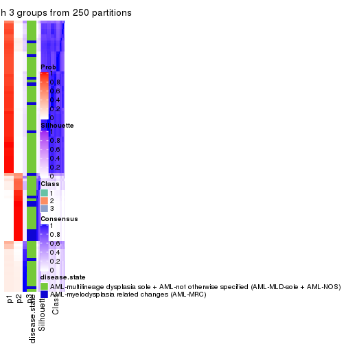</p>

</div>
<div id='tab-CV-mclust-consensus-heatmap-3'>
<pre><code class="r">consensus_heatmap(res, k = 4)
</code></pre>

<p></p>

</div>
<div id='tab-CV-mclust-consensus-heatmap-4'>
<pre><code class="r">consensus_heatmap(res, k = 5)
</code></pre>

<p></p>

</div>
<div id='tab-CV-mclust-consensus-heatmap-5'>
<pre><code class="r">consensus_heatmap(res, k = 6)
</code></pre>

<p></p>

</div>
</div>

Heatmaps for the membership of samples in all partitions to see how consistent they are:


<script>
$( function() {
	$( '#tabs-CV-mclust-membership-heatmap' ).tabs();
} );
</script>
<div id='tabs-CV-mclust-membership-heatmap'>
<ul>
<li><a href='#tab-CV-mclust-membership-heatmap-1'>k = 2</a></li>
<li><a href='#tab-CV-mclust-membership-heatmap-2'>k = 3</a></li>
<li><a href='#tab-CV-mclust-membership-heatmap-3'>k = 4</a></li>
<li><a href='#tab-CV-mclust-membership-heatmap-4'>k = 5</a></li>
<li><a href='#tab-CV-mclust-membership-heatmap-5'>k = 6</a></li>
</ul>
<div id='tab-CV-mclust-membership-heatmap-1'>
<pre><code class="r">membership_heatmap(res, k = 2)
</code></pre>

<p></p>

</div>
<div id='tab-CV-mclust-membership-heatmap-2'>
<pre><code class="r">membership_heatmap(res, k = 3)
</code></pre>

<p></p>

</div>
<div id='tab-CV-mclust-membership-heatmap-3'>
<pre><code class="r">membership_heatmap(res, k = 4)
</code></pre>

<p></p>

</div>
<div id='tab-CV-mclust-membership-heatmap-4'>
<pre><code class="r">membership_heatmap(res, k = 5)
</code></pre>

<p></p>

</div>
<div id='tab-CV-mclust-membership-heatmap-5'>
<pre><code class="r">membership_heatmap(res, k = 6)
</code></pre>

<p></p>

</div>
</div>

As soon as we have had the classes for columns, we can look for signatures
which are significantly different between classes which can be candidate marks
for certain classes. Following are the heatmaps for signatures.


Signature heatmaps where rows are scaled:


<script>
$( function() {
	$( '#tabs-CV-mclust-get-signatures' ).tabs();
} );
</script>
<div id='tabs-CV-mclust-get-signatures'>
<ul>
<li><a href='#tab-CV-mclust-get-signatures-1'>k = 2</a></li>
<li><a href='#tab-CV-mclust-get-signatures-2'>k = 3</a></li>
<li><a href='#tab-CV-mclust-get-signatures-3'>k = 4</a></li>
<li><a href='#tab-CV-mclust-get-signatures-4'>k = 5</a></li>
<li><a href='#tab-CV-mclust-get-signatures-5'>k = 6</a></li>
</ul>
<div id='tab-CV-mclust-get-signatures-1'>
<pre><code class="r">get_signatures(res, k = 2)
</code></pre>

<pre><code>#&gt; Error: The width or height of the raster image is zero, maybe you forget to turn off the
#&gt; previous graphic device or it was corrupted. Run `dev.off()` to close it.
</code></pre>

<p></p>

</div>
<div id='tab-CV-mclust-get-signatures-2'>
<pre><code class="r">get_signatures(res, k = 3)
</code></pre>

<pre><code>#&gt; Error: The width or height of the raster image is zero, maybe you forget to turn off the
#&gt; previous graphic device or it was corrupted. Run `dev.off()` to close it.
</code></pre>

<p></p>

</div>
<div id='tab-CV-mclust-get-signatures-3'>
<pre><code class="r">get_signatures(res, k = 4)
</code></pre>

<pre><code>#&gt; Error: The width or height of the raster image is zero, maybe you forget to turn off the
#&gt; previous graphic device or it was corrupted. Run `dev.off()` to close it.
</code></pre>

<p></p>

</div>
<div id='tab-CV-mclust-get-signatures-4'>
<pre><code class="r">get_signatures(res, k = 5)
</code></pre>

<pre><code>#&gt; Error: The width or height of the raster image is zero, maybe you forget to turn off the
#&gt; previous graphic device or it was corrupted. Run `dev.off()` to close it.
</code></pre>

<p></p>

</div>
<div id='tab-CV-mclust-get-signatures-5'>
<pre><code class="r">get_signatures(res, k = 6)
</code></pre>

<pre><code>#&gt; Error: The width or height of the raster image is zero, maybe you forget to turn off the
#&gt; previous graphic device or it was corrupted. Run `dev.off()` to close it.
</code></pre>

<p></p>

</div>
</div>


Signature heatmaps where rows are not scaled:


<script>
$( function() {
	$( '#tabs-CV-mclust-get-signatures-no-scale' ).tabs();
} );
</script>
<div id='tabs-CV-mclust-get-signatures-no-scale'>
<ul>
<li><a href='#tab-CV-mclust-get-signatures-no-scale-1'>k = 2</a></li>
<li><a href='#tab-CV-mclust-get-signatures-no-scale-2'>k = 3</a></li>
<li><a href='#tab-CV-mclust-get-signatures-no-scale-3'>k = 4</a></li>
<li><a href='#tab-CV-mclust-get-signatures-no-scale-4'>k = 5</a></li>
<li><a href='#tab-CV-mclust-get-signatures-no-scale-5'>k = 6</a></li>
</ul>
<div id='tab-CV-mclust-get-signatures-no-scale-1'>
<pre><code class="r">get_signatures(res, k = 2, scale_rows = FALSE)
</code></pre>

<pre><code>#&gt; Error: The width or height of the raster image is zero, maybe you forget to turn off the
#&gt; previous graphic device or it was corrupted. Run `dev.off()` to close it.
</code></pre>

<p></p>

</div>
<div id='tab-CV-mclust-get-signatures-no-scale-2'>
<pre><code class="r">get_signatures(res, k = 3, scale_rows = FALSE)
</code></pre>

<pre><code>#&gt; Error: The width or height of the raster image is zero, maybe you forget to turn off the
#&gt; previous graphic device or it was corrupted. Run `dev.off()` to close it.
</code></pre>

<p></p>

</div>
<div id='tab-CV-mclust-get-signatures-no-scale-3'>
<pre><code class="r">get_signatures(res, k = 4, scale_rows = FALSE)
</code></pre>

<pre><code>#&gt; Error: The width or height of the raster image is zero, maybe you forget to turn off the
#&gt; previous graphic device or it was corrupted. Run `dev.off()` to close it.
</code></pre>

<p></p>

</div>
<div id='tab-CV-mclust-get-signatures-no-scale-4'>
<pre><code class="r">get_signatures(res, k = 5, scale_rows = FALSE)
</code></pre>

<pre><code>#&gt; Error: The width or height of the raster image is zero, maybe you forget to turn off the
#&gt; previous graphic device or it was corrupted. Run `dev.off()` to close it.
</code></pre>

<p></p>

</div>
<div id='tab-CV-mclust-get-signatures-no-scale-5'>
<pre><code class="r">get_signatures(res, k = 6, scale_rows = FALSE)
</code></pre>

<pre><code>#&gt; Error: The width or height of the raster image is zero, maybe you forget to turn off the
#&gt; previous graphic device or it was corrupted. Run `dev.off()` to close it.
</code></pre>

<p></p>

</div>
</div>


Compare the overlap of signatures from different k:

```r
compare_signatures(res)
```


`get_signature()` returns a data frame invisibly. TO get the list of signatures, the function
call should be assigned to a variable explicitly. In following code, if `plot` argument is set
to `FALSE`, no heatmap is plotted while only the differential analysis is performed.

```r
# code only for demonstration
tb = get_signature(res, k = ..., plot = FALSE)
```

An example of the output of `tb` is:

```
#>   which_row         fdr    mean_1    mean_2 scaled_mean_1 scaled_mean_2 km
#> 1        38 0.042760348  8.373488  9.131774    -0.5533452     0.5164555  1
#> 2        40 0.018707592  7.106213  8.469186    -0.6173731     0.5762149  1
#> 3        55 0.019134737 10.221463 11.207825    -0.6159697     0.5749050  1
#> 4        59 0.006059896  5.921854  7.869574    -0.6899429     0.6439467  1
#> 5        60 0.018055526  8.928898 10.211722    -0.6204761     0.5791110  1
#> 6        98 0.009384629 15.714769 14.887706     0.6635654    -0.6193277  2
...
```

The columns in `tb` are:

1. `which_row`: row indices corresponding to the input matrix.
2. `fdr`: FDR for the differential test. 
3. `mean_x`: The mean value in group x.
4. `scaled_mean_x`: The mean value in group x after rows are scaled.
5. `km`: Row groups if k-means clustering is applied to rows.


UMAP plot which shows how samples are separated.


<script>
$( function() {
	$( '#tabs-CV-mclust-dimension-reduction' ).tabs();
} );
</script>
<div id='tabs-CV-mclust-dimension-reduction'>
<ul>
<li><a href='#tab-CV-mclust-dimension-reduction-1'>k = 2</a></li>
<li><a href='#tab-CV-mclust-dimension-reduction-2'>k = 3</a></li>
<li><a href='#tab-CV-mclust-dimension-reduction-3'>k = 4</a></li>
<li><a href='#tab-CV-mclust-dimension-reduction-4'>k = 5</a></li>
<li><a href='#tab-CV-mclust-dimension-reduction-5'>k = 6</a></li>
</ul>
<div id='tab-CV-mclust-dimension-reduction-1'>
<pre><code class="r">dimension_reduction(res, k = 2, method = &quot;UMAP&quot;)
</code></pre>

<p></p>

</div>
<div id='tab-CV-mclust-dimension-reduction-2'>
<pre><code class="r">dimension_reduction(res, k = 3, method = &quot;UMAP&quot;)
</code></pre>

<p></p>

</div>
<div id='tab-CV-mclust-dimension-reduction-3'>
<pre><code class="r">dimension_reduction(res, k = 4, method = &quot;UMAP&quot;)
</code></pre>

<p></p>

</div>
<div id='tab-CV-mclust-dimension-reduction-4'>
<pre><code class="r">dimension_reduction(res, k = 5, method = &quot;UMAP&quot;)
</code></pre>

<p></p>

</div>
<div id='tab-CV-mclust-dimension-reduction-5'>
<pre><code class="r">dimension_reduction(res, k = 6, method = &quot;UMAP&quot;)
</code></pre>

<p></p>

</div>
</div>


Following heatmap shows how subgroups are split when increasing `k`:

```r
collect_classes(res)
```


Test correlation between subgroups and known annotations. If the known
annotation is numeric, one-way ANOVA test is applied, and if the known
annotation is discrete, chi-squared contingency table test is applied.

```r
test_to_known_factors(res)
```

```
#>            n disease.state(p) k
#> CV:mclust 92           0.0112 2
#> CV:mclust 92           0.0780 3
#> CV:mclust 90           0.0070 4
#> CV:mclust 85           0.0197 5
#> CV:mclust 77           0.0192 6
```


If matrix rows can be associated to genes, consider to use `functional_enrichment(res,
...)` to perform function enrichment for the signature genes. See [this vignette](http://bioconductor.org/packages/devel/bioc/vignettes/cola/inst/doc/functional_enrichment.html) for more detailed explanations.


 

---------------------------------------------------


### CV:NMF


The object with results only for a single top-value method and a single partition method 
can be extracted as:

```r
res = res_list["CV", "NMF"]
# you can also extract it by
# res = res_list["CV:NMF"]
```

A summary of `res` and all the functions that can be applied to it:

```r
res
```

```
#> A 'ConsensusPartition' object with k = 2, 3, 4, 5, 6.
#>   On a matrix with 51941 rows and 96 columns.
#>   Top rows (1000, 2000, 3000, 4000, 5000) are extracted by 'CV' method.
#>   Subgroups are detected by 'NMF' method.
#>   Performed in total 1250 partitions by row resampling.
#>   Best k for subgroups seems to be 2.
#> 
#> Following methods can be applied to this 'ConsensusPartition' object:
#>  [1] "cola_report"             "collect_classes"         "collect_plots"          
#>  [4] "collect_stats"           "colnames"                "compare_signatures"     
#>  [7] "consensus_heatmap"       "dimension_reduction"     "functional_enrichment"  
#> [10] "get_anno_col"            "get_anno"                "get_classes"            
#> [13] "get_consensus"           "get_matrix"              "get_membership"         
#> [16] "get_param"               "get_signatures"          "get_stats"              
#> [19] "is_best_k"               "is_stable_k"             "membership_heatmap"     
#> [22] "ncol"                    "nrow"                    "plot_ecdf"              
#> [25] "rownames"                "select_partition_number" "show"                   
#> [28] "suggest_best_k"          "test_to_known_factors"
```

`collect_plots()` function collects all the plots made from `res` for all `k` (number of partitions)
into one single page to provide an easy and fast comparison between different `k`.

```r
collect_plots(res)
```


The plots are:

- The first row: a plot of the ECDF (empirical cumulative distribution
  function) curves of the consensus matrix for each `k` and the heatmap of
  predicted classes for each `k`.
- The second row: heatmaps of the consensus matrix for each `k`.
- The third row: heatmaps of the membership matrix for each `k`.
- The fouth row: heatmaps of the signatures for each `k`.

All the plots in panels can be made by individual functions and they are
plotted later in this section.

`select_partition_number()` produces several plots showing different
statistics for choosing "optimized" `k`. There are following statistics:

- ECDF curves of the consensus matrix for each `k`;
- 1-PAC. [The PAC
  score](https://en.wikipedia.org/wiki/Consensus_clustering#Over-interpretation_potential_of_consensus_clustering)
  measures the proportion of the ambiguous subgrouping.
- Mean silhouette score.
- Concordance. The mean probability of fiting the consensus class ids in all
  partitions.
- Area increased. Denote $A_k$ as the area under the ECDF curve for current
  `k`, the area increased is defined as $A_k - A_{k-1}$.
- Rand index. The percent of pairs of samples that are both in a same cluster
  or both are not in a same cluster in the partition of k and k-1.
- Jaccard index. The ratio of pairs of samples are both in a same cluster in
  the partition of k and k-1 and the pairs of samples are both in a same
  cluster in the partition k or k-1.

The detailed explanations of these statistics can be found in [the _cola_
vignette](http://bioconductor.org/packages/devel/bioc/vignettes/cola/inst/doc/cola.html#toc_13).

Generally speaking, lower PAC score, higher mean silhouette score or higher
concordance corresponds to better partition. Rand index and Jaccard index
measure how similar the current partition is compared to partition with `k-1`.
If they are too similar, we won't accept `k` is better than `k-1`.

```r
select_partition_number(res)
```


The numeric values for all these statistics can be obtained by `get_stats()`.

```r
get_stats(res)
```

```
#>   k 1-PAC mean_silhouette concordance area_increased  Rand Jaccard
#> 2 2 0.855           0.923       0.967         0.5015 0.498   0.498
#> 3 3 0.870           0.859       0.940         0.3289 0.741   0.525
#> 4 4 0.830           0.851       0.937         0.1297 0.824   0.532
#> 5 5 0.810           0.806       0.900         0.0558 0.932   0.740
#> 6 6 0.726           0.661       0.801         0.0436 0.935   0.707
```

`suggest_best_k()` suggests the best $k$ based on these statistics. The rules are as follows:

- All $k$ with Jaccard index larger than 0.95 are removed because increasing
  $k$ does not provide enough extra information. If all $k$ are removed, it is
  marked as no subgroup is detected.
- For all $k$ with 1-PAC score larger than 0.9, the maximal $k$ is taken as
  the best $k$, and other $k$ are marked as optional $k$.
- If it does not fit the second rule. The $k$ with the maximal vote of the
  highest 1-PAC score, highest mean silhouette, and highest concordance is
  taken as the best $k$.

```r
suggest_best_k(res)
```

```
#> [1] 2
```


Following shows the table of the partitions (You need to click the **show/hide
code output** link to see it). The membership matrix (columns with name `p*`)
is inferred by
[`clue::cl_consensus()`](https://www.rdocumentation.org/link/cl_consensus?package=clue)
function with the `SE` method. Basically the value in the membership matrix
represents the probability to belong to a certain group. The finall class
label for an item is determined with the group with highest probability it
belongs to.

In `get_classes()` function, the entropy is calculated from the membership
matrix and the silhouette score is calculated from the consensus matrix.


<script>
$( function() {
	$( '#tabs-CV-NMF-get-classes' ).tabs();
} );
</script>
<div id='tabs-CV-NMF-get-classes'>
<ul>
<li><a href='#tab-CV-NMF-get-classes-1'>k = 2</a></li>
<li><a href='#tab-CV-NMF-get-classes-2'>k = 3</a></li>
<li><a href='#tab-CV-NMF-get-classes-3'>k = 4</a></li>
<li><a href='#tab-CV-NMF-get-classes-4'>k = 5</a></li>
<li><a href='#tab-CV-NMF-get-classes-5'>k = 6</a></li>
</ul>

<div id='tab-CV-NMF-get-classes-1'>
<p><a id='tab-CV-NMF-get-classes-1-a' style='color:#0366d6' href='#'>show/hide code output</a></p>
<pre><code class="r">cbind(get_classes(res, k = 2), get_membership(res, k = 2))
</code></pre>

<pre><code>#&gt;           class entropy silhouette    p1    p2
#&gt; GSM531600     2  0.0000      0.963 0.000 1.000
#&gt; GSM531601     2  0.0672      0.957 0.008 0.992
#&gt; GSM531605     1  0.0000      0.966 1.000 0.000
#&gt; GSM531615     2  0.6148      0.817 0.152 0.848
#&gt; GSM531617     2  0.4022      0.898 0.080 0.920
#&gt; GSM531624     2  0.0000      0.963 0.000 1.000
#&gt; GSM531627     2  0.0000      0.963 0.000 1.000
#&gt; GSM531629     1  0.0000      0.966 1.000 0.000
#&gt; GSM531631     2  0.0000      0.963 0.000 1.000
#&gt; GSM531634     2  0.2423      0.933 0.040 0.960
#&gt; GSM531636     2  0.0000      0.963 0.000 1.000
#&gt; GSM531637     2  0.0000      0.963 0.000 1.000
#&gt; GSM531654     2  0.4939      0.871 0.108 0.892
#&gt; GSM531655     2  0.9866      0.228 0.432 0.568
#&gt; GSM531658     1  0.0000      0.966 1.000 0.000
#&gt; GSM531660     1  0.0000      0.966 1.000 0.000
#&gt; GSM531602     1  0.0000      0.966 1.000 0.000
#&gt; GSM531603     1  0.0000      0.966 1.000 0.000
#&gt; GSM531604     1  0.0376      0.964 0.996 0.004
#&gt; GSM531606     1  0.0000      0.966 1.000 0.000
#&gt; GSM531607     1  0.0000      0.966 1.000 0.000
#&gt; GSM531608     2  0.4562      0.882 0.096 0.904
#&gt; GSM531609     1  0.0000      0.966 1.000 0.000
#&gt; GSM531610     1  0.0000      0.966 1.000 0.000
#&gt; GSM531611     1  0.0000      0.966 1.000 0.000
#&gt; GSM531612     1  0.0000      0.966 1.000 0.000
#&gt; GSM531613     1  0.0000      0.966 1.000 0.000
#&gt; GSM531614     1  0.0000      0.966 1.000 0.000
#&gt; GSM531616     2  0.0000      0.963 0.000 1.000
#&gt; GSM531618     1  0.7453      0.725 0.788 0.212
#&gt; GSM531619     2  0.0000      0.963 0.000 1.000
#&gt; GSM531620     2  0.0000      0.963 0.000 1.000
#&gt; GSM531621     2  0.0000      0.963 0.000 1.000
#&gt; GSM531622     2  0.0000      0.963 0.000 1.000
#&gt; GSM531623     2  0.0000      0.963 0.000 1.000
#&gt; GSM531625     2  0.0000      0.963 0.000 1.000
#&gt; GSM531626     2  0.0000      0.963 0.000 1.000
#&gt; GSM531628     2  0.0000      0.963 0.000 1.000
#&gt; GSM531630     2  0.0000      0.963 0.000 1.000
#&gt; GSM531632     2  0.0000      0.963 0.000 1.000
#&gt; GSM531633     2  0.0000      0.963 0.000 1.000
#&gt; GSM531635     2  0.0000      0.963 0.000 1.000
#&gt; GSM531638     2  0.0000      0.963 0.000 1.000
#&gt; GSM531639     2  0.0000      0.963 0.000 1.000
#&gt; GSM531640     2  0.0000      0.963 0.000 1.000
#&gt; GSM531641     1  0.0000      0.966 1.000 0.000
#&gt; GSM531642     2  0.0000      0.963 0.000 1.000
#&gt; GSM531643     2  0.0000      0.963 0.000 1.000
#&gt; GSM531644     2  0.4690      0.871 0.100 0.900
#&gt; GSM531645     1  0.0000      0.966 1.000 0.000
#&gt; GSM531646     2  0.0000      0.963 0.000 1.000
#&gt; GSM531647     2  0.0000      0.963 0.000 1.000
#&gt; GSM531648     1  0.0000      0.966 1.000 0.000
#&gt; GSM531649     2  0.0000      0.963 0.000 1.000
#&gt; GSM531650     2  0.0000      0.963 0.000 1.000
#&gt; GSM531651     2  0.0000      0.963 0.000 1.000
#&gt; GSM531652     2  0.0000      0.963 0.000 1.000
#&gt; GSM531653     2  0.0000      0.963 0.000 1.000
#&gt; GSM531656     2  0.0000      0.963 0.000 1.000
#&gt; GSM531657     1  0.0000      0.966 1.000 0.000
#&gt; GSM531659     1  0.0000      0.966 1.000 0.000
#&gt; GSM531661     2  0.0000      0.963 0.000 1.000
#&gt; GSM531662     2  0.0000      0.963 0.000 1.000
#&gt; GSM531663     1  0.0000      0.966 1.000 0.000
#&gt; GSM531664     2  0.9881      0.202 0.436 0.564
#&gt; GSM531665     1  0.7745      0.722 0.772 0.228
#&gt; GSM531666     1  0.5408      0.859 0.876 0.124
#&gt; GSM531667     2  0.0938      0.955 0.012 0.988
#&gt; GSM531668     1  0.0000      0.966 1.000 0.000
#&gt; GSM531669     2  0.0000      0.963 0.000 1.000
#&gt; GSM531670     2  0.0000      0.963 0.000 1.000
#&gt; GSM531671     2  0.0000      0.963 0.000 1.000
#&gt; GSM531672     1  0.0000      0.966 1.000 0.000
#&gt; GSM531673     2  0.8861      0.550 0.304 0.696
#&gt; GSM531674     2  0.0000      0.963 0.000 1.000
#&gt; GSM531675     1  0.0000      0.966 1.000 0.000
#&gt; GSM531676     1  0.7299      0.758 0.796 0.204
#&gt; GSM531677     1  0.0000      0.966 1.000 0.000
#&gt; GSM531678     1  0.0000      0.966 1.000 0.000
#&gt; GSM531679     1  0.0000      0.966 1.000 0.000
#&gt; GSM531680     1  0.1414      0.953 0.980 0.020
#&gt; GSM531681     1  0.0000      0.966 1.000 0.000
#&gt; GSM531682     1  0.0000      0.966 1.000 0.000
#&gt; GSM531683     1  0.0000      0.966 1.000 0.000
#&gt; GSM531684     1  0.0672      0.961 0.992 0.008
#&gt; GSM531685     2  0.1633      0.945 0.024 0.976
#&gt; GSM531686     1  0.0000      0.966 1.000 0.000
#&gt; GSM531687     1  0.3879      0.907 0.924 0.076
#&gt; GSM531688     1  0.9552      0.418 0.624 0.376
#&gt; GSM531689     1  0.0000      0.966 1.000 0.000
#&gt; GSM531690     1  0.0000      0.966 1.000 0.000
#&gt; GSM531691     1  0.4815      0.880 0.896 0.104
#&gt; GSM531692     2  0.0000      0.963 0.000 1.000
#&gt; GSM531693     2  0.0000      0.963 0.000 1.000
#&gt; GSM531694     1  0.0000      0.966 1.000 0.000
#&gt; GSM531695     1  0.1843      0.947 0.972 0.028
</code></pre>

<script>
$('#tab-CV-NMF-get-classes-1-a').parent().next().next().hide();
$('#tab-CV-NMF-get-classes-1-a').click(function(){
  $('#tab-CV-NMF-get-classes-1-a').parent().next().next().toggle();
  return(false);
});
</script>
</div>

<div id='tab-CV-NMF-get-classes-2'>
<p><a id='tab-CV-NMF-get-classes-2-a' style='color:#0366d6' href='#'>show/hide code output</a></p>
<pre><code class="r">cbind(get_classes(res, k = 3), get_membership(res, k = 3))
</code></pre>

<pre><code>#&gt;           class entropy silhouette    p1    p2    p3
#&gt; GSM531600     3  0.1163    0.91253 0.000 0.028 0.972
#&gt; GSM531601     2  0.1643    0.90577 0.000 0.956 0.044
#&gt; GSM531605     1  0.0000    0.94721 1.000 0.000 0.000
#&gt; GSM531615     2  0.0000    0.93500 0.000 1.000 0.000
#&gt; GSM531617     2  0.0000    0.93500 0.000 1.000 0.000
#&gt; GSM531624     2  0.0000    0.93500 0.000 1.000 0.000
#&gt; GSM531627     2  0.0000    0.93500 0.000 1.000 0.000
#&gt; GSM531629     2  0.3340    0.83145 0.120 0.880 0.000
#&gt; GSM531631     2  0.0000    0.93500 0.000 1.000 0.000
#&gt; GSM531634     2  0.0000    0.93500 0.000 1.000 0.000
#&gt; GSM531636     3  0.4555    0.72333 0.000 0.200 0.800
#&gt; GSM531637     2  0.0000    0.93500 0.000 1.000 0.000
#&gt; GSM531654     2  0.1031    0.91763 0.024 0.976 0.000
#&gt; GSM531655     1  0.7422    0.43044 0.608 0.344 0.048
#&gt; GSM531658     1  0.1289    0.93622 0.968 0.000 0.032
#&gt; GSM531660     1  0.0000    0.94721 1.000 0.000 0.000
#&gt; GSM531602     1  0.0000    0.94721 1.000 0.000 0.000
#&gt; GSM531603     1  0.0000    0.94721 1.000 0.000 0.000
#&gt; GSM531604     1  0.0747    0.93831 0.984 0.016 0.000
#&gt; GSM531606     1  0.0000    0.94721 1.000 0.000 0.000
#&gt; GSM531607     1  0.0000    0.94721 1.000 0.000 0.000
#&gt; GSM531608     2  0.0000    0.93500 0.000 1.000 0.000
#&gt; GSM531609     1  0.1529    0.93154 0.960 0.000 0.040
#&gt; GSM531610     1  0.1031    0.93970 0.976 0.000 0.024
#&gt; GSM531611     1  0.1411    0.93408 0.964 0.000 0.036
#&gt; GSM531612     1  0.1964    0.92001 0.944 0.000 0.056
#&gt; GSM531613     1  0.1031    0.93970 0.976 0.000 0.024
#&gt; GSM531614     1  0.1411    0.93408 0.964 0.000 0.036
#&gt; GSM531616     3  0.2537    0.87343 0.000 0.080 0.920
#&gt; GSM531618     1  0.5393    0.81404 0.820 0.108 0.072
#&gt; GSM531619     2  0.0000    0.93500 0.000 1.000 0.000
#&gt; GSM531620     2  0.0000    0.93500 0.000 1.000 0.000
#&gt; GSM531621     2  0.0000    0.93500 0.000 1.000 0.000
#&gt; GSM531622     2  0.0000    0.93500 0.000 1.000 0.000
#&gt; GSM531623     2  0.0000    0.93500 0.000 1.000 0.000
#&gt; GSM531625     2  0.2796    0.85080 0.000 0.908 0.092
#&gt; GSM531626     2  0.0892    0.92088 0.000 0.980 0.020
#&gt; GSM531628     3  0.0000    0.91594 0.000 0.000 1.000
#&gt; GSM531630     2  0.0000    0.93500 0.000 1.000 0.000
#&gt; GSM531632     3  0.1031    0.91425 0.000 0.024 0.976
#&gt; GSM531633     2  0.0000    0.93500 0.000 1.000 0.000
#&gt; GSM531635     3  0.1163    0.91253 0.000 0.028 0.972
#&gt; GSM531638     2  0.6307   -0.02407 0.000 0.512 0.488
#&gt; GSM531639     2  0.6295    0.10009 0.000 0.528 0.472
#&gt; GSM531640     2  0.0000    0.93500 0.000 1.000 0.000
#&gt; GSM531641     1  0.1289    0.93622 0.968 0.000 0.032
#&gt; GSM531642     3  0.0000    0.91594 0.000 0.000 1.000
#&gt; GSM531643     3  0.0000    0.91594 0.000 0.000 1.000
#&gt; GSM531644     3  0.0000    0.91594 0.000 0.000 1.000
#&gt; GSM531645     1  0.2165    0.91381 0.936 0.000 0.064
#&gt; GSM531646     3  0.1031    0.91425 0.000 0.024 0.976
#&gt; GSM531647     3  0.0592    0.91671 0.000 0.012 0.988
#&gt; GSM531648     1  0.2448    0.90369 0.924 0.000 0.076
#&gt; GSM531649     3  0.1163    0.91253 0.000 0.028 0.972
#&gt; GSM531650     3  0.0000    0.91594 0.000 0.000 1.000
#&gt; GSM531651     2  0.0000    0.93500 0.000 1.000 0.000
#&gt; GSM531652     3  0.0000    0.91594 0.000 0.000 1.000
#&gt; GSM531653     3  0.0892    0.91536 0.000 0.020 0.980
#&gt; GSM531656     3  0.0424    0.91682 0.000 0.008 0.992
#&gt; GSM531657     1  0.0237    0.94624 0.996 0.000 0.004
#&gt; GSM531659     1  0.0000    0.94721 1.000 0.000 0.000
#&gt; GSM531661     2  0.0000    0.93500 0.000 1.000 0.000
#&gt; GSM531662     2  0.0000    0.93500 0.000 1.000 0.000
#&gt; GSM531663     1  0.0000    0.94721 1.000 0.000 0.000
#&gt; GSM531664     3  0.0000    0.91594 0.000 0.000 1.000
#&gt; GSM531665     1  0.6260    0.13015 0.552 0.000 0.448
#&gt; GSM531666     3  0.2878    0.84589 0.096 0.000 0.904
#&gt; GSM531667     2  0.0000    0.93500 0.000 1.000 0.000
#&gt; GSM531668     1  0.0000    0.94721 1.000 0.000 0.000
#&gt; GSM531669     3  0.0592    0.91671 0.000 0.012 0.988
#&gt; GSM531670     3  0.1163    0.91253 0.000 0.028 0.972
#&gt; GSM531671     3  0.5882    0.47617 0.000 0.348 0.652
#&gt; GSM531672     1  0.0892    0.94123 0.980 0.000 0.020
#&gt; GSM531673     2  0.5835    0.47549 0.340 0.660 0.000
#&gt; GSM531674     3  0.0237    0.91653 0.000 0.004 0.996
#&gt; GSM531675     1  0.0000    0.94721 1.000 0.000 0.000
#&gt; GSM531676     3  0.5016    0.68988 0.240 0.000 0.760
#&gt; GSM531677     1  0.0000    0.94721 1.000 0.000 0.000
#&gt; GSM531678     1  0.0000    0.94721 1.000 0.000 0.000
#&gt; GSM531679     1  0.0000    0.94721 1.000 0.000 0.000
#&gt; GSM531680     3  0.6305    0.00699 0.484 0.000 0.516
#&gt; GSM531681     1  0.0000    0.94721 1.000 0.000 0.000
#&gt; GSM531682     1  0.0000    0.94721 1.000 0.000 0.000
#&gt; GSM531683     1  0.0000    0.94721 1.000 0.000 0.000
#&gt; GSM531684     2  0.2066    0.88985 0.060 0.940 0.000
#&gt; GSM531685     3  0.1753    0.89466 0.048 0.000 0.952
#&gt; GSM531686     1  0.0000    0.94721 1.000 0.000 0.000
#&gt; GSM531687     1  0.6168    0.26128 0.588 0.000 0.412
#&gt; GSM531688     3  0.0424    0.91531 0.008 0.000 0.992
#&gt; GSM531689     1  0.0000    0.94721 1.000 0.000 0.000
#&gt; GSM531690     1  0.0000    0.94721 1.000 0.000 0.000
#&gt; GSM531691     1  0.0592    0.94129 0.988 0.000 0.012
#&gt; GSM531692     3  0.8866    0.49999 0.248 0.180 0.572
#&gt; GSM531693     3  0.1031    0.91425 0.000 0.024 0.976
#&gt; GSM531694     1  0.0000    0.94721 1.000 0.000 0.000
#&gt; GSM531695     3  0.1163    0.90152 0.028 0.000 0.972
</code></pre>

<script>
$('#tab-CV-NMF-get-classes-2-a').parent().next().next().hide();
$('#tab-CV-NMF-get-classes-2-a').click(function(){
  $('#tab-CV-NMF-get-classes-2-a').parent().next().next().toggle();
  return(false);
});
</script>
</div>

<div id='tab-CV-NMF-get-classes-3'>
<p><a id='tab-CV-NMF-get-classes-3-a' style='color:#0366d6' href='#'>show/hide code output</a></p>
<pre><code class="r">cbind(get_classes(res, k = 4), get_membership(res, k = 4))
</code></pre>

<pre><code>#&gt;           class entropy silhouette    p1    p2    p3    p4
#&gt; GSM531600     3  0.0000     0.9501 0.000 0.000 1.000 0.000
#&gt; GSM531601     4  0.4955     0.1508 0.000 0.444 0.000 0.556
#&gt; GSM531605     1  0.0000     0.9013 1.000 0.000 0.000 0.000
#&gt; GSM531615     2  0.0000     0.9556 0.000 1.000 0.000 0.000
#&gt; GSM531617     2  0.0188     0.9525 0.000 0.996 0.000 0.004
#&gt; GSM531624     2  0.0000     0.9556 0.000 1.000 0.000 0.000
#&gt; GSM531627     2  0.0000     0.9556 0.000 1.000 0.000 0.000
#&gt; GSM531629     2  0.3688     0.7146 0.000 0.792 0.000 0.208
#&gt; GSM531631     2  0.0000     0.9556 0.000 1.000 0.000 0.000
#&gt; GSM531634     2  0.0000     0.9556 0.000 1.000 0.000 0.000
#&gt; GSM531636     3  0.3610     0.7122 0.000 0.200 0.800 0.000
#&gt; GSM531637     2  0.0000     0.9556 0.000 1.000 0.000 0.000
#&gt; GSM531654     2  0.0592     0.9418 0.016 0.984 0.000 0.000
#&gt; GSM531655     2  0.5402     0.0474 0.012 0.516 0.000 0.472
#&gt; GSM531658     4  0.0000     0.9010 0.000 0.000 0.000 1.000
#&gt; GSM531660     4  0.4817     0.4013 0.388 0.000 0.000 0.612
#&gt; GSM531602     1  0.0000     0.9013 1.000 0.000 0.000 0.000
#&gt; GSM531603     1  0.0000     0.9013 1.000 0.000 0.000 0.000
#&gt; GSM531604     1  0.0000     0.9013 1.000 0.000 0.000 0.000
#&gt; GSM531606     1  0.0000     0.9013 1.000 0.000 0.000 0.000
#&gt; GSM531607     1  0.0000     0.9013 1.000 0.000 0.000 0.000
#&gt; GSM531608     2  0.0000     0.9556 0.000 1.000 0.000 0.000
#&gt; GSM531609     4  0.0000     0.9010 0.000 0.000 0.000 1.000
#&gt; GSM531610     4  0.0000     0.9010 0.000 0.000 0.000 1.000
#&gt; GSM531611     4  0.0000     0.9010 0.000 0.000 0.000 1.000
#&gt; GSM531612     4  0.0000     0.9010 0.000 0.000 0.000 1.000
#&gt; GSM531613     4  0.0000     0.9010 0.000 0.000 0.000 1.000
#&gt; GSM531614     4  0.0000     0.9010 0.000 0.000 0.000 1.000
#&gt; GSM531616     3  0.0000     0.9501 0.000 0.000 1.000 0.000
#&gt; GSM531618     4  0.0000     0.9010 0.000 0.000 0.000 1.000
#&gt; GSM531619     2  0.0000     0.9556 0.000 1.000 0.000 0.000
#&gt; GSM531620     2  0.0000     0.9556 0.000 1.000 0.000 0.000
#&gt; GSM531621     2  0.0000     0.9556 0.000 1.000 0.000 0.000
#&gt; GSM531622     2  0.0000     0.9556 0.000 1.000 0.000 0.000
#&gt; GSM531623     2  0.0000     0.9556 0.000 1.000 0.000 0.000
#&gt; GSM531625     2  0.0000     0.9556 0.000 1.000 0.000 0.000
#&gt; GSM531626     2  0.0000     0.9556 0.000 1.000 0.000 0.000
#&gt; GSM531628     3  0.0000     0.9501 0.000 0.000 1.000 0.000
#&gt; GSM531630     2  0.0000     0.9556 0.000 1.000 0.000 0.000
#&gt; GSM531632     3  0.0000     0.9501 0.000 0.000 1.000 0.000
#&gt; GSM531633     2  0.0000     0.9556 0.000 1.000 0.000 0.000
#&gt; GSM531635     3  0.0000     0.9501 0.000 0.000 1.000 0.000
#&gt; GSM531638     2  0.3311     0.7787 0.000 0.828 0.172 0.000
#&gt; GSM531639     2  0.3486     0.7620 0.000 0.812 0.188 0.000
#&gt; GSM531640     2  0.0000     0.9556 0.000 1.000 0.000 0.000
#&gt; GSM531641     4  0.0000     0.9010 0.000 0.000 0.000 1.000
#&gt; GSM531642     4  0.2216     0.8329 0.000 0.000 0.092 0.908
#&gt; GSM531643     3  0.0000     0.9501 0.000 0.000 1.000 0.000
#&gt; GSM531644     3  0.2760     0.8164 0.000 0.000 0.872 0.128
#&gt; GSM531645     4  0.0000     0.9010 0.000 0.000 0.000 1.000
#&gt; GSM531646     3  0.0000     0.9501 0.000 0.000 1.000 0.000
#&gt; GSM531647     3  0.0000     0.9501 0.000 0.000 1.000 0.000
#&gt; GSM531648     4  0.0000     0.9010 0.000 0.000 0.000 1.000
#&gt; GSM531649     3  0.0000     0.9501 0.000 0.000 1.000 0.000
#&gt; GSM531650     3  0.0000     0.9501 0.000 0.000 1.000 0.000
#&gt; GSM531651     2  0.0000     0.9556 0.000 1.000 0.000 0.000
#&gt; GSM531652     4  0.0000     0.9010 0.000 0.000 0.000 1.000
#&gt; GSM531653     3  0.0000     0.9501 0.000 0.000 1.000 0.000
#&gt; GSM531656     3  0.0000     0.9501 0.000 0.000 1.000 0.000
#&gt; GSM531657     4  0.0000     0.9010 0.000 0.000 0.000 1.000
#&gt; GSM531659     1  0.4250     0.6542 0.724 0.000 0.000 0.276
#&gt; GSM531661     2  0.0000     0.9556 0.000 1.000 0.000 0.000
#&gt; GSM531662     2  0.0000     0.9556 0.000 1.000 0.000 0.000
#&gt; GSM531663     4  0.2216     0.8193 0.092 0.000 0.000 0.908
#&gt; GSM531664     3  0.0000     0.9501 0.000 0.000 1.000 0.000
#&gt; GSM531665     1  0.4134     0.6713 0.740 0.000 0.260 0.000
#&gt; GSM531666     4  0.3801     0.6806 0.000 0.000 0.220 0.780
#&gt; GSM531667     2  0.0000     0.9556 0.000 1.000 0.000 0.000
#&gt; GSM531668     4  0.4999     0.1076 0.492 0.000 0.000 0.508
#&gt; GSM531669     3  0.0000     0.9501 0.000 0.000 1.000 0.000
#&gt; GSM531670     3  0.0000     0.9501 0.000 0.000 1.000 0.000
#&gt; GSM531671     3  0.6077    -0.0250 0.460 0.044 0.496 0.000
#&gt; GSM531672     4  0.0000     0.9010 0.000 0.000 0.000 1.000
#&gt; GSM531673     1  0.3172     0.7778 0.840 0.160 0.000 0.000
#&gt; GSM531674     3  0.0000     0.9501 0.000 0.000 1.000 0.000
#&gt; GSM531675     1  0.0000     0.9013 1.000 0.000 0.000 0.000
#&gt; GSM531676     1  0.2647     0.8342 0.880 0.000 0.120 0.000
#&gt; GSM531677     1  0.0000     0.9013 1.000 0.000 0.000 0.000
#&gt; GSM531678     1  0.0000     0.9013 1.000 0.000 0.000 0.000
#&gt; GSM531679     1  0.0000     0.9013 1.000 0.000 0.000 0.000
#&gt; GSM531680     1  0.3801     0.7206 0.780 0.000 0.220 0.000
#&gt; GSM531681     1  0.4134     0.6749 0.740 0.000 0.000 0.260
#&gt; GSM531682     1  0.0000     0.9013 1.000 0.000 0.000 0.000
#&gt; GSM531683     1  0.0000     0.9013 1.000 0.000 0.000 0.000
#&gt; GSM531684     1  0.3837     0.7074 0.776 0.224 0.000 0.000
#&gt; GSM531685     3  0.0592     0.9374 0.016 0.000 0.984 0.000
#&gt; GSM531686     1  0.4730     0.4940 0.636 0.000 0.000 0.364
#&gt; GSM531687     1  0.0921     0.8889 0.972 0.000 0.028 0.000
#&gt; GSM531688     3  0.0000     0.9501 0.000 0.000 1.000 0.000
#&gt; GSM531689     1  0.0000     0.9013 1.000 0.000 0.000 0.000
#&gt; GSM531690     1  0.3610     0.7104 0.800 0.000 0.000 0.200
#&gt; GSM531691     1  0.0000     0.9013 1.000 0.000 0.000 0.000
#&gt; GSM531692     1  0.2760     0.8281 0.872 0.000 0.128 0.000
#&gt; GSM531693     3  0.0000     0.9501 0.000 0.000 1.000 0.000
#&gt; GSM531694     1  0.0000     0.9013 1.000 0.000 0.000 0.000
#&gt; GSM531695     3  0.2973     0.8068 0.144 0.000 0.856 0.000
</code></pre>

<script>
$('#tab-CV-NMF-get-classes-3-a').parent().next().next().hide();
$('#tab-CV-NMF-get-classes-3-a').click(function(){
  $('#tab-CV-NMF-get-classes-3-a').parent().next().next().toggle();
  return(false);
});
</script>
</div>

<div id='tab-CV-NMF-get-classes-4'>
<p><a id='tab-CV-NMF-get-classes-4-a' style='color:#0366d6' href='#'>show/hide code output</a></p>
<pre><code class="r">cbind(get_classes(res, k = 5), get_membership(res, k = 5))
</code></pre>

<pre><code>#&gt;           class entropy silhouette    p1    p2    p3    p4    p5
#&gt; GSM531600     3  0.0162     0.9277 0.000 0.000 0.996 0.000 0.004
#&gt; GSM531601     5  0.2110     0.7351 0.000 0.072 0.000 0.016 0.912
#&gt; GSM531605     1  0.4045     0.4658 0.644 0.000 0.000 0.000 0.356
#&gt; GSM531615     2  0.2891     0.8154 0.000 0.824 0.000 0.000 0.176
#&gt; GSM531617     2  0.5831     0.4954 0.000 0.580 0.000 0.128 0.292
#&gt; GSM531624     2  0.1270     0.8966 0.000 0.948 0.000 0.000 0.052
#&gt; GSM531627     2  0.0404     0.9011 0.000 0.988 0.000 0.000 0.012
#&gt; GSM531629     5  0.4826    -0.1732 0.000 0.472 0.000 0.020 0.508
#&gt; GSM531631     2  0.1608     0.8969 0.000 0.928 0.000 0.000 0.072
#&gt; GSM531634     2  0.3143     0.7874 0.000 0.796 0.000 0.000 0.204
#&gt; GSM531636     3  0.3615     0.7520 0.000 0.156 0.808 0.000 0.036
#&gt; GSM531637     2  0.1608     0.8962 0.000 0.928 0.000 0.000 0.072
#&gt; GSM531654     2  0.4096     0.7453 0.040 0.760 0.000 0.000 0.200
#&gt; GSM531655     5  0.2104     0.7571 0.024 0.044 0.000 0.008 0.924
#&gt; GSM531658     5  0.3730     0.5555 0.000 0.000 0.000 0.288 0.712
#&gt; GSM531660     5  0.2304     0.7570 0.068 0.004 0.000 0.020 0.908
#&gt; GSM531602     1  0.1270     0.8531 0.948 0.000 0.000 0.000 0.052
#&gt; GSM531603     5  0.2439     0.7326 0.120 0.000 0.000 0.004 0.876
#&gt; GSM531604     1  0.0000     0.8635 1.000 0.000 0.000 0.000 0.000
#&gt; GSM531606     1  0.0000     0.8635 1.000 0.000 0.000 0.000 0.000
#&gt; GSM531607     1  0.1608     0.8424 0.928 0.000 0.000 0.000 0.072
#&gt; GSM531608     2  0.0324     0.9020 0.000 0.992 0.000 0.004 0.004
#&gt; GSM531609     4  0.0000     0.9713 0.000 0.000 0.000 1.000 0.000
#&gt; GSM531610     4  0.0000     0.9713 0.000 0.000 0.000 1.000 0.000
#&gt; GSM531611     4  0.0000     0.9713 0.000 0.000 0.000 1.000 0.000
#&gt; GSM531612     4  0.0000     0.9713 0.000 0.000 0.000 1.000 0.000
#&gt; GSM531613     4  0.0000     0.9713 0.000 0.000 0.000 1.000 0.000
#&gt; GSM531614     4  0.0000     0.9713 0.000 0.000 0.000 1.000 0.000
#&gt; GSM531616     3  0.0992     0.9099 0.000 0.024 0.968 0.000 0.008
#&gt; GSM531618     5  0.2068     0.7411 0.000 0.004 0.000 0.092 0.904
#&gt; GSM531619     2  0.1544     0.8974 0.000 0.932 0.000 0.000 0.068
#&gt; GSM531620     2  0.2516     0.8523 0.000 0.860 0.000 0.000 0.140
#&gt; GSM531621     2  0.0566     0.9001 0.000 0.984 0.004 0.000 0.012
#&gt; GSM531622     2  0.0609     0.9030 0.000 0.980 0.000 0.000 0.020
#&gt; GSM531623     2  0.0000     0.9020 0.000 1.000 0.000 0.000 0.000
#&gt; GSM531625     2  0.1012     0.8947 0.000 0.968 0.020 0.000 0.012
#&gt; GSM531626     2  0.2136     0.8450 0.000 0.904 0.088 0.000 0.008
#&gt; GSM531628     3  0.0404     0.9254 0.000 0.000 0.988 0.000 0.012
#&gt; GSM531630     2  0.0609     0.8999 0.000 0.980 0.000 0.000 0.020
#&gt; GSM531632     3  0.0162     0.9268 0.000 0.000 0.996 0.000 0.004
#&gt; GSM531633     2  0.0162     0.9018 0.000 0.996 0.000 0.000 0.004
#&gt; GSM531635     3  0.0162     0.9272 0.000 0.004 0.996 0.000 0.000
#&gt; GSM531638     2  0.3861     0.5815 0.000 0.712 0.284 0.000 0.004
#&gt; GSM531639     2  0.3106     0.7790 0.000 0.840 0.140 0.000 0.020
#&gt; GSM531640     2  0.1493     0.8953 0.000 0.948 0.000 0.028 0.024
#&gt; GSM531641     4  0.0000     0.9713 0.000 0.000 0.000 1.000 0.000
#&gt; GSM531642     5  0.5971     0.2929 0.000 0.000 0.396 0.112 0.492
#&gt; GSM531643     3  0.0404     0.9254 0.000 0.000 0.988 0.000 0.012
#&gt; GSM531644     3  0.4276     0.2825 0.000 0.000 0.616 0.004 0.380
#&gt; GSM531645     4  0.0000     0.9713 0.000 0.000 0.000 1.000 0.000
#&gt; GSM531646     3  0.0000     0.9278 0.000 0.000 1.000 0.000 0.000
#&gt; GSM531647     3  0.0162     0.9277 0.000 0.000 0.996 0.000 0.004
#&gt; GSM531648     5  0.2690     0.7139 0.000 0.000 0.000 0.156 0.844
#&gt; GSM531649     3  0.0324     0.9259 0.000 0.004 0.992 0.000 0.004
#&gt; GSM531650     3  0.0510     0.9235 0.000 0.000 0.984 0.000 0.016
#&gt; GSM531651     2  0.0000     0.9020 0.000 1.000 0.000 0.000 0.000
#&gt; GSM531652     5  0.3336     0.7405 0.000 0.000 0.096 0.060 0.844
#&gt; GSM531653     3  0.0162     0.9277 0.000 0.000 0.996 0.000 0.004
#&gt; GSM531656     3  0.2390     0.8549 0.000 0.084 0.896 0.000 0.020
#&gt; GSM531657     4  0.2230     0.8517 0.000 0.000 0.000 0.884 0.116
#&gt; GSM531659     1  0.4430     0.4504 0.628 0.000 0.000 0.360 0.012
#&gt; GSM531661     2  0.1043     0.9002 0.000 0.960 0.000 0.000 0.040
#&gt; GSM531662     2  0.0579     0.8992 0.008 0.984 0.000 0.000 0.008
#&gt; GSM531663     4  0.0404     0.9625 0.012 0.000 0.000 0.988 0.000
#&gt; GSM531664     3  0.1043     0.9076 0.000 0.000 0.960 0.000 0.040
#&gt; GSM531665     1  0.3424     0.6724 0.760 0.000 0.240 0.000 0.000
#&gt; GSM531666     5  0.2669     0.7452 0.000 0.000 0.104 0.020 0.876
#&gt; GSM531667     2  0.1965     0.8801 0.000 0.904 0.000 0.000 0.096
#&gt; GSM531668     5  0.2238     0.7581 0.064 0.004 0.000 0.020 0.912
#&gt; GSM531669     3  0.0000     0.9278 0.000 0.000 1.000 0.000 0.000
#&gt; GSM531670     3  0.0898     0.9182 0.000 0.020 0.972 0.000 0.008
#&gt; GSM531671     3  0.4774     0.5693 0.264 0.044 0.688 0.000 0.004
#&gt; GSM531672     5  0.3655     0.7002 0.036 0.000 0.000 0.160 0.804
#&gt; GSM531673     1  0.3421     0.7209 0.788 0.204 0.000 0.000 0.008
#&gt; GSM531674     3  0.0162     0.9277 0.000 0.000 0.996 0.000 0.004
#&gt; GSM531675     1  0.1197     0.8548 0.952 0.000 0.000 0.000 0.048
#&gt; GSM531676     1  0.1608     0.8379 0.928 0.000 0.072 0.000 0.000
#&gt; GSM531677     1  0.0000     0.8635 1.000 0.000 0.000 0.000 0.000
#&gt; GSM531678     1  0.2299     0.8386 0.912 0.032 0.000 0.052 0.004
#&gt; GSM531679     1  0.0000     0.8635 1.000 0.000 0.000 0.000 0.000
#&gt; GSM531680     1  0.4571     0.6860 0.736 0.000 0.188 0.000 0.076
#&gt; GSM531681     4  0.1671     0.9036 0.076 0.000 0.000 0.924 0.000
#&gt; GSM531682     1  0.0000     0.8635 1.000 0.000 0.000 0.000 0.000
#&gt; GSM531683     1  0.0510     0.8618 0.984 0.000 0.000 0.000 0.016
#&gt; GSM531684     1  0.4425     0.4207 0.600 0.392 0.000 0.000 0.008
#&gt; GSM531685     3  0.3465     0.7972 0.104 0.052 0.840 0.000 0.004
#&gt; GSM531686     4  0.1341     0.9258 0.056 0.000 0.000 0.944 0.000
#&gt; GSM531687     1  0.2046     0.8414 0.916 0.000 0.068 0.000 0.016
#&gt; GSM531688     3  0.0000     0.9278 0.000 0.000 1.000 0.000 0.000
#&gt; GSM531689     1  0.0000     0.8635 1.000 0.000 0.000 0.000 0.000
#&gt; GSM531690     1  0.4766     0.6352 0.708 0.000 0.000 0.072 0.220
#&gt; GSM531691     1  0.1282     0.8509 0.952 0.044 0.000 0.000 0.004
#&gt; GSM531692     1  0.2536     0.8338 0.900 0.044 0.052 0.000 0.004
#&gt; GSM531693     3  0.0000     0.9278 0.000 0.000 1.000 0.000 0.000
#&gt; GSM531694     1  0.1197     0.8539 0.952 0.000 0.000 0.000 0.048
#&gt; GSM531695     5  0.5115     0.0517 0.036 0.000 0.480 0.000 0.484
</code></pre>

<script>
$('#tab-CV-NMF-get-classes-4-a').parent().next().next().hide();
$('#tab-CV-NMF-get-classes-4-a').click(function(){
  $('#tab-CV-NMF-get-classes-4-a').parent().next().next().toggle();
  return(false);
});
</script>
</div>

<div id='tab-CV-NMF-get-classes-5'>
<p><a id='tab-CV-NMF-get-classes-5-a' style='color:#0366d6' href='#'>show/hide code output</a></p>
<pre><code class="r">cbind(get_classes(res, k = 6), get_membership(res, k = 6))
</code></pre>

<pre><code>#&gt;           class entropy silhouette    p1    p2    p3    p4    p5    p6
#&gt; GSM531600     3  0.2505     0.8081 0.000 0.008 0.888 0.000 0.040 0.064
#&gt; GSM531601     5  0.5155     0.5542 0.000 0.132 0.000 0.020 0.668 0.180
#&gt; GSM531605     1  0.5147     0.3966 0.568 0.000 0.000 0.000 0.328 0.104
#&gt; GSM531615     6  0.3938     0.4623 0.000 0.228 0.000 0.000 0.044 0.728
#&gt; GSM531617     6  0.4098     0.5747 0.000 0.040 0.000 0.028 0.168 0.764
#&gt; GSM531624     2  0.3563     0.5606 0.000 0.664 0.000 0.000 0.000 0.336
#&gt; GSM531627     2  0.1444     0.7129 0.000 0.928 0.000 0.000 0.000 0.072
#&gt; GSM531629     6  0.2762     0.5456 0.000 0.000 0.000 0.000 0.196 0.804
#&gt; GSM531631     2  0.0363     0.7254 0.000 0.988 0.000 0.000 0.000 0.012
#&gt; GSM531634     6  0.4396     0.4863 0.000 0.208 0.000 0.000 0.088 0.704
#&gt; GSM531636     3  0.5826     0.5597 0.000 0.104 0.628 0.000 0.188 0.080
#&gt; GSM531637     2  0.0632     0.7276 0.000 0.976 0.000 0.000 0.000 0.024
#&gt; GSM531654     6  0.3414     0.5808 0.028 0.032 0.000 0.000 0.112 0.828
#&gt; GSM531655     5  0.4307     0.5974 0.000 0.080 0.012 0.000 0.744 0.164
#&gt; GSM531658     5  0.2664     0.6557 0.000 0.000 0.000 0.136 0.848 0.016
#&gt; GSM531660     6  0.4388     0.0873 0.028 0.000 0.000 0.000 0.400 0.572
#&gt; GSM531602     1  0.3928     0.7358 0.760 0.000 0.000 0.000 0.080 0.160
#&gt; GSM531603     5  0.4842     0.3879 0.076 0.000 0.000 0.000 0.600 0.324
#&gt; GSM531604     1  0.0363     0.8121 0.988 0.000 0.000 0.000 0.000 0.012
#&gt; GSM531606     1  0.1588     0.8114 0.924 0.000 0.000 0.000 0.004 0.072
#&gt; GSM531607     1  0.3481     0.7670 0.804 0.000 0.000 0.000 0.072 0.124
#&gt; GSM531608     2  0.5383     0.2828 0.000 0.472 0.000 0.112 0.000 0.416
#&gt; GSM531609     4  0.0000     0.9646 0.000 0.000 0.000 1.000 0.000 0.000
#&gt; GSM531610     4  0.0000     0.9646 0.000 0.000 0.000 1.000 0.000 0.000
#&gt; GSM531611     4  0.0000     0.9646 0.000 0.000 0.000 1.000 0.000 0.000
#&gt; GSM531612     4  0.0000     0.9646 0.000 0.000 0.000 1.000 0.000 0.000
#&gt; GSM531613     4  0.0000     0.9646 0.000 0.000 0.000 1.000 0.000 0.000
#&gt; GSM531614     4  0.0000     0.9646 0.000 0.000 0.000 1.000 0.000 0.000
#&gt; GSM531616     3  0.1888     0.8286 0.000 0.012 0.916 0.000 0.004 0.068
#&gt; GSM531618     5  0.4605     0.3429 0.000 0.004 0.000 0.040 0.600 0.356
#&gt; GSM531619     2  0.0458     0.7263 0.000 0.984 0.000 0.000 0.000 0.016
#&gt; GSM531620     6  0.3582     0.5114 0.000 0.096 0.064 0.000 0.020 0.820
#&gt; GSM531621     2  0.2697     0.7088 0.000 0.812 0.000 0.000 0.000 0.188
#&gt; GSM531622     2  0.1387     0.7320 0.000 0.932 0.000 0.000 0.000 0.068
#&gt; GSM531623     2  0.3266     0.6502 0.000 0.728 0.000 0.000 0.000 0.272
#&gt; GSM531625     2  0.3874     0.6199 0.000 0.760 0.068 0.000 0.000 0.172
#&gt; GSM531626     3  0.5728     0.0921 0.000 0.168 0.452 0.000 0.000 0.380
#&gt; GSM531628     3  0.1267     0.8121 0.000 0.000 0.940 0.000 0.060 0.000
#&gt; GSM531630     2  0.0000     0.7252 0.000 1.000 0.000 0.000 0.000 0.000
#&gt; GSM531632     3  0.1387     0.8293 0.000 0.000 0.932 0.000 0.000 0.068
#&gt; GSM531633     2  0.3672     0.5792 0.000 0.632 0.000 0.000 0.000 0.368
#&gt; GSM531635     3  0.1327     0.8324 0.000 0.000 0.936 0.000 0.000 0.064
#&gt; GSM531638     2  0.3468     0.5462 0.000 0.728 0.264 0.000 0.000 0.008
#&gt; GSM531639     2  0.5865     0.2332 0.000 0.516 0.360 0.000 0.048 0.076
#&gt; GSM531640     2  0.0777     0.7208 0.000 0.972 0.000 0.024 0.000 0.004
#&gt; GSM531641     4  0.0000     0.9646 0.000 0.000 0.000 1.000 0.000 0.000
#&gt; GSM531642     5  0.3763     0.6555 0.000 0.000 0.172 0.060 0.768 0.000
#&gt; GSM531643     3  0.0790     0.8243 0.000 0.000 0.968 0.000 0.032 0.000
#&gt; GSM531644     5  0.3288     0.5747 0.000 0.000 0.276 0.000 0.724 0.000
#&gt; GSM531645     4  0.0000     0.9646 0.000 0.000 0.000 1.000 0.000 0.000
#&gt; GSM531646     3  0.1387     0.8293 0.000 0.000 0.932 0.000 0.000 0.068
#&gt; GSM531647     3  0.1141     0.8325 0.000 0.000 0.948 0.000 0.000 0.052
#&gt; GSM531648     5  0.3055     0.6529 0.000 0.000 0.000 0.096 0.840 0.064
#&gt; GSM531649     3  0.2135     0.8001 0.000 0.000 0.872 0.000 0.000 0.128
#&gt; GSM531650     3  0.1219     0.8212 0.000 0.000 0.948 0.000 0.048 0.004
#&gt; GSM531651     2  0.2912     0.6886 0.000 0.784 0.000 0.000 0.000 0.216
#&gt; GSM531652     5  0.3679     0.6899 0.000 0.000 0.088 0.040 0.820 0.052
#&gt; GSM531653     3  0.1267     0.8276 0.000 0.000 0.940 0.000 0.000 0.060
#&gt; GSM531656     3  0.4806     0.5931 0.000 0.148 0.684 0.000 0.164 0.004
#&gt; GSM531657     4  0.3509     0.6475 0.000 0.000 0.000 0.744 0.240 0.016
#&gt; GSM531659     1  0.5067     0.5779 0.640 0.000 0.000 0.128 0.228 0.004
#&gt; GSM531661     2  0.3804     0.4078 0.000 0.576 0.000 0.000 0.000 0.424
#&gt; GSM531662     6  0.5071    -0.2194 0.080 0.400 0.000 0.000 0.000 0.520
#&gt; GSM531663     4  0.0000     0.9646 0.000 0.000 0.000 1.000 0.000 0.000
#&gt; GSM531664     3  0.2454     0.7332 0.000 0.000 0.840 0.000 0.160 0.000
#&gt; GSM531665     1  0.3315     0.7576 0.820 0.000 0.104 0.000 0.076 0.000
#&gt; GSM531666     5  0.2513     0.6743 0.000 0.000 0.140 0.000 0.852 0.008
#&gt; GSM531667     2  0.4947     0.5603 0.000 0.636 0.000 0.000 0.120 0.244
#&gt; GSM531668     6  0.3725     0.3271 0.008 0.000 0.000 0.000 0.316 0.676
#&gt; GSM531669     3  0.1471     0.8306 0.000 0.000 0.932 0.000 0.004 0.064
#&gt; GSM531670     3  0.5419     0.4154 0.000 0.296 0.568 0.000 0.132 0.004
#&gt; GSM531671     6  0.4970     0.1309 0.060 0.000 0.396 0.000 0.004 0.540
#&gt; GSM531672     5  0.3350     0.6663 0.036 0.000 0.000 0.064 0.844 0.056
#&gt; GSM531673     6  0.5271     0.0558 0.408 0.068 0.012 0.000 0.000 0.512
#&gt; GSM531674     3  0.0865     0.8228 0.000 0.000 0.964 0.000 0.036 0.000
#&gt; GSM531675     1  0.2513     0.7971 0.852 0.000 0.000 0.000 0.140 0.008
#&gt; GSM531676     1  0.1806     0.7934 0.908 0.000 0.088 0.000 0.000 0.004
#&gt; GSM531677     1  0.1007     0.8117 0.956 0.000 0.000 0.000 0.044 0.000
#&gt; GSM531678     1  0.2048     0.7761 0.880 0.000 0.000 0.120 0.000 0.000
#&gt; GSM531679     1  0.0547     0.8132 0.980 0.000 0.000 0.000 0.000 0.020
#&gt; GSM531680     1  0.6092     0.4940 0.572 0.000 0.220 0.000 0.160 0.048
#&gt; GSM531681     4  0.1141     0.9181 0.052 0.000 0.000 0.948 0.000 0.000
#&gt; GSM531682     1  0.1152     0.8120 0.952 0.000 0.000 0.000 0.004 0.044
#&gt; GSM531683     1  0.2579     0.7978 0.872 0.000 0.000 0.000 0.040 0.088
#&gt; GSM531684     1  0.4099     0.4544 0.612 0.372 0.000 0.000 0.000 0.016
#&gt; GSM531685     3  0.4920     0.5165 0.296 0.012 0.628 0.000 0.000 0.064
#&gt; GSM531686     4  0.0865     0.9342 0.036 0.000 0.000 0.964 0.000 0.000
#&gt; GSM531687     1  0.4749     0.6792 0.716 0.000 0.144 0.000 0.120 0.020
#&gt; GSM531688     3  0.0603     0.8280 0.004 0.000 0.980 0.000 0.016 0.000
#&gt; GSM531689     1  0.0291     0.8121 0.992 0.000 0.000 0.004 0.000 0.004
#&gt; GSM531690     1  0.4821     0.5761 0.616 0.000 0.000 0.024 0.328 0.032
#&gt; GSM531691     1  0.2030     0.7967 0.908 0.028 0.000 0.000 0.000 0.064
#&gt; GSM531692     1  0.2126     0.7983 0.904 0.004 0.072 0.000 0.000 0.020
#&gt; GSM531693     3  0.1204     0.8322 0.000 0.000 0.944 0.000 0.000 0.056
#&gt; GSM531694     1  0.2997     0.7858 0.844 0.000 0.000 0.000 0.060 0.096
#&gt; GSM531695     5  0.5278     0.2729 0.040 0.000 0.412 0.000 0.516 0.032
</code></pre>

<script>
$('#tab-CV-NMF-get-classes-5-a').parent().next().next().hide();
$('#tab-CV-NMF-get-classes-5-a').click(function(){
  $('#tab-CV-NMF-get-classes-5-a').parent().next().next().toggle();
  return(false);
});
</script>
</div>
</div>

Heatmaps for the consensus matrix. It visualizes the probability of two
samples to be in a same group.


<script>
$( function() {
	$( '#tabs-CV-NMF-consensus-heatmap' ).tabs();
} );
</script>
<div id='tabs-CV-NMF-consensus-heatmap'>
<ul>
<li><a href='#tab-CV-NMF-consensus-heatmap-1'>k = 2</a></li>
<li><a href='#tab-CV-NMF-consensus-heatmap-2'>k = 3</a></li>
<li><a href='#tab-CV-NMF-consensus-heatmap-3'>k = 4</a></li>
<li><a href='#tab-CV-NMF-consensus-heatmap-4'>k = 5</a></li>
<li><a href='#tab-CV-NMF-consensus-heatmap-5'>k = 6</a></li>
</ul>
<div id='tab-CV-NMF-consensus-heatmap-1'>
<pre><code class="r">consensus_heatmap(res, k = 2)
</code></pre>

<p></p>

</div>
<div id='tab-CV-NMF-consensus-heatmap-2'>
<pre><code class="r">consensus_heatmap(res, k = 3)
</code></pre>

<p></p>

</div>
<div id='tab-CV-NMF-consensus-heatmap-3'>
<pre><code class="r">consensus_heatmap(res, k = 4)
</code></pre>

<p></p>

</div>
<div id='tab-CV-NMF-consensus-heatmap-4'>
<pre><code class="r">consensus_heatmap(res, k = 5)
</code></pre>

<p></p>

</div>
<div id='tab-CV-NMF-consensus-heatmap-5'>
<pre><code class="r">consensus_heatmap(res, k = 6)
</code></pre>

<p></p>

</div>
</div>

Heatmaps for the membership of samples in all partitions to see how consistent they are:


<script>
$( function() {
	$( '#tabs-CV-NMF-membership-heatmap' ).tabs();
} );
</script>
<div id='tabs-CV-NMF-membership-heatmap'>
<ul>
<li><a href='#tab-CV-NMF-membership-heatmap-1'>k = 2</a></li>
<li><a href='#tab-CV-NMF-membership-heatmap-2'>k = 3</a></li>
<li><a href='#tab-CV-NMF-membership-heatmap-3'>k = 4</a></li>
<li><a href='#tab-CV-NMF-membership-heatmap-4'>k = 5</a></li>
<li><a href='#tab-CV-NMF-membership-heatmap-5'>k = 6</a></li>
</ul>
<div id='tab-CV-NMF-membership-heatmap-1'>
<pre><code class="r">membership_heatmap(res, k = 2)
</code></pre>

<p></p>

</div>
<div id='tab-CV-NMF-membership-heatmap-2'>
<pre><code class="r">membership_heatmap(res, k = 3)
</code></pre>

<p></p>

</div>
<div id='tab-CV-NMF-membership-heatmap-3'>
<pre><code class="r">membership_heatmap(res, k = 4)
</code></pre>

<p></p>

</div>
<div id='tab-CV-NMF-membership-heatmap-4'>
<pre><code class="r">membership_heatmap(res, k = 5)
</code></pre>

<p></p>

</div>
<div id='tab-CV-NMF-membership-heatmap-5'>
<pre><code class="r">membership_heatmap(res, k = 6)
</code></pre>

<p></p>

</div>
</div>

As soon as we have had the classes for columns, we can look for signatures
which are significantly different between classes which can be candidate marks
for certain classes. Following are the heatmaps for signatures.


Signature heatmaps where rows are scaled:


<script>
$( function() {
	$( '#tabs-CV-NMF-get-signatures' ).tabs();
} );
</script>
<div id='tabs-CV-NMF-get-signatures'>
<ul>
<li><a href='#tab-CV-NMF-get-signatures-1'>k = 2</a></li>
<li><a href='#tab-CV-NMF-get-signatures-2'>k = 3</a></li>
<li><a href='#tab-CV-NMF-get-signatures-3'>k = 4</a></li>
<li><a href='#tab-CV-NMF-get-signatures-4'>k = 5</a></li>
<li><a href='#tab-CV-NMF-get-signatures-5'>k = 6</a></li>
</ul>
<div id='tab-CV-NMF-get-signatures-1'>
<pre><code class="r">get_signatures(res, k = 2)
</code></pre>

<pre><code>#&gt; Error: The width or height of the raster image is zero, maybe you forget to turn off the
#&gt; previous graphic device or it was corrupted. Run `dev.off()` to close it.
</code></pre>

<p></p>

</div>
<div id='tab-CV-NMF-get-signatures-2'>
<pre><code class="r">get_signatures(res, k = 3)
</code></pre>

<pre><code>#&gt; Error: The width or height of the raster image is zero, maybe you forget to turn off the
#&gt; previous graphic device or it was corrupted. Run `dev.off()` to close it.
</code></pre>

<p></p>

</div>
<div id='tab-CV-NMF-get-signatures-3'>
<pre><code class="r">get_signatures(res, k = 4)
</code></pre>

<pre><code>#&gt; Error: The width or height of the raster image is zero, maybe you forget to turn off the
#&gt; previous graphic device or it was corrupted. Run `dev.off()` to close it.
</code></pre>

<p></p>

</div>
<div id='tab-CV-NMF-get-signatures-4'>
<pre><code class="r">get_signatures(res, k = 5)
</code></pre>

<pre><code>#&gt; Error: The width or height of the raster image is zero, maybe you forget to turn off the
#&gt; previous graphic device or it was corrupted. Run `dev.off()` to close it.
</code></pre>

<p></p>

</div>
<div id='tab-CV-NMF-get-signatures-5'>
<pre><code class="r">get_signatures(res, k = 6)
</code></pre>

<pre><code>#&gt; Error: The width or height of the raster image is zero, maybe you forget to turn off the
#&gt; previous graphic device or it was corrupted. Run `dev.off()` to close it.
</code></pre>

<p></p>

</div>
</div>


Signature heatmaps where rows are not scaled:


<script>
$( function() {
	$( '#tabs-CV-NMF-get-signatures-no-scale' ).tabs();
} );
</script>
<div id='tabs-CV-NMF-get-signatures-no-scale'>
<ul>
<li><a href='#tab-CV-NMF-get-signatures-no-scale-1'>k = 2</a></li>
<li><a href='#tab-CV-NMF-get-signatures-no-scale-2'>k = 3</a></li>
<li><a href='#tab-CV-NMF-get-signatures-no-scale-3'>k = 4</a></li>
<li><a href='#tab-CV-NMF-get-signatures-no-scale-4'>k = 5</a></li>
<li><a href='#tab-CV-NMF-get-signatures-no-scale-5'>k = 6</a></li>
</ul>
<div id='tab-CV-NMF-get-signatures-no-scale-1'>
<pre><code class="r">get_signatures(res, k = 2, scale_rows = FALSE)
</code></pre>

<pre><code>#&gt; Error: The width or height of the raster image is zero, maybe you forget to turn off the
#&gt; previous graphic device or it was corrupted. Run `dev.off()` to close it.
</code></pre>

<p></p>

</div>
<div id='tab-CV-NMF-get-signatures-no-scale-2'>
<pre><code class="r">get_signatures(res, k = 3, scale_rows = FALSE)
</code></pre>

<pre><code>#&gt; Error: The width or height of the raster image is zero, maybe you forget to turn off the
#&gt; previous graphic device or it was corrupted. Run `dev.off()` to close it.
</code></pre>

<p></p>

</div>
<div id='tab-CV-NMF-get-signatures-no-scale-3'>
<pre><code class="r">get_signatures(res, k = 4, scale_rows = FALSE)
</code></pre>

<pre><code>#&gt; Error: The width or height of the raster image is zero, maybe you forget to turn off the
#&gt; previous graphic device or it was corrupted. Run `dev.off()` to close it.
</code></pre>

<p></p>

</div>
<div id='tab-CV-NMF-get-signatures-no-scale-4'>
<pre><code class="r">get_signatures(res, k = 5, scale_rows = FALSE)
</code></pre>

<pre><code>#&gt; Error: The width or height of the raster image is zero, maybe you forget to turn off the
#&gt; previous graphic device or it was corrupted. Run `dev.off()` to close it.
</code></pre>

<p></p>

</div>
<div id='tab-CV-NMF-get-signatures-no-scale-5'>
<pre><code class="r">get_signatures(res, k = 6, scale_rows = FALSE)
</code></pre>

<pre><code>#&gt; Error: The width or height of the raster image is zero, maybe you forget to turn off the
#&gt; previous graphic device or it was corrupted. Run `dev.off()` to close it.
</code></pre>

<p></p>

</div>
</div>


Compare the overlap of signatures from different k:

```r
compare_signatures(res)
```

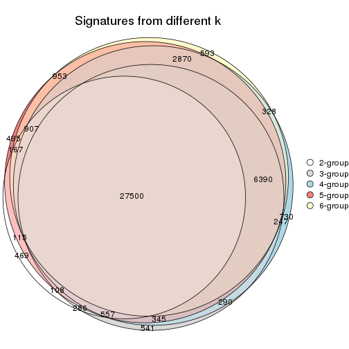

`get_signature()` returns a data frame invisibly. TO get the list of signatures, the function
call should be assigned to a variable explicitly. In following code, if `plot` argument is set
to `FALSE`, no heatmap is plotted while only the differential analysis is performed.

```r
# code only for demonstration
tb = get_signature(res, k = ..., plot = FALSE)
```

An example of the output of `tb` is:

```
#>   which_row         fdr    mean_1    mean_2 scaled_mean_1 scaled_mean_2 km
#> 1        38 0.042760348  8.373488  9.131774    -0.5533452     0.5164555  1
#> 2        40 0.018707592  7.106213  8.469186    -0.6173731     0.5762149  1
#> 3        55 0.019134737 10.221463 11.207825    -0.6159697     0.5749050  1
#> 4        59 0.006059896  5.921854  7.869574    -0.6899429     0.6439467  1
#> 5        60 0.018055526  8.928898 10.211722    -0.6204761     0.5791110  1
#> 6        98 0.009384629 15.714769 14.887706     0.6635654    -0.6193277  2
...
```

The columns in `tb` are:

1. `which_row`: row indices corresponding to the input matrix.
2. `fdr`: FDR for the differential test. 
3. `mean_x`: The mean value in group x.
4. `scaled_mean_x`: The mean value in group x after rows are scaled.
5. `km`: Row groups if k-means clustering is applied to rows.


UMAP plot which shows how samples are separated.


<script>
$( function() {
	$( '#tabs-CV-NMF-dimension-reduction' ).tabs();
} );
</script>
<div id='tabs-CV-NMF-dimension-reduction'>
<ul>
<li><a href='#tab-CV-NMF-dimension-reduction-1'>k = 2</a></li>
<li><a href='#tab-CV-NMF-dimension-reduction-2'>k = 3</a></li>
<li><a href='#tab-CV-NMF-dimension-reduction-3'>k = 4</a></li>
<li><a href='#tab-CV-NMF-dimension-reduction-4'>k = 5</a></li>
<li><a href='#tab-CV-NMF-dimension-reduction-5'>k = 6</a></li>
</ul>
<div id='tab-CV-NMF-dimension-reduction-1'>
<pre><code class="r">dimension_reduction(res, k = 2, method = &quot;UMAP&quot;)
</code></pre>

<p></p>

</div>
<div id='tab-CV-NMF-dimension-reduction-2'>
<pre><code class="r">dimension_reduction(res, k = 3, method = &quot;UMAP&quot;)
</code></pre>

<p>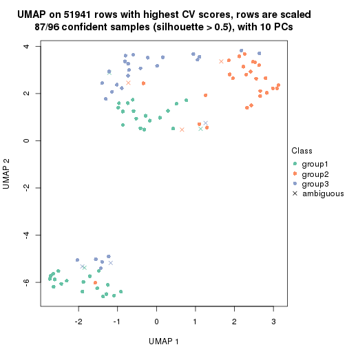</p>

</div>
<div id='tab-CV-NMF-dimension-reduction-3'>
<pre><code class="r">dimension_reduction(res, k = 4, method = &quot;UMAP&quot;)
</code></pre>

<p></p>

</div>
<div id='tab-CV-NMF-dimension-reduction-4'>
<pre><code class="r">dimension_reduction(res, k = 5, method = &quot;UMAP&quot;)
</code></pre>

<p></p>

</div>
<div id='tab-CV-NMF-dimension-reduction-5'>
<pre><code class="r">dimension_reduction(res, k = 6, method = &quot;UMAP&quot;)
</code></pre>

<p></p>

</div>
</div>


Following heatmap shows how subgroups are split when increasing `k`:

```r
collect_classes(res)
```


Test correlation between subgroups and known annotations. If the known
annotation is numeric, one-way ANOVA test is applied, and if the known
annotation is discrete, chi-squared contingency table test is applied.

```r
test_to_known_factors(res)
```

```
#>         n disease.state(p) k
#> CV:NMF 93         0.168450 2
#> CV:NMF 87         0.002865 3
#> CV:NMF 90         0.006466 4
#> CV:NMF 88         0.007205 5
#> CV:NMF 78         0.000966 6
```


If matrix rows can be associated to genes, consider to use `functional_enrichment(res,
...)` to perform function enrichment for the signature genes. See [this vignette](http://bioconductor.org/packages/devel/bioc/vignettes/cola/inst/doc/functional_enrichment.html) for more detailed explanations.


 

---------------------------------------------------


### MAD:hclust


The object with results only for a single top-value method and a single partition method 
can be extracted as:

```r
res = res_list["MAD", "hclust"]
# you can also extract it by
# res = res_list["MAD:hclust"]
```

A summary of `res` and all the functions that can be applied to it:

```r
res
```

```
#> A 'ConsensusPartition' object with k = 2, 3, 4, 5, 6.
#>   On a matrix with 51941 rows and 96 columns.
#>   Top rows (1000, 2000, 3000, 4000, 5000) are extracted by 'MAD' method.
#>   Subgroups are detected by 'hclust' method.
#>   Performed in total 1250 partitions by row resampling.
#>   Best k for subgroups seems to be 2.
#> 
#> Following methods can be applied to this 'ConsensusPartition' object:
#>  [1] "cola_report"             "collect_classes"         "collect_plots"          
#>  [4] "collect_stats"           "colnames"                "compare_signatures"     
#>  [7] "consensus_heatmap"       "dimension_reduction"     "functional_enrichment"  
#> [10] "get_anno_col"            "get_anno"                "get_classes"            
#> [13] "get_consensus"           "get_matrix"              "get_membership"         
#> [16] "get_param"               "get_signatures"          "get_stats"              
#> [19] "is_best_k"               "is_stable_k"             "membership_heatmap"     
#> [22] "ncol"                    "nrow"                    "plot_ecdf"              
#> [25] "rownames"                "select_partition_number" "show"                   
#> [28] "suggest_best_k"          "test_to_known_factors"
```

`collect_plots()` function collects all the plots made from `res` for all `k` (number of partitions)
into one single page to provide an easy and fast comparison between different `k`.

```r
collect_plots(res)
```


The plots are:

- The first row: a plot of the ECDF (empirical cumulative distribution
  function) curves of the consensus matrix for each `k` and the heatmap of
  predicted classes for each `k`.
- The second row: heatmaps of the consensus matrix for each `k`.
- The third row: heatmaps of the membership matrix for each `k`.
- The fouth row: heatmaps of the signatures for each `k`.

All the plots in panels can be made by individual functions and they are
plotted later in this section.

`select_partition_number()` produces several plots showing different
statistics for choosing "optimized" `k`. There are following statistics:

- ECDF curves of the consensus matrix for each `k`;
- 1-PAC. [The PAC
  score](https://en.wikipedia.org/wiki/Consensus_clustering#Over-interpretation_potential_of_consensus_clustering)
  measures the proportion of the ambiguous subgrouping.
- Mean silhouette score.
- Concordance. The mean probability of fiting the consensus class ids in all
  partitions.
- Area increased. Denote $A_k$ as the area under the ECDF curve for current
  `k`, the area increased is defined as $A_k - A_{k-1}$.
- Rand index. The percent of pairs of samples that are both in a same cluster
  or both are not in a same cluster in the partition of k and k-1.
- Jaccard index. The ratio of pairs of samples are both in a same cluster in
  the partition of k and k-1 and the pairs of samples are both in a same
  cluster in the partition k or k-1.

The detailed explanations of these statistics can be found in [the _cola_
vignette](http://bioconductor.org/packages/devel/bioc/vignettes/cola/inst/doc/cola.html#toc_13).

Generally speaking, lower PAC score, higher mean silhouette score or higher
concordance corresponds to better partition. Rand index and Jaccard index
measure how similar the current partition is compared to partition with `k-1`.
If they are too similar, we won't accept `k` is better than `k-1`.

```r
select_partition_number(res)
```


The numeric values for all these statistics can be obtained by `get_stats()`.

```r
get_stats(res)
```

```
#>   k 1-PAC mean_silhouette concordance area_increased  Rand Jaccard
#> 2 2 0.341           0.742       0.864         0.4826 0.526   0.526
#> 3 3 0.375           0.661       0.807         0.3340 0.790   0.606
#> 4 4 0.500           0.551       0.752         0.1469 0.835   0.554
#> 5 5 0.588           0.528       0.687         0.0613 0.907   0.656
#> 6 6 0.664           0.545       0.722         0.0457 0.944   0.744
```

`suggest_best_k()` suggests the best $k$ based on these statistics. The rules are as follows:

- All $k$ with Jaccard index larger than 0.95 are removed because increasing
  $k$ does not provide enough extra information. If all $k$ are removed, it is
  marked as no subgroup is detected.
- For all $k$ with 1-PAC score larger than 0.9, the maximal $k$ is taken as
  the best $k$, and other $k$ are marked as optional $k$.
- If it does not fit the second rule. The $k$ with the maximal vote of the
  highest 1-PAC score, highest mean silhouette, and highest concordance is
  taken as the best $k$.

```r
suggest_best_k(res)
```

```
#> [1] 2
```


Following shows the table of the partitions (You need to click the **show/hide
code output** link to see it). The membership matrix (columns with name `p*`)
is inferred by
[`clue::cl_consensus()`](https://www.rdocumentation.org/link/cl_consensus?package=clue)
function with the `SE` method. Basically the value in the membership matrix
represents the probability to belong to a certain group. The finall class
label for an item is determined with the group with highest probability it
belongs to.

In `get_classes()` function, the entropy is calculated from the membership
matrix and the silhouette score is calculated from the consensus matrix.


<script>
$( function() {
	$( '#tabs-MAD-hclust-get-classes' ).tabs();
} );
</script>
<div id='tabs-MAD-hclust-get-classes'>
<ul>
<li><a href='#tab-MAD-hclust-get-classes-1'>k = 2</a></li>
<li><a href='#tab-MAD-hclust-get-classes-2'>k = 3</a></li>
<li><a href='#tab-MAD-hclust-get-classes-3'>k = 4</a></li>
<li><a href='#tab-MAD-hclust-get-classes-4'>k = 5</a></li>
<li><a href='#tab-MAD-hclust-get-classes-5'>k = 6</a></li>
</ul>

<div id='tab-MAD-hclust-get-classes-1'>
<p><a id='tab-MAD-hclust-get-classes-1-a' style='color:#0366d6' href='#'>show/hide code output</a></p>
<pre><code class="r">cbind(get_classes(res, k = 2), get_membership(res, k = 2))
</code></pre>

<pre><code>#&gt;           class entropy silhouette    p1    p2
#&gt; GSM531600     2  0.2603      0.817 0.044 0.956
#&gt; GSM531601     2  0.9954      0.196 0.460 0.540
#&gt; GSM531605     1  0.5629      0.837 0.868 0.132
#&gt; GSM531615     2  0.7219      0.737 0.200 0.800
#&gt; GSM531617     2  0.7299      0.735 0.204 0.796
#&gt; GSM531624     2  0.3733      0.812 0.072 0.928
#&gt; GSM531627     2  0.0672      0.815 0.008 0.992
#&gt; GSM531629     2  0.7299      0.735 0.204 0.796
#&gt; GSM531631     2  0.3733      0.812 0.072 0.928
#&gt; GSM531634     2  0.7299      0.735 0.204 0.796
#&gt; GSM531636     2  0.2603      0.817 0.044 0.956
#&gt; GSM531637     2  0.3733      0.812 0.072 0.928
#&gt; GSM531654     2  0.8763      0.624 0.296 0.704
#&gt; GSM531655     1  0.5629      0.837 0.868 0.132
#&gt; GSM531658     1  0.2236      0.893 0.964 0.036
#&gt; GSM531660     1  0.4161      0.874 0.916 0.084
#&gt; GSM531602     1  0.1843      0.884 0.972 0.028
#&gt; GSM531603     1  0.3114      0.893 0.944 0.056
#&gt; GSM531604     1  0.9754      0.225 0.592 0.408
#&gt; GSM531606     1  0.4690      0.864 0.900 0.100
#&gt; GSM531607     1  0.2948      0.893 0.948 0.052
#&gt; GSM531608     2  0.7219      0.738 0.200 0.800
#&gt; GSM531609     1  0.1633      0.894 0.976 0.024
#&gt; GSM531610     1  0.1633      0.894 0.976 0.024
#&gt; GSM531611     1  0.1843      0.895 0.972 0.028
#&gt; GSM531612     1  0.1843      0.895 0.972 0.028
#&gt; GSM531613     1  0.1633      0.894 0.976 0.024
#&gt; GSM531614     1  0.1633      0.894 0.976 0.024
#&gt; GSM531616     2  0.1414      0.817 0.020 0.980
#&gt; GSM531618     1  0.6247      0.816 0.844 0.156
#&gt; GSM531619     2  0.3733      0.812 0.072 0.928
#&gt; GSM531620     2  0.1414      0.820 0.020 0.980
#&gt; GSM531621     2  0.0672      0.815 0.008 0.992
#&gt; GSM531622     2  0.3733      0.812 0.072 0.928
#&gt; GSM531623     2  0.3733      0.812 0.072 0.928
#&gt; GSM531625     2  0.0672      0.815 0.008 0.992
#&gt; GSM531626     2  0.0672      0.815 0.008 0.992
#&gt; GSM531628     2  0.3114      0.817 0.056 0.944
#&gt; GSM531630     2  0.3733      0.812 0.072 0.928
#&gt; GSM531632     2  0.1843      0.816 0.028 0.972
#&gt; GSM531633     2  0.0672      0.815 0.008 0.992
#&gt; GSM531635     2  0.1414      0.817 0.020 0.980
#&gt; GSM531638     2  0.1414      0.817 0.020 0.980
#&gt; GSM531639     2  0.2778      0.817 0.048 0.952
#&gt; GSM531640     2  0.3879      0.812 0.076 0.924
#&gt; GSM531641     1  0.1843      0.895 0.972 0.028
#&gt; GSM531642     2  0.9970      0.161 0.468 0.532
#&gt; GSM531643     2  0.4815      0.805 0.104 0.896
#&gt; GSM531644     2  0.9988      0.116 0.480 0.520
#&gt; GSM531645     1  0.1843      0.895 0.972 0.028
#&gt; GSM531646     2  0.1843      0.816 0.028 0.972
#&gt; GSM531647     2  0.1843      0.816 0.028 0.972
#&gt; GSM531648     1  0.8955      0.540 0.688 0.312
#&gt; GSM531649     2  0.1843      0.816 0.028 0.972
#&gt; GSM531650     2  0.3114      0.817 0.056 0.944
#&gt; GSM531651     2  0.1843      0.818 0.028 0.972
#&gt; GSM531652     1  0.8955      0.540 0.688 0.312
#&gt; GSM531653     2  0.1843      0.816 0.028 0.972
#&gt; GSM531656     2  0.2778      0.817 0.048 0.952
#&gt; GSM531657     1  0.3431      0.889 0.936 0.064
#&gt; GSM531659     1  0.8267      0.653 0.740 0.260
#&gt; GSM531661     2  0.7528      0.723 0.216 0.784
#&gt; GSM531662     2  0.8555      0.641 0.280 0.720
#&gt; GSM531663     1  0.6973      0.767 0.812 0.188
#&gt; GSM531664     2  0.3114      0.817 0.056 0.944
#&gt; GSM531665     2  0.9866      0.326 0.432 0.568
#&gt; GSM531666     2  0.9686      0.423 0.396 0.604
#&gt; GSM531667     2  0.7139      0.742 0.196 0.804
#&gt; GSM531668     1  0.7602      0.722 0.780 0.220
#&gt; GSM531669     2  0.3274      0.818 0.060 0.940
#&gt; GSM531670     2  0.2778      0.817 0.048 0.952
#&gt; GSM531671     2  0.8386      0.658 0.268 0.732
#&gt; GSM531672     1  0.2236      0.893 0.964 0.036
#&gt; GSM531673     2  0.8555      0.641 0.280 0.720
#&gt; GSM531674     2  0.3274      0.818 0.060 0.940
#&gt; GSM531675     1  0.1414      0.886 0.980 0.020
#&gt; GSM531676     2  0.9954      0.245 0.460 0.540
#&gt; GSM531677     1  0.4562      0.872 0.904 0.096
#&gt; GSM531678     1  0.4939      0.858 0.892 0.108
#&gt; GSM531679     1  0.4562      0.872 0.904 0.096
#&gt; GSM531680     2  0.9635      0.453 0.388 0.612
#&gt; GSM531681     1  0.0938      0.890 0.988 0.012
#&gt; GSM531682     1  0.2948      0.888 0.948 0.052
#&gt; GSM531683     1  0.1843      0.884 0.972 0.028
#&gt; GSM531684     1  0.5178      0.851 0.884 0.116
#&gt; GSM531685     2  0.6623      0.759 0.172 0.828
#&gt; GSM531686     1  0.1184      0.892 0.984 0.016
#&gt; GSM531687     2  0.9954      0.245 0.460 0.540
#&gt; GSM531688     2  0.4690      0.805 0.100 0.900
#&gt; GSM531689     2  0.9954      0.245 0.460 0.540
#&gt; GSM531690     1  0.1633      0.885 0.976 0.024
#&gt; GSM531691     2  0.9996      0.158 0.488 0.512
#&gt; GSM531692     2  0.8861      0.607 0.304 0.696
#&gt; GSM531693     2  0.5946      0.776 0.144 0.856
#&gt; GSM531694     1  0.1843      0.884 0.972 0.028
#&gt; GSM531695     2  0.9635      0.453 0.388 0.612
</code></pre>

<script>
$('#tab-MAD-hclust-get-classes-1-a').parent().next().next().hide();
$('#tab-MAD-hclust-get-classes-1-a').click(function(){
  $('#tab-MAD-hclust-get-classes-1-a').parent().next().next().toggle();
  return(false);
});
</script>
</div>

<div id='tab-MAD-hclust-get-classes-2'>
<p><a id='tab-MAD-hclust-get-classes-2-a' style='color:#0366d6' href='#'>show/hide code output</a></p>
<pre><code class="r">cbind(get_classes(res, k = 3), get_membership(res, k = 3))
</code></pre>

<pre><code>#&gt;           class entropy silhouette    p1    p2    p3
#&gt; GSM531600     3  0.2998    0.71361 0.016 0.068 0.916
#&gt; GSM531601     2  0.7996    0.10867 0.380 0.552 0.068
#&gt; GSM531605     1  0.6031    0.78898 0.788 0.116 0.096
#&gt; GSM531615     2  0.4209    0.75733 0.128 0.856 0.016
#&gt; GSM531617     2  0.4277    0.75563 0.132 0.852 0.016
#&gt; GSM531624     2  0.0424    0.79220 0.000 0.992 0.008
#&gt; GSM531627     2  0.3752    0.73538 0.000 0.856 0.144
#&gt; GSM531629     2  0.4277    0.75563 0.132 0.852 0.016
#&gt; GSM531631     2  0.0424    0.79220 0.000 0.992 0.008
#&gt; GSM531634     2  0.4277    0.75563 0.132 0.852 0.016
#&gt; GSM531636     3  0.2998    0.71361 0.016 0.068 0.916
#&gt; GSM531637     2  0.0424    0.79220 0.000 0.992 0.008
#&gt; GSM531654     2  0.6964    0.62957 0.264 0.684 0.052
#&gt; GSM531655     1  0.6031    0.78898 0.788 0.116 0.096
#&gt; GSM531658     1  0.2651    0.83812 0.928 0.012 0.060
#&gt; GSM531660     1  0.5212    0.81933 0.828 0.108 0.064
#&gt; GSM531602     1  0.3896    0.81608 0.888 0.060 0.052
#&gt; GSM531603     1  0.4146    0.83569 0.876 0.044 0.080
#&gt; GSM531604     1  0.8930    0.24002 0.536 0.148 0.316
#&gt; GSM531606     1  0.5343    0.77474 0.816 0.132 0.052
#&gt; GSM531607     1  0.4357    0.83284 0.868 0.052 0.080
#&gt; GSM531608     2  0.5276    0.74701 0.128 0.820 0.052
#&gt; GSM531609     1  0.2280    0.84120 0.940 0.008 0.052
#&gt; GSM531610     1  0.2280    0.84120 0.940 0.008 0.052
#&gt; GSM531611     1  0.2384    0.84112 0.936 0.008 0.056
#&gt; GSM531612     1  0.2384    0.84044 0.936 0.008 0.056
#&gt; GSM531613     1  0.2280    0.84120 0.940 0.008 0.052
#&gt; GSM531614     1  0.2280    0.84120 0.940 0.008 0.052
#&gt; GSM531616     3  0.6359    0.33503 0.004 0.404 0.592
#&gt; GSM531618     1  0.5944    0.78138 0.792 0.120 0.088
#&gt; GSM531619     2  0.0424    0.79220 0.000 0.992 0.008
#&gt; GSM531620     2  0.4679    0.73921 0.020 0.832 0.148
#&gt; GSM531621     2  0.3752    0.73538 0.000 0.856 0.144
#&gt; GSM531622     2  0.0592    0.79184 0.000 0.988 0.012
#&gt; GSM531623     2  0.0424    0.79220 0.000 0.992 0.008
#&gt; GSM531625     2  0.3752    0.73538 0.000 0.856 0.144
#&gt; GSM531626     2  0.3752    0.73538 0.000 0.856 0.144
#&gt; GSM531628     3  0.3009    0.71766 0.028 0.052 0.920
#&gt; GSM531630     2  0.0424    0.79220 0.000 0.992 0.008
#&gt; GSM531632     3  0.2448    0.70665 0.000 0.076 0.924
#&gt; GSM531633     2  0.3752    0.73538 0.000 0.856 0.144
#&gt; GSM531635     3  0.6359    0.33503 0.004 0.404 0.592
#&gt; GSM531638     3  0.6359    0.33503 0.004 0.404 0.592
#&gt; GSM531639     3  0.5356    0.64121 0.020 0.196 0.784
#&gt; GSM531640     2  0.0661    0.79265 0.004 0.988 0.008
#&gt; GSM531641     1  0.2384    0.84044 0.936 0.008 0.056
#&gt; GSM531642     3  0.8842    0.09179 0.432 0.116 0.452
#&gt; GSM531643     3  0.4469    0.70521 0.076 0.060 0.864
#&gt; GSM531644     3  0.8337    0.07068 0.444 0.080 0.476
#&gt; GSM531645     1  0.2384    0.84044 0.936 0.008 0.056
#&gt; GSM531646     3  0.3116    0.69991 0.000 0.108 0.892
#&gt; GSM531647     3  0.1860    0.71106 0.000 0.052 0.948
#&gt; GSM531648     1  0.8265    0.59153 0.636 0.180 0.184
#&gt; GSM531649     3  0.1860    0.71106 0.000 0.052 0.948
#&gt; GSM531650     3  0.3009    0.71766 0.028 0.052 0.920
#&gt; GSM531651     2  0.2066    0.77812 0.000 0.940 0.060
#&gt; GSM531652     1  0.8265    0.59153 0.636 0.180 0.184
#&gt; GSM531653     3  0.1860    0.71106 0.000 0.052 0.948
#&gt; GSM531656     3  0.5036    0.66235 0.020 0.172 0.808
#&gt; GSM531657     1  0.3461    0.83472 0.900 0.024 0.076
#&gt; GSM531659     1  0.6920    0.67824 0.732 0.164 0.104
#&gt; GSM531661     2  0.5598    0.73214 0.148 0.800 0.052
#&gt; GSM531662     2  0.9536    0.34758 0.232 0.484 0.284
#&gt; GSM531663     1  0.5631    0.74107 0.792 0.164 0.044
#&gt; GSM531664     3  0.3009    0.71766 0.028 0.052 0.920
#&gt; GSM531665     1  0.9867   -0.00576 0.412 0.312 0.276
#&gt; GSM531666     3  0.7534    0.37212 0.368 0.048 0.584
#&gt; GSM531667     2  0.5276    0.74576 0.128 0.820 0.052
#&gt; GSM531668     1  0.6746    0.71532 0.732 0.192 0.076
#&gt; GSM531669     3  0.3310    0.71596 0.028 0.064 0.908
#&gt; GSM531670     3  0.5036    0.66235 0.020 0.172 0.808
#&gt; GSM531671     2  0.9641    0.27702 0.224 0.452 0.324
#&gt; GSM531672     1  0.2651    0.83812 0.928 0.012 0.060
#&gt; GSM531673     2  0.9536    0.34758 0.232 0.484 0.284
#&gt; GSM531674     3  0.3310    0.71596 0.028 0.064 0.908
#&gt; GSM531675     1  0.1860    0.82874 0.948 0.000 0.052
#&gt; GSM531676     3  0.8507    0.20495 0.424 0.092 0.484
#&gt; GSM531677     1  0.3412    0.79773 0.876 0.000 0.124
#&gt; GSM531678     1  0.5536    0.76486 0.804 0.144 0.052
#&gt; GSM531679     1  0.3412    0.79773 0.876 0.000 0.124
#&gt; GSM531680     3  0.5859    0.46586 0.344 0.000 0.656
#&gt; GSM531681     1  0.2280    0.84275 0.940 0.008 0.052
#&gt; GSM531682     1  0.2448    0.82338 0.924 0.000 0.076
#&gt; GSM531683     1  0.3692    0.81909 0.896 0.056 0.048
#&gt; GSM531684     1  0.5659    0.75724 0.796 0.152 0.052
#&gt; GSM531685     3  0.5848    0.65332 0.124 0.080 0.796
#&gt; GSM531686     1  0.2384    0.84277 0.936 0.008 0.056
#&gt; GSM531687     3  0.8507    0.20495 0.424 0.092 0.484
#&gt; GSM531688     3  0.3375    0.70553 0.048 0.044 0.908
#&gt; GSM531689     3  0.8507    0.20495 0.424 0.092 0.484
#&gt; GSM531690     1  0.1753    0.82706 0.952 0.000 0.048
#&gt; GSM531691     3  0.8524    0.12363 0.452 0.092 0.456
#&gt; GSM531692     3  0.9347    0.34402 0.276 0.212 0.512
#&gt; GSM531693     3  0.4335    0.68070 0.100 0.036 0.864
#&gt; GSM531694     1  0.3896    0.81608 0.888 0.060 0.052
#&gt; GSM531695     3  0.5859    0.46586 0.344 0.000 0.656
</code></pre>

<script>
$('#tab-MAD-hclust-get-classes-2-a').parent().next().next().hide();
$('#tab-MAD-hclust-get-classes-2-a').click(function(){
  $('#tab-MAD-hclust-get-classes-2-a').parent().next().next().toggle();
  return(false);
});
</script>
</div>

<div id='tab-MAD-hclust-get-classes-3'>
<p><a id='tab-MAD-hclust-get-classes-3-a' style='color:#0366d6' href='#'>show/hide code output</a></p>
<pre><code class="r">cbind(get_classes(res, k = 4), get_membership(res, k = 4))
</code></pre>

<pre><code>#&gt;           class entropy silhouette    p1    p2    p3    p4
#&gt; GSM531600     3  0.1411     0.7792 0.000 0.020 0.960 0.020
#&gt; GSM531601     2  0.7415     0.1759 0.076 0.532 0.040 0.352
#&gt; GSM531605     4  0.6982     0.0879 0.448 0.052 0.028 0.472
#&gt; GSM531615     2  0.3731     0.7789 0.036 0.844 0.000 0.120
#&gt; GSM531617     2  0.3787     0.7764 0.036 0.840 0.000 0.124
#&gt; GSM531624     2  0.0000     0.8385 0.000 1.000 0.000 0.000
#&gt; GSM531627     2  0.4144     0.7844 0.068 0.828 0.104 0.000
#&gt; GSM531629     2  0.3787     0.7764 0.036 0.840 0.000 0.124
#&gt; GSM531631     2  0.0188     0.8382 0.004 0.996 0.000 0.000
#&gt; GSM531634     2  0.3787     0.7764 0.036 0.840 0.000 0.124
#&gt; GSM531636     3  0.1411     0.7792 0.000 0.020 0.960 0.020
#&gt; GSM531637     2  0.0000     0.8385 0.000 1.000 0.000 0.000
#&gt; GSM531654     2  0.7121     0.5669 0.236 0.620 0.028 0.116
#&gt; GSM531655     4  0.6982     0.0879 0.448 0.052 0.028 0.472
#&gt; GSM531658     4  0.0524     0.6779 0.000 0.004 0.008 0.988
#&gt; GSM531660     4  0.5047     0.5991 0.136 0.076 0.008 0.780
#&gt; GSM531602     1  0.5085     0.4328 0.708 0.032 0.000 0.260
#&gt; GSM531603     1  0.6144     0.2307 0.576 0.028 0.016 0.380
#&gt; GSM531604     1  0.5716     0.4847 0.740 0.052 0.176 0.032
#&gt; GSM531606     1  0.4244     0.4911 0.800 0.032 0.000 0.168
#&gt; GSM531607     1  0.6149     0.2841 0.596 0.032 0.016 0.356
#&gt; GSM531608     2  0.5329     0.7190 0.188 0.752 0.028 0.032
#&gt; GSM531609     4  0.1867     0.6844 0.072 0.000 0.000 0.928
#&gt; GSM531610     4  0.1867     0.6844 0.072 0.000 0.000 0.928
#&gt; GSM531611     4  0.2125     0.6829 0.076 0.000 0.004 0.920
#&gt; GSM531612     4  0.1902     0.6864 0.064 0.000 0.004 0.932
#&gt; GSM531613     4  0.1867     0.6844 0.072 0.000 0.000 0.928
#&gt; GSM531614     4  0.1867     0.6844 0.072 0.000 0.000 0.928
#&gt; GSM531616     3  0.6360     0.3559 0.060 0.372 0.564 0.004
#&gt; GSM531618     4  0.5213     0.6122 0.060 0.108 0.040 0.792
#&gt; GSM531619     2  0.0000     0.8385 0.000 1.000 0.000 0.000
#&gt; GSM531620     2  0.4967     0.7860 0.068 0.804 0.100 0.028
#&gt; GSM531621     2  0.4144     0.7844 0.068 0.828 0.104 0.000
#&gt; GSM531622     2  0.0469     0.8381 0.012 0.988 0.000 0.000
#&gt; GSM531623     2  0.0000     0.8385 0.000 1.000 0.000 0.000
#&gt; GSM531625     2  0.4144     0.7844 0.068 0.828 0.104 0.000
#&gt; GSM531626     2  0.4144     0.7844 0.068 0.828 0.104 0.000
#&gt; GSM531628     3  0.1109     0.7763 0.004 0.000 0.968 0.028
#&gt; GSM531630     2  0.0188     0.8382 0.004 0.996 0.000 0.000
#&gt; GSM531632     3  0.1022     0.7747 0.032 0.000 0.968 0.000
#&gt; GSM531633     2  0.4144     0.7844 0.068 0.828 0.104 0.000
#&gt; GSM531635     3  0.6360     0.3559 0.060 0.372 0.564 0.004
#&gt; GSM531638     3  0.6360     0.3559 0.060 0.372 0.564 0.004
#&gt; GSM531639     3  0.4883     0.7082 0.048 0.128 0.800 0.024
#&gt; GSM531640     2  0.0376     0.8380 0.004 0.992 0.000 0.004
#&gt; GSM531641     4  0.1902     0.6864 0.064 0.000 0.004 0.932
#&gt; GSM531642     4  0.7868     0.0534 0.052 0.088 0.396 0.464
#&gt; GSM531643     3  0.2311     0.7494 0.004 0.004 0.916 0.076
#&gt; GSM531644     4  0.7100     0.0530 0.028 0.060 0.436 0.476
#&gt; GSM531645     4  0.1902     0.6864 0.064 0.000 0.004 0.932
#&gt; GSM531646     3  0.2124     0.7741 0.028 0.040 0.932 0.000
#&gt; GSM531647     3  0.0000     0.7782 0.000 0.000 1.000 0.000
#&gt; GSM531648     4  0.7711     0.4899 0.084 0.160 0.136 0.620
#&gt; GSM531649     3  0.0000     0.7782 0.000 0.000 1.000 0.000
#&gt; GSM531650     3  0.1109     0.7763 0.004 0.000 0.968 0.028
#&gt; GSM531651     2  0.1936     0.8285 0.032 0.940 0.028 0.000
#&gt; GSM531652     4  0.7711     0.4899 0.084 0.160 0.136 0.620
#&gt; GSM531653     3  0.0000     0.7782 0.000 0.000 1.000 0.000
#&gt; GSM531656     3  0.4546     0.7249 0.048 0.104 0.824 0.024
#&gt; GSM531657     4  0.4020     0.6310 0.128 0.016 0.020 0.836
#&gt; GSM531659     4  0.8241     0.1586 0.296 0.156 0.048 0.500
#&gt; GSM531661     2  0.5568     0.6847 0.224 0.720 0.028 0.028
#&gt; GSM531662     1  0.8309    -0.0276 0.412 0.376 0.180 0.032
#&gt; GSM531663     4  0.5361     0.5356 0.108 0.148 0.000 0.744
#&gt; GSM531664     3  0.1109     0.7763 0.004 0.000 0.968 0.028
#&gt; GSM531665     1  0.8900     0.3758 0.480 0.240 0.180 0.100
#&gt; GSM531666     3  0.6326     0.2433 0.028 0.024 0.572 0.376
#&gt; GSM531667     2  0.5289     0.7220 0.184 0.756 0.028 0.032
#&gt; GSM531668     4  0.6313     0.5437 0.100 0.176 0.024 0.700
#&gt; GSM531669     3  0.2469     0.7439 0.108 0.000 0.892 0.000
#&gt; GSM531670     3  0.4546     0.7249 0.048 0.104 0.824 0.024
#&gt; GSM531671     1  0.8516     0.0303 0.400 0.340 0.228 0.032
#&gt; GSM531672     4  0.0524     0.6779 0.000 0.004 0.008 0.988
#&gt; GSM531673     1  0.8309    -0.0276 0.412 0.376 0.180 0.032
#&gt; GSM531674     3  0.2469     0.7439 0.108 0.000 0.892 0.000
#&gt; GSM531675     4  0.4985    -0.0575 0.468 0.000 0.000 0.532
#&gt; GSM531676     1  0.5830     0.3138 0.620 0.000 0.332 0.048
#&gt; GSM531677     1  0.5866     0.3882 0.624 0.000 0.052 0.324
#&gt; GSM531678     1  0.4290     0.4947 0.800 0.036 0.000 0.164
#&gt; GSM531679     1  0.5866     0.3882 0.624 0.000 0.052 0.324
#&gt; GSM531680     3  0.6688     0.2191 0.368 0.000 0.536 0.096
#&gt; GSM531681     4  0.3942     0.5342 0.236 0.000 0.000 0.764
#&gt; GSM531682     1  0.5400     0.3226 0.608 0.000 0.020 0.372
#&gt; GSM531683     1  0.5344     0.3992 0.668 0.032 0.000 0.300
#&gt; GSM531684     1  0.4100     0.4965 0.816 0.036 0.000 0.148
#&gt; GSM531685     3  0.4679     0.5113 0.352 0.000 0.648 0.000
#&gt; GSM531686     4  0.4155     0.5281 0.240 0.000 0.004 0.756
#&gt; GSM531687     1  0.5830     0.3138 0.620 0.000 0.332 0.048
#&gt; GSM531688     3  0.3266     0.7019 0.168 0.000 0.832 0.000
#&gt; GSM531689     1  0.5830     0.3138 0.620 0.000 0.332 0.048
#&gt; GSM531690     1  0.4981     0.1643 0.536 0.000 0.000 0.464
#&gt; GSM531691     1  0.6013     0.3535 0.624 0.000 0.312 0.064
#&gt; GSM531692     1  0.6712     0.1076 0.552 0.104 0.344 0.000
#&gt; GSM531693     3  0.4072     0.6159 0.252 0.000 0.748 0.000
#&gt; GSM531694     1  0.5085     0.4328 0.708 0.032 0.000 0.260
#&gt; GSM531695     3  0.6688     0.2191 0.368 0.000 0.536 0.096
</code></pre>

<script>
$('#tab-MAD-hclust-get-classes-3-a').parent().next().next().hide();
$('#tab-MAD-hclust-get-classes-3-a').click(function(){
  $('#tab-MAD-hclust-get-classes-3-a').parent().next().next().toggle();
  return(false);
});
</script>
</div>

<div id='tab-MAD-hclust-get-classes-4'>
<p><a id='tab-MAD-hclust-get-classes-4-a' style='color:#0366d6' href='#'>show/hide code output</a></p>
<pre><code class="r">cbind(get_classes(res, k = 5), get_membership(res, k = 5))
</code></pre>

<pre><code>#&gt;           class entropy silhouette    p1    p2    p3    p4    p5
#&gt; GSM531600     3  0.0898     0.6819 0.000 0.020 0.972 0.000 0.008
#&gt; GSM531601     2  0.6907     0.1358 0.016 0.452 0.036 0.080 0.416
#&gt; GSM531605     1  0.6775     0.3858 0.512 0.012 0.008 0.160 0.308
#&gt; GSM531615     2  0.4216     0.7236 0.012 0.796 0.000 0.072 0.120
#&gt; GSM531617     2  0.4275     0.7204 0.012 0.792 0.000 0.076 0.120
#&gt; GSM531624     2  0.0162     0.8078 0.000 0.996 0.000 0.000 0.004
#&gt; GSM531627     2  0.3445     0.7477 0.000 0.824 0.036 0.000 0.140
#&gt; GSM531629     2  0.4275     0.7204 0.012 0.792 0.000 0.076 0.120
#&gt; GSM531631     2  0.0290     0.8072 0.000 0.992 0.000 0.000 0.008
#&gt; GSM531634     2  0.4275     0.7204 0.012 0.792 0.000 0.076 0.120
#&gt; GSM531636     3  0.0898     0.6819 0.000 0.020 0.972 0.000 0.008
#&gt; GSM531637     2  0.0162     0.8078 0.000 0.996 0.000 0.000 0.004
#&gt; GSM531654     2  0.7265     0.4842 0.208 0.580 0.024 0.068 0.120
#&gt; GSM531655     1  0.6775     0.3858 0.512 0.012 0.008 0.160 0.308
#&gt; GSM531658     4  0.4114     0.6702 0.044 0.000 0.004 0.776 0.176
#&gt; GSM531660     4  0.7106     0.3756 0.260 0.020 0.004 0.480 0.236
#&gt; GSM531602     1  0.1341     0.7108 0.944 0.000 0.000 0.056 0.000
#&gt; GSM531603     1  0.4553     0.6770 0.772 0.008 0.020 0.164 0.036
#&gt; GSM531604     1  0.5960     0.1213 0.588 0.028 0.068 0.000 0.316
#&gt; GSM531606     1  0.1644     0.6697 0.940 0.004 0.000 0.008 0.048
#&gt; GSM531607     1  0.4186     0.6874 0.804 0.008 0.020 0.136 0.032
#&gt; GSM531608     2  0.5508     0.6683 0.116 0.728 0.024 0.016 0.116
#&gt; GSM531609     4  0.0880     0.7663 0.032 0.000 0.000 0.968 0.000
#&gt; GSM531610     4  0.0880     0.7663 0.032 0.000 0.000 0.968 0.000
#&gt; GSM531611     4  0.1357     0.7593 0.048 0.000 0.000 0.948 0.004
#&gt; GSM531612     4  0.1082     0.7668 0.028 0.000 0.000 0.964 0.008
#&gt; GSM531613     4  0.0880     0.7663 0.032 0.000 0.000 0.968 0.000
#&gt; GSM531614     4  0.0880     0.7663 0.032 0.000 0.000 0.968 0.000
#&gt; GSM531616     3  0.6040     0.2472 0.000 0.372 0.504 0.000 0.124
#&gt; GSM531618     4  0.7201     0.4949 0.076 0.064 0.028 0.548 0.284
#&gt; GSM531619     2  0.0162     0.8078 0.000 0.996 0.000 0.000 0.004
#&gt; GSM531620     2  0.4004     0.7483 0.000 0.792 0.032 0.012 0.164
#&gt; GSM531621     2  0.3445     0.7477 0.000 0.824 0.036 0.000 0.140
#&gt; GSM531622     2  0.0404     0.8078 0.000 0.988 0.000 0.000 0.012
#&gt; GSM531623     2  0.0162     0.8078 0.000 0.996 0.000 0.000 0.004
#&gt; GSM531625     2  0.3445     0.7477 0.000 0.824 0.036 0.000 0.140
#&gt; GSM531626     2  0.3445     0.7477 0.000 0.824 0.036 0.000 0.140
#&gt; GSM531628     3  0.0703     0.6803 0.000 0.000 0.976 0.000 0.024
#&gt; GSM531630     2  0.0290     0.8072 0.000 0.992 0.000 0.000 0.008
#&gt; GSM531632     3  0.1341     0.6719 0.000 0.000 0.944 0.000 0.056
#&gt; GSM531633     2  0.3445     0.7477 0.000 0.824 0.036 0.000 0.140
#&gt; GSM531635     3  0.6040     0.2472 0.000 0.372 0.504 0.000 0.124
#&gt; GSM531638     3  0.6040     0.2472 0.000 0.372 0.504 0.000 0.124
#&gt; GSM531639     3  0.4593     0.5598 0.000 0.128 0.748 0.000 0.124
#&gt; GSM531640     2  0.0451     0.8070 0.000 0.988 0.000 0.004 0.008
#&gt; GSM531641     4  0.1082     0.7668 0.028 0.000 0.000 0.964 0.008
#&gt; GSM531642     3  0.7643     0.1108 0.000 0.056 0.368 0.220 0.356
#&gt; GSM531643     3  0.2074     0.6613 0.000 0.004 0.920 0.060 0.016
#&gt; GSM531644     3  0.7181     0.1616 0.000 0.024 0.428 0.232 0.316
#&gt; GSM531645     4  0.1082     0.7668 0.028 0.000 0.000 0.964 0.008
#&gt; GSM531646     3  0.2228     0.6709 0.000 0.040 0.912 0.000 0.048
#&gt; GSM531647     3  0.0404     0.6806 0.000 0.000 0.988 0.000 0.012
#&gt; GSM531648     5  0.7988    -0.2439 0.024 0.080 0.128 0.344 0.424
#&gt; GSM531649     3  0.0404     0.6806 0.000 0.000 0.988 0.000 0.012
#&gt; GSM531650     3  0.0703     0.6803 0.000 0.000 0.976 0.000 0.024
#&gt; GSM531651     2  0.1628     0.7955 0.000 0.936 0.008 0.000 0.056
#&gt; GSM531652     5  0.7988    -0.2439 0.024 0.080 0.128 0.344 0.424
#&gt; GSM531653     3  0.0404     0.6806 0.000 0.000 0.988 0.000 0.012
#&gt; GSM531656     3  0.4312     0.5780 0.000 0.104 0.772 0.000 0.124
#&gt; GSM531657     4  0.6317     0.5027 0.200 0.008 0.004 0.588 0.200
#&gt; GSM531659     4  0.8508     0.0165 0.280 0.152 0.012 0.380 0.176
#&gt; GSM531661     2  0.5798     0.6324 0.128 0.696 0.024 0.012 0.140
#&gt; GSM531662     5  0.7896     0.1307 0.184 0.352 0.080 0.004 0.380
#&gt; GSM531663     4  0.5277     0.5725 0.092 0.144 0.000 0.728 0.036
#&gt; GSM531664     3  0.0703     0.6803 0.000 0.000 0.976 0.000 0.024
#&gt; GSM531665     5  0.8638     0.2457 0.320 0.232 0.068 0.044 0.336
#&gt; GSM531666     3  0.6633     0.3338 0.004 0.016 0.560 0.224 0.196
#&gt; GSM531667     2  0.5461     0.6753 0.108 0.732 0.024 0.016 0.120
#&gt; GSM531668     5  0.8429    -0.3235 0.164 0.096 0.028 0.344 0.368
#&gt; GSM531669     3  0.3492     0.5841 0.016 0.000 0.796 0.000 0.188
#&gt; GSM531670     3  0.4312     0.5780 0.000 0.104 0.772 0.000 0.124
#&gt; GSM531671     5  0.8192     0.1918 0.176 0.316 0.124 0.004 0.380
#&gt; GSM531672     4  0.4114     0.6702 0.044 0.000 0.004 0.776 0.176
#&gt; GSM531673     5  0.7896     0.1307 0.184 0.352 0.080 0.004 0.380
#&gt; GSM531674     3  0.3492     0.5841 0.016 0.000 0.796 0.000 0.188
#&gt; GSM531675     1  0.4227     0.3557 0.580 0.000 0.000 0.420 0.000
#&gt; GSM531676     5  0.6338     0.2145 0.388 0.000 0.140 0.004 0.468
#&gt; GSM531677     1  0.4834     0.6799 0.748 0.000 0.020 0.160 0.072
#&gt; GSM531678     1  0.2228     0.6710 0.916 0.008 0.000 0.020 0.056
#&gt; GSM531679     1  0.4834     0.6799 0.748 0.000 0.020 0.160 0.072
#&gt; GSM531680     3  0.7374     0.0259 0.288 0.000 0.412 0.032 0.268
#&gt; GSM531681     4  0.3395     0.5653 0.236 0.000 0.000 0.764 0.000
#&gt; GSM531682     1  0.4099     0.6864 0.764 0.000 0.004 0.200 0.032
#&gt; GSM531683     1  0.2439     0.7169 0.876 0.000 0.000 0.120 0.004
#&gt; GSM531684     1  0.2115     0.6569 0.916 0.008 0.000 0.008 0.068
#&gt; GSM531685     5  0.5816    -0.1745 0.092 0.000 0.440 0.000 0.468
#&gt; GSM531686     4  0.3607     0.5533 0.244 0.000 0.000 0.752 0.004
#&gt; GSM531687     5  0.6338     0.2145 0.388 0.000 0.140 0.004 0.468
#&gt; GSM531688     3  0.4352     0.5144 0.036 0.000 0.720 0.000 0.244
#&gt; GSM531689     5  0.6338     0.2145 0.388 0.000 0.140 0.004 0.468
#&gt; GSM531690     1  0.3895     0.5581 0.680 0.000 0.000 0.320 0.000
#&gt; GSM531691     5  0.6530     0.1736 0.412 0.000 0.136 0.012 0.440
#&gt; GSM531692     5  0.7269     0.3571 0.220 0.096 0.144 0.000 0.540
#&gt; GSM531693     3  0.5385     0.3946 0.088 0.000 0.624 0.000 0.288
#&gt; GSM531694     1  0.1341     0.7108 0.944 0.000 0.000 0.056 0.000
#&gt; GSM531695     3  0.7363     0.0336 0.288 0.000 0.416 0.032 0.264
</code></pre>

<script>
$('#tab-MAD-hclust-get-classes-4-a').parent().next().next().hide();
$('#tab-MAD-hclust-get-classes-4-a').click(function(){
  $('#tab-MAD-hclust-get-classes-4-a').parent().next().next().toggle();
  return(false);
});
</script>
</div>

<div id='tab-MAD-hclust-get-classes-5'>
<p><a id='tab-MAD-hclust-get-classes-5-a' style='color:#0366d6' href='#'>show/hide code output</a></p>
<pre><code class="r">cbind(get_classes(res, k = 6), get_membership(res, k = 6))
</code></pre>

<pre><code>#&gt;           class entropy silhouette    p1    p2    p3    p4    p5    p6
#&gt; GSM531600     3  0.1059    0.72184 0.000 0.016 0.964 0.000 0.004 0.016
#&gt; GSM531601     6  0.3975    0.26630 0.000 0.392 0.008 0.000 0.000 0.600
#&gt; GSM531605     1  0.6026    0.31636 0.520 0.000 0.000 0.052 0.092 0.336
#&gt; GSM531615     2  0.4821    0.62699 0.004 0.684 0.000 0.036 0.036 0.240
#&gt; GSM531617     2  0.4908    0.62012 0.004 0.676 0.000 0.040 0.036 0.244
#&gt; GSM531624     2  0.0000    0.77155 0.000 1.000 0.000 0.000 0.000 0.000
#&gt; GSM531627     2  0.4304    0.69758 0.000 0.740 0.004 0.000 0.128 0.128
#&gt; GSM531629     2  0.4908    0.62012 0.004 0.676 0.000 0.040 0.036 0.244
#&gt; GSM531631     2  0.0363    0.76979 0.000 0.988 0.000 0.000 0.000 0.012
#&gt; GSM531634     2  0.4908    0.62012 0.004 0.676 0.000 0.040 0.036 0.244
#&gt; GSM531636     3  0.1059    0.72184 0.000 0.016 0.964 0.000 0.004 0.016
#&gt; GSM531637     2  0.0000    0.77155 0.000 1.000 0.000 0.000 0.000 0.000
#&gt; GSM531654     2  0.7759    0.39305 0.144 0.448 0.000 0.040 0.192 0.176
#&gt; GSM531655     1  0.6026    0.31636 0.520 0.000 0.000 0.052 0.092 0.336
#&gt; GSM531658     4  0.4085    0.46794 0.044 0.000 0.000 0.704 0.000 0.252
#&gt; GSM531660     4  0.6437   -0.15741 0.264 0.016 0.000 0.364 0.000 0.356
#&gt; GSM531602     1  0.0000    0.72554 1.000 0.000 0.000 0.000 0.000 0.000
#&gt; GSM531603     1  0.3297    0.69834 0.820 0.000 0.000 0.068 0.000 0.112
#&gt; GSM531604     5  0.4226   -0.00483 0.484 0.004 0.000 0.000 0.504 0.008
#&gt; GSM531606     1  0.2053    0.68746 0.888 0.004 0.000 0.000 0.108 0.000
#&gt; GSM531607     1  0.2776    0.70941 0.860 0.000 0.000 0.052 0.000 0.088
#&gt; GSM531608     2  0.5984    0.58787 0.060 0.616 0.000 0.004 0.184 0.136
#&gt; GSM531609     4  0.0000    0.72879 0.000 0.000 0.000 1.000 0.000 0.000
#&gt; GSM531610     4  0.0000    0.72879 0.000 0.000 0.000 1.000 0.000 0.000
#&gt; GSM531611     4  0.0603    0.72455 0.016 0.000 0.000 0.980 0.004 0.000
#&gt; GSM531612     4  0.0363    0.72782 0.000 0.000 0.000 0.988 0.000 0.012
#&gt; GSM531613     4  0.0000    0.72879 0.000 0.000 0.000 1.000 0.000 0.000
#&gt; GSM531614     4  0.0000    0.72879 0.000 0.000 0.000 1.000 0.000 0.000
#&gt; GSM531616     3  0.6476    0.30732 0.000 0.316 0.492 0.000 0.112 0.080
#&gt; GSM531618     6  0.5860    0.07953 0.052 0.024 0.024 0.424 0.000 0.476
#&gt; GSM531619     2  0.0000    0.77155 0.000 1.000 0.000 0.000 0.000 0.000
#&gt; GSM531620     2  0.5001    0.69201 0.000 0.680 0.004 0.008 0.132 0.176
#&gt; GSM531621     2  0.4304    0.69758 0.000 0.740 0.004 0.000 0.128 0.128
#&gt; GSM531622     2  0.0820    0.77141 0.000 0.972 0.000 0.000 0.012 0.016
#&gt; GSM531623     2  0.0000    0.77155 0.000 1.000 0.000 0.000 0.000 0.000
#&gt; GSM531625     2  0.4304    0.69758 0.000 0.740 0.004 0.000 0.128 0.128
#&gt; GSM531626     2  0.4304    0.69758 0.000 0.740 0.004 0.000 0.128 0.128
#&gt; GSM531628     3  0.0865    0.71716 0.000 0.000 0.964 0.000 0.000 0.036
#&gt; GSM531630     2  0.0363    0.76979 0.000 0.988 0.000 0.000 0.000 0.012
#&gt; GSM531632     3  0.1644    0.70415 0.000 0.000 0.920 0.000 0.076 0.004
#&gt; GSM531633     2  0.4304    0.69758 0.000 0.740 0.004 0.000 0.128 0.128
#&gt; GSM531635     3  0.6476    0.30732 0.000 0.316 0.492 0.000 0.112 0.080
#&gt; GSM531638     3  0.6476    0.30732 0.000 0.316 0.492 0.000 0.112 0.080
#&gt; GSM531639     3  0.4877    0.60265 0.000 0.084 0.732 0.000 0.080 0.104
#&gt; GSM531640     2  0.0458    0.76953 0.000 0.984 0.000 0.000 0.000 0.016
#&gt; GSM531641     4  0.0363    0.72782 0.000 0.000 0.000 0.988 0.000 0.012
#&gt; GSM531642     6  0.6234    0.38823 0.000 0.016 0.332 0.096 0.036 0.520
#&gt; GSM531643     3  0.2144    0.68698 0.000 0.000 0.908 0.040 0.004 0.048
#&gt; GSM531644     6  0.5688    0.34930 0.000 0.008 0.396 0.108 0.004 0.484
#&gt; GSM531645     4  0.0363    0.72782 0.000 0.000 0.000 0.988 0.000 0.012
#&gt; GSM531646     3  0.2432    0.70448 0.000 0.024 0.888 0.000 0.080 0.008
#&gt; GSM531647     3  0.0146    0.72204 0.000 0.000 0.996 0.000 0.000 0.004
#&gt; GSM531648     6  0.4777    0.59033 0.000 0.024 0.096 0.168 0.000 0.712
#&gt; GSM531649     3  0.0146    0.72204 0.000 0.000 0.996 0.000 0.000 0.004
#&gt; GSM531650     3  0.0865    0.71716 0.000 0.000 0.964 0.000 0.000 0.036
#&gt; GSM531651     2  0.1921    0.75713 0.000 0.916 0.000 0.000 0.032 0.052
#&gt; GSM531652     6  0.4777    0.59033 0.000 0.024 0.096 0.168 0.000 0.712
#&gt; GSM531653     3  0.0146    0.72204 0.000 0.000 0.996 0.000 0.000 0.004
#&gt; GSM531656     3  0.4575    0.61913 0.000 0.064 0.756 0.000 0.080 0.100
#&gt; GSM531657     4  0.6386    0.19560 0.172 0.000 0.000 0.500 0.044 0.284
#&gt; GSM531659     4  0.8528    0.00945 0.236 0.112 0.000 0.344 0.168 0.140
#&gt; GSM531661     2  0.6326    0.52959 0.072 0.572 0.000 0.004 0.216 0.136
#&gt; GSM531662     5  0.6202    0.27613 0.068 0.204 0.000 0.000 0.576 0.152
#&gt; GSM531663     4  0.5020    0.51950 0.060 0.112 0.000 0.744 0.048 0.036
#&gt; GSM531664     3  0.0865    0.71716 0.000 0.000 0.964 0.000 0.000 0.036
#&gt; GSM531665     5  0.7371    0.36785 0.220 0.148 0.004 0.020 0.488 0.120
#&gt; GSM531666     3  0.5822   -0.07937 0.000 0.008 0.528 0.128 0.008 0.328
#&gt; GSM531667     2  0.5989    0.57399 0.052 0.608 0.000 0.004 0.196 0.140
#&gt; GSM531668     6  0.6123    0.40792 0.156 0.024 0.000 0.168 0.036 0.616
#&gt; GSM531669     3  0.3952    0.41608 0.000 0.000 0.672 0.000 0.308 0.020
#&gt; GSM531670     3  0.4575    0.61913 0.000 0.064 0.756 0.000 0.080 0.100
#&gt; GSM531671     5  0.6944    0.31322 0.068 0.192 0.044 0.000 0.552 0.144
#&gt; GSM531672     4  0.4085    0.46794 0.044 0.000 0.000 0.704 0.000 0.252
#&gt; GSM531673     5  0.6202    0.27613 0.068 0.204 0.000 0.000 0.576 0.152
#&gt; GSM531674     3  0.3952    0.41608 0.000 0.000 0.672 0.000 0.308 0.020
#&gt; GSM531675     1  0.4302    0.42024 0.608 0.000 0.000 0.368 0.004 0.020
#&gt; GSM531676     5  0.3483    0.47267 0.236 0.000 0.016 0.000 0.748 0.000
#&gt; GSM531677     1  0.4547    0.68768 0.752 0.000 0.000 0.076 0.124 0.048
#&gt; GSM531678     1  0.2611    0.68568 0.864 0.008 0.000 0.012 0.116 0.000
#&gt; GSM531679     1  0.4547    0.68768 0.752 0.000 0.000 0.076 0.124 0.048
#&gt; GSM531680     5  0.7305    0.30976 0.248 0.000 0.296 0.016 0.380 0.060
#&gt; GSM531681     4  0.3081    0.59096 0.220 0.000 0.000 0.776 0.000 0.004
#&gt; GSM531682     1  0.4262    0.70581 0.776 0.000 0.000 0.112 0.064 0.048
#&gt; GSM531683     1  0.1728    0.73512 0.924 0.000 0.000 0.064 0.004 0.008
#&gt; GSM531684     1  0.2389    0.67155 0.864 0.008 0.000 0.000 0.128 0.000
#&gt; GSM531685     5  0.3790    0.31960 0.004 0.000 0.264 0.000 0.716 0.016
#&gt; GSM531686     4  0.3276    0.58401 0.228 0.000 0.000 0.764 0.004 0.004
#&gt; GSM531687     5  0.3483    0.47267 0.236 0.000 0.016 0.000 0.748 0.000
#&gt; GSM531688     3  0.4205    0.20848 0.000 0.000 0.564 0.000 0.420 0.016
#&gt; GSM531689     5  0.3483    0.47267 0.236 0.000 0.016 0.000 0.748 0.000
#&gt; GSM531690     1  0.3711    0.60941 0.720 0.000 0.000 0.260 0.000 0.020
#&gt; GSM531691     5  0.3695    0.44840 0.272 0.000 0.016 0.000 0.712 0.000
#&gt; GSM531692     5  0.2315    0.51145 0.040 0.016 0.004 0.000 0.908 0.032
#&gt; GSM531693     5  0.4386   -0.07922 0.004 0.000 0.464 0.000 0.516 0.016
#&gt; GSM531694     1  0.0000    0.72554 1.000 0.000 0.000 0.000 0.000 0.000
#&gt; GSM531695     5  0.7310    0.30750 0.248 0.000 0.300 0.016 0.376 0.060
</code></pre>

<script>
$('#tab-MAD-hclust-get-classes-5-a').parent().next().next().hide();
$('#tab-MAD-hclust-get-classes-5-a').click(function(){
  $('#tab-MAD-hclust-get-classes-5-a').parent().next().next().toggle();
  return(false);
});
</script>
</div>
</div>

Heatmaps for the consensus matrix. It visualizes the probability of two
samples to be in a same group.


<script>
$( function() {
	$( '#tabs-MAD-hclust-consensus-heatmap' ).tabs();
} );
</script>
<div id='tabs-MAD-hclust-consensus-heatmap'>
<ul>
<li><a href='#tab-MAD-hclust-consensus-heatmap-1'>k = 2</a></li>
<li><a href='#tab-MAD-hclust-consensus-heatmap-2'>k = 3</a></li>
<li><a href='#tab-MAD-hclust-consensus-heatmap-3'>k = 4</a></li>
<li><a href='#tab-MAD-hclust-consensus-heatmap-4'>k = 5</a></li>
<li><a href='#tab-MAD-hclust-consensus-heatmap-5'>k = 6</a></li>
</ul>
<div id='tab-MAD-hclust-consensus-heatmap-1'>
<pre><code class="r">consensus_heatmap(res, k = 2)
</code></pre>

<p></p>

</div>
<div id='tab-MAD-hclust-consensus-heatmap-2'>
<pre><code class="r">consensus_heatmap(res, k = 3)
</code></pre>

<p></p>

</div>
<div id='tab-MAD-hclust-consensus-heatmap-3'>
<pre><code class="r">consensus_heatmap(res, k = 4)
</code></pre>

<p></p>

</div>
<div id='tab-MAD-hclust-consensus-heatmap-4'>
<pre><code class="r">consensus_heatmap(res, k = 5)
</code></pre>

<p></p>

</div>
<div id='tab-MAD-hclust-consensus-heatmap-5'>
<pre><code class="r">consensus_heatmap(res, k = 6)
</code></pre>

<p></p>

</div>
</div>

Heatmaps for the membership of samples in all partitions to see how consistent they are:


<script>
$( function() {
	$( '#tabs-MAD-hclust-membership-heatmap' ).tabs();
} );
</script>
<div id='tabs-MAD-hclust-membership-heatmap'>
<ul>
<li><a href='#tab-MAD-hclust-membership-heatmap-1'>k = 2</a></li>
<li><a href='#tab-MAD-hclust-membership-heatmap-2'>k = 3</a></li>
<li><a href='#tab-MAD-hclust-membership-heatmap-3'>k = 4</a></li>
<li><a href='#tab-MAD-hclust-membership-heatmap-4'>k = 5</a></li>
<li><a href='#tab-MAD-hclust-membership-heatmap-5'>k = 6</a></li>
</ul>
<div id='tab-MAD-hclust-membership-heatmap-1'>
<pre><code class="r">membership_heatmap(res, k = 2)
</code></pre>

<p></p>

</div>
<div id='tab-MAD-hclust-membership-heatmap-2'>
<pre><code class="r">membership_heatmap(res, k = 3)
</code></pre>

<p></p>

</div>
<div id='tab-MAD-hclust-membership-heatmap-3'>
<pre><code class="r">membership_heatmap(res, k = 4)
</code></pre>

<p></p>

</div>
<div id='tab-MAD-hclust-membership-heatmap-4'>
<pre><code class="r">membership_heatmap(res, k = 5)
</code></pre>

<p></p>

</div>
<div id='tab-MAD-hclust-membership-heatmap-5'>
<pre><code class="r">membership_heatmap(res, k = 6)
</code></pre>

<p></p>

</div>
</div>

As soon as we have had the classes for columns, we can look for signatures
which are significantly different between classes which can be candidate marks
for certain classes. Following are the heatmaps for signatures.


Signature heatmaps where rows are scaled:


<script>
$( function() {
	$( '#tabs-MAD-hclust-get-signatures' ).tabs();
} );
</script>
<div id='tabs-MAD-hclust-get-signatures'>
<ul>
<li><a href='#tab-MAD-hclust-get-signatures-1'>k = 2</a></li>
<li><a href='#tab-MAD-hclust-get-signatures-2'>k = 3</a></li>
<li><a href='#tab-MAD-hclust-get-signatures-3'>k = 4</a></li>
<li><a href='#tab-MAD-hclust-get-signatures-4'>k = 5</a></li>
<li><a href='#tab-MAD-hclust-get-signatures-5'>k = 6</a></li>
</ul>
<div id='tab-MAD-hclust-get-signatures-1'>
<pre><code class="r">get_signatures(res, k = 2)
</code></pre>

<pre><code>#&gt; Error: The width or height of the raster image is zero, maybe you forget to turn off the
#&gt; previous graphic device or it was corrupted. Run `dev.off()` to close it.
</code></pre>

<p></p>

</div>
<div id='tab-MAD-hclust-get-signatures-2'>
<pre><code class="r">get_signatures(res, k = 3)
</code></pre>

<pre><code>#&gt; Error: The width or height of the raster image is zero, maybe you forget to turn off the
#&gt; previous graphic device or it was corrupted. Run `dev.off()` to close it.
</code></pre>

<p></p>

</div>
<div id='tab-MAD-hclust-get-signatures-3'>
<pre><code class="r">get_signatures(res, k = 4)
</code></pre>

<pre><code>#&gt; Error: The width or height of the raster image is zero, maybe you forget to turn off the
#&gt; previous graphic device or it was corrupted. Run `dev.off()` to close it.
</code></pre>

<p></p>

</div>
<div id='tab-MAD-hclust-get-signatures-4'>
<pre><code class="r">get_signatures(res, k = 5)
</code></pre>

<pre><code>#&gt; Error: The width or height of the raster image is zero, maybe you forget to turn off the
#&gt; previous graphic device or it was corrupted. Run `dev.off()` to close it.
</code></pre>

<p></p>

</div>
<div id='tab-MAD-hclust-get-signatures-5'>
<pre><code class="r">get_signatures(res, k = 6)
</code></pre>

<pre><code>#&gt; Error: The width or height of the raster image is zero, maybe you forget to turn off the
#&gt; previous graphic device or it was corrupted. Run `dev.off()` to close it.
</code></pre>

<p></p>

</div>
</div>


Signature heatmaps where rows are not scaled:


<script>
$( function() {
	$( '#tabs-MAD-hclust-get-signatures-no-scale' ).tabs();
} );
</script>
<div id='tabs-MAD-hclust-get-signatures-no-scale'>
<ul>
<li><a href='#tab-MAD-hclust-get-signatures-no-scale-1'>k = 2</a></li>
<li><a href='#tab-MAD-hclust-get-signatures-no-scale-2'>k = 3</a></li>
<li><a href='#tab-MAD-hclust-get-signatures-no-scale-3'>k = 4</a></li>
<li><a href='#tab-MAD-hclust-get-signatures-no-scale-4'>k = 5</a></li>
<li><a href='#tab-MAD-hclust-get-signatures-no-scale-5'>k = 6</a></li>
</ul>
<div id='tab-MAD-hclust-get-signatures-no-scale-1'>
<pre><code class="r">get_signatures(res, k = 2, scale_rows = FALSE)
</code></pre>

<pre><code>#&gt; Error: The width or height of the raster image is zero, maybe you forget to turn off the
#&gt; previous graphic device or it was corrupted. Run `dev.off()` to close it.
</code></pre>

<p></p>

</div>
<div id='tab-MAD-hclust-get-signatures-no-scale-2'>
<pre><code class="r">get_signatures(res, k = 3, scale_rows = FALSE)
</code></pre>

<pre><code>#&gt; Error: The width or height of the raster image is zero, maybe you forget to turn off the
#&gt; previous graphic device or it was corrupted. Run `dev.off()` to close it.
</code></pre>

<p></p>

</div>
<div id='tab-MAD-hclust-get-signatures-no-scale-3'>
<pre><code class="r">get_signatures(res, k = 4, scale_rows = FALSE)
</code></pre>

<pre><code>#&gt; Error: The width or height of the raster image is zero, maybe you forget to turn off the
#&gt; previous graphic device or it was corrupted. Run `dev.off()` to close it.
</code></pre>

<p></p>

</div>
<div id='tab-MAD-hclust-get-signatures-no-scale-4'>
<pre><code class="r">get_signatures(res, k = 5, scale_rows = FALSE)
</code></pre>

<pre><code>#&gt; Error: The width or height of the raster image is zero, maybe you forget to turn off the
#&gt; previous graphic device or it was corrupted. Run `dev.off()` to close it.
</code></pre>

<p></p>

</div>
<div id='tab-MAD-hclust-get-signatures-no-scale-5'>
<pre><code class="r">get_signatures(res, k = 6, scale_rows = FALSE)
</code></pre>

<pre><code>#&gt; Error: The width or height of the raster image is zero, maybe you forget to turn off the
#&gt; previous graphic device or it was corrupted. Run `dev.off()` to close it.
</code></pre>

<p></p>

</div>
</div>


Compare the overlap of signatures from different k:

```r
compare_signatures(res)
```


`get_signature()` returns a data frame invisibly. TO get the list of signatures, the function
call should be assigned to a variable explicitly. In following code, if `plot` argument is set
to `FALSE`, no heatmap is plotted while only the differential analysis is performed.

```r
# code only for demonstration
tb = get_signature(res, k = ..., plot = FALSE)
```

An example of the output of `tb` is:

```
#>   which_row         fdr    mean_1    mean_2 scaled_mean_1 scaled_mean_2 km
#> 1        38 0.042760348  8.373488  9.131774    -0.5533452     0.5164555  1
#> 2        40 0.018707592  7.106213  8.469186    -0.6173731     0.5762149  1
#> 3        55 0.019134737 10.221463 11.207825    -0.6159697     0.5749050  1
#> 4        59 0.006059896  5.921854  7.869574    -0.6899429     0.6439467  1
#> 5        60 0.018055526  8.928898 10.211722    -0.6204761     0.5791110  1
#> 6        98 0.009384629 15.714769 14.887706     0.6635654    -0.6193277  2
...
```

The columns in `tb` are:

1. `which_row`: row indices corresponding to the input matrix.
2. `fdr`: FDR for the differential test. 
3. `mean_x`: The mean value in group x.
4. `scaled_mean_x`: The mean value in group x after rows are scaled.
5. `km`: Row groups if k-means clustering is applied to rows.


UMAP plot which shows how samples are separated.


<script>
$( function() {
	$( '#tabs-MAD-hclust-dimension-reduction' ).tabs();
} );
</script>
<div id='tabs-MAD-hclust-dimension-reduction'>
<ul>
<li><a href='#tab-MAD-hclust-dimension-reduction-1'>k = 2</a></li>
<li><a href='#tab-MAD-hclust-dimension-reduction-2'>k = 3</a></li>
<li><a href='#tab-MAD-hclust-dimension-reduction-3'>k = 4</a></li>
<li><a href='#tab-MAD-hclust-dimension-reduction-4'>k = 5</a></li>
<li><a href='#tab-MAD-hclust-dimension-reduction-5'>k = 6</a></li>
</ul>
<div id='tab-MAD-hclust-dimension-reduction-1'>
<pre><code class="r">dimension_reduction(res, k = 2, method = &quot;UMAP&quot;)
</code></pre>

<p></p>

</div>
<div id='tab-MAD-hclust-dimension-reduction-2'>
<pre><code class="r">dimension_reduction(res, k = 3, method = &quot;UMAP&quot;)
</code></pre>

<p></p>

</div>
<div id='tab-MAD-hclust-dimension-reduction-3'>
<pre><code class="r">dimension_reduction(res, k = 4, method = &quot;UMAP&quot;)
</code></pre>

<p></p>

</div>
<div id='tab-MAD-hclust-dimension-reduction-4'>
<pre><code class="r">dimension_reduction(res, k = 5, method = &quot;UMAP&quot;)
</code></pre>

<p></p>

</div>
<div id='tab-MAD-hclust-dimension-reduction-5'>
<pre><code class="r">dimension_reduction(res, k = 6, method = &quot;UMAP&quot;)
</code></pre>

<p></p>

</div>
</div>


Following heatmap shows how subgroups are split when increasing `k`:

```r
collect_classes(res)
```


Test correlation between subgroups and known annotations. If the known
annotation is numeric, one-way ANOVA test is applied, and if the known
annotation is discrete, chi-squared contingency table test is applied.

```r
test_to_known_factors(res)
```

```
#>             n disease.state(p) k
#> MAD:hclust 84           0.3119 2
#> MAD:hclust 77           0.0176 3
#> MAD:hclust 59           0.0403 4
#> MAD:hclust 65           0.0220 5
#> MAD:hclust 62           0.0392 6
```


If matrix rows can be associated to genes, consider to use `functional_enrichment(res,
...)` to perform function enrichment for the signature genes. See [this vignette](http://bioconductor.org/packages/devel/bioc/vignettes/cola/inst/doc/functional_enrichment.html) for more detailed explanations.


 

---------------------------------------------------


### MAD:kmeans


The object with results only for a single top-value method and a single partition method 
can be extracted as:

```r
res = res_list["MAD", "kmeans"]
# you can also extract it by
# res = res_list["MAD:kmeans"]
```

A summary of `res` and all the functions that can be applied to it:

```r
res
```

```
#> A 'ConsensusPartition' object with k = 2, 3, 4, 5, 6.
#>   On a matrix with 51941 rows and 96 columns.
#>   Top rows (1000, 2000, 3000, 4000, 5000) are extracted by 'MAD' method.
#>   Subgroups are detected by 'kmeans' method.
#>   Performed in total 1250 partitions by row resampling.
#>   Best k for subgroups seems to be 4.
#> 
#> Following methods can be applied to this 'ConsensusPartition' object:
#>  [1] "cola_report"             "collect_classes"         "collect_plots"          
#>  [4] "collect_stats"           "colnames"                "compare_signatures"     
#>  [7] "consensus_heatmap"       "dimension_reduction"     "functional_enrichment"  
#> [10] "get_anno_col"            "get_anno"                "get_classes"            
#> [13] "get_consensus"           "get_matrix"              "get_membership"         
#> [16] "get_param"               "get_signatures"          "get_stats"              
#> [19] "is_best_k"               "is_stable_k"             "membership_heatmap"     
#> [22] "ncol"                    "nrow"                    "plot_ecdf"              
#> [25] "rownames"                "select_partition_number" "show"                   
#> [28] "suggest_best_k"          "test_to_known_factors"
```

`collect_plots()` function collects all the plots made from `res` for all `k` (number of partitions)
into one single page to provide an easy and fast comparison between different `k`.

```r
collect_plots(res)
```


The plots are:

- The first row: a plot of the ECDF (empirical cumulative distribution
  function) curves of the consensus matrix for each `k` and the heatmap of
  predicted classes for each `k`.
- The second row: heatmaps of the consensus matrix for each `k`.
- The third row: heatmaps of the membership matrix for each `k`.
- The fouth row: heatmaps of the signatures for each `k`.

All the plots in panels can be made by individual functions and they are
plotted later in this section.

`select_partition_number()` produces several plots showing different
statistics for choosing "optimized" `k`. There are following statistics:

- ECDF curves of the consensus matrix for each `k`;
- 1-PAC. [The PAC
  score](https://en.wikipedia.org/wiki/Consensus_clustering#Over-interpretation_potential_of_consensus_clustering)
  measures the proportion of the ambiguous subgrouping.
- Mean silhouette score.
- Concordance. The mean probability of fiting the consensus class ids in all
  partitions.
- Area increased. Denote $A_k$ as the area under the ECDF curve for current
  `k`, the area increased is defined as $A_k - A_{k-1}$.
- Rand index. The percent of pairs of samples that are both in a same cluster
  or both are not in a same cluster in the partition of k and k-1.
- Jaccard index. The ratio of pairs of samples are both in a same cluster in
  the partition of k and k-1 and the pairs of samples are both in a same
  cluster in the partition k or k-1.

The detailed explanations of these statistics can be found in [the _cola_
vignette](http://bioconductor.org/packages/devel/bioc/vignettes/cola/inst/doc/cola.html#toc_13).

Generally speaking, lower PAC score, higher mean silhouette score or higher
concordance corresponds to better partition. Rand index and Jaccard index
measure how similar the current partition is compared to partition with `k-1`.
If they are too similar, we won't accept `k` is better than `k-1`.

```r
select_partition_number(res)
```


The numeric values for all these statistics can be obtained by `get_stats()`.

```r
get_stats(res)
```

```
#>   k 1-PAC mean_silhouette concordance area_increased  Rand Jaccard
#> 2 2 0.455           0.809       0.891          0.496 0.500   0.500
#> 3 3 0.677           0.841       0.900          0.348 0.741   0.524
#> 4 4 0.867           0.849       0.931          0.126 0.861   0.610
#> 5 5 0.718           0.650       0.798          0.059 0.966   0.866
#> 6 6 0.692           0.573       0.734          0.041 0.949   0.786
```

`suggest_best_k()` suggests the best $k$ based on these statistics. The rules are as follows:

- All $k$ with Jaccard index larger than 0.95 are removed because increasing
  $k$ does not provide enough extra information. If all $k$ are removed, it is
  marked as no subgroup is detected.
- For all $k$ with 1-PAC score larger than 0.9, the maximal $k$ is taken as
  the best $k$, and other $k$ are marked as optional $k$.
- If it does not fit the second rule. The $k$ with the maximal vote of the
  highest 1-PAC score, highest mean silhouette, and highest concordance is
  taken as the best $k$.

```r
suggest_best_k(res)
```

```
#> [1] 4
```


Following shows the table of the partitions (You need to click the **show/hide
code output** link to see it). The membership matrix (columns with name `p*`)
is inferred by
[`clue::cl_consensus()`](https://www.rdocumentation.org/link/cl_consensus?package=clue)
function with the `SE` method. Basically the value in the membership matrix
represents the probability to belong to a certain group. The finall class
label for an item is determined with the group with highest probability it
belongs to.

In `get_classes()` function, the entropy is calculated from the membership
matrix and the silhouette score is calculated from the consensus matrix.


<script>
$( function() {
	$( '#tabs-MAD-kmeans-get-classes' ).tabs();
} );
</script>
<div id='tabs-MAD-kmeans-get-classes'>
<ul>
<li><a href='#tab-MAD-kmeans-get-classes-1'>k = 2</a></li>
<li><a href='#tab-MAD-kmeans-get-classes-2'>k = 3</a></li>
<li><a href='#tab-MAD-kmeans-get-classes-3'>k = 4</a></li>
<li><a href='#tab-MAD-kmeans-get-classes-4'>k = 5</a></li>
<li><a href='#tab-MAD-kmeans-get-classes-5'>k = 6</a></li>
</ul>

<div id='tab-MAD-kmeans-get-classes-1'>
<p><a id='tab-MAD-kmeans-get-classes-1-a' style='color:#0366d6' href='#'>show/hide code output</a></p>
<pre><code class="r">cbind(get_classes(res, k = 2), get_membership(res, k = 2))
</code></pre>

<pre><code>#&gt;           class entropy silhouette    p1    p2
#&gt; GSM531600     2  0.3114      0.854 0.056 0.944
#&gt; GSM531601     2  0.6712      0.782 0.176 0.824
#&gt; GSM531605     1  0.1843      0.907 0.972 0.028
#&gt; GSM531615     2  0.6801      0.778 0.180 0.820
#&gt; GSM531617     2  0.6801      0.778 0.180 0.820
#&gt; GSM531624     2  0.5408      0.823 0.124 0.876
#&gt; GSM531627     2  0.0000      0.856 0.000 1.000
#&gt; GSM531629     2  0.9866      0.312 0.432 0.568
#&gt; GSM531631     2  0.5294      0.825 0.120 0.880
#&gt; GSM531634     2  0.6712      0.782 0.176 0.824
#&gt; GSM531636     2  0.0672      0.856 0.008 0.992
#&gt; GSM531637     2  0.5294      0.825 0.120 0.880
#&gt; GSM531654     2  0.6801      0.779 0.180 0.820
#&gt; GSM531655     1  0.9580      0.349 0.620 0.380
#&gt; GSM531658     1  0.0000      0.914 1.000 0.000
#&gt; GSM531660     1  0.1633      0.905 0.976 0.024
#&gt; GSM531602     1  0.1633      0.905 0.976 0.024
#&gt; GSM531603     1  0.1633      0.905 0.976 0.024
#&gt; GSM531604     1  0.4431      0.864 0.908 0.092
#&gt; GSM531606     1  0.1633      0.905 0.976 0.024
#&gt; GSM531607     1  0.0672      0.913 0.992 0.008
#&gt; GSM531608     2  0.6712      0.782 0.176 0.824
#&gt; GSM531609     1  0.0000      0.914 1.000 0.000
#&gt; GSM531610     1  0.0672      0.913 0.992 0.008
#&gt; GSM531611     1  0.0000      0.914 1.000 0.000
#&gt; GSM531612     1  0.0000      0.914 1.000 0.000
#&gt; GSM531613     1  0.0000      0.914 1.000 0.000
#&gt; GSM531614     1  0.0000      0.914 1.000 0.000
#&gt; GSM531616     2  0.0672      0.856 0.008 0.992
#&gt; GSM531618     1  0.9970     -0.142 0.532 0.468
#&gt; GSM531619     2  0.5408      0.823 0.124 0.876
#&gt; GSM531620     2  0.0000      0.856 0.000 1.000
#&gt; GSM531621     2  0.0000      0.856 0.000 1.000
#&gt; GSM531622     2  0.5178      0.827 0.116 0.884
#&gt; GSM531623     2  0.0672      0.856 0.008 0.992
#&gt; GSM531625     2  0.0000      0.856 0.000 1.000
#&gt; GSM531626     2  0.0672      0.856 0.008 0.992
#&gt; GSM531628     2  0.8144      0.700 0.252 0.748
#&gt; GSM531630     2  0.4298      0.839 0.088 0.912
#&gt; GSM531632     2  0.3733      0.850 0.072 0.928
#&gt; GSM531633     2  0.0000      0.856 0.000 1.000
#&gt; GSM531635     2  0.2043      0.856 0.032 0.968
#&gt; GSM531638     2  0.0000      0.856 0.000 1.000
#&gt; GSM531639     2  0.0672      0.856 0.008 0.992
#&gt; GSM531640     2  0.5408      0.823 0.124 0.876
#&gt; GSM531641     1  0.1184      0.909 0.984 0.016
#&gt; GSM531642     2  0.7674      0.731 0.224 0.776
#&gt; GSM531643     2  0.4939      0.833 0.108 0.892
#&gt; GSM531644     2  0.8144      0.700 0.252 0.748
#&gt; GSM531645     1  0.0000      0.914 1.000 0.000
#&gt; GSM531646     2  0.2043      0.856 0.032 0.968
#&gt; GSM531647     2  0.3584      0.851 0.068 0.932
#&gt; GSM531648     1  0.2423      0.891 0.960 0.040
#&gt; GSM531649     2  0.1414      0.856 0.020 0.980
#&gt; GSM531650     2  0.8081      0.705 0.248 0.752
#&gt; GSM531651     2  0.0000      0.856 0.000 1.000
#&gt; GSM531652     2  0.8144      0.703 0.252 0.748
#&gt; GSM531653     2  0.3274      0.853 0.060 0.940
#&gt; GSM531656     2  0.3114      0.854 0.056 0.944
#&gt; GSM531657     1  0.0672      0.913 0.992 0.008
#&gt; GSM531659     1  0.0000      0.914 1.000 0.000
#&gt; GSM531661     2  0.5294      0.825 0.120 0.880
#&gt; GSM531662     2  0.1843      0.855 0.028 0.972
#&gt; GSM531663     1  0.0672      0.913 0.992 0.008
#&gt; GSM531664     2  0.8443      0.670 0.272 0.728
#&gt; GSM531665     2  0.9170      0.565 0.332 0.668
#&gt; GSM531666     1  0.9044      0.546 0.680 0.320
#&gt; GSM531667     2  0.6438      0.792 0.164 0.836
#&gt; GSM531668     1  0.1414      0.907 0.980 0.020
#&gt; GSM531669     2  0.8144      0.700 0.252 0.748
#&gt; GSM531670     2  0.3114      0.854 0.056 0.944
#&gt; GSM531671     2  0.3431      0.852 0.064 0.936
#&gt; GSM531672     1  0.0672      0.913 0.992 0.008
#&gt; GSM531673     2  0.5294      0.841 0.120 0.880
#&gt; GSM531674     2  0.8144      0.700 0.252 0.748
#&gt; GSM531675     1  0.0000      0.914 1.000 0.000
#&gt; GSM531676     1  0.6887      0.761 0.816 0.184
#&gt; GSM531677     1  0.0000      0.914 1.000 0.000
#&gt; GSM531678     1  0.0672      0.913 0.992 0.008
#&gt; GSM531679     1  0.0000      0.914 1.000 0.000
#&gt; GSM531680     1  0.6801      0.765 0.820 0.180
#&gt; GSM531681     1  0.0000      0.914 1.000 0.000
#&gt; GSM531682     1  0.0000      0.914 1.000 0.000
#&gt; GSM531683     1  0.0672      0.913 0.992 0.008
#&gt; GSM531684     1  0.4939      0.840 0.892 0.108
#&gt; GSM531685     2  0.9522      0.467 0.372 0.628
#&gt; GSM531686     1  0.0000      0.914 1.000 0.000
#&gt; GSM531687     1  0.6887      0.761 0.816 0.184
#&gt; GSM531688     1  0.9608      0.378 0.616 0.384
#&gt; GSM531689     1  0.6148      0.794 0.848 0.152
#&gt; GSM531690     1  0.0000      0.914 1.000 0.000
#&gt; GSM531691     1  0.6438      0.788 0.836 0.164
#&gt; GSM531692     2  0.4431      0.843 0.092 0.908
#&gt; GSM531693     2  0.8144      0.700 0.252 0.748
#&gt; GSM531694     1  0.1633      0.905 0.976 0.024
#&gt; GSM531695     1  0.6801      0.765 0.820 0.180
</code></pre>

<script>
$('#tab-MAD-kmeans-get-classes-1-a').parent().next().next().hide();
$('#tab-MAD-kmeans-get-classes-1-a').click(function(){
  $('#tab-MAD-kmeans-get-classes-1-a').parent().next().next().toggle();
  return(false);
});
</script>
</div>

<div id='tab-MAD-kmeans-get-classes-2'>
<p><a id='tab-MAD-kmeans-get-classes-2-a' style='color:#0366d6' href='#'>show/hide code output</a></p>
<pre><code class="r">cbind(get_classes(res, k = 3), get_membership(res, k = 3))
</code></pre>

<pre><code>#&gt;           class entropy silhouette    p1    p2    p3
#&gt; GSM531600     3  0.3879     0.8652 0.000 0.152 0.848
#&gt; GSM531601     2  0.2878     0.8333 0.096 0.904 0.000
#&gt; GSM531605     1  0.3619     0.8992 0.864 0.000 0.136
#&gt; GSM531615     2  0.0424     0.9114 0.008 0.992 0.000
#&gt; GSM531617     2  0.0424     0.9114 0.008 0.992 0.000
#&gt; GSM531624     2  0.0000     0.9139 0.000 1.000 0.000
#&gt; GSM531627     2  0.0424     0.9126 0.000 0.992 0.008
#&gt; GSM531629     2  0.5560     0.6136 0.300 0.700 0.000
#&gt; GSM531631     2  0.0000     0.9139 0.000 1.000 0.000
#&gt; GSM531634     2  0.0424     0.9114 0.008 0.992 0.000
#&gt; GSM531636     3  0.3879     0.8652 0.000 0.152 0.848
#&gt; GSM531637     2  0.0000     0.9139 0.000 1.000 0.000
#&gt; GSM531654     2  0.1620     0.8960 0.012 0.964 0.024
#&gt; GSM531655     3  0.9053     0.5310 0.220 0.224 0.556
#&gt; GSM531658     1  0.0661     0.9095 0.988 0.008 0.004
#&gt; GSM531660     1  0.0424     0.9097 0.992 0.008 0.000
#&gt; GSM531602     1  0.3551     0.9008 0.868 0.000 0.132
#&gt; GSM531603     1  0.3784     0.9018 0.864 0.004 0.132
#&gt; GSM531604     1  0.7666     0.7465 0.680 0.128 0.192
#&gt; GSM531606     1  0.3816     0.8941 0.852 0.000 0.148
#&gt; GSM531607     1  0.3551     0.9008 0.868 0.000 0.132
#&gt; GSM531608     2  0.1182     0.9046 0.012 0.976 0.012
#&gt; GSM531609     1  0.0661     0.9095 0.988 0.008 0.004
#&gt; GSM531610     1  0.0661     0.9095 0.988 0.008 0.004
#&gt; GSM531611     1  0.0475     0.9098 0.992 0.004 0.004
#&gt; GSM531612     1  0.0661     0.9095 0.988 0.008 0.004
#&gt; GSM531613     1  0.0661     0.9095 0.988 0.008 0.004
#&gt; GSM531614     1  0.0661     0.9095 0.988 0.008 0.004
#&gt; GSM531616     2  0.5431     0.5146 0.000 0.716 0.284
#&gt; GSM531618     1  0.1267     0.9015 0.972 0.024 0.004
#&gt; GSM531619     2  0.0000     0.9139 0.000 1.000 0.000
#&gt; GSM531620     2  0.0424     0.9126 0.000 0.992 0.008
#&gt; GSM531621     2  0.0424     0.9126 0.000 0.992 0.008
#&gt; GSM531622     2  0.0000     0.9139 0.000 1.000 0.000
#&gt; GSM531623     2  0.0237     0.9135 0.000 0.996 0.004
#&gt; GSM531625     2  0.0424     0.9126 0.000 0.992 0.008
#&gt; GSM531626     2  0.0892     0.9047 0.000 0.980 0.020
#&gt; GSM531628     3  0.4745     0.8749 0.080 0.068 0.852
#&gt; GSM531630     2  0.0237     0.9135 0.000 0.996 0.004
#&gt; GSM531632     3  0.3752     0.8676 0.000 0.144 0.856
#&gt; GSM531633     2  0.0424     0.9126 0.000 0.992 0.008
#&gt; GSM531635     3  0.3879     0.8652 0.000 0.152 0.848
#&gt; GSM531638     2  0.0424     0.9126 0.000 0.992 0.008
#&gt; GSM531639     3  0.3941     0.8625 0.000 0.156 0.844
#&gt; GSM531640     2  0.0237     0.9129 0.004 0.996 0.000
#&gt; GSM531641     1  0.0661     0.9095 0.988 0.008 0.004
#&gt; GSM531642     3  0.4768     0.8666 0.100 0.052 0.848
#&gt; GSM531643     3  0.4745     0.8749 0.080 0.068 0.852
#&gt; GSM531644     3  0.4602     0.8648 0.108 0.040 0.852
#&gt; GSM531645     1  0.0661     0.9095 0.988 0.008 0.004
#&gt; GSM531646     3  0.3879     0.8652 0.000 0.152 0.848
#&gt; GSM531647     3  0.3816     0.8665 0.000 0.148 0.852
#&gt; GSM531648     1  0.0661     0.9095 0.988 0.008 0.004
#&gt; GSM531649     3  0.3879     0.8652 0.000 0.152 0.848
#&gt; GSM531650     3  0.4745     0.8749 0.080 0.068 0.852
#&gt; GSM531651     2  0.0424     0.9126 0.000 0.992 0.008
#&gt; GSM531652     3  0.4636     0.8593 0.116 0.036 0.848
#&gt; GSM531653     3  0.3879     0.8652 0.000 0.152 0.848
#&gt; GSM531656     3  0.4712     0.8749 0.044 0.108 0.848
#&gt; GSM531657     1  0.0424     0.9097 0.992 0.008 0.000
#&gt; GSM531659     1  0.0475     0.9098 0.992 0.004 0.004
#&gt; GSM531661     2  0.0829     0.9080 0.004 0.984 0.012
#&gt; GSM531662     2  0.1453     0.9012 0.008 0.968 0.024
#&gt; GSM531663     1  0.0424     0.9097 0.992 0.008 0.000
#&gt; GSM531664     3  0.4335     0.8676 0.100 0.036 0.864
#&gt; GSM531665     3  0.3461     0.8158 0.076 0.024 0.900
#&gt; GSM531666     3  0.4483     0.8528 0.128 0.024 0.848
#&gt; GSM531667     2  0.0424     0.9124 0.008 0.992 0.000
#&gt; GSM531668     1  0.0424     0.9097 0.992 0.008 0.000
#&gt; GSM531669     3  0.3791     0.8798 0.048 0.060 0.892
#&gt; GSM531670     3  0.3879     0.8652 0.000 0.152 0.848
#&gt; GSM531671     2  0.6421     0.1604 0.004 0.572 0.424
#&gt; GSM531672     1  0.0424     0.9097 0.992 0.008 0.000
#&gt; GSM531673     2  0.7622     0.4710 0.060 0.608 0.332
#&gt; GSM531674     3  0.3983     0.8805 0.048 0.068 0.884
#&gt; GSM531675     1  0.3192     0.9061 0.888 0.000 0.112
#&gt; GSM531676     3  0.2537     0.7920 0.080 0.000 0.920
#&gt; GSM531677     1  0.3686     0.8998 0.860 0.000 0.140
#&gt; GSM531678     1  0.3816     0.8941 0.852 0.000 0.148
#&gt; GSM531679     1  0.3816     0.8941 0.852 0.000 0.148
#&gt; GSM531680     3  0.2165     0.8142 0.064 0.000 0.936
#&gt; GSM531681     1  0.3192     0.9061 0.888 0.000 0.112
#&gt; GSM531682     1  0.3816     0.8941 0.852 0.000 0.148
#&gt; GSM531683     1  0.3551     0.9008 0.868 0.000 0.132
#&gt; GSM531684     2  0.9074     0.1034 0.352 0.500 0.148
#&gt; GSM531685     3  0.0424     0.8396 0.008 0.000 0.992
#&gt; GSM531686     1  0.3192     0.9061 0.888 0.000 0.112
#&gt; GSM531687     3  0.2448     0.7935 0.076 0.000 0.924
#&gt; GSM531688     3  0.0237     0.8406 0.004 0.000 0.996
#&gt; GSM531689     1  0.5835     0.6635 0.660 0.000 0.340
#&gt; GSM531690     1  0.3192     0.9061 0.888 0.000 0.112
#&gt; GSM531691     1  0.6168     0.5202 0.588 0.000 0.412
#&gt; GSM531692     3  0.6793    -0.0585 0.012 0.452 0.536
#&gt; GSM531693     3  0.1031     0.8544 0.000 0.024 0.976
#&gt; GSM531694     1  0.3551     0.9008 0.868 0.000 0.132
#&gt; GSM531695     3  0.0892     0.8397 0.020 0.000 0.980
</code></pre>

<script>
$('#tab-MAD-kmeans-get-classes-2-a').parent().next().next().hide();
$('#tab-MAD-kmeans-get-classes-2-a').click(function(){
  $('#tab-MAD-kmeans-get-classes-2-a').parent().next().next().toggle();
  return(false);
});
</script>
</div>

<div id='tab-MAD-kmeans-get-classes-3'>
<p><a id='tab-MAD-kmeans-get-classes-3-a' style='color:#0366d6' href='#'>show/hide code output</a></p>
<pre><code class="r">cbind(get_classes(res, k = 4), get_membership(res, k = 4))
</code></pre>

<pre><code>#&gt;           class entropy silhouette    p1    p2    p3    p4
#&gt; GSM531600     3  0.0469     0.9531 0.012 0.000 0.988 0.000
#&gt; GSM531601     2  0.1661     0.8872 0.004 0.944 0.000 0.052
#&gt; GSM531605     1  0.0707     0.8839 0.980 0.000 0.000 0.020
#&gt; GSM531615     2  0.0336     0.9267 0.008 0.992 0.000 0.000
#&gt; GSM531617     2  0.0000     0.9264 0.000 1.000 0.000 0.000
#&gt; GSM531624     2  0.0469     0.9264 0.012 0.988 0.000 0.000
#&gt; GSM531627     2  0.0336     0.9254 0.008 0.992 0.000 0.000
#&gt; GSM531629     2  0.4920     0.4053 0.004 0.628 0.000 0.368
#&gt; GSM531631     2  0.0188     0.9262 0.004 0.996 0.000 0.000
#&gt; GSM531634     2  0.0188     0.9262 0.004 0.996 0.000 0.000
#&gt; GSM531636     3  0.0592     0.9519 0.016 0.000 0.984 0.000
#&gt; GSM531637     2  0.0469     0.9264 0.012 0.988 0.000 0.000
#&gt; GSM531654     2  0.4916     0.2605 0.424 0.576 0.000 0.000
#&gt; GSM531655     3  0.5244     0.3636 0.388 0.000 0.600 0.012
#&gt; GSM531658     4  0.0000     0.9162 0.000 0.000 0.000 1.000
#&gt; GSM531660     4  0.2921     0.8085 0.140 0.000 0.000 0.860
#&gt; GSM531602     1  0.2216     0.8563 0.908 0.000 0.000 0.092
#&gt; GSM531603     1  0.2216     0.8563 0.908 0.000 0.000 0.092
#&gt; GSM531604     1  0.0469     0.8819 0.988 0.000 0.000 0.012
#&gt; GSM531606     1  0.1022     0.8834 0.968 0.000 0.000 0.032
#&gt; GSM531607     1  0.2216     0.8563 0.908 0.000 0.000 0.092
#&gt; GSM531608     2  0.0336     0.9267 0.008 0.992 0.000 0.000
#&gt; GSM531609     4  0.0000     0.9162 0.000 0.000 0.000 1.000
#&gt; GSM531610     4  0.0000     0.9162 0.000 0.000 0.000 1.000
#&gt; GSM531611     4  0.0000     0.9162 0.000 0.000 0.000 1.000
#&gt; GSM531612     4  0.0000     0.9162 0.000 0.000 0.000 1.000
#&gt; GSM531613     4  0.0000     0.9162 0.000 0.000 0.000 1.000
#&gt; GSM531614     4  0.0000     0.9162 0.000 0.000 0.000 1.000
#&gt; GSM531616     2  0.4284     0.7063 0.020 0.780 0.200 0.000
#&gt; GSM531618     4  0.2647     0.8165 0.000 0.120 0.000 0.880
#&gt; GSM531619     2  0.0469     0.9264 0.012 0.988 0.000 0.000
#&gt; GSM531620     2  0.0336     0.9254 0.008 0.992 0.000 0.000
#&gt; GSM531621     2  0.0592     0.9252 0.016 0.984 0.000 0.000
#&gt; GSM531622     2  0.0188     0.9262 0.004 0.996 0.000 0.000
#&gt; GSM531623     2  0.0336     0.9267 0.008 0.992 0.000 0.000
#&gt; GSM531625     2  0.0921     0.9196 0.028 0.972 0.000 0.000
#&gt; GSM531626     2  0.0707     0.9199 0.020 0.980 0.000 0.000
#&gt; GSM531628     3  0.0000     0.9575 0.000 0.000 1.000 0.000
#&gt; GSM531630     2  0.0188     0.9262 0.004 0.996 0.000 0.000
#&gt; GSM531632     3  0.0188     0.9564 0.004 0.000 0.996 0.000
#&gt; GSM531633     2  0.0336     0.9254 0.008 0.992 0.000 0.000
#&gt; GSM531635     3  0.0672     0.9508 0.008 0.008 0.984 0.000
#&gt; GSM531638     2  0.0707     0.9199 0.020 0.980 0.000 0.000
#&gt; GSM531639     3  0.0927     0.9484 0.016 0.008 0.976 0.000
#&gt; GSM531640     2  0.0188     0.9262 0.004 0.996 0.000 0.000
#&gt; GSM531641     4  0.0000     0.9162 0.000 0.000 0.000 1.000
#&gt; GSM531642     3  0.1721     0.9317 0.012 0.008 0.952 0.028
#&gt; GSM531643     3  0.0000     0.9575 0.000 0.000 1.000 0.000
#&gt; GSM531644     3  0.0000     0.9575 0.000 0.000 1.000 0.000
#&gt; GSM531645     4  0.0000     0.9162 0.000 0.000 0.000 1.000
#&gt; GSM531646     3  0.0188     0.9564 0.004 0.000 0.996 0.000
#&gt; GSM531647     3  0.0000     0.9575 0.000 0.000 1.000 0.000
#&gt; GSM531648     4  0.0336     0.9101 0.000 0.008 0.000 0.992
#&gt; GSM531649     3  0.0336     0.9549 0.008 0.000 0.992 0.000
#&gt; GSM531650     3  0.0000     0.9575 0.000 0.000 1.000 0.000
#&gt; GSM531651     2  0.0336     0.9267 0.008 0.992 0.000 0.000
#&gt; GSM531652     3  0.1807     0.9128 0.000 0.008 0.940 0.052
#&gt; GSM531653     3  0.0000     0.9575 0.000 0.000 1.000 0.000
#&gt; GSM531656     3  0.0469     0.9531 0.012 0.000 0.988 0.000
#&gt; GSM531657     4  0.0000     0.9162 0.000 0.000 0.000 1.000
#&gt; GSM531659     4  0.0000     0.9162 0.000 0.000 0.000 1.000
#&gt; GSM531661     2  0.0336     0.9267 0.008 0.992 0.000 0.000
#&gt; GSM531662     1  0.4994    -0.0799 0.520 0.480 0.000 0.000
#&gt; GSM531663     4  0.0000     0.9162 0.000 0.000 0.000 1.000
#&gt; GSM531664     3  0.0000     0.9575 0.000 0.000 1.000 0.000
#&gt; GSM531665     1  0.3688     0.7270 0.792 0.000 0.208 0.000
#&gt; GSM531666     3  0.0336     0.9538 0.000 0.000 0.992 0.008
#&gt; GSM531667     2  0.0336     0.9267 0.008 0.992 0.000 0.000
#&gt; GSM531668     4  0.2589     0.8325 0.116 0.000 0.000 0.884
#&gt; GSM531669     3  0.0000     0.9575 0.000 0.000 1.000 0.000
#&gt; GSM531670     3  0.0469     0.9531 0.012 0.000 0.988 0.000
#&gt; GSM531671     2  0.7894    -0.0326 0.344 0.364 0.292 0.000
#&gt; GSM531672     4  0.0000     0.9162 0.000 0.000 0.000 1.000
#&gt; GSM531673     1  0.0336     0.8758 0.992 0.008 0.000 0.000
#&gt; GSM531674     3  0.0000     0.9575 0.000 0.000 1.000 0.000
#&gt; GSM531675     4  0.4605     0.5107 0.336 0.000 0.000 0.664
#&gt; GSM531676     1  0.3486     0.7532 0.812 0.000 0.188 0.000
#&gt; GSM531677     1  0.3764     0.7260 0.784 0.000 0.000 0.216
#&gt; GSM531678     1  0.0921     0.8840 0.972 0.000 0.000 0.028
#&gt; GSM531679     1  0.1022     0.8834 0.968 0.000 0.000 0.032
#&gt; GSM531680     3  0.4830     0.2819 0.392 0.000 0.608 0.000
#&gt; GSM531681     4  0.4040     0.6792 0.248 0.000 0.000 0.752
#&gt; GSM531682     1  0.1022     0.8834 0.968 0.000 0.000 0.032
#&gt; GSM531683     1  0.2216     0.8563 0.908 0.000 0.000 0.092
#&gt; GSM531684     1  0.0927     0.8784 0.976 0.016 0.000 0.008
#&gt; GSM531685     1  0.3837     0.7080 0.776 0.000 0.224 0.000
#&gt; GSM531686     4  0.4040     0.6792 0.248 0.000 0.000 0.752
#&gt; GSM531687     1  0.3528     0.7488 0.808 0.000 0.192 0.000
#&gt; GSM531688     3  0.0000     0.9575 0.000 0.000 1.000 0.000
#&gt; GSM531689     1  0.0707     0.8839 0.980 0.000 0.000 0.020
#&gt; GSM531690     4  0.4040     0.6792 0.248 0.000 0.000 0.752
#&gt; GSM531691     1  0.0707     0.8839 0.980 0.000 0.000 0.020
#&gt; GSM531692     1  0.0188     0.8771 0.996 0.004 0.000 0.000
#&gt; GSM531693     3  0.0000     0.9575 0.000 0.000 1.000 0.000
#&gt; GSM531694     1  0.2216     0.8563 0.908 0.000 0.000 0.092
#&gt; GSM531695     3  0.0000     0.9575 0.000 0.000 1.000 0.000
</code></pre>

<script>
$('#tab-MAD-kmeans-get-classes-3-a').parent().next().next().hide();
$('#tab-MAD-kmeans-get-classes-3-a').click(function(){
  $('#tab-MAD-kmeans-get-classes-3-a').parent().next().next().toggle();
  return(false);
});
</script>
</div>

<div id='tab-MAD-kmeans-get-classes-4'>
<p><a id='tab-MAD-kmeans-get-classes-4-a' style='color:#0366d6' href='#'>show/hide code output</a></p>
<pre><code class="r">cbind(get_classes(res, k = 5), get_membership(res, k = 5))
</code></pre>

<pre><code>#&gt;           class entropy silhouette    p1    p2    p3    p4    p5
#&gt; GSM531600     3  0.2516     0.8276 0.000 0.000 0.860 0.000 0.140
#&gt; GSM531601     2  0.3541     0.7535 0.000 0.824 0.012 0.020 0.144
#&gt; GSM531605     1  0.1732     0.5390 0.920 0.000 0.000 0.000 0.080
#&gt; GSM531615     2  0.2127     0.8298 0.000 0.892 0.000 0.000 0.108
#&gt; GSM531617     2  0.2612     0.8221 0.000 0.868 0.000 0.008 0.124
#&gt; GSM531624     2  0.0404     0.8494 0.000 0.988 0.000 0.000 0.012
#&gt; GSM531627     2  0.2561     0.8155 0.000 0.856 0.000 0.000 0.144
#&gt; GSM531629     2  0.7685     0.2863 0.100 0.468 0.000 0.264 0.168
#&gt; GSM531631     2  0.0290     0.8497 0.000 0.992 0.000 0.000 0.008
#&gt; GSM531634     2  0.2020     0.8329 0.000 0.900 0.000 0.000 0.100
#&gt; GSM531636     3  0.3003     0.8103 0.000 0.000 0.812 0.000 0.188
#&gt; GSM531637     2  0.0404     0.8494 0.000 0.988 0.000 0.000 0.012
#&gt; GSM531654     2  0.6736     0.0210 0.360 0.384 0.000 0.000 0.256
#&gt; GSM531655     3  0.6909     0.2199 0.280 0.004 0.448 0.004 0.264
#&gt; GSM531658     4  0.1557     0.8384 0.008 0.000 0.000 0.940 0.052
#&gt; GSM531660     4  0.5878     0.4892 0.336 0.000 0.000 0.548 0.116
#&gt; GSM531602     1  0.0963     0.5529 0.964 0.000 0.000 0.036 0.000
#&gt; GSM531603     1  0.2426     0.5077 0.900 0.000 0.000 0.036 0.064
#&gt; GSM531604     1  0.4297    -0.1566 0.528 0.000 0.000 0.000 0.472
#&gt; GSM531606     1  0.2719     0.4299 0.852 0.000 0.000 0.004 0.144
#&gt; GSM531607     1  0.1041     0.5524 0.964 0.000 0.000 0.032 0.004
#&gt; GSM531608     2  0.3109     0.7649 0.000 0.800 0.000 0.000 0.200
#&gt; GSM531609     4  0.0000     0.8492 0.000 0.000 0.000 1.000 0.000
#&gt; GSM531610     4  0.0290     0.8483 0.000 0.000 0.000 0.992 0.008
#&gt; GSM531611     4  0.0290     0.8483 0.000 0.000 0.000 0.992 0.008
#&gt; GSM531612     4  0.0000     0.8492 0.000 0.000 0.000 1.000 0.000
#&gt; GSM531613     4  0.0290     0.8483 0.000 0.000 0.000 0.992 0.008
#&gt; GSM531614     4  0.0000     0.8492 0.000 0.000 0.000 1.000 0.000
#&gt; GSM531616     2  0.5668     0.5672 0.000 0.624 0.144 0.000 0.232
#&gt; GSM531618     4  0.6151     0.6479 0.036 0.076 0.020 0.664 0.204
#&gt; GSM531619     2  0.0404     0.8494 0.000 0.988 0.000 0.000 0.012
#&gt; GSM531620     2  0.2813     0.8231 0.000 0.832 0.000 0.000 0.168
#&gt; GSM531621     2  0.2230     0.8272 0.000 0.884 0.000 0.000 0.116
#&gt; GSM531622     2  0.0404     0.8497 0.000 0.988 0.000 0.000 0.012
#&gt; GSM531623     2  0.0794     0.8500 0.000 0.972 0.000 0.000 0.028
#&gt; GSM531625     2  0.3430     0.7550 0.000 0.776 0.004 0.000 0.220
#&gt; GSM531626     2  0.3662     0.7484 0.000 0.744 0.004 0.000 0.252
#&gt; GSM531628     3  0.0000     0.8404 0.000 0.000 1.000 0.000 0.000
#&gt; GSM531630     2  0.0404     0.8497 0.000 0.988 0.000 0.000 0.012
#&gt; GSM531632     3  0.2377     0.8080 0.000 0.000 0.872 0.000 0.128
#&gt; GSM531633     2  0.2230     0.8272 0.000 0.884 0.000 0.000 0.116
#&gt; GSM531635     3  0.3519     0.7805 0.000 0.008 0.776 0.000 0.216
#&gt; GSM531638     2  0.3491     0.7514 0.000 0.768 0.004 0.000 0.228
#&gt; GSM531639     3  0.3812     0.7878 0.000 0.024 0.772 0.000 0.204
#&gt; GSM531640     2  0.0290     0.8497 0.000 0.992 0.000 0.000 0.008
#&gt; GSM531641     4  0.0000     0.8492 0.000 0.000 0.000 1.000 0.000
#&gt; GSM531642     3  0.3789     0.7840 0.000 0.000 0.760 0.016 0.224
#&gt; GSM531643     3  0.1043     0.8390 0.000 0.000 0.960 0.000 0.040
#&gt; GSM531644     3  0.2011     0.8290 0.000 0.000 0.908 0.004 0.088
#&gt; GSM531645     4  0.0000     0.8492 0.000 0.000 0.000 1.000 0.000
#&gt; GSM531646     3  0.2329     0.8191 0.000 0.000 0.876 0.000 0.124
#&gt; GSM531647     3  0.0794     0.8384 0.000 0.000 0.972 0.000 0.028
#&gt; GSM531648     4  0.2674     0.8088 0.012 0.000 0.000 0.868 0.120
#&gt; GSM531649     3  0.3109     0.7952 0.000 0.000 0.800 0.000 0.200
#&gt; GSM531650     3  0.0000     0.8404 0.000 0.000 1.000 0.000 0.000
#&gt; GSM531651     2  0.0794     0.8500 0.000 0.972 0.000 0.000 0.028
#&gt; GSM531652     3  0.3535     0.7812 0.000 0.000 0.808 0.028 0.164
#&gt; GSM531653     3  0.0794     0.8384 0.000 0.000 0.972 0.000 0.028
#&gt; GSM531656     3  0.3010     0.8150 0.004 0.000 0.824 0.000 0.172
#&gt; GSM531657     4  0.2504     0.8324 0.040 0.000 0.000 0.896 0.064
#&gt; GSM531659     4  0.2331     0.8335 0.020 0.000 0.000 0.900 0.080
#&gt; GSM531661     2  0.3266     0.7584 0.004 0.796 0.000 0.000 0.200
#&gt; GSM531662     5  0.5763     0.4605 0.188 0.192 0.000 0.000 0.620
#&gt; GSM531663     4  0.0404     0.8481 0.000 0.000 0.000 0.988 0.012
#&gt; GSM531664     3  0.0162     0.8403 0.000 0.000 0.996 0.000 0.004
#&gt; GSM531665     5  0.4989     0.5790 0.296 0.000 0.056 0.000 0.648
#&gt; GSM531666     3  0.2536     0.8180 0.000 0.000 0.868 0.004 0.128
#&gt; GSM531667     2  0.1908     0.8372 0.000 0.908 0.000 0.000 0.092
#&gt; GSM531668     4  0.6291     0.4229 0.344 0.000 0.000 0.492 0.164
#&gt; GSM531669     3  0.1121     0.8355 0.000 0.000 0.956 0.000 0.044
#&gt; GSM531670     3  0.3010     0.8150 0.004 0.000 0.824 0.000 0.172
#&gt; GSM531671     5  0.5360     0.5056 0.068 0.088 0.108 0.000 0.736
#&gt; GSM531672     4  0.2522     0.8287 0.052 0.000 0.000 0.896 0.052
#&gt; GSM531673     5  0.4151     0.5333 0.344 0.004 0.000 0.000 0.652
#&gt; GSM531674     3  0.1121     0.8355 0.000 0.000 0.956 0.000 0.044
#&gt; GSM531675     1  0.5115    -0.1658 0.484 0.000 0.000 0.480 0.036
#&gt; GSM531676     1  0.5551    -0.1342 0.488 0.000 0.068 0.000 0.444
#&gt; GSM531677     1  0.5478     0.4198 0.656 0.000 0.000 0.164 0.180
#&gt; GSM531678     1  0.3707     0.4102 0.716 0.000 0.000 0.000 0.284
#&gt; GSM531679     1  0.3336     0.4738 0.772 0.000 0.000 0.000 0.228
#&gt; GSM531680     3  0.6690    -0.1710 0.300 0.000 0.432 0.000 0.268
#&gt; GSM531681     4  0.4770     0.4920 0.320 0.000 0.000 0.644 0.036
#&gt; GSM531682     1  0.3636     0.4340 0.728 0.000 0.000 0.000 0.272
#&gt; GSM531683     1  0.1568     0.5470 0.944 0.000 0.000 0.036 0.020
#&gt; GSM531684     1  0.3689     0.3075 0.740 0.004 0.000 0.000 0.256
#&gt; GSM531685     5  0.5551     0.5079 0.304 0.000 0.096 0.000 0.600
#&gt; GSM531686     4  0.4770     0.4920 0.320 0.000 0.000 0.644 0.036
#&gt; GSM531687     1  0.5626    -0.0336 0.504 0.000 0.076 0.000 0.420
#&gt; GSM531688     3  0.2813     0.7584 0.000 0.000 0.832 0.000 0.168
#&gt; GSM531689     1  0.4171     0.1861 0.604 0.000 0.000 0.000 0.396
#&gt; GSM531690     4  0.4866     0.4707 0.344 0.000 0.000 0.620 0.036
#&gt; GSM531691     1  0.4249     0.0886 0.568 0.000 0.000 0.000 0.432
#&gt; GSM531692     5  0.4227     0.3878 0.420 0.000 0.000 0.000 0.580
#&gt; GSM531693     3  0.3210     0.7270 0.000 0.000 0.788 0.000 0.212
#&gt; GSM531694     1  0.0963     0.5529 0.964 0.000 0.000 0.036 0.000
#&gt; GSM531695     3  0.4171     0.7016 0.112 0.000 0.784 0.000 0.104
</code></pre>

<script>
$('#tab-MAD-kmeans-get-classes-4-a').parent().next().next().hide();
$('#tab-MAD-kmeans-get-classes-4-a').click(function(){
  $('#tab-MAD-kmeans-get-classes-4-a').parent().next().next().toggle();
  return(false);
});
</script>
</div>

<div id='tab-MAD-kmeans-get-classes-5'>
<p><a id='tab-MAD-kmeans-get-classes-5-a' style='color:#0366d6' href='#'>show/hide code output</a></p>
<pre><code class="r">cbind(get_classes(res, k = 6), get_membership(res, k = 6))
</code></pre>

<pre><code>#&gt;           class entropy silhouette    p1    p2    p3    p4    p5    p6
#&gt; GSM531600     3  0.3709    0.70100 0.000 0.000 0.756 0.000 0.040 0.204
#&gt; GSM531601     2  0.4493    0.52389 0.016 0.620 0.000 0.012 0.004 0.348
#&gt; GSM531605     1  0.2945    0.44095 0.824 0.000 0.000 0.000 0.156 0.020
#&gt; GSM531615     2  0.3857    0.71294 0.004 0.776 0.000 0.000 0.072 0.148
#&gt; GSM531617     2  0.4550    0.70200 0.016 0.732 0.000 0.004 0.076 0.172
#&gt; GSM531624     2  0.0363    0.76348 0.000 0.988 0.000 0.000 0.000 0.012
#&gt; GSM531627     2  0.4124    0.68115 0.000 0.644 0.000 0.000 0.024 0.332
#&gt; GSM531629     2  0.7733    0.34798 0.096 0.448 0.000 0.104 0.088 0.264
#&gt; GSM531631     2  0.1082    0.76563 0.000 0.956 0.000 0.000 0.004 0.040
#&gt; GSM531634     2  0.3692    0.72180 0.012 0.792 0.000 0.000 0.044 0.152
#&gt; GSM531636     3  0.4260    0.67772 0.000 0.004 0.640 0.000 0.024 0.332
#&gt; GSM531637     2  0.0363    0.76348 0.000 0.988 0.000 0.000 0.000 0.012
#&gt; GSM531654     1  0.7486    0.03458 0.380 0.240 0.000 0.000 0.192 0.188
#&gt; GSM531655     3  0.7446    0.21088 0.168 0.000 0.332 0.000 0.172 0.328
#&gt; GSM531658     4  0.2944    0.74574 0.008 0.000 0.000 0.832 0.012 0.148
#&gt; GSM531660     1  0.6318   -0.08128 0.460 0.000 0.000 0.332 0.028 0.180
#&gt; GSM531602     1  0.0858    0.53579 0.968 0.000 0.000 0.004 0.028 0.000
#&gt; GSM531603     1  0.1320    0.52443 0.948 0.000 0.000 0.000 0.016 0.036
#&gt; GSM531604     5  0.4493    0.44445 0.344 0.000 0.000 0.000 0.612 0.044
#&gt; GSM531606     1  0.3210    0.42334 0.804 0.000 0.000 0.000 0.168 0.028
#&gt; GSM531607     1  0.1218    0.53478 0.956 0.000 0.000 0.004 0.028 0.012
#&gt; GSM531608     2  0.4997    0.62819 0.004 0.660 0.000 0.000 0.160 0.176
#&gt; GSM531609     4  0.0000    0.79601 0.000 0.000 0.000 1.000 0.000 0.000
#&gt; GSM531610     4  0.0405    0.79496 0.004 0.000 0.000 0.988 0.000 0.008
#&gt; GSM531611     4  0.0508    0.79568 0.004 0.000 0.000 0.984 0.000 0.012
#&gt; GSM531612     4  0.0000    0.79601 0.000 0.000 0.000 1.000 0.000 0.000
#&gt; GSM531613     4  0.0405    0.79496 0.004 0.000 0.000 0.988 0.000 0.008
#&gt; GSM531614     4  0.0000    0.79601 0.000 0.000 0.000 1.000 0.000 0.000
#&gt; GSM531616     2  0.5947    0.50682 0.000 0.456 0.072 0.000 0.052 0.420
#&gt; GSM531618     4  0.7502    0.32424 0.040 0.120 0.024 0.404 0.044 0.368
#&gt; GSM531619     2  0.0363    0.76348 0.000 0.988 0.000 0.000 0.000 0.012
#&gt; GSM531620     2  0.4763    0.66610 0.000 0.536 0.000 0.000 0.052 0.412
#&gt; GSM531621     2  0.3816    0.69889 0.000 0.688 0.000 0.000 0.016 0.296
#&gt; GSM531622     2  0.1349    0.76800 0.000 0.940 0.000 0.000 0.004 0.056
#&gt; GSM531623     2  0.1411    0.76763 0.000 0.936 0.000 0.000 0.004 0.060
#&gt; GSM531625     2  0.4625    0.62750 0.000 0.572 0.004 0.000 0.036 0.388
#&gt; GSM531626     2  0.5104    0.60137 0.000 0.512 0.008 0.000 0.060 0.420
#&gt; GSM531628     3  0.0909    0.73174 0.000 0.000 0.968 0.000 0.012 0.020
#&gt; GSM531630     2  0.1411    0.76635 0.000 0.936 0.000 0.000 0.004 0.060
#&gt; GSM531632     3  0.3790    0.67435 0.000 0.000 0.780 0.000 0.116 0.104
#&gt; GSM531633     2  0.3816    0.69856 0.000 0.688 0.000 0.000 0.016 0.296
#&gt; GSM531635     3  0.4912    0.58514 0.000 0.004 0.568 0.000 0.060 0.368
#&gt; GSM531638     2  0.4792    0.60881 0.000 0.536 0.004 0.000 0.044 0.416
#&gt; GSM531639     3  0.4877    0.63297 0.000 0.012 0.560 0.000 0.040 0.388
#&gt; GSM531640     2  0.1082    0.76563 0.000 0.956 0.000 0.000 0.004 0.040
#&gt; GSM531641     4  0.0291    0.79486 0.004 0.000 0.000 0.992 0.000 0.004
#&gt; GSM531642     3  0.5116    0.56702 0.004 0.000 0.476 0.016 0.036 0.468
#&gt; GSM531643     3  0.2302    0.72291 0.000 0.000 0.872 0.000 0.008 0.120
#&gt; GSM531644     3  0.3535    0.68415 0.000 0.000 0.760 0.008 0.012 0.220
#&gt; GSM531645     4  0.0291    0.79486 0.004 0.000 0.000 0.992 0.000 0.004
#&gt; GSM531646     3  0.3680    0.69069 0.000 0.000 0.784 0.000 0.072 0.144
#&gt; GSM531647     3  0.1921    0.72576 0.000 0.000 0.916 0.000 0.052 0.032
#&gt; GSM531648     4  0.3998    0.68246 0.016 0.000 0.000 0.728 0.020 0.236
#&gt; GSM531649     3  0.4463    0.65010 0.000 0.000 0.652 0.000 0.056 0.292
#&gt; GSM531650     3  0.0777    0.73309 0.000 0.000 0.972 0.000 0.004 0.024
#&gt; GSM531651     2  0.1411    0.76763 0.000 0.936 0.000 0.000 0.004 0.060
#&gt; GSM531652     3  0.4939    0.60756 0.012 0.000 0.616 0.024 0.020 0.328
#&gt; GSM531653     3  0.1921    0.72576 0.000 0.000 0.916 0.000 0.052 0.032
#&gt; GSM531656     3  0.3993    0.68702 0.000 0.000 0.676 0.000 0.024 0.300
#&gt; GSM531657     4  0.4655    0.70012 0.072 0.000 0.000 0.700 0.016 0.212
#&gt; GSM531659     4  0.4673    0.70772 0.044 0.000 0.000 0.708 0.040 0.208
#&gt; GSM531661     2  0.4570    0.65348 0.000 0.700 0.000 0.000 0.148 0.152
#&gt; GSM531662     5  0.5927    0.38768 0.064 0.136 0.000 0.000 0.612 0.188
#&gt; GSM531663     4  0.0692    0.79310 0.004 0.000 0.000 0.976 0.000 0.020
#&gt; GSM531664     3  0.0909    0.73174 0.000 0.000 0.968 0.000 0.012 0.020
#&gt; GSM531665     5  0.2807    0.63063 0.088 0.000 0.016 0.000 0.868 0.028
#&gt; GSM531666     3  0.4495    0.63128 0.008 0.000 0.656 0.008 0.024 0.304
#&gt; GSM531667     2  0.3756    0.72073 0.004 0.788 0.000 0.000 0.076 0.132
#&gt; GSM531668     1  0.6946    0.11521 0.448 0.000 0.000 0.208 0.084 0.260
#&gt; GSM531669     3  0.1643    0.72193 0.000 0.000 0.924 0.000 0.068 0.008
#&gt; GSM531670     3  0.3993    0.68702 0.000 0.000 0.676 0.000 0.024 0.300
#&gt; GSM531671     5  0.4740    0.44653 0.000 0.032 0.052 0.000 0.696 0.220
#&gt; GSM531672     4  0.4451    0.70499 0.092 0.000 0.000 0.732 0.012 0.164
#&gt; GSM531673     5  0.4243    0.53567 0.104 0.000 0.000 0.000 0.732 0.164
#&gt; GSM531674     3  0.1643    0.72193 0.000 0.000 0.924 0.000 0.068 0.008
#&gt; GSM531675     1  0.6150    0.03215 0.488 0.000 0.000 0.360 0.052 0.100
#&gt; GSM531676     5  0.3645    0.59484 0.236 0.000 0.024 0.000 0.740 0.000
#&gt; GSM531677     1  0.6153    0.28084 0.584 0.000 0.000 0.100 0.220 0.096
#&gt; GSM531678     1  0.4565   -0.08747 0.532 0.000 0.000 0.000 0.432 0.036
#&gt; GSM531679     1  0.4931    0.16892 0.592 0.000 0.000 0.000 0.324 0.084
#&gt; GSM531680     5  0.6744    0.24602 0.152 0.000 0.328 0.000 0.444 0.076
#&gt; GSM531681     4  0.5349    0.35006 0.340 0.000 0.000 0.560 0.012 0.088
#&gt; GSM531682     1  0.5152    0.00841 0.512 0.000 0.000 0.000 0.400 0.088
#&gt; GSM531683     1  0.1672    0.52844 0.932 0.000 0.000 0.004 0.016 0.048
#&gt; GSM531684     1  0.4609    0.06900 0.588 0.000 0.000 0.000 0.364 0.048
#&gt; GSM531685     5  0.3160    0.62640 0.104 0.000 0.048 0.000 0.840 0.008
#&gt; GSM531686     4  0.5432    0.34322 0.340 0.000 0.000 0.556 0.016 0.088
#&gt; GSM531687     5  0.4907    0.54296 0.244 0.000 0.064 0.000 0.668 0.024
#&gt; GSM531688     3  0.3774    0.48007 0.000 0.000 0.664 0.000 0.328 0.008
#&gt; GSM531689     5  0.4002    0.51418 0.320 0.000 0.000 0.000 0.660 0.020
#&gt; GSM531690     4  0.5725    0.24202 0.392 0.000 0.000 0.488 0.020 0.100
#&gt; GSM531691     5  0.3672    0.55450 0.304 0.000 0.000 0.000 0.688 0.008
#&gt; GSM531692     5  0.3555    0.62413 0.176 0.000 0.000 0.000 0.780 0.044
#&gt; GSM531693     3  0.4466    0.46653 0.000 0.000 0.620 0.000 0.336 0.044
#&gt; GSM531694     1  0.0858    0.53579 0.968 0.000 0.000 0.004 0.028 0.000
#&gt; GSM531695     3  0.6101    0.36249 0.104 0.000 0.576 0.000 0.244 0.076
</code></pre>

<script>
$('#tab-MAD-kmeans-get-classes-5-a').parent().next().next().hide();
$('#tab-MAD-kmeans-get-classes-5-a').click(function(){
  $('#tab-MAD-kmeans-get-classes-5-a').parent().next().next().toggle();
  return(false);
});
</script>
</div>
</div>

Heatmaps for the consensus matrix. It visualizes the probability of two
samples to be in a same group.


<script>
$( function() {
	$( '#tabs-MAD-kmeans-consensus-heatmap' ).tabs();
} );
</script>
<div id='tabs-MAD-kmeans-consensus-heatmap'>
<ul>
<li><a href='#tab-MAD-kmeans-consensus-heatmap-1'>k = 2</a></li>
<li><a href='#tab-MAD-kmeans-consensus-heatmap-2'>k = 3</a></li>
<li><a href='#tab-MAD-kmeans-consensus-heatmap-3'>k = 4</a></li>
<li><a href='#tab-MAD-kmeans-consensus-heatmap-4'>k = 5</a></li>
<li><a href='#tab-MAD-kmeans-consensus-heatmap-5'>k = 6</a></li>
</ul>
<div id='tab-MAD-kmeans-consensus-heatmap-1'>
<pre><code class="r">consensus_heatmap(res, k = 2)
</code></pre>

<p></p>

</div>
<div id='tab-MAD-kmeans-consensus-heatmap-2'>
<pre><code class="r">consensus_heatmap(res, k = 3)
</code></pre>

<p></p>

</div>
<div id='tab-MAD-kmeans-consensus-heatmap-3'>
<pre><code class="r">consensus_heatmap(res, k = 4)
</code></pre>

<p></p>

</div>
<div id='tab-MAD-kmeans-consensus-heatmap-4'>
<pre><code class="r">consensus_heatmap(res, k = 5)
</code></pre>

<p></p>

</div>
<div id='tab-MAD-kmeans-consensus-heatmap-5'>
<pre><code class="r">consensus_heatmap(res, k = 6)
</code></pre>

<p></p>

</div>
</div>

Heatmaps for the membership of samples in all partitions to see how consistent they are:


<script>
$( function() {
	$( '#tabs-MAD-kmeans-membership-heatmap' ).tabs();
} );
</script>
<div id='tabs-MAD-kmeans-membership-heatmap'>
<ul>
<li><a href='#tab-MAD-kmeans-membership-heatmap-1'>k = 2</a></li>
<li><a href='#tab-MAD-kmeans-membership-heatmap-2'>k = 3</a></li>
<li><a href='#tab-MAD-kmeans-membership-heatmap-3'>k = 4</a></li>
<li><a href='#tab-MAD-kmeans-membership-heatmap-4'>k = 5</a></li>
<li><a href='#tab-MAD-kmeans-membership-heatmap-5'>k = 6</a></li>
</ul>
<div id='tab-MAD-kmeans-membership-heatmap-1'>
<pre><code class="r">membership_heatmap(res, k = 2)
</code></pre>

<p></p>

</div>
<div id='tab-MAD-kmeans-membership-heatmap-2'>
<pre><code class="r">membership_heatmap(res, k = 3)
</code></pre>

<p></p>

</div>
<div id='tab-MAD-kmeans-membership-heatmap-3'>
<pre><code class="r">membership_heatmap(res, k = 4)
</code></pre>

<p></p>

</div>
<div id='tab-MAD-kmeans-membership-heatmap-4'>
<pre><code class="r">membership_heatmap(res, k = 5)
</code></pre>

<p></p>

</div>
<div id='tab-MAD-kmeans-membership-heatmap-5'>
<pre><code class="r">membership_heatmap(res, k = 6)
</code></pre>

<p></p>

</div>
</div>

As soon as we have had the classes for columns, we can look for signatures
which are significantly different between classes which can be candidate marks
for certain classes. Following are the heatmaps for signatures.


Signature heatmaps where rows are scaled:


<script>
$( function() {
	$( '#tabs-MAD-kmeans-get-signatures' ).tabs();
} );
</script>
<div id='tabs-MAD-kmeans-get-signatures'>
<ul>
<li><a href='#tab-MAD-kmeans-get-signatures-1'>k = 2</a></li>
<li><a href='#tab-MAD-kmeans-get-signatures-2'>k = 3</a></li>
<li><a href='#tab-MAD-kmeans-get-signatures-3'>k = 4</a></li>
<li><a href='#tab-MAD-kmeans-get-signatures-4'>k = 5</a></li>
<li><a href='#tab-MAD-kmeans-get-signatures-5'>k = 6</a></li>
</ul>
<div id='tab-MAD-kmeans-get-signatures-1'>
<pre><code class="r">get_signatures(res, k = 2)
</code></pre>

<pre><code>#&gt; Error: The width or height of the raster image is zero, maybe you forget to turn off the
#&gt; previous graphic device or it was corrupted. Run `dev.off()` to close it.
</code></pre>

<p></p>

</div>
<div id='tab-MAD-kmeans-get-signatures-2'>
<pre><code class="r">get_signatures(res, k = 3)
</code></pre>

<pre><code>#&gt; Error: The width or height of the raster image is zero, maybe you forget to turn off the
#&gt; previous graphic device or it was corrupted. Run `dev.off()` to close it.
</code></pre>

<p></p>

</div>
<div id='tab-MAD-kmeans-get-signatures-3'>
<pre><code class="r">get_signatures(res, k = 4)
</code></pre>

<pre><code>#&gt; Error: The width or height of the raster image is zero, maybe you forget to turn off the
#&gt; previous graphic device or it was corrupted. Run `dev.off()` to close it.
</code></pre>

<p></p>

</div>
<div id='tab-MAD-kmeans-get-signatures-4'>
<pre><code class="r">get_signatures(res, k = 5)
</code></pre>

<pre><code>#&gt; Error: The width or height of the raster image is zero, maybe you forget to turn off the
#&gt; previous graphic device or it was corrupted. Run `dev.off()` to close it.
</code></pre>

<p></p>

</div>
<div id='tab-MAD-kmeans-get-signatures-5'>
<pre><code class="r">get_signatures(res, k = 6)
</code></pre>

<pre><code>#&gt; Error: The width or height of the raster image is zero, maybe you forget to turn off the
#&gt; previous graphic device or it was corrupted. Run `dev.off()` to close it.
</code></pre>

<p></p>

</div>
</div>


Signature heatmaps where rows are not scaled:


<script>
$( function() {
	$( '#tabs-MAD-kmeans-get-signatures-no-scale' ).tabs();
} );
</script>
<div id='tabs-MAD-kmeans-get-signatures-no-scale'>
<ul>
<li><a href='#tab-MAD-kmeans-get-signatures-no-scale-1'>k = 2</a></li>
<li><a href='#tab-MAD-kmeans-get-signatures-no-scale-2'>k = 3</a></li>
<li><a href='#tab-MAD-kmeans-get-signatures-no-scale-3'>k = 4</a></li>
<li><a href='#tab-MAD-kmeans-get-signatures-no-scale-4'>k = 5</a></li>
<li><a href='#tab-MAD-kmeans-get-signatures-no-scale-5'>k = 6</a></li>
</ul>
<div id='tab-MAD-kmeans-get-signatures-no-scale-1'>
<pre><code class="r">get_signatures(res, k = 2, scale_rows = FALSE)
</code></pre>

<pre><code>#&gt; Error: The width or height of the raster image is zero, maybe you forget to turn off the
#&gt; previous graphic device or it was corrupted. Run `dev.off()` to close it.
</code></pre>

<p></p>

</div>
<div id='tab-MAD-kmeans-get-signatures-no-scale-2'>
<pre><code class="r">get_signatures(res, k = 3, scale_rows = FALSE)
</code></pre>

<pre><code>#&gt; Error: The width or height of the raster image is zero, maybe you forget to turn off the
#&gt; previous graphic device or it was corrupted. Run `dev.off()` to close it.
</code></pre>

<p></p>

</div>
<div id='tab-MAD-kmeans-get-signatures-no-scale-3'>
<pre><code class="r">get_signatures(res, k = 4, scale_rows = FALSE)
</code></pre>

<pre><code>#&gt; Error: The width or height of the raster image is zero, maybe you forget to turn off the
#&gt; previous graphic device or it was corrupted. Run `dev.off()` to close it.
</code></pre>

<p></p>

</div>
<div id='tab-MAD-kmeans-get-signatures-no-scale-4'>
<pre><code class="r">get_signatures(res, k = 5, scale_rows = FALSE)
</code></pre>

<pre><code>#&gt; Error: The width or height of the raster image is zero, maybe you forget to turn off the
#&gt; previous graphic device or it was corrupted. Run `dev.off()` to close it.
</code></pre>

<p></p>

</div>
<div id='tab-MAD-kmeans-get-signatures-no-scale-5'>
<pre><code class="r">get_signatures(res, k = 6, scale_rows = FALSE)
</code></pre>

<pre><code>#&gt; Error: The width or height of the raster image is zero, maybe you forget to turn off the
#&gt; previous graphic device or it was corrupted. Run `dev.off()` to close it.
</code></pre>

<p></p>

</div>
</div>


Compare the overlap of signatures from different k:

```r
compare_signatures(res)
```


`get_signature()` returns a data frame invisibly. TO get the list of signatures, the function
call should be assigned to a variable explicitly. In following code, if `plot` argument is set
to `FALSE`, no heatmap is plotted while only the differential analysis is performed.

```r
# code only for demonstration
tb = get_signature(res, k = ..., plot = FALSE)
```

An example of the output of `tb` is:

```
#>   which_row         fdr    mean_1    mean_2 scaled_mean_1 scaled_mean_2 km
#> 1        38 0.042760348  8.373488  9.131774    -0.5533452     0.5164555  1
#> 2        40 0.018707592  7.106213  8.469186    -0.6173731     0.5762149  1
#> 3        55 0.019134737 10.221463 11.207825    -0.6159697     0.5749050  1
#> 4        59 0.006059896  5.921854  7.869574    -0.6899429     0.6439467  1
#> 5        60 0.018055526  8.928898 10.211722    -0.6204761     0.5791110  1
#> 6        98 0.009384629 15.714769 14.887706     0.6635654    -0.6193277  2
...
```

The columns in `tb` are:

1. `which_row`: row indices corresponding to the input matrix.
2. `fdr`: FDR for the differential test. 
3. `mean_x`: The mean value in group x.
4. `scaled_mean_x`: The mean value in group x after rows are scaled.
5. `km`: Row groups if k-means clustering is applied to rows.


UMAP plot which shows how samples are separated.


<script>
$( function() {
	$( '#tabs-MAD-kmeans-dimension-reduction' ).tabs();
} );
</script>
<div id='tabs-MAD-kmeans-dimension-reduction'>
<ul>
<li><a href='#tab-MAD-kmeans-dimension-reduction-1'>k = 2</a></li>
<li><a href='#tab-MAD-kmeans-dimension-reduction-2'>k = 3</a></li>
<li><a href='#tab-MAD-kmeans-dimension-reduction-3'>k = 4</a></li>
<li><a href='#tab-MAD-kmeans-dimension-reduction-4'>k = 5</a></li>
<li><a href='#tab-MAD-kmeans-dimension-reduction-5'>k = 6</a></li>
</ul>
<div id='tab-MAD-kmeans-dimension-reduction-1'>
<pre><code class="r">dimension_reduction(res, k = 2, method = &quot;UMAP&quot;)
</code></pre>

<p></p>

</div>
<div id='tab-MAD-kmeans-dimension-reduction-2'>
<pre><code class="r">dimension_reduction(res, k = 3, method = &quot;UMAP&quot;)
</code></pre>

<p></p>

</div>
<div id='tab-MAD-kmeans-dimension-reduction-3'>
<pre><code class="r">dimension_reduction(res, k = 4, method = &quot;UMAP&quot;)
</code></pre>

<p></p>

</div>
<div id='tab-MAD-kmeans-dimension-reduction-4'>
<pre><code class="r">dimension_reduction(res, k = 5, method = &quot;UMAP&quot;)
</code></pre>

<p></p>

</div>
<div id='tab-MAD-kmeans-dimension-reduction-5'>
<pre><code class="r">dimension_reduction(res, k = 6, method = &quot;UMAP&quot;)
</code></pre>

<p></p>

</div>
</div>


Following heatmap shows how subgroups are split when increasing `k`:

```r
collect_classes(res)
```


Test correlation between subgroups and known annotations. If the known
annotation is numeric, one-way ANOVA test is applied, and if the known
annotation is discrete, chi-squared contingency table test is applied.

```r
test_to_known_factors(res)
```

```
#>             n disease.state(p) k
#> MAD:kmeans 91          0.12030 2
#> MAD:kmeans 92          0.00583 3
#> MAD:kmeans 90          0.02170 4
#> MAD:kmeans 73          0.09287 5
#> MAD:kmeans 72          0.04691 6
```


If matrix rows can be associated to genes, consider to use `functional_enrichment(res,
...)` to perform function enrichment for the signature genes. See [this vignette](http://bioconductor.org/packages/devel/bioc/vignettes/cola/inst/doc/functional_enrichment.html) for more detailed explanations.


 

---------------------------------------------------


### MAD:skmeans*


The object with results only for a single top-value method and a single partition method 
can be extracted as:

```r
res = res_list["MAD", "skmeans"]
# you can also extract it by
# res = res_list["MAD:skmeans"]
```

A summary of `res` and all the functions that can be applied to it:

```r
res
```

```
#> A 'ConsensusPartition' object with k = 2, 3, 4, 5, 6.
#>   On a matrix with 51941 rows and 96 columns.
#>   Top rows (1000, 2000, 3000, 4000, 5000) are extracted by 'MAD' method.
#>   Subgroups are detected by 'skmeans' method.
#>   Performed in total 1250 partitions by row resampling.
#>   Best k for subgroups seems to be 3.
#> 
#> Following methods can be applied to this 'ConsensusPartition' object:
#>  [1] "cola_report"             "collect_classes"         "collect_plots"          
#>  [4] "collect_stats"           "colnames"                "compare_signatures"     
#>  [7] "consensus_heatmap"       "dimension_reduction"     "functional_enrichment"  
#> [10] "get_anno_col"            "get_anno"                "get_classes"            
#> [13] "get_consensus"           "get_matrix"              "get_membership"         
#> [16] "get_param"               "get_signatures"          "get_stats"              
#> [19] "is_best_k"               "is_stable_k"             "membership_heatmap"     
#> [22] "ncol"                    "nrow"                    "plot_ecdf"              
#> [25] "rownames"                "select_partition_number" "show"                   
#> [28] "suggest_best_k"          "test_to_known_factors"
```

`collect_plots()` function collects all the plots made from `res` for all `k` (number of partitions)
into one single page to provide an easy and fast comparison between different `k`.

```r
collect_plots(res)
```


The plots are:

- The first row: a plot of the ECDF (empirical cumulative distribution
  function) curves of the consensus matrix for each `k` and the heatmap of
  predicted classes for each `k`.
- The second row: heatmaps of the consensus matrix for each `k`.
- The third row: heatmaps of the membership matrix for each `k`.
- The fouth row: heatmaps of the signatures for each `k`.

All the plots in panels can be made by individual functions and they are
plotted later in this section.

`select_partition_number()` produces several plots showing different
statistics for choosing "optimized" `k`. There are following statistics:

- ECDF curves of the consensus matrix for each `k`;
- 1-PAC. [The PAC
  score](https://en.wikipedia.org/wiki/Consensus_clustering#Over-interpretation_potential_of_consensus_clustering)
  measures the proportion of the ambiguous subgrouping.
- Mean silhouette score.
- Concordance. The mean probability of fiting the consensus class ids in all
  partitions.
- Area increased. Denote $A_k$ as the area under the ECDF curve for current
  `k`, the area increased is defined as $A_k - A_{k-1}$.
- Rand index. The percent of pairs of samples that are both in a same cluster
  or both are not in a same cluster in the partition of k and k-1.
- Jaccard index. The ratio of pairs of samples are both in a same cluster in
  the partition of k and k-1 and the pairs of samples are both in a same
  cluster in the partition k or k-1.

The detailed explanations of these statistics can be found in [the _cola_
vignette](http://bioconductor.org/packages/devel/bioc/vignettes/cola/inst/doc/cola.html#toc_13).

Generally speaking, lower PAC score, higher mean silhouette score or higher
concordance corresponds to better partition. Rand index and Jaccard index
measure how similar the current partition is compared to partition with `k-1`.
If they are too similar, we won't accept `k` is better than `k-1`.

```r
select_partition_number(res)
```


The numeric values for all these statistics can be obtained by `get_stats()`.

```r
get_stats(res)
```

```
#>   k 1-PAC mean_silhouette concordance area_increased  Rand Jaccard
#> 2 2 0.580           0.851       0.929         0.5050 0.496   0.496
#> 3 3 0.943           0.947       0.977         0.3312 0.718   0.490
#> 4 4 0.893           0.898       0.953         0.1216 0.862   0.612
#> 5 5 0.812           0.647       0.820         0.0578 0.913   0.680
#> 6 6 0.749           0.515       0.747         0.0397 0.886   0.554
```

`suggest_best_k()` suggests the best $k$ based on these statistics. The rules are as follows:

- All $k$ with Jaccard index larger than 0.95 are removed because increasing
  $k$ does not provide enough extra information. If all $k$ are removed, it is
  marked as no subgroup is detected.
- For all $k$ with 1-PAC score larger than 0.9, the maximal $k$ is taken as
  the best $k$, and other $k$ are marked as optional $k$.
- If it does not fit the second rule. The $k$ with the maximal vote of the
  highest 1-PAC score, highest mean silhouette, and highest concordance is
  taken as the best $k$.

```r
suggest_best_k(res)
```

```
#> [1] 3
```


Following shows the table of the partitions (You need to click the **show/hide
code output** link to see it). The membership matrix (columns with name `p*`)
is inferred by
[`clue::cl_consensus()`](https://www.rdocumentation.org/link/cl_consensus?package=clue)
function with the `SE` method. Basically the value in the membership matrix
represents the probability to belong to a certain group. The finall class
label for an item is determined with the group with highest probability it
belongs to.

In `get_classes()` function, the entropy is calculated from the membership
matrix and the silhouette score is calculated from the consensus matrix.


<script>
$( function() {
	$( '#tabs-MAD-skmeans-get-classes' ).tabs();
} );
</script>
<div id='tabs-MAD-skmeans-get-classes'>
<ul>
<li><a href='#tab-MAD-skmeans-get-classes-1'>k = 2</a></li>
<li><a href='#tab-MAD-skmeans-get-classes-2'>k = 3</a></li>
<li><a href='#tab-MAD-skmeans-get-classes-3'>k = 4</a></li>
<li><a href='#tab-MAD-skmeans-get-classes-4'>k = 5</a></li>
<li><a href='#tab-MAD-skmeans-get-classes-5'>k = 6</a></li>
</ul>

<div id='tab-MAD-skmeans-get-classes-1'>
<p><a id='tab-MAD-skmeans-get-classes-1-a' style='color:#0366d6' href='#'>show/hide code output</a></p>
<pre><code class="r">cbind(get_classes(res, k = 2), get_membership(res, k = 2))
</code></pre>

<pre><code>#&gt;           class entropy silhouette    p1    p2
#&gt; GSM531600     2  0.0000      0.909 0.000 1.000
#&gt; GSM531601     2  0.7219      0.787 0.200 0.800
#&gt; GSM531605     1  0.0000      0.921 1.000 0.000
#&gt; GSM531615     2  0.7219      0.787 0.200 0.800
#&gt; GSM531617     2  0.7219      0.787 0.200 0.800
#&gt; GSM531624     2  0.7219      0.787 0.200 0.800
#&gt; GSM531627     2  0.0000      0.909 0.000 1.000
#&gt; GSM531629     1  0.9129      0.431 0.672 0.328
#&gt; GSM531631     2  0.7219      0.787 0.200 0.800
#&gt; GSM531634     2  0.7219      0.787 0.200 0.800
#&gt; GSM531636     2  0.0000      0.909 0.000 1.000
#&gt; GSM531637     2  0.7219      0.787 0.200 0.800
#&gt; GSM531654     1  0.5737      0.792 0.864 0.136
#&gt; GSM531655     1  0.7376      0.768 0.792 0.208
#&gt; GSM531658     1  0.0000      0.921 1.000 0.000
#&gt; GSM531660     1  0.0000      0.921 1.000 0.000
#&gt; GSM531602     1  0.0000      0.921 1.000 0.000
#&gt; GSM531603     1  0.0000      0.921 1.000 0.000
#&gt; GSM531604     1  0.2603      0.895 0.956 0.044
#&gt; GSM531606     1  0.0000      0.921 1.000 0.000
#&gt; GSM531607     1  0.0000      0.921 1.000 0.000
#&gt; GSM531608     2  0.7950      0.743 0.240 0.760
#&gt; GSM531609     1  0.0000      0.921 1.000 0.000
#&gt; GSM531610     1  0.0000      0.921 1.000 0.000
#&gt; GSM531611     1  0.0000      0.921 1.000 0.000
#&gt; GSM531612     1  0.0000      0.921 1.000 0.000
#&gt; GSM531613     1  0.0000      0.921 1.000 0.000
#&gt; GSM531614     1  0.0000      0.921 1.000 0.000
#&gt; GSM531616     2  0.0000      0.909 0.000 1.000
#&gt; GSM531618     1  0.9323      0.381 0.652 0.348
#&gt; GSM531619     2  0.7219      0.787 0.200 0.800
#&gt; GSM531620     2  0.0000      0.909 0.000 1.000
#&gt; GSM531621     2  0.0000      0.909 0.000 1.000
#&gt; GSM531622     2  0.7219      0.787 0.200 0.800
#&gt; GSM531623     2  0.0000      0.909 0.000 1.000
#&gt; GSM531625     2  0.0000      0.909 0.000 1.000
#&gt; GSM531626     2  0.0000      0.909 0.000 1.000
#&gt; GSM531628     2  0.0000      0.909 0.000 1.000
#&gt; GSM531630     2  0.1633      0.898 0.024 0.976
#&gt; GSM531632     2  0.0000      0.909 0.000 1.000
#&gt; GSM531633     2  0.0000      0.909 0.000 1.000
#&gt; GSM531635     2  0.0000      0.909 0.000 1.000
#&gt; GSM531638     2  0.0000      0.909 0.000 1.000
#&gt; GSM531639     2  0.0000      0.909 0.000 1.000
#&gt; GSM531640     2  0.7219      0.787 0.200 0.800
#&gt; GSM531641     1  0.0000      0.921 1.000 0.000
#&gt; GSM531642     2  0.0000      0.909 0.000 1.000
#&gt; GSM531643     2  0.0000      0.909 0.000 1.000
#&gt; GSM531644     2  0.0000      0.909 0.000 1.000
#&gt; GSM531645     1  0.0000      0.921 1.000 0.000
#&gt; GSM531646     2  0.0000      0.909 0.000 1.000
#&gt; GSM531647     2  0.0000      0.909 0.000 1.000
#&gt; GSM531648     1  0.0672      0.916 0.992 0.008
#&gt; GSM531649     2  0.0000      0.909 0.000 1.000
#&gt; GSM531650     2  0.0000      0.909 0.000 1.000
#&gt; GSM531651     2  0.0000      0.909 0.000 1.000
#&gt; GSM531652     2  0.0000      0.909 0.000 1.000
#&gt; GSM531653     2  0.0000      0.909 0.000 1.000
#&gt; GSM531656     2  0.0000      0.909 0.000 1.000
#&gt; GSM531657     1  0.0000      0.921 1.000 0.000
#&gt; GSM531659     1  0.0000      0.921 1.000 0.000
#&gt; GSM531661     2  0.7219      0.787 0.200 0.800
#&gt; GSM531662     2  0.0000      0.909 0.000 1.000
#&gt; GSM531663     1  0.0000      0.921 1.000 0.000
#&gt; GSM531664     2  0.4815      0.825 0.104 0.896
#&gt; GSM531665     1  0.7219      0.772 0.800 0.200
#&gt; GSM531666     1  0.7815      0.741 0.768 0.232
#&gt; GSM531667     2  0.7219      0.787 0.200 0.800
#&gt; GSM531668     1  0.0000      0.921 1.000 0.000
#&gt; GSM531669     2  0.0000      0.909 0.000 1.000
#&gt; GSM531670     2  0.0000      0.909 0.000 1.000
#&gt; GSM531671     2  0.0000      0.909 0.000 1.000
#&gt; GSM531672     1  0.0000      0.921 1.000 0.000
#&gt; GSM531673     2  0.9209      0.426 0.336 0.664
#&gt; GSM531674     2  0.0000      0.909 0.000 1.000
#&gt; GSM531675     1  0.0000      0.921 1.000 0.000
#&gt; GSM531676     1  0.7219      0.772 0.800 0.200
#&gt; GSM531677     1  0.0000      0.921 1.000 0.000
#&gt; GSM531678     1  0.0000      0.921 1.000 0.000
#&gt; GSM531679     1  0.0000      0.921 1.000 0.000
#&gt; GSM531680     1  0.7219      0.772 0.800 0.200
#&gt; GSM531681     1  0.0000      0.921 1.000 0.000
#&gt; GSM531682     1  0.0000      0.921 1.000 0.000
#&gt; GSM531683     1  0.0000      0.921 1.000 0.000
#&gt; GSM531684     1  0.0000      0.921 1.000 0.000
#&gt; GSM531685     2  0.9323      0.396 0.348 0.652
#&gt; GSM531686     1  0.0000      0.921 1.000 0.000
#&gt; GSM531687     1  0.7219      0.772 0.800 0.200
#&gt; GSM531688     1  0.9170      0.579 0.668 0.332
#&gt; GSM531689     1  0.7219      0.772 0.800 0.200
#&gt; GSM531690     1  0.0000      0.921 1.000 0.000
#&gt; GSM531691     1  0.7219      0.772 0.800 0.200
#&gt; GSM531692     2  0.9129      0.445 0.328 0.672
#&gt; GSM531693     2  0.0000      0.909 0.000 1.000
#&gt; GSM531694     1  0.0000      0.921 1.000 0.000
#&gt; GSM531695     1  0.7219      0.772 0.800 0.200
</code></pre>

<script>
$('#tab-MAD-skmeans-get-classes-1-a').parent().next().next().hide();
$('#tab-MAD-skmeans-get-classes-1-a').click(function(){
  $('#tab-MAD-skmeans-get-classes-1-a').parent().next().next().toggle();
  return(false);
});
</script>
</div>

<div id='tab-MAD-skmeans-get-classes-2'>
<p><a id='tab-MAD-skmeans-get-classes-2-a' style='color:#0366d6' href='#'>show/hide code output</a></p>
<pre><code class="r">cbind(get_classes(res, k = 3), get_membership(res, k = 3))
</code></pre>

<pre><code>#&gt;           class entropy silhouette    p1    p2    p3
#&gt; GSM531600     3  0.0000      0.990 0.000 0.000 1.000
#&gt; GSM531601     2  0.0000      0.956 0.000 1.000 0.000
#&gt; GSM531605     1  0.0000      0.979 1.000 0.000 0.000
#&gt; GSM531615     2  0.0000      0.956 0.000 1.000 0.000
#&gt; GSM531617     2  0.0000      0.956 0.000 1.000 0.000
#&gt; GSM531624     2  0.0000      0.956 0.000 1.000 0.000
#&gt; GSM531627     2  0.0000      0.956 0.000 1.000 0.000
#&gt; GSM531629     2  0.4504      0.753 0.196 0.804 0.000
#&gt; GSM531631     2  0.0000      0.956 0.000 1.000 0.000
#&gt; GSM531634     2  0.0000      0.956 0.000 1.000 0.000
#&gt; GSM531636     3  0.0000      0.990 0.000 0.000 1.000
#&gt; GSM531637     2  0.0000      0.956 0.000 1.000 0.000
#&gt; GSM531654     2  0.0000      0.956 0.000 1.000 0.000
#&gt; GSM531655     3  0.5708      0.707 0.028 0.204 0.768
#&gt; GSM531658     1  0.0000      0.979 1.000 0.000 0.000
#&gt; GSM531660     1  0.0000      0.979 1.000 0.000 0.000
#&gt; GSM531602     1  0.0000      0.979 1.000 0.000 0.000
#&gt; GSM531603     1  0.0000      0.979 1.000 0.000 0.000
#&gt; GSM531604     1  0.4750      0.724 0.784 0.216 0.000
#&gt; GSM531606     1  0.0000      0.979 1.000 0.000 0.000
#&gt; GSM531607     1  0.0000      0.979 1.000 0.000 0.000
#&gt; GSM531608     2  0.0000      0.956 0.000 1.000 0.000
#&gt; GSM531609     1  0.0000      0.979 1.000 0.000 0.000
#&gt; GSM531610     1  0.0000      0.979 1.000 0.000 0.000
#&gt; GSM531611     1  0.0000      0.979 1.000 0.000 0.000
#&gt; GSM531612     1  0.0000      0.979 1.000 0.000 0.000
#&gt; GSM531613     1  0.0000      0.979 1.000 0.000 0.000
#&gt; GSM531614     1  0.0000      0.979 1.000 0.000 0.000
#&gt; GSM531616     2  0.4605      0.743 0.000 0.796 0.204
#&gt; GSM531618     1  0.0000      0.979 1.000 0.000 0.000
#&gt; GSM531619     2  0.0000      0.956 0.000 1.000 0.000
#&gt; GSM531620     2  0.0000      0.956 0.000 1.000 0.000
#&gt; GSM531621     2  0.0000      0.956 0.000 1.000 0.000
#&gt; GSM531622     2  0.0000      0.956 0.000 1.000 0.000
#&gt; GSM531623     2  0.0000      0.956 0.000 1.000 0.000
#&gt; GSM531625     2  0.0000      0.956 0.000 1.000 0.000
#&gt; GSM531626     2  0.0000      0.956 0.000 1.000 0.000
#&gt; GSM531628     3  0.0000      0.990 0.000 0.000 1.000
#&gt; GSM531630     2  0.0000      0.956 0.000 1.000 0.000
#&gt; GSM531632     3  0.0000      0.990 0.000 0.000 1.000
#&gt; GSM531633     2  0.0000      0.956 0.000 1.000 0.000
#&gt; GSM531635     3  0.0000      0.990 0.000 0.000 1.000
#&gt; GSM531638     2  0.0000      0.956 0.000 1.000 0.000
#&gt; GSM531639     3  0.1860      0.936 0.000 0.052 0.948
#&gt; GSM531640     2  0.0000      0.956 0.000 1.000 0.000
#&gt; GSM531641     1  0.0000      0.979 1.000 0.000 0.000
#&gt; GSM531642     3  0.0000      0.990 0.000 0.000 1.000
#&gt; GSM531643     3  0.0000      0.990 0.000 0.000 1.000
#&gt; GSM531644     3  0.0000      0.990 0.000 0.000 1.000
#&gt; GSM531645     1  0.0000      0.979 1.000 0.000 0.000
#&gt; GSM531646     3  0.0000      0.990 0.000 0.000 1.000
#&gt; GSM531647     3  0.0000      0.990 0.000 0.000 1.000
#&gt; GSM531648     1  0.0000      0.979 1.000 0.000 0.000
#&gt; GSM531649     3  0.0000      0.990 0.000 0.000 1.000
#&gt; GSM531650     3  0.0000      0.990 0.000 0.000 1.000
#&gt; GSM531651     2  0.0000      0.956 0.000 1.000 0.000
#&gt; GSM531652     3  0.0000      0.990 0.000 0.000 1.000
#&gt; GSM531653     3  0.0000      0.990 0.000 0.000 1.000
#&gt; GSM531656     3  0.0000      0.990 0.000 0.000 1.000
#&gt; GSM531657     1  0.0000      0.979 1.000 0.000 0.000
#&gt; GSM531659     1  0.0000      0.979 1.000 0.000 0.000
#&gt; GSM531661     2  0.0000      0.956 0.000 1.000 0.000
#&gt; GSM531662     2  0.0000      0.956 0.000 1.000 0.000
#&gt; GSM531663     1  0.0000      0.979 1.000 0.000 0.000
#&gt; GSM531664     3  0.0000      0.990 0.000 0.000 1.000
#&gt; GSM531665     3  0.0000      0.990 0.000 0.000 1.000
#&gt; GSM531666     3  0.0000      0.990 0.000 0.000 1.000
#&gt; GSM531667     2  0.0000      0.956 0.000 1.000 0.000
#&gt; GSM531668     1  0.0000      0.979 1.000 0.000 0.000
#&gt; GSM531669     3  0.0000      0.990 0.000 0.000 1.000
#&gt; GSM531670     3  0.0000      0.990 0.000 0.000 1.000
#&gt; GSM531671     2  0.6126      0.367 0.000 0.600 0.400
#&gt; GSM531672     1  0.0000      0.979 1.000 0.000 0.000
#&gt; GSM531673     2  0.0237      0.953 0.000 0.996 0.004
#&gt; GSM531674     3  0.0000      0.990 0.000 0.000 1.000
#&gt; GSM531675     1  0.0000      0.979 1.000 0.000 0.000
#&gt; GSM531676     3  0.0000      0.990 0.000 0.000 1.000
#&gt; GSM531677     1  0.0000      0.979 1.000 0.000 0.000
#&gt; GSM531678     1  0.0000      0.979 1.000 0.000 0.000
#&gt; GSM531679     1  0.0000      0.979 1.000 0.000 0.000
#&gt; GSM531680     3  0.0000      0.990 0.000 0.000 1.000
#&gt; GSM531681     1  0.0000      0.979 1.000 0.000 0.000
#&gt; GSM531682     1  0.0000      0.979 1.000 0.000 0.000
#&gt; GSM531683     1  0.0000      0.979 1.000 0.000 0.000
#&gt; GSM531684     2  0.4931      0.682 0.232 0.768 0.000
#&gt; GSM531685     3  0.0000      0.990 0.000 0.000 1.000
#&gt; GSM531686     1  0.0000      0.979 1.000 0.000 0.000
#&gt; GSM531687     3  0.0000      0.990 0.000 0.000 1.000
#&gt; GSM531688     3  0.0000      0.990 0.000 0.000 1.000
#&gt; GSM531689     1  0.4555      0.750 0.800 0.000 0.200
#&gt; GSM531690     1  0.0000      0.979 1.000 0.000 0.000
#&gt; GSM531691     1  0.5254      0.649 0.736 0.000 0.264
#&gt; GSM531692     2  0.4796      0.721 0.000 0.780 0.220
#&gt; GSM531693     3  0.0000      0.990 0.000 0.000 1.000
#&gt; GSM531694     1  0.0000      0.979 1.000 0.000 0.000
#&gt; GSM531695     3  0.0000      0.990 0.000 0.000 1.000
</code></pre>

<script>
$('#tab-MAD-skmeans-get-classes-2-a').parent().next().next().hide();
$('#tab-MAD-skmeans-get-classes-2-a').click(function(){
  $('#tab-MAD-skmeans-get-classes-2-a').parent().next().next().toggle();
  return(false);
});
</script>
</div>

<div id='tab-MAD-skmeans-get-classes-3'>
<p><a id='tab-MAD-skmeans-get-classes-3-a' style='color:#0366d6' href='#'>show/hide code output</a></p>
<pre><code class="r">cbind(get_classes(res, k = 4), get_membership(res, k = 4))
</code></pre>

<pre><code>#&gt;           class entropy silhouette    p1    p2    p3    p4
#&gt; GSM531600     3  0.0000      0.977 0.000 0.000 1.000 0.000
#&gt; GSM531601     2  0.1474      0.900 0.000 0.948 0.000 0.052
#&gt; GSM531605     1  0.0000      0.920 1.000 0.000 0.000 0.000
#&gt; GSM531615     2  0.0000      0.941 0.000 1.000 0.000 0.000
#&gt; GSM531617     2  0.0000      0.941 0.000 1.000 0.000 0.000
#&gt; GSM531624     2  0.0000      0.941 0.000 1.000 0.000 0.000
#&gt; GSM531627     2  0.0000      0.941 0.000 1.000 0.000 0.000
#&gt; GSM531629     2  0.4907      0.312 0.000 0.580 0.000 0.420
#&gt; GSM531631     2  0.0000      0.941 0.000 1.000 0.000 0.000
#&gt; GSM531634     2  0.0000      0.941 0.000 1.000 0.000 0.000
#&gt; GSM531636     3  0.0000      0.977 0.000 0.000 1.000 0.000
#&gt; GSM531637     2  0.0000      0.941 0.000 1.000 0.000 0.000
#&gt; GSM531654     2  0.3266      0.791 0.168 0.832 0.000 0.000
#&gt; GSM531655     3  0.4920      0.423 0.368 0.004 0.628 0.000
#&gt; GSM531658     4  0.0000      0.946 0.000 0.000 0.000 1.000
#&gt; GSM531660     4  0.0469      0.938 0.012 0.000 0.000 0.988
#&gt; GSM531602     1  0.1118      0.911 0.964 0.000 0.000 0.036
#&gt; GSM531603     1  0.1118      0.911 0.964 0.000 0.000 0.036
#&gt; GSM531604     1  0.0000      0.920 1.000 0.000 0.000 0.000
#&gt; GSM531606     1  0.0817      0.915 0.976 0.000 0.000 0.024
#&gt; GSM531607     1  0.1118      0.911 0.964 0.000 0.000 0.036
#&gt; GSM531608     2  0.0000      0.941 0.000 1.000 0.000 0.000
#&gt; GSM531609     4  0.0000      0.946 0.000 0.000 0.000 1.000
#&gt; GSM531610     4  0.0000      0.946 0.000 0.000 0.000 1.000
#&gt; GSM531611     4  0.0000      0.946 0.000 0.000 0.000 1.000
#&gt; GSM531612     4  0.0000      0.946 0.000 0.000 0.000 1.000
#&gt; GSM531613     4  0.0000      0.946 0.000 0.000 0.000 1.000
#&gt; GSM531614     4  0.0000      0.946 0.000 0.000 0.000 1.000
#&gt; GSM531616     2  0.3486      0.755 0.000 0.812 0.188 0.000
#&gt; GSM531618     4  0.0000      0.946 0.000 0.000 0.000 1.000
#&gt; GSM531619     2  0.0000      0.941 0.000 1.000 0.000 0.000
#&gt; GSM531620     2  0.0000      0.941 0.000 1.000 0.000 0.000
#&gt; GSM531621     2  0.0000      0.941 0.000 1.000 0.000 0.000
#&gt; GSM531622     2  0.0000      0.941 0.000 1.000 0.000 0.000
#&gt; GSM531623     2  0.0000      0.941 0.000 1.000 0.000 0.000
#&gt; GSM531625     2  0.0000      0.941 0.000 1.000 0.000 0.000
#&gt; GSM531626     2  0.0000      0.941 0.000 1.000 0.000 0.000
#&gt; GSM531628     3  0.0000      0.977 0.000 0.000 1.000 0.000
#&gt; GSM531630     2  0.0000      0.941 0.000 1.000 0.000 0.000
#&gt; GSM531632     3  0.0000      0.977 0.000 0.000 1.000 0.000
#&gt; GSM531633     2  0.0000      0.941 0.000 1.000 0.000 0.000
#&gt; GSM531635     3  0.0000      0.977 0.000 0.000 1.000 0.000
#&gt; GSM531638     2  0.0000      0.941 0.000 1.000 0.000 0.000
#&gt; GSM531639     3  0.2011      0.893 0.000 0.080 0.920 0.000
#&gt; GSM531640     2  0.0000      0.941 0.000 1.000 0.000 0.000
#&gt; GSM531641     4  0.0000      0.946 0.000 0.000 0.000 1.000
#&gt; GSM531642     3  0.0000      0.977 0.000 0.000 1.000 0.000
#&gt; GSM531643     3  0.0000      0.977 0.000 0.000 1.000 0.000
#&gt; GSM531644     3  0.0000      0.977 0.000 0.000 1.000 0.000
#&gt; GSM531645     4  0.0000      0.946 0.000 0.000 0.000 1.000
#&gt; GSM531646     3  0.0000      0.977 0.000 0.000 1.000 0.000
#&gt; GSM531647     3  0.0000      0.977 0.000 0.000 1.000 0.000
#&gt; GSM531648     4  0.0000      0.946 0.000 0.000 0.000 1.000
#&gt; GSM531649     3  0.0000      0.977 0.000 0.000 1.000 0.000
#&gt; GSM531650     3  0.0000      0.977 0.000 0.000 1.000 0.000
#&gt; GSM531651     2  0.0000      0.941 0.000 1.000 0.000 0.000
#&gt; GSM531652     3  0.1637      0.916 0.000 0.000 0.940 0.060
#&gt; GSM531653     3  0.0000      0.977 0.000 0.000 1.000 0.000
#&gt; GSM531656     3  0.0000      0.977 0.000 0.000 1.000 0.000
#&gt; GSM531657     4  0.0000      0.946 0.000 0.000 0.000 1.000
#&gt; GSM531659     4  0.0000      0.946 0.000 0.000 0.000 1.000
#&gt; GSM531661     2  0.0000      0.941 0.000 1.000 0.000 0.000
#&gt; GSM531662     2  0.4730      0.489 0.364 0.636 0.000 0.000
#&gt; GSM531663     4  0.0000      0.946 0.000 0.000 0.000 1.000
#&gt; GSM531664     3  0.0000      0.977 0.000 0.000 1.000 0.000
#&gt; GSM531665     1  0.3266      0.815 0.832 0.000 0.168 0.000
#&gt; GSM531666     3  0.0000      0.977 0.000 0.000 1.000 0.000
#&gt; GSM531667     2  0.0000      0.941 0.000 1.000 0.000 0.000
#&gt; GSM531668     4  0.0188      0.944 0.004 0.000 0.000 0.996
#&gt; GSM531669     3  0.0000      0.977 0.000 0.000 1.000 0.000
#&gt; GSM531670     3  0.0000      0.977 0.000 0.000 1.000 0.000
#&gt; GSM531671     2  0.6854      0.497 0.172 0.596 0.232 0.000
#&gt; GSM531672     4  0.0000      0.946 0.000 0.000 0.000 1.000
#&gt; GSM531673     1  0.0000      0.920 1.000 0.000 0.000 0.000
#&gt; GSM531674     3  0.0000      0.977 0.000 0.000 1.000 0.000
#&gt; GSM531675     4  0.4431      0.587 0.304 0.000 0.000 0.696
#&gt; GSM531676     1  0.3266      0.815 0.832 0.000 0.168 0.000
#&gt; GSM531677     1  0.3569      0.745 0.804 0.000 0.000 0.196
#&gt; GSM531678     1  0.0000      0.920 1.000 0.000 0.000 0.000
#&gt; GSM531679     1  0.0000      0.920 1.000 0.000 0.000 0.000
#&gt; GSM531680     1  0.4776      0.474 0.624 0.000 0.376 0.000
#&gt; GSM531681     4  0.3801      0.732 0.220 0.000 0.000 0.780
#&gt; GSM531682     1  0.0707      0.916 0.980 0.000 0.000 0.020
#&gt; GSM531683     1  0.1211      0.909 0.960 0.000 0.000 0.040
#&gt; GSM531684     1  0.0188      0.919 0.996 0.004 0.000 0.000
#&gt; GSM531685     1  0.3266      0.815 0.832 0.000 0.168 0.000
#&gt; GSM531686     4  0.3801      0.732 0.220 0.000 0.000 0.780
#&gt; GSM531687     1  0.3266      0.815 0.832 0.000 0.168 0.000
#&gt; GSM531688     3  0.0000      0.977 0.000 0.000 1.000 0.000
#&gt; GSM531689     1  0.0000      0.920 1.000 0.000 0.000 0.000
#&gt; GSM531690     4  0.3764      0.737 0.216 0.000 0.000 0.784
#&gt; GSM531691     1  0.0000      0.920 1.000 0.000 0.000 0.000
#&gt; GSM531692     1  0.0000      0.920 1.000 0.000 0.000 0.000
#&gt; GSM531693     3  0.0000      0.977 0.000 0.000 1.000 0.000
#&gt; GSM531694     1  0.1118      0.911 0.964 0.000 0.000 0.036
#&gt; GSM531695     3  0.0000      0.977 0.000 0.000 1.000 0.000
</code></pre>

<script>
$('#tab-MAD-skmeans-get-classes-3-a').parent().next().next().hide();
$('#tab-MAD-skmeans-get-classes-3-a').click(function(){
  $('#tab-MAD-skmeans-get-classes-3-a').parent().next().next().toggle();
  return(false);
});
</script>
</div>

<div id='tab-MAD-skmeans-get-classes-4'>
<p><a id='tab-MAD-skmeans-get-classes-4-a' style='color:#0366d6' href='#'>show/hide code output</a></p>
<pre><code class="r">cbind(get_classes(res, k = 5), get_membership(res, k = 5))
</code></pre>

<pre><code>#&gt;           class entropy silhouette    p1    p2    p3    p4    p5
#&gt; GSM531600     3  0.1544     0.8839 0.000 0.000 0.932 0.000 0.068
#&gt; GSM531601     2  0.1836     0.8981 0.000 0.932 0.036 0.000 0.032
#&gt; GSM531605     1  0.3857     0.3578 0.688 0.000 0.000 0.000 0.312
#&gt; GSM531615     2  0.0404     0.9404 0.000 0.988 0.000 0.000 0.012
#&gt; GSM531617     2  0.0404     0.9404 0.000 0.988 0.000 0.000 0.012
#&gt; GSM531624     2  0.0000     0.9444 0.000 1.000 0.000 0.000 0.000
#&gt; GSM531627     2  0.0794     0.9365 0.000 0.972 0.000 0.000 0.028
#&gt; GSM531629     4  0.6633     0.2070 0.000 0.304 0.000 0.448 0.248
#&gt; GSM531631     2  0.0000     0.9444 0.000 1.000 0.000 0.000 0.000
#&gt; GSM531634     2  0.0290     0.9420 0.000 0.992 0.000 0.000 0.008
#&gt; GSM531636     3  0.1121     0.8805 0.000 0.000 0.956 0.000 0.044
#&gt; GSM531637     2  0.0000     0.9444 0.000 1.000 0.000 0.000 0.000
#&gt; GSM531654     5  0.5406     0.1637 0.068 0.360 0.000 0.000 0.572
#&gt; GSM531655     3  0.6309     0.1843 0.168 0.000 0.492 0.000 0.340
#&gt; GSM531658     4  0.0404     0.8940 0.000 0.000 0.000 0.988 0.012
#&gt; GSM531660     4  0.5091     0.4373 0.044 0.000 0.000 0.584 0.372
#&gt; GSM531602     1  0.4402     0.3659 0.636 0.000 0.000 0.012 0.352
#&gt; GSM531603     1  0.4491     0.3561 0.624 0.004 0.000 0.008 0.364
#&gt; GSM531604     1  0.4235    -0.3414 0.576 0.000 0.000 0.000 0.424
#&gt; GSM531606     5  0.4390    -0.1180 0.428 0.004 0.000 0.000 0.568
#&gt; GSM531607     1  0.4402     0.3659 0.636 0.000 0.000 0.012 0.352
#&gt; GSM531608     2  0.3177     0.7133 0.000 0.792 0.000 0.000 0.208
#&gt; GSM531609     4  0.0000     0.8992 0.000 0.000 0.000 1.000 0.000
#&gt; GSM531610     4  0.0000     0.8992 0.000 0.000 0.000 1.000 0.000
#&gt; GSM531611     4  0.0000     0.8992 0.000 0.000 0.000 1.000 0.000
#&gt; GSM531612     4  0.0000     0.8992 0.000 0.000 0.000 1.000 0.000
#&gt; GSM531613     4  0.0000     0.8992 0.000 0.000 0.000 1.000 0.000
#&gt; GSM531614     4  0.0000     0.8992 0.000 0.000 0.000 1.000 0.000
#&gt; GSM531616     2  0.4394     0.6326 0.000 0.732 0.220 0.000 0.048
#&gt; GSM531618     4  0.1942     0.8490 0.000 0.012 0.000 0.920 0.068
#&gt; GSM531619     2  0.0000     0.9444 0.000 1.000 0.000 0.000 0.000
#&gt; GSM531620     2  0.0609     0.9400 0.000 0.980 0.000 0.000 0.020
#&gt; GSM531621     2  0.0703     0.9381 0.000 0.976 0.000 0.000 0.024
#&gt; GSM531622     2  0.0000     0.9444 0.000 1.000 0.000 0.000 0.000
#&gt; GSM531623     2  0.0000     0.9444 0.000 1.000 0.000 0.000 0.000
#&gt; GSM531625     2  0.1800     0.9113 0.000 0.932 0.020 0.000 0.048
#&gt; GSM531626     2  0.1981     0.9048 0.000 0.924 0.028 0.000 0.048
#&gt; GSM531628     3  0.0510     0.8881 0.000 0.000 0.984 0.000 0.016
#&gt; GSM531630     2  0.0000     0.9444 0.000 1.000 0.000 0.000 0.000
#&gt; GSM531632     3  0.3424     0.7356 0.000 0.000 0.760 0.000 0.240
#&gt; GSM531633     2  0.0703     0.9381 0.000 0.976 0.000 0.000 0.024
#&gt; GSM531635     3  0.1792     0.8794 0.000 0.000 0.916 0.000 0.084
#&gt; GSM531638     2  0.1981     0.9048 0.000 0.924 0.028 0.000 0.048
#&gt; GSM531639     3  0.2153     0.8539 0.000 0.040 0.916 0.000 0.044
#&gt; GSM531640     2  0.0000     0.9444 0.000 1.000 0.000 0.000 0.000
#&gt; GSM531641     4  0.0000     0.8992 0.000 0.000 0.000 1.000 0.000
#&gt; GSM531642     3  0.1341     0.8776 0.000 0.000 0.944 0.000 0.056
#&gt; GSM531643     3  0.0404     0.8885 0.000 0.000 0.988 0.000 0.012
#&gt; GSM531644     3  0.0794     0.8870 0.000 0.000 0.972 0.000 0.028
#&gt; GSM531645     4  0.0000     0.8992 0.000 0.000 0.000 1.000 0.000
#&gt; GSM531646     3  0.1270     0.8830 0.000 0.000 0.948 0.000 0.052
#&gt; GSM531647     3  0.1197     0.8834 0.000 0.000 0.952 0.000 0.048
#&gt; GSM531648     4  0.0609     0.8903 0.000 0.000 0.000 0.980 0.020
#&gt; GSM531649     3  0.1671     0.8820 0.000 0.000 0.924 0.000 0.076
#&gt; GSM531650     3  0.0404     0.8885 0.000 0.000 0.988 0.000 0.012
#&gt; GSM531651     2  0.0162     0.9438 0.000 0.996 0.000 0.000 0.004
#&gt; GSM531652     3  0.1485     0.8747 0.000 0.000 0.948 0.020 0.032
#&gt; GSM531653     3  0.0963     0.8859 0.000 0.000 0.964 0.000 0.036
#&gt; GSM531656     3  0.1043     0.8820 0.000 0.000 0.960 0.000 0.040
#&gt; GSM531657     4  0.0000     0.8992 0.000 0.000 0.000 1.000 0.000
#&gt; GSM531659     4  0.0000     0.8992 0.000 0.000 0.000 1.000 0.000
#&gt; GSM531661     2  0.3210     0.7070 0.000 0.788 0.000 0.000 0.212
#&gt; GSM531662     5  0.6750     0.3488 0.300 0.292 0.000 0.000 0.408
#&gt; GSM531663     4  0.0000     0.8992 0.000 0.000 0.000 1.000 0.000
#&gt; GSM531664     3  0.0510     0.8881 0.000 0.000 0.984 0.000 0.016
#&gt; GSM531665     5  0.4866     0.4027 0.392 0.000 0.028 0.000 0.580
#&gt; GSM531666     3  0.1043     0.8847 0.000 0.000 0.960 0.000 0.040
#&gt; GSM531667     2  0.0000     0.9444 0.000 1.000 0.000 0.000 0.000
#&gt; GSM531668     4  0.5331     0.4121 0.060 0.000 0.000 0.568 0.372
#&gt; GSM531669     3  0.2462     0.8469 0.008 0.000 0.880 0.000 0.112
#&gt; GSM531670     3  0.1043     0.8820 0.000 0.000 0.960 0.000 0.040
#&gt; GSM531671     5  0.6107     0.4136 0.344 0.044 0.052 0.000 0.560
#&gt; GSM531672     4  0.0693     0.8907 0.008 0.000 0.000 0.980 0.012
#&gt; GSM531673     1  0.4559    -0.4350 0.512 0.008 0.000 0.000 0.480
#&gt; GSM531674     3  0.2304     0.8545 0.008 0.000 0.892 0.000 0.100
#&gt; GSM531675     1  0.4291     0.2445 0.536 0.000 0.000 0.464 0.000
#&gt; GSM531676     1  0.4565    -0.0313 0.664 0.000 0.028 0.000 0.308
#&gt; GSM531677     1  0.2852     0.4018 0.828 0.000 0.000 0.172 0.000
#&gt; GSM531678     1  0.0794     0.3665 0.972 0.000 0.000 0.000 0.028
#&gt; GSM531679     1  0.0000     0.3745 1.000 0.000 0.000 0.000 0.000
#&gt; GSM531680     1  0.5547     0.2130 0.644 0.000 0.208 0.000 0.148
#&gt; GSM531681     1  0.4306     0.1855 0.508 0.000 0.000 0.492 0.000
#&gt; GSM531682     1  0.0992     0.3672 0.968 0.000 0.000 0.008 0.024
#&gt; GSM531683     1  0.4402     0.3659 0.636 0.000 0.000 0.012 0.352
#&gt; GSM531684     5  0.4425    -0.0834 0.452 0.004 0.000 0.000 0.544
#&gt; GSM531685     5  0.4942     0.3693 0.432 0.000 0.028 0.000 0.540
#&gt; GSM531686     1  0.4306     0.1855 0.508 0.000 0.000 0.492 0.000
#&gt; GSM531687     1  0.3650     0.2300 0.796 0.000 0.028 0.000 0.176
#&gt; GSM531688     3  0.5903     0.3908 0.120 0.000 0.548 0.000 0.332
#&gt; GSM531689     1  0.2377     0.2835 0.872 0.000 0.000 0.000 0.128
#&gt; GSM531690     1  0.4306     0.1855 0.508 0.000 0.000 0.492 0.000
#&gt; GSM531691     1  0.2561     0.2637 0.856 0.000 0.000 0.000 0.144
#&gt; GSM531692     5  0.4300     0.3570 0.476 0.000 0.000 0.000 0.524
#&gt; GSM531693     3  0.5834     0.3909 0.108 0.000 0.544 0.000 0.348
#&gt; GSM531694     1  0.4402     0.3659 0.636 0.000 0.000 0.012 0.352
#&gt; GSM531695     1  0.6032     0.1331 0.508 0.000 0.368 0.000 0.124
</code></pre>

<script>
$('#tab-MAD-skmeans-get-classes-4-a').parent().next().next().hide();
$('#tab-MAD-skmeans-get-classes-4-a').click(function(){
  $('#tab-MAD-skmeans-get-classes-4-a').parent().next().next().toggle();
  return(false);
});
</script>
</div>

<div id='tab-MAD-skmeans-get-classes-5'>
<p><a id='tab-MAD-skmeans-get-classes-5-a' style='color:#0366d6' href='#'>show/hide code output</a></p>
<pre><code class="r">cbind(get_classes(res, k = 6), get_membership(res, k = 6))
</code></pre>

<pre><code>#&gt;           class entropy silhouette    p1    p2    p3    p4    p5    p6
#&gt; GSM531600     3  0.0260     0.4740 0.000 0.000 0.992 0.000 0.000 0.008
#&gt; GSM531601     2  0.3728     0.5349 0.000 0.652 0.000 0.004 0.000 0.344
#&gt; GSM531605     1  0.1584     0.5287 0.928 0.000 0.000 0.000 0.064 0.008
#&gt; GSM531615     2  0.1643     0.8027 0.000 0.924 0.000 0.000 0.008 0.068
#&gt; GSM531617     2  0.2001     0.7902 0.000 0.900 0.000 0.004 0.004 0.092
#&gt; GSM531624     2  0.0000     0.8225 0.000 1.000 0.000 0.000 0.000 0.000
#&gt; GSM531627     2  0.4053     0.7530 0.000 0.764 0.128 0.000 0.004 0.104
#&gt; GSM531629     2  0.6474     0.3698 0.092 0.540 0.000 0.260 0.004 0.104
#&gt; GSM531631     2  0.0146     0.8230 0.000 0.996 0.000 0.000 0.000 0.004
#&gt; GSM531634     2  0.1387     0.8041 0.000 0.932 0.000 0.000 0.000 0.068
#&gt; GSM531636     3  0.2320     0.3673 0.000 0.000 0.864 0.000 0.004 0.132
#&gt; GSM531637     2  0.0000     0.8225 0.000 1.000 0.000 0.000 0.000 0.000
#&gt; GSM531654     1  0.7301     0.1242 0.424 0.176 0.000 0.000 0.168 0.232
#&gt; GSM531655     1  0.7017    -0.1776 0.404 0.004 0.232 0.000 0.060 0.300
#&gt; GSM531658     4  0.1387     0.8355 0.000 0.000 0.000 0.932 0.000 0.068
#&gt; GSM531660     1  0.4602     0.1476 0.572 0.000 0.000 0.384 0.000 0.044
#&gt; GSM531602     1  0.0000     0.5537 1.000 0.000 0.000 0.000 0.000 0.000
#&gt; GSM531603     1  0.0260     0.5529 0.992 0.000 0.000 0.000 0.000 0.008
#&gt; GSM531604     5  0.4923     0.3538 0.176 0.000 0.000 0.000 0.656 0.168
#&gt; GSM531606     1  0.3746     0.4461 0.780 0.000 0.000 0.000 0.140 0.080
#&gt; GSM531607     1  0.0146     0.5532 0.996 0.000 0.000 0.000 0.004 0.000
#&gt; GSM531608     2  0.5209     0.4671 0.000 0.612 0.000 0.000 0.168 0.220
#&gt; GSM531609     4  0.0146     0.8594 0.000 0.000 0.000 0.996 0.000 0.004
#&gt; GSM531610     4  0.0146     0.8589 0.004 0.000 0.000 0.996 0.000 0.000
#&gt; GSM531611     4  0.0146     0.8592 0.000 0.000 0.000 0.996 0.000 0.004
#&gt; GSM531612     4  0.0363     0.8585 0.000 0.000 0.000 0.988 0.000 0.012
#&gt; GSM531613     4  0.0291     0.8581 0.004 0.000 0.000 0.992 0.000 0.004
#&gt; GSM531614     4  0.0146     0.8594 0.000 0.000 0.000 0.996 0.000 0.004
#&gt; GSM531616     2  0.5146     0.6323 0.000 0.616 0.264 0.000 0.004 0.116
#&gt; GSM531618     4  0.4774     0.5758 0.020 0.044 0.000 0.648 0.000 0.288
#&gt; GSM531619     2  0.0146     0.8220 0.000 0.996 0.000 0.000 0.000 0.004
#&gt; GSM531620     2  0.3726     0.7730 0.000 0.792 0.080 0.000 0.004 0.124
#&gt; GSM531621     2  0.3753     0.7684 0.000 0.792 0.100 0.000 0.004 0.104
#&gt; GSM531622     2  0.0260     0.8233 0.000 0.992 0.000 0.000 0.000 0.008
#&gt; GSM531623     2  0.0632     0.8230 0.000 0.976 0.000 0.000 0.000 0.024
#&gt; GSM531625     2  0.4896     0.6827 0.000 0.664 0.212 0.000 0.004 0.120
#&gt; GSM531626     2  0.4921     0.6799 0.000 0.660 0.216 0.000 0.004 0.120
#&gt; GSM531628     3  0.3126     0.4137 0.000 0.000 0.752 0.000 0.000 0.248
#&gt; GSM531630     2  0.0458     0.8233 0.000 0.984 0.000 0.000 0.000 0.016
#&gt; GSM531632     3  0.4684     0.3289 0.000 0.000 0.656 0.000 0.088 0.256
#&gt; GSM531633     2  0.3706     0.7703 0.000 0.796 0.096 0.000 0.004 0.104
#&gt; GSM531635     3  0.1858     0.4277 0.000 0.000 0.904 0.000 0.004 0.092
#&gt; GSM531638     2  0.4921     0.6794 0.000 0.660 0.216 0.000 0.004 0.120
#&gt; GSM531639     3  0.3481     0.2042 0.000 0.012 0.756 0.000 0.004 0.228
#&gt; GSM531640     2  0.0146     0.8230 0.000 0.996 0.000 0.000 0.000 0.004
#&gt; GSM531641     4  0.0458     0.8576 0.000 0.000 0.000 0.984 0.000 0.016
#&gt; GSM531642     3  0.3934    -0.3671 0.000 0.000 0.616 0.008 0.000 0.376
#&gt; GSM531643     3  0.3198     0.3903 0.000 0.000 0.740 0.000 0.000 0.260
#&gt; GSM531644     6  0.3991     0.8183 0.000 0.000 0.472 0.004 0.000 0.524
#&gt; GSM531645     4  0.0458     0.8576 0.000 0.000 0.000 0.984 0.000 0.016
#&gt; GSM531646     3  0.2994     0.4719 0.000 0.000 0.788 0.000 0.004 0.208
#&gt; GSM531647     3  0.2793     0.4592 0.000 0.000 0.800 0.000 0.000 0.200
#&gt; GSM531648     4  0.3221     0.6668 0.000 0.000 0.000 0.736 0.000 0.264
#&gt; GSM531649     3  0.1644     0.4420 0.000 0.000 0.920 0.000 0.004 0.076
#&gt; GSM531650     3  0.3126     0.4137 0.000 0.000 0.752 0.000 0.000 0.248
#&gt; GSM531651     2  0.0632     0.8230 0.000 0.976 0.000 0.000 0.000 0.024
#&gt; GSM531652     6  0.4569     0.7711 0.000 0.000 0.396 0.040 0.000 0.564
#&gt; GSM531653     3  0.2664     0.4719 0.000 0.000 0.816 0.000 0.000 0.184
#&gt; GSM531656     3  0.1814     0.3914 0.000 0.000 0.900 0.000 0.000 0.100
#&gt; GSM531657     4  0.1720     0.8243 0.040 0.000 0.000 0.928 0.000 0.032
#&gt; GSM531659     4  0.1010     0.8464 0.004 0.000 0.000 0.960 0.000 0.036
#&gt; GSM531661     2  0.5273     0.4722 0.004 0.620 0.000 0.000 0.168 0.208
#&gt; GSM531662     5  0.5587     0.3474 0.012 0.140 0.004 0.000 0.600 0.244
#&gt; GSM531663     4  0.0405     0.8570 0.004 0.000 0.000 0.988 0.000 0.008
#&gt; GSM531664     3  0.3126     0.4137 0.000 0.000 0.752 0.000 0.000 0.248
#&gt; GSM531665     5  0.1901     0.5144 0.004 0.000 0.008 0.000 0.912 0.076
#&gt; GSM531666     6  0.3975     0.8515 0.000 0.000 0.452 0.004 0.000 0.544
#&gt; GSM531667     2  0.0806     0.8167 0.000 0.972 0.000 0.000 0.008 0.020
#&gt; GSM531668     1  0.4871     0.2873 0.616 0.000 0.000 0.296 0.000 0.088
#&gt; GSM531669     3  0.3892     0.4072 0.000 0.000 0.740 0.000 0.048 0.212
#&gt; GSM531670     3  0.1814     0.3914 0.000 0.000 0.900 0.000 0.000 0.100
#&gt; GSM531671     5  0.5417     0.4070 0.000 0.060 0.040 0.000 0.592 0.308
#&gt; GSM531672     4  0.2201     0.8202 0.048 0.000 0.000 0.900 0.000 0.052
#&gt; GSM531673     5  0.4033     0.4340 0.052 0.000 0.000 0.000 0.724 0.224
#&gt; GSM531674     3  0.3630     0.4231 0.000 0.000 0.756 0.000 0.032 0.212
#&gt; GSM531675     1  0.5228     0.0839 0.504 0.000 0.000 0.424 0.016 0.056
#&gt; GSM531676     5  0.2814     0.4685 0.172 0.000 0.000 0.000 0.820 0.008
#&gt; GSM531677     1  0.6236     0.2762 0.548 0.000 0.000 0.144 0.252 0.056
#&gt; GSM531678     1  0.4649     0.0157 0.492 0.000 0.000 0.000 0.468 0.040
#&gt; GSM531679     1  0.4905     0.1580 0.552 0.000 0.000 0.004 0.388 0.056
#&gt; GSM531680     5  0.7315     0.2963 0.240 0.000 0.136 0.000 0.408 0.216
#&gt; GSM531681     4  0.5215     0.0542 0.412 0.000 0.000 0.516 0.016 0.056
#&gt; GSM531682     1  0.5028     0.1358 0.536 0.000 0.000 0.008 0.400 0.056
#&gt; GSM531683     1  0.1453     0.5429 0.944 0.000 0.000 0.008 0.008 0.040
#&gt; GSM531684     1  0.5612     0.2268 0.564 0.008 0.000 0.000 0.272 0.156
#&gt; GSM531685     5  0.2982     0.5163 0.060 0.000 0.068 0.000 0.860 0.012
#&gt; GSM531686     4  0.5378    -0.0217 0.432 0.000 0.000 0.488 0.024 0.056
#&gt; GSM531687     5  0.4280     0.4017 0.232 0.000 0.004 0.000 0.708 0.056
#&gt; GSM531688     5  0.6038    -0.0931 0.004 0.000 0.356 0.000 0.428 0.212
#&gt; GSM531689     5  0.3817     0.3832 0.252 0.000 0.000 0.000 0.720 0.028
#&gt; GSM531690     1  0.5247    -0.0166 0.468 0.000 0.000 0.460 0.016 0.056
#&gt; GSM531691     5  0.3470     0.4015 0.248 0.000 0.000 0.000 0.740 0.012
#&gt; GSM531692     5  0.2877     0.4831 0.012 0.000 0.000 0.000 0.820 0.168
#&gt; GSM531693     5  0.5954    -0.1215 0.000 0.000 0.372 0.000 0.408 0.220
#&gt; GSM531694     1  0.0000     0.5537 1.000 0.000 0.000 0.000 0.000 0.000
#&gt; GSM531695     5  0.7640     0.1504 0.220 0.000 0.204 0.000 0.328 0.248
</code></pre>

<script>
$('#tab-MAD-skmeans-get-classes-5-a').parent().next().next().hide();
$('#tab-MAD-skmeans-get-classes-5-a').click(function(){
  $('#tab-MAD-skmeans-get-classes-5-a').parent().next().next().toggle();
  return(false);
});
</script>
</div>
</div>

Heatmaps for the consensus matrix. It visualizes the probability of two
samples to be in a same group.


<script>
$( function() {
	$( '#tabs-MAD-skmeans-consensus-heatmap' ).tabs();
} );
</script>
<div id='tabs-MAD-skmeans-consensus-heatmap'>
<ul>
<li><a href='#tab-MAD-skmeans-consensus-heatmap-1'>k = 2</a></li>
<li><a href='#tab-MAD-skmeans-consensus-heatmap-2'>k = 3</a></li>
<li><a href='#tab-MAD-skmeans-consensus-heatmap-3'>k = 4</a></li>
<li><a href='#tab-MAD-skmeans-consensus-heatmap-4'>k = 5</a></li>
<li><a href='#tab-MAD-skmeans-consensus-heatmap-5'>k = 6</a></li>
</ul>
<div id='tab-MAD-skmeans-consensus-heatmap-1'>
<pre><code class="r">consensus_heatmap(res, k = 2)
</code></pre>

<p></p>

</div>
<div id='tab-MAD-skmeans-consensus-heatmap-2'>
<pre><code class="r">consensus_heatmap(res, k = 3)
</code></pre>

<p></p>

</div>
<div id='tab-MAD-skmeans-consensus-heatmap-3'>
<pre><code class="r">consensus_heatmap(res, k = 4)
</code></pre>

<p></p>

</div>
<div id='tab-MAD-skmeans-consensus-heatmap-4'>
<pre><code class="r">consensus_heatmap(res, k = 5)
</code></pre>

<p></p>

</div>
<div id='tab-MAD-skmeans-consensus-heatmap-5'>
<pre><code class="r">consensus_heatmap(res, k = 6)
</code></pre>

<p></p>

</div>
</div>

Heatmaps for the membership of samples in all partitions to see how consistent they are:


<script>
$( function() {
	$( '#tabs-MAD-skmeans-membership-heatmap' ).tabs();
} );
</script>
<div id='tabs-MAD-skmeans-membership-heatmap'>
<ul>
<li><a href='#tab-MAD-skmeans-membership-heatmap-1'>k = 2</a></li>
<li><a href='#tab-MAD-skmeans-membership-heatmap-2'>k = 3</a></li>
<li><a href='#tab-MAD-skmeans-membership-heatmap-3'>k = 4</a></li>
<li><a href='#tab-MAD-skmeans-membership-heatmap-4'>k = 5</a></li>
<li><a href='#tab-MAD-skmeans-membership-heatmap-5'>k = 6</a></li>
</ul>
<div id='tab-MAD-skmeans-membership-heatmap-1'>
<pre><code class="r">membership_heatmap(res, k = 2)
</code></pre>

<p></p>

</div>
<div id='tab-MAD-skmeans-membership-heatmap-2'>
<pre><code class="r">membership_heatmap(res, k = 3)
</code></pre>

<p></p>

</div>
<div id='tab-MAD-skmeans-membership-heatmap-3'>
<pre><code class="r">membership_heatmap(res, k = 4)
</code></pre>

<p></p>

</div>
<div id='tab-MAD-skmeans-membership-heatmap-4'>
<pre><code class="r">membership_heatmap(res, k = 5)
</code></pre>

<p></p>

</div>
<div id='tab-MAD-skmeans-membership-heatmap-5'>
<pre><code class="r">membership_heatmap(res, k = 6)
</code></pre>

<p></p>

</div>
</div>

As soon as we have had the classes for columns, we can look for signatures
which are significantly different between classes which can be candidate marks
for certain classes. Following are the heatmaps for signatures.


Signature heatmaps where rows are scaled:


<script>
$( function() {
	$( '#tabs-MAD-skmeans-get-signatures' ).tabs();
} );
</script>
<div id='tabs-MAD-skmeans-get-signatures'>
<ul>
<li><a href='#tab-MAD-skmeans-get-signatures-1'>k = 2</a></li>
<li><a href='#tab-MAD-skmeans-get-signatures-2'>k = 3</a></li>
<li><a href='#tab-MAD-skmeans-get-signatures-3'>k = 4</a></li>
<li><a href='#tab-MAD-skmeans-get-signatures-4'>k = 5</a></li>
<li><a href='#tab-MAD-skmeans-get-signatures-5'>k = 6</a></li>
</ul>
<div id='tab-MAD-skmeans-get-signatures-1'>
<pre><code class="r">get_signatures(res, k = 2)
</code></pre>

<pre><code>#&gt; Error: The width or height of the raster image is zero, maybe you forget to turn off the
#&gt; previous graphic device or it was corrupted. Run `dev.off()` to close it.
</code></pre>

<p></p>

</div>
<div id='tab-MAD-skmeans-get-signatures-2'>
<pre><code class="r">get_signatures(res, k = 3)
</code></pre>

<pre><code>#&gt; Error: The width or height of the raster image is zero, maybe you forget to turn off the
#&gt; previous graphic device or it was corrupted. Run `dev.off()` to close it.
</code></pre>

<p></p>

</div>
<div id='tab-MAD-skmeans-get-signatures-3'>
<pre><code class="r">get_signatures(res, k = 4)
</code></pre>

<pre><code>#&gt; Error: The width or height of the raster image is zero, maybe you forget to turn off the
#&gt; previous graphic device or it was corrupted. Run `dev.off()` to close it.
</code></pre>

<p></p>

</div>
<div id='tab-MAD-skmeans-get-signatures-4'>
<pre><code class="r">get_signatures(res, k = 5)
</code></pre>

<pre><code>#&gt; Error: The width or height of the raster image is zero, maybe you forget to turn off the
#&gt; previous graphic device or it was corrupted. Run `dev.off()` to close it.
</code></pre>

<p></p>

</div>
<div id='tab-MAD-skmeans-get-signatures-5'>
<pre><code class="r">get_signatures(res, k = 6)
</code></pre>

<pre><code>#&gt; Error: The width or height of the raster image is zero, maybe you forget to turn off the
#&gt; previous graphic device or it was corrupted. Run `dev.off()` to close it.
</code></pre>

<p></p>

</div>
</div>


Signature heatmaps where rows are not scaled:


<script>
$( function() {
	$( '#tabs-MAD-skmeans-get-signatures-no-scale' ).tabs();
} );
</script>
<div id='tabs-MAD-skmeans-get-signatures-no-scale'>
<ul>
<li><a href='#tab-MAD-skmeans-get-signatures-no-scale-1'>k = 2</a></li>
<li><a href='#tab-MAD-skmeans-get-signatures-no-scale-2'>k = 3</a></li>
<li><a href='#tab-MAD-skmeans-get-signatures-no-scale-3'>k = 4</a></li>
<li><a href='#tab-MAD-skmeans-get-signatures-no-scale-4'>k = 5</a></li>
<li><a href='#tab-MAD-skmeans-get-signatures-no-scale-5'>k = 6</a></li>
</ul>
<div id='tab-MAD-skmeans-get-signatures-no-scale-1'>
<pre><code class="r">get_signatures(res, k = 2, scale_rows = FALSE)
</code></pre>

<pre><code>#&gt; Error: The width or height of the raster image is zero, maybe you forget to turn off the
#&gt; previous graphic device or it was corrupted. Run `dev.off()` to close it.
</code></pre>

<p></p>

</div>
<div id='tab-MAD-skmeans-get-signatures-no-scale-2'>
<pre><code class="r">get_signatures(res, k = 3, scale_rows = FALSE)
</code></pre>

<pre><code>#&gt; Error: The width or height of the raster image is zero, maybe you forget to turn off the
#&gt; previous graphic device or it was corrupted. Run `dev.off()` to close it.
</code></pre>

<p></p>

</div>
<div id='tab-MAD-skmeans-get-signatures-no-scale-3'>
<pre><code class="r">get_signatures(res, k = 4, scale_rows = FALSE)
</code></pre>

<pre><code>#&gt; Error: The width or height of the raster image is zero, maybe you forget to turn off the
#&gt; previous graphic device or it was corrupted. Run `dev.off()` to close it.
</code></pre>

<p></p>

</div>
<div id='tab-MAD-skmeans-get-signatures-no-scale-4'>
<pre><code class="r">get_signatures(res, k = 5, scale_rows = FALSE)
</code></pre>

<pre><code>#&gt; Error: The width or height of the raster image is zero, maybe you forget to turn off the
#&gt; previous graphic device or it was corrupted. Run `dev.off()` to close it.
</code></pre>

<p></p>

</div>
<div id='tab-MAD-skmeans-get-signatures-no-scale-5'>
<pre><code class="r">get_signatures(res, k = 6, scale_rows = FALSE)
</code></pre>

<pre><code>#&gt; Error: The width or height of the raster image is zero, maybe you forget to turn off the
#&gt; previous graphic device or it was corrupted. Run `dev.off()` to close it.
</code></pre>

<p></p>

</div>
</div>


Compare the overlap of signatures from different k:

```r
compare_signatures(res)
```


`get_signature()` returns a data frame invisibly. TO get the list of signatures, the function
call should be assigned to a variable explicitly. In following code, if `plot` argument is set
to `FALSE`, no heatmap is plotted while only the differential analysis is performed.

```r
# code only for demonstration
tb = get_signature(res, k = ..., plot = FALSE)
```

An example of the output of `tb` is:

```
#>   which_row         fdr    mean_1    mean_2 scaled_mean_1 scaled_mean_2 km
#> 1        38 0.042760348  8.373488  9.131774    -0.5533452     0.5164555  1
#> 2        40 0.018707592  7.106213  8.469186    -0.6173731     0.5762149  1
#> 3        55 0.019134737 10.221463 11.207825    -0.6159697     0.5749050  1
#> 4        59 0.006059896  5.921854  7.869574    -0.6899429     0.6439467  1
#> 5        60 0.018055526  8.928898 10.211722    -0.6204761     0.5791110  1
#> 6        98 0.009384629 15.714769 14.887706     0.6635654    -0.6193277  2
...
```

The columns in `tb` are:

1. `which_row`: row indices corresponding to the input matrix.
2. `fdr`: FDR for the differential test. 
3. `mean_x`: The mean value in group x.
4. `scaled_mean_x`: The mean value in group x after rows are scaled.
5. `km`: Row groups if k-means clustering is applied to rows.


UMAP plot which shows how samples are separated.


<script>
$( function() {
	$( '#tabs-MAD-skmeans-dimension-reduction' ).tabs();
} );
</script>
<div id='tabs-MAD-skmeans-dimension-reduction'>
<ul>
<li><a href='#tab-MAD-skmeans-dimension-reduction-1'>k = 2</a></li>
<li><a href='#tab-MAD-skmeans-dimension-reduction-2'>k = 3</a></li>
<li><a href='#tab-MAD-skmeans-dimension-reduction-3'>k = 4</a></li>
<li><a href='#tab-MAD-skmeans-dimension-reduction-4'>k = 5</a></li>
<li><a href='#tab-MAD-skmeans-dimension-reduction-5'>k = 6</a></li>
</ul>
<div id='tab-MAD-skmeans-dimension-reduction-1'>
<pre><code class="r">dimension_reduction(res, k = 2, method = &quot;UMAP&quot;)
</code></pre>

<p></p>

</div>
<div id='tab-MAD-skmeans-dimension-reduction-2'>
<pre><code class="r">dimension_reduction(res, k = 3, method = &quot;UMAP&quot;)
</code></pre>

<p></p>

</div>
<div id='tab-MAD-skmeans-dimension-reduction-3'>
<pre><code class="r">dimension_reduction(res, k = 4, method = &quot;UMAP&quot;)
</code></pre>

<p>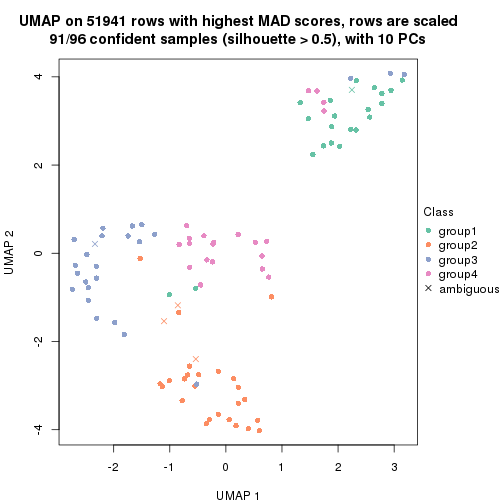</p>

</div>
<div id='tab-MAD-skmeans-dimension-reduction-4'>
<pre><code class="r">dimension_reduction(res, k = 5, method = &quot;UMAP&quot;)
</code></pre>

<p></p>

</div>
<div id='tab-MAD-skmeans-dimension-reduction-5'>
<pre><code class="r">dimension_reduction(res, k = 6, method = &quot;UMAP&quot;)
</code></pre>

<p></p>

</div>
</div>


Following heatmap shows how subgroups are split when increasing `k`:

```r
collect_classes(res)
```


Test correlation between subgroups and known annotations. If the known
annotation is numeric, one-way ANOVA test is applied, and if the known
annotation is discrete, chi-squared contingency table test is applied.

```r
test_to_known_factors(res)
```

```
#>              n disease.state(p) k
#> MAD:skmeans 91          0.32171 2
#> MAD:skmeans 95          0.01400 3
#> MAD:skmeans 91          0.00951 4
#> MAD:skmeans 60          0.04834 5
#> MAD:skmeans 48          0.16981 6
```


If matrix rows can be associated to genes, consider to use `functional_enrichment(res,
...)` to perform function enrichment for the signature genes. See [this vignette](http://bioconductor.org/packages/devel/bioc/vignettes/cola/inst/doc/functional_enrichment.html) for more detailed explanations.


 

---------------------------------------------------


### MAD:pam


The object with results only for a single top-value method and a single partition method 
can be extracted as:

```r
res = res_list["MAD", "pam"]
# you can also extract it by
# res = res_list["MAD:pam"]
```

A summary of `res` and all the functions that can be applied to it:

```r
res
```

```
#> A 'ConsensusPartition' object with k = 2, 3, 4, 5, 6.
#>   On a matrix with 51941 rows and 96 columns.
#>   Top rows (1000, 2000, 3000, 4000, 5000) are extracted by 'MAD' method.
#>   Subgroups are detected by 'pam' method.
#>   Performed in total 1250 partitions by row resampling.
#>   Best k for subgroups seems to be 2.
#> 
#> Following methods can be applied to this 'ConsensusPartition' object:
#>  [1] "cola_report"             "collect_classes"         "collect_plots"          
#>  [4] "collect_stats"           "colnames"                "compare_signatures"     
#>  [7] "consensus_heatmap"       "dimension_reduction"     "functional_enrichment"  
#> [10] "get_anno_col"            "get_anno"                "get_classes"            
#> [13] "get_consensus"           "get_matrix"              "get_membership"         
#> [16] "get_param"               "get_signatures"          "get_stats"              
#> [19] "is_best_k"               "is_stable_k"             "membership_heatmap"     
#> [22] "ncol"                    "nrow"                    "plot_ecdf"              
#> [25] "rownames"                "select_partition_number" "show"                   
#> [28] "suggest_best_k"          "test_to_known_factors"
```

`collect_plots()` function collects all the plots made from `res` for all `k` (number of partitions)
into one single page to provide an easy and fast comparison between different `k`.

```r
collect_plots(res)
```


The plots are:

- The first row: a plot of the ECDF (empirical cumulative distribution
  function) curves of the consensus matrix for each `k` and the heatmap of
  predicted classes for each `k`.
- The second row: heatmaps of the consensus matrix for each `k`.
- The third row: heatmaps of the membership matrix for each `k`.
- The fouth row: heatmaps of the signatures for each `k`.

All the plots in panels can be made by individual functions and they are
plotted later in this section.

`select_partition_number()` produces several plots showing different
statistics for choosing "optimized" `k`. There are following statistics:

- ECDF curves of the consensus matrix for each `k`;
- 1-PAC. [The PAC
  score](https://en.wikipedia.org/wiki/Consensus_clustering#Over-interpretation_potential_of_consensus_clustering)
  measures the proportion of the ambiguous subgrouping.
- Mean silhouette score.
- Concordance. The mean probability of fiting the consensus class ids in all
  partitions.
- Area increased. Denote $A_k$ as the area under the ECDF curve for current
  `k`, the area increased is defined as $A_k - A_{k-1}$.
- Rand index. The percent of pairs of samples that are both in a same cluster
  or both are not in a same cluster in the partition of k and k-1.
- Jaccard index. The ratio of pairs of samples are both in a same cluster in
  the partition of k and k-1 and the pairs of samples are both in a same
  cluster in the partition k or k-1.

The detailed explanations of these statistics can be found in [the _cola_
vignette](http://bioconductor.org/packages/devel/bioc/vignettes/cola/inst/doc/cola.html#toc_13).

Generally speaking, lower PAC score, higher mean silhouette score or higher
concordance corresponds to better partition. Rand index and Jaccard index
measure how similar the current partition is compared to partition with `k-1`.
If they are too similar, we won't accept `k` is better than `k-1`.

```r
select_partition_number(res)
```


The numeric values for all these statistics can be obtained by `get_stats()`.

```r
get_stats(res)
```

```
#>   k 1-PAC mean_silhouette concordance area_increased  Rand Jaccard
#> 2 2 0.531           0.830       0.890         0.4565 0.558   0.558
#> 3 3 0.638           0.716       0.835         0.4352 0.772   0.596
#> 4 4 0.567           0.477       0.728         0.1252 0.766   0.438
#> 5 5 0.715           0.723       0.846         0.0727 0.778   0.354
#> 6 6 0.776           0.739       0.867         0.0441 0.950   0.772
```

`suggest_best_k()` suggests the best $k$ based on these statistics. The rules are as follows:

- All $k$ with Jaccard index larger than 0.95 are removed because increasing
  $k$ does not provide enough extra information. If all $k$ are removed, it is
  marked as no subgroup is detected.
- For all $k$ with 1-PAC score larger than 0.9, the maximal $k$ is taken as
  the best $k$, and other $k$ are marked as optional $k$.
- If it does not fit the second rule. The $k$ with the maximal vote of the
  highest 1-PAC score, highest mean silhouette, and highest concordance is
  taken as the best $k$.

```r
suggest_best_k(res)
```

```
#> [1] 2
```


Following shows the table of the partitions (You need to click the **show/hide
code output** link to see it). The membership matrix (columns with name `p*`)
is inferred by
[`clue::cl_consensus()`](https://www.rdocumentation.org/link/cl_consensus?package=clue)
function with the `SE` method. Basically the value in the membership matrix
represents the probability to belong to a certain group. The finall class
label for an item is determined with the group with highest probability it
belongs to.

In `get_classes()` function, the entropy is calculated from the membership
matrix and the silhouette score is calculated from the consensus matrix.


<script>
$( function() {
	$( '#tabs-MAD-pam-get-classes' ).tabs();
} );
</script>
<div id='tabs-MAD-pam-get-classes'>
<ul>
<li><a href='#tab-MAD-pam-get-classes-1'>k = 2</a></li>
<li><a href='#tab-MAD-pam-get-classes-2'>k = 3</a></li>
<li><a href='#tab-MAD-pam-get-classes-3'>k = 4</a></li>
<li><a href='#tab-MAD-pam-get-classes-4'>k = 5</a></li>
<li><a href='#tab-MAD-pam-get-classes-5'>k = 6</a></li>
</ul>

<div id='tab-MAD-pam-get-classes-1'>
<p><a id='tab-MAD-pam-get-classes-1-a' style='color:#0366d6' href='#'>show/hide code output</a></p>
<pre><code class="r">cbind(get_classes(res, k = 2), get_membership(res, k = 2))
</code></pre>

<pre><code>#&gt;           class entropy silhouette    p1    p2
#&gt; GSM531600     2  0.0000      0.872 0.000 1.000
#&gt; GSM531601     2  0.3274      0.862 0.060 0.940
#&gt; GSM531605     1  0.7883      0.809 0.764 0.236
#&gt; GSM531615     2  0.8207      0.784 0.256 0.744
#&gt; GSM531617     2  0.8207      0.784 0.256 0.744
#&gt; GSM531624     2  0.3274      0.862 0.060 0.940
#&gt; GSM531627     2  0.0000      0.872 0.000 1.000
#&gt; GSM531629     2  0.8207      0.784 0.256 0.744
#&gt; GSM531631     2  0.0000      0.872 0.000 1.000
#&gt; GSM531634     2  0.3274      0.862 0.060 0.940
#&gt; GSM531636     2  0.0000      0.872 0.000 1.000
#&gt; GSM531637     2  0.0000      0.872 0.000 1.000
#&gt; GSM531654     2  0.8443      0.769 0.272 0.728
#&gt; GSM531655     2  0.0000      0.872 0.000 1.000
#&gt; GSM531658     2  0.8207      0.784 0.256 0.744
#&gt; GSM531660     2  0.8608      0.757 0.284 0.716
#&gt; GSM531602     1  0.0000      0.848 1.000 0.000
#&gt; GSM531603     1  0.1184      0.840 0.984 0.016
#&gt; GSM531604     1  0.2043      0.847 0.968 0.032
#&gt; GSM531606     1  0.0000      0.848 1.000 0.000
#&gt; GSM531607     1  0.0000      0.848 1.000 0.000
#&gt; GSM531608     2  0.8207      0.784 0.256 0.744
#&gt; GSM531609     2  0.8207      0.784 0.256 0.744
#&gt; GSM531610     2  0.8207      0.784 0.256 0.744
#&gt; GSM531611     2  0.8207      0.784 0.256 0.744
#&gt; GSM531612     2  0.8207      0.784 0.256 0.744
#&gt; GSM531613     2  0.9710      0.589 0.400 0.600
#&gt; GSM531614     2  0.8207      0.784 0.256 0.744
#&gt; GSM531616     2  0.0000      0.872 0.000 1.000
#&gt; GSM531618     2  0.8207      0.784 0.256 0.744
#&gt; GSM531619     2  0.0000      0.872 0.000 1.000
#&gt; GSM531620     2  0.0000      0.872 0.000 1.000
#&gt; GSM531621     2  0.0000      0.872 0.000 1.000
#&gt; GSM531622     2  0.2948      0.864 0.052 0.948
#&gt; GSM531623     2  0.0000      0.872 0.000 1.000
#&gt; GSM531625     2  0.0000      0.872 0.000 1.000
#&gt; GSM531626     2  0.0000      0.872 0.000 1.000
#&gt; GSM531628     2  0.0000      0.872 0.000 1.000
#&gt; GSM531630     2  0.0000      0.872 0.000 1.000
#&gt; GSM531632     2  0.0000      0.872 0.000 1.000
#&gt; GSM531633     2  0.0000      0.872 0.000 1.000
#&gt; GSM531635     2  0.0000      0.872 0.000 1.000
#&gt; GSM531638     2  0.0000      0.872 0.000 1.000
#&gt; GSM531639     2  0.0000      0.872 0.000 1.000
#&gt; GSM531640     2  0.0376      0.872 0.004 0.996
#&gt; GSM531641     2  0.8207      0.784 0.256 0.744
#&gt; GSM531642     2  0.0000      0.872 0.000 1.000
#&gt; GSM531643     2  0.0000      0.872 0.000 1.000
#&gt; GSM531644     2  0.1843      0.869 0.028 0.972
#&gt; GSM531645     2  0.8207      0.784 0.256 0.744
#&gt; GSM531646     2  0.0000      0.872 0.000 1.000
#&gt; GSM531647     2  0.0000      0.872 0.000 1.000
#&gt; GSM531648     2  0.8207      0.784 0.256 0.744
#&gt; GSM531649     2  0.0000      0.872 0.000 1.000
#&gt; GSM531650     2  0.0000      0.872 0.000 1.000
#&gt; GSM531651     2  0.0000      0.872 0.000 1.000
#&gt; GSM531652     2  0.7139      0.810 0.196 0.804
#&gt; GSM531653     2  0.0000      0.872 0.000 1.000
#&gt; GSM531656     2  0.0000      0.872 0.000 1.000
#&gt; GSM531657     2  0.8207      0.784 0.256 0.744
#&gt; GSM531659     2  0.8207      0.784 0.256 0.744
#&gt; GSM531661     2  0.0000      0.872 0.000 1.000
#&gt; GSM531662     2  0.1843      0.869 0.028 0.972
#&gt; GSM531663     2  0.8386      0.773 0.268 0.732
#&gt; GSM531664     1  0.9129      0.732 0.672 0.328
#&gt; GSM531665     1  0.4298      0.836 0.912 0.088
#&gt; GSM531666     2  0.0376      0.872 0.004 0.996
#&gt; GSM531667     2  0.8144      0.785 0.252 0.748
#&gt; GSM531668     2  0.8207      0.784 0.256 0.744
#&gt; GSM531669     1  0.8955      0.753 0.688 0.312
#&gt; GSM531670     2  0.3584      0.810 0.068 0.932
#&gt; GSM531671     2  0.2043      0.865 0.032 0.968
#&gt; GSM531672     2  0.8207      0.784 0.256 0.744
#&gt; GSM531673     2  0.2423      0.867 0.040 0.960
#&gt; GSM531674     1  0.8608      0.782 0.716 0.284
#&gt; GSM531675     1  0.0000      0.848 1.000 0.000
#&gt; GSM531676     1  0.8207      0.800 0.744 0.256
#&gt; GSM531677     1  0.0000      0.848 1.000 0.000
#&gt; GSM531678     1  0.0672      0.848 0.992 0.008
#&gt; GSM531679     1  0.0000      0.848 1.000 0.000
#&gt; GSM531680     1  0.8207      0.800 0.744 0.256
#&gt; GSM531681     1  0.0000      0.848 1.000 0.000
#&gt; GSM531682     1  0.0000      0.848 1.000 0.000
#&gt; GSM531683     1  0.0000      0.848 1.000 0.000
#&gt; GSM531684     1  0.0000      0.848 1.000 0.000
#&gt; GSM531685     1  0.8207      0.800 0.744 0.256
#&gt; GSM531686     1  0.0000      0.848 1.000 0.000
#&gt; GSM531687     1  0.8608      0.782 0.716 0.284
#&gt; GSM531688     1  0.8207      0.800 0.744 0.256
#&gt; GSM531689     1  0.7376      0.817 0.792 0.208
#&gt; GSM531690     1  0.0000      0.848 1.000 0.000
#&gt; GSM531691     1  0.8207      0.800 0.744 0.256
#&gt; GSM531692     1  0.8207      0.800 0.744 0.256
#&gt; GSM531693     1  0.8608      0.782 0.716 0.284
#&gt; GSM531694     1  0.0000      0.848 1.000 0.000
#&gt; GSM531695     1  0.8144      0.802 0.748 0.252
</code></pre>

<script>
$('#tab-MAD-pam-get-classes-1-a').parent().next().next().hide();
$('#tab-MAD-pam-get-classes-1-a').click(function(){
  $('#tab-MAD-pam-get-classes-1-a').parent().next().next().toggle();
  return(false);
});
</script>
</div>

<div id='tab-MAD-pam-get-classes-2'>
<p><a id='tab-MAD-pam-get-classes-2-a' style='color:#0366d6' href='#'>show/hide code output</a></p>
<pre><code class="r">cbind(get_classes(res, k = 3), get_membership(res, k = 3))
</code></pre>

<pre><code>#&gt;           class entropy silhouette    p1    p2    p3
#&gt; GSM531600     3  0.5859     0.6599 0.344 0.000 0.656
#&gt; GSM531601     3  0.5859     0.4752 0.000 0.344 0.656
#&gt; GSM531605     1  0.5859     0.7550 0.656 0.000 0.344
#&gt; GSM531615     2  0.0000     0.8839 0.000 1.000 0.000
#&gt; GSM531617     2  0.6299     0.2496 0.000 0.524 0.476
#&gt; GSM531624     2  0.0000     0.8839 0.000 1.000 0.000
#&gt; GSM531627     2  0.0000     0.8839 0.000 1.000 0.000
#&gt; GSM531629     3  0.0000     0.7615 0.000 0.000 1.000
#&gt; GSM531631     2  0.0000     0.8839 0.000 1.000 0.000
#&gt; GSM531634     2  0.0000     0.8839 0.000 1.000 0.000
#&gt; GSM531636     3  0.7906     0.6521 0.220 0.124 0.656
#&gt; GSM531637     2  0.0000     0.8839 0.000 1.000 0.000
#&gt; GSM531654     2  0.5859     0.4790 0.000 0.656 0.344
#&gt; GSM531655     3  0.0000     0.7615 0.000 0.000 1.000
#&gt; GSM531658     3  0.0000     0.7615 0.000 0.000 1.000
#&gt; GSM531660     3  0.0747     0.7470 0.016 0.000 0.984
#&gt; GSM531602     1  0.5859     0.7550 0.656 0.000 0.344
#&gt; GSM531603     1  0.5905     0.7476 0.648 0.000 0.352
#&gt; GSM531604     1  0.5859     0.7550 0.656 0.000 0.344
#&gt; GSM531606     1  0.5859     0.7550 0.656 0.000 0.344
#&gt; GSM531607     1  0.5859     0.7550 0.656 0.000 0.344
#&gt; GSM531608     2  0.0000     0.8839 0.000 1.000 0.000
#&gt; GSM531609     3  0.0000     0.7615 0.000 0.000 1.000
#&gt; GSM531610     3  0.0000     0.7615 0.000 0.000 1.000
#&gt; GSM531611     3  0.0000     0.7615 0.000 0.000 1.000
#&gt; GSM531612     3  0.0000     0.7615 0.000 0.000 1.000
#&gt; GSM531613     3  0.3038     0.6371 0.104 0.000 0.896
#&gt; GSM531614     3  0.0000     0.7615 0.000 0.000 1.000
#&gt; GSM531616     2  0.6244     0.1028 0.000 0.560 0.440
#&gt; GSM531618     3  0.0000     0.7615 0.000 0.000 1.000
#&gt; GSM531619     2  0.0000     0.8839 0.000 1.000 0.000
#&gt; GSM531620     2  0.0000     0.8839 0.000 1.000 0.000
#&gt; GSM531621     2  0.0000     0.8839 0.000 1.000 0.000
#&gt; GSM531622     2  0.0000     0.8839 0.000 1.000 0.000
#&gt; GSM531623     2  0.0000     0.8839 0.000 1.000 0.000
#&gt; GSM531625     2  0.0000     0.8839 0.000 1.000 0.000
#&gt; GSM531626     2  0.5058     0.5915 0.000 0.756 0.244
#&gt; GSM531628     3  0.5859     0.6599 0.344 0.000 0.656
#&gt; GSM531630     2  0.0000     0.8839 0.000 1.000 0.000
#&gt; GSM531632     3  0.5859     0.6599 0.344 0.000 0.656
#&gt; GSM531633     2  0.0000     0.8839 0.000 1.000 0.000
#&gt; GSM531635     3  0.5859     0.6599 0.344 0.000 0.656
#&gt; GSM531638     3  0.5859     0.4752 0.000 0.344 0.656
#&gt; GSM531639     3  0.5859     0.4752 0.000 0.344 0.656
#&gt; GSM531640     3  0.5859     0.4752 0.000 0.344 0.656
#&gt; GSM531641     3  0.0000     0.7615 0.000 0.000 1.000
#&gt; GSM531642     3  0.0000     0.7615 0.000 0.000 1.000
#&gt; GSM531643     3  0.5859     0.6599 0.344 0.000 0.656
#&gt; GSM531644     3  0.5859     0.6599 0.344 0.000 0.656
#&gt; GSM531645     3  0.0000     0.7615 0.000 0.000 1.000
#&gt; GSM531646     3  0.5859     0.6599 0.344 0.000 0.656
#&gt; GSM531647     3  0.5859     0.6599 0.344 0.000 0.656
#&gt; GSM531648     3  0.0000     0.7615 0.000 0.000 1.000
#&gt; GSM531649     3  0.5859     0.6599 0.344 0.000 0.656
#&gt; GSM531650     3  0.5859     0.6599 0.344 0.000 0.656
#&gt; GSM531651     2  0.0000     0.8839 0.000 1.000 0.000
#&gt; GSM531652     3  0.0000     0.7615 0.000 0.000 1.000
#&gt; GSM531653     3  0.5859     0.6599 0.344 0.000 0.656
#&gt; GSM531656     3  0.5859     0.6599 0.344 0.000 0.656
#&gt; GSM531657     3  0.0000     0.7615 0.000 0.000 1.000
#&gt; GSM531659     3  0.0000     0.7615 0.000 0.000 1.000
#&gt; GSM531661     2  0.0000     0.8839 0.000 1.000 0.000
#&gt; GSM531662     2  0.0000     0.8839 0.000 1.000 0.000
#&gt; GSM531663     3  0.0424     0.7545 0.008 0.000 0.992
#&gt; GSM531664     1  0.2066     0.6785 0.940 0.000 0.060
#&gt; GSM531665     1  0.0892     0.7216 0.980 0.000 0.020
#&gt; GSM531666     3  0.2625     0.7443 0.084 0.000 0.916
#&gt; GSM531667     3  0.5926     0.2030 0.000 0.356 0.644
#&gt; GSM531668     3  0.0000     0.7615 0.000 0.000 1.000
#&gt; GSM531669     1  0.1643     0.6958 0.956 0.000 0.044
#&gt; GSM531670     3  0.5948     0.6433 0.360 0.000 0.640
#&gt; GSM531671     2  0.9816     0.0472 0.356 0.400 0.244
#&gt; GSM531672     3  0.0000     0.7615 0.000 0.000 1.000
#&gt; GSM531673     2  0.6062     0.4331 0.000 0.616 0.384
#&gt; GSM531674     1  0.0747     0.7193 0.984 0.000 0.016
#&gt; GSM531675     1  0.5859     0.7550 0.656 0.000 0.344
#&gt; GSM531676     1  0.0000     0.7263 1.000 0.000 0.000
#&gt; GSM531677     1  0.5859     0.7550 0.656 0.000 0.344
#&gt; GSM531678     1  0.5859     0.7550 0.656 0.000 0.344
#&gt; GSM531679     1  0.5859     0.7550 0.656 0.000 0.344
#&gt; GSM531680     1  0.0000     0.7263 1.000 0.000 0.000
#&gt; GSM531681     1  0.5859     0.7550 0.656 0.000 0.344
#&gt; GSM531682     1  0.5859     0.7550 0.656 0.000 0.344
#&gt; GSM531683     1  0.5859     0.7550 0.656 0.000 0.344
#&gt; GSM531684     2  0.0000     0.8839 0.000 1.000 0.000
#&gt; GSM531685     1  0.0000     0.7263 1.000 0.000 0.000
#&gt; GSM531686     1  0.5859     0.7550 0.656 0.000 0.344
#&gt; GSM531687     1  0.0747     0.7193 0.984 0.000 0.016
#&gt; GSM531688     1  0.0000     0.7263 1.000 0.000 0.000
#&gt; GSM531689     1  0.0424     0.7293 0.992 0.000 0.008
#&gt; GSM531690     1  0.5859     0.7550 0.656 0.000 0.344
#&gt; GSM531691     1  0.0237     0.7281 0.996 0.000 0.004
#&gt; GSM531692     1  0.1031     0.7234 0.976 0.024 0.000
#&gt; GSM531693     1  0.0747     0.7193 0.984 0.000 0.016
#&gt; GSM531694     1  0.5859     0.7550 0.656 0.000 0.344
#&gt; GSM531695     1  0.0000     0.7263 1.000 0.000 0.000
</code></pre>

<script>
$('#tab-MAD-pam-get-classes-2-a').parent().next().next().hide();
$('#tab-MAD-pam-get-classes-2-a').click(function(){
  $('#tab-MAD-pam-get-classes-2-a').parent().next().next().toggle();
  return(false);
});
</script>
</div>

<div id='tab-MAD-pam-get-classes-3'>
<p><a id='tab-MAD-pam-get-classes-3-a' style='color:#0366d6' href='#'>show/hide code output</a></p>
<pre><code class="r">cbind(get_classes(res, k = 4), get_membership(res, k = 4))
</code></pre>

<pre><code>#&gt;           class entropy silhouette    p1    p2    p3    p4
#&gt; GSM531600     3  0.4996      0.372 0.484 0.000 0.516 0.000
#&gt; GSM531601     3  0.6400      0.205 0.000 0.408 0.524 0.068
#&gt; GSM531605     1  0.4781      0.497 0.660 0.000 0.004 0.336
#&gt; GSM531615     2  0.0000      0.894 0.000 1.000 0.000 0.000
#&gt; GSM531617     4  0.6520      0.301 0.000 0.384 0.080 0.536
#&gt; GSM531624     2  0.0000      0.894 0.000 1.000 0.000 0.000
#&gt; GSM531627     2  0.0000      0.894 0.000 1.000 0.000 0.000
#&gt; GSM531629     4  0.4977      0.427 0.000 0.000 0.460 0.540
#&gt; GSM531631     2  0.0000      0.894 0.000 1.000 0.000 0.000
#&gt; GSM531634     2  0.0000      0.894 0.000 1.000 0.000 0.000
#&gt; GSM531636     3  0.3726      0.525 0.212 0.000 0.788 0.000
#&gt; GSM531637     2  0.0000      0.894 0.000 1.000 0.000 0.000
#&gt; GSM531654     4  0.4981      0.158 0.000 0.464 0.000 0.536
#&gt; GSM531655     3  0.4950      0.448 0.376 0.000 0.620 0.004
#&gt; GSM531658     4  0.4222      0.549 0.000 0.000 0.272 0.728
#&gt; GSM531660     4  0.4977      0.427 0.000 0.000 0.460 0.540
#&gt; GSM531602     4  0.3528      0.473 0.192 0.000 0.000 0.808
#&gt; GSM531603     4  0.7593      0.455 0.300 0.000 0.228 0.472
#&gt; GSM531604     1  0.4817      0.426 0.612 0.000 0.000 0.388
#&gt; GSM531606     4  0.3528      0.473 0.192 0.000 0.000 0.808
#&gt; GSM531607     4  0.4967     -0.103 0.452 0.000 0.000 0.548
#&gt; GSM531608     2  0.0000      0.894 0.000 1.000 0.000 0.000
#&gt; GSM531609     4  0.4250      0.547 0.000 0.000 0.276 0.724
#&gt; GSM531610     4  0.4250      0.547 0.000 0.000 0.276 0.724
#&gt; GSM531611     4  0.7193      0.353 0.152 0.000 0.340 0.508
#&gt; GSM531612     4  0.4624      0.484 0.000 0.000 0.340 0.660
#&gt; GSM531613     4  0.1389      0.555 0.000 0.000 0.048 0.952
#&gt; GSM531614     4  0.4250      0.547 0.000 0.000 0.276 0.724
#&gt; GSM531616     2  0.7784     -0.160 0.252 0.412 0.336 0.000
#&gt; GSM531618     3  0.4992     -0.351 0.000 0.000 0.524 0.476
#&gt; GSM531619     2  0.0000      0.894 0.000 1.000 0.000 0.000
#&gt; GSM531620     2  0.0000      0.894 0.000 1.000 0.000 0.000
#&gt; GSM531621     2  0.0000      0.894 0.000 1.000 0.000 0.000
#&gt; GSM531622     2  0.0000      0.894 0.000 1.000 0.000 0.000
#&gt; GSM531623     2  0.0000      0.894 0.000 1.000 0.000 0.000
#&gt; GSM531625     2  0.0000      0.894 0.000 1.000 0.000 0.000
#&gt; GSM531626     2  0.5448      0.502 0.056 0.700 0.244 0.000
#&gt; GSM531628     3  0.4522      0.282 0.320 0.000 0.680 0.000
#&gt; GSM531630     2  0.0000      0.894 0.000 1.000 0.000 0.000
#&gt; GSM531632     3  0.4624      0.268 0.340 0.000 0.660 0.000
#&gt; GSM531633     2  0.0000      0.894 0.000 1.000 0.000 0.000
#&gt; GSM531635     3  0.4103      0.519 0.256 0.000 0.744 0.000
#&gt; GSM531638     3  0.7500      0.424 0.252 0.248 0.500 0.000
#&gt; GSM531639     3  0.4837      0.473 0.348 0.004 0.648 0.000
#&gt; GSM531640     3  0.6991      0.326 0.128 0.348 0.524 0.000
#&gt; GSM531641     4  0.4250      0.547 0.000 0.000 0.276 0.724
#&gt; GSM531642     3  0.7344      0.186 0.224 0.000 0.528 0.248
#&gt; GSM531643     3  0.0188      0.506 0.004 0.000 0.996 0.000
#&gt; GSM531644     3  0.1022      0.506 0.032 0.000 0.968 0.000
#&gt; GSM531645     4  0.4624      0.484 0.000 0.000 0.340 0.660
#&gt; GSM531646     3  0.4624      0.268 0.340 0.000 0.660 0.000
#&gt; GSM531647     3  0.4624      0.268 0.340 0.000 0.660 0.000
#&gt; GSM531648     4  0.4977      0.427 0.000 0.000 0.460 0.540
#&gt; GSM531649     3  0.4996      0.372 0.484 0.000 0.516 0.000
#&gt; GSM531650     3  0.3907      0.356 0.232 0.000 0.768 0.000
#&gt; GSM531651     2  0.0000      0.894 0.000 1.000 0.000 0.000
#&gt; GSM531652     3  0.3907      0.241 0.000 0.000 0.768 0.232
#&gt; GSM531653     3  0.4624      0.268 0.340 0.000 0.660 0.000
#&gt; GSM531656     3  0.4730      0.463 0.364 0.000 0.636 0.000
#&gt; GSM531657     4  0.4977      0.427 0.000 0.000 0.460 0.540
#&gt; GSM531659     4  0.5147      0.428 0.004 0.000 0.460 0.536
#&gt; GSM531661     2  0.0000      0.894 0.000 1.000 0.000 0.000
#&gt; GSM531662     2  0.0188      0.891 0.004 0.996 0.000 0.000
#&gt; GSM531663     4  0.4222      0.549 0.000 0.000 0.272 0.728
#&gt; GSM531664     1  0.6005      0.297 0.500 0.000 0.460 0.040
#&gt; GSM531665     1  0.2996      0.511 0.892 0.000 0.064 0.044
#&gt; GSM531666     3  0.4741      0.484 0.328 0.000 0.668 0.004
#&gt; GSM531667     2  0.8392     -0.155 0.020 0.376 0.260 0.344
#&gt; GSM531668     4  0.4972      0.431 0.000 0.000 0.456 0.544
#&gt; GSM531669     1  0.4989      0.225 0.528 0.000 0.472 0.000
#&gt; GSM531670     3  0.4992      0.331 0.476 0.000 0.524 0.000
#&gt; GSM531671     3  0.8325      0.170 0.340 0.020 0.400 0.240
#&gt; GSM531672     4  0.4977      0.427 0.000 0.000 0.460 0.540
#&gt; GSM531673     2  0.6777     -0.108 0.080 0.460 0.004 0.456
#&gt; GSM531674     1  0.4981      0.236 0.536 0.000 0.464 0.000
#&gt; GSM531675     4  0.3528      0.473 0.192 0.000 0.000 0.808
#&gt; GSM531676     1  0.4222      0.580 0.728 0.000 0.000 0.272
#&gt; GSM531677     4  0.3528      0.473 0.192 0.000 0.000 0.808
#&gt; GSM531678     4  0.4989     -0.158 0.472 0.000 0.000 0.528
#&gt; GSM531679     4  0.4967     -0.103 0.452 0.000 0.000 0.548
#&gt; GSM531680     1  0.7153      0.594 0.556 0.000 0.196 0.248
#&gt; GSM531681     4  0.0188      0.533 0.000 0.000 0.004 0.996
#&gt; GSM531682     4  0.3528      0.473 0.192 0.000 0.000 0.808
#&gt; GSM531683     4  0.3528      0.473 0.192 0.000 0.000 0.808
#&gt; GSM531684     2  0.0188      0.891 0.000 0.996 0.000 0.004
#&gt; GSM531685     1  0.4914      0.567 0.748 0.000 0.208 0.044
#&gt; GSM531686     4  0.4605      0.221 0.336 0.000 0.000 0.664
#&gt; GSM531687     1  0.5090      0.316 0.728 0.000 0.228 0.044
#&gt; GSM531688     1  0.4914      0.567 0.748 0.000 0.208 0.044
#&gt; GSM531689     1  0.4222      0.580 0.728 0.000 0.000 0.272
#&gt; GSM531690     4  0.3528      0.473 0.192 0.000 0.000 0.808
#&gt; GSM531691     1  0.4222      0.580 0.728 0.000 0.000 0.272
#&gt; GSM531692     1  0.5280      0.511 0.748 0.156 0.000 0.096
#&gt; GSM531693     1  0.3873      0.515 0.772 0.000 0.228 0.000
#&gt; GSM531694     4  0.3528      0.473 0.192 0.000 0.000 0.808
#&gt; GSM531695     1  0.4914      0.567 0.748 0.000 0.208 0.044
</code></pre>

<script>
$('#tab-MAD-pam-get-classes-3-a').parent().next().next().hide();
$('#tab-MAD-pam-get-classes-3-a').click(function(){
  $('#tab-MAD-pam-get-classes-3-a').parent().next().next().toggle();
  return(false);
});
</script>
</div>

<div id='tab-MAD-pam-get-classes-4'>
<p><a id='tab-MAD-pam-get-classes-4-a' style='color:#0366d6' href='#'>show/hide code output</a></p>
<pre><code class="r">cbind(get_classes(res, k = 5), get_membership(res, k = 5))
</code></pre>

<pre><code>#&gt;           class entropy silhouette    p1    p2    p3    p4    p5
#&gt; GSM531600     3  0.3242      0.698 0.000 0.000 0.784 0.000 0.216
#&gt; GSM531601     5  0.3684      0.581 0.000 0.280 0.000 0.000 0.720
#&gt; GSM531605     1  0.3684      0.659 0.720 0.000 0.000 0.000 0.280
#&gt; GSM531615     2  0.0000      0.916 0.000 1.000 0.000 0.000 0.000
#&gt; GSM531617     2  0.6836      0.308 0.280 0.544 0.000 0.052 0.124
#&gt; GSM531624     2  0.0000      0.916 0.000 1.000 0.000 0.000 0.000
#&gt; GSM531627     2  0.0000      0.916 0.000 1.000 0.000 0.000 0.000
#&gt; GSM531629     5  0.4844      0.660 0.280 0.000 0.000 0.052 0.668
#&gt; GSM531631     2  0.0000      0.916 0.000 1.000 0.000 0.000 0.000
#&gt; GSM531634     2  0.0000      0.916 0.000 1.000 0.000 0.000 0.000
#&gt; GSM531636     5  0.1732      0.699 0.000 0.000 0.080 0.000 0.920
#&gt; GSM531637     2  0.0000      0.916 0.000 1.000 0.000 0.000 0.000
#&gt; GSM531654     2  0.4844      0.513 0.280 0.668 0.000 0.052 0.000
#&gt; GSM531655     5  0.0000      0.703 0.000 0.000 0.000 0.000 1.000
#&gt; GSM531658     4  0.3957      0.567 0.280 0.000 0.000 0.712 0.008
#&gt; GSM531660     5  0.5302      0.486 0.412 0.000 0.000 0.052 0.536
#&gt; GSM531602     1  0.1270      0.781 0.948 0.000 0.000 0.052 0.000
#&gt; GSM531603     5  0.5314      0.492 0.420 0.000 0.000 0.052 0.528
#&gt; GSM531604     1  0.3424      0.693 0.760 0.000 0.000 0.000 0.240
#&gt; GSM531606     1  0.1270      0.781 0.948 0.000 0.000 0.052 0.000
#&gt; GSM531607     1  0.1732      0.772 0.920 0.000 0.000 0.000 0.080
#&gt; GSM531608     2  0.0000      0.916 0.000 1.000 0.000 0.000 0.000
#&gt; GSM531609     4  0.0000      0.886 0.000 0.000 0.000 1.000 0.000
#&gt; GSM531610     4  0.0000      0.886 0.000 0.000 0.000 1.000 0.000
#&gt; GSM531611     4  0.1430      0.863 0.004 0.000 0.000 0.944 0.052
#&gt; GSM531612     4  0.1270      0.862 0.000 0.000 0.000 0.948 0.052
#&gt; GSM531613     4  0.0000      0.886 0.000 0.000 0.000 1.000 0.000
#&gt; GSM531614     4  0.0000      0.886 0.000 0.000 0.000 1.000 0.000
#&gt; GSM531616     5  0.5752      0.445 0.000 0.240 0.148 0.000 0.612
#&gt; GSM531618     5  0.3684      0.682 0.280 0.000 0.000 0.000 0.720
#&gt; GSM531619     2  0.0000      0.916 0.000 1.000 0.000 0.000 0.000
#&gt; GSM531620     2  0.0000      0.916 0.000 1.000 0.000 0.000 0.000
#&gt; GSM531621     2  0.0000      0.916 0.000 1.000 0.000 0.000 0.000
#&gt; GSM531622     2  0.0000      0.916 0.000 1.000 0.000 0.000 0.000
#&gt; GSM531623     2  0.0000      0.916 0.000 1.000 0.000 0.000 0.000
#&gt; GSM531625     2  0.0000      0.916 0.000 1.000 0.000 0.000 0.000
#&gt; GSM531626     2  0.5991      0.302 0.000 0.564 0.148 0.000 0.288
#&gt; GSM531628     3  0.1043      0.814 0.000 0.000 0.960 0.000 0.040
#&gt; GSM531630     2  0.0000      0.916 0.000 1.000 0.000 0.000 0.000
#&gt; GSM531632     3  0.0000      0.823 0.000 0.000 1.000 0.000 0.000
#&gt; GSM531633     2  0.0000      0.916 0.000 1.000 0.000 0.000 0.000
#&gt; GSM531635     5  0.3274      0.601 0.000 0.000 0.220 0.000 0.780
#&gt; GSM531638     5  0.3953      0.630 0.000 0.060 0.148 0.000 0.792
#&gt; GSM531639     5  0.0162      0.704 0.000 0.000 0.004 0.000 0.996
#&gt; GSM531640     5  0.2732      0.672 0.000 0.160 0.000 0.000 0.840
#&gt; GSM531641     4  0.0000      0.886 0.000 0.000 0.000 1.000 0.000
#&gt; GSM531642     5  0.1608      0.718 0.072 0.000 0.000 0.000 0.928
#&gt; GSM531643     5  0.3707      0.579 0.000 0.000 0.284 0.000 0.716
#&gt; GSM531644     5  0.3561      0.592 0.000 0.000 0.260 0.000 0.740
#&gt; GSM531645     4  0.1270      0.862 0.000 0.000 0.000 0.948 0.052
#&gt; GSM531646     3  0.0000      0.823 0.000 0.000 1.000 0.000 0.000
#&gt; GSM531647     3  0.0000      0.823 0.000 0.000 1.000 0.000 0.000
#&gt; GSM531648     5  0.4844      0.660 0.280 0.000 0.000 0.052 0.668
#&gt; GSM531649     3  0.3109      0.705 0.000 0.000 0.800 0.000 0.200
#&gt; GSM531650     3  0.2377      0.761 0.000 0.000 0.872 0.000 0.128
#&gt; GSM531651     2  0.0000      0.916 0.000 1.000 0.000 0.000 0.000
#&gt; GSM531652     5  0.4588      0.695 0.220 0.000 0.060 0.000 0.720
#&gt; GSM531653     3  0.0000      0.823 0.000 0.000 1.000 0.000 0.000
#&gt; GSM531656     5  0.0000      0.703 0.000 0.000 0.000 0.000 1.000
#&gt; GSM531657     5  0.4844      0.660 0.280 0.000 0.000 0.052 0.668
#&gt; GSM531659     5  0.4844      0.660 0.280 0.000 0.000 0.052 0.668
#&gt; GSM531661     2  0.0000      0.916 0.000 1.000 0.000 0.000 0.000
#&gt; GSM531662     2  0.0162      0.913 0.000 0.996 0.000 0.000 0.004
#&gt; GSM531663     4  0.5083      0.508 0.280 0.000 0.000 0.652 0.068
#&gt; GSM531664     3  0.3051      0.779 0.120 0.000 0.852 0.000 0.028
#&gt; GSM531665     3  0.6460      0.352 0.180 0.000 0.416 0.000 0.404
#&gt; GSM531666     5  0.0000      0.703 0.000 0.000 0.000 0.000 1.000
#&gt; GSM531667     5  0.6744      0.242 0.260 0.356 0.000 0.000 0.384
#&gt; GSM531668     5  0.5778      0.611 0.280 0.000 0.000 0.128 0.592
#&gt; GSM531669     3  0.0000      0.823 0.000 0.000 1.000 0.000 0.000
#&gt; GSM531670     5  0.0404      0.699 0.012 0.000 0.000 0.000 0.988
#&gt; GSM531671     3  0.1410      0.800 0.060 0.000 0.940 0.000 0.000
#&gt; GSM531672     5  0.4844      0.660 0.280 0.000 0.000 0.052 0.668
#&gt; GSM531673     2  0.6651      0.447 0.200 0.596 0.000 0.052 0.152
#&gt; GSM531674     3  0.0162      0.824 0.000 0.000 0.996 0.000 0.004
#&gt; GSM531675     1  0.1270      0.781 0.948 0.000 0.000 0.052 0.000
#&gt; GSM531676     1  0.6115      0.424 0.552 0.000 0.168 0.000 0.280
#&gt; GSM531677     1  0.1270      0.781 0.948 0.000 0.000 0.052 0.000
#&gt; GSM531678     1  0.2020      0.767 0.900 0.000 0.000 0.000 0.100
#&gt; GSM531679     1  0.1732      0.772 0.920 0.000 0.000 0.000 0.080
#&gt; GSM531680     3  0.6158      0.260 0.384 0.000 0.480 0.000 0.136
#&gt; GSM531681     1  0.4227      0.306 0.580 0.000 0.000 0.420 0.000
#&gt; GSM531682     1  0.1270      0.781 0.948 0.000 0.000 0.052 0.000
#&gt; GSM531683     1  0.1270      0.781 0.948 0.000 0.000 0.052 0.000
#&gt; GSM531684     2  0.0566      0.903 0.012 0.984 0.000 0.004 0.000
#&gt; GSM531685     3  0.4558      0.708 0.180 0.000 0.740 0.000 0.080
#&gt; GSM531686     1  0.1043      0.781 0.960 0.000 0.000 0.040 0.000
#&gt; GSM531687     5  0.2929      0.536 0.180 0.000 0.000 0.000 0.820
#&gt; GSM531688     3  0.4038      0.745 0.128 0.000 0.792 0.000 0.080
#&gt; GSM531689     1  0.3684      0.659 0.720 0.000 0.000 0.000 0.280
#&gt; GSM531690     1  0.1270      0.781 0.948 0.000 0.000 0.052 0.000
#&gt; GSM531691     1  0.3684      0.659 0.720 0.000 0.000 0.000 0.280
#&gt; GSM531692     1  0.6726      0.506 0.544 0.140 0.036 0.000 0.280
#&gt; GSM531693     3  0.1410      0.816 0.000 0.000 0.940 0.000 0.060
#&gt; GSM531694     1  0.1270      0.781 0.948 0.000 0.000 0.052 0.000
#&gt; GSM531695     3  0.4558      0.708 0.180 0.000 0.740 0.000 0.080
</code></pre>

<script>
$('#tab-MAD-pam-get-classes-4-a').parent().next().next().hide();
$('#tab-MAD-pam-get-classes-4-a').click(function(){
  $('#tab-MAD-pam-get-classes-4-a').parent().next().next().toggle();
  return(false);
});
</script>
</div>

<div id='tab-MAD-pam-get-classes-5'>
<p><a id='tab-MAD-pam-get-classes-5-a' style='color:#0366d6' href='#'>show/hide code output</a></p>
<pre><code class="r">cbind(get_classes(res, k = 6), get_membership(res, k = 6))
</code></pre>

<pre><code>#&gt;           class entropy silhouette    p1    p2    p3    p4    p5    p6
#&gt; GSM531600     6  0.2793     0.7400 0.000 0.000 0.200 0.000 0.000 0.800
#&gt; GSM531601     3  0.2871     0.6743 0.000 0.192 0.804 0.000 0.004 0.000
#&gt; GSM531605     5  0.0000     0.7866 0.000 0.000 0.000 0.000 1.000 0.000
#&gt; GSM531615     2  0.0000     0.8979 0.000 1.000 0.000 0.000 0.000 0.000
#&gt; GSM531617     2  0.5339     0.1694 0.404 0.488 0.108 0.000 0.000 0.000
#&gt; GSM531624     2  0.0000     0.8979 0.000 1.000 0.000 0.000 0.000 0.000
#&gt; GSM531627     2  0.0000     0.8979 0.000 1.000 0.000 0.000 0.000 0.000
#&gt; GSM531629     3  0.3765     0.5584 0.404 0.000 0.596 0.000 0.000 0.000
#&gt; GSM531631     2  0.0000     0.8979 0.000 1.000 0.000 0.000 0.000 0.000
#&gt; GSM531634     2  0.0000     0.8979 0.000 1.000 0.000 0.000 0.000 0.000
#&gt; GSM531636     3  0.0000     0.7397 0.000 0.000 1.000 0.000 0.000 0.000
#&gt; GSM531637     2  0.0000     0.8979 0.000 1.000 0.000 0.000 0.000 0.000
#&gt; GSM531654     2  0.5296     0.4614 0.236 0.596 0.000 0.000 0.168 0.000
#&gt; GSM531655     3  0.0000     0.7397 0.000 0.000 1.000 0.000 0.000 0.000
#&gt; GSM531658     4  0.3993     0.3353 0.400 0.000 0.008 0.592 0.000 0.000
#&gt; GSM531660     3  0.3774     0.5528 0.408 0.000 0.592 0.000 0.000 0.000
#&gt; GSM531602     1  0.2664     0.7596 0.816 0.000 0.000 0.000 0.184 0.000
#&gt; GSM531603     5  0.3607     0.3231 0.348 0.000 0.000 0.000 0.652 0.000
#&gt; GSM531604     1  0.3765     0.4817 0.596 0.000 0.000 0.000 0.404 0.000
#&gt; GSM531606     1  0.2823     0.7434 0.796 0.000 0.000 0.000 0.204 0.000
#&gt; GSM531607     1  0.3774     0.4745 0.592 0.000 0.000 0.000 0.408 0.000
#&gt; GSM531608     2  0.0000     0.8979 0.000 1.000 0.000 0.000 0.000 0.000
#&gt; GSM531609     4  0.0000     0.8814 0.000 0.000 0.000 1.000 0.000 0.000
#&gt; GSM531610     4  0.0000     0.8814 0.000 0.000 0.000 1.000 0.000 0.000
#&gt; GSM531611     4  0.0146     0.8785 0.004 0.000 0.000 0.996 0.000 0.000
#&gt; GSM531612     4  0.0000     0.8814 0.000 0.000 0.000 1.000 0.000 0.000
#&gt; GSM531613     4  0.0000     0.8814 0.000 0.000 0.000 1.000 0.000 0.000
#&gt; GSM531614     4  0.0000     0.8814 0.000 0.000 0.000 1.000 0.000 0.000
#&gt; GSM531616     3  0.4687     0.4905 0.000 0.180 0.684 0.000 0.000 0.136
#&gt; GSM531618     3  0.2664     0.7108 0.184 0.000 0.816 0.000 0.000 0.000
#&gt; GSM531619     2  0.0000     0.8979 0.000 1.000 0.000 0.000 0.000 0.000
#&gt; GSM531620     2  0.0000     0.8979 0.000 1.000 0.000 0.000 0.000 0.000
#&gt; GSM531621     2  0.0000     0.8979 0.000 1.000 0.000 0.000 0.000 0.000
#&gt; GSM531622     2  0.0000     0.8979 0.000 1.000 0.000 0.000 0.000 0.000
#&gt; GSM531623     2  0.0000     0.8979 0.000 1.000 0.000 0.000 0.000 0.000
#&gt; GSM531625     2  0.0000     0.8979 0.000 1.000 0.000 0.000 0.000 0.000
#&gt; GSM531626     2  0.5517     0.0672 0.000 0.472 0.396 0.000 0.000 0.132
#&gt; GSM531628     6  0.0937     0.8818 0.000 0.000 0.040 0.000 0.000 0.960
#&gt; GSM531630     2  0.0000     0.8979 0.000 1.000 0.000 0.000 0.000 0.000
#&gt; GSM531632     6  0.0000     0.9010 0.000 0.000 0.000 0.000 0.000 1.000
#&gt; GSM531633     2  0.0000     0.8979 0.000 1.000 0.000 0.000 0.000 0.000
#&gt; GSM531635     3  0.2260     0.6633 0.000 0.000 0.860 0.000 0.000 0.140
#&gt; GSM531638     3  0.2219     0.6650 0.000 0.000 0.864 0.000 0.000 0.136
#&gt; GSM531639     3  0.0000     0.7397 0.000 0.000 1.000 0.000 0.000 0.000
#&gt; GSM531640     3  0.1444     0.7317 0.000 0.072 0.928 0.000 0.000 0.000
#&gt; GSM531641     4  0.0000     0.8814 0.000 0.000 0.000 1.000 0.000 0.000
#&gt; GSM531642     3  0.0000     0.7397 0.000 0.000 1.000 0.000 0.000 0.000
#&gt; GSM531643     3  0.2597     0.6776 0.000 0.000 0.824 0.000 0.000 0.176
#&gt; GSM531644     3  0.2527     0.6818 0.000 0.000 0.832 0.000 0.000 0.168
#&gt; GSM531645     4  0.0000     0.8814 0.000 0.000 0.000 1.000 0.000 0.000
#&gt; GSM531646     6  0.0000     0.9010 0.000 0.000 0.000 0.000 0.000 1.000
#&gt; GSM531647     6  0.0000     0.9010 0.000 0.000 0.000 0.000 0.000 1.000
#&gt; GSM531648     3  0.3765     0.5584 0.404 0.000 0.596 0.000 0.000 0.000
#&gt; GSM531649     6  0.2597     0.7510 0.000 0.000 0.176 0.000 0.000 0.824
#&gt; GSM531650     6  0.2178     0.7944 0.000 0.000 0.132 0.000 0.000 0.868
#&gt; GSM531651     2  0.0000     0.8979 0.000 1.000 0.000 0.000 0.000 0.000
#&gt; GSM531652     3  0.2527     0.7173 0.168 0.000 0.832 0.000 0.000 0.000
#&gt; GSM531653     6  0.0000     0.9010 0.000 0.000 0.000 0.000 0.000 1.000
#&gt; GSM531656     3  0.0000     0.7397 0.000 0.000 1.000 0.000 0.000 0.000
#&gt; GSM531657     3  0.3765     0.5584 0.404 0.000 0.596 0.000 0.000 0.000
#&gt; GSM531659     3  0.3765     0.5584 0.404 0.000 0.596 0.000 0.000 0.000
#&gt; GSM531661     2  0.0000     0.8979 0.000 1.000 0.000 0.000 0.000 0.000
#&gt; GSM531662     2  0.2300     0.7909 0.000 0.856 0.000 0.000 0.144 0.000
#&gt; GSM531663     4  0.4946     0.2495 0.404 0.000 0.068 0.528 0.000 0.000
#&gt; GSM531664     6  0.2389     0.8069 0.000 0.000 0.008 0.000 0.128 0.864
#&gt; GSM531665     5  0.3773     0.7642 0.000 0.000 0.204 0.000 0.752 0.044
#&gt; GSM531666     3  0.0000     0.7397 0.000 0.000 1.000 0.000 0.000 0.000
#&gt; GSM531667     3  0.5598     0.2614 0.152 0.356 0.492 0.000 0.000 0.000
#&gt; GSM531668     3  0.4672     0.5505 0.348 0.000 0.596 0.000 0.056 0.000
#&gt; GSM531669     6  0.0000     0.9010 0.000 0.000 0.000 0.000 0.000 1.000
#&gt; GSM531670     3  0.2092     0.6644 0.000 0.000 0.876 0.000 0.124 0.000
#&gt; GSM531671     6  0.0260     0.8978 0.000 0.000 0.000 0.000 0.008 0.992
#&gt; GSM531672     3  0.3765     0.5584 0.404 0.000 0.596 0.000 0.000 0.000
#&gt; GSM531673     2  0.5680     0.4776 0.236 0.596 0.024 0.000 0.144 0.000
#&gt; GSM531674     6  0.0000     0.9010 0.000 0.000 0.000 0.000 0.000 1.000
#&gt; GSM531675     1  0.0000     0.8155 1.000 0.000 0.000 0.000 0.000 0.000
#&gt; GSM531676     5  0.3354     0.7925 0.000 0.000 0.168 0.000 0.796 0.036
#&gt; GSM531677     1  0.0146     0.8177 0.996 0.000 0.000 0.000 0.004 0.000
#&gt; GSM531678     5  0.1333     0.7919 0.048 0.000 0.008 0.000 0.944 0.000
#&gt; GSM531679     1  0.2823     0.6630 0.796 0.000 0.000 0.000 0.204 0.000
#&gt; GSM531680     5  0.3012     0.7498 0.000 0.000 0.008 0.000 0.796 0.196
#&gt; GSM531681     1  0.3426     0.5581 0.720 0.000 0.000 0.276 0.004 0.000
#&gt; GSM531682     1  0.0146     0.8177 0.996 0.000 0.000 0.000 0.004 0.000
#&gt; GSM531683     1  0.0146     0.8177 0.996 0.000 0.000 0.000 0.004 0.000
#&gt; GSM531684     2  0.2988     0.7719 0.028 0.828 0.000 0.000 0.144 0.000
#&gt; GSM531685     5  0.2823     0.7424 0.000 0.000 0.000 0.000 0.796 0.204
#&gt; GSM531686     1  0.0725     0.8169 0.976 0.000 0.000 0.012 0.012 0.000
#&gt; GSM531687     5  0.3012     0.7817 0.000 0.000 0.196 0.000 0.796 0.008
#&gt; GSM531688     6  0.2219     0.8013 0.000 0.000 0.000 0.000 0.136 0.864
#&gt; GSM531689     5  0.1267     0.8129 0.000 0.000 0.060 0.000 0.940 0.000
#&gt; GSM531690     1  0.0000     0.8155 1.000 0.000 0.000 0.000 0.000 0.000
#&gt; GSM531691     5  0.1204     0.8119 0.000 0.000 0.056 0.000 0.944 0.000
#&gt; GSM531692     5  0.2733     0.7646 0.080 0.000 0.056 0.000 0.864 0.000
#&gt; GSM531693     6  0.2664     0.7284 0.000 0.000 0.000 0.000 0.184 0.816
#&gt; GSM531694     1  0.1267     0.8073 0.940 0.000 0.000 0.000 0.060 0.000
#&gt; GSM531695     5  0.2823     0.7424 0.000 0.000 0.000 0.000 0.796 0.204
</code></pre>

<script>
$('#tab-MAD-pam-get-classes-5-a').parent().next().next().hide();
$('#tab-MAD-pam-get-classes-5-a').click(function(){
  $('#tab-MAD-pam-get-classes-5-a').parent().next().next().toggle();
  return(false);
});
</script>
</div>
</div>

Heatmaps for the consensus matrix. It visualizes the probability of two
samples to be in a same group.


<script>
$( function() {
	$( '#tabs-MAD-pam-consensus-heatmap' ).tabs();
} );
</script>
<div id='tabs-MAD-pam-consensus-heatmap'>
<ul>
<li><a href='#tab-MAD-pam-consensus-heatmap-1'>k = 2</a></li>
<li><a href='#tab-MAD-pam-consensus-heatmap-2'>k = 3</a></li>
<li><a href='#tab-MAD-pam-consensus-heatmap-3'>k = 4</a></li>
<li><a href='#tab-MAD-pam-consensus-heatmap-4'>k = 5</a></li>
<li><a href='#tab-MAD-pam-consensus-heatmap-5'>k = 6</a></li>
</ul>
<div id='tab-MAD-pam-consensus-heatmap-1'>
<pre><code class="r">consensus_heatmap(res, k = 2)
</code></pre>

<p></p>

</div>
<div id='tab-MAD-pam-consensus-heatmap-2'>
<pre><code class="r">consensus_heatmap(res, k = 3)
</code></pre>

<p></p>

</div>
<div id='tab-MAD-pam-consensus-heatmap-3'>
<pre><code class="r">consensus_heatmap(res, k = 4)
</code></pre>

<p></p>

</div>
<div id='tab-MAD-pam-consensus-heatmap-4'>
<pre><code class="r">consensus_heatmap(res, k = 5)
</code></pre>

<p></p>

</div>
<div id='tab-MAD-pam-consensus-heatmap-5'>
<pre><code class="r">consensus_heatmap(res, k = 6)
</code></pre>

<p></p>

</div>
</div>

Heatmaps for the membership of samples in all partitions to see how consistent they are:


<script>
$( function() {
	$( '#tabs-MAD-pam-membership-heatmap' ).tabs();
} );
</script>
<div id='tabs-MAD-pam-membership-heatmap'>
<ul>
<li><a href='#tab-MAD-pam-membership-heatmap-1'>k = 2</a></li>
<li><a href='#tab-MAD-pam-membership-heatmap-2'>k = 3</a></li>
<li><a href='#tab-MAD-pam-membership-heatmap-3'>k = 4</a></li>
<li><a href='#tab-MAD-pam-membership-heatmap-4'>k = 5</a></li>
<li><a href='#tab-MAD-pam-membership-heatmap-5'>k = 6</a></li>
</ul>
<div id='tab-MAD-pam-membership-heatmap-1'>
<pre><code class="r">membership_heatmap(res, k = 2)
</code></pre>

<p></p>

</div>
<div id='tab-MAD-pam-membership-heatmap-2'>
<pre><code class="r">membership_heatmap(res, k = 3)
</code></pre>

<p></p>

</div>
<div id='tab-MAD-pam-membership-heatmap-3'>
<pre><code class="r">membership_heatmap(res, k = 4)
</code></pre>

<p></p>

</div>
<div id='tab-MAD-pam-membership-heatmap-4'>
<pre><code class="r">membership_heatmap(res, k = 5)
</code></pre>

<p></p>

</div>
<div id='tab-MAD-pam-membership-heatmap-5'>
<pre><code class="r">membership_heatmap(res, k = 6)
</code></pre>

<p></p>

</div>
</div>

As soon as we have had the classes for columns, we can look for signatures
which are significantly different between classes which can be candidate marks
for certain classes. Following are the heatmaps for signatures.


Signature heatmaps where rows are scaled:


<script>
$( function() {
	$( '#tabs-MAD-pam-get-signatures' ).tabs();
} );
</script>
<div id='tabs-MAD-pam-get-signatures'>
<ul>
<li><a href='#tab-MAD-pam-get-signatures-1'>k = 2</a></li>
<li><a href='#tab-MAD-pam-get-signatures-2'>k = 3</a></li>
<li><a href='#tab-MAD-pam-get-signatures-3'>k = 4</a></li>
<li><a href='#tab-MAD-pam-get-signatures-4'>k = 5</a></li>
<li><a href='#tab-MAD-pam-get-signatures-5'>k = 6</a></li>
</ul>
<div id='tab-MAD-pam-get-signatures-1'>
<pre><code class="r">get_signatures(res, k = 2)
</code></pre>

<pre><code>#&gt; Error: The width or height of the raster image is zero, maybe you forget to turn off the
#&gt; previous graphic device or it was corrupted. Run `dev.off()` to close it.
</code></pre>

<p></p>

</div>
<div id='tab-MAD-pam-get-signatures-2'>
<pre><code class="r">get_signatures(res, k = 3)
</code></pre>

<pre><code>#&gt; Error: The width or height of the raster image is zero, maybe you forget to turn off the
#&gt; previous graphic device or it was corrupted. Run `dev.off()` to close it.
</code></pre>

<p></p>

</div>
<div id='tab-MAD-pam-get-signatures-3'>
<pre><code class="r">get_signatures(res, k = 4)
</code></pre>

<pre><code>#&gt; Error: The width or height of the raster image is zero, maybe you forget to turn off the
#&gt; previous graphic device or it was corrupted. Run `dev.off()` to close it.
</code></pre>

<p></p>

</div>
<div id='tab-MAD-pam-get-signatures-4'>
<pre><code class="r">get_signatures(res, k = 5)
</code></pre>

<pre><code>#&gt; Error: The width or height of the raster image is zero, maybe you forget to turn off the
#&gt; previous graphic device or it was corrupted. Run `dev.off()` to close it.
</code></pre>

<p></p>

</div>
<div id='tab-MAD-pam-get-signatures-5'>
<pre><code class="r">get_signatures(res, k = 6)
</code></pre>

<pre><code>#&gt; Error: The width or height of the raster image is zero, maybe you forget to turn off the
#&gt; previous graphic device or it was corrupted. Run `dev.off()` to close it.
</code></pre>

<p></p>

</div>
</div>


Signature heatmaps where rows are not scaled:


<script>
$( function() {
	$( '#tabs-MAD-pam-get-signatures-no-scale' ).tabs();
} );
</script>
<div id='tabs-MAD-pam-get-signatures-no-scale'>
<ul>
<li><a href='#tab-MAD-pam-get-signatures-no-scale-1'>k = 2</a></li>
<li><a href='#tab-MAD-pam-get-signatures-no-scale-2'>k = 3</a></li>
<li><a href='#tab-MAD-pam-get-signatures-no-scale-3'>k = 4</a></li>
<li><a href='#tab-MAD-pam-get-signatures-no-scale-4'>k = 5</a></li>
<li><a href='#tab-MAD-pam-get-signatures-no-scale-5'>k = 6</a></li>
</ul>
<div id='tab-MAD-pam-get-signatures-no-scale-1'>
<pre><code class="r">get_signatures(res, k = 2, scale_rows = FALSE)
</code></pre>

<pre><code>#&gt; Error: The width or height of the raster image is zero, maybe you forget to turn off the
#&gt; previous graphic device or it was corrupted. Run `dev.off()` to close it.
</code></pre>

<p></p>

</div>
<div id='tab-MAD-pam-get-signatures-no-scale-2'>
<pre><code class="r">get_signatures(res, k = 3, scale_rows = FALSE)
</code></pre>

<pre><code>#&gt; Error: The width or height of the raster image is zero, maybe you forget to turn off the
#&gt; previous graphic device or it was corrupted. Run `dev.off()` to close it.
</code></pre>

<p></p>

</div>
<div id='tab-MAD-pam-get-signatures-no-scale-3'>
<pre><code class="r">get_signatures(res, k = 4, scale_rows = FALSE)
</code></pre>

<pre><code>#&gt; Error: The width or height of the raster image is zero, maybe you forget to turn off the
#&gt; previous graphic device or it was corrupted. Run `dev.off()` to close it.
</code></pre>

<p></p>

</div>
<div id='tab-MAD-pam-get-signatures-no-scale-4'>
<pre><code class="r">get_signatures(res, k = 5, scale_rows = FALSE)
</code></pre>

<pre><code>#&gt; Error: The width or height of the raster image is zero, maybe you forget to turn off the
#&gt; previous graphic device or it was corrupted. Run `dev.off()` to close it.
</code></pre>

<p></p>

</div>
<div id='tab-MAD-pam-get-signatures-no-scale-5'>
<pre><code class="r">get_signatures(res, k = 6, scale_rows = FALSE)
</code></pre>

<pre><code>#&gt; Error: The width or height of the raster image is zero, maybe you forget to turn off the
#&gt; previous graphic device or it was corrupted. Run `dev.off()` to close it.
</code></pre>

<p></p>

</div>
</div>


Compare the overlap of signatures from different k:

```r
compare_signatures(res)
```


`get_signature()` returns a data frame invisibly. TO get the list of signatures, the function
call should be assigned to a variable explicitly. In following code, if `plot` argument is set
to `FALSE`, no heatmap is plotted while only the differential analysis is performed.

```r
# code only for demonstration
tb = get_signature(res, k = ..., plot = FALSE)
```

An example of the output of `tb` is:

```
#>   which_row         fdr    mean_1    mean_2 scaled_mean_1 scaled_mean_2 km
#> 1        38 0.042760348  8.373488  9.131774    -0.5533452     0.5164555  1
#> 2        40 0.018707592  7.106213  8.469186    -0.6173731     0.5762149  1
#> 3        55 0.019134737 10.221463 11.207825    -0.6159697     0.5749050  1
#> 4        59 0.006059896  5.921854  7.869574    -0.6899429     0.6439467  1
#> 5        60 0.018055526  8.928898 10.211722    -0.6204761     0.5791110  1
#> 6        98 0.009384629 15.714769 14.887706     0.6635654    -0.6193277  2
...
```

The columns in `tb` are:

1. `which_row`: row indices corresponding to the input matrix.
2. `fdr`: FDR for the differential test. 
3. `mean_x`: The mean value in group x.
4. `scaled_mean_x`: The mean value in group x after rows are scaled.
5. `km`: Row groups if k-means clustering is applied to rows.


UMAP plot which shows how samples are separated.


<script>
$( function() {
	$( '#tabs-MAD-pam-dimension-reduction' ).tabs();
} );
</script>
<div id='tabs-MAD-pam-dimension-reduction'>
<ul>
<li><a href='#tab-MAD-pam-dimension-reduction-1'>k = 2</a></li>
<li><a href='#tab-MAD-pam-dimension-reduction-2'>k = 3</a></li>
<li><a href='#tab-MAD-pam-dimension-reduction-3'>k = 4</a></li>
<li><a href='#tab-MAD-pam-dimension-reduction-4'>k = 5</a></li>
<li><a href='#tab-MAD-pam-dimension-reduction-5'>k = 6</a></li>
</ul>
<div id='tab-MAD-pam-dimension-reduction-1'>
<pre><code class="r">dimension_reduction(res, k = 2, method = &quot;UMAP&quot;)
</code></pre>

<p></p>

</div>
<div id='tab-MAD-pam-dimension-reduction-2'>
<pre><code class="r">dimension_reduction(res, k = 3, method = &quot;UMAP&quot;)
</code></pre>

<p></p>

</div>
<div id='tab-MAD-pam-dimension-reduction-3'>
<pre><code class="r">dimension_reduction(res, k = 4, method = &quot;UMAP&quot;)
</code></pre>

<p></p>

</div>
<div id='tab-MAD-pam-dimension-reduction-4'>
<pre><code class="r">dimension_reduction(res, k = 5, method = &quot;UMAP&quot;)
</code></pre>

<p></p>

</div>
<div id='tab-MAD-pam-dimension-reduction-5'>
<pre><code class="r">dimension_reduction(res, k = 6, method = &quot;UMAP&quot;)
</code></pre>

<p></p>

</div>
</div>


Following heatmap shows how subgroups are split when increasing `k`:

```r
collect_classes(res)
```


Test correlation between subgroups and known annotations. If the known
annotation is numeric, one-way ANOVA test is applied, and if the known
annotation is discrete, chi-squared contingency table test is applied.

```r
test_to_known_factors(res)
```

```
#>          n disease.state(p) k
#> MAD:pam 96           0.0318 2
#> MAD:pam 86           0.0339 3
#> MAD:pam 42           0.2384 4
#> MAD:pam 85           0.0937 5
#> MAD:pam 85           0.0976 6
```


If matrix rows can be associated to genes, consider to use `functional_enrichment(res,
...)` to perform function enrichment for the signature genes. See [this vignette](http://bioconductor.org/packages/devel/bioc/vignettes/cola/inst/doc/functional_enrichment.html) for more detailed explanations.


 

---------------------------------------------------


### MAD:mclust


The object with results only for a single top-value method and a single partition method 
can be extracted as:

```r
res = res_list["MAD", "mclust"]
# you can also extract it by
# res = res_list["MAD:mclust"]
```

A summary of `res` and all the functions that can be applied to it:

```r
res
```

```
#> A 'ConsensusPartition' object with k = 2, 3, 4, 5, 6.
#>   On a matrix with 51941 rows and 96 columns.
#>   Top rows (1000, 2000, 3000, 4000, 5000) are extracted by 'MAD' method.
#>   Subgroups are detected by 'mclust' method.
#>   Performed in total 1250 partitions by row resampling.
#>   Best k for subgroups seems to be 4.
#> 
#> Following methods can be applied to this 'ConsensusPartition' object:
#>  [1] "cola_report"             "collect_classes"         "collect_plots"          
#>  [4] "collect_stats"           "colnames"                "compare_signatures"     
#>  [7] "consensus_heatmap"       "dimension_reduction"     "functional_enrichment"  
#> [10] "get_anno_col"            "get_anno"                "get_classes"            
#> [13] "get_consensus"           "get_matrix"              "get_membership"         
#> [16] "get_param"               "get_signatures"          "get_stats"              
#> [19] "is_best_k"               "is_stable_k"             "membership_heatmap"     
#> [22] "ncol"                    "nrow"                    "plot_ecdf"              
#> [25] "rownames"                "select_partition_number" "show"                   
#> [28] "suggest_best_k"          "test_to_known_factors"
```

`collect_plots()` function collects all the plots made from `res` for all `k` (number of partitions)
into one single page to provide an easy and fast comparison between different `k`.

```r
collect_plots(res)
```

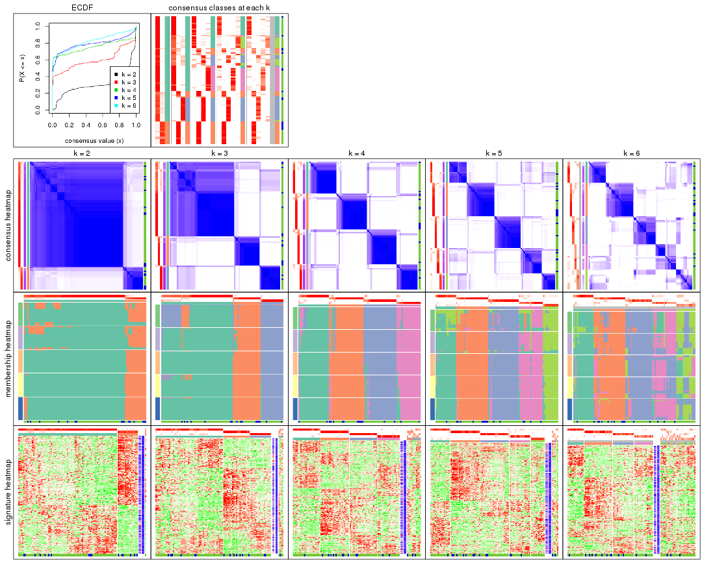

The plots are:

- The first row: a plot of the ECDF (empirical cumulative distribution
  function) curves of the consensus matrix for each `k` and the heatmap of
  predicted classes for each `k`.
- The second row: heatmaps of the consensus matrix for each `k`.
- The third row: heatmaps of the membership matrix for each `k`.
- The fouth row: heatmaps of the signatures for each `k`.

All the plots in panels can be made by individual functions and they are
plotted later in this section.

`select_partition_number()` produces several plots showing different
statistics for choosing "optimized" `k`. There are following statistics:

- ECDF curves of the consensus matrix for each `k`;
- 1-PAC. [The PAC
  score](https://en.wikipedia.org/wiki/Consensus_clustering#Over-interpretation_potential_of_consensus_clustering)
  measures the proportion of the ambiguous subgrouping.
- Mean silhouette score.
- Concordance. The mean probability of fiting the consensus class ids in all
  partitions.
- Area increased. Denote $A_k$ as the area under the ECDF curve for current
  `k`, the area increased is defined as $A_k - A_{k-1}$.
- Rand index. The percent of pairs of samples that are both in a same cluster
  or both are not in a same cluster in the partition of k and k-1.
- Jaccard index. The ratio of pairs of samples are both in a same cluster in
  the partition of k and k-1 and the pairs of samples are both in a same
  cluster in the partition k or k-1.

The detailed explanations of these statistics can be found in [the _cola_
vignette](http://bioconductor.org/packages/devel/bioc/vignettes/cola/inst/doc/cola.html#toc_13).

Generally speaking, lower PAC score, higher mean silhouette score or higher
concordance corresponds to better partition. Rand index and Jaccard index
measure how similar the current partition is compared to partition with `k-1`.
If they are too similar, we won't accept `k` is better than `k-1`.

```r
select_partition_number(res)
```


The numeric values for all these statistics can be obtained by `get_stats()`.

```r
get_stats(res)
```

```
#>   k 1-PAC mean_silhouette concordance area_increased  Rand Jaccard
#> 2 2 0.695           0.905       0.943         0.3053 0.705   0.705
#> 3 3 0.680           0.858       0.925         0.9577 0.679   0.557
#> 4 4 0.859           0.820       0.928         0.2601 0.713   0.399
#> 5 5 0.830           0.826       0.895         0.0490 0.918   0.692
#> 6 6 0.741           0.590       0.755         0.0423 0.941   0.745
```

`suggest_best_k()` suggests the best $k$ based on these statistics. The rules are as follows:

- All $k$ with Jaccard index larger than 0.95 are removed because increasing
  $k$ does not provide enough extra information. If all $k$ are removed, it is
  marked as no subgroup is detected.
- For all $k$ with 1-PAC score larger than 0.9, the maximal $k$ is taken as
  the best $k$, and other $k$ are marked as optional $k$.
- If it does not fit the second rule. The $k$ with the maximal vote of the
  highest 1-PAC score, highest mean silhouette, and highest concordance is
  taken as the best $k$.

```r
suggest_best_k(res)
```

```
#> [1] 4
```


Following shows the table of the partitions (You need to click the **show/hide
code output** link to see it). The membership matrix (columns with name `p*`)
is inferred by
[`clue::cl_consensus()`](https://www.rdocumentation.org/link/cl_consensus?package=clue)
function with the `SE` method. Basically the value in the membership matrix
represents the probability to belong to a certain group. The finall class
label for an item is determined with the group with highest probability it
belongs to.

In `get_classes()` function, the entropy is calculated from the membership
matrix and the silhouette score is calculated from the consensus matrix.


<script>
$( function() {
	$( '#tabs-MAD-mclust-get-classes' ).tabs();
} );
</script>
<div id='tabs-MAD-mclust-get-classes'>
<ul>
<li><a href='#tab-MAD-mclust-get-classes-1'>k = 2</a></li>
<li><a href='#tab-MAD-mclust-get-classes-2'>k = 3</a></li>
<li><a href='#tab-MAD-mclust-get-classes-3'>k = 4</a></li>
<li><a href='#tab-MAD-mclust-get-classes-4'>k = 5</a></li>
<li><a href='#tab-MAD-mclust-get-classes-5'>k = 6</a></li>
</ul>

<div id='tab-MAD-mclust-get-classes-1'>
<p><a id='tab-MAD-mclust-get-classes-1-a' style='color:#0366d6' href='#'>show/hide code output</a></p>
<pre><code class="r">cbind(get_classes(res, k = 2), get_membership(res, k = 2))
</code></pre>

<pre><code>#&gt;           class entropy silhouette    p1    p2
#&gt; GSM531600     1  0.4431     0.9037 0.908 0.092
#&gt; GSM531601     1  0.6712     0.7985 0.824 0.176
#&gt; GSM531605     1  0.0000     0.9540 1.000 0.000
#&gt; GSM531615     2  0.6623     0.8474 0.172 0.828
#&gt; GSM531617     1  0.3584     0.9177 0.932 0.068
#&gt; GSM531624     2  0.2778     0.9088 0.048 0.952
#&gt; GSM531627     2  0.4815     0.8879 0.104 0.896
#&gt; GSM531629     1  0.0672     0.9514 0.992 0.008
#&gt; GSM531631     2  0.2778     0.9088 0.048 0.952
#&gt; GSM531634     2  0.5737     0.8712 0.136 0.864
#&gt; GSM531636     1  0.5737     0.8593 0.864 0.136
#&gt; GSM531637     2  0.2778     0.9088 0.048 0.952
#&gt; GSM531654     1  0.0376     0.9529 0.996 0.004
#&gt; GSM531655     1  0.0376     0.9529 0.996 0.004
#&gt; GSM531658     1  0.0000     0.9540 1.000 0.000
#&gt; GSM531660     1  0.0000     0.9540 1.000 0.000
#&gt; GSM531602     1  0.0000     0.9540 1.000 0.000
#&gt; GSM531603     1  0.0000     0.9540 1.000 0.000
#&gt; GSM531604     1  0.0000     0.9540 1.000 0.000
#&gt; GSM531606     1  0.0000     0.9540 1.000 0.000
#&gt; GSM531607     1  0.0000     0.9540 1.000 0.000
#&gt; GSM531608     1  0.0938     0.9498 0.988 0.012
#&gt; GSM531609     1  0.0000     0.9540 1.000 0.000
#&gt; GSM531610     1  0.0000     0.9540 1.000 0.000
#&gt; GSM531611     1  0.0000     0.9540 1.000 0.000
#&gt; GSM531612     1  0.0376     0.9530 0.996 0.004
#&gt; GSM531613     1  0.0000     0.9540 1.000 0.000
#&gt; GSM531614     1  0.0000     0.9540 1.000 0.000
#&gt; GSM531616     1  0.5737     0.8593 0.864 0.136
#&gt; GSM531618     1  0.0000     0.9540 1.000 0.000
#&gt; GSM531619     2  0.4939     0.8866 0.108 0.892
#&gt; GSM531620     2  0.7745     0.7581 0.228 0.772
#&gt; GSM531621     2  0.2778     0.9088 0.048 0.952
#&gt; GSM531622     2  0.2778     0.9088 0.048 0.952
#&gt; GSM531623     2  0.2778     0.9088 0.048 0.952
#&gt; GSM531625     2  0.8955     0.6197 0.312 0.688
#&gt; GSM531626     2  0.9998     0.0832 0.492 0.508
#&gt; GSM531628     1  0.3584     0.9233 0.932 0.068
#&gt; GSM531630     2  0.2778     0.9088 0.048 0.952
#&gt; GSM531632     1  0.5519     0.8781 0.872 0.128
#&gt; GSM531633     2  0.2778     0.9088 0.048 0.952
#&gt; GSM531635     1  0.6148     0.8522 0.848 0.152
#&gt; GSM531638     1  0.9044     0.5396 0.680 0.320
#&gt; GSM531639     1  0.3733     0.9131 0.928 0.072
#&gt; GSM531640     2  0.5178     0.8806 0.116 0.884
#&gt; GSM531641     1  0.0376     0.9530 0.996 0.004
#&gt; GSM531642     1  0.2603     0.9353 0.956 0.044
#&gt; GSM531643     1  0.3584     0.9177 0.932 0.068
#&gt; GSM531644     1  0.3431     0.9196 0.936 0.064
#&gt; GSM531645     1  0.3114     0.9224 0.944 0.056
#&gt; GSM531646     1  0.6887     0.8281 0.816 0.184
#&gt; GSM531647     1  0.6887     0.8281 0.816 0.184
#&gt; GSM531648     1  0.3114     0.9224 0.944 0.056
#&gt; GSM531649     1  0.6148     0.8522 0.848 0.152
#&gt; GSM531650     1  0.5178     0.8926 0.884 0.116
#&gt; GSM531651     2  0.2778     0.9088 0.048 0.952
#&gt; GSM531652     1  0.0000     0.9540 1.000 0.000
#&gt; GSM531653     1  0.6887     0.8281 0.816 0.184
#&gt; GSM531656     1  0.3431     0.9198 0.936 0.064
#&gt; GSM531657     1  0.0000     0.9540 1.000 0.000
#&gt; GSM531659     1  0.0000     0.9540 1.000 0.000
#&gt; GSM531661     1  0.7674     0.6758 0.776 0.224
#&gt; GSM531662     1  0.0376     0.9529 0.996 0.004
#&gt; GSM531663     1  0.0000     0.9540 1.000 0.000
#&gt; GSM531664     1  0.3274     0.9253 0.940 0.060
#&gt; GSM531665     1  0.0000     0.9540 1.000 0.000
#&gt; GSM531666     1  0.0000     0.9540 1.000 0.000
#&gt; GSM531667     1  0.6148     0.8036 0.848 0.152
#&gt; GSM531668     1  0.0000     0.9540 1.000 0.000
#&gt; GSM531669     1  0.3274     0.9253 0.940 0.060
#&gt; GSM531670     1  0.3584     0.9165 0.932 0.068
#&gt; GSM531671     1  0.0938     0.9498 0.988 0.012
#&gt; GSM531672     1  0.0000     0.9540 1.000 0.000
#&gt; GSM531673     1  0.0000     0.9540 1.000 0.000
#&gt; GSM531674     1  0.3274     0.9253 0.940 0.060
#&gt; GSM531675     1  0.0000     0.9540 1.000 0.000
#&gt; GSM531676     1  0.0938     0.9490 0.988 0.012
#&gt; GSM531677     1  0.0000     0.9540 1.000 0.000
#&gt; GSM531678     1  0.0000     0.9540 1.000 0.000
#&gt; GSM531679     1  0.0000     0.9540 1.000 0.000
#&gt; GSM531680     1  0.1184     0.9490 0.984 0.016
#&gt; GSM531681     1  0.0000     0.9540 1.000 0.000
#&gt; GSM531682     1  0.0000     0.9540 1.000 0.000
#&gt; GSM531683     1  0.0000     0.9540 1.000 0.000
#&gt; GSM531684     1  0.0000     0.9540 1.000 0.000
#&gt; GSM531685     1  0.1633     0.9470 0.976 0.024
#&gt; GSM531686     1  0.0000     0.9540 1.000 0.000
#&gt; GSM531687     1  0.0672     0.9510 0.992 0.008
#&gt; GSM531688     1  0.3114     0.9282 0.944 0.056
#&gt; GSM531689     1  0.0000     0.9540 1.000 0.000
#&gt; GSM531690     1  0.0000     0.9540 1.000 0.000
#&gt; GSM531691     1  0.0000     0.9540 1.000 0.000
#&gt; GSM531692     1  0.0000     0.9540 1.000 0.000
#&gt; GSM531693     1  0.3274     0.9253 0.940 0.060
#&gt; GSM531694     1  0.0000     0.9540 1.000 0.000
#&gt; GSM531695     1  0.1633     0.9470 0.976 0.024
</code></pre>

<script>
$('#tab-MAD-mclust-get-classes-1-a').parent().next().next().hide();
$('#tab-MAD-mclust-get-classes-1-a').click(function(){
  $('#tab-MAD-mclust-get-classes-1-a').parent().next().next().toggle();
  return(false);
});
</script>
</div>

<div id='tab-MAD-mclust-get-classes-2'>
<p><a id='tab-MAD-mclust-get-classes-2-a' style='color:#0366d6' href='#'>show/hide code output</a></p>
<pre><code class="r">cbind(get_classes(res, k = 3), get_membership(res, k = 3))
</code></pre>

<pre><code>#&gt;           class entropy silhouette    p1    p2    p3
#&gt; GSM531600     3  0.0424      0.961 0.008 0.000 0.992
#&gt; GSM531601     1  0.6192      0.421 0.580 0.420 0.000
#&gt; GSM531605     1  0.0000      0.892 1.000 0.000 0.000
#&gt; GSM531615     2  0.0424      0.938 0.008 0.992 0.000
#&gt; GSM531617     2  0.3340      0.824 0.120 0.880 0.000
#&gt; GSM531624     2  0.0000      0.943 0.000 1.000 0.000
#&gt; GSM531627     2  0.0424      0.938 0.008 0.992 0.000
#&gt; GSM531629     1  0.2261      0.860 0.932 0.068 0.000
#&gt; GSM531631     2  0.0000      0.943 0.000 1.000 0.000
#&gt; GSM531634     2  0.0000      0.943 0.000 1.000 0.000
#&gt; GSM531636     3  0.0424      0.962 0.000 0.008 0.992
#&gt; GSM531637     2  0.0000      0.943 0.000 1.000 0.000
#&gt; GSM531654     1  0.5216      0.709 0.740 0.260 0.000
#&gt; GSM531655     1  0.4861      0.778 0.800 0.192 0.008
#&gt; GSM531658     1  0.0237      0.891 0.996 0.000 0.004
#&gt; GSM531660     1  0.0000      0.892 1.000 0.000 0.000
#&gt; GSM531602     1  0.0000      0.892 1.000 0.000 0.000
#&gt; GSM531603     1  0.0000      0.892 1.000 0.000 0.000
#&gt; GSM531604     1  0.3031      0.862 0.912 0.012 0.076
#&gt; GSM531606     1  0.0000      0.892 1.000 0.000 0.000
#&gt; GSM531607     1  0.0000      0.892 1.000 0.000 0.000
#&gt; GSM531608     1  0.5216      0.709 0.740 0.260 0.000
#&gt; GSM531609     1  0.0237      0.891 0.996 0.000 0.004
#&gt; GSM531610     1  0.0237      0.891 0.996 0.000 0.004
#&gt; GSM531611     1  0.0000      0.892 1.000 0.000 0.000
#&gt; GSM531612     1  0.0237      0.891 0.996 0.000 0.004
#&gt; GSM531613     1  0.0237      0.891 0.996 0.000 0.004
#&gt; GSM531614     1  0.0237      0.891 0.996 0.000 0.004
#&gt; GSM531616     2  0.6215      0.230 0.000 0.572 0.428
#&gt; GSM531618     1  0.0000      0.892 1.000 0.000 0.000
#&gt; GSM531619     2  0.0424      0.938 0.008 0.992 0.000
#&gt; GSM531620     2  0.0000      0.943 0.000 1.000 0.000
#&gt; GSM531621     2  0.0000      0.943 0.000 1.000 0.000
#&gt; GSM531622     2  0.0000      0.943 0.000 1.000 0.000
#&gt; GSM531623     2  0.0000      0.943 0.000 1.000 0.000
#&gt; GSM531625     2  0.0000      0.943 0.000 1.000 0.000
#&gt; GSM531626     2  0.3619      0.787 0.000 0.864 0.136
#&gt; GSM531628     3  0.0237      0.963 0.004 0.000 0.996
#&gt; GSM531630     2  0.0000      0.943 0.000 1.000 0.000
#&gt; GSM531632     3  0.0237      0.963 0.004 0.000 0.996
#&gt; GSM531633     2  0.0000      0.943 0.000 1.000 0.000
#&gt; GSM531635     3  0.0424      0.962 0.000 0.008 0.992
#&gt; GSM531638     2  0.0000      0.943 0.000 1.000 0.000
#&gt; GSM531639     3  0.1753      0.915 0.048 0.000 0.952
#&gt; GSM531640     2  0.0000      0.943 0.000 1.000 0.000
#&gt; GSM531641     1  0.0237      0.891 0.996 0.000 0.004
#&gt; GSM531642     1  0.5216      0.738 0.740 0.000 0.260
#&gt; GSM531643     3  0.0475      0.963 0.004 0.004 0.992
#&gt; GSM531644     1  0.5845      0.667 0.688 0.004 0.308
#&gt; GSM531645     1  0.0237      0.891 0.996 0.000 0.004
#&gt; GSM531646     3  0.0424      0.962 0.000 0.008 0.992
#&gt; GSM531647     3  0.0424      0.962 0.000 0.008 0.992
#&gt; GSM531648     1  0.0237      0.891 0.996 0.000 0.004
#&gt; GSM531649     3  0.0424      0.962 0.000 0.008 0.992
#&gt; GSM531650     3  0.0237      0.962 0.000 0.004 0.996
#&gt; GSM531651     2  0.0000      0.943 0.000 1.000 0.000
#&gt; GSM531652     1  0.5216      0.738 0.740 0.000 0.260
#&gt; GSM531653     3  0.0424      0.962 0.000 0.008 0.992
#&gt; GSM531656     3  0.0424      0.961 0.008 0.000 0.992
#&gt; GSM531657     1  0.0000      0.892 1.000 0.000 0.000
#&gt; GSM531659     1  0.0000      0.892 1.000 0.000 0.000
#&gt; GSM531661     2  0.3192      0.835 0.112 0.888 0.000
#&gt; GSM531662     1  0.5216      0.709 0.740 0.260 0.000
#&gt; GSM531663     1  0.0000      0.892 1.000 0.000 0.000
#&gt; GSM531664     3  0.0237      0.963 0.004 0.000 0.996
#&gt; GSM531665     1  0.4504      0.797 0.804 0.000 0.196
#&gt; GSM531666     1  0.4796      0.779 0.780 0.000 0.220
#&gt; GSM531667     2  0.4002      0.773 0.160 0.840 0.000
#&gt; GSM531668     1  0.0000      0.892 1.000 0.000 0.000
#&gt; GSM531669     3  0.0237      0.963 0.004 0.000 0.996
#&gt; GSM531670     3  0.0424      0.961 0.008 0.000 0.992
#&gt; GSM531671     1  0.6449      0.758 0.740 0.056 0.204
#&gt; GSM531672     1  0.0000      0.892 1.000 0.000 0.000
#&gt; GSM531673     1  0.4452      0.800 0.808 0.000 0.192
#&gt; GSM531674     3  0.0237      0.963 0.004 0.000 0.996
#&gt; GSM531675     1  0.0237      0.891 0.996 0.000 0.004
#&gt; GSM531676     1  0.4750      0.782 0.784 0.000 0.216
#&gt; GSM531677     1  0.0000      0.892 1.000 0.000 0.000
#&gt; GSM531678     1  0.0000      0.892 1.000 0.000 0.000
#&gt; GSM531679     1  0.0000      0.892 1.000 0.000 0.000
#&gt; GSM531680     1  0.4702      0.785 0.788 0.000 0.212
#&gt; GSM531681     1  0.0237      0.891 0.996 0.000 0.004
#&gt; GSM531682     1  0.0000      0.892 1.000 0.000 0.000
#&gt; GSM531683     1  0.0000      0.892 1.000 0.000 0.000
#&gt; GSM531684     1  0.4452      0.781 0.808 0.192 0.000
#&gt; GSM531685     1  0.5216      0.738 0.740 0.000 0.260
#&gt; GSM531686     1  0.0000      0.892 1.000 0.000 0.000
#&gt; GSM531687     1  0.4504      0.797 0.804 0.000 0.196
#&gt; GSM531688     1  0.6267      0.360 0.548 0.000 0.452
#&gt; GSM531689     1  0.4291      0.808 0.820 0.000 0.180
#&gt; GSM531690     1  0.0237      0.891 0.996 0.000 0.004
#&gt; GSM531691     1  0.4452      0.800 0.808 0.000 0.192
#&gt; GSM531692     1  0.5536      0.784 0.776 0.024 0.200
#&gt; GSM531693     3  0.5859      0.337 0.344 0.000 0.656
#&gt; GSM531694     1  0.0000      0.892 1.000 0.000 0.000
#&gt; GSM531695     1  0.5216      0.738 0.740 0.000 0.260
</code></pre>

<script>
$('#tab-MAD-mclust-get-classes-2-a').parent().next().next().hide();
$('#tab-MAD-mclust-get-classes-2-a').click(function(){
  $('#tab-MAD-mclust-get-classes-2-a').parent().next().next().toggle();
  return(false);
});
</script>
</div>

<div id='tab-MAD-mclust-get-classes-3'>
<p><a id='tab-MAD-mclust-get-classes-3-a' style='color:#0366d6' href='#'>show/hide code output</a></p>
<pre><code class="r">cbind(get_classes(res, k = 4), get_membership(res, k = 4))
</code></pre>

<pre><code>#&gt;           class entropy silhouette    p1    p2    p3    p4
#&gt; GSM531600     3  0.0188     0.9206 0.004 0.000 0.996 0.000
#&gt; GSM531601     2  0.4790     0.3768 0.000 0.620 0.000 0.380
#&gt; GSM531605     1  0.0000     0.9089 1.000 0.000 0.000 0.000
#&gt; GSM531615     2  0.0188     0.9182 0.004 0.996 0.000 0.000
#&gt; GSM531617     2  0.0000     0.9198 0.000 1.000 0.000 0.000
#&gt; GSM531624     2  0.0000     0.9198 0.000 1.000 0.000 0.000
#&gt; GSM531627     2  0.0188     0.9182 0.004 0.996 0.000 0.000
#&gt; GSM531629     2  0.5167     0.0663 0.004 0.508 0.000 0.488
#&gt; GSM531631     2  0.0000     0.9198 0.000 1.000 0.000 0.000
#&gt; GSM531634     2  0.0000     0.9198 0.000 1.000 0.000 0.000
#&gt; GSM531636     3  0.0188     0.9215 0.000 0.004 0.996 0.000
#&gt; GSM531637     2  0.0000     0.9198 0.000 1.000 0.000 0.000
#&gt; GSM531654     2  0.3688     0.7264 0.208 0.792 0.000 0.000
#&gt; GSM531655     1  0.7849     0.0133 0.400 0.000 0.284 0.316
#&gt; GSM531658     4  0.0000     0.9194 0.000 0.000 0.000 1.000
#&gt; GSM531660     4  0.1867     0.8682 0.072 0.000 0.000 0.928
#&gt; GSM531602     1  0.0000     0.9089 1.000 0.000 0.000 0.000
#&gt; GSM531603     1  0.0188     0.9063 0.996 0.000 0.000 0.004
#&gt; GSM531604     1  0.0000     0.9089 1.000 0.000 0.000 0.000
#&gt; GSM531606     1  0.0000     0.9089 1.000 0.000 0.000 0.000
#&gt; GSM531607     1  0.0000     0.9089 1.000 0.000 0.000 0.000
#&gt; GSM531608     2  0.0188     0.9182 0.004 0.996 0.000 0.000
#&gt; GSM531609     4  0.0000     0.9194 0.000 0.000 0.000 1.000
#&gt; GSM531610     4  0.0000     0.9194 0.000 0.000 0.000 1.000
#&gt; GSM531611     4  0.0188     0.9197 0.004 0.000 0.000 0.996
#&gt; GSM531612     4  0.0000     0.9194 0.000 0.000 0.000 1.000
#&gt; GSM531613     4  0.0188     0.9197 0.004 0.000 0.000 0.996
#&gt; GSM531614     4  0.0000     0.9194 0.000 0.000 0.000 1.000
#&gt; GSM531616     2  0.4817     0.3260 0.000 0.612 0.388 0.000
#&gt; GSM531618     4  0.0376     0.9178 0.004 0.004 0.000 0.992
#&gt; GSM531619     2  0.0188     0.9182 0.004 0.996 0.000 0.000
#&gt; GSM531620     2  0.0000     0.9198 0.000 1.000 0.000 0.000
#&gt; GSM531621     2  0.0000     0.9198 0.000 1.000 0.000 0.000
#&gt; GSM531622     2  0.0000     0.9198 0.000 1.000 0.000 0.000
#&gt; GSM531623     2  0.0000     0.9198 0.000 1.000 0.000 0.000
#&gt; GSM531625     2  0.0000     0.9198 0.000 1.000 0.000 0.000
#&gt; GSM531626     2  0.1867     0.8594 0.000 0.928 0.072 0.000
#&gt; GSM531628     3  0.0000     0.9214 0.000 0.000 1.000 0.000
#&gt; GSM531630     2  0.0000     0.9198 0.000 1.000 0.000 0.000
#&gt; GSM531632     3  0.0000     0.9214 0.000 0.000 1.000 0.000
#&gt; GSM531633     2  0.0000     0.9198 0.000 1.000 0.000 0.000
#&gt; GSM531635     3  0.0188     0.9215 0.000 0.004 0.996 0.000
#&gt; GSM531638     2  0.0000     0.9198 0.000 1.000 0.000 0.000
#&gt; GSM531639     3  0.0779     0.9100 0.004 0.016 0.980 0.000
#&gt; GSM531640     2  0.0000     0.9198 0.000 1.000 0.000 0.000
#&gt; GSM531641     4  0.0000     0.9194 0.000 0.000 0.000 1.000
#&gt; GSM531642     3  0.2125     0.8577 0.004 0.000 0.920 0.076
#&gt; GSM531643     3  0.0188     0.9215 0.000 0.004 0.996 0.000
#&gt; GSM531644     3  0.0188     0.9215 0.000 0.004 0.996 0.000
#&gt; GSM531645     4  0.0000     0.9194 0.000 0.000 0.000 1.000
#&gt; GSM531646     3  0.0188     0.9215 0.000 0.004 0.996 0.000
#&gt; GSM531647     3  0.0188     0.9215 0.000 0.004 0.996 0.000
#&gt; GSM531648     4  0.0188     0.9197 0.004 0.000 0.000 0.996
#&gt; GSM531649     3  0.0188     0.9215 0.000 0.004 0.996 0.000
#&gt; GSM531650     3  0.0000     0.9214 0.000 0.000 1.000 0.000
#&gt; GSM531651     2  0.0000     0.9198 0.000 1.000 0.000 0.000
#&gt; GSM531652     4  0.4018     0.6452 0.004 0.000 0.224 0.772
#&gt; GSM531653     3  0.0188     0.9215 0.000 0.004 0.996 0.000
#&gt; GSM531656     3  0.0188     0.9206 0.004 0.000 0.996 0.000
#&gt; GSM531657     4  0.0188     0.9197 0.004 0.000 0.000 0.996
#&gt; GSM531659     4  0.3569     0.7276 0.196 0.000 0.000 0.804
#&gt; GSM531661     2  0.0188     0.9182 0.004 0.996 0.000 0.000
#&gt; GSM531662     2  0.4817     0.4162 0.388 0.612 0.000 0.000
#&gt; GSM531663     4  0.4406     0.5346 0.300 0.000 0.000 0.700
#&gt; GSM531664     3  0.0000     0.9214 0.000 0.000 1.000 0.000
#&gt; GSM531665     1  0.2216     0.8389 0.908 0.000 0.092 0.000
#&gt; GSM531666     3  0.4855     0.4523 0.004 0.000 0.644 0.352
#&gt; GSM531667     2  0.0188     0.9182 0.004 0.996 0.000 0.000
#&gt; GSM531668     4  0.0188     0.9197 0.004 0.000 0.000 0.996
#&gt; GSM531669     3  0.0000     0.9214 0.000 0.000 1.000 0.000
#&gt; GSM531670     3  0.0188     0.9206 0.004 0.000 0.996 0.000
#&gt; GSM531671     3  0.5028     0.3030 0.004 0.400 0.596 0.000
#&gt; GSM531672     4  0.0188     0.9197 0.004 0.000 0.000 0.996
#&gt; GSM531673     1  0.0000     0.9089 1.000 0.000 0.000 0.000
#&gt; GSM531674     3  0.0000     0.9214 0.000 0.000 1.000 0.000
#&gt; GSM531675     1  0.3975     0.6651 0.760 0.000 0.000 0.240
#&gt; GSM531676     1  0.3569     0.7250 0.804 0.000 0.196 0.000
#&gt; GSM531677     1  0.0188     0.9067 0.996 0.000 0.000 0.004
#&gt; GSM531678     1  0.0000     0.9089 1.000 0.000 0.000 0.000
#&gt; GSM531679     1  0.0000     0.9089 1.000 0.000 0.000 0.000
#&gt; GSM531680     3  0.4925     0.2182 0.428 0.000 0.572 0.000
#&gt; GSM531681     1  0.4713     0.4314 0.640 0.000 0.000 0.360
#&gt; GSM531682     1  0.0000     0.9089 1.000 0.000 0.000 0.000
#&gt; GSM531683     1  0.0000     0.9089 1.000 0.000 0.000 0.000
#&gt; GSM531684     1  0.0000     0.9089 1.000 0.000 0.000 0.000
#&gt; GSM531685     3  0.4985     0.0886 0.468 0.000 0.532 0.000
#&gt; GSM531686     1  0.3219     0.7658 0.836 0.000 0.000 0.164
#&gt; GSM531687     1  0.3801     0.6900 0.780 0.000 0.220 0.000
#&gt; GSM531688     3  0.0000     0.9214 0.000 0.000 1.000 0.000
#&gt; GSM531689     1  0.0000     0.9089 1.000 0.000 0.000 0.000
#&gt; GSM531690     4  0.4933     0.1837 0.432 0.000 0.000 0.568
#&gt; GSM531691     1  0.0000     0.9089 1.000 0.000 0.000 0.000
#&gt; GSM531692     1  0.0000     0.9089 1.000 0.000 0.000 0.000
#&gt; GSM531693     3  0.0188     0.9206 0.004 0.000 0.996 0.000
#&gt; GSM531694     1  0.0000     0.9089 1.000 0.000 0.000 0.000
#&gt; GSM531695     3  0.0188     0.9206 0.004 0.000 0.996 0.000
</code></pre>

<script>
$('#tab-MAD-mclust-get-classes-3-a').parent().next().next().hide();
$('#tab-MAD-mclust-get-classes-3-a').click(function(){
  $('#tab-MAD-mclust-get-classes-3-a').parent().next().next().toggle();
  return(false);
});
</script>
</div>

<div id='tab-MAD-mclust-get-classes-4'>
<p><a id='tab-MAD-mclust-get-classes-4-a' style='color:#0366d6' href='#'>show/hide code output</a></p>
<pre><code class="r">cbind(get_classes(res, k = 5), get_membership(res, k = 5))
</code></pre>

<pre><code>#&gt;           class entropy silhouette    p1    p2    p3    p4    p5
#&gt; GSM531600     3  0.0451      0.926 0.008 0.000 0.988 0.000 0.004
#&gt; GSM531601     2  0.4182      0.243 0.000 0.600 0.000 0.400 0.000
#&gt; GSM531605     1  0.2648      0.820 0.848 0.000 0.000 0.000 0.152
#&gt; GSM531615     2  0.0000      0.931 0.000 1.000 0.000 0.000 0.000
#&gt; GSM531617     2  0.2344      0.879 0.032 0.904 0.000 0.064 0.000
#&gt; GSM531624     2  0.0000      0.931 0.000 1.000 0.000 0.000 0.000
#&gt; GSM531627     2  0.0290      0.930 0.000 0.992 0.000 0.000 0.008
#&gt; GSM531629     4  0.4754      0.628 0.052 0.264 0.000 0.684 0.000
#&gt; GSM531631     2  0.0000      0.931 0.000 1.000 0.000 0.000 0.000
#&gt; GSM531634     2  0.0000      0.931 0.000 1.000 0.000 0.000 0.000
#&gt; GSM531636     3  0.2278      0.885 0.000 0.032 0.908 0.000 0.060
#&gt; GSM531637     2  0.0000      0.931 0.000 1.000 0.000 0.000 0.000
#&gt; GSM531654     2  0.4593      0.650 0.080 0.736 0.000 0.000 0.184
#&gt; GSM531655     4  0.8192      0.103 0.092 0.012 0.196 0.404 0.296
#&gt; GSM531658     4  0.0000      0.835 0.000 0.000 0.000 1.000 0.000
#&gt; GSM531660     4  0.3612      0.744 0.268 0.000 0.000 0.732 0.000
#&gt; GSM531602     1  0.2074      0.863 0.896 0.000 0.000 0.000 0.104
#&gt; GSM531603     1  0.1197      0.872 0.952 0.000 0.000 0.000 0.048
#&gt; GSM531604     5  0.1908      0.911 0.092 0.000 0.000 0.000 0.908
#&gt; GSM531606     1  0.3913      0.528 0.676 0.000 0.000 0.000 0.324
#&gt; GSM531607     1  0.2074      0.863 0.896 0.000 0.000 0.000 0.104
#&gt; GSM531608     2  0.1197      0.900 0.048 0.952 0.000 0.000 0.000
#&gt; GSM531609     4  0.0000      0.835 0.000 0.000 0.000 1.000 0.000
#&gt; GSM531610     4  0.0609      0.835 0.020 0.000 0.000 0.980 0.000
#&gt; GSM531611     4  0.2852      0.806 0.172 0.000 0.000 0.828 0.000
#&gt; GSM531612     4  0.0000      0.835 0.000 0.000 0.000 1.000 0.000
#&gt; GSM531613     4  0.4306      0.166 0.492 0.000 0.000 0.508 0.000
#&gt; GSM531614     4  0.0000      0.835 0.000 0.000 0.000 1.000 0.000
#&gt; GSM531616     2  0.5010      0.594 0.000 0.676 0.248 0.000 0.076
#&gt; GSM531618     4  0.3555      0.778 0.052 0.124 0.000 0.824 0.000
#&gt; GSM531619     2  0.0000      0.931 0.000 1.000 0.000 0.000 0.000
#&gt; GSM531620     2  0.0992      0.923 0.008 0.968 0.000 0.000 0.024
#&gt; GSM531621     2  0.0290      0.930 0.000 0.992 0.000 0.000 0.008
#&gt; GSM531622     2  0.0000      0.931 0.000 1.000 0.000 0.000 0.000
#&gt; GSM531623     2  0.0000      0.931 0.000 1.000 0.000 0.000 0.000
#&gt; GSM531625     2  0.1280      0.920 0.008 0.960 0.008 0.000 0.024
#&gt; GSM531626     2  0.1831      0.902 0.000 0.920 0.004 0.000 0.076
#&gt; GSM531628     3  0.0000      0.928 0.000 0.000 1.000 0.000 0.000
#&gt; GSM531630     2  0.0000      0.931 0.000 1.000 0.000 0.000 0.000
#&gt; GSM531632     3  0.0000      0.928 0.000 0.000 1.000 0.000 0.000
#&gt; GSM531633     2  0.0510      0.927 0.000 0.984 0.000 0.000 0.016
#&gt; GSM531635     3  0.0162      0.928 0.000 0.000 0.996 0.000 0.004
#&gt; GSM531638     2  0.1831      0.902 0.000 0.920 0.004 0.000 0.076
#&gt; GSM531639     3  0.3616      0.802 0.004 0.116 0.828 0.000 0.052
#&gt; GSM531640     2  0.0000      0.931 0.000 1.000 0.000 0.000 0.000
#&gt; GSM531641     4  0.0000      0.835 0.000 0.000 0.000 1.000 0.000
#&gt; GSM531642     3  0.4528      0.683 0.028 0.000 0.748 0.200 0.024
#&gt; GSM531643     3  0.1043      0.912 0.000 0.000 0.960 0.040 0.000
#&gt; GSM531644     3  0.2074      0.865 0.000 0.000 0.896 0.104 0.000
#&gt; GSM531645     4  0.0000      0.835 0.000 0.000 0.000 1.000 0.000
#&gt; GSM531646     3  0.0000      0.928 0.000 0.000 1.000 0.000 0.000
#&gt; GSM531647     3  0.0000      0.928 0.000 0.000 1.000 0.000 0.000
#&gt; GSM531648     4  0.0000      0.835 0.000 0.000 0.000 1.000 0.000
#&gt; GSM531649     3  0.0510      0.924 0.000 0.000 0.984 0.000 0.016
#&gt; GSM531650     3  0.0000      0.928 0.000 0.000 1.000 0.000 0.000
#&gt; GSM531651     2  0.0000      0.931 0.000 1.000 0.000 0.000 0.000
#&gt; GSM531652     4  0.2193      0.814 0.028 0.000 0.060 0.912 0.000
#&gt; GSM531653     3  0.0000      0.928 0.000 0.000 1.000 0.000 0.000
#&gt; GSM531656     3  0.0992      0.920 0.008 0.000 0.968 0.000 0.024
#&gt; GSM531657     4  0.3336      0.774 0.228 0.000 0.000 0.772 0.000
#&gt; GSM531659     4  0.3612      0.738 0.268 0.000 0.000 0.732 0.000
#&gt; GSM531661     2  0.3012      0.807 0.036 0.860 0.000 0.000 0.104
#&gt; GSM531662     5  0.2068      0.909 0.092 0.004 0.000 0.000 0.904
#&gt; GSM531663     1  0.2690      0.723 0.844 0.000 0.000 0.156 0.000
#&gt; GSM531664     3  0.0000      0.928 0.000 0.000 1.000 0.000 0.000
#&gt; GSM531665     5  0.1792      0.909 0.084 0.000 0.000 0.000 0.916
#&gt; GSM531666     3  0.5086      0.219 0.040 0.000 0.564 0.396 0.000
#&gt; GSM531667     2  0.0963      0.910 0.036 0.964 0.000 0.000 0.000
#&gt; GSM531668     4  0.3003      0.800 0.188 0.000 0.000 0.812 0.000
#&gt; GSM531669     3  0.0290      0.927 0.000 0.000 0.992 0.000 0.008
#&gt; GSM531670     3  0.0992      0.920 0.008 0.000 0.968 0.000 0.024
#&gt; GSM531671     5  0.2228      0.877 0.040 0.000 0.048 0.000 0.912
#&gt; GSM531672     4  0.3003      0.800 0.188 0.000 0.000 0.812 0.000
#&gt; GSM531673     5  0.1908      0.911 0.092 0.000 0.000 0.000 0.908
#&gt; GSM531674     3  0.0162      0.928 0.000 0.000 0.996 0.000 0.004
#&gt; GSM531675     1  0.1043      0.850 0.960 0.000 0.000 0.040 0.000
#&gt; GSM531676     5  0.2074      0.886 0.044 0.000 0.036 0.000 0.920
#&gt; GSM531677     1  0.0324      0.863 0.992 0.000 0.000 0.004 0.004
#&gt; GSM531678     1  0.2813      0.804 0.832 0.000 0.000 0.000 0.168
#&gt; GSM531679     1  0.2179      0.860 0.888 0.000 0.000 0.000 0.112
#&gt; GSM531680     3  0.4167      0.629 0.252 0.000 0.724 0.000 0.024
#&gt; GSM531681     1  0.1043      0.850 0.960 0.000 0.000 0.040 0.000
#&gt; GSM531682     1  0.0794      0.868 0.972 0.000 0.000 0.000 0.028
#&gt; GSM531683     1  0.1851      0.868 0.912 0.000 0.000 0.000 0.088
#&gt; GSM531684     5  0.2127      0.902 0.108 0.000 0.000 0.000 0.892
#&gt; GSM531685     5  0.2139      0.870 0.032 0.000 0.052 0.000 0.916
#&gt; GSM531686     1  0.1043      0.850 0.960 0.000 0.000 0.040 0.000
#&gt; GSM531687     5  0.5538      0.127 0.428 0.000 0.068 0.000 0.504
#&gt; GSM531688     3  0.0798      0.921 0.008 0.000 0.976 0.000 0.016
#&gt; GSM531689     5  0.3395      0.747 0.236 0.000 0.000 0.000 0.764
#&gt; GSM531690     1  0.1121      0.847 0.956 0.000 0.000 0.044 0.000
#&gt; GSM531691     5  0.1908      0.911 0.092 0.000 0.000 0.000 0.908
#&gt; GSM531692     5  0.1908      0.911 0.092 0.000 0.000 0.000 0.908
#&gt; GSM531693     3  0.0510      0.924 0.000 0.000 0.984 0.000 0.016
#&gt; GSM531694     1  0.2074      0.863 0.896 0.000 0.000 0.000 0.104
#&gt; GSM531695     3  0.1579      0.896 0.032 0.000 0.944 0.000 0.024
</code></pre>

<script>
$('#tab-MAD-mclust-get-classes-4-a').parent().next().next().hide();
$('#tab-MAD-mclust-get-classes-4-a').click(function(){
  $('#tab-MAD-mclust-get-classes-4-a').parent().next().next().toggle();
  return(false);
});
</script>
</div>

<div id='tab-MAD-mclust-get-classes-5'>
<p><a id='tab-MAD-mclust-get-classes-5-a' style='color:#0366d6' href='#'>show/hide code output</a></p>
<pre><code class="r">cbind(get_classes(res, k = 6), get_membership(res, k = 6))
</code></pre>

<pre><code>#&gt;           class entropy silhouette    p1    p2    p3    p4    p5 p6
#&gt; GSM531600     3  0.1934     0.7470 0.000 0.000 0.916 0.000 0.044 NA
#&gt; GSM531601     2  0.4709     0.5026 0.000 0.680 0.000 0.188 0.000 NA
#&gt; GSM531605     1  0.2562     0.6485 0.828 0.000 0.000 0.000 0.172 NA
#&gt; GSM531615     2  0.0146     0.8492 0.004 0.996 0.000 0.000 0.000 NA
#&gt; GSM531617     2  0.1471     0.8263 0.004 0.932 0.000 0.000 0.000 NA
#&gt; GSM531624     2  0.0000     0.8505 0.000 1.000 0.000 0.000 0.000 NA
#&gt; GSM531627     2  0.1644     0.8349 0.000 0.932 0.028 0.000 0.000 NA
#&gt; GSM531629     2  0.4881     0.3665 0.004 0.604 0.000 0.324 0.000 NA
#&gt; GSM531631     2  0.0000     0.8505 0.000 1.000 0.000 0.000 0.000 NA
#&gt; GSM531634     2  0.0260     0.8490 0.000 0.992 0.000 0.000 0.000 NA
#&gt; GSM531636     3  0.1367     0.7204 0.000 0.044 0.944 0.000 0.000 NA
#&gt; GSM531637     2  0.0000     0.8505 0.000 1.000 0.000 0.000 0.000 NA
#&gt; GSM531654     2  0.7626     0.1117 0.044 0.416 0.000 0.296 0.156 NA
#&gt; GSM531655     4  0.6861     0.0403 0.044 0.004 0.152 0.496 0.284 NA
#&gt; GSM531658     4  0.3867     0.6022 0.000 0.000 0.000 0.512 0.000 NA
#&gt; GSM531660     4  0.2762     0.5264 0.196 0.000 0.000 0.804 0.000 NA
#&gt; GSM531602     1  0.0260     0.8303 0.992 0.000 0.000 0.000 0.000 NA
#&gt; GSM531603     1  0.3860     0.1270 0.528 0.000 0.000 0.472 0.000 NA
#&gt; GSM531604     5  0.5036     0.2557 0.344 0.000 0.000 0.000 0.568 NA
#&gt; GSM531606     1  0.4871     0.3228 0.616 0.000 0.000 0.000 0.296 NA
#&gt; GSM531607     1  0.0146     0.8306 0.996 0.000 0.000 0.000 0.004 NA
#&gt; GSM531608     2  0.3528     0.5695 0.004 0.700 0.000 0.296 0.000 NA
#&gt; GSM531609     4  0.3867     0.6022 0.000 0.000 0.000 0.512 0.000 NA
#&gt; GSM531610     4  0.1075     0.5839 0.000 0.000 0.000 0.952 0.000 NA
#&gt; GSM531611     4  0.1657     0.5818 0.056 0.000 0.000 0.928 0.000 NA
#&gt; GSM531612     4  0.3867     0.6022 0.000 0.000 0.000 0.512 0.000 NA
#&gt; GSM531613     4  0.3023     0.4143 0.232 0.000 0.000 0.768 0.000 NA
#&gt; GSM531614     4  0.3782     0.6078 0.000 0.000 0.000 0.588 0.000 NA
#&gt; GSM531616     3  0.4712     0.0168 0.000 0.384 0.564 0.000 0.000 NA
#&gt; GSM531618     4  0.5298     0.5805 0.004 0.100 0.000 0.548 0.000 NA
#&gt; GSM531619     2  0.0000     0.8505 0.000 1.000 0.000 0.000 0.000 NA
#&gt; GSM531620     2  0.2362     0.7921 0.000 0.860 0.136 0.000 0.000 NA
#&gt; GSM531621     2  0.2066     0.8259 0.000 0.908 0.052 0.000 0.000 NA
#&gt; GSM531622     2  0.0000     0.8505 0.000 1.000 0.000 0.000 0.000 NA
#&gt; GSM531623     2  0.0000     0.8505 0.000 1.000 0.000 0.000 0.000 NA
#&gt; GSM531625     2  0.4059     0.7031 0.004 0.732 0.216 0.000 0.000 NA
#&gt; GSM531626     2  0.4408     0.6132 0.000 0.656 0.292 0.000 0.000 NA
#&gt; GSM531628     3  0.2854     0.7708 0.000 0.000 0.792 0.000 0.000 NA
#&gt; GSM531630     2  0.0000     0.8505 0.000 1.000 0.000 0.000 0.000 NA
#&gt; GSM531632     3  0.2854     0.7708 0.000 0.000 0.792 0.000 0.000 NA
#&gt; GSM531633     2  0.2308     0.8184 0.000 0.892 0.068 0.000 0.000 NA
#&gt; GSM531635     3  0.0260     0.7383 0.000 0.000 0.992 0.000 0.000 NA
#&gt; GSM531638     2  0.3980     0.7019 0.000 0.732 0.216 0.000 0.000 NA
#&gt; GSM531639     3  0.1367     0.7204 0.000 0.044 0.944 0.000 0.000 NA
#&gt; GSM531640     2  0.0000     0.8505 0.000 1.000 0.000 0.000 0.000 NA
#&gt; GSM531641     4  0.3867     0.6022 0.000 0.000 0.000 0.512 0.000 NA
#&gt; GSM531642     3  0.2884     0.5979 0.004 0.000 0.824 0.164 0.000 NA
#&gt; GSM531643     3  0.2854     0.7708 0.000 0.000 0.792 0.000 0.000 NA
#&gt; GSM531644     3  0.2996     0.7655 0.000 0.000 0.772 0.000 0.000 NA
#&gt; GSM531645     4  0.3867     0.6022 0.000 0.000 0.000 0.512 0.000 NA
#&gt; GSM531646     3  0.2664     0.7716 0.000 0.000 0.816 0.000 0.000 NA
#&gt; GSM531647     3  0.2854     0.7708 0.000 0.000 0.792 0.000 0.000 NA
#&gt; GSM531648     4  0.3867     0.6022 0.000 0.000 0.000 0.512 0.000 NA
#&gt; GSM531649     3  0.0260     0.7383 0.000 0.000 0.992 0.000 0.000 NA
#&gt; GSM531650     3  0.2854     0.7708 0.000 0.000 0.792 0.000 0.000 NA
#&gt; GSM531651     2  0.0260     0.8495 0.000 0.992 0.000 0.000 0.000 NA
#&gt; GSM531652     4  0.6078     0.4594 0.004 0.004 0.220 0.480 0.000 NA
#&gt; GSM531653     3  0.2854     0.7708 0.000 0.000 0.792 0.000 0.000 NA
#&gt; GSM531656     3  0.0865     0.7306 0.000 0.036 0.964 0.000 0.000 NA
#&gt; GSM531657     4  0.2562     0.5491 0.172 0.000 0.000 0.828 0.000 NA
#&gt; GSM531659     4  0.2631     0.5418 0.180 0.000 0.000 0.820 0.000 NA
#&gt; GSM531661     2  0.4609     0.5106 0.048 0.648 0.000 0.296 0.008 NA
#&gt; GSM531662     5  0.5811     0.3515 0.048 0.000 0.000 0.296 0.568 NA
#&gt; GSM531663     4  0.3838    -0.0203 0.448 0.000 0.000 0.552 0.000 NA
#&gt; GSM531664     3  0.2994     0.7687 0.000 0.000 0.788 0.000 0.004 NA
#&gt; GSM531665     5  0.3482     0.4793 0.004 0.000 0.000 0.116 0.812 NA
#&gt; GSM531666     3  0.6058     0.2601 0.004 0.000 0.456 0.292 0.000 NA
#&gt; GSM531667     2  0.1411     0.8242 0.004 0.936 0.000 0.060 0.000 NA
#&gt; GSM531668     4  0.2378     0.5592 0.152 0.000 0.000 0.848 0.000 NA
#&gt; GSM531669     3  0.6034     0.3064 0.000 0.000 0.416 0.000 0.320 NA
#&gt; GSM531670     3  0.1152     0.7323 0.000 0.000 0.952 0.000 0.044 NA
#&gt; GSM531671     5  0.4751     0.4103 0.004 0.000 0.000 0.228 0.672 NA
#&gt; GSM531672     4  0.2378     0.5592 0.152 0.000 0.000 0.848 0.000 NA
#&gt; GSM531673     5  0.5766     0.3639 0.048 0.000 0.000 0.284 0.580 NA
#&gt; GSM531674     3  0.5979     0.3525 0.000 0.000 0.440 0.000 0.308 NA
#&gt; GSM531675     1  0.1219     0.8263 0.948 0.000 0.000 0.048 0.004 NA
#&gt; GSM531676     5  0.5048     0.3748 0.264 0.000 0.000 0.000 0.616 NA
#&gt; GSM531677     1  0.1075     0.8270 0.952 0.000 0.000 0.048 0.000 NA
#&gt; GSM531678     1  0.1863     0.7558 0.896 0.000 0.000 0.000 0.104 NA
#&gt; GSM531679     1  0.0458     0.8259 0.984 0.000 0.000 0.000 0.016 NA
#&gt; GSM531680     5  0.6809     0.1082 0.072 0.000 0.172 0.000 0.432 NA
#&gt; GSM531681     1  0.1219     0.8263 0.948 0.000 0.000 0.048 0.004 NA
#&gt; GSM531682     1  0.1649     0.8280 0.932 0.000 0.000 0.036 0.032 NA
#&gt; GSM531683     1  0.0146     0.8321 0.996 0.000 0.000 0.004 0.000 NA
#&gt; GSM531684     5  0.5600     0.2435 0.348 0.024 0.000 0.000 0.540 NA
#&gt; GSM531685     5  0.3164     0.4952 0.044 0.000 0.004 0.000 0.832 NA
#&gt; GSM531686     1  0.1075     0.8270 0.952 0.000 0.000 0.048 0.000 NA
#&gt; GSM531687     5  0.5132     0.3866 0.172 0.000 0.028 0.000 0.680 NA
#&gt; GSM531688     5  0.5989    -0.0112 0.000 0.000 0.244 0.000 0.428 NA
#&gt; GSM531689     1  0.3828     0.1432 0.560 0.000 0.000 0.000 0.440 NA
#&gt; GSM531690     1  0.1219     0.8263 0.948 0.000 0.000 0.048 0.004 NA
#&gt; GSM531691     5  0.4306     0.2712 0.344 0.000 0.000 0.000 0.624 NA
#&gt; GSM531692     5  0.5036     0.2557 0.344 0.000 0.000 0.000 0.568 NA
#&gt; GSM531693     5  0.5989    -0.0112 0.000 0.000 0.244 0.000 0.428 NA
#&gt; GSM531694     1  0.0260     0.8303 0.992 0.000 0.000 0.000 0.000 NA
#&gt; GSM531695     5  0.5989    -0.0112 0.000 0.000 0.244 0.000 0.428 NA
</code></pre>

<script>
$('#tab-MAD-mclust-get-classes-5-a').parent().next().next().hide();
$('#tab-MAD-mclust-get-classes-5-a').click(function(){
  $('#tab-MAD-mclust-get-classes-5-a').parent().next().next().toggle();
  return(false);
});
</script>
</div>
</div>

Heatmaps for the consensus matrix. It visualizes the probability of two
samples to be in a same group.


<script>
$( function() {
	$( '#tabs-MAD-mclust-consensus-heatmap' ).tabs();
} );
</script>
<div id='tabs-MAD-mclust-consensus-heatmap'>
<ul>
<li><a href='#tab-MAD-mclust-consensus-heatmap-1'>k = 2</a></li>
<li><a href='#tab-MAD-mclust-consensus-heatmap-2'>k = 3</a></li>
<li><a href='#tab-MAD-mclust-consensus-heatmap-3'>k = 4</a></li>
<li><a href='#tab-MAD-mclust-consensus-heatmap-4'>k = 5</a></li>
<li><a href='#tab-MAD-mclust-consensus-heatmap-5'>k = 6</a></li>
</ul>
<div id='tab-MAD-mclust-consensus-heatmap-1'>
<pre><code class="r">consensus_heatmap(res, k = 2)
</code></pre>

<p></p>

</div>
<div id='tab-MAD-mclust-consensus-heatmap-2'>
<pre><code class="r">consensus_heatmap(res, k = 3)
</code></pre>

<p></p>

</div>
<div id='tab-MAD-mclust-consensus-heatmap-3'>
<pre><code class="r">consensus_heatmap(res, k = 4)
</code></pre>

<p></p>

</div>
<div id='tab-MAD-mclust-consensus-heatmap-4'>
<pre><code class="r">consensus_heatmap(res, k = 5)
</code></pre>

<p></p>

</div>
<div id='tab-MAD-mclust-consensus-heatmap-5'>
<pre><code class="r">consensus_heatmap(res, k = 6)
</code></pre>

<p></p>

</div>
</div>

Heatmaps for the membership of samples in all partitions to see how consistent they are:


<script>
$( function() {
	$( '#tabs-MAD-mclust-membership-heatmap' ).tabs();
} );
</script>
<div id='tabs-MAD-mclust-membership-heatmap'>
<ul>
<li><a href='#tab-MAD-mclust-membership-heatmap-1'>k = 2</a></li>
<li><a href='#tab-MAD-mclust-membership-heatmap-2'>k = 3</a></li>
<li><a href='#tab-MAD-mclust-membership-heatmap-3'>k = 4</a></li>
<li><a href='#tab-MAD-mclust-membership-heatmap-4'>k = 5</a></li>
<li><a href='#tab-MAD-mclust-membership-heatmap-5'>k = 6</a></li>
</ul>
<div id='tab-MAD-mclust-membership-heatmap-1'>
<pre><code class="r">membership_heatmap(res, k = 2)
</code></pre>

<p></p>

</div>
<div id='tab-MAD-mclust-membership-heatmap-2'>
<pre><code class="r">membership_heatmap(res, k = 3)
</code></pre>

<p></p>

</div>
<div id='tab-MAD-mclust-membership-heatmap-3'>
<pre><code class="r">membership_heatmap(res, k = 4)
</code></pre>

<p></p>

</div>
<div id='tab-MAD-mclust-membership-heatmap-4'>
<pre><code class="r">membership_heatmap(res, k = 5)
</code></pre>

<p></p>

</div>
<div id='tab-MAD-mclust-membership-heatmap-5'>
<pre><code class="r">membership_heatmap(res, k = 6)
</code></pre>

<p></p>

</div>
</div>

As soon as we have had the classes for columns, we can look for signatures
which are significantly different between classes which can be candidate marks
for certain classes. Following are the heatmaps for signatures.


Signature heatmaps where rows are scaled:


<script>
$( function() {
	$( '#tabs-MAD-mclust-get-signatures' ).tabs();
} );
</script>
<div id='tabs-MAD-mclust-get-signatures'>
<ul>
<li><a href='#tab-MAD-mclust-get-signatures-1'>k = 2</a></li>
<li><a href='#tab-MAD-mclust-get-signatures-2'>k = 3</a></li>
<li><a href='#tab-MAD-mclust-get-signatures-3'>k = 4</a></li>
<li><a href='#tab-MAD-mclust-get-signatures-4'>k = 5</a></li>
<li><a href='#tab-MAD-mclust-get-signatures-5'>k = 6</a></li>
</ul>
<div id='tab-MAD-mclust-get-signatures-1'>
<pre><code class="r">get_signatures(res, k = 2)
</code></pre>

<pre><code>#&gt; Error: The width or height of the raster image is zero, maybe you forget to turn off the
#&gt; previous graphic device or it was corrupted. Run `dev.off()` to close it.
</code></pre>

<p></p>

</div>
<div id='tab-MAD-mclust-get-signatures-2'>
<pre><code class="r">get_signatures(res, k = 3)
</code></pre>

<pre><code>#&gt; Error: The width or height of the raster image is zero, maybe you forget to turn off the
#&gt; previous graphic device or it was corrupted. Run `dev.off()` to close it.
</code></pre>

<p></p>

</div>
<div id='tab-MAD-mclust-get-signatures-3'>
<pre><code class="r">get_signatures(res, k = 4)
</code></pre>

<pre><code>#&gt; Error: The width or height of the raster image is zero, maybe you forget to turn off the
#&gt; previous graphic device or it was corrupted. Run `dev.off()` to close it.
</code></pre>

<p></p>

</div>
<div id='tab-MAD-mclust-get-signatures-4'>
<pre><code class="r">get_signatures(res, k = 5)
</code></pre>

<pre><code>#&gt; Error: The width or height of the raster image is zero, maybe you forget to turn off the
#&gt; previous graphic device or it was corrupted. Run `dev.off()` to close it.
</code></pre>

<p></p>

</div>
<div id='tab-MAD-mclust-get-signatures-5'>
<pre><code class="r">get_signatures(res, k = 6)
</code></pre>

<pre><code>#&gt; Error: The width or height of the raster image is zero, maybe you forget to turn off the
#&gt; previous graphic device or it was corrupted. Run `dev.off()` to close it.
</code></pre>

<p></p>

</div>
</div>


Signature heatmaps where rows are not scaled:


<script>
$( function() {
	$( '#tabs-MAD-mclust-get-signatures-no-scale' ).tabs();
} );
</script>
<div id='tabs-MAD-mclust-get-signatures-no-scale'>
<ul>
<li><a href='#tab-MAD-mclust-get-signatures-no-scale-1'>k = 2</a></li>
<li><a href='#tab-MAD-mclust-get-signatures-no-scale-2'>k = 3</a></li>
<li><a href='#tab-MAD-mclust-get-signatures-no-scale-3'>k = 4</a></li>
<li><a href='#tab-MAD-mclust-get-signatures-no-scale-4'>k = 5</a></li>
<li><a href='#tab-MAD-mclust-get-signatures-no-scale-5'>k = 6</a></li>
</ul>
<div id='tab-MAD-mclust-get-signatures-no-scale-1'>
<pre><code class="r">get_signatures(res, k = 2, scale_rows = FALSE)
</code></pre>

<pre><code>#&gt; Error: The width or height of the raster image is zero, maybe you forget to turn off the
#&gt; previous graphic device or it was corrupted. Run `dev.off()` to close it.
</code></pre>

<p></p>

</div>
<div id='tab-MAD-mclust-get-signatures-no-scale-2'>
<pre><code class="r">get_signatures(res, k = 3, scale_rows = FALSE)
</code></pre>

<pre><code>#&gt; Error: The width or height of the raster image is zero, maybe you forget to turn off the
#&gt; previous graphic device or it was corrupted. Run `dev.off()` to close it.
</code></pre>

<p></p>

</div>
<div id='tab-MAD-mclust-get-signatures-no-scale-3'>
<pre><code class="r">get_signatures(res, k = 4, scale_rows = FALSE)
</code></pre>

<pre><code>#&gt; Error: The width or height of the raster image is zero, maybe you forget to turn off the
#&gt; previous graphic device or it was corrupted. Run `dev.off()` to close it.
</code></pre>

<p></p>

</div>
<div id='tab-MAD-mclust-get-signatures-no-scale-4'>
<pre><code class="r">get_signatures(res, k = 5, scale_rows = FALSE)
</code></pre>

<pre><code>#&gt; Error: The width or height of the raster image is zero, maybe you forget to turn off the
#&gt; previous graphic device or it was corrupted. Run `dev.off()` to close it.
</code></pre>

<p></p>

</div>
<div id='tab-MAD-mclust-get-signatures-no-scale-5'>
<pre><code class="r">get_signatures(res, k = 6, scale_rows = FALSE)
</code></pre>

<pre><code>#&gt; Error: The width or height of the raster image is zero, maybe you forget to turn off the
#&gt; previous graphic device or it was corrupted. Run `dev.off()` to close it.
</code></pre>

<p></p>

</div>
</div>


Compare the overlap of signatures from different k:

```r
compare_signatures(res)
```


`get_signature()` returns a data frame invisibly. TO get the list of signatures, the function
call should be assigned to a variable explicitly. In following code, if `plot` argument is set
to `FALSE`, no heatmap is plotted while only the differential analysis is performed.

```r
# code only for demonstration
tb = get_signature(res, k = ..., plot = FALSE)
```

An example of the output of `tb` is:

```
#>   which_row         fdr    mean_1    mean_2 scaled_mean_1 scaled_mean_2 km
#> 1        38 0.042760348  8.373488  9.131774    -0.5533452     0.5164555  1
#> 2        40 0.018707592  7.106213  8.469186    -0.6173731     0.5762149  1
#> 3        55 0.019134737 10.221463 11.207825    -0.6159697     0.5749050  1
#> 4        59 0.006059896  5.921854  7.869574    -0.6899429     0.6439467  1
#> 5        60 0.018055526  8.928898 10.211722    -0.6204761     0.5791110  1
#> 6        98 0.009384629 15.714769 14.887706     0.6635654    -0.6193277  2
...
```

The columns in `tb` are:

1. `which_row`: row indices corresponding to the input matrix.
2. `fdr`: FDR for the differential test. 
3. `mean_x`: The mean value in group x.
4. `scaled_mean_x`: The mean value in group x after rows are scaled.
5. `km`: Row groups if k-means clustering is applied to rows.


UMAP plot which shows how samples are separated.


<script>
$( function() {
	$( '#tabs-MAD-mclust-dimension-reduction' ).tabs();
} );
</script>
<div id='tabs-MAD-mclust-dimension-reduction'>
<ul>
<li><a href='#tab-MAD-mclust-dimension-reduction-1'>k = 2</a></li>
<li><a href='#tab-MAD-mclust-dimension-reduction-2'>k = 3</a></li>
<li><a href='#tab-MAD-mclust-dimension-reduction-3'>k = 4</a></li>
<li><a href='#tab-MAD-mclust-dimension-reduction-4'>k = 5</a></li>
<li><a href='#tab-MAD-mclust-dimension-reduction-5'>k = 6</a></li>
</ul>
<div id='tab-MAD-mclust-dimension-reduction-1'>
<pre><code class="r">dimension_reduction(res, k = 2, method = &quot;UMAP&quot;)
</code></pre>

<p></p>

</div>
<div id='tab-MAD-mclust-dimension-reduction-2'>
<pre><code class="r">dimension_reduction(res, k = 3, method = &quot;UMAP&quot;)
</code></pre>

<p></p>

</div>
<div id='tab-MAD-mclust-dimension-reduction-3'>
<pre><code class="r">dimension_reduction(res, k = 4, method = &quot;UMAP&quot;)
</code></pre>

<p></p>

</div>
<div id='tab-MAD-mclust-dimension-reduction-4'>
<pre><code class="r">dimension_reduction(res, k = 5, method = &quot;UMAP&quot;)
</code></pre>

<p></p>

</div>
<div id='tab-MAD-mclust-dimension-reduction-5'>
<pre><code class="r">dimension_reduction(res, k = 6, method = &quot;UMAP&quot;)
</code></pre>

<p></p>

</div>
</div>


Following heatmap shows how subgroups are split when increasing `k`:

```r
collect_classes(res)
```


Test correlation between subgroups and known annotations. If the known
annotation is numeric, one-way ANOVA test is applied, and if the known
annotation is discrete, chi-squared contingency table test is applied.

```r
test_to_known_factors(res)
```

```
#>             n disease.state(p) k
#> MAD:mclust 95           0.0399 2
#> MAD:mclust 92           0.0554 3
#> MAD:mclust 85           0.0223 4
#> MAD:mclust 91           0.0435 5
#> MAD:mclust 68           0.1290 6
```


If matrix rows can be associated to genes, consider to use `functional_enrichment(res,
...)` to perform function enrichment for the signature genes. See [this vignette](http://bioconductor.org/packages/devel/bioc/vignettes/cola/inst/doc/functional_enrichment.html) for more detailed explanations.


 

---------------------------------------------------


### MAD:NMF


The object with results only for a single top-value method and a single partition method 
can be extracted as:

```r
res = res_list["MAD", "NMF"]
# you can also extract it by
# res = res_list["MAD:NMF"]
```

A summary of `res` and all the functions that can be applied to it:

```r
res
```

```
#> A 'ConsensusPartition' object with k = 2, 3, 4, 5, 6.
#>   On a matrix with 51941 rows and 96 columns.
#>   Top rows (1000, 2000, 3000, 4000, 5000) are extracted by 'MAD' method.
#>   Subgroups are detected by 'NMF' method.
#>   Performed in total 1250 partitions by row resampling.
#>   Best k for subgroups seems to be 2.
#> 
#> Following methods can be applied to this 'ConsensusPartition' object:
#>  [1] "cola_report"             "collect_classes"         "collect_plots"          
#>  [4] "collect_stats"           "colnames"                "compare_signatures"     
#>  [7] "consensus_heatmap"       "dimension_reduction"     "functional_enrichment"  
#> [10] "get_anno_col"            "get_anno"                "get_classes"            
#> [13] "get_consensus"           "get_matrix"              "get_membership"         
#> [16] "get_param"               "get_signatures"          "get_stats"              
#> [19] "is_best_k"               "is_stable_k"             "membership_heatmap"     
#> [22] "ncol"                    "nrow"                    "plot_ecdf"              
#> [25] "rownames"                "select_partition_number" "show"                   
#> [28] "suggest_best_k"          "test_to_known_factors"
```

`collect_plots()` function collects all the plots made from `res` for all `k` (number of partitions)
into one single page to provide an easy and fast comparison between different `k`.

```r
collect_plots(res)
```


The plots are:

- The first row: a plot of the ECDF (empirical cumulative distribution
  function) curves of the consensus matrix for each `k` and the heatmap of
  predicted classes for each `k`.
- The second row: heatmaps of the consensus matrix for each `k`.
- The third row: heatmaps of the membership matrix for each `k`.
- The fouth row: heatmaps of the signatures for each `k`.

All the plots in panels can be made by individual functions and they are
plotted later in this section.

`select_partition_number()` produces several plots showing different
statistics for choosing "optimized" `k`. There are following statistics:

- ECDF curves of the consensus matrix for each `k`;
- 1-PAC. [The PAC
  score](https://en.wikipedia.org/wiki/Consensus_clustering#Over-interpretation_potential_of_consensus_clustering)
  measures the proportion of the ambiguous subgrouping.
- Mean silhouette score.
- Concordance. The mean probability of fiting the consensus class ids in all
  partitions.
- Area increased. Denote $A_k$ as the area under the ECDF curve for current
  `k`, the area increased is defined as $A_k - A_{k-1}$.
- Rand index. The percent of pairs of samples that are both in a same cluster
  or both are not in a same cluster in the partition of k and k-1.
- Jaccard index. The ratio of pairs of samples are both in a same cluster in
  the partition of k and k-1 and the pairs of samples are both in a same
  cluster in the partition k or k-1.

The detailed explanations of these statistics can be found in [the _cola_
vignette](http://bioconductor.org/packages/devel/bioc/vignettes/cola/inst/doc/cola.html#toc_13).

Generally speaking, lower PAC score, higher mean silhouette score or higher
concordance corresponds to better partition. Rand index and Jaccard index
measure how similar the current partition is compared to partition with `k-1`.
If they are too similar, we won't accept `k` is better than `k-1`.

```r
select_partition_number(res)
```


The numeric values for all these statistics can be obtained by `get_stats()`.

```r
get_stats(res)
```

```
#>   k 1-PAC mean_silhouette concordance area_increased  Rand Jaccard
#> 2 2 0.851           0.922       0.967         0.4994 0.498   0.498
#> 3 3 0.839           0.877       0.949         0.3387 0.740   0.524
#> 4 4 0.883           0.862       0.942         0.1274 0.832   0.549
#> 5 5 0.729           0.693       0.847         0.0576 0.900   0.635
#> 6 6 0.689           0.562       0.764         0.0408 0.908   0.599
```

`suggest_best_k()` suggests the best $k$ based on these statistics. The rules are as follows:

- All $k$ with Jaccard index larger than 0.95 are removed because increasing
  $k$ does not provide enough extra information. If all $k$ are removed, it is
  marked as no subgroup is detected.
- For all $k$ with 1-PAC score larger than 0.9, the maximal $k$ is taken as
  the best $k$, and other $k$ are marked as optional $k$.
- If it does not fit the second rule. The $k$ with the maximal vote of the
  highest 1-PAC score, highest mean silhouette, and highest concordance is
  taken as the best $k$.

```r
suggest_best_k(res)
```

```
#> [1] 2
```


Following shows the table of the partitions (You need to click the **show/hide
code output** link to see it). The membership matrix (columns with name `p*`)
is inferred by
[`clue::cl_consensus()`](https://www.rdocumentation.org/link/cl_consensus?package=clue)
function with the `SE` method. Basically the value in the membership matrix
represents the probability to belong to a certain group. The finall class
label for an item is determined with the group with highest probability it
belongs to.

In `get_classes()` function, the entropy is calculated from the membership
matrix and the silhouette score is calculated from the consensus matrix.


<script>
$( function() {
	$( '#tabs-MAD-NMF-get-classes' ).tabs();
} );
</script>
<div id='tabs-MAD-NMF-get-classes'>
<ul>
<li><a href='#tab-MAD-NMF-get-classes-1'>k = 2</a></li>
<li><a href='#tab-MAD-NMF-get-classes-2'>k = 3</a></li>
<li><a href='#tab-MAD-NMF-get-classes-3'>k = 4</a></li>
<li><a href='#tab-MAD-NMF-get-classes-4'>k = 5</a></li>
<li><a href='#tab-MAD-NMF-get-classes-5'>k = 6</a></li>
</ul>

<div id='tab-MAD-NMF-get-classes-1'>
<p><a id='tab-MAD-NMF-get-classes-1-a' style='color:#0366d6' href='#'>show/hide code output</a></p>
<pre><code class="r">cbind(get_classes(res, k = 2), get_membership(res, k = 2))
</code></pre>

<pre><code>#&gt;           class entropy silhouette    p1    p2
#&gt; GSM531600     2  0.0000     0.9677 0.000 1.000
#&gt; GSM531601     2  0.0000     0.9677 0.000 1.000
#&gt; GSM531605     1  0.0000     0.9604 1.000 0.000
#&gt; GSM531615     2  0.2423     0.9342 0.040 0.960
#&gt; GSM531617     2  0.0672     0.9613 0.008 0.992
#&gt; GSM531624     2  0.0000     0.9677 0.000 1.000
#&gt; GSM531627     2  0.0000     0.9677 0.000 1.000
#&gt; GSM531629     1  0.0000     0.9604 1.000 0.000
#&gt; GSM531631     2  0.0000     0.9677 0.000 1.000
#&gt; GSM531634     2  0.0000     0.9677 0.000 1.000
#&gt; GSM531636     2  0.0000     0.9677 0.000 1.000
#&gt; GSM531637     2  0.0000     0.9677 0.000 1.000
#&gt; GSM531654     2  0.8386     0.6282 0.268 0.732
#&gt; GSM531655     2  0.9998    -0.0246 0.492 0.508
#&gt; GSM531658     1  0.0000     0.9604 1.000 0.000
#&gt; GSM531660     1  0.0000     0.9604 1.000 0.000
#&gt; GSM531602     1  0.0000     0.9604 1.000 0.000
#&gt; GSM531603     1  0.0000     0.9604 1.000 0.000
#&gt; GSM531604     1  0.4562     0.8882 0.904 0.096
#&gt; GSM531606     1  0.0000     0.9604 1.000 0.000
#&gt; GSM531607     1  0.0000     0.9604 1.000 0.000
#&gt; GSM531608     2  0.2778     0.9286 0.048 0.952
#&gt; GSM531609     1  0.0000     0.9604 1.000 0.000
#&gt; GSM531610     1  0.0000     0.9604 1.000 0.000
#&gt; GSM531611     1  0.0000     0.9604 1.000 0.000
#&gt; GSM531612     1  0.0000     0.9604 1.000 0.000
#&gt; GSM531613     1  0.0000     0.9604 1.000 0.000
#&gt; GSM531614     1  0.0000     0.9604 1.000 0.000
#&gt; GSM531616     2  0.0000     0.9677 0.000 1.000
#&gt; GSM531618     1  0.5946     0.8308 0.856 0.144
#&gt; GSM531619     2  0.0000     0.9677 0.000 1.000
#&gt; GSM531620     2  0.0000     0.9677 0.000 1.000
#&gt; GSM531621     2  0.0000     0.9677 0.000 1.000
#&gt; GSM531622     2  0.0000     0.9677 0.000 1.000
#&gt; GSM531623     2  0.0000     0.9677 0.000 1.000
#&gt; GSM531625     2  0.0000     0.9677 0.000 1.000
#&gt; GSM531626     2  0.0000     0.9677 0.000 1.000
#&gt; GSM531628     2  0.0000     0.9677 0.000 1.000
#&gt; GSM531630     2  0.0000     0.9677 0.000 1.000
#&gt; GSM531632     2  0.0000     0.9677 0.000 1.000
#&gt; GSM531633     2  0.0000     0.9677 0.000 1.000
#&gt; GSM531635     2  0.0000     0.9677 0.000 1.000
#&gt; GSM531638     2  0.0000     0.9677 0.000 1.000
#&gt; GSM531639     2  0.0000     0.9677 0.000 1.000
#&gt; GSM531640     2  0.0000     0.9677 0.000 1.000
#&gt; GSM531641     1  0.0000     0.9604 1.000 0.000
#&gt; GSM531642     2  0.0000     0.9677 0.000 1.000
#&gt; GSM531643     2  0.0000     0.9677 0.000 1.000
#&gt; GSM531644     2  0.5294     0.8476 0.120 0.880
#&gt; GSM531645     1  0.0000     0.9604 1.000 0.000
#&gt; GSM531646     2  0.0000     0.9677 0.000 1.000
#&gt; GSM531647     2  0.0000     0.9677 0.000 1.000
#&gt; GSM531648     1  0.0000     0.9604 1.000 0.000
#&gt; GSM531649     2  0.0000     0.9677 0.000 1.000
#&gt; GSM531650     2  0.0000     0.9677 0.000 1.000
#&gt; GSM531651     2  0.0000     0.9677 0.000 1.000
#&gt; GSM531652     2  0.0000     0.9677 0.000 1.000
#&gt; GSM531653     2  0.0000     0.9677 0.000 1.000
#&gt; GSM531656     2  0.0000     0.9677 0.000 1.000
#&gt; GSM531657     1  0.0000     0.9604 1.000 0.000
#&gt; GSM531659     1  0.0000     0.9604 1.000 0.000
#&gt; GSM531661     2  0.0000     0.9677 0.000 1.000
#&gt; GSM531662     2  0.0000     0.9677 0.000 1.000
#&gt; GSM531663     1  0.0000     0.9604 1.000 0.000
#&gt; GSM531664     2  0.9850     0.2149 0.428 0.572
#&gt; GSM531665     1  0.7950     0.7114 0.760 0.240
#&gt; GSM531666     1  0.4690     0.8850 0.900 0.100
#&gt; GSM531667     2  0.0000     0.9677 0.000 1.000
#&gt; GSM531668     1  0.0000     0.9604 1.000 0.000
#&gt; GSM531669     2  0.0000     0.9677 0.000 1.000
#&gt; GSM531670     2  0.0000     0.9677 0.000 1.000
#&gt; GSM531671     2  0.0000     0.9677 0.000 1.000
#&gt; GSM531672     1  0.0000     0.9604 1.000 0.000
#&gt; GSM531673     2  0.4562     0.8759 0.096 0.904
#&gt; GSM531674     2  0.0000     0.9677 0.000 1.000
#&gt; GSM531675     1  0.0000     0.9604 1.000 0.000
#&gt; GSM531676     1  0.8016     0.7040 0.756 0.244
#&gt; GSM531677     1  0.0000     0.9604 1.000 0.000
#&gt; GSM531678     1  0.0000     0.9604 1.000 0.000
#&gt; GSM531679     1  0.0000     0.9604 1.000 0.000
#&gt; GSM531680     1  0.1184     0.9502 0.984 0.016
#&gt; GSM531681     1  0.0000     0.9604 1.000 0.000
#&gt; GSM531682     1  0.0000     0.9604 1.000 0.000
#&gt; GSM531683     1  0.0000     0.9604 1.000 0.000
#&gt; GSM531684     1  0.4939     0.8771 0.892 0.108
#&gt; GSM531685     2  0.2948     0.9225 0.052 0.948
#&gt; GSM531686     1  0.0000     0.9604 1.000 0.000
#&gt; GSM531687     1  0.5519     0.8572 0.872 0.128
#&gt; GSM531688     1  0.9323     0.4978 0.652 0.348
#&gt; GSM531689     1  0.0000     0.9604 1.000 0.000
#&gt; GSM531690     1  0.0000     0.9604 1.000 0.000
#&gt; GSM531691     1  0.7219     0.7694 0.800 0.200
#&gt; GSM531692     2  0.0000     0.9677 0.000 1.000
#&gt; GSM531693     2  0.0000     0.9677 0.000 1.000
#&gt; GSM531694     1  0.0000     0.9604 1.000 0.000
#&gt; GSM531695     1  0.0376     0.9580 0.996 0.004
</code></pre>

<script>
$('#tab-MAD-NMF-get-classes-1-a').parent().next().next().hide();
$('#tab-MAD-NMF-get-classes-1-a').click(function(){
  $('#tab-MAD-NMF-get-classes-1-a').parent().next().next().toggle();
  return(false);
});
</script>
</div>

<div id='tab-MAD-NMF-get-classes-2'>
<p><a id='tab-MAD-NMF-get-classes-2-a' style='color:#0366d6' href='#'>show/hide code output</a></p>
<pre><code class="r">cbind(get_classes(res, k = 3), get_membership(res, k = 3))
</code></pre>

<pre><code>#&gt;           class entropy silhouette    p1    p2    p3
#&gt; GSM531600     3  0.0000     0.9405 0.000 0.000 1.000
#&gt; GSM531601     2  0.2165     0.9029 0.000 0.936 0.064
#&gt; GSM531605     1  0.0000     0.9398 1.000 0.000 0.000
#&gt; GSM531615     2  0.0000     0.9549 0.000 1.000 0.000
#&gt; GSM531617     2  0.0000     0.9549 0.000 1.000 0.000
#&gt; GSM531624     2  0.0000     0.9549 0.000 1.000 0.000
#&gt; GSM531627     2  0.0000     0.9549 0.000 1.000 0.000
#&gt; GSM531629     2  0.3816     0.8134 0.148 0.852 0.000
#&gt; GSM531631     2  0.0000     0.9549 0.000 1.000 0.000
#&gt; GSM531634     2  0.0000     0.9549 0.000 1.000 0.000
#&gt; GSM531636     3  0.0000     0.9405 0.000 0.000 1.000
#&gt; GSM531637     2  0.0000     0.9549 0.000 1.000 0.000
#&gt; GSM531654     2  0.0000     0.9549 0.000 1.000 0.000
#&gt; GSM531655     1  0.9213     0.4269 0.536 0.232 0.232
#&gt; GSM531658     1  0.0000     0.9398 1.000 0.000 0.000
#&gt; GSM531660     1  0.0000     0.9398 1.000 0.000 0.000
#&gt; GSM531602     1  0.0000     0.9398 1.000 0.000 0.000
#&gt; GSM531603     1  0.0000     0.9398 1.000 0.000 0.000
#&gt; GSM531604     1  0.3941     0.7899 0.844 0.156 0.000
#&gt; GSM531606     1  0.0000     0.9398 1.000 0.000 0.000
#&gt; GSM531607     1  0.0000     0.9398 1.000 0.000 0.000
#&gt; GSM531608     2  0.0000     0.9549 0.000 1.000 0.000
#&gt; GSM531609     1  0.0000     0.9398 1.000 0.000 0.000
#&gt; GSM531610     1  0.0000     0.9398 1.000 0.000 0.000
#&gt; GSM531611     1  0.0000     0.9398 1.000 0.000 0.000
#&gt; GSM531612     1  0.0592     0.9316 0.988 0.000 0.012
#&gt; GSM531613     1  0.0000     0.9398 1.000 0.000 0.000
#&gt; GSM531614     1  0.0000     0.9398 1.000 0.000 0.000
#&gt; GSM531616     3  0.4399     0.7403 0.000 0.188 0.812
#&gt; GSM531618     1  0.5689     0.7419 0.780 0.036 0.184
#&gt; GSM531619     2  0.0000     0.9549 0.000 1.000 0.000
#&gt; GSM531620     2  0.0000     0.9549 0.000 1.000 0.000
#&gt; GSM531621     2  0.0000     0.9549 0.000 1.000 0.000
#&gt; GSM531622     2  0.0000     0.9549 0.000 1.000 0.000
#&gt; GSM531623     2  0.0000     0.9549 0.000 1.000 0.000
#&gt; GSM531625     2  0.1411     0.9273 0.000 0.964 0.036
#&gt; GSM531626     2  0.4002     0.7930 0.000 0.840 0.160
#&gt; GSM531628     3  0.0000     0.9405 0.000 0.000 1.000
#&gt; GSM531630     2  0.0000     0.9549 0.000 1.000 0.000
#&gt; GSM531632     3  0.0000     0.9405 0.000 0.000 1.000
#&gt; GSM531633     2  0.0000     0.9549 0.000 1.000 0.000
#&gt; GSM531635     3  0.0000     0.9405 0.000 0.000 1.000
#&gt; GSM531638     3  0.6295     0.1093 0.000 0.472 0.528
#&gt; GSM531639     3  0.1031     0.9218 0.000 0.024 0.976
#&gt; GSM531640     2  0.0000     0.9549 0.000 1.000 0.000
#&gt; GSM531641     1  0.0000     0.9398 1.000 0.000 0.000
#&gt; GSM531642     3  0.0000     0.9405 0.000 0.000 1.000
#&gt; GSM531643     3  0.0000     0.9405 0.000 0.000 1.000
#&gt; GSM531644     3  0.0000     0.9405 0.000 0.000 1.000
#&gt; GSM531645     1  0.3412     0.8337 0.876 0.000 0.124
#&gt; GSM531646     3  0.0000     0.9405 0.000 0.000 1.000
#&gt; GSM531647     3  0.0000     0.9405 0.000 0.000 1.000
#&gt; GSM531648     1  0.4555     0.7462 0.800 0.000 0.200
#&gt; GSM531649     3  0.0000     0.9405 0.000 0.000 1.000
#&gt; GSM531650     3  0.0000     0.9405 0.000 0.000 1.000
#&gt; GSM531651     2  0.0000     0.9549 0.000 1.000 0.000
#&gt; GSM531652     3  0.0000     0.9405 0.000 0.000 1.000
#&gt; GSM531653     3  0.0000     0.9405 0.000 0.000 1.000
#&gt; GSM531656     3  0.0000     0.9405 0.000 0.000 1.000
#&gt; GSM531657     1  0.0000     0.9398 1.000 0.000 0.000
#&gt; GSM531659     1  0.0000     0.9398 1.000 0.000 0.000
#&gt; GSM531661     2  0.0000     0.9549 0.000 1.000 0.000
#&gt; GSM531662     2  0.0000     0.9549 0.000 1.000 0.000
#&gt; GSM531663     1  0.0000     0.9398 1.000 0.000 0.000
#&gt; GSM531664     3  0.0000     0.9405 0.000 0.000 1.000
#&gt; GSM531665     1  0.6252     0.1910 0.556 0.000 0.444
#&gt; GSM531666     3  0.1289     0.9145 0.032 0.000 0.968
#&gt; GSM531667     2  0.0000     0.9549 0.000 1.000 0.000
#&gt; GSM531668     1  0.0000     0.9398 1.000 0.000 0.000
#&gt; GSM531669     3  0.0000     0.9405 0.000 0.000 1.000
#&gt; GSM531670     3  0.0000     0.9405 0.000 0.000 1.000
#&gt; GSM531671     3  0.6140     0.3224 0.000 0.404 0.596
#&gt; GSM531672     1  0.0000     0.9398 1.000 0.000 0.000
#&gt; GSM531673     2  0.6354     0.6972 0.056 0.748 0.196
#&gt; GSM531674     3  0.0000     0.9405 0.000 0.000 1.000
#&gt; GSM531675     1  0.0000     0.9398 1.000 0.000 0.000
#&gt; GSM531676     3  0.5835     0.4660 0.340 0.000 0.660
#&gt; GSM531677     1  0.0000     0.9398 1.000 0.000 0.000
#&gt; GSM531678     1  0.0000     0.9398 1.000 0.000 0.000
#&gt; GSM531679     1  0.0000     0.9398 1.000 0.000 0.000
#&gt; GSM531680     3  0.3482     0.8150 0.128 0.000 0.872
#&gt; GSM531681     1  0.0000     0.9398 1.000 0.000 0.000
#&gt; GSM531682     1  0.0000     0.9398 1.000 0.000 0.000
#&gt; GSM531683     1  0.0000     0.9398 1.000 0.000 0.000
#&gt; GSM531684     2  0.2878     0.8700 0.096 0.904 0.000
#&gt; GSM531685     3  0.0592     0.9317 0.012 0.000 0.988
#&gt; GSM531686     1  0.0000     0.9398 1.000 0.000 0.000
#&gt; GSM531687     1  0.6308     0.0288 0.508 0.000 0.492
#&gt; GSM531688     3  0.0000     0.9405 0.000 0.000 1.000
#&gt; GSM531689     1  0.0000     0.9398 1.000 0.000 0.000
#&gt; GSM531690     1  0.0000     0.9398 1.000 0.000 0.000
#&gt; GSM531691     1  0.2537     0.8726 0.920 0.000 0.080
#&gt; GSM531692     2  0.6209     0.3874 0.004 0.628 0.368
#&gt; GSM531693     3  0.0000     0.9405 0.000 0.000 1.000
#&gt; GSM531694     1  0.0000     0.9398 1.000 0.000 0.000
#&gt; GSM531695     3  0.0000     0.9405 0.000 0.000 1.000
</code></pre>

<script>
$('#tab-MAD-NMF-get-classes-2-a').parent().next().next().hide();
$('#tab-MAD-NMF-get-classes-2-a').click(function(){
  $('#tab-MAD-NMF-get-classes-2-a').parent().next().next().toggle();
  return(false);
});
</script>
</div>

<div id='tab-MAD-NMF-get-classes-3'>
<p><a id='tab-MAD-NMF-get-classes-3-a' style='color:#0366d6' href='#'>show/hide code output</a></p>
<pre><code class="r">cbind(get_classes(res, k = 4), get_membership(res, k = 4))
</code></pre>

<pre><code>#&gt;           class entropy silhouette    p1    p2    p3    p4
#&gt; GSM531600     3  0.0000      0.968 0.000 0.000 1.000 0.000
#&gt; GSM531601     4  0.4500      0.547 0.000 0.316 0.000 0.684
#&gt; GSM531605     1  0.0000      0.900 1.000 0.000 0.000 0.000
#&gt; GSM531615     2  0.0000      0.951 0.000 1.000 0.000 0.000
#&gt; GSM531617     2  0.0707      0.936 0.000 0.980 0.000 0.020
#&gt; GSM531624     2  0.0000      0.951 0.000 1.000 0.000 0.000
#&gt; GSM531627     2  0.0000      0.951 0.000 1.000 0.000 0.000
#&gt; GSM531629     2  0.4925      0.175 0.000 0.572 0.000 0.428
#&gt; GSM531631     2  0.0000      0.951 0.000 1.000 0.000 0.000
#&gt; GSM531634     2  0.0000      0.951 0.000 1.000 0.000 0.000
#&gt; GSM531636     3  0.0000      0.968 0.000 0.000 1.000 0.000
#&gt; GSM531637     2  0.0000      0.951 0.000 1.000 0.000 0.000
#&gt; GSM531654     2  0.1211      0.916 0.040 0.960 0.000 0.000
#&gt; GSM531655     4  0.4804      0.400 0.000 0.384 0.000 0.616
#&gt; GSM531658     4  0.0000      0.916 0.000 0.000 0.000 1.000
#&gt; GSM531660     4  0.3219      0.781 0.164 0.000 0.000 0.836
#&gt; GSM531602     1  0.0000      0.900 1.000 0.000 0.000 0.000
#&gt; GSM531603     1  0.0469      0.894 0.988 0.000 0.000 0.012
#&gt; GSM531604     1  0.0000      0.900 1.000 0.000 0.000 0.000
#&gt; GSM531606     1  0.0000      0.900 1.000 0.000 0.000 0.000
#&gt; GSM531607     1  0.0000      0.900 1.000 0.000 0.000 0.000
#&gt; GSM531608     2  0.0000      0.951 0.000 1.000 0.000 0.000
#&gt; GSM531609     4  0.0000      0.916 0.000 0.000 0.000 1.000
#&gt; GSM531610     4  0.0188      0.914 0.004 0.000 0.000 0.996
#&gt; GSM531611     4  0.0000      0.916 0.000 0.000 0.000 1.000
#&gt; GSM531612     4  0.0000      0.916 0.000 0.000 0.000 1.000
#&gt; GSM531613     4  0.0188      0.914 0.004 0.000 0.000 0.996
#&gt; GSM531614     4  0.0000      0.916 0.000 0.000 0.000 1.000
#&gt; GSM531616     3  0.0188      0.965 0.000 0.004 0.996 0.000
#&gt; GSM531618     4  0.0000      0.916 0.000 0.000 0.000 1.000
#&gt; GSM531619     2  0.0000      0.951 0.000 1.000 0.000 0.000
#&gt; GSM531620     2  0.0000      0.951 0.000 1.000 0.000 0.000
#&gt; GSM531621     2  0.0000      0.951 0.000 1.000 0.000 0.000
#&gt; GSM531622     2  0.0000      0.951 0.000 1.000 0.000 0.000
#&gt; GSM531623     2  0.0000      0.951 0.000 1.000 0.000 0.000
#&gt; GSM531625     2  0.0707      0.934 0.000 0.980 0.020 0.000
#&gt; GSM531626     2  0.3074      0.792 0.000 0.848 0.152 0.000
#&gt; GSM531628     3  0.0000      0.968 0.000 0.000 1.000 0.000
#&gt; GSM531630     2  0.0000      0.951 0.000 1.000 0.000 0.000
#&gt; GSM531632     3  0.0000      0.968 0.000 0.000 1.000 0.000
#&gt; GSM531633     2  0.0000      0.951 0.000 1.000 0.000 0.000
#&gt; GSM531635     3  0.0000      0.968 0.000 0.000 1.000 0.000
#&gt; GSM531638     2  0.4776      0.403 0.000 0.624 0.376 0.000
#&gt; GSM531639     3  0.1004      0.945 0.000 0.024 0.972 0.004
#&gt; GSM531640     2  0.0000      0.951 0.000 1.000 0.000 0.000
#&gt; GSM531641     4  0.0000      0.916 0.000 0.000 0.000 1.000
#&gt; GSM531642     4  0.2973      0.793 0.000 0.000 0.144 0.856
#&gt; GSM531643     3  0.0000      0.968 0.000 0.000 1.000 0.000
#&gt; GSM531644     3  0.4961      0.157 0.000 0.000 0.552 0.448
#&gt; GSM531645     4  0.0000      0.916 0.000 0.000 0.000 1.000
#&gt; GSM531646     3  0.0000      0.968 0.000 0.000 1.000 0.000
#&gt; GSM531647     3  0.0000      0.968 0.000 0.000 1.000 0.000
#&gt; GSM531648     4  0.0000      0.916 0.000 0.000 0.000 1.000
#&gt; GSM531649     3  0.0000      0.968 0.000 0.000 1.000 0.000
#&gt; GSM531650     3  0.0000      0.968 0.000 0.000 1.000 0.000
#&gt; GSM531651     2  0.0000      0.951 0.000 1.000 0.000 0.000
#&gt; GSM531652     4  0.0000      0.916 0.000 0.000 0.000 1.000
#&gt; GSM531653     3  0.0000      0.968 0.000 0.000 1.000 0.000
#&gt; GSM531656     3  0.0000      0.968 0.000 0.000 1.000 0.000
#&gt; GSM531657     4  0.0921      0.897 0.028 0.000 0.000 0.972
#&gt; GSM531659     1  0.4877      0.364 0.592 0.000 0.000 0.408
#&gt; GSM531661     2  0.0000      0.951 0.000 1.000 0.000 0.000
#&gt; GSM531662     2  0.0592      0.939 0.016 0.984 0.000 0.000
#&gt; GSM531663     1  0.4790      0.452 0.620 0.000 0.000 0.380
#&gt; GSM531664     3  0.0000      0.968 0.000 0.000 1.000 0.000
#&gt; GSM531665     1  0.4008      0.674 0.756 0.000 0.244 0.000
#&gt; GSM531666     4  0.1940      0.862 0.000 0.000 0.076 0.924
#&gt; GSM531667     2  0.0000      0.951 0.000 1.000 0.000 0.000
#&gt; GSM531668     4  0.4776      0.434 0.376 0.000 0.000 0.624
#&gt; GSM531669     3  0.0000      0.968 0.000 0.000 1.000 0.000
#&gt; GSM531670     3  0.0000      0.968 0.000 0.000 1.000 0.000
#&gt; GSM531671     3  0.1211      0.935 0.040 0.000 0.960 0.000
#&gt; GSM531672     4  0.0000      0.916 0.000 0.000 0.000 1.000
#&gt; GSM531673     1  0.1004      0.887 0.972 0.004 0.024 0.000
#&gt; GSM531674     3  0.0000      0.968 0.000 0.000 1.000 0.000
#&gt; GSM531675     1  0.0000      0.900 1.000 0.000 0.000 0.000
#&gt; GSM531676     1  0.4697      0.479 0.644 0.000 0.356 0.000
#&gt; GSM531677     1  0.0000      0.900 1.000 0.000 0.000 0.000
#&gt; GSM531678     1  0.0000      0.900 1.000 0.000 0.000 0.000
#&gt; GSM531679     1  0.0000      0.900 1.000 0.000 0.000 0.000
#&gt; GSM531680     3  0.3311      0.764 0.172 0.000 0.828 0.000
#&gt; GSM531681     1  0.0817      0.890 0.976 0.000 0.000 0.024
#&gt; GSM531682     1  0.0000      0.900 1.000 0.000 0.000 0.000
#&gt; GSM531683     1  0.0000      0.900 1.000 0.000 0.000 0.000
#&gt; GSM531684     1  0.4543      0.518 0.676 0.324 0.000 0.000
#&gt; GSM531685     3  0.1022      0.942 0.032 0.000 0.968 0.000
#&gt; GSM531686     1  0.1557      0.870 0.944 0.000 0.000 0.056
#&gt; GSM531687     1  0.4761      0.444 0.628 0.000 0.372 0.000
#&gt; GSM531688     3  0.0000      0.968 0.000 0.000 1.000 0.000
#&gt; GSM531689     1  0.0000      0.900 1.000 0.000 0.000 0.000
#&gt; GSM531690     1  0.1474      0.870 0.948 0.000 0.000 0.052
#&gt; GSM531691     1  0.0000      0.900 1.000 0.000 0.000 0.000
#&gt; GSM531692     1  0.1302      0.876 0.956 0.000 0.044 0.000
#&gt; GSM531693     3  0.0000      0.968 0.000 0.000 1.000 0.000
#&gt; GSM531694     1  0.0000      0.900 1.000 0.000 0.000 0.000
#&gt; GSM531695     3  0.0000      0.968 0.000 0.000 1.000 0.000
</code></pre>

<script>
$('#tab-MAD-NMF-get-classes-3-a').parent().next().next().hide();
$('#tab-MAD-NMF-get-classes-3-a').click(function(){
  $('#tab-MAD-NMF-get-classes-3-a').parent().next().next().toggle();
  return(false);
});
</script>
</div>

<div id='tab-MAD-NMF-get-classes-4'>
<p><a id='tab-MAD-NMF-get-classes-4-a' style='color:#0366d6' href='#'>show/hide code output</a></p>
<pre><code class="r">cbind(get_classes(res, k = 5), get_membership(res, k = 5))
</code></pre>

<pre><code>#&gt;           class entropy silhouette    p1    p2    p3    p4    p5
#&gt; GSM531600     3  0.0880     0.8573 0.000 0.000 0.968 0.000 0.032
#&gt; GSM531601     5  0.4149     0.5796 0.000 0.088 0.000 0.128 0.784
#&gt; GSM531605     1  0.4440     0.2117 0.528 0.000 0.004 0.000 0.468
#&gt; GSM531615     2  0.3612     0.8210 0.000 0.800 0.000 0.028 0.172
#&gt; GSM531617     4  0.5798     0.4319 0.000 0.148 0.000 0.604 0.248
#&gt; GSM531624     2  0.1197     0.9026 0.000 0.952 0.000 0.000 0.048
#&gt; GSM531627     2  0.0865     0.9007 0.000 0.972 0.004 0.000 0.024
#&gt; GSM531629     4  0.6273     0.2771 0.000 0.164 0.000 0.500 0.336
#&gt; GSM531631     2  0.1410     0.9025 0.000 0.940 0.000 0.000 0.060
#&gt; GSM531634     2  0.2929     0.8454 0.000 0.840 0.000 0.008 0.152
#&gt; GSM531636     3  0.3388     0.7230 0.000 0.008 0.792 0.000 0.200
#&gt; GSM531637     2  0.1671     0.8977 0.000 0.924 0.000 0.000 0.076
#&gt; GSM531654     2  0.4693     0.7104 0.056 0.700 0.000 0.000 0.244
#&gt; GSM531655     5  0.2235     0.6351 0.004 0.032 0.004 0.040 0.920
#&gt; GSM531658     5  0.4161     0.3597 0.000 0.000 0.000 0.392 0.608
#&gt; GSM531660     5  0.3849     0.5938 0.052 0.004 0.000 0.136 0.808
#&gt; GSM531602     1  0.2605     0.7581 0.852 0.000 0.000 0.000 0.148
#&gt; GSM531603     5  0.3548     0.5620 0.188 0.004 0.000 0.012 0.796
#&gt; GSM531604     1  0.0000     0.8078 1.000 0.000 0.000 0.000 0.000
#&gt; GSM531606     1  0.0703     0.8077 0.976 0.000 0.000 0.000 0.024
#&gt; GSM531607     1  0.2471     0.7656 0.864 0.000 0.000 0.000 0.136
#&gt; GSM531608     2  0.3307     0.8504 0.012 0.864 0.004 0.080 0.040
#&gt; GSM531609     4  0.0162     0.8030 0.000 0.000 0.000 0.996 0.004
#&gt; GSM531610     4  0.0404     0.7989 0.000 0.000 0.000 0.988 0.012
#&gt; GSM531611     4  0.0000     0.8034 0.000 0.000 0.000 1.000 0.000
#&gt; GSM531612     4  0.0609     0.7961 0.000 0.000 0.000 0.980 0.020
#&gt; GSM531613     4  0.0000     0.8034 0.000 0.000 0.000 1.000 0.000
#&gt; GSM531614     4  0.0000     0.8034 0.000 0.000 0.000 1.000 0.000
#&gt; GSM531616     3  0.1764     0.8213 0.000 0.064 0.928 0.000 0.008
#&gt; GSM531618     5  0.4452    -0.0784 0.000 0.004 0.000 0.496 0.500
#&gt; GSM531619     2  0.1197     0.9039 0.000 0.952 0.000 0.000 0.048
#&gt; GSM531620     2  0.4584     0.7869 0.000 0.752 0.036 0.024 0.188
#&gt; GSM531621     2  0.1300     0.8964 0.000 0.956 0.016 0.000 0.028
#&gt; GSM531622     2  0.1168     0.9028 0.000 0.960 0.000 0.008 0.032
#&gt; GSM531623     2  0.0510     0.9044 0.000 0.984 0.000 0.000 0.016
#&gt; GSM531625     2  0.3163     0.7676 0.000 0.824 0.164 0.000 0.012
#&gt; GSM531626     3  0.5175     0.3289 0.000 0.372 0.584 0.004 0.040
#&gt; GSM531628     3  0.1671     0.8392 0.000 0.000 0.924 0.000 0.076
#&gt; GSM531630     2  0.0703     0.9017 0.000 0.976 0.000 0.000 0.024
#&gt; GSM531632     3  0.0162     0.8596 0.000 0.000 0.996 0.000 0.004
#&gt; GSM531633     2  0.0794     0.9018 0.000 0.972 0.000 0.000 0.028
#&gt; GSM531635     3  0.0290     0.8585 0.000 0.000 0.992 0.000 0.008
#&gt; GSM531638     3  0.4415     0.3600 0.000 0.388 0.604 0.000 0.008
#&gt; GSM531639     3  0.2989     0.8143 0.000 0.072 0.868 0.000 0.060
#&gt; GSM531640     2  0.0865     0.9009 0.000 0.972 0.000 0.004 0.024
#&gt; GSM531641     4  0.0404     0.8007 0.000 0.000 0.000 0.988 0.012
#&gt; GSM531642     4  0.6744    -0.2543 0.000 0.000 0.268 0.400 0.332
#&gt; GSM531643     3  0.1544     0.8433 0.000 0.000 0.932 0.000 0.068
#&gt; GSM531644     5  0.5204     0.2906 0.000 0.000 0.392 0.048 0.560
#&gt; GSM531645     4  0.0510     0.7993 0.000 0.000 0.000 0.984 0.016
#&gt; GSM531646     3  0.0162     0.8596 0.000 0.000 0.996 0.000 0.004
#&gt; GSM531647     3  0.0404     0.8613 0.000 0.000 0.988 0.000 0.012
#&gt; GSM531648     4  0.4182     0.1719 0.000 0.000 0.000 0.600 0.400
#&gt; GSM531649     3  0.0162     0.8597 0.000 0.000 0.996 0.000 0.004
#&gt; GSM531650     3  0.1544     0.8433 0.000 0.000 0.932 0.000 0.068
#&gt; GSM531651     2  0.0794     0.9033 0.000 0.972 0.000 0.000 0.028
#&gt; GSM531652     5  0.4683     0.5983 0.000 0.000 0.092 0.176 0.732
#&gt; GSM531653     3  0.0404     0.8613 0.000 0.000 0.988 0.000 0.012
#&gt; GSM531656     3  0.5892     0.2729 0.000 0.108 0.520 0.000 0.372
#&gt; GSM531657     4  0.0671     0.7989 0.004 0.000 0.000 0.980 0.016
#&gt; GSM531659     4  0.2280     0.7042 0.120 0.000 0.000 0.880 0.000
#&gt; GSM531661     2  0.0880     0.9065 0.000 0.968 0.000 0.000 0.032
#&gt; GSM531662     2  0.4358     0.5395 0.284 0.696 0.008 0.000 0.012
#&gt; GSM531663     4  0.2800     0.7325 0.072 0.016 0.000 0.888 0.024
#&gt; GSM531664     3  0.3336     0.6866 0.000 0.000 0.772 0.000 0.228
#&gt; GSM531665     1  0.4505     0.4061 0.620 0.008 0.368 0.000 0.004
#&gt; GSM531666     5  0.3181     0.6422 0.000 0.000 0.072 0.072 0.856
#&gt; GSM531667     2  0.1270     0.9044 0.000 0.948 0.000 0.000 0.052
#&gt; GSM531668     5  0.4062     0.5749 0.168 0.016 0.000 0.028 0.788
#&gt; GSM531669     3  0.0162     0.8608 0.000 0.000 0.996 0.000 0.004
#&gt; GSM531670     3  0.3237     0.8109 0.000 0.048 0.848 0.000 0.104
#&gt; GSM531671     3  0.3184     0.7795 0.068 0.028 0.872 0.000 0.032
#&gt; GSM531672     5  0.3774     0.4968 0.000 0.000 0.000 0.296 0.704
#&gt; GSM531673     1  0.2917     0.7776 0.884 0.076 0.024 0.004 0.012
#&gt; GSM531674     3  0.0510     0.8610 0.000 0.000 0.984 0.000 0.016
#&gt; GSM531675     1  0.1502     0.7994 0.940 0.000 0.000 0.004 0.056
#&gt; GSM531676     1  0.3783     0.6073 0.740 0.000 0.252 0.000 0.008
#&gt; GSM531677     1  0.0000     0.8078 1.000 0.000 0.000 0.000 0.000
#&gt; GSM531678     1  0.2067     0.7986 0.924 0.044 0.000 0.028 0.004
#&gt; GSM531679     1  0.0000     0.8078 1.000 0.000 0.000 0.000 0.000
#&gt; GSM531680     5  0.6289     0.1616 0.152 0.000 0.396 0.000 0.452
#&gt; GSM531681     1  0.4300     0.1980 0.524 0.000 0.000 0.476 0.000
#&gt; GSM531682     1  0.0324     0.8078 0.992 0.000 0.004 0.004 0.000
#&gt; GSM531683     1  0.1341     0.7993 0.944 0.000 0.000 0.000 0.056
#&gt; GSM531684     1  0.4218     0.5149 0.660 0.332 0.000 0.000 0.008
#&gt; GSM531685     3  0.3706     0.6704 0.184 0.020 0.792 0.000 0.004
#&gt; GSM531686     1  0.4287     0.2457 0.540 0.000 0.000 0.460 0.000
#&gt; GSM531687     1  0.5139     0.5118 0.648 0.000 0.280 0.000 0.072
#&gt; GSM531688     3  0.0404     0.8614 0.000 0.000 0.988 0.000 0.012
#&gt; GSM531689     1  0.0290     0.8083 0.992 0.000 0.000 0.000 0.008
#&gt; GSM531690     1  0.3639     0.7521 0.824 0.000 0.000 0.100 0.076
#&gt; GSM531691     1  0.1364     0.8045 0.952 0.036 0.000 0.000 0.012
#&gt; GSM531692     1  0.2605     0.7803 0.896 0.056 0.044 0.000 0.004
#&gt; GSM531693     3  0.0000     0.8603 0.000 0.000 1.000 0.000 0.000
#&gt; GSM531694     1  0.1965     0.7861 0.904 0.000 0.000 0.000 0.096
#&gt; GSM531695     5  0.4599     0.2890 0.016 0.000 0.384 0.000 0.600
</code></pre>

<script>
$('#tab-MAD-NMF-get-classes-4-a').parent().next().next().hide();
$('#tab-MAD-NMF-get-classes-4-a').click(function(){
  $('#tab-MAD-NMF-get-classes-4-a').parent().next().next().toggle();
  return(false);
});
</script>
</div>

<div id='tab-MAD-NMF-get-classes-5'>
<p><a id='tab-MAD-NMF-get-classes-5-a' style='color:#0366d6' href='#'>show/hide code output</a></p>
<pre><code class="r">cbind(get_classes(res, k = 6), get_membership(res, k = 6))
</code></pre>

<pre><code>#&gt;           class entropy silhouette    p1    p2    p3    p4    p5    p6
#&gt; GSM531600     3  0.2537    0.78170 0.000 0.008 0.880 0.000 0.024 0.088
#&gt; GSM531601     5  0.5627    0.43803 0.000 0.208 0.000 0.096 0.636 0.060
#&gt; GSM531605     5  0.4845   -0.06991 0.400 0.000 0.000 0.000 0.540 0.060
#&gt; GSM531615     6  0.5101    0.30798 0.000 0.264 0.000 0.032 0.060 0.644
#&gt; GSM531617     6  0.5010    0.39575 0.000 0.008 0.000 0.156 0.168 0.668
#&gt; GSM531624     2  0.3727    0.41769 0.000 0.612 0.000 0.000 0.000 0.388
#&gt; GSM531627     2  0.2178    0.66219 0.000 0.868 0.000 0.000 0.000 0.132
#&gt; GSM531629     6  0.4659    0.33978 0.000 0.000 0.000 0.084 0.260 0.656
#&gt; GSM531631     2  0.0363    0.70709 0.000 0.988 0.000 0.000 0.000 0.012
#&gt; GSM531634     6  0.5291    0.34834 0.000 0.224 0.000 0.016 0.124 0.636
#&gt; GSM531636     3  0.5315    0.61403 0.000 0.028 0.656 0.000 0.192 0.124
#&gt; GSM531637     2  0.1327    0.69886 0.000 0.936 0.000 0.000 0.000 0.064
#&gt; GSM531654     6  0.4923    0.39573 0.072 0.040 0.000 0.000 0.188 0.700
#&gt; GSM531655     5  0.2815    0.54810 0.000 0.024 0.044 0.000 0.876 0.056
#&gt; GSM531658     5  0.3489    0.45199 0.000 0.000 0.000 0.288 0.708 0.004
#&gt; GSM531660     5  0.4099    0.30519 0.016 0.000 0.000 0.000 0.612 0.372
#&gt; GSM531602     1  0.4871    0.64446 0.656 0.000 0.000 0.000 0.212 0.132
#&gt; GSM531603     5  0.3551    0.47801 0.036 0.000 0.000 0.000 0.772 0.192
#&gt; GSM531604     1  0.0363    0.78555 0.988 0.000 0.000 0.000 0.000 0.012
#&gt; GSM531606     1  0.2544    0.77017 0.864 0.004 0.000 0.000 0.012 0.120
#&gt; GSM531607     1  0.4357    0.67867 0.700 0.000 0.000 0.000 0.224 0.076
#&gt; GSM531608     6  0.5492    0.07972 0.036 0.352 0.000 0.060 0.000 0.552
#&gt; GSM531609     4  0.0000    0.84939 0.000 0.000 0.000 1.000 0.000 0.000
#&gt; GSM531610     4  0.0260    0.84746 0.000 0.000 0.000 0.992 0.000 0.008
#&gt; GSM531611     4  0.0146    0.84900 0.000 0.000 0.000 0.996 0.004 0.000
#&gt; GSM531612     4  0.0547    0.84248 0.000 0.000 0.000 0.980 0.020 0.000
#&gt; GSM531613     4  0.0146    0.84926 0.004 0.000 0.000 0.996 0.000 0.000
#&gt; GSM531614     4  0.0000    0.84939 0.000 0.000 0.000 1.000 0.000 0.000
#&gt; GSM531616     3  0.2544    0.75281 0.000 0.004 0.852 0.000 0.004 0.140
#&gt; GSM531618     5  0.6219    0.31063 0.000 0.020 0.008 0.360 0.472 0.140
#&gt; GSM531619     2  0.0713    0.70987 0.000 0.972 0.000 0.000 0.000 0.028
#&gt; GSM531620     6  0.4774    0.44823 0.000 0.056 0.108 0.016 0.064 0.756
#&gt; GSM531621     2  0.3695    0.50531 0.000 0.624 0.000 0.000 0.000 0.376
#&gt; GSM531622     2  0.2048    0.70746 0.000 0.880 0.000 0.000 0.000 0.120
#&gt; GSM531623     2  0.3672    0.47456 0.000 0.632 0.000 0.000 0.000 0.368
#&gt; GSM531625     2  0.5600    0.33316 0.000 0.548 0.160 0.000 0.004 0.288
#&gt; GSM531626     6  0.4389   -0.00352 0.000 0.024 0.448 0.000 0.000 0.528
#&gt; GSM531628     3  0.1757    0.77702 0.000 0.000 0.916 0.000 0.076 0.008
#&gt; GSM531630     2  0.0547    0.70707 0.000 0.980 0.000 0.000 0.000 0.020
#&gt; GSM531632     3  0.2320    0.76170 0.000 0.000 0.864 0.000 0.004 0.132
#&gt; GSM531633     6  0.4039   -0.23425 0.000 0.424 0.008 0.000 0.000 0.568
#&gt; GSM531635     3  0.1411    0.80376 0.000 0.004 0.936 0.000 0.000 0.060
#&gt; GSM531638     2  0.4241    0.31251 0.000 0.608 0.368 0.000 0.000 0.024
#&gt; GSM531639     3  0.3992    0.74234 0.000 0.056 0.800 0.000 0.056 0.088
#&gt; GSM531640     2  0.1010    0.69158 0.000 0.960 0.000 0.036 0.000 0.004
#&gt; GSM531641     4  0.0405    0.84866 0.000 0.000 0.000 0.988 0.008 0.004
#&gt; GSM531642     4  0.5843    0.14816 0.000 0.000 0.224 0.536 0.232 0.008
#&gt; GSM531643     3  0.0935    0.79860 0.000 0.000 0.964 0.000 0.032 0.004
#&gt; GSM531644     5  0.4559    0.01020 0.000 0.000 0.444 0.012 0.528 0.016
#&gt; GSM531645     4  0.0405    0.84676 0.000 0.000 0.000 0.988 0.008 0.004
#&gt; GSM531646     3  0.2092    0.76968 0.000 0.000 0.876 0.000 0.000 0.124
#&gt; GSM531647     3  0.1531    0.79795 0.000 0.000 0.928 0.000 0.004 0.068
#&gt; GSM531648     5  0.4666    0.30560 0.000 0.000 0.000 0.388 0.564 0.048
#&gt; GSM531649     3  0.2340    0.75999 0.000 0.000 0.852 0.000 0.000 0.148
#&gt; GSM531650     3  0.1265    0.79419 0.000 0.000 0.948 0.000 0.044 0.008
#&gt; GSM531651     2  0.2300    0.69740 0.000 0.856 0.000 0.000 0.000 0.144
#&gt; GSM531652     5  0.4756    0.53741 0.000 0.000 0.100 0.180 0.704 0.016
#&gt; GSM531653     3  0.0858    0.80378 0.000 0.000 0.968 0.000 0.004 0.028
#&gt; GSM531656     3  0.5809    0.49172 0.000 0.144 0.608 0.008 0.216 0.024
#&gt; GSM531657     4  0.1657    0.81414 0.000 0.000 0.000 0.928 0.056 0.016
#&gt; GSM531659     4  0.2786    0.78142 0.100 0.000 0.000 0.864 0.024 0.012
#&gt; GSM531661     2  0.3862    0.21754 0.000 0.524 0.000 0.000 0.000 0.476
#&gt; GSM531662     6  0.5824    0.24111 0.332 0.140 0.008 0.000 0.004 0.516
#&gt; GSM531663     4  0.1757    0.80874 0.076 0.000 0.000 0.916 0.000 0.008
#&gt; GSM531664     3  0.3217    0.65389 0.000 0.000 0.768 0.000 0.224 0.008
#&gt; GSM531665     1  0.2913    0.66150 0.812 0.000 0.180 0.000 0.004 0.004
#&gt; GSM531666     5  0.3329    0.49831 0.000 0.000 0.220 0.004 0.768 0.008
#&gt; GSM531667     2  0.2948    0.66248 0.000 0.804 0.000 0.000 0.008 0.188
#&gt; GSM531668     5  0.4161    0.15955 0.012 0.000 0.000 0.000 0.540 0.448
#&gt; GSM531669     3  0.1663    0.78928 0.000 0.000 0.912 0.000 0.000 0.088
#&gt; GSM531670     3  0.5537    0.57860 0.008 0.152 0.660 0.000 0.148 0.032
#&gt; GSM531671     6  0.4351    0.13255 0.008 0.000 0.416 0.000 0.012 0.564
#&gt; GSM531672     5  0.3748    0.55897 0.004 0.000 0.000 0.148 0.784 0.064
#&gt; GSM531673     6  0.5057   -0.21767 0.472 0.016 0.032 0.000 0.004 0.476
#&gt; GSM531674     3  0.0725    0.80063 0.000 0.000 0.976 0.000 0.012 0.012
#&gt; GSM531675     1  0.2912    0.75480 0.816 0.000 0.000 0.000 0.172 0.012
#&gt; GSM531676     1  0.3481    0.61554 0.756 0.000 0.228 0.000 0.004 0.012
#&gt; GSM531677     1  0.0508    0.78847 0.984 0.000 0.000 0.004 0.012 0.000
#&gt; GSM531678     1  0.2070    0.74596 0.896 0.000 0.000 0.092 0.000 0.012
#&gt; GSM531679     1  0.1713    0.78900 0.928 0.000 0.000 0.000 0.028 0.044
#&gt; GSM531680     3  0.7165   -0.11851 0.264 0.004 0.348 0.016 0.336 0.032
#&gt; GSM531681     4  0.3887    0.49481 0.360 0.000 0.000 0.632 0.000 0.008
#&gt; GSM531682     1  0.1230    0.78862 0.956 0.000 0.008 0.000 0.008 0.028
#&gt; GSM531683     1  0.3963    0.72877 0.756 0.000 0.000 0.000 0.164 0.080
#&gt; GSM531684     1  0.4367    0.42604 0.604 0.364 0.000 0.000 0.000 0.032
#&gt; GSM531685     3  0.5477    0.26356 0.384 0.000 0.500 0.000 0.004 0.112
#&gt; GSM531686     4  0.3934    0.46144 0.376 0.000 0.000 0.616 0.000 0.008
#&gt; GSM531687     1  0.5765    0.29461 0.532 0.004 0.368 0.012 0.064 0.020
#&gt; GSM531688     3  0.1453    0.79494 0.040 0.000 0.944 0.000 0.008 0.008
#&gt; GSM531689     1  0.0717    0.78187 0.976 0.000 0.000 0.008 0.000 0.016
#&gt; GSM531690     1  0.4594    0.70472 0.708 0.000 0.000 0.044 0.216 0.032
#&gt; GSM531691     1  0.2635    0.75750 0.880 0.036 0.004 0.000 0.004 0.076
#&gt; GSM531692     1  0.1375    0.77970 0.952 0.008 0.028 0.000 0.004 0.008
#&gt; GSM531693     3  0.2461    0.79256 0.044 0.000 0.888 0.000 0.004 0.064
#&gt; GSM531694     1  0.4195    0.70369 0.724 0.000 0.000 0.000 0.200 0.076
#&gt; GSM531695     5  0.4607    0.20104 0.008 0.000 0.392 0.000 0.572 0.028
</code></pre>

<script>
$('#tab-MAD-NMF-get-classes-5-a').parent().next().next().hide();
$('#tab-MAD-NMF-get-classes-5-a').click(function(){
  $('#tab-MAD-NMF-get-classes-5-a').parent().next().next().toggle();
  return(false);
});
</script>
</div>
</div>

Heatmaps for the consensus matrix. It visualizes the probability of two
samples to be in a same group.


<script>
$( function() {
	$( '#tabs-MAD-NMF-consensus-heatmap' ).tabs();
} );
</script>
<div id='tabs-MAD-NMF-consensus-heatmap'>
<ul>
<li><a href='#tab-MAD-NMF-consensus-heatmap-1'>k = 2</a></li>
<li><a href='#tab-MAD-NMF-consensus-heatmap-2'>k = 3</a></li>
<li><a href='#tab-MAD-NMF-consensus-heatmap-3'>k = 4</a></li>
<li><a href='#tab-MAD-NMF-consensus-heatmap-4'>k = 5</a></li>
<li><a href='#tab-MAD-NMF-consensus-heatmap-5'>k = 6</a></li>
</ul>
<div id='tab-MAD-NMF-consensus-heatmap-1'>
<pre><code class="r">consensus_heatmap(res, k = 2)
</code></pre>

<p></p>

</div>
<div id='tab-MAD-NMF-consensus-heatmap-2'>
<pre><code class="r">consensus_heatmap(res, k = 3)
</code></pre>

<p></p>

</div>
<div id='tab-MAD-NMF-consensus-heatmap-3'>
<pre><code class="r">consensus_heatmap(res, k = 4)
</code></pre>

<p></p>

</div>
<div id='tab-MAD-NMF-consensus-heatmap-4'>
<pre><code class="r">consensus_heatmap(res, k = 5)
</code></pre>

<p></p>

</div>
<div id='tab-MAD-NMF-consensus-heatmap-5'>
<pre><code class="r">consensus_heatmap(res, k = 6)
</code></pre>

<p></p>

</div>
</div>

Heatmaps for the membership of samples in all partitions to see how consistent they are:


<script>
$( function() {
	$( '#tabs-MAD-NMF-membership-heatmap' ).tabs();
} );
</script>
<div id='tabs-MAD-NMF-membership-heatmap'>
<ul>
<li><a href='#tab-MAD-NMF-membership-heatmap-1'>k = 2</a></li>
<li><a href='#tab-MAD-NMF-membership-heatmap-2'>k = 3</a></li>
<li><a href='#tab-MAD-NMF-membership-heatmap-3'>k = 4</a></li>
<li><a href='#tab-MAD-NMF-membership-heatmap-4'>k = 5</a></li>
<li><a href='#tab-MAD-NMF-membership-heatmap-5'>k = 6</a></li>
</ul>
<div id='tab-MAD-NMF-membership-heatmap-1'>
<pre><code class="r">membership_heatmap(res, k = 2)
</code></pre>

<p></p>

</div>
<div id='tab-MAD-NMF-membership-heatmap-2'>
<pre><code class="r">membership_heatmap(res, k = 3)
</code></pre>

<p></p>

</div>
<div id='tab-MAD-NMF-membership-heatmap-3'>
<pre><code class="r">membership_heatmap(res, k = 4)
</code></pre>

<p></p>

</div>
<div id='tab-MAD-NMF-membership-heatmap-4'>
<pre><code class="r">membership_heatmap(res, k = 5)
</code></pre>

<p></p>

</div>
<div id='tab-MAD-NMF-membership-heatmap-5'>
<pre><code class="r">membership_heatmap(res, k = 6)
</code></pre>

<p></p>

</div>
</div>

As soon as we have had the classes for columns, we can look for signatures
which are significantly different between classes which can be candidate marks
for certain classes. Following are the heatmaps for signatures.


Signature heatmaps where rows are scaled:


<script>
$( function() {
	$( '#tabs-MAD-NMF-get-signatures' ).tabs();
} );
</script>
<div id='tabs-MAD-NMF-get-signatures'>
<ul>
<li><a href='#tab-MAD-NMF-get-signatures-1'>k = 2</a></li>
<li><a href='#tab-MAD-NMF-get-signatures-2'>k = 3</a></li>
<li><a href='#tab-MAD-NMF-get-signatures-3'>k = 4</a></li>
<li><a href='#tab-MAD-NMF-get-signatures-4'>k = 5</a></li>
<li><a href='#tab-MAD-NMF-get-signatures-5'>k = 6</a></li>
</ul>
<div id='tab-MAD-NMF-get-signatures-1'>
<pre><code class="r">get_signatures(res, k = 2)
</code></pre>

<pre><code>#&gt; Error: The width or height of the raster image is zero, maybe you forget to turn off the
#&gt; previous graphic device or it was corrupted. Run `dev.off()` to close it.
</code></pre>

<p></p>

</div>
<div id='tab-MAD-NMF-get-signatures-2'>
<pre><code class="r">get_signatures(res, k = 3)
</code></pre>

<pre><code>#&gt; Error: The width or height of the raster image is zero, maybe you forget to turn off the
#&gt; previous graphic device or it was corrupted. Run `dev.off()` to close it.
</code></pre>

<p></p>

</div>
<div id='tab-MAD-NMF-get-signatures-3'>
<pre><code class="r">get_signatures(res, k = 4)
</code></pre>

<pre><code>#&gt; Error: The width or height of the raster image is zero, maybe you forget to turn off the
#&gt; previous graphic device or it was corrupted. Run `dev.off()` to close it.
</code></pre>

<p></p>

</div>
<div id='tab-MAD-NMF-get-signatures-4'>
<pre><code class="r">get_signatures(res, k = 5)
</code></pre>

<pre><code>#&gt; Error: The width or height of the raster image is zero, maybe you forget to turn off the
#&gt; previous graphic device or it was corrupted. Run `dev.off()` to close it.
</code></pre>

<p></p>

</div>
<div id='tab-MAD-NMF-get-signatures-5'>
<pre><code class="r">get_signatures(res, k = 6)
</code></pre>

<pre><code>#&gt; Error: The width or height of the raster image is zero, maybe you forget to turn off the
#&gt; previous graphic device or it was corrupted. Run `dev.off()` to close it.
</code></pre>

<p></p>

</div>
</div>


Signature heatmaps where rows are not scaled:


<script>
$( function() {
	$( '#tabs-MAD-NMF-get-signatures-no-scale' ).tabs();
} );
</script>
<div id='tabs-MAD-NMF-get-signatures-no-scale'>
<ul>
<li><a href='#tab-MAD-NMF-get-signatures-no-scale-1'>k = 2</a></li>
<li><a href='#tab-MAD-NMF-get-signatures-no-scale-2'>k = 3</a></li>
<li><a href='#tab-MAD-NMF-get-signatures-no-scale-3'>k = 4</a></li>
<li><a href='#tab-MAD-NMF-get-signatures-no-scale-4'>k = 5</a></li>
<li><a href='#tab-MAD-NMF-get-signatures-no-scale-5'>k = 6</a></li>
</ul>
<div id='tab-MAD-NMF-get-signatures-no-scale-1'>
<pre><code class="r">get_signatures(res, k = 2, scale_rows = FALSE)
</code></pre>

<pre><code>#&gt; Error: The width or height of the raster image is zero, maybe you forget to turn off the
#&gt; previous graphic device or it was corrupted. Run `dev.off()` to close it.
</code></pre>

<p></p>

</div>
<div id='tab-MAD-NMF-get-signatures-no-scale-2'>
<pre><code class="r">get_signatures(res, k = 3, scale_rows = FALSE)
</code></pre>

<pre><code>#&gt; Error: The width or height of the raster image is zero, maybe you forget to turn off the
#&gt; previous graphic device or it was corrupted. Run `dev.off()` to close it.
</code></pre>

<p></p>

</div>
<div id='tab-MAD-NMF-get-signatures-no-scale-3'>
<pre><code class="r">get_signatures(res, k = 4, scale_rows = FALSE)
</code></pre>

<pre><code>#&gt; Error: The width or height of the raster image is zero, maybe you forget to turn off the
#&gt; previous graphic device or it was corrupted. Run `dev.off()` to close it.
</code></pre>

<p></p>

</div>
<div id='tab-MAD-NMF-get-signatures-no-scale-4'>
<pre><code class="r">get_signatures(res, k = 5, scale_rows = FALSE)
</code></pre>

<pre><code>#&gt; Error: The width or height of the raster image is zero, maybe you forget to turn off the
#&gt; previous graphic device or it was corrupted. Run `dev.off()` to close it.
</code></pre>

<p></p>

</div>
<div id='tab-MAD-NMF-get-signatures-no-scale-5'>
<pre><code class="r">get_signatures(res, k = 6, scale_rows = FALSE)
</code></pre>

<pre><code>#&gt; Error: The width or height of the raster image is zero, maybe you forget to turn off the
#&gt; previous graphic device or it was corrupted. Run `dev.off()` to close it.
</code></pre>

<p></p>

</div>
</div>


Compare the overlap of signatures from different k:

```r
compare_signatures(res)
```


`get_signature()` returns a data frame invisibly. TO get the list of signatures, the function
call should be assigned to a variable explicitly. In following code, if `plot` argument is set
to `FALSE`, no heatmap is plotted while only the differential analysis is performed.

```r
# code only for demonstration
tb = get_signature(res, k = ..., plot = FALSE)
```

An example of the output of `tb` is:

```
#>   which_row         fdr    mean_1    mean_2 scaled_mean_1 scaled_mean_2 km
#> 1        38 0.042760348  8.373488  9.131774    -0.5533452     0.5164555  1
#> 2        40 0.018707592  7.106213  8.469186    -0.6173731     0.5762149  1
#> 3        55 0.019134737 10.221463 11.207825    -0.6159697     0.5749050  1
#> 4        59 0.006059896  5.921854  7.869574    -0.6899429     0.6439467  1
#> 5        60 0.018055526  8.928898 10.211722    -0.6204761     0.5791110  1
#> 6        98 0.009384629 15.714769 14.887706     0.6635654    -0.6193277  2
...
```

The columns in `tb` are:

1. `which_row`: row indices corresponding to the input matrix.
2. `fdr`: FDR for the differential test. 
3. `mean_x`: The mean value in group x.
4. `scaled_mean_x`: The mean value in group x after rows are scaled.
5. `km`: Row groups if k-means clustering is applied to rows.


UMAP plot which shows how samples are separated.


<script>
$( function() {
	$( '#tabs-MAD-NMF-dimension-reduction' ).tabs();
} );
</script>
<div id='tabs-MAD-NMF-dimension-reduction'>
<ul>
<li><a href='#tab-MAD-NMF-dimension-reduction-1'>k = 2</a></li>
<li><a href='#tab-MAD-NMF-dimension-reduction-2'>k = 3</a></li>
<li><a href='#tab-MAD-NMF-dimension-reduction-3'>k = 4</a></li>
<li><a href='#tab-MAD-NMF-dimension-reduction-4'>k = 5</a></li>
<li><a href='#tab-MAD-NMF-dimension-reduction-5'>k = 6</a></li>
</ul>
<div id='tab-MAD-NMF-dimension-reduction-1'>
<pre><code class="r">dimension_reduction(res, k = 2, method = &quot;UMAP&quot;)
</code></pre>

<p></p>

</div>
<div id='tab-MAD-NMF-dimension-reduction-2'>
<pre><code class="r">dimension_reduction(res, k = 3, method = &quot;UMAP&quot;)
</code></pre>

<p></p>

</div>
<div id='tab-MAD-NMF-dimension-reduction-3'>
<pre><code class="r">dimension_reduction(res, k = 4, method = &quot;UMAP&quot;)
</code></pre>

<p></p>

</div>
<div id='tab-MAD-NMF-dimension-reduction-4'>
<pre><code class="r">dimension_reduction(res, k = 5, method = &quot;UMAP&quot;)
</code></pre>

<p></p>

</div>
<div id='tab-MAD-NMF-dimension-reduction-5'>
<pre><code class="r">dimension_reduction(res, k = 6, method = &quot;UMAP&quot;)
</code></pre>

<p></p>

</div>
</div>


Following heatmap shows how subgroups are split when increasing `k`:

```r
collect_classes(res)
```

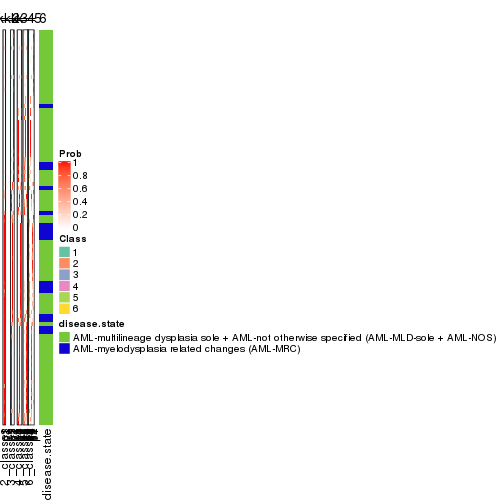


Test correlation between subgroups and known annotations. If the known
annotation is numeric, one-way ANOVA test is applied, and if the known
annotation is discrete, chi-squared contingency table test is applied.

```r
test_to_known_factors(res)
```

```
#>          n disease.state(p) k
#> MAD:NMF 93          0.16845 2
#> MAD:NMF 89          0.00355 3
#> MAD:NMF 87          0.02678 4
#> MAD:NMF 79          0.00390 5
#> MAD:NMF 60          0.05235 6
```


If matrix rows can be associated to genes, consider to use `functional_enrichment(res,
...)` to perform function enrichment for the signature genes. See [this vignette](http://bioconductor.org/packages/devel/bioc/vignettes/cola/inst/doc/functional_enrichment.html) for more detailed explanations.


 

---------------------------------------------------


### ATC:hclust


The object with results only for a single top-value method and a single partition method 
can be extracted as:

```r
res = res_list["ATC", "hclust"]
# you can also extract it by
# res = res_list["ATC:hclust"]
```

A summary of `res` and all the functions that can be applied to it:

```r
res
```

```
#> A 'ConsensusPartition' object with k = 2, 3, 4, 5, 6.
#>   On a matrix with 51941 rows and 96 columns.
#>   Top rows (1000, 2000, 3000, 4000, 5000) are extracted by 'ATC' method.
#>   Subgroups are detected by 'hclust' method.
#>   Performed in total 1250 partitions by row resampling.
#>   Best k for subgroups seems to be 4.
#> 
#> Following methods can be applied to this 'ConsensusPartition' object:
#>  [1] "cola_report"             "collect_classes"         "collect_plots"          
#>  [4] "collect_stats"           "colnames"                "compare_signatures"     
#>  [7] "consensus_heatmap"       "dimension_reduction"     "functional_enrichment"  
#> [10] "get_anno_col"            "get_anno"                "get_classes"            
#> [13] "get_consensus"           "get_matrix"              "get_membership"         
#> [16] "get_param"               "get_signatures"          "get_stats"              
#> [19] "is_best_k"               "is_stable_k"             "membership_heatmap"     
#> [22] "ncol"                    "nrow"                    "plot_ecdf"              
#> [25] "rownames"                "select_partition_number" "show"                   
#> [28] "suggest_best_k"          "test_to_known_factors"
```

`collect_plots()` function collects all the plots made from `res` for all `k` (number of partitions)
into one single page to provide an easy and fast comparison between different `k`.

```r
collect_plots(res)
```


The plots are:

- The first row: a plot of the ECDF (empirical cumulative distribution
  function) curves of the consensus matrix for each `k` and the heatmap of
  predicted classes for each `k`.
- The second row: heatmaps of the consensus matrix for each `k`.
- The third row: heatmaps of the membership matrix for each `k`.
- The fouth row: heatmaps of the signatures for each `k`.

All the plots in panels can be made by individual functions and they are
plotted later in this section.

`select_partition_number()` produces several plots showing different
statistics for choosing "optimized" `k`. There are following statistics:

- ECDF curves of the consensus matrix for each `k`;
- 1-PAC. [The PAC
  score](https://en.wikipedia.org/wiki/Consensus_clustering#Over-interpretation_potential_of_consensus_clustering)
  measures the proportion of the ambiguous subgrouping.
- Mean silhouette score.
- Concordance. The mean probability of fiting the consensus class ids in all
  partitions.
- Area increased. Denote $A_k$ as the area under the ECDF curve for current
  `k`, the area increased is defined as $A_k - A_{k-1}$.
- Rand index. The percent of pairs of samples that are both in a same cluster
  or both are not in a same cluster in the partition of k and k-1.
- Jaccard index. The ratio of pairs of samples are both in a same cluster in
  the partition of k and k-1 and the pairs of samples are both in a same
  cluster in the partition k or k-1.

The detailed explanations of these statistics can be found in [the _cola_
vignette](http://bioconductor.org/packages/devel/bioc/vignettes/cola/inst/doc/cola.html#toc_13).

Generally speaking, lower PAC score, higher mean silhouette score or higher
concordance corresponds to better partition. Rand index and Jaccard index
measure how similar the current partition is compared to partition with `k-1`.
If they are too similar, we won't accept `k` is better than `k-1`.

```r
select_partition_number(res)
```


The numeric values for all these statistics can be obtained by `get_stats()`.

```r
get_stats(res)
```

```
#>   k 1-PAC mean_silhouette concordance area_increased  Rand Jaccard
#> 2 2 0.891           0.929       0.968         0.4161 0.582   0.582
#> 3 3 0.617           0.885       0.897         0.5096 0.764   0.595
#> 4 4 0.786           0.879       0.932         0.1068 0.951   0.861
#> 5 5 0.748           0.804       0.872         0.0771 1.000   1.000
#> 6 6 0.759           0.749       0.862         0.0309 0.907   0.700
```

`suggest_best_k()` suggests the best $k$ based on these statistics. The rules are as follows:

- All $k$ with Jaccard index larger than 0.95 are removed because increasing
  $k$ does not provide enough extra information. If all $k$ are removed, it is
  marked as no subgroup is detected.
- For all $k$ with 1-PAC score larger than 0.9, the maximal $k$ is taken as
  the best $k$, and other $k$ are marked as optional $k$.
- If it does not fit the second rule. The $k$ with the maximal vote of the
  highest 1-PAC score, highest mean silhouette, and highest concordance is
  taken as the best $k$.

```r
suggest_best_k(res)
```

```
#> [1] 4
```


Following shows the table of the partitions (You need to click the **show/hide
code output** link to see it). The membership matrix (columns with name `p*`)
is inferred by
[`clue::cl_consensus()`](https://www.rdocumentation.org/link/cl_consensus?package=clue)
function with the `SE` method. Basically the value in the membership matrix
represents the probability to belong to a certain group. The finall class
label for an item is determined with the group with highest probability it
belongs to.

In `get_classes()` function, the entropy is calculated from the membership
matrix and the silhouette score is calculated from the consensus matrix.


<script>
$( function() {
	$( '#tabs-ATC-hclust-get-classes' ).tabs();
} );
</script>
<div id='tabs-ATC-hclust-get-classes'>
<ul>
<li><a href='#tab-ATC-hclust-get-classes-1'>k = 2</a></li>
<li><a href='#tab-ATC-hclust-get-classes-2'>k = 3</a></li>
<li><a href='#tab-ATC-hclust-get-classes-3'>k = 4</a></li>
<li><a href='#tab-ATC-hclust-get-classes-4'>k = 5</a></li>
<li><a href='#tab-ATC-hclust-get-classes-5'>k = 6</a></li>
</ul>

<div id='tab-ATC-hclust-get-classes-1'>
<p><a id='tab-ATC-hclust-get-classes-1-a' style='color:#0366d6' href='#'>show/hide code output</a></p>
<pre><code class="r">cbind(get_classes(res, k = 2), get_membership(res, k = 2))
</code></pre>

<pre><code>#&gt;           class entropy silhouette    p1    p2
#&gt; GSM531600     1  0.0376      0.974 0.996 0.004
#&gt; GSM531601     1  0.7745      0.703 0.772 0.228
#&gt; GSM531605     1  0.0000      0.974 1.000 0.000
#&gt; GSM531615     2  0.0000      0.945 0.000 1.000
#&gt; GSM531617     2  0.0376      0.946 0.004 0.996
#&gt; GSM531624     2  0.0000      0.945 0.000 1.000
#&gt; GSM531627     2  0.1184      0.942 0.016 0.984
#&gt; GSM531629     2  0.2603      0.924 0.044 0.956
#&gt; GSM531631     2  0.3114      0.915 0.056 0.944
#&gt; GSM531634     2  0.0376      0.946 0.004 0.996
#&gt; GSM531636     1  0.6438      0.800 0.836 0.164
#&gt; GSM531637     2  0.0000      0.945 0.000 1.000
#&gt; GSM531654     2  0.7674      0.726 0.224 0.776
#&gt; GSM531655     1  0.0000      0.974 1.000 0.000
#&gt; GSM531658     1  0.0376      0.974 0.996 0.004
#&gt; GSM531660     1  0.0000      0.974 1.000 0.000
#&gt; GSM531602     1  0.0000      0.974 1.000 0.000
#&gt; GSM531603     1  0.0000      0.974 1.000 0.000
#&gt; GSM531604     1  0.0376      0.974 0.996 0.004
#&gt; GSM531606     1  0.0376      0.974 0.996 0.004
#&gt; GSM531607     1  0.0000      0.974 1.000 0.000
#&gt; GSM531608     2  0.0000      0.945 0.000 1.000
#&gt; GSM531609     1  0.2603      0.939 0.956 0.044
#&gt; GSM531610     1  0.0376      0.974 0.996 0.004
#&gt; GSM531611     1  0.0000      0.974 1.000 0.000
#&gt; GSM531612     1  0.0000      0.974 1.000 0.000
#&gt; GSM531613     1  0.0000      0.974 1.000 0.000
#&gt; GSM531614     1  0.2603      0.939 0.956 0.044
#&gt; GSM531616     2  0.0376      0.946 0.004 0.996
#&gt; GSM531618     1  0.0376      0.974 0.996 0.004
#&gt; GSM531619     2  0.0000      0.945 0.000 1.000
#&gt; GSM531620     2  0.1184      0.942 0.016 0.984
#&gt; GSM531621     2  0.0000      0.945 0.000 1.000
#&gt; GSM531622     2  0.0376      0.946 0.004 0.996
#&gt; GSM531623     2  0.0376      0.946 0.004 0.996
#&gt; GSM531625     2  0.0000      0.945 0.000 1.000
#&gt; GSM531626     2  0.6048      0.828 0.148 0.852
#&gt; GSM531628     1  0.9944      0.124 0.544 0.456
#&gt; GSM531630     2  0.0376      0.946 0.004 0.996
#&gt; GSM531632     1  0.8443      0.621 0.728 0.272
#&gt; GSM531633     2  0.0000      0.945 0.000 1.000
#&gt; GSM531635     2  0.0376      0.946 0.004 0.996
#&gt; GSM531638     2  0.9522      0.442 0.372 0.628
#&gt; GSM531639     1  0.0376      0.974 0.996 0.004
#&gt; GSM531640     2  0.0376      0.946 0.004 0.996
#&gt; GSM531641     1  0.0376      0.974 0.996 0.004
#&gt; GSM531642     1  0.0376      0.974 0.996 0.004
#&gt; GSM531643     1  0.0376      0.974 0.996 0.004
#&gt; GSM531644     1  0.0376      0.974 0.996 0.004
#&gt; GSM531645     1  0.0376      0.974 0.996 0.004
#&gt; GSM531646     2  0.9248      0.516 0.340 0.660
#&gt; GSM531647     1  0.6712      0.784 0.824 0.176
#&gt; GSM531648     1  0.0376      0.974 0.996 0.004
#&gt; GSM531649     2  0.6048      0.828 0.148 0.852
#&gt; GSM531650     1  0.0376      0.974 0.996 0.004
#&gt; GSM531651     2  0.0000      0.945 0.000 1.000
#&gt; GSM531652     1  0.0376      0.974 0.996 0.004
#&gt; GSM531653     1  0.4161      0.898 0.916 0.084
#&gt; GSM531656     1  0.0376      0.974 0.996 0.004
#&gt; GSM531657     1  0.0000      0.974 1.000 0.000
#&gt; GSM531659     1  0.0376      0.974 0.996 0.004
#&gt; GSM531661     2  0.0672      0.945 0.008 0.992
#&gt; GSM531662     1  0.0672      0.971 0.992 0.008
#&gt; GSM531663     1  0.0376      0.974 0.996 0.004
#&gt; GSM531664     1  0.0000      0.974 1.000 0.000
#&gt; GSM531665     1  0.0376      0.974 0.996 0.004
#&gt; GSM531666     1  0.0000      0.974 1.000 0.000
#&gt; GSM531667     2  0.0672      0.945 0.008 0.992
#&gt; GSM531668     1  0.0376      0.974 0.996 0.004
#&gt; GSM531669     1  0.0376      0.974 0.996 0.004
#&gt; GSM531670     1  0.0376      0.974 0.996 0.004
#&gt; GSM531671     1  0.3274      0.924 0.940 0.060
#&gt; GSM531672     1  0.0000      0.974 1.000 0.000
#&gt; GSM531673     1  0.0376      0.974 0.996 0.004
#&gt; GSM531674     1  0.0376      0.974 0.996 0.004
#&gt; GSM531675     1  0.0000      0.974 1.000 0.000
#&gt; GSM531676     1  0.0000      0.974 1.000 0.000
#&gt; GSM531677     1  0.0000      0.974 1.000 0.000
#&gt; GSM531678     1  0.0000      0.974 1.000 0.000
#&gt; GSM531679     1  0.0000      0.974 1.000 0.000
#&gt; GSM531680     1  0.0000      0.974 1.000 0.000
#&gt; GSM531681     1  0.0000      0.974 1.000 0.000
#&gt; GSM531682     1  0.0000      0.974 1.000 0.000
#&gt; GSM531683     1  0.0000      0.974 1.000 0.000
#&gt; GSM531684     1  0.0376      0.974 0.996 0.004
#&gt; GSM531685     1  0.0000      0.974 1.000 0.000
#&gt; GSM531686     1  0.0000      0.974 1.000 0.000
#&gt; GSM531687     1  0.0000      0.974 1.000 0.000
#&gt; GSM531688     1  0.0000      0.974 1.000 0.000
#&gt; GSM531689     1  0.0000      0.974 1.000 0.000
#&gt; GSM531690     1  0.0000      0.974 1.000 0.000
#&gt; GSM531691     1  0.0000      0.974 1.000 0.000
#&gt; GSM531692     1  0.0376      0.974 0.996 0.004
#&gt; GSM531693     1  0.0000      0.974 1.000 0.000
#&gt; GSM531694     1  0.0000      0.974 1.000 0.000
#&gt; GSM531695     1  0.0000      0.974 1.000 0.000
</code></pre>

<script>
$('#tab-ATC-hclust-get-classes-1-a').parent().next().next().hide();
$('#tab-ATC-hclust-get-classes-1-a').click(function(){
  $('#tab-ATC-hclust-get-classes-1-a').parent().next().next().toggle();
  return(false);
});
</script>
</div>

<div id='tab-ATC-hclust-get-classes-2'>
<p><a id='tab-ATC-hclust-get-classes-2-a' style='color:#0366d6' href='#'>show/hide code output</a></p>
<pre><code class="r">cbind(get_classes(res, k = 3), get_membership(res, k = 3))
</code></pre>

<pre><code>#&gt;           class entropy silhouette    p1    p2    p3
#&gt; GSM531600     3   0.400      0.913 0.160 0.000 0.840
#&gt; GSM531601     3   0.312      0.674 0.000 0.108 0.892
#&gt; GSM531605     1   0.216      0.918 0.936 0.000 0.064
#&gt; GSM531615     2   0.141      0.866 0.000 0.964 0.036
#&gt; GSM531617     2   0.341      0.905 0.000 0.876 0.124
#&gt; GSM531624     2   0.141      0.866 0.000 0.964 0.036
#&gt; GSM531627     2   0.362      0.903 0.000 0.864 0.136
#&gt; GSM531629     2   0.406      0.891 0.000 0.836 0.164
#&gt; GSM531631     2   0.424      0.886 0.000 0.824 0.176
#&gt; GSM531634     2   0.341      0.905 0.000 0.876 0.124
#&gt; GSM531636     3   0.164      0.754 0.000 0.044 0.956
#&gt; GSM531637     2   0.141      0.866 0.000 0.964 0.036
#&gt; GSM531654     2   0.586      0.698 0.000 0.656 0.344
#&gt; GSM531655     3   0.529      0.848 0.268 0.000 0.732
#&gt; GSM531658     3   0.412      0.916 0.168 0.000 0.832
#&gt; GSM531660     3   0.550      0.823 0.292 0.000 0.708
#&gt; GSM531602     1   0.000      0.990 1.000 0.000 0.000
#&gt; GSM531603     1   0.216      0.918 0.936 0.000 0.064
#&gt; GSM531604     3   0.435      0.911 0.184 0.000 0.816
#&gt; GSM531606     3   0.440      0.910 0.188 0.000 0.812
#&gt; GSM531607     1   0.216      0.918 0.936 0.000 0.064
#&gt; GSM531608     2   0.245      0.896 0.000 0.924 0.076
#&gt; GSM531609     3   0.319      0.884 0.112 0.000 0.888
#&gt; GSM531610     3   0.394      0.911 0.156 0.000 0.844
#&gt; GSM531611     1   0.000      0.990 1.000 0.000 0.000
#&gt; GSM531612     1   0.000      0.990 1.000 0.000 0.000
#&gt; GSM531613     1   0.000      0.990 1.000 0.000 0.000
#&gt; GSM531614     3   0.319      0.884 0.112 0.000 0.888
#&gt; GSM531616     2   0.341      0.905 0.000 0.876 0.124
#&gt; GSM531618     3   0.412      0.916 0.168 0.000 0.832
#&gt; GSM531619     2   0.141      0.866 0.000 0.964 0.036
#&gt; GSM531620     2   0.362      0.903 0.000 0.864 0.136
#&gt; GSM531621     2   0.141      0.866 0.000 0.964 0.036
#&gt; GSM531622     2   0.341      0.905 0.000 0.876 0.124
#&gt; GSM531623     2   0.341      0.905 0.000 0.876 0.124
#&gt; GSM531625     2   0.141      0.866 0.000 0.964 0.036
#&gt; GSM531626     2   0.529      0.809 0.000 0.732 0.268
#&gt; GSM531628     3   0.581      0.134 0.000 0.336 0.664
#&gt; GSM531630     2   0.341      0.905 0.000 0.876 0.124
#&gt; GSM531632     3   0.522      0.606 0.024 0.176 0.800
#&gt; GSM531633     2   0.141      0.866 0.000 0.964 0.036
#&gt; GSM531635     2   0.341      0.905 0.000 0.876 0.124
#&gt; GSM531638     2   0.631      0.425 0.000 0.508 0.492
#&gt; GSM531639     3   0.455      0.903 0.200 0.000 0.800
#&gt; GSM531640     2   0.341      0.905 0.000 0.876 0.124
#&gt; GSM531641     3   0.518      0.861 0.256 0.000 0.744
#&gt; GSM531642     3   0.484      0.888 0.224 0.000 0.776
#&gt; GSM531643     3   0.412      0.916 0.168 0.000 0.832
#&gt; GSM531644     3   0.412      0.916 0.168 0.000 0.832
#&gt; GSM531645     3   0.412      0.916 0.168 0.000 0.832
#&gt; GSM531646     2   0.628      0.498 0.000 0.540 0.460
#&gt; GSM531647     3   0.196      0.741 0.000 0.056 0.944
#&gt; GSM531648     3   0.412      0.916 0.168 0.000 0.832
#&gt; GSM531649     2   0.529      0.809 0.000 0.732 0.268
#&gt; GSM531650     3   0.412      0.916 0.168 0.000 0.832
#&gt; GSM531651     2   0.141      0.866 0.000 0.964 0.036
#&gt; GSM531652     3   0.412      0.916 0.168 0.000 0.832
#&gt; GSM531653     3   0.259      0.848 0.072 0.004 0.924
#&gt; GSM531656     3   0.412      0.916 0.168 0.000 0.832
#&gt; GSM531657     3   0.550      0.823 0.292 0.000 0.708
#&gt; GSM531659     3   0.484      0.888 0.224 0.000 0.776
#&gt; GSM531661     2   0.348      0.905 0.000 0.872 0.128
#&gt; GSM531662     3   0.388      0.910 0.152 0.000 0.848
#&gt; GSM531663     3   0.412      0.916 0.168 0.000 0.832
#&gt; GSM531664     3   0.550      0.823 0.292 0.000 0.708
#&gt; GSM531665     3   0.412      0.916 0.168 0.000 0.832
#&gt; GSM531666     3   0.550      0.823 0.292 0.000 0.708
#&gt; GSM531667     2   0.348      0.905 0.000 0.872 0.128
#&gt; GSM531668     3   0.412      0.916 0.168 0.000 0.832
#&gt; GSM531669     3   0.418      0.914 0.172 0.000 0.828
#&gt; GSM531670     3   0.400      0.913 0.160 0.000 0.840
#&gt; GSM531671     3   0.377      0.878 0.112 0.012 0.876
#&gt; GSM531672     3   0.536      0.841 0.276 0.000 0.724
#&gt; GSM531673     3   0.412      0.916 0.168 0.000 0.832
#&gt; GSM531674     3   0.400      0.913 0.160 0.000 0.840
#&gt; GSM531675     1   0.000      0.990 1.000 0.000 0.000
#&gt; GSM531676     1   0.000      0.990 1.000 0.000 0.000
#&gt; GSM531677     1   0.000      0.990 1.000 0.000 0.000
#&gt; GSM531678     1   0.000      0.990 1.000 0.000 0.000
#&gt; GSM531679     1   0.000      0.990 1.000 0.000 0.000
#&gt; GSM531680     1   0.000      0.990 1.000 0.000 0.000
#&gt; GSM531681     1   0.000      0.990 1.000 0.000 0.000
#&gt; GSM531682     1   0.000      0.990 1.000 0.000 0.000
#&gt; GSM531683     1   0.000      0.990 1.000 0.000 0.000
#&gt; GSM531684     3   0.435      0.911 0.184 0.000 0.816
#&gt; GSM531685     1   0.000      0.990 1.000 0.000 0.000
#&gt; GSM531686     1   0.000      0.990 1.000 0.000 0.000
#&gt; GSM531687     1   0.000      0.990 1.000 0.000 0.000
#&gt; GSM531688     1   0.000      0.990 1.000 0.000 0.000
#&gt; GSM531689     1   0.000      0.990 1.000 0.000 0.000
#&gt; GSM531690     1   0.000      0.990 1.000 0.000 0.000
#&gt; GSM531691     1   0.000      0.990 1.000 0.000 0.000
#&gt; GSM531692     3   0.435      0.911 0.184 0.000 0.816
#&gt; GSM531693     3   0.573      0.763 0.324 0.000 0.676
#&gt; GSM531694     1   0.000      0.990 1.000 0.000 0.000
#&gt; GSM531695     1   0.000      0.990 1.000 0.000 0.000
</code></pre>

<script>
$('#tab-ATC-hclust-get-classes-2-a').parent().next().next().hide();
$('#tab-ATC-hclust-get-classes-2-a').click(function(){
  $('#tab-ATC-hclust-get-classes-2-a').parent().next().next().toggle();
  return(false);
});
</script>
</div>

<div id='tab-ATC-hclust-get-classes-3'>
<p><a id='tab-ATC-hclust-get-classes-3-a' style='color:#0366d6' href='#'>show/hide code output</a></p>
<pre><code class="r">cbind(get_classes(res, k = 4), get_membership(res, k = 4))
</code></pre>

<pre><code>#&gt;           class entropy silhouette    p1    p2    p3    p4
#&gt; GSM531600     3  0.1004     0.9038 0.004 0.000 0.972 0.024
#&gt; GSM531601     3  0.5550     0.6017 0.000 0.248 0.692 0.060
#&gt; GSM531605     1  0.2401     0.8777 0.904 0.000 0.092 0.004
#&gt; GSM531615     4  0.1792     1.0000 0.000 0.068 0.000 0.932
#&gt; GSM531617     2  0.0592     0.8607 0.000 0.984 0.000 0.016
#&gt; GSM531624     4  0.1792     1.0000 0.000 0.068 0.000 0.932
#&gt; GSM531627     2  0.0524     0.8594 0.000 0.988 0.004 0.008
#&gt; GSM531629     2  0.0937     0.8508 0.000 0.976 0.012 0.012
#&gt; GSM531631     2  0.1256     0.8438 0.000 0.964 0.028 0.008
#&gt; GSM531634     2  0.0592     0.8607 0.000 0.984 0.000 0.016
#&gt; GSM531636     3  0.4990     0.7087 0.000 0.184 0.756 0.060
#&gt; GSM531637     4  0.1792     1.0000 0.000 0.068 0.000 0.932
#&gt; GSM531654     2  0.4462     0.6921 0.000 0.792 0.164 0.044
#&gt; GSM531655     3  0.2760     0.8518 0.128 0.000 0.872 0.000
#&gt; GSM531658     3  0.0336     0.9105 0.008 0.000 0.992 0.000
#&gt; GSM531660     3  0.3444     0.8060 0.184 0.000 0.816 0.000
#&gt; GSM531602     1  0.0000     0.9841 1.000 0.000 0.000 0.000
#&gt; GSM531603     1  0.2401     0.8777 0.904 0.000 0.092 0.004
#&gt; GSM531604     3  0.1042     0.9086 0.020 0.000 0.972 0.008
#&gt; GSM531606     3  0.1151     0.9079 0.024 0.000 0.968 0.008
#&gt; GSM531607     1  0.2401     0.8777 0.904 0.000 0.092 0.004
#&gt; GSM531608     2  0.3024     0.7244 0.000 0.852 0.000 0.148
#&gt; GSM531609     3  0.2759     0.8644 0.000 0.044 0.904 0.052
#&gt; GSM531610     3  0.1661     0.8914 0.004 0.000 0.944 0.052
#&gt; GSM531611     1  0.0000     0.9841 1.000 0.000 0.000 0.000
#&gt; GSM531612     1  0.0000     0.9841 1.000 0.000 0.000 0.000
#&gt; GSM531613     1  0.0000     0.9841 1.000 0.000 0.000 0.000
#&gt; GSM531614     3  0.2759     0.8644 0.000 0.044 0.904 0.052
#&gt; GSM531616     2  0.0592     0.8607 0.000 0.984 0.000 0.016
#&gt; GSM531618     3  0.0336     0.9105 0.008 0.000 0.992 0.000
#&gt; GSM531619     4  0.1792     1.0000 0.000 0.068 0.000 0.932
#&gt; GSM531620     2  0.0524     0.8594 0.000 0.988 0.004 0.008
#&gt; GSM531621     4  0.1792     1.0000 0.000 0.068 0.000 0.932
#&gt; GSM531622     2  0.0592     0.8607 0.000 0.984 0.000 0.016
#&gt; GSM531623     2  0.0592     0.8607 0.000 0.984 0.000 0.016
#&gt; GSM531625     4  0.1792     1.0000 0.000 0.068 0.000 0.932
#&gt; GSM531626     2  0.3160     0.7780 0.000 0.872 0.108 0.020
#&gt; GSM531628     2  0.6337     0.0374 0.000 0.476 0.464 0.060
#&gt; GSM531630     2  0.0592     0.8607 0.000 0.984 0.000 0.016
#&gt; GSM531632     3  0.5791     0.5171 0.000 0.284 0.656 0.060
#&gt; GSM531633     4  0.1792     1.0000 0.000 0.068 0.000 0.932
#&gt; GSM531635     2  0.0592     0.8607 0.000 0.984 0.000 0.016
#&gt; GSM531638     2  0.5742     0.5376 0.000 0.648 0.300 0.052
#&gt; GSM531639     3  0.1211     0.9031 0.040 0.000 0.960 0.000
#&gt; GSM531640     2  0.0592     0.8607 0.000 0.984 0.000 0.016
#&gt; GSM531641     3  0.2760     0.8546 0.128 0.000 0.872 0.000
#&gt; GSM531642     3  0.2281     0.8770 0.096 0.000 0.904 0.000
#&gt; GSM531643     3  0.0336     0.9105 0.008 0.000 0.992 0.000
#&gt; GSM531644     3  0.0336     0.9105 0.008 0.000 0.992 0.000
#&gt; GSM531645     3  0.0336     0.9105 0.008 0.000 0.992 0.000
#&gt; GSM531646     2  0.5498     0.5729 0.000 0.680 0.272 0.048
#&gt; GSM531647     3  0.5109     0.6907 0.000 0.196 0.744 0.060
#&gt; GSM531648     3  0.0336     0.9105 0.008 0.000 0.992 0.000
#&gt; GSM531649     2  0.3160     0.7780 0.000 0.872 0.108 0.020
#&gt; GSM531650     3  0.0336     0.9105 0.008 0.000 0.992 0.000
#&gt; GSM531651     4  0.1792     1.0000 0.000 0.068 0.000 0.932
#&gt; GSM531652     3  0.0336     0.9105 0.008 0.000 0.992 0.000
#&gt; GSM531653     3  0.3935     0.8095 0.000 0.100 0.840 0.060
#&gt; GSM531656     3  0.0336     0.9105 0.008 0.000 0.992 0.000
#&gt; GSM531657     3  0.3356     0.8131 0.176 0.000 0.824 0.000
#&gt; GSM531659     3  0.2281     0.8770 0.096 0.000 0.904 0.000
#&gt; GSM531661     2  0.0707     0.8602 0.000 0.980 0.000 0.020
#&gt; GSM531662     3  0.1305     0.8959 0.000 0.004 0.960 0.036
#&gt; GSM531663     3  0.0524     0.9101 0.008 0.000 0.988 0.004
#&gt; GSM531664     3  0.3444     0.8060 0.184 0.000 0.816 0.000
#&gt; GSM531665     3  0.0524     0.9101 0.008 0.000 0.988 0.004
#&gt; GSM531666     3  0.3444     0.8060 0.184 0.000 0.816 0.000
#&gt; GSM531667     2  0.0707     0.8602 0.000 0.980 0.000 0.020
#&gt; GSM531668     3  0.0336     0.9105 0.008 0.000 0.992 0.000
#&gt; GSM531669     3  0.1256     0.9078 0.028 0.000 0.964 0.008
#&gt; GSM531670     3  0.0524     0.9078 0.004 0.000 0.988 0.008
#&gt; GSM531671     3  0.2908     0.8577 0.000 0.064 0.896 0.040
#&gt; GSM531672     3  0.2868     0.8458 0.136 0.000 0.864 0.000
#&gt; GSM531673     3  0.0524     0.9101 0.008 0.000 0.988 0.004
#&gt; GSM531674     3  0.0524     0.9078 0.004 0.000 0.988 0.008
#&gt; GSM531675     1  0.0000     0.9841 1.000 0.000 0.000 0.000
#&gt; GSM531676     1  0.0000     0.9841 1.000 0.000 0.000 0.000
#&gt; GSM531677     1  0.0000     0.9841 1.000 0.000 0.000 0.000
#&gt; GSM531678     1  0.0000     0.9841 1.000 0.000 0.000 0.000
#&gt; GSM531679     1  0.0000     0.9841 1.000 0.000 0.000 0.000
#&gt; GSM531680     1  0.0000     0.9841 1.000 0.000 0.000 0.000
#&gt; GSM531681     1  0.0000     0.9841 1.000 0.000 0.000 0.000
#&gt; GSM531682     1  0.0000     0.9841 1.000 0.000 0.000 0.000
#&gt; GSM531683     1  0.0000     0.9841 1.000 0.000 0.000 0.000
#&gt; GSM531684     3  0.1042     0.9086 0.020 0.000 0.972 0.008
#&gt; GSM531685     1  0.0000     0.9841 1.000 0.000 0.000 0.000
#&gt; GSM531686     1  0.0000     0.9841 1.000 0.000 0.000 0.000
#&gt; GSM531687     1  0.0000     0.9841 1.000 0.000 0.000 0.000
#&gt; GSM531688     1  0.0000     0.9841 1.000 0.000 0.000 0.000
#&gt; GSM531689     1  0.0000     0.9841 1.000 0.000 0.000 0.000
#&gt; GSM531690     1  0.0000     0.9841 1.000 0.000 0.000 0.000
#&gt; GSM531691     1  0.0000     0.9841 1.000 0.000 0.000 0.000
#&gt; GSM531692     3  0.1042     0.9086 0.020 0.000 0.972 0.008
#&gt; GSM531693     3  0.4011     0.7600 0.208 0.000 0.784 0.008
#&gt; GSM531694     1  0.0000     0.9841 1.000 0.000 0.000 0.000
#&gt; GSM531695     1  0.0000     0.9841 1.000 0.000 0.000 0.000
</code></pre>

<script>
$('#tab-ATC-hclust-get-classes-3-a').parent().next().next().hide();
$('#tab-ATC-hclust-get-classes-3-a').click(function(){
  $('#tab-ATC-hclust-get-classes-3-a').parent().next().next().toggle();
  return(false);
});
</script>
</div>

<div id='tab-ATC-hclust-get-classes-4'>
<p><a id='tab-ATC-hclust-get-classes-4-a' style='color:#0366d6' href='#'>show/hide code output</a></p>
<pre><code class="r">cbind(get_classes(res, k = 5), get_membership(res, k = 5))
</code></pre>

<pre><code>#&gt;           class entropy silhouette    p1    p2    p3 p4    p5
#&gt; GSM531600     3  0.2773      0.738 0.000 0.000 0.836 NA 0.000
#&gt; GSM531601     3  0.6526      0.319 0.000 0.204 0.452 NA 0.000
#&gt; GSM531605     1  0.2535      0.881 0.892 0.000 0.076 NA 0.000
#&gt; GSM531615     5  0.0290      1.000 0.000 0.008 0.000 NA 0.992
#&gt; GSM531617     2  0.0290      0.884 0.000 0.992 0.000 NA 0.008
#&gt; GSM531624     5  0.0290      1.000 0.000 0.008 0.000 NA 0.992
#&gt; GSM531627     2  0.0960      0.883 0.000 0.972 0.004 NA 0.008
#&gt; GSM531629     2  0.1168      0.878 0.000 0.960 0.008 NA 0.000
#&gt; GSM531631     2  0.1518      0.874 0.000 0.944 0.004 NA 0.004
#&gt; GSM531634     2  0.0290      0.884 0.000 0.992 0.000 NA 0.008
#&gt; GSM531636     3  0.6112      0.446 0.000 0.140 0.516 NA 0.000
#&gt; GSM531637     5  0.0290      1.000 0.000 0.008 0.000 NA 0.992
#&gt; GSM531654     2  0.4417      0.729 0.000 0.760 0.092 NA 0.000
#&gt; GSM531655     3  0.3427      0.739 0.108 0.000 0.836 NA 0.000
#&gt; GSM531658     3  0.0510      0.778 0.000 0.000 0.984 NA 0.000
#&gt; GSM531660     3  0.4724      0.686 0.164 0.000 0.732 NA 0.000
#&gt; GSM531602     1  0.0000      0.984 1.000 0.000 0.000 NA 0.000
#&gt; GSM531603     1  0.2535      0.881 0.892 0.000 0.076 NA 0.000
#&gt; GSM531604     3  0.4434      0.502 0.000 0.000 0.536 NA 0.004
#&gt; GSM531606     3  0.4580      0.501 0.004 0.000 0.532 NA 0.004
#&gt; GSM531607     1  0.2535      0.881 0.892 0.000 0.076 NA 0.000
#&gt; GSM531608     2  0.3875      0.719 0.000 0.804 0.000 NA 0.124
#&gt; GSM531609     3  0.4299      0.581 0.000 0.000 0.608 NA 0.004
#&gt; GSM531610     3  0.4347      0.652 0.004 0.000 0.636 NA 0.004
#&gt; GSM531611     1  0.0000      0.984 1.000 0.000 0.000 NA 0.000
#&gt; GSM531612     1  0.0000      0.984 1.000 0.000 0.000 NA 0.000
#&gt; GSM531613     1  0.0000      0.984 1.000 0.000 0.000 NA 0.000
#&gt; GSM531614     3  0.4299      0.581 0.000 0.000 0.608 NA 0.004
#&gt; GSM531616     2  0.0290      0.884 0.000 0.992 0.000 NA 0.008
#&gt; GSM531618     3  0.0880      0.778 0.000 0.000 0.968 NA 0.000
#&gt; GSM531619     5  0.0290      1.000 0.000 0.008 0.000 NA 0.992
#&gt; GSM531620     2  0.0960      0.883 0.000 0.972 0.004 NA 0.008
#&gt; GSM531621     5  0.0290      1.000 0.000 0.008 0.000 NA 0.992
#&gt; GSM531622     2  0.0290      0.884 0.000 0.992 0.000 NA 0.008
#&gt; GSM531623     2  0.0290      0.884 0.000 0.992 0.000 NA 0.008
#&gt; GSM531625     5  0.0290      1.000 0.000 0.008 0.000 NA 0.992
#&gt; GSM531626     2  0.3035      0.819 0.000 0.856 0.032 NA 0.000
#&gt; GSM531628     2  0.6645      0.289 0.000 0.432 0.236 NA 0.000
#&gt; GSM531630     2  0.0290      0.884 0.000 0.992 0.000 NA 0.008
#&gt; GSM531632     3  0.6660      0.233 0.000 0.244 0.432 NA 0.000
#&gt; GSM531633     5  0.0290      1.000 0.000 0.008 0.000 NA 0.992
#&gt; GSM531635     2  0.0290      0.884 0.000 0.992 0.000 NA 0.008
#&gt; GSM531638     2  0.5594      0.627 0.000 0.632 0.136 NA 0.000
#&gt; GSM531639     3  0.1872      0.768 0.020 0.000 0.928 NA 0.000
#&gt; GSM531640     2  0.0290      0.884 0.000 0.992 0.000 NA 0.008
#&gt; GSM531641     3  0.4123      0.723 0.108 0.000 0.788 NA 0.000
#&gt; GSM531642     3  0.3639      0.742 0.076 0.000 0.824 NA 0.000
#&gt; GSM531643     3  0.0162      0.779 0.000 0.000 0.996 NA 0.000
#&gt; GSM531644     3  0.0290      0.780 0.000 0.000 0.992 NA 0.000
#&gt; GSM531645     3  0.0290      0.780 0.000 0.000 0.992 NA 0.000
#&gt; GSM531646     2  0.5354      0.655 0.000 0.664 0.128 NA 0.000
#&gt; GSM531647     3  0.6206      0.425 0.000 0.152 0.504 NA 0.000
#&gt; GSM531648     3  0.0290      0.780 0.000 0.000 0.992 NA 0.000
#&gt; GSM531649     2  0.3035      0.819 0.000 0.856 0.032 NA 0.000
#&gt; GSM531650     3  0.0290      0.780 0.000 0.000 0.992 NA 0.000
#&gt; GSM531651     5  0.0290      1.000 0.000 0.008 0.000 NA 0.992
#&gt; GSM531652     3  0.0290      0.780 0.000 0.000 0.992 NA 0.000
#&gt; GSM531653     3  0.5029      0.618 0.000 0.060 0.648 NA 0.000
#&gt; GSM531656     3  0.0880      0.778 0.000 0.000 0.968 NA 0.000
#&gt; GSM531657     3  0.4648      0.692 0.156 0.000 0.740 NA 0.000
#&gt; GSM531659     3  0.3691      0.740 0.076 0.000 0.820 NA 0.000
#&gt; GSM531661     2  0.1168      0.877 0.000 0.960 0.000 NA 0.008
#&gt; GSM531662     3  0.3177      0.719 0.000 0.000 0.792 NA 0.000
#&gt; GSM531663     3  0.0794      0.780 0.000 0.000 0.972 NA 0.000
#&gt; GSM531664     3  0.4724      0.686 0.164 0.000 0.732 NA 0.000
#&gt; GSM531665     3  0.0794      0.780 0.000 0.000 0.972 NA 0.000
#&gt; GSM531666     3  0.4724      0.686 0.164 0.000 0.732 NA 0.000
#&gt; GSM531667     2  0.1168      0.877 0.000 0.960 0.000 NA 0.008
#&gt; GSM531668     3  0.0510      0.778 0.000 0.000 0.984 NA 0.000
#&gt; GSM531669     3  0.3409      0.752 0.024 0.000 0.816 NA 0.000
#&gt; GSM531670     3  0.2516      0.747 0.000 0.000 0.860 NA 0.000
#&gt; GSM531671     3  0.4197      0.683 0.000 0.028 0.728 NA 0.000
#&gt; GSM531672     3  0.4317      0.713 0.116 0.000 0.772 NA 0.000
#&gt; GSM531673     3  0.0794      0.780 0.000 0.000 0.972 NA 0.000
#&gt; GSM531674     3  0.2516      0.747 0.000 0.000 0.860 NA 0.000
#&gt; GSM531675     1  0.0000      0.984 1.000 0.000 0.000 NA 0.000
#&gt; GSM531676     1  0.0290      0.978 0.992 0.000 0.000 NA 0.000
#&gt; GSM531677     1  0.0000      0.984 1.000 0.000 0.000 NA 0.000
#&gt; GSM531678     1  0.0000      0.984 1.000 0.000 0.000 NA 0.000
#&gt; GSM531679     1  0.0000      0.984 1.000 0.000 0.000 NA 0.000
#&gt; GSM531680     1  0.0000      0.984 1.000 0.000 0.000 NA 0.000
#&gt; GSM531681     1  0.0000      0.984 1.000 0.000 0.000 NA 0.000
#&gt; GSM531682     1  0.0000      0.984 1.000 0.000 0.000 NA 0.000
#&gt; GSM531683     1  0.0000      0.984 1.000 0.000 0.000 NA 0.000
#&gt; GSM531684     3  0.4434      0.502 0.000 0.000 0.536 NA 0.004
#&gt; GSM531685     1  0.0290      0.978 0.992 0.000 0.000 NA 0.000
#&gt; GSM531686     1  0.0000      0.984 1.000 0.000 0.000 NA 0.000
#&gt; GSM531687     1  0.0000      0.984 1.000 0.000 0.000 NA 0.000
#&gt; GSM531688     1  0.0000      0.984 1.000 0.000 0.000 NA 0.000
#&gt; GSM531689     1  0.0000      0.984 1.000 0.000 0.000 NA 0.000
#&gt; GSM531690     1  0.0000      0.984 1.000 0.000 0.000 NA 0.000
#&gt; GSM531691     1  0.0000      0.984 1.000 0.000 0.000 NA 0.000
#&gt; GSM531692     3  0.4434      0.502 0.000 0.000 0.536 NA 0.004
#&gt; GSM531693     3  0.6634      0.368 0.188 0.000 0.424 NA 0.004
#&gt; GSM531694     1  0.0000      0.984 1.000 0.000 0.000 NA 0.000
#&gt; GSM531695     1  0.0000      0.984 1.000 0.000 0.000 NA 0.000
</code></pre>

<script>
$('#tab-ATC-hclust-get-classes-4-a').parent().next().next().hide();
$('#tab-ATC-hclust-get-classes-4-a').click(function(){
  $('#tab-ATC-hclust-get-classes-4-a').parent().next().next().toggle();
  return(false);
});
</script>
</div>

<div id='tab-ATC-hclust-get-classes-5'>
<p><a id='tab-ATC-hclust-get-classes-5-a' style='color:#0366d6' href='#'>show/hide code output</a></p>
<pre><code class="r">cbind(get_classes(res, k = 6), get_membership(res, k = 6))
</code></pre>

<pre><code>#&gt;           class entropy silhouette    p1    p2    p3    p4    p5    p6
#&gt; GSM531600     3  0.3789     0.4023 0.000 0.000 0.716 0.260 0.024 0.000
#&gt; GSM531601     4  0.5791     0.5627 0.000 0.192 0.336 0.472 0.000 0.000
#&gt; GSM531605     1  0.2331     0.8660 0.888 0.000 0.080 0.000 0.032 0.000
#&gt; GSM531615     6  0.0146     1.0000 0.000 0.004 0.000 0.000 0.000 0.996
#&gt; GSM531617     2  0.0000     0.8877 0.000 1.000 0.000 0.000 0.000 0.000
#&gt; GSM531624     6  0.0146     1.0000 0.000 0.004 0.000 0.000 0.000 0.996
#&gt; GSM531627     2  0.0603     0.8849 0.000 0.980 0.004 0.016 0.000 0.000
#&gt; GSM531629     2  0.1152     0.8764 0.000 0.952 0.004 0.044 0.000 0.000
#&gt; GSM531631     2  0.1204     0.8715 0.000 0.944 0.000 0.056 0.000 0.000
#&gt; GSM531634     2  0.0000     0.8877 0.000 1.000 0.000 0.000 0.000 0.000
#&gt; GSM531636     4  0.5492     0.5028 0.000 0.128 0.400 0.472 0.000 0.000
#&gt; GSM531637     6  0.0146     1.0000 0.000 0.004 0.000 0.000 0.000 0.996
#&gt; GSM531654     2  0.4046     0.6281 0.000 0.748 0.084 0.168 0.000 0.000
#&gt; GSM531655     3  0.3270     0.5773 0.092 0.000 0.840 0.016 0.052 0.000
#&gt; GSM531658     3  0.0363     0.7072 0.000 0.000 0.988 0.000 0.012 0.000
#&gt; GSM531660     3  0.4866     0.4247 0.144 0.000 0.708 0.024 0.124 0.000
#&gt; GSM531602     1  0.0146     0.9798 0.996 0.000 0.000 0.000 0.004 0.000
#&gt; GSM531603     1  0.2331     0.8660 0.888 0.000 0.080 0.000 0.032 0.000
#&gt; GSM531604     5  0.3695     0.8602 0.000 0.000 0.376 0.000 0.624 0.000
#&gt; GSM531606     5  0.3684     0.8608 0.000 0.000 0.372 0.000 0.628 0.000
#&gt; GSM531607     1  0.2331     0.8660 0.888 0.000 0.080 0.000 0.032 0.000
#&gt; GSM531608     2  0.5161     0.5460 0.000 0.656 0.000 0.152 0.180 0.012
#&gt; GSM531609     4  0.5306     0.3977 0.000 0.000 0.284 0.588 0.124 0.004
#&gt; GSM531610     4  0.5853     0.2506 0.000 0.000 0.292 0.504 0.200 0.004
#&gt; GSM531611     1  0.0000     0.9826 1.000 0.000 0.000 0.000 0.000 0.000
#&gt; GSM531612     1  0.0000     0.9826 1.000 0.000 0.000 0.000 0.000 0.000
#&gt; GSM531613     1  0.0000     0.9826 1.000 0.000 0.000 0.000 0.000 0.000
#&gt; GSM531614     4  0.5306     0.3977 0.000 0.000 0.284 0.588 0.124 0.004
#&gt; GSM531616     2  0.0000     0.8877 0.000 1.000 0.000 0.000 0.000 0.000
#&gt; GSM531618     3  0.1387     0.6943 0.000 0.000 0.932 0.068 0.000 0.000
#&gt; GSM531619     6  0.0146     1.0000 0.000 0.004 0.000 0.000 0.000 0.996
#&gt; GSM531620     2  0.0603     0.8849 0.000 0.980 0.004 0.016 0.000 0.000
#&gt; GSM531621     6  0.0146     1.0000 0.000 0.004 0.000 0.000 0.000 0.996
#&gt; GSM531622     2  0.0000     0.8877 0.000 1.000 0.000 0.000 0.000 0.000
#&gt; GSM531623     2  0.0000     0.8877 0.000 1.000 0.000 0.000 0.000 0.000
#&gt; GSM531625     6  0.0146     1.0000 0.000 0.004 0.000 0.000 0.000 0.996
#&gt; GSM531626     2  0.2815     0.7851 0.000 0.848 0.032 0.120 0.000 0.000
#&gt; GSM531628     4  0.5447     0.1488 0.000 0.420 0.120 0.460 0.000 0.000
#&gt; GSM531630     2  0.0000     0.8877 0.000 1.000 0.000 0.000 0.000 0.000
#&gt; GSM531632     4  0.5934     0.5727 0.000 0.232 0.320 0.448 0.000 0.000
#&gt; GSM531633     6  0.0146     1.0000 0.000 0.004 0.000 0.000 0.000 0.996
#&gt; GSM531635     2  0.0000     0.8877 0.000 1.000 0.000 0.000 0.000 0.000
#&gt; GSM531638     2  0.5055     0.4189 0.000 0.624 0.132 0.244 0.000 0.000
#&gt; GSM531639     3  0.1972     0.6676 0.004 0.000 0.916 0.024 0.056 0.000
#&gt; GSM531640     2  0.0000     0.8877 0.000 1.000 0.000 0.000 0.000 0.000
#&gt; GSM531641     3  0.4286     0.5159 0.088 0.000 0.764 0.024 0.124 0.000
#&gt; GSM531642     3  0.4008     0.5674 0.056 0.000 0.788 0.032 0.124 0.000
#&gt; GSM531643     3  0.0458     0.7141 0.000 0.000 0.984 0.016 0.000 0.000
#&gt; GSM531644     3  0.0547     0.7145 0.000 0.000 0.980 0.020 0.000 0.000
#&gt; GSM531645     3  0.0547     0.7145 0.000 0.000 0.980 0.020 0.000 0.000
#&gt; GSM531646     2  0.4860     0.4793 0.000 0.656 0.128 0.216 0.000 0.000
#&gt; GSM531647     4  0.5564     0.5239 0.000 0.140 0.388 0.472 0.000 0.000
#&gt; GSM531648     3  0.0547     0.7145 0.000 0.000 0.980 0.020 0.000 0.000
#&gt; GSM531649     2  0.2815     0.7851 0.000 0.848 0.032 0.120 0.000 0.000
#&gt; GSM531650     3  0.0547     0.7145 0.000 0.000 0.980 0.020 0.000 0.000
#&gt; GSM531651     6  0.0146     1.0000 0.000 0.004 0.000 0.000 0.000 0.996
#&gt; GSM531652     3  0.0547     0.7145 0.000 0.000 0.980 0.020 0.000 0.000
#&gt; GSM531653     3  0.4721    -0.2170 0.000 0.048 0.532 0.420 0.000 0.000
#&gt; GSM531656     3  0.1387     0.6943 0.000 0.000 0.932 0.068 0.000 0.000
#&gt; GSM531657     3  0.4794     0.4371 0.136 0.000 0.716 0.024 0.124 0.000
#&gt; GSM531659     3  0.3859     0.5610 0.056 0.000 0.796 0.024 0.124 0.000
#&gt; GSM531661     2  0.0865     0.8750 0.000 0.964 0.000 0.036 0.000 0.000
#&gt; GSM531662     3  0.4083     0.2910 0.000 0.000 0.668 0.304 0.028 0.000
#&gt; GSM531663     3  0.0806     0.7106 0.000 0.000 0.972 0.020 0.008 0.000
#&gt; GSM531664     3  0.4866     0.4247 0.144 0.000 0.708 0.024 0.124 0.000
#&gt; GSM531665     3  0.0806     0.7106 0.000 0.000 0.972 0.020 0.008 0.000
#&gt; GSM531666     3  0.4866     0.4247 0.144 0.000 0.708 0.024 0.124 0.000
#&gt; GSM531667     2  0.0865     0.8750 0.000 0.964 0.000 0.036 0.000 0.000
#&gt; GSM531668     3  0.0363     0.7072 0.000 0.000 0.988 0.000 0.012 0.000
#&gt; GSM531669     3  0.4594     0.4556 0.020 0.000 0.696 0.232 0.052 0.000
#&gt; GSM531670     3  0.3645     0.4546 0.000 0.000 0.740 0.236 0.024 0.000
#&gt; GSM531671     3  0.4749     0.0747 0.000 0.024 0.604 0.348 0.024 0.000
#&gt; GSM531672     3  0.4459     0.4777 0.096 0.000 0.748 0.024 0.132 0.000
#&gt; GSM531673     3  0.0806     0.7106 0.000 0.000 0.972 0.020 0.008 0.000
#&gt; GSM531674     3  0.3619     0.4609 0.000 0.000 0.744 0.232 0.024 0.000
#&gt; GSM531675     1  0.0000     0.9826 1.000 0.000 0.000 0.000 0.000 0.000
#&gt; GSM531676     1  0.0260     0.9764 0.992 0.000 0.000 0.000 0.008 0.000
#&gt; GSM531677     1  0.0000     0.9826 1.000 0.000 0.000 0.000 0.000 0.000
#&gt; GSM531678     1  0.0000     0.9826 1.000 0.000 0.000 0.000 0.000 0.000
#&gt; GSM531679     1  0.0000     0.9826 1.000 0.000 0.000 0.000 0.000 0.000
#&gt; GSM531680     1  0.0000     0.9826 1.000 0.000 0.000 0.000 0.000 0.000
#&gt; GSM531681     1  0.0000     0.9826 1.000 0.000 0.000 0.000 0.000 0.000
#&gt; GSM531682     1  0.0000     0.9826 1.000 0.000 0.000 0.000 0.000 0.000
#&gt; GSM531683     1  0.0000     0.9826 1.000 0.000 0.000 0.000 0.000 0.000
#&gt; GSM531684     5  0.3563     0.8723 0.000 0.000 0.336 0.000 0.664 0.000
#&gt; GSM531685     1  0.0260     0.9764 0.992 0.000 0.000 0.000 0.008 0.000
#&gt; GSM531686     1  0.0000     0.9826 1.000 0.000 0.000 0.000 0.000 0.000
#&gt; GSM531687     1  0.0000     0.9826 1.000 0.000 0.000 0.000 0.000 0.000
#&gt; GSM531688     1  0.0000     0.9826 1.000 0.000 0.000 0.000 0.000 0.000
#&gt; GSM531689     1  0.0000     0.9826 1.000 0.000 0.000 0.000 0.000 0.000
#&gt; GSM531690     1  0.0000     0.9826 1.000 0.000 0.000 0.000 0.000 0.000
#&gt; GSM531691     1  0.0000     0.9826 1.000 0.000 0.000 0.000 0.000 0.000
#&gt; GSM531692     5  0.3563     0.8723 0.000 0.000 0.336 0.000 0.664 0.000
#&gt; GSM531693     5  0.5522     0.6426 0.188 0.000 0.256 0.000 0.556 0.000
#&gt; GSM531694     1  0.0000     0.9826 1.000 0.000 0.000 0.000 0.000 0.000
#&gt; GSM531695     1  0.0000     0.9826 1.000 0.000 0.000 0.000 0.000 0.000
</code></pre>

<script>
$('#tab-ATC-hclust-get-classes-5-a').parent().next().next().hide();
$('#tab-ATC-hclust-get-classes-5-a').click(function(){
  $('#tab-ATC-hclust-get-classes-5-a').parent().next().next().toggle();
  return(false);
});
</script>
</div>
</div>

Heatmaps for the consensus matrix. It visualizes the probability of two
samples to be in a same group.


<script>
$( function() {
	$( '#tabs-ATC-hclust-consensus-heatmap' ).tabs();
} );
</script>
<div id='tabs-ATC-hclust-consensus-heatmap'>
<ul>
<li><a href='#tab-ATC-hclust-consensus-heatmap-1'>k = 2</a></li>
<li><a href='#tab-ATC-hclust-consensus-heatmap-2'>k = 3</a></li>
<li><a href='#tab-ATC-hclust-consensus-heatmap-3'>k = 4</a></li>
<li><a href='#tab-ATC-hclust-consensus-heatmap-4'>k = 5</a></li>
<li><a href='#tab-ATC-hclust-consensus-heatmap-5'>k = 6</a></li>
</ul>
<div id='tab-ATC-hclust-consensus-heatmap-1'>
<pre><code class="r">consensus_heatmap(res, k = 2)
</code></pre>

<p></p>

</div>
<div id='tab-ATC-hclust-consensus-heatmap-2'>
<pre><code class="r">consensus_heatmap(res, k = 3)
</code></pre>

<p></p>

</div>
<div id='tab-ATC-hclust-consensus-heatmap-3'>
<pre><code class="r">consensus_heatmap(res, k = 4)
</code></pre>

<p></p>

</div>
<div id='tab-ATC-hclust-consensus-heatmap-4'>
<pre><code class="r">consensus_heatmap(res, k = 5)
</code></pre>

<p></p>

</div>
<div id='tab-ATC-hclust-consensus-heatmap-5'>
<pre><code class="r">consensus_heatmap(res, k = 6)
</code></pre>

<p></p>

</div>
</div>

Heatmaps for the membership of samples in all partitions to see how consistent they are:


<script>
$( function() {
	$( '#tabs-ATC-hclust-membership-heatmap' ).tabs();
} );
</script>
<div id='tabs-ATC-hclust-membership-heatmap'>
<ul>
<li><a href='#tab-ATC-hclust-membership-heatmap-1'>k = 2</a></li>
<li><a href='#tab-ATC-hclust-membership-heatmap-2'>k = 3</a></li>
<li><a href='#tab-ATC-hclust-membership-heatmap-3'>k = 4</a></li>
<li><a href='#tab-ATC-hclust-membership-heatmap-4'>k = 5</a></li>
<li><a href='#tab-ATC-hclust-membership-heatmap-5'>k = 6</a></li>
</ul>
<div id='tab-ATC-hclust-membership-heatmap-1'>
<pre><code class="r">membership_heatmap(res, k = 2)
</code></pre>

<p></p>

</div>
<div id='tab-ATC-hclust-membership-heatmap-2'>
<pre><code class="r">membership_heatmap(res, k = 3)
</code></pre>

<p></p>

</div>
<div id='tab-ATC-hclust-membership-heatmap-3'>
<pre><code class="r">membership_heatmap(res, k = 4)
</code></pre>

<p></p>

</div>
<div id='tab-ATC-hclust-membership-heatmap-4'>
<pre><code class="r">membership_heatmap(res, k = 5)
</code></pre>

<p></p>

</div>
<div id='tab-ATC-hclust-membership-heatmap-5'>
<pre><code class="r">membership_heatmap(res, k = 6)
</code></pre>

<p></p>

</div>
</div>

As soon as we have had the classes for columns, we can look for signatures
which are significantly different between classes which can be candidate marks
for certain classes. Following are the heatmaps for signatures.


Signature heatmaps where rows are scaled:


<script>
$( function() {
	$( '#tabs-ATC-hclust-get-signatures' ).tabs();
} );
</script>
<div id='tabs-ATC-hclust-get-signatures'>
<ul>
<li><a href='#tab-ATC-hclust-get-signatures-1'>k = 2</a></li>
<li><a href='#tab-ATC-hclust-get-signatures-2'>k = 3</a></li>
<li><a href='#tab-ATC-hclust-get-signatures-3'>k = 4</a></li>
<li><a href='#tab-ATC-hclust-get-signatures-4'>k = 5</a></li>
<li><a href='#tab-ATC-hclust-get-signatures-5'>k = 6</a></li>
</ul>
<div id='tab-ATC-hclust-get-signatures-1'>
<pre><code class="r">get_signatures(res, k = 2)
</code></pre>

<pre><code>#&gt; Error: The width or height of the raster image is zero, maybe you forget to turn off the
#&gt; previous graphic device or it was corrupted. Run `dev.off()` to close it.
</code></pre>

<p></p>

</div>
<div id='tab-ATC-hclust-get-signatures-2'>
<pre><code class="r">get_signatures(res, k = 3)
</code></pre>

<pre><code>#&gt; Error: The width or height of the raster image is zero, maybe you forget to turn off the
#&gt; previous graphic device or it was corrupted. Run `dev.off()` to close it.
</code></pre>

<p></p>

</div>
<div id='tab-ATC-hclust-get-signatures-3'>
<pre><code class="r">get_signatures(res, k = 4)
</code></pre>

<pre><code>#&gt; Error: The width or height of the raster image is zero, maybe you forget to turn off the
#&gt; previous graphic device or it was corrupted. Run `dev.off()` to close it.
</code></pre>

<p></p>

</div>
<div id='tab-ATC-hclust-get-signatures-4'>
<pre><code class="r">get_signatures(res, k = 5)
</code></pre>

<pre><code>#&gt; Error: The width or height of the raster image is zero, maybe you forget to turn off the
#&gt; previous graphic device or it was corrupted. Run `dev.off()` to close it.
</code></pre>

<p></p>

</div>
<div id='tab-ATC-hclust-get-signatures-5'>
<pre><code class="r">get_signatures(res, k = 6)
</code></pre>

<pre><code>#&gt; Error: The width or height of the raster image is zero, maybe you forget to turn off the
#&gt; previous graphic device or it was corrupted. Run `dev.off()` to close it.
</code></pre>

<p></p>

</div>
</div>


Signature heatmaps where rows are not scaled:


<script>
$( function() {
	$( '#tabs-ATC-hclust-get-signatures-no-scale' ).tabs();
} );
</script>
<div id='tabs-ATC-hclust-get-signatures-no-scale'>
<ul>
<li><a href='#tab-ATC-hclust-get-signatures-no-scale-1'>k = 2</a></li>
<li><a href='#tab-ATC-hclust-get-signatures-no-scale-2'>k = 3</a></li>
<li><a href='#tab-ATC-hclust-get-signatures-no-scale-3'>k = 4</a></li>
<li><a href='#tab-ATC-hclust-get-signatures-no-scale-4'>k = 5</a></li>
<li><a href='#tab-ATC-hclust-get-signatures-no-scale-5'>k = 6</a></li>
</ul>
<div id='tab-ATC-hclust-get-signatures-no-scale-1'>
<pre><code class="r">get_signatures(res, k = 2, scale_rows = FALSE)
</code></pre>

<pre><code>#&gt; Error: The width or height of the raster image is zero, maybe you forget to turn off the
#&gt; previous graphic device or it was corrupted. Run `dev.off()` to close it.
</code></pre>

<p></p>

</div>
<div id='tab-ATC-hclust-get-signatures-no-scale-2'>
<pre><code class="r">get_signatures(res, k = 3, scale_rows = FALSE)
</code></pre>

<pre><code>#&gt; Error: The width or height of the raster image is zero, maybe you forget to turn off the
#&gt; previous graphic device or it was corrupted. Run `dev.off()` to close it.
</code></pre>

<p></p>

</div>
<div id='tab-ATC-hclust-get-signatures-no-scale-3'>
<pre><code class="r">get_signatures(res, k = 4, scale_rows = FALSE)
</code></pre>

<pre><code>#&gt; Error: The width or height of the raster image is zero, maybe you forget to turn off the
#&gt; previous graphic device or it was corrupted. Run `dev.off()` to close it.
</code></pre>

<p></p>

</div>
<div id='tab-ATC-hclust-get-signatures-no-scale-4'>
<pre><code class="r">get_signatures(res, k = 5, scale_rows = FALSE)
</code></pre>

<pre><code>#&gt; Error: The width or height of the raster image is zero, maybe you forget to turn off the
#&gt; previous graphic device or it was corrupted. Run `dev.off()` to close it.
</code></pre>

<p></p>

</div>
<div id='tab-ATC-hclust-get-signatures-no-scale-5'>
<pre><code class="r">get_signatures(res, k = 6, scale_rows = FALSE)
</code></pre>

<pre><code>#&gt; Error: The width or height of the raster image is zero, maybe you forget to turn off the
#&gt; previous graphic device or it was corrupted. Run `dev.off()` to close it.
</code></pre>

<p></p>

</div>
</div>


Compare the overlap of signatures from different k:

```r
compare_signatures(res)
```


`get_signature()` returns a data frame invisibly. TO get the list of signatures, the function
call should be assigned to a variable explicitly. In following code, if `plot` argument is set
to `FALSE`, no heatmap is plotted while only the differential analysis is performed.

```r
# code only for demonstration
tb = get_signature(res, k = ..., plot = FALSE)
```

An example of the output of `tb` is:

```
#>   which_row         fdr    mean_1    mean_2 scaled_mean_1 scaled_mean_2 km
#> 1        38 0.042760348  8.373488  9.131774    -0.5533452     0.5164555  1
#> 2        40 0.018707592  7.106213  8.469186    -0.6173731     0.5762149  1
#> 3        55 0.019134737 10.221463 11.207825    -0.6159697     0.5749050  1
#> 4        59 0.006059896  5.921854  7.869574    -0.6899429     0.6439467  1
#> 5        60 0.018055526  8.928898 10.211722    -0.6204761     0.5791110  1
#> 6        98 0.009384629 15.714769 14.887706     0.6635654    -0.6193277  2
...
```

The columns in `tb` are:

1. `which_row`: row indices corresponding to the input matrix.
2. `fdr`: FDR for the differential test. 
3. `mean_x`: The mean value in group x.
4. `scaled_mean_x`: The mean value in group x after rows are scaled.
5. `km`: Row groups if k-means clustering is applied to rows.


UMAP plot which shows how samples are separated.


<script>
$( function() {
	$( '#tabs-ATC-hclust-dimension-reduction' ).tabs();
} );
</script>
<div id='tabs-ATC-hclust-dimension-reduction'>
<ul>
<li><a href='#tab-ATC-hclust-dimension-reduction-1'>k = 2</a></li>
<li><a href='#tab-ATC-hclust-dimension-reduction-2'>k = 3</a></li>
<li><a href='#tab-ATC-hclust-dimension-reduction-3'>k = 4</a></li>
<li><a href='#tab-ATC-hclust-dimension-reduction-4'>k = 5</a></li>
<li><a href='#tab-ATC-hclust-dimension-reduction-5'>k = 6</a></li>
</ul>
<div id='tab-ATC-hclust-dimension-reduction-1'>
<pre><code class="r">dimension_reduction(res, k = 2, method = &quot;UMAP&quot;)
</code></pre>

<p></p>

</div>
<div id='tab-ATC-hclust-dimension-reduction-2'>
<pre><code class="r">dimension_reduction(res, k = 3, method = &quot;UMAP&quot;)
</code></pre>

<p></p>

</div>
<div id='tab-ATC-hclust-dimension-reduction-3'>
<pre><code class="r">dimension_reduction(res, k = 4, method = &quot;UMAP&quot;)
</code></pre>

<p></p>

</div>
<div id='tab-ATC-hclust-dimension-reduction-4'>
<pre><code class="r">dimension_reduction(res, k = 5, method = &quot;UMAP&quot;)
</code></pre>

<p></p>

</div>
<div id='tab-ATC-hclust-dimension-reduction-5'>
<pre><code class="r">dimension_reduction(res, k = 6, method = &quot;UMAP&quot;)
</code></pre>

<p></p>

</div>
</div>


Following heatmap shows how subgroups are split when increasing `k`:

```r
collect_classes(res)
```

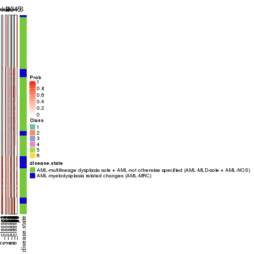


Test correlation between subgroups and known annotations. If the known
annotation is numeric, one-way ANOVA test is applied, and if the known
annotation is discrete, chi-squared contingency table test is applied.

```r
test_to_known_factors(res)
```

```
#>             n disease.state(p) k
#> ATC:hclust 94           0.0179 2
#> ATC:hclust 93           0.0120 3
#> ATC:hclust 95           0.0450 4
#> ATC:hclust 90           0.0257 5
#> ATC:hclust 78           0.0261 6
```


If matrix rows can be associated to genes, consider to use `functional_enrichment(res,
...)` to perform function enrichment for the signature genes. See [this vignette](http://bioconductor.org/packages/devel/bioc/vignettes/cola/inst/doc/functional_enrichment.html) for more detailed explanations.


 

---------------------------------------------------


### ATC:kmeans**


The object with results only for a single top-value method and a single partition method 
can be extracted as:

```r
res = res_list["ATC", "kmeans"]
# you can also extract it by
# res = res_list["ATC:kmeans"]
```

A summary of `res` and all the functions that can be applied to it:

```r
res
```

```
#> A 'ConsensusPartition' object with k = 2, 3, 4, 5, 6.
#>   On a matrix with 51941 rows and 96 columns.
#>   Top rows (1000, 2000, 3000, 4000, 5000) are extracted by 'ATC' method.
#>   Subgroups are detected by 'kmeans' method.
#>   Performed in total 1250 partitions by row resampling.
#>   Best k for subgroups seems to be 3.
#> 
#> Following methods can be applied to this 'ConsensusPartition' object:
#>  [1] "cola_report"             "collect_classes"         "collect_plots"          
#>  [4] "collect_stats"           "colnames"                "compare_signatures"     
#>  [7] "consensus_heatmap"       "dimension_reduction"     "functional_enrichment"  
#> [10] "get_anno_col"            "get_anno"                "get_classes"            
#> [13] "get_consensus"           "get_matrix"              "get_membership"         
#> [16] "get_param"               "get_signatures"          "get_stats"              
#> [19] "is_best_k"               "is_stable_k"             "membership_heatmap"     
#> [22] "ncol"                    "nrow"                    "plot_ecdf"              
#> [25] "rownames"                "select_partition_number" "show"                   
#> [28] "suggest_best_k"          "test_to_known_factors"
```

`collect_plots()` function collects all the plots made from `res` for all `k` (number of partitions)
into one single page to provide an easy and fast comparison between different `k`.

```r
collect_plots(res)
```


The plots are:

- The first row: a plot of the ECDF (empirical cumulative distribution
  function) curves of the consensus matrix for each `k` and the heatmap of
  predicted classes for each `k`.
- The second row: heatmaps of the consensus matrix for each `k`.
- The third row: heatmaps of the membership matrix for each `k`.
- The fouth row: heatmaps of the signatures for each `k`.

All the plots in panels can be made by individual functions and they are
plotted later in this section.

`select_partition_number()` produces several plots showing different
statistics for choosing "optimized" `k`. There are following statistics:

- ECDF curves of the consensus matrix for each `k`;
- 1-PAC. [The PAC
  score](https://en.wikipedia.org/wiki/Consensus_clustering#Over-interpretation_potential_of_consensus_clustering)
  measures the proportion of the ambiguous subgrouping.
- Mean silhouette score.
- Concordance. The mean probability of fiting the consensus class ids in all
  partitions.
- Area increased. Denote $A_k$ as the area under the ECDF curve for current
  `k`, the area increased is defined as $A_k - A_{k-1}$.
- Rand index. The percent of pairs of samples that are both in a same cluster
  or both are not in a same cluster in the partition of k and k-1.
- Jaccard index. The ratio of pairs of samples are both in a same cluster in
  the partition of k and k-1 and the pairs of samples are both in a same
  cluster in the partition k or k-1.

The detailed explanations of these statistics can be found in [the _cola_
vignette](http://bioconductor.org/packages/devel/bioc/vignettes/cola/inst/doc/cola.html#toc_13).

Generally speaking, lower PAC score, higher mean silhouette score or higher
concordance corresponds to better partition. Rand index and Jaccard index
measure how similar the current partition is compared to partition with `k-1`.
If they are too similar, we won't accept `k` is better than `k-1`.

```r
select_partition_number(res)
```


The numeric values for all these statistics can be obtained by `get_stats()`.

```r
get_stats(res)
```

```
#>   k 1-PAC mean_silhouette concordance area_increased  Rand Jaccard
#> 2 2 1.000           1.000       1.000         0.4687 0.532   0.532
#> 3 3 0.969           0.931       0.963         0.3933 0.670   0.454
#> 4 4 0.713           0.652       0.799         0.1136 0.835   0.577
#> 5 5 0.735           0.738       0.844         0.0546 0.896   0.667
#> 6 6 0.781           0.664       0.819         0.0376 0.975   0.904
```

`suggest_best_k()` suggests the best $k$ based on these statistics. The rules are as follows:

- All $k$ with Jaccard index larger than 0.95 are removed because increasing
  $k$ does not provide enough extra information. If all $k$ are removed, it is
  marked as no subgroup is detected.
- For all $k$ with 1-PAC score larger than 0.9, the maximal $k$ is taken as
  the best $k$, and other $k$ are marked as optional $k$.
- If it does not fit the second rule. The $k$ with the maximal vote of the
  highest 1-PAC score, highest mean silhouette, and highest concordance is
  taken as the best $k$.

```r
suggest_best_k(res)
```

```
#> [1] 3
#> attr(,"optional")
#> [1] 2
```

There is also optional best $k$ = 2 that is worth to check.

Following shows the table of the partitions (You need to click the **show/hide
code output** link to see it). The membership matrix (columns with name `p*`)
is inferred by
[`clue::cl_consensus()`](https://www.rdocumentation.org/link/cl_consensus?package=clue)
function with the `SE` method. Basically the value in the membership matrix
represents the probability to belong to a certain group. The finall class
label for an item is determined with the group with highest probability it
belongs to.

In `get_classes()` function, the entropy is calculated from the membership
matrix and the silhouette score is calculated from the consensus matrix.


<script>
$( function() {
	$( '#tabs-ATC-kmeans-get-classes' ).tabs();
} );
</script>
<div id='tabs-ATC-kmeans-get-classes'>
<ul>
<li><a href='#tab-ATC-kmeans-get-classes-1'>k = 2</a></li>
<li><a href='#tab-ATC-kmeans-get-classes-2'>k = 3</a></li>
<li><a href='#tab-ATC-kmeans-get-classes-3'>k = 4</a></li>
<li><a href='#tab-ATC-kmeans-get-classes-4'>k = 5</a></li>
<li><a href='#tab-ATC-kmeans-get-classes-5'>k = 6</a></li>
</ul>

<div id='tab-ATC-kmeans-get-classes-1'>
<p><a id='tab-ATC-kmeans-get-classes-1-a' style='color:#0366d6' href='#'>show/hide code output</a></p>
<pre><code class="r">cbind(get_classes(res, k = 2), get_membership(res, k = 2))
</code></pre>

<pre><code>#&gt;           class entropy silhouette    p1    p2
#&gt; GSM531600     1  0.0000      1.000 1.000 0.000
#&gt; GSM531601     2  0.0000      1.000 0.000 1.000
#&gt; GSM531605     1  0.0000      1.000 1.000 0.000
#&gt; GSM531615     2  0.0000      1.000 0.000 1.000
#&gt; GSM531617     2  0.0000      1.000 0.000 1.000
#&gt; GSM531624     2  0.0000      1.000 0.000 1.000
#&gt; GSM531627     2  0.0000      1.000 0.000 1.000
#&gt; GSM531629     2  0.0000      1.000 0.000 1.000
#&gt; GSM531631     2  0.0000      1.000 0.000 1.000
#&gt; GSM531634     2  0.0000      1.000 0.000 1.000
#&gt; GSM531636     2  0.0000      1.000 0.000 1.000
#&gt; GSM531637     2  0.0000      1.000 0.000 1.000
#&gt; GSM531654     2  0.0000      1.000 0.000 1.000
#&gt; GSM531655     1  0.0000      1.000 1.000 0.000
#&gt; GSM531658     1  0.0000      1.000 1.000 0.000
#&gt; GSM531660     1  0.0000      1.000 1.000 0.000
#&gt; GSM531602     1  0.0000      1.000 1.000 0.000
#&gt; GSM531603     1  0.0000      1.000 1.000 0.000
#&gt; GSM531604     1  0.0000      1.000 1.000 0.000
#&gt; GSM531606     1  0.0000      1.000 1.000 0.000
#&gt; GSM531607     1  0.0000      1.000 1.000 0.000
#&gt; GSM531608     2  0.0000      1.000 0.000 1.000
#&gt; GSM531609     1  0.0000      1.000 1.000 0.000
#&gt; GSM531610     1  0.0000      1.000 1.000 0.000
#&gt; GSM531611     1  0.0000      1.000 1.000 0.000
#&gt; GSM531612     1  0.0000      1.000 1.000 0.000
#&gt; GSM531613     1  0.0000      1.000 1.000 0.000
#&gt; GSM531614     2  0.0000      1.000 0.000 1.000
#&gt; GSM531616     2  0.0000      1.000 0.000 1.000
#&gt; GSM531618     1  0.0000      1.000 1.000 0.000
#&gt; GSM531619     2  0.0000      1.000 0.000 1.000
#&gt; GSM531620     2  0.0000      1.000 0.000 1.000
#&gt; GSM531621     2  0.0000      1.000 0.000 1.000
#&gt; GSM531622     2  0.0000      1.000 0.000 1.000
#&gt; GSM531623     2  0.0000      1.000 0.000 1.000
#&gt; GSM531625     2  0.0000      1.000 0.000 1.000
#&gt; GSM531626     2  0.0000      1.000 0.000 1.000
#&gt; GSM531628     2  0.0000      1.000 0.000 1.000
#&gt; GSM531630     2  0.0000      1.000 0.000 1.000
#&gt; GSM531632     2  0.0000      1.000 0.000 1.000
#&gt; GSM531633     2  0.0000      1.000 0.000 1.000
#&gt; GSM531635     2  0.0000      1.000 0.000 1.000
#&gt; GSM531638     2  0.0000      1.000 0.000 1.000
#&gt; GSM531639     1  0.0000      1.000 1.000 0.000
#&gt; GSM531640     2  0.0000      1.000 0.000 1.000
#&gt; GSM531641     1  0.0000      1.000 1.000 0.000
#&gt; GSM531642     1  0.0000      1.000 1.000 0.000
#&gt; GSM531643     1  0.0000      1.000 1.000 0.000
#&gt; GSM531644     1  0.0000      1.000 1.000 0.000
#&gt; GSM531645     1  0.0000      1.000 1.000 0.000
#&gt; GSM531646     2  0.0000      1.000 0.000 1.000
#&gt; GSM531647     2  0.0000      1.000 0.000 1.000
#&gt; GSM531648     1  0.0000      1.000 1.000 0.000
#&gt; GSM531649     2  0.0000      1.000 0.000 1.000
#&gt; GSM531650     1  0.0000      1.000 1.000 0.000
#&gt; GSM531651     2  0.0000      1.000 0.000 1.000
#&gt; GSM531652     1  0.0000      1.000 1.000 0.000
#&gt; GSM531653     1  0.0000      1.000 1.000 0.000
#&gt; GSM531656     1  0.0000      1.000 1.000 0.000
#&gt; GSM531657     1  0.0000      1.000 1.000 0.000
#&gt; GSM531659     1  0.0000      1.000 1.000 0.000
#&gt; GSM531661     2  0.0000      1.000 0.000 1.000
#&gt; GSM531662     1  0.0000      1.000 1.000 0.000
#&gt; GSM531663     1  0.0000      1.000 1.000 0.000
#&gt; GSM531664     1  0.0000      1.000 1.000 0.000
#&gt; GSM531665     1  0.0000      1.000 1.000 0.000
#&gt; GSM531666     1  0.0000      1.000 1.000 0.000
#&gt; GSM531667     2  0.0000      1.000 0.000 1.000
#&gt; GSM531668     1  0.0000      1.000 1.000 0.000
#&gt; GSM531669     1  0.0000      1.000 1.000 0.000
#&gt; GSM531670     1  0.0000      1.000 1.000 0.000
#&gt; GSM531671     2  0.0672      0.992 0.008 0.992
#&gt; GSM531672     1  0.0000      1.000 1.000 0.000
#&gt; GSM531673     1  0.0000      1.000 1.000 0.000
#&gt; GSM531674     1  0.0000      1.000 1.000 0.000
#&gt; GSM531675     1  0.0000      1.000 1.000 0.000
#&gt; GSM531676     1  0.0000      1.000 1.000 0.000
#&gt; GSM531677     1  0.0000      1.000 1.000 0.000
#&gt; GSM531678     1  0.0000      1.000 1.000 0.000
#&gt; GSM531679     1  0.0000      1.000 1.000 0.000
#&gt; GSM531680     1  0.0000      1.000 1.000 0.000
#&gt; GSM531681     1  0.0000      1.000 1.000 0.000
#&gt; GSM531682     1  0.0000      1.000 1.000 0.000
#&gt; GSM531683     1  0.0000      1.000 1.000 0.000
#&gt; GSM531684     1  0.0000      1.000 1.000 0.000
#&gt; GSM531685     1  0.0000      1.000 1.000 0.000
#&gt; GSM531686     1  0.0000      1.000 1.000 0.000
#&gt; GSM531687     1  0.0000      1.000 1.000 0.000
#&gt; GSM531688     1  0.0000      1.000 1.000 0.000
#&gt; GSM531689     1  0.0000      1.000 1.000 0.000
#&gt; GSM531690     1  0.0000      1.000 1.000 0.000
#&gt; GSM531691     1  0.0000      1.000 1.000 0.000
#&gt; GSM531692     1  0.0000      1.000 1.000 0.000
#&gt; GSM531693     1  0.0000      1.000 1.000 0.000
#&gt; GSM531694     1  0.0000      1.000 1.000 0.000
#&gt; GSM531695     1  0.0000      1.000 1.000 0.000
</code></pre>

<script>
$('#tab-ATC-kmeans-get-classes-1-a').parent().next().next().hide();
$('#tab-ATC-kmeans-get-classes-1-a').click(function(){
  $('#tab-ATC-kmeans-get-classes-1-a').parent().next().next().toggle();
  return(false);
});
</script>
</div>

<div id='tab-ATC-kmeans-get-classes-2'>
<p><a id='tab-ATC-kmeans-get-classes-2-a' style='color:#0366d6' href='#'>show/hide code output</a></p>
<pre><code class="r">cbind(get_classes(res, k = 3), get_membership(res, k = 3))
</code></pre>

<pre><code>#&gt;           class entropy silhouette    p1    p2    p3
#&gt; GSM531600     3  0.0237      0.941 0.004 0.000 0.996
#&gt; GSM531601     3  0.0424      0.936 0.000 0.008 0.992
#&gt; GSM531605     1  0.0237      0.974 0.996 0.000 0.004
#&gt; GSM531615     2  0.0000      0.987 0.000 1.000 0.000
#&gt; GSM531617     2  0.1031      0.991 0.000 0.976 0.024
#&gt; GSM531624     2  0.0000      0.987 0.000 1.000 0.000
#&gt; GSM531627     2  0.1031      0.991 0.000 0.976 0.024
#&gt; GSM531629     2  0.1031      0.991 0.000 0.976 0.024
#&gt; GSM531631     2  0.1031      0.991 0.000 0.976 0.024
#&gt; GSM531634     2  0.0000      0.987 0.000 1.000 0.000
#&gt; GSM531636     3  0.0424      0.936 0.000 0.008 0.992
#&gt; GSM531637     2  0.0000      0.987 0.000 1.000 0.000
#&gt; GSM531654     3  0.0892      0.929 0.000 0.020 0.980
#&gt; GSM531655     3  0.1163      0.950 0.028 0.000 0.972
#&gt; GSM531658     3  0.0892      0.947 0.020 0.000 0.980
#&gt; GSM531660     1  0.6299      0.030 0.524 0.000 0.476
#&gt; GSM531602     1  0.0237      0.974 0.996 0.000 0.004
#&gt; GSM531603     1  0.0237      0.974 0.996 0.000 0.004
#&gt; GSM531604     3  0.1163      0.950 0.028 0.000 0.972
#&gt; GSM531606     3  0.6225      0.270 0.432 0.000 0.568
#&gt; GSM531607     1  0.0237      0.974 0.996 0.000 0.004
#&gt; GSM531608     2  0.1399      0.988 0.004 0.968 0.028
#&gt; GSM531609     3  0.1163      0.947 0.028 0.000 0.972
#&gt; GSM531610     3  0.1031      0.949 0.024 0.000 0.976
#&gt; GSM531611     1  0.0237      0.974 0.996 0.000 0.004
#&gt; GSM531612     1  0.0237      0.974 0.996 0.000 0.004
#&gt; GSM531613     1  0.0237      0.974 0.996 0.000 0.004
#&gt; GSM531614     3  0.0237      0.937 0.004 0.000 0.996
#&gt; GSM531616     2  0.1031      0.991 0.000 0.976 0.024
#&gt; GSM531618     3  0.1163      0.950 0.028 0.000 0.972
#&gt; GSM531619     2  0.0000      0.987 0.000 1.000 0.000
#&gt; GSM531620     2  0.1031      0.991 0.000 0.976 0.024
#&gt; GSM531621     2  0.0000      0.987 0.000 1.000 0.000
#&gt; GSM531622     2  0.1031      0.991 0.000 0.976 0.024
#&gt; GSM531623     2  0.1031      0.991 0.000 0.976 0.024
#&gt; GSM531625     2  0.0000      0.987 0.000 1.000 0.000
#&gt; GSM531626     2  0.1031      0.991 0.000 0.976 0.024
#&gt; GSM531628     3  0.4842      0.689 0.000 0.224 0.776
#&gt; GSM531630     2  0.1031      0.991 0.000 0.976 0.024
#&gt; GSM531632     3  0.0424      0.936 0.000 0.008 0.992
#&gt; GSM531633     2  0.0000      0.987 0.000 1.000 0.000
#&gt; GSM531635     2  0.1031      0.991 0.000 0.976 0.024
#&gt; GSM531638     3  0.5363      0.605 0.000 0.276 0.724
#&gt; GSM531639     3  0.1163      0.950 0.028 0.000 0.972
#&gt; GSM531640     2  0.0000      0.987 0.000 1.000 0.000
#&gt; GSM531641     3  0.1163      0.950 0.028 0.000 0.972
#&gt; GSM531642     3  0.1964      0.929 0.056 0.000 0.944
#&gt; GSM531643     3  0.1163      0.950 0.028 0.000 0.972
#&gt; GSM531644     3  0.1163      0.950 0.028 0.000 0.972
#&gt; GSM531645     3  0.1163      0.950 0.028 0.000 0.972
#&gt; GSM531646     3  0.6026      0.387 0.000 0.376 0.624
#&gt; GSM531647     3  0.0424      0.936 0.000 0.008 0.992
#&gt; GSM531648     3  0.1163      0.950 0.028 0.000 0.972
#&gt; GSM531649     2  0.1031      0.991 0.000 0.976 0.024
#&gt; GSM531650     3  0.1163      0.950 0.028 0.000 0.972
#&gt; GSM531651     2  0.0000      0.987 0.000 1.000 0.000
#&gt; GSM531652     3  0.1163      0.950 0.028 0.000 0.972
#&gt; GSM531653     3  0.0237      0.941 0.004 0.000 0.996
#&gt; GSM531656     3  0.1163      0.950 0.028 0.000 0.972
#&gt; GSM531657     3  0.1163      0.950 0.028 0.000 0.972
#&gt; GSM531659     3  0.1163      0.950 0.028 0.000 0.972
#&gt; GSM531661     2  0.1031      0.991 0.000 0.976 0.024
#&gt; GSM531662     3  0.0237      0.941 0.004 0.000 0.996
#&gt; GSM531663     3  0.1163      0.950 0.028 0.000 0.972
#&gt; GSM531664     3  0.1163      0.950 0.028 0.000 0.972
#&gt; GSM531665     3  0.0424      0.943 0.008 0.000 0.992
#&gt; GSM531666     3  0.1964      0.929 0.056 0.000 0.944
#&gt; GSM531667     2  0.1031      0.991 0.000 0.976 0.024
#&gt; GSM531668     3  0.1163      0.950 0.028 0.000 0.972
#&gt; GSM531669     3  0.1163      0.950 0.028 0.000 0.972
#&gt; GSM531670     3  0.1163      0.950 0.028 0.000 0.972
#&gt; GSM531671     3  0.0424      0.936 0.000 0.008 0.992
#&gt; GSM531672     3  0.5254      0.656 0.264 0.000 0.736
#&gt; GSM531673     3  0.1163      0.950 0.028 0.000 0.972
#&gt; GSM531674     3  0.1163      0.950 0.028 0.000 0.972
#&gt; GSM531675     1  0.0237      0.974 0.996 0.000 0.004
#&gt; GSM531676     1  0.0237      0.974 0.996 0.000 0.004
#&gt; GSM531677     1  0.0237      0.974 0.996 0.000 0.004
#&gt; GSM531678     1  0.0237      0.974 0.996 0.000 0.004
#&gt; GSM531679     1  0.0237      0.974 0.996 0.000 0.004
#&gt; GSM531680     1  0.0237      0.974 0.996 0.000 0.004
#&gt; GSM531681     1  0.0237      0.974 0.996 0.000 0.004
#&gt; GSM531682     1  0.0237      0.974 0.996 0.000 0.004
#&gt; GSM531683     1  0.0237      0.974 0.996 0.000 0.004
#&gt; GSM531684     1  0.3816      0.808 0.852 0.000 0.148
#&gt; GSM531685     1  0.0237      0.974 0.996 0.000 0.004
#&gt; GSM531686     1  0.0237      0.974 0.996 0.000 0.004
#&gt; GSM531687     1  0.0237      0.974 0.996 0.000 0.004
#&gt; GSM531688     1  0.0237      0.974 0.996 0.000 0.004
#&gt; GSM531689     1  0.0237      0.974 0.996 0.000 0.004
#&gt; GSM531690     1  0.0237      0.974 0.996 0.000 0.004
#&gt; GSM531691     1  0.0237      0.974 0.996 0.000 0.004
#&gt; GSM531692     3  0.1163      0.950 0.028 0.000 0.972
#&gt; GSM531693     1  0.0237      0.974 0.996 0.000 0.004
#&gt; GSM531694     1  0.0237      0.974 0.996 0.000 0.004
#&gt; GSM531695     1  0.0237      0.974 0.996 0.000 0.004
</code></pre>

<script>
$('#tab-ATC-kmeans-get-classes-2-a').parent().next().next().hide();
$('#tab-ATC-kmeans-get-classes-2-a').click(function(){
  $('#tab-ATC-kmeans-get-classes-2-a').parent().next().next().toggle();
  return(false);
});
</script>
</div>

<div id='tab-ATC-kmeans-get-classes-3'>
<p><a id='tab-ATC-kmeans-get-classes-3-a' style='color:#0366d6' href='#'>show/hide code output</a></p>
<pre><code class="r">cbind(get_classes(res, k = 4), get_membership(res, k = 4))
</code></pre>

<pre><code>#&gt;           class entropy silhouette    p1    p2    p3    p4
#&gt; GSM531600     4  0.4697     0.6585 0.000 0.000 0.356 0.644
#&gt; GSM531601     3  0.4134     0.4512 0.000 0.000 0.740 0.260
#&gt; GSM531605     1  0.1637     0.9289 0.940 0.000 0.000 0.060
#&gt; GSM531615     2  0.0000     0.6574 0.000 1.000 0.000 0.000
#&gt; GSM531617     3  0.5000    -0.3835 0.000 0.500 0.500 0.000
#&gt; GSM531624     2  0.0000     0.6574 0.000 1.000 0.000 0.000
#&gt; GSM531627     3  0.5000    -0.3835 0.000 0.500 0.500 0.000
#&gt; GSM531629     3  0.3024     0.5083 0.000 0.148 0.852 0.000
#&gt; GSM531631     3  0.5000    -0.3835 0.000 0.500 0.500 0.000
#&gt; GSM531634     2  0.3528     0.6132 0.000 0.808 0.192 0.000
#&gt; GSM531636     3  0.3356     0.6074 0.000 0.000 0.824 0.176
#&gt; GSM531637     2  0.0000     0.6574 0.000 1.000 0.000 0.000
#&gt; GSM531654     3  0.2973     0.6194 0.000 0.000 0.856 0.144
#&gt; GSM531655     4  0.0707     0.7708 0.000 0.000 0.020 0.980
#&gt; GSM531658     4  0.3311     0.7428 0.000 0.000 0.172 0.828
#&gt; GSM531660     4  0.1302     0.7474 0.044 0.000 0.000 0.956
#&gt; GSM531602     1  0.0000     0.9824 1.000 0.000 0.000 0.000
#&gt; GSM531603     4  0.6221     0.3104 0.316 0.000 0.076 0.608
#&gt; GSM531604     4  0.2345     0.7371 0.000 0.000 0.100 0.900
#&gt; GSM531606     4  0.3903     0.6721 0.076 0.000 0.080 0.844
#&gt; GSM531607     1  0.4855     0.6391 0.712 0.000 0.020 0.268
#&gt; GSM531608     2  0.4981     0.3892 0.000 0.536 0.464 0.000
#&gt; GSM531609     4  0.4907     0.6227 0.000 0.000 0.420 0.580
#&gt; GSM531610     4  0.1716     0.7415 0.000 0.000 0.064 0.936
#&gt; GSM531611     1  0.0188     0.9805 0.996 0.000 0.004 0.000
#&gt; GSM531612     1  0.0188     0.9805 0.996 0.000 0.004 0.000
#&gt; GSM531613     1  0.0188     0.9805 0.996 0.000 0.004 0.000
#&gt; GSM531614     3  0.2814     0.5936 0.000 0.000 0.868 0.132
#&gt; GSM531616     2  0.5000     0.3064 0.000 0.500 0.500 0.000
#&gt; GSM531618     4  0.4697     0.6585 0.000 0.000 0.356 0.644
#&gt; GSM531619     2  0.0000     0.6574 0.000 1.000 0.000 0.000
#&gt; GSM531620     3  0.4888    -0.1238 0.000 0.412 0.588 0.000
#&gt; GSM531621     2  0.0000     0.6574 0.000 1.000 0.000 0.000
#&gt; GSM531622     2  0.4972     0.3929 0.000 0.544 0.456 0.000
#&gt; GSM531623     2  0.4888     0.4473 0.000 0.588 0.412 0.000
#&gt; GSM531625     2  0.0000     0.6574 0.000 1.000 0.000 0.000
#&gt; GSM531626     3  0.5000    -0.3835 0.000 0.500 0.500 0.000
#&gt; GSM531628     3  0.3441     0.6155 0.000 0.024 0.856 0.120
#&gt; GSM531630     2  0.5000     0.3064 0.000 0.500 0.500 0.000
#&gt; GSM531632     3  0.2973     0.6194 0.000 0.000 0.856 0.144
#&gt; GSM531633     2  0.0000     0.6574 0.000 1.000 0.000 0.000
#&gt; GSM531635     2  0.5000     0.3064 0.000 0.500 0.500 0.000
#&gt; GSM531638     3  0.3687     0.5868 0.000 0.080 0.856 0.064
#&gt; GSM531639     4  0.1557     0.7681 0.000 0.000 0.056 0.944
#&gt; GSM531640     2  0.3569     0.6115 0.000 0.804 0.196 0.000
#&gt; GSM531641     4  0.0000     0.7687 0.000 0.000 0.000 1.000
#&gt; GSM531642     4  0.0000     0.7687 0.000 0.000 0.000 1.000
#&gt; GSM531643     4  0.4522     0.6784 0.000 0.000 0.320 0.680
#&gt; GSM531644     4  0.4697     0.6585 0.000 0.000 0.356 0.644
#&gt; GSM531645     4  0.4697     0.6585 0.000 0.000 0.356 0.644
#&gt; GSM531646     3  0.3667     0.5799 0.000 0.088 0.856 0.056
#&gt; GSM531647     3  0.3266     0.6120 0.000 0.000 0.832 0.168
#&gt; GSM531648     4  0.4697     0.6585 0.000 0.000 0.356 0.644
#&gt; GSM531649     3  0.4761     0.0192 0.000 0.372 0.628 0.000
#&gt; GSM531650     4  0.4697     0.6585 0.000 0.000 0.356 0.644
#&gt; GSM531651     2  0.0000     0.6574 0.000 1.000 0.000 0.000
#&gt; GSM531652     4  0.4697     0.6585 0.000 0.000 0.356 0.644
#&gt; GSM531653     4  0.4697     0.6585 0.000 0.000 0.356 0.644
#&gt; GSM531656     4  0.4697     0.6585 0.000 0.000 0.356 0.644
#&gt; GSM531657     4  0.0000     0.7687 0.000 0.000 0.000 1.000
#&gt; GSM531659     4  0.0000     0.7687 0.000 0.000 0.000 1.000
#&gt; GSM531661     2  0.4972     0.3929 0.000 0.544 0.456 0.000
#&gt; GSM531662     4  0.4679     0.6612 0.000 0.000 0.352 0.648
#&gt; GSM531663     4  0.2408     0.7603 0.000 0.000 0.104 0.896
#&gt; GSM531664     4  0.0000     0.7687 0.000 0.000 0.000 1.000
#&gt; GSM531665     4  0.3444     0.7388 0.000 0.000 0.184 0.816
#&gt; GSM531666     4  0.0000     0.7687 0.000 0.000 0.000 1.000
#&gt; GSM531667     2  0.5000     0.3064 0.000 0.500 0.500 0.000
#&gt; GSM531668     4  0.0707     0.7708 0.000 0.000 0.020 0.980
#&gt; GSM531669     4  0.0000     0.7687 0.000 0.000 0.000 1.000
#&gt; GSM531670     4  0.4697     0.6585 0.000 0.000 0.356 0.644
#&gt; GSM531671     3  0.4454     0.3122 0.000 0.000 0.692 0.308
#&gt; GSM531672     4  0.0707     0.7610 0.020 0.000 0.000 0.980
#&gt; GSM531673     4  0.0592     0.7706 0.000 0.000 0.016 0.984
#&gt; GSM531674     4  0.4250     0.7031 0.000 0.000 0.276 0.724
#&gt; GSM531675     1  0.0000     0.9824 1.000 0.000 0.000 0.000
#&gt; GSM531676     1  0.0707     0.9699 0.980 0.000 0.020 0.000
#&gt; GSM531677     1  0.0000     0.9824 1.000 0.000 0.000 0.000
#&gt; GSM531678     1  0.0000     0.9824 1.000 0.000 0.000 0.000
#&gt; GSM531679     1  0.0000     0.9824 1.000 0.000 0.000 0.000
#&gt; GSM531680     1  0.0000     0.9824 1.000 0.000 0.000 0.000
#&gt; GSM531681     1  0.0000     0.9824 1.000 0.000 0.000 0.000
#&gt; GSM531682     1  0.0000     0.9824 1.000 0.000 0.000 0.000
#&gt; GSM531683     1  0.0000     0.9824 1.000 0.000 0.000 0.000
#&gt; GSM531684     4  0.5208     0.5756 0.172 0.000 0.080 0.748
#&gt; GSM531685     1  0.0707     0.9699 0.980 0.000 0.020 0.000
#&gt; GSM531686     1  0.0000     0.9824 1.000 0.000 0.000 0.000
#&gt; GSM531687     1  0.0000     0.9824 1.000 0.000 0.000 0.000
#&gt; GSM531688     1  0.0000     0.9824 1.000 0.000 0.000 0.000
#&gt; GSM531689     1  0.0000     0.9824 1.000 0.000 0.000 0.000
#&gt; GSM531690     1  0.0000     0.9824 1.000 0.000 0.000 0.000
#&gt; GSM531691     1  0.0000     0.9824 1.000 0.000 0.000 0.000
#&gt; GSM531692     4  0.2011     0.7269 0.000 0.000 0.080 0.920
#&gt; GSM531693     4  0.6015     0.4221 0.268 0.000 0.080 0.652
#&gt; GSM531694     1  0.0000     0.9824 1.000 0.000 0.000 0.000
#&gt; GSM531695     1  0.0000     0.9824 1.000 0.000 0.000 0.000
</code></pre>

<script>
$('#tab-ATC-kmeans-get-classes-3-a').parent().next().next().hide();
$('#tab-ATC-kmeans-get-classes-3-a').click(function(){
  $('#tab-ATC-kmeans-get-classes-3-a').parent().next().next().toggle();
  return(false);
});
</script>
</div>

<div id='tab-ATC-kmeans-get-classes-4'>
<p><a id='tab-ATC-kmeans-get-classes-4-a' style='color:#0366d6' href='#'>show/hide code output</a></p>
<pre><code class="r">cbind(get_classes(res, k = 5), get_membership(res, k = 5))
</code></pre>

<pre><code>#&gt;           class entropy silhouette    p1    p2    p3    p4    p5
#&gt; GSM531600     3  0.2390     0.6480 0.000 0.000 0.896 0.020 0.084
#&gt; GSM531601     3  0.6400    -0.0506 0.000 0.320 0.540 0.020 0.120
#&gt; GSM531605     1  0.3779     0.7208 0.776 0.000 0.000 0.024 0.200
#&gt; GSM531615     4  0.2773     1.0000 0.000 0.164 0.000 0.836 0.000
#&gt; GSM531617     2  0.0000     0.7481 0.000 1.000 0.000 0.000 0.000
#&gt; GSM531624     4  0.2773     1.0000 0.000 0.164 0.000 0.836 0.000
#&gt; GSM531627     2  0.0000     0.7481 0.000 1.000 0.000 0.000 0.000
#&gt; GSM531629     2  0.3624     0.7218 0.000 0.836 0.112 0.020 0.032
#&gt; GSM531631     2  0.0290     0.7483 0.000 0.992 0.000 0.000 0.008
#&gt; GSM531634     2  0.4045     0.1116 0.000 0.644 0.000 0.356 0.000
#&gt; GSM531636     2  0.6459     0.5173 0.000 0.520 0.340 0.020 0.120
#&gt; GSM531637     4  0.2773     1.0000 0.000 0.164 0.000 0.836 0.000
#&gt; GSM531654     2  0.5291     0.6805 0.000 0.716 0.140 0.020 0.124
#&gt; GSM531655     3  0.3496     0.6820 0.000 0.000 0.788 0.012 0.200
#&gt; GSM531658     3  0.2280     0.7154 0.000 0.000 0.880 0.000 0.120
#&gt; GSM531660     3  0.4384     0.5517 0.000 0.000 0.660 0.016 0.324
#&gt; GSM531602     1  0.0703     0.9408 0.976 0.000 0.000 0.024 0.000
#&gt; GSM531603     5  0.5597     0.7811 0.168 0.000 0.128 0.020 0.684
#&gt; GSM531604     5  0.4063     0.7189 0.000 0.000 0.280 0.012 0.708
#&gt; GSM531606     5  0.4617     0.8554 0.056 0.000 0.184 0.012 0.748
#&gt; GSM531607     1  0.5703     0.1646 0.540 0.000 0.040 0.024 0.396
#&gt; GSM531608     2  0.3421     0.6473 0.000 0.840 0.000 0.080 0.080
#&gt; GSM531609     3  0.4058     0.5620 0.000 0.000 0.784 0.064 0.152
#&gt; GSM531610     3  0.5304     0.3846 0.000 0.000 0.560 0.056 0.384
#&gt; GSM531611     1  0.2193     0.9082 0.912 0.000 0.000 0.060 0.028
#&gt; GSM531612     1  0.2193     0.9082 0.912 0.000 0.000 0.060 0.028
#&gt; GSM531613     1  0.1965     0.9162 0.924 0.000 0.000 0.052 0.024
#&gt; GSM531614     2  0.7696     0.4341 0.000 0.420 0.272 0.064 0.244
#&gt; GSM531616     2  0.0000     0.7481 0.000 1.000 0.000 0.000 0.000
#&gt; GSM531618     3  0.0609     0.7184 0.000 0.000 0.980 0.020 0.000
#&gt; GSM531619     4  0.2773     1.0000 0.000 0.164 0.000 0.836 0.000
#&gt; GSM531620     2  0.0798     0.7496 0.000 0.976 0.016 0.000 0.008
#&gt; GSM531621     4  0.2773     1.0000 0.000 0.164 0.000 0.836 0.000
#&gt; GSM531622     2  0.1121     0.7196 0.000 0.956 0.000 0.044 0.000
#&gt; GSM531623     2  0.1965     0.6686 0.000 0.904 0.000 0.096 0.000
#&gt; GSM531625     4  0.2773     1.0000 0.000 0.164 0.000 0.836 0.000
#&gt; GSM531626     2  0.0162     0.7483 0.000 0.996 0.000 0.000 0.004
#&gt; GSM531628     2  0.5159     0.6832 0.000 0.724 0.160 0.020 0.096
#&gt; GSM531630     2  0.0000     0.7481 0.000 1.000 0.000 0.000 0.000
#&gt; GSM531632     2  0.6396     0.5502 0.000 0.548 0.308 0.020 0.124
#&gt; GSM531633     4  0.2773     1.0000 0.000 0.164 0.000 0.836 0.000
#&gt; GSM531635     2  0.0000     0.7481 0.000 1.000 0.000 0.000 0.000
#&gt; GSM531638     2  0.5093     0.6875 0.000 0.732 0.148 0.020 0.100
#&gt; GSM531639     3  0.3010     0.6856 0.000 0.000 0.824 0.004 0.172
#&gt; GSM531640     2  0.4045     0.1116 0.000 0.644 0.000 0.356 0.000
#&gt; GSM531641     3  0.4016     0.6289 0.000 0.000 0.716 0.012 0.272
#&gt; GSM531642     3  0.4016     0.6289 0.000 0.000 0.716 0.012 0.272
#&gt; GSM531643     3  0.0771     0.7198 0.000 0.000 0.976 0.020 0.004
#&gt; GSM531644     3  0.0609     0.7184 0.000 0.000 0.980 0.020 0.000
#&gt; GSM531645     3  0.0000     0.7234 0.000 0.000 1.000 0.000 0.000
#&gt; GSM531646     2  0.4794     0.6991 0.000 0.760 0.120 0.020 0.100
#&gt; GSM531647     2  0.6448     0.5226 0.000 0.524 0.336 0.020 0.120
#&gt; GSM531648     3  0.0609     0.7184 0.000 0.000 0.980 0.020 0.000
#&gt; GSM531649     2  0.1753     0.7455 0.000 0.936 0.032 0.000 0.032
#&gt; GSM531650     3  0.0609     0.7184 0.000 0.000 0.980 0.020 0.000
#&gt; GSM531651     4  0.2773     1.0000 0.000 0.164 0.000 0.836 0.000
#&gt; GSM531652     3  0.0609     0.7184 0.000 0.000 0.980 0.020 0.000
#&gt; GSM531653     3  0.2722     0.6211 0.000 0.000 0.872 0.020 0.108
#&gt; GSM531656     3  0.0162     0.7228 0.000 0.000 0.996 0.004 0.000
#&gt; GSM531657     3  0.4152     0.6049 0.000 0.000 0.692 0.012 0.296
#&gt; GSM531659     3  0.3969     0.6015 0.000 0.000 0.692 0.004 0.304
#&gt; GSM531661     2  0.1121     0.7196 0.000 0.956 0.000 0.044 0.000
#&gt; GSM531662     3  0.3621     0.5940 0.000 0.000 0.788 0.020 0.192
#&gt; GSM531663     3  0.2966     0.6943 0.000 0.000 0.816 0.000 0.184
#&gt; GSM531664     3  0.3992     0.6314 0.000 0.000 0.720 0.012 0.268
#&gt; GSM531665     3  0.3336     0.6578 0.000 0.000 0.772 0.000 0.228
#&gt; GSM531666     3  0.4016     0.6289 0.000 0.000 0.716 0.012 0.272
#&gt; GSM531667     2  0.0000     0.7481 0.000 1.000 0.000 0.000 0.000
#&gt; GSM531668     3  0.3395     0.6677 0.000 0.000 0.764 0.000 0.236
#&gt; GSM531669     3  0.3838     0.6281 0.000 0.000 0.716 0.004 0.280
#&gt; GSM531670     3  0.1310     0.7032 0.000 0.000 0.956 0.020 0.024
#&gt; GSM531671     2  0.7007     0.3652 0.000 0.416 0.372 0.020 0.192
#&gt; GSM531672     3  0.4227     0.6026 0.000 0.000 0.692 0.016 0.292
#&gt; GSM531673     3  0.3452     0.6626 0.000 0.000 0.756 0.000 0.244
#&gt; GSM531674     3  0.0609     0.7251 0.000 0.000 0.980 0.000 0.020
#&gt; GSM531675     1  0.0162     0.9427 0.996 0.000 0.000 0.004 0.000
#&gt; GSM531676     1  0.1403     0.9303 0.952 0.000 0.000 0.024 0.024
#&gt; GSM531677     1  0.0609     0.9401 0.980 0.000 0.000 0.020 0.000
#&gt; GSM531678     1  0.0703     0.9408 0.976 0.000 0.000 0.024 0.000
#&gt; GSM531679     1  0.0290     0.9420 0.992 0.000 0.000 0.008 0.000
#&gt; GSM531680     1  0.0880     0.9380 0.968 0.000 0.000 0.032 0.000
#&gt; GSM531681     1  0.0609     0.9416 0.980 0.000 0.000 0.020 0.000
#&gt; GSM531682     1  0.0880     0.9380 0.968 0.000 0.000 0.032 0.000
#&gt; GSM531683     1  0.0703     0.9408 0.976 0.000 0.000 0.024 0.000
#&gt; GSM531684     5  0.4738     0.8601 0.076 0.000 0.164 0.012 0.748
#&gt; GSM531685     1  0.1579     0.9327 0.944 0.000 0.000 0.032 0.024
#&gt; GSM531686     1  0.0794     0.9388 0.972 0.000 0.000 0.028 0.000
#&gt; GSM531687     1  0.0963     0.9419 0.964 0.000 0.000 0.036 0.000
#&gt; GSM531688     1  0.0880     0.9380 0.968 0.000 0.000 0.032 0.000
#&gt; GSM531689     1  0.0703     0.9408 0.976 0.000 0.000 0.024 0.000
#&gt; GSM531690     1  0.0162     0.9427 0.996 0.000 0.000 0.004 0.000
#&gt; GSM531691     1  0.0703     0.9424 0.976 0.000 0.000 0.024 0.000
#&gt; GSM531692     5  0.3628     0.7966 0.000 0.000 0.216 0.012 0.772
#&gt; GSM531693     5  0.4730     0.8244 0.128 0.000 0.112 0.008 0.752
#&gt; GSM531694     1  0.0703     0.9408 0.976 0.000 0.000 0.024 0.000
#&gt; GSM531695     1  0.0880     0.9380 0.968 0.000 0.000 0.032 0.000
</code></pre>

<script>
$('#tab-ATC-kmeans-get-classes-4-a').parent().next().next().hide();
$('#tab-ATC-kmeans-get-classes-4-a').click(function(){
  $('#tab-ATC-kmeans-get-classes-4-a').parent().next().next().toggle();
  return(false);
});
</script>
</div>

<div id='tab-ATC-kmeans-get-classes-5'>
<p><a id='tab-ATC-kmeans-get-classes-5-a' style='color:#0366d6' href='#'>show/hide code output</a></p>
<pre><code class="r">cbind(get_classes(res, k = 6), get_membership(res, k = 6))
</code></pre>

<pre><code>#&gt;           class entropy silhouette    p1    p2    p3    p4    p5    p6
#&gt; GSM531600     3  0.2896   0.450732 0.000 0.000 0.824 0.160 0.016 0.000
#&gt; GSM531601     3  0.6084  -0.200419 0.000 0.228 0.512 0.244 0.016 0.000
#&gt; GSM531605     1  0.5434   0.557823 0.616 0.000 0.000 0.160 0.212 0.012
#&gt; GSM531615     6  0.1007   0.999138 0.000 0.044 0.000 0.000 0.000 0.956
#&gt; GSM531617     2  0.0000   0.780929 0.000 1.000 0.000 0.000 0.000 0.000
#&gt; GSM531624     6  0.1007   0.999138 0.000 0.044 0.000 0.000 0.000 0.956
#&gt; GSM531627     2  0.0000   0.780929 0.000 1.000 0.000 0.000 0.000 0.000
#&gt; GSM531629     2  0.2412   0.742890 0.000 0.880 0.028 0.092 0.000 0.000
#&gt; GSM531631     2  0.0632   0.779777 0.000 0.976 0.000 0.024 0.000 0.000
#&gt; GSM531634     2  0.3476   0.518144 0.000 0.732 0.000 0.004 0.004 0.260
#&gt; GSM531636     2  0.6381   0.079854 0.000 0.408 0.328 0.248 0.016 0.000
#&gt; GSM531637     6  0.1152   0.997410 0.000 0.044 0.000 0.000 0.004 0.952
#&gt; GSM531654     2  0.4512   0.614223 0.000 0.696 0.032 0.248 0.020 0.004
#&gt; GSM531655     3  0.3650   0.617558 0.000 0.000 0.792 0.116 0.092 0.000
#&gt; GSM531658     3  0.2705   0.635658 0.000 0.000 0.872 0.072 0.052 0.004
#&gt; GSM531660     3  0.5296   0.473565 0.000 0.000 0.600 0.184 0.216 0.000
#&gt; GSM531602     1  0.2312   0.885508 0.876 0.000 0.000 0.112 0.000 0.012
#&gt; GSM531603     5  0.5174   0.712682 0.076 0.000 0.048 0.180 0.692 0.004
#&gt; GSM531604     5  0.2494   0.760562 0.000 0.000 0.120 0.016 0.864 0.000
#&gt; GSM531606     5  0.2085   0.863423 0.024 0.000 0.056 0.008 0.912 0.000
#&gt; GSM531607     1  0.6108   0.000728 0.432 0.000 0.004 0.156 0.396 0.012
#&gt; GSM531608     2  0.4436   0.470373 0.000 0.680 0.000 0.272 0.020 0.028
#&gt; GSM531609     3  0.5160  -0.244225 0.000 0.000 0.532 0.396 0.060 0.012
#&gt; GSM531610     4  0.6090  -0.092829 0.000 0.000 0.312 0.488 0.184 0.016
#&gt; GSM531611     1  0.2850   0.835438 0.856 0.000 0.000 0.112 0.016 0.016
#&gt; GSM531612     1  0.2850   0.835438 0.856 0.000 0.000 0.112 0.016 0.016
#&gt; GSM531613     1  0.2207   0.862833 0.900 0.000 0.000 0.076 0.008 0.016
#&gt; GSM531614     4  0.6612   0.115742 0.000 0.172 0.212 0.544 0.060 0.012
#&gt; GSM531616     2  0.0000   0.780929 0.000 1.000 0.000 0.000 0.000 0.000
#&gt; GSM531618     3  0.0363   0.634773 0.000 0.000 0.988 0.012 0.000 0.000
#&gt; GSM531619     6  0.1007   0.999138 0.000 0.044 0.000 0.000 0.000 0.956
#&gt; GSM531620     2  0.0790   0.778235 0.000 0.968 0.000 0.032 0.000 0.000
#&gt; GSM531621     6  0.1007   0.999138 0.000 0.044 0.000 0.000 0.000 0.956
#&gt; GSM531622     2  0.0922   0.770404 0.000 0.968 0.000 0.004 0.004 0.024
#&gt; GSM531623     2  0.1155   0.763283 0.000 0.956 0.000 0.004 0.004 0.036
#&gt; GSM531625     6  0.1007   0.999138 0.000 0.044 0.000 0.000 0.000 0.956
#&gt; GSM531626     2  0.0458   0.780688 0.000 0.984 0.000 0.016 0.000 0.000
#&gt; GSM531628     2  0.4382   0.605610 0.000 0.696 0.076 0.228 0.000 0.000
#&gt; GSM531630     2  0.0000   0.780929 0.000 1.000 0.000 0.000 0.000 0.000
#&gt; GSM531632     2  0.6355   0.128342 0.000 0.428 0.304 0.252 0.016 0.000
#&gt; GSM531633     6  0.1007   0.999138 0.000 0.044 0.000 0.000 0.000 0.956
#&gt; GSM531635     2  0.0000   0.780929 0.000 1.000 0.000 0.000 0.000 0.000
#&gt; GSM531638     2  0.4503   0.588240 0.000 0.680 0.080 0.240 0.000 0.000
#&gt; GSM531639     3  0.3473   0.596093 0.000 0.000 0.808 0.096 0.096 0.000
#&gt; GSM531640     2  0.3452   0.525359 0.000 0.736 0.000 0.004 0.004 0.256
#&gt; GSM531641     3  0.4982   0.530586 0.000 0.000 0.648 0.172 0.180 0.000
#&gt; GSM531642     3  0.4923   0.534732 0.000 0.000 0.656 0.172 0.172 0.000
#&gt; GSM531643     3  0.0508   0.636495 0.000 0.000 0.984 0.012 0.004 0.000
#&gt; GSM531644     3  0.0458   0.633242 0.000 0.000 0.984 0.016 0.000 0.000
#&gt; GSM531645     3  0.0146   0.637622 0.000 0.000 0.996 0.004 0.000 0.000
#&gt; GSM531646     2  0.3884   0.637290 0.000 0.724 0.036 0.240 0.000 0.000
#&gt; GSM531647     2  0.6376   0.090010 0.000 0.412 0.324 0.248 0.016 0.000
#&gt; GSM531648     3  0.0458   0.633242 0.000 0.000 0.984 0.016 0.000 0.000
#&gt; GSM531649     2  0.1913   0.757728 0.000 0.908 0.012 0.080 0.000 0.000
#&gt; GSM531650     3  0.0458   0.633242 0.000 0.000 0.984 0.016 0.000 0.000
#&gt; GSM531651     6  0.1152   0.997410 0.000 0.044 0.000 0.000 0.004 0.952
#&gt; GSM531652     3  0.0458   0.633242 0.000 0.000 0.984 0.016 0.000 0.000
#&gt; GSM531653     3  0.3104   0.411358 0.000 0.000 0.800 0.184 0.016 0.000
#&gt; GSM531656     3  0.0146   0.637644 0.000 0.000 0.996 0.004 0.000 0.000
#&gt; GSM531657     3  0.5065   0.522275 0.000 0.000 0.636 0.172 0.192 0.000
#&gt; GSM531659     3  0.5066   0.525036 0.000 0.000 0.636 0.176 0.188 0.000
#&gt; GSM531661     2  0.1149   0.770529 0.000 0.960 0.000 0.008 0.008 0.024
#&gt; GSM531662     3  0.4619   0.338752 0.000 0.000 0.704 0.168 0.124 0.004
#&gt; GSM531663     3  0.3419   0.622873 0.000 0.000 0.820 0.088 0.088 0.004
#&gt; GSM531664     3  0.4923   0.537186 0.000 0.000 0.656 0.172 0.172 0.000
#&gt; GSM531665     3  0.4151   0.555656 0.000 0.000 0.748 0.084 0.164 0.004
#&gt; GSM531666     3  0.5011   0.527074 0.000 0.000 0.644 0.176 0.180 0.000
#&gt; GSM531667     2  0.0520   0.779704 0.000 0.984 0.000 0.008 0.008 0.000
#&gt; GSM531668     3  0.3885   0.614243 0.000 0.000 0.780 0.100 0.116 0.004
#&gt; GSM531669     3  0.4863   0.546749 0.000 0.000 0.664 0.168 0.168 0.000
#&gt; GSM531670     3  0.1088   0.617560 0.000 0.000 0.960 0.024 0.016 0.000
#&gt; GSM531671     3  0.7491  -0.350615 0.000 0.304 0.328 0.252 0.112 0.004
#&gt; GSM531672     3  0.5122   0.513546 0.000 0.000 0.628 0.180 0.192 0.000
#&gt; GSM531673     3  0.4225   0.600517 0.000 0.000 0.748 0.124 0.124 0.004
#&gt; GSM531674     3  0.0405   0.639478 0.000 0.000 0.988 0.008 0.004 0.000
#&gt; GSM531675     1  0.0935   0.903594 0.964 0.000 0.000 0.032 0.000 0.004
#&gt; GSM531676     1  0.2656   0.882624 0.860 0.000 0.000 0.120 0.012 0.008
#&gt; GSM531677     1  0.0458   0.899018 0.984 0.000 0.000 0.016 0.000 0.000
#&gt; GSM531678     1  0.2070   0.892317 0.892 0.000 0.000 0.100 0.000 0.008
#&gt; GSM531679     1  0.0405   0.901912 0.988 0.000 0.000 0.008 0.000 0.004
#&gt; GSM531680     1  0.0713   0.897112 0.972 0.000 0.000 0.028 0.000 0.000
#&gt; GSM531681     1  0.1462   0.901476 0.936 0.000 0.000 0.056 0.000 0.008
#&gt; GSM531682     1  0.0713   0.897112 0.972 0.000 0.000 0.028 0.000 0.000
#&gt; GSM531683     1  0.1524   0.901051 0.932 0.000 0.000 0.060 0.000 0.008
#&gt; GSM531684     5  0.1829   0.863836 0.024 0.000 0.056 0.000 0.920 0.000
#&gt; GSM531685     1  0.2588   0.885062 0.860 0.000 0.000 0.124 0.012 0.004
#&gt; GSM531686     1  0.0547   0.898416 0.980 0.000 0.000 0.020 0.000 0.000
#&gt; GSM531687     1  0.2234   0.890400 0.872 0.000 0.000 0.124 0.000 0.004
#&gt; GSM531688     1  0.1556   0.896363 0.920 0.000 0.000 0.080 0.000 0.000
#&gt; GSM531689     1  0.1970   0.894291 0.900 0.000 0.000 0.092 0.000 0.008
#&gt; GSM531690     1  0.0603   0.903419 0.980 0.000 0.000 0.016 0.000 0.004
#&gt; GSM531691     1  0.1349   0.904035 0.940 0.000 0.000 0.056 0.000 0.004
#&gt; GSM531692     5  0.1719   0.844718 0.000 0.000 0.060 0.016 0.924 0.000
#&gt; GSM531693     5  0.3944   0.804135 0.032 0.000 0.044 0.136 0.788 0.000
#&gt; GSM531694     1  0.1524   0.901051 0.932 0.000 0.000 0.060 0.000 0.008
#&gt; GSM531695     1  0.0713   0.897112 0.972 0.000 0.000 0.028 0.000 0.000
</code></pre>

<script>
$('#tab-ATC-kmeans-get-classes-5-a').parent().next().next().hide();
$('#tab-ATC-kmeans-get-classes-5-a').click(function(){
  $('#tab-ATC-kmeans-get-classes-5-a').parent().next().next().toggle();
  return(false);
});
</script>
</div>
</div>

Heatmaps for the consensus matrix. It visualizes the probability of two
samples to be in a same group.


<script>
$( function() {
	$( '#tabs-ATC-kmeans-consensus-heatmap' ).tabs();
} );
</script>
<div id='tabs-ATC-kmeans-consensus-heatmap'>
<ul>
<li><a href='#tab-ATC-kmeans-consensus-heatmap-1'>k = 2</a></li>
<li><a href='#tab-ATC-kmeans-consensus-heatmap-2'>k = 3</a></li>
<li><a href='#tab-ATC-kmeans-consensus-heatmap-3'>k = 4</a></li>
<li><a href='#tab-ATC-kmeans-consensus-heatmap-4'>k = 5</a></li>
<li><a href='#tab-ATC-kmeans-consensus-heatmap-5'>k = 6</a></li>
</ul>
<div id='tab-ATC-kmeans-consensus-heatmap-1'>
<pre><code class="r">consensus_heatmap(res, k = 2)
</code></pre>

<p></p>

</div>
<div id='tab-ATC-kmeans-consensus-heatmap-2'>
<pre><code class="r">consensus_heatmap(res, k = 3)
</code></pre>

<p></p>

</div>
<div id='tab-ATC-kmeans-consensus-heatmap-3'>
<pre><code class="r">consensus_heatmap(res, k = 4)
</code></pre>

<p></p>

</div>
<div id='tab-ATC-kmeans-consensus-heatmap-4'>
<pre><code class="r">consensus_heatmap(res, k = 5)
</code></pre>

<p></p>

</div>
<div id='tab-ATC-kmeans-consensus-heatmap-5'>
<pre><code class="r">consensus_heatmap(res, k = 6)
</code></pre>

<p></p>

</div>
</div>

Heatmaps for the membership of samples in all partitions to see how consistent they are:


<script>
$( function() {
	$( '#tabs-ATC-kmeans-membership-heatmap' ).tabs();
} );
</script>
<div id='tabs-ATC-kmeans-membership-heatmap'>
<ul>
<li><a href='#tab-ATC-kmeans-membership-heatmap-1'>k = 2</a></li>
<li><a href='#tab-ATC-kmeans-membership-heatmap-2'>k = 3</a></li>
<li><a href='#tab-ATC-kmeans-membership-heatmap-3'>k = 4</a></li>
<li><a href='#tab-ATC-kmeans-membership-heatmap-4'>k = 5</a></li>
<li><a href='#tab-ATC-kmeans-membership-heatmap-5'>k = 6</a></li>
</ul>
<div id='tab-ATC-kmeans-membership-heatmap-1'>
<pre><code class="r">membership_heatmap(res, k = 2)
</code></pre>

<p></p>

</div>
<div id='tab-ATC-kmeans-membership-heatmap-2'>
<pre><code class="r">membership_heatmap(res, k = 3)
</code></pre>

<p></p>

</div>
<div id='tab-ATC-kmeans-membership-heatmap-3'>
<pre><code class="r">membership_heatmap(res, k = 4)
</code></pre>

<p></p>

</div>
<div id='tab-ATC-kmeans-membership-heatmap-4'>
<pre><code class="r">membership_heatmap(res, k = 5)
</code></pre>

<p></p>

</div>
<div id='tab-ATC-kmeans-membership-heatmap-5'>
<pre><code class="r">membership_heatmap(res, k = 6)
</code></pre>

<p></p>

</div>
</div>

As soon as we have had the classes for columns, we can look for signatures
which are significantly different between classes which can be candidate marks
for certain classes. Following are the heatmaps for signatures.


Signature heatmaps where rows are scaled:


<script>
$( function() {
	$( '#tabs-ATC-kmeans-get-signatures' ).tabs();
} );
</script>
<div id='tabs-ATC-kmeans-get-signatures'>
<ul>
<li><a href='#tab-ATC-kmeans-get-signatures-1'>k = 2</a></li>
<li><a href='#tab-ATC-kmeans-get-signatures-2'>k = 3</a></li>
<li><a href='#tab-ATC-kmeans-get-signatures-3'>k = 4</a></li>
<li><a href='#tab-ATC-kmeans-get-signatures-4'>k = 5</a></li>
<li><a href='#tab-ATC-kmeans-get-signatures-5'>k = 6</a></li>
</ul>
<div id='tab-ATC-kmeans-get-signatures-1'>
<pre><code class="r">get_signatures(res, k = 2)
</code></pre>

<pre><code>#&gt; Error: The width or height of the raster image is zero, maybe you forget to turn off the
#&gt; previous graphic device or it was corrupted. Run `dev.off()` to close it.
</code></pre>

<p></p>

</div>
<div id='tab-ATC-kmeans-get-signatures-2'>
<pre><code class="r">get_signatures(res, k = 3)
</code></pre>

<pre><code>#&gt; Error: The width or height of the raster image is zero, maybe you forget to turn off the
#&gt; previous graphic device or it was corrupted. Run `dev.off()` to close it.
</code></pre>

<p></p>

</div>
<div id='tab-ATC-kmeans-get-signatures-3'>
<pre><code class="r">get_signatures(res, k = 4)
</code></pre>

<pre><code>#&gt; Error: The width or height of the raster image is zero, maybe you forget to turn off the
#&gt; previous graphic device or it was corrupted. Run `dev.off()` to close it.
</code></pre>

<p></p>

</div>
<div id='tab-ATC-kmeans-get-signatures-4'>
<pre><code class="r">get_signatures(res, k = 5)
</code></pre>

<pre><code>#&gt; Error: The width or height of the raster image is zero, maybe you forget to turn off the
#&gt; previous graphic device or it was corrupted. Run `dev.off()` to close it.
</code></pre>

<p></p>

</div>
<div id='tab-ATC-kmeans-get-signatures-5'>
<pre><code class="r">get_signatures(res, k = 6)
</code></pre>

<pre><code>#&gt; Error: The width or height of the raster image is zero, maybe you forget to turn off the
#&gt; previous graphic device or it was corrupted. Run `dev.off()` to close it.
</code></pre>

<p></p>

</div>
</div>


Signature heatmaps where rows are not scaled:


<script>
$( function() {
	$( '#tabs-ATC-kmeans-get-signatures-no-scale' ).tabs();
} );
</script>
<div id='tabs-ATC-kmeans-get-signatures-no-scale'>
<ul>
<li><a href='#tab-ATC-kmeans-get-signatures-no-scale-1'>k = 2</a></li>
<li><a href='#tab-ATC-kmeans-get-signatures-no-scale-2'>k = 3</a></li>
<li><a href='#tab-ATC-kmeans-get-signatures-no-scale-3'>k = 4</a></li>
<li><a href='#tab-ATC-kmeans-get-signatures-no-scale-4'>k = 5</a></li>
<li><a href='#tab-ATC-kmeans-get-signatures-no-scale-5'>k = 6</a></li>
</ul>
<div id='tab-ATC-kmeans-get-signatures-no-scale-1'>
<pre><code class="r">get_signatures(res, k = 2, scale_rows = FALSE)
</code></pre>

<pre><code>#&gt; Error: The width or height of the raster image is zero, maybe you forget to turn off the
#&gt; previous graphic device or it was corrupted. Run `dev.off()` to close it.
</code></pre>

<p></p>

</div>
<div id='tab-ATC-kmeans-get-signatures-no-scale-2'>
<pre><code class="r">get_signatures(res, k = 3, scale_rows = FALSE)
</code></pre>

<pre><code>#&gt; Error: The width or height of the raster image is zero, maybe you forget to turn off the
#&gt; previous graphic device or it was corrupted. Run `dev.off()` to close it.
</code></pre>

<p></p>

</div>
<div id='tab-ATC-kmeans-get-signatures-no-scale-3'>
<pre><code class="r">get_signatures(res, k = 4, scale_rows = FALSE)
</code></pre>

<pre><code>#&gt; Error: The width or height of the raster image is zero, maybe you forget to turn off the
#&gt; previous graphic device or it was corrupted. Run `dev.off()` to close it.
</code></pre>

<p></p>

</div>
<div id='tab-ATC-kmeans-get-signatures-no-scale-4'>
<pre><code class="r">get_signatures(res, k = 5, scale_rows = FALSE)
</code></pre>

<pre><code>#&gt; Error: The width or height of the raster image is zero, maybe you forget to turn off the
#&gt; previous graphic device or it was corrupted. Run `dev.off()` to close it.
</code></pre>

<p></p>

</div>
<div id='tab-ATC-kmeans-get-signatures-no-scale-5'>
<pre><code class="r">get_signatures(res, k = 6, scale_rows = FALSE)
</code></pre>

<pre><code>#&gt; Error: The width or height of the raster image is zero, maybe you forget to turn off the
#&gt; previous graphic device or it was corrupted. Run `dev.off()` to close it.
</code></pre>

<p></p>

</div>
</div>


Compare the overlap of signatures from different k:

```r
compare_signatures(res)
```


`get_signature()` returns a data frame invisibly. TO get the list of signatures, the function
call should be assigned to a variable explicitly. In following code, if `plot` argument is set
to `FALSE`, no heatmap is plotted while only the differential analysis is performed.

```r
# code only for demonstration
tb = get_signature(res, k = ..., plot = FALSE)
```

An example of the output of `tb` is:

```
#>   which_row         fdr    mean_1    mean_2 scaled_mean_1 scaled_mean_2 km
#> 1        38 0.042760348  8.373488  9.131774    -0.5533452     0.5164555  1
#> 2        40 0.018707592  7.106213  8.469186    -0.6173731     0.5762149  1
#> 3        55 0.019134737 10.221463 11.207825    -0.6159697     0.5749050  1
#> 4        59 0.006059896  5.921854  7.869574    -0.6899429     0.6439467  1
#> 5        60 0.018055526  8.928898 10.211722    -0.6204761     0.5791110  1
#> 6        98 0.009384629 15.714769 14.887706     0.6635654    -0.6193277  2
...
```

The columns in `tb` are:

1. `which_row`: row indices corresponding to the input matrix.
2. `fdr`: FDR for the differential test. 
3. `mean_x`: The mean value in group x.
4. `scaled_mean_x`: The mean value in group x after rows are scaled.
5. `km`: Row groups if k-means clustering is applied to rows.


UMAP plot which shows how samples are separated.


<script>
$( function() {
	$( '#tabs-ATC-kmeans-dimension-reduction' ).tabs();
} );
</script>
<div id='tabs-ATC-kmeans-dimension-reduction'>
<ul>
<li><a href='#tab-ATC-kmeans-dimension-reduction-1'>k = 2</a></li>
<li><a href='#tab-ATC-kmeans-dimension-reduction-2'>k = 3</a></li>
<li><a href='#tab-ATC-kmeans-dimension-reduction-3'>k = 4</a></li>
<li><a href='#tab-ATC-kmeans-dimension-reduction-4'>k = 5</a></li>
<li><a href='#tab-ATC-kmeans-dimension-reduction-5'>k = 6</a></li>
</ul>
<div id='tab-ATC-kmeans-dimension-reduction-1'>
<pre><code class="r">dimension_reduction(res, k = 2, method = &quot;UMAP&quot;)
</code></pre>

<p></p>

</div>
<div id='tab-ATC-kmeans-dimension-reduction-2'>
<pre><code class="r">dimension_reduction(res, k = 3, method = &quot;UMAP&quot;)
</code></pre>

<p></p>

</div>
<div id='tab-ATC-kmeans-dimension-reduction-3'>
<pre><code class="r">dimension_reduction(res, k = 4, method = &quot;UMAP&quot;)
</code></pre>

<p></p>

</div>
<div id='tab-ATC-kmeans-dimension-reduction-4'>
<pre><code class="r">dimension_reduction(res, k = 5, method = &quot;UMAP&quot;)
</code></pre>

<p></p>

</div>
<div id='tab-ATC-kmeans-dimension-reduction-5'>
<pre><code class="r">dimension_reduction(res, k = 6, method = &quot;UMAP&quot;)
</code></pre>

<p></p>

</div>
</div>


Following heatmap shows how subgroups are split when increasing `k`:

```r
collect_classes(res)
```


Test correlation between subgroups and known annotations. If the known
annotation is numeric, one-way ANOVA test is applied, and if the known
annotation is discrete, chi-squared contingency table test is applied.

```r
test_to_known_factors(res)
```

```
#>             n disease.state(p) k
#> ATC:kmeans 96          0.00792 2
#> ATC:kmeans 93          0.02020 3
#> ATC:kmeans 78          0.02206 4
#> ATC:kmeans 89          0.07282 5
#> ATC:kmeans 82          0.02673 6
```


If matrix rows can be associated to genes, consider to use `functional_enrichment(res,
...)` to perform function enrichment for the signature genes. See [this vignette](http://bioconductor.org/packages/devel/bioc/vignettes/cola/inst/doc/functional_enrichment.html) for more detailed explanations.


 

---------------------------------------------------


### ATC:skmeans*


The object with results only for a single top-value method and a single partition method 
can be extracted as:

```r
res = res_list["ATC", "skmeans"]
# you can also extract it by
# res = res_list["ATC:skmeans"]
```

A summary of `res` and all the functions that can be applied to it:

```r
res
```

```
#> A 'ConsensusPartition' object with k = 2, 3, 4, 5, 6.
#>   On a matrix with 51941 rows and 96 columns.
#>   Top rows (1000, 2000, 3000, 4000, 5000) are extracted by 'ATC' method.
#>   Subgroups are detected by 'skmeans' method.
#>   Performed in total 1250 partitions by row resampling.
#>   Best k for subgroups seems to be 3.
#> 
#> Following methods can be applied to this 'ConsensusPartition' object:
#>  [1] "cola_report"             "collect_classes"         "collect_plots"          
#>  [4] "collect_stats"           "colnames"                "compare_signatures"     
#>  [7] "consensus_heatmap"       "dimension_reduction"     "functional_enrichment"  
#> [10] "get_anno_col"            "get_anno"                "get_classes"            
#> [13] "get_consensus"           "get_matrix"              "get_membership"         
#> [16] "get_param"               "get_signatures"          "get_stats"              
#> [19] "is_best_k"               "is_stable_k"             "membership_heatmap"     
#> [22] "ncol"                    "nrow"                    "plot_ecdf"              
#> [25] "rownames"                "select_partition_number" "show"                   
#> [28] "suggest_best_k"          "test_to_known_factors"
```

`collect_plots()` function collects all the plots made from `res` for all `k` (number of partitions)
into one single page to provide an easy and fast comparison between different `k`.

```r
collect_plots(res)
```


The plots are:

- The first row: a plot of the ECDF (empirical cumulative distribution
  function) curves of the consensus matrix for each `k` and the heatmap of
  predicted classes for each `k`.
- The second row: heatmaps of the consensus matrix for each `k`.
- The third row: heatmaps of the membership matrix for each `k`.
- The fouth row: heatmaps of the signatures for each `k`.

All the plots in panels can be made by individual functions and they are
plotted later in this section.

`select_partition_number()` produces several plots showing different
statistics for choosing "optimized" `k`. There are following statistics:

- ECDF curves of the consensus matrix for each `k`;
- 1-PAC. [The PAC
  score](https://en.wikipedia.org/wiki/Consensus_clustering#Over-interpretation_potential_of_consensus_clustering)
  measures the proportion of the ambiguous subgrouping.
- Mean silhouette score.
- Concordance. The mean probability of fiting the consensus class ids in all
  partitions.
- Area increased. Denote $A_k$ as the area under the ECDF curve for current
  `k`, the area increased is defined as $A_k - A_{k-1}$.
- Rand index. The percent of pairs of samples that are both in a same cluster
  or both are not in a same cluster in the partition of k and k-1.
- Jaccard index. The ratio of pairs of samples are both in a same cluster in
  the partition of k and k-1 and the pairs of samples are both in a same
  cluster in the partition k or k-1.

The detailed explanations of these statistics can be found in [the _cola_
vignette](http://bioconductor.org/packages/devel/bioc/vignettes/cola/inst/doc/cola.html#toc_13).

Generally speaking, lower PAC score, higher mean silhouette score or higher
concordance corresponds to better partition. Rand index and Jaccard index
measure how similar the current partition is compared to partition with `k-1`.
If they are too similar, we won't accept `k` is better than `k-1`.

```r
select_partition_number(res)
```


The numeric values for all these statistics can be obtained by `get_stats()`.

```r
get_stats(res)
```

```
#>   k 1-PAC mean_silhouette concordance area_increased  Rand Jaccard
#> 2 2 0.956           0.939       0.975         0.4935 0.509   0.509
#> 3 3 0.931           0.893       0.961         0.2810 0.827   0.672
#> 4 4 0.860           0.829       0.925         0.0988 0.917   0.781
#> 5 5 0.845           0.750       0.898         0.0365 0.941   0.822
#> 6 6 0.848           0.788       0.902         0.0328 0.938   0.800
```

`suggest_best_k()` suggests the best $k$ based on these statistics. The rules are as follows:

- All $k$ with Jaccard index larger than 0.95 are removed because increasing
  $k$ does not provide enough extra information. If all $k$ are removed, it is
  marked as no subgroup is detected.
- For all $k$ with 1-PAC score larger than 0.9, the maximal $k$ is taken as
  the best $k$, and other $k$ are marked as optional $k$.
- If it does not fit the second rule. The $k$ with the maximal vote of the
  highest 1-PAC score, highest mean silhouette, and highest concordance is
  taken as the best $k$.

```r
suggest_best_k(res)
```

```
#> [1] 3
#> attr(,"optional")
#> [1] 2
```

There is also optional best $k$ = 2 that is worth to check.

Following shows the table of the partitions (You need to click the **show/hide
code output** link to see it). The membership matrix (columns with name `p*`)
is inferred by
[`clue::cl_consensus()`](https://www.rdocumentation.org/link/cl_consensus?package=clue)
function with the `SE` method. Basically the value in the membership matrix
represents the probability to belong to a certain group. The finall class
label for an item is determined with the group with highest probability it
belongs to.

In `get_classes()` function, the entropy is calculated from the membership
matrix and the silhouette score is calculated from the consensus matrix.


<script>
$( function() {
	$( '#tabs-ATC-skmeans-get-classes' ).tabs();
} );
</script>
<div id='tabs-ATC-skmeans-get-classes'>
<ul>
<li><a href='#tab-ATC-skmeans-get-classes-1'>k = 2</a></li>
<li><a href='#tab-ATC-skmeans-get-classes-2'>k = 3</a></li>
<li><a href='#tab-ATC-skmeans-get-classes-3'>k = 4</a></li>
<li><a href='#tab-ATC-skmeans-get-classes-4'>k = 5</a></li>
<li><a href='#tab-ATC-skmeans-get-classes-5'>k = 6</a></li>
</ul>

<div id='tab-ATC-skmeans-get-classes-1'>
<p><a id='tab-ATC-skmeans-get-classes-1-a' style='color:#0366d6' href='#'>show/hide code output</a></p>
<pre><code class="r">cbind(get_classes(res, k = 2), get_membership(res, k = 2))
</code></pre>

<pre><code>#&gt;           class entropy silhouette    p1    p2
#&gt; GSM531600     2   0.000      0.979 0.000 1.000
#&gt; GSM531601     2   0.000      0.979 0.000 1.000
#&gt; GSM531605     1   0.000      0.969 1.000 0.000
#&gt; GSM531615     2   0.000      0.979 0.000 1.000
#&gt; GSM531617     2   0.000      0.979 0.000 1.000
#&gt; GSM531624     2   0.000      0.979 0.000 1.000
#&gt; GSM531627     2   0.000      0.979 0.000 1.000
#&gt; GSM531629     2   0.000      0.979 0.000 1.000
#&gt; GSM531631     2   0.000      0.979 0.000 1.000
#&gt; GSM531634     2   0.000      0.979 0.000 1.000
#&gt; GSM531636     2   0.000      0.979 0.000 1.000
#&gt; GSM531637     2   0.000      0.979 0.000 1.000
#&gt; GSM531654     2   0.000      0.979 0.000 1.000
#&gt; GSM531655     1   0.000      0.969 1.000 0.000
#&gt; GSM531658     1   0.224      0.938 0.964 0.036
#&gt; GSM531660     1   0.000      0.969 1.000 0.000
#&gt; GSM531602     1   0.000      0.969 1.000 0.000
#&gt; GSM531603     1   0.000      0.969 1.000 0.000
#&gt; GSM531604     1   0.000      0.969 1.000 0.000
#&gt; GSM531606     1   0.000      0.969 1.000 0.000
#&gt; GSM531607     1   0.000      0.969 1.000 0.000
#&gt; GSM531608     2   0.000      0.979 0.000 1.000
#&gt; GSM531609     1   0.886      0.581 0.696 0.304
#&gt; GSM531610     1   0.000      0.969 1.000 0.000
#&gt; GSM531611     1   0.000      0.969 1.000 0.000
#&gt; GSM531612     1   0.000      0.969 1.000 0.000
#&gt; GSM531613     1   0.000      0.969 1.000 0.000
#&gt; GSM531614     2   0.000      0.979 0.000 1.000
#&gt; GSM531616     2   0.000      0.979 0.000 1.000
#&gt; GSM531618     1   0.689      0.771 0.816 0.184
#&gt; GSM531619     2   0.000      0.979 0.000 1.000
#&gt; GSM531620     2   0.000      0.979 0.000 1.000
#&gt; GSM531621     2   0.000      0.979 0.000 1.000
#&gt; GSM531622     2   0.000      0.979 0.000 1.000
#&gt; GSM531623     2   0.000      0.979 0.000 1.000
#&gt; GSM531625     2   0.000      0.979 0.000 1.000
#&gt; GSM531626     2   0.000      0.979 0.000 1.000
#&gt; GSM531628     2   0.000      0.979 0.000 1.000
#&gt; GSM531630     2   0.000      0.979 0.000 1.000
#&gt; GSM531632     2   0.000      0.979 0.000 1.000
#&gt; GSM531633     2   0.000      0.979 0.000 1.000
#&gt; GSM531635     2   0.000      0.979 0.000 1.000
#&gt; GSM531638     2   0.000      0.979 0.000 1.000
#&gt; GSM531639     1   0.000      0.969 1.000 0.000
#&gt; GSM531640     2   0.000      0.979 0.000 1.000
#&gt; GSM531641     1   0.000      0.969 1.000 0.000
#&gt; GSM531642     1   0.000      0.969 1.000 0.000
#&gt; GSM531643     1   0.141      0.953 0.980 0.020
#&gt; GSM531644     1   0.295      0.924 0.948 0.052
#&gt; GSM531645     1   0.000      0.969 1.000 0.000
#&gt; GSM531646     2   0.000      0.979 0.000 1.000
#&gt; GSM531647     2   0.000      0.979 0.000 1.000
#&gt; GSM531648     1   0.925      0.509 0.660 0.340
#&gt; GSM531649     2   0.000      0.979 0.000 1.000
#&gt; GSM531650     1   0.921      0.517 0.664 0.336
#&gt; GSM531651     2   0.000      0.979 0.000 1.000
#&gt; GSM531652     1   0.925      0.509 0.660 0.340
#&gt; GSM531653     2   0.000      0.979 0.000 1.000
#&gt; GSM531656     1   0.000      0.969 1.000 0.000
#&gt; GSM531657     1   0.000      0.969 1.000 0.000
#&gt; GSM531659     1   0.000      0.969 1.000 0.000
#&gt; GSM531661     2   0.000      0.979 0.000 1.000
#&gt; GSM531662     2   0.000      0.979 0.000 1.000
#&gt; GSM531663     1   0.000      0.969 1.000 0.000
#&gt; GSM531664     1   0.000      0.969 1.000 0.000
#&gt; GSM531665     2   0.958      0.380 0.380 0.620
#&gt; GSM531666     1   0.000      0.969 1.000 0.000
#&gt; GSM531667     2   0.000      0.979 0.000 1.000
#&gt; GSM531668     1   0.000      0.969 1.000 0.000
#&gt; GSM531669     1   0.000      0.969 1.000 0.000
#&gt; GSM531670     2   0.971      0.288 0.400 0.600
#&gt; GSM531671     2   0.000      0.979 0.000 1.000
#&gt; GSM531672     1   0.000      0.969 1.000 0.000
#&gt; GSM531673     1   0.000      0.969 1.000 0.000
#&gt; GSM531674     1   0.000      0.969 1.000 0.000
#&gt; GSM531675     1   0.000      0.969 1.000 0.000
#&gt; GSM531676     1   0.000      0.969 1.000 0.000
#&gt; GSM531677     1   0.000      0.969 1.000 0.000
#&gt; GSM531678     1   0.000      0.969 1.000 0.000
#&gt; GSM531679     1   0.000      0.969 1.000 0.000
#&gt; GSM531680     1   0.000      0.969 1.000 0.000
#&gt; GSM531681     1   0.000      0.969 1.000 0.000
#&gt; GSM531682     1   0.000      0.969 1.000 0.000
#&gt; GSM531683     1   0.000      0.969 1.000 0.000
#&gt; GSM531684     1   0.000      0.969 1.000 0.000
#&gt; GSM531685     1   0.000      0.969 1.000 0.000
#&gt; GSM531686     1   0.000      0.969 1.000 0.000
#&gt; GSM531687     1   0.000      0.969 1.000 0.000
#&gt; GSM531688     1   0.000      0.969 1.000 0.000
#&gt; GSM531689     1   0.000      0.969 1.000 0.000
#&gt; GSM531690     1   0.000      0.969 1.000 0.000
#&gt; GSM531691     1   0.000      0.969 1.000 0.000
#&gt; GSM531692     1   0.000      0.969 1.000 0.000
#&gt; GSM531693     1   0.000      0.969 1.000 0.000
#&gt; GSM531694     1   0.000      0.969 1.000 0.000
#&gt; GSM531695     1   0.000      0.969 1.000 0.000
</code></pre>

<script>
$('#tab-ATC-skmeans-get-classes-1-a').parent().next().next().hide();
$('#tab-ATC-skmeans-get-classes-1-a').click(function(){
  $('#tab-ATC-skmeans-get-classes-1-a').parent().next().next().toggle();
  return(false);
});
</script>
</div>

<div id='tab-ATC-skmeans-get-classes-2'>
<p><a id='tab-ATC-skmeans-get-classes-2-a' style='color:#0366d6' href='#'>show/hide code output</a></p>
<pre><code class="r">cbind(get_classes(res, k = 3), get_membership(res, k = 3))
</code></pre>

<pre><code>#&gt;           class entropy silhouette    p1    p2    p3
#&gt; GSM531600     3   0.000      0.919 0.000 0.000 1.000
#&gt; GSM531601     2   0.000      1.000 0.000 1.000 0.000
#&gt; GSM531605     1   0.000      0.928 1.000 0.000 0.000
#&gt; GSM531615     2   0.000      1.000 0.000 1.000 0.000
#&gt; GSM531617     2   0.000      1.000 0.000 1.000 0.000
#&gt; GSM531624     2   0.000      1.000 0.000 1.000 0.000
#&gt; GSM531627     2   0.000      1.000 0.000 1.000 0.000
#&gt; GSM531629     2   0.000      1.000 0.000 1.000 0.000
#&gt; GSM531631     2   0.000      1.000 0.000 1.000 0.000
#&gt; GSM531634     2   0.000      1.000 0.000 1.000 0.000
#&gt; GSM531636     2   0.000      1.000 0.000 1.000 0.000
#&gt; GSM531637     2   0.000      1.000 0.000 1.000 0.000
#&gt; GSM531654     2   0.000      1.000 0.000 1.000 0.000
#&gt; GSM531655     3   0.620      0.258 0.424 0.000 0.576
#&gt; GSM531658     3   0.669      0.296 0.408 0.012 0.580
#&gt; GSM531660     1   0.000      0.928 1.000 0.000 0.000
#&gt; GSM531602     1   0.000      0.928 1.000 0.000 0.000
#&gt; GSM531603     1   0.000      0.928 1.000 0.000 0.000
#&gt; GSM531604     1   0.000      0.928 1.000 0.000 0.000
#&gt; GSM531606     1   0.000      0.928 1.000 0.000 0.000
#&gt; GSM531607     1   0.000      0.928 1.000 0.000 0.000
#&gt; GSM531608     2   0.000      1.000 0.000 1.000 0.000
#&gt; GSM531609     1   0.665      0.469 0.656 0.320 0.024
#&gt; GSM531610     1   0.000      0.928 1.000 0.000 0.000
#&gt; GSM531611     1   0.000      0.928 1.000 0.000 0.000
#&gt; GSM531612     1   0.000      0.928 1.000 0.000 0.000
#&gt; GSM531613     1   0.000      0.928 1.000 0.000 0.000
#&gt; GSM531614     2   0.000      1.000 0.000 1.000 0.000
#&gt; GSM531616     2   0.000      1.000 0.000 1.000 0.000
#&gt; GSM531618     3   0.000      0.919 0.000 0.000 1.000
#&gt; GSM531619     2   0.000      1.000 0.000 1.000 0.000
#&gt; GSM531620     2   0.000      1.000 0.000 1.000 0.000
#&gt; GSM531621     2   0.000      1.000 0.000 1.000 0.000
#&gt; GSM531622     2   0.000      1.000 0.000 1.000 0.000
#&gt; GSM531623     2   0.000      1.000 0.000 1.000 0.000
#&gt; GSM531625     2   0.000      1.000 0.000 1.000 0.000
#&gt; GSM531626     2   0.000      1.000 0.000 1.000 0.000
#&gt; GSM531628     2   0.000      1.000 0.000 1.000 0.000
#&gt; GSM531630     2   0.000      1.000 0.000 1.000 0.000
#&gt; GSM531632     2   0.000      1.000 0.000 1.000 0.000
#&gt; GSM531633     2   0.000      1.000 0.000 1.000 0.000
#&gt; GSM531635     2   0.000      1.000 0.000 1.000 0.000
#&gt; GSM531638     2   0.000      1.000 0.000 1.000 0.000
#&gt; GSM531639     3   0.000      0.919 0.000 0.000 1.000
#&gt; GSM531640     2   0.000      1.000 0.000 1.000 0.000
#&gt; GSM531641     1   0.620      0.204 0.576 0.000 0.424
#&gt; GSM531642     3   0.529      0.613 0.268 0.000 0.732
#&gt; GSM531643     3   0.000      0.919 0.000 0.000 1.000
#&gt; GSM531644     3   0.000      0.919 0.000 0.000 1.000
#&gt; GSM531645     3   0.000      0.919 0.000 0.000 1.000
#&gt; GSM531646     2   0.000      1.000 0.000 1.000 0.000
#&gt; GSM531647     2   0.000      1.000 0.000 1.000 0.000
#&gt; GSM531648     3   0.000      0.919 0.000 0.000 1.000
#&gt; GSM531649     2   0.000      1.000 0.000 1.000 0.000
#&gt; GSM531650     3   0.000      0.919 0.000 0.000 1.000
#&gt; GSM531651     2   0.000      1.000 0.000 1.000 0.000
#&gt; GSM531652     3   0.000      0.919 0.000 0.000 1.000
#&gt; GSM531653     3   0.000      0.919 0.000 0.000 1.000
#&gt; GSM531656     3   0.000      0.919 0.000 0.000 1.000
#&gt; GSM531657     1   0.000      0.928 1.000 0.000 0.000
#&gt; GSM531659     1   0.000      0.928 1.000 0.000 0.000
#&gt; GSM531661     2   0.000      1.000 0.000 1.000 0.000
#&gt; GSM531662     2   0.000      1.000 0.000 1.000 0.000
#&gt; GSM531663     1   0.375      0.770 0.856 0.000 0.144
#&gt; GSM531664     1   0.620      0.204 0.576 0.000 0.424
#&gt; GSM531665     1   0.621      0.243 0.572 0.428 0.000
#&gt; GSM531666     1   0.620      0.204 0.576 0.000 0.424
#&gt; GSM531667     2   0.000      1.000 0.000 1.000 0.000
#&gt; GSM531668     1   0.000      0.928 1.000 0.000 0.000
#&gt; GSM531669     1   0.620      0.204 0.576 0.000 0.424
#&gt; GSM531670     3   0.000      0.919 0.000 0.000 1.000
#&gt; GSM531671     2   0.000      1.000 0.000 1.000 0.000
#&gt; GSM531672     1   0.000      0.928 1.000 0.000 0.000
#&gt; GSM531673     1   0.000      0.928 1.000 0.000 0.000
#&gt; GSM531674     3   0.000      0.919 0.000 0.000 1.000
#&gt; GSM531675     1   0.000      0.928 1.000 0.000 0.000
#&gt; GSM531676     1   0.000      0.928 1.000 0.000 0.000
#&gt; GSM531677     1   0.000      0.928 1.000 0.000 0.000
#&gt; GSM531678     1   0.000      0.928 1.000 0.000 0.000
#&gt; GSM531679     1   0.000      0.928 1.000 0.000 0.000
#&gt; GSM531680     1   0.000      0.928 1.000 0.000 0.000
#&gt; GSM531681     1   0.000      0.928 1.000 0.000 0.000
#&gt; GSM531682     1   0.000      0.928 1.000 0.000 0.000
#&gt; GSM531683     1   0.000      0.928 1.000 0.000 0.000
#&gt; GSM531684     1   0.000      0.928 1.000 0.000 0.000
#&gt; GSM531685     1   0.000      0.928 1.000 0.000 0.000
#&gt; GSM531686     1   0.000      0.928 1.000 0.000 0.000
#&gt; GSM531687     1   0.000      0.928 1.000 0.000 0.000
#&gt; GSM531688     1   0.000      0.928 1.000 0.000 0.000
#&gt; GSM531689     1   0.000      0.928 1.000 0.000 0.000
#&gt; GSM531690     1   0.000      0.928 1.000 0.000 0.000
#&gt; GSM531691     1   0.000      0.928 1.000 0.000 0.000
#&gt; GSM531692     1   0.000      0.928 1.000 0.000 0.000
#&gt; GSM531693     1   0.000      0.928 1.000 0.000 0.000
#&gt; GSM531694     1   0.000      0.928 1.000 0.000 0.000
#&gt; GSM531695     1   0.000      0.928 1.000 0.000 0.000
</code></pre>

<script>
$('#tab-ATC-skmeans-get-classes-2-a').parent().next().next().hide();
$('#tab-ATC-skmeans-get-classes-2-a').click(function(){
  $('#tab-ATC-skmeans-get-classes-2-a').parent().next().next().toggle();
  return(false);
});
</script>
</div>

<div id='tab-ATC-skmeans-get-classes-3'>
<p><a id='tab-ATC-skmeans-get-classes-3-a' style='color:#0366d6' href='#'>show/hide code output</a></p>
<pre><code class="r">cbind(get_classes(res, k = 4), get_membership(res, k = 4))
</code></pre>

<pre><code>#&gt;           class entropy silhouette    p1    p2    p3    p4
#&gt; GSM531600     3  0.1867     0.8856 0.000 0.000 0.928 0.072
#&gt; GSM531601     2  0.4193     0.6347 0.000 0.732 0.268 0.000
#&gt; GSM531605     1  0.0000     0.9048 1.000 0.000 0.000 0.000
#&gt; GSM531615     2  0.0000     0.9837 0.000 1.000 0.000 0.000
#&gt; GSM531617     2  0.0000     0.9837 0.000 1.000 0.000 0.000
#&gt; GSM531624     2  0.0000     0.9837 0.000 1.000 0.000 0.000
#&gt; GSM531627     2  0.0000     0.9837 0.000 1.000 0.000 0.000
#&gt; GSM531629     2  0.0000     0.9837 0.000 1.000 0.000 0.000
#&gt; GSM531631     2  0.0000     0.9837 0.000 1.000 0.000 0.000
#&gt; GSM531634     2  0.0000     0.9837 0.000 1.000 0.000 0.000
#&gt; GSM531636     2  0.0707     0.9662 0.000 0.980 0.020 0.000
#&gt; GSM531637     2  0.0000     0.9837 0.000 1.000 0.000 0.000
#&gt; GSM531654     2  0.0000     0.9837 0.000 1.000 0.000 0.000
#&gt; GSM531655     4  0.5119     0.5945 0.112 0.000 0.124 0.764
#&gt; GSM531658     4  0.4499     0.5717 0.072 0.000 0.124 0.804
#&gt; GSM531660     1  0.4406     0.4498 0.700 0.000 0.000 0.300
#&gt; GSM531602     1  0.0000     0.9048 1.000 0.000 0.000 0.000
#&gt; GSM531603     1  0.0000     0.9048 1.000 0.000 0.000 0.000
#&gt; GSM531604     1  0.4382     0.4731 0.704 0.000 0.000 0.296
#&gt; GSM531606     1  0.0188     0.9015 0.996 0.000 0.000 0.004
#&gt; GSM531607     1  0.0000     0.9048 1.000 0.000 0.000 0.000
#&gt; GSM531608     2  0.0000     0.9837 0.000 1.000 0.000 0.000
#&gt; GSM531609     1  0.7493     0.3939 0.640 0.092 0.160 0.108
#&gt; GSM531610     1  0.2408     0.8229 0.896 0.000 0.000 0.104
#&gt; GSM531611     1  0.1867     0.8448 0.928 0.000 0.000 0.072
#&gt; GSM531612     1  0.1867     0.8448 0.928 0.000 0.000 0.072
#&gt; GSM531613     1  0.1867     0.8448 0.928 0.000 0.000 0.072
#&gt; GSM531614     2  0.0921     0.9605 0.000 0.972 0.000 0.028
#&gt; GSM531616     2  0.0000     0.9837 0.000 1.000 0.000 0.000
#&gt; GSM531618     3  0.0000     0.9360 0.000 0.000 1.000 0.000
#&gt; GSM531619     2  0.0000     0.9837 0.000 1.000 0.000 0.000
#&gt; GSM531620     2  0.0000     0.9837 0.000 1.000 0.000 0.000
#&gt; GSM531621     2  0.0000     0.9837 0.000 1.000 0.000 0.000
#&gt; GSM531622     2  0.0000     0.9837 0.000 1.000 0.000 0.000
#&gt; GSM531623     2  0.0000     0.9837 0.000 1.000 0.000 0.000
#&gt; GSM531625     2  0.0000     0.9837 0.000 1.000 0.000 0.000
#&gt; GSM531626     2  0.0000     0.9837 0.000 1.000 0.000 0.000
#&gt; GSM531628     2  0.0000     0.9837 0.000 1.000 0.000 0.000
#&gt; GSM531630     2  0.0000     0.9837 0.000 1.000 0.000 0.000
#&gt; GSM531632     2  0.0000     0.9837 0.000 1.000 0.000 0.000
#&gt; GSM531633     2  0.0000     0.9837 0.000 1.000 0.000 0.000
#&gt; GSM531635     2  0.0000     0.9837 0.000 1.000 0.000 0.000
#&gt; GSM531638     2  0.0000     0.9837 0.000 1.000 0.000 0.000
#&gt; GSM531639     3  0.0000     0.9360 0.000 0.000 1.000 0.000
#&gt; GSM531640     2  0.0000     0.9837 0.000 1.000 0.000 0.000
#&gt; GSM531641     4  0.7186     0.4079 0.420 0.000 0.136 0.444
#&gt; GSM531642     3  0.5088     0.3368 0.288 0.000 0.688 0.024
#&gt; GSM531643     3  0.0000     0.9360 0.000 0.000 1.000 0.000
#&gt; GSM531644     3  0.0000     0.9360 0.000 0.000 1.000 0.000
#&gt; GSM531645     3  0.0000     0.9360 0.000 0.000 1.000 0.000
#&gt; GSM531646     2  0.0000     0.9837 0.000 1.000 0.000 0.000
#&gt; GSM531647     2  0.0707     0.9662 0.000 0.980 0.020 0.000
#&gt; GSM531648     3  0.0000     0.9360 0.000 0.000 1.000 0.000
#&gt; GSM531649     2  0.0000     0.9837 0.000 1.000 0.000 0.000
#&gt; GSM531650     3  0.0000     0.9360 0.000 0.000 1.000 0.000
#&gt; GSM531651     2  0.0000     0.9837 0.000 1.000 0.000 0.000
#&gt; GSM531652     3  0.0000     0.9360 0.000 0.000 1.000 0.000
#&gt; GSM531653     3  0.0000     0.9360 0.000 0.000 1.000 0.000
#&gt; GSM531656     3  0.0000     0.9360 0.000 0.000 1.000 0.000
#&gt; GSM531657     1  0.4955    -0.0511 0.556 0.000 0.000 0.444
#&gt; GSM531659     1  0.3873     0.6142 0.772 0.000 0.000 0.228
#&gt; GSM531661     2  0.0000     0.9837 0.000 1.000 0.000 0.000
#&gt; GSM531662     4  0.4985    -0.1593 0.000 0.468 0.000 0.532
#&gt; GSM531663     4  0.0895     0.5605 0.020 0.000 0.004 0.976
#&gt; GSM531664     4  0.7279     0.4275 0.408 0.000 0.148 0.444
#&gt; GSM531665     4  0.0927     0.5576 0.016 0.008 0.000 0.976
#&gt; GSM531666     4  0.7186     0.4079 0.420 0.000 0.136 0.444
#&gt; GSM531667     2  0.0000     0.9837 0.000 1.000 0.000 0.000
#&gt; GSM531668     4  0.4188     0.6100 0.244 0.000 0.004 0.752
#&gt; GSM531669     4  0.7179     0.4283 0.408 0.000 0.136 0.456
#&gt; GSM531670     3  0.1557     0.8985 0.000 0.000 0.944 0.056
#&gt; GSM531671     2  0.3486     0.7800 0.000 0.812 0.000 0.188
#&gt; GSM531672     1  0.4961    -0.0655 0.552 0.000 0.000 0.448
#&gt; GSM531673     4  0.2011     0.6027 0.080 0.000 0.000 0.920
#&gt; GSM531674     3  0.3356     0.7378 0.000 0.000 0.824 0.176
#&gt; GSM531675     1  0.0000     0.9048 1.000 0.000 0.000 0.000
#&gt; GSM531676     1  0.0000     0.9048 1.000 0.000 0.000 0.000
#&gt; GSM531677     1  0.0000     0.9048 1.000 0.000 0.000 0.000
#&gt; GSM531678     1  0.0000     0.9048 1.000 0.000 0.000 0.000
#&gt; GSM531679     1  0.0000     0.9048 1.000 0.000 0.000 0.000
#&gt; GSM531680     1  0.0000     0.9048 1.000 0.000 0.000 0.000
#&gt; GSM531681     1  0.0000     0.9048 1.000 0.000 0.000 0.000
#&gt; GSM531682     1  0.0000     0.9048 1.000 0.000 0.000 0.000
#&gt; GSM531683     1  0.0000     0.9048 1.000 0.000 0.000 0.000
#&gt; GSM531684     1  0.0000     0.9048 1.000 0.000 0.000 0.000
#&gt; GSM531685     1  0.0000     0.9048 1.000 0.000 0.000 0.000
#&gt; GSM531686     1  0.0000     0.9048 1.000 0.000 0.000 0.000
#&gt; GSM531687     1  0.0000     0.9048 1.000 0.000 0.000 0.000
#&gt; GSM531688     1  0.0000     0.9048 1.000 0.000 0.000 0.000
#&gt; GSM531689     1  0.0000     0.9048 1.000 0.000 0.000 0.000
#&gt; GSM531690     1  0.0000     0.9048 1.000 0.000 0.000 0.000
#&gt; GSM531691     1  0.0000     0.9048 1.000 0.000 0.000 0.000
#&gt; GSM531692     1  0.2704     0.7715 0.876 0.000 0.000 0.124
#&gt; GSM531693     1  0.0000     0.9048 1.000 0.000 0.000 0.000
#&gt; GSM531694     1  0.0000     0.9048 1.000 0.000 0.000 0.000
#&gt; GSM531695     1  0.0000     0.9048 1.000 0.000 0.000 0.000
</code></pre>

<script>
$('#tab-ATC-skmeans-get-classes-3-a').parent().next().next().hide();
$('#tab-ATC-skmeans-get-classes-3-a').click(function(){
  $('#tab-ATC-skmeans-get-classes-3-a').parent().next().next().toggle();
  return(false);
});
</script>
</div>

<div id='tab-ATC-skmeans-get-classes-4'>
<p><a id='tab-ATC-skmeans-get-classes-4-a' style='color:#0366d6' href='#'>show/hide code output</a></p>
<pre><code class="r">cbind(get_classes(res, k = 5), get_membership(res, k = 5))
</code></pre>

<pre><code>#&gt;           class entropy silhouette    p1    p2    p3    p4    p5
#&gt; GSM531600     3  0.4342     0.6754 0.000 0.000 0.728 0.040 0.232
#&gt; GSM531601     2  0.3774     0.5054 0.000 0.704 0.296 0.000 0.000
#&gt; GSM531605     1  0.0000     0.8396 1.000 0.000 0.000 0.000 0.000
#&gt; GSM531615     2  0.0000     0.9686 0.000 1.000 0.000 0.000 0.000
#&gt; GSM531617     2  0.0000     0.9686 0.000 1.000 0.000 0.000 0.000
#&gt; GSM531624     2  0.0000     0.9686 0.000 1.000 0.000 0.000 0.000
#&gt; GSM531627     2  0.0000     0.9686 0.000 1.000 0.000 0.000 0.000
#&gt; GSM531629     2  0.0000     0.9686 0.000 1.000 0.000 0.000 0.000
#&gt; GSM531631     2  0.0000     0.9686 0.000 1.000 0.000 0.000 0.000
#&gt; GSM531634     2  0.0000     0.9686 0.000 1.000 0.000 0.000 0.000
#&gt; GSM531636     2  0.0963     0.9309 0.000 0.964 0.036 0.000 0.000
#&gt; GSM531637     2  0.0000     0.9686 0.000 1.000 0.000 0.000 0.000
#&gt; GSM531654     2  0.0000     0.9686 0.000 1.000 0.000 0.000 0.000
#&gt; GSM531655     5  0.7230     0.5238 0.116 0.000 0.092 0.272 0.520
#&gt; GSM531658     5  0.5982     0.5024 0.016 0.000 0.072 0.392 0.520
#&gt; GSM531660     1  0.5687     0.4348 0.628 0.000 0.000 0.208 0.164
#&gt; GSM531602     1  0.0000     0.8396 1.000 0.000 0.000 0.000 0.000
#&gt; GSM531603     1  0.0000     0.8396 1.000 0.000 0.000 0.000 0.000
#&gt; GSM531604     1  0.4765     0.4970 0.704 0.000 0.000 0.068 0.228
#&gt; GSM531606     1  0.1300     0.8077 0.956 0.000 0.000 0.016 0.028
#&gt; GSM531607     1  0.0000     0.8396 1.000 0.000 0.000 0.000 0.000
#&gt; GSM531608     2  0.0880     0.9381 0.000 0.968 0.000 0.032 0.000
#&gt; GSM531609     4  0.4333     0.4799 0.104 0.020 0.080 0.796 0.000
#&gt; GSM531610     4  0.3143     0.4331 0.204 0.000 0.000 0.796 0.000
#&gt; GSM531611     1  0.2488     0.7524 0.872 0.000 0.000 0.124 0.004
#&gt; GSM531612     1  0.2674     0.7400 0.856 0.000 0.000 0.140 0.004
#&gt; GSM531613     1  0.1908     0.7801 0.908 0.000 0.000 0.092 0.000
#&gt; GSM531614     4  0.3949     0.3182 0.000 0.332 0.000 0.668 0.000
#&gt; GSM531616     2  0.0000     0.9686 0.000 1.000 0.000 0.000 0.000
#&gt; GSM531618     3  0.0000     0.8922 0.000 0.000 1.000 0.000 0.000
#&gt; GSM531619     2  0.0000     0.9686 0.000 1.000 0.000 0.000 0.000
#&gt; GSM531620     2  0.0000     0.9686 0.000 1.000 0.000 0.000 0.000
#&gt; GSM531621     2  0.0000     0.9686 0.000 1.000 0.000 0.000 0.000
#&gt; GSM531622     2  0.0000     0.9686 0.000 1.000 0.000 0.000 0.000
#&gt; GSM531623     2  0.0000     0.9686 0.000 1.000 0.000 0.000 0.000
#&gt; GSM531625     2  0.0000     0.9686 0.000 1.000 0.000 0.000 0.000
#&gt; GSM531626     2  0.0000     0.9686 0.000 1.000 0.000 0.000 0.000
#&gt; GSM531628     2  0.0000     0.9686 0.000 1.000 0.000 0.000 0.000
#&gt; GSM531630     2  0.0000     0.9686 0.000 1.000 0.000 0.000 0.000
#&gt; GSM531632     2  0.0162     0.9652 0.000 0.996 0.000 0.004 0.000
#&gt; GSM531633     2  0.0000     0.9686 0.000 1.000 0.000 0.000 0.000
#&gt; GSM531635     2  0.0000     0.9686 0.000 1.000 0.000 0.000 0.000
#&gt; GSM531638     2  0.0000     0.9686 0.000 1.000 0.000 0.000 0.000
#&gt; GSM531639     3  0.0486     0.8868 0.004 0.000 0.988 0.004 0.004
#&gt; GSM531640     2  0.0000     0.9686 0.000 1.000 0.000 0.000 0.000
#&gt; GSM531641     1  0.7927    -0.1156 0.404 0.000 0.088 0.264 0.244
#&gt; GSM531642     3  0.5781     0.2130 0.292 0.000 0.596 0.108 0.004
#&gt; GSM531643     3  0.0162     0.8909 0.000 0.000 0.996 0.000 0.004
#&gt; GSM531644     3  0.0000     0.8922 0.000 0.000 1.000 0.000 0.000
#&gt; GSM531645     3  0.0000     0.8922 0.000 0.000 1.000 0.000 0.000
#&gt; GSM531646     2  0.0000     0.9686 0.000 1.000 0.000 0.000 0.000
#&gt; GSM531647     2  0.1282     0.9182 0.000 0.952 0.044 0.004 0.000
#&gt; GSM531648     3  0.0000     0.8922 0.000 0.000 1.000 0.000 0.000
#&gt; GSM531649     2  0.0000     0.9686 0.000 1.000 0.000 0.000 0.000
#&gt; GSM531650     3  0.0000     0.8922 0.000 0.000 1.000 0.000 0.000
#&gt; GSM531651     2  0.0000     0.9686 0.000 1.000 0.000 0.000 0.000
#&gt; GSM531652     3  0.0000     0.8922 0.000 0.000 1.000 0.000 0.000
#&gt; GSM531653     3  0.0451     0.8879 0.000 0.000 0.988 0.008 0.004
#&gt; GSM531656     3  0.0000     0.8922 0.000 0.000 1.000 0.000 0.000
#&gt; GSM531657     1  0.6584     0.0510 0.468 0.000 0.000 0.272 0.260
#&gt; GSM531659     1  0.4401     0.6423 0.764 0.000 0.000 0.132 0.104
#&gt; GSM531661     2  0.0000     0.9686 0.000 1.000 0.000 0.000 0.000
#&gt; GSM531662     5  0.4527     0.0265 0.000 0.260 0.000 0.040 0.700
#&gt; GSM531663     5  0.2471     0.5571 0.000 0.000 0.000 0.136 0.864
#&gt; GSM531664     1  0.7915    -0.1642 0.388 0.000 0.080 0.268 0.264
#&gt; GSM531665     5  0.0000     0.4710 0.000 0.000 0.000 0.000 1.000
#&gt; GSM531666     1  0.7905    -0.1523 0.392 0.000 0.080 0.268 0.260
#&gt; GSM531667     2  0.0000     0.9686 0.000 1.000 0.000 0.000 0.000
#&gt; GSM531668     5  0.6725     0.4502 0.216 0.000 0.012 0.268 0.504
#&gt; GSM531669     1  0.7891    -0.1480 0.396 0.000 0.080 0.248 0.276
#&gt; GSM531670     3  0.3608     0.7628 0.000 0.000 0.812 0.040 0.148
#&gt; GSM531671     2  0.5111     0.2002 0.000 0.552 0.000 0.040 0.408
#&gt; GSM531672     1  0.6673    -0.0420 0.440 0.000 0.000 0.276 0.284
#&gt; GSM531673     5  0.4734     0.5877 0.088 0.000 0.000 0.188 0.724
#&gt; GSM531674     3  0.4276     0.6293 0.000 0.000 0.764 0.068 0.168
#&gt; GSM531675     1  0.0000     0.8396 1.000 0.000 0.000 0.000 0.000
#&gt; GSM531676     1  0.0000     0.8396 1.000 0.000 0.000 0.000 0.000
#&gt; GSM531677     1  0.0000     0.8396 1.000 0.000 0.000 0.000 0.000
#&gt; GSM531678     1  0.0000     0.8396 1.000 0.000 0.000 0.000 0.000
#&gt; GSM531679     1  0.0000     0.8396 1.000 0.000 0.000 0.000 0.000
#&gt; GSM531680     1  0.0000     0.8396 1.000 0.000 0.000 0.000 0.000
#&gt; GSM531681     1  0.0000     0.8396 1.000 0.000 0.000 0.000 0.000
#&gt; GSM531682     1  0.0000     0.8396 1.000 0.000 0.000 0.000 0.000
#&gt; GSM531683     1  0.0000     0.8396 1.000 0.000 0.000 0.000 0.000
#&gt; GSM531684     1  0.0807     0.8230 0.976 0.000 0.000 0.012 0.012
#&gt; GSM531685     1  0.0000     0.8396 1.000 0.000 0.000 0.000 0.000
#&gt; GSM531686     1  0.0000     0.8396 1.000 0.000 0.000 0.000 0.000
#&gt; GSM531687     1  0.0000     0.8396 1.000 0.000 0.000 0.000 0.000
#&gt; GSM531688     1  0.0000     0.8396 1.000 0.000 0.000 0.000 0.000
#&gt; GSM531689     1  0.0000     0.8396 1.000 0.000 0.000 0.000 0.000
#&gt; GSM531690     1  0.0000     0.8396 1.000 0.000 0.000 0.000 0.000
#&gt; GSM531691     1  0.0000     0.8396 1.000 0.000 0.000 0.000 0.000
#&gt; GSM531692     1  0.3229     0.7002 0.840 0.000 0.000 0.032 0.128
#&gt; GSM531693     1  0.0000     0.8396 1.000 0.000 0.000 0.000 0.000
#&gt; GSM531694     1  0.0000     0.8396 1.000 0.000 0.000 0.000 0.000
#&gt; GSM531695     1  0.0000     0.8396 1.000 0.000 0.000 0.000 0.000
</code></pre>

<script>
$('#tab-ATC-skmeans-get-classes-4-a').parent().next().next().hide();
$('#tab-ATC-skmeans-get-classes-4-a').click(function(){
  $('#tab-ATC-skmeans-get-classes-4-a').parent().next().next().toggle();
  return(false);
});
</script>
</div>

<div id='tab-ATC-skmeans-get-classes-5'>
<p><a id='tab-ATC-skmeans-get-classes-5-a' style='color:#0366d6' href='#'>show/hide code output</a></p>
<pre><code class="r">cbind(get_classes(res, k = 6), get_membership(res, k = 6))
</code></pre>

<pre><code>#&gt;           class entropy silhouette    p1    p2    p3    p4    p5    p6
#&gt; GSM531600     6  0.4854    0.00774 0.000 0.000 0.408 0.036 0.012 0.544
#&gt; GSM531601     2  0.4479    0.52442 0.000 0.684 0.268 0.020 0.004 0.024
#&gt; GSM531605     1  0.0000    0.89655 1.000 0.000 0.000 0.000 0.000 0.000
#&gt; GSM531615     2  0.0000    0.97306 0.000 1.000 0.000 0.000 0.000 0.000
#&gt; GSM531617     2  0.0146    0.97224 0.000 0.996 0.000 0.000 0.000 0.004
#&gt; GSM531624     2  0.0000    0.97306 0.000 1.000 0.000 0.000 0.000 0.000
#&gt; GSM531627     2  0.0146    0.97224 0.000 0.996 0.000 0.000 0.000 0.004
#&gt; GSM531629     2  0.0000    0.97306 0.000 1.000 0.000 0.000 0.000 0.000
#&gt; GSM531631     2  0.0000    0.97306 0.000 1.000 0.000 0.000 0.000 0.000
#&gt; GSM531634     2  0.0000    0.97306 0.000 1.000 0.000 0.000 0.000 0.000
#&gt; GSM531636     2  0.3437    0.82223 0.000 0.848 0.056 0.028 0.012 0.056
#&gt; GSM531637     2  0.0000    0.97306 0.000 1.000 0.000 0.000 0.000 0.000
#&gt; GSM531654     2  0.0000    0.97306 0.000 1.000 0.000 0.000 0.000 0.000
#&gt; GSM531655     4  0.3205    0.54870 0.080 0.000 0.064 0.844 0.000 0.012
#&gt; GSM531658     4  0.3960    0.41764 0.024 0.000 0.048 0.820 0.068 0.040
#&gt; GSM531660     1  0.3872    0.02580 0.604 0.000 0.000 0.392 0.004 0.000
#&gt; GSM531602     1  0.0000    0.89655 1.000 0.000 0.000 0.000 0.000 0.000
#&gt; GSM531603     1  0.0000    0.89655 1.000 0.000 0.000 0.000 0.000 0.000
#&gt; GSM531604     1  0.6152    0.28081 0.548 0.000 0.000 0.140 0.048 0.264
#&gt; GSM531606     1  0.4403    0.63141 0.760 0.000 0.000 0.096 0.032 0.112
#&gt; GSM531607     1  0.0000    0.89655 1.000 0.000 0.000 0.000 0.000 0.000
#&gt; GSM531608     2  0.0790    0.94745 0.000 0.968 0.000 0.000 0.032 0.000
#&gt; GSM531609     5  0.1528    0.89128 0.012 0.000 0.028 0.016 0.944 0.000
#&gt; GSM531610     5  0.1391    0.88363 0.040 0.000 0.000 0.016 0.944 0.000
#&gt; GSM531611     1  0.2442    0.72919 0.852 0.000 0.000 0.144 0.004 0.000
#&gt; GSM531612     1  0.2871    0.64710 0.804 0.000 0.000 0.192 0.004 0.000
#&gt; GSM531613     1  0.1285    0.84660 0.944 0.000 0.000 0.052 0.004 0.000
#&gt; GSM531614     5  0.1267    0.84168 0.000 0.060 0.000 0.000 0.940 0.000
#&gt; GSM531616     2  0.0146    0.97224 0.000 0.996 0.000 0.000 0.000 0.004
#&gt; GSM531618     3  0.0000    0.85498 0.000 0.000 1.000 0.000 0.000 0.000
#&gt; GSM531619     2  0.0000    0.97306 0.000 1.000 0.000 0.000 0.000 0.000
#&gt; GSM531620     2  0.0146    0.97224 0.000 0.996 0.000 0.000 0.000 0.004
#&gt; GSM531621     2  0.0000    0.97306 0.000 1.000 0.000 0.000 0.000 0.000
#&gt; GSM531622     2  0.0000    0.97306 0.000 1.000 0.000 0.000 0.000 0.000
#&gt; GSM531623     2  0.0000    0.97306 0.000 1.000 0.000 0.000 0.000 0.000
#&gt; GSM531625     2  0.0000    0.97306 0.000 1.000 0.000 0.000 0.000 0.000
#&gt; GSM531626     2  0.0146    0.97224 0.000 0.996 0.000 0.000 0.000 0.004
#&gt; GSM531628     2  0.0405    0.96783 0.000 0.988 0.000 0.004 0.000 0.008
#&gt; GSM531630     2  0.0146    0.97224 0.000 0.996 0.000 0.000 0.000 0.004
#&gt; GSM531632     2  0.1367    0.93000 0.000 0.944 0.000 0.012 0.000 0.044
#&gt; GSM531633     2  0.0000    0.97306 0.000 1.000 0.000 0.000 0.000 0.000
#&gt; GSM531635     2  0.0146    0.97224 0.000 0.996 0.000 0.000 0.000 0.004
#&gt; GSM531638     2  0.0146    0.97224 0.000 0.996 0.000 0.000 0.000 0.004
#&gt; GSM531639     3  0.0870    0.83803 0.012 0.000 0.972 0.012 0.000 0.004
#&gt; GSM531640     2  0.0000    0.97306 0.000 1.000 0.000 0.000 0.000 0.000
#&gt; GSM531641     4  0.5209    0.68034 0.344 0.000 0.092 0.560 0.004 0.000
#&gt; GSM531642     3  0.5827   -0.02650 0.272 0.000 0.536 0.184 0.004 0.004
#&gt; GSM531643     3  0.0291    0.85110 0.000 0.000 0.992 0.004 0.000 0.004
#&gt; GSM531644     3  0.0000    0.85498 0.000 0.000 1.000 0.000 0.000 0.000
#&gt; GSM531645     3  0.0000    0.85498 0.000 0.000 1.000 0.000 0.000 0.000
#&gt; GSM531646     2  0.0405    0.96793 0.000 0.988 0.000 0.004 0.000 0.008
#&gt; GSM531647     2  0.3841    0.78619 0.000 0.820 0.072 0.028 0.012 0.068
#&gt; GSM531648     3  0.0000    0.85498 0.000 0.000 1.000 0.000 0.000 0.000
#&gt; GSM531649     2  0.0291    0.97029 0.000 0.992 0.000 0.004 0.000 0.004
#&gt; GSM531650     3  0.0000    0.85498 0.000 0.000 1.000 0.000 0.000 0.000
#&gt; GSM531651     2  0.0000    0.97306 0.000 1.000 0.000 0.000 0.000 0.000
#&gt; GSM531652     3  0.0000    0.85498 0.000 0.000 1.000 0.000 0.000 0.000
#&gt; GSM531653     3  0.2686    0.75022 0.000 0.000 0.876 0.032 0.012 0.080
#&gt; GSM531656     3  0.0000    0.85498 0.000 0.000 1.000 0.000 0.000 0.000
#&gt; GSM531657     4  0.3945    0.64145 0.380 0.000 0.000 0.612 0.008 0.000
#&gt; GSM531659     1  0.3271    0.55295 0.760 0.000 0.000 0.232 0.008 0.000
#&gt; GSM531661     2  0.0000    0.97306 0.000 1.000 0.000 0.000 0.000 0.000
#&gt; GSM531662     6  0.2266    0.47499 0.000 0.012 0.000 0.108 0.000 0.880
#&gt; GSM531663     4  0.4253   -0.07584 0.000 0.000 0.008 0.608 0.012 0.372
#&gt; GSM531664     4  0.4780    0.70922 0.324 0.000 0.060 0.612 0.004 0.000
#&gt; GSM531665     6  0.3690    0.41256 0.000 0.000 0.000 0.288 0.012 0.700
#&gt; GSM531666     4  0.4832    0.70827 0.324 0.000 0.064 0.608 0.004 0.000
#&gt; GSM531667     2  0.0000    0.97306 0.000 1.000 0.000 0.000 0.000 0.000
#&gt; GSM531668     4  0.4302    0.59364 0.172 0.000 0.000 0.748 0.024 0.056
#&gt; GSM531669     4  0.5260    0.68848 0.348 0.000 0.048 0.576 0.004 0.024
#&gt; GSM531670     3  0.4651    0.26018 0.000 0.000 0.588 0.028 0.012 0.372
#&gt; GSM531671     6  0.3151    0.32553 0.000 0.252 0.000 0.000 0.000 0.748
#&gt; GSM531672     4  0.3482    0.69978 0.316 0.000 0.000 0.684 0.000 0.000
#&gt; GSM531673     4  0.4372    0.41258 0.080 0.000 0.000 0.728 0.008 0.184
#&gt; GSM531674     3  0.3877    0.57689 0.000 0.000 0.748 0.208 0.004 0.040
#&gt; GSM531675     1  0.0146    0.89578 0.996 0.000 0.000 0.004 0.000 0.000
#&gt; GSM531676     1  0.0000    0.89655 1.000 0.000 0.000 0.000 0.000 0.000
#&gt; GSM531677     1  0.0146    0.89578 0.996 0.000 0.000 0.004 0.000 0.000
#&gt; GSM531678     1  0.0000    0.89655 1.000 0.000 0.000 0.000 0.000 0.000
#&gt; GSM531679     1  0.0000    0.89655 1.000 0.000 0.000 0.000 0.000 0.000
#&gt; GSM531680     1  0.0146    0.89578 0.996 0.000 0.000 0.004 0.000 0.000
#&gt; GSM531681     1  0.0000    0.89655 1.000 0.000 0.000 0.000 0.000 0.000
#&gt; GSM531682     1  0.0146    0.89578 0.996 0.000 0.000 0.004 0.000 0.000
#&gt; GSM531683     1  0.0000    0.89655 1.000 0.000 0.000 0.000 0.000 0.000
#&gt; GSM531684     1  0.4069    0.66843 0.788 0.000 0.000 0.076 0.032 0.104
#&gt; GSM531685     1  0.0000    0.89655 1.000 0.000 0.000 0.000 0.000 0.000
#&gt; GSM531686     1  0.0146    0.89578 0.996 0.000 0.000 0.004 0.000 0.000
#&gt; GSM531687     1  0.0146    0.89578 0.996 0.000 0.000 0.004 0.000 0.000
#&gt; GSM531688     1  0.0146    0.89578 0.996 0.000 0.000 0.004 0.000 0.000
#&gt; GSM531689     1  0.0000    0.89655 1.000 0.000 0.000 0.000 0.000 0.000
#&gt; GSM531690     1  0.0146    0.89578 0.996 0.000 0.000 0.004 0.000 0.000
#&gt; GSM531691     1  0.0000    0.89655 1.000 0.000 0.000 0.000 0.000 0.000
#&gt; GSM531692     1  0.5762    0.29058 0.552 0.000 0.000 0.100 0.032 0.316
#&gt; GSM531693     1  0.0000    0.89655 1.000 0.000 0.000 0.000 0.000 0.000
#&gt; GSM531694     1  0.0000    0.89655 1.000 0.000 0.000 0.000 0.000 0.000
#&gt; GSM531695     1  0.0146    0.89578 0.996 0.000 0.000 0.004 0.000 0.000
</code></pre>

<script>
$('#tab-ATC-skmeans-get-classes-5-a').parent().next().next().hide();
$('#tab-ATC-skmeans-get-classes-5-a').click(function(){
  $('#tab-ATC-skmeans-get-classes-5-a').parent().next().next().toggle();
  return(false);
});
</script>
</div>
</div>

Heatmaps for the consensus matrix. It visualizes the probability of two
samples to be in a same group.


<script>
$( function() {
	$( '#tabs-ATC-skmeans-consensus-heatmap' ).tabs();
} );
</script>
<div id='tabs-ATC-skmeans-consensus-heatmap'>
<ul>
<li><a href='#tab-ATC-skmeans-consensus-heatmap-1'>k = 2</a></li>
<li><a href='#tab-ATC-skmeans-consensus-heatmap-2'>k = 3</a></li>
<li><a href='#tab-ATC-skmeans-consensus-heatmap-3'>k = 4</a></li>
<li><a href='#tab-ATC-skmeans-consensus-heatmap-4'>k = 5</a></li>
<li><a href='#tab-ATC-skmeans-consensus-heatmap-5'>k = 6</a></li>
</ul>
<div id='tab-ATC-skmeans-consensus-heatmap-1'>
<pre><code class="r">consensus_heatmap(res, k = 2)
</code></pre>

<p></p>

</div>
<div id='tab-ATC-skmeans-consensus-heatmap-2'>
<pre><code class="r">consensus_heatmap(res, k = 3)
</code></pre>

<p></p>

</div>
<div id='tab-ATC-skmeans-consensus-heatmap-3'>
<pre><code class="r">consensus_heatmap(res, k = 4)
</code></pre>

<p></p>

</div>
<div id='tab-ATC-skmeans-consensus-heatmap-4'>
<pre><code class="r">consensus_heatmap(res, k = 5)
</code></pre>

<p></p>

</div>
<div id='tab-ATC-skmeans-consensus-heatmap-5'>
<pre><code class="r">consensus_heatmap(res, k = 6)
</code></pre>

<p></p>

</div>
</div>

Heatmaps for the membership of samples in all partitions to see how consistent they are:


<script>
$( function() {
	$( '#tabs-ATC-skmeans-membership-heatmap' ).tabs();
} );
</script>
<div id='tabs-ATC-skmeans-membership-heatmap'>
<ul>
<li><a href='#tab-ATC-skmeans-membership-heatmap-1'>k = 2</a></li>
<li><a href='#tab-ATC-skmeans-membership-heatmap-2'>k = 3</a></li>
<li><a href='#tab-ATC-skmeans-membership-heatmap-3'>k = 4</a></li>
<li><a href='#tab-ATC-skmeans-membership-heatmap-4'>k = 5</a></li>
<li><a href='#tab-ATC-skmeans-membership-heatmap-5'>k = 6</a></li>
</ul>
<div id='tab-ATC-skmeans-membership-heatmap-1'>
<pre><code class="r">membership_heatmap(res, k = 2)
</code></pre>

<p></p>

</div>
<div id='tab-ATC-skmeans-membership-heatmap-2'>
<pre><code class="r">membership_heatmap(res, k = 3)
</code></pre>

<p></p>

</div>
<div id='tab-ATC-skmeans-membership-heatmap-3'>
<pre><code class="r">membership_heatmap(res, k = 4)
</code></pre>

<p></p>

</div>
<div id='tab-ATC-skmeans-membership-heatmap-4'>
<pre><code class="r">membership_heatmap(res, k = 5)
</code></pre>

<p></p>

</div>
<div id='tab-ATC-skmeans-membership-heatmap-5'>
<pre><code class="r">membership_heatmap(res, k = 6)
</code></pre>

<p></p>

</div>
</div>

As soon as we have had the classes for columns, we can look for signatures
which are significantly different between classes which can be candidate marks
for certain classes. Following are the heatmaps for signatures.


Signature heatmaps where rows are scaled:


<script>
$( function() {
	$( '#tabs-ATC-skmeans-get-signatures' ).tabs();
} );
</script>
<div id='tabs-ATC-skmeans-get-signatures'>
<ul>
<li><a href='#tab-ATC-skmeans-get-signatures-1'>k = 2</a></li>
<li><a href='#tab-ATC-skmeans-get-signatures-2'>k = 3</a></li>
<li><a href='#tab-ATC-skmeans-get-signatures-3'>k = 4</a></li>
<li><a href='#tab-ATC-skmeans-get-signatures-4'>k = 5</a></li>
<li><a href='#tab-ATC-skmeans-get-signatures-5'>k = 6</a></li>
</ul>
<div id='tab-ATC-skmeans-get-signatures-1'>
<pre><code class="r">get_signatures(res, k = 2)
</code></pre>

<pre><code>#&gt; Error: The width or height of the raster image is zero, maybe you forget to turn off the
#&gt; previous graphic device or it was corrupted. Run `dev.off()` to close it.
</code></pre>

<p></p>

</div>
<div id='tab-ATC-skmeans-get-signatures-2'>
<pre><code class="r">get_signatures(res, k = 3)
</code></pre>

<pre><code>#&gt; Error: The width or height of the raster image is zero, maybe you forget to turn off the
#&gt; previous graphic device or it was corrupted. Run `dev.off()` to close it.
</code></pre>

<p></p>

</div>
<div id='tab-ATC-skmeans-get-signatures-3'>
<pre><code class="r">get_signatures(res, k = 4)
</code></pre>

<pre><code>#&gt; Error: The width or height of the raster image is zero, maybe you forget to turn off the
#&gt; previous graphic device or it was corrupted. Run `dev.off()` to close it.
</code></pre>

<p></p>

</div>
<div id='tab-ATC-skmeans-get-signatures-4'>
<pre><code class="r">get_signatures(res, k = 5)
</code></pre>

<pre><code>#&gt; Error: The width or height of the raster image is zero, maybe you forget to turn off the
#&gt; previous graphic device or it was corrupted. Run `dev.off()` to close it.
</code></pre>

<p></p>

</div>
<div id='tab-ATC-skmeans-get-signatures-5'>
<pre><code class="r">get_signatures(res, k = 6)
</code></pre>

<pre><code>#&gt; Error: The width or height of the raster image is zero, maybe you forget to turn off the
#&gt; previous graphic device or it was corrupted. Run `dev.off()` to close it.
</code></pre>

<p></p>

</div>
</div>


Signature heatmaps where rows are not scaled:


<script>
$( function() {
	$( '#tabs-ATC-skmeans-get-signatures-no-scale' ).tabs();
} );
</script>
<div id='tabs-ATC-skmeans-get-signatures-no-scale'>
<ul>
<li><a href='#tab-ATC-skmeans-get-signatures-no-scale-1'>k = 2</a></li>
<li><a href='#tab-ATC-skmeans-get-signatures-no-scale-2'>k = 3</a></li>
<li><a href='#tab-ATC-skmeans-get-signatures-no-scale-3'>k = 4</a></li>
<li><a href='#tab-ATC-skmeans-get-signatures-no-scale-4'>k = 5</a></li>
<li><a href='#tab-ATC-skmeans-get-signatures-no-scale-5'>k = 6</a></li>
</ul>
<div id='tab-ATC-skmeans-get-signatures-no-scale-1'>
<pre><code class="r">get_signatures(res, k = 2, scale_rows = FALSE)
</code></pre>

<pre><code>#&gt; Error: The width or height of the raster image is zero, maybe you forget to turn off the
#&gt; previous graphic device or it was corrupted. Run `dev.off()` to close it.
</code></pre>

<p></p>

</div>
<div id='tab-ATC-skmeans-get-signatures-no-scale-2'>
<pre><code class="r">get_signatures(res, k = 3, scale_rows = FALSE)
</code></pre>

<pre><code>#&gt; Error: The width or height of the raster image is zero, maybe you forget to turn off the
#&gt; previous graphic device or it was corrupted. Run `dev.off()` to close it.
</code></pre>

<p></p>

</div>
<div id='tab-ATC-skmeans-get-signatures-no-scale-3'>
<pre><code class="r">get_signatures(res, k = 4, scale_rows = FALSE)
</code></pre>

<pre><code>#&gt; Error: The width or height of the raster image is zero, maybe you forget to turn off the
#&gt; previous graphic device or it was corrupted. Run `dev.off()` to close it.
</code></pre>

<p></p>

</div>
<div id='tab-ATC-skmeans-get-signatures-no-scale-4'>
<pre><code class="r">get_signatures(res, k = 5, scale_rows = FALSE)
</code></pre>

<pre><code>#&gt; Error: The width or height of the raster image is zero, maybe you forget to turn off the
#&gt; previous graphic device or it was corrupted. Run `dev.off()` to close it.
</code></pre>

<p></p>

</div>
<div id='tab-ATC-skmeans-get-signatures-no-scale-5'>
<pre><code class="r">get_signatures(res, k = 6, scale_rows = FALSE)
</code></pre>

<pre><code>#&gt; Error: The width or height of the raster image is zero, maybe you forget to turn off the
#&gt; previous graphic device or it was corrupted. Run `dev.off()` to close it.
</code></pre>

<p></p>

</div>
</div>


Compare the overlap of signatures from different k:

```r
compare_signatures(res)
```


`get_signature()` returns a data frame invisibly. TO get the list of signatures, the function
call should be assigned to a variable explicitly. In following code, if `plot` argument is set
to `FALSE`, no heatmap is plotted while only the differential analysis is performed.

```r
# code only for demonstration
tb = get_signature(res, k = ..., plot = FALSE)
```

An example of the output of `tb` is:

```
#>   which_row         fdr    mean_1    mean_2 scaled_mean_1 scaled_mean_2 km
#> 1        38 0.042760348  8.373488  9.131774    -0.5533452     0.5164555  1
#> 2        40 0.018707592  7.106213  8.469186    -0.6173731     0.5762149  1
#> 3        55 0.019134737 10.221463 11.207825    -0.6159697     0.5749050  1
#> 4        59 0.006059896  5.921854  7.869574    -0.6899429     0.6439467  1
#> 5        60 0.018055526  8.928898 10.211722    -0.6204761     0.5791110  1
#> 6        98 0.009384629 15.714769 14.887706     0.6635654    -0.6193277  2
...
```

The columns in `tb` are:

1. `which_row`: row indices corresponding to the input matrix.
2. `fdr`: FDR for the differential test. 
3. `mean_x`: The mean value in group x.
4. `scaled_mean_x`: The mean value in group x after rows are scaled.
5. `km`: Row groups if k-means clustering is applied to rows.


UMAP plot which shows how samples are separated.


<script>
$( function() {
	$( '#tabs-ATC-skmeans-dimension-reduction' ).tabs();
} );
</script>
<div id='tabs-ATC-skmeans-dimension-reduction'>
<ul>
<li><a href='#tab-ATC-skmeans-dimension-reduction-1'>k = 2</a></li>
<li><a href='#tab-ATC-skmeans-dimension-reduction-2'>k = 3</a></li>
<li><a href='#tab-ATC-skmeans-dimension-reduction-3'>k = 4</a></li>
<li><a href='#tab-ATC-skmeans-dimension-reduction-4'>k = 5</a></li>
<li><a href='#tab-ATC-skmeans-dimension-reduction-5'>k = 6</a></li>
</ul>
<div id='tab-ATC-skmeans-dimension-reduction-1'>
<pre><code class="r">dimension_reduction(res, k = 2, method = &quot;UMAP&quot;)
</code></pre>

<p></p>

</div>
<div id='tab-ATC-skmeans-dimension-reduction-2'>
<pre><code class="r">dimension_reduction(res, k = 3, method = &quot;UMAP&quot;)
</code></pre>

<p></p>

</div>
<div id='tab-ATC-skmeans-dimension-reduction-3'>
<pre><code class="r">dimension_reduction(res, k = 4, method = &quot;UMAP&quot;)
</code></pre>

<p></p>

</div>
<div id='tab-ATC-skmeans-dimension-reduction-4'>
<pre><code class="r">dimension_reduction(res, k = 5, method = &quot;UMAP&quot;)
</code></pre>

<p></p>

</div>
<div id='tab-ATC-skmeans-dimension-reduction-5'>
<pre><code class="r">dimension_reduction(res, k = 6, method = &quot;UMAP&quot;)
</code></pre>

<p></p>

</div>
</div>


Following heatmap shows how subgroups are split when increasing `k`:

```r
collect_classes(res)
```


Test correlation between subgroups and known annotations. If the known
annotation is numeric, one-way ANOVA test is applied, and if the known
annotation is discrete, chi-squared contingency table test is applied.

```r
test_to_known_factors(res)
```

```
#>              n disease.state(p) k
#> ATC:skmeans 94          0.00489 2
#> ATC:skmeans 88          0.00746 3
#> ATC:skmeans 85          0.01221 4
#> ATC:skmeans 80          0.00487 5
#> ATC:skmeans 84          0.00772 6
```


If matrix rows can be associated to genes, consider to use `functional_enrichment(res,
...)` to perform function enrichment for the signature genes. See [this vignette](http://bioconductor.org/packages/devel/bioc/vignettes/cola/inst/doc/functional_enrichment.html) for more detailed explanations.


 

---------------------------------------------------


### ATC:pam*


The object with results only for a single top-value method and a single partition method 
can be extracted as:

```r
res = res_list["ATC", "pam"]
# you can also extract it by
# res = res_list["ATC:pam"]
```

A summary of `res` and all the functions that can be applied to it:

```r
res
```

```
#> A 'ConsensusPartition' object with k = 2, 3, 4, 5, 6.
#>   On a matrix with 51941 rows and 96 columns.
#>   Top rows (1000, 2000, 3000, 4000, 5000) are extracted by 'ATC' method.
#>   Subgroups are detected by 'pam' method.
#>   Performed in total 1250 partitions by row resampling.
#>   Best k for subgroups seems to be 5.
#> 
#> Following methods can be applied to this 'ConsensusPartition' object:
#>  [1] "cola_report"             "collect_classes"         "collect_plots"          
#>  [4] "collect_stats"           "colnames"                "compare_signatures"     
#>  [7] "consensus_heatmap"       "dimension_reduction"     "functional_enrichment"  
#> [10] "get_anno_col"            "get_anno"                "get_classes"            
#> [13] "get_consensus"           "get_matrix"              "get_membership"         
#> [16] "get_param"               "get_signatures"          "get_stats"              
#> [19] "is_best_k"               "is_stable_k"             "membership_heatmap"     
#> [22] "ncol"                    "nrow"                    "plot_ecdf"              
#> [25] "rownames"                "select_partition_number" "show"                   
#> [28] "suggest_best_k"          "test_to_known_factors"
```

`collect_plots()` function collects all the plots made from `res` for all `k` (number of partitions)
into one single page to provide an easy and fast comparison between different `k`.

```r
collect_plots(res)
```


The plots are:

- The first row: a plot of the ECDF (empirical cumulative distribution
  function) curves of the consensus matrix for each `k` and the heatmap of
  predicted classes for each `k`.
- The second row: heatmaps of the consensus matrix for each `k`.
- The third row: heatmaps of the membership matrix for each `k`.
- The fouth row: heatmaps of the signatures for each `k`.

All the plots in panels can be made by individual functions and they are
plotted later in this section.

`select_partition_number()` produces several plots showing different
statistics for choosing "optimized" `k`. There are following statistics:

- ECDF curves of the consensus matrix for each `k`;
- 1-PAC. [The PAC
  score](https://en.wikipedia.org/wiki/Consensus_clustering#Over-interpretation_potential_of_consensus_clustering)
  measures the proportion of the ambiguous subgrouping.
- Mean silhouette score.
- Concordance. The mean probability of fiting the consensus class ids in all
  partitions.
- Area increased. Denote $A_k$ as the area under the ECDF curve for current
  `k`, the area increased is defined as $A_k - A_{k-1}$.
- Rand index. The percent of pairs of samples that are both in a same cluster
  or both are not in a same cluster in the partition of k and k-1.
- Jaccard index. The ratio of pairs of samples are both in a same cluster in
  the partition of k and k-1 and the pairs of samples are both in a same
  cluster in the partition k or k-1.

The detailed explanations of these statistics can be found in [the _cola_
vignette](http://bioconductor.org/packages/devel/bioc/vignettes/cola/inst/doc/cola.html#toc_13).

Generally speaking, lower PAC score, higher mean silhouette score or higher
concordance corresponds to better partition. Rand index and Jaccard index
measure how similar the current partition is compared to partition with `k-1`.
If they are too similar, we won't accept `k` is better than `k-1`.

```r
select_partition_number(res)
```


The numeric values for all these statistics can be obtained by `get_stats()`.

```r
get_stats(res)
```

```
#>   k 1-PAC mean_silhouette concordance area_increased  Rand Jaccard
#> 2 2 1.000           0.998       0.999         0.4500 0.551   0.551
#> 3 3 0.868           0.880       0.955         0.4555 0.697   0.494
#> 4 4 0.910           0.881       0.958         0.0826 0.907   0.741
#> 5 5 0.946           0.920       0.968         0.1216 0.882   0.610
#> 6 6 0.864           0.815       0.864         0.0378 0.954   0.784
```

`suggest_best_k()` suggests the best $k$ based on these statistics. The rules are as follows:

- All $k$ with Jaccard index larger than 0.95 are removed because increasing
  $k$ does not provide enough extra information. If all $k$ are removed, it is
  marked as no subgroup is detected.
- For all $k$ with 1-PAC score larger than 0.9, the maximal $k$ is taken as
  the best $k$, and other $k$ are marked as optional $k$.
- If it does not fit the second rule. The $k$ with the maximal vote of the
  highest 1-PAC score, highest mean silhouette, and highest concordance is
  taken as the best $k$.

```r
suggest_best_k(res)
```

```
#> [1] 5
#> attr(,"optional")
#> [1] 2 4
```

There is also optional best $k$ = 2 4 that is worth to check.

Following shows the table of the partitions (You need to click the **show/hide
code output** link to see it). The membership matrix (columns with name `p*`)
is inferred by
[`clue::cl_consensus()`](https://www.rdocumentation.org/link/cl_consensus?package=clue)
function with the `SE` method. Basically the value in the membership matrix
represents the probability to belong to a certain group. The finall class
label for an item is determined with the group with highest probability it
belongs to.

In `get_classes()` function, the entropy is calculated from the membership
matrix and the silhouette score is calculated from the consensus matrix.


<script>
$( function() {
	$( '#tabs-ATC-pam-get-classes' ).tabs();
} );
</script>
<div id='tabs-ATC-pam-get-classes'>
<ul>
<li><a href='#tab-ATC-pam-get-classes-1'>k = 2</a></li>
<li><a href='#tab-ATC-pam-get-classes-2'>k = 3</a></li>
<li><a href='#tab-ATC-pam-get-classes-3'>k = 4</a></li>
<li><a href='#tab-ATC-pam-get-classes-4'>k = 5</a></li>
<li><a href='#tab-ATC-pam-get-classes-5'>k = 6</a></li>
</ul>

<div id='tab-ATC-pam-get-classes-1'>
<p><a id='tab-ATC-pam-get-classes-1-a' style='color:#0366d6' href='#'>show/hide code output</a></p>
<pre><code class="r">cbind(get_classes(res, k = 2), get_membership(res, k = 2))
</code></pre>

<pre><code>#&gt;           class entropy silhouette    p1    p2
#&gt; GSM531600     1  0.0938      0.988 0.988 0.012
#&gt; GSM531601     1  0.1184      0.985 0.984 0.016
#&gt; GSM531605     1  0.0000      0.999 1.000 0.000
#&gt; GSM531615     2  0.0000      0.999 0.000 1.000
#&gt; GSM531617     2  0.0000      0.999 0.000 1.000
#&gt; GSM531624     2  0.0000      0.999 0.000 1.000
#&gt; GSM531627     2  0.0000      0.999 0.000 1.000
#&gt; GSM531629     2  0.0000      0.999 0.000 1.000
#&gt; GSM531631     2  0.0000      0.999 0.000 1.000
#&gt; GSM531634     2  0.0000      0.999 0.000 1.000
#&gt; GSM531636     2  0.0376      0.996 0.004 0.996
#&gt; GSM531637     2  0.0000      0.999 0.000 1.000
#&gt; GSM531654     2  0.1414      0.980 0.020 0.980
#&gt; GSM531655     1  0.0000      0.999 1.000 0.000
#&gt; GSM531658     1  0.0000      0.999 1.000 0.000
#&gt; GSM531660     1  0.0000      0.999 1.000 0.000
#&gt; GSM531602     1  0.0000      0.999 1.000 0.000
#&gt; GSM531603     1  0.0000      0.999 1.000 0.000
#&gt; GSM531604     1  0.0000      0.999 1.000 0.000
#&gt; GSM531606     1  0.0000      0.999 1.000 0.000
#&gt; GSM531607     1  0.0000      0.999 1.000 0.000
#&gt; GSM531608     2  0.0000      0.999 0.000 1.000
#&gt; GSM531609     1  0.0000      0.999 1.000 0.000
#&gt; GSM531610     1  0.0000      0.999 1.000 0.000
#&gt; GSM531611     1  0.0000      0.999 1.000 0.000
#&gt; GSM531612     1  0.0000      0.999 1.000 0.000
#&gt; GSM531613     1  0.0000      0.999 1.000 0.000
#&gt; GSM531614     1  0.1843      0.973 0.972 0.028
#&gt; GSM531616     2  0.0000      0.999 0.000 1.000
#&gt; GSM531618     1  0.0000      0.999 1.000 0.000
#&gt; GSM531619     2  0.0000      0.999 0.000 1.000
#&gt; GSM531620     2  0.0000      0.999 0.000 1.000
#&gt; GSM531621     2  0.0000      0.999 0.000 1.000
#&gt; GSM531622     2  0.0000      0.999 0.000 1.000
#&gt; GSM531623     2  0.0000      0.999 0.000 1.000
#&gt; GSM531625     2  0.0000      0.999 0.000 1.000
#&gt; GSM531626     2  0.0000      0.999 0.000 1.000
#&gt; GSM531628     2  0.0000      0.999 0.000 1.000
#&gt; GSM531630     2  0.0000      0.999 0.000 1.000
#&gt; GSM531632     2  0.0000      0.999 0.000 1.000
#&gt; GSM531633     2  0.0000      0.999 0.000 1.000
#&gt; GSM531635     2  0.0000      0.999 0.000 1.000
#&gt; GSM531638     2  0.0000      0.999 0.000 1.000
#&gt; GSM531639     1  0.0000      0.999 1.000 0.000
#&gt; GSM531640     2  0.0000      0.999 0.000 1.000
#&gt; GSM531641     1  0.0000      0.999 1.000 0.000
#&gt; GSM531642     1  0.0000      0.999 1.000 0.000
#&gt; GSM531643     1  0.0000      0.999 1.000 0.000
#&gt; GSM531644     1  0.0000      0.999 1.000 0.000
#&gt; GSM531645     1  0.0000      0.999 1.000 0.000
#&gt; GSM531646     2  0.0000      0.999 0.000 1.000
#&gt; GSM531647     2  0.0000      0.999 0.000 1.000
#&gt; GSM531648     1  0.0000      0.999 1.000 0.000
#&gt; GSM531649     2  0.0000      0.999 0.000 1.000
#&gt; GSM531650     1  0.0000      0.999 1.000 0.000
#&gt; GSM531651     2  0.0000      0.999 0.000 1.000
#&gt; GSM531652     1  0.0000      0.999 1.000 0.000
#&gt; GSM531653     1  0.1184      0.985 0.984 0.016
#&gt; GSM531656     1  0.0000      0.999 1.000 0.000
#&gt; GSM531657     1  0.0000      0.999 1.000 0.000
#&gt; GSM531659     1  0.0000      0.999 1.000 0.000
#&gt; GSM531661     2  0.0000      0.999 0.000 1.000
#&gt; GSM531662     1  0.0000      0.999 1.000 0.000
#&gt; GSM531663     1  0.0000      0.999 1.000 0.000
#&gt; GSM531664     1  0.0000      0.999 1.000 0.000
#&gt; GSM531665     1  0.0000      0.999 1.000 0.000
#&gt; GSM531666     1  0.0000      0.999 1.000 0.000
#&gt; GSM531667     2  0.0000      0.999 0.000 1.000
#&gt; GSM531668     1  0.0000      0.999 1.000 0.000
#&gt; GSM531669     1  0.0000      0.999 1.000 0.000
#&gt; GSM531670     1  0.0000      0.999 1.000 0.000
#&gt; GSM531671     1  0.1184      0.985 0.984 0.016
#&gt; GSM531672     1  0.0000      0.999 1.000 0.000
#&gt; GSM531673     1  0.0000      0.999 1.000 0.000
#&gt; GSM531674     1  0.0000      0.999 1.000 0.000
#&gt; GSM531675     1  0.0000      0.999 1.000 0.000
#&gt; GSM531676     1  0.0000      0.999 1.000 0.000
#&gt; GSM531677     1  0.0000      0.999 1.000 0.000
#&gt; GSM531678     1  0.0000      0.999 1.000 0.000
#&gt; GSM531679     1  0.0000      0.999 1.000 0.000
#&gt; GSM531680     1  0.0000      0.999 1.000 0.000
#&gt; GSM531681     1  0.0000      0.999 1.000 0.000
#&gt; GSM531682     1  0.0000      0.999 1.000 0.000
#&gt; GSM531683     1  0.0000      0.999 1.000 0.000
#&gt; GSM531684     1  0.0000      0.999 1.000 0.000
#&gt; GSM531685     1  0.0000      0.999 1.000 0.000
#&gt; GSM531686     1  0.0000      0.999 1.000 0.000
#&gt; GSM531687     1  0.0000      0.999 1.000 0.000
#&gt; GSM531688     1  0.0000      0.999 1.000 0.000
#&gt; GSM531689     1  0.0000      0.999 1.000 0.000
#&gt; GSM531690     1  0.0000      0.999 1.000 0.000
#&gt; GSM531691     1  0.0000      0.999 1.000 0.000
#&gt; GSM531692     1  0.0000      0.999 1.000 0.000
#&gt; GSM531693     1  0.0000      0.999 1.000 0.000
#&gt; GSM531694     1  0.0000      0.999 1.000 0.000
#&gt; GSM531695     1  0.0000      0.999 1.000 0.000
</code></pre>

<script>
$('#tab-ATC-pam-get-classes-1-a').parent().next().next().hide();
$('#tab-ATC-pam-get-classes-1-a').click(function(){
  $('#tab-ATC-pam-get-classes-1-a').parent().next().next().toggle();
  return(false);
});
</script>
</div>

<div id='tab-ATC-pam-get-classes-2'>
<p><a id='tab-ATC-pam-get-classes-2-a' style='color:#0366d6' href='#'>show/hide code output</a></p>
<pre><code class="r">cbind(get_classes(res, k = 3), get_membership(res, k = 3))
</code></pre>

<pre><code>#&gt;           class entropy silhouette    p1    p2    p3
#&gt; GSM531600     3   0.000      0.940 0.000 0.000 1.000
#&gt; GSM531601     3   0.000      0.940 0.000 0.000 1.000
#&gt; GSM531605     1   0.000      0.922 1.000 0.000 0.000
#&gt; GSM531615     2   0.000      0.987 0.000 1.000 0.000
#&gt; GSM531617     2   0.000      0.987 0.000 1.000 0.000
#&gt; GSM531624     2   0.000      0.987 0.000 1.000 0.000
#&gt; GSM531627     2   0.000      0.987 0.000 1.000 0.000
#&gt; GSM531629     2   0.000      0.987 0.000 1.000 0.000
#&gt; GSM531631     2   0.000      0.987 0.000 1.000 0.000
#&gt; GSM531634     2   0.000      0.987 0.000 1.000 0.000
#&gt; GSM531636     3   0.000      0.940 0.000 0.000 1.000
#&gt; GSM531637     2   0.000      0.987 0.000 1.000 0.000
#&gt; GSM531654     3   0.581      0.485 0.000 0.336 0.664
#&gt; GSM531655     3   0.000      0.940 0.000 0.000 1.000
#&gt; GSM531658     3   0.000      0.940 0.000 0.000 1.000
#&gt; GSM531660     3   0.613      0.266 0.400 0.000 0.600
#&gt; GSM531602     1   0.000      0.922 1.000 0.000 0.000
#&gt; GSM531603     1   0.618      0.331 0.584 0.000 0.416
#&gt; GSM531604     3   0.601      0.344 0.372 0.000 0.628
#&gt; GSM531606     1   0.618      0.331 0.584 0.000 0.416
#&gt; GSM531607     1   0.445      0.734 0.808 0.000 0.192
#&gt; GSM531608     2   0.000      0.987 0.000 1.000 0.000
#&gt; GSM531609     3   0.000      0.940 0.000 0.000 1.000
#&gt; GSM531610     3   0.000      0.940 0.000 0.000 1.000
#&gt; GSM531611     1   0.000      0.922 1.000 0.000 0.000
#&gt; GSM531612     1   0.000      0.922 1.000 0.000 0.000
#&gt; GSM531613     1   0.000      0.922 1.000 0.000 0.000
#&gt; GSM531614     3   0.000      0.940 0.000 0.000 1.000
#&gt; GSM531616     2   0.000      0.987 0.000 1.000 0.000
#&gt; GSM531618     3   0.000      0.940 0.000 0.000 1.000
#&gt; GSM531619     2   0.000      0.987 0.000 1.000 0.000
#&gt; GSM531620     2   0.000      0.987 0.000 1.000 0.000
#&gt; GSM531621     2   0.000      0.987 0.000 1.000 0.000
#&gt; GSM531622     2   0.000      0.987 0.000 1.000 0.000
#&gt; GSM531623     2   0.000      0.987 0.000 1.000 0.000
#&gt; GSM531625     2   0.000      0.987 0.000 1.000 0.000
#&gt; GSM531626     2   0.000      0.987 0.000 1.000 0.000
#&gt; GSM531628     3   0.429      0.746 0.000 0.180 0.820
#&gt; GSM531630     2   0.000      0.987 0.000 1.000 0.000
#&gt; GSM531632     3   0.000      0.940 0.000 0.000 1.000
#&gt; GSM531633     2   0.000      0.987 0.000 1.000 0.000
#&gt; GSM531635     2   0.000      0.987 0.000 1.000 0.000
#&gt; GSM531638     3   0.630      0.111 0.000 0.480 0.520
#&gt; GSM531639     3   0.000      0.940 0.000 0.000 1.000
#&gt; GSM531640     2   0.000      0.987 0.000 1.000 0.000
#&gt; GSM531641     3   0.000      0.940 0.000 0.000 1.000
#&gt; GSM531642     3   0.000      0.940 0.000 0.000 1.000
#&gt; GSM531643     3   0.000      0.940 0.000 0.000 1.000
#&gt; GSM531644     3   0.000      0.940 0.000 0.000 1.000
#&gt; GSM531645     3   0.000      0.940 0.000 0.000 1.000
#&gt; GSM531646     2   0.536      0.583 0.000 0.724 0.276
#&gt; GSM531647     3   0.000      0.940 0.000 0.000 1.000
#&gt; GSM531648     3   0.000      0.940 0.000 0.000 1.000
#&gt; GSM531649     2   0.000      0.987 0.000 1.000 0.000
#&gt; GSM531650     3   0.000      0.940 0.000 0.000 1.000
#&gt; GSM531651     2   0.000      0.987 0.000 1.000 0.000
#&gt; GSM531652     3   0.000      0.940 0.000 0.000 1.000
#&gt; GSM531653     3   0.000      0.940 0.000 0.000 1.000
#&gt; GSM531656     3   0.000      0.940 0.000 0.000 1.000
#&gt; GSM531657     3   0.000      0.940 0.000 0.000 1.000
#&gt; GSM531659     3   0.000      0.940 0.000 0.000 1.000
#&gt; GSM531661     2   0.000      0.987 0.000 1.000 0.000
#&gt; GSM531662     3   0.000      0.940 0.000 0.000 1.000
#&gt; GSM531663     3   0.000      0.940 0.000 0.000 1.000
#&gt; GSM531664     3   0.000      0.940 0.000 0.000 1.000
#&gt; GSM531665     3   0.000      0.940 0.000 0.000 1.000
#&gt; GSM531666     3   0.000      0.940 0.000 0.000 1.000
#&gt; GSM531667     2   0.000      0.987 0.000 1.000 0.000
#&gt; GSM531668     3   0.000      0.940 0.000 0.000 1.000
#&gt; GSM531669     3   0.000      0.940 0.000 0.000 1.000
#&gt; GSM531670     3   0.000      0.940 0.000 0.000 1.000
#&gt; GSM531671     3   0.000      0.940 0.000 0.000 1.000
#&gt; GSM531672     3   0.000      0.940 0.000 0.000 1.000
#&gt; GSM531673     3   0.000      0.940 0.000 0.000 1.000
#&gt; GSM531674     3   0.000      0.940 0.000 0.000 1.000
#&gt; GSM531675     1   0.000      0.922 1.000 0.000 0.000
#&gt; GSM531676     1   0.000      0.922 1.000 0.000 0.000
#&gt; GSM531677     1   0.000      0.922 1.000 0.000 0.000
#&gt; GSM531678     1   0.000      0.922 1.000 0.000 0.000
#&gt; GSM531679     1   0.000      0.922 1.000 0.000 0.000
#&gt; GSM531680     1   0.000      0.922 1.000 0.000 0.000
#&gt; GSM531681     1   0.000      0.922 1.000 0.000 0.000
#&gt; GSM531682     1   0.000      0.922 1.000 0.000 0.000
#&gt; GSM531683     1   0.000      0.922 1.000 0.000 0.000
#&gt; GSM531684     1   0.618      0.331 0.584 0.000 0.416
#&gt; GSM531685     1   0.000      0.922 1.000 0.000 0.000
#&gt; GSM531686     1   0.000      0.922 1.000 0.000 0.000
#&gt; GSM531687     1   0.000      0.922 1.000 0.000 0.000
#&gt; GSM531688     1   0.000      0.922 1.000 0.000 0.000
#&gt; GSM531689     1   0.000      0.922 1.000 0.000 0.000
#&gt; GSM531690     1   0.000      0.922 1.000 0.000 0.000
#&gt; GSM531691     1   0.000      0.922 1.000 0.000 0.000
#&gt; GSM531692     3   0.626      0.105 0.448 0.000 0.552
#&gt; GSM531693     1   0.610      0.388 0.608 0.000 0.392
#&gt; GSM531694     1   0.000      0.922 1.000 0.000 0.000
#&gt; GSM531695     1   0.000      0.922 1.000 0.000 0.000
</code></pre>

<script>
$('#tab-ATC-pam-get-classes-2-a').parent().next().next().hide();
$('#tab-ATC-pam-get-classes-2-a').click(function(){
  $('#tab-ATC-pam-get-classes-2-a').parent().next().next().toggle();
  return(false);
});
</script>
</div>

<div id='tab-ATC-pam-get-classes-3'>
<p><a id='tab-ATC-pam-get-classes-3-a' style='color:#0366d6' href='#'>show/hide code output</a></p>
<pre><code class="r">cbind(get_classes(res, k = 4), get_membership(res, k = 4))
</code></pre>

<pre><code>#&gt;           class entropy silhouette    p1    p2    p3    p4
#&gt; GSM531600     3  0.0000      0.955 0.000 0.000 1.000 0.000
#&gt; GSM531601     3  0.0000      0.955 0.000 0.000 1.000 0.000
#&gt; GSM531605     1  0.0000      0.914 1.000 0.000 0.000 0.000
#&gt; GSM531615     4  0.0000      0.967 0.000 0.000 0.000 1.000
#&gt; GSM531617     2  0.0000      0.953 0.000 1.000 0.000 0.000
#&gt; GSM531624     4  0.0000      0.967 0.000 0.000 0.000 1.000
#&gt; GSM531627     2  0.0000      0.953 0.000 1.000 0.000 0.000
#&gt; GSM531629     2  0.0000      0.953 0.000 1.000 0.000 0.000
#&gt; GSM531631     2  0.0000      0.953 0.000 1.000 0.000 0.000
#&gt; GSM531634     4  0.0817      0.950 0.000 0.024 0.000 0.976
#&gt; GSM531636     3  0.0000      0.955 0.000 0.000 1.000 0.000
#&gt; GSM531637     4  0.0000      0.967 0.000 0.000 0.000 1.000
#&gt; GSM531654     2  0.0000      0.953 0.000 1.000 0.000 0.000
#&gt; GSM531655     3  0.0000      0.955 0.000 0.000 1.000 0.000
#&gt; GSM531658     3  0.0000      0.955 0.000 0.000 1.000 0.000
#&gt; GSM531660     3  0.4955      0.115 0.444 0.000 0.556 0.000
#&gt; GSM531602     1  0.0000      0.914 1.000 0.000 0.000 0.000
#&gt; GSM531603     1  0.4804      0.417 0.616 0.000 0.384 0.000
#&gt; GSM531604     3  0.4855      0.257 0.400 0.000 0.600 0.000
#&gt; GSM531606     1  0.4804      0.417 0.616 0.000 0.384 0.000
#&gt; GSM531607     1  0.3569      0.715 0.804 0.000 0.196 0.000
#&gt; GSM531608     2  0.0000      0.953 0.000 1.000 0.000 0.000
#&gt; GSM531609     3  0.0000      0.955 0.000 0.000 1.000 0.000
#&gt; GSM531610     3  0.0000      0.955 0.000 0.000 1.000 0.000
#&gt; GSM531611     1  0.0000      0.914 1.000 0.000 0.000 0.000
#&gt; GSM531612     1  0.0000      0.914 1.000 0.000 0.000 0.000
#&gt; GSM531613     1  0.0000      0.914 1.000 0.000 0.000 0.000
#&gt; GSM531614     3  0.0000      0.955 0.000 0.000 1.000 0.000
#&gt; GSM531616     2  0.0000      0.953 0.000 1.000 0.000 0.000
#&gt; GSM531618     3  0.0000      0.955 0.000 0.000 1.000 0.000
#&gt; GSM531619     4  0.0000      0.967 0.000 0.000 0.000 1.000
#&gt; GSM531620     2  0.0000      0.953 0.000 1.000 0.000 0.000
#&gt; GSM531621     4  0.0000      0.967 0.000 0.000 0.000 1.000
#&gt; GSM531622     2  0.0000      0.953 0.000 1.000 0.000 0.000
#&gt; GSM531623     2  0.0000      0.953 0.000 1.000 0.000 0.000
#&gt; GSM531625     4  0.0000      0.967 0.000 0.000 0.000 1.000
#&gt; GSM531626     2  0.0000      0.953 0.000 1.000 0.000 0.000
#&gt; GSM531628     2  0.4830      0.383 0.000 0.608 0.392 0.000
#&gt; GSM531630     2  0.0000      0.953 0.000 1.000 0.000 0.000
#&gt; GSM531632     2  0.0000      0.953 0.000 1.000 0.000 0.000
#&gt; GSM531633     4  0.0000      0.967 0.000 0.000 0.000 1.000
#&gt; GSM531635     2  0.0000      0.953 0.000 1.000 0.000 0.000
#&gt; GSM531638     2  0.0000      0.953 0.000 1.000 0.000 0.000
#&gt; GSM531639     3  0.0000      0.955 0.000 0.000 1.000 0.000
#&gt; GSM531640     4  0.4164      0.644 0.000 0.264 0.000 0.736
#&gt; GSM531641     3  0.0000      0.955 0.000 0.000 1.000 0.000
#&gt; GSM531642     3  0.0000      0.955 0.000 0.000 1.000 0.000
#&gt; GSM531643     3  0.0000      0.955 0.000 0.000 1.000 0.000
#&gt; GSM531644     3  0.0000      0.955 0.000 0.000 1.000 0.000
#&gt; GSM531645     3  0.0000      0.955 0.000 0.000 1.000 0.000
#&gt; GSM531646     2  0.0000      0.953 0.000 1.000 0.000 0.000
#&gt; GSM531647     3  0.0000      0.955 0.000 0.000 1.000 0.000
#&gt; GSM531648     3  0.0000      0.955 0.000 0.000 1.000 0.000
#&gt; GSM531649     2  0.0000      0.953 0.000 1.000 0.000 0.000
#&gt; GSM531650     3  0.0000      0.955 0.000 0.000 1.000 0.000
#&gt; GSM531651     4  0.0000      0.967 0.000 0.000 0.000 1.000
#&gt; GSM531652     3  0.0000      0.955 0.000 0.000 1.000 0.000
#&gt; GSM531653     3  0.0000      0.955 0.000 0.000 1.000 0.000
#&gt; GSM531656     3  0.0000      0.955 0.000 0.000 1.000 0.000
#&gt; GSM531657     3  0.0000      0.955 0.000 0.000 1.000 0.000
#&gt; GSM531659     3  0.0000      0.955 0.000 0.000 1.000 0.000
#&gt; GSM531661     2  0.0000      0.953 0.000 1.000 0.000 0.000
#&gt; GSM531662     3  0.0000      0.955 0.000 0.000 1.000 0.000
#&gt; GSM531663     3  0.0000      0.955 0.000 0.000 1.000 0.000
#&gt; GSM531664     3  0.0000      0.955 0.000 0.000 1.000 0.000
#&gt; GSM531665     3  0.0000      0.955 0.000 0.000 1.000 0.000
#&gt; GSM531666     3  0.0000      0.955 0.000 0.000 1.000 0.000
#&gt; GSM531667     2  0.0000      0.953 0.000 1.000 0.000 0.000
#&gt; GSM531668     3  0.0000      0.955 0.000 0.000 1.000 0.000
#&gt; GSM531669     3  0.0000      0.955 0.000 0.000 1.000 0.000
#&gt; GSM531670     3  0.0000      0.955 0.000 0.000 1.000 0.000
#&gt; GSM531671     2  0.4103      0.576 0.000 0.744 0.256 0.000
#&gt; GSM531672     3  0.0000      0.955 0.000 0.000 1.000 0.000
#&gt; GSM531673     3  0.0000      0.955 0.000 0.000 1.000 0.000
#&gt; GSM531674     3  0.0000      0.955 0.000 0.000 1.000 0.000
#&gt; GSM531675     1  0.0000      0.914 1.000 0.000 0.000 0.000
#&gt; GSM531676     1  0.0000      0.914 1.000 0.000 0.000 0.000
#&gt; GSM531677     1  0.0000      0.914 1.000 0.000 0.000 0.000
#&gt; GSM531678     1  0.0000      0.914 1.000 0.000 0.000 0.000
#&gt; GSM531679     1  0.0000      0.914 1.000 0.000 0.000 0.000
#&gt; GSM531680     1  0.0000      0.914 1.000 0.000 0.000 0.000
#&gt; GSM531681     1  0.0000      0.914 1.000 0.000 0.000 0.000
#&gt; GSM531682     1  0.0000      0.914 1.000 0.000 0.000 0.000
#&gt; GSM531683     1  0.0000      0.914 1.000 0.000 0.000 0.000
#&gt; GSM531684     1  0.4804      0.417 0.616 0.000 0.384 0.000
#&gt; GSM531685     1  0.0000      0.914 1.000 0.000 0.000 0.000
#&gt; GSM531686     1  0.0000      0.914 1.000 0.000 0.000 0.000
#&gt; GSM531687     1  0.0000      0.914 1.000 0.000 0.000 0.000
#&gt; GSM531688     1  0.0000      0.914 1.000 0.000 0.000 0.000
#&gt; GSM531689     1  0.0000      0.914 1.000 0.000 0.000 0.000
#&gt; GSM531690     1  0.0000      0.914 1.000 0.000 0.000 0.000
#&gt; GSM531691     1  0.0000      0.914 1.000 0.000 0.000 0.000
#&gt; GSM531692     3  0.5000     -0.102 0.500 0.000 0.500 0.000
#&gt; GSM531693     1  0.4713      0.468 0.640 0.000 0.360 0.000
#&gt; GSM531694     1  0.0000      0.914 1.000 0.000 0.000 0.000
#&gt; GSM531695     1  0.0000      0.914 1.000 0.000 0.000 0.000
</code></pre>

<script>
$('#tab-ATC-pam-get-classes-3-a').parent().next().next().hide();
$('#tab-ATC-pam-get-classes-3-a').click(function(){
  $('#tab-ATC-pam-get-classes-3-a').parent().next().next().toggle();
  return(false);
});
</script>
</div>

<div id='tab-ATC-pam-get-classes-4'>
<p><a id='tab-ATC-pam-get-classes-4-a' style='color:#0366d6' href='#'>show/hide code output</a></p>
<pre><code class="r">cbind(get_classes(res, k = 5), get_membership(res, k = 5))
</code></pre>

<pre><code>#&gt;           class entropy silhouette    p1    p2    p3    p4    p5
#&gt; GSM531600     3  0.0000      0.960 0.000 0.000 1.000 0.000 0.000
#&gt; GSM531601     3  0.0000      0.960 0.000 0.000 1.000 0.000 0.000
#&gt; GSM531605     1  0.3837      0.567 0.692 0.000 0.000 0.308 0.000
#&gt; GSM531615     5  0.0000      0.967 0.000 0.000 0.000 0.000 1.000
#&gt; GSM531617     2  0.0000      0.965 0.000 1.000 0.000 0.000 0.000
#&gt; GSM531624     5  0.0000      0.967 0.000 0.000 0.000 0.000 1.000
#&gt; GSM531627     2  0.0000      0.965 0.000 1.000 0.000 0.000 0.000
#&gt; GSM531629     2  0.0000      0.965 0.000 1.000 0.000 0.000 0.000
#&gt; GSM531631     2  0.0000      0.965 0.000 1.000 0.000 0.000 0.000
#&gt; GSM531634     5  0.0703      0.949 0.000 0.024 0.000 0.000 0.976
#&gt; GSM531636     3  0.0000      0.960 0.000 0.000 1.000 0.000 0.000
#&gt; GSM531637     5  0.0000      0.967 0.000 0.000 0.000 0.000 1.000
#&gt; GSM531654     2  0.0000      0.965 0.000 1.000 0.000 0.000 0.000
#&gt; GSM531655     4  0.3177      0.738 0.000 0.000 0.208 0.792 0.000
#&gt; GSM531658     3  0.3730      0.577 0.000 0.000 0.712 0.288 0.000
#&gt; GSM531660     4  0.0000      0.963 0.000 0.000 0.000 1.000 0.000
#&gt; GSM531602     1  0.0000      0.951 1.000 0.000 0.000 0.000 0.000
#&gt; GSM531603     4  0.0162      0.961 0.004 0.000 0.000 0.996 0.000
#&gt; GSM531604     4  0.0000      0.963 0.000 0.000 0.000 1.000 0.000
#&gt; GSM531606     4  0.0000      0.963 0.000 0.000 0.000 1.000 0.000
#&gt; GSM531607     4  0.0162      0.961 0.004 0.000 0.000 0.996 0.000
#&gt; GSM531608     2  0.0000      0.965 0.000 1.000 0.000 0.000 0.000
#&gt; GSM531609     3  0.0000      0.960 0.000 0.000 1.000 0.000 0.000
#&gt; GSM531610     4  0.0000      0.963 0.000 0.000 0.000 1.000 0.000
#&gt; GSM531611     1  0.3796      0.585 0.700 0.000 0.000 0.300 0.000
#&gt; GSM531612     1  0.3730      0.607 0.712 0.000 0.000 0.288 0.000
#&gt; GSM531613     1  0.0000      0.951 1.000 0.000 0.000 0.000 0.000
#&gt; GSM531614     3  0.0000      0.960 0.000 0.000 1.000 0.000 0.000
#&gt; GSM531616     2  0.0000      0.965 0.000 1.000 0.000 0.000 0.000
#&gt; GSM531618     3  0.0000      0.960 0.000 0.000 1.000 0.000 0.000
#&gt; GSM531619     5  0.0000      0.967 0.000 0.000 0.000 0.000 1.000
#&gt; GSM531620     2  0.0000      0.965 0.000 1.000 0.000 0.000 0.000
#&gt; GSM531621     5  0.0000      0.967 0.000 0.000 0.000 0.000 1.000
#&gt; GSM531622     2  0.0000      0.965 0.000 1.000 0.000 0.000 0.000
#&gt; GSM531623     2  0.0000      0.965 0.000 1.000 0.000 0.000 0.000
#&gt; GSM531625     5  0.0000      0.967 0.000 0.000 0.000 0.000 1.000
#&gt; GSM531626     2  0.0000      0.965 0.000 1.000 0.000 0.000 0.000
#&gt; GSM531628     2  0.4138      0.381 0.000 0.616 0.384 0.000 0.000
#&gt; GSM531630     2  0.0000      0.965 0.000 1.000 0.000 0.000 0.000
#&gt; GSM531632     2  0.0162      0.961 0.000 0.996 0.004 0.000 0.000
#&gt; GSM531633     5  0.0000      0.967 0.000 0.000 0.000 0.000 1.000
#&gt; GSM531635     2  0.0000      0.965 0.000 1.000 0.000 0.000 0.000
#&gt; GSM531638     2  0.0000      0.965 0.000 1.000 0.000 0.000 0.000
#&gt; GSM531639     3  0.0000      0.960 0.000 0.000 1.000 0.000 0.000
#&gt; GSM531640     5  0.3612      0.636 0.000 0.268 0.000 0.000 0.732
#&gt; GSM531641     4  0.0000      0.963 0.000 0.000 0.000 1.000 0.000
#&gt; GSM531642     4  0.2773      0.789 0.000 0.000 0.164 0.836 0.000
#&gt; GSM531643     3  0.0000      0.960 0.000 0.000 1.000 0.000 0.000
#&gt; GSM531644     3  0.0000      0.960 0.000 0.000 1.000 0.000 0.000
#&gt; GSM531645     3  0.0000      0.960 0.000 0.000 1.000 0.000 0.000
#&gt; GSM531646     2  0.0000      0.965 0.000 1.000 0.000 0.000 0.000
#&gt; GSM531647     3  0.0000      0.960 0.000 0.000 1.000 0.000 0.000
#&gt; GSM531648     3  0.0000      0.960 0.000 0.000 1.000 0.000 0.000
#&gt; GSM531649     2  0.0000      0.965 0.000 1.000 0.000 0.000 0.000
#&gt; GSM531650     3  0.0000      0.960 0.000 0.000 1.000 0.000 0.000
#&gt; GSM531651     5  0.0000      0.967 0.000 0.000 0.000 0.000 1.000
#&gt; GSM531652     3  0.0000      0.960 0.000 0.000 1.000 0.000 0.000
#&gt; GSM531653     3  0.0000      0.960 0.000 0.000 1.000 0.000 0.000
#&gt; GSM531656     3  0.0000      0.960 0.000 0.000 1.000 0.000 0.000
#&gt; GSM531657     4  0.0000      0.963 0.000 0.000 0.000 1.000 0.000
#&gt; GSM531659     4  0.0000      0.963 0.000 0.000 0.000 1.000 0.000
#&gt; GSM531661     2  0.0000      0.965 0.000 1.000 0.000 0.000 0.000
#&gt; GSM531662     3  0.3999      0.449 0.000 0.000 0.656 0.344 0.000
#&gt; GSM531663     4  0.0000      0.963 0.000 0.000 0.000 1.000 0.000
#&gt; GSM531664     4  0.0290      0.958 0.000 0.000 0.008 0.992 0.000
#&gt; GSM531665     4  0.3109      0.750 0.000 0.000 0.200 0.800 0.000
#&gt; GSM531666     4  0.0000      0.963 0.000 0.000 0.000 1.000 0.000
#&gt; GSM531667     2  0.0000      0.965 0.000 1.000 0.000 0.000 0.000
#&gt; GSM531668     4  0.1197      0.925 0.000 0.000 0.048 0.952 0.000
#&gt; GSM531669     4  0.0162      0.961 0.000 0.000 0.004 0.996 0.000
#&gt; GSM531670     3  0.0000      0.960 0.000 0.000 1.000 0.000 0.000
#&gt; GSM531671     2  0.3003      0.736 0.000 0.812 0.188 0.000 0.000
#&gt; GSM531672     4  0.0000      0.963 0.000 0.000 0.000 1.000 0.000
#&gt; GSM531673     4  0.0000      0.963 0.000 0.000 0.000 1.000 0.000
#&gt; GSM531674     3  0.0000      0.960 0.000 0.000 1.000 0.000 0.000
#&gt; GSM531675     1  0.0000      0.951 1.000 0.000 0.000 0.000 0.000
#&gt; GSM531676     1  0.0000      0.951 1.000 0.000 0.000 0.000 0.000
#&gt; GSM531677     1  0.0000      0.951 1.000 0.000 0.000 0.000 0.000
#&gt; GSM531678     1  0.0000      0.951 1.000 0.000 0.000 0.000 0.000
#&gt; GSM531679     1  0.0000      0.951 1.000 0.000 0.000 0.000 0.000
#&gt; GSM531680     1  0.0000      0.951 1.000 0.000 0.000 0.000 0.000
#&gt; GSM531681     1  0.0000      0.951 1.000 0.000 0.000 0.000 0.000
#&gt; GSM531682     1  0.0000      0.951 1.000 0.000 0.000 0.000 0.000
#&gt; GSM531683     1  0.0000      0.951 1.000 0.000 0.000 0.000 0.000
#&gt; GSM531684     4  0.0162      0.961 0.004 0.000 0.000 0.996 0.000
#&gt; GSM531685     1  0.0000      0.951 1.000 0.000 0.000 0.000 0.000
#&gt; GSM531686     1  0.0000      0.951 1.000 0.000 0.000 0.000 0.000
#&gt; GSM531687     1  0.0000      0.951 1.000 0.000 0.000 0.000 0.000
#&gt; GSM531688     1  0.0000      0.951 1.000 0.000 0.000 0.000 0.000
#&gt; GSM531689     1  0.0000      0.951 1.000 0.000 0.000 0.000 0.000
#&gt; GSM531690     1  0.0000      0.951 1.000 0.000 0.000 0.000 0.000
#&gt; GSM531691     1  0.0000      0.951 1.000 0.000 0.000 0.000 0.000
#&gt; GSM531692     4  0.0000      0.963 0.000 0.000 0.000 1.000 0.000
#&gt; GSM531693     4  0.0162      0.961 0.004 0.000 0.000 0.996 0.000
#&gt; GSM531694     1  0.0000      0.951 1.000 0.000 0.000 0.000 0.000
#&gt; GSM531695     1  0.0000      0.951 1.000 0.000 0.000 0.000 0.000
</code></pre>

<script>
$('#tab-ATC-pam-get-classes-4-a').parent().next().next().hide();
$('#tab-ATC-pam-get-classes-4-a').click(function(){
  $('#tab-ATC-pam-get-classes-4-a').parent().next().next().toggle();
  return(false);
});
</script>
</div>

<div id='tab-ATC-pam-get-classes-5'>
<p><a id='tab-ATC-pam-get-classes-5-a' style='color:#0366d6' href='#'>show/hide code output</a></p>
<pre><code class="r">cbind(get_classes(res, k = 6), get_membership(res, k = 6))
</code></pre>

<pre><code>#&gt;           class entropy silhouette    p1    p2    p3    p4    p5    p6
#&gt; GSM531600     3  0.0000      0.955 0.000 0.000 1.000 0.000 0.000 0.000
#&gt; GSM531601     3  0.0000      0.955 0.000 0.000 1.000 0.000 0.000 0.000
#&gt; GSM531605     2  0.6094     -0.442 0.312 0.388 0.000 0.300 0.000 0.000
#&gt; GSM531615     5  0.0000      1.000 0.000 0.000 0.000 0.000 1.000 0.000
#&gt; GSM531617     2  0.3727      0.803 0.000 0.612 0.000 0.000 0.000 0.388
#&gt; GSM531624     5  0.0000      1.000 0.000 0.000 0.000 0.000 1.000 0.000
#&gt; GSM531627     2  0.3727      0.803 0.000 0.612 0.000 0.000 0.000 0.388
#&gt; GSM531629     6  0.0000      0.865 0.000 0.000 0.000 0.000 0.000 1.000
#&gt; GSM531631     6  0.0000      0.865 0.000 0.000 0.000 0.000 0.000 1.000
#&gt; GSM531634     2  0.4230      0.271 0.000 0.612 0.000 0.000 0.364 0.024
#&gt; GSM531636     3  0.1610      0.878 0.000 0.000 0.916 0.000 0.000 0.084
#&gt; GSM531637     5  0.0000      1.000 0.000 0.000 0.000 0.000 1.000 0.000
#&gt; GSM531654     6  0.0000      0.865 0.000 0.000 0.000 0.000 0.000 1.000
#&gt; GSM531655     4  0.2793      0.710 0.000 0.000 0.200 0.800 0.000 0.000
#&gt; GSM531658     3  0.2003      0.842 0.000 0.000 0.884 0.116 0.000 0.000
#&gt; GSM531660     4  0.0000      0.880 0.000 0.000 0.000 1.000 0.000 0.000
#&gt; GSM531602     1  0.0000      0.826 1.000 0.000 0.000 0.000 0.000 0.000
#&gt; GSM531603     4  0.3727      0.581 0.000 0.388 0.000 0.612 0.000 0.000
#&gt; GSM531604     4  0.0000      0.880 0.000 0.000 0.000 1.000 0.000 0.000
#&gt; GSM531606     4  0.0000      0.880 0.000 0.000 0.000 1.000 0.000 0.000
#&gt; GSM531607     4  0.3727      0.581 0.000 0.388 0.000 0.612 0.000 0.000
#&gt; GSM531608     2  0.3727      0.803 0.000 0.612 0.000 0.000 0.000 0.388
#&gt; GSM531609     3  0.0000      0.955 0.000 0.000 1.000 0.000 0.000 0.000
#&gt; GSM531610     4  0.0000      0.880 0.000 0.000 0.000 1.000 0.000 0.000
#&gt; GSM531611     1  0.4292      0.733 0.588 0.388 0.000 0.024 0.000 0.000
#&gt; GSM531612     1  0.3927      0.762 0.644 0.344 0.000 0.012 0.000 0.000
#&gt; GSM531613     1  0.0000      0.826 1.000 0.000 0.000 0.000 0.000 0.000
#&gt; GSM531614     3  0.2300      0.806 0.000 0.000 0.856 0.000 0.000 0.144
#&gt; GSM531616     2  0.3727      0.803 0.000 0.612 0.000 0.000 0.000 0.388
#&gt; GSM531618     3  0.0000      0.955 0.000 0.000 1.000 0.000 0.000 0.000
#&gt; GSM531619     5  0.0000      1.000 0.000 0.000 0.000 0.000 1.000 0.000
#&gt; GSM531620     2  0.3727      0.803 0.000 0.612 0.000 0.000 0.000 0.388
#&gt; GSM531621     5  0.0000      1.000 0.000 0.000 0.000 0.000 1.000 0.000
#&gt; GSM531622     2  0.3727      0.803 0.000 0.612 0.000 0.000 0.000 0.388
#&gt; GSM531623     2  0.3727      0.803 0.000 0.612 0.000 0.000 0.000 0.388
#&gt; GSM531625     5  0.0000      1.000 0.000 0.000 0.000 0.000 1.000 0.000
#&gt; GSM531626     6  0.0000      0.865 0.000 0.000 0.000 0.000 0.000 1.000
#&gt; GSM531628     6  0.3659      0.375 0.000 0.000 0.364 0.000 0.000 0.636
#&gt; GSM531630     2  0.3727      0.803 0.000 0.612 0.000 0.000 0.000 0.388
#&gt; GSM531632     6  0.0000      0.865 0.000 0.000 0.000 0.000 0.000 1.000
#&gt; GSM531633     5  0.0000      1.000 0.000 0.000 0.000 0.000 1.000 0.000
#&gt; GSM531635     2  0.3727      0.803 0.000 0.612 0.000 0.000 0.000 0.388
#&gt; GSM531638     6  0.0000      0.865 0.000 0.000 0.000 0.000 0.000 1.000
#&gt; GSM531639     3  0.0000      0.955 0.000 0.000 1.000 0.000 0.000 0.000
#&gt; GSM531640     2  0.5156      0.657 0.000 0.612 0.000 0.000 0.144 0.244
#&gt; GSM531641     4  0.0000      0.880 0.000 0.000 0.000 1.000 0.000 0.000
#&gt; GSM531642     4  0.2491      0.754 0.000 0.000 0.164 0.836 0.000 0.000
#&gt; GSM531643     3  0.0000      0.955 0.000 0.000 1.000 0.000 0.000 0.000
#&gt; GSM531644     3  0.0000      0.955 0.000 0.000 1.000 0.000 0.000 0.000
#&gt; GSM531645     3  0.0000      0.955 0.000 0.000 1.000 0.000 0.000 0.000
#&gt; GSM531646     6  0.0000      0.865 0.000 0.000 0.000 0.000 0.000 1.000
#&gt; GSM531647     6  0.3727      0.312 0.000 0.000 0.388 0.000 0.000 0.612
#&gt; GSM531648     3  0.0000      0.955 0.000 0.000 1.000 0.000 0.000 0.000
#&gt; GSM531649     6  0.0000      0.865 0.000 0.000 0.000 0.000 0.000 1.000
#&gt; GSM531650     3  0.0000      0.955 0.000 0.000 1.000 0.000 0.000 0.000
#&gt; GSM531651     5  0.0000      1.000 0.000 0.000 0.000 0.000 1.000 0.000
#&gt; GSM531652     3  0.0000      0.955 0.000 0.000 1.000 0.000 0.000 0.000
#&gt; GSM531653     3  0.0000      0.955 0.000 0.000 1.000 0.000 0.000 0.000
#&gt; GSM531656     3  0.0000      0.955 0.000 0.000 1.000 0.000 0.000 0.000
#&gt; GSM531657     4  0.0000      0.880 0.000 0.000 0.000 1.000 0.000 0.000
#&gt; GSM531659     4  0.0000      0.880 0.000 0.000 0.000 1.000 0.000 0.000
#&gt; GSM531661     2  0.3727      0.803 0.000 0.612 0.000 0.000 0.000 0.388
#&gt; GSM531662     3  0.3592      0.460 0.000 0.000 0.656 0.344 0.000 0.000
#&gt; GSM531663     4  0.0000      0.880 0.000 0.000 0.000 1.000 0.000 0.000
#&gt; GSM531664     4  0.0260      0.877 0.000 0.000 0.008 0.992 0.000 0.000
#&gt; GSM531665     4  0.2793      0.710 0.000 0.000 0.200 0.800 0.000 0.000
#&gt; GSM531666     4  0.0000      0.880 0.000 0.000 0.000 1.000 0.000 0.000
#&gt; GSM531667     6  0.0000      0.865 0.000 0.000 0.000 0.000 0.000 1.000
#&gt; GSM531668     4  0.1814      0.810 0.000 0.000 0.100 0.900 0.000 0.000
#&gt; GSM531669     4  0.0146      0.879 0.000 0.000 0.004 0.996 0.000 0.000
#&gt; GSM531670     3  0.0000      0.955 0.000 0.000 1.000 0.000 0.000 0.000
#&gt; GSM531671     6  0.0000      0.865 0.000 0.000 0.000 0.000 0.000 1.000
#&gt; GSM531672     4  0.0000      0.880 0.000 0.000 0.000 1.000 0.000 0.000
#&gt; GSM531673     4  0.0000      0.880 0.000 0.000 0.000 1.000 0.000 0.000
#&gt; GSM531674     3  0.0000      0.955 0.000 0.000 1.000 0.000 0.000 0.000
#&gt; GSM531675     1  0.0000      0.826 1.000 0.000 0.000 0.000 0.000 0.000
#&gt; GSM531676     1  0.3727      0.752 0.612 0.388 0.000 0.000 0.000 0.000
#&gt; GSM531677     1  0.0000      0.826 1.000 0.000 0.000 0.000 0.000 0.000
#&gt; GSM531678     1  0.2631      0.799 0.820 0.180 0.000 0.000 0.000 0.000
#&gt; GSM531679     1  0.0000      0.826 1.000 0.000 0.000 0.000 0.000 0.000
#&gt; GSM531680     1  0.0000      0.826 1.000 0.000 0.000 0.000 0.000 0.000
#&gt; GSM531681     1  0.0000      0.826 1.000 0.000 0.000 0.000 0.000 0.000
#&gt; GSM531682     1  0.0146      0.826 0.996 0.004 0.000 0.000 0.000 0.000
#&gt; GSM531683     1  0.0000      0.826 1.000 0.000 0.000 0.000 0.000 0.000
#&gt; GSM531684     4  0.3727      0.581 0.000 0.388 0.000 0.612 0.000 0.000
#&gt; GSM531685     1  0.3727      0.752 0.612 0.388 0.000 0.000 0.000 0.000
#&gt; GSM531686     1  0.0000      0.826 1.000 0.000 0.000 0.000 0.000 0.000
#&gt; GSM531687     1  0.3727      0.752 0.612 0.388 0.000 0.000 0.000 0.000
#&gt; GSM531688     1  0.3727      0.752 0.612 0.388 0.000 0.000 0.000 0.000
#&gt; GSM531689     1  0.3727      0.752 0.612 0.388 0.000 0.000 0.000 0.000
#&gt; GSM531690     1  0.0000      0.826 1.000 0.000 0.000 0.000 0.000 0.000
#&gt; GSM531691     1  0.3695      0.757 0.624 0.376 0.000 0.000 0.000 0.000
#&gt; GSM531692     4  0.0000      0.880 0.000 0.000 0.000 1.000 0.000 0.000
#&gt; GSM531693     4  0.3727      0.581 0.000 0.388 0.000 0.612 0.000 0.000
#&gt; GSM531694     1  0.0000      0.826 1.000 0.000 0.000 0.000 0.000 0.000
#&gt; GSM531695     1  0.3578      0.767 0.660 0.340 0.000 0.000 0.000 0.000
</code></pre>

<script>
$('#tab-ATC-pam-get-classes-5-a').parent().next().next().hide();
$('#tab-ATC-pam-get-classes-5-a').click(function(){
  $('#tab-ATC-pam-get-classes-5-a').parent().next().next().toggle();
  return(false);
});
</script>
</div>
</div>

Heatmaps for the consensus matrix. It visualizes the probability of two
samples to be in a same group.


<script>
$( function() {
	$( '#tabs-ATC-pam-consensus-heatmap' ).tabs();
} );
</script>
<div id='tabs-ATC-pam-consensus-heatmap'>
<ul>
<li><a href='#tab-ATC-pam-consensus-heatmap-1'>k = 2</a></li>
<li><a href='#tab-ATC-pam-consensus-heatmap-2'>k = 3</a></li>
<li><a href='#tab-ATC-pam-consensus-heatmap-3'>k = 4</a></li>
<li><a href='#tab-ATC-pam-consensus-heatmap-4'>k = 5</a></li>
<li><a href='#tab-ATC-pam-consensus-heatmap-5'>k = 6</a></li>
</ul>
<div id='tab-ATC-pam-consensus-heatmap-1'>
<pre><code class="r">consensus_heatmap(res, k = 2)
</code></pre>

<p></p>

</div>
<div id='tab-ATC-pam-consensus-heatmap-2'>
<pre><code class="r">consensus_heatmap(res, k = 3)
</code></pre>

<p></p>

</div>
<div id='tab-ATC-pam-consensus-heatmap-3'>
<pre><code class="r">consensus_heatmap(res, k = 4)
</code></pre>

<p></p>

</div>
<div id='tab-ATC-pam-consensus-heatmap-4'>
<pre><code class="r">consensus_heatmap(res, k = 5)
</code></pre>

<p></p>

</div>
<div id='tab-ATC-pam-consensus-heatmap-5'>
<pre><code class="r">consensus_heatmap(res, k = 6)
</code></pre>

<p></p>

</div>
</div>

Heatmaps for the membership of samples in all partitions to see how consistent they are:


<script>
$( function() {
	$( '#tabs-ATC-pam-membership-heatmap' ).tabs();
} );
</script>
<div id='tabs-ATC-pam-membership-heatmap'>
<ul>
<li><a href='#tab-ATC-pam-membership-heatmap-1'>k = 2</a></li>
<li><a href='#tab-ATC-pam-membership-heatmap-2'>k = 3</a></li>
<li><a href='#tab-ATC-pam-membership-heatmap-3'>k = 4</a></li>
<li><a href='#tab-ATC-pam-membership-heatmap-4'>k = 5</a></li>
<li><a href='#tab-ATC-pam-membership-heatmap-5'>k = 6</a></li>
</ul>
<div id='tab-ATC-pam-membership-heatmap-1'>
<pre><code class="r">membership_heatmap(res, k = 2)
</code></pre>

<p></p>

</div>
<div id='tab-ATC-pam-membership-heatmap-2'>
<pre><code class="r">membership_heatmap(res, k = 3)
</code></pre>

<p></p>

</div>
<div id='tab-ATC-pam-membership-heatmap-3'>
<pre><code class="r">membership_heatmap(res, k = 4)
</code></pre>

<p></p>

</div>
<div id='tab-ATC-pam-membership-heatmap-4'>
<pre><code class="r">membership_heatmap(res, k = 5)
</code></pre>

<p></p>

</div>
<div id='tab-ATC-pam-membership-heatmap-5'>
<pre><code class="r">membership_heatmap(res, k = 6)
</code></pre>

<p></p>

</div>
</div>

As soon as we have had the classes for columns, we can look for signatures
which are significantly different between classes which can be candidate marks
for certain classes. Following are the heatmaps for signatures.


Signature heatmaps where rows are scaled:


<script>
$( function() {
	$( '#tabs-ATC-pam-get-signatures' ).tabs();
} );
</script>
<div id='tabs-ATC-pam-get-signatures'>
<ul>
<li><a href='#tab-ATC-pam-get-signatures-1'>k = 2</a></li>
<li><a href='#tab-ATC-pam-get-signatures-2'>k = 3</a></li>
<li><a href='#tab-ATC-pam-get-signatures-3'>k = 4</a></li>
<li><a href='#tab-ATC-pam-get-signatures-4'>k = 5</a></li>
<li><a href='#tab-ATC-pam-get-signatures-5'>k = 6</a></li>
</ul>
<div id='tab-ATC-pam-get-signatures-1'>
<pre><code class="r">get_signatures(res, k = 2)
</code></pre>

<pre><code>#&gt; Error: The width or height of the raster image is zero, maybe you forget to turn off the
#&gt; previous graphic device or it was corrupted. Run `dev.off()` to close it.
</code></pre>

<p></p>

</div>
<div id='tab-ATC-pam-get-signatures-2'>
<pre><code class="r">get_signatures(res, k = 3)
</code></pre>

<pre><code>#&gt; Error: The width or height of the raster image is zero, maybe you forget to turn off the
#&gt; previous graphic device or it was corrupted. Run `dev.off()` to close it.
</code></pre>

<p></p>

</div>
<div id='tab-ATC-pam-get-signatures-3'>
<pre><code class="r">get_signatures(res, k = 4)
</code></pre>

<pre><code>#&gt; Error: The width or height of the raster image is zero, maybe you forget to turn off the
#&gt; previous graphic device or it was corrupted. Run `dev.off()` to close it.
</code></pre>

<p></p>

</div>
<div id='tab-ATC-pam-get-signatures-4'>
<pre><code class="r">get_signatures(res, k = 5)
</code></pre>

<pre><code>#&gt; Error: The width or height of the raster image is zero, maybe you forget to turn off the
#&gt; previous graphic device or it was corrupted. Run `dev.off()` to close it.
</code></pre>

<p></p>

</div>
<div id='tab-ATC-pam-get-signatures-5'>
<pre><code class="r">get_signatures(res, k = 6)
</code></pre>

<pre><code>#&gt; Error: The width or height of the raster image is zero, maybe you forget to turn off the
#&gt; previous graphic device or it was corrupted. Run `dev.off()` to close it.
</code></pre>

<p></p>

</div>
</div>


Signature heatmaps where rows are not scaled:


<script>
$( function() {
	$( '#tabs-ATC-pam-get-signatures-no-scale' ).tabs();
} );
</script>
<div id='tabs-ATC-pam-get-signatures-no-scale'>
<ul>
<li><a href='#tab-ATC-pam-get-signatures-no-scale-1'>k = 2</a></li>
<li><a href='#tab-ATC-pam-get-signatures-no-scale-2'>k = 3</a></li>
<li><a href='#tab-ATC-pam-get-signatures-no-scale-3'>k = 4</a></li>
<li><a href='#tab-ATC-pam-get-signatures-no-scale-4'>k = 5</a></li>
<li><a href='#tab-ATC-pam-get-signatures-no-scale-5'>k = 6</a></li>
</ul>
<div id='tab-ATC-pam-get-signatures-no-scale-1'>
<pre><code class="r">get_signatures(res, k = 2, scale_rows = FALSE)
</code></pre>

<pre><code>#&gt; Error: The width or height of the raster image is zero, maybe you forget to turn off the
#&gt; previous graphic device or it was corrupted. Run `dev.off()` to close it.
</code></pre>

<p></p>

</div>
<div id='tab-ATC-pam-get-signatures-no-scale-2'>
<pre><code class="r">get_signatures(res, k = 3, scale_rows = FALSE)
</code></pre>

<pre><code>#&gt; Error: The width or height of the raster image is zero, maybe you forget to turn off the
#&gt; previous graphic device or it was corrupted. Run `dev.off()` to close it.
</code></pre>

<p></p>

</div>
<div id='tab-ATC-pam-get-signatures-no-scale-3'>
<pre><code class="r">get_signatures(res, k = 4, scale_rows = FALSE)
</code></pre>

<pre><code>#&gt; Error: The width or height of the raster image is zero, maybe you forget to turn off the
#&gt; previous graphic device or it was corrupted. Run `dev.off()` to close it.
</code></pre>

<p></p>

</div>
<div id='tab-ATC-pam-get-signatures-no-scale-4'>
<pre><code class="r">get_signatures(res, k = 5, scale_rows = FALSE)
</code></pre>

<pre><code>#&gt; Error: The width or height of the raster image is zero, maybe you forget to turn off the
#&gt; previous graphic device or it was corrupted. Run `dev.off()` to close it.
</code></pre>

<p></p>

</div>
<div id='tab-ATC-pam-get-signatures-no-scale-5'>
<pre><code class="r">get_signatures(res, k = 6, scale_rows = FALSE)
</code></pre>

<pre><code>#&gt; Error: The width or height of the raster image is zero, maybe you forget to turn off the
#&gt; previous graphic device or it was corrupted. Run `dev.off()` to close it.
</code></pre>

<p></p>

</div>
</div>


Compare the overlap of signatures from different k:

```r
compare_signatures(res)
```

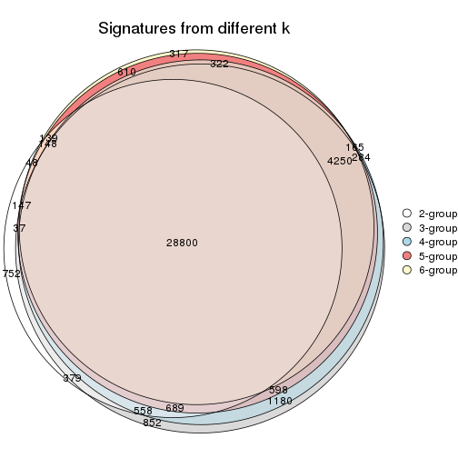

`get_signature()` returns a data frame invisibly. TO get the list of signatures, the function
call should be assigned to a variable explicitly. In following code, if `plot` argument is set
to `FALSE`, no heatmap is plotted while only the differential analysis is performed.

```r
# code only for demonstration
tb = get_signature(res, k = ..., plot = FALSE)
```

An example of the output of `tb` is:

```
#>   which_row         fdr    mean_1    mean_2 scaled_mean_1 scaled_mean_2 km
#> 1        38 0.042760348  8.373488  9.131774    -0.5533452     0.5164555  1
#> 2        40 0.018707592  7.106213  8.469186    -0.6173731     0.5762149  1
#> 3        55 0.019134737 10.221463 11.207825    -0.6159697     0.5749050  1
#> 4        59 0.006059896  5.921854  7.869574    -0.6899429     0.6439467  1
#> 5        60 0.018055526  8.928898 10.211722    -0.6204761     0.5791110  1
#> 6        98 0.009384629 15.714769 14.887706     0.6635654    -0.6193277  2
...
```

The columns in `tb` are:

1. `which_row`: row indices corresponding to the input matrix.
2. `fdr`: FDR for the differential test. 
3. `mean_x`: The mean value in group x.
4. `scaled_mean_x`: The mean value in group x after rows are scaled.
5. `km`: Row groups if k-means clustering is applied to rows.


UMAP plot which shows how samples are separated.


<script>
$( function() {
	$( '#tabs-ATC-pam-dimension-reduction' ).tabs();
} );
</script>
<div id='tabs-ATC-pam-dimension-reduction'>
<ul>
<li><a href='#tab-ATC-pam-dimension-reduction-1'>k = 2</a></li>
<li><a href='#tab-ATC-pam-dimension-reduction-2'>k = 3</a></li>
<li><a href='#tab-ATC-pam-dimension-reduction-3'>k = 4</a></li>
<li><a href='#tab-ATC-pam-dimension-reduction-4'>k = 5</a></li>
<li><a href='#tab-ATC-pam-dimension-reduction-5'>k = 6</a></li>
</ul>
<div id='tab-ATC-pam-dimension-reduction-1'>
<pre><code class="r">dimension_reduction(res, k = 2, method = &quot;UMAP&quot;)
</code></pre>

<p></p>

</div>
<div id='tab-ATC-pam-dimension-reduction-2'>
<pre><code class="r">dimension_reduction(res, k = 3, method = &quot;UMAP&quot;)
</code></pre>

<p></p>

</div>
<div id='tab-ATC-pam-dimension-reduction-3'>
<pre><code class="r">dimension_reduction(res, k = 4, method = &quot;UMAP&quot;)
</code></pre>

<p></p>

</div>
<div id='tab-ATC-pam-dimension-reduction-4'>
<pre><code class="r">dimension_reduction(res, k = 5, method = &quot;UMAP&quot;)
</code></pre>

<p>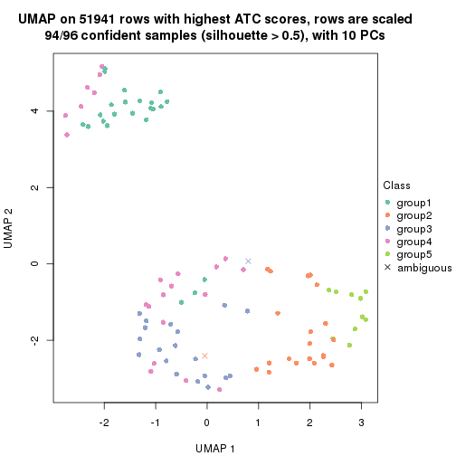</p>

</div>
<div id='tab-ATC-pam-dimension-reduction-5'>
<pre><code class="r">dimension_reduction(res, k = 6, method = &quot;UMAP&quot;)
</code></pre>

<p></p>

</div>
</div>


Following heatmap shows how subgroups are split when increasing `k`:

```r
collect_classes(res)
```


Test correlation between subgroups and known annotations. If the known
annotation is numeric, one-way ANOVA test is applied, and if the known
annotation is discrete, chi-squared contingency table test is applied.

```r
test_to_known_factors(res)
```

```
#>          n disease.state(p) k
#> ATC:pam 96           0.0155 2
#> ATC:pam 87           0.0324 3
#> ATC:pam 88           0.0558 4
#> ATC:pam 94           0.0763 5
#> ATC:pam 91           0.0744 6
```


If matrix rows can be associated to genes, consider to use `functional_enrichment(res,
...)` to perform function enrichment for the signature genes. See [this vignette](http://bioconductor.org/packages/devel/bioc/vignettes/cola/inst/doc/functional_enrichment.html) for more detailed explanations.


 

---------------------------------------------------


### ATC:mclust**


The object with results only for a single top-value method and a single partition method 
can be extracted as:

```r
res = res_list["ATC", "mclust"]
# you can also extract it by
# res = res_list["ATC:mclust"]
```

A summary of `res` and all the functions that can be applied to it:

```r
res
```

```
#> A 'ConsensusPartition' object with k = 2, 3, 4, 5, 6.
#>   On a matrix with 51941 rows and 96 columns.
#>   Top rows (1000, 2000, 3000, 4000, 5000) are extracted by 'ATC' method.
#>   Subgroups are detected by 'mclust' method.
#>   Performed in total 1250 partitions by row resampling.
#>   Best k for subgroups seems to be 4.
#> 
#> Following methods can be applied to this 'ConsensusPartition' object:
#>  [1] "cola_report"             "collect_classes"         "collect_plots"          
#>  [4] "collect_stats"           "colnames"                "compare_signatures"     
#>  [7] "consensus_heatmap"       "dimension_reduction"     "functional_enrichment"  
#> [10] "get_anno_col"            "get_anno"                "get_classes"            
#> [13] "get_consensus"           "get_matrix"              "get_membership"         
#> [16] "get_param"               "get_signatures"          "get_stats"              
#> [19] "is_best_k"               "is_stable_k"             "membership_heatmap"     
#> [22] "ncol"                    "nrow"                    "plot_ecdf"              
#> [25] "rownames"                "select_partition_number" "show"                   
#> [28] "suggest_best_k"          "test_to_known_factors"
```

`collect_plots()` function collects all the plots made from `res` for all `k` (number of partitions)
into one single page to provide an easy and fast comparison between different `k`.

```r
collect_plots(res)
```


The plots are:

- The first row: a plot of the ECDF (empirical cumulative distribution
  function) curves of the consensus matrix for each `k` and the heatmap of
  predicted classes for each `k`.
- The second row: heatmaps of the consensus matrix for each `k`.
- The third row: heatmaps of the membership matrix for each `k`.
- The fouth row: heatmaps of the signatures for each `k`.

All the plots in panels can be made by individual functions and they are
plotted later in this section.

`select_partition_number()` produces several plots showing different
statistics for choosing "optimized" `k`. There are following statistics:

- ECDF curves of the consensus matrix for each `k`;
- 1-PAC. [The PAC
  score](https://en.wikipedia.org/wiki/Consensus_clustering#Over-interpretation_potential_of_consensus_clustering)
  measures the proportion of the ambiguous subgrouping.
- Mean silhouette score.
- Concordance. The mean probability of fiting the consensus class ids in all
  partitions.
- Area increased. Denote $A_k$ as the area under the ECDF curve for current
  `k`, the area increased is defined as $A_k - A_{k-1}$.
- Rand index. The percent of pairs of samples that are both in a same cluster
  or both are not in a same cluster in the partition of k and k-1.
- Jaccard index. The ratio of pairs of samples are both in a same cluster in
  the partition of k and k-1 and the pairs of samples are both in a same
  cluster in the partition k or k-1.

The detailed explanations of these statistics can be found in [the _cola_
vignette](http://bioconductor.org/packages/devel/bioc/vignettes/cola/inst/doc/cola.html#toc_13).

Generally speaking, lower PAC score, higher mean silhouette score or higher
concordance corresponds to better partition. Rand index and Jaccard index
measure how similar the current partition is compared to partition with `k-1`.
If they are too similar, we won't accept `k` is better than `k-1`.

```r
select_partition_number(res)
```


The numeric values for all these statistics can be obtained by `get_stats()`.

```r
get_stats(res)
```

```
#>   k 1-PAC mean_silhouette concordance area_increased  Rand Jaccard
#> 2 2 0.679           0.855       0.900         0.2991 0.643   0.643
#> 3 3 0.637           0.847       0.926         0.7433 0.668   0.541
#> 4 4 1.000           0.974       0.990         0.2963 0.680   0.424
#> 5 5 0.820           0.799       0.872         0.1112 0.897   0.700
#> 6 6 0.736           0.673       0.791         0.0538 0.879   0.583
```

`suggest_best_k()` suggests the best $k$ based on these statistics. The rules are as follows:

- All $k$ with Jaccard index larger than 0.95 are removed because increasing
  $k$ does not provide enough extra information. If all $k$ are removed, it is
  marked as no subgroup is detected.
- For all $k$ with 1-PAC score larger than 0.9, the maximal $k$ is taken as
  the best $k$, and other $k$ are marked as optional $k$.
- If it does not fit the second rule. The $k$ with the maximal vote of the
  highest 1-PAC score, highest mean silhouette, and highest concordance is
  taken as the best $k$.

```r
suggest_best_k(res)
```

```
#> [1] 4
```


Following shows the table of the partitions (You need to click the **show/hide
code output** link to see it). The membership matrix (columns with name `p*`)
is inferred by
[`clue::cl_consensus()`](https://www.rdocumentation.org/link/cl_consensus?package=clue)
function with the `SE` method. Basically the value in the membership matrix
represents the probability to belong to a certain group. The finall class
label for an item is determined with the group with highest probability it
belongs to.

In `get_classes()` function, the entropy is calculated from the membership
matrix and the silhouette score is calculated from the consensus matrix.


<script>
$( function() {
	$( '#tabs-ATC-mclust-get-classes' ).tabs();
} );
</script>
<div id='tabs-ATC-mclust-get-classes'>
<ul>
<li><a href='#tab-ATC-mclust-get-classes-1'>k = 2</a></li>
<li><a href='#tab-ATC-mclust-get-classes-2'>k = 3</a></li>
<li><a href='#tab-ATC-mclust-get-classes-3'>k = 4</a></li>
<li><a href='#tab-ATC-mclust-get-classes-4'>k = 5</a></li>
<li><a href='#tab-ATC-mclust-get-classes-5'>k = 6</a></li>
</ul>

<div id='tab-ATC-mclust-get-classes-1'>
<p><a id='tab-ATC-mclust-get-classes-1-a' style='color:#0366d6' href='#'>show/hide code output</a></p>
<pre><code class="r">cbind(get_classes(res, k = 2), get_membership(res, k = 2))
</code></pre>

<pre><code>#&gt;           class entropy silhouette    p1    p2
#&gt; GSM531600     1  0.0000      0.933 1.000 0.000
#&gt; GSM531601     1  0.0000      0.933 1.000 0.000
#&gt; GSM531605     1  0.2778      0.923 0.952 0.048
#&gt; GSM531615     2  0.9286      0.892 0.344 0.656
#&gt; GSM531617     2  0.9286      0.892 0.344 0.656
#&gt; GSM531624     2  0.9286      0.892 0.344 0.656
#&gt; GSM531627     2  0.9522      0.859 0.372 0.628
#&gt; GSM531629     1  0.9881     -0.374 0.564 0.436
#&gt; GSM531631     1  0.9635     -0.178 0.612 0.388
#&gt; GSM531634     2  0.9286      0.892 0.344 0.656
#&gt; GSM531636     1  0.0376      0.929 0.996 0.004
#&gt; GSM531637     2  0.9286      0.892 0.344 0.656
#&gt; GSM531654     1  0.0000      0.933 1.000 0.000
#&gt; GSM531655     1  0.0000      0.933 1.000 0.000
#&gt; GSM531658     1  0.0000      0.933 1.000 0.000
#&gt; GSM531660     1  0.0000      0.933 1.000 0.000
#&gt; GSM531602     1  0.2778      0.923 0.952 0.048
#&gt; GSM531603     1  0.2778      0.923 0.952 0.048
#&gt; GSM531604     1  0.2778      0.923 0.952 0.048
#&gt; GSM531606     1  0.2778      0.923 0.952 0.048
#&gt; GSM531607     1  0.2778      0.923 0.952 0.048
#&gt; GSM531608     2  0.0000      0.666 0.000 1.000
#&gt; GSM531609     2  0.0000      0.666 0.000 1.000
#&gt; GSM531610     2  0.0000      0.666 0.000 1.000
#&gt; GSM531611     1  0.2778      0.923 0.952 0.048
#&gt; GSM531612     1  0.2778      0.923 0.952 0.048
#&gt; GSM531613     1  0.2778      0.923 0.952 0.048
#&gt; GSM531614     2  0.0000      0.666 0.000 1.000
#&gt; GSM531616     2  0.9323      0.889 0.348 0.652
#&gt; GSM531618     1  0.0000      0.933 1.000 0.000
#&gt; GSM531619     2  0.9286      0.892 0.344 0.656
#&gt; GSM531620     2  0.9460      0.870 0.364 0.636
#&gt; GSM531621     2  0.9286      0.892 0.344 0.656
#&gt; GSM531622     2  0.9552      0.853 0.376 0.624
#&gt; GSM531623     1  0.9977     -0.497 0.528 0.472
#&gt; GSM531625     2  0.9286      0.892 0.344 0.656
#&gt; GSM531626     1  0.9044      0.159 0.680 0.320
#&gt; GSM531628     2  0.9286      0.892 0.344 0.656
#&gt; GSM531630     2  0.9552      0.853 0.376 0.624
#&gt; GSM531632     1  0.0000      0.933 1.000 0.000
#&gt; GSM531633     2  0.9286      0.892 0.344 0.656
#&gt; GSM531635     2  0.9323      0.889 0.348 0.652
#&gt; GSM531638     1  0.0000      0.933 1.000 0.000
#&gt; GSM531639     1  0.0000      0.933 1.000 0.000
#&gt; GSM531640     2  0.9286      0.892 0.344 0.656
#&gt; GSM531641     1  0.0000      0.933 1.000 0.000
#&gt; GSM531642     1  0.0000      0.933 1.000 0.000
#&gt; GSM531643     1  0.0000      0.933 1.000 0.000
#&gt; GSM531644     1  0.0000      0.933 1.000 0.000
#&gt; GSM531645     1  0.0000      0.933 1.000 0.000
#&gt; GSM531646     1  0.0000      0.933 1.000 0.000
#&gt; GSM531647     1  0.0000      0.933 1.000 0.000
#&gt; GSM531648     1  0.0000      0.933 1.000 0.000
#&gt; GSM531649     1  0.8555      0.323 0.720 0.280
#&gt; GSM531650     1  0.0000      0.933 1.000 0.000
#&gt; GSM531651     2  0.9286      0.892 0.344 0.656
#&gt; GSM531652     1  0.0000      0.933 1.000 0.000
#&gt; GSM531653     1  0.0000      0.933 1.000 0.000
#&gt; GSM531656     1  0.0000      0.933 1.000 0.000
#&gt; GSM531657     1  0.0000      0.933 1.000 0.000
#&gt; GSM531659     1  0.0000      0.933 1.000 0.000
#&gt; GSM531661     1  0.0000      0.933 1.000 0.000
#&gt; GSM531662     1  0.0000      0.933 1.000 0.000
#&gt; GSM531663     1  0.0000      0.933 1.000 0.000
#&gt; GSM531664     1  0.0000      0.933 1.000 0.000
#&gt; GSM531665     1  0.0000      0.933 1.000 0.000
#&gt; GSM531666     1  0.0000      0.933 1.000 0.000
#&gt; GSM531667     1  0.0000      0.933 1.000 0.000
#&gt; GSM531668     1  0.0000      0.933 1.000 0.000
#&gt; GSM531669     1  0.0000      0.933 1.000 0.000
#&gt; GSM531670     1  0.0000      0.933 1.000 0.000
#&gt; GSM531671     1  0.0000      0.933 1.000 0.000
#&gt; GSM531672     1  0.2236      0.926 0.964 0.036
#&gt; GSM531673     1  0.0000      0.933 1.000 0.000
#&gt; GSM531674     1  0.0000      0.933 1.000 0.000
#&gt; GSM531675     1  0.2778      0.923 0.952 0.048
#&gt; GSM531676     1  0.2778      0.923 0.952 0.048
#&gt; GSM531677     1  0.2778      0.923 0.952 0.048
#&gt; GSM531678     1  0.2778      0.923 0.952 0.048
#&gt; GSM531679     1  0.2778      0.923 0.952 0.048
#&gt; GSM531680     1  0.2778      0.923 0.952 0.048
#&gt; GSM531681     1  0.2778      0.923 0.952 0.048
#&gt; GSM531682     1  0.2778      0.923 0.952 0.048
#&gt; GSM531683     1  0.2778      0.923 0.952 0.048
#&gt; GSM531684     1  0.2778      0.923 0.952 0.048
#&gt; GSM531685     1  0.2778      0.923 0.952 0.048
#&gt; GSM531686     1  0.2778      0.923 0.952 0.048
#&gt; GSM531687     1  0.2778      0.923 0.952 0.048
#&gt; GSM531688     1  0.2778      0.923 0.952 0.048
#&gt; GSM531689     1  0.2778      0.923 0.952 0.048
#&gt; GSM531690     1  0.2778      0.923 0.952 0.048
#&gt; GSM531691     1  0.2778      0.923 0.952 0.048
#&gt; GSM531692     1  0.2778      0.923 0.952 0.048
#&gt; GSM531693     1  0.0000      0.933 1.000 0.000
#&gt; GSM531694     1  0.2778      0.923 0.952 0.048
#&gt; GSM531695     1  0.2778      0.923 0.952 0.048
</code></pre>

<script>
$('#tab-ATC-mclust-get-classes-1-a').parent().next().next().hide();
$('#tab-ATC-mclust-get-classes-1-a').click(function(){
  $('#tab-ATC-mclust-get-classes-1-a').parent().next().next().toggle();
  return(false);
});
</script>
</div>

<div id='tab-ATC-mclust-get-classes-2'>
<p><a id='tab-ATC-mclust-get-classes-2-a' style='color:#0366d6' href='#'>show/hide code output</a></p>
<pre><code class="r">cbind(get_classes(res, k = 3), get_membership(res, k = 3))
</code></pre>

<pre><code>#&gt;           class entropy silhouette    p1    p2    p3
#&gt; GSM531600     2  0.1411     0.8939 0.036 0.964 0.000
#&gt; GSM531601     2  0.0424     0.9172 0.008 0.992 0.000
#&gt; GSM531605     1  0.0000     0.8767 1.000 0.000 0.000
#&gt; GSM531615     2  0.0237     0.9236 0.000 0.996 0.004
#&gt; GSM531617     2  0.0237     0.9236 0.000 0.996 0.004
#&gt; GSM531624     2  0.0237     0.9236 0.000 0.996 0.004
#&gt; GSM531627     2  0.0237     0.9236 0.000 0.996 0.004
#&gt; GSM531629     2  0.0237     0.9236 0.000 0.996 0.004
#&gt; GSM531631     2  0.0000     0.9225 0.000 1.000 0.000
#&gt; GSM531634     2  0.0237     0.9236 0.000 0.996 0.004
#&gt; GSM531636     2  0.0000     0.9225 0.000 1.000 0.000
#&gt; GSM531637     2  0.0237     0.9236 0.000 0.996 0.004
#&gt; GSM531654     2  0.6282     0.2678 0.384 0.612 0.004
#&gt; GSM531655     1  0.4733     0.8121 0.800 0.196 0.004
#&gt; GSM531658     1  0.3112     0.8492 0.900 0.096 0.004
#&gt; GSM531660     1  0.0475     0.8757 0.992 0.004 0.004
#&gt; GSM531602     1  0.0000     0.8767 1.000 0.000 0.000
#&gt; GSM531603     1  0.0237     0.8765 0.996 0.004 0.000
#&gt; GSM531604     1  0.0000     0.8767 1.000 0.000 0.000
#&gt; GSM531606     1  0.0000     0.8767 1.000 0.000 0.000
#&gt; GSM531607     1  0.0237     0.8765 0.996 0.004 0.000
#&gt; GSM531608     3  0.0000     1.0000 0.000 0.000 1.000
#&gt; GSM531609     3  0.0000     1.0000 0.000 0.000 1.000
#&gt; GSM531610     3  0.0000     1.0000 0.000 0.000 1.000
#&gt; GSM531611     1  0.0475     0.8757 0.992 0.004 0.004
#&gt; GSM531612     1  0.0475     0.8757 0.992 0.004 0.004
#&gt; GSM531613     1  0.0237     0.8765 0.996 0.004 0.000
#&gt; GSM531614     3  0.0000     1.0000 0.000 0.000 1.000
#&gt; GSM531616     2  0.0237     0.9236 0.000 0.996 0.004
#&gt; GSM531618     1  0.4974     0.7781 0.764 0.236 0.000
#&gt; GSM531619     2  0.0237     0.9236 0.000 0.996 0.004
#&gt; GSM531620     2  0.0237     0.9236 0.000 0.996 0.004
#&gt; GSM531621     2  0.0237     0.9236 0.000 0.996 0.004
#&gt; GSM531622     2  0.0237     0.9236 0.000 0.996 0.004
#&gt; GSM531623     2  0.0237     0.9236 0.000 0.996 0.004
#&gt; GSM531625     2  0.0237     0.9236 0.000 0.996 0.004
#&gt; GSM531626     2  0.0000     0.9225 0.000 1.000 0.000
#&gt; GSM531628     2  0.0237     0.9236 0.000 0.996 0.004
#&gt; GSM531630     2  0.0237     0.9236 0.000 0.996 0.004
#&gt; GSM531632     2  0.0000     0.9225 0.000 1.000 0.000
#&gt; GSM531633     2  0.0237     0.9236 0.000 0.996 0.004
#&gt; GSM531635     2  0.0237     0.9236 0.000 0.996 0.004
#&gt; GSM531638     2  0.0000     0.9225 0.000 1.000 0.000
#&gt; GSM531639     2  0.2878     0.8217 0.096 0.904 0.000
#&gt; GSM531640     2  0.0237     0.9236 0.000 0.996 0.004
#&gt; GSM531641     1  0.4555     0.8105 0.800 0.200 0.000
#&gt; GSM531642     2  0.6095     0.2461 0.392 0.608 0.000
#&gt; GSM531643     2  0.4062     0.7325 0.164 0.836 0.000
#&gt; GSM531644     1  0.5291     0.7458 0.732 0.268 0.000
#&gt; GSM531645     1  0.5291     0.7458 0.732 0.268 0.000
#&gt; GSM531646     2  0.0000     0.9225 0.000 1.000 0.000
#&gt; GSM531647     1  0.5678     0.6738 0.684 0.316 0.000
#&gt; GSM531648     1  0.5291     0.7458 0.732 0.268 0.000
#&gt; GSM531649     2  0.0000     0.9225 0.000 1.000 0.000
#&gt; GSM531650     1  0.5529     0.7068 0.704 0.296 0.000
#&gt; GSM531651     2  0.0237     0.9236 0.000 0.996 0.004
#&gt; GSM531652     2  0.6215     0.0905 0.428 0.572 0.000
#&gt; GSM531653     1  0.5497     0.7128 0.708 0.292 0.000
#&gt; GSM531656     1  0.4974     0.7781 0.764 0.236 0.000
#&gt; GSM531657     1  0.4110     0.8300 0.844 0.152 0.004
#&gt; GSM531659     1  0.4733     0.8121 0.800 0.196 0.004
#&gt; GSM531661     2  0.1525     0.8946 0.032 0.964 0.004
#&gt; GSM531662     2  0.5404     0.6069 0.256 0.740 0.004
#&gt; GSM531663     1  0.4733     0.8121 0.800 0.196 0.004
#&gt; GSM531664     1  0.4931     0.7820 0.768 0.232 0.000
#&gt; GSM531665     1  0.4733     0.8121 0.800 0.196 0.004
#&gt; GSM531666     1  0.4555     0.8105 0.800 0.200 0.000
#&gt; GSM531667     2  0.1525     0.8946 0.032 0.964 0.004
#&gt; GSM531668     1  0.4733     0.8121 0.800 0.196 0.004
#&gt; GSM531669     1  0.4974     0.7781 0.764 0.236 0.000
#&gt; GSM531670     1  0.5733     0.6492 0.676 0.324 0.000
#&gt; GSM531671     2  0.1525     0.8946 0.032 0.964 0.004
#&gt; GSM531672     1  0.0475     0.8757 0.992 0.004 0.004
#&gt; GSM531673     1  0.4733     0.8121 0.800 0.196 0.004
#&gt; GSM531674     1  0.4974     0.7781 0.764 0.236 0.000
#&gt; GSM531675     1  0.0000     0.8767 1.000 0.000 0.000
#&gt; GSM531676     1  0.0000     0.8767 1.000 0.000 0.000
#&gt; GSM531677     1  0.0000     0.8767 1.000 0.000 0.000
#&gt; GSM531678     1  0.0000     0.8767 1.000 0.000 0.000
#&gt; GSM531679     1  0.0000     0.8767 1.000 0.000 0.000
#&gt; GSM531680     1  0.0000     0.8767 1.000 0.000 0.000
#&gt; GSM531681     1  0.0000     0.8767 1.000 0.000 0.000
#&gt; GSM531682     1  0.0000     0.8767 1.000 0.000 0.000
#&gt; GSM531683     1  0.0000     0.8767 1.000 0.000 0.000
#&gt; GSM531684     1  0.0000     0.8767 1.000 0.000 0.000
#&gt; GSM531685     1  0.0000     0.8767 1.000 0.000 0.000
#&gt; GSM531686     1  0.0000     0.8767 1.000 0.000 0.000
#&gt; GSM531687     1  0.0000     0.8767 1.000 0.000 0.000
#&gt; GSM531688     1  0.0000     0.8767 1.000 0.000 0.000
#&gt; GSM531689     1  0.0000     0.8767 1.000 0.000 0.000
#&gt; GSM531690     1  0.0000     0.8767 1.000 0.000 0.000
#&gt; GSM531691     1  0.0000     0.8767 1.000 0.000 0.000
#&gt; GSM531692     1  0.0000     0.8767 1.000 0.000 0.000
#&gt; GSM531693     1  0.0237     0.8765 0.996 0.004 0.000
#&gt; GSM531694     1  0.0000     0.8767 1.000 0.000 0.000
#&gt; GSM531695     1  0.0000     0.8767 1.000 0.000 0.000
</code></pre>

<script>
$('#tab-ATC-mclust-get-classes-2-a').parent().next().next().hide();
$('#tab-ATC-mclust-get-classes-2-a').click(function(){
  $('#tab-ATC-mclust-get-classes-2-a').parent().next().next().toggle();
  return(false);
});
</script>
</div>

<div id='tab-ATC-mclust-get-classes-3'>
<p><a id='tab-ATC-mclust-get-classes-3-a' style='color:#0366d6' href='#'>show/hide code output</a></p>
<pre><code class="r">cbind(get_classes(res, k = 4), get_membership(res, k = 4))
</code></pre>

<pre><code>#&gt;           class entropy silhouette    p1    p2    p3 p4
#&gt; GSM531600     3  0.0000      0.988 0.000 0.000 1.000  0
#&gt; GSM531601     3  0.0817      0.982 0.000 0.024 0.976  0
#&gt; GSM531605     1  0.0000      0.990 1.000 0.000 0.000  0
#&gt; GSM531615     2  0.0000      0.967 0.000 1.000 0.000  0
#&gt; GSM531617     2  0.0000      0.967 0.000 1.000 0.000  0
#&gt; GSM531624     2  0.0000      0.967 0.000 1.000 0.000  0
#&gt; GSM531627     2  0.0000      0.967 0.000 1.000 0.000  0
#&gt; GSM531629     2  0.4730      0.345 0.000 0.636 0.364  0
#&gt; GSM531631     3  0.0921      0.979 0.000 0.028 0.972  0
#&gt; GSM531634     2  0.0000      0.967 0.000 1.000 0.000  0
#&gt; GSM531636     3  0.0817      0.982 0.000 0.024 0.976  0
#&gt; GSM531637     2  0.0000      0.967 0.000 1.000 0.000  0
#&gt; GSM531654     3  0.0000      0.988 0.000 0.000 1.000  0
#&gt; GSM531655     3  0.0000      0.988 0.000 0.000 1.000  0
#&gt; GSM531658     3  0.0000      0.988 0.000 0.000 1.000  0
#&gt; GSM531660     1  0.2760      0.812 0.872 0.000 0.128  0
#&gt; GSM531602     1  0.0000      0.990 1.000 0.000 0.000  0
#&gt; GSM531603     1  0.0000      0.990 1.000 0.000 0.000  0
#&gt; GSM531604     1  0.0000      0.990 1.000 0.000 0.000  0
#&gt; GSM531606     1  0.0000      0.990 1.000 0.000 0.000  0
#&gt; GSM531607     1  0.0000      0.990 1.000 0.000 0.000  0
#&gt; GSM531608     4  0.0000      1.000 0.000 0.000 0.000  1
#&gt; GSM531609     4  0.0000      1.000 0.000 0.000 0.000  1
#&gt; GSM531610     4  0.0000      1.000 0.000 0.000 0.000  1
#&gt; GSM531611     1  0.0469      0.979 0.988 0.000 0.012  0
#&gt; GSM531612     1  0.0469      0.979 0.988 0.000 0.012  0
#&gt; GSM531613     1  0.0000      0.990 1.000 0.000 0.000  0
#&gt; GSM531614     4  0.0000      1.000 0.000 0.000 0.000  1
#&gt; GSM531616     2  0.0000      0.967 0.000 1.000 0.000  0
#&gt; GSM531618     3  0.0000      0.988 0.000 0.000 1.000  0
#&gt; GSM531619     2  0.0000      0.967 0.000 1.000 0.000  0
#&gt; GSM531620     2  0.0000      0.967 0.000 1.000 0.000  0
#&gt; GSM531621     2  0.0000      0.967 0.000 1.000 0.000  0
#&gt; GSM531622     2  0.0000      0.967 0.000 1.000 0.000  0
#&gt; GSM531623     2  0.0921      0.928 0.000 0.972 0.028  0
#&gt; GSM531625     2  0.0000      0.967 0.000 1.000 0.000  0
#&gt; GSM531626     3  0.0817      0.982 0.000 0.024 0.976  0
#&gt; GSM531628     2  0.0000      0.967 0.000 1.000 0.000  0
#&gt; GSM531630     2  0.0000      0.967 0.000 1.000 0.000  0
#&gt; GSM531632     3  0.0817      0.982 0.000 0.024 0.976  0
#&gt; GSM531633     2  0.0000      0.967 0.000 1.000 0.000  0
#&gt; GSM531635     2  0.0000      0.967 0.000 1.000 0.000  0
#&gt; GSM531638     3  0.0817      0.982 0.000 0.024 0.976  0
#&gt; GSM531639     3  0.0000      0.988 0.000 0.000 1.000  0
#&gt; GSM531640     2  0.0000      0.967 0.000 1.000 0.000  0
#&gt; GSM531641     3  0.0000      0.988 0.000 0.000 1.000  0
#&gt; GSM531642     3  0.0000      0.988 0.000 0.000 1.000  0
#&gt; GSM531643     3  0.0469      0.985 0.000 0.012 0.988  0
#&gt; GSM531644     3  0.0817      0.982 0.000 0.024 0.976  0
#&gt; GSM531645     3  0.0817      0.982 0.000 0.024 0.976  0
#&gt; GSM531646     3  0.0817      0.982 0.000 0.024 0.976  0
#&gt; GSM531647     3  0.0817      0.982 0.000 0.024 0.976  0
#&gt; GSM531648     3  0.0817      0.982 0.000 0.024 0.976  0
#&gt; GSM531649     3  0.0817      0.982 0.000 0.024 0.976  0
#&gt; GSM531650     3  0.0817      0.982 0.000 0.024 0.976  0
#&gt; GSM531651     2  0.0000      0.967 0.000 1.000 0.000  0
#&gt; GSM531652     3  0.0817      0.982 0.000 0.024 0.976  0
#&gt; GSM531653     3  0.0817      0.982 0.000 0.024 0.976  0
#&gt; GSM531656     3  0.0000      0.988 0.000 0.000 1.000  0
#&gt; GSM531657     3  0.0000      0.988 0.000 0.000 1.000  0
#&gt; GSM531659     3  0.0000      0.988 0.000 0.000 1.000  0
#&gt; GSM531661     3  0.0188      0.986 0.000 0.004 0.996  0
#&gt; GSM531662     3  0.0000      0.988 0.000 0.000 1.000  0
#&gt; GSM531663     3  0.0000      0.988 0.000 0.000 1.000  0
#&gt; GSM531664     3  0.0000      0.988 0.000 0.000 1.000  0
#&gt; GSM531665     3  0.0000      0.988 0.000 0.000 1.000  0
#&gt; GSM531666     3  0.0000      0.988 0.000 0.000 1.000  0
#&gt; GSM531667     3  0.0000      0.988 0.000 0.000 1.000  0
#&gt; GSM531668     3  0.0000      0.988 0.000 0.000 1.000  0
#&gt; GSM531669     3  0.0000      0.988 0.000 0.000 1.000  0
#&gt; GSM531670     3  0.0000      0.988 0.000 0.000 1.000  0
#&gt; GSM531671     3  0.0000      0.988 0.000 0.000 1.000  0
#&gt; GSM531672     1  0.1118      0.952 0.964 0.000 0.036  0
#&gt; GSM531673     3  0.0000      0.988 0.000 0.000 1.000  0
#&gt; GSM531674     3  0.0000      0.988 0.000 0.000 1.000  0
#&gt; GSM531675     1  0.0000      0.990 1.000 0.000 0.000  0
#&gt; GSM531676     1  0.0000      0.990 1.000 0.000 0.000  0
#&gt; GSM531677     1  0.0000      0.990 1.000 0.000 0.000  0
#&gt; GSM531678     1  0.0000      0.990 1.000 0.000 0.000  0
#&gt; GSM531679     1  0.0000      0.990 1.000 0.000 0.000  0
#&gt; GSM531680     1  0.0000      0.990 1.000 0.000 0.000  0
#&gt; GSM531681     1  0.0000      0.990 1.000 0.000 0.000  0
#&gt; GSM531682     1  0.0000      0.990 1.000 0.000 0.000  0
#&gt; GSM531683     1  0.0000      0.990 1.000 0.000 0.000  0
#&gt; GSM531684     1  0.0000      0.990 1.000 0.000 0.000  0
#&gt; GSM531685     1  0.0000      0.990 1.000 0.000 0.000  0
#&gt; GSM531686     1  0.0000      0.990 1.000 0.000 0.000  0
#&gt; GSM531687     1  0.0000      0.990 1.000 0.000 0.000  0
#&gt; GSM531688     1  0.0000      0.990 1.000 0.000 0.000  0
#&gt; GSM531689     1  0.0000      0.990 1.000 0.000 0.000  0
#&gt; GSM531690     1  0.0000      0.990 1.000 0.000 0.000  0
#&gt; GSM531691     1  0.0000      0.990 1.000 0.000 0.000  0
#&gt; GSM531692     1  0.0000      0.990 1.000 0.000 0.000  0
#&gt; GSM531693     1  0.1118      0.947 0.964 0.000 0.036  0
#&gt; GSM531694     1  0.0000      0.990 1.000 0.000 0.000  0
#&gt; GSM531695     1  0.0000      0.990 1.000 0.000 0.000  0
</code></pre>

<script>
$('#tab-ATC-mclust-get-classes-3-a').parent().next().next().hide();
$('#tab-ATC-mclust-get-classes-3-a').click(function(){
  $('#tab-ATC-mclust-get-classes-3-a').parent().next().next().toggle();
  return(false);
});
</script>
</div>

<div id='tab-ATC-mclust-get-classes-4'>
<p><a id='tab-ATC-mclust-get-classes-4-a' style='color:#0366d6' href='#'>show/hide code output</a></p>
<pre><code class="r">cbind(get_classes(res, k = 5), get_membership(res, k = 5))
</code></pre>

<pre><code>#&gt;           class entropy silhouette    p1    p2    p3 p4    p5
#&gt; GSM531600     3  0.3774      0.791 0.000 0.296 0.704  0 0.000
#&gt; GSM531601     3  0.4171      0.748 0.000 0.396 0.604  0 0.000
#&gt; GSM531605     1  0.0000      0.921 1.000 0.000 0.000  0 0.000
#&gt; GSM531615     5  0.0000      0.996 0.000 0.000 0.000  0 1.000
#&gt; GSM531617     2  0.4126      0.576 0.000 0.620 0.000  0 0.380
#&gt; GSM531624     5  0.0000      0.996 0.000 0.000 0.000  0 1.000
#&gt; GSM531627     2  0.3983      0.623 0.000 0.660 0.000  0 0.340
#&gt; GSM531629     2  0.1792      0.696 0.000 0.916 0.000  0 0.084
#&gt; GSM531631     2  0.0000      0.674 0.000 1.000 0.000  0 0.000
#&gt; GSM531634     5  0.0290      0.990 0.000 0.008 0.000  0 0.992
#&gt; GSM531636     2  0.1168      0.653 0.000 0.960 0.032  0 0.008
#&gt; GSM531637     5  0.0000      0.996 0.000 0.000 0.000  0 1.000
#&gt; GSM531654     2  0.4227      0.431 0.000 0.580 0.420  0 0.000
#&gt; GSM531655     3  0.0162      0.750 0.000 0.004 0.996  0 0.000
#&gt; GSM531658     3  0.0000      0.747 0.000 0.000 1.000  0 0.000
#&gt; GSM531660     1  0.4227      0.458 0.580 0.000 0.420  0 0.000
#&gt; GSM531602     1  0.0000      0.921 1.000 0.000 0.000  0 0.000
#&gt; GSM531603     1  0.0000      0.921 1.000 0.000 0.000  0 0.000
#&gt; GSM531604     1  0.0000      0.921 1.000 0.000 0.000  0 0.000
#&gt; GSM531606     1  0.0000      0.921 1.000 0.000 0.000  0 0.000
#&gt; GSM531607     1  0.0000      0.921 1.000 0.000 0.000  0 0.000
#&gt; GSM531608     4  0.0000      1.000 0.000 0.000 0.000  1 0.000
#&gt; GSM531609     4  0.0000      1.000 0.000 0.000 0.000  1 0.000
#&gt; GSM531610     4  0.0000      1.000 0.000 0.000 0.000  1 0.000
#&gt; GSM531611     1  0.4045      0.551 0.644 0.000 0.356  0 0.000
#&gt; GSM531612     1  0.4074      0.540 0.636 0.000 0.364  0 0.000
#&gt; GSM531613     1  0.0290      0.916 0.992 0.000 0.008  0 0.000
#&gt; GSM531614     4  0.0000      1.000 0.000 0.000 0.000  1 0.000
#&gt; GSM531616     2  0.4060      0.607 0.000 0.640 0.000  0 0.360
#&gt; GSM531618     3  0.3534      0.797 0.000 0.256 0.744  0 0.000
#&gt; GSM531619     5  0.0000      0.996 0.000 0.000 0.000  0 1.000
#&gt; GSM531620     2  0.4045      0.611 0.000 0.644 0.000  0 0.356
#&gt; GSM531621     5  0.0000      0.996 0.000 0.000 0.000  0 1.000
#&gt; GSM531622     2  0.3966      0.626 0.000 0.664 0.000  0 0.336
#&gt; GSM531623     2  0.1908      0.691 0.000 0.908 0.000  0 0.092
#&gt; GSM531625     5  0.0000      0.996 0.000 0.000 0.000  0 1.000
#&gt; GSM531626     2  0.0000      0.674 0.000 1.000 0.000  0 0.000
#&gt; GSM531628     2  0.4101      0.588 0.000 0.628 0.000  0 0.372
#&gt; GSM531630     2  0.4045      0.611 0.000 0.644 0.000  0 0.356
#&gt; GSM531632     3  0.4235      0.717 0.000 0.424 0.576  0 0.000
#&gt; GSM531633     5  0.0290      0.990 0.000 0.008 0.000  0 0.992
#&gt; GSM531635     2  0.4060      0.607 0.000 0.640 0.000  0 0.360
#&gt; GSM531638     2  0.0000      0.674 0.000 1.000 0.000  0 0.000
#&gt; GSM531639     3  0.3857      0.787 0.000 0.312 0.688  0 0.000
#&gt; GSM531640     5  0.0290      0.990 0.000 0.008 0.000  0 0.992
#&gt; GSM531641     3  0.1341      0.778 0.000 0.056 0.944  0 0.000
#&gt; GSM531642     3  0.3039      0.802 0.000 0.192 0.808  0 0.000
#&gt; GSM531643     3  0.4114      0.763 0.000 0.376 0.624  0 0.000
#&gt; GSM531644     3  0.4138      0.759 0.000 0.384 0.616  0 0.000
#&gt; GSM531645     3  0.4138      0.759 0.000 0.384 0.616  0 0.000
#&gt; GSM531646     2  0.0510      0.662 0.000 0.984 0.016  0 0.000
#&gt; GSM531647     3  0.4249      0.708 0.000 0.432 0.568  0 0.000
#&gt; GSM531648     3  0.4138      0.759 0.000 0.384 0.616  0 0.000
#&gt; GSM531649     2  0.0000      0.674 0.000 1.000 0.000  0 0.000
#&gt; GSM531650     3  0.4138      0.759 0.000 0.384 0.616  0 0.000
#&gt; GSM531651     5  0.0000      0.996 0.000 0.000 0.000  0 1.000
#&gt; GSM531652     3  0.4150      0.756 0.000 0.388 0.612  0 0.000
#&gt; GSM531653     3  0.4161      0.752 0.000 0.392 0.608  0 0.000
#&gt; GSM531656     3  0.4126      0.761 0.000 0.380 0.620  0 0.000
#&gt; GSM531657     3  0.0000      0.747 0.000 0.000 1.000  0 0.000
#&gt; GSM531659     3  0.0000      0.747 0.000 0.000 1.000  0 0.000
#&gt; GSM531661     2  0.4665      0.565 0.000 0.692 0.260  0 0.048
#&gt; GSM531662     3  0.2179      0.799 0.000 0.112 0.888  0 0.000
#&gt; GSM531663     3  0.0000      0.747 0.000 0.000 1.000  0 0.000
#&gt; GSM531664     3  0.2179      0.799 0.000 0.112 0.888  0 0.000
#&gt; GSM531665     3  0.0000      0.747 0.000 0.000 1.000  0 0.000
#&gt; GSM531666     3  0.1851      0.791 0.000 0.088 0.912  0 0.000
#&gt; GSM531667     2  0.4713      0.549 0.000 0.676 0.280  0 0.044
#&gt; GSM531668     3  0.0000      0.747 0.000 0.000 1.000  0 0.000
#&gt; GSM531669     3  0.2179      0.799 0.000 0.112 0.888  0 0.000
#&gt; GSM531670     3  0.2230      0.800 0.000 0.116 0.884  0 0.000
#&gt; GSM531671     3  0.2179      0.799 0.000 0.112 0.888  0 0.000
#&gt; GSM531672     1  0.4182      0.489 0.600 0.000 0.400  0 0.000
#&gt; GSM531673     3  0.0000      0.747 0.000 0.000 1.000  0 0.000
#&gt; GSM531674     3  0.3932      0.782 0.000 0.328 0.672  0 0.000
#&gt; GSM531675     1  0.0000      0.921 1.000 0.000 0.000  0 0.000
#&gt; GSM531676     1  0.0000      0.921 1.000 0.000 0.000  0 0.000
#&gt; GSM531677     1  0.0000      0.921 1.000 0.000 0.000  0 0.000
#&gt; GSM531678     1  0.0000      0.921 1.000 0.000 0.000  0 0.000
#&gt; GSM531679     1  0.0000      0.921 1.000 0.000 0.000  0 0.000
#&gt; GSM531680     1  0.0000      0.921 1.000 0.000 0.000  0 0.000
#&gt; GSM531681     1  0.0000      0.921 1.000 0.000 0.000  0 0.000
#&gt; GSM531682     1  0.0000      0.921 1.000 0.000 0.000  0 0.000
#&gt; GSM531683     1  0.0000      0.921 1.000 0.000 0.000  0 0.000
#&gt; GSM531684     1  0.0000      0.921 1.000 0.000 0.000  0 0.000
#&gt; GSM531685     1  0.0703      0.907 0.976 0.000 0.024  0 0.000
#&gt; GSM531686     1  0.0000      0.921 1.000 0.000 0.000  0 0.000
#&gt; GSM531687     1  0.1043      0.896 0.960 0.000 0.040  0 0.000
#&gt; GSM531688     1  0.1043      0.896 0.960 0.000 0.040  0 0.000
#&gt; GSM531689     1  0.0000      0.921 1.000 0.000 0.000  0 0.000
#&gt; GSM531690     1  0.0000      0.921 1.000 0.000 0.000  0 0.000
#&gt; GSM531691     1  0.0000      0.921 1.000 0.000 0.000  0 0.000
#&gt; GSM531692     1  0.0000      0.921 1.000 0.000 0.000  0 0.000
#&gt; GSM531693     1  0.4262      0.416 0.560 0.000 0.440  0 0.000
#&gt; GSM531694     1  0.0000      0.921 1.000 0.000 0.000  0 0.000
#&gt; GSM531695     1  0.0794      0.905 0.972 0.000 0.028  0 0.000
</code></pre>

<script>
$('#tab-ATC-mclust-get-classes-4-a').parent().next().next().hide();
$('#tab-ATC-mclust-get-classes-4-a').click(function(){
  $('#tab-ATC-mclust-get-classes-4-a').parent().next().next().toggle();
  return(false);
});
</script>
</div>

<div id='tab-ATC-mclust-get-classes-5'>
<p><a id='tab-ATC-mclust-get-classes-5-a' style='color:#0366d6' href='#'>show/hide code output</a></p>
<pre><code class="r">cbind(get_classes(res, k = 6), get_membership(res, k = 6))
</code></pre>

<pre><code>#&gt;           class entropy silhouette    p1    p2    p3    p4 p5    p6
#&gt; GSM531600     3  0.5733      0.588 0.000 0.184 0.488 0.328  0 0.000
#&gt; GSM531601     3  0.3630      0.731 0.000 0.032 0.756 0.212  0 0.000
#&gt; GSM531605     1  0.0000      0.896 1.000 0.000 0.000 0.000  0 0.000
#&gt; GSM531615     6  0.0000      0.937 0.000 0.000 0.000 0.000  0 1.000
#&gt; GSM531617     2  0.3620      0.520 0.000 0.648 0.000 0.000  0 0.352
#&gt; GSM531624     6  0.0000      0.937 0.000 0.000 0.000 0.000  0 1.000
#&gt; GSM531627     2  0.4075      0.682 0.000 0.740 0.184 0.000  0 0.076
#&gt; GSM531629     2  0.3725      0.643 0.000 0.676 0.316 0.000  0 0.008
#&gt; GSM531631     2  0.3563      0.623 0.000 0.664 0.336 0.000  0 0.000
#&gt; GSM531634     6  0.2730      0.703 0.000 0.192 0.000 0.000  0 0.808
#&gt; GSM531636     3  0.5149      0.624 0.000 0.184 0.624 0.192  0 0.000
#&gt; GSM531637     6  0.0000      0.937 0.000 0.000 0.000 0.000  0 1.000
#&gt; GSM531654     2  0.3937      0.218 0.000 0.572 0.004 0.424  0 0.000
#&gt; GSM531655     4  0.2852      0.546 0.000 0.080 0.064 0.856  0 0.000
#&gt; GSM531658     4  0.0146      0.684 0.000 0.004 0.000 0.996  0 0.000
#&gt; GSM531660     4  0.3269      0.531 0.184 0.024 0.000 0.792  0 0.000
#&gt; GSM531602     1  0.0000      0.896 1.000 0.000 0.000 0.000  0 0.000
#&gt; GSM531603     1  0.2450      0.807 0.868 0.016 0.000 0.116  0 0.000
#&gt; GSM531604     1  0.2941      0.729 0.780 0.000 0.220 0.000  0 0.000
#&gt; GSM531606     1  0.2941      0.729 0.780 0.000 0.220 0.000  0 0.000
#&gt; GSM531607     1  0.0146      0.894 0.996 0.004 0.000 0.000  0 0.000
#&gt; GSM531608     5  0.0000      1.000 0.000 0.000 0.000 0.000  1 0.000
#&gt; GSM531609     5  0.0000      1.000 0.000 0.000 0.000 0.000  1 0.000
#&gt; GSM531610     5  0.0000      1.000 0.000 0.000 0.000 0.000  1 0.000
#&gt; GSM531611     4  0.4626      0.404 0.272 0.076 0.000 0.652  0 0.000
#&gt; GSM531612     4  0.4544      0.417 0.256 0.076 0.000 0.668  0 0.000
#&gt; GSM531613     1  0.1327      0.858 0.936 0.064 0.000 0.000  0 0.000
#&gt; GSM531614     5  0.0000      1.000 0.000 0.000 0.000 0.000  1 0.000
#&gt; GSM531616     2  0.3175      0.630 0.000 0.744 0.000 0.000  0 0.256
#&gt; GSM531618     3  0.5631      0.574 0.000 0.156 0.484 0.360  0 0.000
#&gt; GSM531619     6  0.0000      0.937 0.000 0.000 0.000 0.000  0 1.000
#&gt; GSM531620     2  0.3175      0.630 0.000 0.744 0.000 0.000  0 0.256
#&gt; GSM531621     6  0.0146      0.936 0.000 0.004 0.000 0.000  0 0.996
#&gt; GSM531622     2  0.4516      0.681 0.000 0.700 0.188 0.000  0 0.112
#&gt; GSM531623     2  0.4687      0.647 0.000 0.624 0.308 0.000  0 0.068
#&gt; GSM531625     6  0.0000      0.937 0.000 0.000 0.000 0.000  0 1.000
#&gt; GSM531626     2  0.3563      0.623 0.000 0.664 0.336 0.000  0 0.000
#&gt; GSM531628     2  0.4101      0.579 0.000 0.664 0.000 0.028  0 0.308
#&gt; GSM531630     2  0.3175      0.630 0.000 0.744 0.000 0.000  0 0.256
#&gt; GSM531632     3  0.4059      0.636 0.000 0.148 0.752 0.100  0 0.000
#&gt; GSM531633     6  0.0260      0.933 0.000 0.008 0.000 0.000  0 0.992
#&gt; GSM531635     2  0.3175      0.630 0.000 0.744 0.000 0.000  0 0.256
#&gt; GSM531638     3  0.3409      0.334 0.000 0.300 0.700 0.000  0 0.000
#&gt; GSM531639     3  0.5624      0.578 0.000 0.156 0.488 0.356  0 0.000
#&gt; GSM531640     6  0.2883      0.674 0.000 0.212 0.000 0.000  0 0.788
#&gt; GSM531641     4  0.5574     -0.358 0.000 0.152 0.344 0.504  0 0.000
#&gt; GSM531642     3  0.5653      0.551 0.000 0.156 0.468 0.376  0 0.000
#&gt; GSM531643     3  0.3420      0.738 0.000 0.012 0.748 0.240  0 0.000
#&gt; GSM531644     3  0.3215      0.739 0.000 0.004 0.756 0.240  0 0.000
#&gt; GSM531645     3  0.3215      0.739 0.000 0.004 0.756 0.240  0 0.000
#&gt; GSM531646     3  0.3175      0.425 0.000 0.256 0.744 0.000  0 0.000
#&gt; GSM531647     3  0.3923      0.720 0.000 0.060 0.748 0.192  0 0.000
#&gt; GSM531648     3  0.3215      0.739 0.000 0.004 0.756 0.240  0 0.000
#&gt; GSM531649     3  0.3547      0.262 0.000 0.332 0.668 0.000  0 0.000
#&gt; GSM531650     3  0.3215      0.739 0.000 0.004 0.756 0.240  0 0.000
#&gt; GSM531651     6  0.0000      0.937 0.000 0.000 0.000 0.000  0 1.000
#&gt; GSM531652     3  0.3215      0.739 0.000 0.004 0.756 0.240  0 0.000
#&gt; GSM531653     3  0.3487      0.736 0.000 0.020 0.756 0.224  0 0.000
#&gt; GSM531656     3  0.3076      0.738 0.000 0.000 0.760 0.240  0 0.000
#&gt; GSM531657     4  0.0000      0.685 0.000 0.000 0.000 1.000  0 0.000
#&gt; GSM531659     4  0.0000      0.685 0.000 0.000 0.000 1.000  0 0.000
#&gt; GSM531661     2  0.4702      0.474 0.000 0.708 0.028 0.200  0 0.064
#&gt; GSM531662     4  0.5774     -0.463 0.000 0.176 0.384 0.440  0 0.000
#&gt; GSM531663     4  0.0713      0.673 0.000 0.028 0.000 0.972  0 0.000
#&gt; GSM531664     3  0.5673      0.522 0.000 0.156 0.448 0.396  0 0.000
#&gt; GSM531665     4  0.0363      0.681 0.000 0.012 0.000 0.988  0 0.000
#&gt; GSM531666     4  0.5681     -0.526 0.000 0.156 0.420 0.424  0 0.000
#&gt; GSM531667     2  0.4827      0.461 0.000 0.696 0.032 0.208  0 0.064
#&gt; GSM531668     4  0.0260      0.683 0.000 0.008 0.000 0.992  0 0.000
#&gt; GSM531669     3  0.5675      0.514 0.000 0.156 0.444 0.400  0 0.000
#&gt; GSM531670     3  0.5662      0.539 0.000 0.156 0.460 0.384  0 0.000
#&gt; GSM531671     3  0.5855      0.469 0.000 0.192 0.408 0.400  0 0.000
#&gt; GSM531672     4  0.4431      0.436 0.236 0.076 0.000 0.688  0 0.000
#&gt; GSM531673     4  0.0000      0.685 0.000 0.000 0.000 1.000  0 0.000
#&gt; GSM531674     3  0.5454      0.633 0.000 0.152 0.548 0.300  0 0.000
#&gt; GSM531675     1  0.0000      0.896 1.000 0.000 0.000 0.000  0 0.000
#&gt; GSM531676     1  0.0000      0.896 1.000 0.000 0.000 0.000  0 0.000
#&gt; GSM531677     1  0.0000      0.896 1.000 0.000 0.000 0.000  0 0.000
#&gt; GSM531678     1  0.0000      0.896 1.000 0.000 0.000 0.000  0 0.000
#&gt; GSM531679     1  0.0000      0.896 1.000 0.000 0.000 0.000  0 0.000
#&gt; GSM531680     1  0.0000      0.896 1.000 0.000 0.000 0.000  0 0.000
#&gt; GSM531681     1  0.0000      0.896 1.000 0.000 0.000 0.000  0 0.000
#&gt; GSM531682     1  0.0000      0.896 1.000 0.000 0.000 0.000  0 0.000
#&gt; GSM531683     1  0.0000      0.896 1.000 0.000 0.000 0.000  0 0.000
#&gt; GSM531684     1  0.2941      0.729 0.780 0.000 0.220 0.000  0 0.000
#&gt; GSM531685     1  0.3464      0.574 0.688 0.000 0.000 0.312  0 0.000
#&gt; GSM531686     1  0.0000      0.896 1.000 0.000 0.000 0.000  0 0.000
#&gt; GSM531687     1  0.3592      0.519 0.656 0.000 0.000 0.344  0 0.000
#&gt; GSM531688     1  0.3592      0.519 0.656 0.000 0.000 0.344  0 0.000
#&gt; GSM531689     1  0.0000      0.896 1.000 0.000 0.000 0.000  0 0.000
#&gt; GSM531690     1  0.0000      0.896 1.000 0.000 0.000 0.000  0 0.000
#&gt; GSM531691     1  0.0000      0.896 1.000 0.000 0.000 0.000  0 0.000
#&gt; GSM531692     1  0.2941      0.729 0.780 0.000 0.220 0.000  0 0.000
#&gt; GSM531693     4  0.1584      0.661 0.064 0.008 0.000 0.928  0 0.000
#&gt; GSM531694     1  0.0000      0.896 1.000 0.000 0.000 0.000  0 0.000
#&gt; GSM531695     1  0.3446      0.582 0.692 0.000 0.000 0.308  0 0.000
</code></pre>

<script>
$('#tab-ATC-mclust-get-classes-5-a').parent().next().next().hide();
$('#tab-ATC-mclust-get-classes-5-a').click(function(){
  $('#tab-ATC-mclust-get-classes-5-a').parent().next().next().toggle();
  return(false);
});
</script>
</div>
</div>

Heatmaps for the consensus matrix. It visualizes the probability of two
samples to be in a same group.


<script>
$( function() {
	$( '#tabs-ATC-mclust-consensus-heatmap' ).tabs();
} );
</script>
<div id='tabs-ATC-mclust-consensus-heatmap'>
<ul>
<li><a href='#tab-ATC-mclust-consensus-heatmap-1'>k = 2</a></li>
<li><a href='#tab-ATC-mclust-consensus-heatmap-2'>k = 3</a></li>
<li><a href='#tab-ATC-mclust-consensus-heatmap-3'>k = 4</a></li>
<li><a href='#tab-ATC-mclust-consensus-heatmap-4'>k = 5</a></li>
<li><a href='#tab-ATC-mclust-consensus-heatmap-5'>k = 6</a></li>
</ul>
<div id='tab-ATC-mclust-consensus-heatmap-1'>
<pre><code class="r">consensus_heatmap(res, k = 2)
</code></pre>

<p></p>

</div>
<div id='tab-ATC-mclust-consensus-heatmap-2'>
<pre><code class="r">consensus_heatmap(res, k = 3)
</code></pre>

<p></p>

</div>
<div id='tab-ATC-mclust-consensus-heatmap-3'>
<pre><code class="r">consensus_heatmap(res, k = 4)
</code></pre>

<p></p>

</div>
<div id='tab-ATC-mclust-consensus-heatmap-4'>
<pre><code class="r">consensus_heatmap(res, k = 5)
</code></pre>

<p></p>

</div>
<div id='tab-ATC-mclust-consensus-heatmap-5'>
<pre><code class="r">consensus_heatmap(res, k = 6)
</code></pre>

<p></p>

</div>
</div>

Heatmaps for the membership of samples in all partitions to see how consistent they are:


<script>
$( function() {
	$( '#tabs-ATC-mclust-membership-heatmap' ).tabs();
} );
</script>
<div id='tabs-ATC-mclust-membership-heatmap'>
<ul>
<li><a href='#tab-ATC-mclust-membership-heatmap-1'>k = 2</a></li>
<li><a href='#tab-ATC-mclust-membership-heatmap-2'>k = 3</a></li>
<li><a href='#tab-ATC-mclust-membership-heatmap-3'>k = 4</a></li>
<li><a href='#tab-ATC-mclust-membership-heatmap-4'>k = 5</a></li>
<li><a href='#tab-ATC-mclust-membership-heatmap-5'>k = 6</a></li>
</ul>
<div id='tab-ATC-mclust-membership-heatmap-1'>
<pre><code class="r">membership_heatmap(res, k = 2)
</code></pre>

<p></p>

</div>
<div id='tab-ATC-mclust-membership-heatmap-2'>
<pre><code class="r">membership_heatmap(res, k = 3)
</code></pre>

<p></p>

</div>
<div id='tab-ATC-mclust-membership-heatmap-3'>
<pre><code class="r">membership_heatmap(res, k = 4)
</code></pre>

<p></p>

</div>
<div id='tab-ATC-mclust-membership-heatmap-4'>
<pre><code class="r">membership_heatmap(res, k = 5)
</code></pre>

<p></p>

</div>
<div id='tab-ATC-mclust-membership-heatmap-5'>
<pre><code class="r">membership_heatmap(res, k = 6)
</code></pre>

<p></p>

</div>
</div>

As soon as we have had the classes for columns, we can look for signatures
which are significantly different between classes which can be candidate marks
for certain classes. Following are the heatmaps for signatures.


Signature heatmaps where rows are scaled:


<script>
$( function() {
	$( '#tabs-ATC-mclust-get-signatures' ).tabs();
} );
</script>
<div id='tabs-ATC-mclust-get-signatures'>
<ul>
<li><a href='#tab-ATC-mclust-get-signatures-1'>k = 2</a></li>
<li><a href='#tab-ATC-mclust-get-signatures-2'>k = 3</a></li>
<li><a href='#tab-ATC-mclust-get-signatures-3'>k = 4</a></li>
<li><a href='#tab-ATC-mclust-get-signatures-4'>k = 5</a></li>
<li><a href='#tab-ATC-mclust-get-signatures-5'>k = 6</a></li>
</ul>
<div id='tab-ATC-mclust-get-signatures-1'>
<pre><code class="r">get_signatures(res, k = 2)
</code></pre>

<pre><code>#&gt; Error: The width or height of the raster image is zero, maybe you forget to turn off the
#&gt; previous graphic device or it was corrupted. Run `dev.off()` to close it.
</code></pre>

<p></p>

</div>
<div id='tab-ATC-mclust-get-signatures-2'>
<pre><code class="r">get_signatures(res, k = 3)
</code></pre>

<pre><code>#&gt; Error: The width or height of the raster image is zero, maybe you forget to turn off the
#&gt; previous graphic device or it was corrupted. Run `dev.off()` to close it.
</code></pre>

<p></p>

</div>
<div id='tab-ATC-mclust-get-signatures-3'>
<pre><code class="r">get_signatures(res, k = 4)
</code></pre>

<pre><code>#&gt; Error: The width or height of the raster image is zero, maybe you forget to turn off the
#&gt; previous graphic device or it was corrupted. Run `dev.off()` to close it.
</code></pre>

<p></p>

</div>
<div id='tab-ATC-mclust-get-signatures-4'>
<pre><code class="r">get_signatures(res, k = 5)
</code></pre>

<pre><code>#&gt; Error: The width or height of the raster image is zero, maybe you forget to turn off the
#&gt; previous graphic device or it was corrupted. Run `dev.off()` to close it.
</code></pre>

<p></p>

</div>
<div id='tab-ATC-mclust-get-signatures-5'>
<pre><code class="r">get_signatures(res, k = 6)
</code></pre>

<pre><code>#&gt; Error: The width or height of the raster image is zero, maybe you forget to turn off the
#&gt; previous graphic device or it was corrupted. Run `dev.off()` to close it.
</code></pre>

<p></p>

</div>
</div>


Signature heatmaps where rows are not scaled:


<script>
$( function() {
	$( '#tabs-ATC-mclust-get-signatures-no-scale' ).tabs();
} );
</script>
<div id='tabs-ATC-mclust-get-signatures-no-scale'>
<ul>
<li><a href='#tab-ATC-mclust-get-signatures-no-scale-1'>k = 2</a></li>
<li><a href='#tab-ATC-mclust-get-signatures-no-scale-2'>k = 3</a></li>
<li><a href='#tab-ATC-mclust-get-signatures-no-scale-3'>k = 4</a></li>
<li><a href='#tab-ATC-mclust-get-signatures-no-scale-4'>k = 5</a></li>
<li><a href='#tab-ATC-mclust-get-signatures-no-scale-5'>k = 6</a></li>
</ul>
<div id='tab-ATC-mclust-get-signatures-no-scale-1'>
<pre><code class="r">get_signatures(res, k = 2, scale_rows = FALSE)
</code></pre>

<pre><code>#&gt; Error: The width or height of the raster image is zero, maybe you forget to turn off the
#&gt; previous graphic device or it was corrupted. Run `dev.off()` to close it.
</code></pre>

<p></p>

</div>
<div id='tab-ATC-mclust-get-signatures-no-scale-2'>
<pre><code class="r">get_signatures(res, k = 3, scale_rows = FALSE)
</code></pre>

<pre><code>#&gt; Error: The width or height of the raster image is zero, maybe you forget to turn off the
#&gt; previous graphic device or it was corrupted. Run `dev.off()` to close it.
</code></pre>

<p></p>

</div>
<div id='tab-ATC-mclust-get-signatures-no-scale-3'>
<pre><code class="r">get_signatures(res, k = 4, scale_rows = FALSE)
</code></pre>

<pre><code>#&gt; Error: The width or height of the raster image is zero, maybe you forget to turn off the
#&gt; previous graphic device or it was corrupted. Run `dev.off()` to close it.
</code></pre>

<p></p>

</div>
<div id='tab-ATC-mclust-get-signatures-no-scale-4'>
<pre><code class="r">get_signatures(res, k = 5, scale_rows = FALSE)
</code></pre>

<pre><code>#&gt; Error: The width or height of the raster image is zero, maybe you forget to turn off the
#&gt; previous graphic device or it was corrupted. Run `dev.off()` to close it.
</code></pre>

<p></p>

</div>
<div id='tab-ATC-mclust-get-signatures-no-scale-5'>
<pre><code class="r">get_signatures(res, k = 6, scale_rows = FALSE)
</code></pre>

<pre><code>#&gt; Error: The width or height of the raster image is zero, maybe you forget to turn off the
#&gt; previous graphic device or it was corrupted. Run `dev.off()` to close it.
</code></pre>

<p></p>

</div>
</div>


Compare the overlap of signatures from different k:

```r
compare_signatures(res)
```


`get_signature()` returns a data frame invisibly. TO get the list of signatures, the function
call should be assigned to a variable explicitly. In following code, if `plot` argument is set
to `FALSE`, no heatmap is plotted while only the differential analysis is performed.

```r
# code only for demonstration
tb = get_signature(res, k = ..., plot = FALSE)
```

An example of the output of `tb` is:

```
#>   which_row         fdr    mean_1    mean_2 scaled_mean_1 scaled_mean_2 km
#> 1        38 0.042760348  8.373488  9.131774    -0.5533452     0.5164555  1
#> 2        40 0.018707592  7.106213  8.469186    -0.6173731     0.5762149  1
#> 3        55 0.019134737 10.221463 11.207825    -0.6159697     0.5749050  1
#> 4        59 0.006059896  5.921854  7.869574    -0.6899429     0.6439467  1
#> 5        60 0.018055526  8.928898 10.211722    -0.6204761     0.5791110  1
#> 6        98 0.009384629 15.714769 14.887706     0.6635654    -0.6193277  2
...
```

The columns in `tb` are:

1. `which_row`: row indices corresponding to the input matrix.
2. `fdr`: FDR for the differential test. 
3. `mean_x`: The mean value in group x.
4. `scaled_mean_x`: The mean value in group x after rows are scaled.
5. `km`: Row groups if k-means clustering is applied to rows.


UMAP plot which shows how samples are separated.


<script>
$( function() {
	$( '#tabs-ATC-mclust-dimension-reduction' ).tabs();
} );
</script>
<div id='tabs-ATC-mclust-dimension-reduction'>
<ul>
<li><a href='#tab-ATC-mclust-dimension-reduction-1'>k = 2</a></li>
<li><a href='#tab-ATC-mclust-dimension-reduction-2'>k = 3</a></li>
<li><a href='#tab-ATC-mclust-dimension-reduction-3'>k = 4</a></li>
<li><a href='#tab-ATC-mclust-dimension-reduction-4'>k = 5</a></li>
<li><a href='#tab-ATC-mclust-dimension-reduction-5'>k = 6</a></li>
</ul>
<div id='tab-ATC-mclust-dimension-reduction-1'>
<pre><code class="r">dimension_reduction(res, k = 2, method = &quot;UMAP&quot;)
</code></pre>

<p></p>

</div>
<div id='tab-ATC-mclust-dimension-reduction-2'>
<pre><code class="r">dimension_reduction(res, k = 3, method = &quot;UMAP&quot;)
</code></pre>

<p></p>

</div>
<div id='tab-ATC-mclust-dimension-reduction-3'>
<pre><code class="r">dimension_reduction(res, k = 4, method = &quot;UMAP&quot;)
</code></pre>

<p></p>

</div>
<div id='tab-ATC-mclust-dimension-reduction-4'>
<pre><code class="r">dimension_reduction(res, k = 5, method = &quot;UMAP&quot;)
</code></pre>

<p></p>

</div>
<div id='tab-ATC-mclust-dimension-reduction-5'>
<pre><code class="r">dimension_reduction(res, k = 6, method = &quot;UMAP&quot;)
</code></pre>

<p></p>

</div>
</div>


Following heatmap shows how subgroups are split when increasing `k`:

```r
collect_classes(res)
```


Test correlation between subgroups and known annotations. If the known
annotation is numeric, one-way ANOVA test is applied, and if the known
annotation is discrete, chi-squared contingency table test is applied.

```r
test_to_known_factors(res)
```

```
#>             n disease.state(p) k
#> ATC:mclust 91          0.15114 2
#> ATC:mclust 93          0.00722 3
#> ATC:mclust 95          0.08616 4
#> ATC:mclust 92          0.02746 5
#> ATC:mclust 83          0.05401 6
```


If matrix rows can be associated to genes, consider to use `functional_enrichment(res,
...)` to perform function enrichment for the signature genes. See [this vignette](http://bioconductor.org/packages/devel/bioc/vignettes/cola/inst/doc/functional_enrichment.html) for more detailed explanations.


 

---------------------------------------------------


### ATC:NMF


The object with results only for a single top-value method and a single partition method 
can be extracted as:

```r
res = res_list["ATC", "NMF"]
# you can also extract it by
# res = res_list["ATC:NMF"]
```

A summary of `res` and all the functions that can be applied to it:

```r
res
```

```
#> A 'ConsensusPartition' object with k = 2, 3, 4, 5, 6.
#>   On a matrix with 51941 rows and 96 columns.
#>   Top rows (1000, 2000, 3000, 4000, 5000) are extracted by 'ATC' method.
#>   Subgroups are detected by 'NMF' method.
#>   Performed in total 1250 partitions by row resampling.
#>   Best k for subgroups seems to be 2.
#> 
#> Following methods can be applied to this 'ConsensusPartition' object:
#>  [1] "cola_report"             "collect_classes"         "collect_plots"          
#>  [4] "collect_stats"           "colnames"                "compare_signatures"     
#>  [7] "consensus_heatmap"       "dimension_reduction"     "functional_enrichment"  
#> [10] "get_anno_col"            "get_anno"                "get_classes"            
#> [13] "get_consensus"           "get_matrix"              "get_membership"         
#> [16] "get_param"               "get_signatures"          "get_stats"              
#> [19] "is_best_k"               "is_stable_k"             "membership_heatmap"     
#> [22] "ncol"                    "nrow"                    "plot_ecdf"              
#> [25] "rownames"                "select_partition_number" "show"                   
#> [28] "suggest_best_k"          "test_to_known_factors"
```

`collect_plots()` function collects all the plots made from `res` for all `k` (number of partitions)
into one single page to provide an easy and fast comparison between different `k`.

```r
collect_plots(res)
```


The plots are:

- The first row: a plot of the ECDF (empirical cumulative distribution
  function) curves of the consensus matrix for each `k` and the heatmap of
  predicted classes for each `k`.
- The second row: heatmaps of the consensus matrix for each `k`.
- The third row: heatmaps of the membership matrix for each `k`.
- The fouth row: heatmaps of the signatures for each `k`.

All the plots in panels can be made by individual functions and they are
plotted later in this section.

`select_partition_number()` produces several plots showing different
statistics for choosing "optimized" `k`. There are following statistics:

- ECDF curves of the consensus matrix for each `k`;
- 1-PAC. [The PAC
  score](https://en.wikipedia.org/wiki/Consensus_clustering#Over-interpretation_potential_of_consensus_clustering)
  measures the proportion of the ambiguous subgrouping.
- Mean silhouette score.
- Concordance. The mean probability of fiting the consensus class ids in all
  partitions.
- Area increased. Denote $A_k$ as the area under the ECDF curve for current
  `k`, the area increased is defined as $A_k - A_{k-1}$.
- Rand index. The percent of pairs of samples that are both in a same cluster
  or both are not in a same cluster in the partition of k and k-1.
- Jaccard index. The ratio of pairs of samples are both in a same cluster in
  the partition of k and k-1 and the pairs of samples are both in a same
  cluster in the partition k or k-1.

The detailed explanations of these statistics can be found in [the _cola_
vignette](http://bioconductor.org/packages/devel/bioc/vignettes/cola/inst/doc/cola.html#toc_13).

Generally speaking, lower PAC score, higher mean silhouette score or higher
concordance corresponds to better partition. Rand index and Jaccard index
measure how similar the current partition is compared to partition with `k-1`.
If they are too similar, we won't accept `k` is better than `k-1`.

```r
select_partition_number(res)
```


The numeric values for all these statistics can be obtained by `get_stats()`.

```r
get_stats(res)
```

```
#>   k 1-PAC mean_silhouette concordance area_increased  Rand Jaccard
#> 2 2 0.854           0.920       0.966         0.4745 0.526   0.526
#> 3 3 0.819           0.891       0.946         0.3760 0.745   0.547
#> 4 4 0.612           0.655       0.837         0.0747 0.875   0.679
#> 5 5 0.531           0.510       0.739         0.0713 0.783   0.445
#> 6 6 0.533           0.444       0.703         0.0486 0.899   0.653
```

`suggest_best_k()` suggests the best $k$ based on these statistics. The rules are as follows:

- All $k$ with Jaccard index larger than 0.95 are removed because increasing
  $k$ does not provide enough extra information. If all $k$ are removed, it is
  marked as no subgroup is detected.
- For all $k$ with 1-PAC score larger than 0.9, the maximal $k$ is taken as
  the best $k$, and other $k$ are marked as optional $k$.
- If it does not fit the second rule. The $k$ with the maximal vote of the
  highest 1-PAC score, highest mean silhouette, and highest concordance is
  taken as the best $k$.

```r
suggest_best_k(res)
```

```
#> [1] 2
```


Following shows the table of the partitions (You need to click the **show/hide
code output** link to see it). The membership matrix (columns with name `p*`)
is inferred by
[`clue::cl_consensus()`](https://www.rdocumentation.org/link/cl_consensus?package=clue)
function with the `SE` method. Basically the value in the membership matrix
represents the probability to belong to a certain group. The finall class
label for an item is determined with the group with highest probability it
belongs to.

In `get_classes()` function, the entropy is calculated from the membership
matrix and the silhouette score is calculated from the consensus matrix.


<script>
$( function() {
	$( '#tabs-ATC-NMF-get-classes' ).tabs();
} );
</script>
<div id='tabs-ATC-NMF-get-classes'>
<ul>
<li><a href='#tab-ATC-NMF-get-classes-1'>k = 2</a></li>
<li><a href='#tab-ATC-NMF-get-classes-2'>k = 3</a></li>
<li><a href='#tab-ATC-NMF-get-classes-3'>k = 4</a></li>
<li><a href='#tab-ATC-NMF-get-classes-4'>k = 5</a></li>
<li><a href='#tab-ATC-NMF-get-classes-5'>k = 6</a></li>
</ul>

<div id='tab-ATC-NMF-get-classes-1'>
<p><a id='tab-ATC-NMF-get-classes-1-a' style='color:#0366d6' href='#'>show/hide code output</a></p>
<pre><code class="r">cbind(get_classes(res, k = 2), get_membership(res, k = 2))
</code></pre>

<pre><code>#&gt;           class entropy silhouette    p1    p2
#&gt; GSM531600     2  0.0000     0.9637 0.000 1.000
#&gt; GSM531601     2  0.0000     0.9637 0.000 1.000
#&gt; GSM531605     1  0.0000     0.9624 1.000 0.000
#&gt; GSM531615     2  0.0000     0.9637 0.000 1.000
#&gt; GSM531617     2  0.0000     0.9637 0.000 1.000
#&gt; GSM531624     2  0.0000     0.9637 0.000 1.000
#&gt; GSM531627     2  0.0000     0.9637 0.000 1.000
#&gt; GSM531629     2  0.0000     0.9637 0.000 1.000
#&gt; GSM531631     2  0.0000     0.9637 0.000 1.000
#&gt; GSM531634     2  0.0000     0.9637 0.000 1.000
#&gt; GSM531636     2  0.0000     0.9637 0.000 1.000
#&gt; GSM531637     2  0.0000     0.9637 0.000 1.000
#&gt; GSM531654     2  0.0000     0.9637 0.000 1.000
#&gt; GSM531655     2  0.9850     0.2447 0.428 0.572
#&gt; GSM531658     2  0.5842     0.8200 0.140 0.860
#&gt; GSM531660     1  0.0000     0.9624 1.000 0.000
#&gt; GSM531602     1  0.0000     0.9624 1.000 0.000
#&gt; GSM531603     1  0.0000     0.9624 1.000 0.000
#&gt; GSM531604     2  0.9977     0.0912 0.472 0.528
#&gt; GSM531606     1  0.7056     0.7796 0.808 0.192
#&gt; GSM531607     1  0.0000     0.9624 1.000 0.000
#&gt; GSM531608     2  0.0000     0.9637 0.000 1.000
#&gt; GSM531609     2  0.0000     0.9637 0.000 1.000
#&gt; GSM531610     1  0.8386     0.6553 0.732 0.268
#&gt; GSM531611     1  0.0000     0.9624 1.000 0.000
#&gt; GSM531612     1  0.0000     0.9624 1.000 0.000
#&gt; GSM531613     1  0.0000     0.9624 1.000 0.000
#&gt; GSM531614     2  0.0000     0.9637 0.000 1.000
#&gt; GSM531616     2  0.0000     0.9637 0.000 1.000
#&gt; GSM531618     2  0.0000     0.9637 0.000 1.000
#&gt; GSM531619     2  0.0000     0.9637 0.000 1.000
#&gt; GSM531620     2  0.0000     0.9637 0.000 1.000
#&gt; GSM531621     2  0.0000     0.9637 0.000 1.000
#&gt; GSM531622     2  0.0000     0.9637 0.000 1.000
#&gt; GSM531623     2  0.0000     0.9637 0.000 1.000
#&gt; GSM531625     2  0.0000     0.9637 0.000 1.000
#&gt; GSM531626     2  0.0000     0.9637 0.000 1.000
#&gt; GSM531628     2  0.0000     0.9637 0.000 1.000
#&gt; GSM531630     2  0.0000     0.9637 0.000 1.000
#&gt; GSM531632     2  0.0000     0.9637 0.000 1.000
#&gt; GSM531633     2  0.0000     0.9637 0.000 1.000
#&gt; GSM531635     2  0.0000     0.9637 0.000 1.000
#&gt; GSM531638     2  0.0000     0.9637 0.000 1.000
#&gt; GSM531639     2  0.0000     0.9637 0.000 1.000
#&gt; GSM531640     2  0.0000     0.9637 0.000 1.000
#&gt; GSM531641     1  0.4562     0.8882 0.904 0.096
#&gt; GSM531642     2  0.9460     0.4255 0.364 0.636
#&gt; GSM531643     2  0.0000     0.9637 0.000 1.000
#&gt; GSM531644     2  0.0000     0.9637 0.000 1.000
#&gt; GSM531645     2  0.0000     0.9637 0.000 1.000
#&gt; GSM531646     2  0.0000     0.9637 0.000 1.000
#&gt; GSM531647     2  0.0000     0.9637 0.000 1.000
#&gt; GSM531648     2  0.0000     0.9637 0.000 1.000
#&gt; GSM531649     2  0.0000     0.9637 0.000 1.000
#&gt; GSM531650     2  0.0000     0.9637 0.000 1.000
#&gt; GSM531651     2  0.0000     0.9637 0.000 1.000
#&gt; GSM531652     2  0.0000     0.9637 0.000 1.000
#&gt; GSM531653     2  0.0000     0.9637 0.000 1.000
#&gt; GSM531656     2  0.0000     0.9637 0.000 1.000
#&gt; GSM531657     1  0.6531     0.8111 0.832 0.168
#&gt; GSM531659     1  0.7674     0.7319 0.776 0.224
#&gt; GSM531661     2  0.0000     0.9637 0.000 1.000
#&gt; GSM531662     2  0.0000     0.9637 0.000 1.000
#&gt; GSM531663     2  0.4690     0.8666 0.100 0.900
#&gt; GSM531664     1  0.6623     0.8062 0.828 0.172
#&gt; GSM531665     2  0.0000     0.9637 0.000 1.000
#&gt; GSM531666     1  0.0000     0.9624 1.000 0.000
#&gt; GSM531667     2  0.0000     0.9637 0.000 1.000
#&gt; GSM531668     2  0.0938     0.9537 0.012 0.988
#&gt; GSM531669     2  0.8555     0.6058 0.280 0.720
#&gt; GSM531670     2  0.0000     0.9637 0.000 1.000
#&gt; GSM531671     2  0.0000     0.9637 0.000 1.000
#&gt; GSM531672     1  0.0000     0.9624 1.000 0.000
#&gt; GSM531673     2  0.7299     0.7330 0.204 0.796
#&gt; GSM531674     2  0.0000     0.9637 0.000 1.000
#&gt; GSM531675     1  0.0000     0.9624 1.000 0.000
#&gt; GSM531676     1  0.0000     0.9624 1.000 0.000
#&gt; GSM531677     1  0.0000     0.9624 1.000 0.000
#&gt; GSM531678     1  0.0000     0.9624 1.000 0.000
#&gt; GSM531679     1  0.0000     0.9624 1.000 0.000
#&gt; GSM531680     1  0.0000     0.9624 1.000 0.000
#&gt; GSM531681     1  0.0000     0.9624 1.000 0.000
#&gt; GSM531682     1  0.0000     0.9624 1.000 0.000
#&gt; GSM531683     1  0.0000     0.9624 1.000 0.000
#&gt; GSM531684     1  0.2236     0.9377 0.964 0.036
#&gt; GSM531685     1  0.0000     0.9624 1.000 0.000
#&gt; GSM531686     1  0.0000     0.9624 1.000 0.000
#&gt; GSM531687     1  0.0000     0.9624 1.000 0.000
#&gt; GSM531688     1  0.0000     0.9624 1.000 0.000
#&gt; GSM531689     1  0.0000     0.9624 1.000 0.000
#&gt; GSM531690     1  0.0000     0.9624 1.000 0.000
#&gt; GSM531691     1  0.0000     0.9624 1.000 0.000
#&gt; GSM531692     2  0.0672     0.9571 0.008 0.992
#&gt; GSM531693     1  0.4022     0.9028 0.920 0.080
#&gt; GSM531694     1  0.0000     0.9624 1.000 0.000
#&gt; GSM531695     1  0.0000     0.9624 1.000 0.000
</code></pre>

<script>
$('#tab-ATC-NMF-get-classes-1-a').parent().next().next().hide();
$('#tab-ATC-NMF-get-classes-1-a').click(function(){
  $('#tab-ATC-NMF-get-classes-1-a').parent().next().next().toggle();
  return(false);
});
</script>
</div>

<div id='tab-ATC-NMF-get-classes-2'>
<p><a id='tab-ATC-NMF-get-classes-2-a' style='color:#0366d6' href='#'>show/hide code output</a></p>
<pre><code class="r">cbind(get_classes(res, k = 3), get_membership(res, k = 3))
</code></pre>

<pre><code>#&gt;           class entropy silhouette    p1    p2    p3
#&gt; GSM531600     2  0.2066      0.923 0.000 0.940 0.060
#&gt; GSM531601     3  0.3879      0.834 0.000 0.152 0.848
#&gt; GSM531605     1  0.0000      0.948 1.000 0.000 0.000
#&gt; GSM531615     2  0.0000      0.948 0.000 1.000 0.000
#&gt; GSM531617     2  0.1411      0.941 0.000 0.964 0.036
#&gt; GSM531624     2  0.0000      0.948 0.000 1.000 0.000
#&gt; GSM531627     2  0.0892      0.949 0.000 0.980 0.020
#&gt; GSM531629     2  0.0747      0.950 0.000 0.984 0.016
#&gt; GSM531631     2  0.0747      0.950 0.000 0.984 0.016
#&gt; GSM531634     2  0.0592      0.950 0.000 0.988 0.012
#&gt; GSM531636     3  0.4842      0.733 0.000 0.224 0.776
#&gt; GSM531637     2  0.0000      0.948 0.000 1.000 0.000
#&gt; GSM531654     2  0.0000      0.948 0.000 1.000 0.000
#&gt; GSM531655     3  0.2356      0.898 0.000 0.072 0.928
#&gt; GSM531658     3  0.5621      0.585 0.000 0.308 0.692
#&gt; GSM531660     3  0.5905      0.427 0.352 0.000 0.648
#&gt; GSM531602     1  0.0000      0.948 1.000 0.000 0.000
#&gt; GSM531603     1  0.2096      0.910 0.944 0.052 0.004
#&gt; GSM531604     2  0.6204      0.216 0.424 0.576 0.000
#&gt; GSM531606     1  0.5178      0.677 0.744 0.256 0.000
#&gt; GSM531607     1  0.0000      0.948 1.000 0.000 0.000
#&gt; GSM531608     2  0.0000      0.948 0.000 1.000 0.000
#&gt; GSM531609     3  0.3412      0.853 0.000 0.124 0.876
#&gt; GSM531610     3  0.0000      0.922 0.000 0.000 1.000
#&gt; GSM531611     3  0.2261      0.875 0.068 0.000 0.932
#&gt; GSM531612     3  0.3038      0.841 0.104 0.000 0.896
#&gt; GSM531613     1  0.3038      0.861 0.896 0.000 0.104
#&gt; GSM531614     2  0.1163      0.945 0.000 0.972 0.028
#&gt; GSM531616     2  0.0747      0.950 0.000 0.984 0.016
#&gt; GSM531618     3  0.3551      0.855 0.000 0.132 0.868
#&gt; GSM531619     2  0.0000      0.948 0.000 1.000 0.000
#&gt; GSM531620     2  0.2066      0.922 0.000 0.940 0.060
#&gt; GSM531621     2  0.0237      0.949 0.000 0.996 0.004
#&gt; GSM531622     2  0.0747      0.950 0.000 0.984 0.016
#&gt; GSM531623     2  0.0000      0.948 0.000 1.000 0.000
#&gt; GSM531625     2  0.0000      0.948 0.000 1.000 0.000
#&gt; GSM531626     2  0.0592      0.950 0.000 0.988 0.012
#&gt; GSM531628     2  0.3267      0.868 0.000 0.884 0.116
#&gt; GSM531630     2  0.0892      0.949 0.000 0.980 0.020
#&gt; GSM531632     2  0.1163      0.946 0.000 0.972 0.028
#&gt; GSM531633     2  0.0424      0.950 0.000 0.992 0.008
#&gt; GSM531635     2  0.0747      0.950 0.000 0.984 0.016
#&gt; GSM531638     2  0.1163      0.946 0.000 0.972 0.028
#&gt; GSM531639     3  0.0592      0.925 0.000 0.012 0.988
#&gt; GSM531640     2  0.0747      0.950 0.000 0.984 0.016
#&gt; GSM531641     3  0.0237      0.921 0.004 0.000 0.996
#&gt; GSM531642     3  0.0000      0.922 0.000 0.000 1.000
#&gt; GSM531643     3  0.0747      0.925 0.000 0.016 0.984
#&gt; GSM531644     3  0.0592      0.925 0.000 0.012 0.988
#&gt; GSM531645     3  0.0237      0.923 0.000 0.004 0.996
#&gt; GSM531646     2  0.1031      0.948 0.000 0.976 0.024
#&gt; GSM531647     2  0.5621      0.566 0.000 0.692 0.308
#&gt; GSM531648     3  0.0747      0.925 0.000 0.016 0.984
#&gt; GSM531649     2  0.0747      0.950 0.000 0.984 0.016
#&gt; GSM531650     3  0.0747      0.925 0.000 0.016 0.984
#&gt; GSM531651     2  0.0000      0.948 0.000 1.000 0.000
#&gt; GSM531652     3  0.0424      0.924 0.000 0.008 0.992
#&gt; GSM531653     3  0.1753      0.914 0.000 0.048 0.952
#&gt; GSM531656     3  0.2066      0.907 0.000 0.060 0.940
#&gt; GSM531657     3  0.0237      0.923 0.000 0.004 0.996
#&gt; GSM531659     1  0.7990      0.211 0.532 0.064 0.404
#&gt; GSM531661     2  0.0000      0.948 0.000 1.000 0.000
#&gt; GSM531662     2  0.0592      0.950 0.000 0.988 0.012
#&gt; GSM531663     2  0.5435      0.798 0.048 0.808 0.144
#&gt; GSM531664     3  0.0000      0.922 0.000 0.000 1.000
#&gt; GSM531665     2  0.0983      0.950 0.004 0.980 0.016
#&gt; GSM531666     3  0.0237      0.921 0.004 0.000 0.996
#&gt; GSM531667     2  0.0000      0.948 0.000 1.000 0.000
#&gt; GSM531668     2  0.0892      0.948 0.000 0.980 0.020
#&gt; GSM531669     3  0.0747      0.924 0.000 0.016 0.984
#&gt; GSM531670     2  0.1964      0.926 0.000 0.944 0.056
#&gt; GSM531671     2  0.0000      0.948 0.000 1.000 0.000
#&gt; GSM531672     3  0.0237      0.921 0.004 0.000 0.996
#&gt; GSM531673     2  0.8120      0.562 0.136 0.640 0.224
#&gt; GSM531674     3  0.1753      0.914 0.000 0.048 0.952
#&gt; GSM531675     1  0.0000      0.948 1.000 0.000 0.000
#&gt; GSM531676     1  0.0237      0.946 0.996 0.004 0.000
#&gt; GSM531677     1  0.0237      0.946 0.996 0.000 0.004
#&gt; GSM531678     1  0.0000      0.948 1.000 0.000 0.000
#&gt; GSM531679     1  0.0000      0.948 1.000 0.000 0.000
#&gt; GSM531680     1  0.0424      0.944 0.992 0.000 0.008
#&gt; GSM531681     1  0.0000      0.948 1.000 0.000 0.000
#&gt; GSM531682     1  0.0000      0.948 1.000 0.000 0.000
#&gt; GSM531683     1  0.0000      0.948 1.000 0.000 0.000
#&gt; GSM531684     1  0.4178      0.794 0.828 0.172 0.000
#&gt; GSM531685     1  0.0000      0.948 1.000 0.000 0.000
#&gt; GSM531686     1  0.0424      0.944 0.992 0.000 0.008
#&gt; GSM531687     1  0.0000      0.948 1.000 0.000 0.000
#&gt; GSM531688     1  0.0237      0.946 0.996 0.000 0.004
#&gt; GSM531689     1  0.0000      0.948 1.000 0.000 0.000
#&gt; GSM531690     1  0.0000      0.948 1.000 0.000 0.000
#&gt; GSM531691     1  0.0000      0.948 1.000 0.000 0.000
#&gt; GSM531692     2  0.3412      0.835 0.124 0.876 0.000
#&gt; GSM531693     1  0.4291      0.784 0.820 0.180 0.000
#&gt; GSM531694     1  0.0000      0.948 1.000 0.000 0.000
#&gt; GSM531695     1  0.0424      0.944 0.992 0.000 0.008
</code></pre>

<script>
$('#tab-ATC-NMF-get-classes-2-a').parent().next().next().hide();
$('#tab-ATC-NMF-get-classes-2-a').click(function(){
  $('#tab-ATC-NMF-get-classes-2-a').parent().next().next().toggle();
  return(false);
});
</script>
</div>

<div id='tab-ATC-NMF-get-classes-3'>
<p><a id='tab-ATC-NMF-get-classes-3-a' style='color:#0366d6' href='#'>show/hide code output</a></p>
<pre><code class="r">cbind(get_classes(res, k = 4), get_membership(res, k = 4))
</code></pre>

<pre><code>#&gt;           class entropy silhouette    p1    p2    p3    p4
#&gt; GSM531600     2  0.3681     0.6926 0.000 0.816 0.176 0.008
#&gt; GSM531601     3  0.4522     0.5330 0.000 0.320 0.680 0.000
#&gt; GSM531605     1  0.1042     0.8900 0.972 0.008 0.000 0.020
#&gt; GSM531615     2  0.4406     0.4816 0.000 0.700 0.000 0.300
#&gt; GSM531617     2  0.4228     0.6796 0.000 0.760 0.008 0.232
#&gt; GSM531624     2  0.3123     0.6723 0.000 0.844 0.000 0.156
#&gt; GSM531627     2  0.2987     0.7560 0.000 0.880 0.016 0.104
#&gt; GSM531629     2  0.1610     0.7693 0.000 0.952 0.032 0.016
#&gt; GSM531631     2  0.1510     0.7693 0.000 0.956 0.028 0.016
#&gt; GSM531634     4  0.4761     0.2627 0.000 0.372 0.000 0.628
#&gt; GSM531636     2  0.5147     0.0910 0.000 0.536 0.460 0.004
#&gt; GSM531637     2  0.4981     0.0673 0.000 0.536 0.000 0.464
#&gt; GSM531654     2  0.1022     0.7575 0.000 0.968 0.000 0.032
#&gt; GSM531655     3  0.4889     0.4675 0.000 0.360 0.636 0.004
#&gt; GSM531658     3  0.5263     0.2233 0.000 0.448 0.544 0.008
#&gt; GSM531660     1  0.5935     0.1136 0.496 0.000 0.468 0.036
#&gt; GSM531602     1  0.0817     0.8885 0.976 0.000 0.000 0.024
#&gt; GSM531603     1  0.1929     0.8789 0.940 0.024 0.000 0.036
#&gt; GSM531604     1  0.5432     0.6847 0.740 0.136 0.000 0.124
#&gt; GSM531606     1  0.3984     0.7834 0.828 0.132 0.000 0.040
#&gt; GSM531607     1  0.0817     0.8860 0.976 0.000 0.000 0.024
#&gt; GSM531608     4  0.2345     0.7377 0.000 0.100 0.000 0.900
#&gt; GSM531609     4  0.4056     0.7013 0.004 0.060 0.096 0.840
#&gt; GSM531610     4  0.5821     0.2963 0.040 0.000 0.368 0.592
#&gt; GSM531611     3  0.4387     0.5098 0.144 0.000 0.804 0.052
#&gt; GSM531612     3  0.4286     0.5210 0.136 0.000 0.812 0.052
#&gt; GSM531613     3  0.5848     0.2367 0.336 0.000 0.616 0.048
#&gt; GSM531614     4  0.2081     0.7428 0.000 0.084 0.000 0.916
#&gt; GSM531616     2  0.2924     0.7563 0.000 0.884 0.016 0.100
#&gt; GSM531618     3  0.4585     0.5069 0.000 0.332 0.668 0.000
#&gt; GSM531619     2  0.3649     0.6226 0.000 0.796 0.000 0.204
#&gt; GSM531620     2  0.3497     0.7498 0.000 0.860 0.036 0.104
#&gt; GSM531621     2  0.4967     0.1516 0.000 0.548 0.000 0.452
#&gt; GSM531622     2  0.1151     0.7694 0.000 0.968 0.024 0.008
#&gt; GSM531623     2  0.1867     0.7394 0.000 0.928 0.000 0.072
#&gt; GSM531625     2  0.4250     0.5534 0.000 0.724 0.000 0.276
#&gt; GSM531626     2  0.1004     0.7692 0.000 0.972 0.024 0.004
#&gt; GSM531628     2  0.5332     0.6979 0.000 0.748 0.124 0.128
#&gt; GSM531630     2  0.3279     0.7604 0.000 0.872 0.032 0.096
#&gt; GSM531632     2  0.2909     0.7532 0.000 0.888 0.092 0.020
#&gt; GSM531633     2  0.4955     0.2181 0.000 0.556 0.000 0.444
#&gt; GSM531635     2  0.2909     0.7588 0.000 0.888 0.020 0.092
#&gt; GSM531638     2  0.1488     0.7694 0.000 0.956 0.032 0.012
#&gt; GSM531639     3  0.4220     0.6300 0.000 0.248 0.748 0.004
#&gt; GSM531640     2  0.4857     0.5416 0.000 0.668 0.008 0.324
#&gt; GSM531641     3  0.0657     0.7115 0.000 0.004 0.984 0.012
#&gt; GSM531642     3  0.0469     0.7235 0.000 0.012 0.988 0.000
#&gt; GSM531643     3  0.5016     0.3653 0.000 0.396 0.600 0.004
#&gt; GSM531644     3  0.1474     0.7294 0.000 0.052 0.948 0.000
#&gt; GSM531645     3  0.0592     0.7260 0.000 0.016 0.984 0.000
#&gt; GSM531646     2  0.2473     0.7593 0.000 0.908 0.080 0.012
#&gt; GSM531647     2  0.4391     0.6026 0.000 0.740 0.252 0.008
#&gt; GSM531648     3  0.1022     0.7318 0.000 0.032 0.968 0.000
#&gt; GSM531649     2  0.1305     0.7692 0.000 0.960 0.036 0.004
#&gt; GSM531650     3  0.1211     0.7319 0.000 0.040 0.960 0.000
#&gt; GSM531651     2  0.4955     0.1066 0.000 0.556 0.000 0.444
#&gt; GSM531652     3  0.1022     0.7317 0.000 0.032 0.968 0.000
#&gt; GSM531653     3  0.5168     0.0393 0.000 0.492 0.504 0.004
#&gt; GSM531656     3  0.3024     0.6887 0.000 0.148 0.852 0.000
#&gt; GSM531657     3  0.1004     0.7296 0.004 0.024 0.972 0.000
#&gt; GSM531659     1  0.7455     0.2662 0.548 0.196 0.248 0.008
#&gt; GSM531661     2  0.0592     0.7604 0.000 0.984 0.000 0.016
#&gt; GSM531662     2  0.3303     0.7470 0.028 0.892 0.032 0.048
#&gt; GSM531663     2  0.4845     0.6473 0.020 0.756 0.212 0.012
#&gt; GSM531664     3  0.1209     0.7309 0.000 0.032 0.964 0.004
#&gt; GSM531665     2  0.3943     0.7382 0.048 0.864 0.040 0.048
#&gt; GSM531666     3  0.0000     0.7141 0.000 0.000 1.000 0.000
#&gt; GSM531667     2  0.1716     0.7404 0.000 0.936 0.000 0.064
#&gt; GSM531668     2  0.3188     0.7412 0.008 0.872 0.112 0.008
#&gt; GSM531669     2  0.4964     0.3540 0.000 0.616 0.380 0.004
#&gt; GSM531670     2  0.3725     0.6889 0.000 0.812 0.180 0.008
#&gt; GSM531671     2  0.1732     0.7590 0.004 0.948 0.008 0.040
#&gt; GSM531672     3  0.2313     0.6521 0.044 0.000 0.924 0.032
#&gt; GSM531673     2  0.6730     0.4819 0.104 0.624 0.260 0.012
#&gt; GSM531674     2  0.5040     0.3923 0.000 0.628 0.364 0.008
#&gt; GSM531675     1  0.0469     0.8890 0.988 0.000 0.000 0.012
#&gt; GSM531676     1  0.1820     0.8779 0.944 0.020 0.000 0.036
#&gt; GSM531677     1  0.1388     0.8801 0.960 0.000 0.012 0.028
#&gt; GSM531678     1  0.0188     0.8898 0.996 0.000 0.000 0.004
#&gt; GSM531679     1  0.0469     0.8890 0.988 0.000 0.000 0.012
#&gt; GSM531680     1  0.1510     0.8782 0.956 0.000 0.016 0.028
#&gt; GSM531681     1  0.0707     0.8890 0.980 0.000 0.000 0.020
#&gt; GSM531682     1  0.0707     0.8874 0.980 0.000 0.000 0.020
#&gt; GSM531683     1  0.0469     0.8890 0.988 0.000 0.000 0.012
#&gt; GSM531684     1  0.4017     0.7848 0.828 0.128 0.000 0.044
#&gt; GSM531685     1  0.1118     0.8856 0.964 0.000 0.000 0.036
#&gt; GSM531686     1  0.1510     0.8782 0.956 0.000 0.016 0.028
#&gt; GSM531687     1  0.1118     0.8856 0.964 0.000 0.000 0.036
#&gt; GSM531688     1  0.0672     0.8904 0.984 0.000 0.008 0.008
#&gt; GSM531689     1  0.1118     0.8856 0.964 0.000 0.000 0.036
#&gt; GSM531690     1  0.0817     0.8860 0.976 0.000 0.000 0.024
#&gt; GSM531691     1  0.1118     0.8856 0.964 0.000 0.000 0.036
#&gt; GSM531692     1  0.7808    -0.0204 0.416 0.272 0.000 0.312
#&gt; GSM531693     1  0.3372     0.8225 0.868 0.096 0.000 0.036
#&gt; GSM531694     1  0.1118     0.8856 0.964 0.000 0.000 0.036
#&gt; GSM531695     1  0.1109     0.8832 0.968 0.000 0.004 0.028
</code></pre>

<script>
$('#tab-ATC-NMF-get-classes-3-a').parent().next().next().hide();
$('#tab-ATC-NMF-get-classes-3-a').click(function(){
  $('#tab-ATC-NMF-get-classes-3-a').parent().next().next().toggle();
  return(false);
});
</script>
</div>

<div id='tab-ATC-NMF-get-classes-4'>
<p><a id='tab-ATC-NMF-get-classes-4-a' style='color:#0366d6' href='#'>show/hide code output</a></p>
<pre><code class="r">cbind(get_classes(res, k = 5), get_membership(res, k = 5))
</code></pre>

<pre><code>#&gt;           class entropy silhouette    p1    p2    p3    p4    p5
#&gt; GSM531600     3  0.3700    0.55647 0.000 0.240 0.752 0.008 0.000
#&gt; GSM531601     4  0.6687    0.16115 0.000 0.248 0.332 0.420 0.000
#&gt; GSM531605     1  0.3623    0.75366 0.828 0.008 0.020 0.136 0.008
#&gt; GSM531615     2  0.2193    0.58989 0.000 0.912 0.028 0.000 0.060
#&gt; GSM531617     5  0.6837   -0.17674 0.000 0.244 0.352 0.004 0.400
#&gt; GSM531624     2  0.0898    0.59188 0.000 0.972 0.008 0.000 0.020
#&gt; GSM531627     3  0.6210   -0.06197 0.000 0.428 0.448 0.004 0.120
#&gt; GSM531629     2  0.4706   -0.00700 0.000 0.496 0.492 0.004 0.008
#&gt; GSM531631     2  0.1557    0.60941 0.000 0.940 0.052 0.008 0.000
#&gt; GSM531634     5  0.5439   -0.00889 0.000 0.432 0.060 0.000 0.508
#&gt; GSM531636     3  0.2054    0.63286 0.000 0.028 0.920 0.052 0.000
#&gt; GSM531637     2  0.3151    0.52700 0.000 0.836 0.020 0.000 0.144
#&gt; GSM531654     2  0.5136    0.37283 0.000 0.608 0.352 0.020 0.020
#&gt; GSM531655     3  0.6206    0.48076 0.084 0.052 0.656 0.200 0.008
#&gt; GSM531658     3  0.7205    0.28683 0.088 0.084 0.524 0.296 0.008
#&gt; GSM531660     4  0.5860    0.45069 0.340 0.000 0.080 0.568 0.012
#&gt; GSM531602     1  0.1538    0.83992 0.948 0.000 0.008 0.036 0.008
#&gt; GSM531603     1  0.6180    0.46105 0.632 0.092 0.024 0.240 0.012
#&gt; GSM531604     1  0.6971    0.61730 0.628 0.068 0.032 0.164 0.108
#&gt; GSM531606     1  0.6130    0.67453 0.684 0.116 0.036 0.144 0.020
#&gt; GSM531607     1  0.3864    0.74556 0.820 0.012 0.028 0.132 0.008
#&gt; GSM531608     5  0.1043    0.66389 0.000 0.040 0.000 0.000 0.960
#&gt; GSM531609     5  0.0794    0.65679 0.000 0.000 0.000 0.028 0.972
#&gt; GSM531610     5  0.1251    0.64600 0.000 0.000 0.008 0.036 0.956
#&gt; GSM531611     4  0.5872    0.59155 0.156 0.000 0.076 0.688 0.080
#&gt; GSM531612     4  0.4950    0.61588 0.148 0.000 0.096 0.740 0.016
#&gt; GSM531613     4  0.5309    0.50363 0.312 0.000 0.012 0.628 0.048
#&gt; GSM531614     5  0.0671    0.66550 0.000 0.016 0.000 0.004 0.980
#&gt; GSM531616     3  0.6397    0.11453 0.000 0.352 0.488 0.004 0.156
#&gt; GSM531618     3  0.4477    0.50626 0.000 0.040 0.708 0.252 0.000
#&gt; GSM531619     2  0.0609    0.58539 0.000 0.980 0.000 0.000 0.020
#&gt; GSM531620     3  0.6273    0.38424 0.000 0.208 0.576 0.008 0.208
#&gt; GSM531621     2  0.5739    0.39369 0.000 0.596 0.124 0.000 0.280
#&gt; GSM531622     2  0.3910    0.51704 0.000 0.740 0.248 0.004 0.008
#&gt; GSM531623     2  0.0898    0.59811 0.000 0.972 0.020 0.008 0.000
#&gt; GSM531625     2  0.4450    0.57532 0.000 0.760 0.132 0.000 0.108
#&gt; GSM531626     2  0.4298    0.35268 0.000 0.640 0.352 0.008 0.000
#&gt; GSM531628     3  0.5379    0.56529 0.000 0.080 0.696 0.024 0.200
#&gt; GSM531630     2  0.5367    0.36310 0.000 0.600 0.336 0.004 0.060
#&gt; GSM531632     3  0.3461    0.55458 0.000 0.224 0.772 0.004 0.000
#&gt; GSM531633     2  0.6246    0.36114 0.000 0.528 0.180 0.000 0.292
#&gt; GSM531635     3  0.6253    0.15388 0.000 0.356 0.504 0.004 0.136
#&gt; GSM531638     2  0.4522    0.12411 0.000 0.552 0.440 0.008 0.000
#&gt; GSM531639     3  0.3766    0.37796 0.000 0.004 0.728 0.268 0.000
#&gt; GSM531640     2  0.6893    0.19660 0.000 0.392 0.272 0.004 0.332
#&gt; GSM531641     4  0.3815    0.60626 0.012 0.000 0.220 0.764 0.004
#&gt; GSM531642     4  0.4126    0.43688 0.000 0.000 0.380 0.620 0.000
#&gt; GSM531643     3  0.2304    0.59922 0.000 0.008 0.892 0.100 0.000
#&gt; GSM531644     3  0.2329    0.58436 0.000 0.000 0.876 0.124 0.000
#&gt; GSM531645     3  0.4242    0.02914 0.000 0.000 0.572 0.428 0.000
#&gt; GSM531646     3  0.4047    0.44446 0.000 0.320 0.676 0.004 0.000
#&gt; GSM531647     3  0.2677    0.64096 0.000 0.112 0.872 0.016 0.000
#&gt; GSM531648     3  0.3508    0.44490 0.000 0.000 0.748 0.252 0.000
#&gt; GSM531649     3  0.4420    0.16558 0.000 0.448 0.548 0.004 0.000
#&gt; GSM531650     3  0.2732    0.55855 0.000 0.000 0.840 0.160 0.000
#&gt; GSM531651     2  0.2230    0.52946 0.000 0.884 0.000 0.000 0.116
#&gt; GSM531652     3  0.4451   -0.22229 0.000 0.000 0.504 0.492 0.004
#&gt; GSM531653     3  0.3060    0.59755 0.000 0.024 0.848 0.128 0.000
#&gt; GSM531656     3  0.2561    0.62123 0.000 0.020 0.884 0.096 0.000
#&gt; GSM531657     3  0.4953    0.47176 0.136 0.000 0.732 0.124 0.008
#&gt; GSM531659     3  0.6647    0.02460 0.312 0.004 0.516 0.156 0.012
#&gt; GSM531661     2  0.1857    0.61393 0.000 0.928 0.060 0.004 0.008
#&gt; GSM531662     3  0.6653    0.36921 0.024 0.248 0.576 0.144 0.008
#&gt; GSM531663     3  0.4090    0.63078 0.028 0.104 0.824 0.032 0.012
#&gt; GSM531664     3  0.2775    0.60288 0.020 0.004 0.876 0.100 0.000
#&gt; GSM531665     3  0.6436    0.49389 0.068 0.144 0.656 0.124 0.008
#&gt; GSM531666     4  0.4639    0.45068 0.020 0.000 0.368 0.612 0.000
#&gt; GSM531667     2  0.0968    0.59048 0.000 0.972 0.012 0.012 0.004
#&gt; GSM531668     3  0.6860    0.10577 0.036 0.384 0.476 0.096 0.008
#&gt; GSM531669     3  0.2388    0.62873 0.000 0.028 0.900 0.072 0.000
#&gt; GSM531670     3  0.4264    0.36237 0.000 0.376 0.620 0.004 0.000
#&gt; GSM531671     2  0.6140    0.17299 0.000 0.492 0.372 0.136 0.000
#&gt; GSM531672     4  0.6927    0.38074 0.328 0.000 0.248 0.416 0.008
#&gt; GSM531673     3  0.2856    0.64274 0.004 0.040 0.892 0.052 0.012
#&gt; GSM531674     3  0.1281    0.64075 0.000 0.032 0.956 0.012 0.000
#&gt; GSM531675     1  0.0703    0.84364 0.976 0.000 0.000 0.024 0.000
#&gt; GSM531676     1  0.3067    0.79717 0.844 0.004 0.000 0.140 0.012
#&gt; GSM531677     1  0.1121    0.83797 0.956 0.000 0.000 0.044 0.000
#&gt; GSM531678     1  0.0609    0.84725 0.980 0.000 0.000 0.020 0.000
#&gt; GSM531679     1  0.0703    0.84600 0.976 0.000 0.000 0.024 0.000
#&gt; GSM531680     1  0.2230    0.79612 0.884 0.000 0.000 0.116 0.000
#&gt; GSM531681     1  0.0703    0.84645 0.976 0.000 0.000 0.024 0.000
#&gt; GSM531682     1  0.2416    0.82698 0.888 0.000 0.000 0.100 0.012
#&gt; GSM531683     1  0.0609    0.84607 0.980 0.000 0.000 0.020 0.000
#&gt; GSM531684     2  0.6665    0.01738 0.308 0.508 0.000 0.168 0.016
#&gt; GSM531685     1  0.3111    0.79645 0.840 0.004 0.000 0.144 0.012
#&gt; GSM531686     1  0.1544    0.82674 0.932 0.000 0.000 0.068 0.000
#&gt; GSM531687     1  0.1544    0.84576 0.932 0.000 0.000 0.068 0.000
#&gt; GSM531688     1  0.2771    0.80943 0.860 0.000 0.000 0.128 0.012
#&gt; GSM531689     1  0.2818    0.80373 0.856 0.000 0.000 0.132 0.012
#&gt; GSM531690     1  0.1671    0.82252 0.924 0.000 0.000 0.076 0.000
#&gt; GSM531691     1  0.3022    0.79816 0.848 0.004 0.000 0.136 0.012
#&gt; GSM531692     2  0.5742    0.25425 0.152 0.664 0.000 0.168 0.016
#&gt; GSM531693     1  0.6431    0.46159 0.564 0.272 0.004 0.148 0.012
#&gt; GSM531694     1  0.0609    0.84754 0.980 0.000 0.000 0.020 0.000
#&gt; GSM531695     1  0.2280    0.80104 0.880 0.000 0.000 0.120 0.000
</code></pre>

<script>
$('#tab-ATC-NMF-get-classes-4-a').parent().next().next().hide();
$('#tab-ATC-NMF-get-classes-4-a').click(function(){
  $('#tab-ATC-NMF-get-classes-4-a').parent().next().next().toggle();
  return(false);
});
</script>
</div>

<div id='tab-ATC-NMF-get-classes-5'>
<p><a id='tab-ATC-NMF-get-classes-5-a' style='color:#0366d6' href='#'>show/hide code output</a></p>
<pre><code class="r">cbind(get_classes(res, k = 6), get_membership(res, k = 6))
</code></pre>

<pre><code>#&gt;           class entropy silhouette    p1    p2    p3    p4    p5    p6
#&gt; GSM531600     3  0.3743    0.61092 0.000 0.044 0.812 0.040 0.104 0.000
#&gt; GSM531601     4  0.5900    0.40643 0.000 0.188 0.176 0.596 0.040 0.000
#&gt; GSM531605     1  0.5217    0.28524 0.568 0.000 0.008 0.084 0.340 0.000
#&gt; GSM531615     2  0.2332    0.67864 0.000 0.904 0.040 0.000 0.020 0.036
#&gt; GSM531617     6  0.5886    0.10354 0.000 0.132 0.376 0.000 0.016 0.476
#&gt; GSM531624     2  0.0951    0.68308 0.000 0.968 0.008 0.000 0.020 0.004
#&gt; GSM531627     3  0.5361    0.44930 0.000 0.300 0.600 0.000 0.032 0.068
#&gt; GSM531629     3  0.5083    0.41814 0.000 0.344 0.584 0.004 0.060 0.008
#&gt; GSM531631     2  0.1168    0.67747 0.000 0.956 0.028 0.000 0.016 0.000
#&gt; GSM531634     6  0.5991    0.25524 0.000 0.292 0.128 0.000 0.036 0.544
#&gt; GSM531636     3  0.1749    0.63031 0.000 0.012 0.936 0.032 0.016 0.004
#&gt; GSM531637     2  0.2432    0.66272 0.000 0.892 0.020 0.000 0.016 0.072
#&gt; GSM531654     2  0.6681    0.00838 0.000 0.376 0.332 0.024 0.264 0.004
#&gt; GSM531655     3  0.6722   -0.05461 0.084 0.008 0.448 0.100 0.360 0.000
#&gt; GSM531658     5  0.7425    0.13038 0.100 0.036 0.356 0.096 0.408 0.004
#&gt; GSM531660     4  0.6812    0.18972 0.332 0.000 0.080 0.432 0.156 0.000
#&gt; GSM531602     1  0.3136    0.56914 0.768 0.000 0.000 0.004 0.228 0.000
#&gt; GSM531603     1  0.7218   -0.04738 0.392 0.068 0.020 0.140 0.376 0.004
#&gt; GSM531604     5  0.5901   -0.16258 0.384 0.088 0.008 0.000 0.496 0.024
#&gt; GSM531606     1  0.6425   -0.03159 0.424 0.176 0.012 0.004 0.376 0.008
#&gt; GSM531607     1  0.5333    0.31746 0.588 0.004 0.008 0.076 0.320 0.004
#&gt; GSM531608     6  0.0405    0.57112 0.000 0.008 0.000 0.000 0.004 0.988
#&gt; GSM531609     6  0.0713    0.56130 0.000 0.000 0.000 0.028 0.000 0.972
#&gt; GSM531610     6  0.1897    0.52461 0.000 0.000 0.004 0.084 0.004 0.908
#&gt; GSM531611     4  0.4307    0.55889 0.156 0.000 0.008 0.764 0.028 0.044
#&gt; GSM531612     4  0.3376    0.58084 0.120 0.000 0.020 0.832 0.012 0.016
#&gt; GSM531613     4  0.4693    0.42216 0.312 0.000 0.000 0.636 0.024 0.028
#&gt; GSM531614     6  0.0146    0.56935 0.000 0.000 0.000 0.004 0.000 0.996
#&gt; GSM531616     3  0.5490    0.50243 0.000 0.216 0.636 0.000 0.036 0.112
#&gt; GSM531618     3  0.4987    0.41256 0.000 0.040 0.596 0.340 0.024 0.000
#&gt; GSM531619     2  0.1167    0.68170 0.000 0.960 0.008 0.000 0.020 0.012
#&gt; GSM531620     3  0.5332    0.48836 0.000 0.136 0.652 0.004 0.016 0.192
#&gt; GSM531621     2  0.5869    0.20720 0.000 0.504 0.208 0.000 0.004 0.284
#&gt; GSM531622     2  0.4521    0.06247 0.000 0.568 0.400 0.000 0.028 0.004
#&gt; GSM531623     2  0.0862    0.67914 0.000 0.972 0.008 0.000 0.016 0.004
#&gt; GSM531625     2  0.5071    0.48750 0.000 0.676 0.204 0.000 0.028 0.092
#&gt; GSM531626     3  0.4876    0.24813 0.000 0.444 0.504 0.000 0.048 0.004
#&gt; GSM531628     6  0.5010    0.18287 0.000 0.016 0.416 0.016 0.016 0.536
#&gt; GSM531630     3  0.5536    0.14374 0.000 0.460 0.460 0.008 0.032 0.040
#&gt; GSM531632     3  0.3955    0.62362 0.000 0.088 0.796 0.016 0.096 0.004
#&gt; GSM531633     2  0.6337   -0.00605 0.000 0.400 0.260 0.000 0.012 0.328
#&gt; GSM531635     3  0.5420    0.51156 0.000 0.208 0.640 0.000 0.028 0.124
#&gt; GSM531638     3  0.5214    0.30277 0.000 0.412 0.520 0.012 0.052 0.004
#&gt; GSM531639     3  0.4539    0.31118 0.000 0.004 0.644 0.304 0.048 0.000
#&gt; GSM531640     6  0.6644    0.22725 0.000 0.240 0.264 0.000 0.044 0.452
#&gt; GSM531641     4  0.3124    0.59793 0.016 0.000 0.108 0.844 0.032 0.000
#&gt; GSM531642     4  0.3671    0.56668 0.000 0.000 0.208 0.756 0.036 0.000
#&gt; GSM531643     3  0.2762    0.59938 0.000 0.000 0.860 0.092 0.048 0.000
#&gt; GSM531644     3  0.3094    0.58615 0.000 0.000 0.824 0.140 0.036 0.000
#&gt; GSM531645     3  0.5149   -0.02885 0.000 0.000 0.476 0.440 0.084 0.000
#&gt; GSM531646     3  0.3889    0.60724 0.000 0.160 0.776 0.012 0.052 0.000
#&gt; GSM531647     3  0.2973    0.63469 0.000 0.056 0.868 0.040 0.036 0.000
#&gt; GSM531648     3  0.4788    0.25648 0.000 0.000 0.568 0.372 0.060 0.000
#&gt; GSM531649     3  0.4565    0.54265 0.000 0.268 0.672 0.004 0.052 0.004
#&gt; GSM531650     3  0.3551    0.54248 0.000 0.000 0.772 0.192 0.036 0.000
#&gt; GSM531651     2  0.1932    0.67683 0.000 0.924 0.016 0.000 0.020 0.040
#&gt; GSM531652     4  0.4150    0.33067 0.000 0.000 0.392 0.592 0.016 0.000
#&gt; GSM531653     3  0.3493    0.57901 0.000 0.004 0.812 0.072 0.112 0.000
#&gt; GSM531656     3  0.4094    0.55232 0.000 0.000 0.744 0.168 0.088 0.000
#&gt; GSM531657     3  0.6758    0.21497 0.140 0.000 0.524 0.148 0.188 0.000
#&gt; GSM531659     3  0.6095    0.14584 0.204 0.000 0.532 0.024 0.240 0.000
#&gt; GSM531661     2  0.2568    0.66120 0.000 0.876 0.068 0.000 0.056 0.000
#&gt; GSM531662     3  0.5191    0.55286 0.016 0.064 0.644 0.012 0.264 0.000
#&gt; GSM531663     3  0.5572    0.51410 0.060 0.016 0.676 0.076 0.172 0.000
#&gt; GSM531664     3  0.4980    0.46120 0.012 0.000 0.676 0.128 0.184 0.000
#&gt; GSM531665     3  0.5580    0.50666 0.064 0.032 0.644 0.024 0.236 0.000
#&gt; GSM531666     4  0.6150    0.33526 0.032 0.000 0.228 0.540 0.200 0.000
#&gt; GSM531667     2  0.0865    0.66784 0.000 0.964 0.000 0.000 0.036 0.000
#&gt; GSM531668     5  0.7598    0.17520 0.096 0.116 0.304 0.056 0.428 0.000
#&gt; GSM531669     3  0.3123    0.58038 0.000 0.000 0.824 0.040 0.136 0.000
#&gt; GSM531670     3  0.5194    0.56297 0.000 0.236 0.656 0.044 0.064 0.000
#&gt; GSM531671     3  0.6122    0.30472 0.000 0.296 0.460 0.008 0.236 0.000
#&gt; GSM531672     5  0.7559   -0.01480 0.292 0.000 0.152 0.248 0.308 0.000
#&gt; GSM531673     3  0.4650    0.55341 0.040 0.008 0.736 0.044 0.172 0.000
#&gt; GSM531674     3  0.2001    0.62125 0.000 0.000 0.912 0.040 0.048 0.000
#&gt; GSM531675     1  0.0993    0.71753 0.964 0.000 0.000 0.012 0.024 0.000
#&gt; GSM531676     1  0.3969    0.52705 0.700 0.012 0.000 0.012 0.276 0.000
#&gt; GSM531677     1  0.0547    0.71644 0.980 0.000 0.000 0.020 0.000 0.000
#&gt; GSM531678     1  0.0937    0.71298 0.960 0.000 0.000 0.000 0.040 0.000
#&gt; GSM531679     1  0.0146    0.71793 0.996 0.000 0.000 0.004 0.000 0.000
#&gt; GSM531680     1  0.3013    0.66133 0.844 0.000 0.000 0.088 0.068 0.000
#&gt; GSM531681     1  0.1700    0.70248 0.916 0.000 0.000 0.004 0.080 0.000
#&gt; GSM531682     1  0.2219    0.67105 0.864 0.000 0.000 0.000 0.136 0.000
#&gt; GSM531683     1  0.0146    0.71793 0.996 0.000 0.000 0.004 0.000 0.000
#&gt; GSM531684     2  0.5190    0.32157 0.136 0.664 0.000 0.012 0.184 0.004
#&gt; GSM531685     1  0.3940    0.45683 0.640 0.000 0.000 0.012 0.348 0.000
#&gt; GSM531686     1  0.1124    0.71014 0.956 0.000 0.000 0.036 0.008 0.000
#&gt; GSM531687     1  0.2983    0.68168 0.832 0.000 0.000 0.032 0.136 0.000
#&gt; GSM531688     1  0.4319    0.54208 0.696 0.000 0.012 0.036 0.256 0.000
#&gt; GSM531689     1  0.2442    0.66664 0.852 0.000 0.000 0.004 0.144 0.000
#&gt; GSM531690     1  0.2954    0.64968 0.844 0.000 0.000 0.048 0.108 0.000
#&gt; GSM531691     1  0.3426    0.54766 0.720 0.000 0.000 0.004 0.276 0.000
#&gt; GSM531692     2  0.5348    0.25721 0.064 0.564 0.000 0.012 0.352 0.008
#&gt; GSM531693     5  0.6730   -0.21507 0.400 0.112 0.032 0.036 0.420 0.000
#&gt; GSM531694     1  0.0508    0.71845 0.984 0.000 0.000 0.004 0.012 0.000
#&gt; GSM531695     1  0.4717    0.58157 0.720 0.000 0.020 0.128 0.132 0.000
</code></pre>

<script>
$('#tab-ATC-NMF-get-classes-5-a').parent().next().next().hide();
$('#tab-ATC-NMF-get-classes-5-a').click(function(){
  $('#tab-ATC-NMF-get-classes-5-a').parent().next().next().toggle();
  return(false);
});
</script>
</div>
</div>

Heatmaps for the consensus matrix. It visualizes the probability of two
samples to be in a same group.


<script>
$( function() {
	$( '#tabs-ATC-NMF-consensus-heatmap' ).tabs();
} );
</script>
<div id='tabs-ATC-NMF-consensus-heatmap'>
<ul>
<li><a href='#tab-ATC-NMF-consensus-heatmap-1'>k = 2</a></li>
<li><a href='#tab-ATC-NMF-consensus-heatmap-2'>k = 3</a></li>
<li><a href='#tab-ATC-NMF-consensus-heatmap-3'>k = 4</a></li>
<li><a href='#tab-ATC-NMF-consensus-heatmap-4'>k = 5</a></li>
<li><a href='#tab-ATC-NMF-consensus-heatmap-5'>k = 6</a></li>
</ul>
<div id='tab-ATC-NMF-consensus-heatmap-1'>
<pre><code class="r">consensus_heatmap(res, k = 2)
</code></pre>

<p></p>

</div>
<div id='tab-ATC-NMF-consensus-heatmap-2'>
<pre><code class="r">consensus_heatmap(res, k = 3)
</code></pre>

<p></p>

</div>
<div id='tab-ATC-NMF-consensus-heatmap-3'>
<pre><code class="r">consensus_heatmap(res, k = 4)
</code></pre>

<p></p>

</div>
<div id='tab-ATC-NMF-consensus-heatmap-4'>
<pre><code class="r">consensus_heatmap(res, k = 5)
</code></pre>

<p></p>

</div>
<div id='tab-ATC-NMF-consensus-heatmap-5'>
<pre><code class="r">consensus_heatmap(res, k = 6)
</code></pre>

<p></p>

</div>
</div>

Heatmaps for the membership of samples in all partitions to see how consistent they are:


<script>
$( function() {
	$( '#tabs-ATC-NMF-membership-heatmap' ).tabs();
} );
</script>
<div id='tabs-ATC-NMF-membership-heatmap'>
<ul>
<li><a href='#tab-ATC-NMF-membership-heatmap-1'>k = 2</a></li>
<li><a href='#tab-ATC-NMF-membership-heatmap-2'>k = 3</a></li>
<li><a href='#tab-ATC-NMF-membership-heatmap-3'>k = 4</a></li>
<li><a href='#tab-ATC-NMF-membership-heatmap-4'>k = 5</a></li>
<li><a href='#tab-ATC-NMF-membership-heatmap-5'>k = 6</a></li>
</ul>
<div id='tab-ATC-NMF-membership-heatmap-1'>
<pre><code class="r">membership_heatmap(res, k = 2)
</code></pre>

<p></p>

</div>
<div id='tab-ATC-NMF-membership-heatmap-2'>
<pre><code class="r">membership_heatmap(res, k = 3)
</code></pre>

<p></p>

</div>
<div id='tab-ATC-NMF-membership-heatmap-3'>
<pre><code class="r">membership_heatmap(res, k = 4)
</code></pre>

<p></p>

</div>
<div id='tab-ATC-NMF-membership-heatmap-4'>
<pre><code class="r">membership_heatmap(res, k = 5)
</code></pre>

<p></p>

</div>
<div id='tab-ATC-NMF-membership-heatmap-5'>
<pre><code class="r">membership_heatmap(res, k = 6)
</code></pre>

<p></p>

</div>
</div>

As soon as we have had the classes for columns, we can look for signatures
which are significantly different between classes which can be candidate marks
for certain classes. Following are the heatmaps for signatures.


Signature heatmaps where rows are scaled:


<script>
$( function() {
	$( '#tabs-ATC-NMF-get-signatures' ).tabs();
} );
</script>
<div id='tabs-ATC-NMF-get-signatures'>
<ul>
<li><a href='#tab-ATC-NMF-get-signatures-1'>k = 2</a></li>
<li><a href='#tab-ATC-NMF-get-signatures-2'>k = 3</a></li>
<li><a href='#tab-ATC-NMF-get-signatures-3'>k = 4</a></li>
<li><a href='#tab-ATC-NMF-get-signatures-4'>k = 5</a></li>
<li><a href='#tab-ATC-NMF-get-signatures-5'>k = 6</a></li>
</ul>
<div id='tab-ATC-NMF-get-signatures-1'>
<pre><code class="r">get_signatures(res, k = 2)
</code></pre>

<pre><code>#&gt; Error: The width or height of the raster image is zero, maybe you forget to turn off the
#&gt; previous graphic device or it was corrupted. Run `dev.off()` to close it.
</code></pre>

<p></p>

</div>
<div id='tab-ATC-NMF-get-signatures-2'>
<pre><code class="r">get_signatures(res, k = 3)
</code></pre>

<pre><code>#&gt; Error: The width or height of the raster image is zero, maybe you forget to turn off the
#&gt; previous graphic device or it was corrupted. Run `dev.off()` to close it.
</code></pre>

<p></p>

</div>
<div id='tab-ATC-NMF-get-signatures-3'>
<pre><code class="r">get_signatures(res, k = 4)
</code></pre>

<pre><code>#&gt; Error: The width or height of the raster image is zero, maybe you forget to turn off the
#&gt; previous graphic device or it was corrupted. Run `dev.off()` to close it.
</code></pre>

<p></p>

</div>
<div id='tab-ATC-NMF-get-signatures-4'>
<pre><code class="r">get_signatures(res, k = 5)
</code></pre>

<pre><code>#&gt; Error: The width or height of the raster image is zero, maybe you forget to turn off the
#&gt; previous graphic device or it was corrupted. Run `dev.off()` to close it.
</code></pre>

<p></p>

</div>
<div id='tab-ATC-NMF-get-signatures-5'>
<pre><code class="r">get_signatures(res, k = 6)
</code></pre>

<pre><code>#&gt; Error: The width or height of the raster image is zero, maybe you forget to turn off the
#&gt; previous graphic device or it was corrupted. Run `dev.off()` to close it.
</code></pre>

<p></p>

</div>
</div>


Signature heatmaps where rows are not scaled:


<script>
$( function() {
	$( '#tabs-ATC-NMF-get-signatures-no-scale' ).tabs();
} );
</script>
<div id='tabs-ATC-NMF-get-signatures-no-scale'>
<ul>
<li><a href='#tab-ATC-NMF-get-signatures-no-scale-1'>k = 2</a></li>
<li><a href='#tab-ATC-NMF-get-signatures-no-scale-2'>k = 3</a></li>
<li><a href='#tab-ATC-NMF-get-signatures-no-scale-3'>k = 4</a></li>
<li><a href='#tab-ATC-NMF-get-signatures-no-scale-4'>k = 5</a></li>
<li><a href='#tab-ATC-NMF-get-signatures-no-scale-5'>k = 6</a></li>
</ul>
<div id='tab-ATC-NMF-get-signatures-no-scale-1'>
<pre><code class="r">get_signatures(res, k = 2, scale_rows = FALSE)
</code></pre>

<pre><code>#&gt; Error: The width or height of the raster image is zero, maybe you forget to turn off the
#&gt; previous graphic device or it was corrupted. Run `dev.off()` to close it.
</code></pre>

<p></p>

</div>
<div id='tab-ATC-NMF-get-signatures-no-scale-2'>
<pre><code class="r">get_signatures(res, k = 3, scale_rows = FALSE)
</code></pre>

<pre><code>#&gt; Error: The width or height of the raster image is zero, maybe you forget to turn off the
#&gt; previous graphic device or it was corrupted. Run `dev.off()` to close it.
</code></pre>

<p></p>

</div>
<div id='tab-ATC-NMF-get-signatures-no-scale-3'>
<pre><code class="r">get_signatures(res, k = 4, scale_rows = FALSE)
</code></pre>

<pre><code>#&gt; Error: The width or height of the raster image is zero, maybe you forget to turn off the
#&gt; previous graphic device or it was corrupted. Run `dev.off()` to close it.
</code></pre>

<p></p>

</div>
<div id='tab-ATC-NMF-get-signatures-no-scale-4'>
<pre><code class="r">get_signatures(res, k = 5, scale_rows = FALSE)
</code></pre>

<pre><code>#&gt; Error: The width or height of the raster image is zero, maybe you forget to turn off the
#&gt; previous graphic device or it was corrupted. Run `dev.off()` to close it.
</code></pre>

<p></p>

</div>
<div id='tab-ATC-NMF-get-signatures-no-scale-5'>
<pre><code class="r">get_signatures(res, k = 6, scale_rows = FALSE)
</code></pre>

<pre><code>#&gt; Error: The width or height of the raster image is zero, maybe you forget to turn off the
#&gt; previous graphic device or it was corrupted. Run `dev.off()` to close it.
</code></pre>

<p></p>

</div>
</div>


Compare the overlap of signatures from different k:

```r
compare_signatures(res)
```


`get_signature()` returns a data frame invisibly. TO get the list of signatures, the function
call should be assigned to a variable explicitly. In following code, if `plot` argument is set
to `FALSE`, no heatmap is plotted while only the differential analysis is performed.

```r
# code only for demonstration
tb = get_signature(res, k = ..., plot = FALSE)
```

An example of the output of `tb` is:

```
#>   which_row         fdr    mean_1    mean_2 scaled_mean_1 scaled_mean_2 km
#> 1        38 0.042760348  8.373488  9.131774    -0.5533452     0.5164555  1
#> 2        40 0.018707592  7.106213  8.469186    -0.6173731     0.5762149  1
#> 3        55 0.019134737 10.221463 11.207825    -0.6159697     0.5749050  1
#> 4        59 0.006059896  5.921854  7.869574    -0.6899429     0.6439467  1
#> 5        60 0.018055526  8.928898 10.211722    -0.6204761     0.5791110  1
#> 6        98 0.009384629 15.714769 14.887706     0.6635654    -0.6193277  2
...
```

The columns in `tb` are:

1. `which_row`: row indices corresponding to the input matrix.
2. `fdr`: FDR for the differential test. 
3. `mean_x`: The mean value in group x.
4. `scaled_mean_x`: The mean value in group x after rows are scaled.
5. `km`: Row groups if k-means clustering is applied to rows.


UMAP plot which shows how samples are separated.


<script>
$( function() {
	$( '#tabs-ATC-NMF-dimension-reduction' ).tabs();
} );
</script>
<div id='tabs-ATC-NMF-dimension-reduction'>
<ul>
<li><a href='#tab-ATC-NMF-dimension-reduction-1'>k = 2</a></li>
<li><a href='#tab-ATC-NMF-dimension-reduction-2'>k = 3</a></li>
<li><a href='#tab-ATC-NMF-dimension-reduction-3'>k = 4</a></li>
<li><a href='#tab-ATC-NMF-dimension-reduction-4'>k = 5</a></li>
<li><a href='#tab-ATC-NMF-dimension-reduction-5'>k = 6</a></li>
</ul>
<div id='tab-ATC-NMF-dimension-reduction-1'>
<pre><code class="r">dimension_reduction(res, k = 2, method = &quot;UMAP&quot;)
</code></pre>

<p></p>

</div>
<div id='tab-ATC-NMF-dimension-reduction-2'>
<pre><code class="r">dimension_reduction(res, k = 3, method = &quot;UMAP&quot;)
</code></pre>

<p></p>

</div>
<div id='tab-ATC-NMF-dimension-reduction-3'>
<pre><code class="r">dimension_reduction(res, k = 4, method = &quot;UMAP&quot;)
</code></pre>

<p></p>

</div>
<div id='tab-ATC-NMF-dimension-reduction-4'>
<pre><code class="r">dimension_reduction(res, k = 5, method = &quot;UMAP&quot;)
</code></pre>

<p></p>

</div>
<div id='tab-ATC-NMF-dimension-reduction-5'>
<pre><code class="r">dimension_reduction(res, k = 6, method = &quot;UMAP&quot;)
</code></pre>

<p></p>

</div>
</div>


Following heatmap shows how subgroups are split when increasing `k`:

```r
collect_classes(res)
```


Test correlation between subgroups and known annotations. If the known
annotation is numeric, one-way ANOVA test is applied, and if the known
annotation is discrete, chi-squared contingency table test is applied.

```r
test_to_known_factors(res)
```

```
#>          n disease.state(p) k
#> ATC:NMF 93          0.05564 2
#> ATC:NMF 93          0.08296 3
#> ATC:NMF 77          0.10852 4
#> ATC:NMF 58          0.07456 5
#> ATC:NMF 55          0.00863 6
```


If matrix rows can be associated to genes, consider to use `functional_enrichment(res,
...)` to perform function enrichment for the signature genes. See [this vignette](http://bioconductor.org/packages/devel/bioc/vignettes/cola/inst/doc/functional_enrichment.html) for more detailed explanations.


 

## Session info


```r
sessionInfo()
```

```
#> R version 3.6.0 (2019-04-26)
#> Platform: x86_64-pc-linux-gnu (64-bit)
#> Running under: CentOS Linux 7 (Core)
#> 
#> Matrix products: default
#> BLAS:   /usr/lib64/libblas.so.3.4.2
#> LAPACK: /usr/lib64/liblapack.so.3.4.2
#> 
#> locale:
#>  [1] LC_CTYPE=en_GB.UTF-8       LC_NUMERIC=C               LC_TIME=en_GB.UTF-8       
#>  [4] LC_COLLATE=en_GB.UTF-8     LC_MONETARY=en_GB.UTF-8    LC_MESSAGES=en_GB.UTF-8   
#>  [7] LC_PAPER=en_GB.UTF-8       LC_NAME=C                  LC_ADDRESS=C              
#> [10] LC_TELEPHONE=C             LC_MEASUREMENT=en_GB.UTF-8 LC_IDENTIFICATION=C       
#> 
#> attached base packages:
#> [1] grid      stats     graphics  grDevices utils     datasets  methods   base     
#> 
#> other attached packages:
#> [1] genefilter_1.66.0    ComplexHeatmap_2.3.1 markdown_1.1         knitr_1.26          
#> [5] GetoptLong_0.1.7     cola_1.3.2          
#> 
#> loaded via a namespace (and not attached):
#>  [1] circlize_0.4.8       shape_1.4.4          xfun_0.11            slam_0.1-46         
#>  [5] lattice_0.20-38      splines_3.6.0        colorspace_1.4-1     vctrs_0.2.0         
#>  [9] stats4_3.6.0         blob_1.2.0           XML_3.98-1.20        survival_2.44-1.1   
#> [13] rlang_0.4.2          pillar_1.4.2         DBI_1.0.0            BiocGenerics_0.30.0 
#> [17] bit64_0.9-7          RColorBrewer_1.1-2   matrixStats_0.55.0   stringr_1.4.0       
#> [21] GlobalOptions_0.1.1  evaluate_0.14        memoise_1.1.0        Biobase_2.44.0      
#> [25] IRanges_2.18.3       parallel_3.6.0       AnnotationDbi_1.46.1 highr_0.8           
#> [29] Rcpp_1.0.3           xtable_1.8-4         backports_1.1.5      S4Vectors_0.22.1    
#> [33] annotate_1.62.0      skmeans_0.2-11       bit_1.1-14           microbenchmark_1.4-7
#> [37] brew_1.0-6           impute_1.58.0        rjson_0.2.20         png_0.1-7           
#> [41] digest_0.6.23        stringi_1.4.3        polyclip_1.10-0      clue_0.3-57         
#> [45] tools_3.6.0          bitops_1.0-6         magrittr_1.5         eulerr_6.0.0        
#> [49] RCurl_1.95-4.12      RSQLite_2.1.4        tibble_2.1.3         cluster_2.1.0       
#> [53] crayon_1.3.4         pkgconfig_2.0.3      zeallot_0.1.0        Matrix_1.2-17       
#> [57] xml2_1.2.2           httr_1.4.1           R6_2.4.1             mclust_5.4.5        
#> [61] compiler_3.6.0
```


